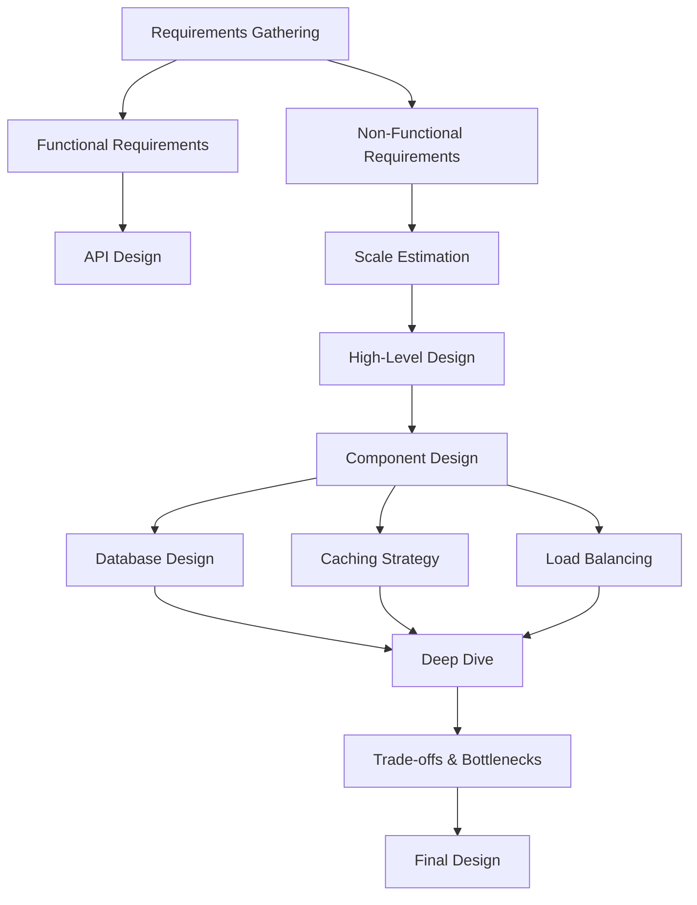
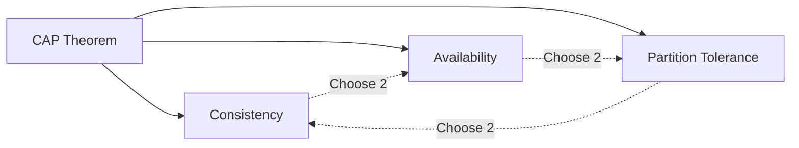
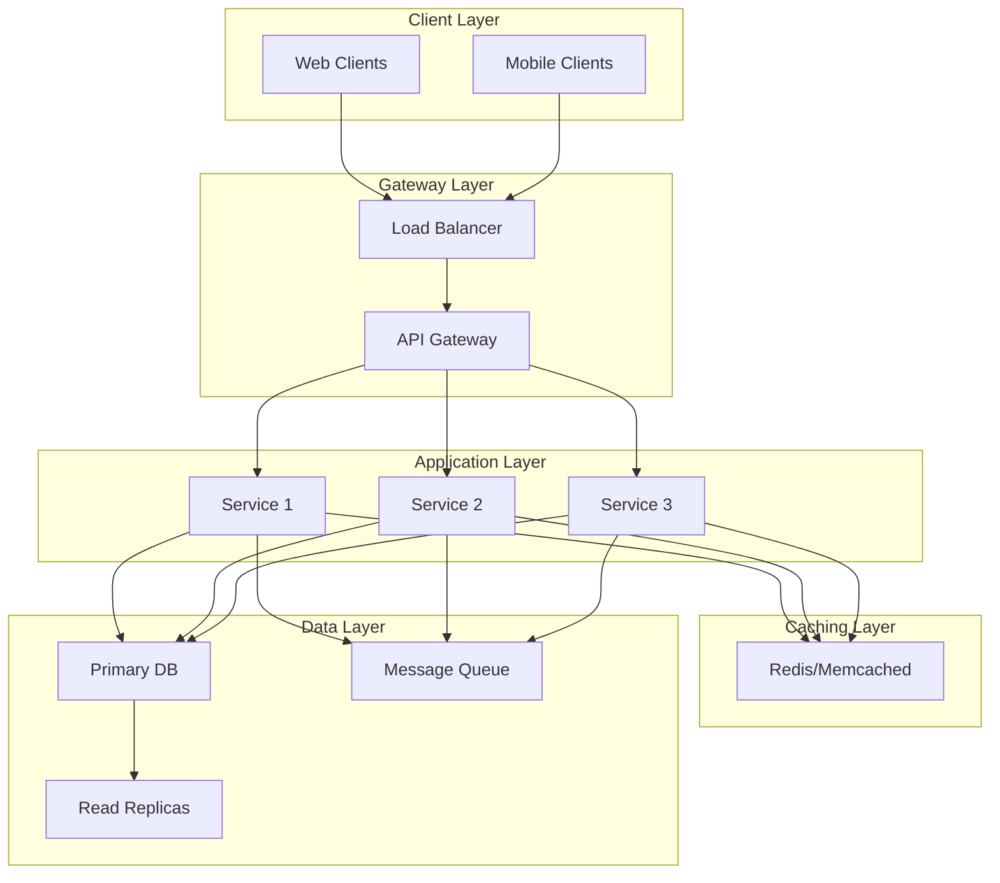

# System Design Guide

A comprehensive guide to system design concepts, patterns, and best practices for building scalable, secure, and maintainable distributed systems.

## 📚 Table of Contents

- [Overview](#overview)
- [Repository Structure](#repository-structure)
- [Core Topics](#core-topics)
- [Getting Started](#getting-started)
- [System Design Process](#system-design-process)
- [Contributing](#contributing)
- [License](#license)

## Overview

This repository serves as a complete reference for system design, covering everything from fundamental concepts to advanced patterns and real-world case studies. Whether you're preparing for system design interviews or architecting production systems, this guide provides practical insights and battle-tested approaches.

## Repository Structure

```
system_design/
├── api-gateways/          # API Gateway patterns and implementations
├── caching/               # Caching strategies and architectures
├── case-studies/          # Real-world system design examples
├── databases/             # Database design and scaling
├── infrastructure/        # Infrastructure and deployment
├── interviews/            # Interview preparation guides
├── microservices/         # Microservices architecture
├── scalability/           # Scaling strategies and patterns
├── security/              # Security best practices
└── frontend_system_design_overview.md
```

## Core Topics

### 🚪 [API Gateways](./api-gateways/)

Learn about API Gateway patterns, routing, security, and scaling strategies.

**Key Topics:**
- Architecture patterns
- Routing strategies
- Security implementations
- Caching at gateway level
- Monitoring and observability
- Scaling techniques
- Pros and cons analysis

### 💾 [Caching](./caching/)

Master caching strategies to improve performance and reduce latency.

**Key Topics:**
- Caching strategies (Cache-aside, Write-through, Write-back)
- Architecture patterns
- Cache invalidation
- Distributed caching
- Setup and configuration

### 🗄️ [Databases](./databases/)

Deep dive into database design, selection, and optimization.

**Key Topics:**
- SQL vs NoSQL
- Sharding and partitioning
- Replication strategies
- CAP theorem
- Database scaling

### 📈 [Scalability](./scalability/)

Comprehensive guide to building scalable systems.

**Key Topics:**
- [Horizontal Scaling](./scalability/horizontal_scaling.md)
- [Vertical Scaling](./scalability/vertical_scaling.md)
- [Load Balancing](./scalability/load_balancing.md)
- [Auto Scaling](./scalability/auto_scaling.md)
- [Database Scaling](./scalability/database_scaling.md)
- [Caching Strategies](./scalability/caching_strategies.md)
- [Message Queues](./scalability/message_queues.md)
- [Eventual Consistency](./scalability/eventual_consistency.md)
- [Cost Scaling](./scalability/cost_scaling.md)
- [Best Practices](./scalability/best_practises.md)

### 🔒 [Security](./security/)

Essential security patterns and practices for distributed systems.

**Key Topics:**
- [Authentication](./security/authentication.md)
- [Authorization](./security/authorization.md)
- [Encryption](./security/encryption.md)
- [Network Security](./security/network_security.md)
- [Application Security](./security/application_security.md)
- [Data Security](./security/data_security.md)
- [Compliance](./security/compliance.md)
- [Monitoring & Auditing](./security/monitoring_auditing.md)
- [Best Practices](./security/best_practises.md)
- [Case Studies](./security/case-studies/)

### 🎯 [Interviews](./interviews/)

Prepare for system design interviews with structured frameworks and practice questions.

**Key Topics:**
- Interview process framework
- Estimation techniques
- Trade-offs and decisions
- Practice questions
- Engineer interview guide

### 🔧 [Microservices](./microservices/)

Patterns and practices for microservices architecture.

**Key Topics:**
- Service decomposition
- Inter-service communication
- Service discovery
- API design
- Data management

### 🌐 [Frontend System Design](./frontend_system_design_overview.md)

System design principles for frontend applications.

## Getting Started

### For Interview Preparation

1. Start with the [Interview Guide](./interviews/README.md)
2. Review the [Interview Process Framework](./interviews/docs/interview-process-framework/)
3. Practice with [Estimation Techniques](./interviews/docs/estimation-techniques/)
4. Work through [Practice Questions](./interviews/docs/practise-questions/)

### For Learning System Design

1. Understand [Scalability Fundamentals](./scalability/)
2. Learn [Caching Strategies](./caching/)
3. Study [Database Design](./databases/)
4. Explore [Security Best Practices](./security/)
5. Review [Real-world Case Studies](./case-studies/)

### For Building Systems

1. Review [Architecture Patterns](./api-gateways/docs/architecture.md)
2. Implement [Security Best Practices](./security/best_practises.md)
3. Apply [Scalability Patterns](./scalability/best_practises.md)
4. Set up [Monitoring](./api-gateways/docs/monitoring.md)

## System Design Process



## Key System Design Concepts

### CAP Theorem



### Scalability Architecture



## Common System Design Patterns

### Load Balancing Strategies

- **Round Robin**: Distribute requests evenly across servers
- **Least Connections**: Route to server with fewest active connections
- **IP Hash**: Route based on client IP for session persistence
- **Weighted Round Robin**: Distribute based on server capacity

### Caching Patterns

- **Cache-Aside**: Application manages cache, load on cache miss
- **Write-Through**: Write to cache and database simultaneously
- **Write-Back**: Write to cache first, async write to database
- **Refresh-Ahead**: Proactively refresh cache before expiration

### Database Scaling Patterns

- **Replication**: Master-slave for read scaling
- **Sharding**: Horizontal partitioning for write scaling
- **Partitioning**: Logical data separation
- **Federation**: Splitting databases by function

## Best Practices

### General Principles

1. **Start Simple**: Begin with the simplest solution that meets requirements
2. **Scale Gradually**: Add complexity only when needed
3. **Measure Everything**: Monitor and measure before optimizing
4. **Plan for Failure**: Design for resilience and fault tolerance
5. **Security First**: Build security into every layer

### Design Checklist

- [ ] Define clear functional requirements
- [ ] Estimate scale (users, requests, data)
- [ ] Identify bottlenecks
- [ ] Plan for high availability
- [ ] Implement security measures
- [ ] Design for observability
- [ ] Consider cost implications
- [ ] Document trade-offs

## Study Path

### Week 1-2: Fundamentals
- Scalability basics
- Load balancing
- Caching fundamentals
- Database basics

### Week 3-4: Advanced Topics
- Microservices architecture
- Message queues
- Distributed systems
- CAP theorem

### Week 5-6: Security & Operations
- Authentication/Authorization
- Encryption
- Monitoring
- Incident response

### Week 7-8: Practice
- Work through case studies
- Practice interview questions
- Design systems end-to-end
- Review trade-offs

## Resources

### Internal Documentation
- [API Gateway Documentation](./api-gateways/README.md)
- [Caching Guide](./caching/README.md)
- [Scalability Guide](./scalability/README.md)
- [Security Guide](./security/README.md)
- [Interview Prep](./interviews/README.md)

### Case Studies
Explore real-world examples in the [case-studies](./case-studies/) directory and [security case studies](./security/case-studies/).

### 🎥 Recommended Tutorials

| Tutorial 1 | Tutorial 2 |
|------------|------------|
| [](https://youtu.be/nKnbzqPFpV0?si=Kg2PI0Mly55UmS_m) | [](https://www.youtube.com/watch?v=iYIjJ7utdDI) |

| Tutorial 3 | Tutorial 4 |
|------------|------------|
| [](https://www.youtube.com/watch?v=7iHl71nt49o&t=56s) | [](https://www.youtube.com/watch?v=8telu1SoCKM&t=23296s) |

👉 Click any banner to watch the video.

## Contributing

We welcome contributions! Please follow these guidelines:

1. Fork the repository
2. Create a feature branch
3. Add or update documentation
4. Include diagrams where helpful
5. Submit a pull request

### Documentation Standards

- Use clear, concise language
- Include code examples where applicable
- Add Mermaid diagrams for visual clarity
- Reference related documents
- Keep content up-to-date

## License

See [LICENSE](./LICENSE) file for details.

---

## Quick Reference

### Common Commands

```bash
# Navigate to specific topic
cd api-gateways/
cd caching/
cd scalability/
cd security/

# View documentation
cd docs/
ls
```

### Key Metrics to Consider

- **Latency**: Response time (p50, p95, p99)
- **Throughput**: Requests per second
- **Availability**: Uptime percentage (99.9%, 99.99%)
- **Consistency**: Data consistency guarantees
- **Durability**: Data loss prevention

### Scale Estimation Quick Reference

- 1 million users ≈ 10-100 requests/second
- 1 billion users ≈ 10,000-100,000 requests/second
- 1 TB data ≈ 1-10 database servers
- 1 PB data ≈ distributed storage required

---

**Start your system design journey today!** 🚀

For questions or suggestions, please open an issue or contribute to the repository.