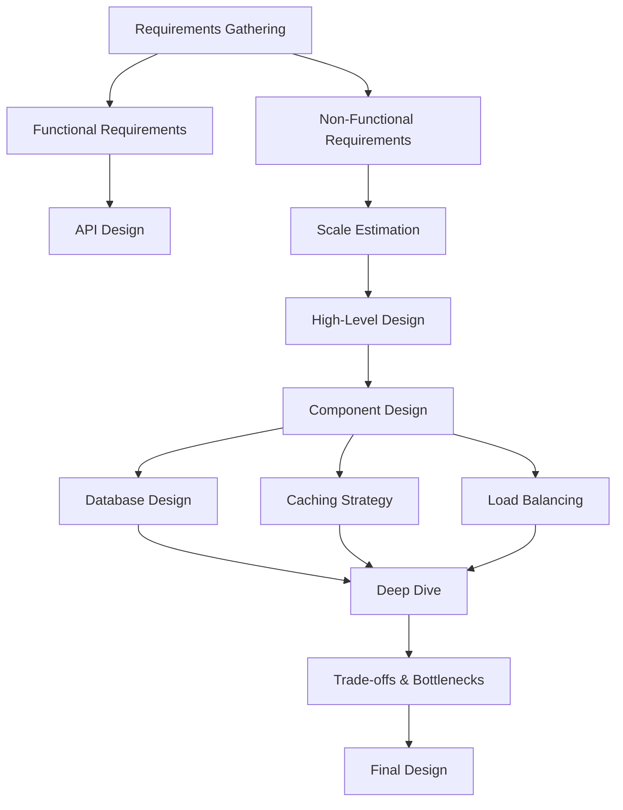
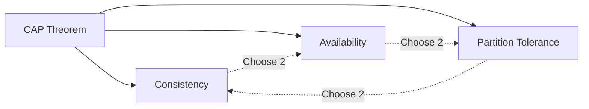
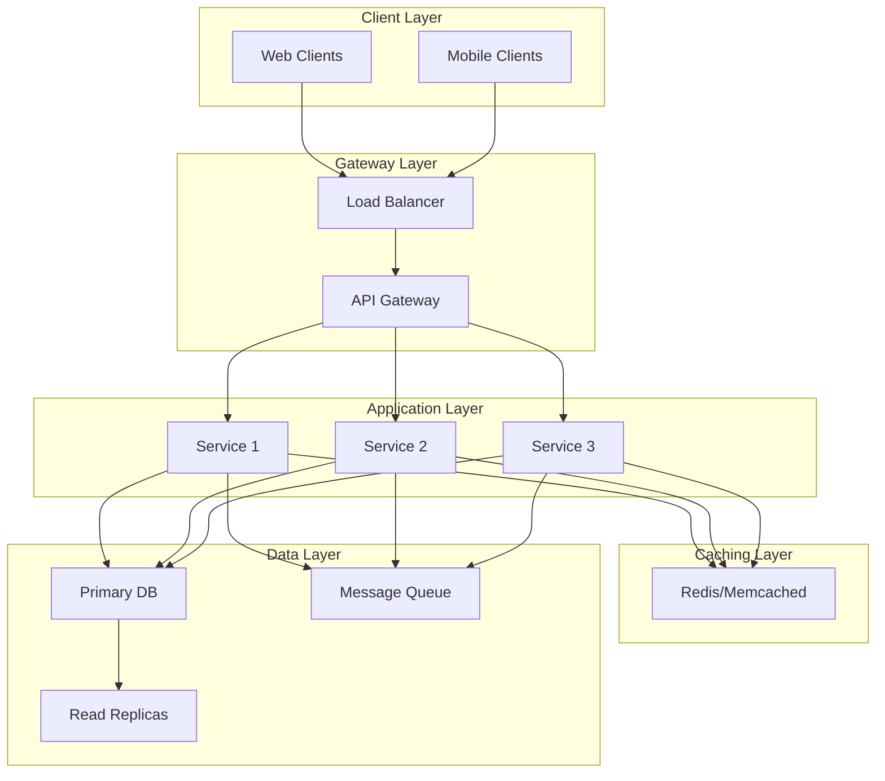

# System Design Guide

A comprehensive guide to system design concepts, patterns, and best practices for building scalable, secure, and maintainable distributed systems.

## 📚 Table of Contents

- [Overview](#overview)
- [Repository Structure](#repository-structure)
- [Core Topics](#core-topics)
- [Getting Started](#getting-started)
- [System Design Process](#system-design-process)
- [Contributing](#contributing)
- [License](#license)

## Overview

This repository serves as a complete reference for system design, covering everything from fundamental concepts to advanced patterns and real-world case studies. Whether you're preparing for system design interviews or architecting production systems, this guide provides practical insights and battle-tested approaches.

## Repository Structure

```
system_design/
├── api-gateways/          # API Gateway patterns and implementations
├── caching/               # Caching strategies and architectures
├── case-studies/          # Real-world system design examples
├── databases/             # Database design and scaling
├── infrastructure/        # Infrastructure and deployment
├── interviews/            # Interview preparation guides
├── microservices/         # Microservices architecture
├── scalability/           # Scaling strategies and patterns
├── security/              # Security best practices
└── frontend_system_design_overview.md
```

## Core Topics

### 🚪 [API Gateways](./api-gateways/)

Learn about API Gateway patterns, routing, security, and scaling strategies.

**Key Topics:**

- Architecture patterns
- Routing strategies
- Security implementations
- Caching at gateway level
- Monitoring and observability
- Scaling techniques
- Pros and cons analysis

### 💾 [Caching](./caching/)

Master caching strategies to improve performance and reduce latency.

**Key Topics:**

- Caching strategies (Cache-aside, Write-through, Write-back)
- Architecture patterns
- Cache invalidation
- Distributed caching
- Setup and configuration

### 🗄️ [Databases](./databases/)

Deep dive into database design, selection, and optimization.

**Key Topics:**

- SQL vs NoSQL
- Sharding and partitioning
- Replication strategies
- CAP theorem
- Database scaling

### 📈 [Scalability](./scalability/)

Comprehensive guide to building scalable systems.

**Key Topics:**

- [Horizontal Scaling](./scalability/horizontal_scaling.md)
- [Vertical Scaling](./scalability/vertical_scaling.md)
- [Load Balancing](./scalability/load_balancing.md)
- [Auto Scaling](./scalability/auto_scaling.md)
- [Database Scaling](./scalability/database_scaling.md)
- [Caching Strategies](./scalability/caching_strategies.md)
- [Message Queues](./scalability/message_queues.md)
- [Eventual Consistency](./scalability/eventual_consistency.md)
- [Cost Scaling](./scalability/cost_scaling.md)
- [Best Practices](./scalability/best_practises.md)

### 🔒 [Security](./security/)

Essential security patterns and practices for distributed systems.

**Key Topics:**

- [Authentication](./security/authentication.md)
- [Authorization](./security/authorization.md)
- [Encryption](./security/encryption.md)
- [Network Security](./security/network_security.md)
- [Application Security](./security/application_security.md)
- [Data Security](./security/data_security.md)
- [Compliance](./security/compliance.md)
- [Monitoring & Auditing](./security/monitoring_auditing.md)
- [Best Practices](./security/best_practises.md)
- [Case Studies](./security/case-studies/)

### 🎯 [Interviews](./interviews/)

Prepare for system design interviews with structured frameworks and practice questions.

**Key Topics:**

- Interview process framework
- Estimation techniques
- Trade-offs and decisions
- Practice questions
- Engineer interview guide

### 🔧 [Microservices](./microservices/)

Patterns and practices for microservices architecture.

**Key Topics:**

- Service decomposition
- Inter-service communication
- Service discovery
- API design
- Data management

### 🌐 [Frontend System Design](./frontend_system_design_overview.md)

System design principles for frontend applications.

## Getting Started

### For Interview Preparation

1. Start with the [Interview Guide](./interviews/README.md)
2. Review the [Interview Process Framework](./interviews/docs/interview-process-framework/)
3. Practice with [Estimation Techniques](./interviews/docs/estimation-techniques/)
4. Work through [Practice Questions](./interviews/docs/practise-questions/)

### For Learning System Design

1. Understand [Scalability Fundamentals](./scalability/)
2. Learn [Caching Strategies](./caching/)
3. Study [Database Design](./databases/)
4. Explore [Security Best Practices](./security/)
5. Review [Real-world Case Studies](./case-studies/)

### For Building Systems

1. Review [Architecture Patterns](./api-gateways/docs/architecture.md)
2. Implement [Security Best Practices](./security/best_practises.md)
3. Apply [Scalability Patterns](./scalability/best_practises.md)
4. Set up [Monitoring](./api-gateways/docs/monitoring.md)

## System Design Process



## System Design Roadmap

```mermaid
%%{init: {'theme':'base', 'themeVariables': { 'fontSize':'18px', 'fontFamily':'arial'}}}%%
graph TD
    Start([START YOUR JOURNEY]) --> Phase1[PHASE 1: FOUNDATIONS<br/><b>Weeks 1-2</b>]

    Phase1 --> Week1{<b>WEEK 1</b>}
    Week1 --> Arch[<b>Architecture Patterns</b><br/>Monolithic, Microservices,<br/>Event-Driven, CQRS]
    Week1 --> DB1[<b>Database Basics</b><br/>SQL vs NoSQL<br/>CAP Theorem]

    Arch --> Week2{<b>WEEK 2</b>}
    DB1 --> Week2
    Week2 --> API[<b>API Gateways</b><br/>Routing, Rate Limiting,<br/>Auth/AuthZ]
    Week2 --> Cache1[<b>Caching Fundamentals</b><br/>Strategies, Invalidation,<br/>CDN]

    API --> Phase2[PHASE 2: SCALING<br/><b>Weeks 3-4</b>]
    Cache1 --> Phase2

    Phase2 --> Week3{<b>WEEK 3</b>}
    Week3 --> Service[<b>Service Design</b><br/>Decomposition<br/>Communication<br/>Discovery]
    Week3 --> Patterns[<b>Design Patterns</b><br/>Circuit Breaker<br/>Saga Pattern]

    Service --> Week4{<b>WEEK 4</b>}
    Patterns --> Week4
    Week4 --> HV[<b>Horizontal vs<br/>Vertical Scaling</b>]
    Week4 --> LB[<b>Load Balancing</b><br/>Replication<br/>Sharding]

    HV --> Phase3[PHASE 3: OPERATIONS<br/><b>Weeks 5-6</b>]
    LB --> Phase3

    Phase3 --> Week5{<b>WEEK 5</b>}
    Week5 --> Cloud[<b>Cloud & Containers</b><br/>Docker, Kubernetes<br/>IaC]
    Week5 --> CICD[<b>CI/CD Pipelines</b><br/>Deployment Strategies<br/>Blue-Green, Canary]

    Cloud --> Week6{<b>WEEK 6</b>}
    CICD --> Week6
    Week6 --> Observe[<b>Observability</b><br/>Logging, Metrics<br/>Tracing, Alerting]
    Week6 --> Sec[<b>Security</b><br/>Auth, Encryption<br/>OWASP, DDoS]

    Observe --> Phase4[PHASE 4: REAL-WORLD<br/><b>Weeks 7-8</b>]
    Sec --> Phase4

    Phase4 --> Week7{<b>WEEK 7</b>}
    Week7 --> URL[<b>URL Shortener</b>]
    Week7 --> Social[<b>Social Media Feed</b>]
    Week7 --> Video[<b>Video Streaming</b>]

    URL --> Week8{<b>WEEK 8</b>}
    Social --> Week8
    Video --> Week8
    Week8 --> Ride[<b>Ride Sharing</b>]
    Week8 --> Chat[<b>Chat Application</b>]
    Week8 --> Ecomm[<b>E-commerce Platform</b>]

    Ride --> Phase5[PHASE 5: MASTERY<br/><b>Weeks 9-12</b>]
    Chat --> Phase5
    Ecomm --> Phase5

    Phase5 --> Week910{<b>WEEKS 9-10</b>}
    Week910 --> Frontend[<b>Frontend System Design</b><br/>State Management<br/>Performance]
    Week910 --> Questions[<b>Practice Problems</b><br/>Whiteboarding<br/>Time Management]

    Frontend --> Week1112{<b>WEEKS 11-12</b>}
    Questions --> Week1112
    Week1112 --> Self[<b>Self-Practice</b><br/>2-3 Designs/Week]
    Week1112 --> Peer[<b>Peer Review</b><br/>Feedback Loop]

    Self --> Master([SYSTEM DESIGN MASTER!])
    Peer --> Master

```



## Key System Design Concepts

### CAP Theorem



### Scalability Architecture



## Common System Design Patterns

### Load Balancing Strategies

- **Round Robin**: Distribute requests evenly across servers
- **Least Connections**: Route to server with fewest active connections
- **IP Hash**: Route based on client IP for session persistence
- **Weighted Round Robin**: Distribute based on server capacity

### Caching Patterns

- **Cache-Aside**: Application manages cache, load on cache miss
- **Write-Through**: Write to cache and database simultaneously
- **Write-Back**: Write to cache first, async write to database
- **Refresh-Ahead**: Proactively refresh cache before expiration

### Database Scaling Patterns

- **Replication**: Master-slave for read scaling
- **Sharding**: Horizontal partitioning for write scaling
- **Partitioning**: Logical data separation
- **Federation**: Splitting databases by function

## Best Practices

### General Principles

1. **Start Simple**: Begin with the simplest solution that meets requirements
2. **Scale Gradually**: Add complexity only when needed
3. **Measure Everything**: Monitor and measure before optimizing
4. **Plan for Failure**: Design for resilience and fault tolerance
5. **Security First**: Build security into every layer

### Design Checklist

- [ ] Define clear functional requirements
- [ ] Estimate scale (users, requests, data)
- [ ] Identify bottlenecks
- [ ] Plan for high availability
- [ ] Implement security measures
- [ ] Design for observability
- [ ] Consider cost implications
- [ ] Document trade-offs

## Study Path

### Week 1-2: Fundamentals

- Scalability basics
- Load balancing
- Caching fundamentals
- Database basics

### Week 3-4: Advanced Topics

- Microservices architecture
- Message queues
- Distributed systems
- CAP theorem

### Week 5-6: Security & Operations

- Authentication/Authorization
- Encryption
- Monitoring
- Incident response

### Week 7-8: Practice

- Work through case studies
- Practice interview questions
- Design systems end-to-end
- Review trade-offs

## Resources

### Internal Documentation

- [API Gateway Documentation](./api-gateways/README.md)
- [Caching Guide](./caching/README.md)
- [Scalability Guide](./scalability/README.md)
- [Security Guide](./security/README.md)
- [Interview Prep](./interviews/README.md)

### Case Studies

Explore real-world examples in the [case-studies](./case-studies/) directory and [security case studies](./security/case-studies/).

### 🎥 Recommended Tutorials

| Tutorial 1                                                                                                   | Tutorial 2                                                                                              |
| ------------------------------------------------------------------------------------------------------------ | ------------------------------------------------------------------------------------------------------- |
| [](https://youtu.be/nKnbzqPFpV0?si=Kg2PI0Mly55UmS_m) | [](https://www.youtube.com/watch?v=iYIjJ7utdDI) |

| Tutorial 3                                                                                                    | Tutorial 4                                                                                                       |
| ------------------------------------------------------------------------------------------------------------- | ---------------------------------------------------------------------------------------------------------------- |
| [](https://www.youtube.com/watch?v=7iHl71nt49o&t=56s) | [](https://www.youtube.com/watch?v=8telu1SoCKM&t=23296s) |

👉 Click any banner to watch the video.

# System Design Study Guide

A comprehensive roadmap to master the contents of this system design repository.

## 📚 Study Plan Overview

This guide is structured to take you from fundamentals to advanced concepts over 8-12 weeks, with flexibility for your pace.

---

## Phase 1: Foundations (Weeks 1-2)

### Week 1: Core Concepts

**Goal**: Understand basic building blocks of distributed systems

1. **Start with README.md**

   - Understand the repository structure
   - Get familiar with the learning objectives

2. **Architecture Patterns** (`architecture-patterns/`)

   - Monolithic vs Microservices
   - Layered Architecture
   - Event-Driven Architecture
   - CQRS (Command Query Responsibility Segregation)
   - Hexagonal Architecture

   **Practice**: Draw diagrams for each pattern, identify use cases

3. **Databases** (`databases/`)

   - SQL vs NoSQL fundamentals
   - CAP theorem
   - Database indexing
   - Sharding and partitioning strategies

   **Practice**: Design a simple database schema for a blog application

### Week 2: Communication & Storage

1. **API Gateways** (`api-gateways/`)
   - API Gateway patterns
   - Rate limiting
   - Authentication/Authorization
   - Request routing
2. **Caching** (`caching/`)

   - Cache strategies (LRU, LFU, TTL)
   - Cache invalidation
   - CDN concepts
   - Redis and Memcached

   **Practice**: Design a caching strategy for a social media feed

---

## Phase 2: Scaling & Distribution (Weeks 3-4)

### Week 3: Microservices Deep Dive

**Goal**: Master distributed system communication

1. **Microservices** (`microservices/`)

   - Service decomposition
   - Inter-service communication (REST, gRPC, Message queues)
   - Service discovery
   - Circuit breaker pattern
   - Saga pattern for distributed transactions

   **Practice**: Break down a monolithic e-commerce app into microservices

### Week 4: Scalability Techniques

1. **Scalability** (`scalability/`)

   - Horizontal vs Vertical scaling
   - Load balancing strategies
   - Database replication
   - Read/Write splitting
   - Consistent hashing

   **Practice**: Design a scalability strategy for handling 10M+ users

---

## Phase 3: Operations & Reliability (Weeks 5-6)

### Week 5: Infrastructure & Deployment

1. **Infrastructure** (`infrastructure/`)
   - Cloud computing concepts (AWS, GCP, Azure)
   - Containerization (Docker)
   - Orchestration (Kubernetes)
   - Infrastructure as Code
2. **DevOps & Deployment** (`devops-deployment/`)

   - CI/CD pipelines
   - Blue-green deployments
   - Canary releases
   - Rolling updates

   **Practice**: Design a CI/CD pipeline for a microservices application

### Week 6: Monitoring & Security

1. **Observability** (`observability/`)
   - Logging strategies
   - Metrics and monitoring (Prometheus, Grafana)
   - Distributed tracing
   - Alerting best practices
2. **Security** (`security/`)

   - Authentication mechanisms (OAuth, JWT)
   - Authorization (RBAC, ABAC)
   - Encryption (at rest, in transit)
   - Common vulnerabilities (OWASP Top 10)
   - DDoS protection

   **Practice**: Design a security architecture for a banking application

---

## Phase 4: Real-World Applications (Weeks 7-8)

### Week 7-8: Case Studies

**Goal**: Apply knowledge to real systems

1. **Case Studies** (`case-studies/`)

   - Study each case thoroughly
   - Common systems to expect:
     - URL Shortener (like bit.ly)
     - Social Media Feed (like Twitter/Instagram)
     - Video Streaming (like YouTube/Netflix)
     - Ride-sharing (like Uber)
     - Chat Application (like WhatsApp)
     - E-commerce (like Amazon)

   **For each case study**:

   - Identify functional requirements
   - Define non-functional requirements
   - Calculate capacity estimates
   - Design high-level architecture
   - Detail each component
   - Discuss trade-offs

---

## Phase 5: Interview Preparation (Weeks 9-12)

### Week 9-10: Interview Practice

1. **Interviews** (`interviews/`)
   - Review common interview questions
   - Practice whiteboarding
   - Time yourself (45-60 minutes per design)
2. **Frontend System Design** (`frontend_system_design_overview.md`)
   - Client-side architecture
   - State management
   - Performance optimization
   - Progressive Web Apps

### Week 11-12: Mock Interviews

1. **Self-Practice**:
   - Design 2-3 systems per week from scratch
   - Record yourself explaining designs
   - Review and improve
2. **Peer Review**:
   - Practice with friends or online communities
   - Get feedback on your designs
   - Discuss trade-offs

---

## 📋 Daily Study Routine

### Recommended Schedule (2-3 hours/day)

**Option 1: Deep Focus (2 hours)**

- 45 min: Read new topic
- 45 min: Practice/hands-on
- 30 min: Review and note-taking

**Option 2: Balanced (3 hours)**

- 1 hour: Study new material
- 1 hour: Practice design problems
- 1 hour: Review previous topics + case studies

---

## 🎯 Key Principles to Remember

### The Design Process

1. **Clarify Requirements** (5 min)

   - Functional requirements
   - Non-functional requirements
   - Constraints and assumptions

2. **Back-of-Envelope Calculations** (5 min)

   - Traffic estimates
   - Storage estimates
   - Bandwidth requirements

3. **High-Level Design** (10-15 min)

   - Major components
   - Data flow
   - APIs

4. **Deep Dive** (15-20 min)

   - Database schema
   - Scalability considerations
   - Trade-offs

5. **Wrap Up** (5 min)
   - Bottlenecks
   - Monitoring
   - Future improvements

---

## 🛠️ Hands-On Projects

Build these to reinforce learning:

1. **Week 2**: Simple REST API with caching
2. **Week 4**: Microservices app with load balancer
3. **Week 6**: Add monitoring and logging to existing project
4. **Week 8**: Build a URL shortener end-to-end
5. **Week 10**: Design and implement a rate limiter

---

## 📖 Additional Resources

### Must-Read Books

- "Designing Data-Intensive Applications" by Martin Kleppmann
- "System Design Interview" by Alex Xu
- "Building Microservices" by Sam Newman

### Online Practice

- LeetCode System Design
- Pramp
- interviewing.io
- System Design Primer (GitHub)

### YouTube Channels

- Gaurav Sen
- Tech Dummies Narendra L
- ByteByteGo
- Hussein Nasser

---

## ✅ Weekly Checkpoints

Track your progress:

- [ ] Week 1: Can explain 5 architecture patterns
- [ ] Week 2: Designed a caching strategy
- [ ] Week 3: Broke down a monolith into microservices
- [ ] Week 4: Calculated capacity for 10M users
- [ ] Week 5: Designed a CI/CD pipeline
- [ ] Week 6: Created security architecture
- [ ] Week 7: Completed 3 case studies
- [ ] Week 8: Completed 3 more case studies
- [ ] Week 9: Practiced 5 interview questions
- [ ] Week 10: Studied frontend system design
- [ ] Week 11: Completed 5 mock interviews
- [ ] Week 12: Can design any system confidently

---

## 💡 Pro Tips

1. **Don't memorize, understand**: Focus on trade-offs and why decisions are made
2. **Think out loud**: Practice explaining your thought process
3. **Draw diagrams**: Visualize everything
4. **Ask questions**: In interviews, clarify before designing
5. **Be pragmatic**: No solution is perfect; discuss trade-offs
6. **Stay updated**: Follow engineering blogs (Netflix, Uber, Airbnb)
7. **Build things**: Theory + Practice = Mastery

---

## 🚀 Good Luck!

Remember: System design is a journey, not a destination. The goal isn't to memorize solutions but to develop the ability to think through problems systematically and make informed trade-offs.

Start today, stay consistent, and you'll master this!

## Contributing

We welcome contributions! Please follow these guidelines:

1. Fork the repository
2. Create a feature branch
3. Add or update documentation
4. Include diagrams where helpful
5. Submit a pull request

### Documentation Standards

- Use clear, concise language
- Include code examples where applicable
- Add Mermaid diagrams for visual clarity
- Reference related documents
- Keep content up-to-date

## License

See [LICENSE](./LICENSE) file for details.

---

## Quick Reference

### Common Commands

```bash
# Navigate to specific topic
cd api-gateways/
cd caching/
cd scalability/
cd security/

# View documentation
cd docs/
ls
```

### Key Metrics to Consider

- **Latency**: Response time (p50, p95, p99)
- **Throughput**: Requests per second
- **Availability**: Uptime percentage (99.9%, 99.99%)
- **Consistency**: Data consistency guarantees
- **Durability**: Data loss prevention

### Scale Estimation Quick Reference

- 1 million users ≈ 10-100 requests/second
- 1 billion users ≈ 10,000-100,000 requests/second
- 1 TB data ≈ 1-10 database servers
- 1 PB data ≈ distributed storage required

---

**Start your system design journey today!** 🚀

For questions or suggestions, please open an issue or contribute to the repository.
