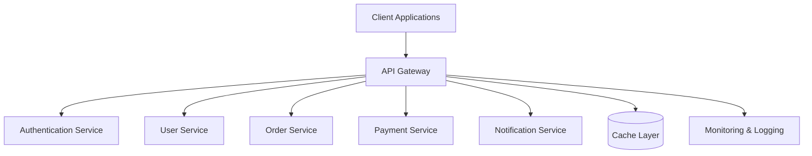
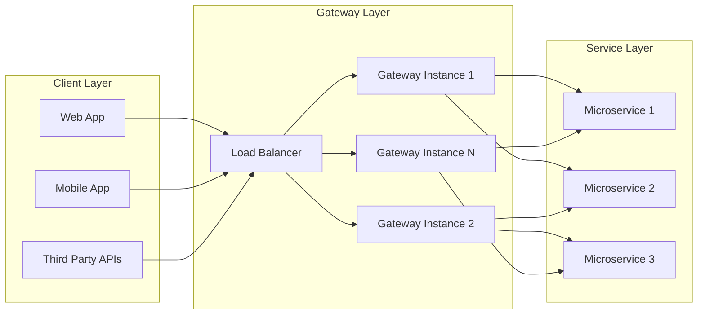
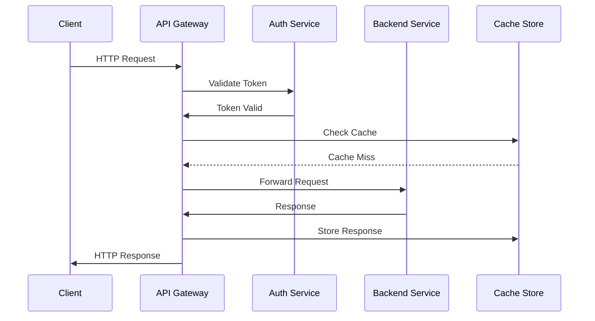
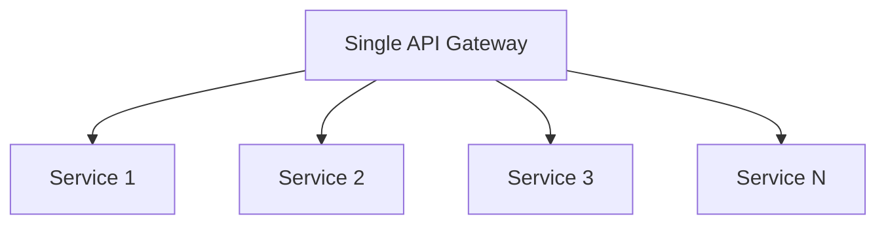
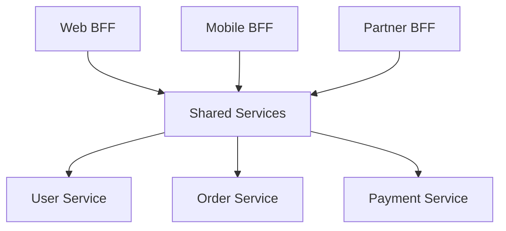
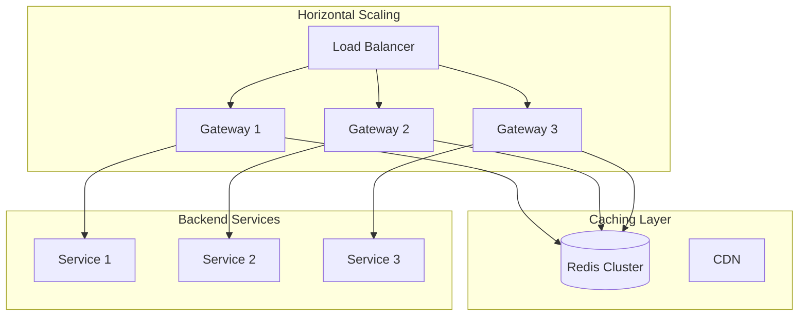
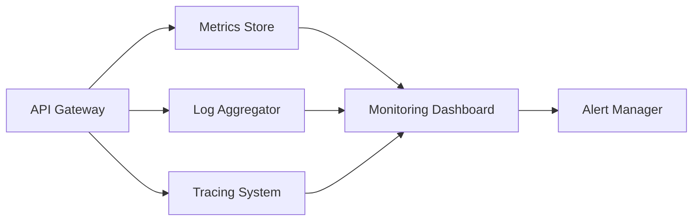

# API Gateway System Design

A comprehensive guide to understanding, implementing, and scaling API Gateways in modern distributed systems.

## 📋 Table of Contents

- [Overview](#overview)
- [System Architecture](#system-architecture)
- [Key Features](#key-features)
- [Documentation](#documentation)
- [Quick Start](#quick-start)
- [Implementation Patterns](#implementation-patterns)
- [Security Considerations](#security-considerations)
- [Performance & Scaling](#performance--scaling)
- [Monitoring & Observability](#monitoring--observability)
- [Contributing](#contributing)

## Overview

An API Gateway serves as a single entry point for all client requests in a microservices architecture. It acts as a reverse proxy that routes requests to appropriate backend services while providing cross-cutting concerns like authentication, rate limiting, monitoring, and request/response transformation.



## System Architecture

The API Gateway implements a layered architecture that provides scalability, security, and maintainability. 

For detailed architectural decisions and design patterns, see:
- 📖 [Architecture Documentation](docs/architecture.md)
- 🔧 [Implementation Patterns](docs/patterns.md)



## Key Features

- **Request Routing**: Intelligent routing based on URL patterns, headers, and request attributes
- **Authentication & Authorization**: Centralized security enforcement
- **Rate Limiting**: Protection against abuse and overuse
- **Request/Response Transformation**: Data format conversion and protocol translation
- **Caching**: Performance optimization through intelligent caching strategies
- **Circuit Breaking**: Fault tolerance and resilience patterns
- **Monitoring & Analytics**: Comprehensive observability and metrics collection

## Documentation

This repository contains detailed documentation covering all aspects of API Gateway design and implementation:

### Core Concepts
- 📐 [**Architecture**](docs/architecture.md) - System design principles and architectural patterns
- ⚡ [**Routing**](docs/routing.md) - Request routing strategies and configuration
- 🔒 [**Security**](docs/security.md) - Authentication, authorization, and security best practices

### Advanced Topics  
- 🚀 [**Scaling**](docs/scaling.md) - Horizontal and vertical scaling strategies
- 💾 [**Caching**](docs/caching.md) - Caching patterns and implementation strategies
- 📊 [**Monitoring**](docs/monitoring.md) - Observability, metrics, and health checks
- 🎯 [**Patterns**](docs/patterns.md) - Common design patterns and anti-patterns

### Decision Framework
- ⚖️ [**Pros & Cons**](docs/pros-cons.md) - Trade-offs and decision criteria for API Gateway adoption

## Quick Start

### Basic Request Flow



### Configuration Example

```yaml
gateway:
  routes:
    - path: "/api/users/*"
      service: "user-service"
      methods: ["GET", "POST", "PUT", "DELETE"]
      auth_required: true
      rate_limit: 1000/hour
      
    - path: "/api/orders/*"
      service: "order-service"
      methods: ["GET", "POST"]
      auth_required: true
      cache_ttl: 300
      
  security:
    jwt_secret: "${JWT_SECRET}"
    cors_enabled: true
    
  caching:
    provider: "redis"
    default_ttl: 600
```

## Implementation Patterns

The system supports multiple implementation patterns based on your architectural needs:

### 1. Centralized Gateway Pattern


### 2. Backend for Frontend (BFF) Pattern


For detailed pattern implementations, see [patterns.md](docs/patterns.md).

## Security Considerations

Security is implemented through multiple layers:

- **Authentication**: JWT tokens, OAuth 2.0, API keys
- **Authorization**: Role-based and attribute-based access control
- **Transport Security**: TLS/SSL encryption
- **Input Validation**: Request sanitization and validation
- **Rate Limiting**: DDoS protection and abuse prevention

For comprehensive security guidelines, refer to [security.md](docs/security.md).

## Performance & Scaling

### Scaling Strategies



Key performance optimizations covered in our documentation:
- Connection pooling and keep-alive strategies ([scaling.md](docs/scaling.md))
- Intelligent caching mechanisms ([caching.md](docs/caching.md))
- Circuit breaker patterns for fault tolerance ([patterns.md](docs/patterns.md))

## Monitoring & Observability

Comprehensive monitoring includes:

- **Metrics**: Request rates, response times, error rates
- **Logging**: Structured logging with correlation IDs
- **Tracing**: Distributed tracing across services
- **Health Checks**: Service health and dependency monitoring



For implementation details, see [monitoring.md](docs/monitoring.md).

## Decision Framework

When considering API Gateway adoption, evaluate:

### ✅ Benefits
- Centralized cross-cutting concerns
- Simplified client integration
- Enhanced security posture
- Improved observability

### ⚠️ Considerations
- Additional network hop latency
- Single point of failure risk
- Increased operational complexity

For a detailed analysis, review [pros-cons.md](docs/pros-cons.md).

## Contributing

We welcome contributions! Please read through our documentation to understand the system design principles before contributing:

1. Review the [Architecture](docs/architecture.md) documentation
2. Understand our [Patterns](docs/patterns.md) and best practices
3. Follow our security guidelines in [Security](docs/security.md)
4. Ensure proper monitoring as outlined in [Monitoring](docs/monitoring.md)

## License

This project is licensed under the MIT License - see the LICENSE file for details.

---

📚 **Next Steps**: Start with the [Architecture](docs/architecture.md) documentation to understand the system design principles, then explore specific topics based on your implementation needs.