# API Gateway: Complete System Design Guide

## Table of Contents
1. [Introduction](#introduction)
2. [Core Concepts](#core-concepts)
3. [Architecture Patterns](#architecture-patterns)
4. [Key Features](#key-features)
5. [Implementation Strategies](#implementation-strategies)
6. [Popular Solutions](#popular-solutions)
7. [Design Considerations](#design-considerations)
8. [Security Implementation](#security-implementation)
9. [Performance Optimization](#performance-optimization)
10. [Monitoring and Observability](#monitoring-and-observability)
11. [Best Practices](#best-practices)
12. [Common Anti-patterns](#common-anti-patterns)

## Introduction

An **API Gateway** is a server that acts as an API front-end, receiving API requests, enforcing throttling and security policies, passing requests to the back-end service, and then passing the response back to the requester. It serves as the single entry point for all client requests in a microservices architecture.

### Why API Gateways?

In modern distributed systems, especially microservices architectures, clients need to interact with multiple services. Without an API gateway, this creates several challenges:

- **Multiple endpoints**: Clients must know about and manage connections to multiple services
- **Cross-cutting concerns**: Each service must implement authentication, logging, rate limiting independently
- **Protocol translation**: Different services might use different protocols
- **Service discovery**: Clients need to handle service location and failover

## Core Concepts

### The Gateway Pattern

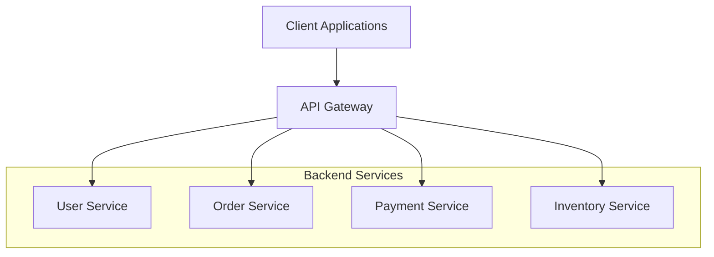
```mermaid
graph TB
    Client[Client Applications] --> Gateway[API Gateway]
    Gateway --> ServiceA[User Service]
    Gateway --> ServiceB[Order Service]
    Gateway --> ServiceC[Payment Service]
    Gateway --> ServiceD[Inventory Service]
    
    subgraph "Backend Services"
        ServiceA
        ServiceB
        ServiceC
        ServiceD
    end
```

### Request Flow Architecture

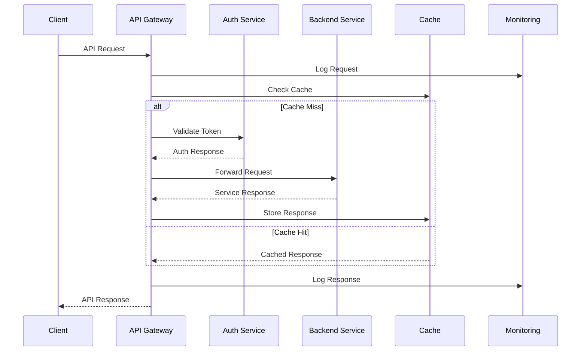
```mermaid
sequenceDiagram
    participant Client
    participant Gateway as API Gateway
    participant Auth as Auth Service
    participant Service as Backend Service
    participant Cache
    participant Monitor as Monitoring
    
    Client->>Gateway: API Request
    Gateway->>Monitor: Log Request
    Gateway->>Cache: Check Cache
    alt Cache Miss
        Gateway->>Auth: Validate Token
        Auth-->>Gateway: Auth Response
        Gateway->>Service: Forward Request
        Service-->>Gateway: Service Response
        Gateway->>Cache: Store Response
    else Cache Hit
        Cache-->>Gateway: Cached Response
    end
    Gateway->>Monitor: Log Response
    Gateway-->>Client: API Response
```

## Architecture Patterns

### 1. Single Gateway Pattern

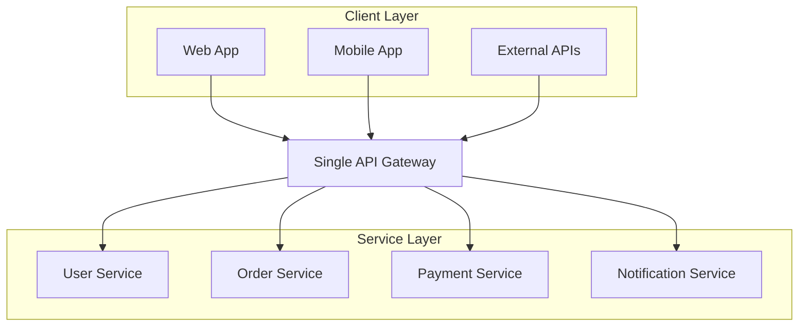
```mermaid
graph TB
    subgraph "Client Layer"
        Web[Web App]
        Mobile[Mobile App]
        API[External APIs]
    end
    
    Gateway[Single API Gateway]
    
    subgraph "Service Layer"
        UserSvc[User Service]
        OrderSvc[Order Service]
        PaymentSvc[Payment Service]
        NotificationSvc[Notification Service]
    end
    
    Web --> Gateway
    Mobile --> Gateway
    API --> Gateway
    
    Gateway --> UserSvc
    Gateway --> OrderSvc
    Gateway --> PaymentSvc
    Gateway --> NotificationSvc
```

**Pros:**
- Simple architecture
- Centralized cross-cutting concerns
- Easy to implement and maintain

**Cons:**
- Single point of failure
- Performance bottleneck
- Can become monolithic

### 2. Multiple Gateway Pattern (Backend for Frontend - BFF)

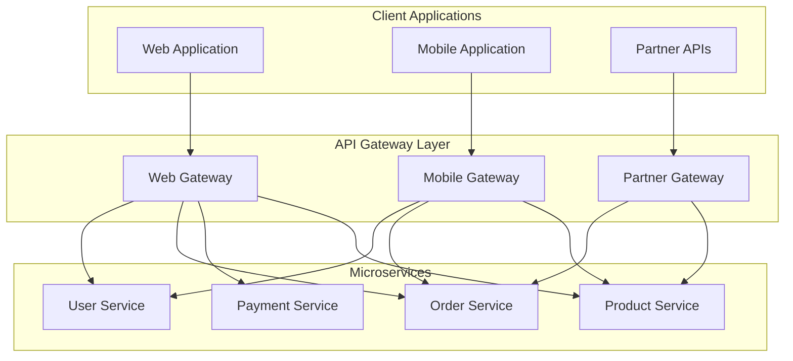
```mermaid
graph TB
    subgraph "Client Applications"
        Web[Web Application]
        Mobile[Mobile Application]
        Partner[Partner APIs]
    end
    
    subgraph "API Gateway Layer"
        WebGW[Web Gateway]
        MobileGW[Mobile Gateway]
        PartnerGW[Partner Gateway]
    end
    
    subgraph "Microservices"
        UserSvc[User Service]
        OrderSvc[Order Service]
        PaymentSvc[Payment Service]
        ProductSvc[Product Service]
    end
    
    Web --> WebGW
    Mobile --> MobileGW
    Partner --> PartnerGW
    
    WebGW --> UserSvc
    WebGW --> OrderSvc
    WebGW --> PaymentSvc
    WebGW --> ProductSvc
    
    MobileGW --> UserSvc
    MobileGW --> OrderSvc
    MobileGW --> ProductSvc
    
    PartnerGW --> OrderSvc
    PartnerGW --> ProductSvc
```

**Benefits:**
- Optimized for specific client needs
- Independent scaling and deployment
- Reduced coupling between clients and services

### 3. Layered Gateway Pattern

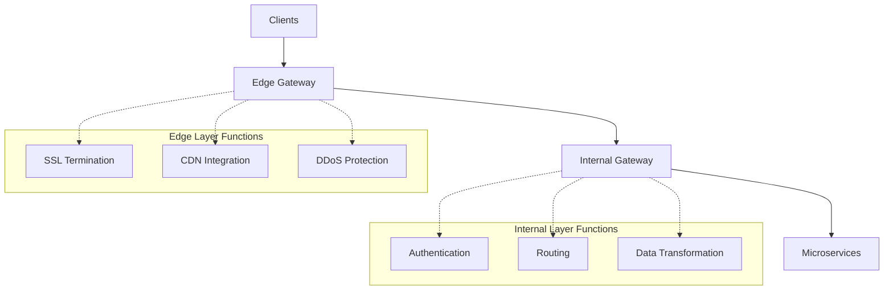
```mermaid
graph TB
    Client[Clients] --> EdgeGW[Edge Gateway]
    EdgeGW --> InternalGW[Internal Gateway]
    
    subgraph "Edge Layer Functions"
        SSL[SSL Termination]
        CDN[CDN Integration]
        DDoS[DDoS Protection]
    end
    
    subgraph "Internal Layer Functions"
        Auth[Authentication]
        Route[Routing]
        Transform[Data Transformation]
    end
    
    EdgeGW -.-> SSL
    EdgeGW -.-> CDN
    EdgeGW -.-> DDoS
    
    InternalGW -.-> Auth
    InternalGW -.-> Route
    InternalGW -.-> Transform
    
    InternalGW --> Services[Microservices]
```

## Key Features

### 1. Request Routing and Load Balancing

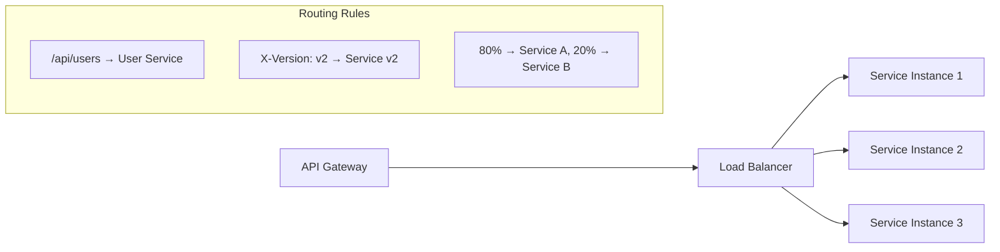
```mermaid
graph LR
    Gateway[API Gateway] --> LB[Load Balancer]
    LB --> Service1[Service Instance 1]
    LB --> Service2[Service Instance 2]
    LB --> Service3[Service Instance 3]
    
    subgraph "Routing Rules"
        PathRoute["/api/users → User Service"]
        HeaderRoute["X-Version: v2 → Service v2"]
        WeightRoute["80% → Service A, 20% → Service B"]
    end
```

### 2. Authentication and Authorization Flow

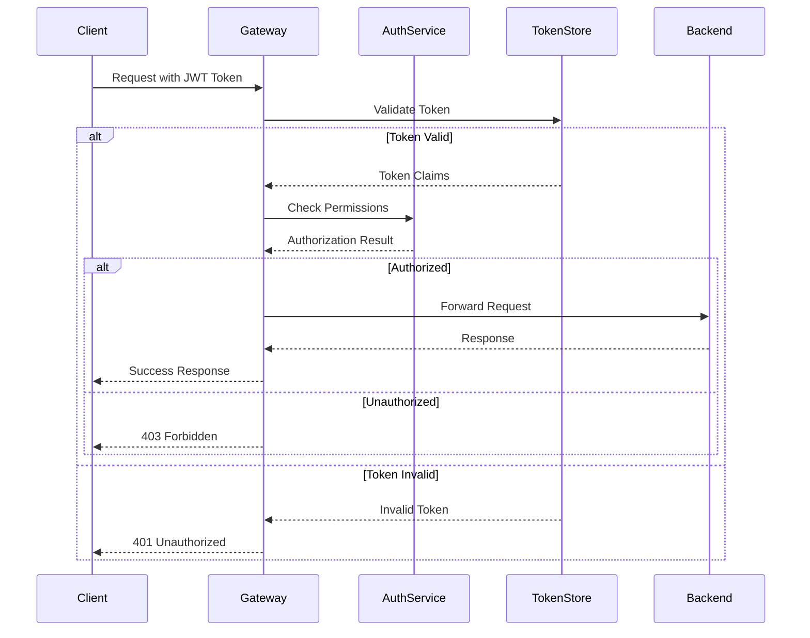
```mermaid
sequenceDiagram
    participant Client
    participant Gateway
    participant AuthService
    participant TokenStore
    participant Backend
    
    Client->>Gateway: Request with JWT Token
    Gateway->>TokenStore: Validate Token
    alt Token Valid
        TokenStore-->>Gateway: Token Claims
        Gateway->>AuthService: Check Permissions
        AuthService-->>Gateway: Authorization Result
        alt Authorized
            Gateway->>Backend: Forward Request
            Backend-->>Gateway: Response
            Gateway-->>Client: Success Response
        else Unauthorized
            Gateway-->>Client: 403 Forbidden
        end
    else Token Invalid
        TokenStore-->>Gateway: Invalid Token
        Gateway-->>Client: 401 Unauthorized
    end
```

### 3. Rate Limiting Strategies

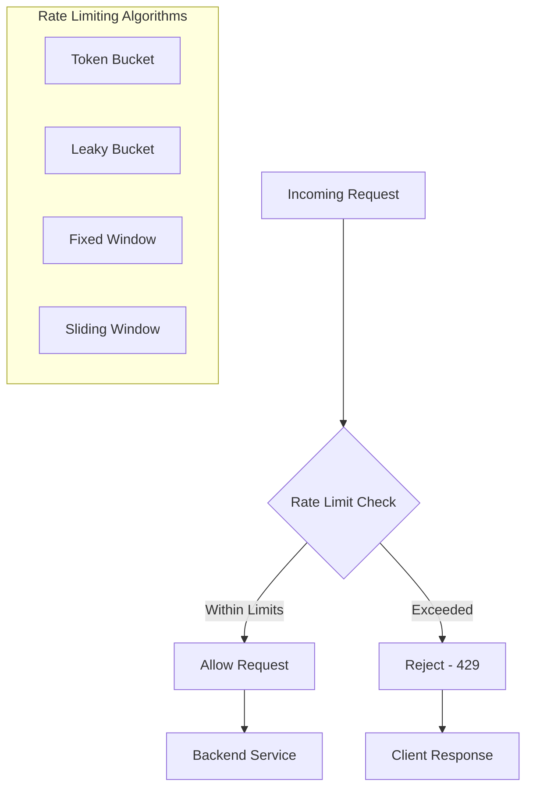
```mermaid
graph TB
    Request[Incoming Request] --> RateLimit{Rate Limit Check}
    
    subgraph "Rate Limiting Algorithms"
        TokenBucket[Token Bucket]
        LeakyBucket[Leaky Bucket]
        FixedWindow[Fixed Window]
        SlidingWindow[Sliding Window]
    end
    
    RateLimit -->|Within Limits| Allow[Allow Request]
    RateLimit -->|Exceeded| Reject[Reject - 429]
    
    Allow --> Backend[Backend Service]
    Reject --> Client[Client Response]
```

### 4. Circuit Breaker Pattern

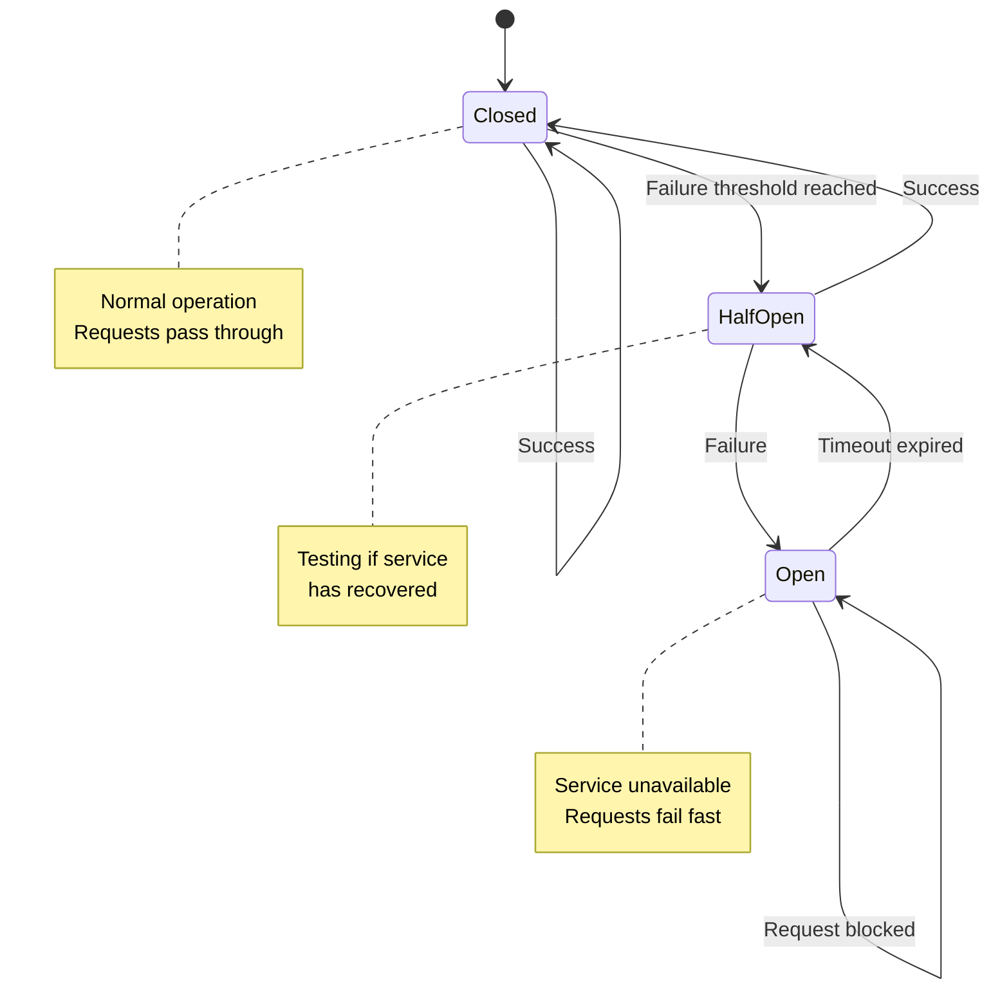
```mermaid
stateDiagram-v2
    [*] --> Closed
    Closed --> HalfOpen : Failure threshold reached
    Closed --> Closed : Success
    HalfOpen --> Closed : Success
    HalfOpen --> Open : Failure
    Open --> HalfOpen : Timeout expired
    Open --> Open : Request blocked
    
    note right of Closed
        Normal operation
        Requests pass through
    end note
    
    note right of Open
        Service unavailable
        Requests fail fast
    end note
    
    note right of HalfOpen
        Testing if service
        has recovered
    end note
```

## Implementation Strategies

### 1. Technology Stack Considerations

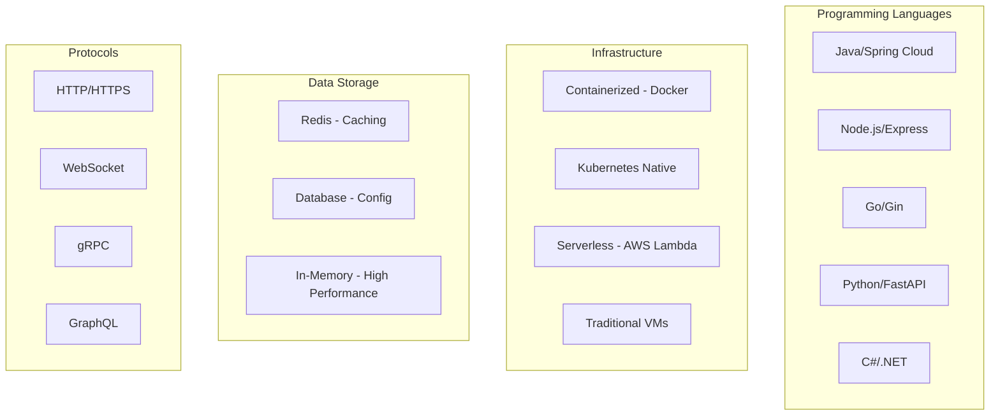
```mermaid
graph TB
    subgraph "Programming Languages"
        Java[Java/Spring Cloud]
        NodeJS[Node.js/Express]
        Go[Go/Gin]
        Python[Python/FastAPI]
        CSharp[C#/.NET]
    end
    
    subgraph "Infrastructure"
        Container[Containerized - Docker]
        K8s[Kubernetes Native]
        Serverless[Serverless - AWS Lambda]
        VM[Traditional VMs]
    end
    
    subgraph "Data Storage"
        Redis[Redis - Caching]
        Database[Database - Config]
        Memory[In-Memory - High Performance]
    end
    
    subgraph "Protocols"
        HTTP[HTTP/HTTPS]
        WebSocket[WebSocket]
        gRPC[gRPC]
        GraphQL[GraphQL]
    end
```

### 2. Deployment Patterns

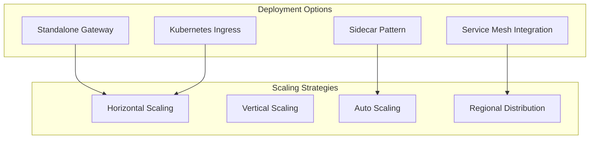
```mermaid
graph TB
    subgraph "Deployment Options"
        Standalone[Standalone Gateway]
        Sidecar[Sidecar Pattern]
        ServiceMesh[Service Mesh Integration]
        Ingress[Kubernetes Ingress]
    end
    
    subgraph "Scaling Strategies"
        Horizontal[Horizontal Scaling]
        Vertical[Vertical Scaling]
        AutoScale[Auto Scaling]
        RegionalScale[Regional Distribution]
    end
    
    Standalone --> Horizontal
    Sidecar --> AutoScale
    ServiceMesh --> RegionalScale
    Ingress --> Horizontal
```

## Popular Solutions

### Open Source Solutions

| Solution | Language | Key Features | Best For |
|----------|----------|-------------|----------|
| **Kong** | Lua/OpenResty | Plugin ecosystem, Admin API | Enterprise features |
| **Zuul** | Java | Netflix ecosystem, Dynamic routing | Spring ecosystem |
| **Traefik** | Go | Auto-discovery, Let's Encrypt | Container environments |
| **Envoy** | C++ | High performance, Service mesh | High-throughput systems |
| **Ambassador** | Python | Kubernetes-native, GitOps | Cloud-native apps |

### Cloud-Managed Solutions

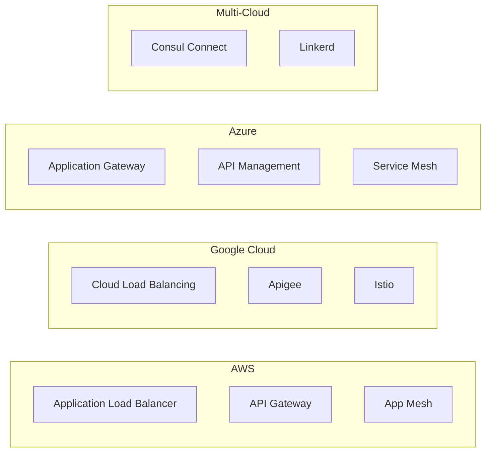
```mermaid
graph LR
    subgraph "AWS"
        ALB[Application Load Balancer]
        APIGW[API Gateway]
        AppMesh[App Mesh]
    end
    
    subgraph "Google Cloud"
        CloudLB[Cloud Load Balancing]
        Apigee[Apigee]
        Istio[Istio]
    end
    
    subgraph "Azure"
        AppGateway[Application Gateway]
        APIM[API Management]
        ServiceMesh[Service Mesh]
    end
    
    subgraph "Multi-Cloud"
        Consul[Consul Connect]
        Linkerd[Linkerd]
    end
```

## Design Considerations

### 1. Performance Architecture

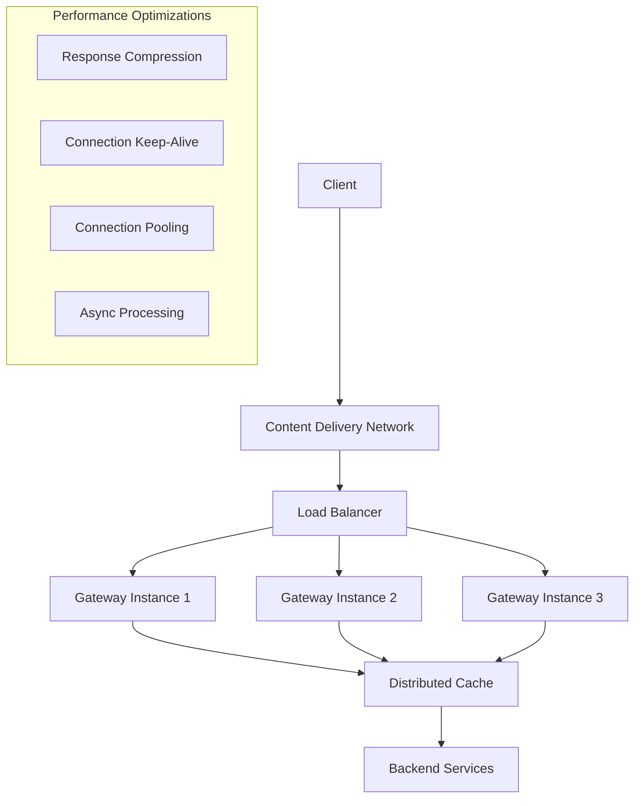
```mermaid
graph TB
    Client --> CDN[Content Delivery Network]
    CDN --> LB[Load Balancer]
    LB --> Gateway1[Gateway Instance 1]
    LB --> Gateway2[Gateway Instance 2]
    LB --> Gateway3[Gateway Instance 3]
    
    Gateway1 --> Cache[Distributed Cache]
    Gateway2 --> Cache
    Gateway3 --> Cache
    
    Cache --> Services[Backend Services]
    
    subgraph "Performance Optimizations"
        Compression[Response Compression]
        KeepAlive[Connection Keep-Alive]
        Pooling[Connection Pooling]
        Async[Async Processing]
    end
```

### 2. High Availability Setup

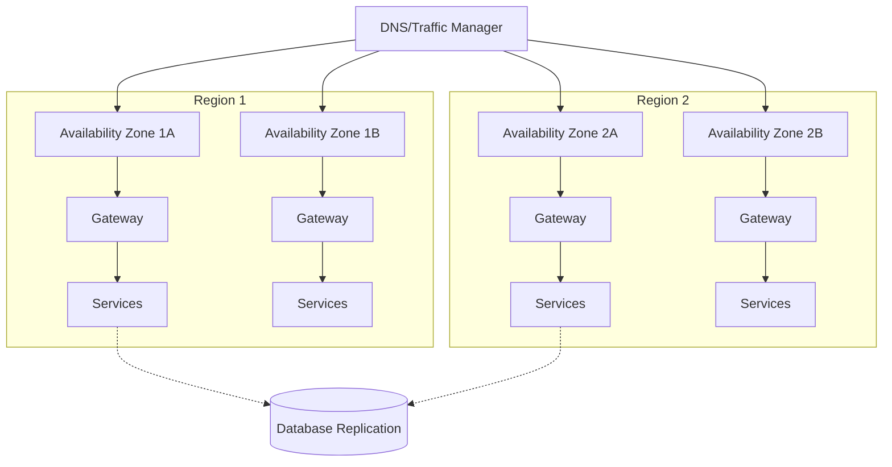
```mermaid
graph TB
    subgraph "Region 1"
        AZ1A[Availability Zone 1A]
        AZ1B[Availability Zone 1B]
        Gateway1A[Gateway] --> Services1A[Services]
        Gateway1B[Gateway] --> Services1B[Services]
        AZ1A --> Gateway1A
        AZ1B --> Gateway1B
    end
    
    subgraph "Region 2"
        AZ2A[Availability Zone 2A]
        AZ2B[Availability Zone 2B]
        Gateway2A[Gateway] --> Services2A[Services]
        Gateway2B[Gateway] --> Services2B[Services]
        AZ2A --> Gateway2A
        AZ2B --> Gateway2B
    end
    
    DNS[DNS/Traffic Manager] --> AZ1A
    DNS --> AZ1B
    DNS --> AZ2A
    DNS --> AZ2B
    
    Services1A -.-> DB[(Database Replication)]
    Services2A -.-> DB
```

## Security Implementation

### 1. Security Layers

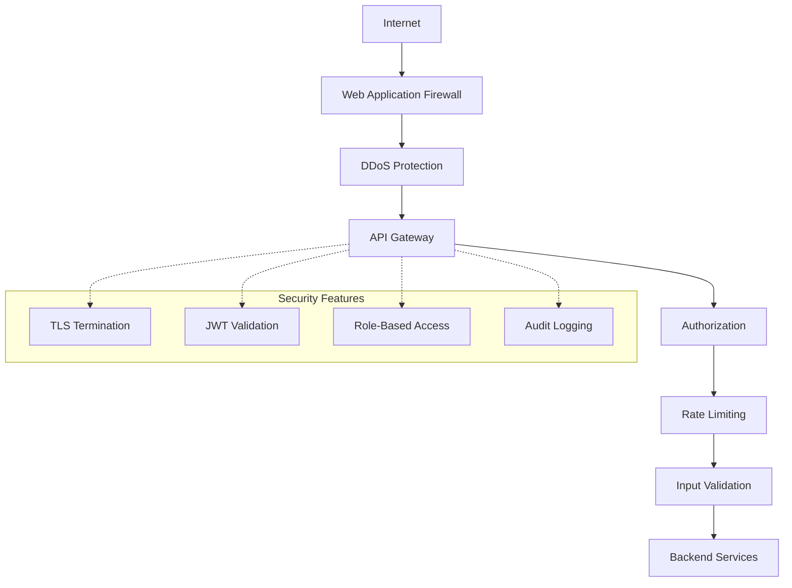
```mermaid
graph TB
    Internet[Internet] --> WAF[Web Application Firewall]
    WAF --> DDoS[DDoS Protection]
    DDoS --> Gateway[API Gateway]
    
    Gateway --> AuthZ[Authorization]
    AuthZ --> RateLimit[Rate Limiting]
    RateLimit --> Validation[Input Validation]
    Validation --> Services[Backend Services]
    
    subgraph "Security Features"
        TLS[TLS Termination]
        JWT[JWT Validation]
        RBAC[Role-Based Access]
        Audit[Audit Logging]
    end
    
    Gateway -.-> TLS
    Gateway -.-> JWT
    Gateway -.-> RBAC
    Gateway -.-> Audit
```

### 2. OAuth 2.0 Flow

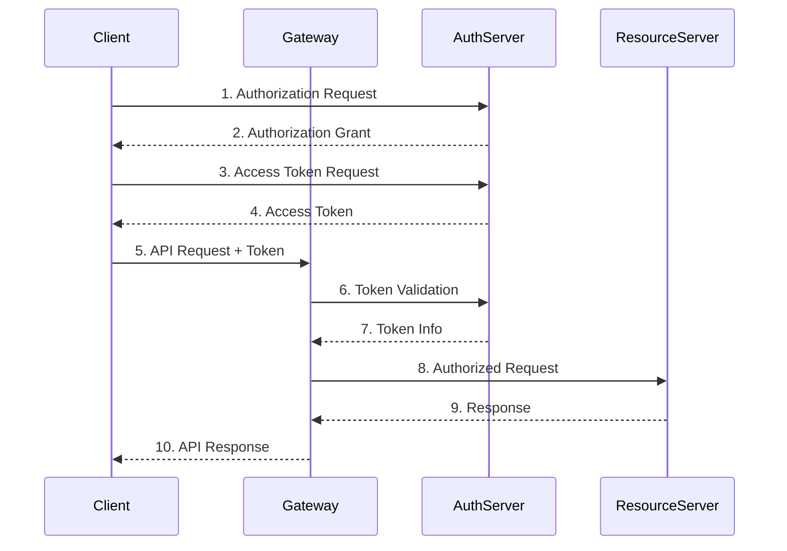
```mermaid
sequenceDiagram
    participant Client
    participant Gateway
    participant AuthServer
    participant ResourceServer
    
    Client->>AuthServer: 1. Authorization Request
    AuthServer-->>Client: 2. Authorization Grant
    Client->>AuthServer: 3. Access Token Request
    AuthServer-->>Client: 4. Access Token
    Client->>Gateway: 5. API Request + Token
    Gateway->>AuthServer: 6. Token Validation
    AuthServer-->>Gateway: 7. Token Info
    Gateway->>ResourceServer: 8. Authorized Request
    ResourceServer-->>Gateway: 9. Response
    Gateway-->>Client: 10. API Response
```

## Performance Optimization

### 1. Caching Strategy

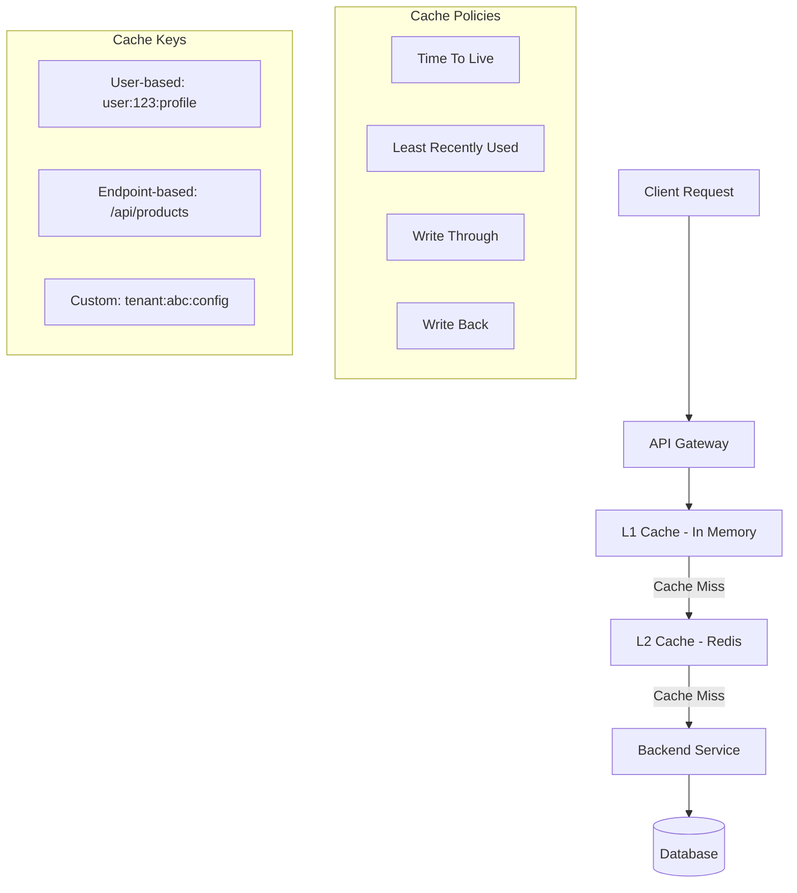
```mermaid
graph TB
    Client[Client Request] --> Gateway[API Gateway]
    Gateway --> L1[L1 Cache - In Memory]
    L1 -->|Cache Miss| L2[L2 Cache - Redis]
    L2 -->|Cache Miss| Backend[Backend Service]
    
    Backend --> Database[(Database)]
    
    subgraph "Cache Policies"
        TTL[Time To Live]
        LRU[Least Recently Used]
        WriteThrough[Write Through]
        WriteBack[Write Back]
    end
    
    subgraph "Cache Keys"
        UserID[User-based: user:123:profile]
        Endpoint[Endpoint-based: /api/products]
        Custom[Custom: tenant:abc:config]
    end
```

### 2. Connection Management

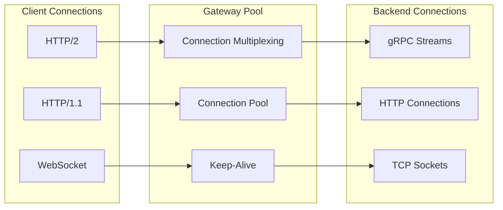
```mermaid
graph LR
    subgraph "Client Connections"
        HTTP1[HTTP/1.1]
        HTTP2[HTTP/2]
        WebSocket[WebSocket]
    end
    
    subgraph "Gateway Pool"
        Pool[Connection Pool]
        KeepAlive[Keep-Alive]
        Multiplexing[Connection Multiplexing]
    end
    
    subgraph "Backend Connections"
        gRPC[gRPC Streams]
        HTTP[HTTP Connections]
        TCP[TCP Sockets]
    end
    
    HTTP1 --> Pool
    HTTP2 --> Multiplexing
    WebSocket --> KeepAlive
    
    Pool --> HTTP
    Multiplexing --> gRPC
    KeepAlive --> TCP
```

## Monitoring and Observability

### 1. Metrics and Monitoring

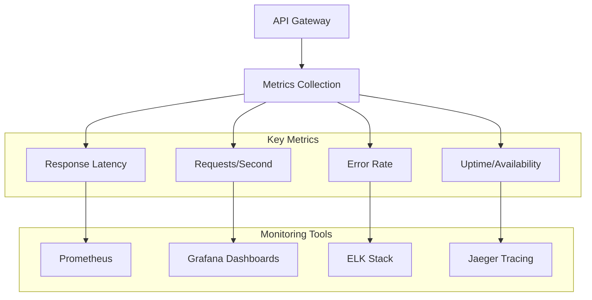
```mermaid
graph TB
    Gateway[API Gateway] --> Metrics[Metrics Collection]
    
    subgraph "Key Metrics"
        Latency[Response Latency]
        Throughput[Requests/Second]
        ErrorRate[Error Rate]
        Availability[Uptime/Availability]
    end
    
    subgraph "Monitoring Tools"
        Prometheus[Prometheus]
        Grafana[Grafana Dashboards]
        ELK[ELK Stack]
        Jaeger[Jaeger Tracing]
    end
    
    Metrics --> Latency
    Metrics --> Throughput
    Metrics --> ErrorRate
    Metrics --> Availability
    
    Latency --> Prometheus
    Throughput --> Grafana
    ErrorRate --> ELK
    Availability --> Jaeger
```

### 2. Distributed Tracing

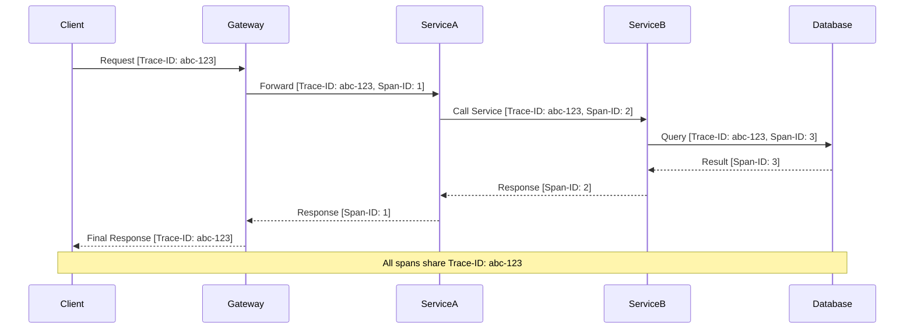
```mermaid
sequenceDiagram
    participant Client
    participant Gateway
    participant ServiceA
    participant ServiceB
    participant Database
    
    Client->>Gateway: Request [Trace-ID: abc-123]
    Gateway->>ServiceA: Forward [Trace-ID: abc-123, Span-ID: 1]
    ServiceA->>ServiceB: Call Service [Trace-ID: abc-123, Span-ID: 2]
    ServiceB->>Database: Query [Trace-ID: abc-123, Span-ID: 3]
    Database-->>ServiceB: Result [Span-ID: 3]
    ServiceB-->>ServiceA: Response [Span-ID: 2]
    ServiceA-->>Gateway: Response [Span-ID: 1]
    Gateway-->>Client: Final Response [Trace-ID: abc-123]
    
    Note over Client, Database: All spans share Trace-ID: abc-123
```

## Best Practices

### 1. Design Principles

```mermaid
mindmap
    root((API Gateway Best Practices))
        Performance
            Async Processing
            Connection Pooling
            Caching Strategy
            Load Balancing
        Security
            Input Validation
            Rate Limiting
            Authentication
            Authorization
        Reliability
            Circuit Breaker
            Retry Logic
            Timeout Handling
            Health Checks
        Observability
            Logging
            Metrics
            Tracing
            Monitoring
        Scalability
            Horizontal Scaling
            Auto Scaling
            Resource Management
            Capacity Planning
```

### 2. Configuration Management

```mermaid
graph TB
    subgraph "Configuration Sources"
        ConfigMap[ConfigMaps]
        Secrets[Secrets]
        Database[Database]
        Files[Configuration Files]
    end
    
    subgraph "Configuration Types"
        Routes[Route Configuration]
        Policies[Policy Configuration]
        Upstream[Upstream Services]
        Security[Security Settings]
    end
    
    ConfigMap --> Routes
    Secrets --> Security
    Database --> Policies
    Files --> Upstream
    
    subgraph "Configuration Management"
        Validation[Configuration Validation]
        Versioning[Version Control]
        Rollback[Rollback Strategy]
        HotReload[Hot Reload]
    end
```

### 3. Error Handling Strategy

```mermaid
graph TB
    Request[Incoming Request] --> Validate{Validation}
    Validate -->|Invalid| ClientError[400 Bad Request]
    Validate -->|Valid| AuthCheck{Authentication}
    AuthCheck -->|Failed| Unauthorized[401 Unauthorized]
    AuthCheck -->|Success| AuthzCheck{Authorization}
    AuthzCheck -->|Failed| Forbidden[403 Forbidden]
    AuthzCheck -->|Success| RateCheck{Rate Limit}
    RateCheck -->|Exceeded| TooManyRequests[429 Too Many Requests]
    RateCheck -->|OK| Backend[Backend Call]
    Backend -->|Success| Success[200 Success]
    Backend -->|Timeout| Timeout[504 Gateway Timeout]
    Backend -->|Service Error| ServiceError[502 Bad Gateway]
    Backend -->|Service Down| ServiceDown[503 Service Unavailable]
```

## Common Anti-patterns

### 1. Anti-patterns to Avoid

```mermaid
graph TB
    subgraph "Anti-patterns"
        GodGateway[God Gateway - Too Many Responsibilities]
        SharedDB[Shared Database Access]
        BusinessLogic[Business Logic in Gateway]
        NoVersioning[No API Versioning]
        SyncOnly[Synchronous Processing Only]
    end
    
    subgraph "Better Approaches"
        Microservices[Domain-Specific Gateways]
        ServiceAPI[Service-Owned Data]
        Orchestration[Service Orchestration]
        Versioning[Proper API Versioning]
        Async[Asynchronous Processing]
    end
    
    GodGateway -.->|Refactor to| Microservices
    SharedDB -.->|Change to| ServiceAPI
    BusinessLogic -.->|Move to| Orchestration
    NoVersioning -.->|Implement| Versioning
    SyncOnly -.->|Add| Async
```

### 2. Performance Anti-patterns

| Anti-pattern | Problem | Solution |
|--------------|---------|----------|
| **Chatty Interface** | Multiple round trips | Data aggregation |
| **No Caching** | Repeated backend calls | Strategic caching |
| **Blocking I/O** | Thread starvation | Async/Non-blocking |
| **No Connection Pooling** | Connection overhead | Connection pools |
| **Synchronous Chains** | Latency accumulation | Parallel processing |

## Conclusion

API Gateways are essential components in modern distributed architectures, providing a unified entry point while handling cross-cutting concerns. Success depends on:

- **Choosing the right pattern** for your architecture
- **Implementing proper security** measures
- **Monitoring and observability** for operational excellence
- **Performance optimization** for scale
- **Following best practices** while avoiding anti-patterns

The key is to start simple and evolve your gateway architecture as your system grows, always keeping in mind the trade-offs between complexity and functionality.

## Additional Resources

- [API Gateway Pattern - Microsoft](https://docs.microsoft.com/en-us/azure/architecture/microservices/design/gateway)
- [Building Microservices - Sam Newman](https://www.oreilly.com/library/view/building-microservices/9781491950340/)
- [Microservices Patterns - Chris Richardson](https://microservices.io/patterns/apigateway.html)
- [Kong Documentation](https://docs.konghq.com/)
- [Envoy Proxy Documentation](https://www.envoyproxy.io/docs)