# API Gateway Architecture

This document outlines the architectural principles, design decisions, and structural components of our API Gateway system. It serves as the foundational reference for understanding how all components work together.

## Table of Contents

- [Architecture Overview](#architecture-overview)
- [Core Components](#core-components)
- [Architectural Patterns](#architectural-patterns)
- [Request Processing Pipeline](#request-processing-pipeline)
- [Service Integration](#service-integration)
- [Data Flow Architecture](#data-flow-architecture)
- [Deployment Architecture](#deployment-architecture)
- [Quality Attributes](#quality-attributes)
- [Design Decisions](#design-decisions)
- [Related Documentation](#related-documentation)

## Architecture Overview

The API Gateway follows a **layered architecture** with clear separation of concerns, implementing the **Gateway Aggregation** and **Gateway Offloading** patterns to provide a unified entry point for distributed services.

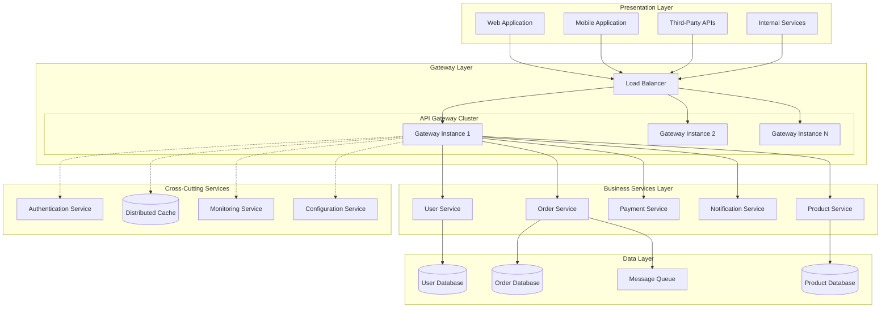

### Architectural Principles

1. **Single Responsibility**: Each component has a clearly defined purpose
2. **Loose Coupling**: Components interact through well-defined interfaces
3. **High Cohesion**: Related functionality is grouped together
4. **Scalability**: Horizontal scaling capabilities at each layer
5. **Fault Tolerance**: Graceful degradation and circuit breaking
6. **Observability**: Comprehensive monitoring and tracing

## Core Components

### 1. Gateway Engine
The central processing unit that handles request routing, transformation, and orchestration.

**Responsibilities:**
- Request/response lifecycle management
- Protocol translation (HTTP/HTTPS, WebSocket, gRPC)
- Content negotiation and transformation
- Error handling and recovery

**Implementation Details:** See [patterns.md](patterns.md) for specific engine patterns.

### 2. Router Component
Intelligent request routing based on configurable rules and patterns.

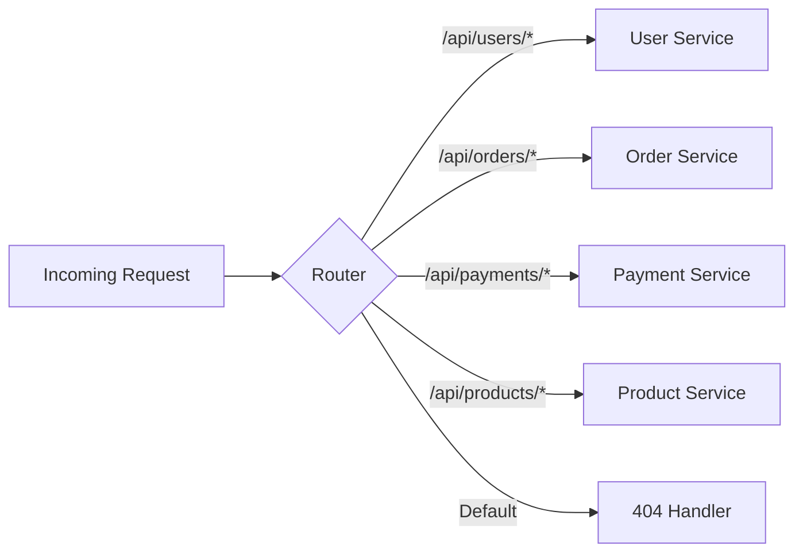

**Configuration Reference:** See [routing.md](routing.md) for detailed routing strategies.

### 3. Security Layer
Centralized security enforcement for authentication, authorization, and threat protection.

**Components:**
- JWT Token Validator
- OAuth 2.0 Provider Integration
- API Key Manager
- Rate Limiter
- CORS Handler
- Input Sanitizer

**Security Implementation:** Detailed in [security.md](security.md).

### 4. Cache Management
Multi-level caching strategy for performance optimization.

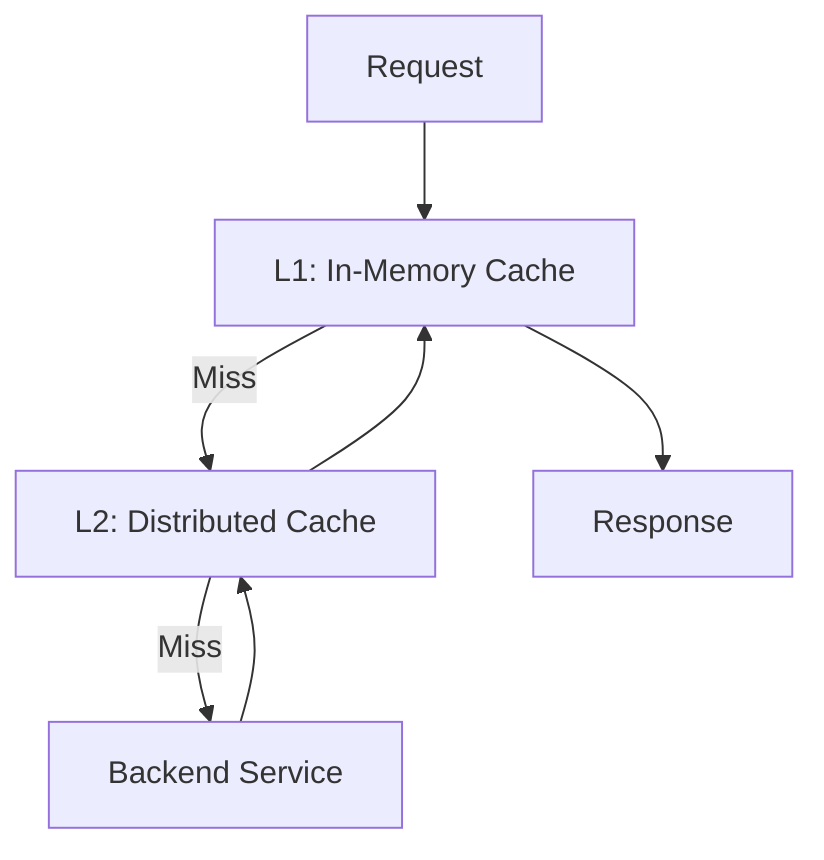

**Caching Strategies:** See [caching.md](caching.md) for implementation details.

### 5. Monitoring & Observability
Comprehensive observability stack for system health and performance monitoring.

**Components:**
- Metrics Collector
- Distributed Tracing
- Structured Logging
- Health Check Engine
- Alert Manager

**Monitoring Setup:** Detailed in [monitoring.md](monitoring.md).

## Architectural Patterns

### 1. Gateway Aggregation Pattern
Combines multiple backend service calls into a single client request.

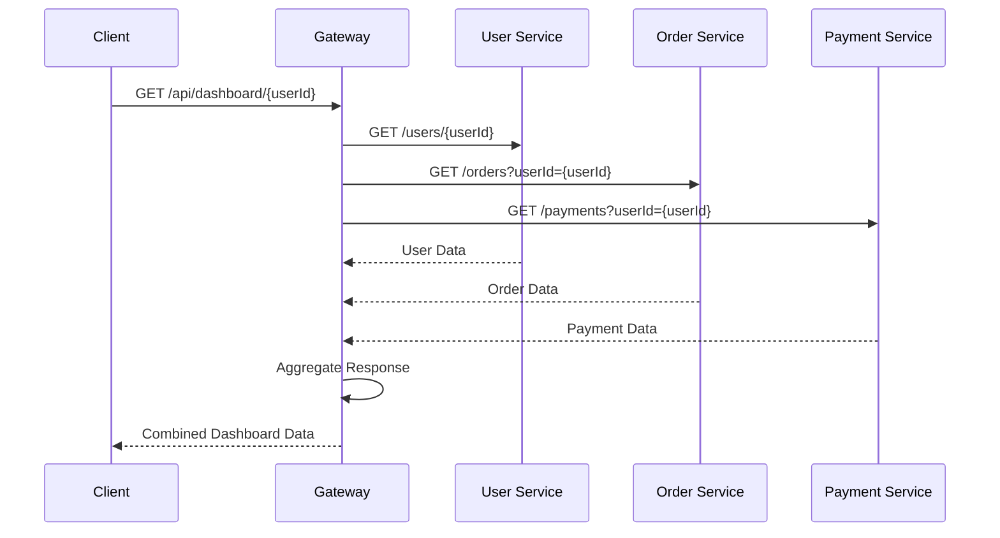

### 2. Backend for Frontend (BFF) Pattern
Specialized gateways for different client types.

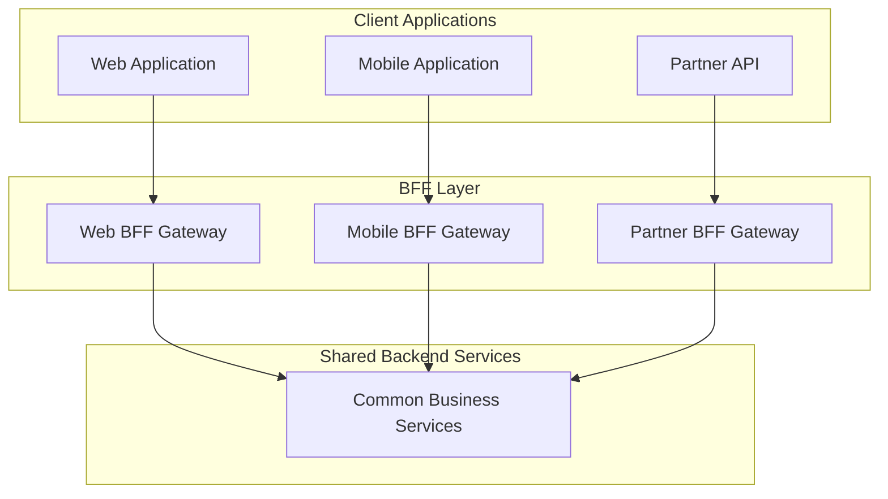

### 3. Circuit Breaker Pattern
Fault tolerance mechanism to prevent cascade failures.

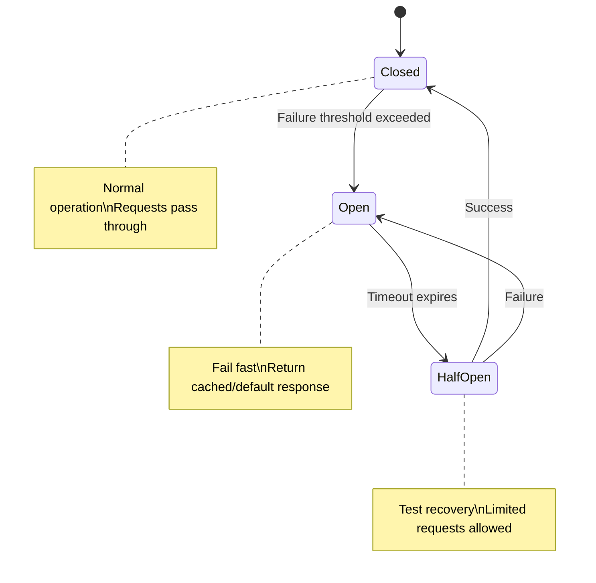

**Pattern Implementation:** See [patterns.md](patterns.md) for detailed implementations.

## Request Processing Pipeline

The gateway processes requests through a configurable pipeline of middleware components.

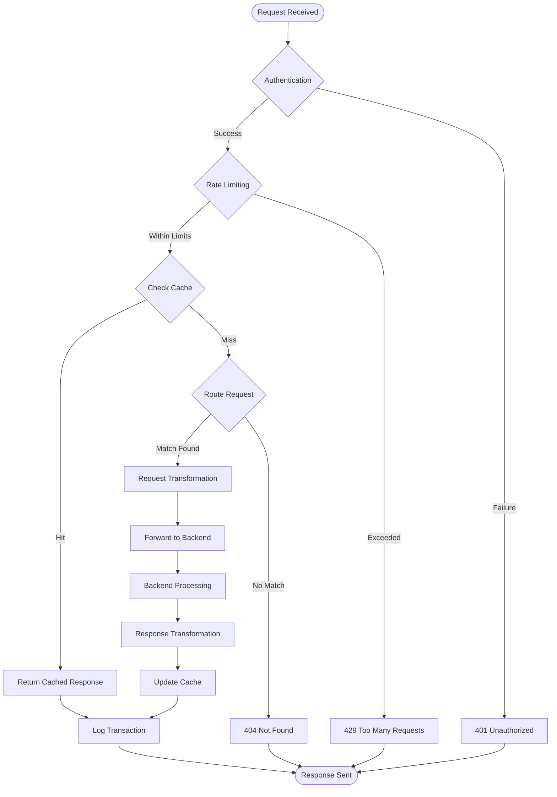

### Pipeline Components

1. **Authentication Middleware**: Token validation and user context establishment
2. **Rate Limiting Middleware**: Request throttling based on configurable policies
3. **Caching Middleware**: Response caching and cache invalidation
4. **Routing Middleware**: Request routing based on URL patterns and headers
5. **Transformation Middleware**: Request/response format conversion
6. **Proxy Middleware**: Backend service communication
7. **Logging Middleware**: Transaction logging and audit trails

## Service Integration

### Synchronous Integration
Direct HTTP/HTTPS communication for real-time operations.

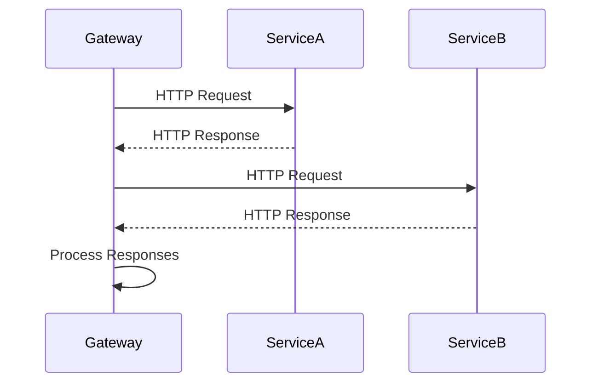

### Asynchronous Integration
Event-driven communication for non-blocking operations.

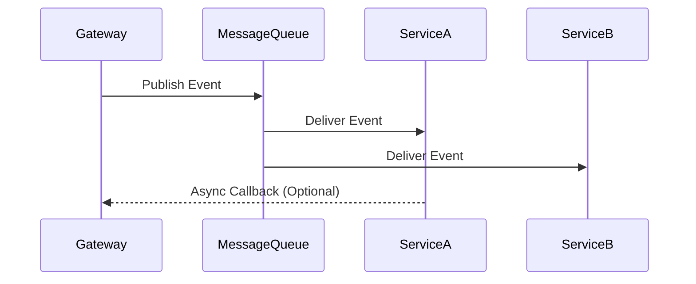

**Integration Patterns:** See [patterns.md](patterns.md) for service integration strategies.

## Data Flow Architecture

### Request Data Flow

```mermaid
graph LR
    subgraph "Ingress"
        ClientReq[Client Request]
        Validate[Request Validation]
        Transform[Request Transformation]
    end
    
    subgraph "Processing"  
        Route[Request Routing]
        Enrich[Context Enrichment]
        Forward[Service Forwarding]
    end
    
    subgraph "Egress"
        Aggregate[Response Aggregation]  
        TransformResp[Response Transformation]
        ClientResp[Client Response]
    end
    
    ClientReq --> Validate
    Validate --> Transform
    Transform --> Route
    Route --> Enrich
    Enrich --> Forward
    Forward --> Aggregate
    Aggregate --> TransformResp
    TransformResp --> ClientResp
```

### Data Consistency Patterns

1. **Eventually Consistent**: For cross-service data synchronization
2. **Strong Consistency**: For critical transactional operations
3. **Compensating Actions**: For distributed transaction rollbacks

## Deployment Architecture

### Container-Based Deployment

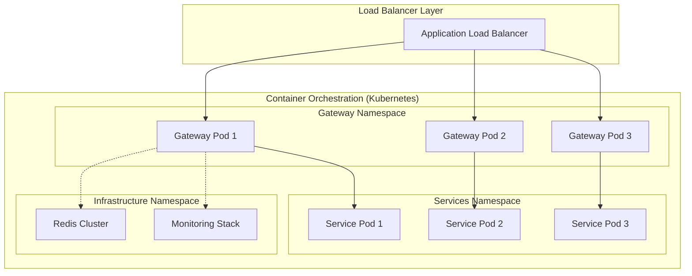

### Environment Strategy

- **Development**: Single instance with mock services
- **Staging**: Multi-instance with production-like services
- **Production**: Auto-scaling cluster with full monitoring

**Scaling Strategies:** Detailed in [scaling.md](scaling.md).

## Quality Attributes

### Performance
- **Latency**: Sub-100ms response times for cached requests
- **Throughput**: 10,000+ requests per second per instance
- **Scalability**: Horizontal scaling with linear performance gain

### Reliability  
- **Availability**: 99.99% uptime SLA
- **Fault Tolerance**: Graceful degradation under partial system failures
- **Data Durability**: No data loss during system failures

### Security
- **Authentication**: Multi-factor authentication support
- **Authorization**: Fine-grained access control
- **Data Protection**: End-to-end encryption

**Security Architecture:** See [security.md](security.md) for detailed security measures.

### Maintainability
- **Modularity**: Plugin-based architecture for extensions
- **Testability**: Comprehensive test coverage with mocking capabilities  
- **Deployability**: Zero-downtime deployments with blue-green strategy

## Design Decisions

### Technology Stack Decisions

| Component | Technology | Rationale |
|-----------|------------|-----------|
| Runtime | Node.js/Go/Java | High concurrency, ecosystem maturity |
| Load Balancer | NGINX/HAProxy | High performance, battle-tested |
| Cache | Redis | In-memory performance, clustering support |
| Message Queue | Apache Kafka | High throughput, durability |
| Monitoring | Prometheus + Grafana | Industry standard, rich ecosystem |
| Container | Docker + Kubernetes | Portability, orchestration capabilities |

### Architectural Trade-offs

**Benefits:**
- Centralized cross-cutting concerns
- Simplified client integration
- Enhanced security posture
- Improved observability

**Challenges:**
- Additional network latency
- Single point of failure risk
- Operational complexity

**Decision Analysis:** See [pros-cons.md](pros-cons.md) for detailed trade-off analysis.

### Configuration Management

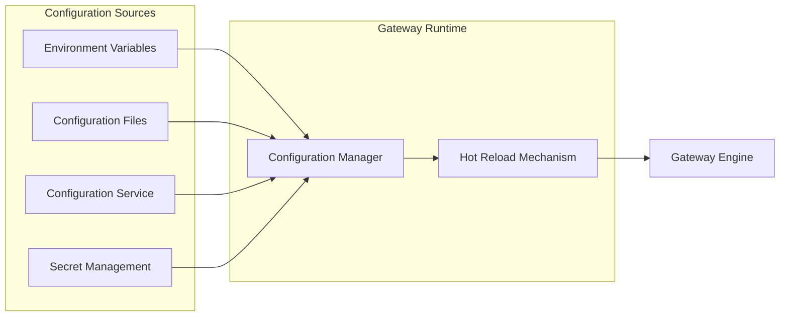

## Related Documentation

This architecture document connects to specialized documentation covering specific aspects:

### Core Functionality
- **[Routing](routing.md)**: Request routing strategies and configuration
- **[Security](security.md)**: Authentication, authorization, and security patterns
- **[Caching](caching.md)**: Caching strategies and implementation

### Operations
- **[Scaling](scaling.md)**: Horizontal and vertical scaling approaches
- **[Monitoring](monitoring.md)**: Observability, metrics, and health monitoring
- **[Patterns](patterns.md)**: Implementation patterns and best practices

### Decision Support
- **[Pros & Cons](pros-cons.md)**: Trade-off analysis and decision framework

---

**Next Steps:**
1. Review [patterns.md](patterns.md) for implementation patterns
2. Understand [security.md](security.md) for security implementation
3. Explore [routing.md](routing.md) for request routing configuration
4. Check [scaling.md](scaling.md) for production deployment strategies