# API Gateway Caching

This document covers comprehensive caching strategies, implementation patterns, and best practices for API Gateway systems. Effective caching is crucial for performance optimization, reduced backend load, and improved user experience.

## Table of Contents

- [Caching Overview](#caching-overview)
- [Cache Types and Levels](#cache-types-and-levels)
- [Caching Strategies](#caching-strategies)
- [Cache Key Design](#cache-key-design)
- [Cache Invalidation Patterns](#cache-invalidation-patterns)
- [Implementation Patterns](#implementation-patterns)
- [Performance Optimization](#performance-optimization)
- [Monitoring and Metrics](#monitoring-and-metrics)
- [Security Considerations](#security-considerations)
- [Configuration Examples](#configuration-examples)
- [Troubleshooting](#troubleshooting)

## Caching Overview

API Gateway caching reduces response times, decreases backend load, and improves system scalability by storing frequently accessed data at various levels of the request processing pipeline.

### Cache Architecture

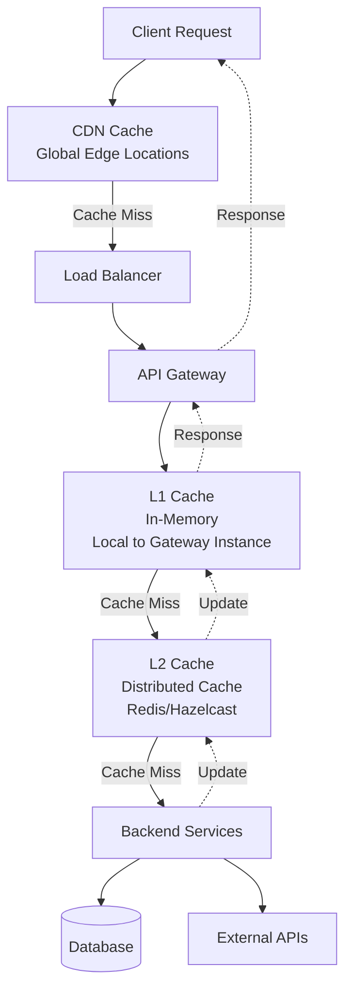
```mermaid
graph TB
    Client[Client Request] --> CDN[CDN Cache<br/>Global Edge Locations]
    CDN -->|Cache Miss| LB[Load Balancer]
    LB --> Gateway[API Gateway]
    
    Gateway --> L1[L1 Cache<br/>In-Memory<br/>Local to Gateway Instance]
    L1 -->|Cache Miss| L2[L2 Cache<br/>Distributed Cache<br/>Redis/Hazelcast]
    L2 -->|Cache Miss| Backend[Backend Services]
    
    Backend --> DB[(Database)]
    Backend --> ExtAPI[External APIs]
    
    Backend -.->|Update| L2
    L2 -.->|Update| L1
    L1 -.->|Response| Gateway
    Gateway -.->|Response| Client
```

### Benefits of Multi-Level Caching

1. **Reduced Latency**: Faster response times for cached content
2. **Lower Backend Load**: Fewer requests to backend services
3. **Improved Scalability**: Better handling of traffic spikes
4. **Cost Efficiency**: Reduced resource consumption
5. **Better User Experience**: Consistent performance under load

## Cache Types and Levels

### 1. Browser Cache (Client-Side)

Caching at the client browser level using HTTP cache headers.

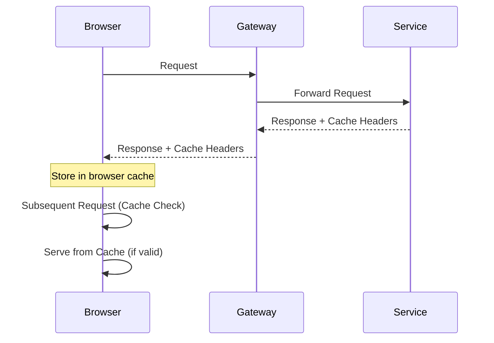
```mermaid
sequenceDiagram
    participant Browser
    participant Gateway
    participant Service
    
    Browser->>Gateway: Request
    Gateway->>Service: Forward Request
    Service-->>Gateway: Response + Cache Headers
    Gateway-->>Browser: Response + Cache Headers
    
    Note over Browser: Store in browser cache
    
    Browser->>Browser: Subsequent Request (Cache Check)
    Browser->>Browser: Serve from Cache (if valid)
```

**Configuration:**
```http
Cache-Control: public, max-age=3600
ETag: "abc123"
Last-Modified: Wed, 21 Oct 2023 07:28:00 GMT
```

### 2. CDN Cache (Edge)

Global content delivery network caching at edge locations.

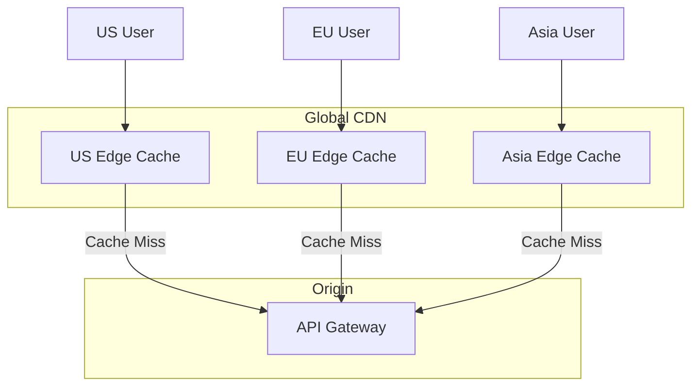
```mermaid
graph TB
    subgraph "Global CDN"
        EdgeUS[US Edge Cache]
        EdgeEU[EU Edge Cache]
        EdgeAsia[Asia Edge Cache]
    end
    
    subgraph "Origin"
        Gateway[API Gateway]
    end
    
    UserUS[US User] --> EdgeUS
    UserEU[EU User] --> EdgeEU
    UserAsia[Asia User] --> EdgeAsia
    
    EdgeUS -->|Cache Miss| Gateway
    EdgeEU -->|Cache Miss| Gateway
    EdgeAsia -->|Cache Miss| Gateway
```

### 3. Gateway Cache (L1 - In-Memory)

High-speed local cache within each gateway instance.

**Characteristics:**
- **Speed**: Fastest access (microseconds)
- **Capacity**: Limited by instance memory
- **Scope**: Local to gateway instance
- **Durability**: Lost on restart

**Use Cases:**
- Frequently accessed configuration data
- Authentication tokens
- Small, hot data sets

### 4. Distributed Cache (L2 - External)

Shared cache across multiple gateway instances.

**Technologies:**
- Redis
- Hazelcast
- Apache Ignite
- Memcached

**Characteristics:**
- **Speed**: Fast access (low milliseconds)
- **Capacity**: Large, configurable
- **Scope**: Shared across instances
- **Durability**: Persistent or semi-persistent

## Caching Strategies

### 1. Cache-Aside (Lazy Loading)

Application explicitly manages cache population and updates.

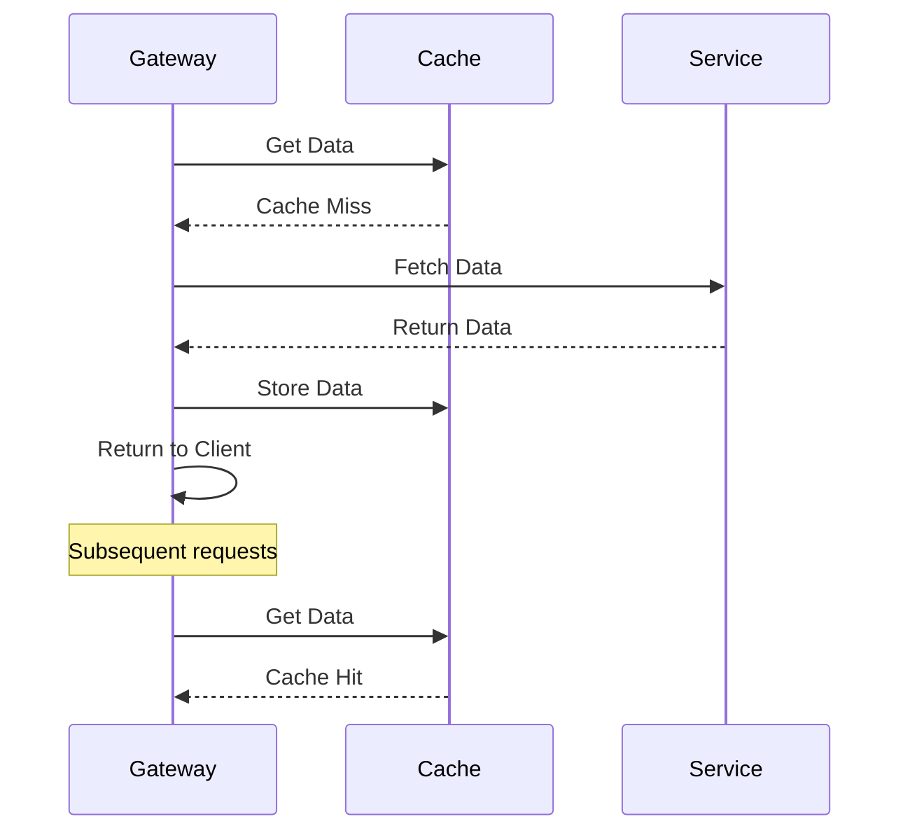
```mermaid
sequenceDiagram
    participant Gateway
    participant Cache
    participant Service
    
    Gateway->>Cache: Get Data
    Cache-->>Gateway: Cache Miss
    Gateway->>Service: Fetch Data
    Service-->>Gateway: Return Data
    Gateway->>Cache: Store Data
    Gateway->>Gateway: Return to Client
    
    Note over Gateway: Subsequent requests
    Gateway->>Cache: Get Data
    Cache-->>Gateway: Cache Hit
```

**Implementation Example:**
```python
def get_user_data(user_id):
    # Try cache first
    cache_key = f"user:{user_id}"
    data = cache.get(cache_key)
    
    if data is None:  # Cache miss
        data = user_service.get_user(user_id)
        cache.set(cache_key, data, ttl=3600)
    
    return data
```

### 2. Write-Through

Data is written to cache and backend simultaneously.

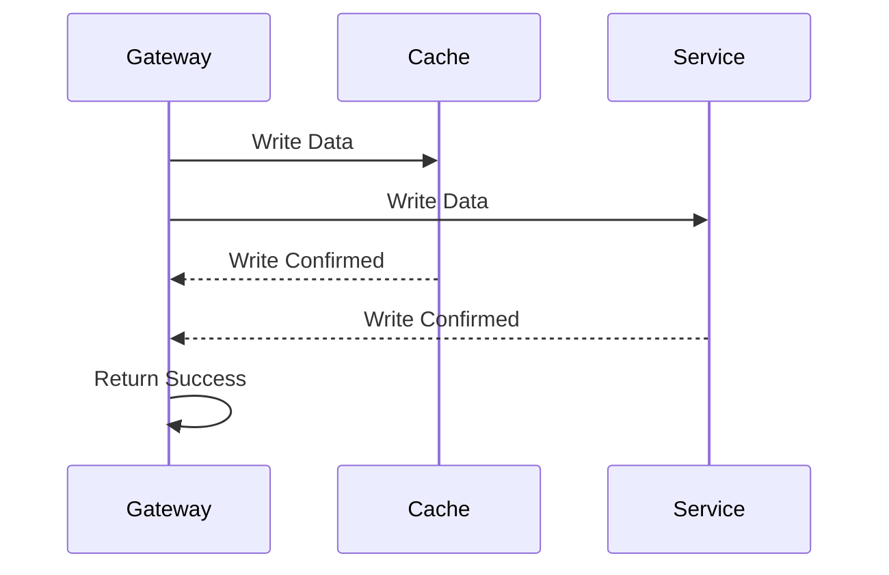
```mermaid
sequenceDiagram
    participant Gateway
    participant Cache
    participant Service
    
    Gateway->>Cache: Write Data
    Gateway->>Service: Write Data
    Cache-->>Gateway: Write Confirmed
    Service-->>Gateway: Write Confirmed
    Gateway->>Gateway: Return Success
```

### 3. Write-Behind (Write-Back)

Data is written to cache immediately and to backend asynchronously.

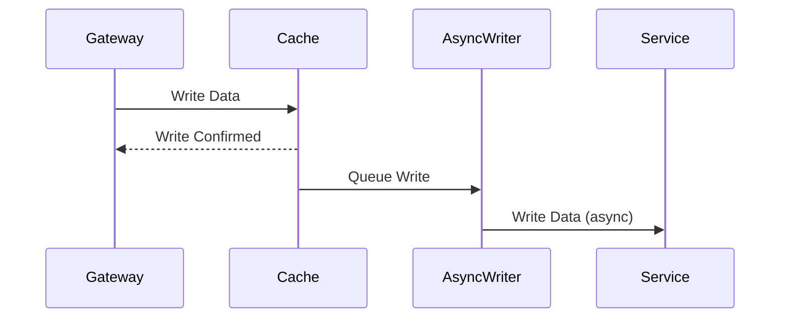
```mermaid
sequenceDiagram
    participant Gateway
    participant Cache
    participant AsyncWriter
    participant Service
    
    Gateway->>Cache: Write Data
    Cache-->>Gateway: Write Confirmed
    Cache->>AsyncWriter: Queue Write
    AsyncWriter->>Service: Write Data (async)
```

### 4. Refresh-Ahead

Proactively refresh cache entries before they expire.

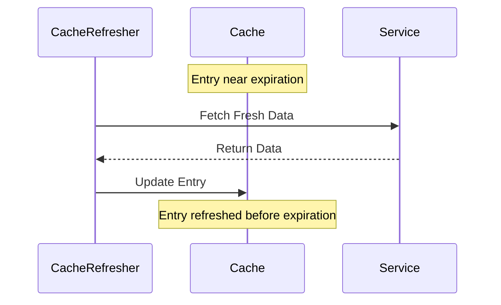
```mermaid
sequenceDiagram
    participant CacheRefresher
    participant Cache
    participant Service
    
    Note over Cache: Entry near expiration
    CacheRefresher->>Service: Fetch Fresh Data
    Service-->>CacheRefresher: Return Data
    CacheRefresher->>Cache: Update Entry
    
    Note over Cache: Entry refreshed before expiration
```

## Cache Key Design

Effective cache key design is crucial for cache hit rates and data consistency.

### Key Patterns

```mermaid
graph TB
    Request[HTTP Request] --> KeyBuilder[Cache Key Builder]
    
    KeyBuilder --> PathKey[Path-based Key<br/>"GET:/api/users/123"]
    KeyBuilder --> ParamKey[Parameter-based Key<br/>"users:123:profile"]
    KeyBuilder --> HeaderKey[Header-based Key<br/>"users:123:en-US"]
    KeyBuilder --> CompositeKey[Composite Key<br/>"users:123:profile:v2:en-US"]
```

### Key Components

1. **Resource Type**: Entity or endpoint identifier
2. **Resource ID**: Specific resource identifier  
3. **Query Parameters**: Filtering or pagination parameters
4. **Headers**: User context (language, tenant, etc.)
5. **Version**: API or data version

### Key Design Examples

```yaml
# Simple resource-based keys
user_profile: "user:profile:{user_id}"
product_list: "products:list:page:{page}:size:{size}"

# Context-aware keys
localized_content: "content:{content_id}:lang:{language}"
tenant_data: "tenant:{tenant_id}:users:page:{page}"

# Version-aware keys
api_response: "api:v{version}:{endpoint}:{hash(params)}"

# Security-aware keys (include user context)
user_orders: "user:{user_id}:orders:status:{status}"
```

### Key Normalization

```python
def normalize_cache_key(method, path, params, headers):
    """
    Generate normalized cache key
    """
    # Normalize path
    path = path.lower().strip('/')
    
    # Sort parameters for consistency
    sorted_params = sorted(params.items())
    param_string = '&'.join(f"{k}={v}" for k, v in sorted_params)
    
    # Include relevant headers
    relevant_headers = ['accept-language', 'x-tenant-id']
    header_values = []
    for header in relevant_headers:
        if header in headers:
            header_values.append(f"{header}:{headers[header]}")
    
    # Construct key
    key_parts = [method, path]
    if param_string:
        key_parts.append(param_string)
    if header_values:
        key_parts.extend(header_values)
    
    return ':'.join(key_parts)
```

## Cache Invalidation Patterns

Cache invalidation ensures data consistency between cache and backend systems.

### 1. Time-Based Expiration (TTL)

Automatic expiration after a specified time period.

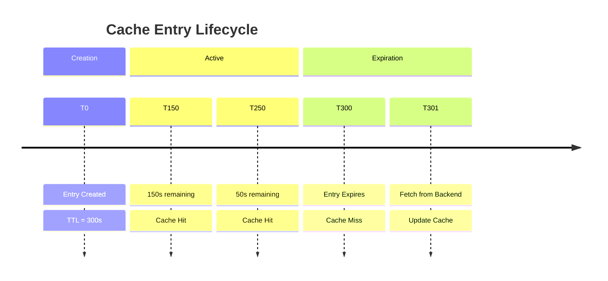
```mermaid
timeline
    title Cache Entry Lifecycle
    
    section Creation
        T0 : Entry Created : TTL = 300s
    
    section Active
        T150 : 150s remaining : Cache Hit
        T250 : 50s remaining : Cache Hit
    
    section Expiration
        T300 : Entry Expires : Cache Miss
        T301 : Fetch from Backend : Update Cache
```

**Configuration:**
```yaml
cache_policies:
  user_profiles:
    ttl: 3600  # 1 hour
  product_catalog:
    ttl: 1800  # 30 minutes
  real_time_prices:
    ttl: 60    # 1 minute
```

### 2. Event-Based Invalidation

Invalidate cache based on data modification events.

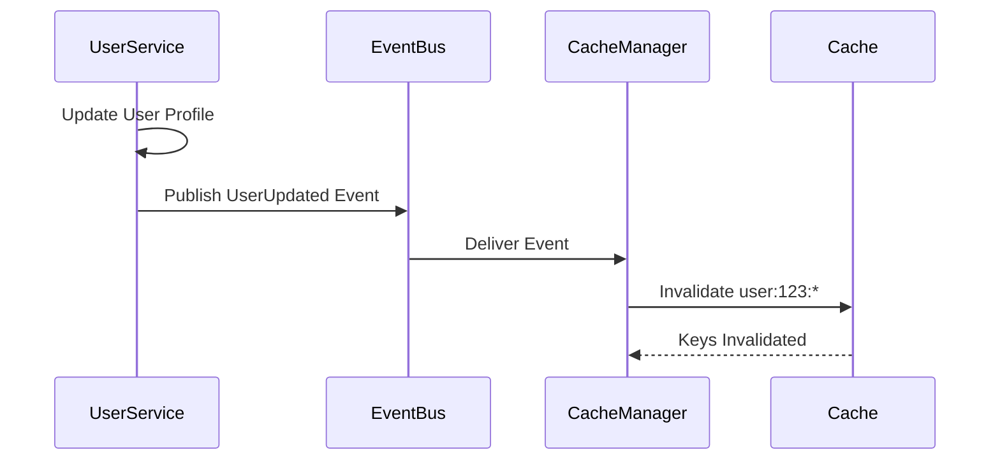
```mermaid
sequenceDiagram
    participant UserService
    participant EventBus
    participant CacheManager
    participant Cache
    
    UserService->>UserService: Update User Profile
    UserService->>EventBus: Publish UserUpdated Event
    EventBus->>CacheManager: Deliver Event
    CacheManager->>Cache: Invalidate user:123:*
    Cache-->>CacheManager: Keys Invalidated
```

### 3. Tag-Based Invalidation

Group related cache entries using tags for bulk invalidation.

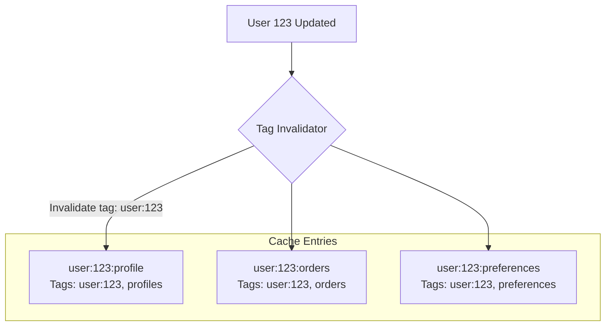
```mermaid
graph TB
    subgraph "Cache Entries"
        Entry1["user:123:profile<br/>Tags: user:123, profiles"]
        Entry2["user:123:orders<br/>Tags: user:123, orders"]
        Entry3["user:123:preferences<br/>Tags: user:123, preferences"]
    end
    
    InvalidateEvent[User 123 Updated] --> TagInvalidator{Tag Invalidator}
    TagInvalidator -->|Invalidate tag: user:123| Entry1
    TagInvalidator --> Entry2
    TagInvalidator --> Entry3
```

### 4. Version-Based Invalidation

Use version numbers to invalidate related cache entries.

```python
class VersionedCache:
    def __init__(self):
        self.version_map = {}  # entity_id -> version
    
    def set_with_version(self, key, value, entity_id, version):
        self.version_map[entity_id] = version
        versioned_key = f"{key}:v{version}"
        cache.set(versioned_key, value)
    
    def get_with_version(self, key, entity_id):
        current_version = self.version_map.get(entity_id, 0)
        versioned_key = f"{key}:v{current_version}"
        return cache.get(versioned_key)
    
    def invalidate_version(self, entity_id):
        self.version_map[entity_id] += 1
```

## Implementation Patterns

### 1. Request-Response Caching Pattern

Cache complete HTTP responses based on request patterns.

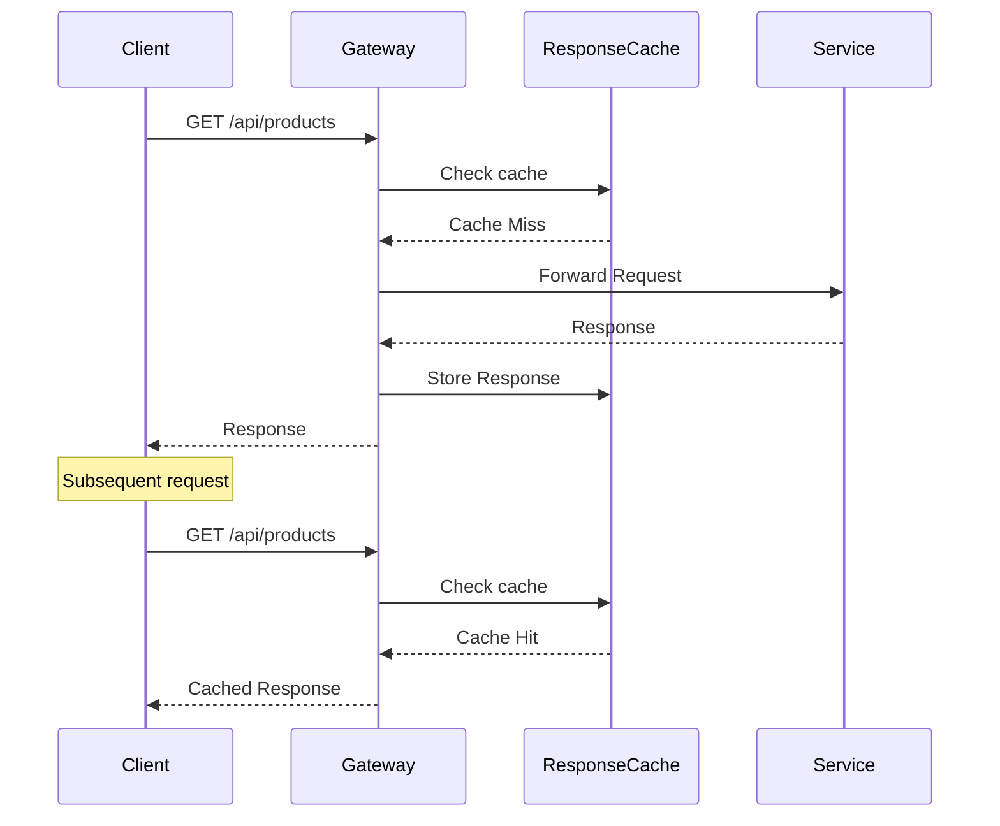
```mermaid
sequenceDiagram
    participant Client
    participant Gateway
    participant ResponseCache
    participant Service
    
    Client->>Gateway: GET /api/products
    Gateway->>ResponseCache: Check cache
    ResponseCache-->>Gateway: Cache Miss
    Gateway->>Service: Forward Request
    Service-->>Gateway: Response
    Gateway->>ResponseCache: Store Response
    Gateway-->>Client: Response
    
    Note over Client: Subsequent request
    Client->>Gateway: GET /api/products
    Gateway->>ResponseCache: Check cache
    ResponseCache-->>Gateway: Cache Hit
    Gateway-->>Client: Cached Response
```

**Configuration:**
```yaml
response_cache:
  enabled: true
  default_ttl: 300
  rules:
    - path: "/api/products"
      methods: ["GET"]
      ttl: 1800
      vary_by: ["Accept-Language", "X-Tenant-ID"]
    
    - path: "/api/users/*/profile"
      methods: ["GET"]
      ttl: 3600
      private: true  # User-specific caching
```

### 2. Data Fragment Caching Pattern

Cache individual data components that can be composed into responses.

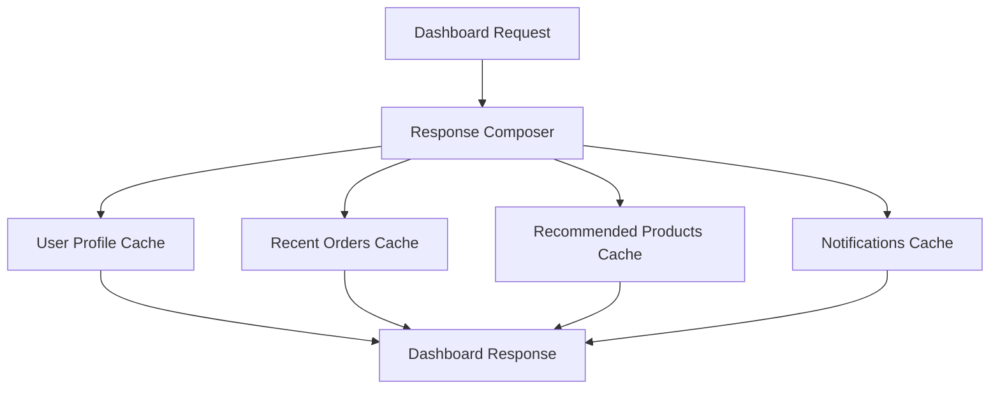
```mermaid
graph TB
    Request[Dashboard Request] --> Composer[Response Composer]
    
    Composer --> UserCache[User Profile Cache]
    Composer --> OrderCache[Recent Orders Cache]
    Composer --> ProductCache[Recommended Products Cache]
    Composer --> NotificationCache[Notifications Cache]
    
    UserCache --> Dashboard[Dashboard Response]
    OrderCache --> Dashboard
    ProductCache --> Dashboard
    NotificationCache --> Dashboard
```

### 3. Read-Through Caching Pattern

Automatic cache population on cache misses.

```python
class ReadThroughCache:
    def __init__(self, backend_service, cache_store):
        self.backend = backend_service
        self.cache = cache_store
    
    def get(self, key):
        # Try cache first
        value = self.cache.get(key)
        if value is not None:
            return value
        
        # Cache miss - fetch from backend
        value = self.backend.fetch(key)
        if value is not None:
            self.cache.set(key, value, ttl=self.get_ttl(key))
        
        return value
    
    def get_ttl(self, key):
        # Dynamic TTL based on data type
        if key.startswith('static:'):
            return 86400  # 24 hours
        elif key.startswith('user:'):
            return 3600   # 1 hour
        else:
            return 300    # 5 minutes
```

### 4. Circuit Breaker + Cache Pattern

Fallback to cache when backend services are unavailable.

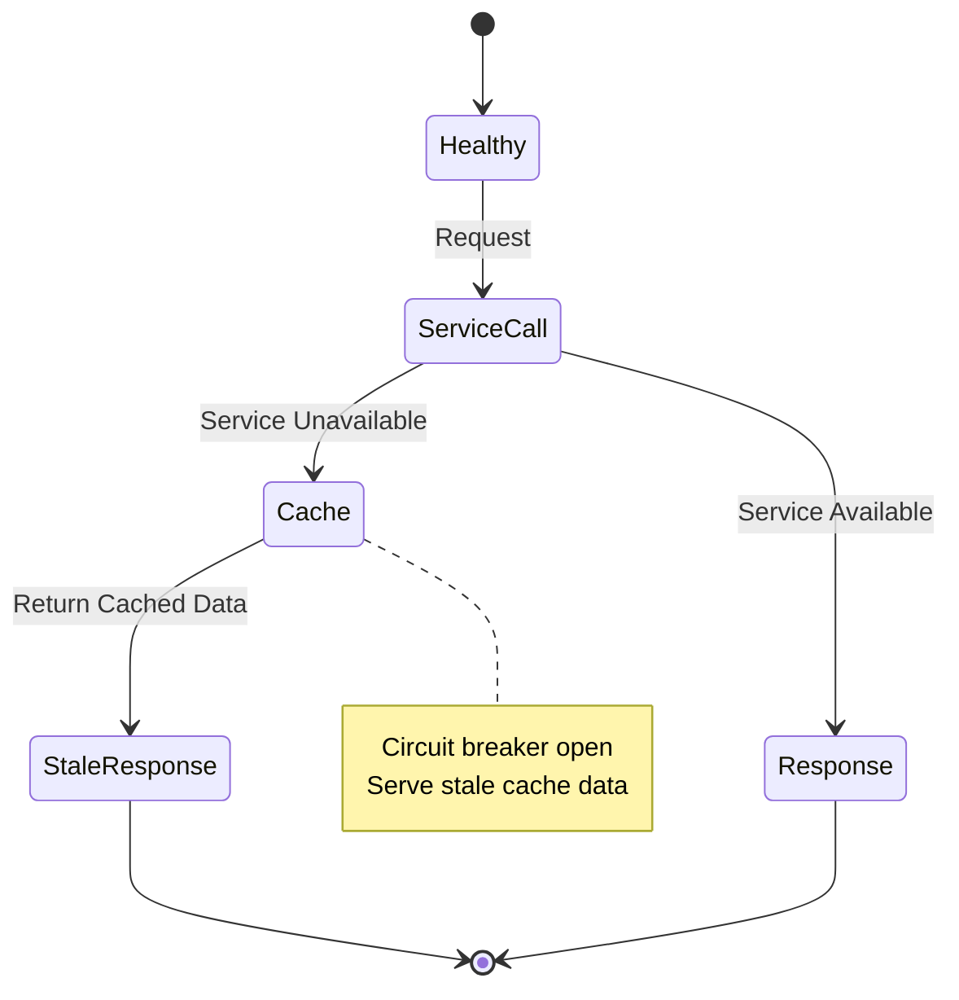
```mermaid
stateDiagram-v2
    [*] --> Healthy
    Healthy --> ServiceCall: Request
    ServiceCall --> Cache: Service Unavailable
    ServiceCall --> Response: Service Available
    Cache --> StaleResponse: Return Cached Data
    Response --> [*]
    StaleResponse --> [*]
    
    note right of Cache: Circuit breaker open<br/>Serve stale cache data
```

**Implementation Details:** See [patterns.md](patterns.md) for comprehensive resilience patterns.

## Performance Optimization

### 1. Cache Warming Strategies

Proactively populate cache with frequently accessed data.

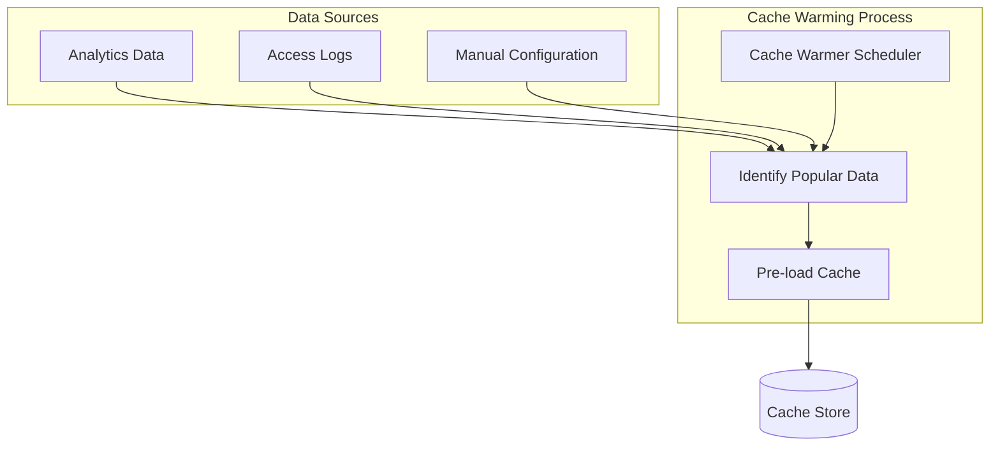
```mermaid
graph TB
    subgraph "Cache Warming Process"
        Scheduler[Cache Warmer Scheduler]
        PopularData[Identify Popular Data]
        PreLoad[Pre-load Cache]
    end
    
    subgraph "Data Sources"
        Analytics[Analytics Data]
        Logs[Access Logs]
        Manual[Manual Configuration]
    end
    
    Analytics --> PopularData
    Logs --> PopularData
    Manual --> PopularData
    
    Scheduler --> PopularData
    PopularData --> PreLoad
    PreLoad --> Cache[(Cache Store)]
```

**Cache Warming Configuration:**
```yaml
cache_warming:
  enabled: true
  schedule: "0 */6 * * *"  # Every 6 hours
  strategies:
    - type: "popular_endpoints"
      source: "analytics"
      limit: 100
    
    - type: "static_content"
      paths: ["/api/config", "/api/categories"]
    
    - type: "user_specific"
      condition: "login_frequency > 10/day"
      data_types: ["profile", "preferences"]
```

### 2. Cache Partitioning

Distribute cache data across multiple instances for better performance.

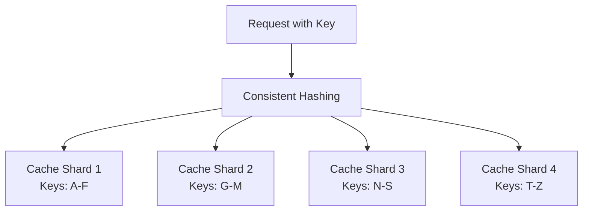
```mermaid
graph TB
    Request[Request with Key] --> Hasher[Consistent Hashing]
    
    Hasher --> Shard1[Cache Shard 1<br/>Keys: A-F]
    Hasher --> Shard2[Cache Shard 2<br/>Keys: G-M]  
    Hasher --> Shard3[Cache Shard 3<br/>Keys: N-S]
    Hasher --> Shard4[Cache Shard 4<br/>Keys: T-Z]
```

### 3. Compression Strategies

Reduce memory usage and network transfer with compression.

```python
class CompressedCache:
    def __init__(self, cache_store, compression_threshold=1024):
        self.cache = cache_store
        self.threshold = compression_threshold
    
    def set(self, key, value, ttl=None):
        serialized = json.dumps(value)
        
        if len(serialized) > self.threshold:
            # Compress large payloads
            compressed = gzip.compress(serialized.encode())
            cache_value = {
                'compressed': True,
                'data': base64.b64encode(compressed).decode()
            }
        else:
            cache_value = {
                'compressed': False,
                'data': serialized
            }
        
        self.cache.set(key, json.dumps(cache_value), ttl)
    
    def get(self, key):
        cached = self.cache.get(key)
        if not cached:
            return None
        
        cache_value = json.loads(cached)
        
        if cache_value['compressed']:
            # Decompress
            compressed_data = base64.b64decode(cache_value['data'])
            decompressed = gzip.decompress(compressed_data)
            return json.loads(decompressed.decode())
        else:
            return json.loads(cache_value['data'])
```

### 4. Smart Cache Sizing

Dynamic cache sizing based on usage patterns and memory constraints.

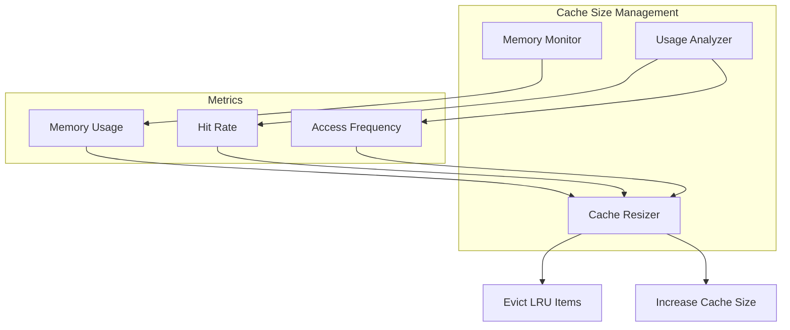
```mermaid
graph TB
    subgraph "Cache Size Management"
        Monitor[Memory Monitor]
        Analyzer[Usage Analyzer] 
        Resizer[Cache Resizer]
    end
    
    subgraph "Metrics"
        Memory[Memory Usage]
        HitRate[Hit Rate]
        Frequency[Access Frequency]
    end
    
    Monitor --> Memory
    Analyzer --> HitRate
    Analyzer --> Frequency
    
    Memory --> Resizer
    HitRate --> Resizer
    Frequency --> Resizer
    
    Resizer --> EvictLRU[Evict LRU Items]
    Resizer --> IncreaseSize[Increase Cache Size]
```

**Performance Guidelines:** See [scaling.md](scaling.md) for detailed performance optimization strategies.

## Monitoring and Metrics

### Essential Cache Metrics

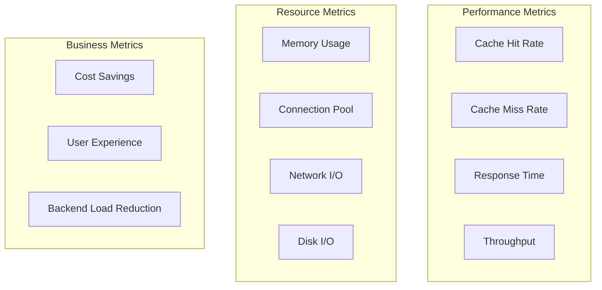
```mermaid
graph TB
    subgraph "Performance Metrics"
        HitRate[Cache Hit Rate]
        MissRate[Cache Miss Rate]
        ResponseTime[Response Time]
        Throughput[Throughput]
    end
    
    subgraph "Resource Metrics"
        Memory[Memory Usage]
        Connections[Connection Pool]
        NetworkIO[Network I/O]
        DiskIO[Disk I/O]
    end
    
    subgraph "Business Metrics"
        CostSaving[Cost Savings]
        UserExp[User Experience]
        BackendLoad[Backend Load Reduction]
    end
```

### Key Performance Indicators (KPIs)

1. **Cache Hit Rate**: Percentage of requests served from cache
   - Target: > 80% for frequently accessed data
   - Target: > 60% for general API responses

2. **Cache Miss Latency**: Time to fetch data on cache miss
   - Target: < 100ms for backend service calls

3. **Memory Utilization**: Cache memory usage efficiency
   - Target: < 85% to allow for growth

4. **Eviction Rate**: Rate of cache entries being evicted
   - Monitor for capacity issues

### Monitoring Configuration

```yaml
cache_monitoring:
  metrics:
    hit_rate:
      alert_threshold: 50%  # Alert if hit rate drops below 50%
    
    memory_usage:
      warning_threshold: 80%
      critical_threshold: 90%
    
    response_time:
      p95_threshold: 50ms
      p99_threshold: 100ms
  
  dashboards:
    - name: "Cache Performance"
      panels:
        - hit_rate_by_endpoint
        - memory_usage_trend
        - top_cache_keys
        - eviction_rate
```

**Detailed Monitoring Setup:** See [monitoring.md](monitoring.md) for comprehensive observability strategies.

## Security Considerations

### 1. Sensitive Data Caching

Implement secure caching for sensitive information.

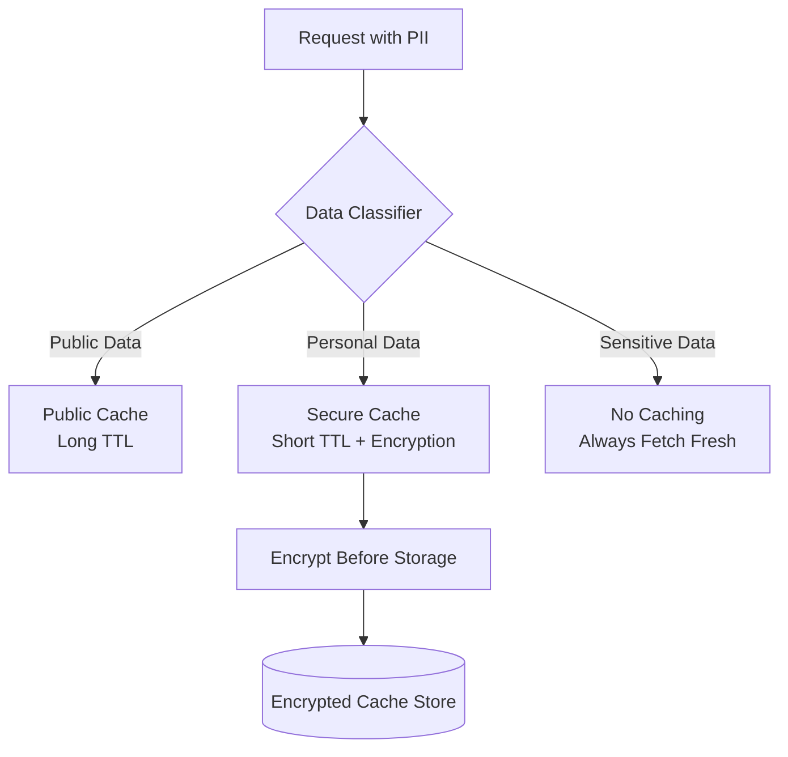
```mermaid
graph TB
    Request[Request with PII] --> Classifier{Data Classifier}
    
    Classifier -->|Public Data| PublicCache[Public Cache<br/>Long TTL]
    Classifier -->|Personal Data| SecureCache[Secure Cache<br/>Short TTL + Encryption]
    Classifier -->|Sensitive Data| NoCache[No Caching<br/>Always Fetch Fresh]
    
    SecureCache --> Encrypt[Encrypt Before Storage]
    Encrypt --> Store[(Encrypted Cache Store)]
```

### 2. Cache Isolation

Separate cache namespaces for different tenants or security contexts.

```python
class IsolatedCache:
    def __init__(self, base_cache, isolation_key):
        self.cache = base_cache
        self.isolation = isolation_key
    
    def _get_isolated_key(self, key):
        return f"{self.isolation}:{key}"
    
    def get(self, key):
        return self.cache.get(self._get_isolated_key(key))
    
    def set(self, key, value, ttl=None):
        return self.cache.set(self._get_isolated_key(key), value, ttl)
    
    def delete(self, key):
        return self.cache.delete(self._get_isolated_key(key))

# Usage
user_cache = IsolatedCache(redis_cache, f"user:{user_id}")
tenant_cache = IsolatedCache(redis_cache, f"tenant:{tenant_id}")
```

### 3. Cache Poisoning Prevention

Protect against malicious cache entries.

```python
class SecureCache:
    def __init__(self, cache_store, signing_key):
        self.cache = cache_store
        self.key = signing_key
    
    def _sign_value(self, value):
        serialized = json.dumps(value)
        signature = hmac.new(
            self.key.encode(),
            serialized.encode(),
            hashlib.sha256
        ).hexdigest()
        return {
            'data': value,
            'signature': signature
        }
    
    def _verify_value(self, signed_value):
        expected_sig = hmac.new(
            self.key.encode(),
            json.dumps(signed_value['data']).encode(),
            hashlib.sha256
        ).hexdigest()
        
        if not hmac.compare_digest(expected_sig, signed_value['signature']):
            raise ValueError("Cache value signature verification failed")
        
        return signed_value['data']
    
    def set(self, key, value, ttl=None):
        signed_value = self._sign_value(value)
        self.cache.set(key, json.dumps(signed_value), ttl)
    
    def get(self, key):
        cached = self.cache.get(key)
        if not cached:
            return None
        
        signed_value = json.loads(cached)
        return self._verify_value(signed_value)
```

**Security Implementation:** Detailed security patterns in [security.md](security.md).

## Configuration Examples

### Redis Configuration

```yaml
# Redis cluster configuration
redis:
  cluster:
    enabled: true
    nodes:
      - "redis-1:6379"
      - "redis-2:6379"
      - "redis-3:6379"
  
  connection_pool:
    max_connections: 20
    max_idle_connections: 5
    connection_timeout: 5s
    read_timeout: 3s
    
  persistence:
    enabled: true
    save_interval: "300 10"  # Save if 10 keys changed in 300 seconds
  
  memory:
    max_memory: "2gb"
    eviction_policy: "allkeys-lru"
```

### Gateway Cache Configuration

```yaml
# API Gateway cache configuration
cache:
  layers:
    l1:  # In-memory cache
      type: "in_memory"
      max_size: "100MB"
      max_entries: 10000
      ttl_default: 300
    
    l2:  # Distributed cache
      type: "redis"
      connection: "${REDIS_URL}"
      ttl_default: 3600
      compression: true
      serializer: "json"
  
  policies:
    # Static content
    - pattern: "/api/config/**"
      layers: ["l1", "l2"]
      ttl: 86400
      tags: ["config"]
    
    # User-specific data
    - pattern: "/api/users/*/profile"
      layers: ["l1", "l2"]
      ttl: 3600
      private: true
      vary_by: ["Authorization"]
    
    # Dynamic content
    - pattern: "/api/search"
      layers: ["l1"]
      ttl: 300
      vary_by: ["query", "page", "sort"]
    
    # No caching for sensitive endpoints
    - pattern: "/api/payments/**"
      cache: false
```

### Cache Invalidation Configuration

```yaml
# Cache invalidation rules
invalidation:
  strategies:
    time_based:
      enabled: true
      cleanup_interval: 60  # seconds
    
    event_based:
      enabled: true
      event_sources:
        - type: "webhook"
          endpoint: "/cache/invalidate"
          authentication: "bearer_token"
        
        - type: "message_queue"
          queue: "cache_events"
          connection: "${RABBITMQ_URL}"
    
    tag_based:
      enabled: true
      batch_size: 100
  
  rules:
    - event: "user.profile.updated"
      action: "invalidate_tags"
      tags: ["user:${user_id}"]
    
    - event: "product.updated"
      action: "invalidate_pattern"
      pattern: "products:*"
    
    - event: "system.config.changed"
      action: "invalidate_all"
      condition: "config.cache_version != current_version"
```

## Troubleshooting

### Common Cache Issues

#### 1. Low Hit Rate

**Symptoms:**
- Cache hit rate below expected threshold
- High backend service load
- Increased response times

**Diagnosis:**
```bash
# Check cache statistics
redis-cli info stats

# Analyze cache keys
redis-cli --scan --pattern "api:*" | head -20

# Monitor hit/miss patterns
redis-cli monitor | grep -E "(GET|SET|DEL)"
```

**Solutions:**
- Review cache key design for consistency
- Adjust TTL values
- Implement cache warming
- Check for over-invalidation

#### 2. Memory Issues

**Symptoms:**
- High memory usage
- Frequent evictions
- Out of memory errors

**Diagnosis:**
```bash
# Check memory usage
redis-cli info memory

# Find large keys
redis-cli --bigkeys

# Memory usage by key pattern
redis-cli eval "
  local keys = redis.call('keys', ARGV[1])
  local total = 0
  for i=1,#keys do
    total = total + redis.call('memory', 'usage', keys[i])
  end
  return total
" 0 "user:*"
```

**Solutions:**
- Implement data compression
- Adjust eviction policies
- Partition large datasets
- Review cache sizing strategy

#### 3. Cache Stampede

**Problem:** Multiple requests fetch the same data simultaneously when cache expires.

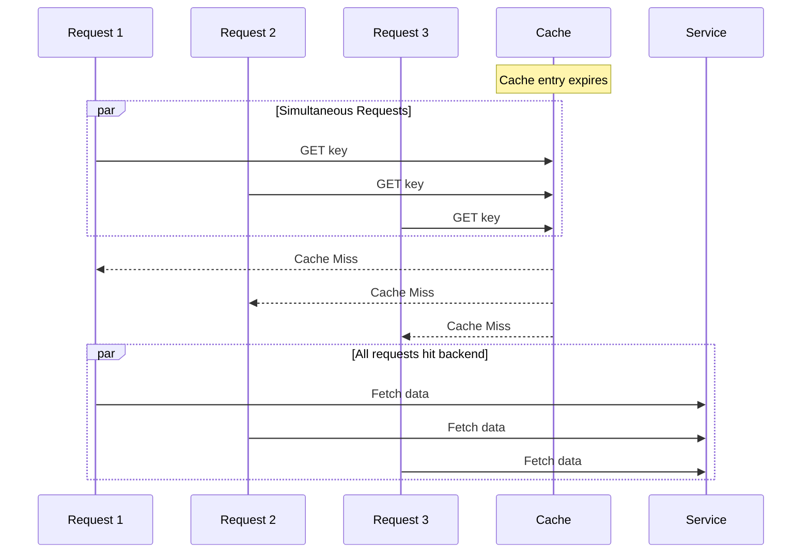
```mermaid
sequenceDiagram
    participant Req1 as Request 1
    participant Req2 as Request 2  
    participant Req3 as Request 3
    participant Cache
    participant Service
    
    Note over Cache: Cache entry expires
    
    par Simultaneous Requests
        Req1->>Cache: GET key
        Req2->>Cache: GET key
        Req3->>Cache: GET key
    end
    
    Cache-->>Req1: Cache Miss
    Cache-->>Req2: Cache Miss
    Cache-->>Req3: Cache Miss
    
    par All requests hit backend
        Req1->>Service: Fetch data
        Req2->>Service: Fetch data
        Req3->>Service: Fetch data
    end
```

**Solution - Single Flight Pattern:**
```python
import asyncio
from collections import defaultdict

class SingleFlightCache:
    def __init__(self, backend_cache):
        self.cache = backend_cache
        self.in_flight = defaultdict(list)
        self.locks = defaultdict(asyncio.Lock)
    
    async def get(self, key, fetch_func):
        # Try cache first
        value = await self.cache.get(key)
        if value is not None:
            return value
        
        # Use lock to prevent stampede
        async with self.locks[key]:
            # Double-check after acquiring lock
            value = await self.cache.get(key)
            if value is not None:
                return value
            
            # Fetch from backend (only one request)
            value = await fetch_func()
            await self.cache.set(key, value)
            
            return value
```

### Performance Tuning

#### 1. Connection Pool Optimization

```python
# Redis connection pool tuning
redis_pool = redis.ConnectionPool(
    host='redis-cluster',
    port=6379,
    max_connections=50,        # Adjust based on concurrency
    retry_on_timeout=True,
    socket_keepalive=True,
    socket_keepalive_options={},
    health_check_interval=30   # Health check every 30s
)
```

#### 2. Serialization Optimization

```python
# Fast serialization options
import orjson  # Faster than built-in json
import pickle  # For complex Python objects
import msgpack # Compact binary format

class OptimizedCache:
    def serialize(self, data):
        if isinstance(data, (dict, list)):
            return orjson.dumps(data)
        else:
            return pickle.dumps(data)
    
    def deserialize(self, data, format_hint=None):
        if format_hint == 'json':
            return orjson.loads(data)
        else:
            # Try pickle first, fallback to json
            try:
                return pickle.loads(data)
            except:
                return orjson.loads(data)
```

## Best Practices

### 1. Cache Strategy Selection
- **Static Data**: Long TTL (hours/days)
- **User Data**: Medium TTL (minutes/hours)
- **Real-time Data**: Short TTL (seconds/minutes)
- **Computed Results**: Cache expensive calculations

### 2. Key Management
- Use consistent naming conventions
- Include version information
- Implement proper namespacing
- Keep keys under 250 characters

### 3. Memory Management
- Set appropriate memory limits