# API Gateway Monitoring

## Overview

Monitoring is critical for API Gateway operations, providing visibility into performance, security, and reliability. This document covers comprehensive monitoring strategies, metrics, and observability practices.

### Monitoring Architecture Overview

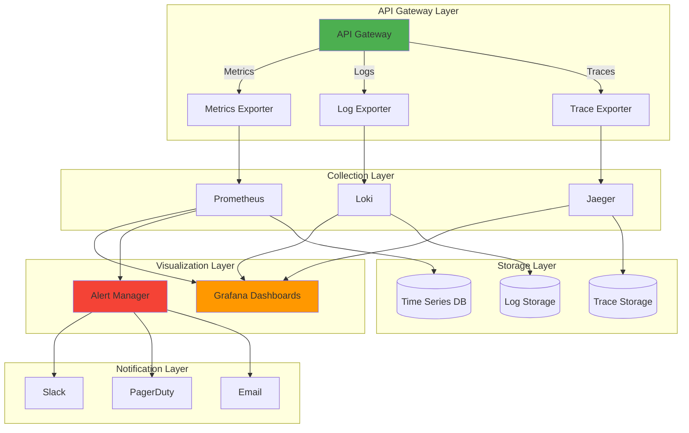

## Table of Contents

1. [Key Metrics](#key-metrics)
2. [Monitoring Layers](#monitoring-layers)
3. [Health Checks](#health-checks)
4. [Distributed Tracing](#distributed-tracing)
5. [Logging Strategy](#logging-strategy)
6. [Alerting](#alerting)
7. [Monitoring Tools](#monitoring-tools)
8. [Dashboard Design](#dashboard-design)
9. [Performance Baselines](#performance-baselines)
10. [Integration with Other Components](#integration-with-other-components)

---

## Key Metrics

### Golden Signals

#### 1. **Latency**
- **Request Latency**: Time from request receipt to response
- **Backend Latency**: Time spent waiting for upstream services
- **Gateway Processing Time**: Internal processing overhead
- **P50, P95, P99 percentiles**: Distribution of response times

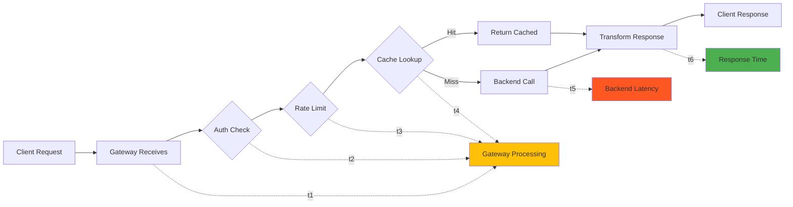

```yaml
metrics:
  latency:
    - request_duration_seconds
    - backend_response_time_seconds
    - gateway_processing_time_seconds
    percentiles: [0.5, 0.95, 0.99]
```

#### 2. **Traffic**
- **Requests per second (RPS)**: Total throughput
- **Requests by route**: Traffic distribution (see [routing.md](routing.md))
- **Requests by client**: User/application activity
- **Protocol distribution**: HTTP/1.1, HTTP/2, WebSocket, gRPC

```yaml
metrics:
  traffic:
    - total_requests_per_second
    - requests_by_route
    - requests_by_client_id
    - requests_by_protocol
```

#### 3. **Errors**
- **Error rate**: Percentage of failed requests
- **Error types**: 4xx (client), 5xx (server)
- **Timeout errors**: Backend timeout occurrences
- **Security errors**: Authentication/authorization failures (see [security.md](security.md))

```yaml
metrics:
  errors:
    - error_rate_percentage
    - errors_by_status_code
    - timeout_errors
    - authentication_failures
    - authorization_failures
```

#### 4. **Saturation**
- **CPU utilization**: Gateway compute usage
- **Memory usage**: RAM consumption
- **Connection pool saturation**: Available vs. used connections
- **Queue depth**: Request backlog (see [scaling.md](scaling.md))

```yaml
metrics:
  saturation:
    - cpu_utilization_percentage
    - memory_usage_bytes
    - connection_pool_utilization
    - request_queue_depth
```

### Custom Metrics

#### Rate Limiting (see [security.md](security.md))
```yaml
rate_limiting:
  - rate_limit_hits_total
  - rate_limit_remaining_by_client
  - rate_limit_exceeded_count
```

#### Caching (see [caching.md](caching.md))
```yaml
caching:
  - cache_hit_ratio
  - cache_miss_count
  - cache_eviction_count
  - cache_size_bytes
  - cache_latency_seconds
```

#### Circuit Breaker (see [patterns.md](patterns.md))
```yaml
circuit_breaker:
  - circuit_breaker_state (open/closed/half-open)
  - circuit_breaker_trips_total
  - circuit_breaker_requests_rejected
```

#### Authentication & Authorization
```yaml
security:
  - jwt_validation_duration
  - oauth_token_refresh_count
  - api_key_validation_failures
```

---

## Monitoring Layers

### Monitoring Layer Architecture

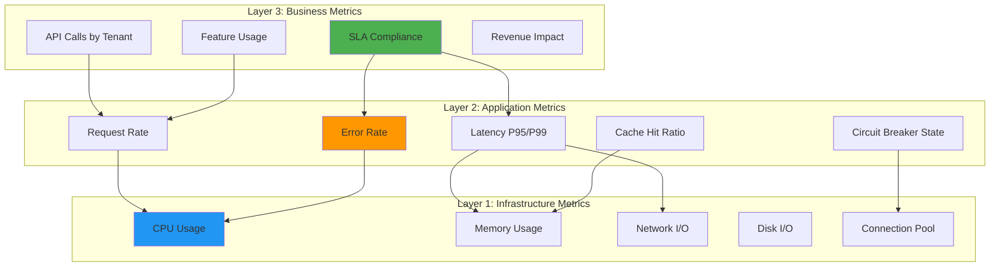

### 1. Infrastructure Layer

Monitor the underlying infrastructure supporting the gateway (see [architecture.md](architecture.md)):

```yaml
infrastructure:
  compute:
    - host_cpu_usage
    - host_memory_usage
    - host_disk_io
    - host_network_io
  
  container:
    - container_cpu_throttling
    - container_memory_limit
    - container_restart_count
  
  network:
    - network_packet_loss
    - network_latency
    - tcp_connection_states
```

### 2. Application Layer

Monitor gateway application metrics:

```yaml
application:
  runtime:
    - goroutines_count (Go)
    - thread_pool_size (Java)
    - event_loop_lag (Node.js)
    - garbage_collection_duration
  
  connections:
    - active_connections
    - websocket_connections
    - grpc_streams
```

### 3. Business Layer

Track business-critical metrics:

```yaml
business:
  - api_calls_by_tenant
  - premium_vs_free_tier_usage
  - feature_flag_evaluation_count
  - sla_compliance_percentage
```

---

## Health Checks

### Health Check Flow

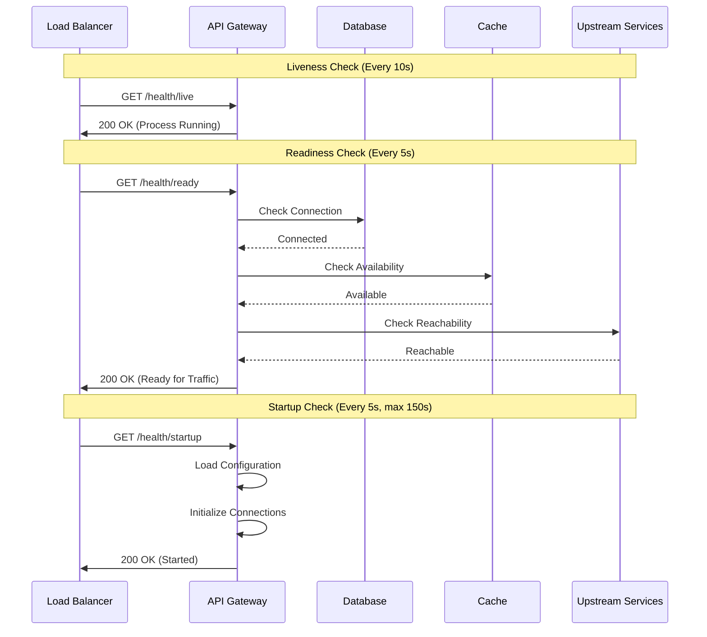

### Types of Health Checks

#### 1. **Liveness Probe**
Determines if the gateway is running:

```yaml
liveness:
  endpoint: /health/live
  interval: 10s
  timeout: 3s
  failure_threshold: 3
  
checks:
  - process_running
  - http_server_responsive
```

#### 2. **Readiness Probe**
Determines if the gateway can accept traffic:

```yaml
readiness:
  endpoint: /health/ready
  interval: 5s
  timeout: 3s
  failure_threshold: 2
  
checks:
  - upstream_services_reachable
  - database_connection_available
  - cache_accessible (see caching.md)
  - configuration_loaded
```

#### 3. **Startup Probe**
Checks if the application has started successfully:

```yaml
startup:
  endpoint: /health/startup
  initial_delay: 0s
  interval: 5s
  timeout: 3s
  failure_threshold: 30
```

### Health Check Implementation

```json
{
  "status": "healthy",
  "timestamp": "2025-10-02T10:30:00Z",
  "checks": {
    "database": {
      "status": "healthy",
      "latency_ms": 5
    },
    "cache": {
      "status": "healthy",
      "hit_ratio": 0.85
    },
    "upstream_services": {
      "user_service": "healthy",
      "payment_service": "degraded",
      "notification_service": "healthy"
    }
  },
  "metrics": {
    "uptime_seconds": 86400,
    "requests_processed": 1500000,
    "error_rate": 0.02
  }
}
```

---

## Distributed Tracing

### Distributed Trace Flow

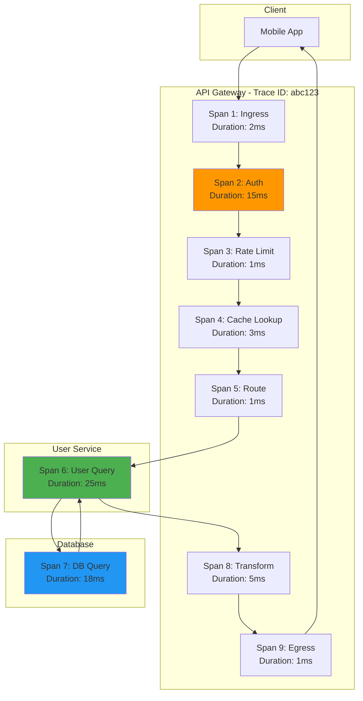

Essential for understanding request flow across microservices (see [architecture.md](architecture.md)):

### OpenTelemetry Implementation

```yaml
tracing:
  provider: opentelemetry
  exporter: jaeger
  sampling_rate: 0.1  # 10% of requests
  
  spans:
    - gateway_ingress
    - authentication
    - rate_limiting
    - routing_decision
    - cache_lookup
    - backend_request
    - response_transformation
    - gateway_egress
```

### Trace Context Propagation

```http
GET /api/v1/users/123 HTTP/1.1
Host: api.example.com
traceparent: 00-4bf92f3577b34da6a3ce929d0e0e4736-00f067aa0ba902b7-01
tracestate: vendor1=xyz,vendor2=abc
```

### Critical Spans to Monitor

1. **Request Reception**: Gateway receives request
2. **Authentication/Authorization**: Security checks (see [security.md](security.md))
3. **Rate Limiting**: Quota verification
4. **Cache Lookup**: Cache hit/miss (see [caching.md](caching.md))
5. **Routing**: Route selection (see [routing.md](routing.md))
6. **Backend Call**: Upstream service request
7. **Response Transformation**: Data transformation
8. **Response Delivery**: Send response to client

---

## Logging Strategy

### Log Levels

```yaml
log_levels:
  ERROR: Critical failures requiring immediate attention
  WARN: Potential issues, degraded performance
  INFO: Important state changes, key operations
  DEBUG: Detailed execution flow (disabled in production)
```

### Structured Logging

```json
{
  "timestamp": "2025-10-02T10:30:00.123Z",
  "level": "INFO",
  "trace_id": "4bf92f3577b34da6a3ce929d0e0e4736",
  "span_id": "00f067aa0ba902b7",
  "service": "api-gateway",
  "component": "router",
  "event": "request_routed",
  "client_ip": "203.0.113.42",
  "method": "GET",
  "path": "/api/v1/users/123",
  "route": "user_service",
  "status_code": 200,
  "duration_ms": 45,
  "cache_hit": true,
  "user_id": "usr_abc123",
  "tenant_id": "tenant_xyz"
}
```

### Log Categories

#### 1. **Access Logs**
```json
{
  "type": "access",
  "timestamp": "2025-10-02T10:30:00Z",
  "client_ip": "203.0.113.42",
  "method": "POST",
  "path": "/api/v1/orders",
  "status": 201,
  "duration_ms": 120,
  "bytes_sent": 4096,
  "user_agent": "Mobile App/1.2.3"
}
```

#### 2. **Error Logs**
```json
{
  "type": "error",
  "timestamp": "2025-10-02T10:31:00Z",
  "error_type": "backend_timeout",
  "error_message": "Connection to payment-service timed out",
  "trace_id": "abc123",
  "service": "payment-service",
  "timeout_ms": 5000,
  "retry_attempt": 2
}
```

#### 3. **Security Logs** (see [security.md](security.md))
```json
{
  "type": "security",
  "timestamp": "2025-10-02T10:32:00Z",
  "event": "authentication_failure",
  "client_ip": "198.51.100.42",
  "reason": "invalid_token",
  "user_agent": "curl/7.68.0",
  "path": "/api/v1/admin/users"
}
```

#### 4. **Performance Logs**
```json
{
  "type": "performance",
  "timestamp": "2025-10-02T10:33:00Z",
  "component": "cache",
  "operation": "get",
  "duration_ms": 2.5,
  "cache_hit": true,
  "cache_size_kb": 15
}
```

---

## Alerting

### Alert Escalation Flow

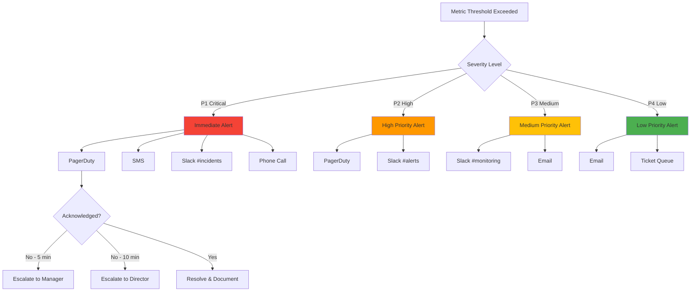

### Alert Severity Levels

```yaml
severity_levels:
  P1_CRITICAL:
    description: Service down, immediate action required
    response_time: 5 minutes
    notification: PagerDuty + SMS + Slack
    
  P2_HIGH:
    description: Significant degradation, user impact
    response_time: 15 minutes
    notification: PagerDuty + Slack
    
  P3_MEDIUM:
    description: Minor issues, monitor closely
    response_time: 1 hour
    notification: Slack + Email
    
  P4_LOW:
    description: Informational, investigate during business hours
    response_time: Next business day
    notification: Email
```

### Critical Alerts

#### 1. **High Error Rate**
```yaml
alert: HighErrorRate
severity: P1_CRITICAL
condition: error_rate > 5% for 5 minutes
description: "Error rate exceeded 5% threshold"
runbook: https://docs.example.com/runbooks/high-error-rate
```

#### 2. **High Latency**
```yaml
alert: HighLatency
severity: P2_HIGH
condition: p95_latency > 1000ms for 10 minutes
description: "95th percentile latency exceeds 1 second"
related: [routing.md, scaling.md]
```

#### 3. **Rate Limit Saturation**
```yaml
alert: RateLimitSaturation
severity: P3_MEDIUM
condition: rate_limit_hits > 80% of limit for 15 minutes
description: "Rate limits approaching saturation"
related: [security.md]
```

#### 4. **Circuit Breaker Open**
```yaml
alert: CircuitBreakerOpen
severity: P2_HIGH
condition: circuit_breaker_state == "open" for 5 minutes
description: "Circuit breaker protecting upstream service triggered"
related: [patterns.md]
```

#### 5. **Cache Degradation**
```yaml
alert: CacheDegradation
severity: P3_MEDIUM
condition: cache_hit_ratio < 50% for 30 minutes
description: "Cache hit ratio below expected threshold"
related: [caching.md]
```

#### 6. **Resource Saturation** (see [scaling.md](scaling.md))
```yaml
alert: HighCPUUsage
severity: P2_HIGH
condition: cpu_usage > 80% for 10 minutes
description: "CPU usage sustained above 80%"
action: Consider scaling horizontally
```

### Alert Decision Tree

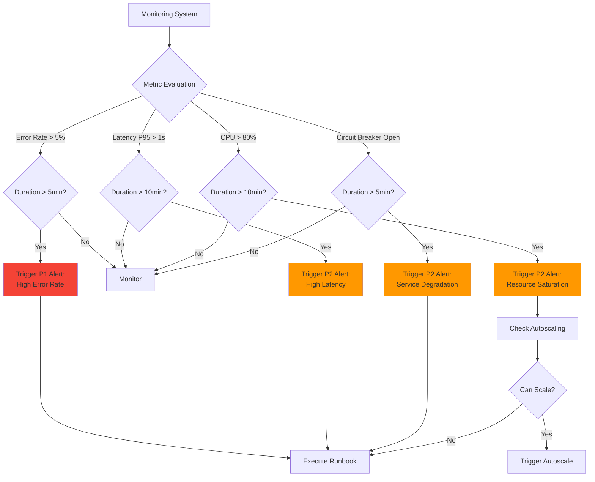

---

## Monitoring Tools

### Recommended Stack

#### 1. **Metrics Collection**
- **Prometheus**: Time-series metrics database
- **Grafana**: Visualization and dashboards
- **StatsD/DogStatsD**: Metrics aggregation

#### 2. **Logging**
- **ELK Stack** (Elasticsearch, Logstash, Kibana)
- **Loki**: Log aggregation system
- **Fluentd/Fluent Bit**: Log forwarding

#### 3. **Tracing**
- **Jaeger**: Distributed tracing
- **Zipkin**: Trace collection and visualization
- **OpenTelemetry**: Unified observability framework

#### 4. **APM (Application Performance Monitoring)**
- **Datadog**: Full-stack monitoring
- **New Relic**: Application performance insights
- **Dynatrace**: AI-powered monitoring

### Integration Example

```yaml
monitoring_stack:
  metrics:
    prometheus:
      scrape_interval: 15s
      retention: 15d
      endpoints:
        - /metrics
    
  logging:
    loki:
      retention: 30d
      labels:
        - service
        - environment
        - level
    
  tracing:
    jaeger:
      sampling_rate: 0.1
      collector: jaeger-collector:14268
    
  dashboards:
    grafana:
      datasources:
        - prometheus
        - loki
        - jaeger
```

---

## Dashboard Design

### Dashboard Hierarchy

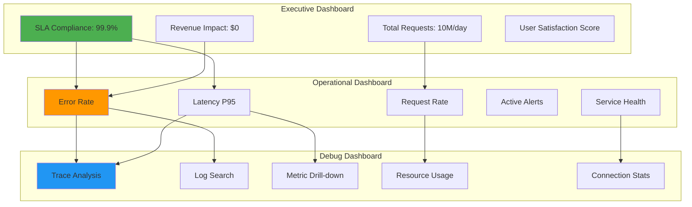

### Overview Dashboard

Key metrics at a glance:

```yaml
overview_dashboard:
  panels:
    - title: "Request Rate"
      metric: rate(http_requests_total[5m])
      visualization: graph
      
    - title: "Error Rate"
      metric: rate(http_requests_total{status=~"5.."}[5m])
      visualization: graph
      threshold: 5%
      
    - title: "Latency (P95)"
      metric: histogram_quantile(0.95, http_request_duration_seconds)
      visualization: graph
      
    - title: "Active Connections"
      metric: active_connections
      visualization: stat
      
    - title: "Cache Hit Ratio"
      metric: cache_hits / (cache_hits + cache_misses)
      visualization: gauge
      reference: caching.md
```

### Routing Dashboard (see [routing.md](routing.md))

```yaml
routing_dashboard:
  panels:
    - title: "Requests by Route"
      metric: sum by (route) (rate(http_requests_total[5m]))
      visualization: bar_chart
      
    - title: "Route Latency Comparison"
      metric: histogram_quantile(0.95, http_request_duration_seconds) by (route)
      visualization: heatmap
      
    - title: "Routing Errors"
      metric: rate(routing_errors_total[5m]) by (error_type)
      visualization: table
```

### Security Dashboard (see [security.md](security.md))

```yaml
security_dashboard:
  panels:
    - title: "Authentication Failures"
      metric: rate(auth_failures_total[5m]) by (reason)
      visualization: graph
      
    - title: "Rate Limit Hits"
      metric: rate_limit_hits by (client_id)
      visualization: table
      
    - title: "Blocked IPs"
      metric: blocked_requests_total by (ip_address)
      visualization: worldmap
      
    - title: "DDoS Detection"
      metric: requests_per_second by (source_ip)
      threshold: 1000
      visualization: graph
```

### Performance Dashboard

```yaml
performance_dashboard:
  panels:
    - title: "CPU Usage"
      metric: cpu_usage_percentage
      visualization: gauge
      threshold: [60, 80]
      
    - title: "Memory Usage"
      metric: memory_usage_bytes / memory_limit_bytes * 100
      visualization: gauge
      
    - title: "Connection Pool"
      metric: connection_pool_utilization
      visualization: stat
      
    - title: "Queue Depth"
      metric: request_queue_depth
      visualization: graph
      reference: scaling.md
```

---

## Performance Baselines

### Establishing Baselines

```yaml
baseline_metrics:
  normal_operation:
    request_rate: 1000-5000 rps
    p95_latency: 100-200ms
    error_rate: 0.1-0.5%
    cpu_usage: 30-50%
    memory_usage: 40-60%
    
  peak_hours:
    request_rate: 8000-12000 rps
    p95_latency: 200-400ms
    error_rate: 0.5-1%
    cpu_usage: 60-80%
    memory_usage: 60-75%
```

### Anomaly Detection

```yaml
anomaly_detection:
  methods:
    - statistical: Standard deviation from mean
    - machine_learning: Prophet forecasting
    - threshold: Fixed upper/lower bounds
    
  alerts:
    - name: "Latency Anomaly"
      condition: latency > baseline_p95 * 1.5
      
    - name: "Traffic Spike"
      condition: rps > baseline_avg * 3
      
    - name: "Error Surge"
      condition: error_rate > baseline_error * 5
```

### Anomaly Detection Workflow

```mermaid
flowchart TD
    A[Collect Metrics] --> B[Calculate Baseline]
    B --> C[Current Metrics]
    C --> D{Statistical Analysis}
    
    D -->|Standard Deviation| E[σ = √Σ(xi-μ)²/n]
    D -->|Machine Learning| F[Prophet Model]
    D -->|Threshold| G[Fixed Bounds]
    
    E --> H{Deviation > 3σ?}
    F --> I{Outside Prediction?}
    G --> J{Exceeds Threshold?}
    
    H -->|Yes| K[Anomaly Detected]
    I -->|Yes| K
    J -->|Yes| K
    
    H -->|No| L[Normal Operation]
    I -->|No| L
    J -->|No| L
    
    K --> M[Trigger Alert]
    K --> N[Log Event]
    K --> O[Update Dashboard]
    
    M --> P{Severity?}
    P -->|High| Q[Page On-Call]
    P -->|Medium| R[Slack Notification]
    P -->|Low| S[Email Notification]
    
    style K fill:#F44336
    style L fill:#4CAF50
```

---

## Integration with Other Components

### Monitoring Data Flow

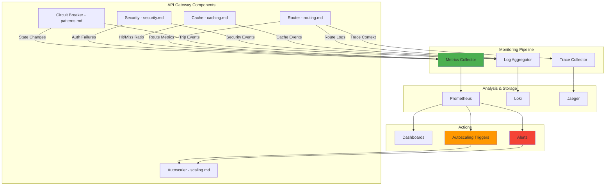

### Architecture Integration (see [architecture.md](architecture.md))

Monitor communication between gateway components:

```yaml
architecture_monitoring:
  - load_balancer_health
  - upstream_service_availability
  - service_mesh_metrics
  - database_connection_pool
```

### Caching Integration (see [caching.md](caching.md))

```yaml
cache_monitoring:
  - cache_hit_ratio by cache_type
  - cache_memory_usage
  - cache_eviction_rate
  - cache_write_through_latency
```

### Security Integration (see [security.md](security.md))

```yaml
security_monitoring:
  - failed_authentication_attempts
  - suspicious_ip_addresses
  - api_key_usage_anomalies
  - cors_violations
```

### Scaling Integration (see [scaling.md](scaling.md))

```yaml
scaling_monitoring:
  - autoscaling_events
  - instance_health_status
  - load_distribution
  - horizontal_scaling_triggers
```

### Pattern Implementation (see [patterns.md](patterns.md))

```yaml
pattern_monitoring:
  circuit_breaker:
    - state_transitions
    - failure_threshold_reached
    - recovery_attempts
    
  retry:
    - retry_attempts_count
    - successful_retries
    - exhausted_retries
    
  timeout:
    - timeout_occurrences
    - timeout_duration_distribution
```

### Circuit Breaker Monitoring

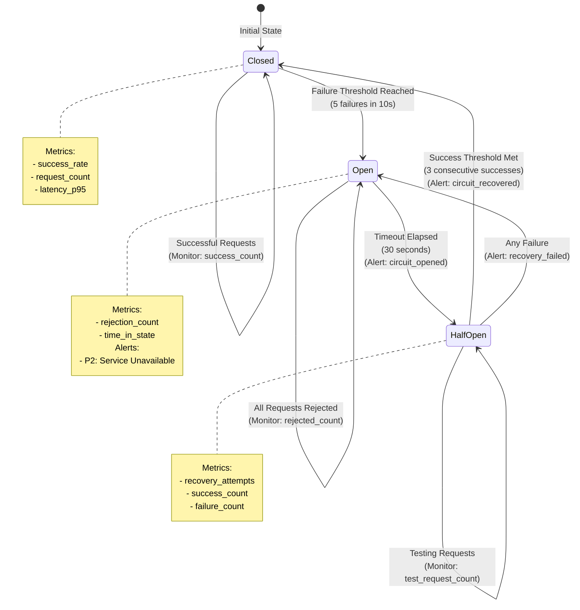

---

## Best Practices

### Monitoring Maturity Model

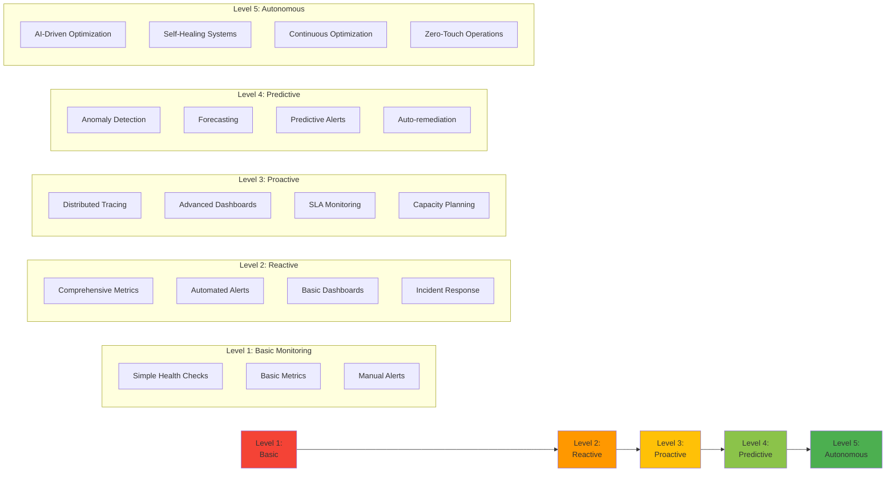

### 1. **Golden Signal Focus**
Prioritize latency, traffic, errors, and saturation metrics.

### 2. **Context-Rich Logging**
Include trace IDs, user context, and operational metadata.

### 3. **Alert Fatigue Prevention**
- Set appropriate thresholds
- Implement alert grouping
- Use progressive escalation
- Regular alert review and tuning

### 4. **Dashboard Hierarchy**
- Executive: High-level KPIs
- Operational: Detailed system health
- Debug: Deep-dive troubleshooting

### 5. **Retention Policy**
```yaml
retention:
  metrics:
    raw: 15 days
    aggregated: 90 days
  logs:
    debug: 7 days
    info: 30 days
    error: 90 days
  traces:
    sampled: 7 days
```

### 6. **Continuous Improvement**
- Regular baseline updates
- Post-incident reviews
- Metric relevance assessment
- Dashboard optimization

---

## Monitoring Checklist

### Monitoring Implementation Roadmap

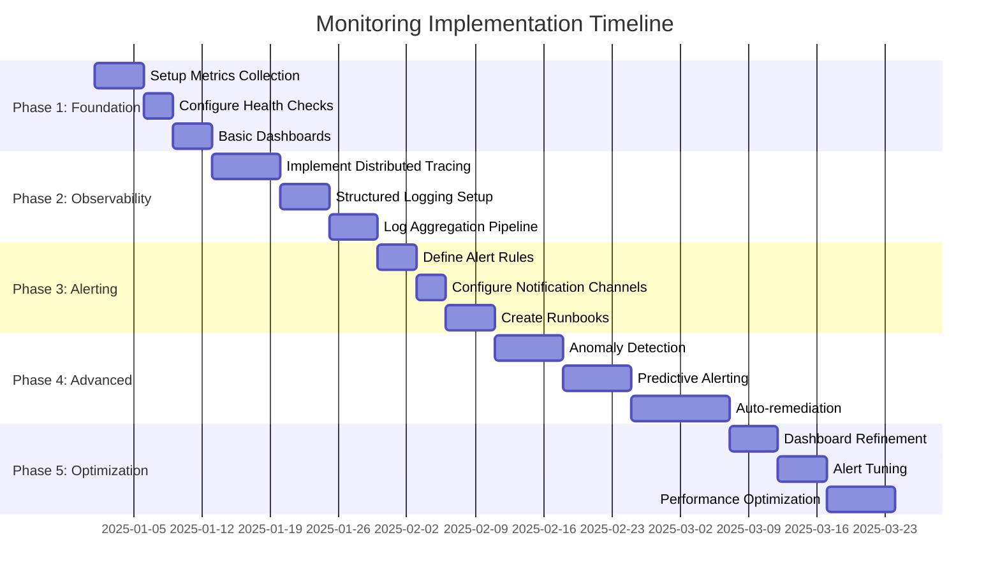

- [ ] All Golden Signals instrumented
- [ ] Health check endpoints configured
- [ ] Distributed tracing implemented
- [ ] Structured logging in place
- [ ] Critical alerts defined
- [ ] Runbooks created for common issues
- [ ] Dashboards for all stakeholders
- [ ] Baselines established
- [ ] On-call rotation configured
- [ ] Integration with incident management
- [ ] Regular monitoring review scheduled

---

## Related Documentation

- **[architecture.md](architecture.md)**: System architecture and component interaction
- **[routing.md](routing.md)**: Request routing and load balancing monitoring
- **[caching.md](caching.md)**: Cache performance metrics
- **[security.md](security.md)**: Security event monitoring and alerting
- **[scaling.md](scaling.md)**: Autoscaling triggers and capacity monitoring
- **[patterns.md](patterns.md)**: Circuit breaker, retry, and resilience pattern monitoring
- **[pros-cons.md](pros-cons.md)**: Trade-offs in monitoring strategies

---

## Conclusion

Effective monitoring provides visibility, enables rapid incident response, and supports data-driven optimization. By monitoring across infrastructure, application, and business layers, you can ensure your API Gateway operates reliably and efficiently at scale.