# API Gateway Patterns

This document outlines proven design patterns and implementation strategies for API Gateway systems. These patterns address common challenges in distributed systems while providing scalable and maintainable solutions.

## Table of Contents

- [Gateway Patterns](#gateway-patterns)
- [Routing Patterns](#routing-patterns)
- [Resilience Patterns](#resilience-patterns)
- [Security Patterns](#security-patterns)
- [Performance Patterns](#performance-patterns)
- [Integration Patterns](#integration-patterns)
- [Data Management Patterns](#data-management-patterns)
- [Deployment Patterns](#deployment-patterns)
- [Anti-Patterns](#anti-patterns)
- [Pattern Selection Guide](#pattern-selection-guide)

## Gateway Patterns

### 1. Single Gateway Pattern (Gateway Aggregation)

A centralized gateway that serves as the single entry point for all client requests.

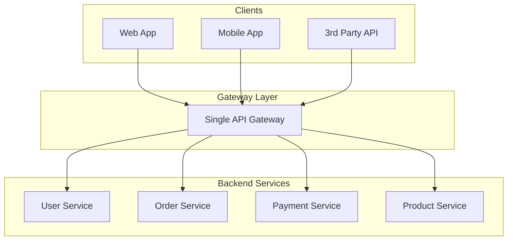
```mermaid
graph TB
    subgraph "Clients"
        Web[Web App]
        Mobile[Mobile App]
        API[3rd Party API]
    end
    
    subgraph "Gateway Layer"
        Gateway[Single API Gateway]
    end
    
    subgraph "Backend Services"
        UserSvc[User Service]
        OrderSvc[Order Service]
        PaymentSvc[Payment Service]
        ProductSvc[Product Service]
    end
    
    Web --> Gateway
    Mobile --> Gateway
    API --> Gateway
    
    Gateway --> UserSvc
    Gateway --> OrderSvc
    Gateway --> PaymentSvc
    Gateway --> ProductSvc
```

**When to Use:**
- Small to medium-scale systems
- Uniform security requirements
- Centralized monitoring needs
- Simple deployment requirements

**Implementation Example:**
```yaml
gateway:
  routes:
    - path: "/api/users/*"
      service: "user-service:8080"
    - path: "/api/orders/*"
      service: "order-service:8080"
    - path: "/api/payments/*"
      service: "payment-service:8080"
```

### 2. Backend for Frontend (BFF) Pattern

Specialized gateways tailored for different client types and their specific needs.

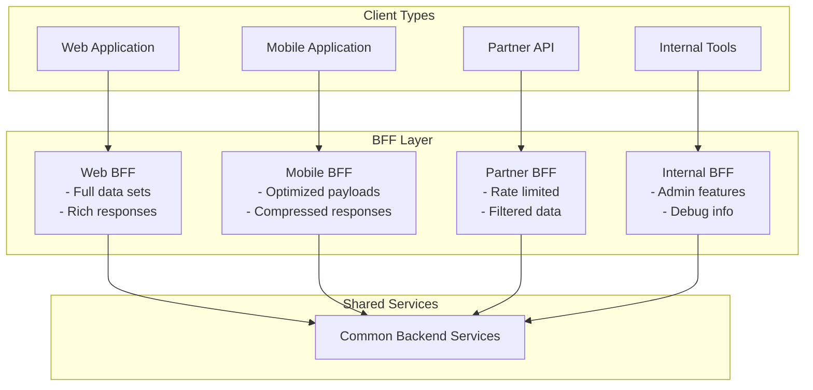
```mermaid
graph TB
    subgraph "Client Types"
        WebClient[Web Application]
        MobileClient[Mobile Application]
        PartnerClient[Partner API]
        InternalClient[Internal Tools]
    end
    
    subgraph "BFF Layer"
        WebBFF[Web BFF<br/>- Full data sets<br/>- Rich responses]
        MobileBFF[Mobile BFF<br/>- Optimized payloads<br/>- Compressed responses]
        PartnerBFF[Partner BFF<br/>- Rate limited<br/>- Filtered data]
        InternalBFF[Internal BFF<br/>- Admin features<br/>- Debug info]
    end
    
    subgraph "Shared Services"
        SharedBackend[Common Backend Services]
    end
    
    WebClient --> WebBFF
    MobileClient --> MobileBFF
    PartnerClient --> PartnerBFF
    InternalClient --> InternalBFF
    
    WebBFF --> SharedBackend
    MobileBFF --> SharedBackend
    PartnerBFF --> SharedBackend
    InternalBFF --> SharedBackend
```

**When to Use:**
- Multiple client types with different needs
- Mobile-first applications requiring data optimization
- Partner integrations with different SLAs
- Team autonomy requirements

**Implementation Considerations:**
- Each BFF can have its own deployment cycle
- Client-specific caching strategies (see [caching.md](caching.md))
- Tailored security policies (see [security.md](security.md))

### 3. Micro-Gateway Pattern

Distributed gateways co-located with services for reduced latency.

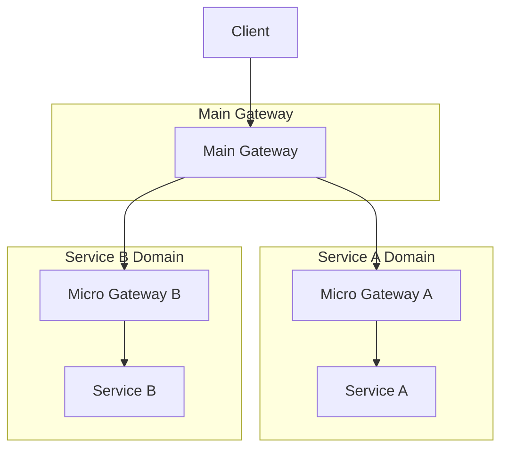
```mermaid
graph TB
    subgraph "Service A Domain"
        MicroGWA[Micro Gateway A]
        ServiceA[Service A]
        MicroGWA --> ServiceA
    end
    
    subgraph "Service B Domain"
        MicroGWB[Micro Gateway B]
        ServiceB[Service B]
        MicroGWB --> ServiceB
    end
    
    subgraph "Main Gateway"
        MainGW[Main Gateway]
    end
    
    Client[Client] --> MainGW
    MainGW --> MicroGWA
    MainGW --> MicroGWB
```

**When to Use:**
- High-performance requirements
- Service-specific policies needed
- Team-owned service boundaries
- Reduced network hops required

## Routing Patterns

### 1. Path-Based Routing

Routes requests based on URL path patterns.

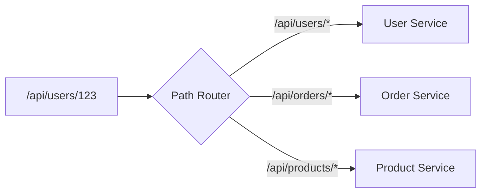
```mermaid
graph LR
    Request["/api/users/123"] --> Router{Path Router}
    Router -->|"/api/users/*"| UserService[User Service]
    Router -->|"/api/orders/*"| OrderService[Order Service]
    Router -->|"/api/products/*"| ProductService[Product Service]
```

**Configuration Example:**
```yaml
routes:
  - pattern: "/api/users/**"
    service: "user-service"
    priority: 1
  - pattern: "/api/orders/**"
    service: "order-service"
    priority: 2
```

### 2. Header-Based Routing

Routes requests based on HTTP headers for A/B testing or versioning.

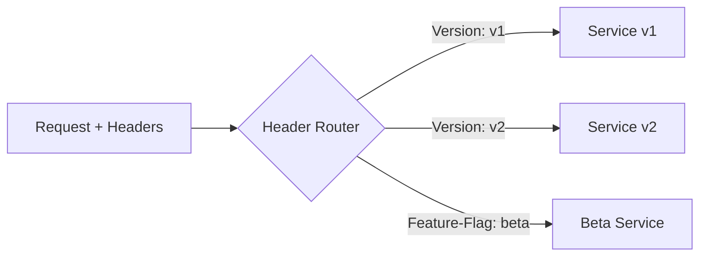
```mermaid
graph LR
    Request[Request + Headers] --> Router{Header Router}
    Router -->|"Version: v1"| ServiceV1[Service v1]
    Router -->|"Version: v2"| ServiceV2[Service v2]
    Router -->|"Feature-Flag: beta"| BetaService[Beta Service]
```

### 3. Weighted Routing

Distributes traffic across multiple service versions based on weights.

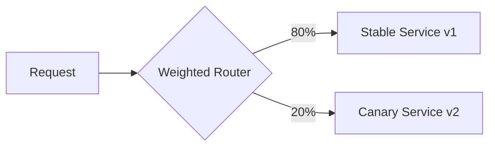
```mermaid
graph LR
    Request --> Router{Weighted Router}
    Router -->|"80%"| StableService[Stable Service v1]
    Router -->|"20%"| CanaryService[Canary Service v2]
```

**Detailed Routing Strategies:** See [routing.md](routing.md) for comprehensive routing configurations.

## Resilience Patterns

### 1. Circuit Breaker Pattern

Prevents cascading failures by stopping requests to failing services.

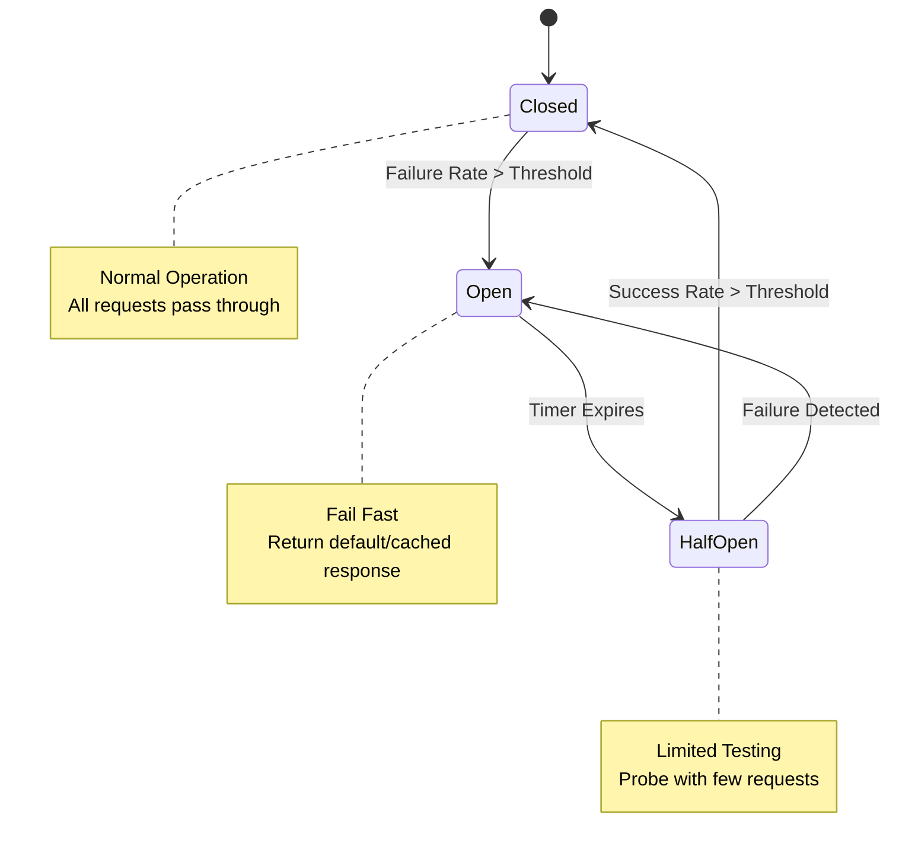
```mermaid
stateDiagram-v2
    [*] --> Closed
    Closed --> Open: Failure Rate > Threshold
    Open --> HalfOpen: Timer Expires
    HalfOpen --> Closed: Success Rate > Threshold
    HalfOpen --> Open: Failure Detected
    
    note right of Closed: Normal Operation<br/>All requests pass through
    note right of Open: Fail Fast<br/>Return default/cached response
    note right of HalfOpen: Limited Testing<br/>Probe with few requests
```

**Implementation Example:**
```yaml
circuit_breaker:
  failure_threshold: 50%
  request_volume_threshold: 20
  sleep_window: 30s
  success_threshold: 80%
```

### 2. Retry Pattern

Automatically retries failed requests with exponential backoff.

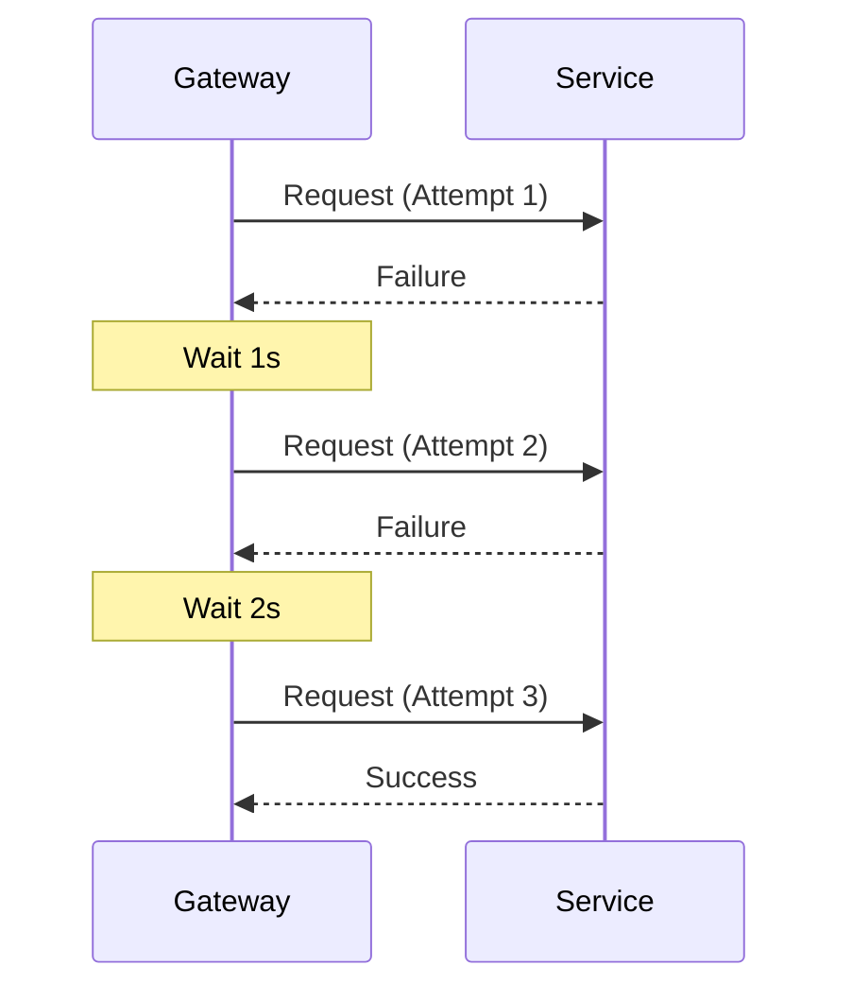
```mermaid
sequenceDiagram
    participant Gateway
    participant Service
    
    Gateway->>Service: Request (Attempt 1)
    Service-->>Gateway: Failure
    
    Note over Gateway: Wait 1s
    Gateway->>Service: Request (Attempt 2)
    Service-->>Gateway: Failure
    
    Note over Gateway: Wait 2s
    Gateway->>Service: Request (Attempt 3)
    Service-->>Gateway: Success
```

**Configuration:**
```yaml
retry:
  max_attempts: 3
  initial_delay: 1s
  max_delay: 10s
  backoff_multiplier: 2
  retry_on: [503, 504, connection_timeout]
```

### 3. Bulkhead Pattern

Isolates resources to prevent one failing component from affecting others.

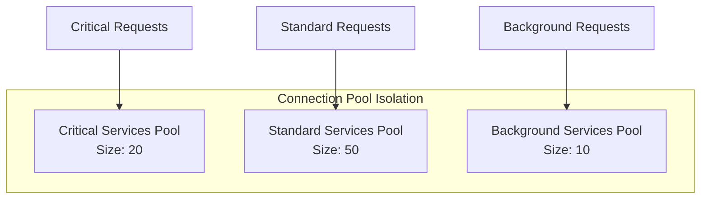
```mermaid
graph TB
    subgraph "Connection Pool Isolation"
        Pool1[Critical Services Pool<br/>Size: 20]
        Pool2[Standard Services Pool<br/>Size: 50]
        Pool3[Background Services Pool<br/>Size: 10]
    end
    
    CriticalReqs[Critical Requests] --> Pool1
    StandardReqs[Standard Requests] --> Pool2
    BackgroundReqs[Background Requests] --> Pool3
```

### 4. Timeout Pattern

Sets time limits for service calls to prevent hanging requests.

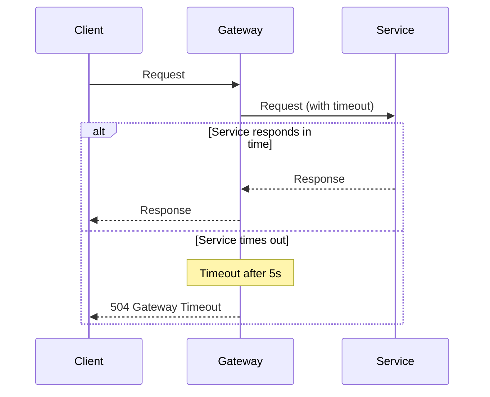
```mermaid
sequenceDiagram
    participant Client
    participant Gateway
    participant Service
    
    Client->>Gateway: Request
    Gateway->>Service: Request (with timeout)
    
    alt Service responds in time
        Service-->>Gateway: Response
        Gateway-->>Client: Response
    else Service times out
        Note over Gateway: Timeout after 5s
        Gateway-->>Client: 504 Gateway Timeout
    end
```

## Security Patterns

### 1. Token Relay Pattern

Forwards authentication tokens from clients to backend services.

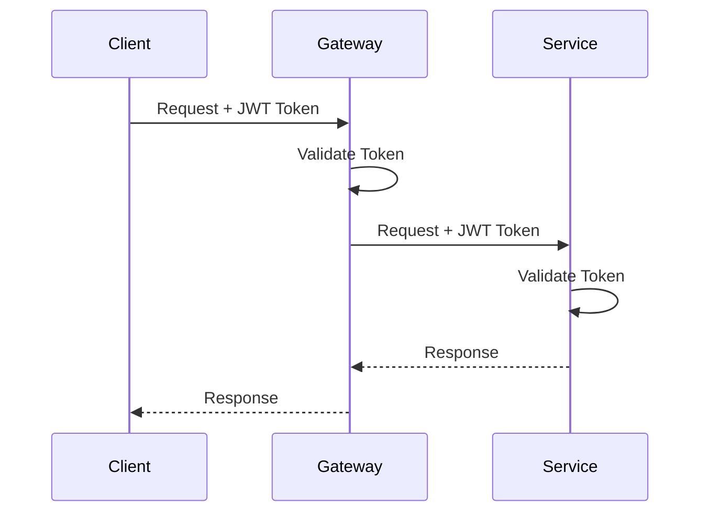
```mermaid
sequenceDiagram
    participant Client
    participant Gateway
    participant Service
    
    Client->>Gateway: Request + JWT Token
    Gateway->>Gateway: Validate Token
    Gateway->>Service: Request + JWT Token
    Service->>Service: Validate Token
    Service-->>Gateway: Response
    Gateway-->>Client: Response
```

### 2. Token Translation Pattern

Converts external tokens to internal service tokens.

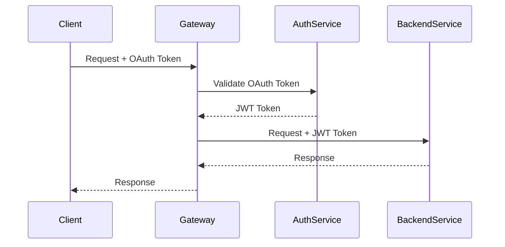
```mermaid
sequenceDiagram
    participant Client
    participant Gateway
    participant AuthService
    participant BackendService
    
    Client->>Gateway: Request + OAuth Token
    Gateway->>AuthService: Validate OAuth Token
    AuthService-->>Gateway: JWT Token
    Gateway->>BackendService: Request + JWT Token
    BackendService-->>Gateway: Response
    Gateway-->>Client: Response
```

### 3. API Key Gateway Pattern

Manages API keys and rate limiting per client.

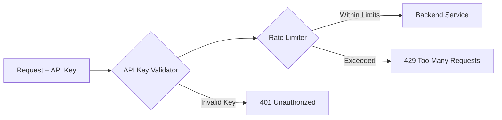
```mermaid
graph LR
    Request[Request + API Key] --> Validator{API Key Validator}
    Validator --> RateLimit{Rate Limiter}
    RateLimit -->|Within Limits| Service[Backend Service]
    RateLimit -->|Exceeded| Error[429 Too Many Requests]
    Validator -->|Invalid Key| AuthError[401 Unauthorized]
```

**Security Implementation:** Detailed security patterns in [security.md](security.md).

## Performance Patterns

### 1. Response Caching Pattern

Caches responses at multiple levels for improved performance.

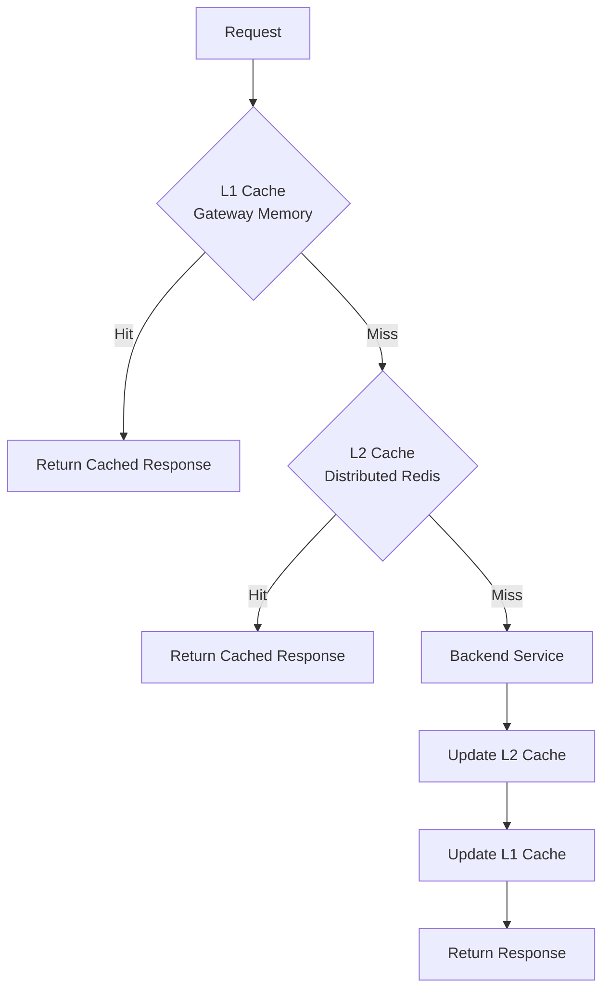
```mermaid
graph TB
    Request --> L1{L1 Cache<br/>Gateway Memory}
    L1 -->|Hit| Response1[Return Cached Response]
    L1 -->|Miss| L2{L2 Cache<br/>Distributed Redis}
    L2 -->|Hit| Response2[Return Cached Response]
    L2 -->|Miss| Service[Backend Service]
    Service --> UpdateL2[Update L2 Cache]
    UpdateL2 --> UpdateL1[Update L1 Cache]
    UpdateL1 --> Response3[Return Response]
```

### 2. Request Batching Pattern

Combines multiple client requests into a single backend call.

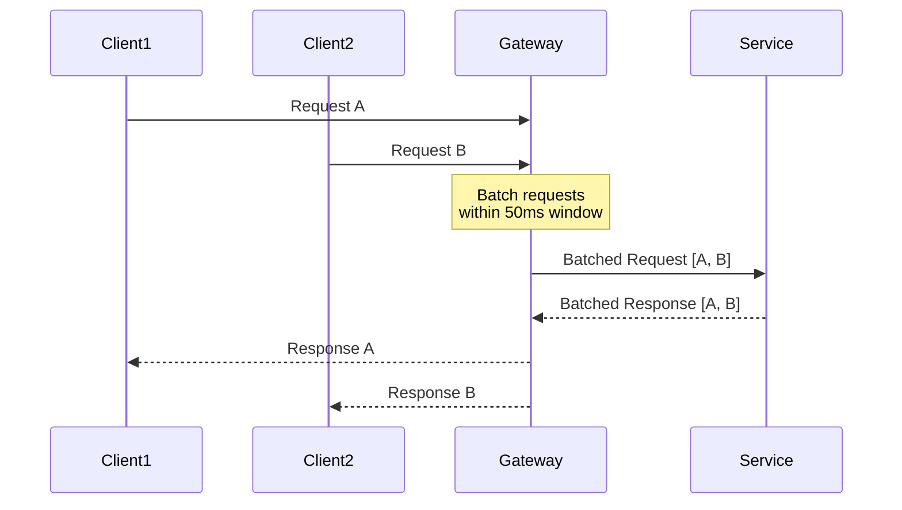
```mermaid
sequenceDiagram
    participant Client1
    participant Client2
    participant Gateway
    participant Service
    
    Client1->>Gateway: Request A
    Client2->>Gateway: Request B
    
    Note over Gateway: Batch requests<br/>within 50ms window
    
    Gateway->>Service: Batched Request [A, B]
    Service-->>Gateway: Batched Response [A, B]
    
    Gateway-->>Client1: Response A
    Gateway-->>Client2: Response B
```

### 3. Connection Pooling Pattern

Reuses connections to backend services for better performance.

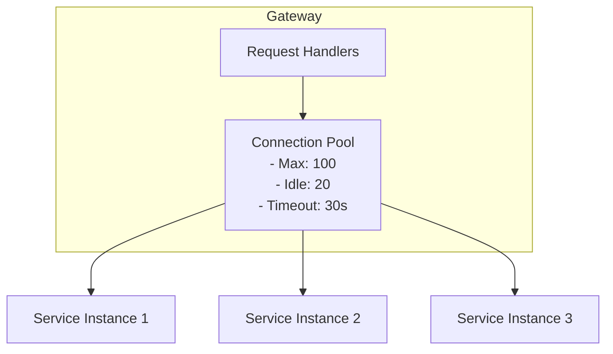
```mermaid
graph TB
    subgraph "Gateway"
        RequestHandler[Request Handlers]
        ConnectionPool[Connection Pool<br/>- Max: 100<br/>- Idle: 20<br/>- Timeout: 30s]
    end
    
    RequestHandler --> ConnectionPool
    ConnectionPool --> Service1[Service Instance 1]
    ConnectionPool --> Service2[Service Instance 2]
    ConnectionPool --> Service3[Service Instance 3]
```

**Performance Optimization:** See [caching.md](caching.md) and [scaling.md](scaling.md) for detailed performance patterns.

## Integration Patterns

### 1. Request-Response Pattern

Synchronous communication for immediate responses.

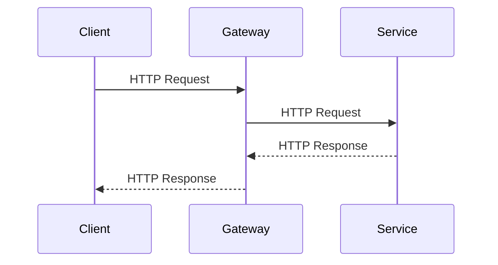
```mermaid
sequenceDiagram
    participant Client
    participant Gateway
    participant Service
    
    Client->>Gateway: HTTP Request
    Gateway->>Service: HTTP Request
    Service-->>Gateway: HTTP Response
    Gateway-->>Client: HTTP Response
```

### 2. Fire-and-Forget Pattern

Asynchronous communication for non-blocking operations.

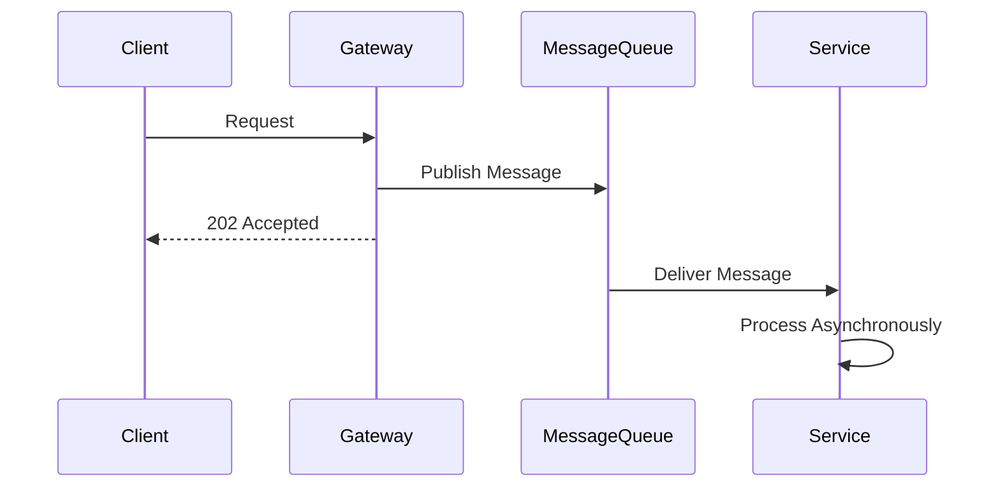
```mermaid
sequenceDiagram
    participant Client
    participant Gateway
    participant MessageQueue
    participant Service
    
    Client->>Gateway: Request
    Gateway->>MessageQueue: Publish Message
    Gateway-->>Client: 202 Accepted
    MessageQueue->>Service: Deliver Message
    Service->>Service: Process Asynchronously
```

### 3. Request-Callback Pattern

Asynchronous processing with callback notifications.

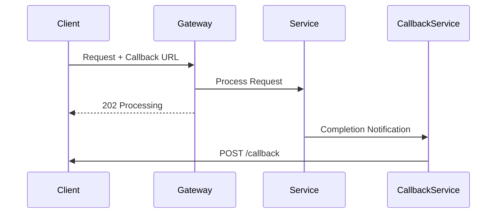
```mermaid
sequenceDiagram
    participant Client
    participant Gateway
    participant Service
    participant CallbackService
    
    Client->>Gateway: Request + Callback URL
    Gateway->>Service: Process Request
    Gateway-->>Client: 202 Processing
    Service->>CallbackService: Completion Notification
    CallbackService->>Client: POST /callback
```

### 4. Aggregation Pattern

Combines responses from multiple services.

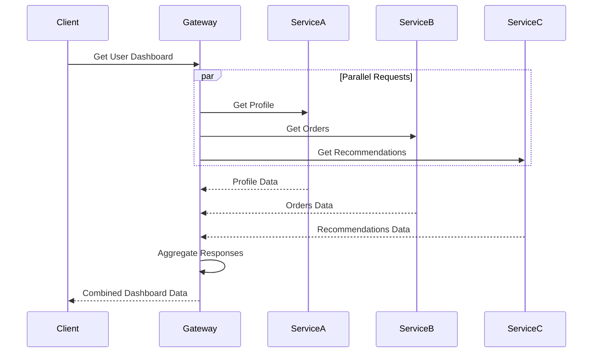
```mermaid
sequenceDiagram
    participant Client
    participant Gateway
    participant ServiceA
    participant ServiceB
    participant ServiceC
    
    Client->>Gateway: Get User Dashboard
    
    par Parallel Requests
        Gateway->>ServiceA: Get Profile
        Gateway->>ServiceB: Get Orders
        Gateway->>ServiceC: Get Recommendations
    end
    
    ServiceA-->>Gateway: Profile Data
    ServiceB-->>Gateway: Orders Data
    ServiceC-->>Gateway: Recommendations Data
    
    Gateway->>Gateway: Aggregate Responses
    Gateway-->>Client: Combined Dashboard Data
```

## Data Management Patterns

### 1. Response Transformation Pattern

Modifies response format based on client requirements.

```mermaid
graph LR
    ServiceResp[Service Response<br/>Full Object] --> Transformer{Response Transformer}
    Transformer -->|Mobile Client| MobileResp[Optimized Response<br/>Essential Fields Only]
    Transformer -->|Web Client| WebResp[Full Response<br/>All Fields]
    Transformer -->|Partner API| PartnerResp[Filtered Response<br/>Public Fields Only]
```

### 2. Request Enrichment Pattern

Adds contextual information to requests before forwarding.

```mermaid
sequenceDiagram
    participant Client
    participant Gateway
    participant UserService
    participant BusinessService
    
    Client->>Gateway: Request (User ID in token)
    Gateway->>UserService: Get User Context
    UserService-->>Gateway: User Details
    Gateway->>Gateway: Enrich Request with User Context
    Gateway->>BusinessService: Enhanced Request
    BusinessService-->>Gateway: Response
    Gateway-->>Client: Response
```

### 3. Data Composition Pattern

Combines data from multiple sources to create composite responses.

```mermaid
graph TB
    Request[Client Request] --> Gateway[API Gateway]
    Gateway --> Service1[User Service]
    Gateway --> Service2[Order Service]
    Gateway --> Service3[Product Service]
    
    Service1 --> Composer[Data Composer]
    Service2 --> Composer
    Service3 --> Composer
    
    Composer --> Response[Composite Response]
```

## Deployment Patterns

### 1. Blue-Green Deployment Pattern

Zero-downtime deployments using parallel environments.

```mermaid
graph TB
    subgraph "Load Balancer"
        LB[Load Balancer]
    end
    
    subgraph "Blue Environment (Live)"
        BlueGW1[Gateway v1.0]
        BlueGW2[Gateway v1.0]
    end
    
    subgraph "Green Environment (New)"
        GreenGW1[Gateway v1.1]
        GreenGW2[Gateway v1.1]
    end
    
    LB --> BlueGW1
    LB --> BlueGW2
    
    GreenGW1 -.->|Ready for switch| LB
    GreenGW2 -.->|Ready for switch| LB
```

### 2. Canary Deployment Pattern

Gradual rollout to a subset of users.

```mermaid
graph LR
    Traffic[100% Traffic] --> Router{Traffic Router}
    Router -->|95%| Stable[Stable Version]
    Router -->|5%| Canary[Canary Version]
    
    Canary --> Monitor[Monitor Metrics]
    Monitor -->|Success| IncreaseCanary[Increase Canary %]
    Monitor -->|Failure| Rollback[Rollback to Stable]
```

### 3. Sidecar Deployment Pattern

Co-locates gateway functionality with services.

```mermaid
graph TB
    subgraph "Pod 1"
        Service1[Business Service]
        Sidecar1[Gateway Sidecar]
        Service1 -.-> Sidecar1
    end
    
    subgraph "Pod 2"
        Service2[Business Service]
        Sidecar2[Gateway Sidecar]
        Service2 -.-> Sidecar2
    end
    
    Client --> Sidecar1
    Client --> Sidecar2
    
    Sidecar1 --> ExternalService[External Service]
    Sidecar2 --> ExternalService
```

**Deployment Strategies:** See [scaling.md](scaling.md) for detailed deployment and scaling patterns.

## Anti-Patterns

### 1. The Distributed Monolith Anti-Pattern

**Problem:** Gateway becomes tightly coupled with all services, creating a distributed monolith.

```mermaid
graph TB
    Gateway[Monolithic Gateway] --> Service1
    Gateway --> Service2
    Gateway --> Service3
    Gateway --> Service4
    
    Note[All services must deploy together<br/>Gateway contains business logic<br/>Single point of failure]
```

**Solution:** Use domain-driven BFF pattern or micro-gateways.

### 2. The Chatty Gateway Anti-Pattern

**Problem:** Gateway makes multiple synchronous calls for a single client request.

```mermaid
sequenceDiagram
    Client->>Gateway: Single Request
    Gateway->>Service1: Call 1
    Service1-->>Gateway: Response 1
    Gateway->>Service2: Call 2
    Service2-->>Gateway: Response 2
    Gateway->>Service3: Call 3
    Service3-->>Gateway: Response 3
    Gateway->>Service4: Call 4
    Service4-->>Gateway: Response 4
    Gateway-->>Client: Final Response
    
    Note over Gateway: High latency due to<br/>sequential calls
```

**Solution:** Use parallel requests, caching, or data aggregation services.

### 3. The Shared Database Anti-Pattern

**Problem:** Gateway and services share the same database.

**Solution:** Each service should own its data. Use API calls for cross-service data access.

### 4. The Kitchen Sink Anti-Pattern

**Problem:** Gateway tries to handle every possible cross-cutting concern.

**Solution:** Focus on essential gateway functions. Use specialized tools for complex operations.

## Pattern Selection Guide

### By System Size

| System Scale | Recommended Patterns |
|-------------|---------------------|
| Small (< 10 services) | Single Gateway, Path-based Routing |
| Medium (10-50 services) | BFF Pattern, Circuit Breaker, Caching |
| Large (50+ services) | Micro-Gateway, Bulkhead, Advanced Monitoring |

### By Performance Requirements

| Requirement | Patterns |
|------------|----------|
| Low Latency | Micro-Gateway, Connection Pooling, L1 Caching |
| High Throughput | Load Balancing, Request Batching, Async Processing |
| High Availability | Circuit Breaker, Retry, Blue-Green Deployment |

### By Security Needs

| Security Level | Patterns |
|---------------|----------|
| Basic | Token Relay, API Key Management |
| Enhanced | Token Translation, OAuth Integration |
| Enterprise | Zero-Trust, mTLS, Advanced Threat Protection |

**Decision Framework:** See [pros-cons.md](pros-cons.md) for detailed pattern selection criteria.

## Best Practices

1. **Start Simple**: Begin with basic patterns and evolve as needs grow
2. **Measure Everything**: Implement comprehensive monitoring ([monitoring.md](monitoring.md))
3. **Security First**: Apply security patterns from the beginning ([security.md](security.md))
4. **Plan for Scale**: Design with horizontal scaling in mind ([scaling.md](scaling.md))
5. **Cache Strategically**: Implement multi-level caching ([caching.md](caching.md))
6. **Route Intelligently**: Use appropriate routing strategies ([routing.md](routing.md))
7. **Handle Failures Gracefully**: Implement resilience patterns
8. **Document Everything**: Maintain clear documentation and decision records

---

**Next Steps:**
1. Choose appropriate patterns based on your system requirements
2. Review [architecture.md](architecture.md) for overall system design
3. Implement security patterns from [security.md](security.md)
4. Set up monitoring using [monitoring.md](monitoring.md) guidelines
5. Plan scaling strategy using [scaling.md](scaling.md) recommendations