# API Gateway Pros & Cons Analysis

*A comprehensive evaluation framework for API Gateway adoption decisions*

**Document Version**: 1.0  
**Last Updated**: September 2025  
**Related Documentation**: See [Architecture](architecture.md), [Security](security.md), [Scaling](scaling.md), [Monitoring](monitoring.md)

---

## Executive Summary

API Gateways represent a critical architectural decision in modern distributed systems. While they offer significant benefits in terms of centralization, security, and operational efficiency, they also introduce complexity and potential failure points. This document provides a balanced analysis to inform architectural decisions.

```mermaid
graph TB
    subgraph "Decision Factors"
        A[System Complexity]
        B[Security Requirements]
        C[Performance Needs]
        D[Operational Capacity]
    end
    
    subgraph "Decision Outcome"
        E[✅ Adopt Gateway]
        F[⚠️ Evaluate Further]
        G[❌ Direct Service Calls]
    end
    
    A --> E
    B --> E
    C --> F
    D --> F
    
    style E fill:#d4edda,stroke:#155724
    style F fill:#fff3cd,stroke:#856404
    style G fill:#f8d7da,stroke:#721c24
```

**Quick Decision Matrix:**
- ✅ **Adopt if**: Multiple microservices, diverse client types, complex security requirements, centralized monitoring needs
- ⚠️ **Evaluate carefully if**: Simple architectures, strict latency requirements, limited operational capacity
- ❌ **Avoid if**: Single monolithic service, extremely low-latency requirements, lack of monitoring infrastructure

---

## 📈 Benefits & Advantages

### 1. Centralized Cross-Cutting Concerns

**Primary Advantage**: Consolidation of common functionality across all services.

**Key Benefits:**
- **Authentication & Authorization**: Single point of security enforcement eliminates duplicated security logic across services (*see [Security](security.md) for implementation details*)
- **Rate Limiting**: Consistent protection against abuse and overuse patterns (*detailed in [Scaling](scaling.md)*)
- **Request/Response Transformation**: Standardized data format conversion and protocol translation
- **Logging & Monitoring**: Unified observability across all API interactions (*comprehensive guide in [Monitoring](monitoring.md)*)

**Business Impact:**
- Reduced development time for new services (30-50% faster service development)
- Consistent security posture across the organization
- Lower maintenance overhead for cross-cutting concerns
- Standardized API contracts and documentation

### 2. Enhanced Security Posture

**Primary Advantage**: Consolidated security enforcement with defense-in-depth principles.

**Security Benefits:**
- **Centralized Authentication**: Single point for JWT validation, OAuth flows, API key management
- **Fine-grained Authorization**: Role-based and attribute-based access control (*detailed implementation in [Security](security.md)*)
- **DDoS Protection**: Rate limiting and throttling at the gateway level
- **Input Validation**: Centralized request sanitization and schema validation
- **SSL/TLS Termination**: Simplified certificate management and encryption

**Compliance Advantages:**
- Easier audit trail maintenance
- Centralized logging for compliance requirements
- Consistent security policy enforcement
- Simplified penetration testing scope

### 3. Simplified Client Integration

**Primary Advantage**: Single API endpoint for diverse client applications.

**Integration Benefits:**
- **Single Entry Point**: Clients interact with one URL instead of multiple service endpoints
- **Protocol Translation**: HTTP to gRPC, REST to GraphQL conversions
- **Response Aggregation**: Combining multiple service responses into single client response
- **Versioning Support**: API version management and backward compatibility (*see [Patterns](patterns.md) for versioning strategies*)

### 4. Operational Excellence

**Primary Advantage**: Enhanced monitoring, debugging, and operational control.

**Operational Benefits:**
- **Centralized Monitoring**: Single point for metrics collection and analysis (*comprehensive approach in [Monitoring](monitoring.md)*)
- **Request Tracing**: End-to-end visibility across service calls
- **Circuit Breaking**: Automatic fault isolation and recovery (*patterns detailed in [Patterns](patterns.md)*)
- **Caching**: Performance optimization through intelligent caching strategies (*implementation guide in [Caching](caching.md)*)

---

## ⚠️ Challenges & Disadvantages

### 1. Performance & Latency Concerns

**Primary Challenge**: Additional network hop introduces latency overhead.

**Performance Impacts:**
- **Additional Latency**: Typical overhead of 5-50ms per request depending on gateway complexity
- **Network Bottleneck**: Gateway becomes a potential throughput limitation
- **CPU Overhead**: Request processing, transformation, and routing computational costs
- **Memory Usage**: Caching and buffering requirements (*mitigation strategies in [Scaling](scaling.md)*)

**Mitigation Strategies:**
- Implement efficient connection pooling and keep-alive connections
- Use asynchronous, non-blocking I/O operations
- Deploy multiple gateway instances with load balancing
- Optimize caching strategies (*detailed in [Caching](caching.md)*)

### 2. Single Point of Failure Risk

**Primary Challenge**: Gateway failure affects all client-service communication.

```mermaid
graph TB
    subgraph "High Availability Setup"
        LB[Load Balancer]
        GW1[Gateway Instance 1]
        GW2[Gateway Instance 2]
        GW3[Gateway Instance 3]
    end
    
    subgraph "Risk Scenario"
        SPOF[❌ All Gateways Down]
        Impact[Complete System Outage]
    end
    
    LB --> GW1
    LB --> GW2
    LB --> GW3
    
    GW1 -.-> SPOF
    GW2 -.-> SPOF
    GW3 -.-> SPOF
    
    SPOF --> Impact
    
    style SPOF fill:#ffcdd2
    style Impact fill:#f8d7da
```

**Availability Concerns:**
- **Complete Outage Risk**: Gateway failure blocks all API access
- **Cascading Failures**: Gateway issues can propagate to backend services
- **Dependency Chain**: Additional component in the critical path
- **Recovery Time**: Gateway restart/failover impacts entire system availability

**Risk Mitigation:**
- Deploy multiple gateway instances across availability zones (*architecture patterns in [Architecture](architecture.md)*)
- Implement health checks and automatic failover mechanisms
- Use circuit breakers to prevent cascade failures (*patterns in [Patterns](patterns.md)*)
- Maintain disaster recovery procedures

### 3. Increased Operational Complexity

**Primary Challenge**: Additional infrastructure component requiring specialized knowledge.

**Complexity Areas:**
- **Configuration Management**: Gateway routing rules, security policies, rate limits
- **Deployment Coordination**: Synchronizing gateway updates with service deployments
- **Debugging Difficulty**: Additional layer complicates request tracing and troubleshooting
- **Skills Requirements**: Team needs gateway-specific expertise

**Operational Overhead:**
- Monitoring gateway health in addition to service health
- Managing gateway configurations and deployments
- Troubleshooting gateway-specific issues
- Maintaining gateway documentation and runbooks

### 4. Vendor Lock-in and Technology Constraints

**Primary Challenge**: Dependency on specific gateway technology or vendor.

**Lock-in Risks:**
- **Proprietary Features**: Vendor-specific configurations and extensions
- **Migration Costs**: Switching gateway solutions requires significant effort
- **Feature Limitations**: Gateway capabilities may constrain service design
- **Licensing Costs**: Commercial gateway solutions can be expensive at scale

---

## 🎯 Decision Framework

### When to Adopt API Gateway

#### ✅ Strong Indicators for Gateway Adoption

1. **Microservices Architecture**: More than 3-5 services requiring coordination
2. **Multiple Client Types**: Web, mobile, partner APIs, IoT devices
3. **Complex Security Requirements**: OAuth, JWT, role-based access control
4. **Cross-cutting Concerns**: Rate limiting, logging, monitoring across services
5. **Service Mesh Alternative**: Simpler alternative to full service mesh complexity
6. **Compliance Requirements**: Centralized audit logging and security enforcement

#### ⚠️ Evaluate Carefully When

1. **Performance Critical**: Sub-10ms response time requirements
2. **Simple Architecture**: Few services with minimal cross-cutting concerns
3. **Limited Operations Team**: Insufficient capacity for additional infrastructure
4. **Budget Constraints**: Cost of gateway infrastructure and licensing
5. **Existing Solutions**: Current direct service communication works well

#### ❌ Avoid Gateway When

1. **Single Service**: Monolithic application without decomposition plans
2. **Ultra-low Latency**: High-frequency trading, real-time gaming systems
3. **Internal-only APIs**: No external clients or security concerns
4. **Resource Constraints**: Cannot support additional infrastructure layer

### Implementation Approach Recommendations

**Phased Adoption Strategy:**

1. **Phase 1 - Basic Routing**: Start with simple request routing to validate architecture
2. **Phase 2 - Security**: Add authentication and basic authorization
3. **Phase 3 - Reliability**: Implement rate limiting and circuit breakers
4. **Phase 4 - Optimization**: Add caching, monitoring, and advanced features

---

## 📊 Comparative Analysis

### API Gateway vs. Alternatives

| Approach | Complexity | Performance | Security | Maintenance |
|----------|------------|-------------|----------|-------------|
| **Direct Service Calls** | Low | Highest | Distributed | High per service |
| **API Gateway** | Medium | Good | Centralized | Medium overall |
| **Service Mesh** | High | Good | Comprehensive | High |
| **Backend for Frontend** | Medium | Very Good | Targeted | Medium |

*Detailed pattern comparisons available in [Patterns](patterns.md)*

### Cost-Benefit Analysis

**Costs:**
- Infrastructure: Gateway servers, load balancers, monitoring tools
- Development: Initial setup, configuration, integration testing
- Operations: Ongoing maintenance, monitoring, troubleshooting
- Licensing: Commercial gateway solutions (if applicable)

**Benefits:**
- Development Efficiency: Faster service development (estimated 30-50% reduction)
- Security Consistency: Reduced security vulnerabilities through centralization
- Operational Visibility: Improved debugging and monitoring capabilities
- Client Simplicity: Reduced integration complexity for client applications

**ROI Calculation Framework:**
- **Break-even Point**: Typically achieved with 3+ services and 2+ client types
- **Time to Value**: 3-6 months for basic implementation, 6-12 months for advanced features
- **Maintenance Savings**: 20-40% reduction in cross-cutting concern maintenance

---

## 🔍 Real-World Scenarios

### Scenario 1: E-commerce Platform

**Context**: Online retail with web app, mobile app, and partner integrations

**Requirements:**
- User authentication across all channels
- Product catalog, order management, payment processing
- Rate limiting for partner APIs
- Compliance logging for financial transactions

**Decision**: ✅ **Strong candidate for API Gateway**

**Rationale:**
- Multiple client types requiring different data formats
- Complex security requirements with payment compliance
- Need for centralized rate limiting and monitoring
- Cross-cutting logging requirements

*Implementation details in [Architecture](architecture.md) and [Security](security.md)*

### Scenario 2: Internal Microservices

**Context**: Company internal tools with 5 microservices

**Requirements:**
- Single-sign-on integration
- Internal developer access only
- Simple CRUD operations
- Minimal latency requirements

**Decision**: ⚠️ **Evaluate alternatives**

**Rationale:**
- Internal-only usage reduces security complexity
- Service mesh might provide better service-to-service communication
- Direct service calls could be simpler for internal use
- Consider Backend for Frontend pattern instead

### Scenario 3: Real-time Gaming API

**Context**: Multiplayer game with microsecond latency requirements

**Requirements:**
- Sub-5ms response times
- High-frequency game state updates
- Single client type (game client)
- Simple authentication

**Decision**: ❌ **Avoid API Gateway**

**Rationale:**
- Ultra-low latency requirements conflict with gateway overhead
- Single client type reduces integration complexity benefits
- Direct UDP/TCP connections more appropriate
- Custom protocol optimization needed

---

## 📋 Implementation Checklist

### Pre-Implementation Assessment

- [ ] **Architecture Review**: Document current service architecture (*use [Architecture](architecture.md) as template*)
- [ ] **Performance Baseline**: Measure current API response times and throughput
- [ ] **Security Assessment**: Identify current authentication and authorization mechanisms
- [ ] **Client Analysis**: Catalog all client types and integration patterns
- [ ] **Team Readiness**: Assess operational capacity and skills

### Gateway Selection Criteria

- [ ] **Performance Requirements**: Latency, throughput, and scalability needs
- [ ] **Security Features**: Authentication, authorization, and compliance requirements
- [ ] **Integration Capabilities**: Protocol support, transformation features
- [ ] **Operational Features**: Monitoring, logging, health checks
- [ ] **Vendor Considerations**: Licensing, support, community ecosystem

### Post-Implementation Validation

- [ ] **Performance Testing**: Compare before/after metrics
- [ ] **Security Validation**: Penetration testing and vulnerability assessment
- [ ] **Monitoring Setup**: Implement comprehensive observability (*follow [Monitoring](monitoring.md) guide*)
- [ ] **Documentation**: Update API documentation and operational runbooks
- [ ] **Team Training**: Ensure operations team can manage gateway effectively

---

## 🔗 Related Documentation

This analysis should be read in conjunction with:

- **[Architecture](architecture.md)**: System design principles and implementation patterns
- **[Security](security.md)**: Detailed security implementation guidelines
- **[Scaling](scaling.md)**: Performance optimization and scaling strategies  
- **[Monitoring](monitoring.md)**: Observability and operational best practices
- **[Patterns](patterns.md)**: Common design patterns and anti-patterns
- **[Caching](caching.md)**: Caching strategies and implementation details
- **[Routing](routing.md)**: Request routing configuration and best practices

---

## 📞 Decision Support

For complex architectural decisions, consider:

1. **Architecture Review**: Conduct formal review with stakeholders
2. **Proof of Concept**: Implement small-scale prototype to validate assumptions
3. **Performance Testing**: Benchmark gateway solutions under realistic load
4. **Risk Assessment**: Evaluate failure scenarios and mitigation strategies
5. **Team Consultation**: Engage with development and operations teams

**Key Success Factors:**
- Clear understanding of requirements and constraints
- Realistic performance expectations
- Adequate operational capacity
- Phased implementation approach
- Comprehensive monitoring and alerting

---

*This document is part of the API Gateway System Design documentation suite. For questions or clarifications, refer to the related documentation or conduct a formal architecture review.* cross-cutting concerns