# API Gateway Routing

*Comprehensive guide to request routing strategies, configuration patterns, and best practices*

**Document Version**: 1.0  
**Last Updated**: September 2025  
**Related Documentation**: See [Architecture](architecture.md), [Security](security.md), [Patterns](patterns.md), [Monitoring](monitoring.md)

---

## Table of Contents

1. [Overview](#overview)
2. [Routing Fundamentals](#routing-fundamentals)
3. [Routing Strategies](#routing-strategies)
4. [Configuration Patterns](#configuration-patterns)
5. [Advanced Routing Features](#advanced-routing-features)
6. [Load Balancing](#load-balancing)
7. [Service Discovery](#service-discovery)
8. [Health Checks & Circuit Breaking](#health-checks--circuit-breaking)
9. [Request Transformation](#request-transformation)
10. [Monitoring & Observability](#monitoring--observability)
11. [Best Practices](#best-practices)
12. [Troubleshooting](#troubleshooting)

---

## Overview

API Gateway routing is the foundational mechanism that determines how incoming requests are directed to appropriate backend services. Effective routing strategies ensure optimal performance, reliability, and maintainability in distributed systems.

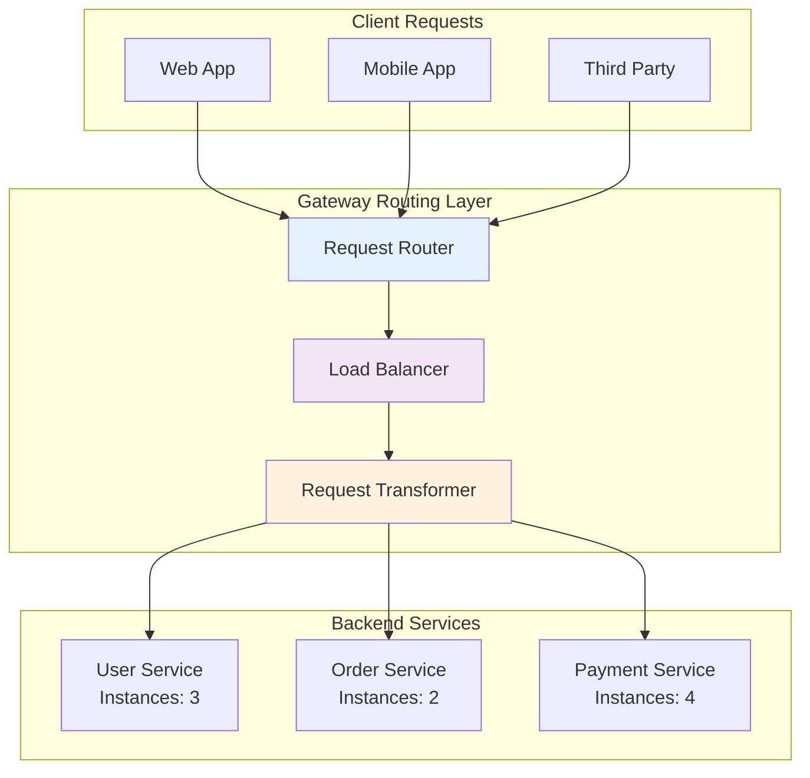

**Key Routing Decisions:**
- **Path-based Routing**: Route requests based on URL patterns
- **Host-based Routing**: Route based on request hostname or subdomain
- **Header-based Routing**: Route using custom headers or user agents
- **Method-based Routing**: Different routing for GET, POST, PUT, DELETE operations
- **Content-based Routing**: Route based on request body content or parameters

*For architectural context, see [Architecture](architecture.md)*

---

## Routing Fundamentals

### Request Matching Process

The gateway evaluates routing rules in a specific order to determine the target service:

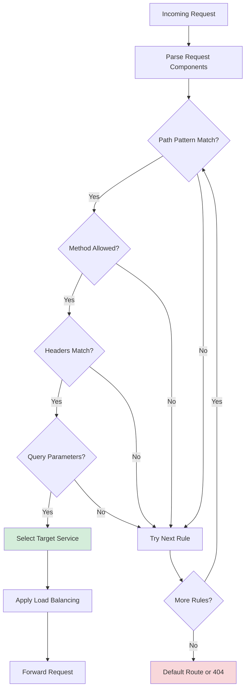

### Core Routing Components

**1. Route Definitions**
```yaml
routes:
  - id: user-service-route
    path: /api/users/**
    methods: [GET, POST, PUT, DELETE]
    service: user-service
    priority: 100
    
  - id: order-service-route
    path: /api/orders/**
    methods: [GET, POST]
    service: order-service
    priority: 90
```

**2. Service Registry**
```yaml
services:
  user-service:
    instances:
      - url: http://user-service-1:8080
        weight: 100
        health_check: /health
      - url: http://user-service-2:8080
        weight: 100
        health_check: /health
    
  order-service:
    instances:
      - url: http://order-service-1:8081
        weight: 50
        health_check: /actuator/health
```

**3. Request Context**
- Source IP address and user agent
- Authentication tokens and user roles
- Request headers and query parameters
- Request body content and size
- Geographic location (if available)

---

## Routing Strategies

### 1. Path-Based Routing

**Most Common Strategy**: Route requests based on URL path patterns.

```mermaid
graph LR
    subgraph "Request Paths"
        P1[/api/users/*]
        P2[/api/orders/*]
        P3[/api/payments/*]
        P4[/api/notifications/*]
    end
    
    subgraph "Target Services"
        S1[User Service]
        S2[Order Service]
        S3[Payment Service]
        S4[Notification Service]
    end
    
    P1 --> S1
    P2 --> S2
    P3 --> S3
    P4 --> S4
    
    style P1 fill:#e8f5e8
    style P2 fill:#e3f2fd
    style P3 fill:#fff3e0
    style P4 fill:#fce4ec
```

**Configuration Examples:**

```yaml
# Exact Path Matching
routes:
  - path: /api/users/profile
    service: user-service
    exact: true

# Prefix Matching (most common)
routes:
  - path: /api/users/
    service: user-service
    match_type: prefix

# Wildcard Matching
routes:
  - path: /api/users/**
    service: user-service
    match_type: wildcard

# Regex Matching (advanced)
routes:
  - path: /api/users/(\d+)/orders
    service: order-service
    match_type: regex
    path_variables:
      - user_id
```

**Path Matching Priority:**
1. Exact matches (highest priority)
2. Longest prefix matches
3. Regex patterns
4. Wildcard patterns
5. Default/catch-all routes (lowest priority)

### 2. Host-Based Routing

**Use Case**: Multi-tenant applications or API versioning via subdomains.

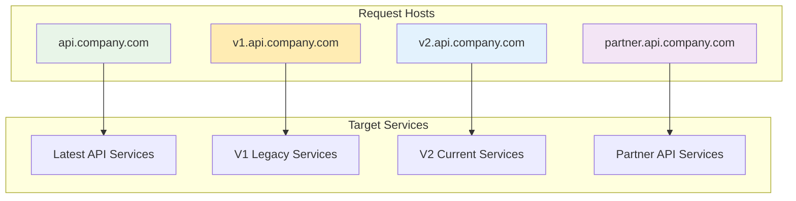

**Configuration Example:**
```yaml
routes:
  - host: api.company.com
    service: current-api-services
    
  - host: v1.api.company.com
    service: legacy-api-v1
    
  - host: partner.api.company.com
    service: partner-api-services
    security:
      auth_required: true
      rate_limit: 1000/hour
```

### 3. Header-Based Routing

**Use Case**: A/B testing, canary deployments, or client-specific routing.

```yaml
# User Agent Based Routing
routes:
  - path: /api/users/**
    service: user-service-v1
    conditions:
      headers:
        User-Agent: ".*Mobile.*"
        
  - path: /api/users/**
    service: user-service-v2
    conditions:
      headers:
        User-Agent: ".*Web.*"

# Custom Header Routing
routes:
  - path: /api/**
    service: canary-services
    conditions:
      headers:
        X-Canary-User: "true"
        
  - path: /api/**
    service: stable-services
    default: true
```

### 4. Method-Based Routing

**Use Case**: Different services handle different HTTP methods.

```yaml
routes:
  # Read operations to read-optimized service
  - path: /api/products/**
    methods: [GET, HEAD]
    service: product-read-service
    
  # Write operations to write-optimized service
  - path: /api/products/**
    methods: [POST, PUT, DELETE]
    service: product-write-service
    
  # Search operations to search service
  - path: /api/products/search
    methods: [GET]
    service: product-search-service
    priority: 200  # Higher priority than wildcard
```

### 5. Weight-Based Routing

**Use Case**: Gradual rollouts, canary deployments, and load distribution.

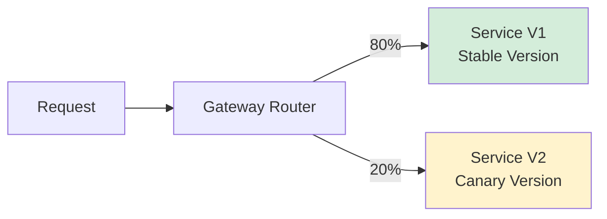

**Configuration:**
```yaml
routes:
  - path: /api/users/**
    services:
      - service: user-service-v1
        weight: 80
      - service: user-service-v2
        weight: 20
    traffic_splitting:
      strategy: weighted_round_robin
      
# Progressive Rollout Configuration
traffic_policies:
  canary_rollout:
    initial_weight: 5
    target_weight: 100
    increment: 10
    interval: 1h
    success_criteria:
      error_rate_threshold: 1%
      latency_p99_threshold: 500ms
```

---

## Configuration Patterns

### 1. Hierarchical Configuration

**Structure for Complex Routing Rules:**

```yaml
gateway:
  global_config:
    timeout: 30s
    retries: 3
    
  route_groups:
    api_v1:
      prefix: /api/v1
      default_timeout: 15s
      routes:
        - path: /users/**
          service: user-service-v1
        - path: /orders/**
          service: order-service-v1
          
    api_v2:
      prefix: /api/v2
      default_timeout: 20s
      routes:
        - path: /users/**
          service: user-service-v2
          features:
            - caching
            - rate_limiting
```

### 2. Environment-Specific Configuration

```yaml
# Base configuration
base: &base
  timeout: 30s
  retries: 3
  
environments:
  development:
    <<: *base
    routes:
      - path: /api/**
        service: dev-services
        debug: true
        
  staging:
    <<: *base
    routes:
      - path: /api/**
        service: staging-services
        
  production:
    <<: *base
    timeout: 10s  # Override for production
    routes:
      - path: /api/**
        service: production-services
        rate_limit: 10000/hour
```

### 3. Dynamic Configuration

**Runtime Route Updates:**

```yaml
# Configuration with dynamic updates
dynamic_routing:
  enabled: true
  config_source: consul  # or etcd, database, etc.
  refresh_interval: 30s
  
  routes:
    - id: dynamic-user-route
      path: /api/users/**
      service: ${USER_SERVICE_NAME}
      replicas: ${USER_SERVICE_REPLICAS}
      
# Feature flags integration
feature_flags:
  new_user_service:
    enabled: false
    rollout_percentage: 0
    
conditional_routes:
  - condition: feature_flags.new_user_service.enabled
    path: /api/users/**
    service: new-user-service
    traffic_percentage: ${feature_flags.new_user_service.rollout_percentage}
```

---

## Advanced Routing Features

### 1. Request Rewriting

**URL Path Manipulation:**

```yaml
routes:
  - path: /api/v1/users/**
    service: user-service
    rewrite:
      # Remove version prefix
      path: /users/$1
      
  - path: /legacy/user/(.+)
    service: user-service
    rewrite:
      # Transform legacy URLs
      path: /api/users/$1
      
  - path: /public/docs/**
    service: documentation-service
    rewrite:
      path: /docs/$1
      headers:
        X-Original-Path: $original_path
```

### 2. Request Aggregation

**Combining Multiple Service Responses:**

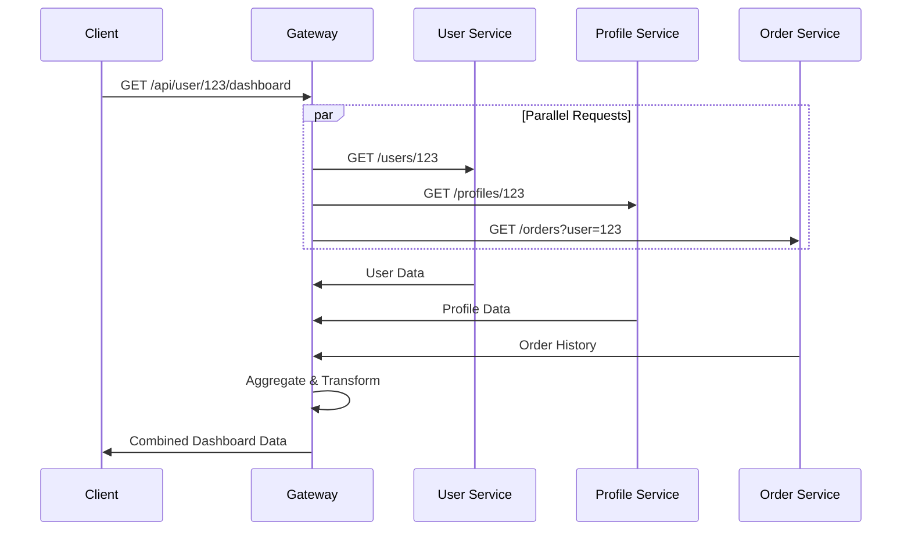

**Configuration:**
```yaml
routes:
  - path: /api/user/(\d+)/dashboard
    aggregation:
      strategy: parallel
      requests:
        - service: user-service
          path: /users/$1
          assign: user
        - service: profile-service
          path: /profiles/$1
          assign: profile
        - service: order-service
          path: /orders?user=$1
          assign: orders
      response_template: |
        {
          "user": {{ user }},
          "profile": {{ profile }},
          "recent_orders": {{ orders.data[:5] }}
        }
```

### 3. Conditional Routing

**Context-Aware Request Routing:**

```yaml
routes:
  # Route based on user role
  - path: /api/admin/**
    conditions:
      jwt_claims:
        role: admin
    service: admin-service
    
  # Route based on geographic location
  - path: /api/data/**
    conditions:
      headers:
        X-Country-Code: US
    service: us-data-service
    
  - path: /api/data/**
    conditions:
      headers:
        X-Country-Code: EU
    service: eu-data-service
    compliance:
      gdpr: true
    
  # Route based on request size
  - path: /api/upload/**
    conditions:
      content_length: "> 10MB"
    service: large-file-service
    timeout: 300s
```

### 4. Circuit Breaker Integration

**Fault Tolerance in Routing:**

```yaml
routes:
  - path: /api/users/**
    service: user-service
    circuit_breaker:
      failure_threshold: 50%
      timeout: 60s
      fallback:
        service: user-cache-service
        static_response:
          status: 503
          body: |
            {
              "error": "User service temporarily unavailable",
              "retry_after": 60
            }
```

*For detailed circuit breaker patterns, see [Patterns](patterns.md)*

---

## Load Balancing

### Load Balancing Algorithms

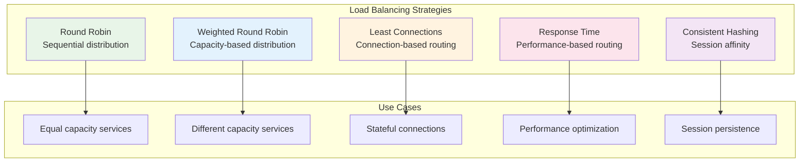

### 1. Round Robin

**Basic Implementation:**
```yaml
services:
  user-service:
    load_balancer:
      algorithm: round_robin
    instances:
      - url: http://user-1:8080
      - url: http://user-2:8080
      - url: http://user-3:8080
```

### 2. Weighted Round Robin

**Capacity-Based Distribution:**
```yaml
services:
  user-service:
    load_balancer:
      algorithm: weighted_round_robin
    instances:
      - url: http://user-1:8080
        weight: 100  # Standard instance
      - url: http://user-2:8080
        weight: 200  # High-capacity instance
      - url: http://user-3:8080
        weight: 50   # Limited-capacity instance
```

### 3. Least Connections

**Connection-Based Routing:**
```yaml
services:
  user-service:
    load_balancer:
      algorithm: least_connections
      connection_tracking: true
    instances:
      - url: http://user-1:8080
        max_connections: 100
      - url: http://user-2:8080
        max_connections: 150
```

### 4. Consistent Hashing

**Session Affinity:**
```yaml
services:
  user-service:
    load_balancer:
      algorithm: consistent_hash
      hash_key: user_id  # or client_ip, session_id
    instances:
      - url: http://user-1:8080
        hash_weight: 100
      - url: http://user-2:8080
        hash_weight: 100
        
routes:
  - path: /api/users/(\d+)/**
    service: user-service
    load_balancer:
      hash_key: $1  # Use user ID from path
```

### 5. Geographic Load Balancing

**Location-Aware Routing:**
```yaml
services:
  global-service:
    load_balancer:
      algorithm: geographic
    regions:
      us-east:
        instances:
          - url: http://us-east-1:8080
          - url: http://us-east-2:8080
      eu-west:
        instances:
          - url: http://eu-west-1:8080
          - url: http://eu-west-2:8080
    routing_rules:
      - condition: headers.X-Country-Code IN ['US', 'CA']
        region: us-east
      - condition: headers.X-Country-Code IN ['DE', 'FR', 'UK']
        region: eu-west
```

---

## Service Discovery

### 1. Static Service Registration

**Manual Configuration:**
```yaml
services:
  user-service:
    instances:
      - url: http://10.0.1.10:8080
        metadata:
          version: v1.2.3
          datacenter: us-east-1a
      - url: http://10.0.1.11:8080
        metadata:
          version: v1.2.3
          datacenter: us-east-1b
```

### 2. Dynamic Service Discovery

**Integration with Service Registries:**

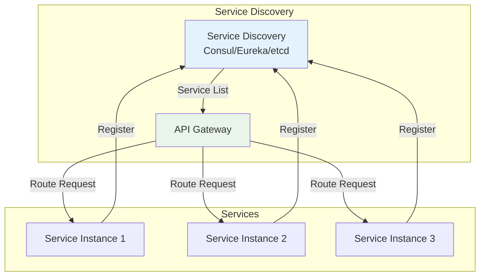

**Consul Integration:**
```yaml
service_discovery:
  provider: consul
  config:
    address: http://consul:8500
    datacenter: dc1
    
services:
  user-service:
    discovery:
      service_name: user-service
      tags: [api, v1]
      health_check: true
    load_balancer:
      algorithm: round_robin
```

**Kubernetes Service Discovery:**
```yaml
service_discovery:
  provider: kubernetes
  config:
    namespace: default
    
services:
  user-service:
    discovery:
      service: user-service
      port: 8080
      selector:
        app: user-service
        version: v1
```

### 3. DNS-Based Discovery

**DNS SRV Records:**
```yaml
service_discovery:
  provider: dns
  
services:
  user-service:
    discovery:
      hostname: _user-service._tcp.internal.company.com
    health_check:
      path: /health
      interval: 30s
```

---

## Health Checks & Circuit Breaking

### Health Check Configuration

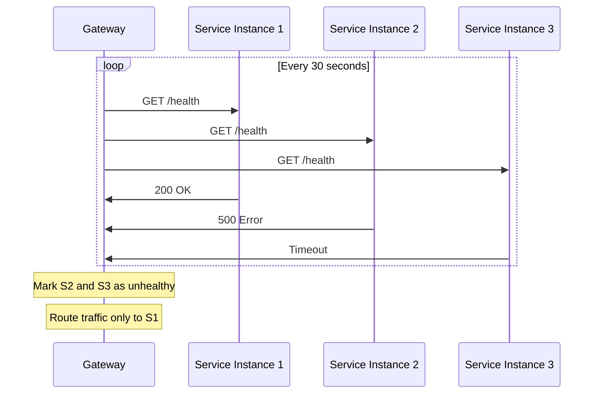

**Health Check Types:**

```yaml
services:
  user-service:
    instances:
      - url: http://user-1:8080
        health_check:
          type: http
          path: /actuator/health
          interval: 30s
          timeout: 5s
          healthy_threshold: 2
          unhealthy_threshold: 3
          
      - url: http://user-2:8080
        health_check:
          type: tcp
          port: 8080
          interval: 15s
          
      - url: http://user-3:8080
        health_check:
          type: custom
          command: "curl -f http://localhost:8080/deep-health"
          interval: 60s
```

### Circuit Breaker Implementation

**Fault Tolerance Patterns:**

```yaml
routes:
  - path: /api/users/**
    service: user-service
    circuit_breaker:
      # Circuit breaker settings
      failure_threshold: 50%      # Open circuit at 50% failure rate
      timeout: 60s               # Stay open for 60 seconds
      min_requests: 10           # Minimum requests to evaluate
      
      # Fallback strategies
      fallback:
        strategy: cached_response
        cache_key: "users:${path_param_1}"
        ttl: 300s
        
        # Alternative fallback to different service
        alternative_service: user-cache-service
        
        # Static response fallback
        static_response:
          status: 503
          headers:
            Retry-After: 60
          body: |
            {
              "error": "Service temporarily unavailable",
              "message": "Please try again in a few minutes"
            }
```

**Circuit Breaker States:**

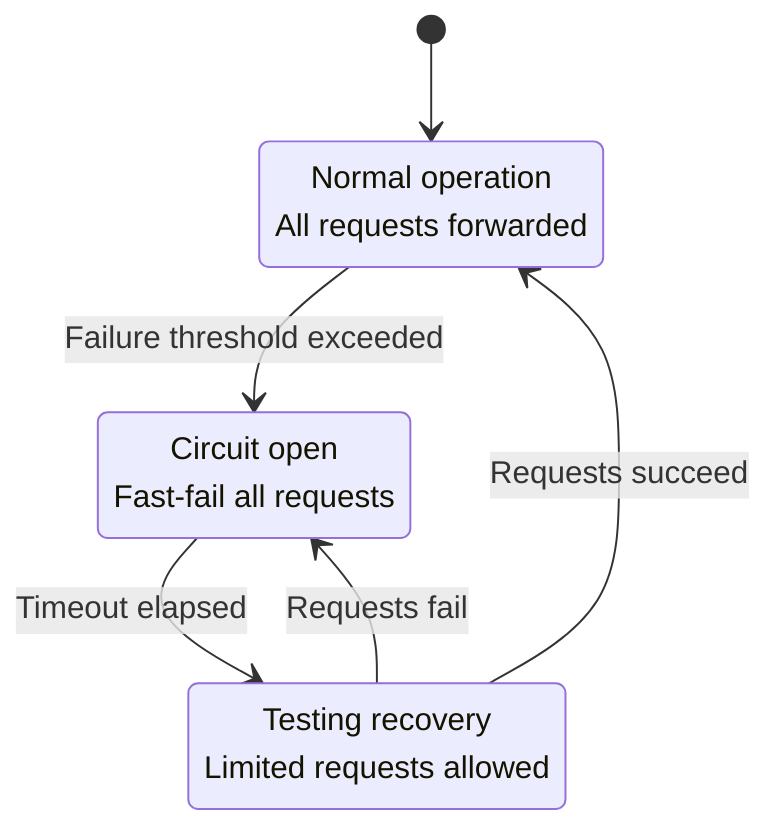

*For detailed circuit breaker patterns, see [Patterns](patterns.md)*

---

## Request Transformation

### 1. Header Manipulation

**Adding, Modifying, or Removing Headers:**

```yaml
routes:
  - path: /api/users/**
    service: user-service
    transformations:
      request_headers:
        add:
          X-Gateway-Version: v2.1.0
          X-Request-ID: ${generate_uuid()}
          X-Forwarded-For: ${client_ip}
        modify:
          Authorization: "Bearer ${jwt_token}"
        remove:
          - X-Internal-Header
          - X-Debug-Info
          
      response_headers:
        add:
          X-Response-Time: ${response_time_ms}ms
          Cache-Control: max-age=300
        remove:
          - X-Internal-Service-Name
```

### 2. Path Transformation

**URL Rewriting and Path Manipulation:**

```yaml
routes:
  # Remove API version from path
  - path: /api/v2/users/(.+)
    service: user-service
    transformations:
      path: /users/$1
      
  # Add service prefix
  - path: /users/(.+)
    service: user-service
    transformations:
      path: /api/internal/users/$1
      
  # Complex transformation with parameters
  - path: /legacy/getUserProfile/(\d+)
    service: user-service
    transformations:
      method: GET  # Change from POST to GET
      path: /users/$1/profile
      query_parameters:
        include: profile,preferences
```

### 3. Request Body Transformation

**Content Transformation and Protocol Translation:**

```yaml
routes:
  - path: /api/orders/**
    service: order-service
    transformations:
      request_body:
        # JSON to XML transformation
        input_format: json
        output_format: xml
        template: |
          <order>
            <id>{{ .id }}</id>
            <customer>{{ .customer_id }}</customer>
            <items>
              {{range .items}}
              <item>
                <sku>{{ .sku }}</sku>
                <quantity>{{ .quantity }}</quantity>
              </item>
              {{end}}
            </items>
          </order>
          
      response_body:
        # XML to JSON transformation
        input_format: xml
        output_format: json
```

### 4. Protocol Translation

**HTTP to gRPC and Other Protocols:**

```yaml
routes:
  - path: /api/users/(\d+)
    service: user-grpc-service
    transformations:
      protocol: grpc
      grpc_method: UserService.GetUser
      request_mapping:
        user_id: $1
      response_mapping: |
        {
          "id": {{ .user.id }},
          "name": "{{ .user.name }}",
          "email": "{{ .user.email }}"
        }
```

---

## Monitoring & Observability

### Request Tracing

**Distributed Tracing Integration:**

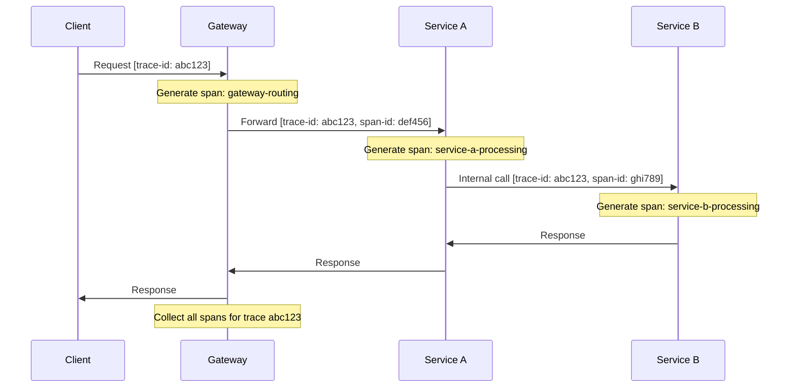

**Tracing Configuration:**
```yaml
observability:
  tracing:
    enabled: true
    provider: jaeger  # or zipkin, datadog
    config:
      collector_endpoint: http://jaeger:14268/api/traces
      sample_rate: 0.1  # 10% sampling
      
  metrics:
    enabled: true
    provider: prometheus
    labels:
      - route_id
      - service_name
      - method
      - status_code
      
routes:
  - path: /api/users/**
    service: user-service
    tracing:
      span_name: user-api-request
      tags:
        service.name: user-service
        operation: user-management
```

*For comprehensive monitoring setup, see [Monitoring](monitoring.md)*

### Route-Specific Metrics

**Key Performance Indicators:**

```yaml
monitoring:
  route_metrics:
    - metric: request_count
      labels: [route_id, method, status]
      
    - metric: request_duration
      type: histogram
      buckets: [0.1, 0.5, 1.0, 2.0, 5.0]
      
    - metric: active_requests
      type: gauge
      
    - metric: error_rate
      calculation: errors / total_requests
      window: 5m
      
  alerts:
    - name: high_error_rate
      condition: error_rate > 0.05
      duration: 2m
      actions:
        - notify_oncall
        - enable_circuit_breaker
```

---

## Best Practices

### 1. Route Design Principles

**Hierarchical Organization:**
```yaml
# ✅ Good: Clear hierarchy
routes:
  - path: /api/v1/users/**
    priority: 100
  - path: /api/v1/users/profile
    priority: 200  # More specific, higher priority
  - path: /api/**
    priority: 1    # Catch-all, lowest priority

# ❌ Bad: Conflicting routes
routes:
  - path: /api/users/**
  - path: /api/users/admin/**  # Never reached due to wildcard above
```

**Clear Naming Conventions:**
```yaml
routes:
  # Use descriptive IDs
  - id: user-management-api-v1
    path: /api/v1/users/**
    service: user-service-v1
    
  # Include version and purpose
  - id: order-processing-api-v2
    path: /api/v2/orders/**
    service: order-service-v2
```

### 2. Performance Optimization

**Route Matching Optimization:**
```yaml
# ✅ Optimize route ordering (most specific first)
routes:
  # Exact matches first
  - path: /api/users/current
    service: user-service
    exact: true
    
  # Specific patterns before wildcards
  - path: /api/users/(\d+)/orders
    service: order-service
    
  # Wildcards last
  - path: /api/users/**
    service: user-service

# Route caching
route_cache:
  enabled: true
  ttl: 300s
  max_entries: 10000
```

**Connection Management:**
```yaml
services:
  user-service:
    connection_pool:
      max_connections: 100
      max_idle_connections: 20
      connection_timeout: 5s
      keep_alive: 60s
      idle_timeout: 30s
    
    timeouts:
      connect: 5s
      request: 30s
      response: 30s
```

### 3. Security Best Practices

**Route-Level Security:**
```yaml
routes:
  - path: /api/admin/**
    service: admin-service
    security:
      auth_required: true
      roles: [admin, super_admin]
      rate_limit: 100/hour
      ip_whitelist:
        - 10.0.0.0/8
        - 192.168.1.0/24
        
  - path: /api/public/**
    service: public-service
    security:
      auth_required: false
      rate_limit: 1000/hour
      cors:
        allowed_origins: ["https://app.company.com"]
        allowed_methods: [GET, POST]
```

*For comprehensive security implementation, see [Security](security.md)*

### 4. Error Handling

**Graceful Degradation:**
```yaml
routes:
  - path: /api/users/**
    service: user-service
    error_handling:
      retry_policy:
        max_attempts: 3
        backoff: exponential
        base_delay: 100ms
        max_delay: 1s
        retry_on:
          - connection_error
          - timeout
          - 5xx_status
          
      fallback:
        - service: user-cache-service
        - static_response:
            status: 503
            body: '{"error": "Service temporarily unavailable"}'
            
      error_responses:
        timeout:
          status: 504
          body: '{"error": "Request timeout"}'
        service_unavailable:
          status: 503
          body: '{"error": "Service maintenance in progress"}'
```

### 5. Configuration Management

**Environment-Specific Routing:**
```yaml
# Base configuration
base_config: &base
  timeout: 30s
  retries: 3
  health_check:
    interval: 30s
    
# Environment-specific overrides
environments:
  development:
    <<: *base
    debug: true
    routes:
      - path: /api/**
        service: dev-all-in-one
        
  production:
    <<: *base
    timeout: 10s  # Stricter timeout in prod
    routes:
      - path: /api/users/**
        service: user-service-prod
        instances: 5
      - path: /api/orders/**
        service: order-service-prod
        instances: 3
```

**Feature Flag Integration:**
```yaml
feature_flags:
  new_user_api: false
  enhanced_search: true
  
conditional_routes:
  - condition: feature_flags.new_user_api
    path: /api/v2/users/**
    service: new-user-service
    
  - condition: feature_flags.enhanced_search
    path: /api/search/**
    service: enhanced-search-service
  
  # Default fallback
  - path: /api/search/**
    service: basic-search-service
    priority: 1  # Lower priority
```

---

## Troubleshooting

### Common Issues and Solutions

#### 1. Route Not Matching

**Problem**: Requests not routing to expected service

**Debugging Steps:**
```yaml
# Enable debug logging
logging:
  level: DEBUG
  route_matching: true
  
# Add request tracing
routes:
  - path: /api/users/**
    service: user-service
    debug:
      log_request: true
      log_route_selection: true
```

**Common Causes:**
- Route priority conflicts
- Incorrect path patterns
- Method restrictions
- Header/condition mismatches

**Solution Example:**
```yaml
# ❌ Problem: Conflicting routes
routes:
  - path: /api/users/**        # This catches everything first
    service: user-service-v1
  - path: /api/users/admin/**  # This never gets reached
    service: admin-service

# ✅ Solution: Correct priority
routes:
  - path: /api/users/admin/**  # More specific route first
    service: admin-service
    priority: 100
  - path: /api/users/**        # General route second
    service: user-service-v1
    priority: 50
```

#### 2. Load Balancing Issues

**Problem**: Uneven traffic distribution

**Monitoring Setup:**
```yaml
monitoring:
  load_balancer_metrics:
    - metric: requests_per_instance
      labels: [service, instance]
    - metric: response_time_per_instance
      labels: [service, instance]
    - metric: active_connections_per_instance
      labels: [service, instance]
```

**Common Solutions:**
```yaml
# Adjust weights based on capacity
services:
  user-service:
    instances:
      - url: http://user-1:8080
        weight: 100  # Standard instance
        capacity_factor: 1.0
      - url: http://user-2:8080
        weight: 150  # Higher capacity
        capacity_factor: 1.5
        
# Use health-aware load balancing
load_balancer:
  health_aware: true
  exclude_unhealthy: true
  slow_start: true  # Gradually increase traffic to new instances
```

#### 3. Circuit Breaker False Positives

**Problem**: Circuit breaker opening unnecessarily

**Analysis:**
```yaml
circuit_breaker:
  failure_threshold: 50%
  min_requests: 20          # Increase to avoid small sample issues
  timeout: 30s              # Reduce timeout for faster recovery
  
  # Add failure classification
  failure_conditions:
    - status_code: ">= 500"  # Only count server errors
    - timeout: true
    - connection_error: true
    
  # Exclude client errors (4xx) from failure count
  exclude_conditions:
    - status_code: "400-499"
```

#### 4. Performance Degradation

**Problem**: Increased response times

**Performance Analysis:**
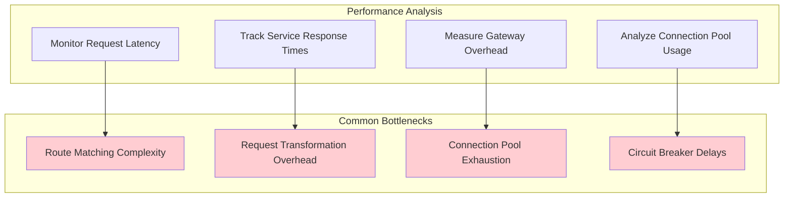

**Optimization Strategies:**
```yaml
# Optimize route matching
routes:
  # Use exact matches where possible
  - path: /api/users/current
    service: user-service
    exact: true
    
  # Minimize regex usage
  - path: /api/users/(\d+)
    service: user-service
    match_type: simple_pattern  # Instead of full regex
    
# Optimize connection management
services:
  user-service:
    connection_pool:
      max_connections: 200      # Increase pool size
      connection_timeout: 3s    # Reduce connection timeout
      keep_alive: 120s          # Increase keep-alive
      
# Cache routing decisions
routing:
  cache_enabled: true
  cache_ttl: 300s
  cache_size: 50000
```

#### 5. Configuration Errors

**Problem**: Invalid or conflicting configuration

**Validation Setup:**
```yaml
# Configuration validation
validation:
  strict_mode: true
  validate_on_startup: true
  validate_on_reload: true
  
  checks:
    - duplicate_routes
    - unreachable_routes
    - invalid_service_references
    - circular_dependencies
    
# Configuration testing
testing:
  config_tests:
    - name: user_api_routes
      requests:
        - path: /api/users/123
          expected_service: user-service
        - path: /api/users/profile
          expected_service: user-service
          
    - name: admin_routes
      requests:
        - path: /api/admin/users
          headers:
            Authorization: "Bearer admin-token"
          expected_service: admin-service
```

### Debugging Tools

#### 1. Route Testing

**Interactive Route Testing:**
```yaml
# Test configuration
debug_tools:
  route_tester:
    enabled: true
    endpoint: /debug/routes/test
    
  request_simulator:
    enabled: true
    endpoint: /debug/simulate
    
# Example test request
POST /debug/routes/test
Content-Type: application/json

{
  "method": "GET",
  "path": "/api/users/123",
  "headers": {
    "Authorization": "Bearer token123"
  },
  "expected_service": "user-service"
}
```

#### 2. Route Introspection

**Runtime Route Inspection:**
```yaml
# Debug endpoints
debug_endpoints:
  - path: /debug/routes
    handler: list_all_routes
    
  - path: /debug/routes/match
    handler: show_route_matching
    
  - path: /debug/services
    handler: show_service_status
    
  - path: /debug/health
    handler: comprehensive_health_check
```

#### 3. Performance Profiling

**Gateway Performance Analysis:**
```yaml
profiling:
  enabled: true
  cpu_profiling: true
  memory_profiling: true
  
  metrics:
    route_matching_time: true
    request_processing_time: true
    service_connection_time: true
    
  sampling:
    rate: 0.01  # 1% of requests
    max_profiles_per_hour: 100
```

---

## Migration Strategies

### 1. Gradual Migration

**Phased Route Migration:**
```yaml
# Phase 1: Start with read-only routes
migration_phase_1:
  routes:
    - path: /api/users
      methods: [GET]
      service: new-user-service
      traffic_percentage: 10
      
    - path: /api/users
      methods: [GET]
      service: legacy-user-service
      traffic_percentage: 90

# Phase 2: Add write operations
migration_phase_2:
  routes:
    - path: /api/users/**
      methods: [POST, PUT]
      service: new-user-service
      traffic_percentage: 25
      
    - path: /api/users/**
      methods: [POST, PUT]
      service: legacy-user-service
      traffic_percentage: 75
```

### 2. Blue-Green Deployment

**Service Version Switching:**
```yaml
# Blue-Green routing configuration
deployments:
  blue:
    version: v1.2.3
    routes:
      - path: /api/users/**
        service: user-service-blue
        
  green:
    version: v1.3.0
    routes:
      - path: /api/users/**
        service: user-service-green
        
# Switch traffic between versions
traffic_switch:
  active_deployment: blue
  canary_percentage: 0
  
  # Automated rollback conditions
  rollback_conditions:
    error_rate_threshold: 2%
    latency_p95_threshold: 500ms
    duration: 5m
```

### 3. Shadow Traffic

**Testing New Services:**
```yaml
routes:
  - path: /api/orders/**
    service: order-service-v1
    shadow:
      service: order-service-v2
      percentage: 100
      async: true
      compare_responses: true
      
shadow_traffic:
  storage: s3://shadow-traffic-logs/
  comparison:
    enabled: true
    ignore_fields: [timestamp, request_id]
    alert_on_differences: true
```

---

## Advanced Configuration Examples

### 1. Multi-Tenant Routing

**Tenant-Based Service Routing:**
```yaml
# Tenant identification strategies
tenant_resolution:
  strategies:
    - type: subdomain
      pattern: "([^.]+)\.api\.company\.com"
      tenant_key: $1
      
    - type: header
      header: X-Tenant-ID
      
    - type: path
      pattern: "/api/tenant/([^/]+)/.*"
      tenant_key: $1

# Tenant-specific routing
routes:
  - path: /api/users/**
    routing_strategy: per_tenant
    services:
      tenant_a: user-service-premium
      tenant_b: user-service-standard
      default: user-service-basic
    
    # Tenant-specific configurations
    tenant_configs:
      tenant_a:
        rate_limit: 10000/hour
        features: [caching, analytics]
      tenant_b:
        rate_limit: 5000/hour
        features: [caching]
```

### 2. API Versioning

**Version-Aware Routing:**
```yaml
# Version extraction strategies
version_resolution:
  strategies:
    - type: header
      header: X-API-Version
      default: v1
      
    - type: path
      pattern: "/api/v(\d+)/.*"
      version_key: $1
      
    - type: accept_header
      pattern: "application/vnd\.company\.v(\d+)\+json"
      version_key: $1

# Version-specific routing
routes:
  - path: /api/users/**
    versions:
      v1:
        service: user-service-v1
        deprecation_warning: true
        sunset_date: "2024-12-31"
        
      v2:
        service: user-service-v2
        default: true
        
      v3:
        service: user-service-v3
        beta: true
        
# Automatic version deprecation
version_management:
  deprecation_warnings:
    enabled: true
    header: X-API-Deprecated
    
  sunset_enforcement:
    enabled: true
    grace_period: 90d
```

### 3. Geographic Routing

**Location-Based Service Selection:**
```yaml
# Geographic service distribution
geographic_routing:
  location_detection:
    - type: cloudflare_headers
      country_header: CF-IPCountry
      region_header: CF-IPContinent
      
    - type: maxmind_geoip
      database_path: /etc/geoip/GeoLite2-City.mmdb
      
  compliance:
    gdpr_countries: [AT, BE, BG, HR, CY, CZ, DK, EE, FI, FR, DE, GR, HU, IE, IT, LV, LT, LU, MT, NL, PL, PT, RO, SK, SI, ES, SE]
    
routes:
  - path: /api/users/**
    geographic_routing:
      regions:
        north_america:
          countries: [US, CA, MX]
          service: user-service-na
          data_residency: us-east-1
          
        europe:
          countries: ${geographic_routing.compliance.gdpr_countries}
          service: user-service-eu
          data_residency: eu-west-1
          compliance: gdpr
          
        asia_pacific:
          countries: [JP, AU, SG, HK]
          service: user-service-ap
          data_residency: ap-southeast-1
          
      default:
        service: user-service-global
```

---

## Integration Patterns

### 1. Service Mesh Integration

**Istio Integration:**
```yaml
# Gateway with service mesh
service_mesh:
  provider: istio
  integration:
    virtual_services: true
    destination_rules: true
    traffic_policies: true
    
routes:
  - path: /api/users/**
    service: user-service
    service_mesh:
      virtual_service: user-service-vs
      destination_rule: user-service-dr
      traffic_policy:
        timeout: 30s
        retries: 3
        circuit_breaker:
          max_connections: 100
```

### 2. Event-Driven Routing

**Message Queue Integration:**
```yaml
# Event-driven route updates
event_driven_routing:
  enabled: true
  event_sources:
    - type: kafka
      topics: [service-registry-events]
      
    - type: redis_streams
      stream: routing-updates
      
  event_handlers:
    service_discovered:
      action: add_route
      template: |
        path: /api/{{ .service_name }}/**
        service: {{ .service_name }}
        
    service_removed:
      action: remove_route
      selector:
        service: "{{ .service_name }}"
```

### 3. External API Integration

**Third-Party Service Routing:**
```yaml
# External service integration
external_services:
  payment_processor:
    type: external
    base_url: https://api.stripe.com
    authentication:
      type: bearer_token
      token: ${STRIPE_API_KEY}
    rate_limit: 100/second
    
routes:
  - path: /api/payments/**
    service: payment_processor
    transformations:
      request_headers:
        add:
          Stripe-Version: "2023-10-16"
      path: /v1/charges
```

---

## Security Considerations

### Route-Level Security

**Comprehensive Security Configuration:**
```yaml
security:
  global_policies:
    tls_required: true
    hsts_enabled: true
    
routes:
  - path: /api/admin/**
    security:
      authentication:
        type: oauth2
        scopes: [admin]
        
      authorization:
        type: rbac
        required_roles: [admin, super_admin]
        
      rate_limiting:
        burst: 10
        sustained: 100/hour
        
      input_validation:
        max_request_size: 1MB
        content_types: [application/json]
        
      cors:
        allowed_origins: [https://admin.company.com]
        allowed_methods: [GET, POST, PUT, DELETE]
        allowed_headers: [Authorization, Content-Type]
        max_age: 86400
```

*For detailed security implementation, see [Security](security.md)*

---

## Performance Benchmarking

### Load Testing Configuration

**Route-Specific Load Testing:**
```yaml
load_testing:
  scenarios:
    - name: user_api_load
      routes:
        - /api/users/profile
        - /api/users/settings
      concurrent_users: 1000
      duration: 10m
      
  performance_targets:
    latency_p95: 200ms
    latency_p99: 500ms
    error_rate: < 0.1%
    throughput: > 1000 rps
    
  monitoring:
    metrics:
      - request_latency
      - error_rate
      - throughput
      - connection_pool_usage
```

*For scaling strategies and performance optimization, see [Scaling](scaling.md)*

---

## Conclusion

API Gateway routing is a critical component that determines the performance, reliability, and maintainability of distributed systems. This document provides comprehensive guidance for implementing robust routing strategies that can scale with your architecture.

### Key Takeaways

1. **Start Simple**: Begin with basic path-based routing and gradually add complexity
2. **Monitor Everything**: Implement comprehensive monitoring and alerting for routing decisions
3. **Plan for Scale**: Design routing rules that can handle traffic growth and service expansion
4. **Security First**: Implement security controls at the routing level
5. **Test Thoroughly**: Validate routing behavior under various load and failure conditions

### Next Steps

- Review [Architecture](architecture.md) for overall system design principles
- Implement security controls using [Security](security.md) guidelines
- Set up monitoring following [Monitoring](monitoring.md) best practices
- Apply design patterns from [Patterns](patterns.md) for common scenarios
- Optimize performance using [Scaling](scaling.md) strategies

---

*This document is part of the API Gateway System Design documentation suite. For implementation support or specific use case guidance, refer to the related documentation or engage with your architecture team.*