# API Gateway Scaling

*Comprehensive guide to scaling API Gateways for high-performance distributed systems*

**Document Version**: 1.0  
**Last Updated**: September 2025  
**Related Documentation**: See [Architecture](architecture.md), [Routing](routing.md), [Caching](caching.md), [Monitoring](monitoring.md)

---

## Table of Contents

1. [Overview](#overview)
2. [Scaling Fundamentals](#scaling-fundamentals)
3. [Horizontal Scaling](#horizontal-scaling)
4. [Vertical Scaling](#vertical-scaling)
5. [Performance Optimization](#performance-optimization)
6. [Connection Management](#connection-management)
7. [Caching Strategies](#caching-strategies)
8. [Load Balancing](#load-balancing)
9. [Resource Management](#resource-management)
10. [Monitoring & Metrics](#monitoring--metrics)
11. [Capacity Planning](#capacity-planning)
12. [Auto-Scaling](#auto-scaling)
13. [Performance Tuning](#performance-tuning)
14. [Troubleshooting](#troubleshooting)

---

## Overview

API Gateway scaling ensures your system can handle increasing traffic loads while maintaining performance, reliability, and cost-effectiveness. This document covers both horizontal and vertical scaling strategies, performance optimization techniques, and operational best practices.

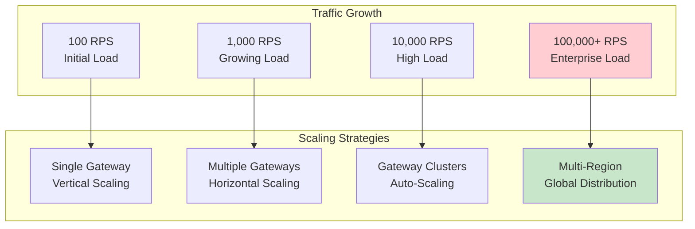

**Key Scaling Dimensions:**
- **Throughput**: Requests per second capacity
- **Latency**: Response time under load
- **Concurrency**: Simultaneous connection handling
- **Resource Efficiency**: CPU, memory, and network utilization
- **Fault Tolerance**: Resilience during failures

*For architectural context, see [Architecture](architecture.md)*

---

## Scaling Fundamentals

### Performance Baseline

**Essential Metrics to Track:**

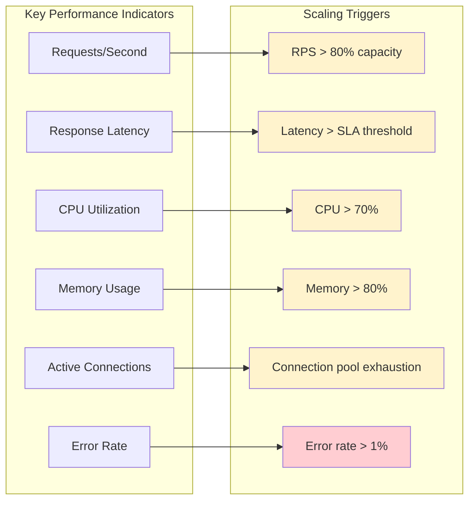

**Baseline Configuration:**
```yaml
performance_baseline:
  target_metrics:
    throughput: 1000  # requests per second
    latency_p95: 100ms
    latency_p99: 250ms
    cpu_utilization: 60%
    memory_utilization: 70%
    error_rate: 0.1%
    
  load_testing:
    scenarios:
      - name: sustained_load
        rps: 1000
        duration: 10m
        
      - name: spike_test
        rps: 2000
        duration: 2m
        
      - name: stress_test
        rps: 5000
        duration: 5m
```

### Bottleneck Identification

**Common Performance Bottlenecks:**

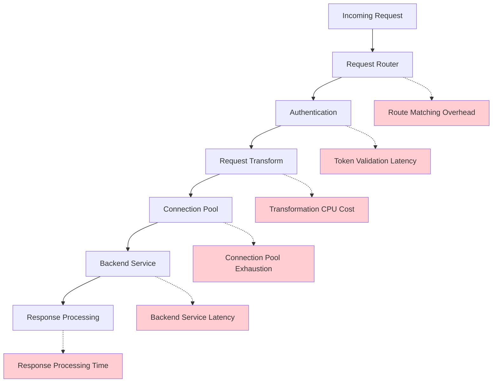

**Bottleneck Analysis Framework:**
```yaml
bottleneck_analysis:
  profiling:
    enabled: true
    sampling_rate: 0.01
    
  metrics:
    request_processing_time:
      components:
        - routing: max_acceptable_ms(5)
        - authentication: max_acceptable_ms(20)
        - transformation: max_acceptable_ms(10)
        - backend_call: max_acceptable_ms(100)
        - response_processing: max_acceptable_ms(5)
    
    resource_utilization:
      cpu_per_request: target_microseconds(1000)
      memory_per_request: target_bytes(1024)
      
  alerting:
    slow_components:
      threshold: 95th_percentile > target * 2
      action: investigate_and_optimize
```

---

## Horizontal Scaling

### Multi-Instance Deployment

**Gateway Cluster Architecture:**

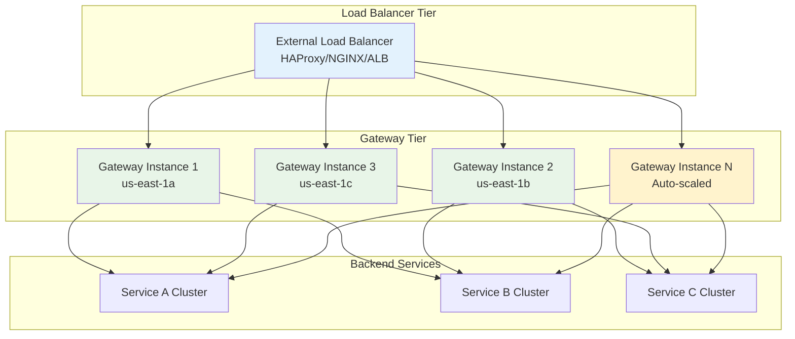

**Deployment Configuration:**
```yaml
horizontal_scaling:
  deployment:
    min_instances: 2
    max_instances: 10
    target_cpu_utilization: 60%
    target_memory_utilization: 70%
    
  instance_configuration:
    cpu_cores: 4
    memory_gb: 8
    network_bandwidth: 1Gbps
    
  placement_strategy:
    availability_zones: [us-east-1a, us-east-1b, us-east-1c]
    anti_affinity: true  # Don't place instances on same host
    spread_across_zones: true
    
  load_balancer:
    algorithm: least_connections
    health_check:
      path: /health
      interval: 30s
      timeout: 5s
      healthy_threshold: 2
      unhealthy_threshold: 3
```

### Stateless Design Principles

**Session Management:**
```yaml
# ✅ Stateless Configuration
gateway_config:
  session_management:
    type: external  # Store in Redis/database
    store:
      type: redis
      cluster: redis-cluster:6379
      ttl: 3600s
      
  authentication:
    type: jwt  # Self-contained tokens
    validation:
      cache_tokens: true
      cache_ttl: 300s
      
  rate_limiting:
    store: redis  # Shared rate limit counters
    
# ❌ Avoid In-Memory State
avoid_patterns:
  - local_session_storage
  - in_memory_caching
  - local_rate_limiting
  - sticky_sessions
```

### Service Discovery Integration

**Dynamic Instance Management:**
```yaml
service_discovery:
  # Gateway self-registration
  self_registration:
    enabled: true
    service_name: api-gateway
    tags: [api, gateway, v2.1.0]
    health_check_url: http://localhost:8080/health
    
  # Backend service discovery
  backend_discovery:
    provider: consul
    config:
      address: consul-cluster:8500
      datacenter: dc1
      
services:
  user-service:
    discovery:
      service_name: user-service
      health_check: true
      tags: [api, users]
    load_balancer:
      algorithm: round_robin
      health_aware: true
```

*For detailed routing and service discovery, see [Routing](routing.md)*

---

## Vertical Scaling

### Resource Optimization

**CPU and Memory Tuning:**

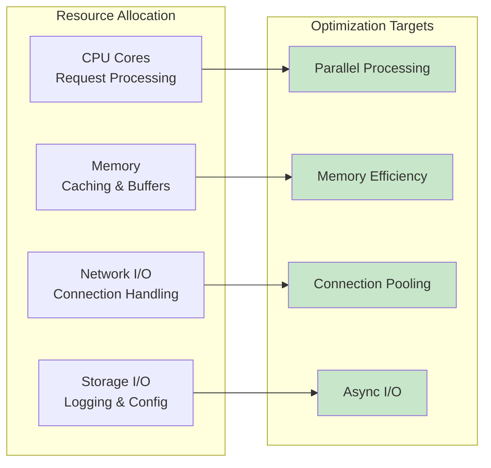

**Resource Configuration:**
```yaml
vertical_scaling:
  cpu_optimization:
    cores: 8
    threading_model: async_io
    worker_processes: auto  # Match CPU cores
    worker_connections: 4096
    
  memory_optimization:
    heap_size: 6g
    buffer_size: 32k
    connection_pool_size: 1000
    cache_size: 2g
    
  jvm_tuning:  # For Java-based gateways
    initial_heap: 2g
    max_heap: 6g
    gc_algorithm: G1GC
    gc_tuning:
      - -XX:MaxGCPauseMillis=100
      - -XX:G1HeapRegionSize=16m
      - -XX:+UseStringDeduplication
      
  kernel_tuning:
    file_descriptors: 65536
    tcp_keepalive: true
    tcp_nodelay: true
    socket_buffer_size: 128k
```

### Performance Profiling

**Resource Utilization Analysis:**
```yaml
profiling:
  cpu_profiling:
    enabled: true
    sampling_interval: 1s
    profile_duration: 60s
    
  memory_profiling:
    heap_analysis: true
    memory_leaks_detection: true
    gc_analysis: true
    
  network_profiling:
    connection_tracking: true
    bandwidth_monitoring: true
    packet_analysis: false  # Enable for deep debugging
    
monitoring:
  resource_metrics:
    - metric: cpu_utilization_per_core
    - metric: memory_usage_breakdown
    - metric: gc_pause_times
    - metric: network_connections_per_state
    - metric: file_descriptor_usage
```

---

## Performance Optimization

### Request Processing Optimization

**Asynchronous Processing Architecture:**

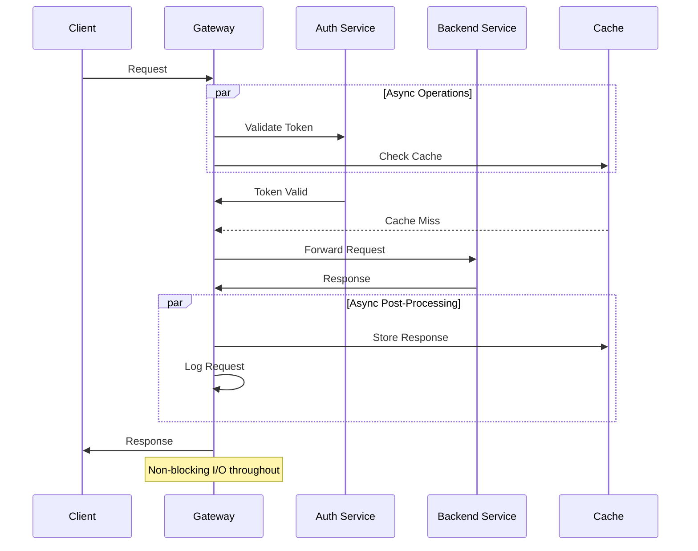

**Configuration for Async Processing:**
```yaml
async_processing:
  event_loop:
    type: epoll  # Linux
    workers: 8   # Match CPU cores
    
  connection_handling:
    model: non_blocking
    max_concurrent_requests: 10000
    request_timeout: 30s
    
  thread_pools:
    io_threads: 16      # For I/O operations
    cpu_threads: 8      # For CPU-intensive tasks
    auth_threads: 4     # Dedicated auth processing
    
  buffering:
    request_buffer_size: 64k
    response_buffer_size: 64k
    buffer_pool_size: 1000
```

### Response Time Optimization

**Latency Reduction Techniques:**
```yaml
latency_optimization:
  # Connection reuse
  connection_pooling:
    enabled: true
    max_connections_per_host: 100
    max_idle_connections: 20
    connection_timeout: 5s
    keep_alive_timeout: 60s
    
  # Request preprocessing
  preprocessing:
    route_cache:
      enabled: true
      cache_size: 10000
      ttl: 300s
    
    header_optimization:
      compress_headers: true
      remove_unnecessary_headers: true
      
  # Response optimization
  response_optimization:
    compression:
      enabled: true
      algorithms: [gzip, deflate]
      min_response_size: 1024
      compression_level: 6
      
    streaming:
      enabled: true
      chunk_size: 8k
      buffer_timeout: 100ms
```

### Memory Management

**Efficient Memory Usage:**
```yaml
memory_management:
  garbage_collection:
    strategy: low_latency
    target_pause_time: 10ms
    heap_utilization_target: 70%
    
  object_pooling:
    request_objects: true
    response_objects: true
    buffer_objects: true
    connection_objects: true
    
  memory_allocation:
    off_heap_cache: true
    direct_buffers: true
    memory_mapped_files: false  # For config files
    
  leak_detection:
    enabled: true
    sampling_rate: 0.01
    alert_threshold: 100MB/hour
```

---

## Connection Management

### Connection Pooling

**Optimized Connection Strategies:**

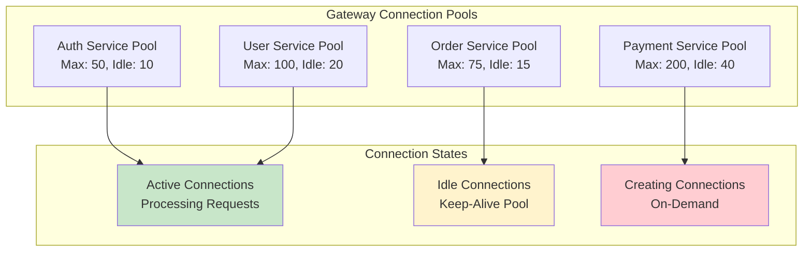

**Connection Pool Configuration:**
```yaml
connection_pools:
  global_settings:
    connection_timeout: 5s
    socket_timeout: 30s
    keep_alive_timeout: 60s
    max_idle_time: 300s
    
  per_service_pools:
    auth-service:
      max_connections: 50
      max_idle_connections: 10
      min_idle_connections: 2
      connection_validation: true
      
    user-service:
      max_connections: 100
      max_idle_connections: 20
      min_idle_connections: 5
      retry_failed_connections: true
      
    order-service:
      max_connections: 75
      max_idle_connections: 15
      circuit_breaker_integration: true
      
  monitoring:
    pool_utilization_alert: 80%
    connection_leak_detection: true
    slow_connection_alert: 1s
```

### TCP Optimization

**Network Stack Tuning:**
```yaml
tcp_optimization:
  # Kernel parameters
  kernel_params:
    net.ipv4.tcp_keepalive_time: 600
    net.ipv4.tcp_keepalive_probes: 3
    net.ipv4.tcp_keepalive_intvl: 60
    net.ipv4.tcp_fin_timeout: 30
    net.core.somaxconn: 65535
    net.ipv4.tcp_max_syn_backlog: 65535
    
  # Socket options
  socket_options:
    TCP_NODELAY: true     # Disable Nagle's algorithm
    SO_KEEPALIVE: true    # Enable keep-alive
    SO_REUSEADDR: true    # Allow address reuse
    SO_REUSEPORT: true    # Allow port reuse
    
  # Buffer sizes
  buffer_tuning:
    send_buffer_size: 128k
    receive_buffer_size: 128k
    tcp_window_scaling: true
```

---

## Caching Strategies

### Multi-Layer Caching

**Comprehensive Caching Architecture:**

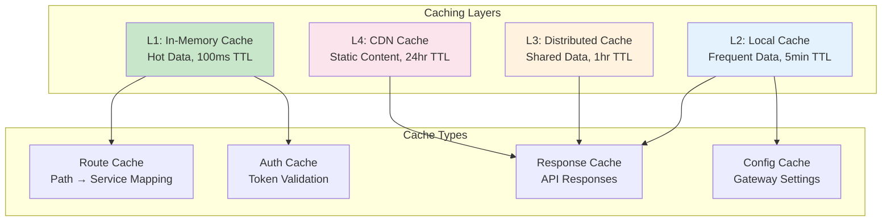

**Caching Configuration:**
```yaml
caching_strategy:
  # L1: In-memory cache (fastest)
  local_cache:
    type: caffeine
    max_entries: 10000
    expire_after_write: 5m
    expire_after_access: 2m
    
  # L2: Distributed cache
  distributed_cache:
    type: redis
    cluster: redis-cluster
    default_ttl: 1h
    max_memory_policy: allkeys-lru
    
  # Cache policies by data type
  cache_policies:
    route_cache:
      ttl: 10m
      max_entries: 5000
      eviction: lru
      
    auth_cache:
      ttl: 15m
      max_entries: 50000
      eviction: ttl
      
    response_cache:
      ttl: 5m
      max_size: 100MB
      compression: true
      
  # Cache warming
  cache_warming:
    enabled: true
    strategies:
      - preload_routes_on_startup
      - warm_frequently_accessed_endpoints
      - background_cache_refresh
```

*For detailed caching implementation, see [Caching](caching.md)*

### Cache Invalidation

**Intelligent Cache Management:**
```yaml
cache_invalidation:
  strategies:
    # Time-based expiration
    ttl_based:
      default_ttl: 300s
      max_ttl: 3600s
      jitter: 10%  # Prevent cache stampede
      
    # Event-based invalidation
    event_driven:
      sources:
        - service_deployment_events
        - configuration_changes
        - user_permission_updates
        
    # Manual invalidation
    manual_controls:
      admin_endpoints:
        - POST /admin/cache/invalidate/all
        - DELETE /admin/cache/routes
        - DELETE /admin/cache/user/{user_id}
        
  cache_coherence:
    consistency_model: eventual_consistency
    propagation_delay: max_5s
    conflict_resolution: last_write_wins
```

---

## Load Balancing

### Advanced Load Balancing

**Intelligent Traffic Distribution:**

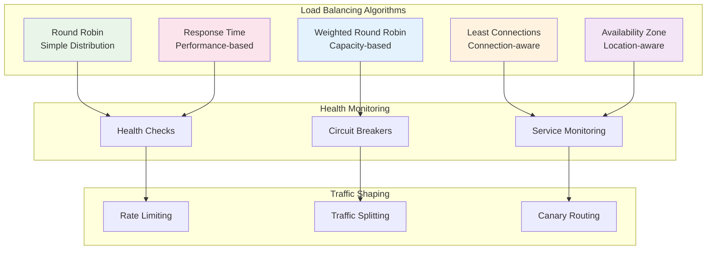

**Load Balancer Configuration:**
```yaml
load_balancing:
  # Primary algorithm
  primary_algorithm: least_response_time
  
  # Backup algorithms
  fallback_algorithms:
    - least_connections
    - weighted_round_robin
    - round_robin
    
  # Health-aware routing
  health_based_routing:
    enabled: true
    health_check_interval: 30s
    unhealthy_threshold: 3
    recovery_threshold: 2
    
  # Geographic distribution
  geographic_routing:
    enabled: true
    prefer_local_az: true
    cross_az_penalty: 5ms
    
  # Performance-based routing
  adaptive_routing:
    enabled: true
    metrics:
      - response_time
      - cpu_utilization
      - memory_usage
      - active_connections
    weight_adjustment_interval: 60s
```

### Traffic Shaping

**Intelligent Request Distribution:**
```yaml
traffic_shaping:
  # Rate limiting
  rate_limiting:
    global_limit: 10000/second
    per_service_limits:
      user-service: 5000/second
      order-service: 3000/second
      payment-service: 1000/second
      
  # Traffic splitting for deployments
  canary_deployment:
    enabled: true
    production_weight: 90%
    canary_weight: 10%
    success_criteria:
      error_rate: < 1%
      latency_p95: < 200ms
      
  # Priority-based routing
  priority_routing:
    levels:
      critical: 1      # Admin, health checks
      high: 2         # Authenticated users
      normal: 3       # Regular traffic
      low: 4          # Background processes
    queue_sizes: [1000, 5000, 10000, 20000]
```

---

## Resource Management

### CPU Management

**Processor Optimization:**
```yaml
cpu_management:
  # Core allocation
  cpu_allocation:
    total_cores: 16
    gateway_cores: 12
    system_reserved: 2
    monitoring_reserved: 2
    
  # Thread management
  thread_pools:
    io_threads:
      count: 8
      queue_size: 10000
      keep_alive: 60s
      
    compute_threads:
      count: 4
      queue_size: 1000
      priority: high
      
    background_threads:
      count: 2
      queue_size: 5000
      priority: low
      
  # CPU affinity
  cpu_affinity:
    enabled: true
    gateway_cpus: 0-11
    system_cpus: 12-15
    
  # Performance governors
  cpu_scaling:
    governor: performance
    min_frequency: 2.0GHz
    max_frequency: 3.5GHz
```

### Memory Management

**Memory Optimization Strategy:**
```yaml
memory_management:
  # Heap configuration
  heap_settings:
    initial_size: 4g
    maximum_size: 12g
    young_generation: 3g
    old_generation: 9g
    
  # Off-heap storage
  off_heap:
    cache_size: 2g
    buffer_pool_size: 1g
    direct_memory_size: 1g
    
  # Garbage collection
  gc_optimization:
    collector: G1GC
    target_pause: 50ms
    gc_threads: 4
    concurrent_threads: 2
    
  # Memory monitoring
  memory_alerts:
    heap_usage_warning: 70%
    heap_usage_critical: 85%
    gc_pause_warning: 100ms
    gc_frequency_warning: 10/minute
```

---

## Monitoring & Metrics

### Performance Monitoring

**Comprehensive Metrics Collection:**

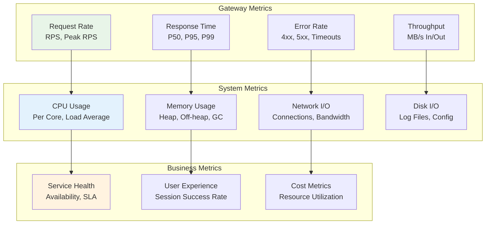

**Monitoring Configuration:**
```yaml
monitoring:
  # Metrics collection
  metrics:
    collection_interval: 15s
    retention_period: 30d
    
    # Gateway-specific metrics
    gateway_metrics:
      - request_rate
      - response_time_histogram
      - error_rate_by_status
      - active_connections
      - connection_pool_utilization
      - cache_hit_ratio
      - circuit_breaker_state
      
    # System metrics
    system_metrics:
      - cpu_utilization_per_core
      - memory_usage_breakdown
      - gc_metrics
      - network_io_stats
      - file_descriptor_usage
      
  # Alerting thresholds
  alerts:
    performance_alerts:
      high_latency:
        condition: response_time_p95 > 500ms
        duration: 2m
        severity: warning
        
      high_error_rate:
        condition: error_rate > 5%
        duration: 1m
        severity: critical
        
    resource_alerts:
      high_cpu:
        condition: cpu_usage > 80%
        duration: 5m
        severity: warning
        
      memory_pressure:
        condition: heap_usage > 85%
        duration: 2m
        severity: critical
```

*For detailed monitoring setup, see [Monitoring](monitoring.md)*

### Distributed Tracing

**Request Flow Analysis:**
```yaml
distributed_tracing:
  provider: jaeger
  configuration:
    collector_endpoint: http://jaeger-collector:14268
    sampling_rate: 0.1  # 10% of requests
    
  span_configuration:
    gateway_spans:
      - request_routing
      - authentication
      - rate_limiting
      - request_transformation
      - backend_call
      - response_processing
      
  trace_analysis:
    slow_trace_threshold: 1s
    error_trace_collection: 100%  # Collect all error traces
    
    performance_analysis:
      - identify_bottlenecks
      - service_dependency_mapping
      - latency_breakdown_analysis
```

---

## Capacity Planning

### Traffic Forecasting

**Predictive Scaling Models:**

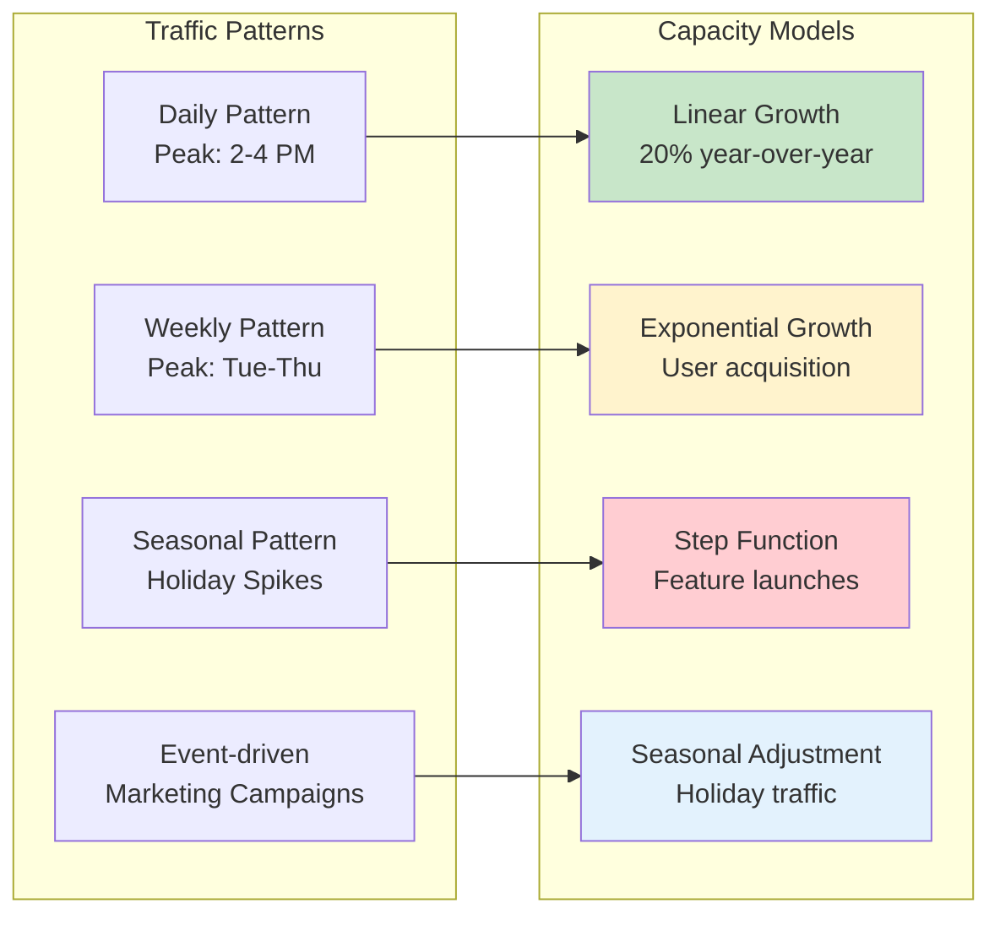

**Capacity Planning Framework:**
```yaml
capacity_planning:
  # Traffic forecasting
  traffic_analysis:
    historical_data_period: 6months
    growth_models:
      - linear_regression
      - seasonal_decomposition
      - exponential_smoothing
      - arima_forecasting
    
    traffic_patterns:
      daily_peak_hours: [14:00-16:00, 20:00-22:00]
      weekly_peak_days: [tuesday, wednesday, thursday]
      seasonal_events:
        - black_friday: 5x_normal_traffic
        - holiday_season: 3x_normal_traffic
        - product_launches: 2x_normal_traffic
        
  # Capacity requirements
  capacity_models:
    baseline_capacity:
      normal_load: 1000_rps
      peak_load: 3000_rps
      burst_capacity: 5000_rps
      
    scaling_thresholds:
      scale_out_cpu: 70%
      scale_out_memory: 75%
      scale_out_latency: 200ms_p95
      
      scale_in_cpu: 30%
      scale_in_memory: 40%
      scale_in_latency: 50ms_p95
      
  # Resource planning
  resource_requirements:
    instance_sizing:
      small: {cpu: 2, memory: 4GB, rps_capacity: 500}
      medium: {cpu: 4, memory: 8GB, rps_capacity: 1000}
      large: {cpu: 8, memory: 16GB, rps_capacity: 2000}
      xlarge: {cpu: 16, memory: 32GB, rps_capacity: 4000}
      
    cost_optimization:
      reserved_instances: 60%  # Base capacity
      spot_instances: 20%      # Batch workloads
      on_demand_instances: 20% # Peak capacity
```

### Load Testing

**Comprehensive Load Testing Strategy:**
```yaml
load_testing:
  # Testing scenarios
  test_scenarios:
    baseline_test:
      description: "Normal operating conditions"
      duration: 30m
      rps: 1000
      concurrent_users: 500
      
    spike_test:
      description: "Sudden traffic increase"
      ramp_up: 30s
      peak_rps: 5000
      duration: 5m
      ramp_down: 30s
      
    stress_test:
      description: "Find breaking point"
      start_rps: 1000
      increment: 500
      increment_duration: 2m
      max_rps: 10000
      
    endurance_test:
      description: "Long-term stability"
      duration: 4h
      rps: 2000
      memory_leak_detection: true
      
  # Performance targets
  performance_targets:
    latency:
      p50: 50ms
      p95: 100ms
      p99: 250ms
      p99_9: 500ms
      
    throughput:
      target_rps: 2000
      max_rps: 5000
      
    reliability:
      error_rate: < 0.1%
      availability: > 99.9%
      
  # Test data and scenarios
  test_configuration:
    user_patterns:
      - read_heavy: 70%_GET_requests
      - write_heavy: 30%_POST/PUT_requests
      - mixed_operations: realistic_api_usage
      
    data_scenarios:
      - small_payloads: 1KB_average
      - medium_payloads: 10KB_average
      - large_payloads: 100KB_average
```

---

## Auto-Scaling

### Horizontal Auto-Scaling

**Dynamic Instance Management:**

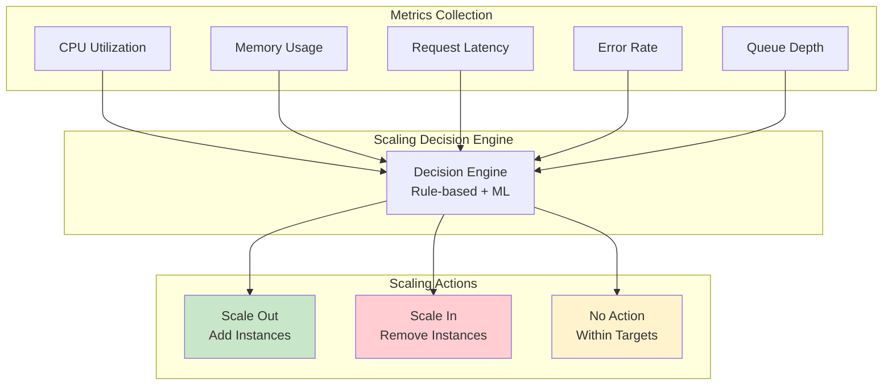

**Auto-Scaling Configuration:**
```yaml
auto_scaling:
  # Horizontal scaling settings
  horizontal_scaling:
    enabled: true
    min_instances: 2
    max_instances: 20
    desired_capacity: 4
    
    # Scaling triggers
    scaling_policies:
      scale_out_policy:
        metric: composite
        conditions:
          - cpu_utilization > 70% for 2m
          - or latency_p95 > 200ms for 2m
          - or memory_utilization > 75% for 2m
        action:
          type: step_scaling
          adjustment: +2_instances
          cooldown: 300s
          
      scale_in_policy:
        metric: composite
        conditions:
          - cpu_utilization < 30% for 10m
          - and latency_p95 < 50ms for 10m
          - and memory_utilization < 40% for 10m
        action:
          type: step_scaling
          adjustment: -1_instance
          cooldown: 600s
          
    # Predictive scaling
    predictive_scaling:
      enabled: true
      forecast_horizon: 1h
      schedule_ahead: 15m
      models:
        - historical_pattern_matching
        - time_series_forecasting
        
  # Instance lifecycle management
  instance_management:
    launch_configuration:
      instance_type: c5.xlarge
      ami_id: ami-gateway-v2.1.0
      security_groups: [sg-gateway]
      key_pair: gateway-keypair
      
    health_checks:
      grace_period: 300s
      health_check_type: ELB
      unhealthy_threshold: 3
      
    termination_policy:
      - oldest_launch_configuration
      - oldest_instance
      - default
```

### Vertical Auto-Scaling

**Resource Adjustment:**
```yaml
vertical_scaling:
  # CPU scaling
  cpu_scaling:
    enabled: true
    min_cores: 2
    max_cores: 16
    target_utilization: 60%
    
    scaling_actions:
      scale_up:
        trigger: cpu_utilization > 80% for 5m
        action: increase_cores_by_2
        max_increase: 4_cores
        
      scale_down:
        trigger: cpu_utilization < 40% for 15m
        action: decrease_cores_by_1
        min_cores: 2
        
  # Memory scaling
  memory_scaling:
    enabled: true
    min_memory: 4GB
    max_memory: 32GB
    target_utilization: 70%
    
    heap_adjustment:
      auto_tune_heap: true
      heap_ratio: 0.75  # 75% of available memory
      gc_optimization: true
      
  # Dynamic resource allocation
  resource_adjustment:
    adjustment_interval: 5m
    stability_period: 10m  # Wait before next adjustment
    resource_limits:
      cpu_increase_limit: 50%_per_adjustment
      memory_increase_limit: 25%_per_adjustment
```

### Scaling Policies

**Advanced Scaling Rules:**
```yaml
scaling_policies:
  # Multi-metric scaling
  composite_metrics:
    performance_index:
      formula: |
        0.4 * cpu_utilization +
        0.3 * memory_utilization +
        0.2 * (latency_p95 / target_latency) +
        0.1 * error_rate
      target_value: 0.7
      
  # Time-based scaling
  scheduled_scaling:
    business_hours:
      schedule: "0 8 * * MON-FRI"  # 8 AM weekdays
      action: scale_to_6_instances
      
    off_hours:
      schedule: "0 20 * * *"  # 8 PM daily
      action: scale_to_2_instances
      
    maintenance_window:
      schedule: "0 2 * * SUN"  # 2 AM Sundays
      action: scale_to_1_instance
      
  # Event-driven scaling
  event_scaling:
    marketing_campaigns:
      trigger: webhook_received
      action: scale_to_10_instances
      duration: 2h
      
    deployment_events:
      trigger: new_deployment_started
      action: maintain_current_capacity
      duration: 30m
      
  # Geographic scaling
  regional_scaling:
    us_east:
      business_hours_scaling: aggressive
      off_hours_scaling: conservative
      
    eu_west:
      gdpr_compliance: true
      data_locality_required: true
      scaling_model: predictive
```

---

## Performance Tuning

### Application-Level Tuning

**Gateway Application Optimization:**
```yaml
application_tuning:
  # Runtime optimization
  runtime_settings:
    # JVM tuning (for Java gateways)
    jvm_options:
      - -server
      - -XX:+UseG1GC
      - -XX:MaxGCPauseMillis=50
      - -XX:+DisableExplicitGC
      - -XX:+UseStringDeduplication
      - -XX:+OptimizeStringConcat
      
    # Node.js tuning
    nodejs_options:
      max_old_space_size: 4096
      max_semi_space_size: 256
      optimize_for_size: false
      
  # Thread pool optimization
  thread_pools:
    http_worker_threads:
      core_size: 8
      max_size: 32
      queue_capacity: 1000
      keep_alive: 60s
      
    async_task_threads:
      core_size: 4
      max_size: 16
      queue_capacity: 10000
      thread_name_prefix: "async-task-"
      
  # Buffer and queue tuning
  buffer_optimization:
    request_buffer_size: 32KB
    response_buffer_size: 32KB
    nio_buffer_size: 16KB
    direct_memory_usage: true
    
  # Caching optimization
  cache_tuning:
    local_cache_size: 50MB
    cache_concurrency_level: 16
    cache_expire_after_write: 5m
    cache_refresh_ahead_time: 30s
```

### Network Optimization

**Network Stack Tuning:**
```yaml
network_optimization:
  # TCP tuning
  tcp_settings:
    tcp_nodelay: true
    tcp_keepalive: true
    so_reuseaddr: true
    so_linger: 0
    
  # Socket buffer tuning
  socket_buffers:
    send_buffer_size: 256KB
    receive_buffer_size: 256KB
    tcp_window_size: 1MB
    
  # Connection optimization
  connection_settings:
    max_connections: 10000
    connection_timeout: 5s
    read_timeout: 30s
    write_timeout: 30s
    
  # Bandwidth optimization
  bandwidth_settings:
    compression_enabled: true
    compression_min_size: 1KB
    compression_algorithms: [gzip, deflate]
    
  # IPv6 optimization
  ipv6_settings:
    dual_stack: true
    prefer_ipv6: false
    ipv6_address_selection: true
```

### Database and Cache Optimization

**Backend Optimization:**
```yaml
backend_optimization:
  # Database connection tuning
  database_connections:
    connection_pool_size: 20
    max_idle_connections: 10
    connection_timeout: 30s
    idle_timeout: 600s
    validation_query: "SELECT 1"
    
  # Cache optimization
  cache_optimization:
    redis_settings:
      connection_pool_size: 50
      max_idle: 20
      max_wait_ms: 1000
      test_on_borrow: true
      
    cache_strategies:
      read_through: true
      write_through: false
      write_behind: true
      refresh_ahead: true
      
  # Query optimization
  query_tuning:
    prepared_statements: true
    batch_operations: true
    lazy_loading: true
    result_set_caching: true
```

---

## Troubleshooting

### Performance Issues

**Common Performance Problems:**

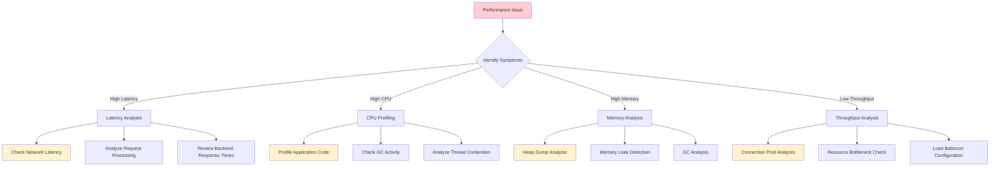

**Troubleshooting Playbook:**
```yaml
troubleshooting:
  # Performance issue classification
  issue_classification:
    latency_issues:
      symptoms:
        - response_time_p95 > 500ms
        - slow_endpoint_detection
        - timeout_errors_increasing
      investigation_steps:
        - check_network_connectivity
        - analyze_request_routing_time
        - review_backend_service_health
        - examine_authentication_latency
        
    throughput_issues:
      symptoms:
        - requests_per_second_declining
        - connection_pool_exhaustion
        - queue_depth_increasing
      investigation_steps:
        - analyze_connection_utilization
        - check_thread_pool_saturation
        - review_rate_limiting_configuration
        - examine_load_balancer_distribution
        
    resource_issues:
      symptoms:
        - high_cpu_utilization
        - memory_pressure_alerts
        - gc_pause_time_increasing
      investigation_steps:
        - profile_application_performance
        - analyze_memory_allocation_patterns
        - review_gc_configuration
        - check_thread_dump_analysis
        
  # Diagnostic tools
  diagnostic_commands:
    # System diagnostics
    system_diagnostics:
      cpu_analysis: |
        top -p $(pidof gateway)
        iostat -x 1 5
        vmstat 1 5
        
      memory_analysis: |
        free -h
        cat /proc/meminfo
        pmap -x $(pidof gateway)
        
      network_analysis: |
        netstat -an | grep :8080
        ss -tuln
        iftop -i eth0
        
    # Application diagnostics
    application_diagnostics:
      jvm_analysis: |
        jstat -gc $(pidof java) 1s
        jmap -histo $(pidof java)
        jstack $(pidof java)
        
      gateway_metrics: |
        curl http://localhost:8080/actuator/metrics
        curl http://localhost:8080/actuator/health
        curl http://localhost:8080/debug/performance
```

### Scaling Issues

**Auto-Scaling Troubleshooting:**
```yaml
scaling_troubleshooting:
  # Common scaling problems
  common_issues:
    slow_scaling:
      causes:
        - instance_launch_time_too_long
        - health_check_grace_period_too_short
        - scaling_cooldown_too_long
      solutions:
        - optimize_ami_boot_time
        - adjust_health_check_settings
        - reduce_cooldown_periods
        
    scaling_oscillation:
      causes:
        - conflicting_scaling_policies
        - metrics_noise_threshold_too_low
        - insufficient_cooldown_period
      solutions:
        - consolidate_scaling_policies
        - increase_metric_smoothing
        - implement_hysteresis
        
    insufficient_capacity:
      causes:
        - max_instances_too_low
        - scaling_triggers_too_conservative
        - resource_limits_reached
      solutions:
        - increase_maximum_capacity
        - lower_scaling_thresholds
        - request_service_limit_increases
        
  # Scaling validation
  scaling_validation:
    pre_scaling_checks:
      - verify_metric_accuracy
      - check_resource_availability
      - validate_scaling_policies
      
    post_scaling_checks:
      - confirm_instance_health
      - verify_load_distribution
      - validate_performance_improvement
      
    rollback_procedures:
      - automatic_rollback_triggers
      - manual_rollback_commands
      - capacity_restoration_steps
```

### Resource Exhaustion

**Resource Limit Management:**
```yaml
resource_exhaustion:
  # Resource monitoring
  resource_limits:
    file_descriptors:
      soft_limit: 65536
      hard_limit: 65536
      monitoring: true
      alert_threshold: 80%
      
    memory_limits:
      heap_max: 8g
      off_heap_max: 2g
      monitoring: true
      alert_threshold: 85%
      
    connection_limits:
      max_connections: 10000
      connection_pool_max: 1000
      monitoring: true
      alert_threshold: 90%
      
  # Resource recovery
  recovery_procedures:
    memory_pressure:
      immediate_actions:
        - trigger_gc_collection
        - clear_non_essential_caches
        - reduce_connection_pool_size
      medium_term_actions:
        - scale_up_instances
        - optimize_memory_usage
        - review_cache_policies
        
    connection_exhaustion:
      immediate_actions:
        - increase_connection_limits
        - close_idle_connections
        - review_connection_leaks
      preventive_actions:
        - implement_connection_pooling
        - add_connection_monitoring
        - set_connection_timeouts
```

---

## Advanced Scaling Patterns

### Multi-Region Scaling

**Global Distribution Architecture:**

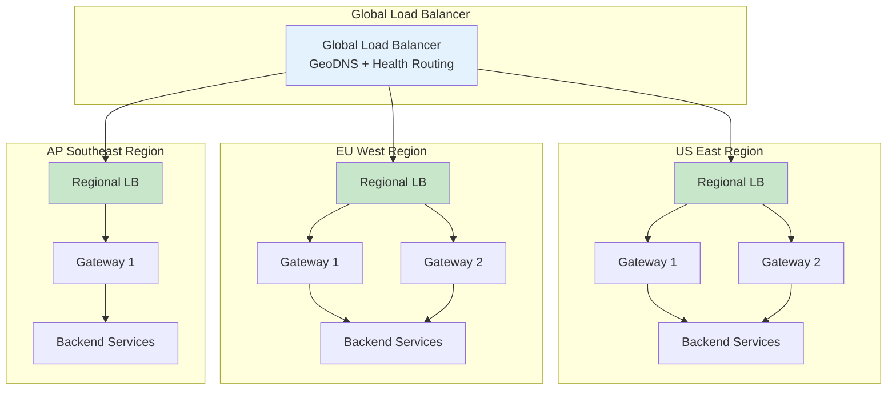

**Multi-Region Configuration:**
```yaml
multi_region_scaling:
  # Global configuration
  global_settings:
    primary_region: us-east-1
    failover_regions: [eu-west-1, ap-southeast-1]
    traffic_distribution: weighted_routing
    
  # Regional configurations
  regions:
    us_east_1:
      capacity:
        min_instances: 4
        max_instances: 20
        target_utilization: 60%
      traffic_weight: 60%
      backup_regions: [eu-west-1]
      
    eu_west_1:
      capacity:
        min_instances: 2
        max_instances: 10
        target_utilization: 65%
      traffic_weight: 30%
      compliance: gdpr_enabled
      
    ap_southeast_1:
      capacity:
        min_instances: 1
        max_instances: 5
        target_utilization: 70%
      traffic_weight: 10%
      latency_routing: true
      
  # Cross-region failover
  failover_configuration:
    health_check_interval: 30s
    failover_threshold: 3_consecutive_failures
    automatic_failback: true
    failback_threshold: 5_consecutive_successes
```

### Edge Computing Integration

**Edge Gateway Deployment:**
```yaml
edge_computing:
  # Edge locations
  edge_locations:
    - location: cloudflare_edge
      capabilities: [routing, caching, ddos_protection]
      scaling: automatic
      
    - location: aws_cloudfront
      capabilities: [static_content, api_caching]
      scaling: managed
      
    - location: custom_edge_nodes
      capabilities: [full_gateway_features]
      scaling: manual
      
  # Edge-to-origin routing
  edge_routing:
    cache_first: true
    origin_shield: true
    geographic_routing: true
    
    failover_chain:
      - edge_cache
      - regional_gateway
      - origin_services
      
  # Edge scaling policies
  edge_scaling:
    auto_provisioning: true
    traffic_threshold: 1000_rps_per_location
    cost_optimization: true
```

---

## Cost Optimization

### Resource Cost Management

**Cost-Effective Scaling Strategies:**
```yaml
cost_optimization:
  # Instance type optimization
  instance_optimization:
    cost_performance_analysis:
      metrics: [cost_per_rps, cost_per_gb_transferred]
      optimization_target: lowest_total_cost_of_ownership
      
    instance_types:
      baseline: t3.medium  # Low cost, burstable
      standard: c5.large   # Balanced compute
      high_performance: c5.xlarge  # High compute
      memory_intensive: r5.large   # High memory
      
  # Reserved capacity planning
  reserved_instances:
    baseline_capacity: 60%  # Always-on capacity
    reserved_instance_types: [c5.large, c5.xlarge]
    term_length: 1_year
    payment_option: partial_upfront
    
  # Spot instance utilization
  spot_instances:
    percentage: 30%
    diversification: across_3_instance_types
    interruption_handling: graceful_shutdown
    fallback: on_demand_instances
    
  # Auto-scaling cost controls
  cost_aware_scaling:
    budget_limits:
      daily_budget: 1000_usd
      monthly_budget: 25000_usd
      alert_threshold: 80%
      
    scaling_restrictions:
      max_instances_during_peak: 15
      max_instances_during_off_hours: 5
      weekend_scaling_limit: 3
```

---

## Conclusion

API Gateway scaling requires a comprehensive approach that balances performance, reliability, and cost-effectiveness. This document provides the foundation for building scalable gateway architectures that can grow with your business needs.

### Key Scaling Principles

1. **Start with Solid Foundations**: Establish proper monitoring, baseline performance metrics, and scaling policies from the beginning
2. **Design for Horizontal Scale**: Build stateless, distributed architectures that can scale out rather than just up  
3. **Implement Predictive Scaling**: Use historical data and machine learning to anticipate traffic patterns
4. **Optimize Resource Utilization**: Fine-tune CPU, memory, and network resources for maximum efficiency
5. **Plan for Peak Loads**: Design for 3-5x normal traffic to handle unexpected spikes
6. **Monitor Everything**: Comprehensive observability is critical for effective scaling decisions

### Implementation Roadmap

**Phase 1: Foundation (Months 1-2)**
- Implement comprehensive monitoring (*see [Monitoring](monitoring.md)*)
- Establish performance baselines and SLAs
- Configure basic horizontal auto-scaling
- Optimize connection pooling and caching (*see [Caching](caching.md)*)

**Phase 2: Optimization (Months 3-4)**
- Implement advanced load balancing strategies (*see [Routing](routing.md)*)
- Add predictive scaling capabilities
- Optimize application and system performance
- Implement cost optimization strategies

**Phase 3: Advanced Scaling (Months 5-6)**
- Deploy multi-region architecture
- Implement edge computing integration
- Add advanced monitoring and alerting
- Optimize for specific workload patterns

**Phase 4: Enterprise Scale (Months 6+)**
- Implement global traffic management
- Add AI-driven scaling optimization
- Integrate with enterprise monitoring systems
- Continuous performance optimization

### Related Documentation

This scaling guide should be implemented alongside:

- **[Architecture](architecture.md)**: Overall system design principles
- **[Routing](routing.md)**: Traffic distribution and load balancing
- **[Caching](caching.md)**: Performance optimization through caching
- **[Monitoring](monitoring.md)**: Observability and performance tracking
- **[Security](security.md)**: Secure scaling practices
- **[Patterns](patterns.md)**: Proven scaling design patterns

---

*This document is part of the API Gateway System Design documentation suite. For specific implementation guidance or scaling architecture reviews, consult with your platform engineering team and refer to the related documentation.*