# API Gateway Security Guide

**Document Information**
- **Version**: 1.0
- **Date**: September 23, 2025
- **Authors**: System Architecture Team
- **Status**: Final
- **Classification**: Internal Use

---

## Table of Contents

1. [Executive Summary](#executive-summary)
2. [Introduction](#introduction)
3. [Security Architecture Overview](#security-architecture-overview)
4. [Authentication and Authorization](#authentication-and-authorization)
5. [Transport Layer Security](#transport-layer-security)
6. [Rate Limiting and DDoS Protection](#rate-limiting-and-ddos-protection)
7. [Input Validation and Sanitization](#input-validation-and-sanitization)
8. [Security Headers and CORS](#security-headers-and-cors)
9. [Network Security](#network-security)
10. [Logging and Security Monitoring](#logging-and-security-monitoring)
11. [Security Best Practices](#security-best-practices)
12. [Threat Modeling and Risk Assessment](#threat-modeling-and-risk-assessment)
13. [Compliance and Regulations](#compliance-and-regulations)
14. [Security Testing and Validation](#security-testing-and-validation)
15. [Implementation Guidelines](#implementation-guidelines)
16. [Cross-References](#cross-references)
17. [Conclusion](#conclusion)
18. [Appendices](#appendices)

---

## Executive Summary

This document provides comprehensive security guidelines for API Gateway implementations. It covers essential security controls, threat mitigation strategies, and best practices to ensure robust protection of API endpoints and backend services. The security framework presented here integrates with broader architectural patterns and operational practices detailed in companion documents.

**Key Security Objectives:**
- Protect against unauthorized access and data breaches
- Ensure data integrity and confidentiality in transit
- Implement defense-in-depth security controls
- Maintain regulatory compliance requirements
- Enable comprehensive security monitoring and incident response

---

## Introduction

API Gateways serve as the critical entry point for all external requests to backend services, making them a primary target for security threats. This document establishes security standards and implementation guidelines that work in conjunction with the overall system architecture documented in `architecture.md`.

### Scope and Purpose

This security guide addresses:
- Authentication and authorization mechanisms
- Data protection and encryption requirements
- Network security controls and segmentation
- Monitoring and incident response procedures
- Compliance with industry security standards

### Security Framework Philosophy

Our security approach is built on the following principles:
- **Zero Trust Architecture**: Never trust, always verify
- **Defense in Depth**: Multiple layers of security controls
- **Principle of Least Privilege**: Minimal access rights for all entities
- **Security by Design**: Built-in security from architecture phase
- **Continuous Monitoring**: Real-time threat detection and response

---

## Security Architecture Overview

### Multi-Layer Security Model

The API Gateway security architecture implements multiple defensive layers to protect against various attack vectors:

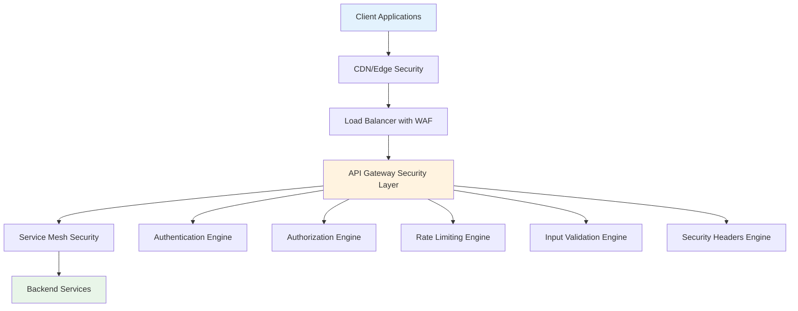
```mermaid
flowchart TD
    A[Client Applications] --> B[CDN/Edge Security]
    B --> C[Load Balancer with WAF]
    C --> D[API Gateway Security Layer]
    D --> E[Service Mesh Security]
    E --> F[Backend Services]
    
    D --> G[Authentication Engine]
    D --> H[Authorization Engine]
    D --> I[Rate Limiting Engine]
    D --> J[Input Validation Engine]
    D --> K[Security Headers Engine]
    
    style A fill:#e3f2fd
    style D fill:#fff3e0
    style F fill:#e8f5e8
```

### Security Zones and Trust Boundaries

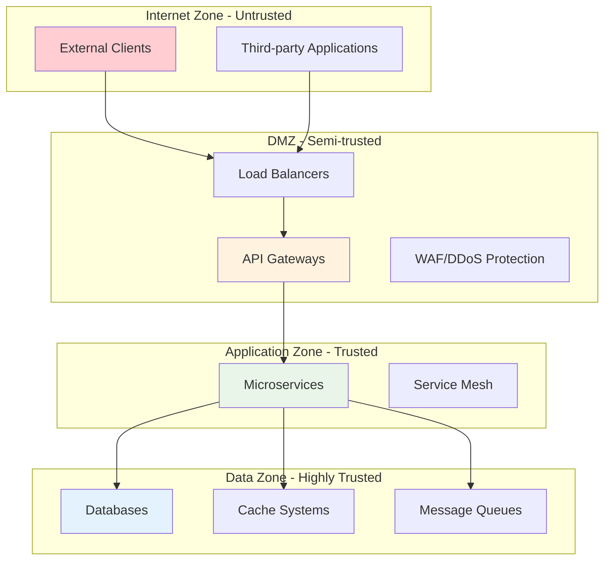
```mermaid
graph TB
    subgraph "Internet Zone - Untrusted"
        A[External Clients]
        B[Third-party Applications]
    end
    
    subgraph "DMZ - Semi-trusted"
        C[Load Balancers]
        D[API Gateways]
        E[WAF/DDoS Protection]
    end
    
    subgraph "Application Zone - Trusted"
        F[Microservices]
        G[Service Mesh]
    end
    
    subgraph "Data Zone - Highly Trusted"
        H[Databases]
        I[Cache Systems]
        J[Message Queues]
    end
    
    A --> C
    B --> C
    C --> D
    D --> F
    F --> H
    F --> I
    F --> J
    
    style A fill:#ffcdd2
    style D fill:#fff3e0
    style F fill:#e8f5e8
    style H fill:#e3f2fd
```

> **Architecture Integration**: This security model aligns with the overall system architecture patterns described in `architecture.md`, particularly the microservices communication patterns and service discovery mechanisms.

---

## Authentication and Authorization

### Authentication Strategies

#### 1. API Key Authentication

**Implementation Configuration:**
```yaml
authentication:
  api_key:
    header_name: "X-API-Key"
    query_parameter: "apikey"
    validation:
      format: "uuid-v4"
      minimum_length: 32
      maximum_length: 64
    storage:
      encryption: "AES-256-GCM"
      rotation_period: "90d"
    rate_limiting:
      requests_per_hour: 10000
      burst_limit: 100
```

**Security Considerations:**
- API keys must be generated using cryptographically secure random generators
- Keys should be encrypted at rest using AES-256 encryption
- Implement automatic key rotation every 90 days
- Monitor for key usage anomalies and suspicious patterns

#### 2. JSON Web Token (JWT) Authentication

**JWT Security Configuration:**
```yaml
authentication:
  jwt:
    algorithm: "RS256"  # RSA with SHA-256
    key_management:
      public_key_url: "https://auth.company.com/.well-known/jwks.json"
      key_rotation_interval: "24h"
      cache_ttl: "1h"
    validation:
      verify_signature: true
      verify_expiration: true
      verify_not_before: true
      verify_issuer: true
      verify_audience: true
      clock_skew_tolerance: "30s"
    token_lifetime:
      access_token: "15m"
      refresh_token: "7d"
```

**JWT Security Best Practices:**
- Use asymmetric algorithms (RS256, ES256) for production
- Implement proper key rotation and management
- Set short expiration times for access tokens
- Validate all JWT claims including issuer, audience, and expiration
- Implement token blacklisting for logout scenarios

#### 3. OAuth 2.0 and OpenID Connect

**OAuth 2.0 Flow Implementation:**
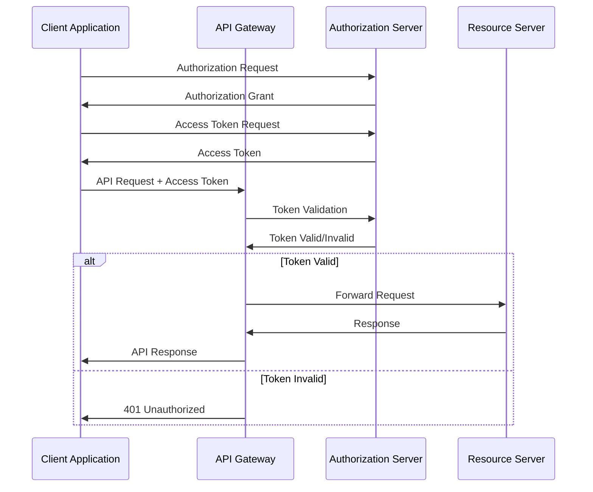
```mermaid
sequenceDiagram
    participant C as Client Application
    participant G as API Gateway
    participant A as Authorization Server
    participant R as Resource Server
    
    C->>A: Authorization Request
    A->>C: Authorization Grant
    C->>A: Access Token Request
    A->>C: Access Token
    C->>G: API Request + Access Token
    G->>A: Token Validation
    A->>G: Token Valid/Invalid
    alt Token Valid
        G->>R: Forward Request
        R->>G: Response
        G->>C: API Response
    else Token Invalid
        G->>C: 401 Unauthorized
    end
```

### Authorization Models

#### Role-Based Access Control (RBAC)

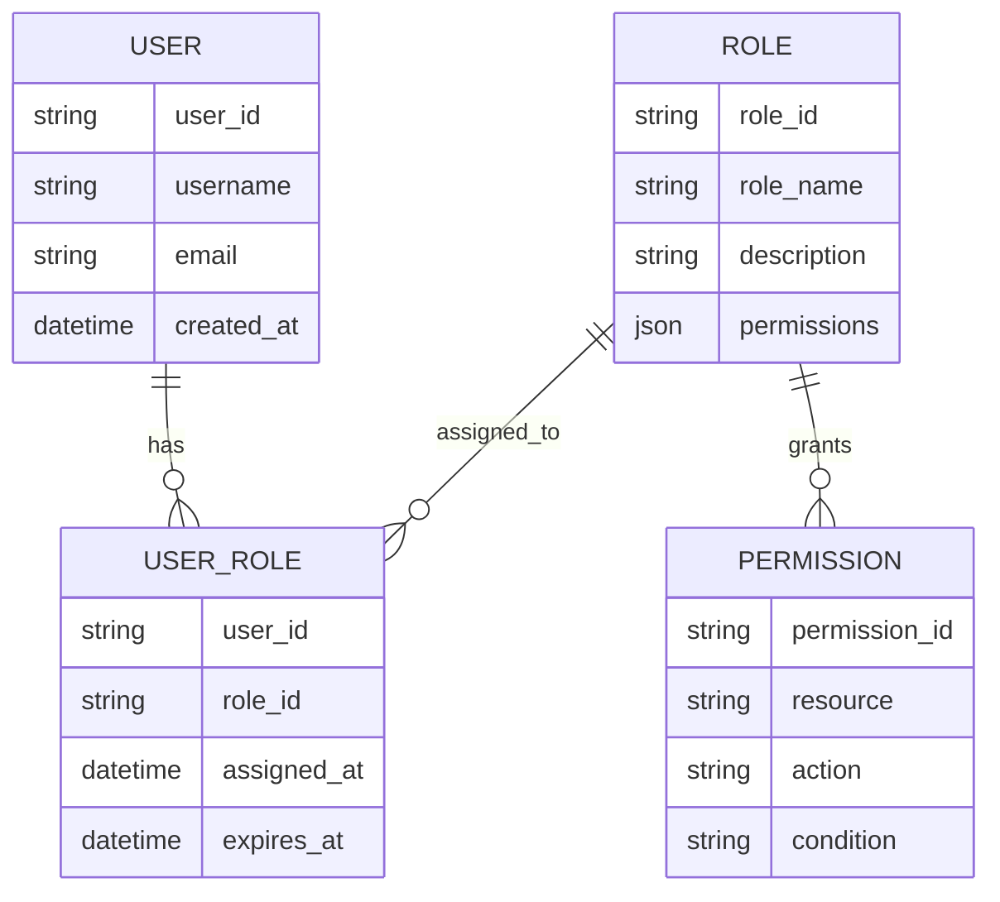
```mermaid
erDiagram
    USER {
        string user_id
        string username
        string email
        datetime created_at
    }
    
    ROLE {
        string role_id
        string role_name
        string description
        json permissions
    }
    
    USER_ROLE {
        string user_id
        string role_id
        datetime assigned_at
        datetime expires_at
    }
    
    PERMISSION {
        string permission_id
        string resource
        string action
        string condition
    }
    
    USER ||--o{ USER_ROLE : has
    ROLE ||--o{ USER_ROLE : assigned_to
    ROLE ||--o{ PERMISSION : grants
```

**RBAC Configuration Example:**
```yaml
authorization:
  rbac:
    roles:
      - name: "admin"
        permissions:
          - "users:*"
          - "system:*"
          - "reports:*"
      
      - name: "user"
        permissions:
          - "users:read:self"
          - "profiles:update:self"
          - "orders:*:self"
      
      - name: "readonly"
        permissions:
          - "users:read"
          - "reports:read"
```

#### Attribute-Based Access Control (ABAC)

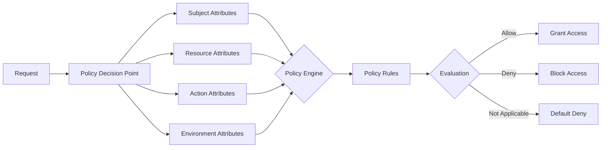
```mermaid
flowchart LR
    A[Request] --> B[Policy Decision Point]
    
    B --> C[Subject Attributes]
    B --> D[Resource Attributes]
    B --> E[Action Attributes]
    B --> F[Environment Attributes]
    
    C --> G{Policy Engine}
    D --> G
    E --> G
    F --> G
    
    G --> H[Policy Rules]
    H --> I{Evaluation}
    
    I -->|Allow| J[Grant Access]
    I -->|Deny| K[Block Access]
    I -->|Not Applicable| L[Default Deny]
```

> **Pattern Reference**: For detailed implementation patterns of authentication and authorization mechanisms, see `patterns.md` section on "Security Patterns" and "Access Control Patterns".

---

## Transport Layer Security

### TLS/SSL Configuration

#### Minimum Security Standards

```yaml
tls_configuration:
  minimum_version: "TLSv1.2"
  preferred_version: "TLSv1.3"
  
  cipher_suites:
    tls_1_3:
      - "TLS_AES_256_GCM_SHA384"
      - "TLS_CHACHA20_POLY1305_SHA256"
      - "TLS_AES_128_GCM_SHA256"
    
    tls_1_2:
      - "ECDHE-RSA-AES256-GCM-SHA384"
      - "ECDHE-RSA-CHACHA20-POLY1305"
      - "ECDHE-RSA-AES128-GCM-SHA256"
  
  certificate_configuration:
    key_type: "RSA"
    key_size: 2048
    signature_algorithm: "SHA256"
    validity_period: "365d"
    
  security_headers:
    strict_transport_security:
      max_age: 31536000
      include_subdomains: true
      preload: true
```

### Certificate Management Lifecycle

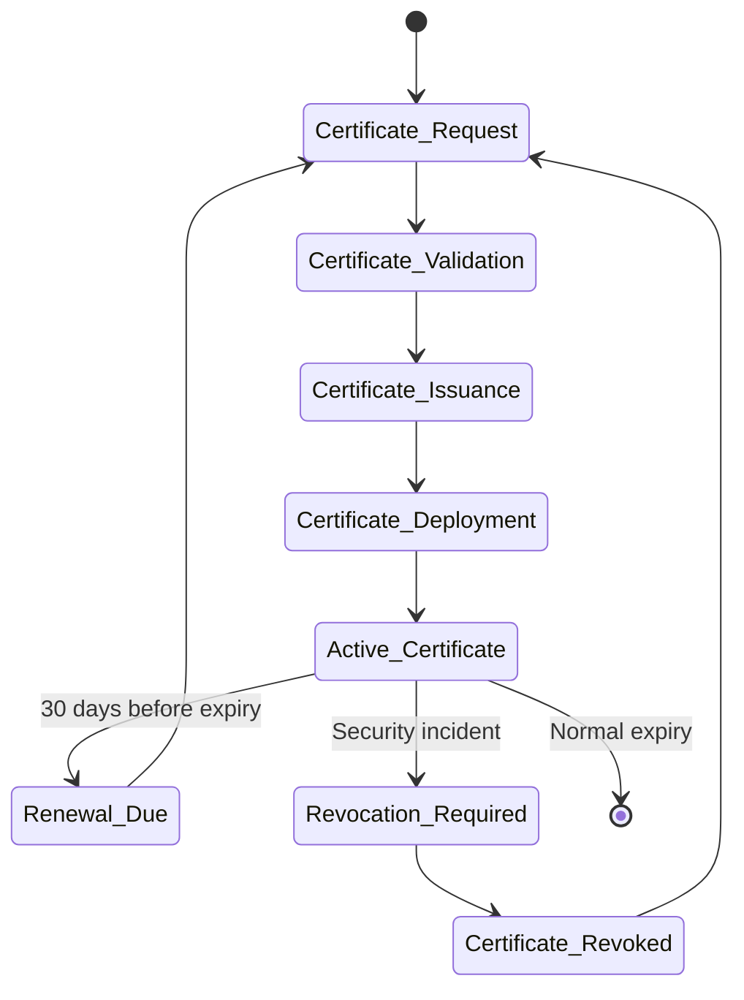
```mermaid
stateDiagram-v2
    [*] --> Certificate_Request
    Certificate_Request --> Certificate_Validation
    Certificate_Validation --> Certificate_Issuance
    Certificate_Issuance --> Certificate_Deployment
    Certificate_Deployment --> Active_Certificate
    
    Active_Certificate --> Renewal_Due : 30 days before expiry
    Renewal_Due --> Certificate_Request
    
    Active_Certificate --> Revocation_Required : Security incident
    Revocation_Required --> Certificate_Revoked
    Certificate_Revoked --> Certificate_Request
    
    Active_Certificate --> [*] : Normal expiry
```

### Perfect Forward Secrecy (PFS)

Implement ephemeral key exchange mechanisms to ensure that compromised long-term keys cannot decrypt past communications:

```yaml
perfect_forward_secrecy:
  key_exchange_algorithms:
    - "ECDHE"  # Elliptic Curve Diffie-Hellman Ephemeral
    - "DHE"    # Diffie-Hellman Ephemeral
  
  elliptic_curves:
    - "X25519"
    - "secp384r1"
    - "secp256r1"
```

---

## Rate Limiting and DDoS Protection

### Rate Limiting Algorithms

#### Token Bucket Algorithm Implementation

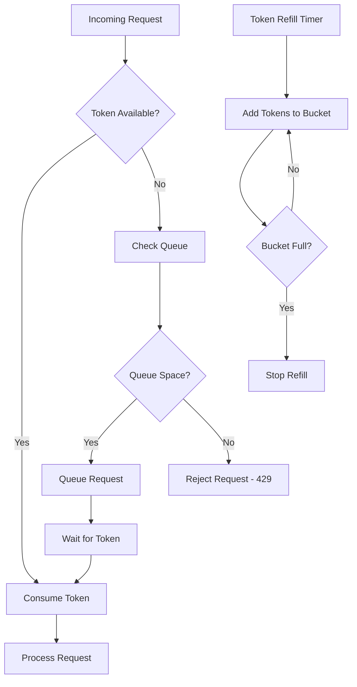
```mermaid
flowchart TD
    A[Incoming Request] --> B{Token Available?}
    
    B -->|Yes| C[Consume Token]
    B -->|No| D[Check Queue]
    
    C --> E[Process Request]
    D --> F{Queue Space?}
    
    F -->|Yes| G[Queue Request]
    F -->|No| H[Reject Request - 429]
    
    G --> I[Wait for Token]
    I --> C
    
    J[Token Refill Timer] --> K[Add Tokens to Bucket]
    K --> L{Bucket Full?}
    L -->|No| K
    L -->|Yes| M[Stop Refill]
```

#### Sliding Window Counter

```yaml
rate_limiting:
  algorithms:
    sliding_window:
      window_size: "1h"
      sub_windows: 60  # 1-minute sub-windows
      max_requests: 1000
      
  strategies:
    - name: "per_api_key"
      algorithm: "token_bucket"
      capacity: 1000
      refill_rate: "100/minute"
      burst_allowance: 200
      
    - name: "per_ip_address"
      algorithm: "sliding_window"
      window_size: "15m"
      max_requests: 300
      
    - name: "per_user_account"
      algorithm: "leaky_bucket"
      capacity: 500
      leak_rate: "50/minute"
```

### DDoS Protection Strategy

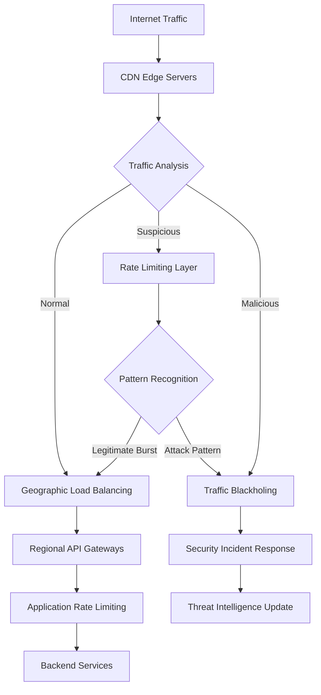
```mermaid
flowchart TD
    A[Internet Traffic] --> B[CDN Edge Servers]
    B --> C{Traffic Analysis}
    
    C -->|Normal| D[Geographic Load Balancing]
    C -->|Suspicious| E[Rate Limiting Layer]
    C -->|Malicious| F[Traffic Blackholing]
    
    D --> G[Regional API Gateways]
    E --> H{Pattern Recognition}
    
    H -->|Legitimate Burst| D
    H -->|Attack Pattern| F
    
    G --> I[Application Rate Limiting]
    I --> J[Backend Services]
    
    F --> K[Security Incident Response]
    K --> L[Threat Intelligence Update]
```

### Multi-Tier Rate Limiting

Implement rate limiting at multiple layers for comprehensive protection:

1. **CDN/Edge Level**: Protect against volumetric attacks
2. **Load Balancer Level**: Network-level rate limiting
3. **API Gateway Level**: Application-aware rate limiting
4. **Service Level**: Fine-grained business logic rate limiting

> **Scaling Considerations**: Rate limiting strategies must account for horizontal scaling patterns. See `scaling.md` for distributed rate limiting implementations and `caching.md` for rate limit state management across multiple gateway instances.

---

## Input Validation and Sanitization

### Request Validation Pipeline

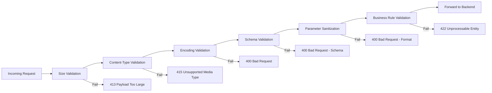
```mermaid
flowchart LR
    A[Incoming Request] --> B[Size Validation]
    B --> C[Content-Type Validation]
    C --> D[Encoding Validation]
    D --> E[Schema Validation]
    E --> F[Parameter Sanitization]
    F --> G[Business Rule Validation]
    G --> H[Forward to Backend]
    
    B -->|Fail| I[413 Payload Too Large]
    C -->|Fail| J[415 Unsupported Media Type]
    D -->|Fail| K[400 Bad Request]
    E -->|Fail| L[400 Bad Request - Schema]
    F -->|Fail| M[400 Bad Request - Format]
    G -->|Fail| N[422 Unprocessable Entity]
```

### Validation Configuration Framework

```yaml
input_validation:
  request_limits:
    max_payload_size: "10MB"
    max_header_size: "32KB"
    max_query_params: 50
    max_path_segments: 10
    
  content_type_validation:
    allowed_types:
      - "application/json"
      - "application/xml"
      - "application/x-www-form-urlencoded"
      - "multipart/form-data"
    charset_validation: true
    
  schema_validation:
    json_schema_version: "draft-07"
    strict_mode: true
    additional_properties: false
    
  sanitization_rules:
    html_input: "strip_tags"
    sql_keywords: "escape"
    script_tags: "remove"
    path_traversal: "normalize"
    
  security_limits:
    max_string_length: 10000
    max_array_length: 1000
    max_object_depth: 10
    max_number_precision: 15
```

### Common Injection Attack Prevention

#### SQL Injection Prevention
```yaml
sql_injection_prevention:
  parameter_validation:
    - type: "whitelist"
      allowed_patterns:
        - "^[a-zA-Z0-9_-]+$"  # Alphanumeric with underscore and hyphen
    
  dangerous_keywords:
    - "SELECT"
    - "INSERT"
    - "UPDATE"
    - "DELETE"
    - "DROP"
    - "UNION"
    - "OR 1=1"
    - "--"
    
  prevention_methods:
    - "parameterized_queries"
    - "input_escaping"
    - "stored_procedures"
```

#### NoSQL Injection Prevention
```yaml
nosql_injection_prevention:
  mongodb_operators:
    blocked_operators:
      - "$where"
      - "$regex"
      - "$ne"
      - "$in"
      - "$nin"
    
  prevention_strategies:
    - "input_type_validation"
    - "operator_whitelisting"
    - "query_sanitization"
```

---

## Security Headers and CORS

### Essential Security Headers

```yaml
security_headers:
  strict_transport_security:
    max_age: 31536000
    include_subdomains: true
    preload: true
    
  content_security_policy:
    default_src: "'self'"
    script_src: "'self' 'unsafe-inline'"
    style_src: "'self' 'unsafe-inline'"
    img_src: "'self' data: https:"
    font_src: "'self'"
    connect_src: "'self'"
    frame_ancestors: "'none'"
    
  x_frame_options: "DENY"
  x_content_type_options: "nosniff"
  x_xss_protection: "1; mode=block"
  
  referrer_policy: "strict-origin-when-cross-origin"
  
  permissions_policy:
    geolocation: "()"
    microphone: "()"
    camera: "()"
    fullscreen: "(self)"
    
  cache_control: "no-store, no-cache, must-revalidate"
```

### CORS (Cross-Origin Resource Sharing) Configuration

```yaml
cors_configuration:
  allowed_origins:
    production:
      - "https://app.company.com"
      - "https://dashboard.company.com"
    development:
      - "http://localhost:3000"
      - "http://localhost:8080"
      
  allowed_methods:
    - "GET"
    - "POST"
    - "PUT"
    - "PATCH"
    - "DELETE"
    - "OPTIONS"
    
  allowed_headers:
    - "Authorization"
    - "Content-Type"
    - "X-Requested-With"
    - "X-API-Key"
    - "X-Client-Version"
    
  exposed_headers:
    - "X-Total-Count"
    - "X-Rate-Limit-Limit"
    - "X-Rate-Limit-Remaining"
    - "X-Rate-Limit-Reset"
    
  credentials: true
  max_age: 86400  # 24 hours
  
  preflight_handling:
    cache_preflight: true
    max_preflight_age: 86400
```

### Header Security Validation

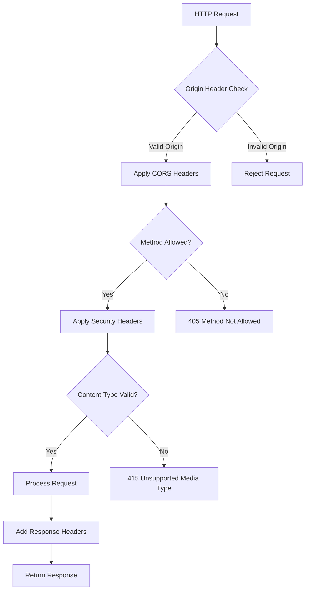
```mermaid
flowchart TD
    A[HTTP Request] --> B{Origin Header Check}
    
    B -->|Valid Origin| C[Apply CORS Headers]
    B -->|Invalid Origin| D[Reject Request]
    
    C --> E{Method Allowed?}
    E -->|Yes| F[Apply Security Headers]
    E -->|No| G[405 Method Not Allowed]
    
    F --> H{Content-Type Valid?}
    H -->|Yes| I[Process Request]
    H -->|No| J[415 Unsupported Media Type]
    
    I --> K[Add Response Headers]
    K --> L[Return Response]
```

---

## Network Security

### Network Segmentation Strategy

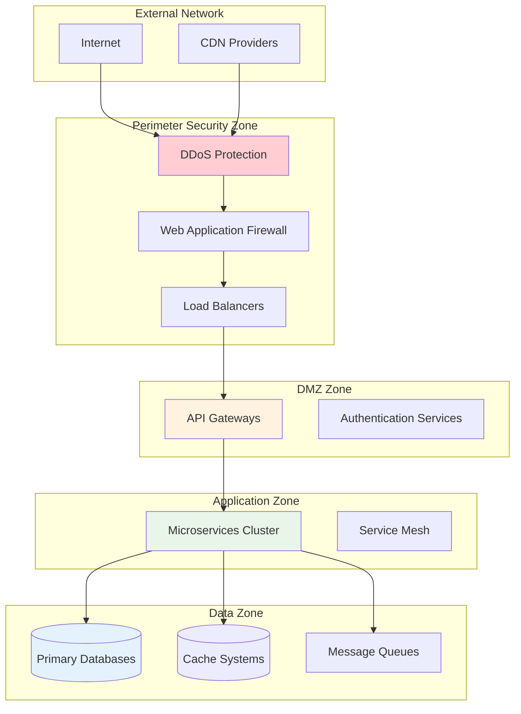
```mermaid
graph TB
    subgraph "External Network"
        A[Internet]
        B[CDN Providers]
    end
    
    subgraph "Perimeter Security Zone"
        C[DDoS Protection]
        D[Web Application Firewall]
        E[Load Balancers]
    end
    
    subgraph "DMZ Zone"
        F[API Gateways]
        G[Authentication Services]
    end
    
    subgraph "Application Zone"
        H[Microservices Cluster]
        I[Service Mesh]
    end
    
    subgraph "Data Zone"
        J[(Primary Databases)]
        K[(Cache Systems)]
        L[Message Queues]
    end
    
    A --> C
    B --> C
    C --> D
    D --> E
    E --> F
    F --> H
    H --> J
    H --> K
    H --> L
    
    style C fill:#ffcdd2
    style F fill:#fff3e0
    style H fill:#e8f5e8
    style J fill:#e3f2fd
```

### Firewall Rules and Access Control

```yaml
network_security:
  firewall_rules:
    ingress:
      - protocol: "HTTPS"
        port: 443
        source: "0.0.0.0/0"
        destination: "api-gateway"
        
      - protocol: "HTTP"
        port: 80
        source: "0.0.0.0/0"
        destination: "api-gateway"
        action: "redirect_to_https"
        
    egress:
      - protocol: "HTTPS"
        port: 443
        source: "api-gateway"
        destination: "backend-services"
        
      - protocol: "TCP"
        port: 5432
        source: "backend-services"
        destination: "database-cluster"
        
  ip_whitelisting:
    admin_access:
      - "10.0.0.0/8"      # Corporate network
      - "192.168.1.0/24"  # VPN network
      
    partner_apis:
      - "203.0.113.0/24"  # Partner A
      - "198.51.100.0/24" # Partner B
      
  ip_blacklisting:
    known_malicious:
      - "192.0.2.0/24"    # Known attack sources
      - "blocked_countries"  # Geo-blocking list
      
  geo_blocking:
    blocked_regions:
      - country_codes: ["CN", "RU", "KP"]
        exceptions: ["trusted_partners"]
```

### VPN and Private Network Access

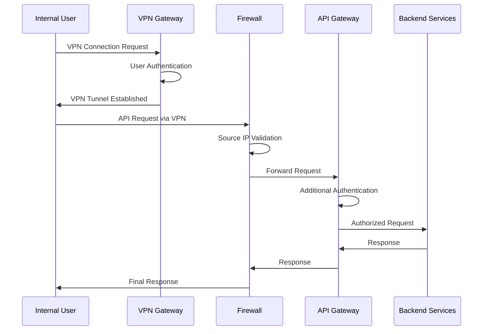
```mermaid
sequenceDiagram
    participant U as Internal User
    participant V as VPN Gateway
    participant F as Firewall
    participant G as API Gateway
    participant S as Backend Services
    
    U->>V: VPN Connection Request
    V->>V: User Authentication
    V->>U: VPN Tunnel Established
    
    U->>F: API Request via VPN
    F->>F: Source IP Validation
    F->>G: Forward Request
    G->>G: Additional Authentication
    G->>S: Authorized Request
    S->>G: Response
    G->>F: Response
    F->>U: Final Response
```

---

## Logging and Security Monitoring

### Security Event Logging Framework

```yaml
security_logging:
  log_levels:
    authentication_events: "INFO"
    authorization_failures: "WARN"
    rate_limit_violations: "WARN"
    input_validation_failures: "WARN"
    suspicious_activities: "ERROR"
    security_incidents: "CRITICAL"
    
  log_format: "structured_json"
  
  required_fields:
    - timestamp
    - event_type
    - severity_level
    - request_id
    - session_id
    - client_ip
    - user_agent
    - user_id
    - api_endpoint
    - http_method
    - response_status
    - response_time_ms
    - request_size_bytes
    - response_size_bytes
    
  sensitive_data_handling:
    mask_fields:
      - "password"
      - "api_key"
      - "authorization_header"
      - "credit_card_number"
      - "social_security_number"
    hash_fields:
      - "user_id"
      - "session_id"
    exclude_fields:
      - "request_body"  # Unless specifically needed
```

### Security Monitoring Dashboard

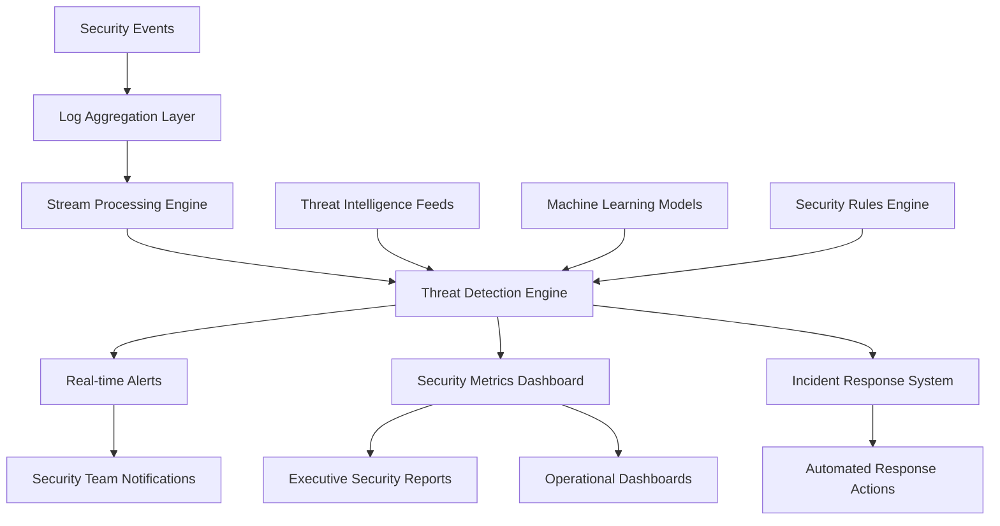
```mermaid
graph TD
    A[Security Events] --> B[Log Aggregation Layer]
    B --> C[Stream Processing Engine]
    C --> D[Threat Detection Engine]
    
    D --> E[Real-time Alerts]
    D --> F[Security Metrics Dashboard]
    D --> G[Incident Response System]
    
    H[Threat Intelligence Feeds] --> D
    I[Machine Learning Models] --> D
    J[Security Rules Engine] --> D
    
    E --> K[Security Team Notifications]
    G --> L[Automated Response Actions]
    
    F --> M[Executive Security Reports]
    F --> N[Operational Dashboards]
```

### Key Security Metrics and KPIs

```yaml
security_metrics:
  authentication_metrics:
    - failed_login_attempts_per_minute
    - successful_authentications_per_minute
    - authentication_response_time_p95
    - unique_failed_login_sources
    
  authorization_metrics:
    - authorization_failures_per_endpoint
    - privilege_escalation_attempts
    - unauthorized_access_attempts
    
  rate_limiting_metrics:
    - rate_limit_violations_per_minute
    - rate_limited_clients_count
    - rate_limit_effectiveness_ratio
    
  attack_detection_metrics:
    - suspicious_ip_addresses_count
    - sql_injection_attempts
    - xss_attack_attempts
    - ddos_attack_indicators
    
  performance_security_metrics:
    - security_middleware_latency
    - security_check_success_rate
    - false_positive_rate
    - false_negative_rate
```

### Alerting and Incident Response

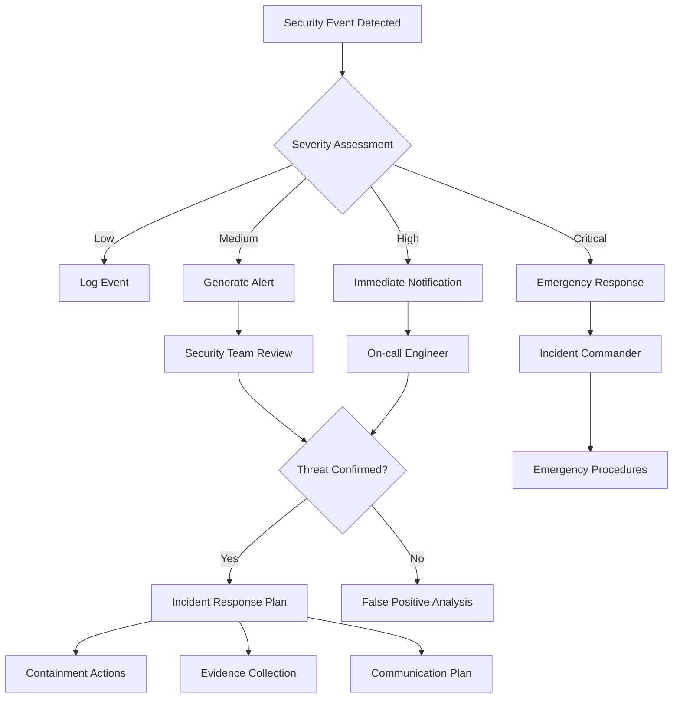
```mermaid
flowchart TD
    A[Security Event Detected] --> B{Severity Assessment}
    
    B -->|Low| C[Log Event]
    B -->|Medium| D[Generate Alert]
    B -->|High| E[Immediate Notification]
    B -->|Critical| F[Emergency Response]
    
    D --> G[Security Team Review]
    E --> H[On-call Engineer]
    F --> I[Incident Commander]
    
    G --> J{Threat Confirmed?}
    H --> J
    I --> K[Emergency Procedures]
    
    J -->|Yes| L[Incident Response Plan]
    J -->|No| M[False Positive Analysis]
    
    L --> N[Containment Actions]
    L --> O[Evidence Collection]
    L --> P[Communication Plan]
```

> **Monitoring Integration**: This security monitoring framework integrates with the comprehensive monitoring strategy detailed in `monitoring.md`, particularly the observability patterns and alerting mechanisms for operational security.

---

## Security Best Practices

### 1. API Key Management Best Practices

```yaml
api_key_management:
  generation:
    entropy: 256  # bits
    algorithm: "cryptographically_secure_random"
    format: "base64url"
    prefix: "ak_"  # API key identifier
    
  storage:
    encryption_at_rest: "AES-256-GCM"
    key_derivation: "PBKDF2"
    salt_generation: "random_per_key"
    
  rotation:
    automatic_rotation: true
    rotation_period: "90d"
    overlap_period: "7d"  # Grace period for old keys
    
  distribution:
    secure_channels_only: true
    no_email_transmission: true
    encrypted_configuration_management: true
    
  monitoring:
    usage_tracking: true
    anomaly_detection: true
    geographic_usage_monitoring: true
    rate_usage_analysis: true
```

### 2. Session Management Security

```yaml
session_management:
  session_configuration:
    session_timeout: "30m"  # Idle timeout
    absolute_timeout: "8h"  # Maximum session duration
    secure_cookie_flags:
      - "Secure"
      - "HttpOnly"
      - "SameSite=Strict"
    
  session_storage:
    storage_type: "encrypted_redis"
    encryption_algorithm: "AES-256-GCM"
    session_id_entropy: 256
    
  session_validation:
    ip_address_binding: true
    user_agent_validation: true
    concurrent_session_limit: 3
    
  session_termination:
    logout_cleanup: "immediate"
    expired_session_cleanup: "batch_hourly"
    suspicious_activity_termination: "immediate"
```

### 3. Error Handling Security

```yaml
error_handling:
  error_response_policy:
    expose_stack_traces: false
    expose_internal_paths: false
    expose_database_errors: false
    generic_error_messages: true
    
  error_logging:
    log_level: "ERROR"
    include_request_context: true
    sanitize_sensitive_data: true
    
  error_responses:
    authentication_failure:
      message: "Authentication required"
      http_status: 401
      include_retry_after: false
      
    authorization_failure:
      message: "Access denied"
      http_status: 403
      log_attempt: true
      
    rate_limit_exceeded:
      message: "Rate limit exceeded"
      http_status: 429
      include_retry_after: true
      
    validation_failure:
      message: "Invalid request format"
      http_status: 400
      include_field_details: false  # Security consideration
```

### 4. Data Protection Practices

```yaml
data_protection:
  data_classification:
    public: "no_protection_required"
    internal: "encryption_in_transit"
    confidential: "encryption_in_transit_and_rest"
    restricted: "encryption_plus_access_controls"
    
  encryption_standards:
    in_transit: "TLS_1_3"
    at_rest: "AES_256_GCM"
    key_management: "hardware_security_module"
    
  data_masking:
    log_masking_rules:
      - field: "credit_card"
        method: "mask_except_last_4"
      - field: "ssn"
        method: "full_mask"
      - field: "email"
        method: "domain_preserve_mask"
    
  data_retention:
    security_logs: "7_years"
    audit_logs: "7_years"
    session_logs: "90_days"
    debug_logs: "30_days"
```

---

## Threat Modeling and Risk Assessment

### STRIDE Threat Model for API Gateway

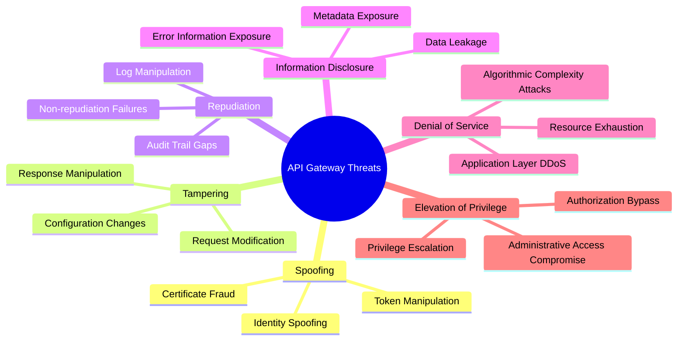
```mermaid
mindmap
  root((API Gateway Threats))
    Spoofing
      Identity Spoofing
      Token Manipulation
      Certificate Fraud
    Tampering
      Request Modification
      Response Manipulation
      Configuration Changes
    Repudiation
      Log Manipulation
      Audit Trail Gaps
      Non-repudiation Failures
    Information Disclosure
      Data Leakage
      Error Information Exposure
      Metadata Exposure
    Denial of Service
      Resource Exhaustion
      Application Layer DDoS
      Algorithmic Complexity Attacks
    Elevation of Privilege
      Authorization Bypass
      Privilege Escalation
      Administrative Access Compromise
```

### Common Attack Vectors and Mitigations

#### 1. Authentication Bypass Attacks

| Attack Type | Description | Mitigation Strategy |
|-------------|-------------|-------------------|
| Weak API Keys | Easily guessable or brute-forceable keys | Cryptographically secure key generation, minimum entropy requirements |
| JWT Vulnerabilities | Algorithm confusion, weak signatures | Use RS256/ES256, proper key management, signature validation |
| Session Hijacking | Stolen session tokens or cookies | Secure cookie flags, IP binding, session rotation |
| Credential Stuffing | Automated login attempts with stolen credentials | Rate limiting, account lockout, CAPTCHA implementation |

#### 2. Authorization Flaws

| Attack Type | Description | Mitigation Strategy |
|-------------|-------------|-------------------|
| Insecure Direct Object References (IDOR) | Access to unauthorized resources | Implement proper authorization checks, resource-level permissions |
| Privilege Escalation | Users gaining higher privileges | Principle of least privilege, role-based access controls |
| Missing Function Level Access Control | Unprotected administrative functions | Endpoint-level authorization, function-specific permissions |

#### 3. Injection Attacks

| Attack Type | Description | Mitigation Strategy |
|-------------|-------------|-------------------|
| SQL Injection | Malicious SQL code injection | Parameterized queries, input validation, WAF rules |
| NoSQL Injection | NoSQL database manipulation | Input sanitization, operator whitelisting, type validation |
| Command Injection | Operating system command execution | Input validation, command sanitization, sandboxing |
| LDAP Injection | LDAP query manipulation | LDAP escaping, parameterized queries |

### Risk Assessment Matrix

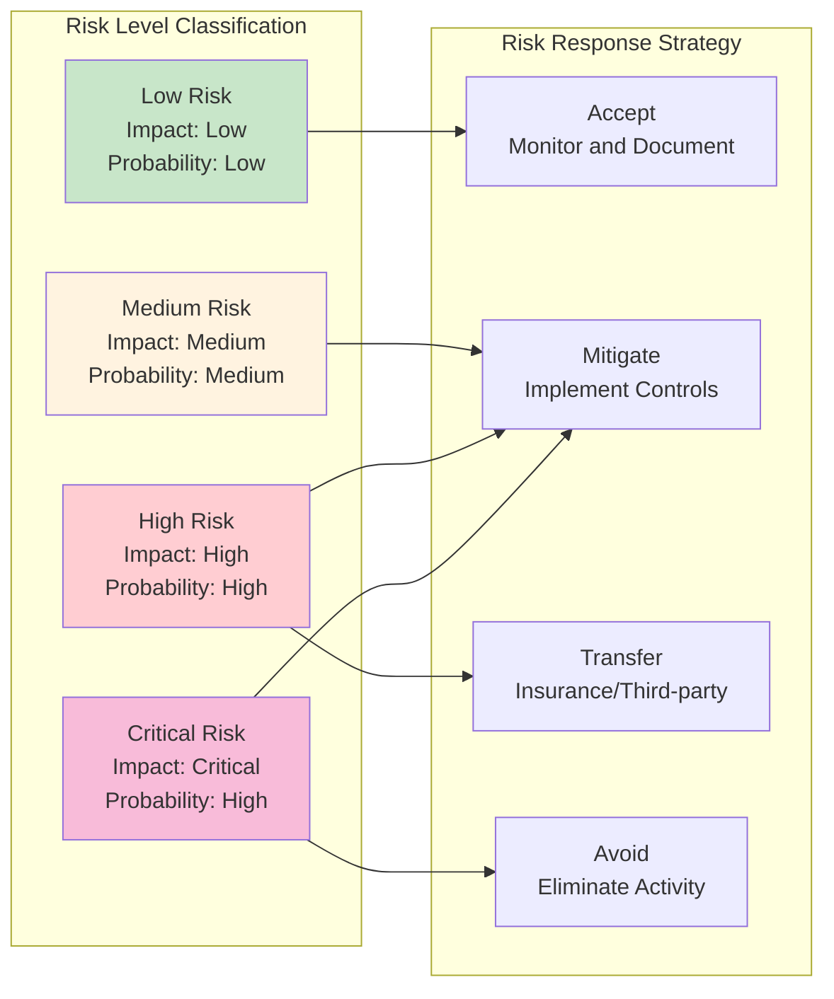
```mermaid
graph LR
    subgraph "Risk Level Classification"
        A[Low Risk<br/>Impact: Low<br/>Probability: Low] 
        B[Medium Risk<br/>Impact: Medium<br/>Probability: Medium]
        C[High Risk<br/>Impact: High<br/>Probability: High]
        D[Critical Risk<br/>Impact: Critical<br/>Probability: High]
    end
    
    subgraph "Risk Response Strategy"
        E[Accept<br/>Monitor and Document]
        F[Mitigate<br/>Implement Controls]
        G[Transfer<br/>Insurance/Third-party]
        H[Avoid<br/>Eliminate Activity]
    end
    
    A --> E
    B --> F
    C --> F
    C --> G
    D --> H
    D --> F
    
    style A fill:#c8e6c9
    style B fill:#fff3e0
    style C fill:#ffcdd2
    style D fill:#f8bbd9
```

---

## Compliance and Regulations

### Regulatory Framework Compliance

#### PCI DSS (Payment Card Industry Data Security Standard)

```yaml
pci_dss_compliance:
  requirements:
    req_1_firewall:
      description: "Install and maintain firewall configuration"
      implementation: "Network segmentation, firewall rules"
      
    req_2_vendor_defaults:
      description: "Do not use vendor-supplied defaults"
      implementation: "Custom configurations, secure defaults"
      
    req_3_protect_cardholder_data:
      description: "Protect stored cardholder data"
      implementation: "Encryption at rest, data minimization"
      
    req_4_encrypt_transmission:
      description: "Encrypt transmission of cardholder data"
      implementation: "TLS 1.3, strong cipher suites"
      
    req_6_secure_systems:
      description: "Develop and maintain secure systems"
      implementation: "Security SDLC, vulnerability management"
      
    req_8_identify_authenticate:
      description: "Identify and authenticate access"
      implementation: "Strong authentication, MFA"
      
    req_10_monitor_access:
      description: "Track and monitor access to network resources"
      implementation: "Comprehensive logging, SIEM integration"
```

#### GDPR (General Data Protection Regulation)

```yaml
gdpr_compliance:
  data_protection_principles:
    lawfulness_fairness_transparency: true
    purpose_limitation: true
    data_minimization: true
    accuracy: true
    storage_limitation: true
    integrity_confidentiality: true
    accountability: true
    
  individual_rights:
    right_to_information: "Privacy notices, data processing transparency"
    right_of_access: "Data subject access requests handling"
    right_to_rectification: "Data correction mechanisms"
    right_to_erasure: "Data deletion capabilities"
    right_to_restrict_processing: "Processing limitation controls"
    right_to_data_portability: "Data export functionality"
    right_to_object: "Opt-out mechanisms"
    
  technical_measures:
    encryption_in_transit: "TLS 1.3"
    encryption_at_rest: "AES-256-GCM"
    pseudonymization: "User ID hashing"
    access_controls: "Role-based permissions"
    audit_logging: "Comprehensive audit trails"
```

#### HIPAA (Health Insurance Portability and Accountability Act)

```yaml
hipaa_compliance:
  administrative_safeguards:
    security_officer: "Designated security responsible person"
    workforce_training: "Security awareness programs"
    information_access_management: "Role-based access controls"
    security_incident_procedures: "Incident response plan"
    
  physical_safeguards:
    facility_access_controls: "Data center security measures"
    workstation_use_restrictions: "Authorized access only"
    device_media_controls: "Secure device management"
    
  technical_safeguards:
    access_control: "Unique user identification, automatic logoff"
    audit_controls: "Activity logging and monitoring"
    integrity: "Data alteration/destruction protection"
    transmission_security: "End-to-end encryption"
```

---

## Security Testing and Validation

### Automated Security Testing Pipeline

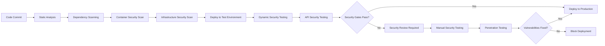
```mermaid
flowchart LR
    A[Code Commit] --> B[Static Analysis]
    B --> C[Dependency Scanning]
    C --> D[Container Security Scan]
    D --> E[Infrastructure Security Scan]
    E --> F[Deploy to Test Environment]
    F --> G[Dynamic Security Testing]
    G --> H[API Security Testing]
    H --> I{Security Gates Pass?}
    
    I -->|Yes| J[Deploy to Production]
    I -->|No| K[Security Review Required]
    
    K --> L[Manual Security Testing]
    L --> M[Penetration Testing]
    M --> N{Vulnerabilities Fixed?}
    
    N -->|Yes| J
    N -->|No| O[Block Deployment]
```

### Security Testing Categories

#### 1. Static Application Security Testing (SAST)

```yaml
sast_configuration:
  tools:
    - name: "SonarQube"
      rules:
        - "Security Hotspots"
        - "Vulnerability Detection"
        - "Code Quality Issues"
    
    - name: "Semgrep"
      rules:
        - "OWASP Top 10"
        - "Custom Security Rules"
        - "Framework-specific Issues"
  
  scan_triggers:
    - "pull_request"
    - "main_branch_commit"
    - "nightly_full_scan"
  
  quality_gates:
    security_rating: "A"
    vulnerability_count: 0
    security_hotspots: 0
```

#### 2. Dynamic Application Security Testing (DAST)

```yaml
dast_configuration:
  tools:
    - name: "OWASP ZAP"
      scan_types:
        - "baseline_scan"
        - "full_scan"
        - "api_scan"
    
    - name: "Burp Suite Enterprise"
      scan_types:
        - "authenticated_scan"
        - "unauthenticated_scan"
  
  test_scenarios:
    - "SQL Injection Testing"
    - "XSS Detection"
    - "Authentication Bypass"
    - "Authorization Testing"
    - "Input Validation Testing"
  
  scan_schedule:
    frequency: "daily"
    environment: "staging"
    notification: "security_team"
```

#### 3. API Security Testing

```yaml
api_security_testing:
  test_categories:
    authentication_testing:
      - "JWT token manipulation"
      - "API key validation"
      - "OAuth flow testing"
      - "Session management testing"
    
    authorization_testing:
      - "Role-based access testing"
      - "Resource-level permissions"
      - "Privilege escalation testing"
      - "IDOR vulnerability testing"
    
    input_validation_testing:
      - "Injection attack testing"
      - "Malformed request testing"
      - "Boundary value testing"
      - "Encoding/escaping testing"
    
    rate_limiting_testing:
      - "Rate limit bypass attempts"
      - "DDoS simulation"
      - "Resource exhaustion testing"
      - "Concurrency testing"
  
  automated_tools:
    - name: "Postman/Newman"
      purpose: "API functional and security testing"
    - name: "REST Assured"
      purpose: "API test automation framework"
    - name: "OWASP ZAP API"
      purpose: "API-specific security testing"
```

### Penetration Testing Framework

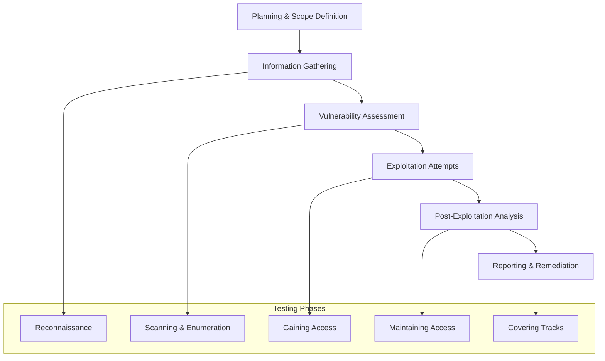
```mermaid
graph TD
    A[Planning & Scope Definition] --> B[Information Gathering]
    B --> C[Vulnerability Assessment]
    C --> D[Exploitation Attempts]
    D --> E[Post-Exploitation Analysis]
    E --> F[Reporting & Remediation]
    
    subgraph "Testing Phases"
        G[Reconnaissance]
        H[Scanning & Enumeration]
        I[Gaining Access]
        J[Maintaining Access]
        K[Covering Tracks]
    end
    
    B --> G
    C --> H
    D --> I
    E --> J
    F --> K
```

### Security Testing Checklist

#### Pre-Production Security Validation

- [ ] **Authentication Testing**
  - [ ] JWT token validation and manipulation
  - [ ] API key security and rotation
  - [ ] Multi-factor authentication bypass attempts
  - [ ] Session management vulnerabilities

- [ ] **Authorization Testing**
  - [ ] Role-based access control validation
  - [ ] Privilege escalation testing
  - [ ] Insecure direct object reference testing
  - [ ] Function-level authorization verification

- [ ] **Input Validation Testing**
  - [ ] SQL injection vulnerability assessment
  - [ ] Cross-site scripting (XSS) testing
  - [ ] Command injection testing
  - [ ] File upload security validation

- [ ] **Network Security Testing**
  - [ ] TLS/SSL configuration validation
  - [ ] Certificate security verification
  - [ ] Network segmentation testing
  - [ ] Firewall rule validation

- [ ] **Rate Limiting and DDoS Testing**
  - [ ] Rate limit effectiveness testing
  - [ ] DDoS simulation and response
  - [ ] Resource exhaustion testing
  - [ ] Concurrent request handling

---

## Implementation Guidelines

### Security Implementation Roadmap

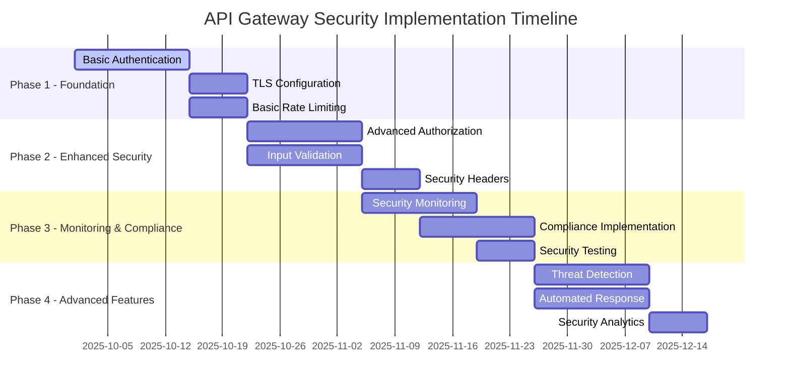
```mermaid
gantt
    title API Gateway Security Implementation Timeline
    dateFormat  YYYY-MM-DD
    section Phase 1 - Foundation
    Basic Authentication        :active, phase1-auth, 2025-10-01, 2w
    TLS Configuration          :phase1-tls, after phase1-auth, 1w
    Basic Rate Limiting        :phase1-rate, after phase1-auth, 1w
    
    section Phase 2 - Enhanced Security
    Advanced Authorization     :phase2-authz, after phase1-tls, 2w
    Input Validation           :phase2-input, after phase1-rate, 2w
    Security Headers           :phase2-headers, after phase2-authz, 1w
    
    section Phase 3 - Monitoring & Compliance
    Security Monitoring        :phase3-monitor, after phase2-input, 2w
    Compliance Implementation  :phase3-comply, after phase2-headers, 2w
    Security Testing           :phase3-test, after phase3-monitor, 1w
    
    section Phase 4 - Advanced Features
    Threat Detection           :phase4-threat, after phase3-comply, 2w
    Automated Response         :phase4-auto, after phase3-test, 2w
    Security Analytics         :phase4-analytics, after phase4-threat, 1w
```

### Security Configuration Management

```yaml
security_configuration_management:
  version_control:
    repository: "git"
    branching_strategy: "gitflow"
    security_review_required: true
    
  configuration_as_code:
    infrastructure: "terraform"
    application: "helm_charts"
    security_policies: "open_policy_agent"
    
  deployment_strategy:
    blue_green_deployment: true
    canary_releases: true
    rollback_capability: true
    
  configuration_validation:
    pre_deployment_checks: true
    security_policy_validation: true
    compliance_verification: true
```

### Security Architecture Decisions

#### Decision Matrix for Authentication Methods

| Requirement | API Key | JWT | OAuth 2.0 | mTLS |
|-------------|---------|-----|-----------|------|
| Server-to-Server | ✅ Excellent | ⚠️ Moderate | ❌ Poor | ✅ Excellent |
| Web Applications | ❌ Poor | ✅ Excellent | ✅ Excellent | ❌ Poor |
| Mobile Apps | ⚠️ Moderate | ✅ Excellent | ✅ Excellent | ⚠️ Moderate |
| Third-party Integration | ✅ Excellent | ⚠️ Moderate | ✅ Excellent | ✅ Excellent |
| Token Expiration | ❌ Manual | ✅ Automatic | ✅ Automatic | ✅ Certificate-based |
| Revocation | ⚠️ Manual | ⚠️ Complex | ✅ Built-in | ✅ CRL/OCSP |

> **Pattern Selection**: The choice of authentication method should align with the architectural patterns described in `patterns.md`, particularly the "API Authentication Patterns" and "Service-to-Service Communication Patterns".

---

## Cross-References

This security document integrates with the complete API Gateway documentation suite:

### Primary Architecture References

**[architecture.md](./architecture.md)**
- Security architecture alignment with overall system design
- Microservices security communication patterns
- Service discovery security considerations
- Network topology and security zones

**[patterns.md](./patterns.md)**
- Security-specific implementation patterns
- Authentication and authorization patterns
- Circuit breaker patterns for security resilience
- Retry patterns with security considerations

### Operational Integration

**[monitoring.md](./monitoring.md)**
- Security monitoring and observability strategies
- Security metrics and KPI dashboards
- Incident response and alerting mechanisms
- Security audit logging and compliance reporting

**[scaling.md](./scaling.md)**
- Secure horizontal scaling strategies
- Distributed security state management
- Load balancing with security considerations
- Auto-scaling security implications

**[routing.md](./routing.md)**
- Secure routing configurations and policies
- Path-based security rules and validation
- Traffic splitting with security context
- Version-based security policies

### Performance and Caching Integration

**[caching.md](./caching.md)**
- Secure caching strategies and policies
- Cache invalidation for security contexts
- Distributed cache security considerations
- Session and token caching security

**[pros-cons.md](./pros-cons.md)**
- Security trade-offs and decision matrices
- Performance vs. security considerations
- Cost implications of security implementations
- Risk assessment frameworks

### Integration Dependencies

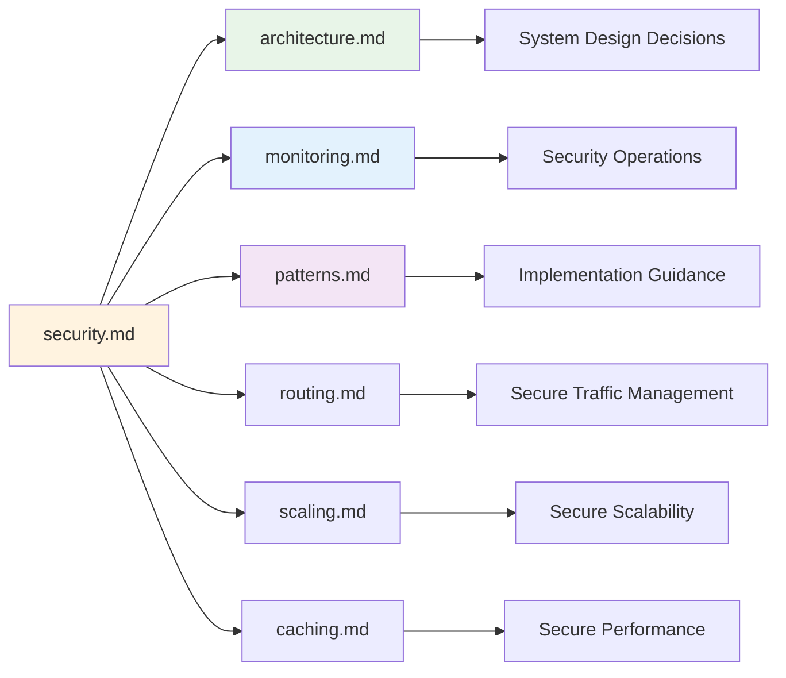
```mermaid
graph LR
    A[security.md] --> B[architecture.md]
    A --> C[monitoring.md]
    A --> D[patterns.md]
    
    B --> E[System Design Decisions]
    C --> F[Security Operations]
    D --> G[Implementation Guidance]
    
    A --> H[routing.md]
    A --> I[scaling.md]
    A --> J[caching.md]
    
    H --> K[Secure Traffic Management]
    I --> L[Secure Scalability]
    J --> M[Secure Performance]
    
    style A fill:#fff3e0
    style B fill:#e8f5e8
    style C fill:#e3f2fd
    style D fill:#f3e5f5
```

---

## Conclusion

This comprehensive security guide establishes the foundation for robust API Gateway security implementation. The multi-layered security approach addresses authentication, authorization, data protection, network security, and operational security monitoring.

### Key Takeaways

1. **Defense in Depth**: Multiple security layers provide comprehensive protection against various attack vectors
2. **Zero Trust Model**: Every request requires verification regardless of source
3. **Continuous Monitoring**: Real-time security monitoring enables rapid threat detection and response
4. **Compliance Focus**: Built-in compliance controls ensure regulatory requirement adherence
5. **Integration Architecture**: Security controls integrate seamlessly with overall system architecture

### Next Steps

1. **Review Architecture Integration**: Ensure security measures align with `architecture.md` specifications
2. **Implement Monitoring**: Deploy security monitoring as outlined in `monitoring.md`
3. **Apply Security Patterns**: Utilize implementation patterns from `patterns.md`
4. **Configure Secure Routing**: Implement secure routing policies per `routing.md`
5. **Enable Secure Caching**: Deploy secure caching strategies from `caching.md`

### Continuous Improvement

Security is an ongoing process requiring regular updates and improvements:

- **Quarterly Security Reviews**: Assess and update security measures
- **Annual Penetration Testing**: Comprehensive security validation
- **Continuous Threat Monitoring**: Stay current with emerging threats
- **Regular Compliance Audits**: Ensure ongoing regulatory compliance
- **Security Training Updates**: Keep team knowledge current

---

## Appendices

### Appendix A: Security Configuration Templates

#### A.1 Production Security Configuration

```yaml
# Production API Gateway Security Configuration
security:
  environment: "production"
  
  authentication:
    methods: ["jwt", "oauth2", "mtls"]
    jwt:
      algorithm: "RS256"
      key_rotation: "24h"
      token_lifetime: "15m"
    
  authorization:
    model: "abac"
    policy_engine: "open_policy_agent"
    
  transport:
    tls_version: "1.3"
    cipher_suites: "secure_only"
    hsts: true
    
  rate_limiting:
    algorithm: "token_bucket"
    default_limit: "1000/hour"
    burst_limit: 200
    
  monitoring:
    security_events: true
    real_time_alerts: true
    siem_integration: true
```

#### A.2 Development Security Configuration

```yaml
# Development API Gateway Security Configuration
security:
  environment: "development"
  
  authentication:
    methods: ["jwt", "api_key"]
    relaxed_validation: true  # Development only
    
  authorization:
    model: "rbac"
    debug_mode: true
    
  transport:
    tls_version: "1.2"  # Minimum for development
    allow_self_signed: true  # Development only
    
  rate_limiting:
    algorithm: "simple_counter"
    default_limit: "10000/hour"
    
  monitoring:
    verbose_logging: true
    debug_headers: true
```

### Appendix B: Security Incident Response Playbook

#### B.1 Incident Classification

| Severity | Definition | Response Time | Escalation |
|----------|------------|---------------|------------|
| Critical | System compromise, data breach | 15 minutes | Immediate |
| High | Service disruption, security bypass | 1 hour | Within 2 hours |
| Medium | Policy violation, suspicious activity | 4 hours | Next business day |
| Low | Minor configuration issue | 24 hours | Weekly review |

#### B.2 Response Procedures

1. **Immediate Response (0-15 minutes)**
   - Assess incident severity
   - Activate incident response team
   - Implement containment measures

2. **Short-term Response (15 minutes - 4 hours)**
   - Detailed investigation
   - Evidence collection
   - Stakeholder communication

3. **Long-term Response (4+ hours)**
   - Root cause analysis
   - Remediation implementation
   - Lessons learned documentation

### Appendix C: Compliance Mapping

#### C.1 OWASP API Security Top 10 Compliance Matrix

| OWASP Risk | Implementation | Reference Section |
|------------|----------------|------------------|
| API1:2023 Broken Object Level Authorization | ABAC implementation, resource-level permissions | [Authorization Models](#authorization-models) |
| API2:2023 Broken Authentication | JWT, OAuth 2.0, multi-factor authentication | [Authentication Strategies](#authentication-strategies) |
| API3:2023 Broken Object Property Level Authorization | Response filtering, data minimization | [Data Protection Practices](#4-data-protection-practices) |
| API4:2023 Unrestricted Resource Consumption | Rate limiting, resource quotas | [Rate Limiting and DDoS Protection](#rate-limiting-and-ddos-protection) |
| API5:2023 Broken Function Level Authorization | Endpoint-level permissions, RBAC | [Authorization Models](#authorization-models) |
| API6:2023 Unrestricted Access to Sensitive Business Flows | Business logic validation, workflow controls | [Input Validation and Sanitization](#input-validation-and-sanitization) |
| API7:2023 Server Side Request Forgery | Input validation, URL filtering | [Input Validation and Sanitization](#input-validation-and-sanitization) |
| API8:2023 Security Misconfiguration | Secure defaults, configuration management | [Security Best Practices](#security-best-practices) |
| API9:2023 Improper Inventory Management | API discovery, lifecycle management | [Implementation Guidelines](#implementation-guidelines) |
| API10:2023 Unsafe Consumption of APIs | Third-party API security validation | [Network Security](#network-security) |

---

**Document Control**
- **Document ID**: SEC-001
- **Version**: 1.0
- **Classification**: Internal Use
- **Review Cycle**: Quarterly
- **Next Review Date**: December 23, 2025
- **Approval Authority**: Chief Security Officer
- **Distribution**: Engineering Teams, Security Team, Operations Team

---

*This document is part of the API Gateway documentation suite. For the most current version and related documents, refer to the project documentation repository. All security implementations should be reviewed and approved by the Security Team before production deployment.*