# Architecture Patterns

## Table of Contents

1. [Overview](#overview)
2. [Pattern Categories](#pattern-categories)
3. [Pattern Comparison](#pattern-comparison)
4. [Monolithic Architecture](#monolithic-architecture)
5. [Layered Architecture](#layered-architecture)
6. [Microservices Architecture](#microservices-architecture)
7. [Event-Driven Architecture](#event-driven-architecture)
8. [Event Sourcing](#event-sourcing)
9. [CQRS (Command Query Responsibility Segregation)](#cqrs)
10. [Hexagonal Architecture](#hexagonal-architecture)
11. [Serverless Architecture](#serverless-architecture)
12. [Pattern Selection Guide](#pattern-selection-guide)
13. [Migration Strategies](#migration-strategies)
14. [Anti-Patterns](#anti-patterns)
15. [Best Practices](#best-practices)
16. [Real-World Examples](#real-world-examples)

---

## Overview

This directory contains comprehensive documentation on major software architecture patterns. Each pattern represents a different approach to organizing and structuring software systems, with unique strengths, trade-offs, and use cases.

### Architecture Evolution

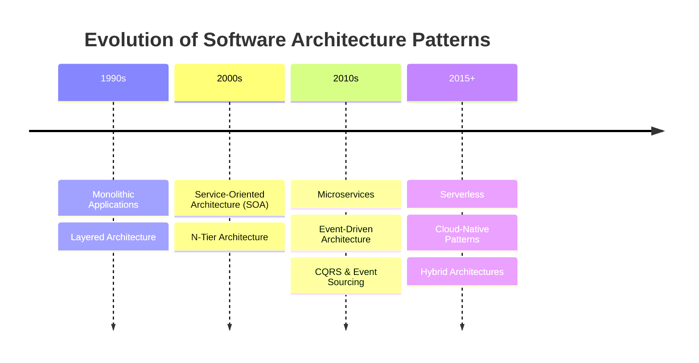

### Pattern Selection Framework

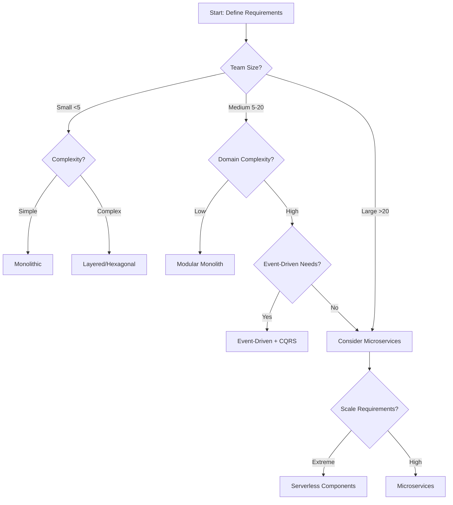

---

## Pattern Categories

### By Deployment Structure

| Pattern                                          | Structure              | Best For                        | Complexity  |
| ------------------------------------------------ | ---------------------- | ------------------------------- | ----------- |
| **[Monolithic](#monolithic-architecture)**       | Single deployable unit | Small-medium apps, MVPs         | Low         |
| **[Layered](#layered-architecture)**             | Horizontal separation  | Traditional enterprise apps     | Low-Medium  |
| **[Microservices](#microservices-architecture)** | Independent services   | Large-scale distributed systems | High        |
| **[Serverless](#serverless-architecture)**       | Function-based         | Event-driven, variable load     | Medium-High |

### By Communication Style

| Pattern                                          | Communication             | Coupling | Scalability |
| ------------------------------------------------ | ------------------------- | -------- | ----------- |
| **[Monolithic](#monolithic-architecture)**       | In-process calls          | Tight    | Limited     |
| **[Layered](#layered-architecture)**             | Layer-to-layer            | Medium   | Medium      |
| **[Event-Driven](#event-driven-architecture)**   | Asynchronous events       | Loose    | High        |
| **[CQRS](#cqrs)**                                | Separate read/write       | Loose    | Very High   |
| **[Microservices](#microservices-architecture)** | Network calls (REST/gRPC) | Loose    | Very High   |

### By Data Management

| Pattern                                          | Data Strategy                | Consistency           | Complexity  |
| ------------------------------------------------ | ---------------------------- | --------------------- | ----------- |
| **[Monolithic](#monolithic-architecture)**       | Single database              | Strong                | Low         |
| **[Event Sourcing](#event-sourcing)**            | Event log as source of truth | Eventually consistent | High        |
| **[CQRS](#cqrs)**                                | Separate read/write stores   | Configurable          | Medium-High |
| **[Microservices](#microservices-architecture)** | Database per service         | Eventually consistent | High        |

---

## Pattern Comparison

### Visual Overview

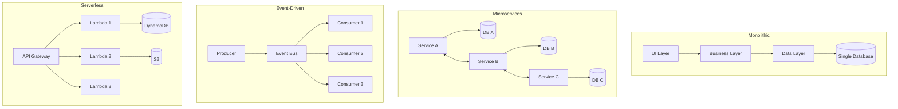

### Comprehensive Comparison Matrix

| Aspect                | Monolithic        | Layered            | Microservices    | Event-Driven | Serverless   |
| --------------------- | ----------------- | ------------------ | ---------------- | ------------ | ------------ |
| **Deployment**        | Single unit       | Single/Few units   | Many independent | Varies       | Functions    |
| **Scalability**       | Vertical only     | Limited horizontal | Excellent        | Excellent    | Auto-scaling |
| **Development Speed** | Fast (initially)  | Medium             | Slow (initially) | Medium       | Fast         |
| **Testing**           | Easy              | Easy               | Complex          | Medium       | Medium       |
| **Maintenance**       | Difficult (large) | Medium             | Complex          | Medium       | Easy         |
| **Cost (Small)**      | Low               | Low                | High             | Medium       | Very Low     |
| **Cost (Large)**      | Medium            | Medium             | Medium           | Medium       | Variable     |
| **Team Size**         | Any               | Small-Medium       | Large            | Medium-Large | Small-Medium |
| **Learning Curve**    | Low               | Low                | High             | Medium-High  | Medium       |
| **Resilience**        | Low               | Low                | High             | High         | High         |
| **Data Consistency**  | Strong            | Strong             | Eventual         | Eventual     | Varies       |

---

## Monolithic Architecture

### Overview

A monolithic architecture is a traditional unified model where all components are part of a single, indivisible application.

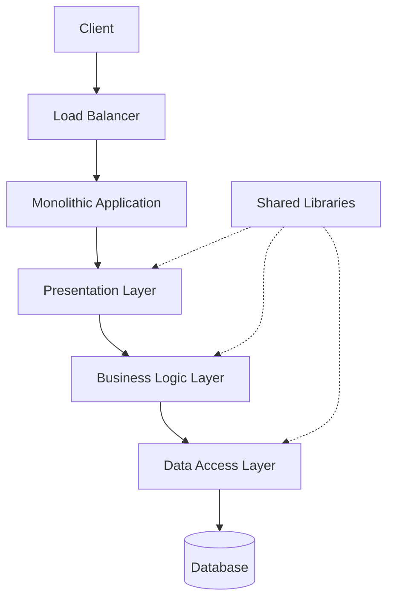

### Characteristics

| Characteristic        | Description                     | Impact                                |
| --------------------- | ------------------------------- | ------------------------------------- |
| **Single Codebase**   | All code in one repository      | Simple version control                |
| **Shared Memory**     | In-process communication        | Fast, no network overhead             |
| **Single Deployment** | Deploy entire application       | Simple deployment, all-or-nothing     |
| **Unified Database**  | Single database for all data    | Strong consistency, ACID transactions |
| **Tight Coupling**    | Components depend on each other | Changes can have wide impact          |

### Documentation

📚 **Detailed Documentation:**

- [README](./monolithic/readme.md) - Complete overview
- [Pros and Cons](./monolithic/pros-cons.md) - Advantages and disadvantages
- [Use Cases](./monolithic/use-cases.md) - When to use monolithic
- [Examples](./monolithic/examples.md) - Real-world examples

### When to Use

✅ **Good For:**

- Small to medium applications
- MVPs and prototypes
- Simple domains
- Small teams
- Limited resources
- Strong consistency requirements

❌ **Avoid When:**

- Need independent scaling
- Large, distributed teams
- Rapid iteration required
- Complex, evolving domains

---

## Layered Architecture

### Overview

Organizes code into horizontal layers, each with specific responsibilities and dependencies flowing in one direction.

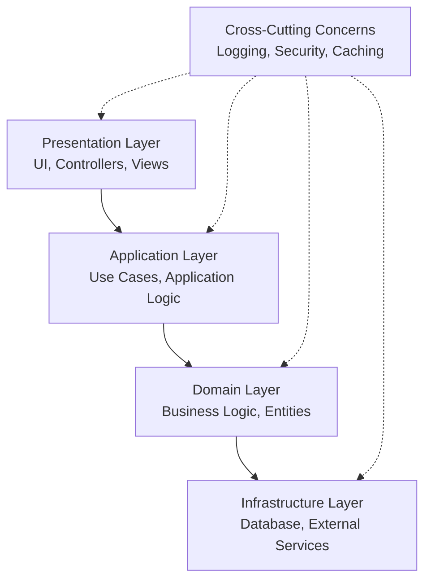

### Layer Responsibilities

| Layer              | Responsibility           | Dependencies      | Examples                                 |
| ------------------ | ------------------------ | ----------------- | ---------------------------------------- |
| **Presentation**   | UI, HTTP handlers        | Application layer | Controllers, Views, DTOs                 |
| **Application**    | Use cases, orchestration | Domain layer      | Services, Commands, Queries              |
| **Domain**         | Business logic, rules    | None (ideally)    | Entities, Value Objects, Domain Services |
| **Infrastructure** | External concerns        | Domain interfaces | Repositories, APIs, Database             |

### Documentation

📚 **Detailed Documentation:**

- [README](./layered-architecture/readme.md) - Architecture overview
- [Components](./layered-architecture/components.md) - Layer descriptions
- [Example Diagram](./layered-architecture/example-diagram.md) - Visual examples
- [Best Practices](./layered-architecture/best-practises.md) - Implementation guidelines

### Variations

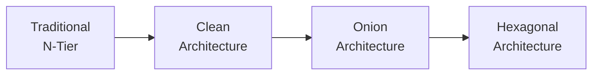

---

## Microservices Architecture

### Overview

Decomposes applications into small, independent services that communicate over networks.

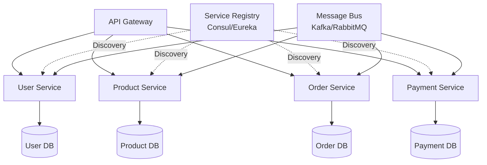

### Core Principles

| Principle                 | Description                      | Benefit                |
| ------------------------- | -------------------------------- | ---------------------- |
| **Single Responsibility** | Each service does one thing well | Clear boundaries       |
| **Autonomy**              | Independent deployment & scaling | Flexibility            |
| **Decentralized Data**    | Database per service             | Independent evolution  |
| **API-First**             | Well-defined interfaces          | Loose coupling         |
| **Resilience**            | Failures isolated                | System stability       |
| **Observable**            | Monitoring & logging             | Operational visibility |

### Communication Patterns

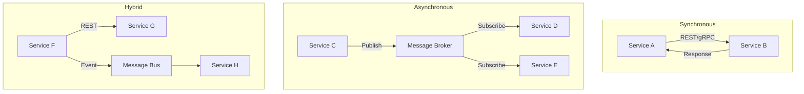

### Documentation

📚 **Detailed Documentation:**

- [README](./microservices/readme.md) - Complete guide
- [Pros and Cons](./microservices/pros-cons.md) - Trade-offs analysis
- [Communication Patterns](./microservices/communication-patterns.md) - Service interaction
- [Service Registry](./microservices/service-registry.md) - Discovery mechanisms
- [Case Study](./microservices/case-study.md) - Real-world implementation

### Challenges

| Challenge                    | Description               | Solution                                 |
| ---------------------------- | ------------------------- | ---------------------------------------- |
| **Distributed Transactions** | ACID across services      | Saga pattern, eventual consistency       |
| **Service Discovery**        | Finding service instances | Service registry (Consul, Eureka)        |
| **Data Consistency**         | Synchronizing data        | Event sourcing, CQRS                     |
| **Testing**                  | Complex integration tests | Contract testing, service virtualization |
| **Monitoring**               | Distributed tracing       | APM tools (Jaeger, Zipkin)               |
| **Deployment**               | Coordinating releases     | CI/CD, blue-green deployment             |

---

## Event-Driven Architecture

### Overview

Systems communicate through events - notifications of state changes that occurred in the past.

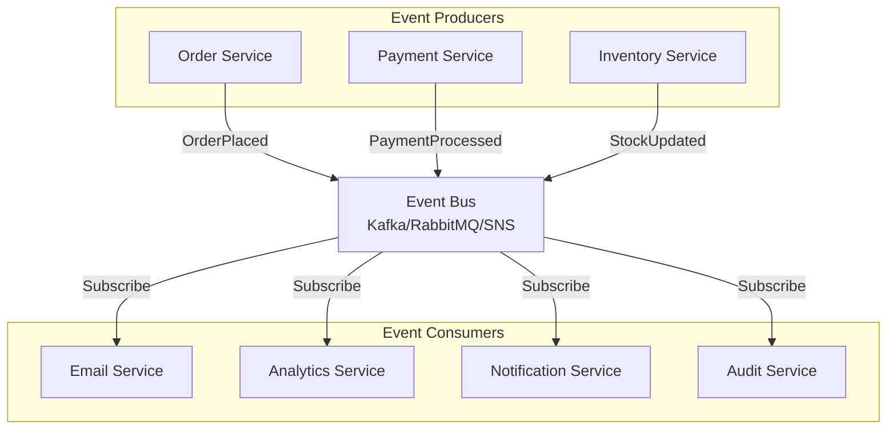

### Event Types

| Type                             | Description                     | Example                        | Characteristics              |
| -------------------------------- | ------------------------------- | ------------------------------ | ---------------------------- |
| **Event Notification**           | Something happened              | OrderPlaced                    | Minimal data, loose coupling |
| **Event-Carried State Transfer** | State change with full data     | OrderPlaced with order details | Self-contained               |
| **Event Sourcing**               | Store all state changes         | Event log                      | Complete history             |
| **Domain Event**                 | Business-significant occurrence | PaymentReceived                | Business context             |

### Event Flow Patterns

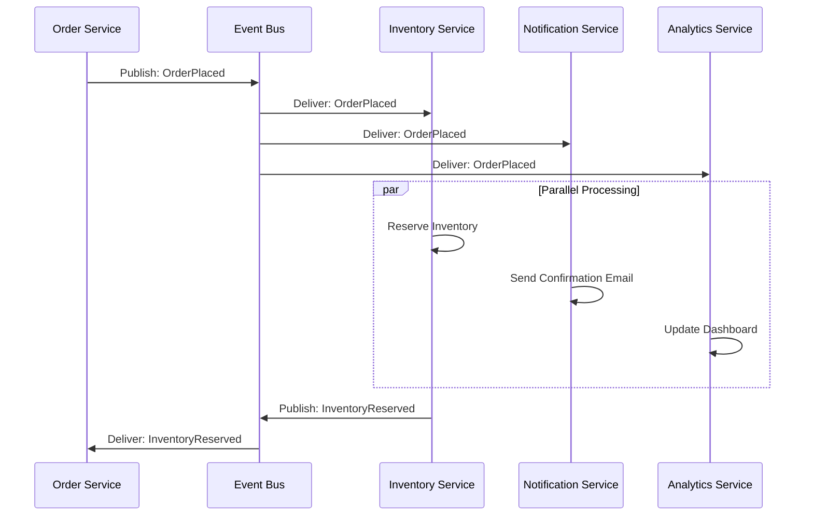

### Documentation

📚 **Detailed Documentation:**

- [README](./event-driven/readme.md) - Architecture overview
- [Architecture Flow](./event-driven/architecture-flow.md) - Event flow patterns
- [Pros and Cons](./event-driven/pros-cons.md) - Benefits and challenges
- [Use Cases](./event-driven/use-cases.md) - When to use

### Benefits & Challenges

| Benefits                | Challenges              |
| ----------------------- | ----------------------- |
| ✅ Loose coupling       | ⚠️ Eventual consistency |
| ✅ Scalability          | ⚠️ Debugging complexity |
| ✅ Flexibility          | ⚠️ Event ordering       |
| ✅ Resilience           | ⚠️ Duplicate events     |
| ✅ Real-time processing | ⚠️ Event versioning     |

---

## Event Sourcing

### Overview

Store all changes to application state as a sequence of events, rather than just the current state.

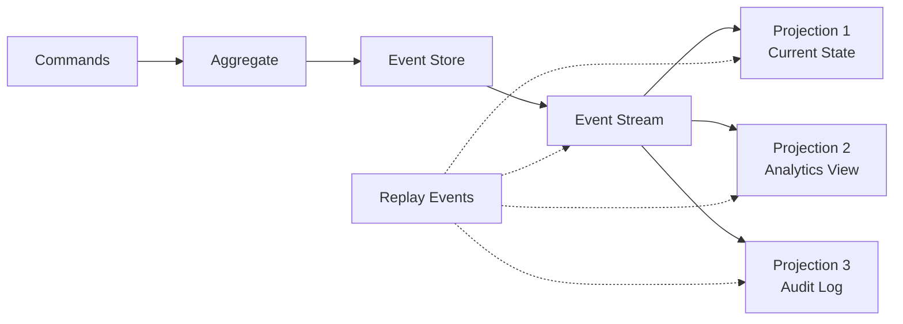

### Event Store Structure

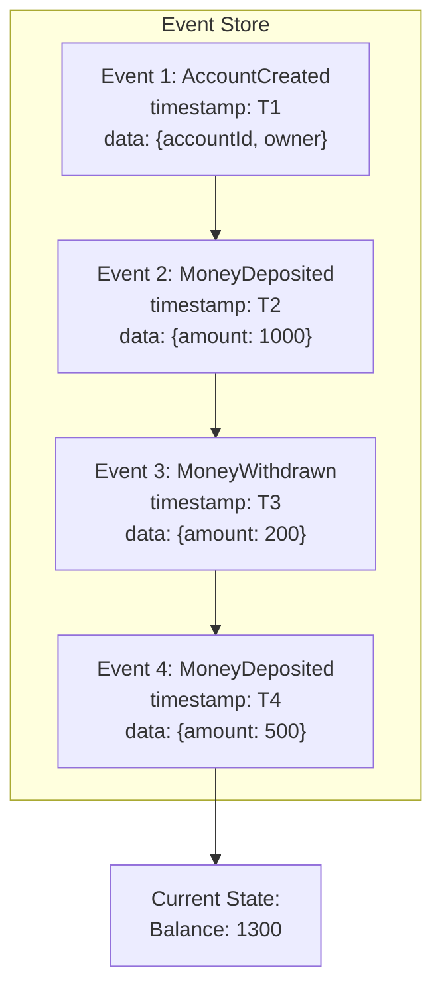

### Key Concepts

| Concept         | Description            | Purpose                           |
| --------------- | ---------------------- | --------------------------------- |
| **Event**       | Immutable fact         | Records what happened             |
| **Event Store** | Append-only log        | Persists all events               |
| **Aggregate**   | Domain entity          | Handles commands, produces events |
| **Projection**  | Read model             | Derived from events               |
| **Replay**      | Reprocess events       | Rebuild state or create new views |
| **Snapshot**    | State at point in time | Performance optimization          |

### Documentation

📚 **Detailed Documentation:**

- [README](./event-sourcing/readme.md) - Pattern overview
- [Event Store Design](./event-sourcing/event-store-design.md) - Implementation details
- [Replaying Events](./event-sourcing/replaying-events.md) - Rebuild strategies
- [Example](./event-sourcing/example.md) - Code examples

### Event Replay Example

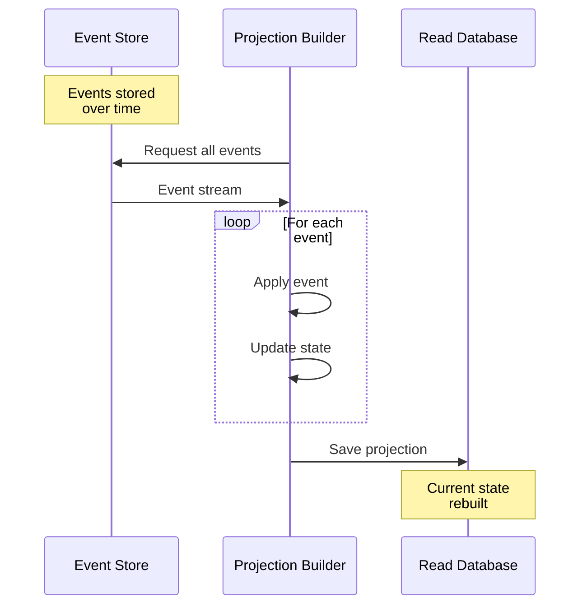

---

## CQRS

### Overview

Command Query Responsibility Segregation separates read and write operations into different models.

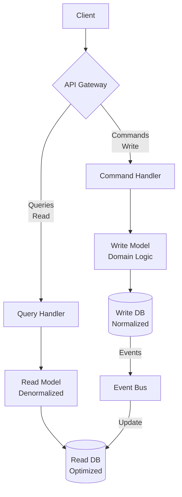

### Command vs Query

| Aspect           | Command (Write)           | Query (Read)                 |
| ---------------- | ------------------------- | ---------------------------- |
| **Purpose**      | Change state              | Retrieve data                |
| **Return Value** | Success/Failure           | Data                         |
| **Side Effects** | Yes                       | No (idempotent)              |
| **Validation**   | Business rules            | None                         |
| **Model**        | Domain-driven             | DTO/View model               |
| **Database**     | Normalized, transactional | Denormalized, read-optimized |
| **Consistency**  | Strong                    | Eventual                     |

### CQRS with Event Sourcing

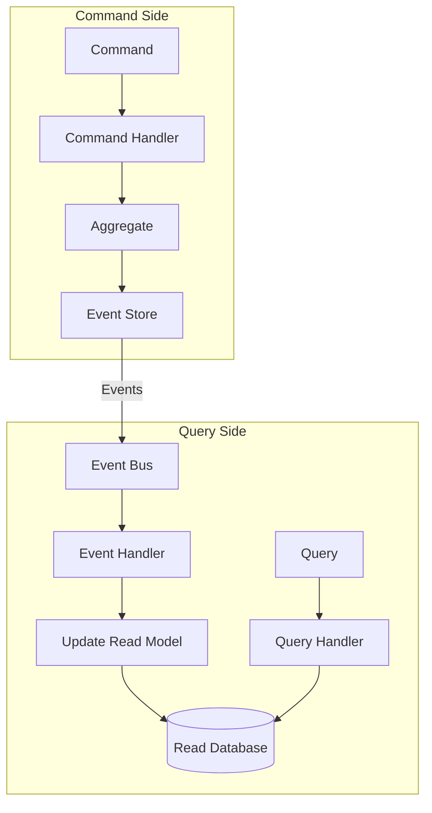

### Documentation

📚 **Detailed Documentation:**

- [README](./cqrs/readme.md) - CQRS fundamentals
- [Command-Query Separation](./cqrs/command-query-separation.md) - Core principle
- [Event Sourcing Integration](./cqrs/event-sourcing-integration.md) - Combined pattern
- [Benefits and Drawbacks](./cqrs/benefits-and-drawbacks.md) - Trade-off analysis
- [Case Study](./cqrs/case-study.md) - Real implementation

### Benefits

| Benefit          | Description                          | Impact                |
| ---------------- | ------------------------------------ | --------------------- |
| **Scalability**  | Scale read/write independently       | High performance      |
| **Optimization** | Optimize each side separately        | Better resource usage |
| **Flexibility**  | Different models for different needs | Cleaner code          |
| **Security**     | Separate permissions                 | Better access control |
| **Performance**  | Optimized read models                | Faster queries        |

---

## Hexagonal Architecture

### Overview

Also known as Ports and Adapters, isolates core business logic from external concerns.

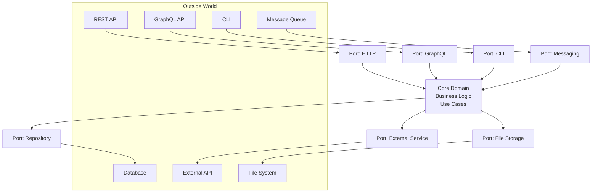

### Ports and Adapters

| Component                    | Description                | Direction        | Example                  |
| ---------------------------- | -------------------------- | ---------------- | ------------------------ |
| **Port (Interface)**         | Define what the core needs | Inbound/Outbound | `IUserRepository`        |
| **Adapter (Implementation)** | Implement the port         | Inbound/Outbound | `PostgresUserRepository` |
| **Primary/Driving**          | Trigger core logic         | Inbound → Core   | REST Controller          |
| **Secondary/Driven**         | Used by core               | Core → Outbound  | Database, Email service  |

### Dependency Flow

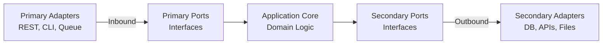

### Documentation

📚 **Detailed Documentation:**

- [README](./hexagonal/readme.md) - Pattern explanation
- [Ports and Adapters](./hexagonal/ports-and-adapters.md) - Core concepts
- [Implementation Notes](./hexagonal/implementation-notes.md) - How to implement
- [Testing Strategy](./hexagonal/testing-strategy.md) - Testing approaches

### Benefits

✅ **Testability**: Easy to mock external dependencies
✅ **Flexibility**: Swap implementations without changing core
✅ **Independence**: Core logic independent of frameworks
✅ **Maintainability**: Clear separation of concerns
✅ **Technology Agnostic**: Core doesn't know about tech stack

---

## Serverless Architecture

### Overview

Build applications using managed services and functions that scale automatically.

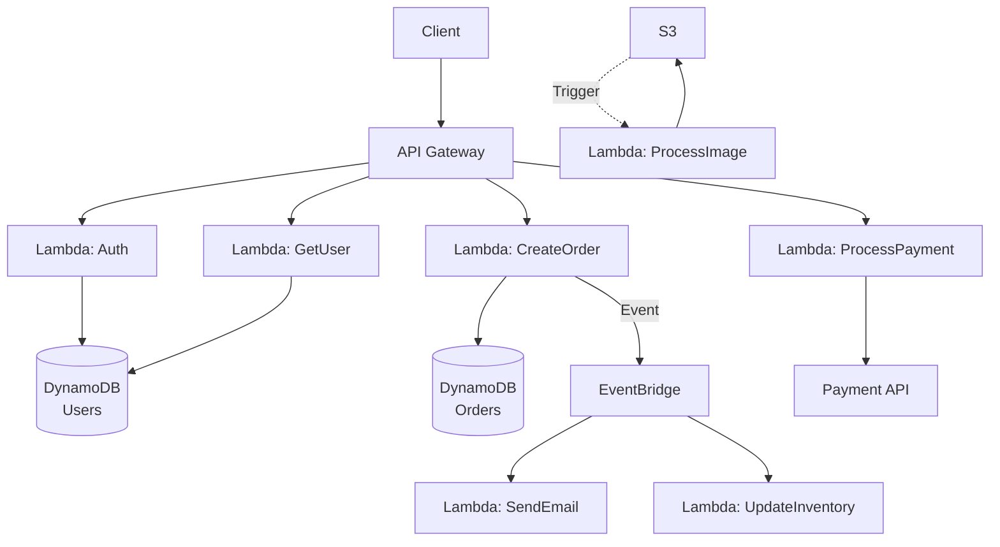

### Core Components

| Component       | Purpose         | AWS Example | Azure Example   |
| --------------- | --------------- | ----------- | --------------- |
| **Functions**   | Compute         | Lambda      | Azure Functions |
| **API Gateway** | HTTP routing    | API Gateway | API Management  |
| **Storage**     | Object storage  | S3          | Blob Storage    |
| **Database**    | NoSQL DB        | DynamoDB    | Cosmos DB       |
| **Events**      | Event bus       | EventBridge | Event Grid      |
| **Queues**      | Message queuing | SQS         | Queue Storage   |
| **Auth**        | Authentication  | Cognito     | AD B2C          |

### Execution Flow

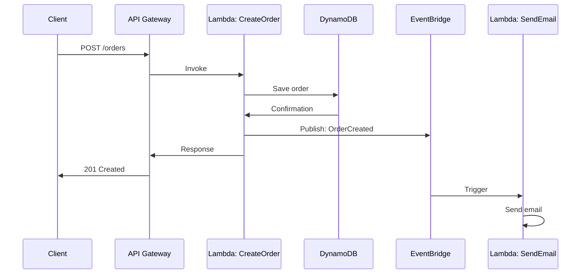

### Documentation

📚 **Detailed Documentation:**

- [README](./serverless/readme.md) - Architecture overview
- [Workflow](./serverless/workflow.md) - Execution patterns
- [Pros and Cons](./serverless/pros-cons.md) - Trade-offs
- [Examples](./serverless/exmples.md) - Implementation examples
- [Challenges](./serverless/challenges.md) - Common issues

### Cost Model

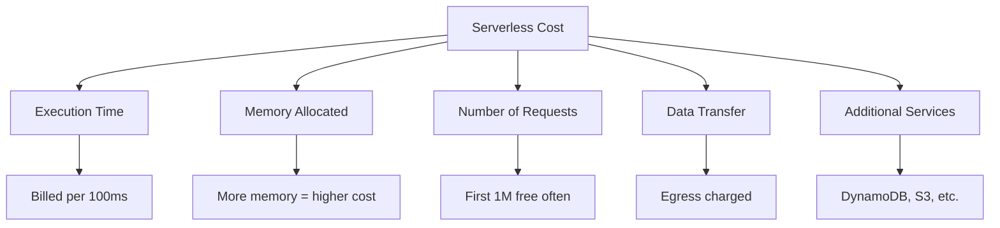

---

## Pattern Selection Guide

### Decision Matrix

```mermaid
graph TB
    A[Start] --> B{Project<br/>Size?}

    B -->|Small/MVP| C{Need Rapid<br/>Prototyping?}
    B -->|Medium| D{Team<br/>Structure?}
    B -->|Large| E{Distribution<br/>Required?}

    C -->|Yes| F[Monolithic]
    C -->|No| G[Layered]

    D -->|Single Team| H[Modular Monolith<br/>or Layered]
    D -->|Multiple Teams| I[Microservices]

    E -->|Yes| J{Event-Driven<br/>Needs?}
    E -->|No| K[Microservices]

    J -->|High| L[Event-Driven<br/>+ CQRS]
    J -->|Medium| K


```

### Pattern Matching Table

| Requirement            | Recommended Pattern          | Alternative             | Avoid                 |
| ---------------------- | ---------------------------- | ----------------------- | --------------------- |
| **Simple CRUD**        | Monolithic, Layered          | Serverless              | Microservices         |
| **High Scalability**   | Microservices, Serverless    | Event-Driven            | Monolithic            |
| **Complex Domain**     | Hexagonal, CQRS              | Layered                 | Monolithic            |
| **Event Processing**   | Event-Driven, Event Sourcing | Serverless              | Monolithic            |
| **Audit Trail**        | Event Sourcing               | CQRS                    | Standard CRUD         |
| **Read-Heavy**         | CQRS                         | Caching layer           | Single database       |
| **Small Team**         | Monolithic, Layered          | Serverless              | Microservices         |
| **Variable Load**      | Serverless                   | Microservices           | Monolithic            |
| **Legacy Integration** | Hexagonal                    | Event-Driven            | Tight coupling        |
| **Real-time Updates**  | Event-Driven                 | WebSockets + Monolithic | Request-Response only |
| **Multi-tenant**       | Microservices                | Layered with isolation  | Monolithic            |

### Key Selection Factors

#### Team Considerations

```mermaid
graph TB
    A[Team Assessment] --> B[Team Size]
    A --> C[Experience Level]
    A --> D[Distribution]

    B --> B1[1-5: Monolithic/Layered]
    B --> B2[5-20: Modular Monolith]
    B --> B3[20+: Microservices]

    C --> C1[Junior: Simple patterns]
    C --> C2[Mixed: Layered/Hexagonal]
    C --> C3[Senior: Any pattern]

    D --> D1[Co-located: Any]
    D --> D2[Distributed: Microservices]

```

#### Technical Considerations

| Factor             | Consideration           | Impact on Pattern Choice                                  |
| ------------------ | ----------------------- | --------------------------------------------------------- |
| **Scale**          | Expected traffic volume | High scale → Microservices/Serverless                     |
| **Complexity**     | Domain complexity       | Complex → DDD, Hexagonal, CQRS                            |
| **Consistency**    | Data consistency needs  | Strong → Monolithic; Eventual → Event-Driven              |
| **Performance**    | Latency requirements    | Low latency → Monolithic; High throughput → Microservices |
| **Budget**         | Infrastructure costs    | Limited → Monolithic; Variable → Serverless               |
| **Time to Market** | Development speed       | Fast → Monolithic; Evolutionary → Microservices           |

---

## Migration Strategies

### Evolution Path

```mermaid
graph LR
    A[Monolithic] -->|Refactor| B[Modular Monolith]
    B -->|Extract| C[Hybrid<br/>Monolith + Services]
    C -->|Decompose| D[Microservices]

    A -->|Add Layer| E[Layered Monolith]
    E -->|Apply DDD| F[Hexagonal Monolith]
    F --> B

    D -->|Add Events| G[Event-Driven<br/>Microservices]
    G -->|Add CQRS| H[Full CQRS/ES]

  
```

### Strangler Fig Pattern

```mermaid
graph TB
    subgraph Phase 1: Initial State
    A1[Client] --> B1[Monolith]
    B1 --> C1[(Database)]
    end

    subgraph Phase 2: Add Facade
    A2[Client] --> D2[Facade/Proxy]
    D2 --> B2[Monolith]
    B2 --> C2[(Database)]
    end

    subgraph Phase 3: Extract Services
    A3[Client] --> D3[Facade/Proxy]
    D3 -->|Old Features| B3[Monolith]
    D3 -->|New Features| E3[Microservice 1]
    B3 --> C3[(Database)]
    E3 --> F3[(Service DB)]
    end

    subgraph Phase 4: Complete Migration
    A4[Client] --> D4[API Gateway]
    D4 --> E4[Microservice 1]
    D4 --> G4[Microservice 2]
    D4 --> H4[Microservice 3]
    E4 --> F4[(DB 1)]
    G4 --> I4[(DB 2)]
    H4 --> J4[(DB 3)]
    end


```

### Migration Strategies by Pattern

#### Monolithic to Microservices

| Step                             | Action                            | Duration   | Risk   |
| -------------------------------- | --------------------------------- | ---------- | ------ |
| **1. Identify Boundaries**       | Domain analysis, bounded contexts | 2-4 weeks  | Low    |
| **2. Add Anti-Corruption Layer** | Create facades, abstractions      | 2-3 weeks  | Low    |
| **3. Extract First Service**     | Start with least coupled module   | 4-8 weeks  | Medium |
| **4. Implement Communication**   | API Gateway, service mesh         | 2-4 weeks  | Medium |
| **5. Data Migration**            | Separate databases                | 4-12 weeks | High   |
| **6. Iterate**                   | Extract remaining services        | Ongoing    | Medium |

#### Layered to Hexagonal

```mermaid
sequenceDiagram
    participant Old as Layered Architecture
    participant Trans as Transition Phase
    participant New as Hexagonal Architecture

    Old->>Trans: 1. Define ports (interfaces)
    Trans->>Trans: 2. Extract domain logic
    Trans->>Trans: 3. Create adapters
    Trans->>Trans: 4. Inject dependencies
    Trans->>New: 5. Remove layer dependencies
    New->>New: 6. Test with different adapters
```

#### Adding Event-Driven Capabilities

```mermaid
graph TB
    A[Existing System] --> B{Add Event Bus}

    B --> C[Publish Domain Events]
    C --> D[Create Event Handlers]
    D --> E[Decouple Components]

    E --> F{Need History?}
    F -->|Yes| G[Add Event Sourcing]
    F -->|No| H[Event Notification]

    G --> I[Implement Event Store]
    I --> J[Create Projections]

    H --> K[Async Communication]
    J --> K

```

### Migration Best Practices

| Practice                | Description                         | Benefit               |
| ----------------------- | ----------------------------------- | --------------------- |
| **Incremental**         | Migrate piece by piece              | Reduced risk          |
| **Dual Write**          | Write to both old and new systems   | Safe transition       |
| **Feature Flags**       | Toggle between implementations      | Easy rollback         |
| **Monitoring**          | Track both systems during migration | Early issue detection |
| **Parallel Run**        | Run old and new side-by-side        | Validation            |
| **Data Reconciliation** | Verify data consistency             | Data integrity        |

---

## Anti-Patterns

### Common Architecture Anti-Patterns

#### 1. Distributed Monolith

```mermaid
graph TB
    A[Service A] <-->|Tight Coupling| B[Service B]
    B <-->|Shared Database| C[(Shared DB)]
    A <-->|Shared Database| C
    B <-->|Synchronous| D[Service C]
    A <-->|Calls| D
    D <-->|Shared Database| C


    Note1[❌ Microservices structure<br/>with monolith disadvantages]
```

**Problems:**

- All the complexity of microservices
- None of the benefits
- Shared database defeats purpose
- Cannot deploy independently

**Solution:** Proper service boundaries, database per service, async communication

#### 2. Chatty Services

```mermaid
sequenceDiagram
    participant C as Client
    participant S1 as Service 1
    participant S2 as Service 2
    participant S3 as Service 3
    participant S4 as Service 4

    C->>S1: Request
    S1->>S2: Call 1
    S2->>S3: Call 2
    S3->>S4: Call 3
    S4->>S3: Response
    S3->>S2: Response
    S2->>S1: Response
    S1->>C: Final Response

    Note over C,S4: ❌ Too many network calls<br/>High latency
```

**Problems:**

- High latency
- Network overhead
- Cascading failures
- Poor performance

**Solution:** API composition, Backend for Frontend (BFF), GraphQL, data aggregation

#### 3. God Service

```mermaid
graph TB
    A[God Service<br/>Does Everything] --> B[(User DB)]
    A --> C[(Order DB)]
    A --> D[(Product DB)]
    A --> E[(Payment DB)]
    A --> F[(Shipping DB)]

    G[Service 1] --> A
    H[Service 2] --> A
    I[Service 3] --> A
    J[Service 4] --> A

    style A fill:#ff9999,stroke:#333,stroke-width:4px

    Note1[❌ Single service with<br/>too many responsibilities]
```

**Problems:**

- Violates Single Responsibility
- Difficult to maintain
- Cannot scale independently
- Deployment bottleneck

**Solution:** Decompose by business capability, proper bounded contexts

#### 4. Anemic Domain Model

```mermaid
graph TB
    A[Controllers] --> B[Services<br/>All Business Logic]
    B --> C[Domain Objects<br/>Only Getters/Setters]
    C --> D[(Database)]


    Note1[❌ Domain objects are<br/>just data containers]
```

**Problems:**

- Business logic scattered
- Poor encapsulation
- Procedural, not object-oriented
- Hard to maintain

**Solution:** Rich domain models, Domain-Driven Design, Hexagonal Architecture

#### 5. Premature Microservices

```mermaid
timeline
    title Project Timeline with Premature Microservices
    Day 1 : Start with 10 microservices
          : Complex infrastructure
    Month 1 : Still defining requirements
           : Services constantly changing
    Month 3 : Merging services
           : Refactoring boundaries
    Month 6 : Should have started monolithic
           : Wasted 6 months
```

**Problems:**

- Over-engineering
- Boundaries unclear
- High initial complexity
- Wasted resources

**Solution:** Start with monolith or modular monolith, extract services when needed

### Pattern Misuse

| Pattern            | Misuse                 | Correct Use                    |
| ------------------ | ---------------------- | ------------------------------ |
| **Microservices**  | Small app with 3 users | Large, complex systems         |
| **Event Sourcing** | Simple CRUD app        | Audit trails, temporal queries |
| **CQRS**           | Balanced read/write    | Highly asymmetric operations   |
| **Serverless**     | Long-running processes | Event-driven, short tasks      |
| **Layered**        | Skipping layers        | Strict layer dependencies      |

---

## Best Practices

### General Architecture Principles

#### 1. SOLID Principles

```mermaid
graph TB
    A[SOLID Principles] --> B[Single Responsibility]
    A --> C[Open/Closed]
    A --> D[Liskov Substitution]
    A --> E[Interface Segregation]
    A --> F[Dependency Inversion]

    B --> B1[One reason to change]
    C --> C1[Open for extension,<br/>closed for modification]
    D --> D1[Subtypes must be<br/>substitutable]
    E --> E1[Small, focused interfaces]
    F --> F1[Depend on abstractions]


```

#### 2. Design Principles by Pattern

| Pattern           | Key Principles                          | Guidelines                           |
| ----------------- | --------------------------------------- | ------------------------------------ |
| **Monolithic**    | Modularity, clear boundaries            | Use packages/modules effectively     |
| **Layered**       | Dependency rule, separation of concerns | One-way dependencies                 |
| **Microservices** | Loose coupling, high cohesion           | Smart endpoints, dumb pipes          |
| **Event-Driven**  | Eventual consistency, idempotency       | Handle duplicates, order issues      |
| **CQRS**          | Command-query separation                | Different models for different needs |
| **Hexagonal**     | Ports & adapters, testability           | Core isolated from infrastructure    |

#### 3. Data Management

```mermaid
graph TB
    subgraph Strong Consistency
    SC1[Monolithic] --> SC2[Single Database]
    SC2 --> SC3[ACID Transactions]
    end

    subgraph Eventual Consistency
    EC1[Microservices] --> EC2[Database per Service]
    EC2 --> EC3[Saga Pattern]
    EC3 --> EC4[Compensating Transactions]
    end

    subgraph Event-Based
    EB1[Event Sourcing] --> EB2[Event Store]
    EB2 --> EB3[Projections]
    EB3 --> EB4[Multiple Views]
    end

  
```

### Communication Best Practices

#### Synchronous Communication

```mermaid
graph LR
    A[Client] -->|REST/HTTP| B[API Gateway]
    B -->|gRPC| C[Service 1]
    B -->|REST| D[Service 2]

    E[Circuit Breaker] -.-> B
    F[Retry Logic] -.-> B
    G[Timeout] -.-> B

```

**Best Practices:**

- ✅ Use timeouts
- ✅ Implement circuit breakers
- ✅ Add retry logic with exponential backoff
- ✅ Use bulkheads for isolation
- ✅ Version APIs
- ❌ Avoid chatty communication
- ❌ Don't create deep call chains

#### Asynchronous Communication

```mermaid
graph TB
    A[Publisher] -->|Event| B[Message Broker]
    B -->|Subscribe| C[Consumer 1]
    B -->|Subscribe| D[Consumer 2]
    B -->|Subscribe| E[Consumer 3]

    F[Dead Letter Queue] -.-> B
    G[Retry Queue] -.-> B


```

**Best Practices:**

- ✅ Make consumers idempotent
- ✅ Use dead letter queues
- ✅ Implement retry mechanisms
- ✅ Version events
- ✅ Include correlation IDs
- ✅ Monitor queue depth
- ❌ Avoid event chains too deep
- ❌ Don't overuse synchronous calls

### Testing Strategy

```mermaid
graph TB
    A[Testing Pyramid] --> B[E2E Tests<br/>Few, Slow, Expensive]
    A --> C[Integration Tests<br/>Some, Medium Speed]
    A --> D[Unit Tests<br/>Many, Fast, Cheap]

    E[By Pattern] --> F[Monolithic:<br/>Easy integration testing]
    E --> G[Microservices:<br/>Contract testing]
    E --> H[Event-Driven:<br/>Event replay testing]
    E --> I[Hexagonal:<br/>Port mocking]

```

### Monitoring and Observability

| Pattern           | Key Metrics                             | Tools                               |
| ----------------- | --------------------------------------- | ----------------------------------- |
| **Monolithic**    | Response time, error rate, CPU/memory   | APM tools, logs                     |
| **Microservices** | Request tracing, service mesh metrics   | Jaeger, Zipkin, Istio               |
| **Event-Driven**  | Event lag, processing time, queue depth | Kafka monitoring, custom dashboards |
| **Serverless**    | Cold starts, execution time, throttling | CloudWatch, X-Ray                   |

---

## Real-World Examples

### Industry Implementations

#### Netflix - Microservices Architecture

```mermaid
graph TB
    A[Client Apps] --> B[Zuul API Gateway]

    B --> C[User Service]
    B --> D[Content Service]
    B --> E[Recommendation Service]
    B --> F[Billing Service]

    C --> C1[(Cassandra)]
    D --> D1[(S3)]
    E --> E1[(Dynamo)]
    F --> F1[(Aurora)]

    G[Hystrix<br/>Circuit Breaker] -.-> B
    H[Eureka<br/>Service Discovery] -.-> C
    H -.-> D
    H -.-> E
    H -.-> F

```

**Key Decisions:**

- Microservices for independent scaling
- Chaos engineering for resilience
- Extensive observability
- Service mesh for communication

#### Uber - Event-Driven Architecture

```mermaid
graph TB
    A[Ride Request] --> B[Trip Service]
    B -->|TripCreated| C[Event Bus<br/>Kafka]

    C --> D[Driver Matching]
    C --> E[Pricing Service]
    C --> F[Notification Service]
    C --> G[Analytics Service]

    D -->|DriverAssigned| C
    E -->|PriceCalculated| C
```

**Key Decisions:**

- Event-driven for real-time matching
- Kafka for high throughput
- Multiple consumers for different concerns
- Eventually consistent

#### Amazon - Service-Oriented Architecture

```mermaid
graph TB
    A[amazon.com] --> B[API Gateway]

    B --> C[Product Catalog]
    B --> D[Shopping Cart]
    B --> E[Order Service]
    B --> F[Payment Service]
    B --> G[Inventory Service]

    E --> H[Saga Coordinator]
    H --> F
    H --> G
    H --> I[Shipping Service]
```

**Key Decisions:**

- Service-oriented architecture
- Two-pizza teams
- APIs for everything
- Eventual consistency with sagas

### Pattern Combinations

#### E-Commerce Platform

```mermaid
graph TB
    subgraph Frontend
    A[Web/Mobile] --> B[BFF<br/>Backend for Frontend]
    end

    subgraph Synchronous Services
    B --> C[Product Catalog<br/>CQRS]
    B --> D[User Service<br/>Layered]
    B --> E[Cart Service<br/>Hexagonal]
    end

    subgraph Asynchronous Processing
    C -->|Events| F[Event Bus]
    F --> G[Order Service<br/>Event Sourcing]
    F --> H[Email Service<br/>Serverless]
    F --> I[Analytics<br/>Serverless]
    end

    subgraph Data Layer
    C --> J[(Read DB)]
    C --> K[(Write DB)]
    G --> L[Event Store]
    end

```

**Pattern Combination:**

- **BFF**: Tailored APIs for different clients
- **CQRS**: Product catalog (read-heavy)
- **Event Sourcing**: Order service (audit trail)
- **Serverless**: Email and analytics (variable load)
- **Hexagonal**: Cart service (complex domain logic)

### Success Metrics

| Pattern           | Success Indicators                     | Warning Signs                               |
| ----------------- | -------------------------------------- | ------------------------------------------- |
| **Monolithic**    | Fast development, low complexity       | Deployment pain, scaling issues             |
| **Microservices** | Independent deployments, team autonomy | Distributed monolith, coordination overhead |
| **Event-Driven**  | Loose coupling, real-time processing   | Event chaos, debugging difficulties         |
| **CQRS**          | Read/write optimization, performance   | Over-engineering, sync issues               |
| **Serverless**    | Cost efficiency, auto-scaling          | Cold starts, vendor lock-in                 |

---

## Conclusion

### Pattern Selection Summary

```mermaid
mindmap
  root((Architecture<br/>Patterns))
    Simplicity
      Monolithic
      Layered
    Scalability
      Microservices
      Serverless
    Domain Complexity
      Hexagonal
      DDD
    Events & Async
      Event-Driven
      Event Sourcing
    Performance
      CQRS
      Caching
```

### Key Takeaways

1. **No Silver Bullet**: Every pattern has trade-offs
2. **Context Matters**: Choose based on your specific needs
3. **Evolution**: Start simple, evolve as needed
4. **Hybrid Approach**: Combine patterns where appropriate
5. **Team First**: Consider your team's capabilities
6. **Measure**: Use metrics to validate architecture decisions

### Getting Started

1. **Assess Your Needs**: Use the [Pattern Selection Guide](#pattern-selection-guide)
2. **Start Simple**: Consider Monolithic or Layered for new projects
3. **Learn Patterns**: Study each pattern's documentation
4. **Plan Migration**: Use [Migration Strategies](#migration-strategies) if refactoring
5. **Avoid Anti-Patterns**: Review [Anti-Patterns](#anti-patterns) section
6. **Follow Best Practices**: Implement [Best Practices](#best-practices)

### Further Reading

- [Design Patterns](../design-patterns/)
- [Database Patterns](../databases/)
- [Scalability Patterns](../scalability/)
- [Security Patterns](../security/)
- [Case Studies](../case-studies/)

---

## Contributing

We welcome contributions! Please see each pattern's directory for detailed documentation and feel free to submit PRs with:

- Additional examples
- Real-world case studies
- Pattern implementations
- Improvements to existing documentation

## License

This documentation is available under the MIT License. See LICENSE file for details.
