# CQRS Case Study: E-Commerce Platform

## Table of Contents

1. [Executive Summary](#executive-summary)
2. [Company Profile](#company-profile)
3. [The Problem](#the-problem)
   - [Initial Architecture](#initial-architecture)
   - [Pain Points](#pain-points)
   - [Key Metrics Before CQRS](#key-metrics-before-cqrs)
4. [The Solution: CQRS Implementation](#the-solution-cqrs-implementation)
   - [Architecture Overview](#architecture-overview)
   - [Implementation Phases](#implementation-phases)
     - [Phase 1: Product Catalog (Pilot)](#phase-1-product-catalog-pilot)
     - [Phase 2: Order Management](#phase-2-order-management)
     - [Phase 3: Analytics and Reporting](#phase-3-analytics-and-reporting)
   - [Technology Stack Decisions](#technology-stack-decisions)
5. [Implementation Details](#implementation-details)
   - [Command Handler Example (Conceptual)](#command-handler-example-conceptual)
   - [Event Processing Flow](#event-processing-flow)
   - [Handling Eventual Consistency](#handling-eventual-consistency)
   - [Monitoring and Observability](#monitoring-and-observability)
6. [Challenges and Solutions](#challenges-and-solutions)
   - [Challenge 1: Consumer Lag During Peak Traffic](#challenge-1-consumer-lag-during-peak-traffic)
   - [Challenge 2: Schema Evolution](#challenge-2-schema-evolution)
   - [Challenge 3: Testing Complexity](#challenge-3-testing-complexity)
   - [Challenge 4: Data Inconsistencies](#challenge-4-data-inconsistencies)
7. [Results and Metrics](#results-and-metrics)
   - [Performance Improvements](#performance-improvements)
   - [Scalability Achievements](#scalability-achievements)
   - [Business Impact](#business-impact)
8. [Lessons Learned](#lessons-learned)
   - [What Went Well](#what-went-well)
   - [What Could Be Improved](#what-could-be-improved)
   - [Key Takeaways](#key-takeaways)
9. [Recommendations](#recommendations)
   - [When to Use CQRS (Based on This Case Study)](#when-to-use-cqrs-based-on-this-case-study)
   - [When to Avoid CQRS](#when-to-avoid-cqrs)
   - [Implementation Recommendations](#implementation-recommendations)
10. [Conclusion](#conclusion)

---

## Executive Summary

This case study examines the implementation of CQRS in a high-traffic e-commerce platform that serves millions of users. We'll explore the journey from a monolithic architecture to CQRS, the challenges faced, solutions implemented, and the measurable outcomes.

## Company Profile

**Company**: GlobalShop (pseudonym)  
**Industry**: E-commerce  
**Scale**: 10 million monthly active users  
**Annual GMV**: $2 billion  
**Team Size**: 200 engineers  

## The Problem

### Initial Architecture

GlobalShop started with a traditional monolithic architecture using a single PostgreSQL database for all operations.

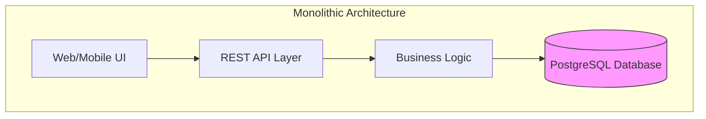

### Pain Points

**1. Performance Degradation**
- Product catalog queries competing with order processing
- Database locks during peak hours
- Slow response times for simple read operations
- Read replicas helping but not solving the core issue

**2. Scaling Limitations**
- Couldn't scale reads and writes independently
- Adding more read replicas increased replication lag
- Write operations becoming a bottleneck
- Peak traffic (Black Friday) causing system-wide slowdowns

**3. Conflicting Requirements**
- Inventory management needed strong consistency
- Product browsing could tolerate eventual consistency
- Order history needed different data structures than order processing
- Analytics queries impacting transactional performance

**4. Development Bottlenecks**
- Single database schema slowing down feature development
- Teams stepping on each other's toes
- Complex queries for reporting affecting operational performance
- Difficulty optimizing for different use cases

### Key Metrics Before CQRS

| Metric | Value |
|--------|-------|
| Average Read Latency | 250ms |
| P99 Read Latency | 2.5s |
| Average Write Latency | 150ms |
| P99 Write Latency | 3s |
| Database CPU Usage | 85% (peak) |
| Black Friday Downtime | 4 hours |
| Read:Write Ratio | 95:5 |

## The Solution: CQRS Implementation

### Architecture Overview

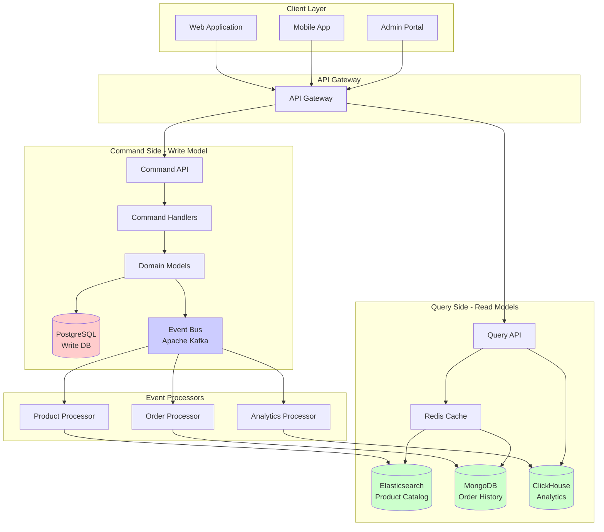

### Implementation Phases

#### Phase 1: Product Catalog (Pilot)

The team started with the product catalog as a pilot project due to its clear read-heavy nature.

**Command Side**:
- Product creation/updates through admin portal
- Strong consistency for inventory management
- PostgreSQL for transactional integrity

**Query Side**:
- Elasticsearch for full-text search and faceted navigation
- Denormalized product views with pre-computed aggregations
- Redis caching for hot products

**Events Published**:
- `ProductCreated`
- `ProductUpdated`
- `ProductDeleted`
- `InventoryAdjusted`
- `PriceChanged`

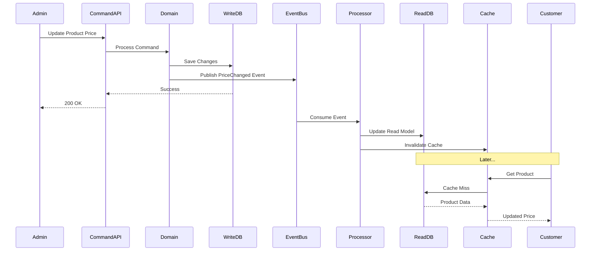

**Results from Phase 1**:
- Product search latency reduced from 250ms to 45ms
- Zero impact on write operations
- Team gained confidence in CQRS approach

#### Phase 2: Order Management

After success with the product catalog, the team tackled order management.

**Command Side**:
- Order placement, cancellation, and refunds
- Payment processing integration
- Strong consistency for financial transactions

**Query Side**:
- Order history optimized for customer queries
- MongoDB for flexible document structure
- Different views for customers, admins, and customer service

**Complex Event Flow**:

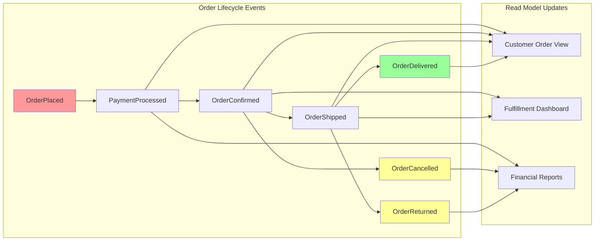

**Challenges Addressed**:

1. **Eventual Consistency UX**:
   - Implemented optimistic UI updates
   - Added "processing" states with spinners
   - Websocket notifications for order status changes
   - Clear messaging about synchronization delays

2. **Idempotency**:
   - Added unique event IDs
   - Implemented idempotent event handlers
   - Used database constraints to prevent duplicates

3. **Event Ordering**:
   - Used partition keys in Kafka (order ID)
   - Ensured ordered processing per order
   - Implemented version vectors for conflict detection

#### Phase 3: Analytics and Reporting

The final phase addressed analytics, which had been severely impacting operational performance.

**Command Side**:
- No changes (analytics doesn't generate commands)

**Query Side**:
- ClickHouse for OLAP workloads
- Pre-aggregated metrics and KPIs
- Real-time dashboards without impacting transactions

**Analytics Architecture**:

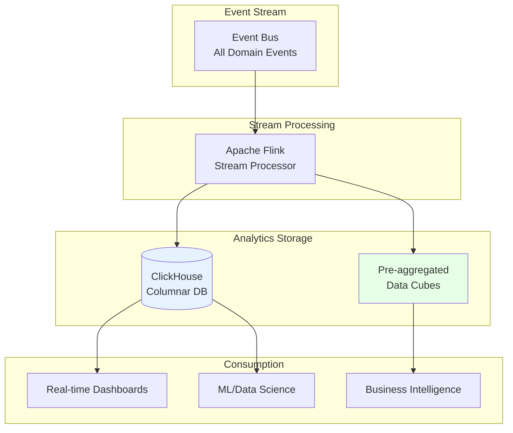

### Technology Stack Decisions

| Component | Technology | Rationale |
|-----------|-----------|-----------|
| **Command Side DB** | PostgreSQL | ACID guarantees, mature, team expertise |
| **Event Bus** | Apache Kafka | High throughput, durability, ordering guarantees |
| **Product Search** | Elasticsearch | Full-text search, faceting, relevance scoring |
| **Order History** | MongoDB | Flexible schema, good read performance |
| **Analytics** | ClickHouse | Columnar storage, excellent for OLAP |
| **Cache** | Redis | Fast, simple, widely supported |
| **Stream Processing** | Apache Flink | Exactly-once semantics, stateful processing |

## Implementation Details

### Command Handler Example (Conceptual)

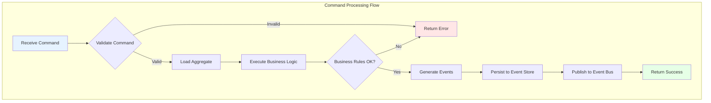

### Event Processing Flow

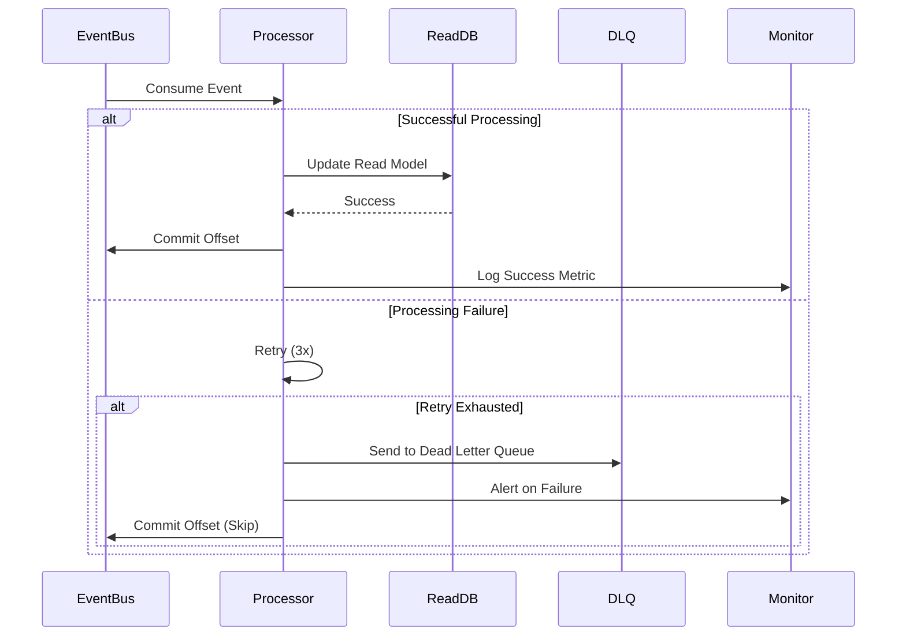

### Handling Eventual Consistency

**Strategy 1: Optimistic UI Updates**

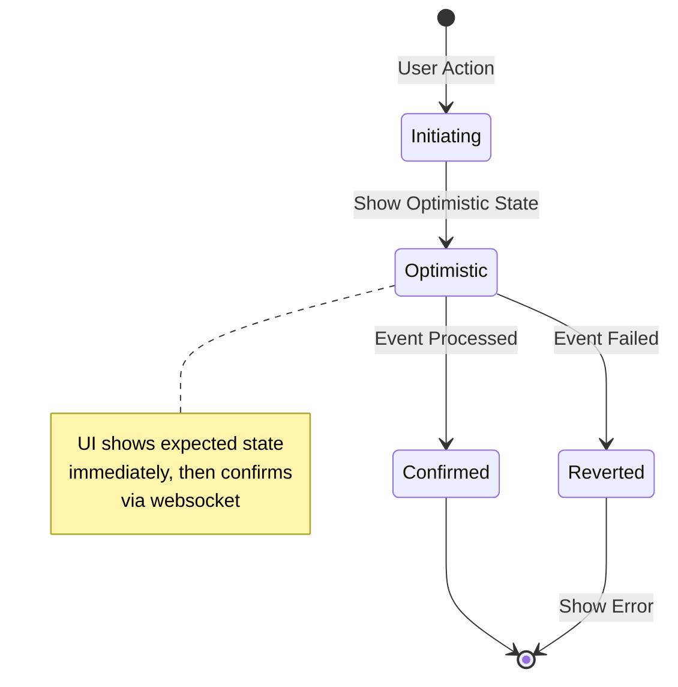

**Strategy 2: Event Timestamps**

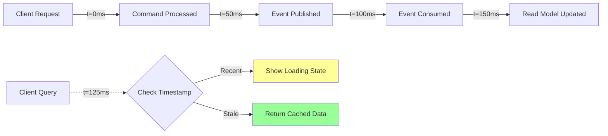

### Monitoring and Observability

**Key Metrics Tracked**:

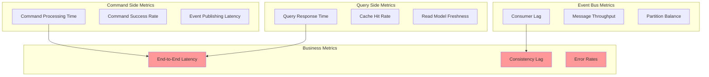

## Challenges and Solutions

### Challenge 1: Consumer Lag During Peak Traffic

**Problem**: During Black Friday, event processors couldn't keep up with the event stream, causing read model lag to increase to 30+ seconds.

**Solution**:
- Implemented horizontal scaling for event processors
- Added priority queues for critical events (order confirmations)
- Pre-scaled infrastructure before peak events
- Implemented backpressure mechanisms

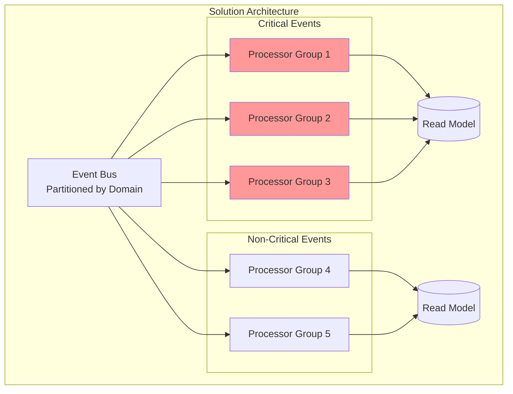

### Challenge 2: Schema Evolution

**Problem**: Changing event schemas without breaking existing consumers.

**Solution**:
- Implemented event versioning
- Used schema registry (Confluent Schema Registry)
- Applied "expand and contract" pattern
- Maintained backward compatibility

**Event Versioning Strategy**:

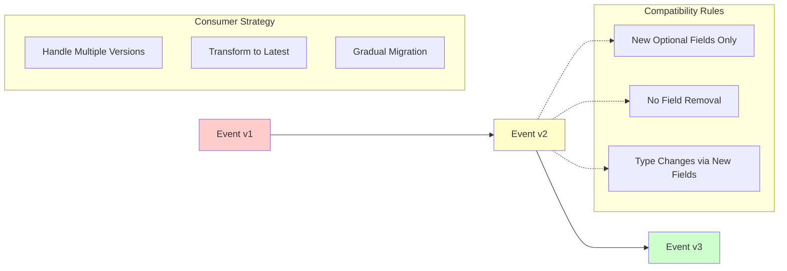

### Challenge 3: Testing Complexity

**Problem**: Testing distributed, eventually consistent systems proved difficult.

**Solution**:
- Unit tests for command handlers and domain logic
- Integration tests with test containers
- Contract tests for events
- End-to-end tests with eventual consistency assertions
- Chaos engineering for resilience testing

**Testing Pyramid**:

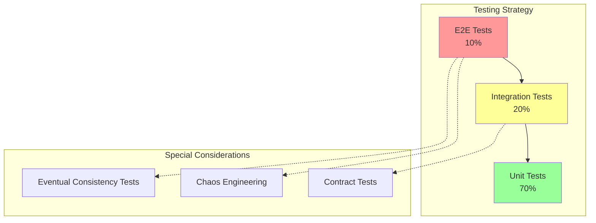

### Challenge 4: Data Inconsistencies

**Problem**: Occasional inconsistencies between write and read models due to failures.

**Solution**:
- Implemented reconciliation jobs
- Added consistency monitoring
- Built self-healing mechanisms
- Created admin tools for manual corrections

**Reconciliation Architecture**:

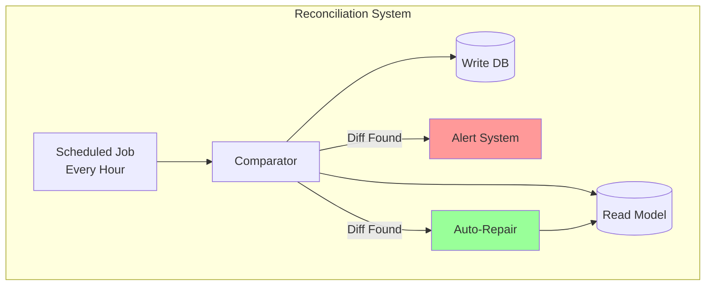

## Results and Metrics

### Performance Improvements

| Metric | Before CQRS | After CQRS | Improvement |
|--------|-------------|------------|-------------|
| **Average Read Latency** | 250ms | 35ms | 86% reduction |
| **P99 Read Latency** | 2.5s | 150ms | 94% reduction |
| **Average Write Latency** | 150ms | 80ms | 47% reduction |
| **P99 Write Latency** | 3s | 200ms | 93% reduction |
| **Database CPU Usage** | 85% peak | 45% peak | 47% reduction |
| **Black Friday Downtime** | 4 hours | 0 hours | 100% improvement |
| **Search Performance** | 250ms | 45ms | 82% reduction |

### Scalability Achievements

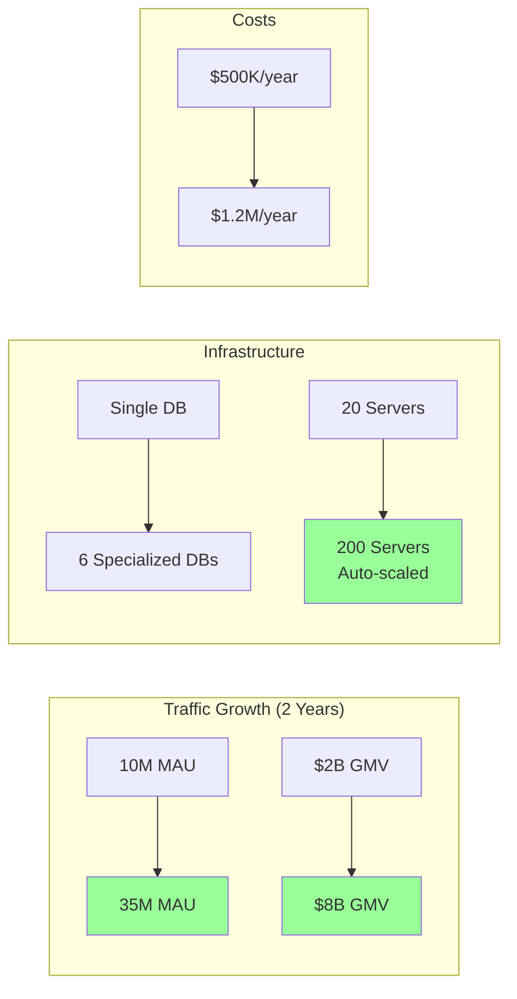

### Business Impact

**Positive Outcomes**:
- **Revenue Growth**: 25% increase attributed to improved performance
- **Customer Satisfaction**: NPS score increased from 45 to 68
- **Developer Velocity**: Feature delivery time reduced by 40%
- **Operational Costs**: Cost per transaction reduced by 35%
- **System Reliability**: 99.99% uptime achieved

**Negative Outcomes**:
- **Complexity**: Onboarding time increased by 3 weeks
- **Team Size**: Required 5 additional engineers for operations
- **Infrastructure Costs**: Increased by 140% (but cost per transaction decreased)

## Lessons Learned

### What Went Well

1. **Phased Rollout**: Starting with a pilot project (product catalog) validated the approach
2. **Event-Driven Architecture**: Provided flexibility and decoupling
3. **Technology Diversity**: Using the right tool for each job improved overall performance
4. **Monitoring Investment**: Early investment in observability paid dividends

### What Could Be Improved

1. **Earlier Testing Strategy**: Should have defined eventual consistency testing patterns earlier
2. **Documentation**: Event schemas and contracts needed better documentation from day one
3. **Team Training**: More upfront training on distributed systems would have accelerated adoption
4. **Cost Management**: Better prediction and monitoring of infrastructure costs needed

### Key Takeaways

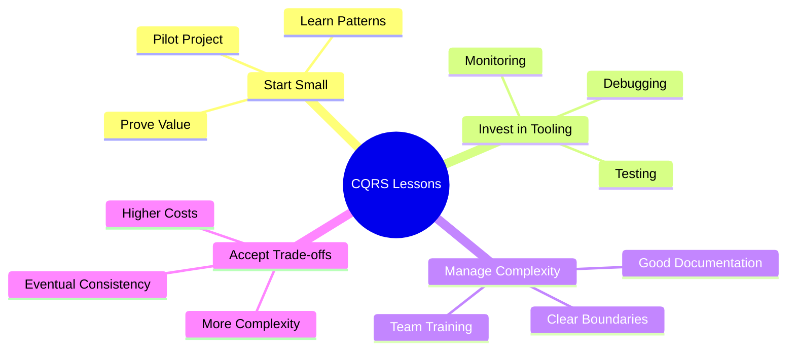

## Recommendations

### When to Use CQRS (Based on This Case Study)

Use CQRS when:
- Read:write ratio is heavily skewed (90:10 or higher)
- Different optimization strategies needed for reads and writes
- Complex domain with rich business logic
- Need independent scaling of read and write operations
- Team has distributed systems expertise

### When to Avoid CQRS

Avoid CQRS when:
- Simple CRUD application
- Strong consistency is critical everywhere
- Small team without distributed systems experience
- Low traffic/scale requirements
- Tight budget for infrastructure and operations

### Implementation Recommendations

1. **Start with a Bounded Context**: Don't implement CQRS everywhere at once
2. **Invest in Infrastructure**: Event bus, monitoring, and tooling are critical
3. **Plan for Eventual Consistency**: Design UX patterns and fallback strategies
4. **Automate Testing**: Build strong test automation from the beginning
5. **Monitor Everything**: Observability is non-negotiable in distributed systems
6. **Document Events**: Treat event schemas as contracts with rigorous versioning

## Conclusion

GlobalShop's journey to CQRS demonstrates that while the pattern introduces significant complexity, it can deliver substantial benefits at scale. The key success factors were:

- Starting small with a clear pilot
- Strong technical leadership and team capability
- Willingness to iterate and learn
- Investment in proper tooling and infrastructure
- Clear business justification for the complexity

For organizations facing similar scaling challenges with high read:write ratios and complex domains, CQRS offers a proven path forward—but only if the team is prepared for the journey.

## Related Resources

### CQRS Documentation
- [CQRS Overview](./readme.md) - Introduction to CQRS patterns and concepts
- [Command-Query Separation](./command-query-separation.md) - Deep dive into the fundamental CQS principle
- [Benefits and Drawbacks](./benefits-and-drawbacks.md) - Comprehensive analysis of CQRS trade-offs
- [Event Sourcing Integration](./event-sourcing-integration.md) - How CQRS works with Event Sourcing

### Related Architecture Patterns
- [Event-Driven Architecture](../event-driven/) - Complementary pattern for CQRS implementations
- [Event Sourcing](../event-sourcing/) - Often paired with CQRS for complete event-based systems
- [Microservices](../microservices/) - CQRS in a microservices context
- [Hexagonal Architecture](../hexagonal/) - Clean architecture approach that works well with CQRS

### Additional Topics
- [Caching Strategies](../../caching/) - Optimize read performance in CQRS systems
- [Database Design](../../databases/) - Choosing the right databases for read and write models
- [Scalability Patterns](../../scalability/) - Scaling CQRS systems effectively
- [Observability](../../observability/) - Monitoring distributed CQRS architectures

---

**Navigation**: [← Back to CQRS Overview](./readme.md) | [Architecture Patterns →](../README.md)