# Command Query Separation (CQS)

> The foundational principle behind CQRS: Every method should either change the state of an object, or return a result, but not both.

## 📋 Table of Contents

- [Overview](#overview)
- [The CQS Principle](#the-cqs-principle)
- [Commands in Depth](#commands-in-depth)
- [Queries in Depth](#queries-in-depth)
- [Command Handlers](#command-handlers)
- [Query Handlers](#query-handlers)
- [Command Bus Pattern](#command-bus-pattern)
- [Query Bus Pattern](#query-bus-pattern)
- [Validation Strategies](#validation-strategies)
- [Error Handling](#error-handling)
- [Best Practices](#best-practices)
- [Anti-Patterns](#anti-patterns)
- [Real-World Examples](#real-world-examples)
- [Testing Strategies](#testing-strategies)

---

## Overview

Command Query Separation (CQS) is a principle introduced by Bertrand Meyer that states that every method should either be a **command** that performs an action, or a **query** that returns data to the caller, but not both.

CQRS (Command Query Responsibility Segregation) extends this principle from the method level to the architectural level, separating the read and write concerns into different models.

### The Foundation

```mermaid
graph TB
    subgraph "CQS Principle"
        METHOD[Method]
        METHOD --> DECISION{Type?}
        
        DECISION -->|Changes State| CMD[Command]
        DECISION -->|Returns Data| QRY[Query]
        
        CMD --> VOID[void or ack]
        QRY --> DATA[Data/DTO]
        
        Note1[Command:<br/>✓ Modifies state<br/>✓ void return<br/>✗ No data return]
        Note2[Query:<br/>✓ Returns data<br/>✓ Read-only<br/>✗ No state change]
    end
```



---

## The CQS Principle

### Core Definition

**Bertrand Meyer's Original Statement:**
> "Asking a question should not change the answer."

### The Two Rules

#### Rule 1: Commands
- **Purpose**: Change the state of the system
- **Return Value**: void (or acknowledgment)
- **Side Effects**: Expected and required
- **Examples**: Create, Update, Delete, Process, Execute

#### Rule 2: Queries
- **Purpose**: Return information about the system
- **Return Value**: Data (DTO, entity, value)
- **Side Effects**: None (idempotent and safe)
- **Examples**: Get, Find, Search, List, Count

### Why Separate?


---

## Commands in Depth

### What is a Command?

A command represents an **intent to change state**. It's an instruction to the system to do something.

### Command Characteristics


### Command Structure

```java
// Basic command structure
public class CreateOrderCommand {
    private final String orderId;
    private final String customerId;
    private final List<OrderItem> items;
    private final Address shippingAddress;
    private final PaymentMethod paymentMethod;
    private final LocalDateTime timestamp;
    
    // Constructor
    public CreateOrderCommand(
            String orderId,
            String customerId,
            List<OrderItem> items,
            Address shippingAddress,
            PaymentMethod paymentMethod) {
        this.orderId = requireNonNull(orderId, "orderId is required");
        this.customerId = requireNonNull(customerId, "customerId is required");
        this.items = List.copyOf(items); // Immutable
        this.shippingAddress = requireNonNull(shippingAddress);
        this.paymentMethod = requireNonNull(paymentMethod);
        this.timestamp = LocalDateTime.now();
    }
    
    // Only getters - no setters (immutable)
    public String getOrderId() { return orderId; }
    public String getCustomerId() { return customerId; }
    public List<OrderItem> getItems() { return items; }
    public Address getShippingAddress() { return shippingAddress; }
    public PaymentMethod getPaymentMethod() { return paymentMethod; }
    public LocalDateTime getTimestamp() { return timestamp; }
}
```

### Command Types

#### 1. Creation Commands

```java
// Creates new entities
public class RegisterUserCommand {
    private final String userId;
    private final String email;
    private final String password;
    private final String firstName;
    private final String lastName;
    
    // Constructor and getters
}

public class CreateProductCommand {
    private final String productId;
    private final String name;
    private final String description;
    private final BigDecimal price;
    private final String categoryId;
    
    // Constructor and getters
}
```

#### 2. Update Commands

```java
// Modifies existing entities
public class UpdateUserProfileCommand {
    private final String userId;
    private final String firstName;
    private final String lastName;
    private final String phoneNumber;
    private final Address address;
    
    // Constructor and getters
}

public class ChangeProductPriceCommand {
    private final String productId;
    private final BigDecimal newPrice;
    private final String reason;
    
    // Constructor and getters
}
```

#### 3. Deletion Commands

```java
// Removes entities
public class DeleteOrderCommand {
    private final String orderId;
    private final String reason;
    
    // Constructor and getters
}

public class DeactivateUserCommand {
    private final String userId;
    private final LocalDateTime deactivationDate;
    
    // Constructor and getters
}
```

#### 4. Business Process Commands

```java
// Triggers business processes
public class ApproveOrderCommand {
    private final String orderId;
    private final String approvedBy;
    private final String notes;
    
    // Constructor and getters
}

public class ShipOrderCommand {
    private final String orderId;
    private final String trackingNumber;
    private final String carrier;
    private final LocalDateTime shippedAt;
    
    // Constructor and getters
}

public class RefundPaymentCommand {
    private final String paymentId;
    private final BigDecimal amount;
    private final String reason;
    
    // Constructor and getters
}
```

### Command Naming Conventions

```java
// ✅ Good: Imperative, action-oriented
CreateOrder
UpdateUser
DeleteProduct
ApprovePayment
CancelSubscription
ActivateAccount
DeactivateService
ProcessPayment
SendNotification
PublishArticle

// ❌ Bad: Vague or noun-based
Order          // Is this creating or retrieving?
UserUpdate     // Not clear it's a command
ManageProduct  // Too vague
DoPayment      // Poor naming
HandleRequest  // Generic
```

### Command Design Principles

#### Principle 1: Intention-Revealing

```java
// ✅ Good: Clear intent
public class ApproveLeaveRequestCommand {
    private final String leaveRequestId;
    private final String approverId;
    private final String comments;
}

// ❌ Bad: Unclear intent
public class UpdateLeaveCommand {
    private final String leaveId;
    private final String status; // What status? Approved? Rejected?
    private final String userId;  // Who? Requester? Approver?
}
```

#### Principle 2: Self-Contained

```java
// ✅ Good: Contains all necessary data
public class TransferMoneyCommand {
    private final String fromAccountId;
    private final String toAccountId;
    private final BigDecimal amount;
    private final Currency currency;
    private final String reference;
    private final String initiatedBy;
    
    // Everything needed to execute the transfer
}

// ❌ Bad: Missing context
public class TransferCommand {
    private final String accountId;  // From or to?
    private final BigDecimal amount; // Missing currency!
    // Handler needs to fetch more data
}
```

#### Principle 3: Immutable

```java
// ✅ Good: Immutable command
public final class PlaceOrderCommand {
    private final String orderId;
    private final List<OrderItem> items;
    
    public PlaceOrderCommand(String orderId, List<OrderItem> items) {
        this.orderId = orderId;
        this.items = List.copyOf(items); // Defensive copy
    }
    
    // Only getters, no setters
    public String getOrderId() { return orderId; }
    public List<OrderItem> getItems() { return items; }
}

// ❌ Bad: Mutable command
public class PlaceOrderCommand {
    private String orderId;
    private List<OrderItem> items;
    
    // Setters allow mutation
    public void setOrderId(String orderId) { this.orderId = orderId; }
    public void setItems(List<OrderItem> items) { this.items = items; }
}
```

#### Principle 4: Validation

```java
// ✅ Good: Validate in constructor
public class CreateOrderCommand {
    private final String orderId;
    private final List<OrderItem> items;
    
    public CreateOrderCommand(String orderId, List<OrderItem> items) {
        if (orderId == null || orderId.isBlank()) {
            throw new IllegalArgumentException("Order ID is required");
        }
        if (items == null || items.isEmpty()) {
            throw new IllegalArgumentException("Order must have at least one item");
        }
        
        this.orderId = orderId;
        this.items = List.copyOf(items);
    }
}
```

---

## Queries in Depth

### What is a Query?

A query represents a **request for information**. It asks the system about its current state without modifying it.

### Query Characteristics


### Query Structure

```java
// Basic query structure
public class GetOrderByIdQuery {
    private final String orderId;
    
    public GetOrderByIdQuery(String orderId) {
        this.orderId = requireNonNull(orderId, "orderId is required");
    }
    
    public String getOrderId() {
        return orderId;
    }
}

// Response DTO
public class OrderDetailsDTO {
    private final String orderId;
    private final String customerName;
    private final List<OrderItemDTO> items;
    private final BigDecimal totalAmount;
    private final String status;
    private final LocalDateTime orderDate;
    
    // Constructor and getters
}
```

### Query Types

#### 1. Single Entity Queries

```java
// Retrieves a single entity by ID
public class GetUserByIdQuery {
    private final String userId;
    
    public GetUserByIdQuery(String userId) {
        this.userId = userId;
    }
    
    public String getUserId() { return userId; }
}

// Response
public class UserDetailsDTO {
    private String userId;
    private String email;
    private String firstName;
    private String lastName;
    private LocalDateTime registeredAt;
    // Other fields
}
```

#### 2. Collection Queries

```java
// Retrieves multiple entities
public class GetCustomerOrdersQuery {
    private final String customerId;
    private final int page;
    private final int pageSize;
    
    public GetCustomerOrdersQuery(String customerId, int page, int pageSize) {
        this.customerId = requireNonNull(customerId);
        this.page = page;
        this.pageSize = pageSize;
    }
    
    // Getters
}

// Response
public class OrderListDTO {
    private List<OrderSummaryDTO> orders;
    private int totalCount;
    private int currentPage;
    private int totalPages;
    
    // Constructor and getters
}
```

#### 3. Search Queries

```java
// Complex search with multiple criteria
public class SearchProductsQuery {
    private final String searchTerm;
    private final String categoryId;
    private final BigDecimal minPrice;
    private final BigDecimal maxPrice;
    private final List<String> tags;
    private final SortOrder sortOrder;
    private final int page;
    private final int pageSize;
    
    // Constructor and getters
}

public enum SortOrder {
    PRICE_ASC,
    PRICE_DESC,
    NAME_ASC,
    NAME_DESC,
    POPULARITY,
    NEWEST
}
```

#### 4. Aggregation Queries

```java
// Aggregated or computed data
public class GetOrderStatisticsQuery {
    private final LocalDate startDate;
    private final LocalDate endDate;
    private final String customerId;
    
    // Constructor and getters
}

// Response
public class OrderStatisticsDTO {
    private int totalOrders;
    private BigDecimal totalRevenue;
    private BigDecimal averageOrderValue;
    private int cancelledOrders;
    private Map<String, Integer> ordersByStatus;
    
    // Constructor and getters
}
```

#### 5. Dashboard Queries

```java
// Optimized for specific UI views
public class GetCustomerDashboardQuery {
    private final String customerId;
    
    public GetCustomerDashboardQuery(String customerId) {
        this.customerId = customerId;
    }
    
    public String getCustomerId() { return customerId; }
}

// Response - denormalized for dashboard
public class CustomerDashboardDTO {
    private String customerName;
    private int activeOrders;
    private int completedOrders;
    private BigDecimal totalSpent;
    private List<OrderSummaryDTO> recentOrders;
    private List<String> savedAddresses;
    private List<ProductDTO> recommendedProducts;
    
    // Everything needed for dashboard in one DTO
}
```

### Query Naming Conventions

```java
// ✅ Good: Clear and descriptive
GetOrderById
FindUserByEmail
SearchProducts
ListActiveOrders
CountPendingOrders
GetCustomerStatistics
FindOrdersByDateRange

// ❌ Bad: Ambiguous or command-like
Order              // Command or query?
FetchData          // Too generic
RetrieveInfo       // Vague
QueryDatabase      // Implementation detail
GetStuff           // Unprofessional
```

### Query Design Principles

#### Principle 1: Specific DTOs

```java
// ✅ Good: Specific DTO for each use case
public class OrderListItemDTO {
    private String orderId;
    private String customerName;
    private BigDecimal totalAmount;
    private String status;
    private LocalDateTime orderDate;
    // Only fields needed for list view
}

public class OrderDetailsDTO {
    private String orderId;
    private CustomerDTO customer;
    private List<OrderItemDTO> items;
    private AddressDTO shippingAddress;
    private PaymentDTO payment;
    private BigDecimal totalAmount;
    private String status;
    private LocalDateTime orderDate;
    private LocalDateTime deliveryDate;
    // All fields needed for detail view
}

// ❌ Bad: Generic DTO for everything
public class OrderDTO {
    // All possible fields including kitchen sink
    // Used everywhere, most fields null most of the time
}
```

#### Principle 2: Pagination

```java
// ✅ Good: Built-in pagination
public class SearchUsersQuery {
    private final String searchTerm;
    private final int page;
    private final int pageSize;
    private final int maxPageSize = 100;
    
    public SearchUsersQuery(String searchTerm, int page, int pageSize) {
        this.searchTerm = searchTerm;
        this.page = Math.max(0, page);
        this.pageSize = Math.min(pageSize, maxPageSize);
    }
    
    // Getters
}

// Response with pagination metadata
public class PagedResult<T> {
    private List<T> items;
    private int currentPage;
    private int pageSize;
    private int totalItems;
    private int totalPages;
    
    // Constructor and getters
}
```

#### Principle 3: Optional Criteria

```java
// ✅ Good: Optional search criteria
public class SearchOrdersQuery {
    private final Optional<String> customerId;
    private final Optional<String> status;
    private final Optional<LocalDate> fromDate;
    private final Optional<LocalDate> toDate;
    private final int page;
    private final int pageSize;
    
    public SearchOrdersQuery(
            String customerId,
            String status,
            LocalDate fromDate,
            LocalDate toDate,
            int page,
            int pageSize) {
        this.customerId = Optional.ofNullable(customerId);
        this.status = Optional.ofNullable(status);
        this.fromDate = Optional.ofNullable(fromDate);
        this.toDate = Optional.ofNullable(toDate);
        this.page = page;
        this.pageSize = pageSize;
    }
    
    // Getters return Optional
}
```

---

## Command Handlers

### What is a Command Handler?

A command handler is responsible for executing a command. It contains the business logic to process the command and change the system state.

### Command Handler Structure

```java
public interface CommandHandler<T extends Command> {
    void handle(T command);
}

@Component
public class CreateOrderCommandHandler implements CommandHandler<CreateOrderCommand> {
    
    private final OrderRepository orderRepository;
    private final ProductRepository productRepository;
    private final InventoryService inventoryService;
    private final EventPublisher eventPublisher;
    private final Logger logger = LoggerFactory.getLogger(getClass());
    
    public CreateOrderCommandHandler(
            OrderRepository orderRepository,
            ProductRepository productRepository,
            InventoryService inventoryService,
            EventPublisher eventPublisher) {
        this.orderRepository = orderRepository;
        this.productRepository = productRepository;
        this.inventoryService = inventoryService;
        this.eventPublisher = eventPublisher;
    }
    
    @Override
    @Transactional
    public void handle(CreateOrderCommand command) {
        logger.info("Processing CreateOrderCommand: {}", command.getOrderId());
        
        try {
            // 1. Validate command
            validateCommand(command);
            
            // 2. Check business rules
            checkBusinessRules(command);
            
            // 3. Reserve inventory
            reserveInventory(command.getItems());
            
            // 4. Create order aggregate
            Order order = Order.create(
                command.getOrderId(),
                command.getCustomerId(),
                command.getItems(),
                command.getShippingAddress(),
                command.getPaymentMethod()
            );
            
            // 5. Save to write store
            orderRepository.save(order);
            
            // 6. Publish domain events
            order.getUncommittedEvents().forEach(event -> {
                eventPublisher.publish(event);
                logger.debug("Published event: {}", event.getClass().getSimpleName());
            });
            
            // 7. Mark events as committed
            order.markEventsAsCommitted();
            
            logger.info("Successfully processed CreateOrderCommand: {}", command.getOrderId());
            
        } catch (BusinessRuleViolationException ex) {
            logger.error("Business rule violation for order {}: {}", 
                command.getOrderId(), ex.getMessage());
            throw ex;
        } catch (Exception ex) {
            logger.error("Error processing CreateOrderCommand: {}", 
                command.getOrderId(), ex);
            throw new CommandProcessingException("Failed to create order", ex);
        }
    }
    
    private void validateCommand(CreateOrderCommand command) {
        if (command.getItems().isEmpty()) {
            throw new ValidationException("Order must have at least one item");
        }
        
        // Validate shipping address
        if (!isValidAddress(command.getShippingAddress())) {
            throw new ValidationException("Invalid shipping address");
        }
    }
    
    private void checkBusinessRules(CreateOrderCommand command) {
        // Check if products exist and are available
        for (OrderItem item : command.getItems()) {
            Product product = productRepository.findById(item.getProductId())
                .orElseThrow(() -> new ProductNotFoundException(item.getProductId()));
            
            if (!product.isAvailable()) {
                throw new ProductNotAvailableException(item.getProductId());
            }
        }
    }
    
    private void reserveInventory(List<OrderItem> items) {
        for (OrderItem item : items) {
            boolean reserved = inventoryService.reserve(
                item.getProductId(),
                item.getQuantity()
            );
            
            if (!reserved) {
                throw new InsufficientInventoryException(
                    "Not enough inventory for product: " + item.getProductId()
                );
            }
        }
    }
    
    private boolean isValidAddress(Address address) {
        return address != null &&
               address.getStreet() != null &&
               address.getCity() != null &&
               address.getCountry() != null &&
               address.getPostalCode() != null;
    }
}
```

### Command Handler Responsibilities


### Command Handler Best Practices

#### 1. Single Responsibility

```java
// ✅ Good: One handler per command
@Component
public class ApproveOrderHandler implements CommandHandler<ApproveOrderCommand> {
    @Override
    public void handle(ApproveOrderCommand command) {
        // Only handles order approval
    }
}

@Component
public class RejectOrderHandler implements CommandHandler<RejectOrderCommand> {
    @Override
    public void handle(RejectOrderCommand command) {
        // Only handles order rejection
    }
}

// ❌ Bad: Handler for multiple commands
@Component
public class OrderManagementHandler {
    public void handle(Object command) {
        if (command instanceof ApproveOrderCommand) {
            // Handle approval
        } else if (command instanceof RejectOrderCommand) {
            // Handle rejection
        }
        // God class anti-pattern
    }
}
```

#### 2. Transaction Management

```java
// ✅ Good: Explicit transaction boundaries
@Component
public class PaymentCommandHandler {
    
    private final TransactionTemplate transactionTemplate;
    
    @Override
    public void handle(ProcessPaymentCommand command) {
        transactionTemplate.execute(status -> {
            try {
                // All database operations in one transaction
                Payment payment = processPayment(command);
                paymentRepository.save(payment);
                updateOrderStatus(payment.getOrderId());
                publishEvents(payment.getEvents());
                return null;
            } catch (Exception ex) {
                status.setRollbackOnly();
                throw ex;
            }
        });
    }
}
```

#### 3. Idempotency

```java
// ✅ Good: Idempotent handler
@Component
public class CreateOrderHandler implements CommandHandler<CreateOrderCommand> {
    
    private final ProcessedCommandRepository processedCommands;
    
    @Override
    @Transactional
    public void handle(CreateOrderCommand command) {
        // Check if already processed
        String commandId = command.getCommandId();
        if (processedCommands.exists(commandId)) {
            logger.info("Command already processed: {}", commandId);
            return; // Idempotent - safe to ignore
        }
        
        try {
            // Process command
            Order order = createOrder(command);
            orderRepository.save(order);
            
            // Mark as processed
            processedCommands.save(new ProcessedCommand(
                commandId,
                command.getClass().getSimpleName(),
                LocalDateTime.now()
            ));
            
        } catch (DuplicateKeyException ex) {
            // Another instance processed it concurrently
            logger.info("Command processed by another instance: {}", commandId);
        }
    }
}
```

---

## Query Handlers

### What is a Query Handler?

A query handler is responsible for retrieving and returning data. It reads from the read model and returns DTOs optimized for the specific query.

### Query Handler Structure

```java
public interface QueryHandler<Q extends Query<R>, R> {
    R handle(Q query);
}

@Component
public class GetOrderByIdQueryHandler 
        implements QueryHandler<GetOrderByIdQuery, OrderDetailsDTO> {
    
    private final OrderReadRepository readRepository;
    private final CacheManager cacheManager;
    private final Logger logger = LoggerFactory.getLogger(getClass());
    
    public GetOrderByIdQueryHandler(
            OrderReadRepository readRepository,
            CacheManager cacheManager) {
        this.readRepository = readRepository;
        this.cacheManager = cacheManager;
    }
    
    @Override
    @Cacheable(value = "orders", key = "#query.orderId")
    public OrderDetailsDTO handle(GetOrderByIdQuery query) {
        logger.debug("Handling GetOrderByIdQuery: {}", query.getOrderId());
        
        // 1. Try to get from cache
        OrderDetailsDTO cached = getCachedOrder(query.getOrderId());
        if (cached != null) {
            logger.debug("Cache hit for order: {}", query.getOrderId());
            return cached;
        }
        
        // 2. Query read model
        OrderReadModel readModel = readRepository.findById(query.getOrderId())
            .orElseThrow(() -> new OrderNotFoundException(query.getOrderId()));
        
        // 3. Convert to DTO
        OrderDetailsDTO dto = toDTO(readModel);
        
        // 4. Cache result
        cacheOrder(dto);
        
        logger.debug("Successfully retrieved order: {}", query.getOrderId());
        return dto;
    }
    
    private OrderDetailsDTO getCachedOrder(String orderId) {
        Cache cache = cacheManager.getCache("orders");
        if (cache != null) {
            Cache.ValueWrapper wrapper = cache.get(orderId);
            if (wrapper != null) {
                return (OrderDetailsDTO) wrapper.get();
            }
        }
        return null;
    }
    
    private void cacheOrder(OrderDetailsDTO dto) {
        Cache cache = cacheManager.getCache("orders");
        if (cache != null) {
            cache.put(dto.getOrderId(), dto);
        }
    }
    
    private OrderDetailsDTO toDTO(OrderReadModel readModel) {
        return new OrderDetailsDTO(
            readModel.getId(),
            toCustomerDTO(readModel.getCustomer()),
            toOrderItems(readModel.getItems()),
            toAddressDTO(readModel.getShippingAddress()),
            toPaymentDTO(readModel.getPayment()),
            readModel.getTotalAmount(),
            readModel.getStatus(),
            readModel.getOrderDate(),
            readModel.getDeliveryDate()
        );
    }
}
```

### Query Handler Responsibilities


### Query Handler Best Practices

#### 1. Caching Strategy

```java
// ✅ Good: Multi-level caching
@Component
public class ProductQueryHandler {
    
    private final Cache l1Cache; // In-memory
    private final RedisTemplate<String, ProductDTO> l2Cache; // Redis
    private final ProductReadRepository repository;
    
    @Override
    public ProductDTO handle(GetProductQuery query) {
        String productId = query.getProductId();
        
        // Level 1: In-memory cache
        ProductDTO l1Result = l1Cache.get(productId);
        if (l1Result != null) {
            return l1Result;
        }
        
        // Level 2: Redis cache
        ProductDTO l2Result = l2Cache.opsForValue().get("product:" + productId);
        if (l2Result != null) {
            l1Cache.put(productId, l2Result);
            return l2Result;
        }
        
        // Level 3: Database
        ProductReadModel readModel = repository.findById(productId)
            .orElseThrow(() -> new ProductNotFoundException(productId));
        
        ProductDTO dto = toDTO(readModel);
        
        // Update caches
        l2Cache.opsForValue().set(
            "product:" + productId,
            dto,
            Duration.ofMinutes(15)
        );
        l1Cache.put(productId, dto);
        
        return dto;
    }
}
```

#### 2. Efficient Querying

```java
// ✅ Good: Optimized database queries
@Component
public class SearchProductsQueryHandler {
    
    @Override
    public PagedResult<ProductSummaryDTO> handle(SearchProductsQuery query) {
        // Use database-specific features for efficiency
        Pageable pageable = PageRequest.of(
            query.getPage(),
            query.getPageSize(),
            Sort.by(getSortField(query.getSortOrder())).descending()
        );
        
        // Use projection to fetch only needed fields
        Page<ProductProjection> page = repository.searchProducts(
            query.getSearchTerm(),
            query.getCategoryId(),
            query.getMinPrice(),
            query.getMaxPrice(),
            pageable
        );
        
        // Convert to DTOs
        List<ProductSummaryDTO> dtos = page.getContent().stream()
            .map(this::toSummaryDTO)
            .collect(Collectors.toList());
        
        return new PagedResult<>(
            dtos,
            page.getNumber(),
            page.getSize(),
            page.getTotalElements(),
            page.getTotalPages()
        );
    }
}
```

#### 3. Read Model Optimization

```java
// ✅ Good: Denormalized read model
@Document(collection = "product_catalog")
@CompoundIndexes({
    @CompoundIndex(name = "category_price", def = "{'categoryId': 1, 'price': -1}"),
    @CompoundIndex(name = "name_text", def = "{'name': 'text', 'description': 'text'}")
})
public class ProductCatalogReadModel {
    @Id
    private String id;
    
    // Product info
    private String name;
    private String description;
    private BigDecimal price;
    
    // Category info (denormalized)
    private String categoryId;
    private String categoryName;
    
    // Brand info (denormalized)
    private String brandId;
    private String brandName;
    
    // Ratings (pre-calculated)
    private double averageRating;
    private int totalReviews;
    
    // Inventory (denormalized)
    private int stockLevel;
    private boolean inStock;
    
    // Images (denormalized)
    private List<String> imageUrls;
    
    // Tags for search
    private List<String> tags;
    
    // Timestamps
    private LocalDateTime createdAt;
    private LocalDateTime updatedAt;
    
    // No joins needed - everything in one document!
}
```

---

## Command Bus Pattern

### What is a Command Bus?

A command bus is a centralized dispatcher that routes commands to their appropriate handlers. It provides a single entry point for all commands.

### Command Bus Implementation

```java
public interface CommandBus {
    <C extends Command> void dispatch(C command);
}

@Service
public class SimpleCommandBus implements CommandBus {
    
    private final Map<Class<? extends Command>, CommandHandler<?>> handlers;
    private final ApplicationContext context;
    private final Logger logger = LoggerFactory.getLogger(getClass());
    
    public SimpleCommandBus(ApplicationContext context) {
        this.context = context;
        this.handlers = new ConcurrentHashMap<>();
        registerHandlers();
    }
    
    @Override
    @SuppressWarnings("unchecked")
    public <C extends Command> void dispatch(C command) {
        requireNonNull(command, "Command cannot be null");
        
        logger.info("Dispatching command: {}", command.getClass().getSimpleName());
        
        CommandHandler<C> handler = (CommandHandler<C>) handlers.get(command.getClass());
        
        if (handler == null) {
            throw new NoHandlerFoundException(
                "No handler registered for command: " + command.getClass().getName()
            );
        }
        
        try {
            handler.handle(command);
            logger.info("Command processed successfully: {}", command.getClass().getSimpleName());
        } catch (Exception ex) {
            logger.error("Error processing command: {}", command.getClass().getSimpleName(), ex);
            throw new CommandProcessingException(
                "Failed to process command: " + command.getClass().getSimpleName(),
                ex
            );
        }
    }
    
    private void registerHandlers() {
        // Find all CommandHandler beans
        Map<String, CommandHandler> handlerBeans = 
            context.getBeansOfType(CommandHandler.class);
        
        handlerBeans.values().forEach(handler -> {
            // Get the command type from the handler's generic type
            Class<?> commandType = getCommandType(handler.getClass());
            if (commandType != null) {
                handlers.put((Class<? extends Command>) commandType, handler);
                logger.info("Registered handler for command: {}", commandType.getSimpleName());
            }
        });
    }
    
    private Class<?> getCommandType(Class<?> handlerClass) {
        Type[] interfaces = handlerClass.getGenericInterfaces();
        for (Type type : interfaces) {
            if (type instanceof ParameterizedType) {
                ParameterizedType paramType = (ParameterizedType) type;
                if (paramType.getRawType().equals(CommandHandler.class)) {
                    return (Class<?>) paramType.getActualTypeArguments()[0];
                }
            }
        }
        return null;
    }
}
```

### Enhanced Command Bus with Middleware

```java
@Service
public class MiddlewareCommandBus implements CommandBus {
    
    private final Map<Class<? extends Command>, CommandHandler<?>> handlers;
    private final List<CommandMiddleware> middlewares;
    private final Logger logger = LoggerFactory.getLogger(getClass());
    
    public MiddlewareCommandBus(
            ApplicationContext context,
            List<CommandMiddleware> middlewares) {
        this.handlers = new ConcurrentHashMap<>();
        this.middlewares = middlewares;
        registerHandlers(context);
    }
    
    @Override
    @SuppressWarnings("unchecked")
    public <C extends Command> void dispatch(C command) {
        CommandHandler<C> handler = (CommandHandler<C>) handlers.get(command.getClass());
        
        if (handler == null) {
            throw new NoHandlerFoundException(
                "No handler for: " + command.getClass().getName()
            );
        }
        
        // Build middleware chain
        CommandExecutor<C> executor = buildExecutor(handler);
        
        // Execute through middleware chain
        executor.execute(command);
    }
    
    private <C extends Command> CommandExecutor<C> buildExecutor(CommandHandler<C> handler) {
        CommandExecutor<C> executor = handler::handle;
        
        // Wrap with middleware in reverse order
        for (int i = middlewares.size() - 1; i >= 0; i--) {
            CommandMiddleware middleware = middlewares.get(i);
            CommandExecutor<C> current = executor;
            executor = command -> middleware.execute(command, () -> current.execute(command));
        }
        
        return executor;
    }
    
    @FunctionalInterface
    private interface CommandExecutor<C extends Command> {
        void execute(C command);
    }
    
    private void registerHandlers(ApplicationContext context) {
        Map<String, CommandHandler> handlerBeans = 
            context.getBeansOfType(CommandHandler.class);
        
        handlerBeans.values().forEach(handler -> {
            Class<?> commandType = getCommandType(handler.getClass());
            if (commandType != null) {
                handlers.put((Class<? extends Command>) commandType, handler);
            }
        });
    }
    
    private Class<?> getCommandType(Class<?> handlerClass) {
        // Same implementation as SimpleCommandBus
        return null;
    }
}

// Middleware interface
public interface CommandMiddleware {
    void execute(Command command, Runnable next);
}

// Example: Logging middleware
@Component
@Order(1)
public class LoggingMiddleware implements CommandMiddleware {
    
    private final Logger logger = LoggerFactory.getLogger(getClass());
    
    @Override
    public void execute(Command command, Runnable next) {
        String commandName = command.getClass().getSimpleName();
        logger.info("Executing command: {}", commandName);
        
        long start = System.currentTimeMillis();
        try {
            next.run();
            long duration = System.currentTimeMillis() - start;
            logger.info("Command {} completed in {}ms", commandName, duration);
        } catch (Exception ex) {
            logger.error("Command {} failed", commandName, ex);
            throw ex;
        }
    }
}

// Example: Validation middleware
@Component
@Order(2)
public class ValidationMiddleware implements CommandMiddleware {
    
    private final Validator validator;
    
    @Override
    public void execute(Command command, Runnable next) {
        Set<ConstraintViolation<Command>> violations = validator.validate(command);
        
        if (!violations.isEmpty()) {
            String errors = violations.stream()
                .map(v -> v.getPropertyPath() + ": " + v.getMessage())
                .collect(Collectors.joining(", "));
            
            throw new ValidationException("Command validation failed: " + errors);
        }
        
        next.run();
    }
}

// Example: Authorization middleware
@Component
@Order(3)
public class AuthorizationMiddleware implements CommandMiddleware {
    
    private final AuthorizationService authService;
    
    @Override
    public void execute(Command command, Runnable next) {
        User currentUser = SecurityContextHolder.getContext()
            .getAuthentication()
            .getPrincipal();
        
        if (!authService.canExecute(currentUser, command)) {
            throw new UnauthorizedException(
                "User not authorized to execute: " + command.getClass().getSimpleName()
            );
        }
        
        next.run();
    }
}

// Example: Transaction middleware
@Component
@Order(4)
public class TransactionMiddleware implements CommandMiddleware {
    
    private final TransactionTemplate transactionTemplate;
    
    @Override
    public void execute(Command command, Runnable next) {
        transactionTemplate.execute(status -> {
            try {
                next.run();
                return null;
            } catch (Exception ex) {
                status.setRollbackOnly();
                throw ex;
            }
        });
    }
}
```

### Command Bus Usage

```java
@RestController
@RequestMapping("/api/orders")
public class OrderController {
    
    private final CommandBus commandBus;
    
    public OrderController(CommandBus commandBus) {
        this.commandBus = commandBus;
    }
    
    @PostMapping
    public ResponseEntity<OrderCreatedResponse> createOrder(
            @RequestBody @Valid CreateOrderRequest request) {
        
        // Create command
        CreateOrderCommand command = new CreateOrderCommand(
            UUID.randomUUID().toString(),
            request.getCustomerId(),
            request.getItems(),
            request.getShippingAddress(),
            request.getPaymentMethod()
        );
        
        // Dispatch through command bus
        commandBus.dispatch(command);
        
        // Return response
        return ResponseEntity
            .status(HttpStatus.ACCEPTED)
            .header("Location", "/api/orders/" + command.getOrderId())
            .body(new OrderCreatedResponse(command.getOrderId()));
    }
    
    @PutMapping("/{orderId}/approve")
    public ResponseEntity<Void> approveOrder(@PathVariable String orderId) {
        ApproveOrderCommand command = new ApproveOrderCommand(
            orderId,
            getCurrentUserId()
        );
        
        commandBus.dispatch(command);
        
        return ResponseEntity.ok().build();
    }
}
```

---

## Query Bus Pattern

### What is a Query Bus?

A query bus is a centralized dispatcher that routes queries to their appropriate handlers and returns the results.

### Query Bus Implementation

```java
public interface QueryBus {
    <Q extends Query<R>, R> R dispatch(Q query);
}

@Service
public class SimpleQueryBus implements QueryBus {
    
    private final Map<Class<? extends Query<?>>, QueryHandler<?, ?>> handlers;
    private final ApplicationContext context;
    private final Logger logger = LoggerFactory.getLogger(getClass());
    
    public SimpleQueryBus(ApplicationContext context) {
        this.context = context;
        this.handlers = new ConcurrentHashMap<>();
        registerHandlers();
    }
    
    @Override
    @SuppressWarnings("unchecked")
    public <Q extends Query<R>, R> R dispatch(Q query) {
        requireNonNull(query, "Query cannot be null");
        
        logger.debug("Dispatching query: {}", query.getClass().getSimpleName());
        
        QueryHandler<Q, R> handler = (QueryHandler<Q, R>) handlers.get(query.getClass());
        
        if (handler == null) {
            throw new NoHandlerFoundException(
                "No handler registered for query: " + query.getClass().getName()
            );
        }
        
        try {
            R result = handler.handle(query);
            logger.debug("Query processed successfully: {}", query.getClass().getSimpleName());
            return result;
        } catch (Exception ex) {
            logger.error("Error processing query: {}", query.getClass().getSimpleName(), ex);
            throw new QueryProcessingException(
                "Failed to process query: " + query.getClass().getSimpleName(),
                ex
            );
        }
    }
    
    private void registerHandlers() {
        Map<String, QueryHandler> handlerBeans = 
            context.getBeansOfType(QueryHandler.class);
        
        handlerBeans.values().forEach(handler -> {
            Class<?> queryType = getQueryType(handler.getClass());
            if (queryType != null) {
                handlers.put((Class<? extends Query<?>>) queryType, handler);
                logger.info("Registered handler for query: {}", queryType.getSimpleName());
            }
        });
    }
    
    private Class<?> getQueryType(Class<?> handlerClass) {
        Type[] interfaces = handlerClass.getGenericInterfaces();
        for (Type type : interfaces) {
            if (type instanceof ParameterizedType) {
                ParameterizedType paramType = (ParameterizedType) type;
                if (paramType.getRawType().equals(QueryHandler.class)) {
                    return (Class<?>) paramType.getActualTypeArguments()[0];
                }
            }
        }
        return null;
    }
}
```

### Enhanced Query Bus with Caching

```java
@Service
public class CachingQueryBus implements QueryBus {
    
    private final QueryBus delegate;
    private final CacheManager cacheManager;
    private final Logger logger = LoggerFactory.getLogger(getClass());
    
    public CachingQueryBus(SimpleQueryBus delegate, CacheManager cacheManager) {
        this.delegate = delegate;
        this.cacheManager = cacheManager;
    }
    
    @Override
    public <Q extends Query<R>, R> R dispatch(Q query) {
        // Check if query is cacheable
        Cacheable cacheableAnnotation = query.getClass().getAnnotation(Cacheable.class);
        
        if (cacheableAnnotation == null) {
            // Not cacheable - delegate directly
            return delegate.dispatch(query);
        }
        
        // Generate cache key
        String cacheKey = generateCacheKey(query);
        String cacheName = cacheableAnnotation.value()[0];
        
        // Try to get from cache
        Cache cache = cacheManager.getCache(cacheName);
        if (cache != null) {
            Cache.ValueWrapper wrapper = cache.get(cacheKey);
            if (wrapper != null) {
                logger.debug("Cache hit for query: {}", query.getClass().getSimpleName());
                return (R) wrapper.get();
            }
        }
        
        // Cache miss - execute query
        logger.debug("Cache miss for query: {}", query.getClass().getSimpleName());
        R result = delegate.dispatch(query);
        
        // Store in cache
        if (cache != null && result != null) {
            cache.put(cacheKey, result);
        }
        
        return result;
    }
    
    private String generateCacheKey(Query<?> query) {
        // Generate unique key based on query parameters
        return query.getClass().getSimpleName() + ":" + query.hashCode();
    }
}
```

### Query Bus Usage

```java
@RestController
@RequestMapping("/api/orders")
public class OrderQueryController {
    
    private final QueryBus queryBus;
    
    public OrderQueryController(QueryBus queryBus) {
        this.queryBus = queryBus;
    }
    
    @GetMapping("/{id}")
    public ResponseEntity<OrderDetailsDTO> getOrder(@PathVariable String id) {
        GetOrderByIdQuery query = new GetOrderByIdQuery(id);
        OrderDetailsDTO order = queryBus.dispatch(query);
        return ResponseEntity.ok(order);
    }
    
    @GetMapping
    public ResponseEntity<PagedResult<OrderSummaryDTO>> searchOrders(
            @RequestParam(required = false) String customerId,
            @RequestParam(required = false) String status,
            @RequestParam(defaultValue = "0") int page,
            @RequestParam(defaultValue = "20") int pageSize) {
        
        SearchOrdersQuery query = new SearchOrdersQuery(
            customerId,
            status,
            page,
            pageSize
        );
        
        PagedResult<OrderSummaryDTO> result = queryBus.dispatch(query);
        return ResponseEntity.ok(result);
    }
    
    @GetMapping("/statistics")
    public ResponseEntity<OrderStatisticsDTO> getStatistics(
            @RequestParam LocalDate startDate,
            @RequestParam LocalDate endDate) {
        
        GetOrderStatisticsQuery query = new GetOrderStatisticsQuery(
            startDate,
            endDate
        );
        
        OrderStatisticsDTO statistics = queryBus.dispatch(query);
        return ResponseEntity.ok(statistics);
    }
}
```

---

## Validation Strategies

### Command Validation

```java
// Strategy 1: Constructor validation
public class CreateOrderCommand {
    private final String orderId;
    private final List<OrderItem> items;
    
    public CreateOrderCommand(String orderId, List<OrderItem> items) {
        // Validate in constructor
        if (orderId == null || orderId.isBlank()) {
            throw new IllegalArgumentException("Order ID is required");
        }
        if (items == null || items.isEmpty()) {
            throw new IllegalArgumentException("Order must have at least one item");
        }
        
        this.orderId = orderId;
        this.items = List.copyOf(items);
    }
}

// Strategy 2: Bean validation
public class CreateOrderCommand {
    @NotBlank(message = "Order ID is required")
    private final String orderId;
    
    @NotEmpty(message = "Order must have at least one item")
    @Valid
    private final List<OrderItem> items;
    
    @NotNull(message = "Shipping address is required")
    @Valid
    private final Address shippingAddress;
    
    // Constructor
}

// Strategy 3: Validation middleware
@Component
public class ValidationMiddleware implements CommandMiddleware {
    
    private final Validator validator;
    
    @Override
    public void execute(Command command, Runnable next) {
        Set<ConstraintViolation<Command>> violations = validator.validate(command);
        
        if (!violations.isEmpty()) {
            Map<String, String> errors = violations.stream()
                .collect(Collectors.toMap(
                    v -> v.getPropertyPath().toString(),
                    ConstraintViolation::getMessage
                ));
            
            throw new ValidationException("Validation failed", errors);
        }
        
        next.run();
    }
}

// Strategy 4: Handler validation
@Component
public class CreateOrderHandler implements CommandHandler<CreateOrderCommand> {
    
    private final OrderValidator validator;
    
    @Override
    public void handle(CreateOrderCommand command) {
        // Business validation
        ValidationResult result = validator.validate(command);
        
        if (!result.isValid()) {
            throw new BusinessValidationException(result.getErrors());
        }
        
        // Process command
    }
}
```

### Query Validation

```java
// Query parameter validation
public class SearchProductsQuery {
    @NotBlank(message = "Search term is required")
    @Size(min = 3, max = 100, message = "Search term must be between 3 and 100 characters")
    private final String searchTerm;
    
    @Min(value = 0, message = "Page must be >= 0")
    private final int page;
    
    @Min(value = 1, message = "Page size must be >= 1")
    @Max(value = 100, message = "Page size must be <= 100")
    private final int pageSize;
    
    @DecimalMin(value = "0.0", message = "Min price must be >= 0")
    private final BigDecimal minPrice;
    
    @DecimalMin(value = "0.0", message = "Max price must be >= 0")
    private final BigDecimal maxPrice;
    
    public SearchProductsQuery(
            String searchTerm,
            int page,
            int pageSize,
            BigDecimal minPrice,
            BigDecimal maxPrice) {
        
        this.searchTerm = searchTerm;
        this.page = page;
        this.pageSize = pageSize;
        this.minPrice = minPrice;
        this.maxPrice = maxPrice;
        
        // Cross-field validation
        if (maxPrice != null && minPrice != null && maxPrice.compareTo(minPrice) < 0) {
            throw new IllegalArgumentException("Max price must be >= min price");
        }
    }
}
```

---

## Error Handling

### Command Error Handling

```java
// Custom exception hierarchy
public class CommandProcessingException extends RuntimeException {
    public CommandProcessingException(String message) {
        super(message);
    }
    
    public CommandProcessingException(String message, Throwable cause) {
        super(message, cause);
    }
}

public class ValidationException extends CommandProcessingException {
    private final Map<String, String> errors;
    
    public ValidationException(String message, Map<String, String> errors) {
        super(message);
        this.errors = errors;
    }
    
    public Map<String, String> getErrors() {
        return errors;
    }
}

public class BusinessRuleViolationException extends CommandProcessingException {
    private final String ruleId;
    
    public BusinessRuleViolationException(String ruleId, String message) {
        super(message);
        this.ruleId = ruleId;
    }
    
    public String getRuleId() {
        return ruleId;
    }
}

// Global exception handler
@RestControllerAdvice
public class CommandExceptionHandler {
    
    private final Logger logger = LoggerFactory.getLogger(getClass());
    
    @ExceptionHandler(ValidationException.class)
    public ResponseEntity<ErrorResponse> handleValidationException(
            ValidationException ex) {
        
        logger.warn("Validation failed: {}", ex.getMessage());
        
        ErrorResponse response = new ErrorResponse(
            "VALIDATION_ERROR",
            ex.getMessage(),
            ex.getErrors()
        );
        
        return ResponseEntity
            .status(HttpStatus.BAD_REQUEST)
            .body(response);
    }
    
    @ExceptionHandler(BusinessRuleViolationException.class)
    public ResponseEntity<ErrorResponse> handleBusinessRuleViolation(
            BusinessRuleViolationException ex) {
        
        logger.warn("Business rule violation: {}", ex.getMessage());
        
        ErrorResponse response = new ErrorResponse(
            "BUSINESS_RULE_VIOLATION",
            ex.getMessage(),
            Map.of("ruleId", ex.getRuleId())
        );
        
        return ResponseEntity
            .status(HttpStatus.UNPROCESSABLE_ENTITY)
            .body(response);
    }
    
    @ExceptionHandler(CommandProcessingException.class)
    public ResponseEntity<ErrorResponse> handleCommandProcessingException(
            CommandProcessingException ex) {
        
        logger.error("Command processing failed", ex);
        
        ErrorResponse response = new ErrorResponse(
            "COMMAND_PROCESSING_ERROR",
            "Failed to process command: " + ex.getMessage(),
            null
        );
        
        return ResponseEntity
            .status(HttpStatus.INTERNAL_SERVER_ERROR)
            .body(response);
    }
}

// Error response DTO
public class ErrorResponse {
    private final String code;
    private final String message;
    private final Map<String, String> details;
    private final LocalDateTime timestamp;
    
    public ErrorResponse(String code, String message, Map<String, String> details) {
        this.code = code;
        this.message = message;
        this.details = details;
        this.timestamp = LocalDateTime.now();
    }
    
    // Getters
}
```

### Query Error Handling

```java
// Query-specific exceptions
public class QueryProcessingException extends RuntimeException {
    public QueryProcessingException(String message) {
        super(message);
    }
    
    public QueryProcessingException(String message, Throwable cause) {
        super(message, cause);
    }
}

public class ResourceNotFoundException extends QueryProcessingException {
    private final String resourceType;
    private final String resourceId;
    
    public ResourceNotFoundException(String resourceType, String resourceId) {
        super(resourceType + " not found: " + resourceId);
        this.resourceType = resourceType;
        this.resourceId = resourceId;
    }
    
    // Getters
}

// Exception handler
@RestControllerAdvice
public class QueryExceptionHandler {
    
    @ExceptionHandler(ResourceNotFoundException.class)
    public ResponseEntity<ErrorResponse> handleResourceNotFound(
            ResourceNotFoundException ex) {
        
        ErrorResponse response = new ErrorResponse(
            "RESOURCE_NOT_FOUND",
            ex.getMessage(),
            Map.of(
                "resourceType", ex.getResourceType(),
                "resourceId", ex.getResourceId()
            )
        );
        
        return ResponseEntity
            .status(HttpStatus.NOT_FOUND)
            .body(response);
    }
    
    @ExceptionHandler(QueryProcessingException.class)
    public ResponseEntity<ErrorResponse> handleQueryProcessingException(
            QueryProcessingException ex) {
        
        ErrorResponse response = new ErrorResponse(
            "QUERY_PROCESSING_ERROR",
            "Failed to process query: " + ex.getMessage(),
            null
        );
        
        return ResponseEntity
            .status(HttpStatus.INTERNAL_SERVER_ERROR)
            .body(response);
    }
}
```

---

## Best Practices

### 1. Keep Commands and Queries Simple

```java
// ✅ Good: Simple, focused
public class ApproveOrderCommand {
    private final String orderId;
    private final String approvedBy;
    
    // Simple and clear
}

// ❌ Bad: Too complex
public class ManageOrderCommand {
    private String orderId;
    private String action; // "approve", "reject", "cancel"
    private String userId;
    private Map<String, Object> data; // Generic bag of properties
    
    // Too generic, unclear intent
}
```

### 2. Use Value Objects

```java
// ✅ Good: Value objects for complex data
public class Address {
    private final String street;
    private final String city;
    private final String state;
    private final String postalCode;
    private final String country;
    
    public Address(String street, String city, String state, 
                   String postalCode, String country) {
        this.street = requireNonNull(street);
        this.city = requireNonNull(city);
        this.state = requireNonNull(state);
        this.postalCode = requireNonNull(postalCode);
        this.country = requireNonNull(country);
        
        validate();
    }
    
    private void validate() {
        if (postalCode.length() < 5) {
            throw new IllegalArgumentException("Invalid postal code");
        }
    }
    
    // Getters, equals, hashCode
}

public class CreateOrderCommand {
    private final Address shippingAddress; // Type-safe!
}
```

### 3. Command/Query Segregation at API Level

```java
// ✅ Good: Separate controllers
@RestController
@RequestMapping("/api/commands/orders")
public class OrderCommandController {
    // Only POST, PUT, DELETE endpoints
    
    @PostMapping
    public ResponseEntity<Void> createOrder(@RequestBody CreateOrderRequest request) {
        // Handle command
    }
    
    @PutMapping("/{id}/approve")
    public ResponseEntity<Void> approveOrder(@PathVariable String id) {
        // Handle command
    }
}

@RestController
@RequestMapping("/api/queries/orders")
public class OrderQueryController {
    // Only GET endpoints
    
    @GetMapping("/{id}")
    public ResponseEntity<OrderDetailsDTO> getOrder(@PathVariable String id) {
        // Handle query
    }
    
    @GetMapping
    public ResponseEntity<PagedResult<OrderSummaryDTO>> searchOrders(
            @RequestParam(required = false) String status) {
        // Handle query
    }
}
```

### 4. Async Command Processing

```java
// ✅ Good: Async for long-running commands
@RestController
@RequestMapping("/api/orders")
public class OrderController {
    
    private final CommandBus commandBus;
    
    @PostMapping
    public ResponseEntity<CommandAcceptedResponse> createOrder(
            @RequestBody CreateOrderRequest request) {
        
        String commandId = UUID.randomUUID().toString();
        String orderId = UUID.randomUUID().toString();
        
        CreateOrderCommand command = new CreateOrderCommand(
            orderId,
            request.getCustomerId(),
            request.getItems()
        );
        
        // Dispatch async
        commandBus.dispatchAsync(command);
        
        // Return immediately with 202 Accepted
        return ResponseEntity
            .status(HttpStatus.ACCEPTED)
            .header("Location", "/api/commands/" + commandId)
            .body(new CommandAcceptedResponse(
                commandId,
                orderId,
                "Order creation in progress"
            ));
    }
    
    @GetMapping("/commands/{commandId}")
    public ResponseEntity<CommandStatusResponse> getCommandStatus(
            @PathVariable String commandId) {
        
        CommandStatus status = commandStatusRepository.findById(commandId)
            .orElseThrow(() -> new CommandNotFoundException(commandId));
        
        return ResponseEntity.ok(new CommandStatusResponse(
            status.getCommandId(),
            status.getStatus(),
            status.getResult()
        ));
    }
}
```

### 5. Optimistic Locking

```java
// ✅ Good: Handle concurrent modifications
@Entity
public class Order {
    @Id
    private String id;
    
    @Version
    private Long version; // Optimistic locking
    
    private String status;
    
    // Other fields
}

@Component
public class UpdateOrderHandler implements CommandHandler<UpdateOrderCommand> {
    
    @Override
    @Retryable(
        value = OptimisticLockException.class,
        maxAttempts = 3,
        backoff = @Backoff(delay = 100, multiplier = 2)
    )
    public void handle(UpdateOrderCommand command) {
        Order order = orderRepository.findById(command.getOrderId())
            .orElseThrow(() -> new OrderNotFoundException(command.getOrderId()));
        
        // Update order
        order.updateStatus(command.getNewStatus());
        
        // Save with version check
        orderRepository.save(order);
        // If version mismatch, OptimisticLockException is thrown and retried
    }
}
```

---

## Anti-Patterns

### 1. Returning Data from Commands

```java
// ❌ Bad: Command returns data
public interface CommandHandler<T extends Command> {
    Object handle(T command); // Returns something - violates CQS!
}

@Component
public class CreateOrderHandler implements CommandHandler<CreateOrderCommand> {
    @Override
    public Order handle(CreateOrderCommand command) {
        Order order = createOrder(command);
        return order; // BAD: Command should not return data
    }
}

// ✅ Good: Command returns void
public interface CommandHandler<T extends Command> {
    void handle(T command);
}

@Component
public class CreateOrderHandler implements CommandHandler<CreateOrderCommand> {
    @Override
    public void handle(CreateOrderCommand command) {
        createOrder(command);
        // No return value
    }
}
```

### 2. Queries with Side Effects

```java
// ❌ Bad: Query modifies state
@Component
public class GetOrderHandler implements QueryHandler<GetOrderQuery, OrderDTO> {
    @Override
    public OrderDTO handle(GetOrderQuery query) {
        Order order = orderRepository.findById(query.getOrderId())
            .orElseThrow(() -> new OrderNotFoundException(query.getOrderId()));
        
        // BAD: Modifying state in a query!
        order.incrementViewCount();
        orderRepository.save(order);
        
        return toDTO(order);
    }
}

// ✅ Good: Query is read-only
@Component
public class GetOrderHandler implements QueryHandler<GetOrderQuery, OrderDTO> {
    @Override
    @Transactional(readOnly = true) // Explicitly read-only
    public OrderDTO handle(GetOrderQuery query) {
        OrderReadModel order = orderReadRepository.findById(query.getOrderId())
            .orElseThrow(() -> new OrderNotFoundException(query.getOrderId()));
        
        return toDTO(order); // Pure read operation
    }
}

// ✅ Alternative: Separate command for side effects
public class RecordOrderViewCommand {
    private final String orderId;
    private final String userId;
    // Constructor and getters
}
```

### 3. Generic Commands

```java
// ❌ Bad: Generic, multipurpose command
public class UpdateEntityCommand {
    private String entityType;
    private String entityId;
    private Map<String, Object> fields;
    private String action;
    
    // Too generic - unclear intent
}

// ✅ Good: Specific, intention-revealing commands
public class UpdateOrderStatusCommand {
    private final String orderId;
    private final OrderStatus newStatus;
    private final String updatedBy;
    
    // Clear intent
}

public class UpdateShippingAddressCommand {
    private final String orderId;
    private final Address newAddress;
    
    // Clear intent
}
```

### 4. Fat Commands/Queries

```java
// ❌ Bad: Command with business logic
public class CreateOrderCommand {
    private String customerId;
    private List<OrderItem> items;
    
    // BAD: Business logic in command
    public BigDecimal calculateTotal() {
        return items.stream()
            .map(item -> item.getPrice().multiply(BigDecimal.valueOf(item.getQuantity())))
            .reduce(BigDecimal.ZERO, BigDecimal::add);
    }
    
    public boolean isValid() {
        return items != null && !items.isEmpty() && calculateTotal().compareTo(BigDecimal.ZERO) > 0;
    }
}

// ✅ Good: Command is just data
public class CreateOrderCommand {
    private final String customerId;
    private final List<OrderItem> items;
    
    // Constructor and getters only - no business logic
    public String getCustomerId() { return customerId; }
    public List<OrderItem> getItems() { return items; }
}

// Business logic in handler or domain model
@Component
public class CreateOrderHandler {
    @Override
    public void handle(CreateOrderCommand command) {
        // Validation logic here
        if (command.getItems().isEmpty()) {
            throw new ValidationException("Order must have items");
        }
        
        // Or in domain model
        Order order = Order.create(command.getCustomerId(), command.getItems());
        // Order.create() contains business logic
    }
}
```

### 5. Sharing Models Between Commands and Queries

```java
// ❌ Bad: Sharing domain model
@Entity
public class Order {
    @Id
    private String id;
    private String customerId;
    private List<OrderItem> items;
    // Used for both writes and reads - bad!
}

@Component
public class CreateOrderHandler {
    @Override
    public void handle(CreateOrderCommand command) {
        Order order = new Order(); // Domain entity
        orderRepository.save(order);
    }
}

@Component
public class GetOrderHandler {
    @Override
    public OrderDTO handle(GetOrderQuery query) {
        Order order = orderRepository.findById(query.getOrderId()); // Same entity
        return toDTO(order);
    }
}

// ✅ Good: Separate models
@Entity
@Table(name = "orders")
public class Order {
    // Write model - optimized for writes
    @Id
    private String id;
    private String customerId;
    
    @OneToMany(mappedBy = "order")
    private List<OrderItem> items;
    
    // Business methods
    public void approve() { /* business logic */ }
}

@Document(collection = "order_views")
public class OrderReadModel {
    // Read model - denormalized, optimized for reads
    private String id;
    private String customerName; // Denormalized
    private int itemCount; // Pre-calculated
    private BigDecimal totalAmount; // Pre-calculated
    private String status;
}
```

---

## Real-World Examples

### Example 1: E-Commerce Order Management

```java
// Commands
public class PlaceOrderCommand {
    private final String orderId;
    private final String customerId;
    private final List<OrderLineItem> items;
    private final ShippingAddress address;
    private final PaymentDetails payment;
    
    // Constructor and getters
}

public class CancelOrderCommand {
    private final String orderId;
    private final String cancelledBy;
    private final String reason;
    
    // Constructor and getters
}

public class ShipOrderCommand {
    private final String orderId;
    private final String trackingNumber;
    private final String carrier;
    private final LocalDateTime shippedAt;
    
    // Constructor and getters
}

// Queries
public class GetOrderDetailsQuery {
    private final String orderId;
    
    // Constructor and getter
}

public class GetCustomerOrderHistoryQuery {
    private final String customerId;
    private final int page;
    private final int pageSize;
    
    // Constructor and getters
}

public class SearchOrdersQuery {
    private final Optional<String> customerId;
    private final Optional<String> status;
    private final Optional<LocalDate> fromDate;
    private final Optional<LocalDate> toDate;
    private final int page;
    private final int pageSize;
    
    // Constructor and getters
}

// DTOs
public class OrderDetailsDTO {
    private String orderId;
    private String orderNumber;
    private CustomerSummaryDTO customer;
    private List<OrderItemDTO> items;
    private ShippingAddressDTO shippingAddress;
    private PaymentDetailsDTO payment;
    private BigDecimal subtotal;
    private BigDecimal tax;
    private BigDecimal shippingCost;
    private BigDecimal total;
    private String status;
    private LocalDateTime placedAt;
    private LocalDateTime deliveredAt;
    
    // Constructor and getters
}

public class OrderHistoryItemDTO {
    private String orderId;
    private String orderNumber;
    private int itemCount;
    private BigDecimal total;
    private String status;
    private LocalDateTime placedAt;
    
    // Constructor and getters
}
```

### Example 2: Banking System

```java
// Commands
public class OpenAccountCommand {
    private final String accountId;
    private final String customerId;
    private final AccountType accountType;
    private final Currency currency;
    
    // Constructor and getters
}

public class DepositMoneyCommand {
    private final String accountId;
    private final BigDecimal amount;
    private final Currency currency;
    private final String reference;
    
    // Constructor and getters
}

public class WithdrawMoneyCommand {
    private final String accountId;
    private final BigDecimal amount;
    private final String reference;
    
    // Constructor and getters
}

public class TransferMoneyCommand {
    private final String fromAccountId;
    private final String toAccountId;
    private final BigDecimal amount;
    private final String reference;
    
    // Constructor and getters
}

// Queries
public class GetAccountBalanceQuery {
    private final String accountId;
    
    // Constructor and getter
}

public class GetTransactionHistoryQuery {
    private final String accountId;
    private final LocalDate startDate;
    private final LocalDate endDate;
    private final int page;
    private final int pageSize;
    
    // Constructor and getters
}

public class GetAccountStatementQuery {
    private final String accountId;
    private final int year;
    private final int month;
    
    // Constructor and getters
}

// DTOs
public class AccountBalanceDTO {
    private String accountId;
    private String accountNumber;
    private BigDecimal availableBalance;
    private BigDecimal currentBalance;
    private Currency currency;
    private LocalDateTime asOfDate;
    
    // Constructor and getters
}

public class TransactionDTO {
    private String transactionId;
    private LocalDateTime timestamp;
    private String type; // DEPOSIT, WITHDRAWAL, TRANSFER
    private BigDecimal amount;
    private BigDecimal balanceAfter;
    private String reference;
    private String description;
    
    // Constructor and getters
}
```

### Example 3: Social Media Platform

```java
// Commands
public class CreatePostCommand {
    private final String postId;
    private final String userId;
    private final String content;
    private final List<String> imageUrls;
    private final List<String> tags;
    
    // Constructor and getters
}

public class LikePostCommand {
    private final String postId;
    private final String userId;
    
    // Constructor and getters
}

public class CommentOnPostCommand {
    private final String commentId;
    private final String postId;
    private final String userId;
    private final String content;
    
    // Constructor and getters
}

public class FollowUserCommand {
    private final String followerId;
    private final String followeeId;
    
    // Constructor and getters
}

// Queries
public class GetUserFeedQuery {
    private final String userId;
    private final int page;
    private final int pageSize;
    
    // Constructor and getters
}

public class GetPostDetailsQuery {
    private final String postId;
    private final String viewerId; // For personalization
    
    // Constructor and getters
}

public class SearchPostsQuery {
    private final String searchTerm;
    private final List<String> tags;
    private final int page;
    private final int pageSize;
    
    // Constructor and getters
}

public class GetUserProfileQuery {
    private final String userId;
    private final String viewerId; // For privacy
    
    // Constructor and getters
}

// DTOs
public class PostDTO {
    private String postId;
    private UserSummaryDTO author;
    private String content;
    private List<String> imageUrls;
    private List<String> tags;
    private int likeCount;
    private int commentCount;
    private int shareCount;
    private boolean likedByViewer;
    private LocalDateTime createdAt;
    
    // Constructor and getters
}

public class UserFeedItemDTO {
    private String postId;
    private String authorId;
    private String authorName;
    private String authorAvatarUrl;
    private String content;
    private String thumbnailUrl;
    private int likeCount;
    private int commentCount;
    private boolean likedByViewer;
    private LocalDateTime createdAt;
    
    // Constructor and getters
}
```

---

## Testing Strategies

### Command Handler Testing

```java
public class CreateOrderCommandHandlerTest {
    
    private CreateOrderCommandHandler handler;
    private OrderRepository mockRepository;
    private InventoryService mockInventory;
    private EventPublisher mockEventPublisher;
    
    @BeforeEach
    void setUp() {
        mockRepository = mock(OrderRepository.class);
        mockInventory = mock(InventoryService.class);
        mockEventPublisher = mock(EventPublisher.class);
        
        handler = new CreateOrderCommandHandler(
            mockRepository,
            mockInventory,
            mockEventPublisher
        );
    }
    
    @Test
    void shouldCreateOrderSuccessfully() {
        // Arrange
        CreateOrderCommand command = new CreateOrderCommand(
            "order-123",
            "customer-456",
            List.of(new OrderItem("product-1", 2, new BigDecimal("10.00"))),
            new Address("123 Main St", "City", "State", "12345", "US"),
            PaymentMethod.CREDIT_CARD
        );
        
        when(mockInventory.reserve(anyString(), anyInt())).thenReturn(true);
        
        // Act
        handler.handle(command);
        
        // Assert
        verify(mockRepository).save(argThat(order -> 
            order.getId().equals("order-123") &&
            order.getCustomerId().equals("customer-456") &&
            order.getItems().size() == 1
        ));
        
        verify(mockEventPublisher).publish(argThat(event ->
            event instanceof OrderCreatedEvent &&
            ((OrderCreatedEvent) event).getOrderId().equals("order-123")
        ));
    }
    
    @Test
    void shouldRejectOrderWhenInventoryNotAvailable() {
        // Arrange
        CreateOrderCommand command = new CreateOrderCommand(
            "order-123",
            "customer-456",
            List.of(new OrderItem("product-1", 2, new BigDecimal("10.00"))),
            new Address("123 Main St", "City", "State", "12345", "US"),
            PaymentMethod.CREDIT_CARD
        );
        
        when(mockInventory.reserve(anyString(), anyInt())).thenReturn(false);
        
        // Act & Assert
        assertThrows(InsufficientInventoryException.class, () -> {
            handler.handle(command);
        });
        
        verifyNoInteractions(mockRepository);
        verifyNoInteractions(mockEventPublisher);
    }
    
    @Test
    void shouldRejectOrderWithInvalidData() {
        // Arrange
        CreateOrderCommand command = new CreateOrderCommand(
            "order-123",
            "customer-456",
            Collections.emptyList(), // No items!
            new Address("123 Main St", "City", "State", "12345", "US"),
            PaymentMethod.CREDIT_CARD
        );
        
        // Act & Assert
        assertThrows(ValidationException.class, () -> {
            handler.handle(command);
        });
        
        verifyNoInteractions(mockRepository);
        verifyNoInteractions(mockInventory);
        verifyNoInteractions(mockEventPublisher);
    }
    
    @Test
    void shouldBeIdempotent() {
        // Arrange
        CreateOrderCommand command = new CreateOrderCommand(
            "order-123",
            "customer-456",
            List.of(new OrderItem("product-1", 2, new BigDecimal("10.00"))),
            new Address("123 Main St", "City", "State", "12345", "US"),
            PaymentMethod.CREDIT_CARD
        );
        
        when(mockInventory.reserve(anyString(), anyInt())).thenReturn(true);
        
        // Act - Handle twice
        handler.handle(command);
        handler.handle(command);
        
        // Assert - Should only save once
        verify(mockRepository, times(1)).save(any(Order.class));
    }
}
```

### Query Handler Testing

```java
public class GetOrderQueryHandlerTest {
    
    private GetOrderByIdQueryHandler handler;
    private OrderReadRepository mockRepository;
    private CacheManager mockCacheManager;
    private Cache mockCache;
    
    @BeforeEach
    void setUp() {
        mockRepository = mock(OrderReadRepository.class);
        mockCacheManager = mock(CacheManager.class);
        mockCache = mock(Cache.class);
        
        when(mockCacheManager.getCache("orders")).thenReturn(mockCache);
        
        handler = new GetOrderByIdQueryHandler(
            mockRepository,
            mockCacheManager
        );
    }
    
    @Test
    void shouldReturnOrderFromDatabase() {
        // Arrange
        GetOrderByIdQuery query = new GetOrderByIdQuery("order-123");
        
        OrderReadModel readModel = new OrderReadModel();
        readModel.setId("order-123");
        readModel.setCustomerId("customer-456");
        readModel.setStatus("PENDING");
        
        when(mockCache.get("order-123")).thenReturn(null);
        when(mockRepository.findById("order-123"))
            .thenReturn(Optional.of(readModel));
        
        // Act
        OrderDetailsDTO result = handler.handle(query);
        
        // Assert
        assertNotNull(result);
        assertEquals("order-123", result.getOrderId());
        assertEquals("PENDING", result.getStatus());
        
        verify(mockRepository).findById("order-123");
        verify(mockCache).put(eq("order-123"), any(OrderDetailsDTO.class));
    }
    
    @Test
    void shouldReturnOrderFromCache() {
        // Arrange
        GetOrderByIdQuery query = new GetOrderByIdQuery("order-123");
        
        OrderDetailsDTO cachedDTO = new OrderDetailsDTO(
            "order-123",
            null,
            null,
            null,
            null,
            BigDecimal.ZERO,
            "PENDING",
            LocalDateTime.now(),
            null
        );
        
        Cache.ValueWrapper wrapper = mock(Cache.ValueWrapper.class);
        when(wrapper.get()).thenReturn(cachedDTO);
        when(mockCache.get("order-123")).thenReturn(wrapper);
        
        // Act
        OrderDetailsDTO result = handler.handle(query);
        
        // Assert
        assertNotNull(result);
        assertEquals("order-123", result.getOrderId());
        
        verifyNoInteractions(mockRepository);
    }
    
    @Test
    void shouldThrowExceptionWhenOrderNotFound() {
        // Arrange
        GetOrderByIdQuery query = new GetOrderByIdQuery("order-999");
        
        when(mockCache.get("order-999")).thenReturn(null);
        when(mockRepository.findById("order-999"))
            .thenReturn(Optional.empty());
        
        // Act & Assert
        assertThrows(OrderNotFoundException.class, () -> {
            handler.handle(query);
        });
    }
    
    @Test
    void shouldHandlePagination() {
        // Arrange
        SearchOrdersQuery query = new SearchOrdersQuery(
            "customer-456",
            "PENDING",
            0,
            20
        );
        
        List<OrderReadModel> orders = createMockOrders(20);
        when(mockRepository.search(
            eq("customer-456"),
            eq("PENDING"),
            any(Pageable.class)
        )).thenReturn(new PageImpl<>(orders, PageRequest.of(0, 20), 100));
        
        // Act
        PagedResult<OrderSummaryDTO> result = handler.handle(query);
        
        // Assert
        assertEquals(20, result.getItems().size());
        assertEquals(0, result.getCurrentPage());
        assertEquals(20, result.getPageSize());
        assertEquals(100, result.getTotalItems());
        assertEquals(5, result.getTotalPages());
    }
    
    private List<OrderReadModel> createMockOrders(int count) {
        List<OrderReadModel> orders = new ArrayList<>();
        for (int i = 0; i < count; i++) {
            OrderReadModel order = new OrderReadModel();
            order.setId("order-" + i);
            orders.add(order);
        }
        return orders;
    }
}
```

### Integration Testing

```java
@SpringBootTest
@AutoConfigureTestDatabase
public class OrderCQSIntegrationTest {
    
    @Autowired
    private CommandBus commandBus;
    
    @Autowired
    private QueryBus queryBus;
    
    @Autowired
    private OrderRepository orderRepository;
    
    @Autowired
    private OrderReadRepository orderReadRepository;
    
    @Test
    @Transactional
    void shouldHandleCompleteOrderLifecycle() throws Exception {
        // 1. Create order
        String orderId = UUID.randomUUID().toString();
        CreateOrderCommand createCommand = new CreateOrderCommand(
            orderId,
            "customer-123",
            List.of(new OrderItem("product-1", 2, new BigDecimal("10.00"))),
            new Address("123 Main St", "City", "State", "12345", "US"),
            PaymentMethod.CREDIT_CARD
        );
        
        commandBus.dispatch(createCommand);
        
        // Wait for async projection
        await().atMost(5, TimeUnit.SECONDS).until(() ->
            orderReadRepository.existsById(orderId)
        );
        
        // 2. Query order
        GetOrderByIdQuery query = new GetOrderByIdQuery(orderId);
        OrderDetailsDTO order = queryBus.dispatch(query);
        
        assertNotNull(order);
        assertEquals(orderId, order.getOrderId());
        assertEquals("PENDING", order.getStatus());
        
        // 3. Approve order
        ApproveOrderCommand approveCommand = new ApproveOrderCommand(
            orderId,
            "admin-456"
        );
        
        commandBus.dispatch(approveCommand);
        
        // Wait for projection update
        await().atMost(5, TimeUnit.SECONDS).until(() -> {
            OrderDetailsDTO updated = queryBus.dispatch(query);
            return "APPROVED".equals(updated.getStatus());
        });
        
        // 4. Verify final state
        OrderDetailsDTO finalOrder = queryBus.dispatch(query);
        assertEquals("APPROVED", finalOrder.getStatus());
    }
}
```

### Performance Testing

```java
@SpringBootTest
public class QueryPerformanceTest {
    
    @Autowired
    private QueryBus queryBus;
    
    @Autowired
    private OrderReadRepository repository;
    
    @BeforeEach
    void setupTestData() {
        // Create 10,000 test orders
        List<OrderReadModel> orders = new ArrayList<>();
        for (int i = 0; i < 10000; i++) {
            OrderReadModel order = createTestOrder("order-" + i);
            orders.add(order);
        }
        repository.saveAll(orders);
    }
    
    @Test
    void shouldQueryOrdersWithinAcceptableTime() {
        SearchOrdersQuery query = new SearchOrdersQuery(
            "customer-123",
            "PENDING",
            0,
            20
        );
        
        // Warm up
        queryBus.dispatch(query);
        
        // Measure
        long start = System.currentTimeMillis();
        for (int i = 0; i < 100; i++) {
            queryBus.dispatch(query);
        }
        long duration = System.currentTimeMillis() - start;
        
        double avgTime = duration / 100.0;
        
        // Should complete in less than 100ms on average
        assertTrue(avgTime < 100, 
            "Average query time " + avgTime + "ms exceeds 100ms");
    }
    
    @Test
    void shouldHandleHighQueryLoad() throws InterruptedException {
        ExecutorService executor = Executors.newFixedThreadPool(10);
        CountDownLatch latch = new CountDownLatch(1000);
        AtomicInteger successCount = new AtomicInteger(0);
        
        for (int i = 0; i < 1000; i++) {
            executor.submit(() -> {
                try {
                    SearchOrdersQuery query = new SearchOrdersQuery(
                        "customer-123",
                        "PENDING",
                        0,
                        20
                    );
                    queryBus.dispatch(query);
                    successCount.incrementAndGet();
                } finally {
                    latch.countDown();
                }
            });
        }
        
        boolean completed = latch.await(30, TimeUnit.SECONDS);
        executor.shutdown();
        
        assertTrue(completed, "Queries did not complete in time");
        assertEquals(1000, successCount.get(), "Not all queries succeeded");
    }
}
```

---

## Summary

### Key Principles

1. **Commands change state**, queries return data
2. **Commands return void** (or acknowledgment), queries return DTOs
3. **Queries have no side effects** - they're safe and idempotent
4. **Separate models** for reads and writes
5. **Clear intent** through naming and structure

### Benefits

✅ Clear separation of concerns  
✅ Easier to test and reason about  
✅ Independent optimization of reads and writes  
✅ Better scalability  
✅ Improved maintainability

### When to Use

- Complex business logic
- Different read/write patterns
- Performance optimization needed
- Multiple views of same data
- Event-driven architecture

### Remember

> "CQS is a principle at the method level. CQRS is an architectural pattern that applies CQS at the system level."

Start simple with CQS in your methods, then graduate to CQRS when the complexity and benefits justify the additional architectural overhead.

---

## Further Reading

- 📖 [CQRS README](./readme.md) - Main CQRS documentation
- ⚖️ [Benefits and Drawbacks](./benefits-and-drawbacks.md) - Pros and cons analysis
- 🎯 [Event Sourcing Integration](./event-sourcing-integration.md) - CQRS with event sourcing
- 📊 [Case Study](./case-study.md) - Real-world examples

---

**Last Updated:** 2025  
**Version:** 1.0.0  
**Status:** Complete