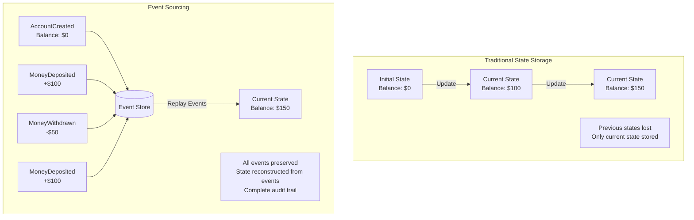
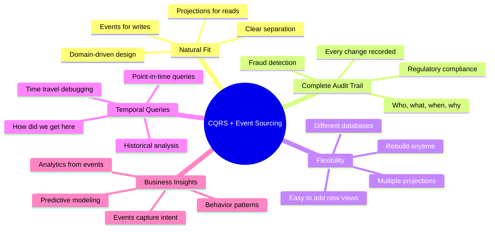
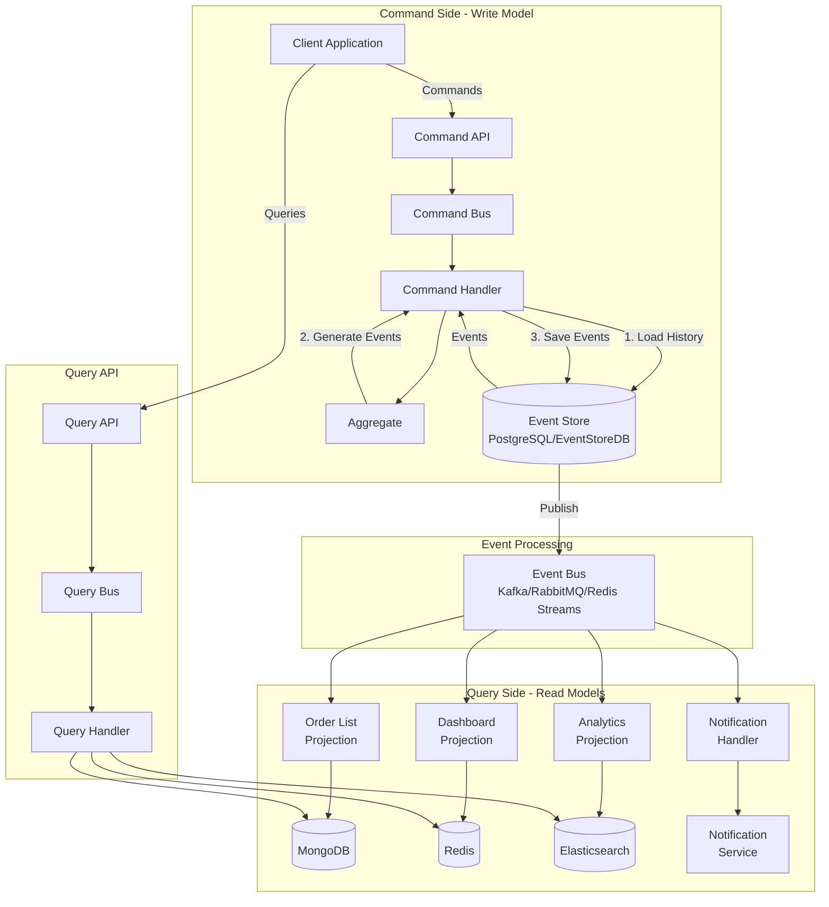
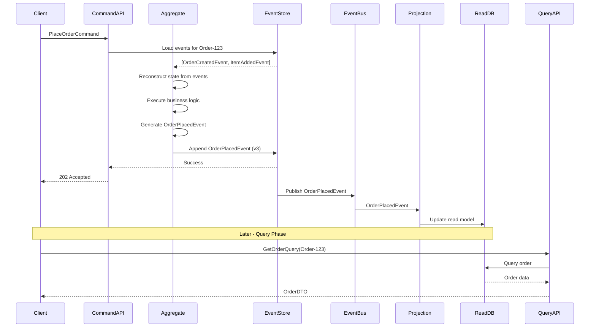
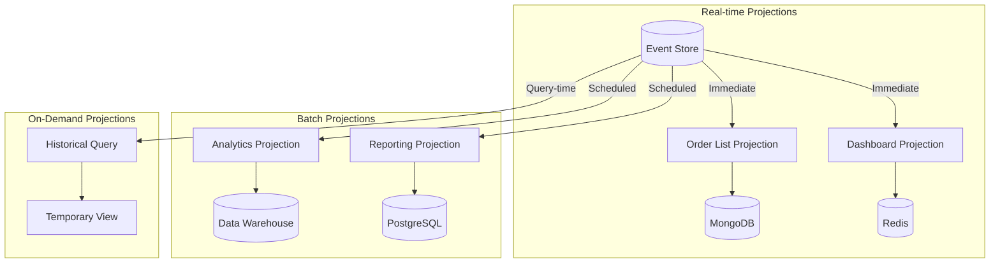
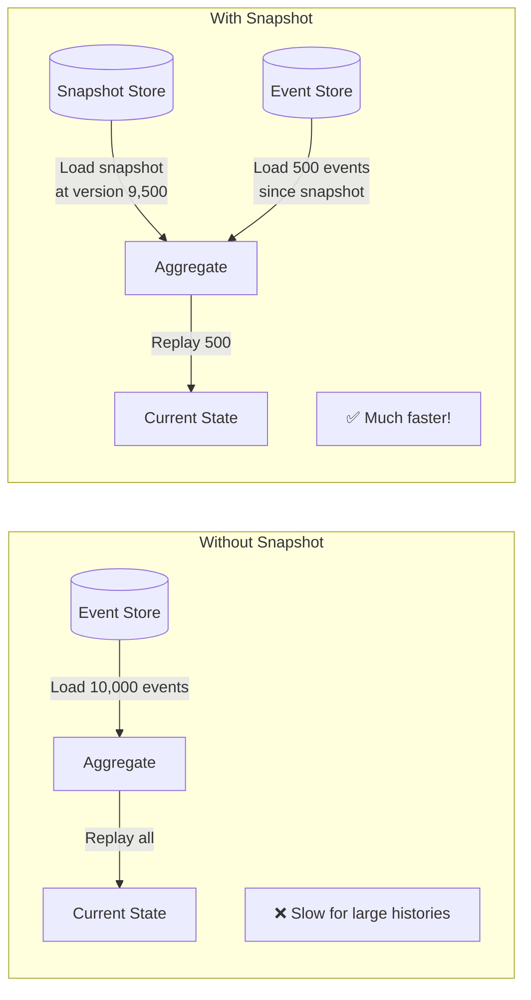
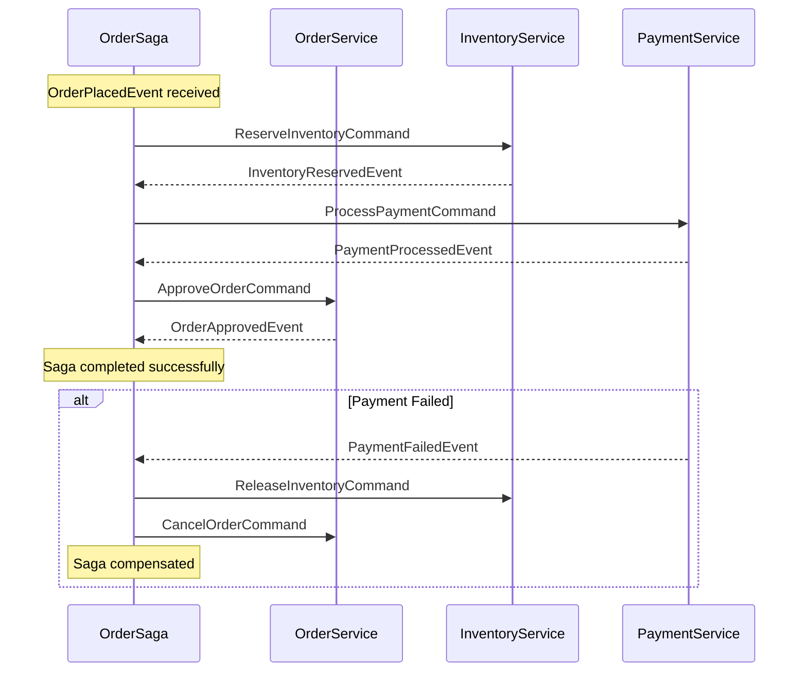

# Event Sourcing Integration with CQRS

> Combining CQRS with Event Sourcing creates a powerful architectural pattern that provides complete audit trails, temporal queries, and ultimate flexibility in building read models.

---

## Table of Contents

1. [Overview](#overview)
2. [What is Event Sourcing?](#what-is-event-sourcing)
3. [Why Combine CQRS with Event Sourcing?](#why-combine-cqrs-with-event-sourcing)
4. [Core Concepts](#core-concepts)
5. [Architecture](#architecture)
6. [Event Store](#event-store)
7. [Domain Events](#domain-events)
8. [Event-Sourced Aggregates](#event-sourced-aggregates)
9. [Projections](#projections)
10. [Event Handlers](#event-handlers)
11. [Snapshots](#snapshots)
12. [Event Versioning](#event-versioning)
13. [Replay and Rebuilding](#replay-and-rebuilding)
14. [Implementation Guide](#implementation-guide)
15. [Best Practices](#best-practices)
16. [Common Patterns](#common-patterns)
17. [Challenges and Solutions](#challenges-and-solutions)
18. [Testing Strategies](#testing-strategies)
19. [Real-World Examples](#real-world-examples)
20. [Conclusion](#conclusion)

---

## Overview

Event Sourcing is a pattern where state changes are stored as a sequence of events. Instead of storing the current state, you store all the events that led to the current state.

When combined with CQRS, Event Sourcing becomes the write model's persistence mechanism, while projections of events become the read models.

### Key Benefits

- **Complete Audit Trail**: Every change is recorded
- **Temporal Queries**: Query state at any point in time
- **Event Replay**: Rebuild state by replaying events
- **Multiple Projections**: Create unlimited read models
- **Business Insights**: Events capture business intent

---

## What is Event Sourcing?

### Traditional vs Event Sourcing



### Comparison Table

| Aspect | Traditional | Event Sourcing |
|--------|-------------|----------------|
| **Storage** | Current state only | All events |
| **Updates** | In-place modification | Append-only |
| **History** | Lost after update | Complete history |
| **Audit Trail** | Must be built separately | Automatic |
| **Temporal Queries** | Not possible | Natural |
| **Debugging** | Difficult | Replay events to reproduce |
| **Performance** | Fast reads | May need snapshots |

---

## Why Combine CQRS with Event Sourcing?

### The Perfect Marriage



### Use Cases

#### 1. Financial Systems
- Complete transaction history
- Audit compliance (SOX, PCI-DSS)
- Point-in-time balance queries
- Fraud detection and investigation

#### 2. Healthcare Records
- Patient history tracking
- Regulatory compliance (HIPAA)
- Medical event timeline
- Audit trail for legal purposes

#### 3. E-Commerce
- Order lifecycle tracking
- Inventory management
- Customer behavior analysis
- Dispute resolution

#### 4. Collaboration Tools
- Document version history
- User activity tracking
- Conflict resolution
- Undo/redo functionality

---

## Core Concepts

### 1. Domain Events

Events are immutable facts about something that happened.

```typescript
interface DomainEvent {
  eventId: string;
  aggregateId: string;
  aggregateType: string;
  version: number;
  timestamp: Date;
  userId: string;
}

interface OrderItem {
  productId: string;
  quantity: number;
  price: number;
}

class OrderPlacedEvent implements DomainEvent {
  readonly eventId: string;
  readonly aggregateId: string;
  readonly aggregateType = 'Order';
  readonly version: number;
  readonly timestamp: Date;
  readonly userId: string;
  
  // Event-specific data
  readonly customerId: string;
  readonly items: ReadonlyArray<OrderItem>;
  readonly totalAmount: number;
  
  constructor(
    orderId: string,
    customerId: string,
    items: OrderItem[],
    totalAmount: number,
    version: number,
    userId: string
  ) {
    this.eventId = crypto.randomUUID();
    this.aggregateId = orderId;
    this.customerId = customerId;
    this.items = Object.freeze([...items]); // Immutable copy
    this.totalAmount = totalAmount;
    this.version = version;
    this.timestamp = new Date();
    this.userId = userId;
  }
}
```

### 2. Event Store

A specialized database optimized for storing events in append-only fashion.

```typescript
interface EventStore {
  // Append events to an aggregate's stream
  appendEvents(
    aggregateId: string, 
    events: DomainEvent[], 
    expectedVersion: number
  ): Promise<void>;
  
  // Load all events for an aggregate
  loadEvents(aggregateId: string): Promise<DomainEvent[]>;
  
  // Load events from a specific version
  loadEventsFromVersion(
    aggregateId: string, 
    fromVersion: number
  ): Promise<DomainEvent[]>;
  
  // Load all events (for projections and rebuilding)
  loadAllEvents(): AsyncIterable<DomainEvent>;
  
  // Load events from a timestamp (temporal queries)
  loadEventsFromTimestamp(timestamp: Date): AsyncIterable<DomainEvent>;
}
```

### 3. Event-Sourced Aggregates

Aggregates that reconstruct their state from events.

```typescript
abstract class EventSourcedAggregate {
  protected id: string = '';
  protected version: number = 0;
  private uncommittedEvents: DomainEvent[] = [];
  
  // Apply an event to update state (for event replay)
  protected abstract apply(event: DomainEvent): void;
  
  // Raise a new event (for new operations)
  protected raiseEvent(event: DomainEvent): void {
    this.apply(event);
    this.uncommittedEvents.push(event);
  }
  
  // Reconstruct aggregate from historical events
  loadFromHistory(history: DomainEvent[]): void {
    for (const event of history) {
      this.apply(event);
      this.version = event.version;
    }
  }
  
  // Get uncommitted events to save to event store
  getUncommittedEvents(): ReadonlyArray<DomainEvent> {
    return [...this.uncommittedEvents];
  }
  
  // Clear uncommitted events after saving
  markEventsAsCommitted(): void {
    this.uncommittedEvents = [];
  }
  
  getId(): string { return this.id; }
  getVersion(): number { return this.version; }
}
```

### 4. Projections

Projections build read models from events.

```typescript
interface Projection {
  handle(event: DomainEvent): Promise<void>;
  getProjectionName(): string;
}

interface OrderReadModel {
  id: string;
  customerId: string;
  totalAmount: number;
  status: string;
  createdAt: Date;
  approvedAt?: Date;
  shippedAt?: Date;
  trackingNumber?: string;
}

class OrderListProjection implements Projection {
  constructor(private repository: OrderReadRepository) {}
  
  async handle(event: DomainEvent): Promise<void> {
    if (event instanceof OrderPlacedEvent) {
      await this.handleOrderPlaced(event);
    } else if (event instanceof OrderApprovedEvent) {
      await this.handleOrderApproved(event);
    } else if (event instanceof OrderShippedEvent) {
      await this.handleOrderShipped(event);
    }
  }
  
  private async handleOrderPlaced(event: OrderPlacedEvent): Promise<void> {
    const readModel: OrderReadModel = {
      id: event.aggregateId,
      customerId: event.customerId,
      totalAmount: event.totalAmount,
      status: 'PENDING',
      createdAt: event.timestamp
    };
    
    await this.repository.save(readModel);
  }
  
  private async handleOrderApproved(event: OrderApprovedEvent): Promise<void> {
    const readModel = await this.repository.findById(event.aggregateId);
    if (!readModel) throw new Error('Order not found');
    
    readModel.status = 'APPROVED';
    readModel.approvedAt = event.timestamp;
    
    await this.repository.save(readModel);
  }
  
  private async handleOrderShipped(event: OrderShippedEvent): Promise<void> {
    const readModel = await this.repository.findById(event.aggregateId);
    if (!readModel) throw new Error('Order not found');
    
    readModel.status = 'SHIPPED';
    readModel.shippedAt = event.timestamp;
    readModel.trackingNumber = event.trackingNumber;
    
    await this.repository.save(readModel);
  }
  
  getProjectionName(): string {
    return 'OrderListProjection';
  }
}
```

---

## Architecture

### Complete CQRS + Event Sourcing Architecture



### Event Flow Sequence



---

## Event Store

### Event Store Implementation (PostgreSQL)

```typescript
class PostgresEventStore implements EventStore {
  constructor(
    private pool: Pool,
    private eventBus: EventBus
  ) {}
  
  async appendEvents(
    aggregateId: string,
    events: DomainEvent[],
    expectedVersion: number
  ): Promise<void> {
    const client = await this.pool.connect();
    
    try {
      await client.query('BEGIN');
      
      // Check for concurrency conflicts
      const currentVersion = await this.getCurrentVersion(client, aggregateId);
      
      if (currentVersion !== null && currentVersion !== expectedVersion) {
        throw new ConcurrencyException(
          `Expected version ${expectedVersion} but found ${currentVersion} for aggregate ${aggregateId}`
        );
      }
      
      // Append each event
      for (const event of events) {
        const eventData = JSON.stringify(event);
        
        await client.query(
          `INSERT INTO events 
           (event_id, aggregate_id, aggregate_type, event_type, event_data, 
            version, timestamp, user_id)
           VALUES ($1, $2, $3, $4, $5, $6, $7, $8)`,
          [
            event.eventId,
            event.aggregateId,
            event.aggregateType,
            event.constructor.name,
            eventData,
            event.version,
            event.timestamp,
            event.userId
          ]
        );
      }
      
      await client.query('COMMIT');
      
      // Publish events asynchronously
      for (const event of events) {
        await this.eventBus.publish(event);
      }
      
    } catch (error) {
      await client.query('ROLLBACK');
      throw error;
    } finally {
      client.release();
    }
  }
  
  async loadEvents(aggregateId: string): Promise<DomainEvent[]> {
    const result = await this.pool.query(
      `SELECT event_id, aggregate_id, aggregate_type, event_type, 
              event_data, version, timestamp, user_id
       FROM events
       WHERE aggregate_id = $1
       ORDER BY version ASC`,
      [aggregateId]
    );
    
    return result.rows.map(row => this.deserializeEvent(row));
  }
  
  async loadEventsFromVersion(
    aggregateId: string,
    fromVersion: number
  ): Promise<DomainEvent[]> {
    const result = await this.pool.query(
      `SELECT event_id, aggregate_id, aggregate_type, event_type, 
              event_data, version, timestamp, user_id
       FROM events
       WHERE aggregate_id = $1 AND version > $2
       ORDER BY version ASC`,
      [aggregateId, fromVersion]
    );
    
    return result.rows.map(row => this.deserializeEvent(row));
  }
  
  async *loadAllEvents(): AsyncIterable<DomainEvent> {
    const cursor = this.pool.query(
      new Cursor(`
        SELECT event_id, aggregate_id, aggregate_type, event_type, 
               event_data, version, timestamp, user_id
        FROM events
        ORDER BY timestamp ASC, version ASC
      `)
    );
    
    let rows = await cursor.read(100);
    while (rows.length > 0) {
      for (const row of rows) {
        yield this.deserializeEvent(row);
      }
      rows = await cursor.read(100);
    }
  }
  
  async *loadEventsFromTimestamp(timestamp: Date): AsyncIterable<DomainEvent> {
    const cursor = this.pool.query(
      new Cursor(
        `SELECT event_id, aggregate_id, aggregate_type, event_type, 
                event_data, version, timestamp, user_id
         FROM events
         WHERE timestamp >= $1
         ORDER BY timestamp ASC, version ASC`,
        [timestamp]
      )
    );
    
    let rows = await cursor.read(100);
    while (rows.length > 0) {
      for (const row of rows) {
        yield this.deserializeEvent(row);
      }
      rows = await cursor.read(100);
    }
  }
  
  private async getCurrentVersion(
    client: PoolClient,
    aggregateId: string
  ): Promise<number | null> {
    const result = await client.query(
      'SELECT MAX(version) as version FROM events WHERE aggregate_id = $1',
      [aggregateId]
    );
    
    return result.rows[0]?.version ?? null;
  }
  
  private deserializeEvent(row: any): DomainEvent {
    const eventData = JSON.parse(row.event_data);
    const EventClass = this.getEventClass(row.event_type);
    
    return Object.assign(new EventClass(), {
      ...eventData,
      timestamp: new Date(row.timestamp)
    });
  }
  
  private getEventClass(eventType: string): any {
    // Map event type to class
    const eventMap: Record<string, any> = {
      'OrderPlacedEvent': OrderPlacedEvent,
      'OrderApprovedEvent': OrderApprovedEvent,
      'OrderShippedEvent': OrderShippedEvent,
      // Add more event types...
    };
    
    return eventMap[eventType] || DomainEvent;
  }
}
```

### Database Schema

```sql
-- Events table
CREATE TABLE events (
    event_id UUID PRIMARY KEY,
    aggregate_id VARCHAR(255) NOT NULL,
    aggregate_type VARCHAR(255) NOT NULL,
    event_type VARCHAR(500) NOT NULL,
    event_data JSONB NOT NULL,
    version BIGINT NOT NULL,
    timestamp TIMESTAMP NOT NULL DEFAULT CURRENT_TIMESTAMP,
    user_id VARCHAR(255),
    
    -- Ensure unique version per aggregate (optimistic concurrency)
    UNIQUE (aggregate_id, version)
);

-- Indexes for performance
CREATE INDEX idx_events_aggregate_id ON events(aggregate_id);
CREATE INDEX idx_events_aggregate_type ON events(aggregate_type);
CREATE INDEX idx_events_timestamp ON events(timestamp);
CREATE INDEX idx_events_event_type ON events(event_type);
CREATE INDEX idx_events_user_id ON events(user_id);

-- GIN index for JSONB queries
CREATE INDEX idx_events_data_gin ON events USING GIN (event_data);

-- Composite index for efficient range queries
CREATE INDEX idx_events_aggregate_version ON events(aggregate_id, version);

-- Snapshots table (optional, for performance)
CREATE TABLE snapshots (
    aggregate_id VARCHAR(255) PRIMARY KEY,
    aggregate_type VARCHAR(255) NOT NULL,
    snapshot_data JSONB NOT NULL,
    version BIGINT NOT NULL,
    timestamp TIMESTAMP NOT NULL DEFAULT CURRENT_TIMESTAMP
);

CREATE INDEX idx_snapshots_aggregate_type ON snapshots(aggregate_type);
CREATE INDEX idx_snapshots_timestamp ON snapshots(timestamp);

-- Projection state tracking
CREATE TABLE projection_state (
    projection_name VARCHAR(255) PRIMARY KEY,
    last_processed_event_id UUID,
    last_processed_timestamp TIMESTAMP,
    last_processed_version BIGINT,
    updated_at TIMESTAMP NOT NULL DEFAULT CURRENT_TIMESTAMP
);
```

---

## Domain Events

### Event Design Principles

#### 1. Past Tense Naming

Events represent facts that have already occurred.

```typescript
// ✅ GOOD: Past tense
class OrderPlacedEvent {}
class PaymentProcessedEvent {}
class InventoryReservedEvent {}
class UserRegisteredEvent {}
class AccountActivatedEvent {}

// ❌ BAD: Present or future tense
class PlaceOrderEvent {}
class ProcessPaymentEvent {}
class ReserveInventoryEvent {}
class RegisterUserEvent {}
```

#### 2. Immutability

Events must be immutable once created.

```typescript
// ✅ GOOD: Immutable event
class OrderPlacedEvent implements DomainEvent {
  readonly eventId: string;
  readonly orderId: string;
  readonly customerId: string;
  readonly items: ReadonlyArray<OrderItem>;
  readonly timestamp: Date;
  
  constructor(orderId: string, customerId: string, items: OrderItem[]) {
    this.eventId = crypto.randomUUID();
    this.orderId = orderId;
    this.customerId = customerId;
    this.items = Object.freeze([...items]); // Defensive copy + freeze
    this.timestamp = new Date();
    Object.freeze(this); // Make entire object immutable
  }
}

// ❌ BAD: Mutable event
class OrderPlacedEvent {
  eventId: string;
  orderId: string;
  items: OrderItem[]; // Mutable array
  
  // Having setters makes it mutable - BAD!
  setOrderId(id: string) { this.orderId = id; }
  setItems(items: OrderItem[]) { this.items = items; }
}
```

#### 3. Self-Contained

Events should contain all necessary information.

```typescript
// ✅ GOOD: Contains all necessary data
class OrderPlacedEvent implements DomainEvent {
  readonly eventId: string;
  readonly orderId: string;
  readonly customerId: string;
  readonly customerName: string;        // Denormalized
  readonly customerEmail: string;       // Denormalized
  readonly items: ReadonlyArray<OrderItem>;
  readonly shippingAddress: Address;
  readonly totalAmount: number;
  readonly timestamp: Date;
  
  // Event consumers don't need to query other sources
}

// ❌ BAD: Missing context
class OrderPlacedEvent {
  readonly orderId: string;
  readonly customerId: string;  // Consumers must look up customer details
  
  // Not enough information for consumers
}
```

#### 4. Business-Focused

Use domain language, not technical terms.

```typescript
// ✅ GOOD: Business language
class CustomerBecamePremiumMemberEvent {}
class LoanApplicationApprovedEvent {}
class PolicyCancelledDueToNonPaymentEvent {}
class AccountOverdraftLimitExceededEvent {}

// ❌ BAD: Technical language
class CustomerStatusChangedEvent { status = "PREMIUM"; }
class LoanStatusUpdatedEvent { status = "APPROVED"; }
class PolicyDeletedEvent {}
class AccountBalanceNegativeEvent {}
```

### Complete Event Hierarchy Example

```typescript
// Base event interface
interface DomainEvent {
  eventId: string;
  aggregateId: string;
  aggregateType: string;
  version: number;
  timestamp: Date;
  userId: string;
}

// Base implementation
abstract class BaseDomainEvent implements DomainEvent {
  readonly eventId: string;
  readonly version: number;
  readonly timestamp: Date;
  readonly userId: string;
  
  constructor(
    public readonly aggregateId: string,
    version: number,
    userId: string
  ) {
    this.eventId = crypto.randomUUID();
    this.version = version;
    this.timestamp = new Date();
    this.userId = userId;
    Object.freeze(this);
  }
  
  abstract get aggregateType(): string;
}

// Order-specific base event
abstract class OrderEvent extends BaseDomainEvent {
  get aggregateType(): string {
    return 'Order';
  }
}

// Specific order events
class OrderPlacedEvent extends OrderEvent {
  constructor(
    orderId: string,
    public readonly customerId: string,
    public readonly customerName: string,
    public readonly customerEmail: string,
    public readonly items: ReadonlyArray<OrderItem>,
    public readonly shippingAddress: Address,
    public readonly totalAmount: number,
    version: number,
    userId: string
  ) {
    super(orderId, version, userId);
    Object.freeze(this);
  }
}

class OrderApprovedEvent extends OrderEvent {
  constructor(
    orderId: string,
    public readonly approvedBy: string,
    public readonly approverName: string,
    public readonly approvalNotes: string,
    version: number,
    userId: string
  ) {
    super(orderId, version, userId);
    Object.freeze(this);
  }
}

class OrderShippedEvent extends OrderEvent {
  constructor(
    orderId: string,
    public readonly trackingNumber: string,
    public readonly carrier: string,
    public readonly shippingAddress: Address,
    public readonly estimatedDelivery: Date,
    version: number,
    userId: string
  ) {
    super(orderId, version, userId);
    Object.freeze(this);
  }
}

class OrderCancelledEvent extends OrderEvent {
  constructor(
    orderId: string,
    public readonly cancelledBy: string,
    public readonly reason: string,
    public readonly cancellationType: 'CUSTOMER' | 'ADMIN' | 'SYSTEM',
    public readonly refundIssued: boolean,
    version: number,
    userId: string
  ) {
    super(orderId, version, userId);
    Object.freeze(this);
  }
}

class OrderDeliveredEvent extends OrderEvent {
  constructor(
    orderId: string,
    public readonly deliveredAt: Date,
    public readonly signedBy: string,
    version: number,
    userId: string
  ) {
    super(orderId, version, userId);
    Object.freeze(this);
  }
}
```

---

## Event-Sourced Aggregates

### Complete Order Aggregate Example

```typescript
enum OrderStatus {
  PENDING = 'PENDING',
  APPROVED = 'APPROVED',
  SHIPPED = 'SHIPPED',
  DELIVERED = 'DELIVERED',
  CANCELLED = 'CANCELLED'
}

class Order extends EventSourcedAggregate {
  private customerId: string = '';
  private items: OrderItem[] = [];
  private shippingAddress?: Address;
  private status: OrderStatus = OrderStatus.PENDING;
  private placedAt?: Date;
  private approvedAt?: Date;
  private shippedAt?: Date;
  private deliveredAt?: Date;
  private trackingNumber?: string;
  
  // Private constructor (for reconstruction)
  private constructor() {
    super();
  }
  
  // Factory method (creates new aggregate)
  static placeOrder(
    orderId: string,
    customerId: string,
    customerName: string,
    customerEmail: string,
    items: OrderItem[],
    shippingAddress: Address,
    userId: string
  ): Order {
    const order = new Order();
    order.id = orderId;
    
    const totalAmount = items.reduce(
      (sum, item) => sum + item.price * item.quantity,
      0
    );
    
    // Generate and apply event
    const event = new OrderPlacedEvent(
      orderId,
      customerId,
      customerName,
      customerEmail,
      items,
      shippingAddress,
      totalAmount,
      0, // Initial version
      userId
    );
    
    order.raiseEvent(event);
    return order;
  }
  
  // Business methods (generate events)
  approve(approvedBy: string, approverName: string, notes: string): void {
    if (this.status !== OrderStatus.PENDING) {
      throw new InvalidOrderStateException(
        `Cannot approve order in status: ${this.status}`
      );
    }
    
    const event = new OrderApprovedEvent(
      this.id,
      approvedBy,
      approverName,
      notes,
      this.version + 1,
      approvedBy
    );
    
    this.raiseEvent(event);
  }
  
  ship(
    trackingNumber: string,
    carrier: string,
    estimatedDelivery: Date
  ): void {
    if (this.status !== OrderStatus.APPROVED) {
      throw new InvalidOrderStateException(
        `Cannot ship order in status: ${this.status}`
      );
    }
    
    const event = new OrderShippedEvent(
      this.id,
      trackingNumber,
      carrier,
      this.shippingAddress!,
      estimatedDelivery,
      this.version + 1,
      'system'
    );
    
    this.raiseEvent(event);
  }
  
  cancel(cancelledBy: string, reason: string, type: 'CUSTOMER' | 'ADMIN' | 'SYSTEM'): void {
    if (this.status === OrderStatus.SHIPPED || this.status === OrderStatus.DELIVERED) {
      throw new InvalidOrderStateException(
        `Cannot cancel order in status: ${this.status}`
      );
    }
    
    const event = new OrderCancelledEvent(
      this.id,
      cancelledBy,
      reason,
      type,
      true, // Issue refund
      this.version + 1,
      cancelledBy
    );
    
    this.raiseEvent(event);
  }
  
  markAsDelivered(signedBy: string): void {
    if (this.status !== OrderStatus.SHIPPED) {
      throw new InvalidOrderStateException(
        `Cannot mark as delivered when status is: ${this.status}`
      );
    }
    
    const event = new OrderDeliveredEvent(
      this.id,
      new Date(),
      signedBy,
      this.version + 1,
      'system'
    );
    
    this.raiseEvent(event);
  }
  
  // Apply events (for reconstruction)
  protected apply(event: DomainEvent): void {
    if (event instanceof OrderPlacedEvent) {
      this.applyOrderPlaced(event);
    } else if (event instanceof OrderApprovedEvent) {
      this.applyOrderApproved(event);
    } else if (event instanceof OrderShippedEvent) {
      this.applyOrderShipped(event);
    } else if (event instanceof OrderCancelledEvent) {
      this.applyOrderCancelled(event);
    } else if (event instanceof OrderDeliveredEvent) {
      this.applyOrderDelivered(event);
    }
  }
  
  private applyOrderPlaced(event: OrderPlacedEvent): void {
    this.customerId = event.customerId;
    this.items = [...event.items];
    this.shippingAddress = event.shippingAddress;
    this.status = OrderStatus.PENDING;
    this.placedAt = event.timestamp;
  }
  
  private applyOrderApproved(event: OrderApprovedEvent): void {
    this.status = OrderStatus.APPROVED;
    this.approvedAt = event.timestamp;
  }
  
  private applyOrderShipped(event: OrderShippedEvent): void {
    this.status = OrderStatus.SHIPPED;
    this.shippedAt = event.timestamp;
    this.trackingNumber = event.trackingNumber;
  }
  
  private applyOrderCancelled(event: OrderCancelledEvent): void {
    this.status = OrderStatus.CANCELLED;
  }
  
  private applyOrderDelivered(event: OrderDeliveredEvent): void {
    this.status = OrderStatus.DELIVERED;
    this.deliveredAt = event.timestamp;
  }
  
  // Getters
  getCustomerId(): string { return this.customerId; }
  getItems(): ReadonlyArray<OrderItem> { return [...this.items]; }
  getStatus(): OrderStatus { return this.status; }
  getPlacedAt(): Date | undefined { return this.placedAt; }
  getTrackingNumber(): string | undefined { return this.trackingNumber; }
}
```

### Command Handler with Event Sourcing

```typescript
class PlaceOrderCommandHandler {
  constructor(private eventStore: EventStore) {}
  
  async handle(command: PlaceOrderCommand): Promise<void> {
    console.log('Handling PlaceOrderCommand:', command.orderId);
    
    try {
      // Create new aggregate
      const order = Order.placeOrder(
        command.orderId,
        command.customerId,
        command.customerName,
        command.customerEmail,
        command.items,
        command.shippingAddress,
        command.userId
      );
      
      // Save events to event store
      await this.eventStore.appendEvents(
        order.getId(),
        order.getUncommittedEvents(),
        -1 // -1 indicates new aggregate
      );
      
      // Mark events as committed
      order.markEventsAsCommitted();
      
      console.log('Successfully placed order:', command.orderId);
      
    } catch (error) {
      console.error('Failed to place order:', command.orderId, error);
      throw new CommandProcessingException('Failed to place order', error);
    }
  }
}

class ApproveOrderCommandHandler {
  constructor(private eventStore: EventStore) {}
  
  async handle(command: ApproveOrderCommand): Promise<void> {
    console.log('Handling ApproveOrderCommand:', command.orderId);
    
    try {
      // Load aggregate from event store
      const events = await this.eventStore.loadEvents(command.orderId);
      
      if (events.length === 0) {
        throw new OrderNotFoundException(command.orderId);
      }
      
      // Reconstruct aggregate
      const order = new Order();
      order.loadFromHistory(events);
      
      // Execute business logic
      order.approve(
        command.approvedBy,
        command.approverName,
        command.notes
      );
      
      // Save new events
      await this.eventStore.appendEvents(
        order.getId(),
        order.getUncommittedEvents(),
        order.getVersion()
      );
      
      // Mark events as committed
      order.markEventsAsCommitted();
      
      console.log('Successfully approved order:', command.orderId);
      
    } catch (error) {
      if (error instanceof ConcurrencyException) {
        console.warn('Concurrency conflict approving order:', command.orderId);
      } else {
        console.error('Failed to approve order:', command.orderId, error);
      }
      throw error;
    }
  }
}
```

---

## Projections

### Projection Types Diagram



### Building Projections

#### 1. Simple List Projection

```typescript
interface OrderSummary {
  orderId: string;
  customerId: string;
  totalAmount: number;
  itemCount: number;
  status: string;
  placedAt: Date;
  approvedAt?: Date;
  shippedAt?: Date;
  trackingNumber?: string;
}

class OrderSummaryProjection implements Projection {
  constructor(private repository: OrderSummaryRepository) {}
  
  async handle(event: DomainEvent): Promise<void> {
    try {
      if (event instanceof OrderPlacedEvent) {
        await this.handleOrderPlaced(event);
      } else if (event instanceof OrderApprovedEvent) {
        await this.handleOrderApproved(event);
      } else if (event instanceof OrderShippedEvent) {
        await this.handleOrderShipped(event);
      } else if (event instanceof OrderCancelledEvent) {
        await this.handleOrderCancelled(event);
      }
    } catch (error) {
      console.error('Error handling event in projection:', error);
      throw error;
    }
  }
  
  private async handleOrderPlaced(event: OrderPlacedEvent): Promise<void> {
    const summary: OrderSummary = {
      orderId: event.aggregateId,
      customerId: event.customerId,
      totalAmount: event.totalAmount,
      itemCount: event.items.length,
      status: 'PENDING',
      placedAt: event.timestamp
    };
    
    await this.repository.save(summary);
    console.log('Created order summary for:', event.aggregateId);
  }
  
  private async handleOrderApproved(event: OrderApprovedEvent): Promise<void> {
    const summary = await this.repository.findById(event.aggregateId);
    if (!summary) {
      throw new ProjectionException(`Order not found: ${event.aggregateId}`);
    }
    
    summary.status = 'APPROVED';
    summary.approvedAt = event.timestamp;
    
    await this.repository.save(summary);
    console.log('Updated order summary:', event.aggregateId);
  }
  
  private async handleOrderShipped(event: OrderShippedEvent): Promise<void> {
    const summary = await this.repository.findById(event.aggregateId);
    if (!summary) {
      throw new ProjectionException(`Order not found: ${event.aggregateId}`);
    }
    
    summary.status = 'SHIPPED';
    summary.shippedAt = event.timestamp;
    summary.trackingNumber = event.trackingNumber;
    
    await this.repository.save(summary);
    console.log('Updated order summary:', event.aggregateId);
  }
  
  private async handleOrderCancelled(event: OrderCancelledEvent): Promise<void> {
    const summary = await this.repository.findById(event.aggregateId);
    if (!summary) {
      throw new ProjectionException(`Order not found: ${event.aggregateId}`);
    }
    
    summary.status = 'CANCELLED';
    
    await this.repository.save(summary);
    console.log('Updated order summary:', event.aggregateId);
  }
  
  getProjectionName(): string {
    return 'OrderSummaryProjection';
  }
}
```

#### 2. Denormalized Dashboard Projection

```typescript
interface RecentOrder {
  orderId: string;
  totalAmount: number;
  status: string;
  placedAt: Date;
}

interface CustomerDashboard {
  customerId: string;
  totalOrders: number;
  activeOrders: number;
  completedOrders: number;
  totalSpent: number;
  recentOrders: RecentOrder[];
  lastOrderDate?: Date;
  averageOrderValue: number;
}

class CustomerDashboardProjection implements Projection {
  constructor(private repository: CustomerDashboardRepository) {}
  
  async handle(event: DomainEvent): Promise<void> {
    if (event instanceof OrderPlacedEvent) {
      await this.handleOrderPlaced(event);
    } else if (event instanceof OrderDeliveredEvent) {
      await this.handleOrderDelivered(event);
    } else if (event instanceof OrderCancelledEvent) {
      await this.handleOrderCancelled(event);
    }
  }
  
  private async handleOrderPlaced(event: OrderPlacedEvent): Promise<void> {
    let dashboard = await this.repository.findById(event.customerId);
    
    if (!dashboard) {
      dashboard = this.createNewDashboard(event.customerId);
    }
    
    // Update statistics
    dashboard.totalOrders++;
    dashboard.activeOrders++;
    dashboard.totalSpent += event.totalAmount;
    dashboard.lastOrderDate = event.timestamp;
    dashboard.averageOrderValue = dashboard.totalSpent / dashboard.totalOrders;
    
    // Add to recent orders
    const recentOrder: RecentOrder = {
      orderId: event.aggregateId,
      totalAmount: event.totalAmount,
      status: 'PENDING',
      placedAt: event.timestamp
    };
    
    dashboard.recentOrders.unshift(recentOrder);
    
    // Keep only 10 most recent
    dashboard.recentOrders = dashboard.recentOrders.slice(0, 10);
    
    await this.repository.save(dashboard);
  }
  
  private async handleOrderDelivered(event: OrderDeliveredEvent): Promise<void> {
    const dashboard = await this.repository.findByOrderId(event.aggregateId);
    if (!dashboard) return;
    
    dashboard.activeOrders--;
    dashboard.completedOrders++;
    
    // Update recent order status
    const recentOrder = dashboard.recentOrders.find(
      o => o.orderId === event.aggregateId
    );
    if (recentOrder) {
      recentOrder.status = 'DELIVERED';
    }
    
    await this.repository.save(dashboard);
  }
  
  private async handleOrderCancelled(event: OrderCancelledEvent): Promise<void> {
    const dashboard = await this.repository.findByOrderId(event.aggregateId);
    if (!dashboard) return;
    
    dashboard.activeOrders--;
    
    // Update recent order status
    const recentOrder = dashboard.recentOrders.find(
      o => o.orderId === event.aggregateId
    );
    if (recentOrder) {
      recentOrder.status = 'CANCELLED';
    }
    
    await this.repository.save(dashboard);
  }
  
  private createNewDashboard(customerId: string): CustomerDashboard {
    return {
      customerId,
      totalOrders: 0,
      activeOrders: 0,
      completedOrders: 0,
      totalSpent: 0,
      recentOrders: [],
      averageOrderValue: 0
    };
  }
  
  getProjectionName(): string {
    return 'CustomerDashboardProjection';
  }
}
```

#### 3. Analytics Projection

```typescript
interface DailySalesStats {
  date: string; // YYYY-MM-DD
  orderCount: number;
  totalRevenue: number;
  averageOrderValue: number;
  itemCount: number;
}

interface ProductStats {
  productId: string;
  orderCount: number;
  quantitySold: number;
  totalRevenue: number;
}

interface CustomerSegmentStats {
  segment: 'PREMIUM' | 'STANDARD' | 'BASIC';
  orderCount: number;
  totalRevenue: number;
  averageOrderValue: number;
}

class SalesAnalyticsProjection implements Projection {
  constructor(
    private dailyStatsRepo: DailySalesStatsRepository,
    private productStatsRepo: ProductStatsRepository,
    private segmentStatsRepo: CustomerSegmentStatsRepository
  ) {}
  
  async handle(event: DomainEvent): Promise<void> {
    if (event instanceof OrderPlacedEvent) {
      await this.updateDailyStats(event);
      await this.updateProductStats(event);
      await this.updateCustomerSegmentStats(event);
    }
  }
  
  private async updateDailyStats(event: OrderPlacedEvent): Promise<void> {
    const date = event.timestamp.toISOString().split('T')[0];
    
    let stats = await this.dailyStatsRepo.findById(date);
    if (!stats) {
      stats = {
        date,
        orderCount: 0,
        totalRevenue: 0,
        averageOrderValue: 0,
        itemCount: 0
      };
    }
    
    stats.orderCount++;
    stats.totalRevenue += event.totalAmount;
    stats.averageOrderValue = stats.totalRevenue / stats.orderCount;
    stats.itemCount += event.items.length;
    
    await this.dailyStatsRepo.save(stats);
  }
  
  private async updateProductStats(event: OrderPlacedEvent): Promise<void> {
    for (const item of event.items) {
      let stats = await this.productStatsRepo.findById(item.productId);
      if (!stats) {
        stats = {
          productId: item.productId,
          orderCount: 0,
          quantitySold: 0,
          totalRevenue: 0
        };
      }
      
      stats.orderCount++;
      stats.quantitySold += item.quantity;
      stats.totalRevenue += item.price * item.quantity;
      
      await this.productStatsRepo.save(stats);
    }
  }
  
  private async updateCustomerSegmentStats(
    event: OrderPlacedEvent
  ): Promise<void> {
    const segment = this.calculateSegment(event.totalAmount);
    
    let stats = await this.segmentStatsRepo.findById(segment);
    if (!stats) {
      stats = {
        segment,
        orderCount: 0,
        totalRevenue: 0,
        averageOrderValue: 0
      };
    }
    
    stats.orderCount++;
    stats.totalRevenue += event.totalAmount;
    stats.averageOrderValue = stats.totalRevenue / stats.orderCount;
    
    await this.segmentStatsRepo.save(stats);
  }
  
  private calculateSegment(amount: number): 'PREMIUM' | 'STANDARD' | 'BASIC' {
    if (amount > 1000) return 'PREMIUM';
    if (amount > 100) return 'STANDARD';
    return 'BASIC';
  }
  
  getProjectionName(): string {
    return 'SalesAnalyticsProjection';
  }
}
```

### Projection Manager

```typescript
class ProjectionManager {
  constructor(
    private projections: Projection[],
    private stateRepository: ProjectionStateRepository
  ) {}
  
  async handleEvent(event: DomainEvent): Promise<void> {
    for (const projection of this.projections) {
      try {
        await projection.handle(event);
        await this.updateProjectionState(projection, event);
      } catch (error) {
        console.error(
          `Error in projection ${projection.getProjectionName()}:`,
          error
        );
        // Send to dead letter queue or retry mechanism
        await this.handleProjectionError(projection, event, error);
      }
    }
  }
  
  private async updateProjectionState(
    projection: Projection,
    event: DomainEvent
  ): Promise<void> {
    const state = {
      projectionName: projection.getProjectionName(),
      lastProcessedEventId: event.eventId,
      lastProcessedTimestamp: event.timestamp,
      lastProcessedVersion: event.version,
      updatedAt: new Date()
    };
    
    await this.stateRepository.save(state);
  }
  
  private async handleProjectionError(
    projection: Projection,
    event: DomainEvent,
    error: any
  ): Promise<void> {
    // Log error
    console.error('Projection error:', {
      projection: projection.getProjectionName(),
      eventId: event.eventId,
      error: error.message
    });
    
    // Send to dead letter queue for manual intervention
    // await this.deadLetterQueue.send({ projection, event, error });
  }
  
  async rebuildProjection(projectionName: string): Promise<void> {
    console.log('Rebuilding projection:', projectionName);
    
    const projection = this.projections.find(
      p => p.getProjectionName() === projectionName
    );
    
    if (!projection) {
      throw new ProjectionNotFoundException(projectionName);
    }
    
    // Clear existing data
    await this.clearProjectionData(projection);
    
    // Reset projection state
    await this.stateRepository.deleteById(projectionName);
    
    // Replay all events
    let eventCount = 0;
    const startTime = Date.now();
    
    for await (const event of this.eventStore.loadAllEvents()) {
      try {
        await projection.handle(event);
        eventCount++;
        
        // Log progress every 1000 events
        if (eventCount % 1000 === 0) {
          console.log(`Processed ${eventCount} events for ${projectionName}`);
        }
      } catch (error) {
        console.error(`Error replaying event ${event.eventId}:`, error);
        // Continue with next event
      }
    }
    
    const duration = Date.now() - startTime;
    console.log(
      `Rebuilt projection ${projectionName} with ${eventCount} events in ${duration}ms`
    );
  }
  
  async rebuildAllProjections(): Promise<void> {
    console.log('Starting rebuild of all projections');
    
    for (const projection of this.projections) {
      try {
        await this.rebuildProjection(projection.getProjectionName());
      } catch (error) {
        console.error(
          `Failed to rebuild projection: ${projection.getProjectionName()}`,
          error
        );
      }
    }
    
    console.log('Completed rebuild of all projections');
  }
  
  private async clearProjectionData(projection: Projection): Promise<void> {
    // Implementation depends on projection type
    console.log('Clearing data for projection:', projection.getProjectionName());
    // await projection.clear(); // If projection implements clear method
  }
}
```

---

## Event Handlers

### Event Handler Types

```typescript
// 1. Projection Handler (updates read models)
class OrderProjectionHandler {
  constructor(private projection: OrderListProjection) {}
  
  async on(event: OrderPlacedEvent): Promise<void> {
    await this.projection.handle(event);
  }
}

// 2. Integration Handler (integrates with external systems)
class NotificationHandler {
  constructor(
    private emailService: EmailService,
    private smsService: SmsService
  ) {}
  
  async on(event: OrderPlacedEvent): Promise<void> {
    // Send order confirmation email
    await this.emailService.sendOrderConfirmation(
      event.customerEmail,
      event.aggregateId,
      event.totalAmount
    );
  }
  
  async onOrderShipped(event: OrderShippedEvent): Promise<void> {
    // Send shipping notification
    await this.smsService.sendShippingNotification(
      event.aggregateId,
      event.trackingNumber
    );
  }
}

// 3. Process Manager (coordinates sagas)
class OrderFulfillmentProcessManager {
  constructor(private commandBus: CommandBus) {}
  
  async on(event: OrderPlacedEvent): Promise<void> {
    // Start fulfillment process
    await this.commandBus.dispatch(
      new ReserveInventoryCommand(
        event.aggregateId,
        event.items
      )
    );
  }
  
  async onInventoryReserved(event: InventoryReservedEvent): Promise<void> {
    // Continue process
    await this.commandBus.dispatch(
      new ProcessPaymentCommand(
        event.orderId,
        event.paymentDetails
      )
    );
  }
  
  async onPaymentProcessed(event: PaymentProcessedEvent): Promise<void> {
    // Complete process
    await this.commandBus.dispatch(
      new ApproveOrderCommand(
        event.orderId,
        'system',
        'System Approval',
        'Payment processed successfully'
      )
    );
  }
  
  async onPaymentFailed(event: PaymentFailedEvent): Promise<void> {
    // Compensate: Release inventory
    await this.commandBus.dispatch(
      new ReleaseInventoryCommand(event.orderId)
    );
    
    // Cancel order
    await this.commandBus.dispatch(
      new CancelOrderCommand(
        event.orderId,
        'system',
        'Payment failed',
        'SYSTEM'
      )
    );
  }
}

// 4. Audit Handler (logging and compliance)
class AuditHandler {
  constructor(private auditLogRepository: AuditLogRepository) {}
  
  async on(event: DomainEvent): Promise<void> {
    const auditLog = {
      eventId: event.eventId,
      eventType: event.constructor.name,
      aggregateId: event.aggregateId,
      aggregateType: event.aggregateType,
      userId: event.userId,
      timestamp: event.timestamp,
      eventData: JSON.stringify(event)
    };
    
    await this.auditLogRepository.save(auditLog);
  }
}
```

### Event Handler Best Practices

```typescript
// ✅ GOOD: Idempotent handler
class IdempotentEventHandler {
  constructor(
    private processedEvents: ProcessedEventRepository,
    private orderRepository: OrderReadRepository
  ) {}
  
  async on(event: OrderPlacedEvent): Promise<void> {
    // Check if already processed
    const exists = await this.processedEvents.exists(event.eventId);
    if (exists) {
      console.log('Event already processed:', event.eventId);
      return;
    }
    
    try {
      // Process event
      await this.updateReadModel(event);
      
      // Mark as processed
      await this.processedEvents.save({
        eventId: event.eventId,
        eventType: event.constructor.name,
        processedAt: new Date()
      });
    } catch (error) {
      if (error.code === 'DUPLICATE_KEY') {
        // Another instance processed it
        console.log('Event processed by another instance');
      } else {
        throw error;
      }
    }
  }
  
  private async updateReadModel(event: OrderPlacedEvent): Promise<void> {
    // Update logic here
  }
}

// ✅ GOOD: Resilient handler with retry and compensation
class ResilientEventHandler {
  constructor(private orderService: OrderService) {}
  
  async on(event: OrderPlacedEvent): Promise<void> {
    let retries = 0;
    const maxRetries = 3;
    
    while (retries < maxRetries) {
      try {
        await this.processEvent(event);
        return; // Success
      } catch (error) {
        if (this.isTransientError(error)) {
          retries++;
          console.warn(`Transient error, retry ${retries}/${maxRetries}`, error);
          await this.sleep(1000 * Math.pow(2, retries)); // Exponential backoff
        } else {
          console.error('Permanent error, compensating', error);
          await this.compensate(event);
          throw error;
        }
      }
    }
    
    // All retries exhausted
    console.error('All retries exhausted for event:', event.eventId);
    await this.sendToDeadLetterQueue(event);
  }
  
  private isTransientError(error: any): boolean {
    // Network errors, timeouts, etc.
    return error.code === 'ETIMEDOUT' || 
           error.code === 'ECONNRESET' ||
           error.status === 503;
  }
  
  private async processEvent(event: OrderPlacedEvent): Promise<void> {
    // Processing logic
  }
  
  private async compensate(event: OrderPlacedEvent): Promise<void> {
    // Compensating action
    await this.orderService.cancelOrder(
      event.aggregateId,
      'system',
      `Failed to process order: ${event.eventId}`,
      'SYSTEM'
    );
  }
  
  private async sendToDeadLetterQueue(event: DomainEvent): Promise<void> {
    // Send to DLQ for manual intervention
  }
  
  private sleep(ms: number): Promise<void> {
    return new Promise(resolve => setTimeout(resolve, ms));
  }
}
```

---

## Snapshots

### Why Snapshots?

For aggregates with long event histories, replaying thousands of events can be slow. Snapshots provide performance optimization.



### Snapshot Implementation

```typescript
interface Snapshot {
  aggregateId: string;
  aggregateType: string;
  state: any;
  version: number;
  timestamp: Date;
}

interface SnapshotStore {
  saveSnapshot(
    aggregateId: string,
    state: any,
    version: number
  ): Promise<void>;
  
  loadSnapshot(aggregateId: string): Promise<Snapshot | null>;
}

class PostgresSnapshotStore implements SnapshotStore {
  constructor(private pool: Pool) {}
  
  async saveSnapshot(
    aggregateId: string,
    state: any,
    version: number
  ): Promise<void> {
    const snapshotData = JSON.stringify(state);
    
    await this.pool.query(
      `INSERT INTO snapshots 
       (aggregate_id, aggregate_type, snapshot_data, version, timestamp)
       VALUES ($1, $2, $3, $4, $5)
       ON CONFLICT (aggregate_id) 
       DO UPDATE SET 
         snapshot_data = EXCLUDED.snapshot_data,
         version = EXCLUDED.version,
         timestamp = EXCLUDED.timestamp`,
      [
        aggregateId,
        state.constructor.name,
        snapshotData,
        version,
        new Date()
      ]
    );
  }
  
  async loadSnapshot(aggregateId: string): Promise<Snapshot | null> {
    const result = await this.pool.query(
      `SELECT aggregate_id, aggregate_type, snapshot_data, version, timestamp
       FROM snapshots
       WHERE aggregate_id = $1`,
      [aggregateId]
    );
    
    if (result.rows.length === 0) {
      return null;
    }
    
    const row = result.rows[0];
    const state = JSON.parse(row.snapshot_data);
    
    return {
      aggregateId: row.aggregate_id,
      aggregateType: row.aggregate_type,
      state,
      version: row.version,
      timestamp: new Date(row.timestamp)
    };
  }
}
```

### Using Snapshots in Command Handler

```typescript
class OptimizedCommandHandler {
  private readonly SNAPSHOT_FREQUENCY = 100; // Snapshot every 100 events
  
  constructor(
    private eventStore: EventStore,
    private snapshotStore: SnapshotStore
  ) {}
  
  async handle(command: ApproveOrderCommand): Promise<void> {
    const order = await this.loadAggregate(command.orderId);
    
    order.approve(
      command.approvedBy,
      command.approverName,
      command.notes
    );
    
    await this.eventStore.appendEvents(
      order.getId(),
      order.getUncommittedEvents(),
      order.getVersion()
    );
    
    // Create snapshot if needed
    if (this.shouldCreateSnapshot(order.getVersion())) {
      await this.snapshotStore.saveSnapshot(
        order.getId(),
        order,
        order.getVersion()
      );
    }
    
    order.markEventsAsCommitted();
  }
  
  private async loadAggregate(orderId: string): Promise<Order> {
    const order = new Order();
    
    // Try to load from snapshot
    const snapshot = await this.snapshotStore.loadSnapshot(orderId);
    
    if (snapshot) {
      // Load from snapshot
      Object.assign(order, snapshot.state);
      
      // Load events since snapshot
      const events = await this.eventStore.loadEventsFromVersion(
        orderId,
        snapshot.version
      );
      
      if (events.length > 0) {
        order.loadFromHistory(events);
      }
    } else {
      // No snapshot - load all events
      const events = await this.eventStore.loadEvents(orderId);
      
      if (events.length === 0) {
        throw new OrderNotFoundException(orderId);
      }
      
      order.loadFromHistory(events);
    }
    
    return order;
  }
  
  private shouldCreateSnapshot(version: number): boolean {
    return version % this.SNAPSHOT_FREQUENCY === 0;
  }
}
```

---

## Event Versioning

### Why Event Versioning?

Events are stored forever. As the system evolves, event schemas change. Event versioning handles this evolution gracefully.

```mermaid
graph TB
    subgraph "Event Evolution"
        V1[OrderPlacedEvent V1<br/>productIds: string[]]
        V2[OrderPlacedEvent V2<br/>items: OrderItem[]<br/>shippingAddress: Address]
        V3[OrderPlacedEvent V3<br/>items: OrderItem[]<br/>shippingAddress: Address<br/>paymentMethod: string]
        
        V1 -->|Add item details| V2
        V2 -->|Add payment method| V3
    end
    
    subgraph "Handling Strategy"
        ES[(Event Store<br/>All versions stored)]
        UPCAST[Upcaster Chain]
        LATEST[Latest Version V3]
        
        ES -->|V1 Events| UPCAST
        ES -->|V2 Events| UPCAST
        ES -->|V3 Events| UPCAST
        UPCAST --> LATEST
    end
```

### Versioning Strategies

#### 1. Weak Schema (JSON)

```typescript
// Store events as JSON with version field
class OrderPlacedEventV1 implements DomainEvent {
  readonly version = 1;
  readonly eventId: string;
  readonly aggregateId: string;
  readonly aggregateType = 'Order';
  readonly timestamp: Date;
  readonly userId: string;
  
  constructor(
    orderId: string,
    public readonly customerId: string,
    public readonly productIds: string[], // V1: Just product IDs
    eventVersion: number,
    userId: string
  ) {
    this.eventId = crypto.randomUUID();
    this.aggregateId = orderId;
    this.timestamp = new Date();
    this.userId = userId;
  }
}

class OrderPlacedEventV2 implements DomainEvent {
  readonly version = 2;
  readonly eventId: string;
  readonly aggregateId: string;
  readonly aggregateType = 'Order';
  readonly timestamp: Date;
  readonly userId: string;
  
  constructor(
    orderId: string,
    public readonly customerId: string,
    public readonly items: OrderItem[], // V2: Full item details
    public readonly shippingAddress: Address, // V2: Added shipping address
    eventVersion: number,
    userId: string
  ) {
    this.eventId = crypto.randomUUID();
    this.aggregateId = orderId;
    this.timestamp = new Date();
    this.userId = userId;
  }
}
```

#### 2. Upcasting

```typescript
// Upcaster interface
interface EventUpcaster<FROM extends DomainEvent, TO extends DomainEvent> {
  upcast(oldEvent: FROM): TO;
  getFromType(): string;
  getToType(): string;
}

// Example upcaster
class OrderPlacedV1ToV2Upcaster implements EventUpcaster<OrderPlacedEventV1, OrderPlacedEventV2> {
  upcast(oldEvent: OrderPlacedEventV1): OrderPlacedEventV2 {
    // Convert old format to new format
    const items: OrderItem[] = oldEvent.productIds.map(productId => ({
      productId,
      quantity: 1, // Default quantity
      price: 0 // Price unknown
    }));
    
    const defaultAddress: Address = {
      street: 'Unknown',
      city: 'Unknown',
      state: 'Unknown',
      zipCode: '00000',
      country: 'Unknown'
    };
    
    return new OrderPlacedEventV2(
      oldEvent.aggregateId,
      oldEvent.customerId,
      items,
      defaultAddress,
      oldEvent.version,
      oldEvent.userId
    );
  }
  
  getFromType(): string {
    return 'OrderPlacedEventV1';
  }
  
  getToType(): string {
    return 'OrderPlacedEventV2';
  }
}

// Upcasting event store
class UpcastingEventStore implements EventStore {
  private upcasters: Map<string, EventUpcaster<any, any>> = new Map();
  
  constructor(
    private delegate: EventStore,
    upcasters: EventUpcaster<any, any>[]
  ) {
    upcasters.forEach(upcaster => {
      this.upcasters.set(upcaster.getFromType(), upcaster);
    });
  }
  
  async loadEvents(aggregateId: string): Promise<DomainEvent[]> {
    const events = await this.delegate.loadEvents(aggregateId);
    return events.map(event => this.upcastIfNeeded(event));
  }
  
  private upcastIfNeeded(event: DomainEvent): DomainEvent {
    const eventType = event.constructor.name;
    const upcaster = this.upcasters.get(eventType);
    
    if (upcaster) {
      return upcaster.upcast(event);
    }
    
    return event;
  }
  
  // Delegate other methods
  async appendEvents(
    aggregateId: string,
    events: DomainEvent[],
    expectedVersion: number
  ): Promise<void> {
    return this.delegate.appendEvents(aggregateId, events, expectedVersion);
  }
  
  async loadEventsFromVersion(
    aggregateId: string,
    fromVersion: number
  ): Promise<DomainEvent[]> {
    const events = await this.delegate.loadEventsFromVersion(aggregateId, fromVersion);
    return events.map(event => this.upcastIfNeeded(event));
  }
  
  loadAllEvents(): AsyncIterable<DomainEvent> {
    return this.upcastAllEvents(this.delegate.loadAllEvents());
  }
  
  private async *upcastAllEvents(
    events: AsyncIterable<DomainEvent>
  ): AsyncIterable<DomainEvent> {
    for await (const event of events) {
      yield this.upcastIfNeeded(event);
    }
  }
  
  loadEventsFromTimestamp(timestamp: Date): AsyncIterable<DomainEvent> {
    return this.upcastAllEvents(this.delegate.loadEventsFromTimestamp(timestamp));
  }
}
```

#### 3. Multiple Event Versions Support

```typescript
// Support multiple versions simultaneously
class MultiVersionEventHandler {
  constructor(private orderService: OrderService) {}
  
  async on(event: DomainEvent): Promise<void> {
    if (event instanceof OrderPlacedEventV1) {
      await this.handleV1(event);
    } else if (event instanceof OrderPlacedEventV2) {
      await this.handleV2(event);
    }
  }
  
  private async handleV1(event: OrderPlacedEventV1): Promise<void> {
    // Process V1 format
    console.log('Processing V1 event:', event.eventId);
    // Convert to internal format and process
  }
  
  private async handleV2(event: OrderPlacedEventV2): Promise<void> {
    // Process V2 format
    console.log('Processing V2 event:', event.eventId);
    // Process with full details
  }
}
```

---

## Replay and Rebuilding

### Rebuild Projections

```typescript
class ProjectionRebuildService {
  constructor(
    private eventStore: EventStore,
    private projections: Projection[],
    private stateRepository: ProjectionStateRepository
  ) {}
  
  async rebuildProjection(projectionName: string): Promise<void> {
    console.log('Starting rebuild of projection:', projectionName);
    
    const projection = this.findProjection(projectionName);
    
    // 1. Clear existing projection data
    await this.clearProjectionData(projection);
    
    // 2. Reset projection state
    await this.stateRepository.deleteById(projectionName);
    
    // 3. Replay all events
    const startTime = Date.now();
    let eventCount = 0;
    
    for await (const event of this.eventStore.loadAllEvents()) {
      try {
        await projection.handle(event);
        eventCount++;
        
        // Log progress every 1000 events
        if (eventCount % 1000 === 0) {
          console.log(`Processed ${eventCount} events for ${projectionName}`);
        }
      } catch (error) {
        console.error(`Error replaying event ${event.eventId}:`, error);
        // Continue with next event
      }
    }
    
    const duration = Date.now() - startTime;
    console.log(
      `Rebuilt projection ${projectionName} with ${eventCount} events in ${duration}ms`
    );
  }
  
  async rebuildAllProjections(): Promise<void> {
    console.log('Starting rebuild of all projections');
    
    for (const projection of this.projections) {
      try {
        await this.rebuildProjection(projection.getProjectionName());
      } catch (error) {
        console.error(
          `Failed to rebuild projection: ${projection.getProjectionName()}`,
          error
        );
      }
    }
    
    console.log('Completed rebuild of all projections');
  }
  
  async rebuildFromTimestamp(
    projectionName: string,
    from: Date
  ): Promise<void> {
    console.log(`Rebuilding projection ${projectionName} from ${from}`);
    
    const projection = this.findProjection(projectionName);
    
    for await (const event of this.eventStore.loadEventsFromTimestamp(from)) {
      try {
        await projection.handle(event);
      } catch (error) {
        console.error(`Error replaying event: ${event.eventId}`, error);
      }
    }
    
    console.log('Completed rebuild from timestamp');
  }
  
  private findProjection(name: string): Projection {
    const projection = this.projections.find(
      p => p.getProjectionName() === name
    );
    
    if (!projection) {
      throw new ProjectionNotFoundException(name);
    }
    
    return projection;
  }
  
  private async clearProjectionData(projection: Projection): Promise<void> {
    // Implementation depends on projection type
    console.log('Clearing data for projection:', projection.getProjectionName());
    // Could call a clear method if projection implements it
  }
}
```

### Temporal Queries

```typescript
class TemporalQueryService {
  constructor(private eventStore: EventStore) {}
  
  // Get aggregate state at a specific point in time
  async getOrderAtTimestamp(orderId: string, timestamp: Date): Promise<Order> {
    const allEvents = await this.eventStore.loadEvents(orderId);
    
    // Filter events up to timestamp
    const events = allEvents.filter(
      e => e.timestamp <= timestamp
    );
    
    if (events.length === 0) {
      throw new OrderNotFoundException(orderId);
    }
    
    // Reconstruct state
    const order = new Order();
    order.loadFromHistory(events);
    
    return order;
  }
  
  // Get all orders that existed at a specific time
  async getAllOrdersAtTimestamp(timestamp: Date): Promise<Order[]> {
    const eventsByAggregate = new Map<string, DomainEvent[]>();
    
    for await (const event of this.eventStore.loadAllEvents()) {
      if (event.aggregateType !== 'Order') continue;
      if (event.timestamp > timestamp) continue;
      
      const events = eventsByAggregate.get(event.aggregateId) || [];
      events.push(event);
      eventsByAggregate.set(event.aggregateId, events);
    }
    
    const orders: Order[] = [];
    for (const [aggregateId, events] of eventsByAggregate) {
      const order = new Order();
      order.loadFromHistory(events);
      orders.push(order);
    }
    
    return orders;
  }
  
  // Get balance history
  async getAccountBalanceHistory(accountId: string): Promise<BalanceSnapshot[]> {
    const history: BalanceSnapshot[] = [];
    let runningBalance = 0;
    
    const events = await this.eventStore.loadEvents(accountId);
    
    for (const event of events) {
      const balance = this.applyEvent(runningBalance, event);
      history.push({
        timestamp: event.timestamp,
        balance,
        eventType: event.constructor.name
      });
      runningBalance = balance;
    }
    
    return history;
  }
  
  private applyEvent(currentBalance: number, event: DomainEvent): number {
    if (event instanceof MoneyDepositedEvent) {
      return currentBalance + event.amount;
    } else if (event instanceof MoneyWithdrawnEvent) {
      return currentBalance - event.amount;
    }
    return currentBalance;
  }
}

interface BalanceSnapshot {
  timestamp: Date;
  balance: number;
  eventType: string;
}
```

---

## Implementation Guide

### Step-by-Step Implementation

#### Step 1: Define Events

```typescript
// Base event
abstract class BaseEvent implements DomainEvent {
  readonly eventId: string;
  readonly version: number;
  readonly timestamp: Date;
  readonly userId: string;
  
  protected constructor(
    public readonly aggregateId: string,
    version: number,
    userId: string
  ) {
    this.eventId = crypto.randomUUID();
    this.version = version;
    this.timestamp = new Date();
    this.userId = userId;
  }
  
  abstract get aggregateType(): string;
}

// Specific events
class OrderPlacedEvent extends BaseEvent {
  get aggregateType(): string { return 'Order'; }
  
  constructor(
    orderId: string,
    public readonly customerId: string,
    public readonly items: OrderItem[],
    public readonly shippingAddress: Address,
    public readonly totalAmount: number,
    version: number,
    userId: string
  ) {
    super(orderId, version, userId);
    Object.freeze(this);
  }
}
```

#### Step 2: Implement Event Store

```typescript
// Configuration
class EventStoreConfig {
  static createEventStore(pool: Pool, eventBus: EventBus): EventStore {
    return new PostgresEventStore(pool, eventBus);
  }
}
```

#### Step 3: Create Aggregates

```typescript
class Order extends EventSourcedAggregate {
  // State
  private customerId: string = '';
  private items: OrderItem[] = [];
  private status: OrderStatus = OrderStatus.PENDING;
  
  // Factory method
  static placeOrder(
    orderId: string,
    customerId: string,
    items: OrderItem[],
    shippingAddress: Address,
    userId: string
  ): Order {
    const order = new Order();
    order.id = orderId;
    
    const event = new OrderPlacedEvent(
      orderId,
      customerId,
      items,
      shippingAddress,
      this.calculateTotal(items),
      0,
      userId
    );
    
    order.raiseEvent(event);
    return order;
  }
  
  // Business methods
  approve(approvedBy: string, notes: string): void {
    this.validateCanApprove();
    
    const event = new OrderApprovedEvent(
      this.id,
      approvedBy,
      notes,
      this.version + 1,
      approvedBy
    );
    
    this.raiseEvent(event);
  }
  
  // Apply events
  protected apply(event: DomainEvent): void {
    if (event instanceof OrderPlacedEvent) {
      this.applyOrderPlaced(event);
    } else if (event instanceof OrderApprovedEvent) {
      this.applyOrderApproved(event);
    }
  }
  
  private applyOrderPlaced(event: OrderPlacedEvent): void {
    this.customerId = event.customerId;
    this.items = [...event.items];
    this.status = OrderStatus.PENDING;
  }
  
  private applyOrderApproved(event: OrderApprovedEvent): void {
    this.status = OrderStatus.APPROVED;
  }
  
  private validateCanApprove(): void {
    if (this.status !== OrderStatus.PENDING) {
      throw new InvalidOrderStateException(
        `Cannot approve order in status: ${this.status}`
      );
    }
  }
  
  private static calculateTotal(items: OrderItem[]): number {
    return items.reduce((sum, item) => sum + item.price * item.quantity, 0);
  }
}
```

#### Step 4: Implement Command Handlers

```typescript
class OrderCommandHandler {
  constructor(private eventStore: EventStore) {}
  
  async handlePlaceOrder(command: PlaceOrderCommand): Promise<void> {
    const order = Order.placeOrder(
      command.orderId,
      command.customerId,
      command.items,
      command.shippingAddress,
      command.userId
    );
    
    await this.eventStore.appendEvents(
      order.getId(),
      order.getUncommittedEvents(),
      -1
    );
    
    order.markEventsAsCommitted();
  }
  
  async handleApproveOrder(command: ApproveOrderCommand): Promise<void> {
    const events = await this.eventStore.loadEvents(command.orderId);
    
    const order = new Order();
    order.loadFromHistory(events);
    
    order.approve(command.approvedBy, command.notes);
    
    await this.eventStore.appendEvents(
      order.getId(),
      order.getUncommittedEvents(),
      order.getVersion()
    );
    
    order.markEventsAsCommitted();
  }
}
```

#### Step 5: Build Projections

```typescript
class OrderProjection implements Projection {
  constructor(private repository: OrderReadRepository) {}
  
  async handle(event: DomainEvent): Promise<void> {
    if (event instanceof OrderPlacedEvent) {
      await this.handleOrderPlaced(event);
    } else if (event instanceof OrderApprovedEvent) {
      await this.handleOrderApproved(event);
    }
  }
  
  private async handleOrderPlaced(event: OrderPlacedEvent): Promise<void> {
    const readModel: OrderReadModel = {
      id: event.aggregateId,
      customerId: event.customerId,
      status: 'PENDING',
      totalAmount: event.totalAmount,
      createdAt: event.timestamp
    };
    
    await this.repository.save(readModel);
  }
  
  private async handleOrderApproved(event: OrderApprovedEvent): Promise<void> {
    const readModel = await this.repository.findById(event.aggregateId);
    if (!readModel) throw new Error('Order not found');
    
    readModel.status = 'APPROVED';
    readModel.approvedAt = event.timestamp;
    
    await this.repository.save(readModel);
  }
  
  getProjectionName(): string {
    return 'OrderProjection';
  }
}
```

#### Step 6: Wire Everything Together

```typescript
class CQRSConfig {
  static createCommandBus(handlers: Map<string, any>): CommandBus {
    return new SimpleCommandBus(handlers);
  }
  
  static createQueryBus(handlers: Map<string, any>): QueryBus {
    return new SimpleQueryBus(handlers);
  }
  
  static createEventPublisher(eventBus: any): EventPublisher {
    return {
      publish: async (event: DomainEvent) => {
        await eventBus.publish(event);
      }
    };
  }
  
  static createProjectionManager(
    projections: Projection[],
    repository: ProjectionStateRepository
  ): ProjectionManager {
    return new ProjectionManager(projections, repository);
  }
}
```

---

## Best Practices

### 1. Event Naming

```typescript
// ✅ GOOD: Past tense, specific
class OrderPlacedEvent {}
class PaymentProcessedEvent {}
class InventoryReservedEvent {}
class UserRegisteredEvent {}
class AccountActivatedEvent {}

// ❌ BAD: Present/future tense, vague
class PlaceOrderEvent {}
class ProcessPayment {}
class Reserve {}
class UserUpdate {}
```

### 2. Event Granularity

```typescript
// ✅ GOOD: Fine-grained events
class OrderCreatedEvent {}
class OrderItemAddedEvent {}
class OrderItemRemovedEvent {}
class OrderSubmittedEvent {}
class OrderApprovedEvent {}

// ❌ BAD: Coarse-grained event
class OrderUpdatedEvent {
  changes: any; // What changed? Hard to tell
}
```

### 3. Event Immutability

```typescript
// ✅ GOOD: Immutable
class OrderPlacedEvent {
  readonly orderId: string;
  readonly items: ReadonlyArray<OrderItem>;
  
  constructor(orderId: string, items: OrderItem[]) {
    this.orderId = orderId;
    this.items = Object.freeze([...items]); // Defensive copy
    Object.freeze(this);
  }
  
  // Only getters
}

// ❌ BAD: Mutable
class OrderPlacedEvent {
  orderId: string;
  items: OrderItem[];
  
  // Setters present - bad!
  setOrderId(orderId: string) { this.orderId = orderId; }
}
```

### 4. Business Language in Events

```typescript
// ✅ GOOD: Domain language
class CustomerBecamePremiumMemberEvent {}
class LoanApplicationApprovedEvent {}
class PolicyCancelledDueToNonPaymentEvent {}

// ❌ BAD: Technical language
class CustomerStatusChangedEvent { status = "PREMIUM"; }
class LoanStatusUpdatedEvent { status = "APPROVED"; }
class PolicyDeletedEvent {}
```

### 5. Projection Error Handling

```typescript
// ✅ GOOD: Resilient projection
class ResilientProjection implements Projection {
  async handle(event: DomainEvent): Promise<void> {
    let retries = 0;
    const maxRetries = 3;
    
    while (retries < maxRetries) {
      try {
        await this.processEvent(event);
        return;
      } catch (error) {
        if (this.isTransientError(error)) {
          retries++;
          await this.sleep(1000 * Math.pow(2, retries));
        } else {
          console.error('Permanent error, skipping event', error);
          return; // Don't throw - skip this event
        }
      }
    }
    
    console.error('All retries exhausted');
    await this.sendToDeadLetterQueue(event);
  }
  
  private isTransientError(error: any): boolean {
    return error.code === 'ETIMEDOUT' || error.code === 'ECONNRESET';
  }
  
  private async processEvent(event: DomainEvent): Promise<void> {
    // Processing logic
  }
  
  private sleep(ms: number): Promise<void> {
    return new Promise(resolve => setTimeout(resolve, ms));
  }
  
  private async sendToDeadLetterQueue(event: DomainEvent): Promise<void> {
    // Send to DLQ
  }
  
  getProjectionName(): string {
    return 'ResilientProjection';
  }
}
```

---

## Common Patterns

### 1. Saga Pattern



```typescript
class OrderFulfillmentSaga {
  constructor(
    private commandBus: CommandBus,
    private sagaRepository: SagaStateRepository
  ) {}
  
  async on(event: OrderPlacedEvent): Promise<void> {
    // Start saga
    const state: SagaState = {
      sagaId: event.aggregateId,
      status: 'STARTED',
      orderId: event.aggregateId,
      inventoryReserved: false,
      paymentProcessed: false
    };
    
    await this.sagaRepository.save(state);
    
    // Reserve inventory
    await this.commandBus.dispatch(
      new ReserveInventoryCommand(
        event.aggregateId,
        event.items
      )
    );
  }
  
  async onInventoryReserved(event: InventoryReservedEvent): Promise<void> {
    const state = await this.sagaRepository.findById(event.orderId);
    if (!state) throw new Error('Saga state not found');
    
    state.inventoryReserved = true;
    await this.sagaRepository.save(state);
    
    // Process payment
    await this.commandBus.dispatch(
      new ProcessPaymentCommand(
        event.orderId,
        event.paymentDetails
      )
    );
  }
  
  async onPaymentProcessed(event: PaymentProcessedEvent): Promise<void> {
    const state = await this.sagaRepository.findById(event.orderId);
    if (!state) throw new Error('Saga state not found');
    
    state.paymentProcessed = true;
    await this.sagaRepository.save(state);
    
    // Approve order
    await this.commandBus.dispatch(
      new ApproveOrderCommand(
        event.orderId,
        'system',
        'System Approval',
        'Automatic approval after payment'
      )
    );
  }
  
  async onPaymentFailed(event: PaymentFailedEvent): Promise<void> {
    // Compensate: Release inventory
    await this.commandBus.dispatch(
      new ReleaseInventoryCommand(event.orderId)
    );
    
    // Cancel order
    await this.commandBus.dispatch(
      new CancelOrderCommand(
        event.orderId,
        'system',
        'Payment failed',
        'SYSTEM'
      )
    );
  }
}

interface SagaState {
  sagaId: string;
  status: string;
  orderId: string;
  inventoryReserved: boolean;
  paymentProcessed: boolean;
}
```

### 2. Process Manager

```typescript
class ShippingProcessManager {
  constructor(
    private commandBus: CommandBus,
    private repository: ProcessStateRepository
  ) {}
  
  async on(event: OrderApprovedEvent): Promise<void> {
    const state: ProcessState = {
      processId: event.aggregateId,
      orderId: event.aggregateId,
      steps: ['ORDER_APPROVED'],
      completedSteps: ['ORDER_APPROVED'],
      status: 'IN_PROGRESS'
    };
    
    await this.repository.save(state);
  }
  
  async onPaymentReceived(event: PaymentReceivedEvent): Promise<void> {
    const state = await this.repository.findById(event.orderId);
    if (!state) throw new Error('Process state not found');
    
    state.completedSteps.push('PAYMENT_RECEIVED');
    
    if (this.isReadyToShip(state)) {
      await this.commandBus.dispatch(
        new ShipOrderCommand(
          event.orderId,
          this.generateTrackingNumber(),
          'FedEx'
        )
      );
    }
    
    await this.repository.save(state);
  }
  
  private isReadyToShip(state: ProcessState): boolean {
    return state.completedSteps.includes('ORDER_APPROVED') &&
           state.completedSteps.includes('PAYMENT_RECEIVED');
  }
  
  private generateTrackingNumber(): string {
    return `TRACK-${Date.now()}-${Math.random().toString(36).substr(2, 9)}`;
  }
}

interface ProcessState {
  processId: string;
  orderId: string;
  steps: string[];
  completedSteps: string[];
  status: string;
}
```

### 3. Event Enrichment

```typescript
class EventEnrichmentHandler {
  constructor(
    private customerRepository: CustomerRepository,
    private productRepository: ProductRepository,
    private eventPublisher: EventPublisher
  ) {}
  
  async on(event: OrderPlacedEvent): Promise<void> {
    // Enrich event with additional data
    const customer = await this.customerRepository.findById(event.customerId);
    if (!customer) throw new Error('Customer not found');
    
    const productDetails = await Promise.all(
      event.items.map(item => 
        this.productRepository.findById(item.productId)
      )
    );
    
    // Publish enriched event
    const enrichedEvent = new EnrichedOrderPlacedEvent(
      event.aggregateId,
      customer,
      productDetails.filter(p => p !== null),
      event.totalAmount,
      event.version,
      event.userId
    );
    
    await this.eventPublisher.publish(enrichedEvent);
  }
}

class EnrichedOrderPlacedEvent extends BaseEvent {
  get aggregateType(): string { return 'Order'; }
  
  constructor(
    orderId: string,
    public readonly customer: Customer,
    public readonly productDetails: Product[],
    public readonly totalAmount: number,
    version: number,
    userId: string
  ) {
    super(orderId, version, userId);
    Object.freeze(this);
  }
}
```

---

## Challenges and Solutions

### Challenge 1: Event Store Size

**Problem:** Event store grows indefinitely

**Solutions:**
- Implement snapshots (every N events)
- Archive old events to cold storage
- Use event store with built-in archiving

```typescript
class EventArchiveService {
  constructor(
    private eventStore: EventStore,
    private archiveStorage: ArchiveStorage
  ) {}
  
  // Run daily at 2 AM
  async archiveOldEvents(): Promise<void> {
    const cutoffDate = new Date();
    cutoffDate.setFullYear(cutoffDate.getFullYear() - 7); // 7 years ago
    
    console.log(`Archiving events older than ${cutoffDate}`);
    
    let archivedCount = 0;
    
    for await (const event of this.eventStore.loadAllEvents()) {
      if (event.timestamp < cutoffDate) {
        // Move to archive storage
        await this.archiveStorage.store(event);
        
        // Delete from active store
        await this.eventStore.delete(event.eventId);
        
        archivedCount++;
        
        if (archivedCount % 1000 === 0) {
          console.log(`Archived ${archivedCount} events`);
        }
      }
    }
    
    console.log(`Archived ${archivedCount} events total`);
  }
}
```

### Challenge 2: Eventual Consistency

**Problem:** Read models lag behind write model

**Solutions:**
- Show "Processing..." indicators in UI
- Return operation ID, allow polling
- Use WebSockets for real-time updates

```typescript
class OrderController {
  constructor(
    private commandBus: CommandBus,
    private queryBus: QueryBus,
    private projectionStateRepo: ProjectionStateRepository
  ) {}
  
  async createOrder(request: CreateOrderRequest): Promise<OrderCreatedResponse> {
    const orderId = crypto.randomUUID();
    
    await this.commandBus.dispatch(
      new PlaceOrderCommand(
        orderId,
        request.customerId,
        request.items,
        request.shippingAddress,
        request.userId
      )
    );
    
    return {
      orderId,
      status: 'PROCESSING',
      message: 'Order is being processed'
    };
  }
  
  async getOrderStatus(orderId: string): Promise<OrderStatusResponse> {
    // Check if projection is up to date
    const upToDate = await this.checkIfProjectionUpToDate(orderId);
    
    const order = await this.queryBus.dispatch(
      new GetOrderQuery(orderId)
    );
    
    return {
      order,
      isUpToDate: upToDate,
      message: upToDate ? 'Current' : 'Processing updates...'
    };
  }
  
  private async checkIfProjectionUpToDate(orderId: string): Promise<boolean> {
    const eventStoreVersion = await this.getEventStoreVersion(orderId);
    const projectionState = await this.projectionStateRepo
      .findById('OrderProjection');
    
    return projectionState?.lastProcessedVersion >= eventStoreVersion;
  }
  
  private async getEventStoreVersion(orderId: string): Promise<number> {
    const events = await this.eventStore.loadEvents(orderId);
    return events.length > 0 ? events[events.length - 1].version : 0;
  }
}

interface OrderCreatedResponse {
  orderId: string;
  status: string;
  message: string;
}

interface OrderStatusResponse {
  order: OrderDTO;
  isUpToDate: boolean;
  message: string;
}
```

### Challenge 3: Event Versioning

**Problem:** Events change over time

**Solutions:**
- Use upcasting
- Support multiple versions
- Semantic versioning for events

```typescript
class EventVersionManager {
  private upcasters: Map<string, EventUpcaster<any, any>[]> = new Map();
  
  registerUpcasters(): void {
    // Register upcasters in order
    this.registerUpcaster(new OrderPlacedV1ToV2Upcaster());
    this.registerUpcaster(new OrderPlacedV2ToV3Upcaster());
  }
  
  private registerUpcaster(upcaster: EventUpcaster<any, any>): void {
    const fromType = upcaster.getFromType();
    const upcasterChain = this.upcasters.get(fromType) || [];
    upcasterChain.push(upcaster);
    this.upcasters.set(fromType, upcasterChain);
  }
  
  upcastToLatest(event: DomainEvent): DomainEvent {
    let current = event;
    const eventType = event.constructor.name;
    const chain = this.upcasters.get(eventType);
    
    if (chain) {
      for (const upcaster of chain) {
        current = upcaster.upcast(current);
      }
    }
    
    return current;
  }
}
```

### Challenge 4: Query Performance

**Problem:** Projections slow for complex queries

**Solutions:**
- Multiple specialized projections
- Denormalize aggressively
- Use appropriate databases

```typescript
// Projection 1: Fast list view (MongoDB)
interface OrderListView {
  orderId: string;
  customerName: string;
  totalAmount: number;
  status: string;
  createdAt: Date;
}

// Projection 2: Detailed view (MongoDB)
interface OrderDetailsView {
  orderId: string;
  customer: CustomerInfo;
  items: OrderItemInfo[];
  payment: PaymentInfo;
  shipping: ShippingInfo;
  // Everything needed for detail page
}

// Projection 3: Search index (Elasticsearch)
interface OrderSearchIndex {
  orderId: string;
  customerName: string;
  customerEmail: string;
  productNames: string[];
  status: string;
  // Optimized for full-text search
}

class MultiProjectionStrategy {
  constructor(
    private listProjection: OrderListProjection,
    private detailsProjection: OrderDetailsProjection,
    private searchProjection: OrderSearchProjection
  ) {}
  
  async handleEvent(event: DomainEvent): Promise<void> {
    // Update all projections in parallel
    await Promise.all([
      this.listProjection.handle(event),
      this.detailsProjection.handle(event),
      this.searchProjection.handle(event)
    ]);
  }
}
```

---

## Testing Strategies

### 1. Event-Sourced Aggregate Testing

```typescript
describe('Order Aggregate', () => {
  test('should place order', () => {
    // Arrange
    const orderId = 'order-123';
    const customerId = 'customer-456';
    const items: OrderItem[] = [
      { productId: 'product-1', quantity: 2, price: 10.00 }
    ];
    const address: Address = {
      street: '123 Main St',
      city: 'New York',
      state: 'NY',
      zipCode: '10001',
      country: 'USA'
    };
    
    // Act
    const order = Order.placeOrder(
      orderId,
      customerId,
      items,
      address,
      'user-1'
    );
    
    // Assert
    const events = order.getUncommittedEvents();
    expect(events).toHaveLength(1);
    
    const event = events[0] as OrderPlacedEvent;
    expect(event).toBeInstanceOf(OrderPlacedEvent);
    expect(event.aggregateId).toBe(orderId);
    expect(event.customerId).toBe(customerId);
    expect(event.items).toHaveLength(1);
    expect(event.totalAmount).toBe(20.00);
  });
  
  test('should approve order', () => {
    // Arrange - Given these events happened
    const history: DomainEvent[] = [
      new OrderPlacedEvent(
        'order-123',
        'customer-456',
        [{ productId: 'product-1', quantity: 2, price: 10.00 }],
        { street: '123 Main St', city: 'NY', state: 'NY', zipCode: '10001', country: 'USA' },
        20.00,
        0,
        'user-1'
      )
    ];
    
    const order = new Order();
    order.loadFromHistory(history);
    
    // Act - When we approve
    order.approve('admin-1', 'Approved by admin');
    
    // Assert - Then this event is generated
    const newEvents = order.getUncommittedEvents();
    expect(newEvents).toHaveLength(1);
    
    const event = newEvents[0] as OrderApprovedEvent;
    expect(event).toBeInstanceOf(OrderApprovedEvent);
    expect(event.aggregateId).toBe('order-123');
    expect(event.approvedBy).toBe('admin-1');
  });
  
  test('should reject approval when already shipped', () => {
    // Arrange
    const history: DomainEvent[] = [
      new OrderPlacedEvent('order-123', 'customer-456', [], {} as Address, 20, 0, 'user-1'),
      new OrderApprovedEvent('order-123', 'admin-1', 'OK', 1, 'admin-1'),
      new OrderShippedEvent('order-123', 'TRACK123', 'FedEx', {} as Address, new Date(), 2, 'system')
    ];
    
    const order = new Order();
    order.loadFromHistory(history);
    
    // Act & Assert
    expect(() => {
      order.approve('admin-2', 'Try to approve again');
    }).toThrow(InvalidOrderStateException);
  });
});
```

### 2. Projection Testing

```typescript
describe('OrderProjection', () => {
  let projection: OrderProjection;
  let mockRepository: jest.Mocked<OrderReadRepository>;
  
  beforeEach(() => {
    mockRepository = {
      save: jest.fn(),
      findById: jest.fn()
    } as any;
    
    projection = new OrderProjection(mockRepository);
  });
  
  test('should create read model on OrderPlaced', async () => {
    // Arrange
    const event = new OrderPlacedEvent(
      'order-123',
      'customer-456',
      [{ productId: 'product-1', quantity: 1, price: 100 }],
      {} as Address,
      100.00,
      0,
      'user-1'
    );
    
    // Act
    await projection.handle(event);
    
    // Assert
    expect(mockRepository.save).toHaveBeenCalledWith(
      expect.objectContaining({
        id: 'order-123',
        customerId: 'customer-456',
        status: 'PENDING',
        totalAmount: 100.00
      })
    );
  });
  
  test('should update read model on OrderApproved', async () => {
    // Arrange
    const existing: OrderReadModel = {
      id: 'order-123',
      customerId: 'customer-456',
      status: 'PENDING',
      totalAmount: 100,
      createdAt: new Date()
    };
    
    mockRepository.findById.mockResolvedValue(existing);
    
    const event = new OrderApprovedEvent(
      'order-123',
      'admin-1',
      'Approved',
      1,
      'admin-1'
    );
    
    // Act
    await projection.handle(event);
    
    // Assert
    expect(mockRepository.save).toHaveBeenCalledWith(
      expect.objectContaining({
        id: 'order-123',
        status: 'APPROVED'
      })
    );
  });
});
```

### 3. Event Store Testing

```typescript
describe('EventStore Integration', () => {
  let eventStore: EventStore;
  let pool: Pool;
  
  beforeAll(async () => {
    pool = new Pool({
      host: 'localhost',
      database: 'test_db',
      user: 'test_user',
      password: 'test_pass'
    });
    
    eventStore = new PostgresEventStore(pool, {} as EventBus);
    
    // Setup test database
    await pool.query(`
      CREATE TABLE IF NOT EXISTS events (
        event_id UUID PRIMARY KEY,
        aggregate_id VARCHAR(255) NOT NULL,
        aggregate_type VARCHAR(255) NOT NULL,
        event_type VARCHAR(500) NOT NULL,
        event_data JSONB NOT NULL,
        version BIGINT NOT NULL,
        timestamp TIMESTAMP NOT NULL,
        user_id VARCHAR(255),
        UNIQUE (aggregate_id, version)
      )
    `);
  });
  
  afterAll(async () => {
    await pool.query('DROP TABLE IF EXISTS events');
    await pool.end();
  });
  
  beforeEach(async () => {
    await pool.query('DELETE FROM events');
    })
```