# CQRS (Command Query Responsibility Segregation)

> A pattern that separates read and write operations into different models, enabling independent optimization and scaling of each concern.

## 📋 Table of Contents

- [Overview](#overview)
- [What is CQRS?](#what-is-cqrs)
- [Core Concepts](#core-concepts)
- [Architecture Diagram](#architecture-diagram)
- [Documentation](#documentation)
- [When to Use CQRS](#when-to-use-cqrs)
- [Implementation Patterns](#implementation-patterns)
- [Getting Started](#getting-started)
- [Technology Stack](#technology-stack)
- [Best Practices](#best-practices)
- [Common Pitfalls](#common-pitfalls)
- [CQRS vs Traditional CRUD](#cqrs-vs-traditional-crud)
- [Resources](#resources)

---

## Overview

This directory contains comprehensive documentation on the Command Query Responsibility Segregation (CQRS) pattern. CQRS is an architectural pattern that separates the responsibilities of reading and writing data into distinct models, allowing each to be optimized independently.

### What You'll Find Here

- **Fundamental Concepts**: Understanding command and query separation
- **Implementation Patterns**: Different approaches to implementing CQRS
- **Event Sourcing Integration**: How CQRS works with event sourcing
- **Real-World Examples**: Practical case studies and implementations
- **Trade-off Analysis**: Benefits and drawbacks of the pattern

---

## What is CQRS?

CQRS stands for **Command Query Responsibility Segregation**. It's a pattern that separates operations that modify state (commands) from operations that read state (queries).

### Traditional CRUD Approach


### CQRS Approach


### Key Principle

> **"A method should either change the state of an object, or return a result, but not both."**  
> — Bertrand Meyer (Command Query Separation principle)

---

## Core Concepts

### 1. Commands

Commands represent **intentions to change state**. They are imperative and represent actions.


**Examples:**
- `CreateOrderCommand`
- `UpdateUserProfileCommand`
- `CancelSubscriptionCommand`
- `ApprovePaymentCommand`

**Command Structure:**

```java
public class CreateOrderCommand {
    private final String userId;
    private final List<OrderItem> items;
    private final Address shippingAddress;
    private final PaymentMethod paymentMethod;
    
    // Constructor, getters
    // No business logic - just data
}
```

### 2. Queries

Queries represent **requests for information**. They never modify state.


**Examples:**
- `GetOrderByIdQuery`
- `FindUsersByNameQuery`
- `GetOrderHistoryQuery`
- `SearchProductsQuery`

**Query Structure:**

```java
public class GetOrderByIdQuery {
    private final String orderId;
    
    // Constructor, getters
}

public class OrderDetailsDTO {
    private String orderId;
    private String customerName;
    private List<OrderItemDTO> items;
    private BigDecimal totalAmount;
    private String status;
    
    // Optimized for display
}
```

### 3. Separation of Models

```mermaid
graph TB
    subgraph "Write Model"
        direction TB
        WM[Domain Model]
        WM --> ENT[Rich Entities]
        WM --> VO[Value Objects]
        WM --> AGG[Aggregates]
        WM --> BR[Business Rules]
        
        Note1[Optimized for:<br/>✓ Data Integrity<br/>✓ Business Logic<br/>✓ Validation]
    end
    
    subgraph "Read Model"
        direction TB
        RM[Query Model]
        RM --> DTO[DTOs]
        RM --> VM[View Models]
        RM --> PROJ[Projections]
        RM --> DEN[Denormalized Data]
        
        Note2[Optimized for:<br/>✓ Query Performance<br/>✓ Display<br/>✓ Reporting]
    end
    
    WM -.->|Events| RM
```



---

## Architecture Diagram

### Simple CQRS Implementation


### CQRS with Event Sourcing


---

## Documentation

### Core Documentation

| Document | Description | Key Topics |
|----------|-------------|------------|
| **[README.md](./readme.md)** | Main overview and introduction | Architecture, concepts, getting started |
| **[Command Query Separation](./command-query-separation.md)** | Deep dive into CQS principle | Commands, queries, handlers, buses |
| **[Benefits and Drawbacks](./benefits-and-drawbacks.md)** | Comprehensive pros/cons analysis | When to use, trade-offs, alternatives |
| **[Event Sourcing Integration](./event-sourcing-integration.md)** | CQRS with event sourcing | Event store, projections, replay |
| **[Case Study](./case-study.md)** | Real-world implementation examples | E-commerce, banking, social media |

### Quick Navigation

**Start Here:**
- 👉 New to CQRS? Start with [README.md](./readme.md)
- 🔍 Understanding the principle? Read [Command Query Separation](./command-query-separation.md)
- 🤔 Evaluating CQRS? Check [Benefits and Drawbacks](./benefits-and-drawbacks.md)

**Advanced Topics:**
- 🎯 Event Sourcing: [Event Sourcing Integration](./event-sourcing-integration.md)
- 📊 Real Examples: [Case Study](./case-study.md)

---

## When to Use CQRS

### ✅ CQRS is a Good Fit When:


**Specific Scenarios:**

| Scenario | Why CQRS Helps |
|----------|----------------|
| **High Read/Write Ratio** | Optimize read and write stores independently (e.g., 1000:1 read:write ratio) |
| **Complex Domain Logic** | Write model focuses on business rules, read model on queries |
| **Multiple Views** | Different projections for different use cases (list view, detail view, reports) |
| **Performance Requirements** | Denormalized read models eliminate complex joins |
| **Event-Driven Systems** | Natural fit with event sourcing and event-driven architecture |
| **Collaborative Domains** | Multiple users modifying same data with eventual consistency |
| **Audit Requirements** | Complete history through event store |
| **Scalability Needs** | Scale reads and writes independently |

### ❌ Avoid CQRS When:

| Scenario | Why to Avoid |
|----------|-------------|
| **Simple CRUD** | Overhead not justified for basic operations |
| **Small Team** | Complexity exceeds team capability |
| **Tight Consistency** | Strong consistency required across all operations |
| **Low Complexity** | Traditional architecture is simpler and sufficient |
| **Limited Resources** | Infrastructure and operational costs too high |
| **Exploratory Phase** | Requirements not stable enough |

### Decision Framework


📖 **Learn More:** [Benefits and Drawbacks](./benefits-and-drawbacks.md)

---

## Implementation Patterns

### Pattern 1: Simple CQRS (Same Database)

```mermaid
graph TB
    subgraph "Simplest Form"
        CMD[Commands] --> WRITE[Write Model<br/>Tables]
        QUERY[Queries] --> READ[Read Model<br/>Views/Tables]
        
        WRITE & READ --> DB[(Single Database)]
        
        Note[✓ Same database<br/>✓ Different models<br/>✓ Immediate consistency]
    end
```



**Use When:**
- Starting with CQRS
- Strong consistency required
- Limited infrastructure

**Example:**

```sql
-- Write model tables (normalized)
CREATE TABLE orders (
    id UUID PRIMARY KEY,
    user_id UUID NOT NULL,
    status VARCHAR(50),
    created_at TIMESTAMP
);

CREATE TABLE order_items (
    id UUID PRIMARY KEY,
    order_id UUID REFERENCES orders(id),
    product_id UUID,
    quantity INT,
    price DECIMAL
);

-- Read model views (denormalized)
CREATE MATERIALIZED VIEW order_summary AS
SELECT 
    o.id,
    o.user_id,
    o.status,
    COUNT(oi.id) as item_count,
    SUM(oi.quantity * oi.price) as total_amount,
    o.created_at
FROM orders o
LEFT JOIN order_items oi ON o.id = oi.order_id
GROUP BY o.id;
```

### Pattern 2: Separate Databases


**Use When:**
- Different performance characteristics needed
- Want to use specialized databases
- Can tolerate eventual consistency

**Technologies:**
- **Write DB**: PostgreSQL, MySQL (ACID compliance)
- **Read DB**: MongoDB, Elasticsearch (flexible queries)
- **Sync**: Kafka, Debezium CDC, custom event handlers

### Pattern 3: CQRS + Event Sourcing

```mermaid
graph TB
    subgraph "Event-Sourced CQRS"
        CMD[Command] --> AGG[Aggregate]
        AGG -->|Events| ES[(Event Store)]
        
        ES -->|Stream| PROJ1[Projection 1<br/>Orders View]
        ES -->|Stream| PROJ2[Projection 2<br/>Analytics]
        ES -->|Stream| PROJ3[Projection 3<br/>Notifications]
        
        QUERY[Query] --> PROJ1
        QUERY --> PROJ2
        
        Note[✓ Complete audit trail<br/>✓ Multiple projections<br/>✓ Event replay<br/>✓ Time travel]
    end
```



**Use When:**
- Need complete audit history
- Multiple read models required
- Temporal queries needed
- Event-driven architecture

📖 **Learn More:** [Event Sourcing Integration](./event-sourcing-integration.md)

---

## Getting Started

### Prerequisites

Before implementing CQRS:

- [ ] **Understand the Domain**: Have clear bounded contexts
- [ ] **Team Buy-in**: Ensure team understands the pattern
- [ ] **Infrastructure**: Have deployment and monitoring ready
- [ ] **Messaging**: Choose message bus or event store
- [ ] **Consistency Model**: Define acceptable consistency levels

### Step-by-Step Implementation

#### Step 1: Define Commands and Queries

```java
// Commands
public interface Command {
    String getAggregateId();
}

public class CreateOrderCommand implements Command {
    private final String orderId;
    private final String userId;
    private final List<OrderItem> items;
    
    // Constructor, getters
    
    @Override
    public String getAggregateId() {
        return orderId;
    }
}

// Queries
public interface Query<T> {
    // Marker interface
}

public class GetOrderQuery implements Query<OrderDTO> {
    private final String orderId;
    
    // Constructor, getter
}
```

#### Step 2: Implement Command Handlers

```java
@Component
public class CreateOrderCommandHandler implements CommandHandler<CreateOrderCommand> {
    
    private final OrderRepository repository;
    private final EventPublisher eventPublisher;
    
    @Override
    @Transactional
    public void handle(CreateOrderCommand command) {
        // 1. Validate command
        validateCommand(command);
        
        // 2. Create aggregate
        Order order = Order.create(
            command.getOrderId(),
            command.getUserId(),
            command.getItems()
        );
        
        // 3. Save to write store
        repository.save(order);
        
        // 4. Publish events
        order.getUncommittedEvents().forEach(eventPublisher::publish);
        
        // 5. Mark events as committed
        order.markEventsAsCommitted();
    }
    
    private void validateCommand(CreateOrderCommand command) {
        if (command.getItems().isEmpty()) {
            throw new InvalidCommandException("Order must have at least one item");
        }
    }
}
```

#### Step 3: Implement Query Handlers

```java
@Component
public class GetOrderQueryHandler implements QueryHandler<GetOrderQuery, OrderDTO> {
    
    private final OrderReadRepository readRepository;
    private final CacheService cache;
    
    @Override
    public OrderDTO handle(GetOrderQuery query) {
        // 1. Try cache first
        OrderDTO cached = cache.get("order:" + query.getOrderId());
        if (cached != null) {
            return cached;
        }
        
        // 2. Query read model
        OrderDTO order = readRepository.findById(query.getOrderId())
            .orElseThrow(() -> new OrderNotFoundException(query.getOrderId()));
        
        // 3. Cache result
        cache.put("order:" + query.getOrderId(), order, Duration.ofMinutes(5));
        
        return order;
    }
}
```

#### Step 4: Create Command/Query Bus

```java
@Service
public class CommandBus {
    
    private final Map<Class<? extends Command>, CommandHandler> handlers;
    
    public <C extends Command> void dispatch(C command) {
        CommandHandler<C> handler = handlers.get(command.getClass());
        if (handler == null) {
            throw new HandlerNotFoundException(command.getClass());
        }
        handler.handle(command);
    }
}

@Service
public class QueryBus {
    
    private final Map<Class<? extends Query>, QueryHandler> handlers;
    
    public <Q extends Query<R>, R> R dispatch(Q query) {
        QueryHandler<Q, R> handler = handlers.get(query.getClass());
        if (handler == null) {
            throw new HandlerNotFoundException(query.getClass());
        }
        return handler.handle(query);
    }
}
```

#### Step 5: Wire Up API

```java
@RestController
@RequestMapping("/api/orders")
public class OrderController {
    
    private final CommandBus commandBus;
    private final QueryBus queryBus;
    
    // Command endpoint
    @PostMapping
    public ResponseEntity<Void> createOrder(@RequestBody CreateOrderRequest request) {
        CreateOrderCommand command = new CreateOrderCommand(
            UUID.randomUUID().toString(),
            request.getUserId(),
            request.getItems()
        );
        
        commandBus.dispatch(command);
        
        return ResponseEntity.accepted()
            .header("Location", "/api/orders/" + command.getOrderId())
            .build();
    }
    
    // Query endpoint
    @GetMapping("/{id}")
    public ResponseEntity<OrderDTO> getOrder(@PathVariable String id) {
        GetOrderQuery query = new GetOrderQuery(id);
        OrderDTO order = queryBus.dispatch(query);
        return ResponseEntity.ok(order);
    }
}
```

#### Step 6: Implement Synchronization

```java
@Component
public class OrderEventHandler {
    
    private final OrderReadRepository readRepository;
    
    @EventListener
    @Async
    public void on(OrderCreatedEvent event) {
        // Update read model
        OrderReadModel readModel = new OrderReadModel();
        readModel.setId(event.getOrderId());
        readModel.setUserId(event.getUserId());
        readModel.setStatus("PENDING");
        readModel.setCreatedAt(event.getTimestamp());
        readModel.setItems(convertItems(event.getItems()));
        readModel.setTotalAmount(calculateTotal(event.getItems()));
        
        readRepository.save(readModel);
    }
    
    @EventListener
    @Async
    public void on(OrderCompletedEvent event) {
        // Update read model
        OrderReadModel readModel = readRepository.findById(event.getOrderId())
            .orElseThrow();
        readModel.setStatus("COMPLETED");
        readModel.setCompletedAt(event.getTimestamp());
        
        readRepository.save(readModel);
    }
}
```

---

## Technology Stack

### Frameworks and Libraries

| Technology | Purpose | Use Case |
|------------|---------|----------|
| **Axon Framework** | CQRS + Event Sourcing | Java applications |
| **MediatR** | Command/Query Bus | .NET applications |
| **Eventuate** | CQRS + Event Sourcing | Microservices |
| **CQRS-ES** | CQRS toolkit | Node.js applications |
| **Broadway** | CQRS + Event Sourcing | PHP applications |

### Message Brokers

| Technology | Characteristics | Best For |
|------------|-----------------|----------|
| **Apache Kafka** | High throughput, persistent | Event streaming, large scale |
| **RabbitMQ** | Flexible routing, AMQP | Complex routing patterns |
| **Redis Streams** | Simple, fast | Small to medium scale |
| **AWS EventBridge** | Managed, serverless | AWS ecosystem |
| **Azure Service Bus** | Managed, enterprise | Azure ecosystem |

### Databases

**Write Store (Commands):**
- PostgreSQL (ACID compliance)
- MySQL (Traditional relational)
- MongoDB (Flexible documents)

**Read Store (Queries):**
- Elasticsearch (Full-text search)
- MongoDB (Flexible schemas)
- Redis (High-speed cache)
- Cassandra (High write throughput)

**Event Store:**
- EventStoreDB
- Apache Kafka
- PostgreSQL with jsonb
- Custom implementation

---

## Best Practices

### 1. Command Design

```java
// ✅ Good: Immutable, intention-revealing
public final class PlaceOrderCommand {
    private final OrderId orderId;
    private final CustomerId customerId;
    private final List<OrderLine> orderLines;
    private final ShippingAddress shippingAddress;
    
    public PlaceOrderCommand(OrderId orderId, CustomerId customerId, 
                             List<OrderLine> orderLines, ShippingAddress shippingAddress) {
        this.orderId = requireNonNull(orderId);
        this.customerId = requireNonNull(customerId);
        this.orderLines = List.copyOf(orderLines); // Defensive copy
        this.shippingAddress = requireNonNull(shippingAddress);
    }
    
    // Only getters, no setters
}

// ❌ Bad: Mutable, generic
public class UpdateEntityCommand {
    private String entityId;
    private Map<String, Object> fields; // Too generic
    
    // Setters present - mutable
}
```

### 2. Query Design

```java
// ✅ Good: Specific DTOs for each use case
public class OrderListItemDTO {
    private String orderId;
    private String customerName;
    private BigDecimal totalAmount;
    private String status;
    private LocalDateTime orderDate;
    
    // Only fields needed for list view
}

public class OrderDetailsDTO {
    private String orderId;
    private CustomerDTO customer;
    private List<OrderItemDTO> items;
    private ShippingAddressDTO shippingAddress;
    private PaymentDetailsDTO payment;
    private BigDecimal totalAmount;
    private String status;
    private LocalDateTime orderDate;
    private LocalDateTime expectedDelivery;
    
    // All fields needed for detail view
}

// ❌ Bad: Single DTO for all cases
public class OrderDTO {
    // Everything including kitchen sink
}
```

### 3. Consistency Boundaries


### 4. Handling Failures

```java
@Component
public class CommandHandler {
    
    @Transactional
    @Retryable(value = OptimisticLockException.class, maxAttempts = 3)
    public void handle(Command command) {
        try {
            // Process payment
        Payment payment = processPayment(command);
        
        // Mark as processed
        processedCommands.save(new ProcessedCommand(command.getCommandId()));
    }
}
```

---

## CQRS vs Traditional CRUD

### Comparison Matrix

| Aspect | Traditional CRUD | CQRS |
|--------|------------------|------|
| **Model Complexity** | ⭐⭐⭐⭐⭐ Simple | ⭐⭐ Complex |
| **Development Speed (Initial)** | ⭐⭐⭐⭐⭐ Fast | ⭐⭐ Slower |
| **Query Performance** | ⭐⭐⭐ Moderate | ⭐⭐⭐⭐⭐ Excellent |
| **Scalability** | ⭐⭐⭐ Limited | ⭐⭐⭐⭐⭐ Excellent |
| **Consistency** | ⭐⭐⭐⭐⭐ Strong | ⭐⭐⭐ Eventual |
| **Audit Trail** | ⭐⭐ Manual | ⭐⭐⭐⭐⭐ Built-in |
| **Flexibility** | ⭐⭐⭐ Moderate | ⭐⭐⭐⭐⭐ High |
| **Team Learning Curve** | ⭐⭐⭐⭐⭐ Easy | ⭐⭐ Steep |
| **Infrastructure Cost** | ⭐⭐⭐⭐⭐ Low | ⭐⭐ High |
| **Maintenance** | ⭐⭐⭐⭐ Simple | ⭐⭐⭐ Complex |

### Visual Comparison


### Performance Comparison


---

## Real-World Examples

### Example 1: E-Commerce Order System


**Commands:**
- `PlaceOrderCommand`
- `CancelOrderCommand`
- `UpdateShippingAddressCommand`
- `ConfirmPaymentCommand`

**Events:**
- `OrderPlacedEvent`
- `OrderCancelledEvent`
- `ShippingAddressUpdatedEvent`
- `PaymentConfirmedEvent`

**Queries:**
- `GetOrderByIdQuery`
- `GetCustomerOrdersQuery`
- `SearchOrdersQuery`
- `GetOrderStatisticsQuery`

### Example 2: Banking System


**Benefits in Banking:**
- Complete audit trail (regulatory compliance)
- Point-in-time balance queries
- Complex fraud detection on event stream
- Independent scaling of transaction processing and queries

### Example 3: Social Media Feed


**Benefits in Social Media:**
- Different feeds for different users (personalization)
- Fast read performance for millions of users
- Separate processing for trending/analytics
- Notifications generated from event stream

📖 **Learn More:** [Case Study](./case-study.md)

---

## Migration Strategy

### From Monolith to CQRS


### Migration Timeline


---

## Testing Strategies

### Unit Testing

```java
public class CreateOrderCommandHandlerTest {
    
    private CreateOrderCommandHandler handler;
    private OrderRepository mockRepository;
    private EventPublisher mockPublisher;
    
    @BeforeEach
    void setup() {
        mockRepository = mock(OrderRepository.class);
        mockPublisher = mock(EventPublisher.class);
        handler = new CreateOrderCommandHandler(mockRepository, mockPublisher);
    }
    
    @Test
    void shouldCreateOrderSuccessfully() {
        // Arrange
        CreateOrderCommand command = new CreateOrderCommand(
            "order-123",
            "user-456",
            List.of(new OrderItem("product-1", 2))
        );
        
        // Act
        handler.handle(command);
        
        // Assert
        verify(mockRepository).save(any(Order.class));
        verify(mockPublisher).publish(argThat(event -> 
            event instanceof OrderCreatedEvent &&
            ((OrderCreatedEvent) event).getOrderId().equals("order-123")
        ));
    }
    
    @Test
    void shouldRejectOrderWithNoItems() {
        // Arrange
        CreateOrderCommand command = new CreateOrderCommand(
            "order-123",
            "user-456",
            Collections.emptyList()
        );
        
        // Act & Assert
        assertThrows(InvalidCommandException.class, () -> {
            handler.handle(command);
        });
        
        verifyNoInteractions(mockRepository);
        verifyNoInteractions(mockPublisher);
    }
}
```

### Integration Testing

```java
@SpringBootTest
@AutoConfigureTestDatabase
public class OrderCQRSIntegrationTest {
    
    @Autowired
    private CommandBus commandBus;
    
    @Autowired
    private QueryBus queryBus;
    
    @Autowired
    private OrderRepository writeRepository;
    
    @Autowired
    private OrderReadRepository readRepository;
    
    @Test
    void shouldPropagateCommandToReadModel() throws Exception {
        // Given
        String orderId = UUID.randomUUID().toString();
        CreateOrderCommand command = new CreateOrderCommand(
            orderId,
            "user-123",
            List.of(new OrderItem("product-1", 2))
        );
        
        // When - Execute command
        commandBus.dispatch(command);
        
        // Wait for async projection
        await().atMost(5, TimeUnit.SECONDS).until(() -> 
            readRepository.existsById(orderId)
        );
        
        // Then - Verify write side
        Optional<Order> writeModel = writeRepository.findById(orderId);
        assertThat(writeModel).isPresent();
        assertThat(writeModel.get().getStatus()).isEqualTo(OrderStatus.PENDING);
        
        // And - Verify read side
        GetOrderQuery query = new GetOrderQuery(orderId);
        OrderDTO readModel = queryBus.dispatch(query);
        assertThat(readModel.getOrderId()).isEqualTo(orderId);
        assertThat(readModel.getStatus()).isEqualTo("PENDING");
    }
}
```

### Event Replay Testing

```java
@Test
void shouldReplayEventsToRebuildProjection() {
    // Given - Events in event store
    List<DomainEvent> events = List.of(
        new OrderCreatedEvent("order-1", "user-1", items),
        new OrderPaidEvent("order-1", payment),
        new OrderShippedEvent("order-1", tracking)
    );
    
    // When - Replay events
    OrderProjection projection = new OrderProjection();
    events.forEach(projection::apply);
    
    // Then - Projection should reflect all events
    assertThat(projection.getOrderId()).isEqualTo("order-1");
    assertThat(projection.getStatus()).isEqualTo("SHIPPED");
    assertThat(projection.getPaymentStatus()).isEqualTo("PAID");
}
```

---

## Monitoring and Observability

### Key Metrics

```mermaid
graph TB
    subgraph "Command Metrics"
        CM[Command Monitoring]
        CM --> CM1[Command Processing Time]
        CM --> CM2[Command Success Rate]
        CM --> CM3[Command Failure Rate]
        CM --> CM4[Command Throughput]
    end
    
    subgraph "Query Metrics"
        QM[Query Monitoring]
        QM --> QM1[Query Response Time]
        QM --> QM2[Query Cache Hit Rate]
        QM --> QM3[Query Throughput]
        QM --> QM4[Slow Query Count]
    end
    
    subgraph "Sync Metrics"
        SM[Synchronization Monitoring]
        SM --> SM1[Event Processing Lag]
        SM --> SM2[Projection Update Time]
        SM --> SM3[Failed Event Count]
        SM --> SM4[Dead Letter Queue Size]
    end
```

### Prometheus Metrics Example

```java
@Component
public class MetricsCommandBus implements CommandBus {
    
    private final CommandBus delegate;
    private final MeterRegistry registry;
    
    @Override
    public <C extends Command> void dispatch(C command) {
        Timer.Sample sample = Timer.start(registry);
        String commandType = command.getClass().getSimpleName();
        
        try {
            delegate.dispatch(command);
            
            // Record success
            registry.counter("command.processed", 
                "type", commandType,
                "status", "success"
            ).increment();
            
        } catch (Exception e) {
            // Record failure
            registry.counter("command.processed",
                "type", commandType,
                "status", "failure",
                "error", e.getClass().getSimpleName()
            ).increment();
            
            throw e;
            
        } finally {
            // Record duration
            sample.stop(registry.timer("command.duration",
                "type", commandType
            ));
        }
    }
}
```

### Alerting Rules

```yaml
groups:
  - name: cqrs_alerts
    interval: 30s
    rules:
      - alert: HighCommandFailureRate
        expr: |
          rate(command_processed_total{status="failure"}[5m]) 
          / 
          rate(command_processed_total[5m]) > 0.05
        for: 5m
        labels:
          severity: warning
        annotations:
          summary: "High command failure rate detected"
          description: "{{ $value | humanizePercentage }} of commands are failing"
      
      - alert: EventProcessingLag
        expr: event_processing_lag_seconds > 60
        for: 10m
        labels:
          severity: critical
        annotations:
          summary: "Event processing is lagging"
          description: "Events are {{ $value }}s behind"
      
      - alert: SlowQueryDetected
        expr: histogram_quantile(0.95, query_duration_seconds) > 1
        for: 5m
        labels:
          severity: warning
        annotations:
          summary: "95th percentile query time exceeds 1s"
```

---

## Resources

### Official Documentation & Specifications

- **Martin Fowler's CQRS Article**: https://martinfowler.com/bliki/CQRS.html
- **Greg Young's CQRS Documents**: https://cqrs.wordpress.com/
- **Microsoft CQRS Pattern**: https://docs.microsoft.com/en-us/azure/architecture/patterns/cqrs
- **Event Sourcing Pattern**: https://martinfowler.com/eaaDev/EventSourcing.html

### Books

- **"Domain-Driven Design"** by Eric Evans (Blue Book)
- **"Implementing Domain-Driven Design"** by Vaughn Vernon (Red Book)
- **"Versioning in an Event Sourced System"** by Greg Young
- **"Patterns, Principles, and Practices of Domain-Driven Design"** by Scott Millett
- **"Event Sourcing and CQRS"** by Alexey Zimarev

### Frameworks & Libraries

| Language/Platform | Framework | Link |
|-------------------|-----------|------|
| **Java** | Axon Framework | https://axoniq.io/ |
| **Java** | Eventuate | https://eventuate.io/ |
| **.NET** | MediatR | https://github.com/jbogard/MediatR |
| **.NET** | Marten | https://martendb.io/ |
| **Node.js** | NestJS CQRS | https://docs.nestjs.com/recipes/cqrs |
| **PHP** | Broadway | https://github.com/broadway/broadway |
| **Python** | Eventsourcing | https://github.com/pyeventsourcing |
| **Go** | Go-CQRS | https://github.com/andrewwebber/cqrs |

### Video Resources

- **Greg Young - CQRS and Event Sourcing** (YouTube)
- **Udi Dahan - CQRS Clarified** (Talks)
- **Martin Fowler - Event Sourcing** (Talks)

### Community & Discussion

- **DDD/CQRS Google Group**: https://groups.google.com/g/dddcqrs
- **EventStore Blog**: https://www.eventstore.com/blog
- **CQRS Journey by Microsoft**: https://docs.microsoft.com/en-us/previous-versions/msp-n-p/jj554200(v=pandp.10)

### Sample Projects

- **Microsoft eShopOnContainers**: https://github.com/dotnet-architecture/eShopOnContainers
- **Axon Framework Examples**: https://github.com/AxonFramework/AxonFramework/tree/master/examples
- **SimpleCQRS by Greg Young**: https://github.com/gregoryyoung/m-r

---

## FAQ

### Q: Do I need Event Sourcing to implement CQRS?

**A:** No. CQRS and Event Sourcing are separate patterns that complement each other well, but you can implement CQRS without Event Sourcing. You can use traditional databases for both write and read sides.

### Q: How do I handle eventual consistency in the UI?

**A:** Several strategies:
- Show "Processing..." states
- Return command correlation ID and allow polling
- Use WebSockets for real-time updates
- Implement optimistic UI updates
- Display timestamp of last sync

### Q: Should every service in my microservices architecture use CQRS?

**A:** No. Apply CQRS only where the complexity and benefits justify it. Simple services with basic CRUD operations don't need CQRS.

### Q: How do I handle transactions across aggregates?

**A:** Use the Saga pattern or Process Managers to coordinate multi-aggregate workflows through events. Accept eventual consistency between aggregates.

### Q: What about referential integrity across services?

**A:** In CQRS/microservices:
- Store only IDs as references
- Use eventual consistency
- Handle missing references gracefully
- Consider duplicating data when needed

---

## Contributing

We welcome contributions to improve this documentation!

### How to Contribute

1. Fork the repository
2. Create a feature branch
3. Add or improve documentation
4. Include code examples and diagrams
5. Submit a pull request

### Documentation Standards

- Use Mermaid for diagrams
- Include practical code examples
- Provide real-world use cases
- Link to related documents
- Follow markdown best practices

---

## License

This documentation is provided for educational purposes.

---

## Quick Links

### Internal Navigation
- 🔙 [Architecture Patterns Home](../README.md)
- 📖 [Command Query Separation](./command-query-separation.md)
- ⚖️ [Benefits and Drawbacks](./benefits-and-drawbacks.md)
- 🎯 [Event Sourcing Integration](./event-sourcing-integration.md)
- 📊 [Case Study](./case-study.md)

### Related Patterns
- 🎯 [Event Sourcing](../event-sourcing/)
- 📡 [Event-Driven Architecture](../event-driven/)
- 🏗️ [Microservices](../microservices/)
- 🔷 [Hexagonal Architecture](../hexagonal/)
- 📊 [Layered Architecture](../layered-architecture/)

---

**Last Updated:** 2025  
**Maintained By:** System Design Documentation Team  
**Version:** 1.0.0

---

## Changelog

### Version 1.0.0 (2025)
- Initial comprehensive documentation
- Core CQRS concepts and principles
- Implementation patterns and examples
- Integration with Event Sourcing
- Real-world case studies
- Best practices and anti-patterns
- Testing and monitoring strategies command
            processCommand(command);
        } catch (BusinessRuleViolation ex) {
            // Business rule violated - don't retry
            throw new CommandRejectedException(ex.getMessage(), ex);
        } catch (Exception ex) {
            // Technical error - log and potentially retry
            logger.error("Command processing failed", ex);
            throw ex;
        }
    }
}

@Component
public class EventHandler {
    
    @Async
    @Retryable(maxAttempts = 5, backoff = @Backoff(delay = 1000, multiplier = 2))
    public void handle(DomainEvent event) {
        try {
            // Update read model
            updateReadModel(event);
        } catch (Exception ex) {
            // Will retry with exponential backoff
            logger.warn("Event processing failed, will retry", ex);
            throw ex;
        }
    }
    
    @Recover
    public void recover(Exception ex, DomainEvent event) {
        // After all retries failed
        logger.error("Failed to process event after all retries: {}", event, ex);
        // Send to dead letter queue
        deadLetterQueue.send(event, ex);
    }
}
```

### 5. Versioning

```java
// Command versioning
public interface OrderCommand extends Command {
    int getVersion();
}

public class PlaceOrderCommandV1 implements OrderCommand {
    @Override
    public int getVersion() { return 1; }
}

public class PlaceOrderCommandV2 implements OrderCommand {
    // New fields added
    private PaymentMethod paymentMethod;
    
    @Override
    public int getVersion() { return 2; }
}

// Event versioning with upcasting
public interface EventUpcaster<FROM extends DomainEvent, TO extends DomainEvent> {
    TO upcast(FROM event);
}

public class OrderCreatedEventV1ToV2Upcaster 
        implements EventUpcaster<OrderCreatedEventV1, OrderCreatedEventV2> {
    
    @Override
    public OrderCreatedEventV2 upcast(OrderCreatedEventV1 oldEvent) {
        return new OrderCreatedEventV2(
            oldEvent.getOrderId(),
            oldEvent.getCustomerId(),
            oldEvent.getItems(),
            PaymentMethod.CREDIT_CARD // Default for old events
        );
    }
}
```

---

## Common Pitfalls

### 1. Over-Engineering Simple Domains

```
❌ Problem:
Applying CQRS to simple CRUD operations

✅ Solution:
Use traditional architecture for simple domains.
Introduce CQRS only where complexity justifies it.
```

### 2. Inconsistent Read Models

```
❌ Problem:
Read model not reflecting latest writes

✅ Solution:
- Implement proper event ordering
- Use versioning/sequence numbers
- Monitor synchronization lag
- Implement eventual consistency UI patterns
```

### 3. Command Validation in Wrong Place

```java
// ❌ Bad: Validation in controller
@PostController
public void createOrder(@RequestBody CreateOrderRequest request) {
    if (request.getItems().isEmpty()) {
        throw new ValidationException();
    }
    commandBus.dispatch(new CreateOrderCommand(request));
}

// ✅ Good: Validation in command handler/aggregate
@Component
public class CreateOrderHandler {
    public void handle(CreateOrderCommand command) {
        // Validate business rules here
        if (command.getItems().isEmpty()) {
            throw new BusinessRuleViolation("Order must have items");
        }
        // Process...
    }
}
```

### 4. Sharing Write Model for Reads

```
❌ Problem:
Querying the write model directly

✅ Solution:
Always query the read model.
Keep write model encapsulated.
```

### 5. Not Handling Idempotency

```java
// ✅ Good: Idempotent command handling
@Component
public class PaymentCommandHandler {
    
    private final ProcessedCommandRepository processedCommands;
    private final PaymentService paymentService;
    
    @Transactional
    public void handle(ProcessPaymentCommand command) {
        // Check if already processed
        if (processedCommands.exists(command.getCommandId())) {
            logger.info("Command already processed: {}", command.getCommandId());
            return; // Idempotent - safe to ignore
        }
        
        // Process payment
        Payment payment = paymentService.processPayment(command);
        
        // Mark as processed
        processedCommands.save(new ProcessedCommand(command.getCommandId()));
    }
}
```

### 6. Ignoring Event Ordering

```
❌ Problem:
Events processed out of order causing inconsistent state

✅ Solution:
- Use sequence numbers/versions in events
- Implement event ordering in projections
- Consider partitioning by aggregate ID
- Use message brokers that preserve order (Kafka partitions)
```

### 7. Large Aggregates

```
❌ Problem:
Creating aggregates that are too large and complex

✅ Solution:
- Keep aggregates small and focused
- Split large aggregates into smaller ones
- Use eventual consistency between aggregates
- Follow single responsibility principle
```

### 8. Not Planning for Failure

```java
// ✅ Good: Dead letter queue for failed events
@Component
public class ResilientEventHandler {
    
    private final DeadLetterQueue deadLetterQueue;
    
    @Async
    @Retryable(maxAttempts = 3)
    public void handle(DomainEvent event) {
        try {
            updateReadModel(event);
        } catch (Exception ex) {
            throw ex; // Will retry
        }
    }
    
    @Recover
    public void recover(Exception ex, DomainEvent event) {
        // All retries exhausted
        logger.error("Failed to process event: {}", event, ex);
        deadLetterQueue.send(new FailedEvent(event, ex, LocalDateTime.now()));
        
        // Alert operations team
        alertService.sendAlert(
            "Event Processing Failed",
            "Event: " + event.getClass().getSimpleName() + 
            ", ID: " + event.getEventId()
        );
    }
}
```

---

## Performance Optimization

### 1. Query Optimization

```java
// ✅ Use indexes on read models
@Document(collection = "orders")
@CompoundIndexes({
    @CompoundIndex(name = "user_status", def = "{'userId': 1, 'status': 1}"),
    @CompoundIndex(name = "created_date", def = "{'createdAt': -1}")
})
public class OrderReadModel {
    @Id
    private String id;
    
    @Indexed
    private String userId;
    
    @Indexed
    private String status;
    
    @Indexed
    private LocalDateTime createdAt;
    
    // Other fields...
}
```

### 2. Caching Strategy

```java
@Service
public class OrderQueryService {
    
    private final OrderReadRepository repository;
    private final CacheManager cacheManager;
    
    @Cacheable(value = "orders", key = "#orderId")
    public OrderDTO getOrder(String orderId) {
        return repository.findById(orderId)
            .map(this::toDTO)
            .orElseThrow(() -> new OrderNotFoundException(orderId));
    }
    
    @Cacheable(value = "user-orders", key = "#userId + '_' + #status")
    public List<OrderDTO> getUserOrders(String userId, String status) {
        return repository.findByUserIdAndStatus(userId, status)
            .stream()
            .map(this::toDTO)
            .collect(Collectors.toList());
    }
    
    @CacheEvict(value = {"orders", "user-orders"}, allEntries = true)
    public void invalidateCache() {
        // Called when order state changes
    }
}
```

### 3. Batch Processing

```java
@Component
public class BatchEventProcessor {
    
    private final int BATCH_SIZE = 100;
    private final List<DomainEvent> eventBuffer = new ArrayList<>();
    
    @Scheduled(fixedDelay = 5000) // Process every 5 seconds
    public void processBatch() {
        List<DomainEvent> batch;
        synchronized (eventBuffer) {
            if (eventBuffer.isEmpty()) {
                return;
            }
            batch = new ArrayList<>(eventBuffer);
            eventBuffer.clear();
        }
        
        // Batch update read model
        updateReadModelInBatch(batch);
    }
    
    private void updateReadModelInBatch(List<DomainEvent> events) {
        // Group by aggregate ID for efficient updates
        Map<String, List<DomainEvent>> grouped = events.stream()
            .collect(Collectors.groupingBy(DomainEvent::getAggregateId));
        
        // Process each aggregate's events together
        grouped.forEach((aggregateId, aggregateEvents) -> {
            // Bulk update
            readModelRepository.bulkUpdate(aggregateId, aggregateEvents);
        });
    }
}
```

### 4. Read Model Denormalization

```java
// ✅ Denormalized read model for performance
@Document(collection = "order_details")
public class OrderDetailsReadModel {
    private String orderId;
    
    // Customer info (denormalized)
    private String customerId;
    private String customerName;
    private String customerEmail;
    
    // Product info (denormalized)
    private List<ProductInfo> products;
    
    // Payment info (denormalized)
    private String paymentMethod;
    private String paymentStatus;
    
    // Aggregated values
    private BigDecimal totalAmount;
    private int itemCount;
    
    // Status info
    private String orderStatus;
    private LocalDateTime createdAt;
    private LocalDateTime updatedAt;
    
    // No joins needed - everything in one document
}
```

---

## Security Considerations

### 1. Command Authorization

```java
@Component
public class SecureCommandBus implements CommandBus {
    
    private final CommandBus delegate;
    private final AuthorizationService authService;
    
    @Override
    public <C extends Command> void dispatch(C command) {
        // Get current user
        User currentUser = SecurityContextHolder.getContext().getAuthentication();
        
        // Check authorization
        if (!authService.canExecute(currentUser, command)) {
            throw new UnauthorizedException(
                "User " + currentUser.getId() + 
                " not authorized to execute " + command.getClass().getSimpleName()
            );
        }
        
        // Audit log
        auditLog.log(
            "COMMAND_EXECUTED",
            currentUser.getId(),
            command.getClass().getSimpleName(),
            command.getAggregateId()
        );
        
        delegate.dispatch(command);
    }
}
```

### 2. Query Authorization

```java
@Service
public class SecureOrderQueryService {
    
    private final OrderQueryService delegate;
    
    public OrderDTO getOrder(String orderId) {
        OrderDTO order = delegate.getOrder(orderId);
        
        // Check if user can view this order
        User currentUser = getCurrentUser();
        if (!canViewOrder(currentUser, order)) {
            throw new AccessDeniedException("Cannot view order " + orderId);
        }
        
        return order;
    }
    
    private boolean canViewOrder(User user, OrderDTO order) {
        // User can view their own orders
        if (order.getUserId().equals(user.getId())) {
            return true;
        }
        
        // Admins can view all orders
        if (user.hasRole("ADMIN")) {
            return true;
        }
        
        return false;
    }
}
```

### 3. Data Privacy

```java
// ✅ Field-level security in read models
public class OrderDTO {
    private String orderId;
    private String userId;
    
    @JsonView(Views.Public.class)
    private String status;
    
    @JsonView(Views.Internal.class)
    private String customerEmail; // Only for internal users
    
    @JsonView(Views.Admin.class)
    private PaymentDetailsDTO payment; // Only for admins
    
    // Getters/setters
}

@RestController
public class OrderController {
    
    @GetMapping("/orders/{id}")
    @JsonView(Views.Public.class)
    public OrderDTO getOrder(@PathVariable String id) {
        // Returns limited view for public
        return orderService.getOrder(id);
    }
    
    @GetMapping("/admin/orders/{id}")
    @JsonView(Views.Admin.class)
    @PreAuthorize("hasRole('ADMIN')")
    public OrderDTO getOrderAdmin(@PathVariable String id) {
        // Returns full view for admins
        return orderService.getOrder(id);
    }
}
```

---

## Deployment Considerations

### 1. Blue-Green Deployment

```mermaid
graph TB
    subgraph "Blue Environment (Current)"
        BLUE_CMD[Command Service v1]
        BLUE_QUERY[Query Service v1]
        BLUE_WDB[(Write DB)]
        BLUE_RDB[(Read DB v1)]
    end
    
    subgraph "Green Environment (New)"
        GREEN_CMD[Command Service v2]
        GREEN_QUERY[Query Service v2]
        GREEN_WDB[(Write DB - Shared)]
        GREEN_RDB[(Read DB v2)]
    end
    
    LB[Load Balancer]
    
    LB -->|100% Traffic| BLUE_CMD
    LB -->|100% Traffic| BLUE_QUERY
    LB -.->|0% Traffic| GREEN_CMD
    LB -.->|0% Traffic| GREEN_QUERY
    
    BLUE_WDB -.->|Replicate| GREEN_WDB
    
    Note[Switch traffic<br/>when ready]
```

### 2. Database Migration Strategy

```java
// Database schema versioning
@Component
public class ReadModelMigration {
    
    @PostConstruct
    public void migrate() {
        int currentVersion = getCurrentVersion();
        
        if (currentVersion < 2) {
            migrateToV2();
        }
        if (currentVersion < 3) {
            migrateToV3();
        }
    }
    
    private void migrateToV2() {
        // Add new indexes
        mongoTemplate.indexOps("orders")
            .ensureIndex(new Index("customerId", Sort.Direction.ASC));
        
        updateVersion(2);
    }
    
    private void migrateToV3() {
        // Add new field with default value
        Query query = new Query();
        Update update = new Update().set("newField", "defaultValue");
        mongoTemplate.updateMulti(query, update, "orders");
        
        updateVersion(3);
    }
}
```

### 3. Scaling Strategy

```yaml
# Kubernetes deployment example
apiVersion: apps/v1
kind: Deployment
metadata:
  name: command-service
spec:
  replicas: 3
  selector:
    matchLabels:
      app: command-service
  template:
    metadata:
      labels:
        app: command-service
    spec:
      containers:
      - name: command-service
        image: myapp/command-service:v1
        resources:
          requests:
            memory: "512Mi"
            cpu: "500m"
          limits:
            memory: "1Gi"
            cpu: "1000m"
        env:
        - name: SPRING_PROFILES_ACTIVE
          value: "production"
---
apiVersion: apps/v1
kind: Deployment
metadata:
  name: query-service
spec:
  replicas: 5  # More replicas for read-heavy load
  selector:
    matchLabels:
      app: query-service
  template:
    metadata:
      labels:
        app: query-service
    spec:
      containers:
      - name: query-service
        image: myapp/query-service:v1
        resources:
          requests:
            memory: "256Mi"
            cpu: "250m"
          limits:
            memory: "512Mi"
            cpu: "500m"
---
apiVersion: autoscaling/v2
kind: HorizontalPodAutoscaler
metadata:
  name: query-service-hpa
spec:
  scaleTargetRef:
    apiVersion: apps/v1
    kind: Deployment
    name: query-service
  minReplicas: 5
  maxReplicas: 20
  metrics:
  - type: Resource
    resource:
      name: cpu
      target:
        type: Utilization
        averageUtilization: 70
```

---

## Troubleshooting Guide

### Common Issues and Solutions

#### Issue 1: Read Model Out of Sync

**Symptoms:**
- Queries return stale data
- Users see outdated information

**Diagnosis:**
```java
// Check event processing lag
@Component
public class HealthCheck {
    
    @Scheduled(fixedDelay = 60000)
    public void checkEventLag() {
        long lastProcessedEventId = getLastProcessedEventId();
        long latestEventId = getLatestEventId();
        long lag = latestEventId - lastProcessedEventId;
        
        if (lag > 1000) {
            logger.error("High event processing lag: {} events behind", lag);
            alertService.sendAlert("Event Processing Lag", lag);
        }
    }
}
```

**Solutions:**
- Scale up event processors
- Optimize projection logic
- Check for blocked threads
- Review database indexes
- Consider parallel processing

#### Issue 2: Command Timeouts

**Symptoms:**
- Commands taking too long to process
- Clients receiving timeouts

**Diagnosis:**
```java
// Add timing metrics
@Aspect
@Component
public class CommandTimingAspect {
    
    @Around("@annotation(CommandHandler)")
    public Object measureExecutionTime(ProceedingJoinPoint joinPoint) throws Throwable {
        long start = System.currentTimeMillis();
        
        try {
            return joinPoint.proceed();
        } finally {
            long duration = System.currentTimeMillis() - start;
            
            if (duration > 5000) {
                logger.warn("Slow command execution: {} took {}ms",
                    joinPoint.getSignature(), duration);
            }
        }
    }
}
```

**Solutions:**
- Optimize aggregate logic
- Reduce database round trips
- Implement command queuing
- Add timeout handling
- Consider async processing

#### Issue 3: Event Duplication

**Symptoms:**
- Same event processed multiple times
- Inconsistent read model state

**Solutions:**
```java
// Implement idempotent event handlers
@Component
public class IdempotentEventHandler {
    
    private final ProcessedEventRepository processedEvents;
    
    public void handle(DomainEvent event) {
        // Check if already processed
        if (processedEvents.exists(event.getEventId())) {
            logger.debug("Event already processed: {}", event.getEventId());
            return;
        }
        
        try {
            // Process event
            updateReadModel(event);
            
            // Mark as processed
            processedEvents.save(new ProcessedEvent(event.getEventId()));
        } catch (DuplicateKeyException ex) {
            // Another instance processed it
            logger.debug("Event processed by another instance: {}", event.getEventId());
        }
    }
}
```

---

## Conclusion

CQRS is a powerful architectural pattern that provides significant benefits for complex domains with different read and write requirements. However, it introduces additional complexity that must be carefully managed.

### Key Takeaways

✅ **Use CQRS when:**
- You have complex business logic
- Read and write loads differ significantly
- You need multiple views of the same data
- Performance optimization is critical
- You're building event-driven systems

❌ **Avoid CQRS when:**
- Your domain is simple (basic CRUD)
- Your team lacks experience with the pattern
- Strong immediate consistency is required everywhere
- Resources are limited

### Next Steps

1. **Learn More**: Read the detailed documentation in this directory
2. **Start Simple**: Begin with a single bounded context
3. **Iterate**: Gradually expand CQRS to other contexts
4. **Monitor**: Set up proper metrics and alerting
5. **Optimize**: Continuously improve based on metrics

### Remember

> "CQRS is not a top-level architecture. CQRS is a pattern that applies within a bounded context." - Greg Young

Don't apply CQRS everywhere. Use it strategically where it provides the most value.

---

## Summary Diagram

```mermaid
mindmap
  root((CQRS))
    Core Concepts
      Commands
        Write Operations
        State Changes
        Imperative
      Queries
        Read Operations
        No Side Effects
        Returns Data
      Separation
        Different Models
        Independent Scaling
        Optimized Stores
    
    Benefits
      Performance
        Optimized Reads
        Optimized Writes
        Independent Scaling
      Flexibility
        Multiple Views
        Different Technologies
        Easy Evolution
      Scalability
        Horizontal Scaling
        Load Distribution
        Resource Optimization
    
    Challenges
      Complexity
        More Components
        Learning Curve
        Operational Overhead
      Consistency
        Eventual Consistency
        Synchronization
        UI Implications
      Cost
        Infrastructure
        Development Time
        Maintenance
    
    Implementation
      Patterns
        Simple CQRS
        Separate Databases
        Event Sourcing
      Technology
        Message Brokers
        Event Stores
        Databases
      Best Practices
        Command Design
        Query Optimization
        Error Handling
```

---

## Documentation Index

| Document | Focus | Level |
|----------|-------|-------|
| **[README.md](./readme.md)** | Overview & Getting Started | Beginner |
| **[Command Query Separation](./command-query-separation.md)** | Core Principle Deep Dive | Intermediate |
| **[Benefits and Drawbacks](./benefits-and-drawbacks.md)** | Decision Making | All Levels |
| **[Event Sourcing Integration](./event-sourcing-integration.md)** | Advanced Pattern | Advanced |
| **[Case Study](./case-study.md)** | Real-World Examples | All Levels |

---

**Happy Building!**

For questions, issues, or contributions, please refer to the contributing guidelines or open an issue in the repository.

---

*Last Updated: 2025*  
*Version: 1.0.0*  
*Status: Complete*
