# Event-Driven Architecture Flow

## Overview

This document provides detailed explanations and diagrams of how events flow through an event-driven architecture system, from generation to consumption and error handling.

## Table of Contents

1. [Basic Event Flow](#basic-event-flow)
2. [Publish-Subscribe Pattern](#publish-subscribe-pattern)
3. [Point-to-Point Pattern](#point-to-point-pattern)
4. [Event Streaming Flow](#event-streaming-flow)
5. [Error Handling and Retry Flow](#error-handling-and-retry-flow)
6. [Complex Multi-Service Flow](#complex-multi-service-flow)
7. [Event Choreography](#event-choreography)
8. [Event Orchestration](#event-orchestration)

---

## Basic Event Flow

The fundamental flow in an event-driven architecture involves three main stages: event generation, event routing, and event processing.

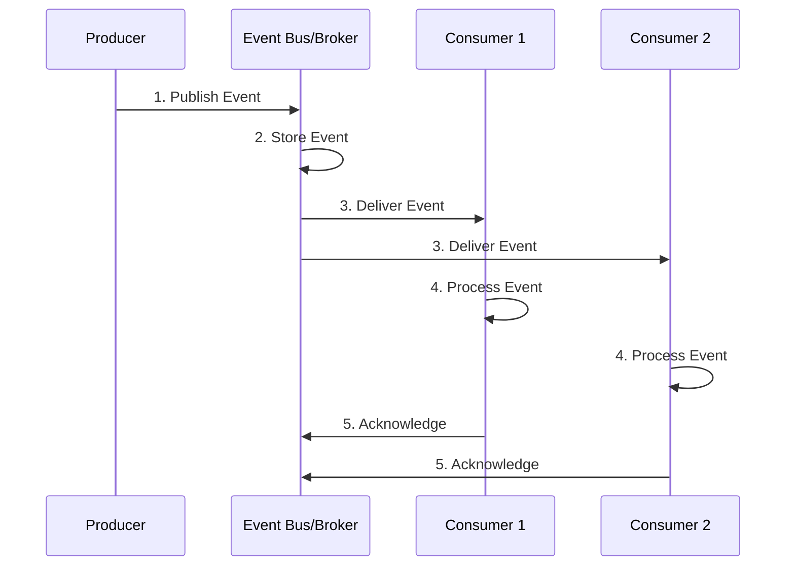

### Flow Steps

1. **Event Generation**: Producer detects a state change or action and creates an event
2. **Event Publication**: Producer publishes the event to the event bus/broker
3. **Event Storage**: Event bus persists the event (optional, depends on broker)
4. **Event Routing**: Event bus routes the event to all interested subscribers
5. **Event Delivery**: Consumers receive the event asynchronously
6. **Event Processing**: Each consumer processes the event independently
7. **Acknowledgment**: Consumers acknowledge successful processing

---

## Publish-Subscribe Pattern

In this pattern, multiple consumers can subscribe to the same event type, enabling one-to-many communication.

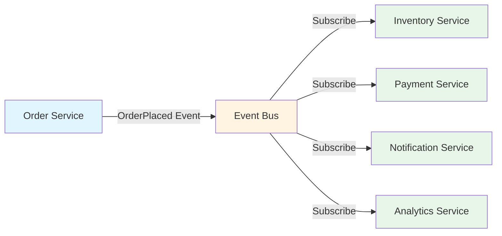

### Characteristics

- **Decoupled**: Producers don't know about consumers
- **Scalable**: Easy to add new subscribers
- **Flexible**: Each consumer can process events differently
- **Parallel Processing**: All consumers receive events simultaneously

### Example Flow: E-commerce Order

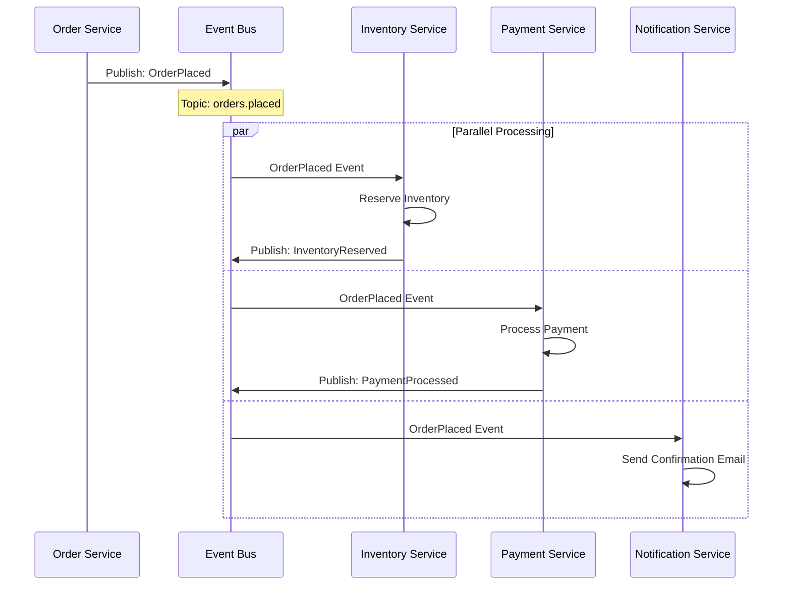

---

## Point-to-Point Pattern

In this pattern, each event is consumed by exactly one consumer, typically used for work distribution.

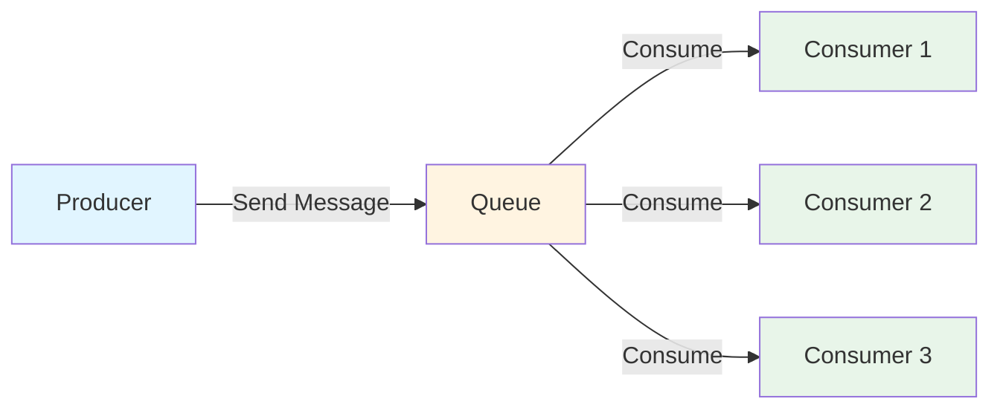

### Load Balancing Example

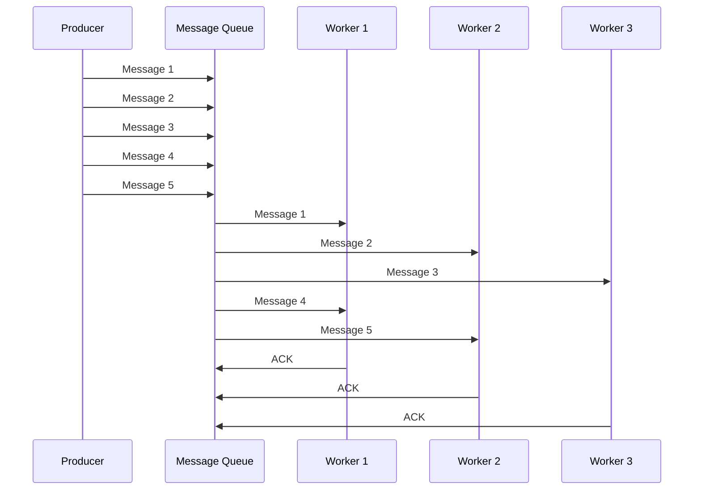

---

## Event Streaming Flow

Event streaming involves continuous processing of events as they arrive, often with the ability to replay events.

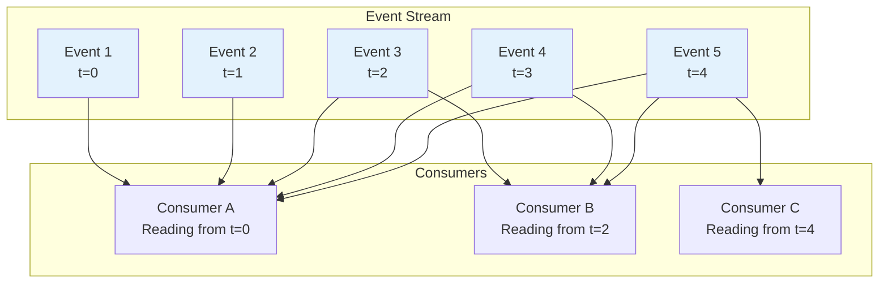

### Stream Processing Flow

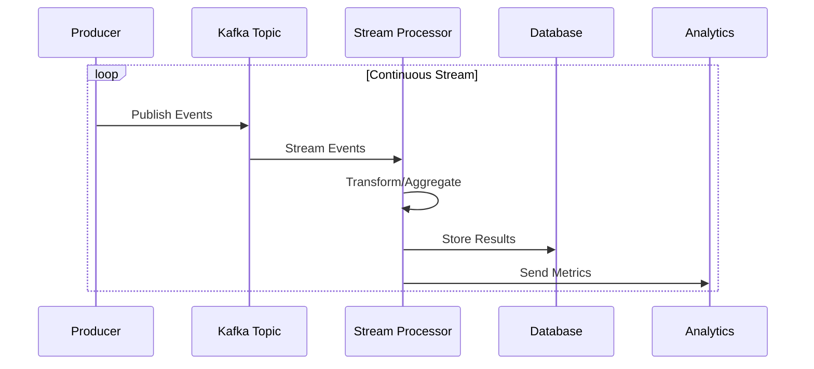

---

## Error Handling and Retry Flow

Robust error handling is crucial in event-driven systems. This includes retry mechanisms and dead letter queues.

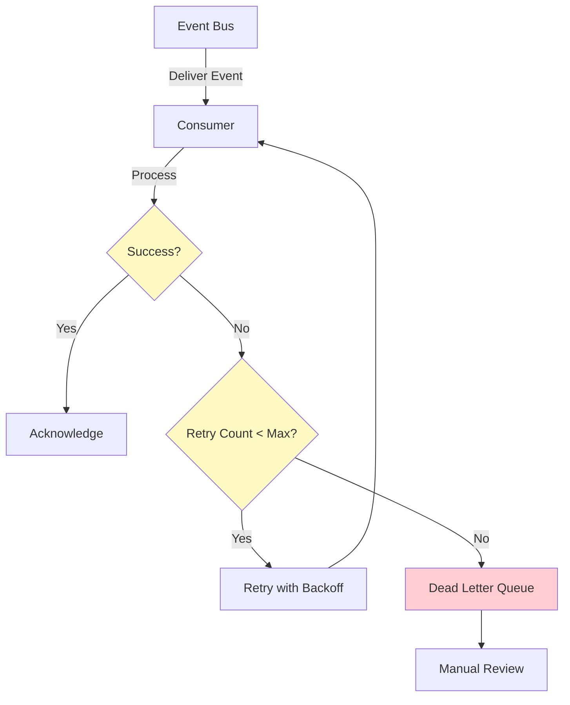

### Detailed Retry Flow

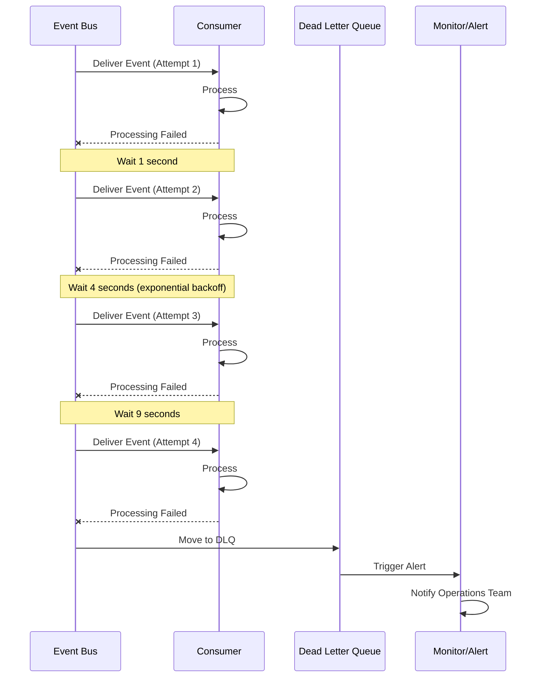

### Circuit Breaker Pattern

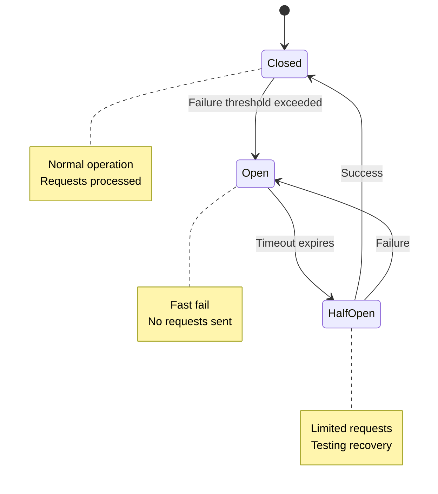

---

## Complex Multi-Service Flow

Real-world scenarios often involve multiple services coordinating through events.

### E-commerce Order Processing

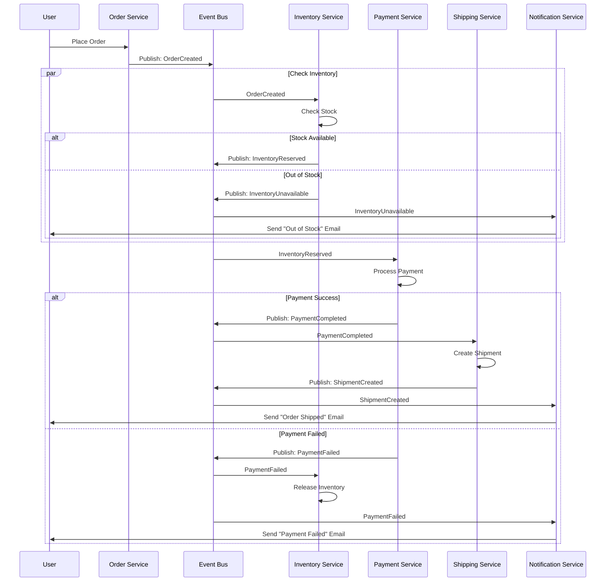

---

## Event Choreography

In choreography, services react to events without a central coordinator. Each service knows what to do when specific events occur.

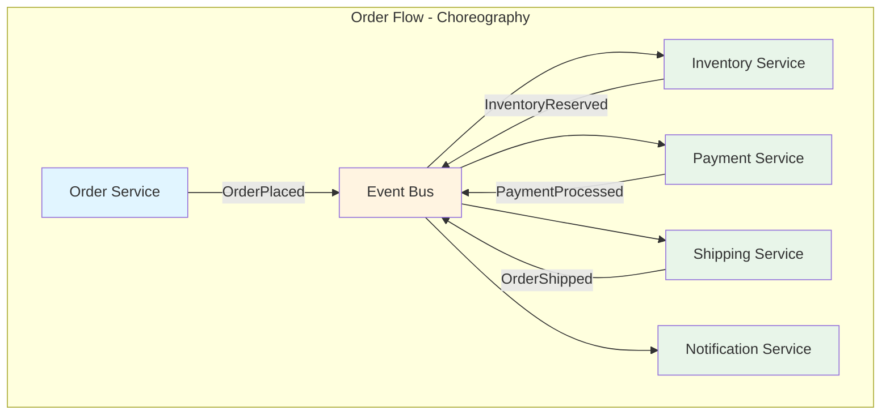

### Characteristics

- **Decentralized**: No single point of control
- **Loosely Coupled**: Services don't know about each other
- **Flexible**: Easy to add new services
- **Complex**: Can be difficult to understand overall flow

---

## Event Orchestration

In orchestration, a central orchestrator manages the workflow and tells services what to do.

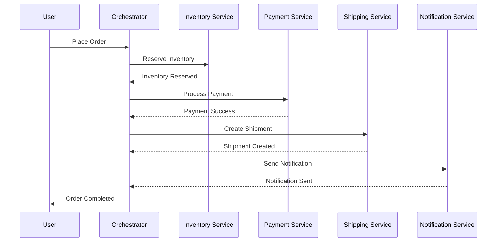

### Orchestration with Saga Pattern

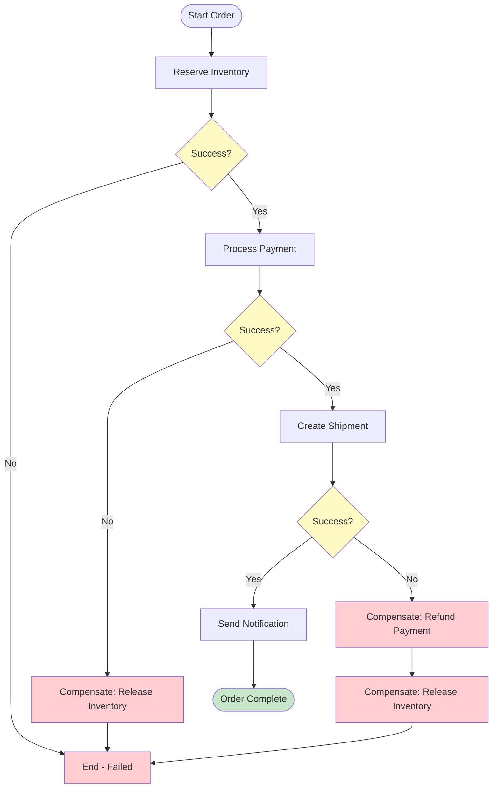

---

## Event Sourcing Integration

When combining event-driven architecture with event sourcing, events become the source of truth.

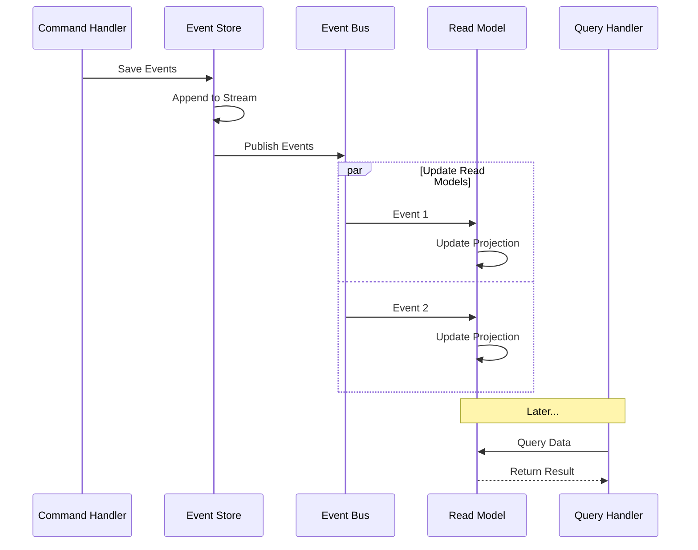

### Event Store Structure

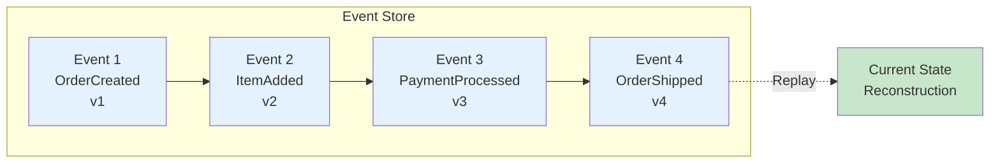

---

## Key Takeaways

### Flow Principles

1. **Asynchronous Communication**: Events are processed independently
2. **Loose Coupling**: Producers and consumers don't depend on each other
3. **Scalability**: Add consumers without modifying producers
4. **Resilience**: Failed consumers don't affect others
5. **Flexibility**: Change event handlers without affecting producers

### Best Practices

- **Event Naming**: Use past tense (OrderCreated, PaymentProcessed)
- **Event Size**: Keep events small and focused
- **Idempotency**: Handle duplicate events gracefully
- **Ordering**: Don't rely on strict ordering unless necessary
- **Monitoring**: Track event flow and processing times

### Common Pitfalls

- **Event Chain Complexity**: Too many chained events become hard to debug
- **Missing Error Handling**: Always plan for failures
- **Tight Coupling**: Events with too much detail couple services
- **Lost Events**: Ensure reliable delivery and persistence
- **Version Management**: Plan for event schema evolution

---

## Related Documentation

- [README.md](./readme.md) - Overview of Event-Driven Architecture
- [pros-cons.md](./pros-cons.md) - Advantages and disadvantages
- [use-cases.md](./use-cases.md) - Real-world implementation examples