# Event-Driven Architecture: Use Cases and Real-World Examples

## Overview

This document explores real-world applications of Event-Driven Architecture across various industries and domains. Each use case includes implementation details, event flows, and practical considerations.

---

## Table of Contents

1. [E-Commerce and Retail](#e-commerce-and-retail)
2. [Financial Services](#financial-services)
3. [Social Media and Content Platforms](#social-media-and-content-platforms)
4. [IoT and Smart Devices](#iot-and-smart-devices)
5. [Healthcare](#healthcare)
6. [Logistics and Supply Chain](#logistics-and-supply-chain)
7. [Gaming](#gaming)
8. [Streaming and Media](#streaming-and-media)
9. [Enterprise Systems](#enterprise-systems)
10. [Telecommunications](#telecommunications)

---

## E-Commerce and Retail

### Use Case 1: Order Processing Pipeline

**Scenario**: A customer places an order that needs to go through multiple stages: validation, payment, inventory management, shipping, and notifications.

**Event Flow**:

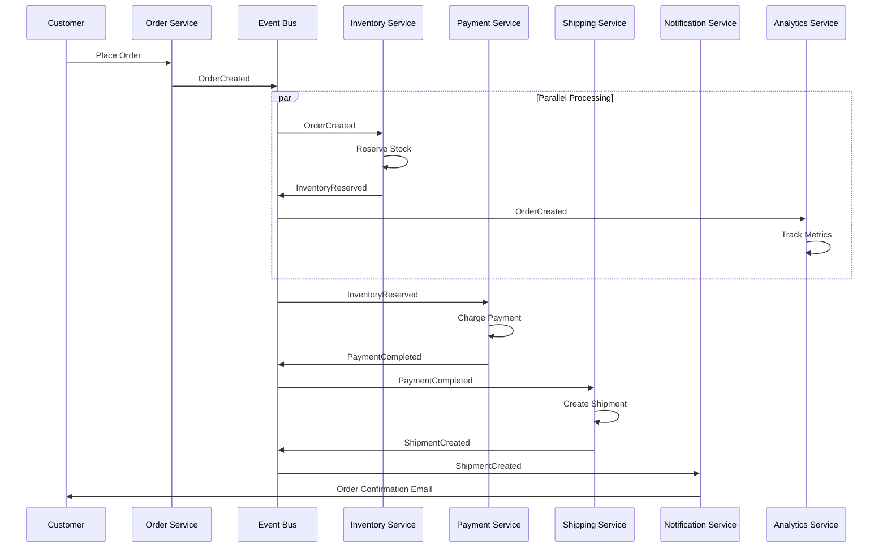

**Key Events**:
- `OrderCreated`
- `InventoryReserved`
- `PaymentCompleted`
- `ShipmentCreated`
- `OrderDelivered`
- `OrderCancelled`

**Benefits**:
- Each service scales independently
- Failed payment doesn't affect inventory check
- Easy to add new features (fraud detection, recommendations)
- Complete audit trail of order lifecycle

**Implementation Example**:

```json
{
  "eventId": "evt_order_123456",
  "eventType": "OrderCreated",
  "timestamp": "2025-12-28T10:30:00Z",
  "version": "1.0",
  "data": {
    "orderId": "ORD-2025-001",
    "customerId": "CUST-789",
    "items": [
      {
        "productId": "PROD-456",
        "quantity": 2,
        "price": 29.99,
        "name": "Wireless Mouse"
      }
    ],
    "totalAmount": 59.98,
    "currency": "USD",
    "shippingAddress": {
      "street": "123 Main St",
      "city": "San Francisco",
      "state": "CA",
      "zipCode": "94105"
    }
  },
  "metadata": {
    "correlationId": "corr-abc-123",
    "source": "order-service",
    "userId": "user-789"
  }
}
```

---

### Use Case 2: Inventory Management

**Scenario**: Real-time inventory updates across multiple warehouses and sales channels.

**Event Flow**:

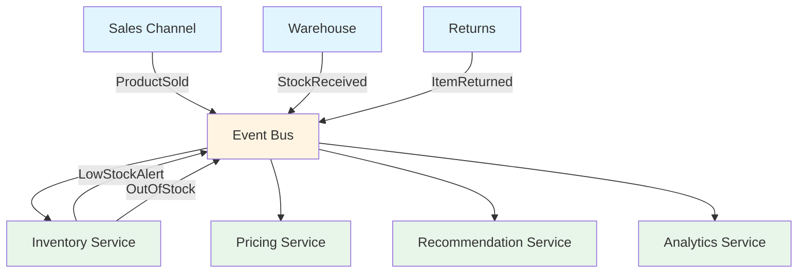

**Key Events**:
- `StockUpdated`
- `LowStockAlert`
- `OutOfStock`
- `StockReplenished`
- `ItemReturned`

**Benefits**:
- Real-time stock visibility across channels
- Automatic reordering triggers
- Prevents overselling
- Multi-warehouse coordination

---

### Use Case 3: Dynamic Pricing

**Scenario**: Adjust product prices based on demand, inventory, competitor pricing, and customer behavior.

**Key Events**:
- `InventoryLevelChanged`
- `CompetitorPriceUpdated`
- `DemandSpikeDetected`
- `CustomerSegmentIdentified`
- `PriceAdjusted`

**Event-Driven Benefits**:
- React to market changes in real-time
- A/B testing price strategies
- Personalized pricing
- Automatic markdown strategies

---

## Financial Services

### Use Case 4: Real-Time Fraud Detection

**Scenario**: Monitor transactions in real-time and flag suspicious activities.

**Event Flow**:

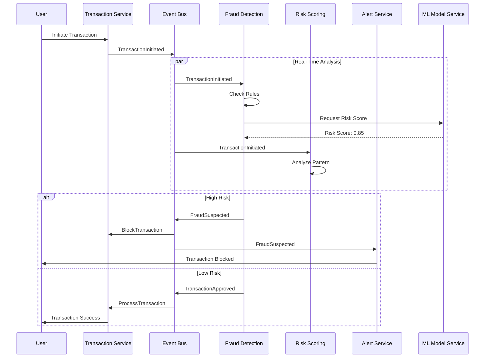

**Key Events**:
- `TransactionInitiated`
- `FraudSuspected`
- `TransactionBlocked`
- `TransactionApproved`
- `UnusualPatternDetected`
- `AccountFrozen`

**Implementation Details**:

```javascript
// Fraud Detection Rules
const fraudRules = {
  highValueTransaction: (amount) => amount > 10000,
  unusualLocation: (location, history) => !history.includes(location),
  rapidTransactions: (count, timeWindow) => count > 5 && timeWindow < 300,
  velocityCheck: (amount, dailyLimit) => amount > dailyLimit
};

// Event Handler
async function handleTransactionEvent(event) {
  const riskScore = await calculateRiskScore(event);
  
  if (riskScore > 0.8) {
    await publishEvent({
      type: 'FraudSuspected',
      transactionId: event.transactionId,
      riskScore: riskScore,
      reasons: ['high_value', 'unusual_location']
    });
  }
}
```

**Benefits**:
- Real-time fraud prevention
- Reduced false positives with ML
- Complete transaction history
- Compliance and audit trail

---

### Use Case 5: Payment Processing

**Scenario**: Process payments across multiple providers with retry logic and reconciliation.

**Key Events**:
- `PaymentRequested`
- `PaymentAuthorized`
- `PaymentCaptured`
- `PaymentFailed`
- `RefundRequested`
- `RefundCompleted`
- `PaymentReconciled`

**Event Flow for Failed Payment**:

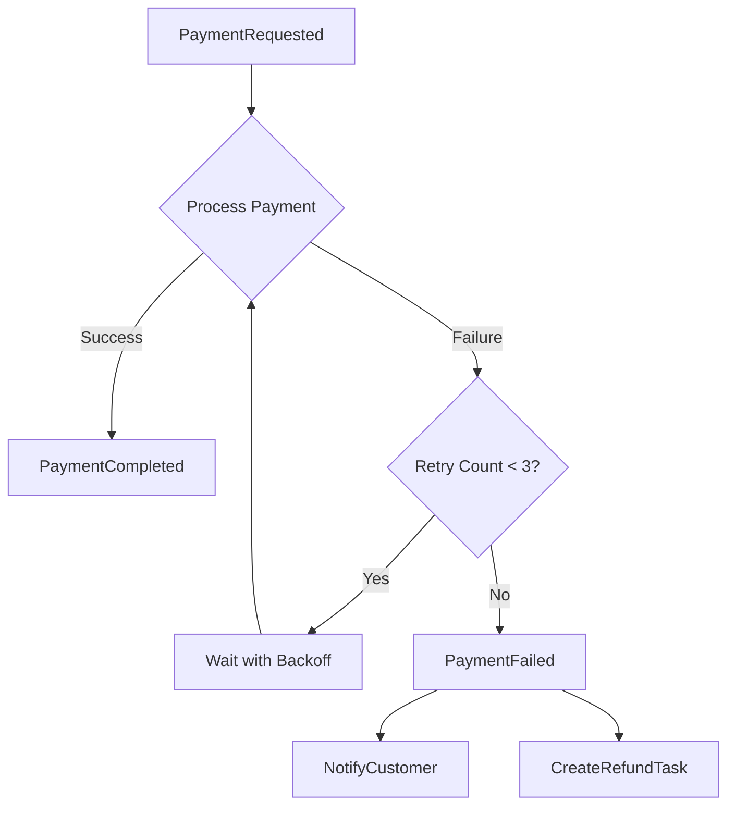

---

### Use Case 6: Trading Platform

**Scenario**: High-frequency trading system with order matching and execution.

**Key Events**:
- `OrderPlaced`
- `OrderMatched`
- `TradeExecuted`
- `PositionUpdated`
- `MarketDataUpdated`
- `RiskLimitBreached`

**Characteristics**:
- Ultra-low latency requirements
- High throughput (millions of events/second)
- Strict ordering guarantees
- Real-time risk management

---

## Social Media and Content Platforms

### Use Case 7: Activity Feed Generation

**Scenario**: Generate personalized feeds for users based on their network's activities.

**Event Flow**:

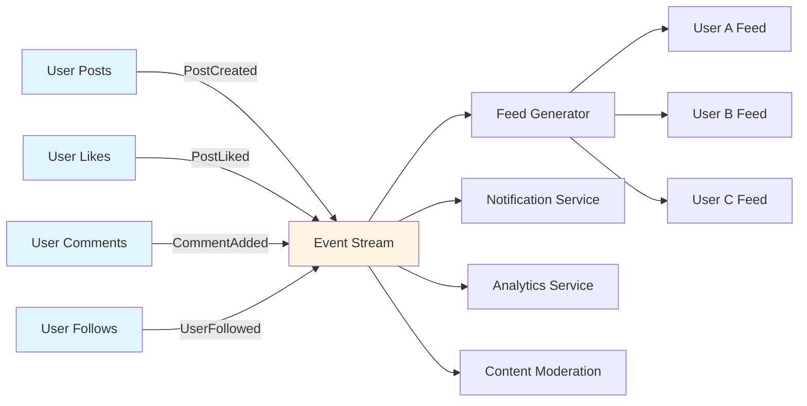

**Key Events**:
- `PostCreated`
- `PostLiked`
- `PostShared`
- `CommentAdded`
- `UserFollowed`
- `UserMentioned`

**Implementation Approach**:

```javascript
// Fan-out pattern for notifications
async function handlePostCreated(event) {
  const followers = await getFollowers(event.userId);
  
  // Generate events for each follower
  for (const follower of followers) {
    await publishEvent({
      type: 'FeedItemAdded',
      userId: follower.id,
      postId: event.postId,
      timestamp: event.timestamp
    });
  }
}
```

**Benefits**:
- Real-time feed updates
- Personalized content delivery
- Scalable to millions of users
- Easy to add new feed algorithms

---

### Use Case 8: Content Moderation

**Scenario**: Automatically detect and moderate inappropriate content.

**Key Events**:
- `ContentSubmitted`
- `ModerationRequired`
- `ContentApproved`
- `ContentRejected`
- `AppealSubmitted`
- `AppealReviewed`

**Event Flow**:

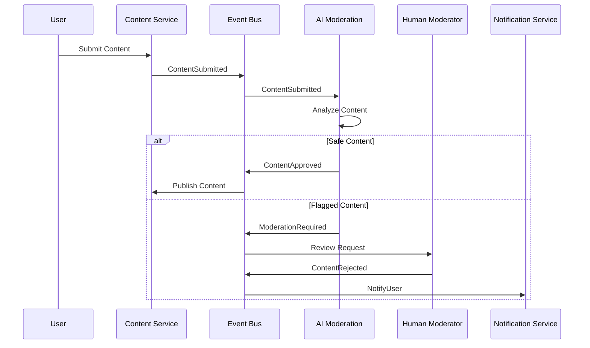

---

### Use Case 9: Notification System

**Scenario**: Multi-channel notification delivery (email, SMS, push, in-app).

**Key Events**:
- `UserMentioned`
- `MessageReceived`
- `PostLiked`
- `FriendRequestReceived`
- `EventReminder`

**Multi-Channel Delivery**:

```javascript
async function handleNotificationEvent(event) {
  const userPreferences = await getUserPreferences(event.userId);
  
  const channels = [];
  if (userPreferences.email) channels.push('email');
  if (userPreferences.push) channels.push('push');
  if (userPreferences.sms) channels.push('sms');
  
  for (const channel of channels) {
    await publishEvent({
      type: `SendNotification`,
      channel: channel,
      userId: event.userId,
      message: event.message,
      priority: event.priority
    });
  }
}
```

---

## IoT and Smart Devices

### Use Case 10: Smart Home Automation

**Scenario**: Coordinate multiple IoT devices based on sensor data and user preferences.

**Event Flow**:

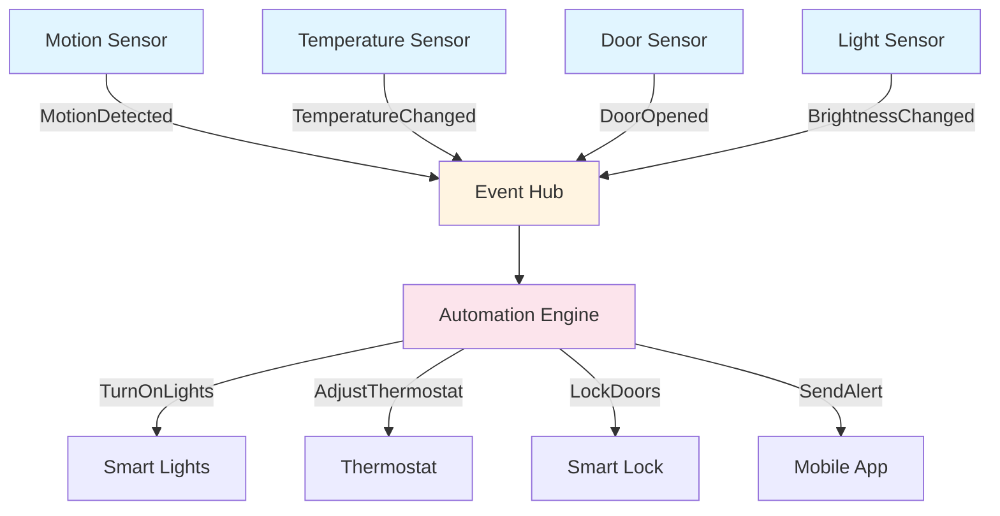

**Key Events**:
- `MotionDetected`
- `TemperatureChanged`
- `DoorOpened`
- `WindowBroken`
- `SmokeDetected`
- `PowerOutage`

**Automation Rules**:

```javascript
// Event-driven automation rules
const automationRules = [
  {
    trigger: 'MotionDetected',
    conditions: [
      { type: 'time', value: 'after_sunset' },
      { type: 'brightness', operator: '<', value: 30 }
    ],
    actions: [
      { device: 'living_room_lights', action: 'turn_on', brightness: 70 }
    ]
  },
  {
    trigger: 'DoorOpened',
    conditions: [
      { type: 'alarm_status', value: 'armed' }
    ],
    actions: [
      { device: 'siren', action: 'activate' },
      { service: 'notification', action: 'send_alert' }
    ]
  }
];
```

**Benefits**:
- Real-time device coordination
- Complex automation scenarios
- Energy optimization
- Security monitoring

---

### Use Case 11: Industrial IoT Monitoring

**Scenario**: Monitor factory equipment and predict maintenance needs.

**Key Events**:
- `SensorReadingReceived`
- `AnomalyDetected`
- `MaintenanceRequired`
- `EquipmentFailure`
- `ProductionCompleted`
- `QualityCheckFailed`

**Predictive Maintenance Flow**:

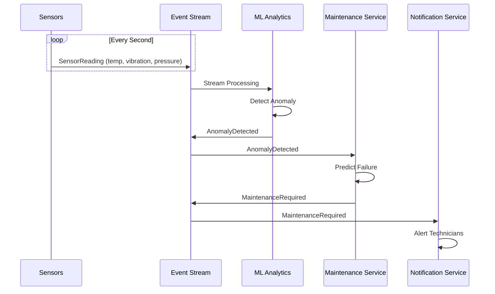

**Benefits**:
- Prevent unexpected downtime
- Optimize maintenance schedules
- Reduce equipment failures
- Cost savings

---

## Healthcare

### Use Case 12: Patient Monitoring System

**Scenario**: Real-time monitoring of patient vital signs with automatic alerting.

**Key Events**:
- `VitalSignsRecorded`
- `AbnormalReadingDetected`
- `CriticalConditionAlert`
- `MedicationAdministered`
- `PatientAdmitted`
- `PatientDischarged`

**Event Flow**:

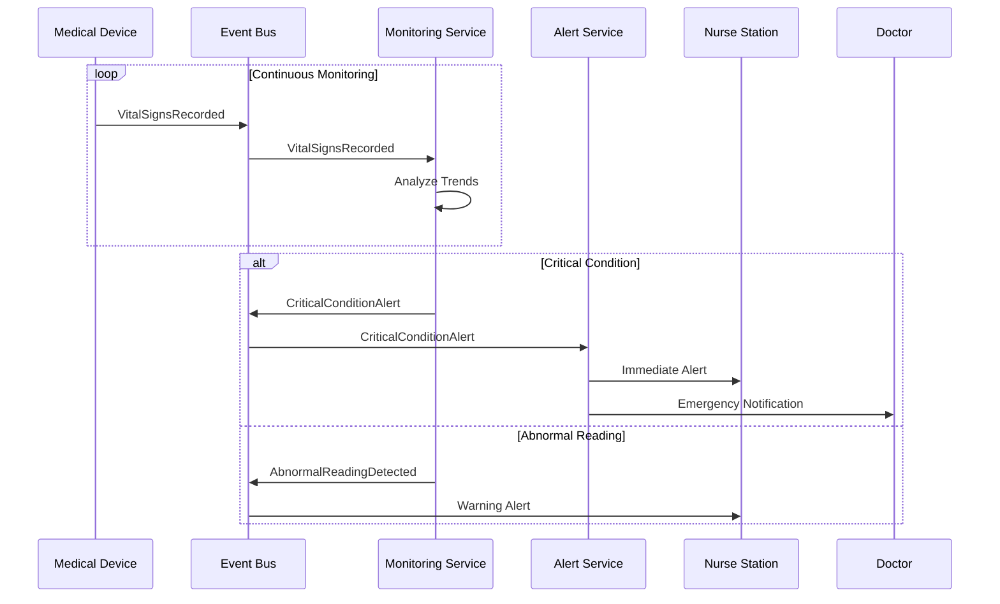

**Benefits**:
- Real-time patient safety
- Reduced response time
- Complete medical history
- Compliance with regulations (HIPAA)

---

### Use Case 13: Hospital Resource Management

**Scenario**: Manage beds, equipment, and staff allocation across hospital.

**Key Events**:
- `BedOccupied`
- `BedAvailable`
- `EquipmentRequested`
- `EquipmentReturned`
- `StaffShiftChanged`
- `EmergencyDeclared`

---

## Logistics and Supply Chain

### Use Case 14: Package Tracking System

**Scenario**: Track packages through entire delivery lifecycle.

**Event Flow**:

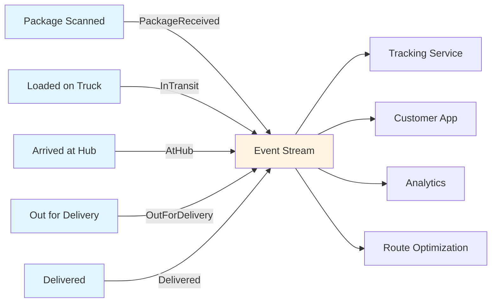

**Key Events**:
- `PackageReceived`
- `PackageScanned`
- `InTransit`
- `AtHub`
- `OutForDelivery`
- `Delivered`
- `DeliveryFailed`
- `ReturnInitiated`

**Implementation Example**:

```json
{
  "eventType": "PackageScanned",
  "timestamp": "2025-12-28T14:23:45Z",
  "data": {
    "trackingNumber": "1Z999AA10123456784",
    "location": {
      "facilityId": "HUB-SF-01",
      "address": "123 Warehouse Ln, San Francisco, CA",
      "coordinates": {
        "lat": 37.7749,
        "lon": -122.4194
      }
    },
    "status": "IN_TRANSIT",
    "nextDestination": "HUB-LA-03",
    "estimatedDelivery": "2025-12-30T10:00:00Z"
  }
}
```

**Benefits**:
- Real-time tracking visibility
- Proactive delay notifications
- Route optimization
- Customer satisfaction

---

### Use Case 15: Fleet Management

**Scenario**: Manage delivery fleet with route optimization and real-time tracking.

**Key Events**:
- `VehicleDeparted`
- `RouteDeviation`
- `DeliveryCompleted`
- `VehicleMaintenanceNeeded`
- `TrafficDelayDetected`
- `FuelLevelLow`

---

## Gaming

### Use Case 16: Multiplayer Game Events

**Scenario**: Real-time game state synchronization across players.

**Key Events**:
- `PlayerJoined`
- `PlayerMoved`
- `ItemCollected`
- `EnemyDefeated`
- `ScoreUpdated`
- `GameEnded`
- `AchievementUnlocked`

**Event Flow**:

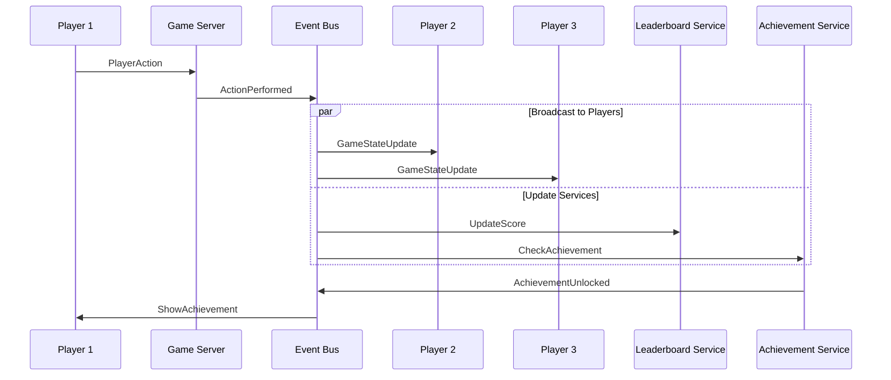

**Benefits**:
- Low-latency state synchronization
- Scalable to millions of players
- Easy to add game features
- Analytics and player behavior tracking

---

### Use Case 17: Matchmaking System

**Scenario**: Match players based on skill level, preferences, and availability.

**Key Events**:
- `PlayerQueuedForMatch`
- `MatchFound`
- `GameStarted`
- `PlayerDisconnected`
- `MatchCancelled`
- `RatingUpdated`

---

## Streaming and Media

### Use Case 18: Video Streaming Platform

**Scenario**: Process video uploads, transcode, and deliver content.

**Event Flow**:

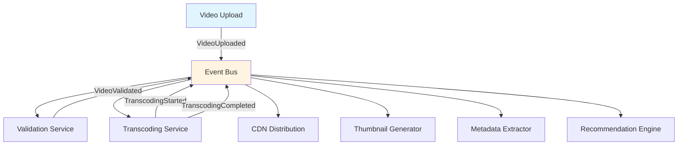

**Key Events**:
- `VideoUploaded`
- `VideoValidated`
- `TranscodingStarted`
- `TranscodingCompleted`
- `ThumbnailGenerated`
- `VideoPublished`
- `VideoWatched`
- `VideoLiked`

**Benefits**:
- Parallel video processing
- Scalable transcoding pipeline
- Real-time analytics
- Content recommendation

---

### Use Case 19: Live Streaming

**Scenario**: Real-time broadcasting with viewer interactions.

**Key Events**:
- `StreamStarted`
- `ViewerJoined`
- `ChatMessageSent`
- `DonationReceived`
- `StreamEnded`
- `SubscriptionPurchased`

---

## Enterprise Systems

### Use Case 20: Customer Relationship Management (CRM)

**Scenario**: Track customer interactions across multiple touchpoints.

**Key Events**:
- `CustomerCreated`
- `LeadGenerated`
- `EmailSent`
- `PhoneCallMade`
- `MeetingScheduled`
- `DealClosed`
- `SupportTicketCreated`
- `CustomerChurnPredicted`

**Event Flow**:

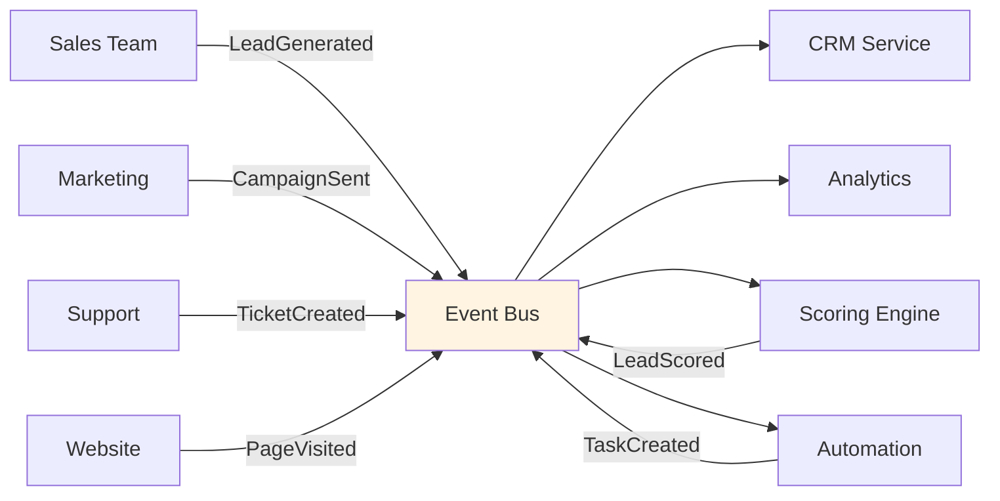

**Benefits**:
- 360-degree customer view
- Automated workflows
- Lead scoring and prioritization
- Sales pipeline visibility

---

### Use Case 21: Employee Onboarding

**Scenario**: Automate employee onboarding process across multiple departments.

**Key Events**:
- `EmployeeHired`
- `DocumentsSigned`
- `AccountsCreated`
- `EquipmentOrdered`
- `TrainingScheduled`
- `OnboardingCompleted`

**Automated Workflow**:

```javascript
// Onboarding orchestration
async function handleEmployeeHired(event) {
  const employee = event.data;
  
  // Trigger parallel tasks
  await publishEvents([
    { type: 'CreateITAccounts', employeeId: employee.id },
    { type: 'OrderEquipment', employeeId: employee.id },
    { type: 'ScheduleOrientation', employeeId: employee.id },
    { type: 'AssignBuddy', employeeId: employee.id },
    { type: 'SetupPayroll', employeeId: employee.id }
  ]);
}
```

---

## Telecommunications

### Use Case 22: Network Monitoring and Alerting

**Scenario**: Monitor network infrastructure and respond to issues.

**Key Events**:
- `NetworkLatencyHigh`
- `ServerDown`
- `BandwidthThresholdExceeded`
- `SecurityThreatDetected`
- `ServiceDegraded`
- `FailoverTriggered`

**Event Flow**:

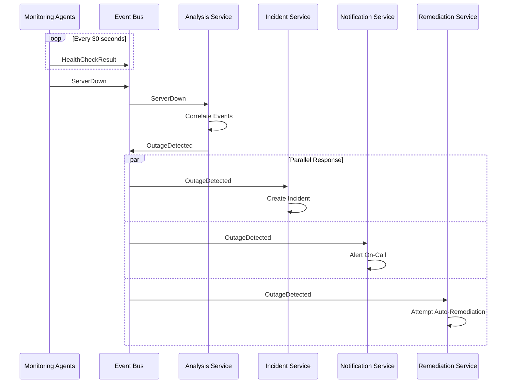

---

### Use Case 23: Call Detail Record (CDR) Processing

**Scenario**: Process millions of call records for billing and analytics.

**Key Events**:
- `CallStarted`
- `CallEnded`
- `SMSSent`
- `DataSessionStarted`
- `RoamingChargeApplied`

---

## Additional Use Cases Summary

### Education
- **Student Progress Tracking**: `AssignmentSubmitted`, `GradePosted`, `CertificateEarned`
- **Virtual Classroom**: `StudentJoined`, `QuestionAsked`, `PollCreated`

### Travel and Hospitality
- **Booking System**: `ReservationCreated`, `PaymentReceived`, `BookingConfirmed`
- **Flight Status**: `FlightDelayed`, `GateChanged`, `BoardingStarted`

### Manufacturing
- **Production Line**: `JobStarted`, `QualityCheckPassed`, `BatchCompleted`
- **Supply Chain**: `RawMaterialOrdered`, `InventoryLevelLow`, `ShipmentReceived`

### Government
- **Citizen Services**: `ApplicationSubmitted`, `DocumentVerified`, `PermitIssued`
- **Emergency Response**: `EmergencyReported`, `ResourcesDispatched`, `IncidentResolved`

---

## Implementation Patterns Across Use Cases

### Common Event Patterns

1. **Command Events**: Request an action
   - `CreateOrder`, `ProcessPayment`, `SendNotification`

2. **Domain Events**: State changes that occurred
   - `OrderCreated`, `PaymentProcessed`, `NotificationSent`

3. **Integration Events**: Events for external systems
   - `CustomerDataSynced`, `InventoryExported`

4. **System Events**: Infrastructure-level events
   - `ServiceStarted`, `HealthCheckFailed`, `DeploymentCompleted`

---

## Selection Criteria by Use Case

| Use Case Type | EDA Suitability | Key Benefits |
|---------------|-----------------|--------------|
| E-Commerce | ⭐⭐⭐⭐⭐ | Scalability, flexibility, real-time |
| Financial | ⭐⭐⭐⭐⭐ | Audit trail, fraud detection, compliance |
| Social Media | ⭐⭐⭐⭐⭐ | Real-time feeds, notifications, scale |
| IoT | ⭐⭐⭐⭐⭐ | High throughput, device coordination |
| Healthcare | ⭐⭐⭐⭐ | Real-time monitoring, compliance |
| Logistics | ⭐⭐⭐⭐⭐ | Tracking, optimization, visibility |
| Gaming | ⭐⭐⭐⭐ | Low latency, state sync, scale |
| Streaming | ⭐⭐⭐⭐⭐ | Content processing, analytics |
| Enterprise | ⭐⭐⭐⭐ | Integration, automation, workflows |
| Telecom | ⭐⭐⭐⭐⭐ | High throughput, monitoring, billing |

---

## Key Success Factors

### For All Use Cases

1. **Clear Event Contracts**: Well-defined event schemas
2. **Monitoring**: Comprehensive observability setup
3. **Error Handling**: Robust retry and compensation logic
4. **Testing Strategy**: Integration and chaos testing
5. **Documentation**: Architecture diagrams and event catalogs
6. **Team Training**: Distributed systems expertise
7. **Operational Excellence**: On-call, runbooks, disaster recovery

---

## Related Documentation

- [README.md](./readme.md) - Overview of Event-Driven Architecture
- [architecture-flow.md](./architecture-flow.md) - Detailed event flow diagrams
- [pros-cons.md](./pros-cons.md) - Advantages and disadvantages analysis