# Microservices Communication Patterns

## Table of Contents
1. [Introduction](#introduction)
2. [Communication Styles](#communication-styles)
3. [Synchronous Communication](#synchronous-communication)
4. [Asynchronous Communication](#asynchronous-communication)
5. [Communication Protocols](#communication-protocols)
6. [Design Patterns](#design-patterns)
7. [Best Practices](#best-practices)
8. [Trade-offs and Considerations](#trade-offs-and-considerations)
9. [References](#references)

---

## Introduction

In a microservices architecture, services need to communicate with each other to fulfill business requirements. Unlike monolithic applications where components communicate through in-process calls, microservices communicate over the network, introducing complexity in terms of reliability, latency, and failure handling.

This document explores various communication patterns, their implementations, trade-offs, and best practices. For a comprehensive overview of microservices architecture, refer to [readme.md](./readme.md). For service discovery mechanisms, see [service-registry.md](./service-registry.md).

### Key Considerations

- **Reliability**: Network calls can fail
- **Latency**: Network communication is slower than in-process calls
- **Serialization**: Data must be serialized/deserialized
- **Versioning**: Services may evolve independently
- **Security**: Communication must be secured

---

## Communication Styles

Microservices can communicate in two fundamental styles:

### 1. Synchronous Communication

The client sends a request and waits for a response from the service. The client cannot proceed until it receives a response or the request times out.

**Characteristics:**
- Blocking operation
- Immediate response expected
- Tight temporal coupling
- Request-Response pattern

### 2. Asynchronous Communication

The client sends a request and continues processing without waiting for an immediate response. The service processes the request and may respond later through callbacks, events, or messages.

**Characteristics:**
- Non-blocking operation
- Eventual response or no response
- Loose temporal coupling
- Fire-and-forget or Event-driven patterns

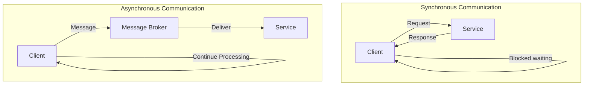

---

## Synchronous Communication

### REST (Representational State Transfer)

REST is the most common synchronous communication protocol in microservices architecture.

**Characteristics:**
- HTTP-based protocol
- Resource-oriented design
- Stateless communication
- Standard HTTP methods (GET, POST, PUT, DELETE, PATCH)
- Human-readable format (JSON, XML)

**Example Flow:**

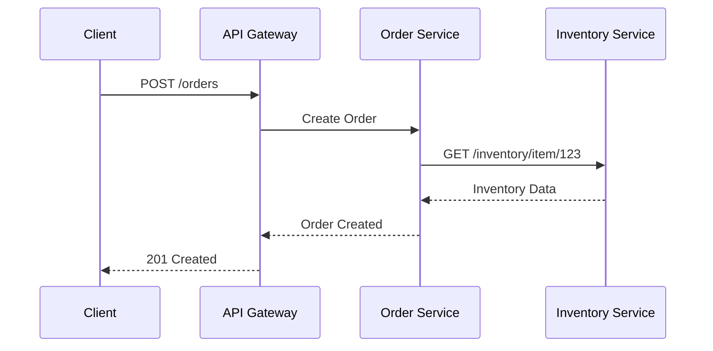

**Advantages:**
- Simple and widely understood
- Language agnostic
- Easy to debug and test
- Extensive tooling support
- Cacheable responses

**Disadvantages:**
- Higher latency compared to binary protocols
- Larger payload size
- Limited streaming capabilities
- HTTP overhead

**Best Use Cases:**
- Public APIs
- CRUD operations
- Simple request-response scenarios
- When human readability is important

### gRPC (gRPC Remote Procedure Call)

gRPC is a high-performance, open-source RPC framework developed by Google.

**Characteristics:**
- Uses Protocol Buffers (protobuf) for serialization
- HTTP/2 based
- Supports bi-directional streaming
- Strongly typed contracts
- Efficient binary protocol

**Example Service Definition:**

```protobuf
syntax = "proto3";

service OrderService {
  rpc CreateOrder (OrderRequest) returns (OrderResponse);
  rpc GetOrder (OrderId) returns (Order);
  rpc StreamOrders (Empty) returns (stream Order);
}

message OrderRequest {
  string customer_id = 1;
  repeated OrderItem items = 2;
}
```

**Communication Flow:**

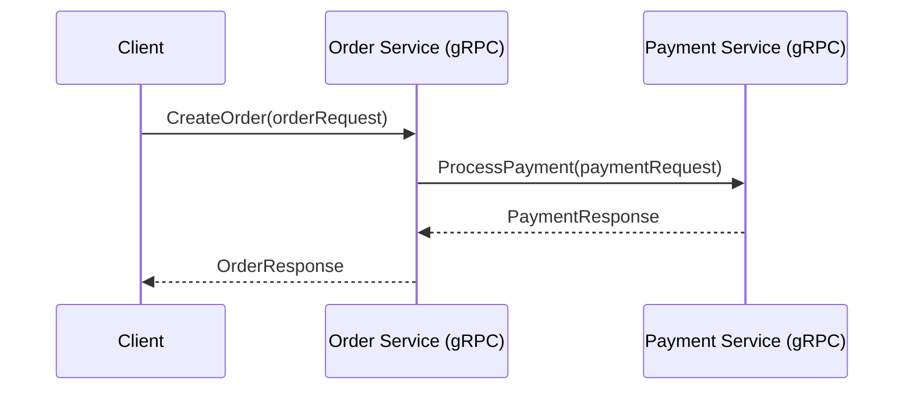

**Advantages:**
- High performance (smaller payload, faster serialization)
- Bi-directional streaming
- Built-in code generation
- Strong typing and contract-first design
- Multiplexing over single TCP connection

**Disadvantages:**
- Limited browser support
- Less human-readable
- Steeper learning curve
- Requires HTTP/2 infrastructure

**Best Use Cases:**
- Internal service-to-service communication
- Real-time communication
- Polyglot environments
- High-performance requirements

### GraphQL

GraphQL provides a query language for APIs, allowing clients to request exactly what they need.

**Characteristics:**
- Single endpoint
- Client-defined queries
- Reduces over-fetching and under-fetching
- Strong typing with schema
- Introspection capabilities

**Advantages:**
- Flexible data retrieval
- Reduces number of requests
- Self-documenting
- Versioning not required

**Disadvantages:**
- Complex caching
- Potential for expensive queries
- Requires resolver implementation
- Query complexity management needed

---

## Asynchronous Communication

### Message Queue Pattern

Message queues enable asynchronous communication through a message broker that stores messages until they are processed.

**Architecture:**

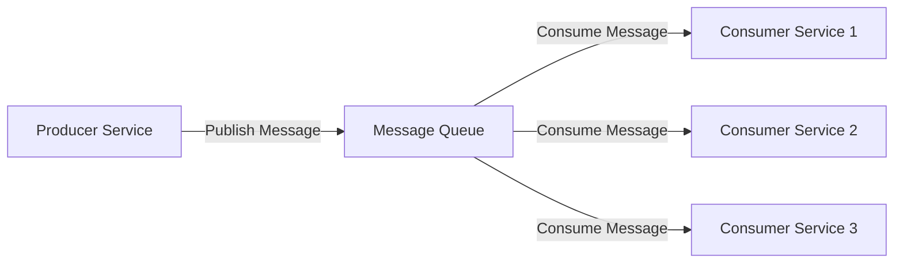

**Common Message Brokers:**
- **RabbitMQ**: AMQP-based, reliable, supports complex routing
- **Apache Kafka**: High-throughput, distributed streaming platform
- **AWS SQS/SNS**: Managed cloud services
- **Azure Service Bus**: Enterprise messaging service
- **Redis Streams**: Lightweight streaming solution

**Message Queue Patterns:**

#### 1. Point-to-Point (Queue)

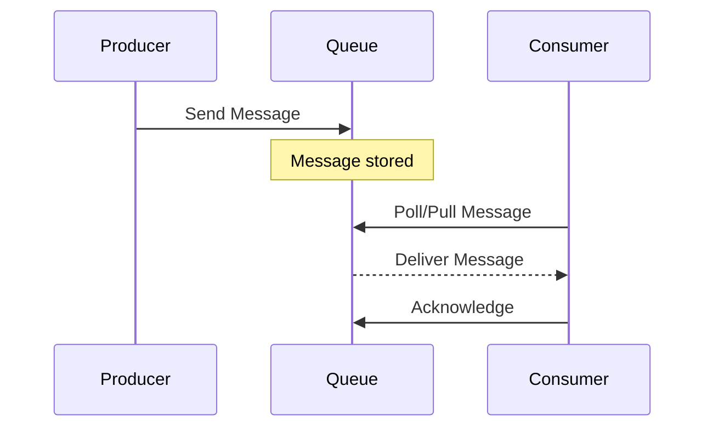

**Characteristics:**
- One message, one consumer
- Message deleted after consumption
- Load balancing across consumers

#### 2. Publish-Subscribe (Topic)

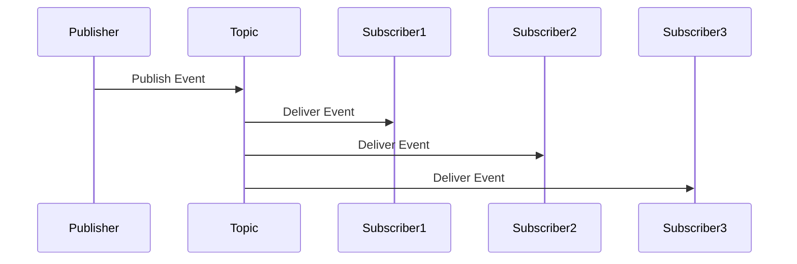

**Characteristics:**
- One message, multiple consumers
- Message broadcast to all subscribers
- Decoupled publishers and subscribers

### Event-Driven Architecture

Event-driven architecture is a pattern where services communicate through events representing state changes. For detailed patterns, see the [event-driven](../event-driven/) documentation.

**Event Types:**

1. **Domain Events**: Business-significant occurrences (OrderPlaced, PaymentCompleted)
2. **Integration Events**: Cross-service communication events
3. **System Events**: Technical events (ServiceStarted, ConfigChanged)

**Event Flow:**

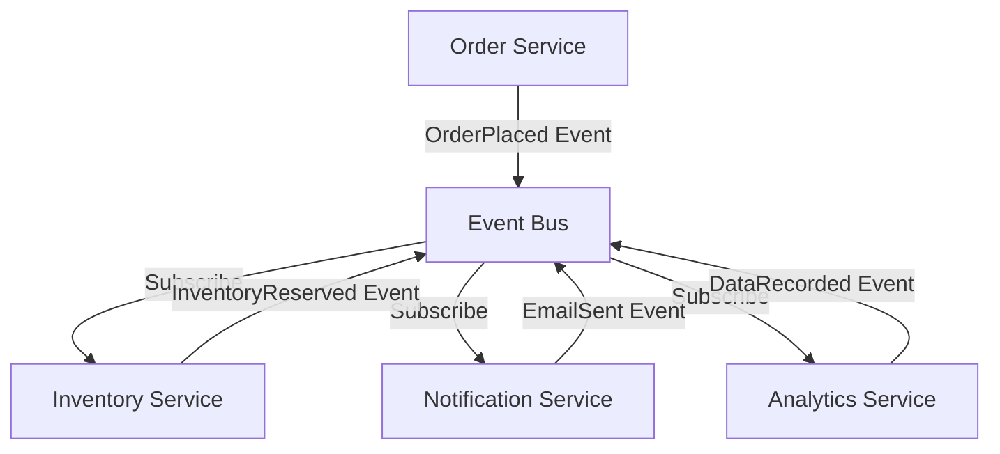

**Event Sourcing Pattern:**

For comprehensive coverage of event sourcing, refer to [event-sourcing](../event-sourcing/) documentation.

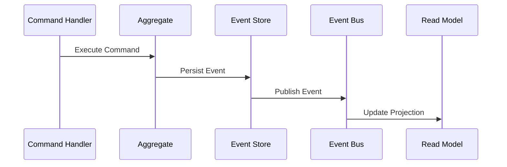

**Advantages of Asynchronous Communication:**
- Loose coupling between services
- Better fault tolerance
- Improved scalability
- Natural support for eventual consistency
- Decoupled service lifecycles

**Disadvantages:**
- Increased complexity
- Debugging challenges
- Message ordering issues
- Duplicate message handling required
- Eventual consistency model

---

## Communication Protocols

### Comparison of Protocols

| Protocol | Type | Format | Performance | Use Case |
|----------|------|--------|-------------|----------|
| REST | Synchronous | JSON/XML | Medium | Public APIs, CRUD |
| gRPC | Synchronous | Protobuf | High | Internal services, streaming |
| GraphQL | Synchronous | JSON | Medium | Flexible queries, mobile apps |
| AMQP | Asynchronous | Binary | High | Enterprise messaging |
| MQTT | Asynchronous | Binary | Very High | IoT, low bandwidth |
| WebSocket | Bi-directional | Text/Binary | High | Real-time, streaming |

### Protocol Selection Decision Tree

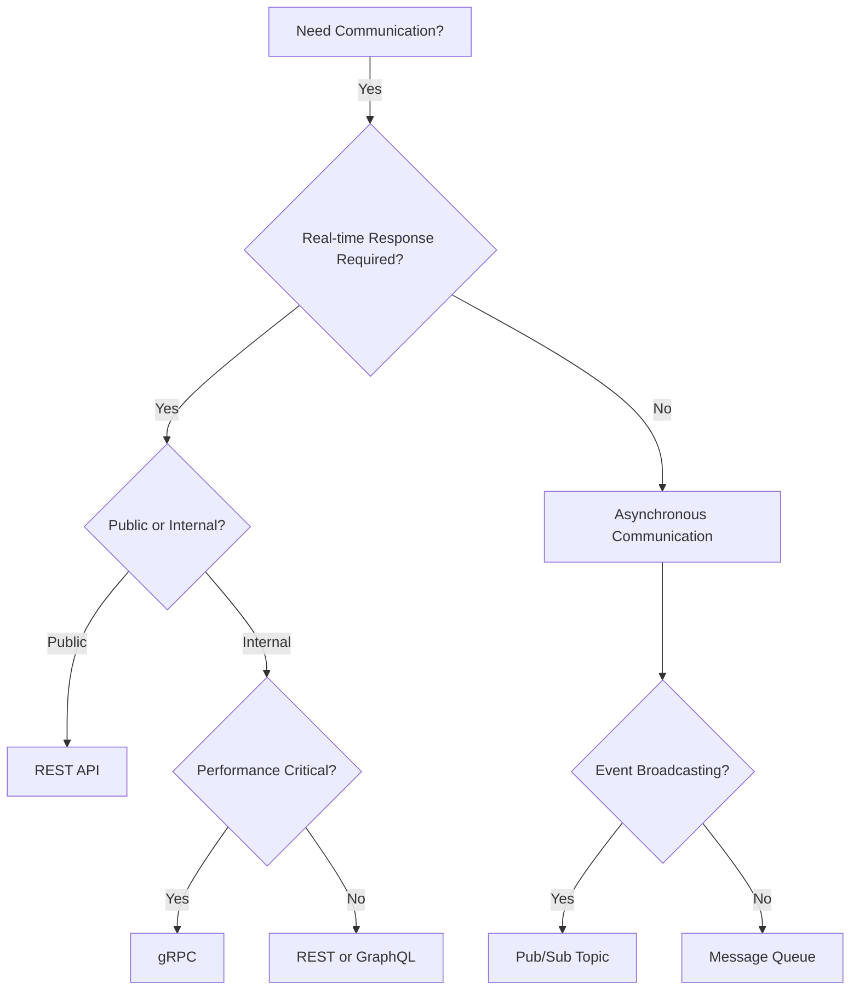

---

## Design Patterns

### 1. API Gateway Pattern

An API Gateway acts as a single entry point for clients, routing requests to appropriate microservices.

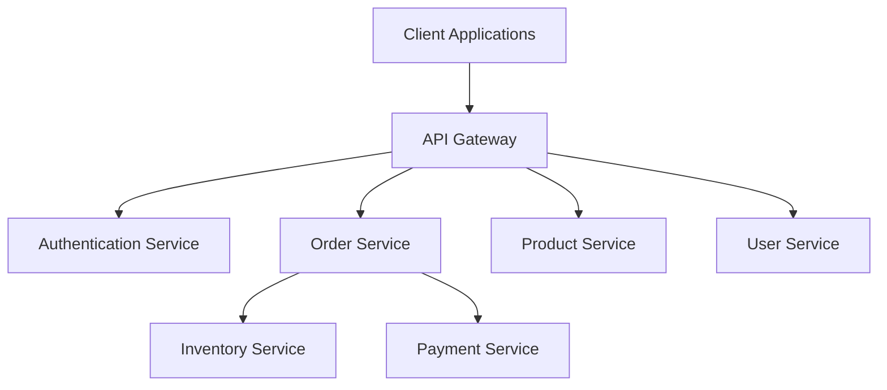

**Responsibilities:**
- Request routing and composition
- Protocol translation
- Authentication and authorization
- Rate limiting and throttling
- Request/response transformation
- Caching

**Related Documentation:**
- See [pros-cons.md](./pros-cons.md) for API Gateway trade-offs
- See [case-study.md](./case-study.md) for implementation examples

### 2. Service Mesh Pattern

A service mesh provides infrastructure-level communication between services with built-in capabilities.

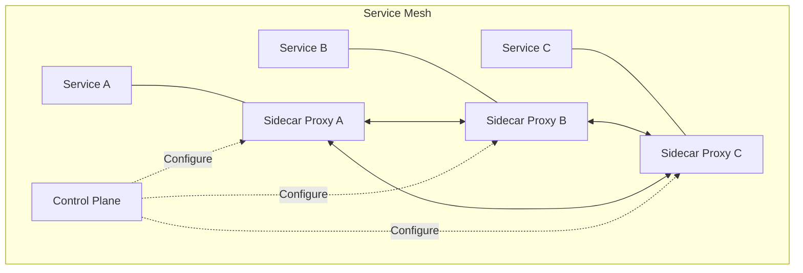

**Popular Service Meshes:**
- **Istio**: Comprehensive, feature-rich
- **Linkerd**: Lightweight, performant
- **Consul Connect**: HashiCorp ecosystem integration
- **AWS App Mesh**: AWS-native solution

**Features:**
- Traffic management
- Security (mTLS)
- Observability
- Resilience (circuit breakers, retries)
- Load balancing

### 3. Saga Pattern

The Saga pattern manages distributed transactions across multiple services. For detailed coverage, see [event-driven](../event-driven/) and [event-sourcing](../event-sourcing/) documentation.

**Choreography-based Saga:**

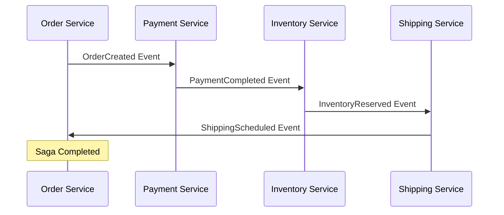

**Orchestration-based Saga:**

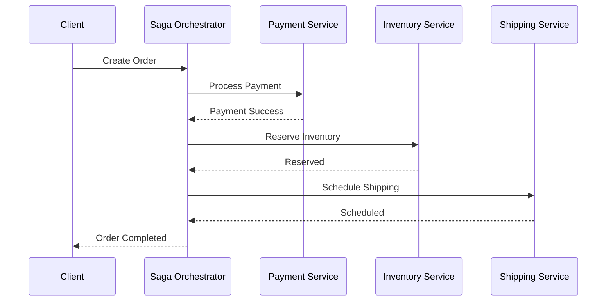

### 4. Backend for Frontend (BFF) Pattern

Different client applications have different needs. BFF provides tailored APIs for each client type.

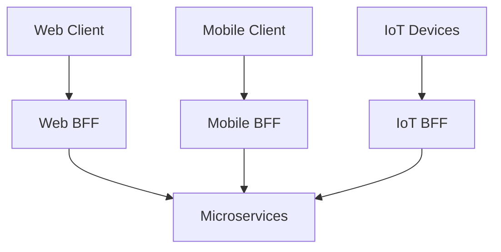

**Benefits:**
- Optimized for specific client needs
- Reduced client complexity
- Independent evolution of client APIs
- Better performance (tailored data)

### 5. Circuit Breaker Pattern

Prevents cascading failures by stopping requests to failing services.

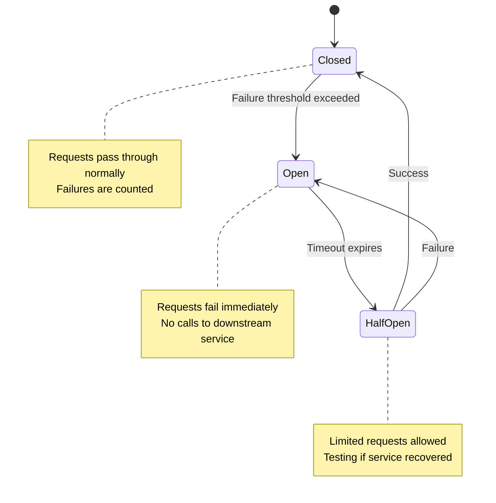

**States:**
- **Closed**: Normal operation, requests pass through
- **Open**: Service failure detected, requests fail fast
- **Half-Open**: Testing if service recovered

**Libraries:**
- Resilience4j (Java)
- Polly (.NET)
- Hystrix (Java, deprecated but influential)
- Circuit Breaker (Go)

---

## Best Practices

### 1. Timeouts and Retries

Always implement timeouts and retry logic with exponential backoff.

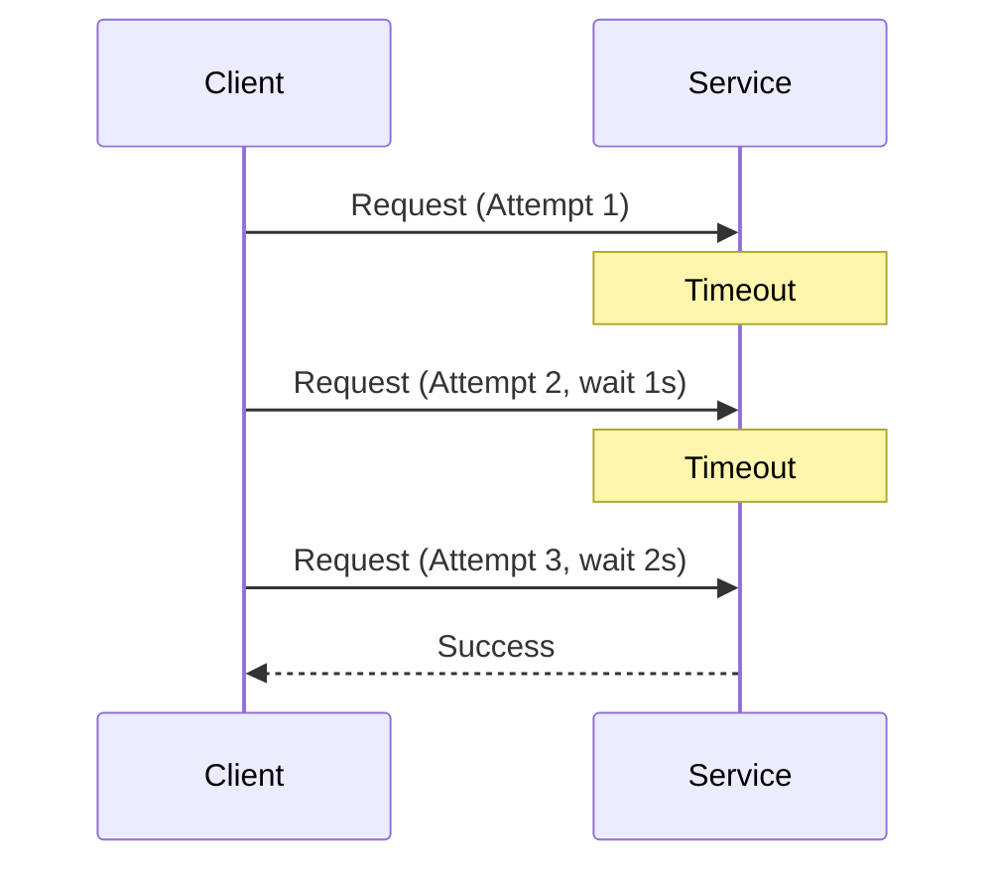

**Retry Strategy:**
- Use exponential backoff (1s, 2s, 4s, 8s)
- Implement jitter to avoid thundering herd
- Set maximum retry attempts
- Use idempotency tokens

### 2. Idempotency

Ensure operations can be safely retried without side effects.

**Techniques:**
- Idempotency keys/tokens
- Natural idempotent operations (PUT, DELETE)
- Deduplicate based on message IDs
- Store operation results

### 3. Service Discovery

Services must find each other dynamically. For comprehensive coverage, see [service-registry.md](./service-registry.md).

**Client-Side Discovery:**

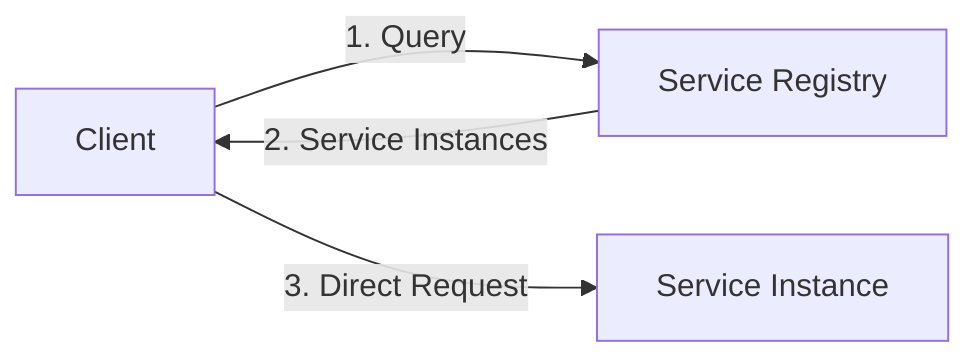

**Server-Side Discovery:**

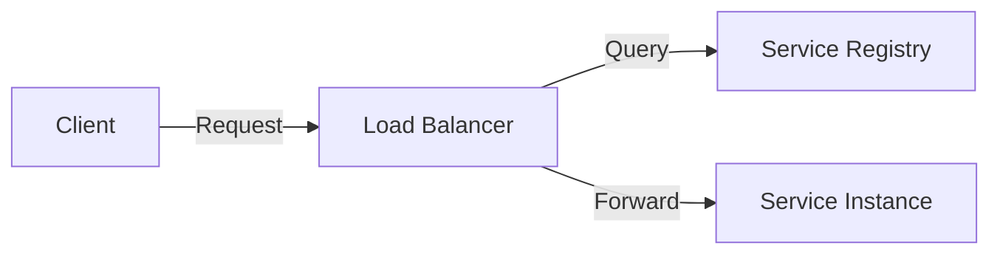

### 4. Data Consistency

**Strategies:**
- **Strong Consistency**: Synchronous, 2PC (Two-Phase Commit)
- **Eventual Consistency**: Asynchronous, event-driven
- **Saga Pattern**: Compensating transactions
- **CQRS**: Separate read and write models

For detailed patterns, see [cqrs](../cqrs/) and [event-sourcing](../event-sourcing/) documentation.

### 5. Versioning Strategies

**API Versioning:**
- URI versioning: `/v1/orders`, `/v2/orders`
- Header versioning: `Accept: application/vnd.api.v2+json`
- Query parameter: `/orders?version=2`

**Message Versioning:**
- Schema evolution with backward compatibility
- Include version in message metadata
- Support multiple versions simultaneously
- Graceful deprecation

### 6. Observability

Implement comprehensive monitoring and tracing:

**Components:**
- **Logging**: Centralized log aggregation (ELK, Splunk)
- **Metrics**: Performance and health metrics (Prometheus, Grafana)
- **Tracing**: Distributed tracing (Jaeger, Zipkin, OpenTelemetry)

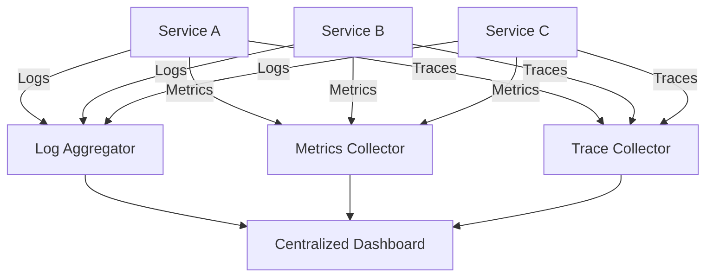

### 7. Security Considerations

**Authentication & Authorization:**
- OAuth 2.0 / OpenID Connect
- JWT tokens with short expiration
- Service-to-service authentication (mTLS)
- API keys for external services

**Data Security:**
- Encrypt data in transit (TLS)
- Encrypt sensitive data at rest
- Implement secret management
- Network segmentation

---

## Trade-offs and Considerations

### Synchronous vs Asynchronous

| Aspect | Synchronous | Asynchronous |
|--------|-------------|--------------|
| **Coupling** | Tight | Loose |
| **Complexity** | Lower | Higher |
| **Performance** | Immediate response | Higher throughput |
| **Failure Handling** | Immediate error | Retry mechanisms needed |
| **Debugging** | Easier | More complex |
| **Consistency** | Strong | Eventual |
| **Use Case** | Real-time queries | Background processing |

### REST vs gRPC

| Aspect | REST | gRPC |
|--------|------|------|
| **Performance** | Medium | High |
| **Browser Support** | Native | Limited |
| **Payload Size** | Larger (JSON) | Smaller (Protobuf) |
| **Human Readable** | Yes | No |
| **Streaming** | Limited | Native |
| **Learning Curve** | Low | Medium |
| **Tooling** | Extensive | Growing |

### Monolithic vs Microservices Communication

For a comprehensive comparison, see [monolithic](../monolithic/) and [pros-cons.md](./pros-cons.md).

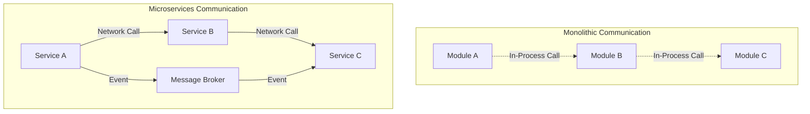

---

## References

### Internal Documentation
- [Microservices Overview](./readme.md) - Core microservices concepts and architecture
- [Service Registry and Discovery](./service-registry.md) - Service discovery patterns and implementations
- [Pros and Cons](./pros-cons.md) - Trade-offs of microservices architecture
- [Case Studies](./case-study.md) - Real-world implementation examples
- [CQRS Pattern](../cqrs/) - Command Query Responsibility Segregation
- [Event Sourcing](../event-sourcing/) - Event-based state management
- [Event-Driven Architecture](../event-driven/) - Event-driven patterns and practices
- [Monolithic Architecture](../monolithic/) - Comparison with monolithic approach

### External Resources

**Books:**
- *Building Microservices* by Sam Newman
- *Microservices Patterns* by Chris Richardson
- *Release It!* by Michael T. Nygard

**Online Resources:**
- [Martin Fowler's Microservices Resource Guide](https://martinfowler.com/microservices/)
- [Microsoft Azure Architecture Center](https://docs.microsoft.com/azure/architecture/)
- [AWS Architecture Center](https://aws.amazon.com/architecture/)
- [gRPC Documentation](https://grpc.io/docs/)
- [Apache Kafka Documentation](https://kafka.apache.org/documentation/)

**Standards and Specifications:**
- [REST Architectural Style (Roy Fielding)](https://www.ics.uci.edu/~fielding/pubs/dissertation/rest_arch_style.htm)
- [OpenAPI Specification](https://swagger.io/specification/)
- [CloudEvents Specification](https://cloudevents.io/)
- [OpenTelemetry](https://opentelemetry.io/)

---

## Document Information

**Version**: 1.0  
**Last Updated**: October 2025  
**Author**: System Design Documentation Team  
**Related Topics**: Microservices, Distributed Systems, Service Communication, API Design

---

*This document is part of a comprehensive system design architecture patterns series. For the complete overview, see [Architecture Patterns README](../README.md).*