# Microservices Architecture: Pros and Cons

## Table of Contents
1. [Introduction](#introduction)
2. [Advantages](#advantages)
3. [Disadvantages](#disadvantages)
4. [Comparison Overview](#comparison-overview)
5. [Decision Framework](#decision-framework)
6. [Conclusion](#conclusion)

---

## Introduction

Microservices architecture is a design approach where an application is built as a collection of small, independent services that communicate over well-defined APIs. Each service is self-contained, focuses on a specific business capability, and can be developed, deployed, and scaled independently.

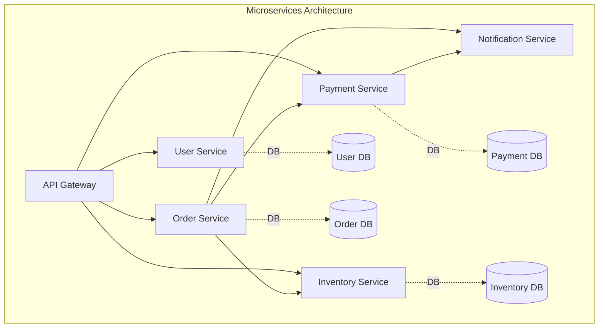

---

## Advantages

### 1. Independent Scalability

Each microservice can be scaled independently based on its specific resource requirements and load patterns.

**Example:** During Black Friday sales, the Order Service and Payment Service can be scaled up without scaling the User Profile Service.

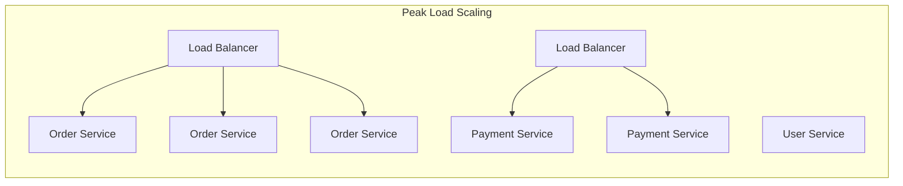

**Benefits:**
- Cost optimization by scaling only what's needed
- Better resource utilization
- Improved performance for high-demand services
- Reduced infrastructure waste

---

### 2. Technology Flexibility

Different microservices can use different technology stacks optimized for their specific requirements.

**Example Technology Stack:**

| Service | Language | Database | Cache |
|---------|----------|----------|-------|
| User Service | Java/Spring | PostgreSQL | Redis |
| Order Service | Node.js | MongoDB | Redis |
| Payment Service | Go | PostgreSQL | N/A |
| Analytics Service | Python | Cassandra | N/A |
| Notification Service | Node.js | Redis | N/A |

**Benefits:**
- Choose the best tool for each job
- Easier to adopt new technologies
- Attract diverse talent
- Optimize for specific use cases

---

### 3. Fault Isolation

Failures in one service don't necessarily bring down the entire system.

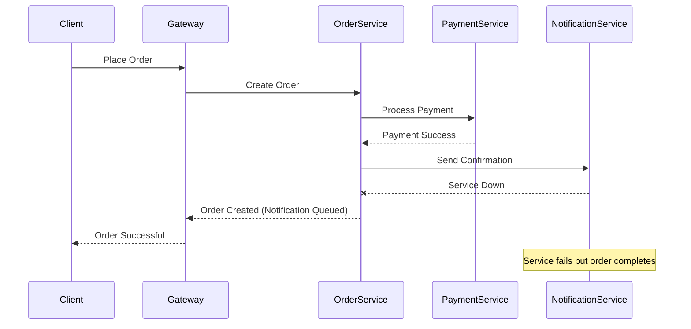

**Benefits:**
- Improved system resilience
- Graceful degradation possible
- Easier to implement circuit breakers
- Better overall availability

---

### 4. Faster Development and Deployment

Small, focused teams can develop and deploy services independently without coordinating with the entire organization.

**Development Velocity:**

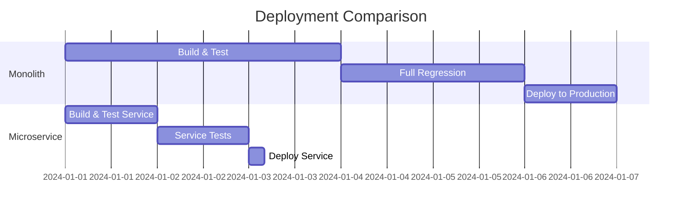

**Benefits:**
- Shorter development cycles
- Faster time to market
- Continuous deployment capability
- Reduced deployment risk

---

### 5. Better Team Organization

Teams can be organized around business capabilities with full ownership of services.

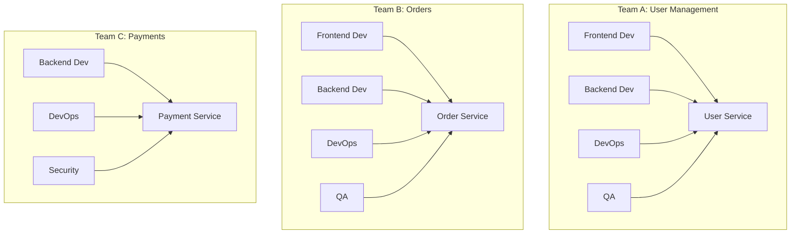

**Benefits:**
- Clear ownership and accountability
- Autonomous teams
- Better focus and expertise
- Reduced coordination overhead

---

### 6. Easier Maintenance and Updates

Services can be updated independently without affecting the entire system.

**Benefits:**
- Reduced deployment complexity
- Less coordination required
- Faster bug fixes
- Easier rollbacks

---

### 7. Better Alignment with Business

Services map directly to business capabilities, making it easier to understand and modify.

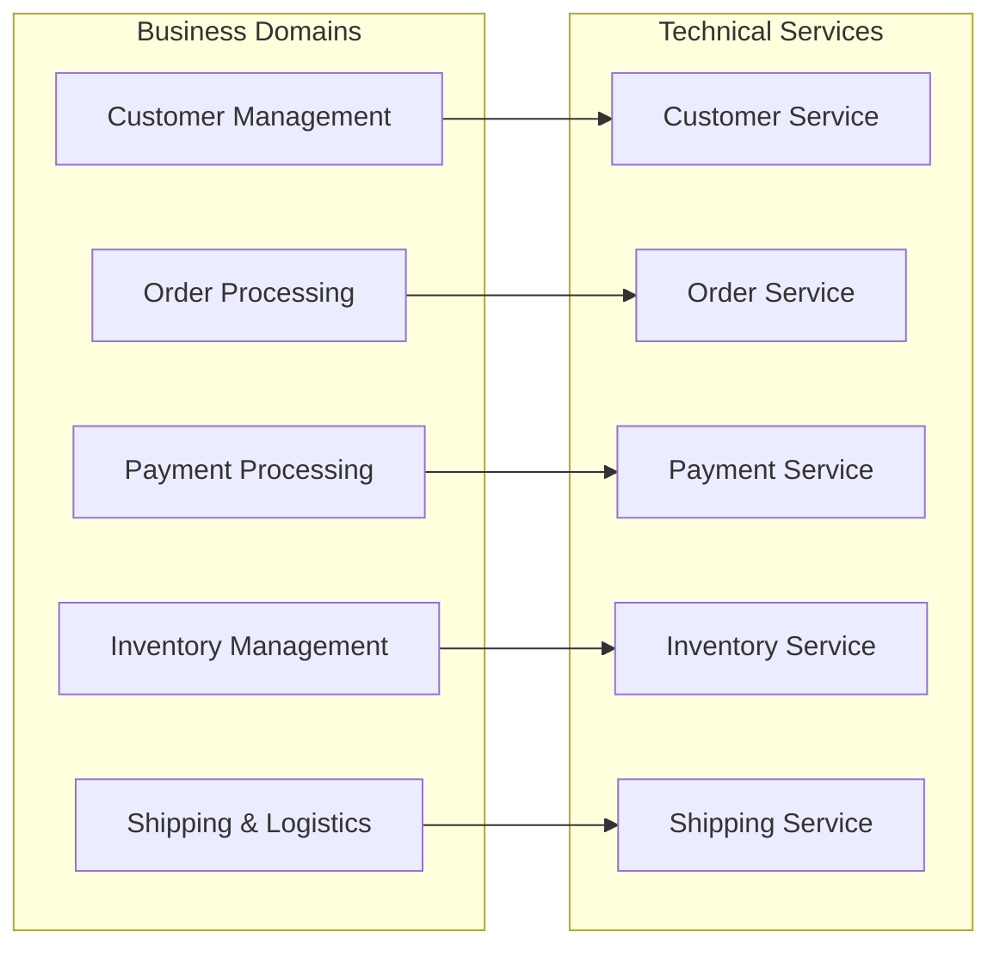

---

## Disadvantages

### 1. Increased Complexity

Managing multiple services introduces significant operational and architectural complexity.

**Complexity Areas:**

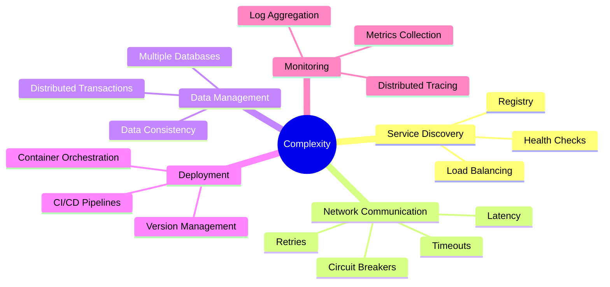

**Challenges:**
- More moving parts to manage
- Complex deployment pipelines
- Difficult to debug issues
- Steeper learning curve

---

### 2. Network Latency and Reliability

Inter-service communication over the network introduces latency and potential points of failure.

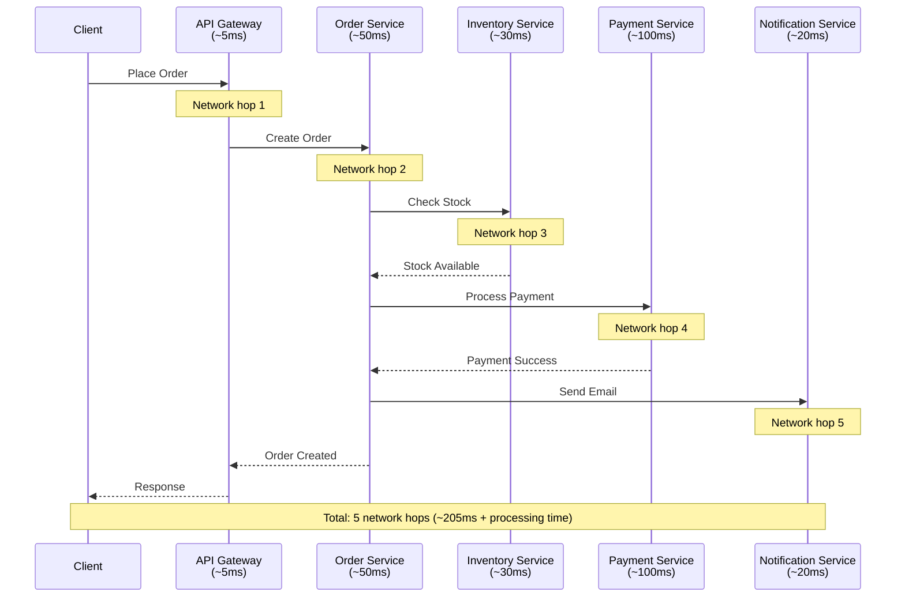

**Issues:**
- Network calls are slower than in-process calls
- Network failures can cascade
- Increased latency for user requests
- Need for retry mechanisms

---

### 3. Data Management Challenges

Maintaining data consistency across services is complex without traditional ACID transactions.

**Data Consistency Patterns:**

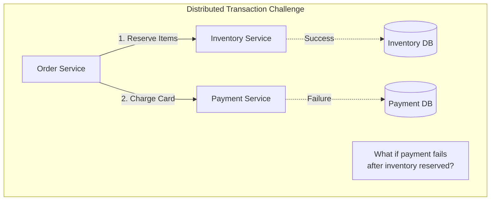

**Solution Approaches:**

| Pattern | Pros | Cons |
|---------|------|------|
| Saga Pattern | Event-driven, decoupled | Complex rollback logic |
| Two-Phase Commit | Strong consistency | Performance overhead, blocking |
| Eventual Consistency | High performance | Temporary inconsistency |

**Challenges:**
- No distributed transactions
- Data duplication across services
- Eventual consistency complexity
- Difficult data joins

---

### 4. Testing Complexity

Testing microservices requires sophisticated strategies and tools.

**Testing Pyramid:**

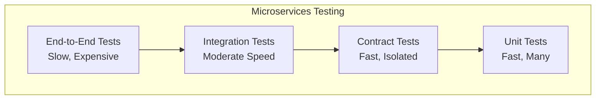

**Challenges:**
- Complex integration testing
- Need for service mocking
- Environment management
- Difficult end-to-end testing

---

### 5. Operational Overhead

Running microservices requires significant DevOps infrastructure and expertise.

**Required Infrastructure:**

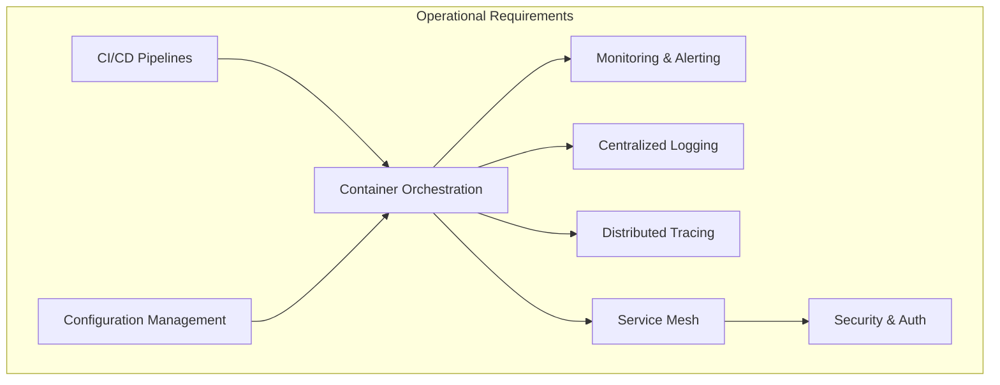

**Requirements:**
- Container orchestration (Kubernetes)
- Service mesh (Istio, Linkerd)
- Monitoring and logging infrastructure
- Distributed tracing systems
- API gateway management

---

### 6. Deployment Complexity

Managing deployments across multiple services requires sophisticated orchestration.

**Challenges:**
- Version compatibility between services
- Rolling deployment strategies
- Database migration coordination
- Feature flag management
- Rollback procedures

---

### 7. Initial Development Overhead

Setting up microservices infrastructure requires significant upfront investment.

**Setup Requirements:**

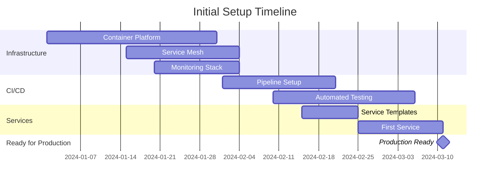

**Costs:**
- Infrastructure setup time
- Tooling and platform selection
- Team training
- Template and framework creation

---

### 8. Distributed System Challenges

Microservices inherit all the challenges of distributed systems.

**CAP Theorem Trade-offs:**

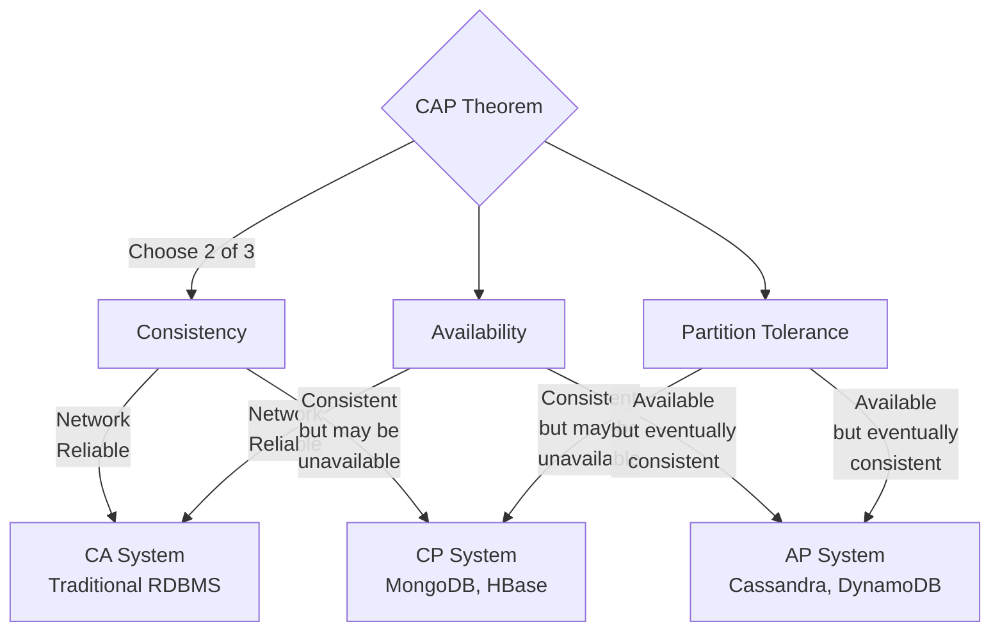

**Issues:**
- Network partitions
- Clock synchronization
- Consensus protocols
- Distributed debugging

---

## Comparison Overview

### Effort vs Value

```mermaid
quadrantChart
    title Microservices Value by Organization Size
    x-axis Low Complexity --> High Complexity
    y-axis Low Value --> High Value
    quadrant-1 Sweet Spot
    quadrant-2 Over-engineering
    quadrant-3 Consider Monolith
    quadrant-4 Growing Pains
    
    Large Enterprise: [0.8, 0.85]
    Scale-up (50-200 people): [0.6, 0.7]
    Startup (10-50 people): [0.4, 0.5]
    Small Team (< 10 people): [0.3, 0.25]
```

### Trade-off Matrix

| Aspect | Monolithic | Microservices |
|--------|-----------|---------------|
| **Development Speed (Initial)** | ⭐⭐⭐⭐⭐ Fast | ⭐⭐ Slow |
| **Development Speed (Long-term)** | ⭐⭐ Slow | ⭐⭐⭐⭐ Fast |
| **Deployment Complexity** | ⭐⭐⭐⭐⭐ Simple | ⭐⭐ Complex |
| **Scalability** | ⭐⭐ Limited | ⭐⭐⭐⭐⭐ Excellent |
| **Fault Isolation** | ⭐ Poor | ⭐⭐⭐⭐⭐ Excellent |
| **Operational Overhead** | ⭐⭐⭐⭐⭐ Low | ⭐⭐ High |
| **Testing Complexity** | ⭐⭐⭐⭐ Simple | ⭐⭐ Complex |
| **Team Autonomy** | ⭐⭐ Limited | ⭐⭐⭐⭐⭐ High |
| **Technology Flexibility** | ⭐⭐ Limited | ⭐⭐⭐⭐⭐ High |
| **Data Consistency** | ⭐⭐⭐⭐⭐ Easy | ⭐⭐ Difficult |

---

## Decision Framework

### When to Choose Microservices

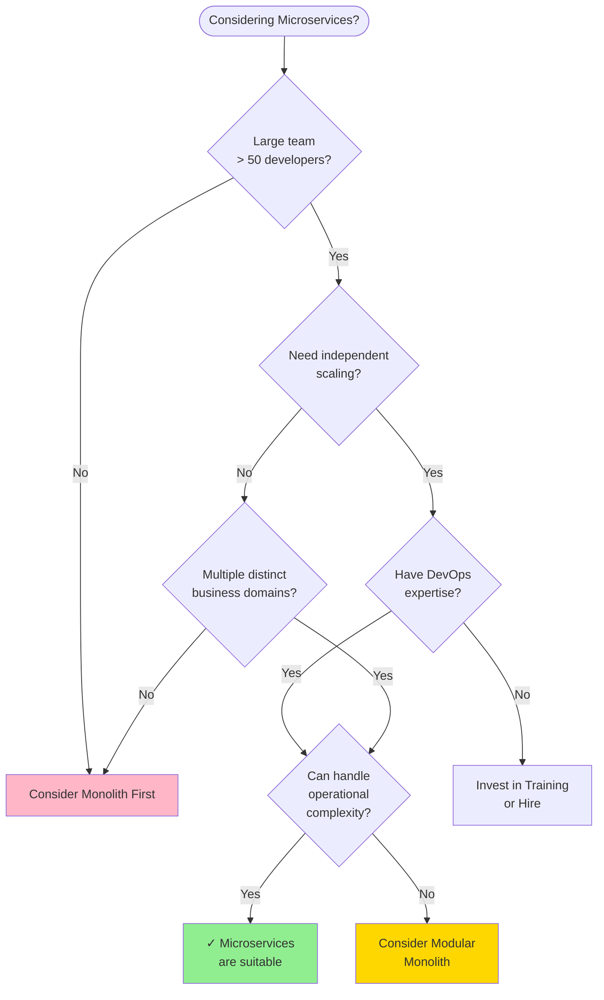

### Ideal Conditions for Microservices

✅ **Go for Microservices when:**

1. **Team Size:** More than 50 developers
2. **Business Complexity:** Multiple distinct business domains
3. **Scale Requirements:** Different services need different scaling strategies
4. **Release Frequency:** Need for frequent, independent deployments
5. **Technology Diversity:** Different services benefit from different tech stacks
6. **Organizational Structure:** Teams can be organized around business capabilities
7. **DevOps Maturity:** Strong automation and monitoring capabilities
8. **Fault Tolerance:** Need high availability and fault isolation

❌ **Avoid Microservices when:**

1. **Small Team:** Fewer than 10 developers
2. **Simple Domain:** Single, straightforward business domain
3. **Limited Resources:** Can't invest in DevOps infrastructure
4. **Tight Coupling:** Business logic is highly interconnected
5. **Consistency Critical:** Strong ACID transaction requirements
6. **Starting Fresh:** Building MVP or proof of concept
7. **Immature Organization:** Lack of DevOps culture or expertise

### Migration Strategy


---

## Conclusion

### Key Takeaways

1. **Not a Silver Bullet:** Microservices solve specific problems but introduce new challenges.

2. **Organizational Readiness:** Success depends as much on organizational structure and culture as on technical architecture.

3. **Gradual Adoption:** Most organizations benefit from starting with a monolith and gradually extracting services.

4. **Cost-Benefit Analysis:** The operational overhead must be justified by clear business benefits.

5. **Team Maturity:** Requires mature DevOps practices, strong automation, and experienced teams.

### Recommendation Framework

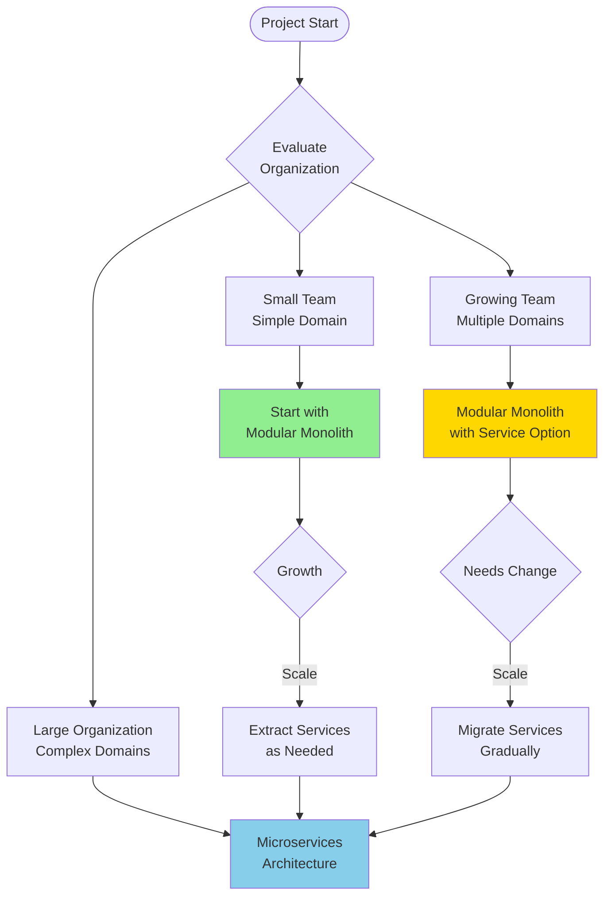

### Final Thoughts

Microservices architecture is a powerful pattern that enables scalability, flexibility, and team autonomy. However, it comes with significant complexity and operational overhead. The decision to adopt microservices should be based on:

- **Business needs:** Do you need independent scaling and deployment?
- **Team capability:** Do you have the DevOps expertise?
- **Organizational structure:** Can teams own services end-to-end?
- **Trade-offs:** Are you willing to accept operational complexity for flexibility?

For most organizations, starting with a well-structured modular monolith and gradually extracting services as needs become clear is the most pragmatic approach.

---

## References and Further Reading

- Martin Fowler's Microservices Article
- Sam Newman's "Building Microservices" Book
- Chris Richardson's Microservices.io
- Domain-Driven Design by Eric Evans
- The Twelve-Factor App Methodology

---

*Document Version: 1.0*  
*Last Updated: 2025*