# Microservices Architecture

> A comprehensive guide to microservices architecture patterns, best practices, and implementation strategies.

## 📋 Table of Contents

- [Overview](#overview)
- [What are Microservices?](#what-are-microservices)
- [Architecture Diagram](#architecture-diagram)
- [Documentation](#documentation)
- [Key Concepts](#key-concepts)
- [When to Use Microservices](#when-to-use-microservices)
- [Getting Started](#getting-started)
- [Technology Stack](#technology-stack)
- [Best Practices](#best-practices)
- [Common Challenges](#common-challenges)
- [Resources](#resources)

---

## Overview

This directory contains comprehensive documentation on microservices architecture, covering everything from fundamental concepts to advanced implementation patterns. Whether you're evaluating microservices for your project or already implementing them, this guide provides practical insights and real-world examples.

### What You'll Find Here

- **Architecture Patterns**: Detailed explanations of microservices design patterns
- **Communication Strategies**: Service-to-service communication approaches
- **Service Discovery**: Registry and discovery mechanisms
- **Real-World Examples**: Case studies and implementation examples
- **Pros & Cons Analysis**: Comprehensive trade-off evaluation

---

## What are Microservices?

Microservices architecture is an approach to developing a single application as a suite of small, independent services. Each service:

- Runs in its own process
- Communicates via lightweight mechanisms (HTTP/REST, gRPC, messaging)
- Is independently deployable
- Is organized around business capabilities
- Can be implemented using different programming languages and data stores

### Core Principles


---

## Architecture Diagram

### High-Level Overview


---

## Documentation

### Core Documentation

| Document | Description | Topics Covered |
|----------|-------------|----------------|
| **[README.md](./readme.md)** | Main overview and getting started | Architecture overview, principles, quick start |
| **[Pros and Cons](./pros-cons.md)** | Comprehensive advantages and disadvantages analysis | Benefits, challenges, trade-offs, decision framework |
| **[Communication Patterns](./communication-patterns.md)** | Inter-service communication strategies | Synchronous, asynchronous, protocols, best practices |
| **[Service Registry](./service-registry.md)** | Service discovery and registry mechanisms | Discovery patterns, registry solutions, implementation |
| **[Case Study](./case-study.md)** | Real-world implementation examples | E-commerce platform, Netflix-style, enterprise migration |

### Quick Navigation

**Start Here:**
- 👉 New to microservices? Start with [README.md](./readme.md)
- 🤔 Evaluating microservices? Read [Pros and Cons](./pros-cons.md)
- 🏗️ Planning implementation? Check [Communication Patterns](./communication-patterns.md)

**Deep Dive:**
- 🔍 Service Discovery: [Service Registry](./service-registry.md)
- 📊 Real Examples: [Case Study](./case-study.md)

---

## Key Concepts

### 1. Service Independence

Each microservice is:
- **Autonomous**: Can be developed, deployed, and scaled independently
- **Loosely Coupled**: Minimal dependencies on other services
- **Highly Cohesive**: Focused on a single business capability

### 2. Decentralized Data Management


**Key Points:**
- Each service owns its data
- Data sharing via APIs, not database access
- Eventual consistency model
- Polyglot persistence possible

### 3. Communication Patterns

**Synchronous:**
- REST/HTTP
- gRPC
- GraphQL

**Asynchronous:**
- Message Queues (RabbitMQ, ActiveMQ)
- Event Streaming (Kafka, AWS Kinesis)
- Pub/Sub (Redis, Google Pub/Sub)

📖 **Learn More:** [Communication Patterns](./communication-patterns.md)

### 4. Service Discovery

Services need to locate each other dynamically:


📖 **Learn More:** [Service Registry](./service-registry.md)

---

## When to Use Microservices

### ✅ Good Fit For:

| Scenario | Why Microservices Work |
|----------|----------------------|
| **Large Teams** | Multiple teams can work independently without coordination overhead |
| **Complex Domains** | Different bounded contexts can be separated into distinct services |
| **Independent Scaling** | Different services have different resource requirements |
| **Technology Diversity** | Teams can choose optimal technology for each service |
| **Frequent Deployments** | Services can be updated independently without full system deployment |
| **High Availability** | Fault isolation prevents cascading failures |

### ❌ Not Recommended For:

| Scenario | Why to Avoid |
|----------|-------------|
| **Small Teams** | Operational overhead exceeds benefits |
| **Simple Applications** | Added complexity not justified |
| **Tight Coupling** | Business logic is highly interconnected |
| **Strong Consistency** | ACID transactions required across components |
| **Limited DevOps** | Lack of automation and monitoring capabilities |
| **Early-Stage Startups** | Premature optimization before product-market fit |

### Decision Framework

```mermaid
flowchart TD
    Start([Considering Microservices?])
    
    Start --> Q1{Team size<br/>> 20 developers?}
    Q1 -->|No| Mono[Consider Monolith]
    Q1 -->|Yes| Q2{Multiple distinct<br/>business domains?}
    
    Q2 -->|No| Mono
    Q2 -->|Yes| Q3{Need independent<br/>deployment?}
    
    Q3 -->|No| Modular[Modular Monolith]
    Q3 -->|Yes| Q4{Have DevOps<br/>capability?}
    
    Q4 -->|No| Build[Build DevOps First]
    Q4 -->|Yes| Q5{Can handle<br/>distributed systems?}
    
    Q5 -->|No| Train[Training Required]
    Q5 -->|Yes| Micro[✓ Microservices]

```



📖 **Learn More:** [Pros and Cons](./pros-cons.md)

---

## Getting Started

### Prerequisites

Before implementing microservices, ensure you have:

- [ ] **Container Platform**: Docker, Kubernetes, or similar
- [ ] **CI/CD Pipeline**: Automated build and deployment
- [ ] **Service Registry**: Consul, Eureka, etcd, or Kubernetes DNS
- [ ] **API Gateway**: Kong, Nginx, Traefik, or AWS API Gateway
- [ ] **Monitoring Stack**: Prometheus, Grafana, ELK, or equivalent
- [ ] **Message Broker**: Kafka, RabbitMQ, or cloud equivalent (optional but recommended)
- [ ] **Distributed Tracing**: Jaeger, Zipkin, or AWS X-Ray

### Quick Start Guide

#### 1. Start with a Single Service

```bash
# Create a simple REST API service
mkdir user-service
cd user-service

# Initialize with your preferred framework
# Example with Spring Boot
spring init --dependencies=web,actuator,eureka-discovery user-service

# Example with Node.js
npm init -y
npm install express consul
```

#### 2. Implement Health Checks

```java
// Spring Boot Actuator
@RestController
@RequestMapping("/actuator/health")
public class HealthController {
    
    @GetMapping
    public ResponseEntity<String> health() {
        return ResponseEntity.ok("UP");
    }
}
```

#### 3. Register with Service Registry

```yaml
# application.yml
spring:
  application:
    name: user-service

eureka:
  client:
    serviceUrl:
      defaultZone: http://localhost:8761/eureka/
```

#### 4. Deploy with Docker

```dockerfile
FROM openjdk:17-slim
COPY target/user-service.jar app.jar
EXPOSE 8080
ENTRYPOINT ["java", "-jar", "/app.jar"]
```

```bash
docker build -t user-service:1.0 .
docker run -p 8080:8080 user-service:1.0
```

#### 5. Add to Kubernetes

```yaml
apiVersion: apps/v1
kind: Deployment
metadata:
  name: user-service
spec:
  replicas: 3
  selector:
    matchLabels:
      app: user-service
  template:
    metadata:
      labels:
        app: user-service
    spec:
      containers:
      - name: user-service
        image: user-service:1.0
        ports:
        - containerPort: 8080
```

---

## Technology Stack

### Common Technology Choices

#### Programming Languages

| Language | Strengths | Best For |
|----------|-----------|----------|
| **Java/Spring Boot** | Mature ecosystem, enterprise features | Complex business logic, enterprise apps |
| **Node.js/Express** | Fast development, event-driven | Real-time features, APIs |
| **Go** | High performance, small footprint | High-throughput services, system tools |
| **Python/Flask** | Rapid prototyping, data science | ML services, data processing |
| **C#/.NET Core** | Microsoft ecosystem, performance | Windows integration, enterprise |

#### Service Registry

| Solution | Type | Best For |
|----------|------|----------|
| **Consul** | CP (Consistent) | Multi-datacenter, service mesh |
| **Eureka** | AP (Available) | Spring Cloud, AWS |
| **etcd** | CP (Consistent) | Kubernetes, strong consistency |
| **Kubernetes DNS** | AP (Available) | Container-native applications |

#### API Gateway

| Solution | Type | Best For |
|----------|------|----------|
| **Kong** | Open Source | Plugin ecosystem, extensibility |
| **AWS API Gateway** | Managed | AWS infrastructure |
| **Nginx** | Open Source | High performance, simplicity |
| **Traefik** | Open Source | Kubernetes, automatic discovery |

#### Communication

| Pattern | Technology | Use Case |
|---------|-----------|----------|
| **Synchronous** | REST, gRPC | Request-response, low latency |
| **Asynchronous** | Kafka, RabbitMQ | Event-driven, decoupling |
| **Real-time** | WebSockets, SSE | Live updates, notifications |

📖 **Learn More:** [Communication Patterns](./communication-patterns.md)

---

## Best Practices

### 1. Design Principles

#### Domain-Driven Design (DDD)


**Guidelines:**
- Identify bounded contexts in your domain
- Map each context to a microservice
- Define clear interfaces between contexts
- Use ubiquitous language within each context

#### Single Responsibility Principle

```
✅ Good: Order Service
   - Create orders
   - Update order status
   - Query order history

❌ Bad: Order Service
   - Create orders
   - Process payments
   - Manage inventory
   - Send notifications
   - Generate reports
```

### 2. API Design

#### REST Best Practices

```http
# Resource-based URLs
GET    /api/orders          # List orders
GET    /api/orders/{id}     # Get order
POST   /api/orders          # Create order
PUT    /api/orders/{id}     # Update order
DELETE /api/orders/{id}     # Delete order

# Proper HTTP status codes
200 OK                       # Success
201 Created                  # Resource created
400 Bad Request              # Invalid input
404 Not Found                # Resource not found
500 Internal Server Error    # Server error

# Versioning
/api/v1/orders
/api/v2/orders

# Headers for API versioning
Accept: application/vnd.myapi.v2+json
```

#### API Contract

```yaml
# OpenAPI/Swagger specification
openapi: 3.0.0
info:
  title: Order Service API
  version: 1.0.0

paths:
  /api/orders:
    post:
      summary: Create a new order
      requestBody:
        required: true
        content:
          application/json:
            schema:
              $ref: '#/components/schemas/CreateOrderRequest'
      responses:
        '201':
          description: Order created successfully
          content:
            application/json:
              schema:
                $ref: '#/components/schemas/Order'
```

### 3. Data Management

#### Database per Service

```mermaid
graph TB
    subgraph "Anti-Pattern: Shared Database"
        S1[Service A] --> SDB[(Shared DB)]
        S2[Service B] --> SDB
        S3[Service C] --> SDB
        
        Note1[❌ Tight coupling<br/>❌ Schema changes affect all<br/>❌ No service isolation]
    end
    
    subgraph "Best Practice: Database per Service"
        SA[Service A] --> DBA[(DB A)]
        SB[Service B] --> DBB[(DB B)]
        SC[Service C] --> DBC[(DB C)]
        
        SA <-.->|API| SB
        SB <-.->|Events| SC
        
        Note2[✅ Loose coupling<br/>✅ Independent evolution<br/>✅ Service isolation]
    end
```



#### Handling Distributed Transactions

**Saga Pattern:**


### 4. Resilience Patterns

#### Circuit Breaker

```java
@Service
public class OrderService {
    
    @CircuitBreaker(name = "paymentService", fallbackMethod = "paymentFallback")
    public PaymentResponse processPayment(PaymentRequest request) {
        return paymentClient.process(request);
    }
    
    private PaymentResponse paymentFallback(PaymentRequest request, Exception ex) {
        log.error("Payment service unavailable, using fallback", ex);
        // Return cached response or queue for later processing
        return new PaymentResponse("PENDING", "Payment queued for processing");
    }
}
```

#### Retry with Exponential Backoff

```java
@Retryable(
    value = {ServiceException.class},
    maxAttempts = 3,
    backoff = @Backoff(delay = 1000, multiplier = 2)
)
public Response callExternalService() {
    // Will retry: 1s, 2s, 4s delays
    return externalService.call();
}
```

### 5. Monitoring and Observability

#### The Three Pillars


#### Essential Metrics

```yaml
# Application Metrics
- Request rate (requests/second)
- Error rate (errors/second)
- Response time (p50, p95, p99)
- Saturation (CPU, memory, disk)

# Business Metrics
- Orders per minute
- Revenue per hour
- User signups per day
- Conversion rate

# Infrastructure Metrics
- Service instance count
- Database connections
- Message queue depth
- Cache hit rate
```

### 6. Security

#### Authentication & Authorization


**Best Practices:**
- Use OAuth 2.0 / OpenID Connect
- Implement API Gateway for authentication
- Pass user context via JWT
- Implement service-to-service authentication (mTLS)
- Encrypt sensitive data at rest and in transit

---

## Common Challenges

### 1. Distributed System Complexity

**Challenge:** Managing multiple services, databases, and communication patterns  
**Solution:**
- Start with a monolith, extract services gradually
- Invest in automation and tooling
- Implement proper observability from day one
- Use managed services when possible

### 2. Data Consistency

**Challenge:** Maintaining consistency across services without distributed transactions  
**Solution:**
- Accept eventual consistency
- Implement saga pattern for distributed transactions
- Use event sourcing for audit trails
- Design idempotent operations

### 3. Testing Complexity

**Challenge:** Testing multiple services and their interactions  
**Solution:**
- Implement contract testing (Pact)
- Use service virtualization for integration tests
- Maintain comprehensive unit tests
- Implement chaos engineering

### 4. Operational Overhead

**Challenge:** Managing deployment, monitoring, and troubleshooting  
**Solution:**
- Adopt containerization (Docker)
- Use orchestration platforms (Kubernetes)
- Implement centralized logging and monitoring
- Automate everything (CI/CD)

📖 **Learn More:** [Pros and Cons](./pros-cons.md)

---

## Resources

### Official Documentation

- **Spring Cloud:** https://spring.io/projects/spring-cloud
- **Kubernetes:** https://kubernetes.io/docs/
- **Docker:** https://docs.docker.com/
- **Consul:** https://www.consul.io/docs
- **Kafka:** https://kafka.apache.org/documentation/

### Books

- **"Building Microservices"** by Sam Newman
- **"Microservices Patterns"** by Chris Richardson
- **"Domain-Driven Design"** by Eric Evans
- **"Release It!"** by Michael Nygard
- **"The DevOps Handbook"** by Gene Kim et al.

### Online Resources

- **Microservices.io:** https://microservices.io/
- **Martin Fowler's Articles:** https://martinfowler.com/microservices/
- **CNCF Landscape:** https://landscape.cncf.io/
- **12 Factor App:** https://12factor.net/

### Tools & Platforms

| Category | Tools |
|----------|-------|
| **Containerization** | Docker, Podman |
| **Orchestration** | Kubernetes, Docker Swarm, Nomad |
| **Service Mesh** | Istio, Linkerd, Consul Connect |
| **API Gateway** | Kong, Nginx, Traefik, AWS API Gateway |
| **Monitoring** | Prometheus, Grafana, Datadog |
| **Logging** | ELK Stack, Loki, Splunk |
| **Tracing** | Jaeger, Zipkin, AWS X-Ray |
| **CI/CD** | Jenkins, GitLab CI, GitHub Actions, ArgoCD |

---

## Contributing

We welcome contributions to improve this documentation! Please:

1. Fork the repository
2. Create a feature branch
3. Make your changes
4. Submit a pull request

### Documentation Standards

- Use clear, concise language
- Include diagrams where appropriate (Mermaid preferred)
- Provide code examples
- Link to related documents
- Keep examples practical and realistic

---

## License

This documentation is provided as-is for educational purposes.

---

## Contact & Support

For questions or feedback:
- Create an issue in the repository
- Contact the documentation team
- Join our community Slack channel

---

## Changelog

### Version 1.0.0 (2025)
- Initial documentation release
- Core concepts and patterns
- Communication patterns guide
- Service registry documentation
- Pros and cons analysis
- Case studies

---

**Last Updated:** 2025  
**Maintained By:** System Design Documentation Team

---

## Quick Links

- 🏠 [Home](../README.md)
- 📚 [Architecture Patterns](../README.md)
- 🔄 [CQRS](../cqrs/)
- 📡 [Event-Driven](../event-driven/)
- 🎯 [Event Sourcing](../event-sourcing/)
- 🔷 [Hexagonal](../hexagonal/)
- 📊 [Layered Architecture](../layered-architecture/)
- 🏛️ [Monolithic](../monolithic/)
- ☁️ [Serverless](../serverless/)