# Service Registry and Discovery

## Table of Contents

1. [Introduction](#introduction)
2. [What is Service Discovery](#what-is-service-discovery)
3. [Service Registry Patterns](#service-registry-patterns)
4. [Popular Service Registry Solutions](#popular-service-registry-solutions)
5. [Implementation Patterns](#implementation-patterns)
6. [Health Checks and Monitoring](#health-checks-and-monitoring)
7. [Load Balancing Strategies](#load-balancing-strategies)
8. [Best Practices](#best-practices)
9. [Pros and Cons](#pros-and-cons)
10. [Real-World Examples](#real-world-examples)

---

## Introduction

In a microservices architecture, services are dynamically created, destroyed, and scaled across multiple hosts. Service discovery is the mechanism that allows services to find and communicate with each other without hardcoding network locations.

A **Service Registry** is a database of available service instances, acting as a phone book for microservices.

### The Problem

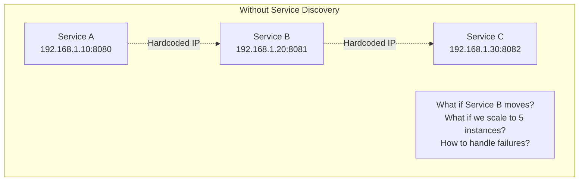
```mermaid
graph TB
    subgraph "Without Service Discovery"
        S1[Service A<br/>192.168.1.10:8080]
        S2[Service B<br/>192.168.1.20:8081]
        S3[Service C<br/>192.168.1.30:8082]

        S1 -.->|Hardcoded IP| S2
        S2 -.->|Hardcoded IP| S3

        Note1[What if Service B moves?<br/>What if we scale to 5 instances?<br/>How to handle failures?]
    end

    
```

### The Solution

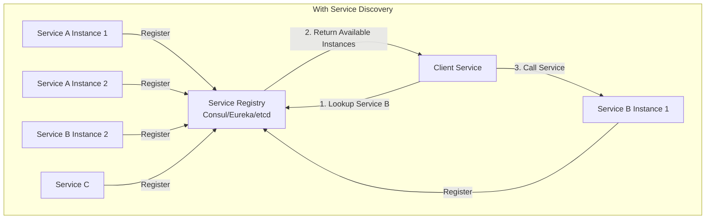
```mermaid
graph TB
    subgraph "With Service Discovery"
        SR[Service Registry<br/>Consul/Eureka/etcd]

        S1[Service A Instance 1]
        S2[Service A Instance 2]
        S3[Service B Instance 1]
        S4[Service B Instance 2]
        S5[Service C]

        S1 & S2 & S3 & S4 & S5 -->|Register| SR

        Client[Client Service] -->|1. Lookup Service B| SR
        SR -->|2. Return Available Instances| Client
        Client -->|3. Call Service| S3
    end

   
```

---

## What is Service Discovery

Service discovery is the automatic detection of devices and services on a network. In microservices, it involves two main operations:

### 1. Service Registration

Services register themselves with the registry when they start up, providing:

- Service name
- Network location (IP address and port)
- Health check endpoint
- Metadata (version, environment, etc.)

### 2. Service Discovery

Clients query the registry to find available instances of a service they want to call.

### Key Components

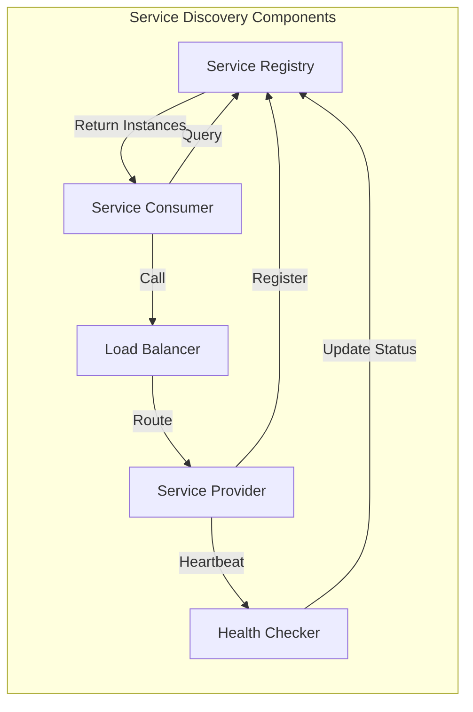
```mermaid
graph LR
    subgraph "Service Discovery Components"
        SR[Service Registry]
        SP[Service Provider]
        SC[Service Consumer]
        HC[Health Checker]
        LB[Load Balancer]

        SP -->|Register| SR
        SP -->|Heartbeat| HC
        HC -->|Update Status| SR
        SC -->|Query| SR
        SR -->|Return Instances| SC
        SC -->|Call| LB
        LB -->|Route| SP
    end
```

---

## Service Registry Patterns

### 1. Client-Side Discovery

The client queries the service registry and selects an available instance to call.

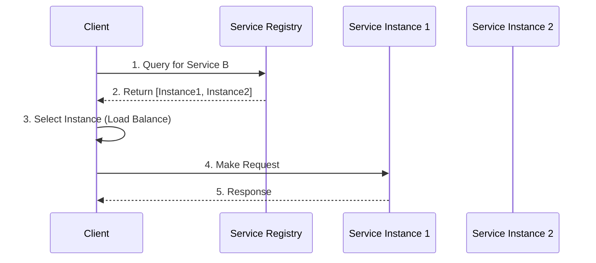
```mermaid
sequenceDiagram
    participant Client
    participant Registry as Service Registry
    participant S1 as Service Instance 1
    participant S2 as Service Instance 2

    Client->>Registry: 1. Query for Service B
    Registry-->>Client: 2. Return [Instance1, Instance2]
    Client->>Client: 3. Select Instance (Load Balance)
    Client->>S1: 4. Make Request
    S1-->>Client: 5. Response
```

**Advantages:**

- Client has full control over load balancing
- Simple architecture
- No additional network hop

**Disadvantages:**

- Client becomes more complex
- Load balancing logic duplicated across clients
- Tight coupling with registry

**Example Implementation:**

```java
// Netflix Ribbon (Client-Side Discovery)
@LoadBalanced
@Bean
public RestTemplate restTemplate() {
    return new RestTemplate();
}

// Service call
String response = restTemplate.getForObject(
    "http://order-service/api/orders/123",
    String.class
);
```

---

### 2. Server-Side Discovery

The client makes a request to a load balancer, which queries the registry and forwards the request.

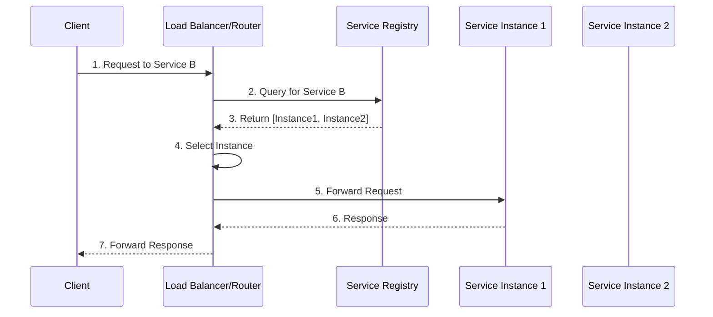
```mermaid
sequenceDiagram
    participant Client
    participant LB as Load Balancer/Router
    participant Registry as Service Registry
    participant S1 as Service Instance 1
    participant S2 as Service Instance 2

    Client->>LB: 1. Request to Service B
    LB->>Registry: 2. Query for Service B
    Registry-->>LB: 3. Return [Instance1, Instance2]
    LB->>LB: 4. Select Instance
    LB->>S1: 5. Forward Request
    S1-->>LB: 6. Response
    LB-->>Client: 7. Forward Response
```

**Advantages:**

- Client code is simpler
- Centralized load balancing
- Better for heterogeneous clients

**Disadvantages:**

- Additional network hop (latency)
- Load balancer is a potential single point of failure
- Requires highly available load balancer

**Example Implementation:**

```yaml
# AWS ELB with Service Discovery
services:
  order-service:
    image: order-service:latest
    deploy:
      replicas: 3
    networks:
      - service-mesh
    labels:
      - "traefik.enable=true"
      - "traefik.http.routers.orders.rule=PathPrefix(`/orders`)"
```

---

### 3. Self-Registration Pattern

Services register themselves directly with the registry.

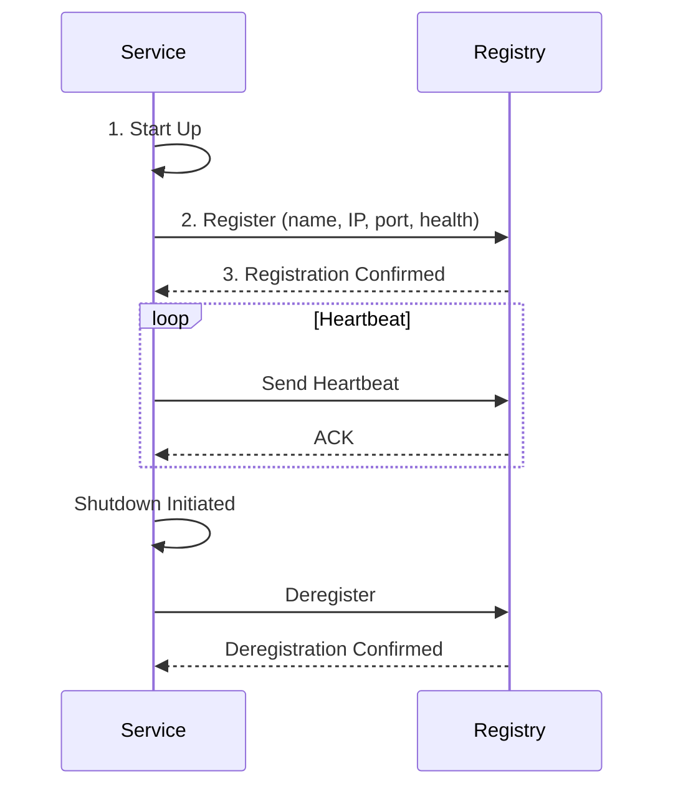
```mermaid
sequenceDiagram
    participant Service
    participant Registry

    Service->>Service: 1. Start Up
    Service->>Registry: 2. Register (name, IP, port, health)
    Registry-->>Service: 3. Registration Confirmed

    loop Heartbeat
        Service->>Registry: Send Heartbeat
        Registry-->>Service: ACK
    end

    Service->>Service: Shutdown Initiated
    Service->>Registry: Deregister
    Registry-->>Service: Deregistration Confirmed
```

**Example:**

```java
@SpringBootApplication
@EnableEurekaClient
public class OrderServiceApplication {
    public static void main(String[] args) {
        SpringApplication.run(OrderServiceApplication.class, args);
    }
}
```

```yaml
# application.yml
eureka:
  client:
    serviceUrl:
      defaultZone: http://localhost:8761/eureka/
  instance:
    preferIpAddress: true
    leaseRenewalIntervalInSeconds: 30
```

---

### 4. Third-Party Registration Pattern

A separate component (service registrar) handles registration on behalf of services.

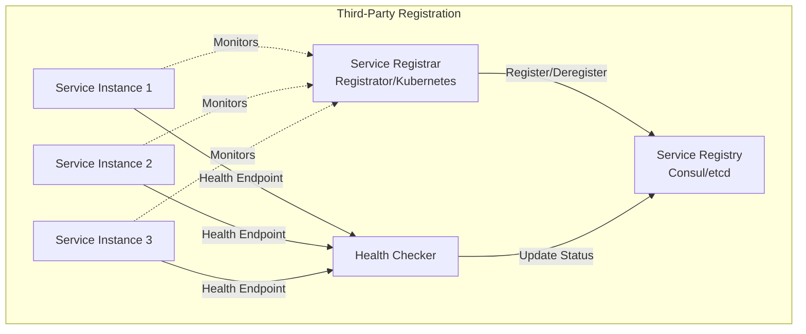
```mermaid
graph TB
    subgraph "Third-Party Registration"
        S1[Service Instance 1]
        S2[Service Instance 2]
        S3[Service Instance 3]

        SR[Service Registrar<br/>Registrator/Kubernetes]

        REG[Service Registry<br/>Consul/etcd]

        S1 & S2 & S3 -.->|Monitors| SR
        SR -->|Register/Deregister| REG

        HC[Health Checker]
        S1 & S2 & S3 -->|Health Endpoint| HC
        HC -->|Update Status| REG
    end
```

**Example with Kubernetes:**

```yaml
apiVersion: v1
kind: Service
metadata:
  name: order-service
spec:
  selector:
    app: order
  ports:
    - protocol: TCP
      port: 80
      targetPort: 8080
  type: ClusterIP

---
apiVersion: apps/v1
kind: Deployment
metadata:
  name: order-deployment
spec:
  replicas: 3
  selector:
    matchLabels:
      app: order
  template:
    metadata:
      labels:
        app: order
    spec:
      containers:
        - name: order-service
          image: order-service:v1
          ports:
            - containerPort: 8080
          livenessProbe:
            httpGet:
              path: /health
              port: 8080
            initialDelaySeconds: 30
            periodSeconds: 10
```

---

## Popular Service Registry Solutions

### Comparison Matrix

| Feature               | Consul      | Eureka         | etcd        | Zookeeper   | Kubernetes DNS |
| --------------------- | ----------- | -------------- | ----------- | ----------- | -------------- |
| **Language**          | Go          | Java           | Go          | Java        | Go             |
| **Consistency Model** | CP (Strong) | AP (Available) | CP (Strong) | CP (Strong) | AP (Available) |
| **Health Checks**     | ✅ Built-in | ✅ Built-in    | ❌ External | ❌ External | ✅ Built-in    |
| **Service Mesh**      | ✅ Yes      | ❌ No          | ❌ No       | ❌ No       | ✅ With Istio  |
| **Key-Value Store**   | ✅ Yes      | ❌ No          | ✅ Yes      | ✅ Yes      | ❌ No          |
| **Multi-DC Support**  | ✅ Yes      | ✅ Yes         | ⚠️ Limited  | ⚠️ Limited  | ✅ Yes         |
| **UI Dashboard**      | ✅ Yes      | ✅ Yes         | ❌ No       | ❌ No       | ⚠️ Third-party |
| **DNS Interface**     | ✅ Yes      | ❌ No          | ❌ No       | ❌ No       | ✅ Yes         |
| **Learning Curve**    | Medium      | Easy           | Medium      | Hard        | Easy           |

---

### 1. Consul (HashiCorp)

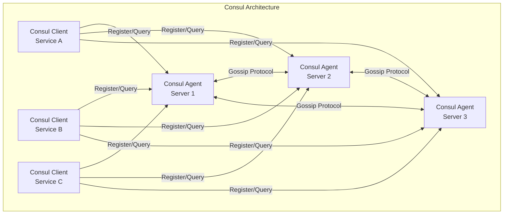
```mermaid
graph TB
    subgraph "Consul Architecture"
        C1[Consul Agent<br/>Server 1]
        C2[Consul Agent<br/>Server 2]
        C3[Consul Agent<br/>Server 3]

        CA1[Consul Client<br/>Service A]
        CA2[Consul Client<br/>Service B]
        CA3[Consul Client<br/>Service C]

        CA1 & CA2 & CA3 -->|Register/Query| C1
        CA1 & CA2 & CA3 -->|Register/Query| C2
        CA1 & CA2 & CA3 -->|Register/Query| C3

        C1 <-->|Gossip Protocol| C2
        C2 <-->|Gossip Protocol| C3
        C3 <-->|Gossip Protocol| C1
    end
```

**Key Features:**

- Strong consistency (CP in CAP)
- Built-in health checking
- Multi-datacenter support
- Service mesh capabilities
- Key-value store
- DNS interface

**Example Configuration:**

```json
{
  "service": {
    "name": "order-service",
    "tags": ["production", "v1.2"],
    "address": "192.168.1.10",
    "port": 8080,
    "checks": [
      {
        "http": "http://192.168.1.10:8080/health",
        "interval": "10s",
        "timeout": "1s"
      }
    ]
  }
}
```

**Use Cases:**

- Multi-datacenter deployments
- Service mesh requirements
- Need for strong consistency
- Complex networking requirements

---

### 2. Netflix Eureka

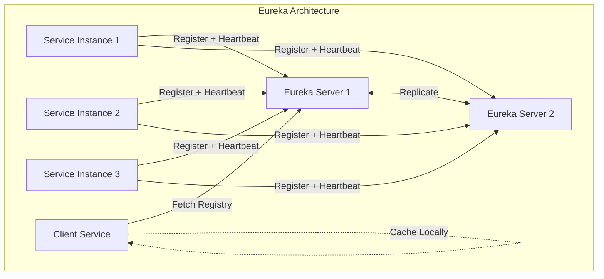
```mermaid
graph TB
    subgraph "Eureka Architecture"
        ES1[Eureka Server 1]
        ES2[Eureka Server 2]

        ES1 <-->|Replicate| ES2

        S1[Service Instance 1]
        S2[Service Instance 2]
        S3[Service Instance 3]

        S1 & S2 & S3 -->|Register + Heartbeat| ES1
        S1 & S2 & S3 -->|Register + Heartbeat| ES2

        C1[Client Service]
        C1 -->|Fetch Registry| ES1
        C1 -.->|Cache Locally| C1
    end
```

**Key Features:**

- AP in CAP (prioritizes availability)
- Client-side caching
- Self-preservation mode
- Easy Spring Cloud integration
- Zone awareness

**Example Configuration:**

```yaml
# Eureka Server
eureka:
  server:
    enableSelfPreservation: false
    evictionIntervalTimerInMs: 10000
  client:
    registerWithEureka: false
    fetchRegistry: false

# Service Registration
eureka:
  client:
    serviceUrl:
      defaultZone: http://eureka-server:8761/eureka/
  instance:
    preferIpAddress: true
    instanceId: ${spring.application.name}:${random.value}
```

**Use Cases:**

- Spring Boot/Cloud ecosystem
- AWS deployments
- Tolerance for eventual consistency
- High availability priority

---

### 3. etcd

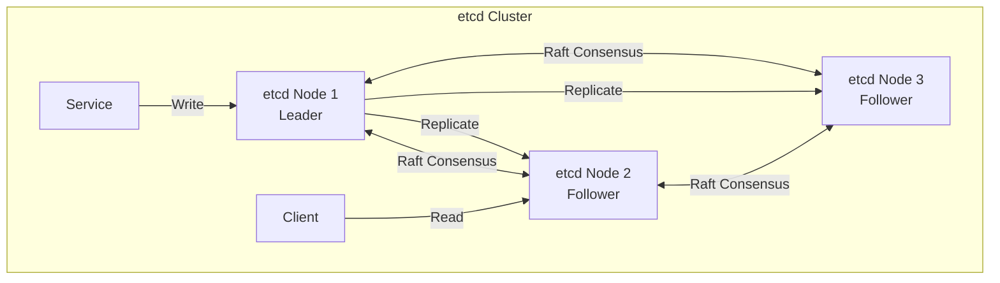
```mermaid
graph TB
    subgraph "etcd Cluster"
        E1[etcd Node 1<br/>Leader]
        E2[etcd Node 2<br/>Follower]
        E3[etcd Node 3<br/>Follower]

        E1 <-->|Raft Consensus| E2
        E2 <-->|Raft Consensus| E3
        E3 <-->|Raft Consensus| E1

        S[Service] -->|Write| E1
        E1 -->|Replicate| E2
        E1 -->|Replicate| E3

        C[Client] -->|Read| E2
    end
```

**Key Features:**

- Strong consistency (Raft consensus)
- Key-value store
- Watch mechanism
- TTL support
- Used by Kubernetes

**Example:**

```bash
# Register service
etcdctl put /services/order-service/instance1 \
  '{"host":"192.168.1.10","port":8080}' \
  --lease=<lease-id>

# Discover services
etcdctl get /services/order-service --prefix

# Watch for changes
etcdctl watch /services/order-service --prefix
```

**Use Cases:**

- Kubernetes environments
- Strong consistency requirements
- Configuration management
- Distributed coordination

---

### 4. Apache Zookeeper

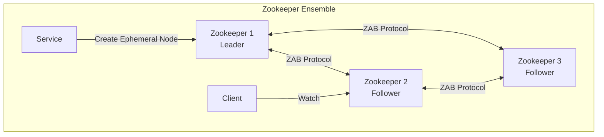
```mermaid
graph TB
    subgraph "Zookeeper Ensemble"
        Z1[Zookeeper 1<br/>Leader]
        Z2[Zookeeper 2<br/>Follower]
        Z3[Zookeeper 3<br/>Follower]

        Z1 <-->|ZAB Protocol| Z2
        Z2 <-->|ZAB Protocol| Z3
        Z3 <-->|ZAB Protocol| Z1

        S[Service] -->|Create Ephemeral Node| Z1
        C[Client] -->|Watch| Z2
    end
```

**Key Features:**

- Strong consistency
- Mature and battle-tested
- Hierarchical namespace
- Watchers for changes
- Leader election support

**Example:**

```java
// Service Registration
String servicePath = "/services/order-service/instance-" + UUID.randomUUID();
zookeeper.create(
    servicePath,
    serviceInfo.getBytes(),
    ZooDefs.Ids.OPEN_ACL_UNSAFE,
    CreateMode.EPHEMERAL  // Auto-deleted on disconnect
);

// Service Discovery
List<String> instances = zookeeper.getChildren("/services/order-service", watcher);
```

**Use Cases:**

- Legacy systems
- Kafka/Hadoop ecosystems
- Distributed coordination
- Leader election needs

---

### 5. Kubernetes Service Discovery

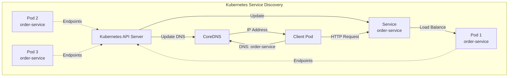
```mermaid
graph TB
    subgraph "Kubernetes Service Discovery"
        API[Kubernetes API Server]
        DNS[CoreDNS]

        P1[Pod 1<br/>order-service]
        P2[Pod 2<br/>order-service]
        P3[Pod 3<br/>order-service]

        SVC[Service<br/>order-service]

        P1 & P2 & P3 -.->|Endpoints| API
        API -->|Update| SVC
        API -->|Update DNS| DNS

        Client[Client Pod] -->|DNS: order-service| DNS
        DNS -->|IP Address| Client
        Client -->|HTTP Request| SVC
        SVC -->|Load Balance| P1
    end
```

**Key Features:**

- Native to Kubernetes
- DNS-based discovery
- Built-in load balancing
- Automatic endpoint management
- No additional infrastructure

**Example:**

```yaml
# Service definition
apiVersion: v1
kind: Service
metadata:
  name: order-service
spec:
  selector:
    app: order
  ports:
    - port: 80
      targetPort: 8080
  type: ClusterIP

# Access from another pod
curl http://order-service.default.svc.cluster.local/api/orders
```

---

## Implementation Patterns

### Registration Flow

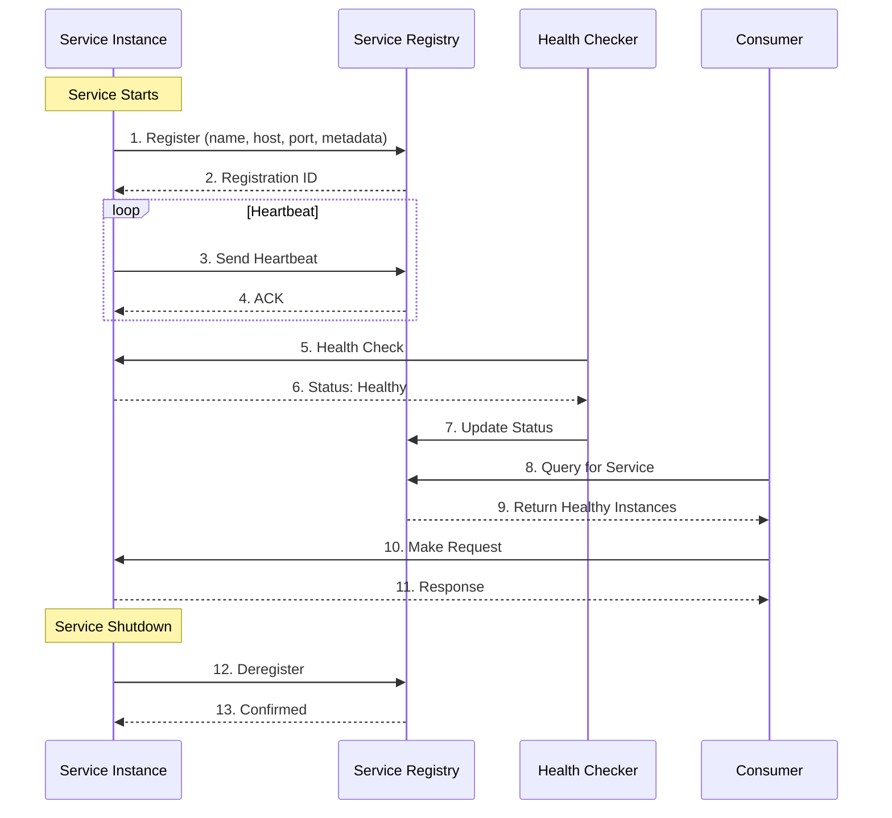
```mermaid
sequenceDiagram
    participant S as Service Instance
    participant R as Service Registry
    participant H as Health Checker
    participant C as Consumer

    Note over S: Service Starts
    S->>R: 1. Register (name, host, port, metadata)
    R-->>S: 2. Registration ID

    loop Heartbeat
        S->>R: 3. Send Heartbeat
        R-->>S: 4. ACK
    end

    H->>S: 5. Health Check
    S-->>H: 6. Status: Healthy
    H->>R: 7. Update Status

    C->>R: 8. Query for Service
    R-->>C: 9. Return Healthy Instances

    C->>S: 10. Make Request
    S-->>C: 11. Response

    Note over S: Service Shutdown
    S->>R: 12. Deregister
    R-->>S: 13. Confirmed
```

---

### Discovery Flow with Caching

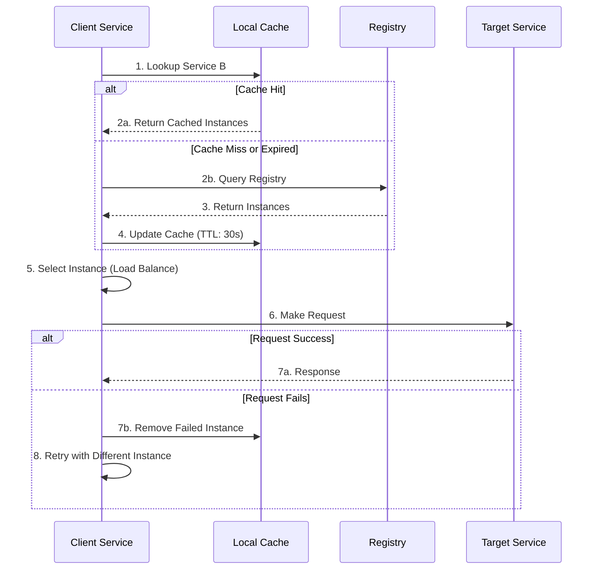
```mermaid
sequenceDiagram
    participant C as Client Service
    participant Cache as Local Cache
    participant R as Registry
    participant S as Target Service

    C->>Cache: 1. Lookup Service B

    alt Cache Hit
        Cache-->>C: 2a. Return Cached Instances
    else Cache Miss or Expired
        C->>R: 2b. Query Registry
        R-->>C: 3. Return Instances
        C->>Cache: 4. Update Cache (TTL: 30s)
    end

    C->>C: 5. Select Instance (Load Balance)
    C->>S: 6. Make Request

    alt Request Success
        S-->>C: 7a. Response
    else Request Fails
        C->>Cache: 7b. Remove Failed Instance
        C->>C: 8. Retry with Different Instance
    end
```

---

## Health Checks and Monitoring

### Health Check Types

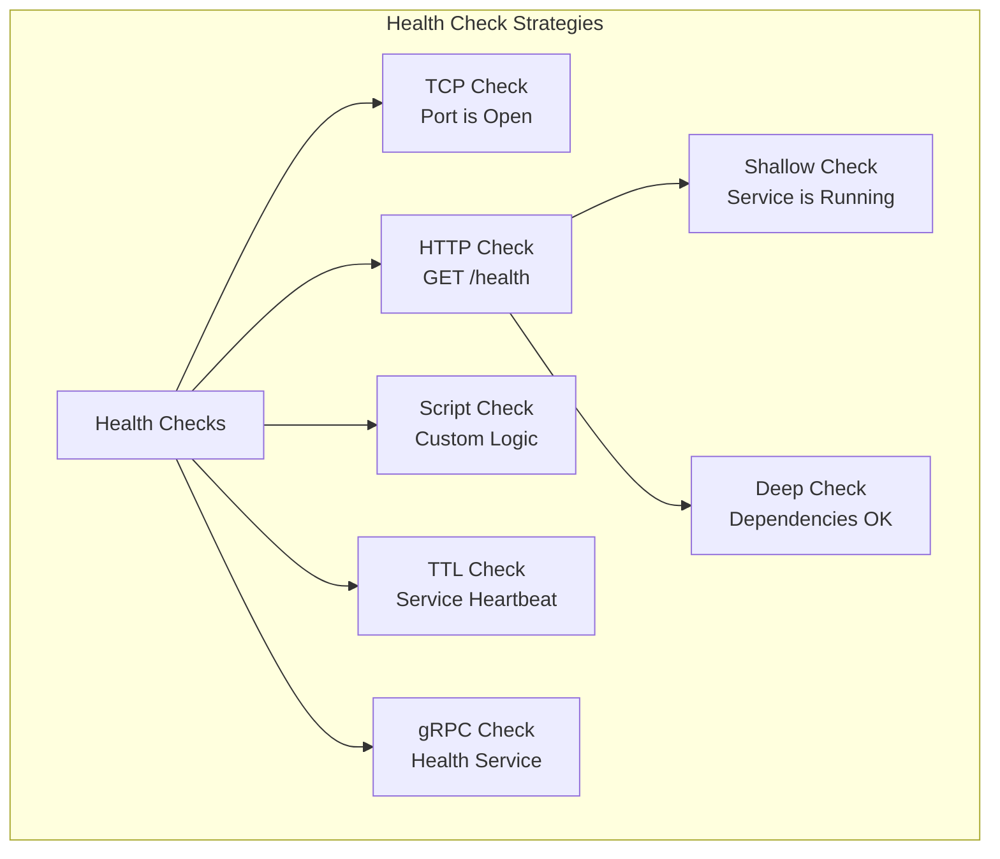
```mermaid
graph TB
    subgraph "Health Check Strategies"
        HC[Health Checks]

        HC --> T1[TCP Check<br/>Port is Open]
        HC --> T2[HTTP Check<br/>GET /health]
        HC --> T3[Script Check<br/>Custom Logic]
        HC --> T4[TTL Check<br/>Service Heartbeat]
        HC --> T5[gRPC Check<br/>Health Service]

        T2 --> D1[Shallow Check<br/>Service is Running]
        T2 --> D2[Deep Check<br/>Dependencies OK]
    end
```

### Health Check Implementation

```java
@RestController
@RequestMapping("/health")
public class HealthController {

    @Autowired
    private DatabaseService database;

    @Autowired
    private CacheService cache;

    // Shallow health check (liveness)
    @GetMapping("/live")
    public ResponseEntity<String> liveness() {
        return ResponseEntity.ok("OK");
    }

    // Deep health check (readiness)
    @GetMapping("/ready")
    public ResponseEntity<HealthStatus> readiness() {
        HealthStatus status = new HealthStatus();

        // Check database
        try {
            database.ping();
            status.addCheck("database", "UP");
        } catch (Exception e) {
            status.addCheck("database", "DOWN");
            return ResponseEntity.status(503).body(status);
        }

        // Check cache
        try {
            cache.ping();
            status.addCheck("cache", "UP");
        } catch (Exception e) {
            status.addCheck("cache", "DEGRADED");
        }

        return ResponseEntity.ok(status);
    }
}
```

### Health Check States

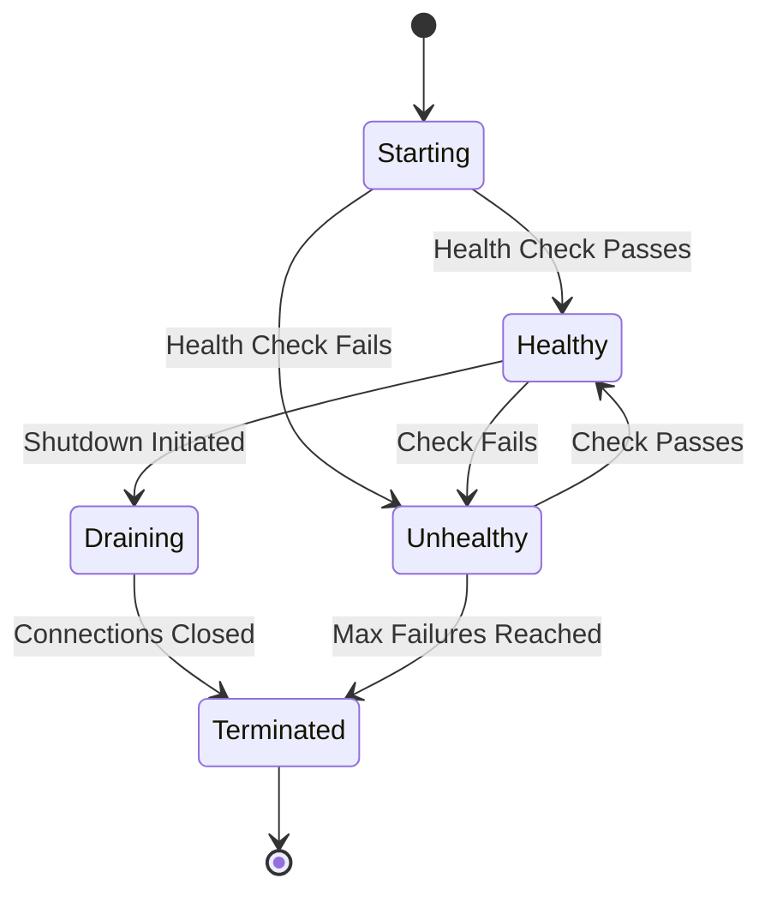
```mermaid
stateDiagram-v2
    [*] --> Starting
    Starting --> Healthy: Health Check Passes
    Starting --> Unhealthy: Health Check Fails

    Healthy --> Unhealthy: Check Fails
    Unhealthy --> Healthy: Check Passes

    Healthy --> Draining: Shutdown Initiated
    Draining --> Terminated: Connections Closed
    Terminated --> [*]

    Unhealthy --> Terminated: Max Failures Reached
```

---

## Load Balancing Strategies

### Load Balancing Algorithms

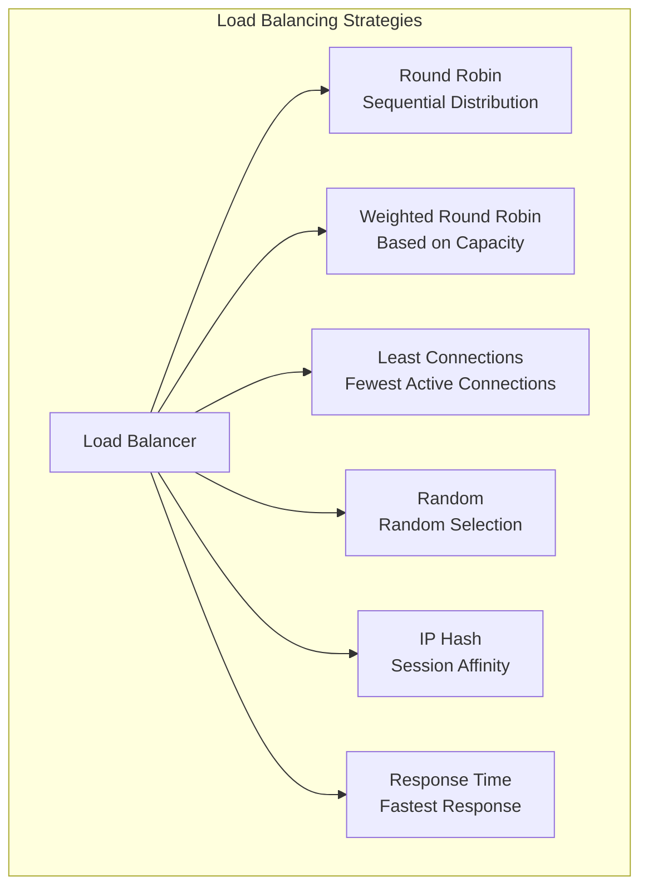
```mermaid
graph TB
    subgraph "Load Balancing Strategies"
        LB[Load Balancer]

        LB --> RR[Round Robin<br/>Sequential Distribution]
        LB --> WRR[Weighted Round Robin<br/>Based on Capacity]
        LB --> LCM[Least Connections<br/>Fewest Active Connections]
        LB --> RND[Random<br/>Random Selection]
        LB --> IPH[IP Hash<br/>Session Affinity]
        LB --> RT[Response Time<br/>Fastest Response]
    end
```

### Implementation Examples

**Round Robin:**

```java
public class RoundRobinLoadBalancer implements LoadBalancer {
    private final AtomicInteger counter = new AtomicInteger(0);

    @Override
    public ServiceInstance select(List<ServiceInstance> instances) {
        if (instances.isEmpty()) {
            throw new NoAvailableInstanceException();
        }

        int index = Math.abs(counter.getAndIncrement() % instances.size());
        return instances.get(index);
    }
}
```

**Weighted Round Robin:**

```java
public class WeightedRoundRobinLoadBalancer implements LoadBalancer {

    @Override
    public ServiceInstance select(List<ServiceInstance> instances) {
        int totalWeight = instances.stream()
            .mapToInt(ServiceInstance::getWeight)
            .sum();

        int random = ThreadLocalRandom.current().nextInt(totalWeight);
        int sum = 0;

        for (ServiceInstance instance : instances) {
            sum += instance.getWeight();
            if (random < sum) {
                return instance;
            }
        }

        return instances.get(0);
    }
}
```

**Least Connections:**

```java
public class LeastConnectionsLoadBalancer implements LoadBalancer {
    private final Map<String, AtomicInteger> connections = new ConcurrentHashMap<>();

    @Override
    public ServiceInstance select(List<ServiceInstance> instances) {
        return instances.stream()
            .min(Comparator.comparingInt(i ->
                connections.computeIfAbsent(i.getId(), k -> new AtomicInteger(0)).get()
            ))
            .orElseThrow(NoAvailableInstanceException::new);
    }

    public void incrementConnections(String instanceId) {
        connections.get(instanceId).incrementAndGet();
    }

    public void decrementConnections(String instanceId) {
        connections.get(instanceId).decrementAndGet();
    }
}
```

---

## Best Practices

### 1. Registration Strategy

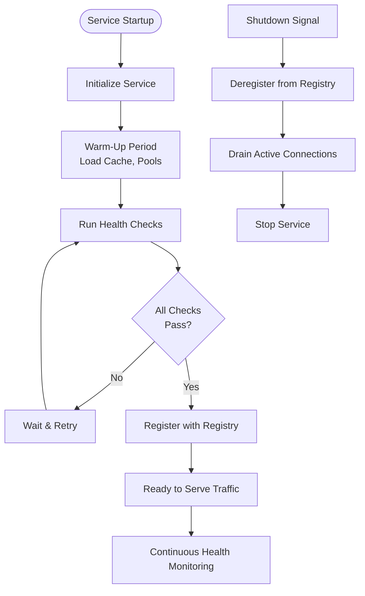
```mermaid
graph TB
    Start([Service Startup])

    Start --> Init[Initialize Service]
    Init --> WarmUp[Warm-Up Period<br/>Load Cache, Pools]
    WarmUp --> Health[Run Health Checks]

    Health --> Ready{All Checks<br/>Pass?}

    Ready -->|No| Wait[Wait & Retry]
    Wait --> Health

    Ready -->|Yes| Register[Register with Registry]
    Register --> Serve[Ready to Serve Traffic]

    Serve --> Monitor[Continuous Health Monitoring]

    Shutdown[Shutdown Signal] --> Deregister[Deregister from Registry]
    Deregister --> Drain[Drain Active Connections]
    Drain --> Stop[Stop Service]
```

### 2. Graceful Shutdown

```java
@Component
public class GracefulShutdownHandler {

    @Autowired
    private ServiceRegistry registry;

    @Autowired
    private ConnectionManager connectionManager;

    @PreDestroy
    public void shutdown() {
        log.info("Initiating graceful shutdown");

        // 1. Deregister from service registry
        registry.deregister();
        log.info("Deregistered from service registry");

        // 2. Stop accepting new requests
        stopAcceptingRequests();

        // 3. Wait for existing requests to complete
        int maxWaitSeconds = 30;
        int waited = 0;

        while (connectionManager.hasActiveConnections() && waited < maxWaitSeconds) {
            Thread.sleep(1000);
            waited++;
            log.info("Waiting for {} active connections",
                connectionManager.getActiveConnectionCount());
        }

        // 4. Force close remaining connections
        if (connectionManager.hasActiveConnections()) {
            log.warn("Force closing {} connections",
                connectionManager.getActiveConnectionCount());
            connectionManager.closeAll();
        }

        log.info("Graceful shutdown complete");
    }
}
```

### 3. Retry and Circuit Breaker

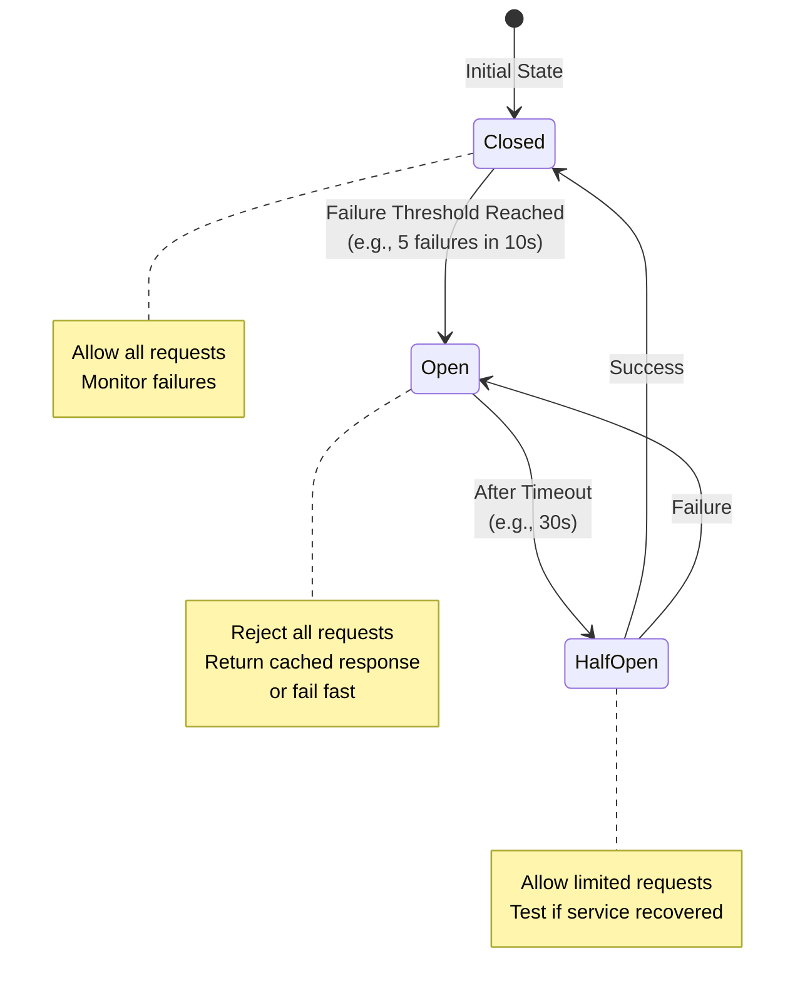
```mermaid
stateDiagram-v2
    [*] --> Closed: Initial State

    Closed --> Open: Failure Threshold Reached<br/>(e.g., 5 failures in 10s)

    Open --> HalfOpen: After Timeout<br/>(e.g., 30s)

    HalfOpen --> Closed: Success
    HalfOpen --> Open: Failure

    note right of Closed
        Allow all requests
        Monitor failures
    end note

    note right of Open
        Reject all requests
        Return cached response
        or fail fast
    end note

    note right of HalfOpen
        Allow limited requests
        Test if service recovered
    end note
```

### 4. Caching Strategy

```java
@Service
public class ServiceDiscoveryClient {

    private final LoadingCache<String, List<ServiceInstance>> cache;
    private final ServiceRegistry registry;

    public ServiceDiscoveryClient(ServiceRegistry registry) {
        this.registry = registry;
        this.cache = CacheBuilder.newBuilder()
            .expireAfterWrite(30, TimeUnit.SECONDS)  // TTL
            .refreshAfterWrite(20, TimeUnit.SECONDS) // Background refresh
            .build(new CacheLoader<String, List<ServiceInstance>>() {
                @Override
                public List<ServiceInstance> load(String serviceName) {
                    return registry.getInstances(serviceName);
                }
            });
    }

    public List<ServiceInstance> getInstances(String serviceName) {
        try {
            return cache.get(serviceName);
        } catch (ExecutionException e) {
            log.error("Failed to get instances for service: {}", serviceName, e);
            return Collections.emptyList();
        }
    }

    public void invalidate(String serviceName) {
        cache.invalidate(serviceName);
    }
}
```

### 5. Multi-Region Strategy

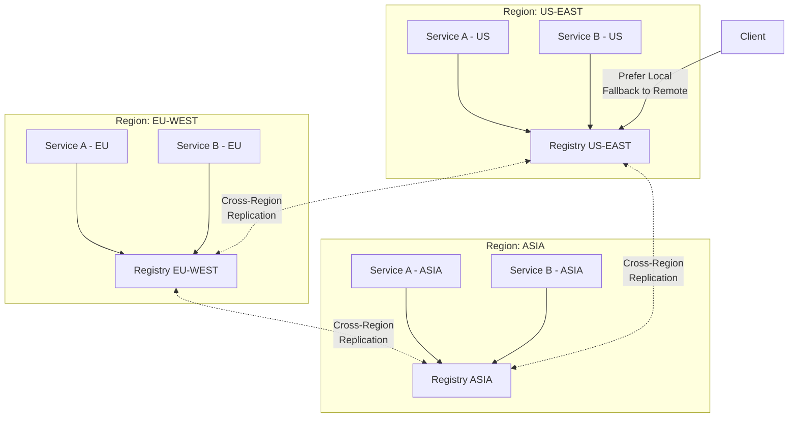
```mermaid
graph TB
    subgraph "Region: US-EAST"
        R1[Registry US-EAST]
        S1[Service A - US]
        S2[Service B - US]
    end

    subgraph "Region: EU-WEST"
        R2[Registry EU-WEST]
        S3[Service A - EU]
        S4[Service B - EU]
    end

    subgraph "Region: ASIA"
        R3[Registry ASIA]
        S5[Service A - ASIA]
        S6[Service B - ASIA]
    end

    R1 <-.->|Cross-Region<br/>Replication| R2
    R2 <-.->|Cross-Region<br/>Replication| R3
    R3 <-.->|Cross-Region<br/>Replication| R1

    S1 & S2 --> R1
    S3 & S4 --> R2
    S5 & S6 --> R3

    Client[Client] -->|Prefer Local<br/>Fallback to Remote| R1
```

---

## Pros and Cons

### Advantages

| Benefit                      | Description                                                 | Impact |
| ---------------------------- | ----------------------------------------------------------- | ------ |
| **Dynamic Scaling**          | Services can be added/removed without configuration changes | High   |
| **Fault Tolerance**          | Failed instances automatically removed from routing         | High   |
| **Load Distribution**        | Requests distributed across healthy instances               | High   |
| **Simplified Configuration** | No hardcoded endpoints in service code                      | Medium |
| **Service Versioning**       | Multiple versions can coexist with metadata                 | Medium |
| **Environment Agnostic**     | Same code works in dev, staging, production                 | Medium |
| **Monitoring Integration**   | Central view of all service instances                       | Low    |

### Disadvantages

| Challenge                   | Description                                 | Mitigation                              |
| --------------------------- | ------------------------------------------- | --------------------------------------- |
| **Single Point of Failure** | Registry failure affects entire system      | Use clustered registry with replication |
| **Network Overhead**        | Additional network calls for discovery      | Implement client-side caching with TTL  |
| **Complexity**              | Additional infrastructure to manage         | Use managed services or Kubernetes      |
| **Eventual Consistency**    | Registry may have stale data                | Implement health checks and heartbeats  |
| **Latency**                 | Discovery adds latency to requests          | Cache registry responses aggressively   |
| **Debugging Difficulty**    | Dynamic nature makes troubleshooting harder | Implement distributed tracing           |

### Trade-off Analysis

```mermaid
graph TB
    subgraph "CP Systems (Consistency + Partition Tolerance)"
        CP[Consul, etcd, Zookeeper]
        CP_PROS[✅ Strong Consistency<br/>✅ Accurate Data<br/>✅ Reliable Reads]
        CP_CONS[❌ May Become Unavailable<br/>❌ Higher Latency<br/>❌ Write Bottlenecks]

        CP --> CP_PROS
        CP --> CP_CONS
    end

    subgraph "AP Systems (Availability + Partition Tolerance)"
        AP[Eureka]
        AP_PROS[✅ Always Available<br/>✅ Low Latency<br/>✅ Better Performance]
        AP_CONS[❌ Eventual Consistency<br/>❌ Stale Data Possible<br/>❌ Requires Client Logic]

        AP --> AP_PROS
        AP --> AP_CONS
    end
```

---

## Real-World Examples

### Example 1: E-Commerce Platform

```mermaid
graph TB
    subgraph "Service Registry Layer"
        CONSUL[Consul Cluster<br/>3 Nodes]
    end

    subgraph "API Gateway"
        GW[Kong/API Gateway]
    end

    subgraph "Services"
        USER[User Service<br/>3 instances]
        PRODUCT[Product Service<br/>5 instances]
        ORDER[Order Service<br/>4 instances]
        PAYMENT[Payment Service<br/>2 instances]
        INVENTORY[Inventory Service<br/>3 instances]
        NOTIFICATION[Notification Service<br/>2 instances]
    end

    USER & PRODUCT & ORDER & PAYMENT & INVENTORY & NOTIFICATION -->|Register + Heartbeat| CONSUL

    GW -->|Discover Services| CONSUL

    CLIENT[Mobile/Web Client] --> GW
    GW -->|Route| USER
    GW -->|Route| PRODUCT
    GW -->|Route| ORDER

    ORDER -->|Call| PAYMENT
    ORDER -->|Call| INVENTORY
    ORDER -->|Call| NOTIFICATION
```

**Architecture Details:**

- **Service Registry:** Consul (3-node cluster for HA)
- **Discovery Pattern:** Server-side (via API Gateway)
- **Health Checks:** HTTP endpoint every 10 seconds
- **Load Balancing:** Weighted round-robin based on instance capacity
- **Scaling:** Auto-scaling based on CPU/memory metrics

**Configuration Example:**

```json
{
  "service": {
    "name": "order-service",
    "tags": ["production", "v2.1.0", "region:us-east"],
    "port": 8080,
    "meta": {
      "version": "2.1.0",
      "weight": "100",
      "region": "us-east-1"
    },
    "checks": [
      {
        "http": "http://localhost:8080/actuator/health",
        "interval": "10s",
        "timeout": "2s",
        "deregister_critical_service_after": "1m"
      }
    ]
  }
}
```

---

### Example 2: Netflix-Style Architecture

```mermaid
graph TB
    subgraph "Eureka HA Setup"
        E1[Eureka Server<br/>US-EAST-1A]
        E2[Eureka Server<br/>US-EAST-1B]
        E3[Eureka Server<br/>US-WEST-2A]

        E1 <-->|Replicate| E2
        E2 <-->|Replicate| E3
        E3 <-->|Replicate| E1
    end

    subgraph "Microservices"
        direction TB
        VIDEO[Video Service]
        RECOMMENDATION[Recommendation Service]
        USER_PROFILE[User Profile Service]
        BILLING[Billing Service]
    end

    subgraph "Client"
        RIBBON[Ribbon<br/>Client-Side LB]
        HYSTRIX[Hystrix<br/>Circuit Breaker]
        ZUUL[Zuul<br/>API Gateway]
    end

    VIDEO & RECOMMENDATION & USER_PROFILE & BILLING -->|Register| E1
    VIDEO & RECOMMENDATION & USER_PROFILE & BILLING -->|Register| E2

    RIBBON -->|Fetch Registry| E1
    RIBBON -->|Cache Locally| RIBBON

    ZUUL --> RIBBON
    RIBBON --> HYSTRIX
    HYSTRIX -->|With Fallback| VIDEO
    HYSTRIX -->|With Fallback| RECOMMENDATION
```

**Key Features:**

- **Client-Side Discovery:** Ribbon for load balancing
- **Resilience:** Hystrix circuit breakers for fault tolerance
- **Caching:** 30-second local cache with delta updates
- **Self-Preservation:** Eureka stops evicting services during network issues
- **Zone Awareness:** Prefer same-zone instances

**Spring Cloud Configuration:**

```yaml
# Eureka Server
spring:
  application:
    name: eureka-server

eureka:
  server:
    enableSelfPreservation: true
    evictionIntervalTimerInMs: 60000
  client:
    registerWithEureka: true
    fetchRegistry: true
    serviceUrl:
      defaultZone: http://eureka-peer1:8761/eureka/,http://eureka-peer2:8762/eureka/

# Service Client
spring:
  application:
    name: video-service

eureka:
  client:
    serviceUrl:
      defaultZone: http://eureka1:8761/eureka/,http://eureka2:8762/eureka/
  instance:
    preferIpAddress: true
    leaseRenewalIntervalInSeconds: 30
    leaseExpirationDurationInSeconds: 90
    metadataMap:
      zone: us-east-1a
      version: 2.1.0

ribbon:
  eureka:
    enabled: true
  ServerListRefreshInterval: 30000
  NFLoadBalancerRuleClassName: com.netflix.loadbalancer.ZoneAvoidanceRule
```

---

### Example 3: Kubernetes Native

```mermaid
graph TB
    subgraph "Kubernetes Cluster"
        API[Kubernetes API Server]
        DNS[CoreDNS]
        ETCD[(etcd)]

        API <--> ETCD
        API --> DNS

        subgraph "Namespace: Production"
            SVC1[Service: order-api]
            SVC2[Service: payment-api]
            SVC3[Service: inventory-api]

            P1[Pod: order-1]
            P2[Pod: order-2]
            P3[Pod: order-3]

            P4[Pod: payment-1]
            P5[Pod: payment-2]

            P6[Pod: inventory-1]
            P7[Pod: inventory-2]

            SVC1 --> P1 & P2 & P3
            SVC2 --> P4 & P5
            SVC3 --> P6 & P7
        end

        INGRESS[Ingress Controller<br/>nginx/traefik]

        INGRESS -->|Route| SVC1
        INGRESS -->|Route| SVC2
        INGRESS -->|Route| SVC3
    end

    CLIENT[External Client] --> INGRESS

    P1 -->|DNS: payment-api.production.svc.cluster.local| DNS
    DNS -->|Resolve to ClusterIP| P1
```

**Manifest Example:**

```yaml
apiVersion: v1
kind: Service
metadata:
  name: order-api
  namespace: production
  labels:
    app: order
    tier: backend
spec:
  selector:
    app: order
  ports:
    - name: http
      port: 80
      targetPort: 8080
      protocol: TCP
    - name: grpc
      port: 9090
      targetPort: 9090
      protocol: TCP
  type: ClusterIP
  sessionAffinity: ClientIP
  sessionAffinityConfig:
    clientIP:
      timeoutSeconds: 3600

---
apiVersion: apps/v1
kind: Deployment
metadata:
  name: order-deployment
  namespace: production
spec:
  replicas: 3
  strategy:
    type: RollingUpdate
    rollingUpdate:
      maxSurge: 1
      maxUnavailable: 0
  selector:
    matchLabels:
      app: order
  template:
    metadata:
      labels:
        app: order
        version: v2.1
    spec:
      containers:
        - name: order-service
          image: order-service:2.1.0
          ports:
            - containerPort: 8080
              name: http
            - containerPort: 9090
              name: grpc
          env:
            - name: SPRING_PROFILES_ACTIVE
              value: "production"
            - name: PAYMENT_SERVICE_URL
              value: "http://payment-api.production.svc.cluster.local"
            - name: INVENTORY_SERVICE_URL
              value: "http://inventory-api.production.svc.cluster.local"
          livenessProbe:
            httpGet:
              path: /actuator/health/liveness
              port: 8080
            initialDelaySeconds: 60
            periodSeconds: 10
            timeoutSeconds: 5
            failureThreshold: 3
          readinessProbe:
            httpGet:
              path: /actuator/health/readiness
              port: 8080
            initialDelaySeconds: 30
            periodSeconds: 5
            timeoutSeconds: 3
            failureThreshold: 3
          resources:
            requests:
              memory: "512Mi"
              cpu: "250m"
            limits:
              memory: "1Gi"
              cpu: "500m"

---
apiVersion: autoscaling/v2
kind: HorizontalPodAutoscaler
metadata:
  name: order-hpa
  namespace: production
spec:
  scaleTargetRef:
    apiVersion: apps/v1
    kind: Deployment
    name: order-deployment
  minReplicas: 3
  maxReplicas: 10
  metrics:
    - type: Resource
      resource:
        name: cpu
        target:
          type: Utilization
          averageUtilization: 70
    - type: Resource
      resource:
        name: memory
        target:
          type: Utilization
          averageUtilization: 80
```

**Service Communication:**

```java
@Service
public class OrderService {

    // Using Kubernetes DNS
    @Value("${payment.service.url}")
    private String paymentServiceUrl; // http://payment-api.production.svc.cluster.local

    private final RestTemplate restTemplate;

    public PaymentResponse processPayment(PaymentRequest request) {
        // Kubernetes handles service discovery via DNS
        // Built-in load balancing across pod IPs
        return restTemplate.postForObject(
            paymentServiceUrl + "/api/payments",
            request,
            PaymentResponse.class
        );
    }
}
```

---

### Example 4: Multi-Cloud Setup with Consul

```mermaid
graph TB
    subgraph "AWS Region"
        AWS_CONSUL[Consul Datacenter: AWS]
        AWS_SVC1[Service A - AWS]
        AWS_SVC2[Service B - AWS]

        AWS_SVC1 & AWS_SVC2 --> AWS_CONSUL
    end

    subgraph "Azure Region"
        AZURE_CONSUL[Consul Datacenter: Azure]
        AZURE_SVC1[Service A - Azure]
        AZURE_SVC2[Service C - Azure]

        AZURE_SVC1 & AZURE_SVC2 --> AZURE_CONSUL
    end

    subgraph "GCP Region"
        GCP_CONSUL[Consul Datacenter: GCP]
        GCP_SVC1[Service B - GCP]
        GCP_SVC2[Service D - GCP]

        GCP_SVC1 & GCP_SVC2 --> GCP_CONSUL
    end

    AWS_CONSUL <-->|WAN Gossip| AZURE_CONSUL
    AZURE_CONSUL <-->|WAN Gossip| GCP_CONSUL
    GCP_CONSUL <-->|WAN Gossip| AWS_CONSUL

    CLIENT[Client Service<br/>Prefer Local DC] --> AWS_CONSUL
    CLIENT -.->|Failover| AZURE_CONSUL
```

**Consul Configuration:**

```hcl
# Consul Server Configuration
datacenter = "aws-us-east-1"
data_dir = "/opt/consul/data"
log_level = "INFO"

server = true
bootstrap_expect = 3

# Bind to private network
bind_addr = "{{ GetPrivateIP }}"
client_addr = "0.0.0.0"

# UI
ui_config {
  enabled = true
}

# WAN Join for multi-datacenter
retry_join_wan = [
  "consul-azure-1.example.com",
  "consul-gcp-1.example.com"
]

# Performance tuning
performance {
  raft_multiplier = 1
}

# Service mesh
connect {
  enabled = true
}
```

**Multi-DC Service Query:**

```go
// Query local datacenter first
func (d *Discovery) GetServiceInstances(serviceName string) ([]*ServiceInstance, error) {
    // Try local DC
    instances, _, err := d.consulClient.Health().Service(
        serviceName,
        "",
        true, // passing only
        &api.QueryOptions{
            Datacenter: d.localDC,
        },
    )

    if err == nil && len(instances) > 0 {
        return parseInstances(instances), nil
    }

    // Fallback to other datacenters
    for _, dc := range d.fallbackDCs {
        instances, _, err = d.consulClient.Health().Service(
            serviceName,
            "",
            true,
            &api.QueryOptions{
                Datacenter: dc,
            },
        )

        if err == nil && len(instances) > 0 {
            log.Printf("Using service from fallback DC: %s", dc)
            return parseInstances(instances), nil
        }
    }

    return nil, fmt.Errorf("service %s not found in any datacenter", serviceName)
}
```

---

## Monitoring and Observability

### Key Metrics to Track

```mermaid
graph TB
    subgraph "Service Registry Metrics"
        REG[Registry Metrics]

        REG --> M1[Registration Rate<br/>Services/sec]
        REG --> M2[Deregistration Rate<br/>Services/sec]
        REG --> M3[Health Check Success Rate<br/>%]
        REG --> M4[Registry Size<br/>Total Services]
        REG --> M5[Query Latency<br/>ms]
        REG --> M6[Cache Hit Rate<br/>%]
    end

    subgraph "Service Metrics"
        SVC[Service Metrics]

        SVC --> S1[Heartbeat Failures<br/>Count]
        SVC --> S2[Instance Count<br/>Per Service]
        SVC --> S3[Instance Health<br/>Healthy/Total]
        SVC --> S4[Version Distribution<br/>Per Service]
    end

    subgraph "Client Metrics"
        CLI[Client Metrics]

        CLI --> C1[Discovery Errors<br/>Count]
        CLI --> C2[Load Balancer Selection<br/>Time]
        CLI --> C3[Circuit Breaker Status<br/>Open/Closed]
        CLI --> C4[Request Distribution<br/>Per Instance]
    end
```

### Prometheus Monitoring Setup

```yaml
# Prometheus scrape config
scrape_configs:
  - job_name: "consul"
    consul_sd_configs:
      - server: "consul.service.consul:8500"
    relabel_configs:
      - source_labels: [__meta_consul_service]
        target_label: service
      - source_labels: [__meta_consul_tags]
        target_label: tags

  - job_name: "services"
    consul_sd_configs:
      - server: "consul.service.consul:8500"
        services: ["order-service", "payment-service"]
    metrics_path: "/actuator/prometheus"
    relabel_configs:
      - source_labels: [__meta_consul_service]
        target_label: service
      - source_labels: [__meta_consul_node]
        target_label: instance
```

### Alerting Rules

```yaml
groups:
  - name: service_discovery
    interval: 30s
    rules:
      - alert: ServiceInstancesLow
        expr: sum(up{job="services"}) by (service) < 2
        for: 5m
        labels:
          severity: warning
        annotations:
          summary: "Low instance count for {{ $labels.service }}"
          description: "Service {{ $labels.service }} has less than 2 healthy instances"

      - alert: RegistryUnhealthy
        expr: up{job="consul"} == 0
        for: 2m
        labels:
          severity: critical
        annotations:
          summary: "Service registry is down"
          description: "Consul server {{ $labels.instance }} is unreachable"

      - alert: HighHealthCheckFailureRate
        expr: rate(consul_health_check_failures_total[5m]) > 0.1
        for: 10m
        labels:
          severity: warning
        annotations:
          summary: "High health check failure rate"
          description: "Health check failure rate is {{ $value }} per second"
```

---

## Migration Strategy

### From Hardcoded to Service Discovery

```mermaid
graph LR
    subgraph "Phase 1: Current State"
        A1[Service A] -.->|Hardcoded<br/>IP:Port| B1[Service B]
    end

    subgraph "Phase 2: Dual Mode"
        A2[Service A] -->|Config Toggle| DUAL{Resolver}
        DUAL -->|Legacy Mode| HC[Hardcoded]
        DUAL -->|New Mode| REG[Service Registry]
        HC -.-> B2[Service B]
        REG --> B2
    end

    subgraph "Phase 3: Registry Only"
        A3[Service A] -->|Discover| REG2[Service Registry]
        REG2 --> B3[Service B]
    end

    Phase1 --> Phase2 --> Phase3
```

### Step-by-Step Migration

**Step 1: Deploy Service Registry**

```bash
# Deploy Consul cluster
docker-compose up -d consul-server-1 consul-server-2 consul-server-3

# Verify cluster health
consul members
consul catalog services
```

**Step 2: Implement Abstraction Layer**

```java
public interface ServiceResolver {
    List<ServiceInstance> resolve(String serviceName);
}

@Component
public class DualModeServiceResolver implements ServiceResolver {

    @Autowired
    private ServiceRegistry registry;

    @Value("${service.discovery.enabled:false}")
    private boolean discoveryEnabled;

    @Value("${services.payment.url}")
    private String paymentServiceUrl;

    @Override
    public List<ServiceInstance> resolve(String serviceName) {
        if (discoveryEnabled) {
            // New: Use service registry
            return registry.getInstances(serviceName);
        } else {
            // Legacy: Use hardcoded configuration
            return getLegacyInstances(serviceName);
        }
    }

    private List<ServiceInstance> getLegacyInstances(String serviceName) {
        String url = getConfiguredUrl(serviceName);
        // Parse URL and create ServiceInstance
        return Collections.singletonList(parseUrl(url));
    }
}
```

**Step 3: Enable Feature Flag**

```yaml
# Enable for canary services first
service:
  discovery:
    enabled: true
    canary:
      services:
        - order-service-canary
        - payment-service-canary
```

**Step 4: Gradual Rollout**

```mermaid
gantt
    title Service Discovery Migration Timeline
    dateFormat YYYY-MM-DD
    section Infrastructure
    Deploy Registry Cluster       :2024-01-01, 5d
    Setup Monitoring              :2024-01-03, 3d

    section Development
    Implement Abstraction         :2024-01-06, 7d
    Add Feature Flags             :2024-01-10, 3d

    section Testing
    Test in Dev Environment       :2024-01-13, 5d
    Test in Staging               :2024-01-18, 5d

    section Rollout
    Enable for 10% Services       :2024-01-23, 7d
    Enable for 50% Services       :2024-01-30, 7d
    Enable for 100% Services      :2024-02-06, 7d

    section Cleanup
    Remove Legacy Code            :2024-02-13, 5d
```

---

## Troubleshooting Guide

### Common Issues and Solutions

| Issue                      | Symptoms                   | Diagnosis                | Solution                                              |
| -------------------------- | -------------------------- | ------------------------ | ----------------------------------------------------- |
| **Stale Service Data**     | Requests to dead instances | Check registry TTL       | Reduce heartbeat interval, implement health checks    |
| **Registry Split Brain**   | Inconsistent service lists | Check network partitions | Implement proper consensus, use CP registry           |
| **High Discovery Latency** | Slow service calls         | Measure query time       | Enable client-side caching, optimize registry queries |
| **Cascading Failures**     | Multiple services down     | Check circuit breakers   | Implement timeouts, retry logic, fallbacks            |
| **Memory Leaks**           | Registry growing unbounded | Check deregistration     | Implement proper TTL and cleanup                      |

### Debug Checklist

```mermaid
flowchart TD
    Start([Service Not Discoverable])

    Start --> Q1{Service<br/>Registered?}

    Q1 -->|No| Fix1[Check registration code<br/>Verify network connectivity<br/>Check registry logs]
    Q1 -->|Yes| Q2{Health Check<br/>Passing?}

    Q2 -->|No| Fix2[Check health endpoint<br/>Verify dependencies<br/>Review health check config]
    Q2 -->|Yes| Q3{Appearing in<br/>Queries?}

    Q3 -->|No| Fix3[Check service name<br/>Verify tags/filters<br/>Check ACLs/permissions]
    Q3 -->|Yes| Q4{Client<br/>Caching Issue?}

    Q4 -->|Yes| Fix4[Clear client cache<br/>Reduce TTL<br/>Check refresh interval]
    Q4 -->|No| Fix5[Check load balancer<br/>Verify network routes<br/>Review firewall rules]
```

---

## Conclusion

Service registry and discovery are foundational components of microservices architecture, enabling dynamic, scalable, and resilient systems.

### Key Takeaways

1. **Choose Based on Requirements:**

   - CP systems (Consul, etcd) for strong consistency
   - AP systems (Eureka) for high availability
   - Kubernetes for container-native workloads

2. **Implement Proper Health Checks:**

   - Both liveness and readiness probes
   - Appropriate intervals and timeouts
   - Graceful degradation

3. **Client-Side Caching:**

   - Essential for performance
   - Balance freshness vs load
   - Implement background refresh

4. **Monitoring is Critical:**

   - Track registry health
   - Monitor discovery latency
   - Alert on anomalies

5. **Plan for Failures:**
   - Registry must be highly available
   - Implement circuit breakers
   - Design for network partitions

### Decision Matrix

```mermaid
flowchart TD
    Start([Choose Service Registry])

    Start --> Q1{Using<br/>Kubernetes?}

    Q1 -->|Yes| K8S[Use Kubernetes<br/>Service Discovery]
    Q1 -->|No| Q2{Need Strong<br/>Consistency?}

    Q2 -->|Yes| Q3{Need Service<br/>Mesh?}
    Q2 -->|No| EUREKA[Use Eureka<br/>Simple & Available]

    Q3 -->|Yes| CONSUL[Use Consul<br/>Service Mesh + Discovery]
    Q3 -->|No| ETCD[Use etcd<br/>Strong Consistency]

    style K8S fill:#90EE90
    style CONSUL fill:#87CEEB
    style EUREKA fill:#FFD700
    style ETCD fill:#FFA07A
```

### Resources

- **Consul Documentation:** https://www.consul.io/docs
- **Eureka GitHub:** https://github.com/Netflix/eureka
- **etcd Documentation:** https://etcd.io/docs
- **Kubernetes Service Discovery:** https://kubernetes.io/docs/concepts/services-networking/service/
- **Martin Fowler on Service Discovery:** https://martinfowler.com/articles/microservices.html

---

_Document Version: 1.0_  
_Last Updated: 2025_  
_Author: System Design Documentation Team_
