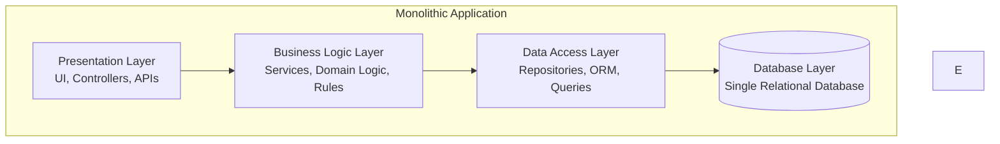
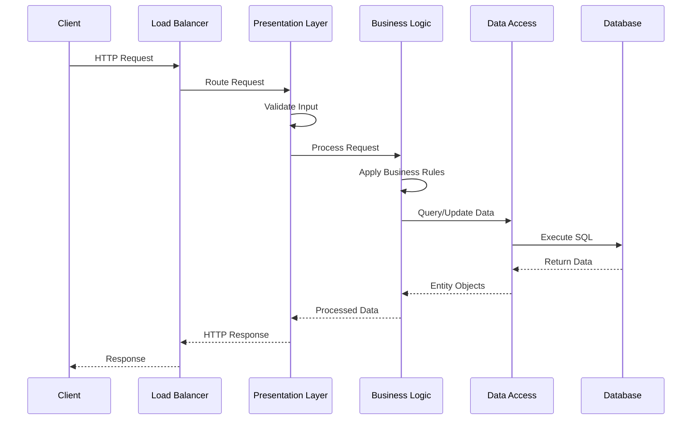
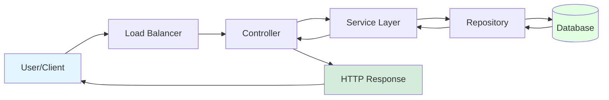
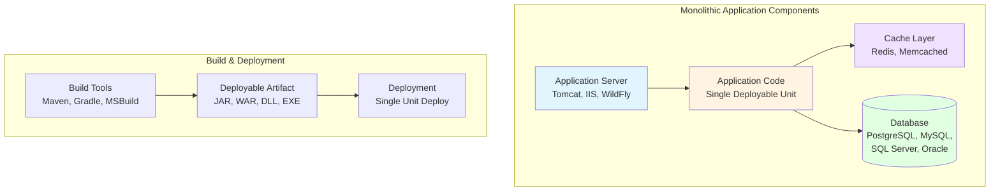
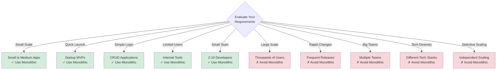
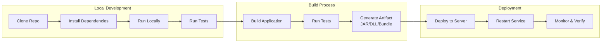
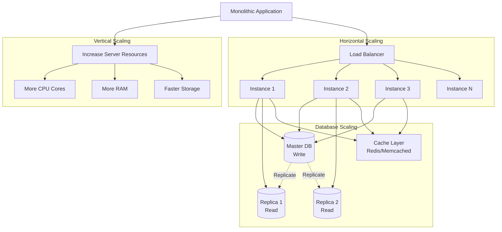
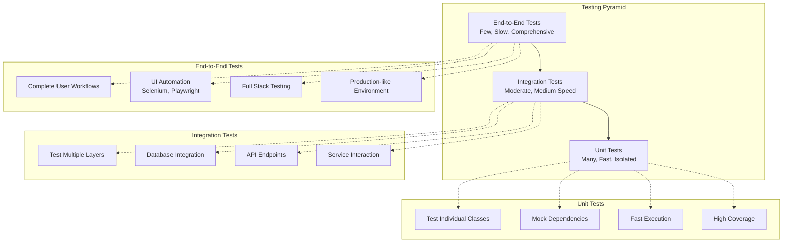

# Monolithic Architecture

## Overview

Monolithic architecture is a traditional software design pattern where an application is built as a single, unified unit. All components of the application—user interface, business logic, and data access layers—are interconnected and run as a single service.

## Table of Contents

- [What is Monolithic Architecture?](#what-is-monolithic-architecture)
- [Core Characteristics](#core-characteristics)
- [Architecture Layers](#architecture-layers)
- [How It Works](#how-it-works)
- [Key Components](#key-components)
- [When to Use](#when-to-use)
- [Related Documents](#related-documents)

## What is Monolithic Architecture?

A monolithic application is a single-tiered software application where different components are combined into a single program from a single platform. The application is self-contained, with all functionalities tightly coupled and running in a single process.

### Key Definition

> **Monolithic**: A unified, indivisible application where all functional components are interconnected and interdependent, deployed as a single unit.

## Core Characteristics

### 1. **Single Codebase**
- Entire application exists in one repository
- All modules share the same code base
- Version control is centralized

### 2. **Single Deployment Unit**
- Application deployed as one artifact (WAR, JAR, EXE)
- All-or-nothing deployment approach
- Cannot deploy individual features independently

### 3. **Shared Memory Space**
- All components run in the same process
- Direct method calls between modules
- No network latency for internal communication

### 4. **Unified Database**
- Single database serves entire application
- All modules access same data store
- Strong consistency through ACID transactions

### 5. **Tightly Coupled Components**
- Modules have dependencies on each other
- Changes in one module may affect others
- Shared libraries and dependencies

## Architecture Layers

A typical monolithic application follows a layered architecture pattern:

### Layer Responsibilities

#### **Presentation Layer**
- Handles user interactions
- Exposes REST APIs or web interfaces
- Request routing and response formatting
- Input validation and error handling

#### **Business Logic Layer**
- Implements core business rules
- Processes and transforms data
- Orchestrates workflows
- Enforces business constraints

#### **Data Access Layer**
- Abstracts database operations
- Implements repository pattern
- Handles data mapping (ORM)
- Manages database connections

#### **Database Layer**
- Stores application data
- Ensures data integrity
- Handles transactions
- Manages relationships

## How It Works

### Request Flow

### Example Flow

## Key Components

## When to Use

## Development Workflow

## Technology Stack Examples

```mermaid
graph TB
    subgraph "Java/Spring Boot Stack"
        J1[Spring Boot Framework]
        J2[PostgreSQL/MySQL]
        J3[Hibernate/JPA ORM]
        J4[Maven/Gradle Build]
        J5[Embedded Tomcat]
        
        J1 --> J3
        J3 --> J2
        J4 --> J1
        J1 --> J5
    end
    
    subgraph ".NET Stack"
        N1[ASP.NET Core]
        N2[SQL Server]
        N3[Entity Framework]
        N4[MSBuild]
        N5[IIS/Kestrel]
        
        N1 --> N3
        N3 --> N2
        N4 --> N1
        N1 --> N5
    end
    
    subgraph "Python/Django Stack"
        P1[Django Framework]
        P2[PostgreSQL]
        P3[Django ORM]
        P4[Gunicorn + Nginx]
        
        P1 --> P3
        P3 --> P2
        P1 --> P4
    end
    
    subgraph "Node.js Stack"
        Node1[Express.js]
        Node2[MongoDB/PostgreSQL]
        Node3[Mongoose/Sequelize]
        Node4[Node.js Server]
        
        Node1 --> Node3
        Node3 --> Node2
        Node1 --> Node4
    end
    
```

## Scaling Strategies

## Testing

## Related Documents

- **[pros-cons.md](./pros-cons.md)**: Detailed advantages and disadvantages
- **[use-cases.md](./use-cases.md)**: When to use monolithic architecture
- **[examples.md](./examples.md)**: Real-world application examples

## Further Reading

- [Microservices Architecture](../microservices/readme.md) - Alternative pattern
- [Layered Architecture](../layered-architecture/readme.md) - Architectural style
- [Event-Driven Architecture](../event-driven/readme.md) - Communication pattern

---

**Last Updated**: October 2025  
**Maintainer**: System Design Team