# Monolithic Architecture: Examples

## Overview

This document provides practical, real-world examples of monolithic applications with code samples, architecture diagrams, and implementation details across different technology stacks.

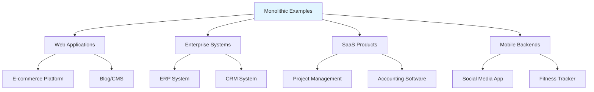

---

## Example 1: E-commerce Platform

### Architecture Overview

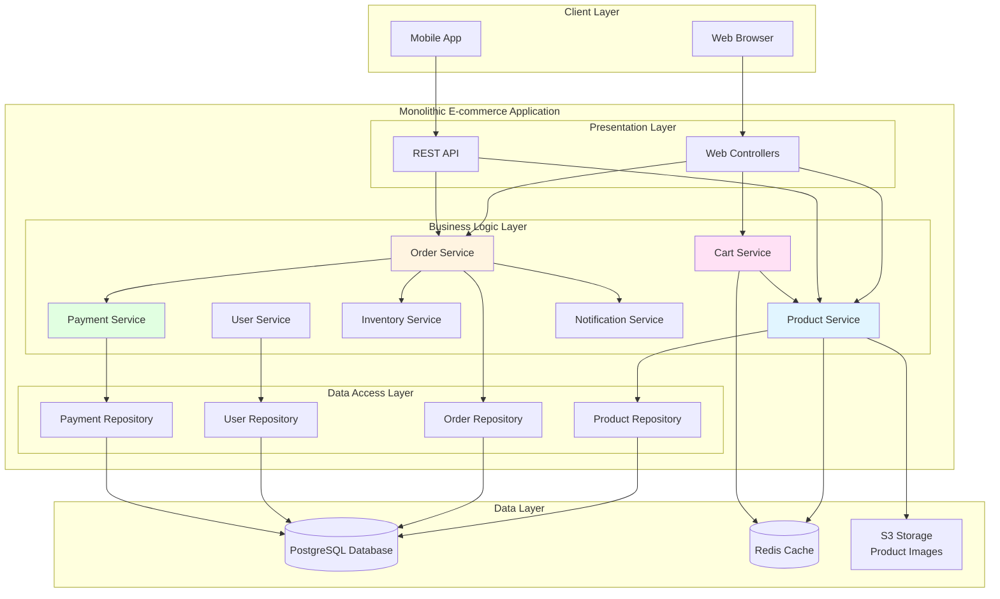

### Database Schema

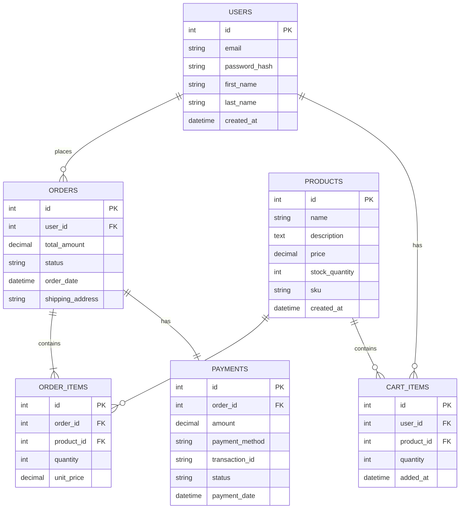

### Code Implementation (Spring Boot)

#### Project Structure
```
ecommerce-monolith/
├── src/main/java/com/example/ecommerce/
│   ├── EcommerceApplication.java
│   ├── controller/
│   │   ├── ProductController.java
│   │   ├── OrderController.java
│   │   └── CartController.java
│   ├── service/
│   │   ├── ProductService.java
│   │   ├── OrderService.java
│   │   ├── CartService.java
│   │   └── PaymentService.java
│   ├── repository/
│   │   ├── ProductRepository.java
│   │   ├── OrderRepository.java
│   │   └── UserRepository.java
│   ├── model/
│   │   ├── Product.java
│   │   ├── Order.java
│   │   ├── User.java
│   │   └── Payment.java
│   └── config/
│       ├── SecurityConfig.java
│       └── CacheConfig.java
├── src/main/resources/
│   ├── application.yml
│   └── schema.sql
└── pom.xml
```

#### Sample Code

**Product Controller**
```java
@RestController
@RequestMapping("/api/products")
public class ProductController {
    
    @Autowired
    private ProductService productService;
    
    @GetMapping
    public ResponseEntity<List<Product>> getAllProducts() {
        List<Product> products = productService.getAllProducts();
        return ResponseEntity.ok(products);
    }
    
    @GetMapping("/{id}")
    public ResponseEntity<Product> getProduct(@PathVariable Long id) {
        Product product = productService.getProductById(id);
        return ResponseEntity.ok(product);
    }
    
    @PostMapping
    @PreAuthorize("hasRole('ADMIN')")
    public ResponseEntity<Product> createProduct(@RequestBody Product product) {
        Product created = productService.createProduct(product);
        return ResponseEntity.status(HttpStatus.CREATED).body(created);
    }
}
```

**Order Service**
```java
@Service
@Transactional
public class OrderService {
    
    @Autowired
    private OrderRepository orderRepository;
    
    @Autowired
    private ProductService productService;
    
    @Autowired
    private PaymentService paymentService;
    
    @Autowired
    private InventoryService inventoryService;
    
    @Autowired
    private NotificationService notificationService;
    
    public Order createOrder(Long userId, List<OrderItem> items) {
        // Validate products and stock
        for (OrderItem item : items) {
            if (!inventoryService.hasStock(item.getProductId(), item.getQuantity())) {
                throw new InsufficientStockException("Product out of stock");
            }
        }
        
        // Calculate total
        BigDecimal total = items.stream()
            .map(item -> item.getUnitPrice().multiply(new BigDecimal(item.getQuantity())))
            .reduce(BigDecimal.ZERO, BigDecimal::add);
        
        // Create order
        Order order = new Order();
        order.setUserId(userId);
        order.setItems(items);
        order.setTotalAmount(total);
        order.setStatus("PENDING");
        order.setOrderDate(LocalDateTime.now());
        
        // Save order
        Order savedOrder = orderRepository.save(order);
        
        // Reduce inventory
        for (OrderItem item : items) {
            inventoryService.reduceStock(item.getProductId(), item.getQuantity());
        }
        
        // Send notification
        notificationService.sendOrderConfirmation(userId, savedOrder);
        
        return savedOrder;
    }
    
    public Order processPayment(Long orderId, PaymentDetails payment) {
        Order order = orderRepository.findById(orderId)
            .orElseThrow(() -> new OrderNotFoundException("Order not found"));
        
        // Process payment
        Payment processedPayment = paymentService.processPayment(payment);
        
        if (processedPayment.getStatus().equals("SUCCESS")) {
            order.setStatus("CONFIRMED");
            order.setPayment(processedPayment);
            notificationService.sendPaymentConfirmation(order.getUserId(), order);
        } else {
            order.setStatus("PAYMENT_FAILED");
            // Restore inventory
            for (OrderItem item : order.getItems()) {
                inventoryService.restoreStock(item.getProductId(), item.getQuantity());
            }
        }
        
        return orderRepository.save(order);
    }
}
```

**Application Configuration**
```yaml
spring:
  application:
    name: ecommerce-monolith
  
  datasource:
    url: jdbc:postgresql://localhost:5432/ecommerce
    username: ecommerce_user
    password: ${DB_PASSWORD}
    driver-class-name: org.postgresql.Driver
  
  jpa:
    hibernate:
      ddl-auto: validate
    show-sql: false
    properties:
      hibernate:
        format_sql: true
  
  redis:
    host: localhost
    port: 6379
  
  cache:
    type: redis
    redis:
      time-to-live: 3600000

server:
  port: 8080
  
logging:
  level:
    com.example.ecommerce: INFO
    org.springframework: WARN
```

### Request Flow Example

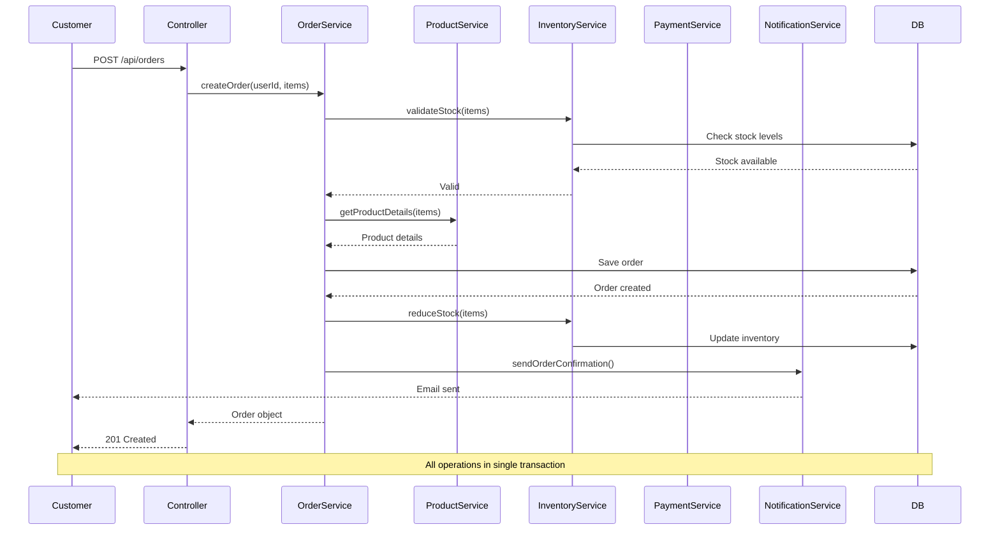

---

## Example 2: Blog/CMS Platform

### Architecture Overview

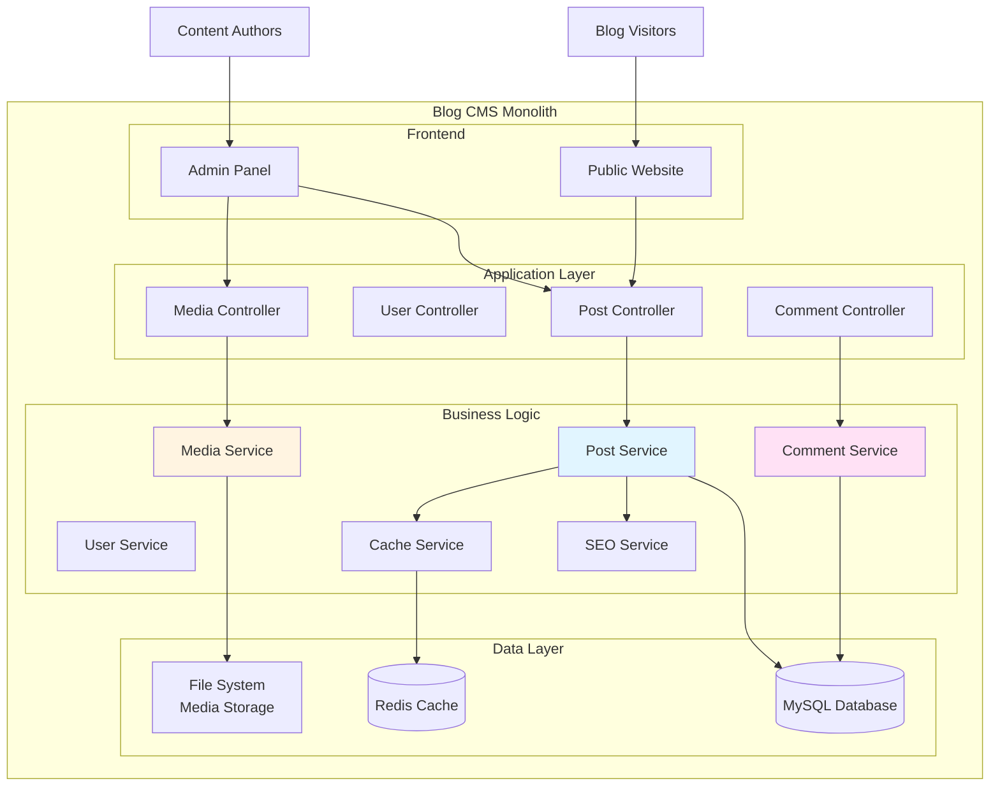

### Code Implementation (Django)

#### Project Structure
```
blog_cms/
├── manage.py
├── blog_cms/
│   ├── __init__.py
│   ├── settings.py
│   ├── urls.py
│   └── wsgi.py
├── posts/
│   ├── models.py
│   ├── views.py
│   ├── serializers.py
│   ├── urls.py
│   └── services.py
├── users/
│   ├── models.py
│   ├── views.py
│   └── authentication.py
├── media/
│   ├── models.py
│   ├── views.py
│   └── storage.py
├── comments/
│   ├── models.py
│   ├── views.py
│   └── moderation.py
└── templates/
    ├── base.html
    ├── post_list.html
    └── post_detail.html
```

#### Sample Code

**Models**
```python
from django.db import models
from django.contrib.auth.models import User
from django.utils.text import slugify

class Post(models.Model):
    STATUS_CHOICES = [
        ('draft', 'Draft'),
        ('published', 'Published'),
        ('archived', 'Archived'),
    ]
    
    title = models.CharField(max_length=200)
    slug = models.SlugField(max_length=200, unique=True)
    author = models.ForeignKey(User, on_delete=models.CASCADE, related_name='posts')
    content = models.TextField()
    excerpt = models.TextField(max_length=500, blank=True)
    featured_image = models.ImageField(upload_to='posts/', blank=True)
    status = models.CharField(max_length=20, choices=STATUS_CHOICES, default='draft')
    published_date = models.DateTimeField(null=True, blank=True)
    created_at = models.DateTimeField(auto_now_add=True)
    updated_at = models.DateTimeField(auto_now=True)
    views_count = models.IntegerField(default=0)
    
    # SEO fields
    meta_title = models.CharField(max_length=70, blank=True)
    meta_description = models.CharField(max_length=160, blank=True)
    meta_keywords = models.CharField(max_length=200, blank=True)
    
    class Meta:
        ordering = ['-published_date']
        indexes = [
            models.Index(fields=['-published_date']),
            models.Index(fields=['slug']),
            models.Index(fields=['status']),
        ]
    
    def save(self, *args, **kwargs):
        if not self.slug:
            self.slug = slugify(self.title)
        super().save(*args, **kwargs)
    
    def __str__(self):
        return self.title


class Comment(models.Model):
    post = models.ForeignKey(Post, on_delete=models.CASCADE, related_name='comments')
    author_name = models.CharField(max_length=100)
    author_email = models.EmailField()
    content = models.TextField()
    is_approved = models.BooleanField(default=False)
    created_at = models.DateTimeField(auto_now_add=True)
    
    class Meta:
        ordering = ['created_at']
    
    def __str__(self):
        return f'Comment by {self.author_name} on {self.post.title}'


class Category(models.Model):
    name = models.CharField(max_length=100, unique=True)
    slug = models.SlugField(max_length=100, unique=True)
    description = models.TextField(blank=True)
    posts = models.ManyToManyField(Post, related_name='categories')
    
    class Meta:
        verbose_name_plural = 'categories'
    
    def __str__(self):
        return self.name
```

**Views**
```python
from django.shortcuts import render, get_object_or_404
from django.views.generic import ListView, DetailView
from django.core.cache import cache
from django.db.models import Q, Count
from rest_framework import viewsets, status
from rest_framework.decorators import action
from rest_framework.response import Response
from .models import Post, Comment, Category
from .serializers import PostSerializer, CommentSerializer
from .services import PostService

class PostListView(ListView):
    model = Post
    template_name = 'post_list.html'
    context_object_name = 'posts'
    paginate_by = 10
    
    def get_queryset(self):
        # Check cache first
        cache_key = f'posts_list_page_{self.kwargs.get("page", 1)}'
        cached_posts = cache.get(cache_key)
        
        if cached_posts:
            return cached_posts
        
        queryset = Post.objects.filter(status='published') \
            .select_related('author') \
            .prefetch_related('categories', 'comments') \
            .annotate(comment_count=Count('comments'))
        
        # Cache for 15 minutes
        cache.set(cache_key, queryset, 900)
        return queryset


class PostDetailView(DetailView):
    model = Post
    template_name = 'post_detail.html'
    context_object_name = 'post'
    
    def get_object(self):
        slug = self.kwargs.get('slug')
        cache_key = f'post_detail_{slug}'
        
        cached_post = cache.get(cache_key)
        if cached_post:
            return cached_post
        
        post = get_object_or_404(
            Post.objects.select_related('author')
            .prefetch_related('categories', 'comments'),
            slug=slug,
            status='published'
        )
        
        # Increment view count
        post.views_count += 1
        post.save(update_fields=['views_count'])
        
        cache.set(cache_key, post, 900)
        return post


class PostViewSet(viewsets.ModelViewSet):
    queryset = Post.objects.all()
    serializer_class = PostSerializer
    
    @action(detail=False, methods=['get'])
    def search(self, request):
        query = request.query_params.get('q', '')
        posts = Post.objects.filter(
            Q(title__icontains=query) | 
            Q(content__icontains=query),
            status='published'
        )
        serializer = self.get_serializer(posts, many=True)
        return Response(serializer.data)
    
    @action(detail=True, methods=['post'])
    def publish(self, request, pk=None):
        post = self.get_object()
        PostService.publish_post(post)
        return Response({'status': 'Post published'})
```

**Services**
```python
from django.core.cache import cache
from django.utils import timezone
from django.core.mail import send_mail
from .models import Post, Comment

class PostService:
    
    @staticmethod
    def publish_post(post):
        """Publish a post and notify subscribers"""
        post.status = 'published'
        post.published_date = timezone.now()
        post.save()
        
        # Invalidate cache
        cache.delete(f'post_detail_{post.slug}')
        cache.delete_pattern('posts_list_*')
        
        # Generate sitemap
        PostService.generate_sitemap()
        
        # Notify subscribers
        PostService.notify_subscribers(post)
    
    @staticmethod
    def notify_subscribers(post):
        """Send email to subscribers"""
        subscribers = User.objects.filter(profile__is_subscribed=True)
        
        for subscriber in subscribers:
            send_mail(
                subject=f'New post: {post.title}',
                message=f'Check out our new post: {post.excerpt}',
                from_email='blog@example.com',
                recipient_list=[subscriber.email],
                fail_silently=True,
            )
    
    @staticmethod
    def generate_sitemap():
        """Generate XML sitemap for SEO"""
        posts = Post.objects.filter(status='published')
        # Generate sitemap XML
        pass


class CommentService:
    
    @staticmethod
    def moderate_comment(comment_id, approved):
        """Moderate a comment"""
        comment = Comment.objects.get(id=comment_id)
        comment.is_approved = approved
        comment.save()
        
        if not approved:
            # Notify author about rejection
            pass
        
        # Invalidate cache
        cache.delete(f'post_detail_{comment.post.slug}')
```

**Settings**
```python
# settings.py
DATABASES = {
    'default': {
        'ENGINE': 'django.db.backends.mysql',
        'NAME': 'blog_cms',
        'USER': 'blog_user',
        'PASSWORD': os.environ.get('DB_PASSWORD'),
        'HOST': 'localhost',
        'PORT': '3306',
    }
}

CACHES = {
    'default': {
        'BACKEND': 'django_redis.cache.RedisCache',
        'LOCATION': 'redis://127.0.0.1:6379/1',
        'OPTIONS': {
            'CLIENT_CLASS': 'django_redis.client.DefaultClient',
        }
    }
}

MEDIA_URL = '/media/'
MEDIA_ROOT = os.path.join(BASE_DIR, 'media')

# Cache time to live (in seconds)
CACHE_TTL = 60 * 15  # 15 minutes
```

---

## Example 3: Task Management SaaS

### Architecture Overview

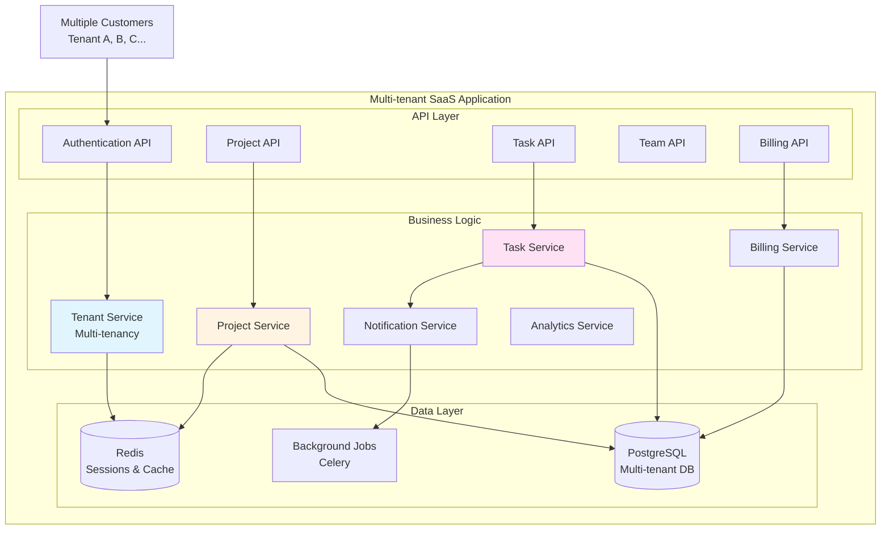

### Multi-tenant Data Model

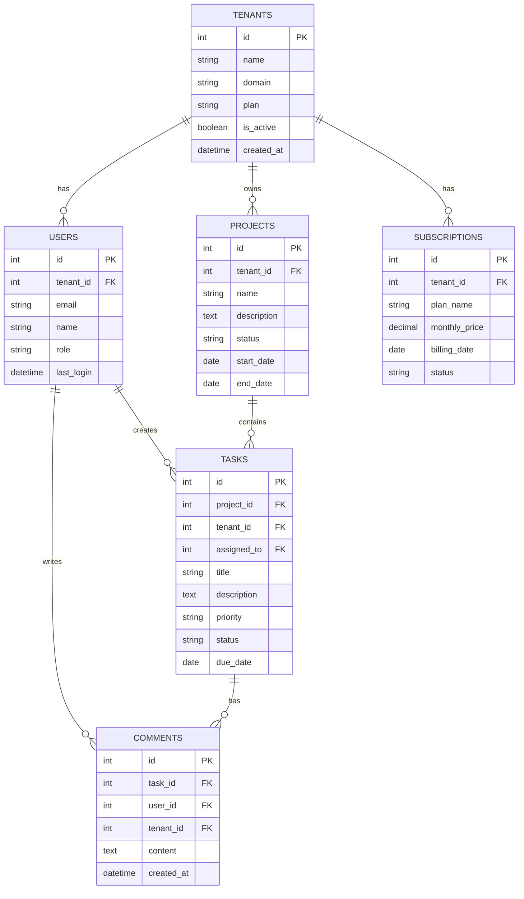

### Code Implementation (Node.js/Express)

#### Project Structure
```
task-management/
├── src/
│   ├── app.js
│   ├── config/
│   │   ├── database.js
│   │   ├── redis.js
│   │   └── stripe.js
│   ├── middleware/
│   │   ├── auth.js
│   │   ├── tenantContext.js
│   │   └── rateLimiter.js
│   ├── models/
│   │   ├── Tenant.js
│   │   ├── User.js
│   │   ├── Project.js
│   │   ├── Task.js
│   │   └── Subscription.js
│   ├── controllers/
│   │   ├── authController.js
│   │   ├── projectController.js
│   │   ├── taskController.js
│   │   └── billingController.js
│   ├── services/
│   │   ├── tenantService.js
│   │   ├── projectService.js
│   │   ├── taskService.js
│   │   ├── notificationService.js
│   │   └── billingService.js
│   └── routes/
│       ├── auth.js
│       ├── projects.js
│       ├── tasks.js
│       └── billing.js
├── package.json
└── .env
```

#### Sample Code

**Tenant Middleware**
```javascript
// middleware/tenantContext.js
const { Tenant } = require('../models');
const redis = require('../config/redis');

const tenantContext = async (req, res, next) => {
  try {
    // Get tenant from subdomain or header
    const tenantIdentifier = req.subdomains[0] || req.headers['x-tenant-id'];
    
    if (!tenantIdentifier) {
      return res.status(400).json({ error: 'Tenant identifier required' });
    }
    
    // Check cache first
    const cacheKey = `tenant:${tenantIdentifier}`;
    let tenant = await redis.get(cacheKey);
    
    if (!tenant) {
      // Fetch from database
      tenant = await Tenant.findOne({
        where: { domain: tenantIdentifier, is_active: true }
      });
      
      if (!tenant) {
        return res.status(404).json({ error: 'Tenant not found' });
      }
      
      // Cache for 1 hour
      await redis.setex(cacheKey, 3600, JSON.stringify(tenant));
    } else {
      tenant = JSON.parse(tenant);
    }
    
    // Attach tenant to request
    req.tenant = tenant;
    next();
  } catch (error) {
    next(error);
  }
};

module.exports = tenantContext;
```

**Task Service**
```javascript
// services/taskService.js
const { Task, User, Project } = require('../models');
const notificationService = require('./notificationService');
const { Op } = require('sequelize');

class TaskService {
  
  async createTask(tenantId, projectId, taskData, createdBy) {
    // Validate project belongs to tenant
    const project = await Project.findOne({
      where: { id: projectId, tenant_id: tenantId }
    });
    
    if (!project) {
      throw new Error('Project not found');
    }
    
    // Create task
    const task = await Task.create({
      ...taskData,
      tenant_id: tenantId,
      project_id: projectId,
      created_by: createdBy,
      status: 'todo'
    });
    
    // Send notification to assigned user
    if (task.assigned_to) {
      await notificationService.sendTaskAssignedNotification(
        task.assigned_to,
        task
      );
    }
    
    return task;
  }
  
  async updateTask(tenantId, taskId, updates, userId) {
    const task = await Task.findOne({
      where: { id: taskId, tenant_id: tenantId }
    });
    
    if (!task) {
      throw new Error('Task not found');
    }
    
    // Check if status changed
    const statusChanged = updates.status && updates.status !== task.status;
    
    // Update task
    await task.update(updates);
    
    // Send notifications
    if (statusChanged) {
      await notificationService.sendTaskStatusChangeNotification(
        task,
        userId
      );
    }
    
    return task;
  }
  
  async getTasksByProject(tenantId, projectId, filters = {}) {
    const where = {
      tenant_id: tenantId,
      project_id: projectId
    };
    
    if (filters.status) {
      where.status = filters.status;
    }
    
    if (filters.priority) {
      where.priority = filters.priority;
    }
    
    if (filters.assigned_to) {
      where.assigned_to = filters.assigned_to;
    }
    
    if (filters.due_date) {
      where.due_date = {
        [Op.lte]: new Date(filters.due_date)
      };
    }
    
    const tasks = await Task.findAll({
      where,
      include: [
        {
          model: User,
          as: 'assignee',
          attributes: ['id', 'name', 'email']
        },
        {
          model: User,
          as: 'creator',
          attributes: ['id', 'name', 'email']
        }
      ],
      order: [['created_at', 'DESC']]
    });
    
    return tasks;
  }
  
  async getOverdueTasks(tenantId) {
    const tasks = await Task.findAll({
      where: {
        tenant_id: tenantId,
        status: { [Op.notIn]: ['done', 'archived'] },
        due_date: { [Op.lt]: new Date() }
      },
      include: [
        {
          model: User,
          as: 'assignee',
          attributes: ['id', 'name', 'email']
        },
        {
          model: Project,
          attributes: ['id', 'name']
        }
      ]
    });
    
    return tasks;
  }
  
  async getTaskAnalytics(tenantId, projectId) {
    const tasks = await Task.findAll({
      where: { tenant_id: tenantId, project_id: projectId },
      attributes: ['status', 'priority']
    });
    
    // Calculate analytics
    const analytics = {
      total: tasks.length,
      byStatus: {
        todo: tasks.filter(t => t.status === 'todo').length,
        in_progress: tasks.filter(t => t.status === 'in_progress').length,
        done: tasks.filter(t => t.status === 'done').length
      },
      byPriority: {
        low: tasks.filter(t => t.priority === 'low').length,
        medium: tasks.filter(t => t.priority === 'medium').length,
        high: tasks.filter(t => t.priority === 'high').length
      }
    };
    
    return analytics;
  }
}

module.exports = new TaskService();
```

**Task Controller**
```javascript
// controllers/taskController.js
const taskService = require('../services/taskService');

class TaskController {
  
  async create(req, res, next) {
    try {
      const { projectId } = req.params;
      const taskData = req.body;
      const tenantId = req.tenant.id;
      const userId = req.user.id;
      
      const task = await taskService.createTask(
        tenantId,
        projectId,
        taskData,
        userId
      );
      
      res.status(201).json({
        success: true,
        data: task
      });
    } catch (error) {
      next(error);
    }
  }
  
  async update(req, res, next) {
    try {
      const { taskId } = req.params;
      const updates = req.body;
      const tenantId = req.tenant.id;
      const userId = req.user.id;
      
      const task = await taskService.updateTask(
        tenantId,
        taskId,
        updates,
        userId
      );
      
      res.json({
        success: true,
        data: task
      });
    } catch (error) {
      next(error);
    }
  }
  
  async getByProject(req, res, next) {
    try {
      const { projectId } = req.params;
      const filters = req.query;
      const tenantId = req.tenant.id;
      
      const tasks = await taskService.getTasksByProject(
        tenantId,
        projectId,
        filters
      );
      
      res.json({
        success: true,
        data: tasks
      });
    } catch (error) {
      next(error);
    }
  }
  
  async getAnalytics(req, res, next) {
    try {
      const { projectId } = req.params;
      const tenantId = req.tenant.id;
      
      const analytics = await taskService.getTaskAnalytics(
        tenantId,
        projectId
      );
      
      res.json({
        success: true,
        data: analytics
      });
    } catch (error) {
      next(error);
    }
  }
}

module.exports = new TaskController();
```

**Routes**
```javascript
// routes/tasks.js
const express = require('express');
const router = express.Router();
const taskController = require('../controllers/taskController');
const auth = require('../middleware/auth');
const tenantContext = require('../middleware/tenantContext');
const { validateTask } = require('../middleware/validators');

// All routes require authentication and tenant context
router.use(auth);
router.use(tenantContext);

// Task routes
router.post('/projects/:projectId/tasks', validateTask, taskController.create);
router.get('/projects/:projectId/tasks', taskController.getByProject);
router.put('/tasks/:taskId', validateTask, taskController.update);
router.delete('/tasks/:taskId', taskController.delete);
router.get('/projects/:projectId/tasks/analytics', taskController.getAnalytics);

module.exports = router;
```

**Application Entry Point**
```javascript
// app.js
const express = require('express');
const cors = require('cors');
const helmet = require('helmet');
const rateLimit = require('express-rate-limit');
const { sequelize } = require('./config/database');

// Import routes
const authRoutes = require('./routes/auth');
const projectRoutes = require('./routes/projects');
const taskRoutes = require('./routes/tasks');
const billingRoutes = require('./routes/billing');

const app = express();

// Middleware
app.use(helmet());
app.use(cors());
app.use(express.json());

// Rate limiting
const limiter = rateLimit({
  windowMs: 15 * 60 * 1000, // 15 minutes
  max: 100 // limit each IP to 100 requests per windowMs
});
app.use('/api/', limiter);

// Routes
app.use('/api/auth', authRoutes);
app.use('/api', projectRoutes);
app.use('/api', taskRoutes);
app.use('/api/billing', billingRoutes);

// Health check
app.get('/health', (req, res) => {
  res.json({ status: 'ok', timestamp: new Date() });
});

// Error handler
app.use((err, req, res, next) => {
  console.error(err.stack);
  res.status(err.statusCode || 500).json({
    success: false,
    error: err.message || 'Internal server error'
  });
});

// Database connection and server start
const PORT = process.env.PORT || 3000;

sequelize.authenticate()
  .then(() => {
    console.log('Database connected');
    app.listen(PORT, () => {
      console.log(`Server running on port ${PORT}`);
    });
  })
  .catch(err => {
    console.error('Unable to connect to database:', err);
  });

module.exports = app;
```

---

## Example 4: Mobile App Backend (Fitness Tracker)

### Architecture Overview

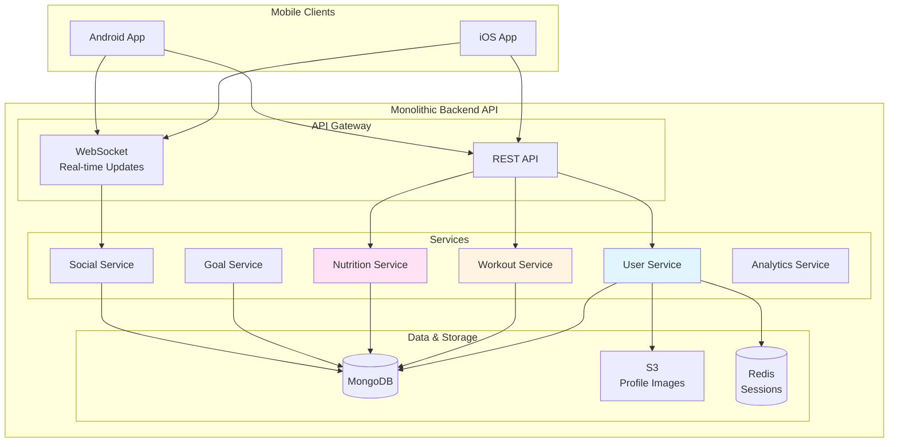

### Data Flow Example

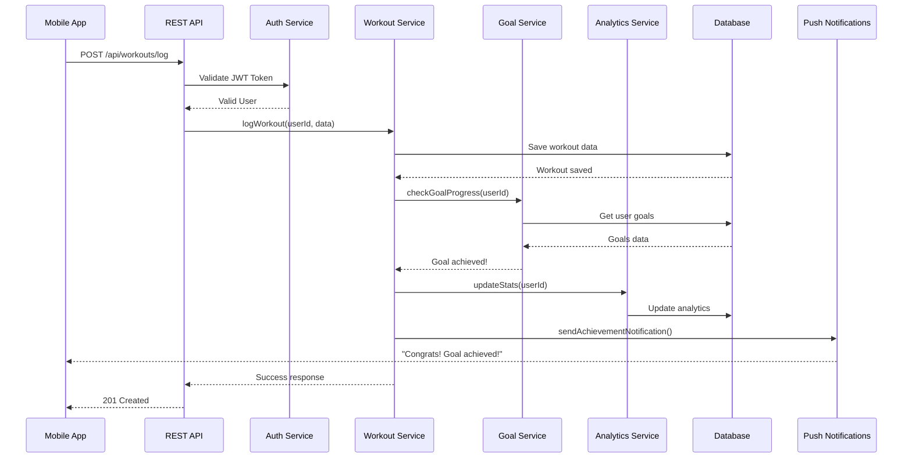

### Code Implementation (Python/Flask)

#### Project Structure
```
fitness-tracker/
├── app.py
├── config.py
├── requirements.txt
├── api/
│   ├── __init__.py
│   ├── auth.py
│   ├── workouts.py
│   ├── nutrition.py
│   ├── goals.py
│   └── social.py
├── services/
│   ├── user_service.py
│   ├── workout_service.py
│   ├── nutrition_service.py
│   ├── goal_service.py
│   └── analytics_service.py
├── models/
│   ├── user.py
│   ├── workout.py
│   ├── nutrition.py
│   └── goal.py
└── utils/
    ├── auth.py
    ├── validators.py
    └── push_notifications.py
```

#### Sample Code

**Models**
```python
# models/workout.py
from datetime import datetime
from app import db
from bson import ObjectId

class Workout:
    collection = db.workouts
    
    @staticmethod
    def create(user_id, workout_data):
        workout = {
            '_id': ObjectId(),
            'user_id': user_id,
            'type': workout_data['type'],  # running, cycling, gym, etc.
            'duration_minutes': workout_data['duration_minutes'],
            'calories_burned': workout_data['calories_burned'],
            'distance_km': workout_data.get('distance_km'),
            'intensity': workout_data.get('intensity', 'moderate'),
            'notes': workout_data.get('notes', ''),
            'timestamp': datetime.utcnow(),
            'created_at': datetime.utcnow()
        }
        
        result = Workout.collection.insert_one(workout)
        workout['_id'] = str(workout['_id'])
        return workout
    
    @staticmethod
    def get_by_user(user_id, limit=50, skip=0):
        workouts = list(Workout.collection.find(
            {'user_id': user_id}
        ).sort('timestamp', -1).limit(limit).skip(skip))
        
        for workout in workouts:
            workout['_id'] = str(workout['_id'])
        
        return workouts
    
    @staticmethod
    def get_weekly_summary(user_id):
        from datetime import timedelta
        week_ago = datetime.utcnow() - timedelta(days=7)
        
        pipeline = [
            {
                '$match': {
                    'user_id': user_id,
                    'timestamp': {'$gte': week_ago}
                }
            },
            {
                '$group': {
                    '_id': None,
                    'total_workouts': {'$sum': 1},
                    'total_duration': {'$sum': '$duration_minutes'},
                    'total_calories': {'$sum': '$calories_burned'},
                    'total_distance': {'$sum': '$distance_km'}
                }
            }
        ]
        
        result = list(Workout.collection.aggregate(pipeline))
        return result[0] if result else None


class Goal:
    collection = db.goals
    
    @staticmethod
    def create(user_id, goal_data):
        goal = {
            '_id': ObjectId(),
            'user_id': user_id,
            'type': goal_data['type'],  # weight_loss, distance, workout_count
            'target_value': goal_data['target_value'],
            'current_value': 0,
            'start_date': datetime.utcnow(),
            'end_date': datetime.fromisoformat(goal_data['end_date']),
            'status': 'active',
            'created_at': datetime.utcnow()
        }
        
        Goal.collection.insert_one(goal)
        goal['_id'] = str(goal['_id'])
        return goal
    
    @staticmethod
    def update_progress(user_id, goal_type, increment):
        goal = Goal.collection.find_one({
            'user_id': user_id,
            'type': goal_type,
            'status': 'active'
        })
        
        if goal:
            new_value = goal['current_value'] + increment
            Goal.collection.update_one(
                {'_id': goal['_id']},
                {
                    '$set': {'current_value': new_value},
                    '$currentDate': {'updated_at': True}
                }
            )
            
            # Check if goal is achieved
            if new_value >= goal['target_value']:
                Goal.collection.update_one(
                    {'_id': goal['_id']},
                    {'$set': {'status': 'completed'}}
                )
                return True  # Goal achieved
        
        return False
```

**Services**
```python
# services/workout_service.py
from models.workout import Workout, Goal
from services.analytics_service import AnalyticsService
from utils.push_notifications import send_push_notification

class WorkoutService:
    
    @staticmethod
    def log_workout(user_id, workout_data):
        # Create workout
        workout = Workout.create(user_id, workout_data)
        
        # Update goals
        goal_achieved = False
        
        # Update workout count goal
        if Goal.update_progress(user_id, 'workout_count', 1):
            goal_achieved = True
        
        # Update distance goal if applicable
        if workout_data.get('distance_km'):
            if Goal.update_progress(user_id, 'distance', workout_data['distance_km']):
                goal_achieved = True
        
        # Update analytics
        AnalyticsService.update_user_stats(user_id, workout)
        
        # Send notification if goal achieved
        if goal_achieved:
            send_push_notification(
                user_id,
                'Goal Achieved!',
                'Congratulations! You\'ve reached your goal!'
            )
        
        return workout
    
    @staticmethod
    def get_workout_history(user_id, page=1, per_page=20):
        skip = (page - 1) * per_page
        workouts = Workout.get_by_user(user_id, limit=per_page, skip=skip)
        return workouts
    
    @staticmethod
    def get_weekly_report(user_id):
        summary = Workout.get_weekly_summary(user_id)
        
        if not summary:
            return {
                'total_workouts': 0,
                'total_duration': 0,
                'total_calories': 0,
                'total_distance': 0
            }
        
        return summary


# services/analytics_service.py
from datetime import datetime, timedelta

class AnalyticsService:
    
    @staticmethod
    def update_user_stats(user_id, workout):
        from app import db
        
        today = datetime.utcnow().date()
        
        # Update daily stats
        db.daily_stats.update_one(
            {
                'user_id': user_id,
                'date': today
            },
            {
                '$inc': {
                    'workout_count': 1,
                    'total_duration': workout['duration_minutes'],
                    'total_calories': workout['calories_burned']
                },
                '$setOnInsert': {
                    'created_at': datetime.utcnow()
                }
            },
            upsert=True
        )
        
        # Update streak
        AnalyticsService._update_streak(user_id, today)
    
    @staticmethod
    def _update_streak(user_id, today):
        from app import db
        
        user_stats = db.user_stats.find_one({'user_id': user_id})
        
        if not user_stats:
            db.user_stats.insert_one({
                'user_id': user_id,
                'current_streak': 1,
                'longest_streak': 1,
                'last_workout_date': today
            })
            return
        
        last_date = user_stats.get('last_workout_date')
        
        if last_date == today:
            return  # Already worked out today
        
        yesterday = today - timedelta(days=1)
        
        if last_date == yesterday:
            # Continue streak
            new_streak = user_stats['current_streak'] + 1
            db.user_stats.update_one(
                {'user_id': user_id},
                {
                    '$set': {
                        'current_streak': new_streak,
                        'longest_streak': max(new_streak, user_stats['longest_streak']),
                        'last_workout_date': today
                    }
                }
            )
        else:
            # Streak broken
            db.user_stats.update_one(
                {'user_id': user_id},
                {
                    '$set': {
                        'current_streak': 1,
                        'last_workout_date': today
                    }
                }
            )
    
    @staticmethod
    def get_user_analytics(user_id, days=30):
        from app import db
        from datetime import datetime, timedelta
        
        start_date = datetime.utcnow().date() - timedelta(days=days)
        
        daily_stats = list(db.daily_stats.find({
            'user_id': user_id,
            'date': {'$gte': start_date}
        }).sort('date', 1))
        
        user_stats = db.user_stats.find_one({'user_id': user_id})
        
        return {
            'daily_stats': daily_stats,
            'current_streak': user_stats.get('current_streak', 0) if user_stats else 0,
            'longest_streak': user_stats.get('longest_streak', 0) if user_stats else 0
        }
```

**API Endpoints**
```python
# api/workouts.py
from flask import Blueprint, request, jsonify
from flask_jwt_extended import jwt_required, get_jwt_identity
from services.workout_service import WorkoutService
from utils.validators import validate_workout_data

workouts_bp = Blueprint('workouts', __name__)

@workouts_bp.route('/workouts', methods=['POST'])
@jwt_required()
def log_workout():
    """Log a new workout"""
    user_id = get_jwt_identity()
    data = request.get_json()
    
    # Validate input
    is_valid, errors = validate_workout_data(data)
    if not is_valid:
        return jsonify({'error': errors}), 400
    
    try:
        workout = WorkoutService.log_workout(user_id, data)
        return jsonify({
            'success': True,
            'data': workout
        }), 201
    except Exception as e:
        return jsonify({'error': str(e)}), 500


@workouts_bp.route('/workouts', methods=['GET'])
@jwt_required()
def get_workouts():
    """Get workout history"""
    user_id = get_jwt_identity()
    page = request.args.get('page', 1, type=int)
    per_page = request.args.get('per_page', 20, type=int)
    
    workouts = WorkoutService.get_workout_history(user_id, page, per_page)
    
    return jsonify({
        'success': True,
        'data': workouts,
        'page': page,
        'per_page': per_page
    })


@workouts_bp.route('/workouts/summary/weekly', methods=['GET'])
@jwt_required()
def get_weekly_summary():
    """Get weekly workout summary"""
    user_id = get_jwt_identity()
    
    summary = WorkoutService.get_weekly_report(user_id)
    
    return jsonify({
        'success': True,
        'data': summary
    })


@workouts_bp.route('/analytics', methods=['GET'])
@jwt_required()
def get_analytics():
    """Get user analytics"""
    from services.analytics_service import AnalyticsService
    
    user_id = get_jwt_identity()
    days = request.args.get('days', 30, type=int)
    
    analytics = AnalyticsService.get_user_analytics(user_id, days)
    
    return jsonify({
        'success': True,
        'data': analytics
    })
```

**Application Setup**
```python
# app.py
from flask import Flask
from flask_cors import CORS
from flask_jwt_extended import JWTManager
from pymongo import MongoClient
import redis
import os

app = Flask(__name__)
app.config.from_object('config.Config')

# CORS
CORS(app)

# JWT
jwt = JWTManager(app)

# Database
mongo_client = MongoClient(app.config['MONGO_URI'])
db = mongo_client[app.config['DB_NAME']]

# Redis
redis_client = redis.Redis(
    host=app.config['REDIS_HOST'],
    port=app.config['REDIS_PORT'],
    decode_responses=True
)

# Register blueprints
from api.auth import auth_bp
from api.workouts import workouts_bp
from api.nutrition import nutrition_bp
from api.goals import goals_bp
from api.social import social_bp

app.register_blueprint(auth_bp, url_prefix='/api/auth')
app.register_blueprint(workouts_bp, url_prefix='/api')
app.register_blueprint(nutrition_bp, url_prefix='/api')
app.register_blueprint(goals_bp, url_prefix='/api')
app.register_blueprint(social_bp, url_prefix='/api')

@app.route('/health')
def health_check():
    return {'status': 'healthy', 'timestamp': datetime.utcnow().isoformat()}

if __name__ == '__main__':
    app.run(host='0.0.0.0', port=5000, debug=app.config['DEBUG'])
```

---

## Example 5: Internal HR Management System

### Architecture Overview

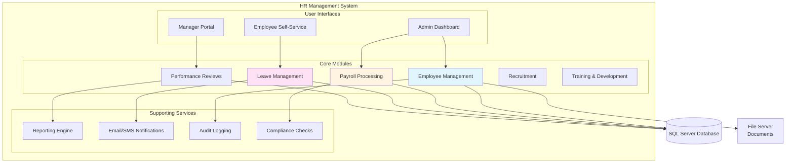

### Business Process Flow

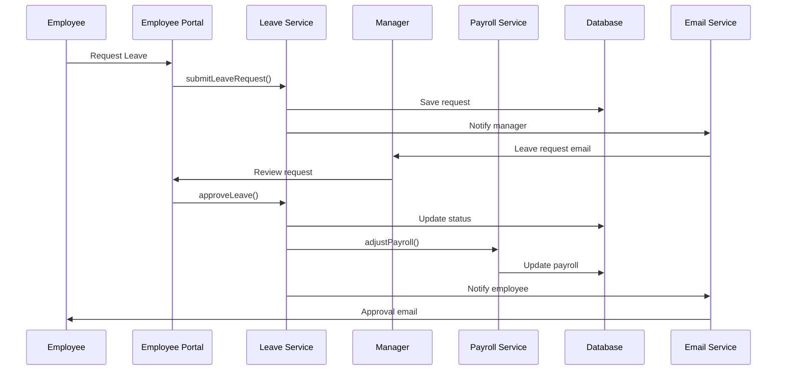

### Code Implementation (.NET/C#)

**Project Structure**
```
HRManagement/
├── HRManagement.sln
├── HRManagement.Web/
│   ├── Controllers/
│   ├── Views/
│   ├── wwwroot/
│   └── Program.cs
├── HRManagement.Core/
│   ├── Entities/
│   │   ├── Employee.cs
│   │   ├── LeaveRequest.cs
│   │   ├── PayrollRecord.cs
│   │   └── PerformanceReview.cs
│   ├── Interfaces/
│   └── Services/
│       ├── EmployeeService.cs
│       ├── LeaveService.cs
│       ├── PayrollService.cs
│       └── NotificationService.cs
├── HRManagement.Infrastructure/
│   ├── Data/
│   │   ├── HRContext.cs
│   │   └── Repositories/
│   └── Email/
└── HRManagement.Tests/
```

**Sample Code**

```csharp
// Entities/Employee.cs
public class Employee
{
    public int Id { get; set; }
    public string EmployeeCode { get; set; }
    public string FirstName { get; set; }
    public string LastName { get; set; }
    public string Email { get; set; }
    public string Department { get; set; }
    public string Position { get; set; }
    public DateTime JoinDate { get; set; }
    public decimal Salary { get; set; }
    public int? ManagerId { get; set; }
    public Employee Manager { get; set; }
    public bool IsActive { get; set; }
    
    // Navigation properties
    public ICollection<LeaveRequest> LeaveRequests { get; set; }
    public ICollection<PayrollRecord> PayrollRecords { get; set; }
    public ICollection<PerformanceReview> PerformanceReviews { get; set; }
}

// Entities/LeaveRequest.cs
public class LeaveRequest
{
    public int Id { get; set; }
    public int EmployeeId { get; set; }
    public Employee Employee { get; set; }
    public LeaveType Type { get; set; }
    public DateTime StartDate { get; set; }
    public DateTime EndDate { get; set; }
    public int TotalDays { get; set; }
    public string Reason { get; set; }
    public LeaveStatus Status { get; set; }
    public int? ApprovedBy { get; set; }
    public Employee Approver { get; set; }
    public DateTime? ApprovedDate { get; set; }
    public string Comments { get; set; }
    public DateTime CreatedAt { get; set; }
}

public enum LeaveType
{
    Annual,
    Sick,
    Personal,
    Maternity,
    Paternity,
    Unpaid
}

public enum LeaveStatus
{
    Pending,
    Approved,
    Rejected,
    Cancelled
}

// Services/LeaveService.cs
public class LeaveService : ILeaveService
{
    private readonly IRepository<LeaveRequest> _leaveRepository;
    private readonly IRepository<Employee> _employeeRepository;
    private readonly INotificationService _notificationService;
    private readonly IPayrollService _payrollService;
    private readonly ILogger<LeaveService> _logger;
    
    public LeaveService(
        IRepository<LeaveRequest> leaveRepository,
        IRepository<Employee> employeeRepository,
        INotificationService notificationService,
        IPayrollService payrollService,
        ILogger<LeaveService> logger)
    {
        _leaveRepository = leaveRepository;
        _employeeRepository = employeeRepository;
        _notificationService = notificationService;
        _payrollService = payrollService;
        _logger = logger;
    }
    
    public async Task<LeaveRequest> SubmitLeaveRequestAsync(
        int employeeId,
        LeaveRequestDto requestDto)
    {
        var employee = await _employeeRepository.GetByIdAsync(employeeId);
        if (employee == null)
            throw new NotFoundException("Employee not found");
        
        // Validate leave balance
        var availableLeave = await GetAvailableLeaveBalance(
            employeeId,
            requestDto.Type,
            DateTime.Now.Year
        );
        
        if (availableLeave < requestDto.TotalDays)
            throw new InvalidOperationException("Insufficient leave balance");
        
        // Check for overlapping leave requests
        var hasOverlap = await HasOverlappingLeave(
            employeeId,
            requestDto.StartDate,
            requestDto.EndDate
        );
        
        if (hasOverlap)
            throw new InvalidOperationException("Leave dates overlap with existing request");
        
        // Create leave request
        var leaveRequest = new LeaveRequest
        {
            EmployeeId = employeeId,
            Type = requestDto.Type,
            StartDate = requestDto.StartDate,
            EndDate = requestDto.EndDate,
            TotalDays = requestDto.TotalDays,
            Reason = requestDto.Reason,
            Status = LeaveStatus.Pending,
            CreatedAt = DateTime.UtcNow
        };
        
        await _leaveRepository.AddAsync(leaveRequest);
        
        // Notify manager
        if (employee.ManagerId.HasValue)
        {
            await _notificationService.SendLeaveRequestNotification(
                employee.ManagerId.Value,
                leaveRequest
            );
        }
        
        _logger.LogInformation(
            "Leave request submitted for employee {EmployeeId}",
            employeeId
        );
        
        return leaveRequest;
    }
    
    public async Task<LeaveRequest> ApproveLeaveRequestAsync(
        int leaveRequestId,
        int approverId,
        string comments = null)
    {
        var leaveRequest = await _leaveRepository
            .Include(lr => lr.Employee)
            .FirstOrDefaultAsync(lr => lr.Id == leaveRequestId);
        
        if (leaveRequest == null)
            throw new NotFoundException("Leave request not found");
        
        if (leaveRequest.Status != LeaveStatus.Pending)
            throw new InvalidOperationException("Leave request already processed");
        
        // Update leave request
        leaveRequest.Status = LeaveStatus.Approved;
        leaveRequest.ApprovedBy = approverId;
        leaveRequest.ApprovedDate = DateTime.UtcNow;
        leaveRequest.Comments = comments;
        
        await _leaveRepository.UpdateAsync(leaveRequest);
        
        // Update payroll if unpaid leave
        if (leaveRequest.Type == LeaveType.Unpaid)
        {
            await _payrollService.AdjustSalaryForUnpaidLeave(
                leaveRequest.EmployeeId,
                leaveRequest.TotalDays,
                leaveRequest.StartDate.Month,
                leaveRequest.StartDate.Year
            );
        }
        
        // Notify employee
        await _notificationService.SendLeaveApprovalNotification(
            leaveRequest.EmployeeId,
            leaveRequest
        );
        
        _logger.LogInformation(
            "Leave request {LeaveRequestId} approved by {ApproverId}",
            leaveRequestId,
            approverId
        );
        
        return leaveRequest;
    }
    
    private async Task<int> GetAvailableLeaveBalance(
        int employeeId,
        LeaveType leaveType,
        int year)
    {
        var usedLeave = await _leaveRepository
            .Where(lr => 
                lr.EmployeeId == employeeId &&
                lr.Type == leaveType &&
                lr.Status == LeaveStatus.Approved &&
                lr.StartDate.Year == year)
            .SumAsync(lr => lr.TotalDays);
        
        var totalLeave = GetAnnualLeaveAllowance(leaveType);
        
        return totalLeave - usedLeave;
    }
    
    private int GetAnnualLeaveAllowance(LeaveType leaveType)
    {
        return leaveType switch
        {
            LeaveType.Annual => 21,
            LeaveType.Sick => 10,
            LeaveType.Personal => 5,
            _ => 0
        };
    }
}

// Services/PayrollService.cs
public class PayrollService : IPayrollService
{
    private readonly IRepository<PayrollRecord> _payrollRepository;
    private readonly IRepository<Employee> _employeeRepository;
    private readonly ILogger<PayrollService> _logger;
    
    public async Task ProcessMonthlyPayroll(int month, int year)
    {
        var activeEmployees = await _employeeRepository
            .Where(e => e.IsActive)
            .ToListAsync();
        
        foreach (var employee in activeEmployees)
        {
            var grossSalary = employee.Salary;
            var deductions = await CalculateDeductions(employee.Id, month, year);
            var netSalary = grossSalary - deductions;
            
            var payrollRecord = new PayrollRecord
            {
                EmployeeId = employee.Id,
                Month = month,
                Year = year,
                GrossSalary = grossSalary,
                Deductions = deductions,
                NetSalary = netSalary,
                PaymentDate = GetPaymentDate(month, year),
                Status = PayrollStatus.Processed,
                ProcessedAt = DateTime.UtcNow
            };
            
            await _payrollRepository.AddAsync(payrollRecord);
            
            _logger.LogInformation(
                "Payroll processed for employee {EmployeeId} - {Month}/{Year}",
                employee.Id,
                month,
                year
            );
        }
    }
    
    public async Task AdjustSalaryForUnpaidLeave(
        int employeeId,
        int leaveDays,
        int month,
        int year)
    {
        var employee = await _employeeRepository.GetByIdAsync(employeeId);
        var workingDaysInMonth = 22; // Average working days
        var dailyRate = employee.Salary / workingDaysInMonth;
        var deduction = dailyRate * leaveDays;
        
        // Create adjustment record
        var adjustment = new PayrollAdjustment
        {
            EmployeeId = employeeId,
            Month = month,
            Year = year,
            Type = AdjustmentType.UnpaidLeaveDeduction,
            Amount = -deduction,
            Reason = $"Unpaid leave: {leaveDays} days",
            CreatedAt = DateTime.UtcNow
        };
        
        await _payrollRepository.AddAdjustmentAsync(adjustment);
    }
    
    private async Task<decimal> CalculateDeductions(
        int employeeId,
        int month,
        int year)
    {
        var employee = await _employeeRepository.GetByIdAsync(employeeId);
        
        // Tax deduction (simplified)
        var taxDeduction = employee.Salary * 0.20m;
        
        // Social security
        var socialSecurity = employee.Salary * 0.06m;
        
        // Health insurance
        var healthInsurance = 150m;
        
        // Get adjustments
        var adjustments = await _payrollRepository
            .GetAdjustmentsForPeriod(employeeId, month, year);
        
        var adjustmentTotal = adjustments.Sum(a => a.Amount);
        
        return taxDeduction + socialSecurity + healthInsurance + Math.Abs(adjustmentTotal);
    }
}

// Controllers/LeaveController.cs
[ApiController]
[Route("api/[controller]")]
[Authorize]
public class LeaveController : ControllerBase
{
    private readonly ILeaveService _leaveService;
    
    public LeaveController(ILeaveService leaveService)
    {
        _leaveService = leaveService;
    }
    
    [HttpPost("requests")]
    public async Task<IActionResult> SubmitLeaveRequest(
        [FromBody] LeaveRequestDto requestDto)
    {
        var employeeId = GetCurrentEmployeeId();
        
        try
        {
            var leaveRequest = await _leaveService.SubmitLeaveRequestAsync(
                employeeId,
                requestDto
            );
            
            return CreatedAtAction(
                nameof(GetLeaveRequest),
                new { id = leaveRequest.Id },
                leaveRequest
            );
        }
        catch (InvalidOperationException ex)
        {
            return BadRequest(new { error = ex.Message });
        }
    }
    
    [HttpGet("requests/{id}")]
    public async Task<IActionResult> GetLeaveRequest(int id)
    {
        var leaveRequest = await _leaveService.GetLeaveRequestAsync(id);
        
        if (leaveRequest == null)
            return NotFound();
        
        return Ok(leaveRequest);
    }
    
    [HttpGet("requests")]
    public async Task<IActionResult> GetMyLeaveRequests(
        [FromQuery] int? year = null)
    {
        var employeeId = GetCurrentEmployeeId();
        var requests = await _leaveService.GetEmployeeLeaveRequestsAsync(
            employeeId,
            year ?? DateTime.Now.Year
        );
        
        return Ok(requests);
    }
    
    [HttpPost("requests/{id}/approve")]
    [Authorize(Roles = "Manager,Admin")]
    public async Task<IActionResult> ApproveLeaveRequest(
        int id,
        [FromBody] ApprovalDto approvalDto)
    {
        var approverId = GetCurrentEmployeeId();
        
        try
        {
            var leaveRequest = await _leaveService.ApproveLeaveRequestAsync(
                id,
                approverId,
                approvalDto.Comments
            );
            
            return Ok(leaveRequest);
        }
        catch (InvalidOperationException ex)
        {
            return BadRequest(new { error = ex.Message });
        }
    }
    
    [HttpGet("balance")]
    public async Task<IActionResult> GetLeaveBalance()
    {
        var employeeId = GetCurrentEmployeeId();
        var balance = await _leaveService.GetLeaveBalanceAsync(
            employeeId,
            DateTime.Now.Year
        );
        
        return Ok(balance);
    }
    
    private int GetCurrentEmployeeId()
    {
        var employeeIdClaim = User.FindFirst("EmployeeId");
        return int.Parse(employeeIdClaim.Value);
    }
}
```

**Configuration**
```csharp
// appsettings.json
{
  "ConnectionStrings": {
    "DefaultConnection": "Server=localhost;Database=HRManagement;User Id=hr_user;Password=***;"
  },
  "EmailSettings": {
    "SmtpServer": "smtp.company.com",
    "SmtpPort": 587,
    "SenderEmail": "hr@company.com",
    "SenderName": "HR Department"
  },
  "Logging": {
    "LogLevel": {
      "Default": "Information",
      "Microsoft": "Warning"
    }
  },
  "JwtSettings": {
    "Secret": "your-secret-key-here",
    "Issuer": "HRManagement",
    "Audience": "HRManagement",
    "ExpiryMinutes": 60
  }
}
```

---

## Deployment Examples

### Docker Deployment

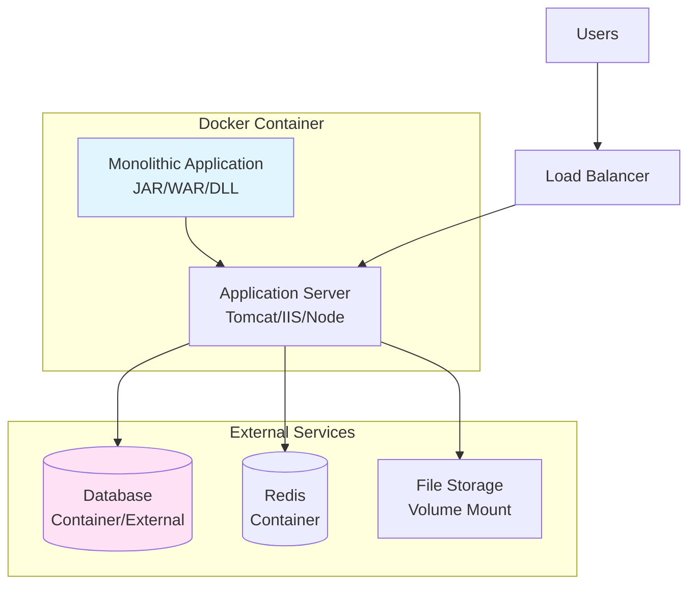

**Docker Compose Example**
```yaml
version: '3.8'

services:
  app:
    build: .
    ports:
      - "8080:8080"
    environment:
      - DATABASE_URL=postgresql://db:5432/myapp
      - REDIS_URL=redis://redis:6379
      - NODE_ENV=production
    depends_on:
      - db
      - redis
    volumes:
      - ./uploads:/app/uploads
    restart: unless-stopped
    
  db:
    image: postgres:14
    environment:
      - POSTGRES_DB=myapp
      - POSTGRES_USER=myapp_user
      - POSTGRES_PASSWORD=${DB_PASSWORD}
    volumes:
      - postgres_data:/var/lib/postgresql/data
    ports:
      - "5432:5432"
    restart: unless-stopped
    
  redis:
    image: redis:7-alpine
    ports:
      - "6379:6379"
    volumes:
      - redis_data:/data
    restart: unless-stopped
    
  nginx:
    image: nginx:alpine
    ports:
      - "80:80"
      - "443:443"
    volumes:
      - ./nginx.conf:/etc/nginx/nginx.conf
      - ./ssl:/etc/nginx/ssl
    depends_on:
      - app
    restart: unless-stopped

volumes:
  postgres_data:
  redis_data:
```

**Dockerfile Example (Node.js)**
```dockerfile
FROM node:18-alpine

WORKDIR /app

# Copy package files
COPY package*.json ./

# Install dependencies
RUN npm ci --only=production

# Copy application code
COPY . .

# Build if necessary
RUN npm run build

# Expose port
EXPOSE 3000

# Health check
HEALTHCHECK --interval=30s --timeout=3s \
  CMD node healthcheck.js

# Start application
CMD ["node", "dist/app.js"]
```

---

## Performance Optimization Strategies

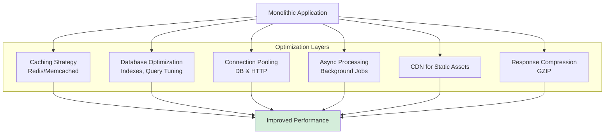

### Caching Strategy Example

```javascript
// Caching wrapper
class CacheService {
  constructor(redis) {
    this.redis = redis;
    this.defaultTTL = 3600; // 1 hour
  }
  
  async get(key) {
    const cached = await this.redis.get(key);
    return cached ? JSON.parse(cached) : null;
  }
  
  async set(key, value, ttl = this.defaultTTL) {
    await this.redis.setex(key, ttl, JSON.stringify(value));
  }
  
  async delete(key) {
    await this.redis.del(key);
  }
  
  async deletePattern(pattern) {
    const keys = await this.redis.keys(pattern);
    if (keys.length > 0) {
      await this.redis.del(...keys);
    }
  }
  
  // Cache-aside pattern
  async getOrSet(key, fetchFunction, ttl = this.defaultTTL) {
    let value = await this.get(key);
    
    if (!value) {
      value = await fetchFunction();
      await this.set(key, value, ttl);
    }
    
    return value;
  }
}

// Usage in service
class ProductService {
  constructor(cache, repository) {
    this.cache = cache;
    this.repository = repository;
  }
  
  async getProduct(productId) {
    return this.cache.getOrSet(
      `product:${productId}`,
      () => this.repository.findById(productId),
      3600 // 1 hour TTL
    );
  }
  
  async updateProduct(productId, updates) {
    const product = await this.repository.update(productId, updates);
    
    // Invalidate cache
    await this.cache.delete(`product:${productId}`);
    await this.cache.deletePattern('products:list:*');
    
    return product;
  }
}
```

---

## Monitoring and Observability

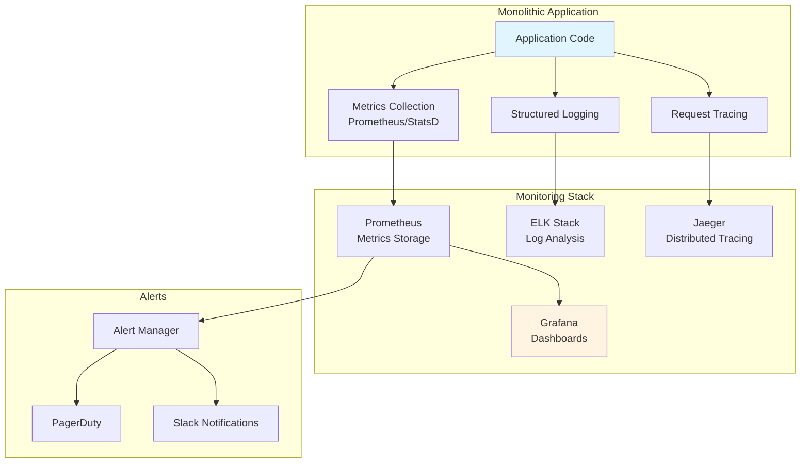

### Monitoring Code Example

```python
# monitoring/metrics.py
from prometheus_client import Counter, Histogram, Gauge
import time
import functools

# Define metrics
request_count = Counter(
    'http_requests_total',
    'Total HTTP requests',
    ['method', 'endpoint', 'status']
)

request_duration = Histogram(
    'http_request_duration_seconds',
    'HTTP request duration',
    ['method', 'endpoint']
)

active_users = Gauge(
    'active_users',
    'Number of active users'
)

database_connections = Gauge(
    'database_connections_active',
    'Active database connections'
)

# Decorator for tracking metrics
def track_metrics(func):
    @functools.wraps(func)
    def wrapper(*args, **kwargs):
        start_time = time.time()
        
        try:
            result = func(*args, **kwargs)
            status = 'success'
            return result
        except Exception as e:
            status = 'error'
            raise
        finally:
            duration = time.time() - start_time
            
            request_duration.labels(
                method=func.__name__,
                endpoint=func.__module__
            ).observe(duration)
            
            request_count.labels(
                method=func.__name__,
                endpoint=func.__module__,
                status=status
            ).inc()
    
    return wrapper

# Usage
@track_metrics
def create_order(order_data):
    # Order creation logic
    pass
```

---

## Summary Comparison Table

| Example | Tech Stack | Database | Use Case | Complexity |
|---------|-----------|----------|----------|------------|
| E-commerce | Spring Boot + PostgreSQL | SQL | Online Store | Medium |
| Blog/CMS | Django + MySQL | SQL | Content Publishing | Low |
| Task Management SaaS | Node.js + PostgreSQL | SQL | Multi-tenant SaaS | Medium-High |
| Fitness Tracker | Flask + MongoDB | NoSQL | Mobile Backend | Medium |
| HR Management | .NET + SQL Server | SQL | Enterprise Internal | Medium-High |

---

## Key Takeaways

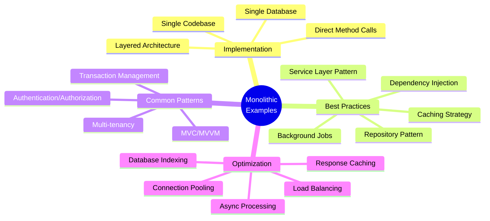

---

## Related Documents

- **[readme.md](./readme.md)**: Complete architecture overview and fundamentals
- **[pros-cons.md](./pros-cons.md)**: Detailed advantages and disadvantages analysis
- **[use-cases.md](./use-cases.md)**: When to use monolithic architecture

---

## Additional Resources

### Sample Projects
- [Spring PetClinic](https://github.com/spring-projects/spring-petclinic) - Classic Spring Boot monolith
- [Django Tutorial](https://docs.djangoproject.com/en/stable/intro/tutorial01/) - Blog application
- [ASP.NET eShop](https://github.com/dotnet-architecture/eShopOnWeb) - E-commerce reference

### Best Practices
- Maintain clear layer separation
- Use dependency injection
- Implement proper caching
- Follow SOLID principles
- Write comprehensive tests
- Monitor performance metrics
- Plan for future scaling

---

**Last Updated**: October 2025  
**Maintainer**: System Design Team