# Monolithic Architecture: Pros and Cons

## Overview

This document provides a comprehensive analysis of the advantages and disadvantages of monolithic architecture to help you make informed architectural decisions.

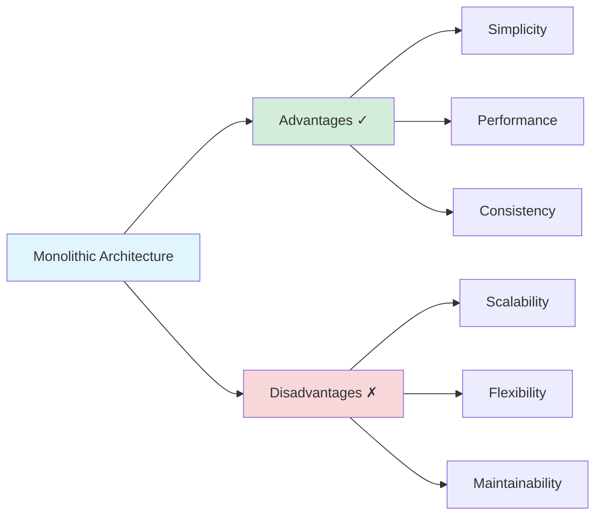

---

## Advantages ✓

### 1. Simple Development

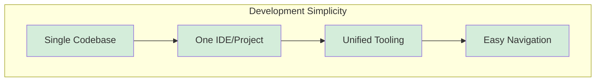

**Benefits:**
- All code in one repository
- Single project structure to understand
- No inter-service communication complexity
- Straightforward dependency management
- Easier onboarding for new developers

**Example:**
```java
// Direct method calls - no network overhead
public class OrderService {
    private ProductService productService;
    private PaymentService paymentService;
    
    public Order createOrder(OrderRequest request) {
        Product product = productService.getProduct(request.getProductId());
        Payment payment = paymentService.processPayment(request.getPayment());
        return new Order(product, payment);
    }
}
```

---

### 2. Easy Testing

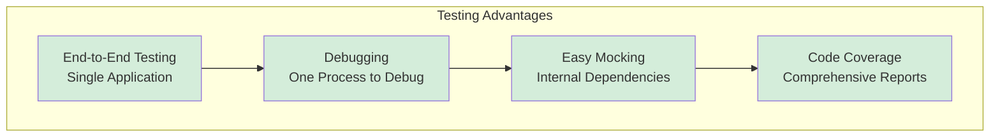

**Benefits:**
- Test entire application flow in one environment
- No need for complex test environments
- Single debugger session covers all code
- Easier to achieve high test coverage
- Integration tests are straightforward

**Example:**
```python
# Simple integration test
def test_order_creation():
    # All services available in same test
    product = create_product("Widget", 29.99)
    customer = create_customer("John Doe")
    order = create_order(customer, product)
    
    assert order.status == "confirmed"
    assert order.total == 29.99
```

---

### 3. Straightforward Deployment

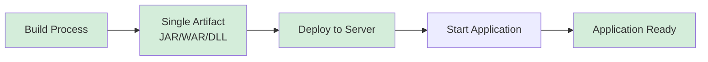

**Benefits:**
- Single deployment unit
- One configuration to manage
- Simple rollback strategy
- No orchestration needed
- Traditional deployment tools work well

**Deployment Steps:**
```bash
# Simple deployment process
1. mvn clean package          # Build
2. scp app.jar server:/app/   # Transfer
3. systemctl restart app      # Deploy
4. Done!
```

---

### 4. Better Performance (No Network Overhead)

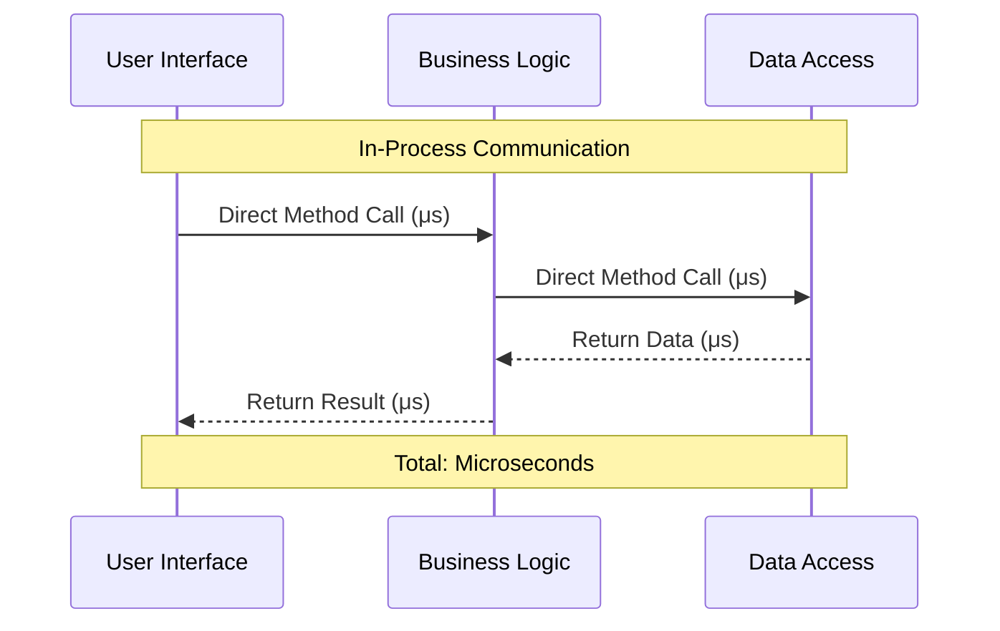

**vs Microservices:**

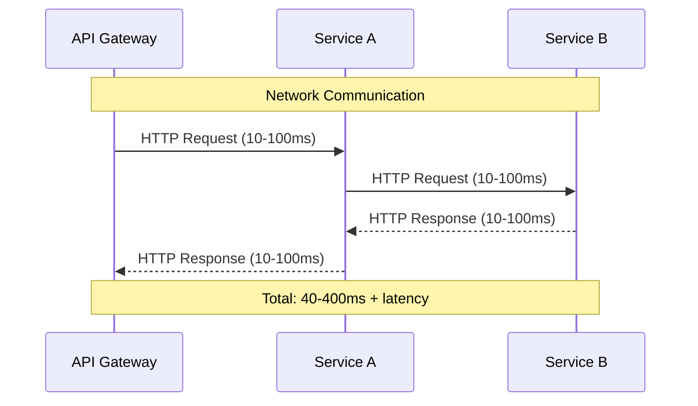

**Benefits:**
- In-memory method calls vs HTTP requests
- No serialization/deserialization overhead
- No network latency
- Lower resource consumption
- Faster response times

**Performance Comparison:**
```
Monolithic:  Method call = 1-10 μs
Microservices: HTTP call = 10-100 ms (1000-10000x slower)
```

---

### 5. ACID Transactions

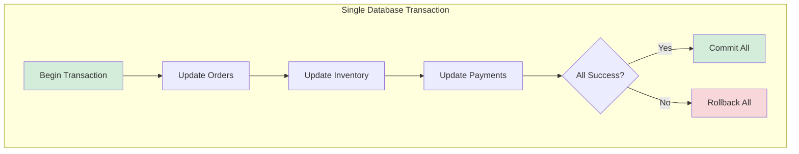

**Benefits:**
- Strong data consistency
- Automatic rollback on failure
- No distributed transaction complexity
- Easier to maintain data integrity
- Simpler error handling

**Example:**
```java
@Transactional
public void processOrder(Order order) {
    // All operations in single transaction
    orderRepository.save(order);
    inventoryService.reduceStock(order.getProductId(), order.getQuantity());
    paymentService.charge(order.getCustomerId(), order.getTotal());
    // Either all succeed or all rollback
}
```

---

### 6. Simplified Monitoring and Debugging

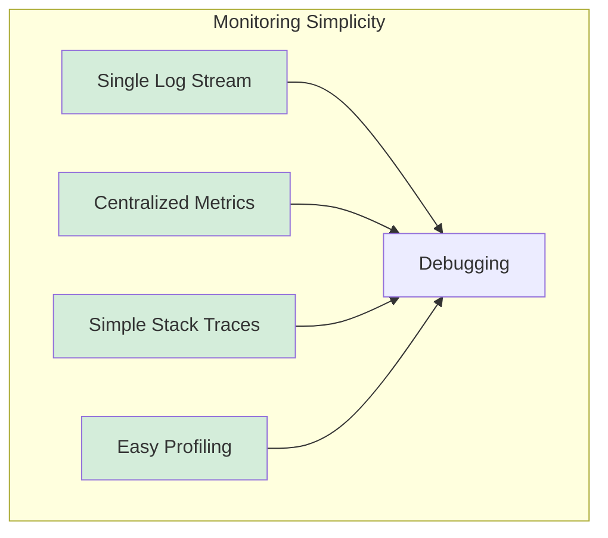

**Benefits:**
- Single application to monitor
- Complete stack traces
- One log file to search
- No distributed tracing needed
- Easier performance profiling

---

### 7. Lower Operational Complexity

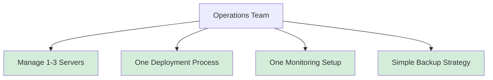

**Benefits:**
- Fewer moving parts
- Less infrastructure to manage
- Simpler DevOps pipeline
- Lower hosting costs
- Smaller operations team needed

---

## Disadvantages ✗

### 1. Scaling Challenges

```mermaid
graph TB
    subgraph "Scaling Problem"
        App[Monolithic App<br/>CPU: 20% | Memory: 80%]
        
        Problem[Need More Memory<br/>for One Feature]
        
        Solution[Scale Entire App<br/>Waste CPU Resources]
        
        App --> Problem
        Problem --> Solution
    end
    
    subgraph "Result"
        Waste[Resource Waste<br/>Pay for unused CPU<br/>Inefficient Scaling]
    end
    
    Solution --> Waste
    
    style App fill:#f8d7da
    style Problem fill:#f8d7da
    style Solution fill:#f8d7da
    style Waste fill:#f8d7da
```

**Problems:**
- Must scale entire application
- Cannot scale specific features independently
- Resource waste (scale CPU when you need memory)
- Expensive horizontal scaling
- Database becomes bottleneck

**Example Scenario:**
```
Report Generation: Needs 8GB RAM, Low CPU
User Authentication: Needs High CPU, Low RAM

Problem: Must scale BOTH even if only reports are slow
Cost Impact: 2-3x higher infrastructure costs
```

---

### 2. Technology Lock-in

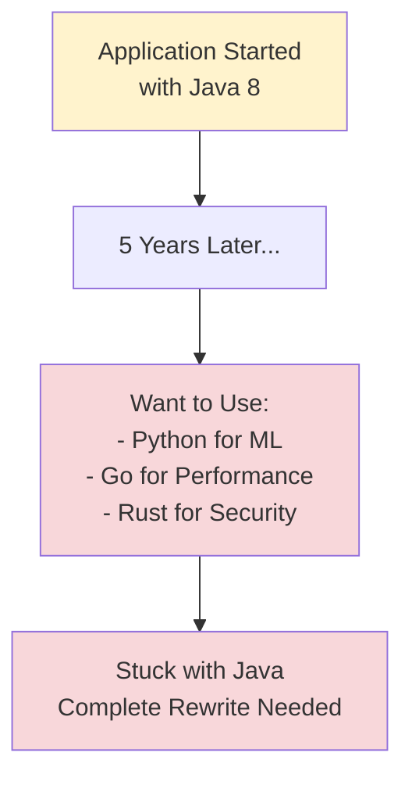

**Problems:**
- Committed to one programming language
- Difficult to adopt new technologies
- Framework version upgrades affect entire app
- Cannot use best tool for specific tasks
- Technology stack becomes outdated

**Example:**
```
Scenario: E-commerce platform built in PHP 5.6 (2014)

2024: Want to add:
- Real-time chat (better in Node.js)
- ML recommendations (better in Python)
- Image processing (better in Go)

Reality: Stuck rewriting everything or staying with PHP
```

---

### 3. Large Codebase Complexity

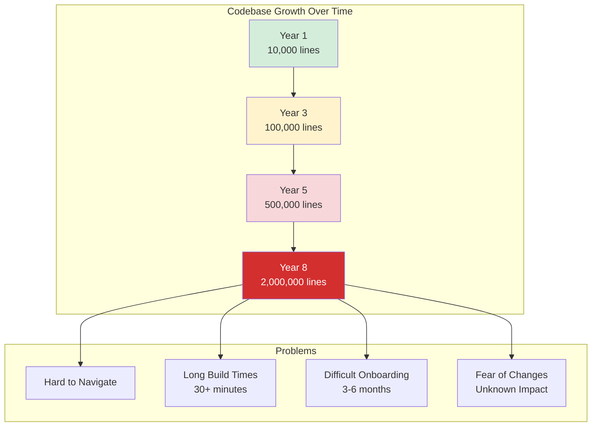

**Problems:**
- Difficult to understand entire system
- Long IDE load times
- Slow compile/build times
- Hard to find code
- Risk of breaking changes

**Real Numbers:**
```
Small App:     10,000 lines   → Build: 30 seconds
Medium App:   100,000 lines   → Build: 5 minutes
Large App:    500,000 lines   → Build: 15 minutes
Enterprise: 2,000,000 lines   → Build: 45+ minutes
```

---

### 4. Slow CI/CD Pipeline

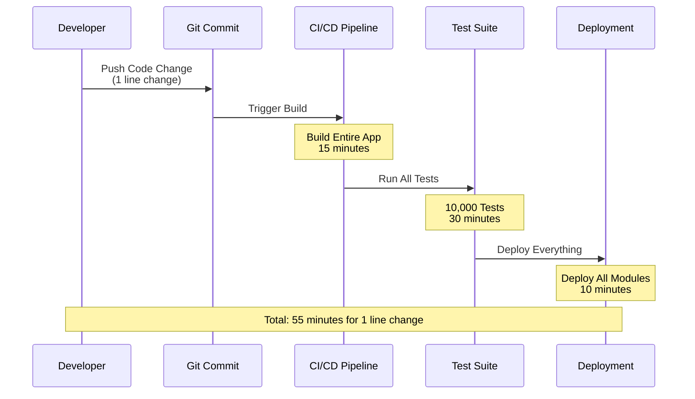

**Problems:**
- Long feedback cycles
- Deploy entire app for small changes
- All tests must pass before any deploy
- Slow developer productivity
- Risk-averse deployments

**Impact:**
```
Microservices: Change 1 service → Test 1 service → Deploy 1 service (5 min)
Monolithic: Change 1 line → Test everything → Deploy everything (55 min)

Result: 11x slower feedback loop
```

---

### 5. Tight Coupling

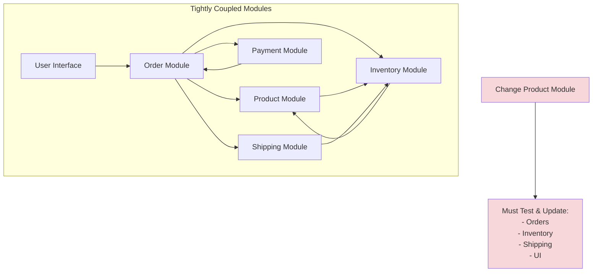

**Problems:**
- Changes ripple through codebase
- Difficult to isolate modules
- Shared code creates dependencies
- Hard to work in parallel
- Merge conflicts increase

**Example:**
```java
// Tight coupling example
public class OrderService {
    // Direct dependencies on concrete classes
    private ProductService productService;      // Coupled
    private PaymentGateway paymentGateway;      // Coupled
    private EmailService emailService;          // Coupled
    private SMSService smsService;              // Coupled
    
    // Change in any service affects OrderService
}
```

---

### 6. Single Point of Failure

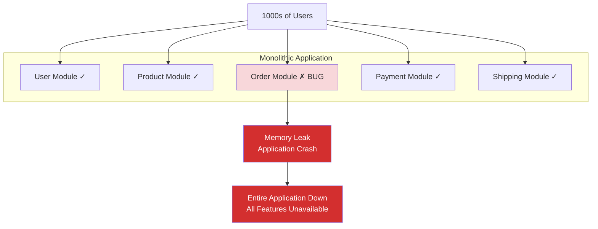

**Problems:**
- One bug can crash entire application
- Memory leak affects everything
- No isolation between features
- All or nothing availability
- Difficult to achieve high availability

**Impact:**
```
Bug in Admin Panel → Entire Application Down → All Users Affected

Microservices Alternative:
Bug in Admin Service → Only Admin Down → Regular Users Unaffected
```

---

### 7. Difficult Team Scaling

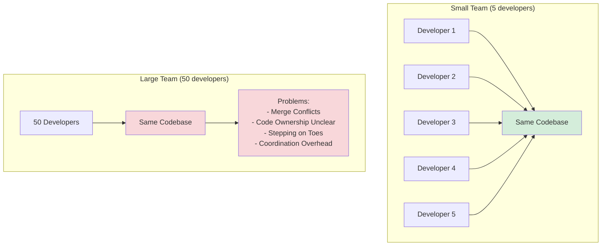

**Problems:**
- Multiple teams working on same codebase
- Frequent merge conflicts
- Unclear code ownership
- Coordination overhead increases
- Slower development as team grows

---

### 8. Long Startup Time

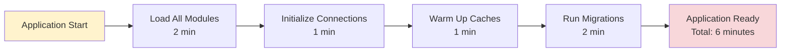

**Problems:**
- Slow to restart during development
- Long deployment downtime
- Slow auto-scaling response
- Difficult to do quick hotfixes
- Poor developer experience

**Comparison:**
```
Monolithic: 6 minute startup
Microservice: 10 second startup

Impact: 36x slower to restart/deploy
```

---

## Side-by-Side Comparison

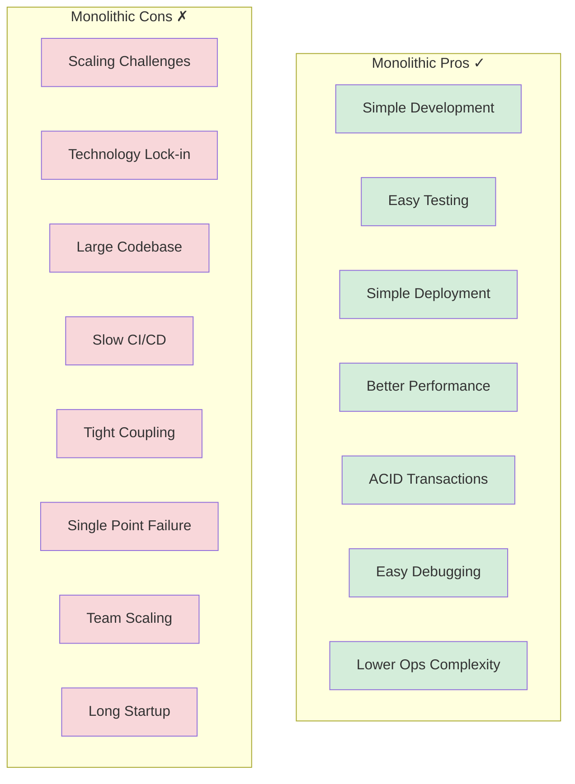

---

## Decision Matrix

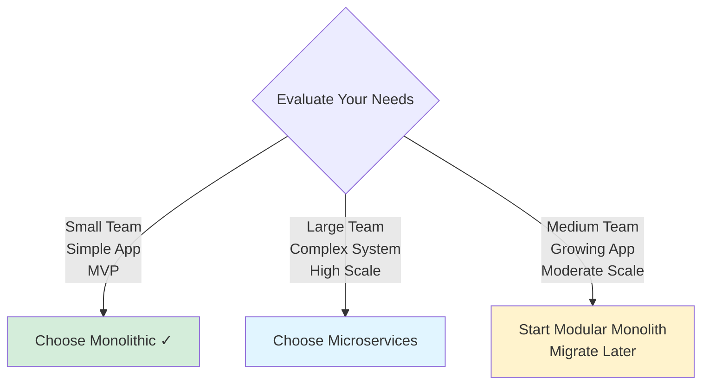

---

## Summary

### When Pros Outweigh Cons ✓
- Small to medium applications
- Startup/MVP phase
- Limited team size (< 10 developers)
- Simple business logic
- Tight deadlines
- Limited budget

### When Cons Outweigh Pros ✗
- Large-scale systems
- Multiple independent teams (> 20 developers)
- Need for independent scaling
- Frequent deployments required
- Technology diversity needed
- High availability critical (99.99%+)

---

## Related Documents

- **[readme.md](./readme.md)**: Complete architecture overview
- **[use-cases.md](./use-cases.md)**: Detailed use case scenarios
- **[examples.md](./examples.md)**: Real-world implementation examples

---

**Last Updated**: October 2025  
**Maintainer**: System Design Team