# Monolithic Architecture: Use Cases

## Overview

This document explores real-world scenarios where monolithic architecture is the optimal choice, helping you make informed decisions about when to use this architectural pattern.

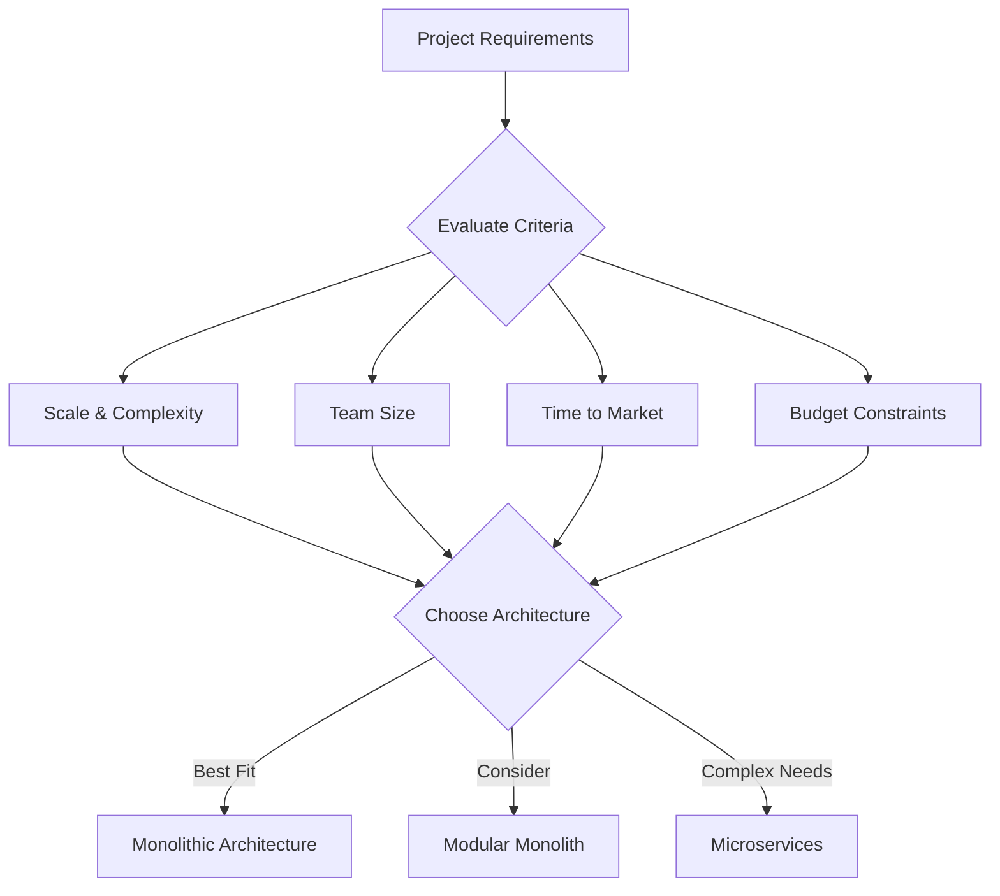

---

## Use Case Categories

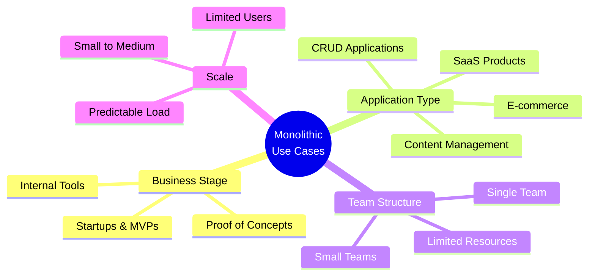

---

## 1. Startup MVP (Minimum Viable Product)

### Scenario
A startup needs to validate their business idea quickly and get to market fast with limited resources.

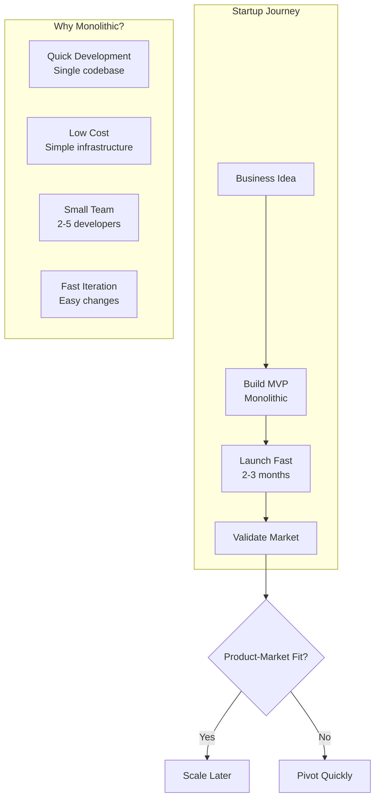

### Requirements
- **Team Size**: 2-5 developers
- **Timeline**: 2-4 months to launch
- **Budget**: Limited funding ($50K - $200K)
- **Users**: < 10,000 initial users
- **Features**: Core features only

### Example: Food Delivery Startup

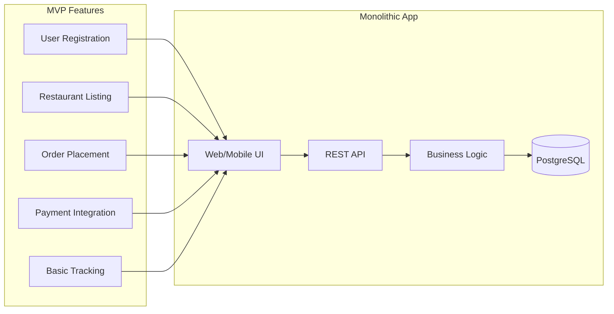

**Tech Stack:**
```
Backend: Node.js + Express
Database: PostgreSQL
Frontend: React
Hosting: Single Heroku Dyno ($25/month)
Total Infrastructure: < $100/month
```

**Benefits:**
- Launch in 3 months
- Total cost: $75K (vs $300K for microservices)
- Easy to pivot based on user feedback
- Simple deployment and monitoring

---

## 2. Small to Medium Business Applications

### Scenario
A company needs a business application for internal operations or customer service.

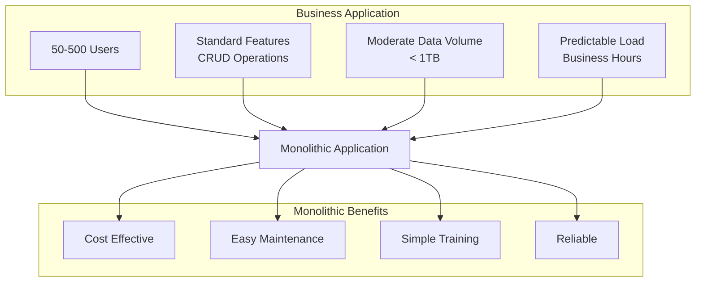

### Examples

#### A. Customer Relationship Management (CRM)

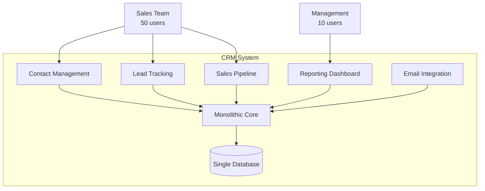

**Specifications:**
- **Users**: 50-100 sales representatives
- **Data**: Customer records, deals, communications
- **Performance**: Response time < 2 seconds
- **Availability**: 99.5% (business hours critical)

#### B. Inventory Management System

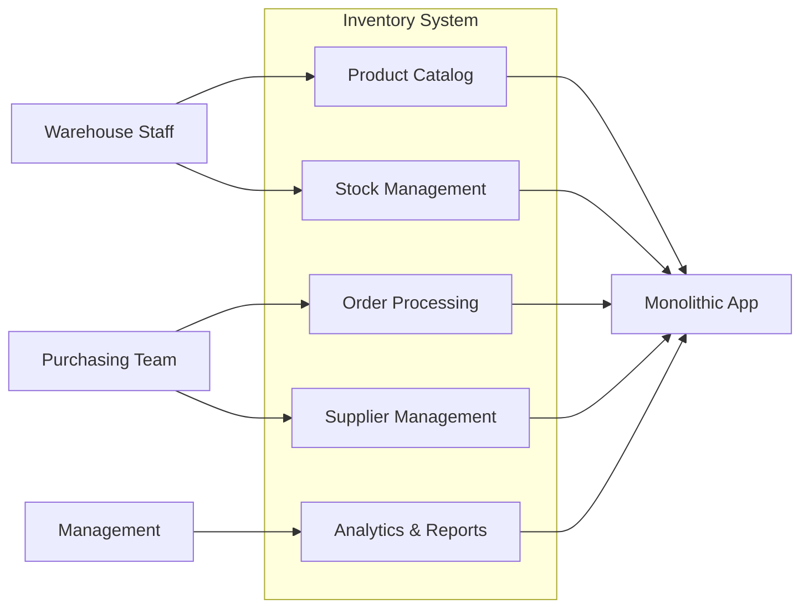

---

## 3. Content Management Systems (CMS)

### Scenario
Building a blog, news site, or content-heavy website with editorial workflows.

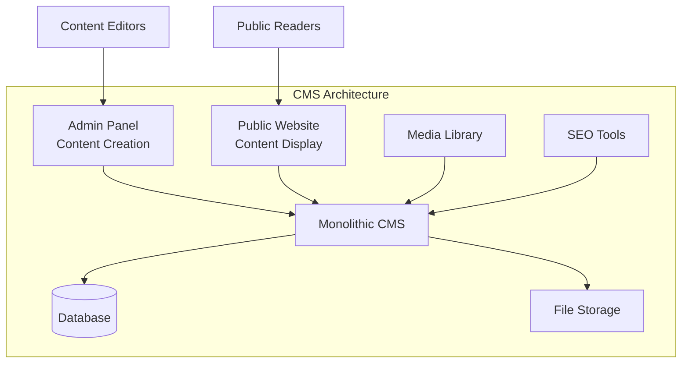

### Example: News/Blog Platform

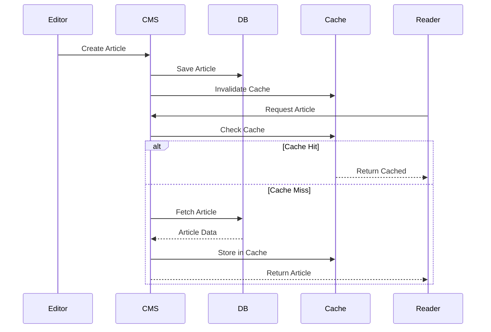

**Features:**
- Article/post creation and editing
- Media management (images, videos)
- User comments and moderation
- SEO optimization
- Multi-language support
- Editorial workflow

**Why Monolithic:**
- Simple content workflow
- Traditional relational data model
- Moderate traffic (< 1M pageviews/month)
- Small editorial team (5-20 people)
- Cost-effective hosting

---

## 4. E-commerce (Small to Medium)

### Scenario
Online store with moderate traffic and product catalog.

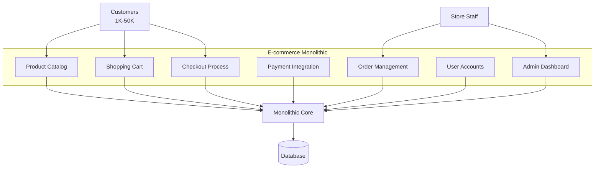

### Size Categories

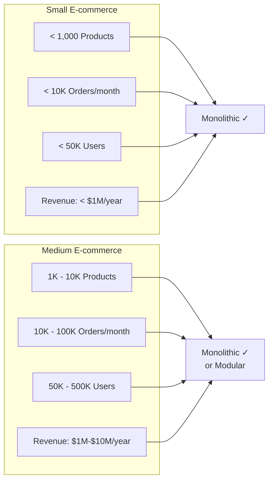

**Tech Stack Example:**
```
Platform: Shopify (Monolithic Ruby on Rails)
Alternative: WooCommerce (Monolithic WordPress + PHP)
Custom: Django + PostgreSQL
```

---

## 5. Internal Tools & Enterprise Applications

### Scenario
Internal business tools used by employees for day-to-day operations.

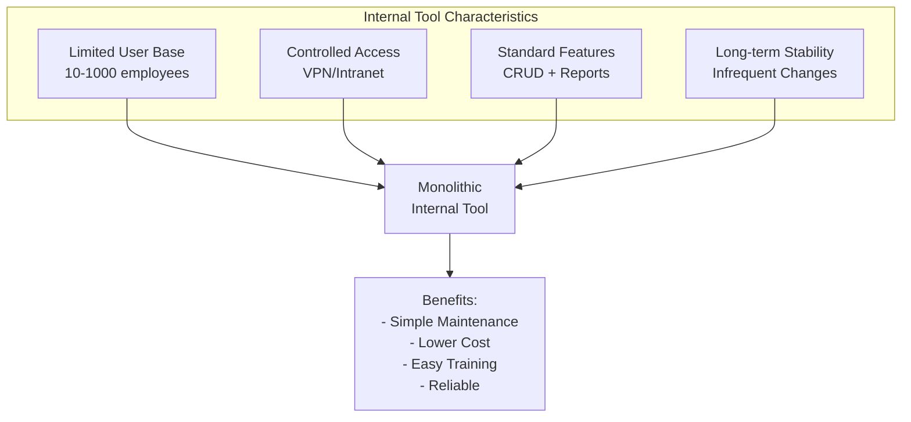

### Examples

#### A. HR Management System

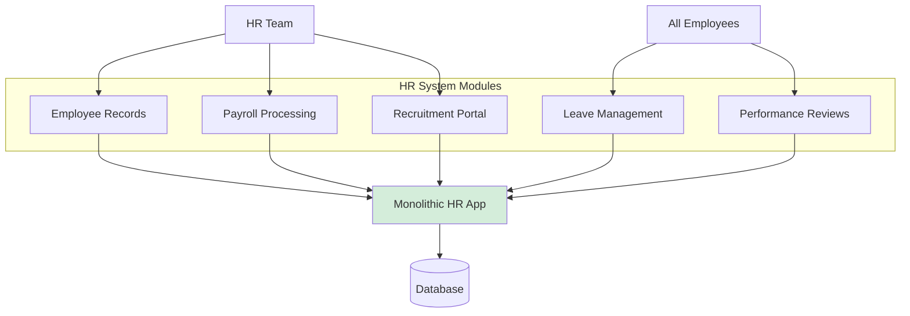

#### B. Project Management Tool

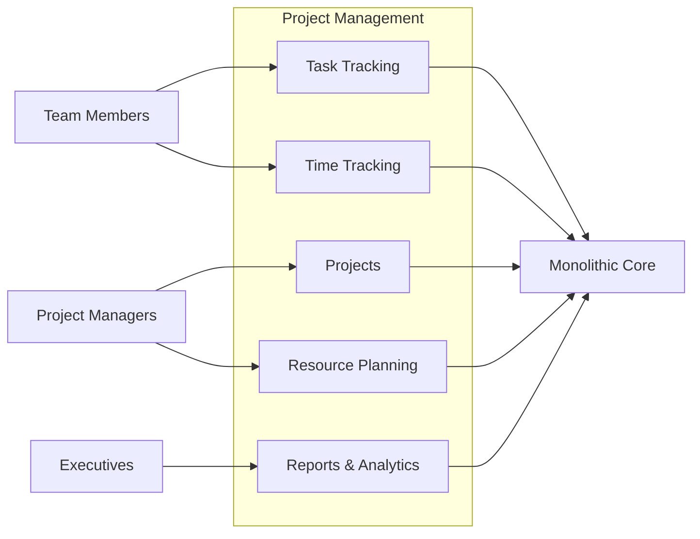

---

## 6. SaaS Products (Early Stage)

### Scenario
Software-as-a-Service product in early stages targeting SMB market.

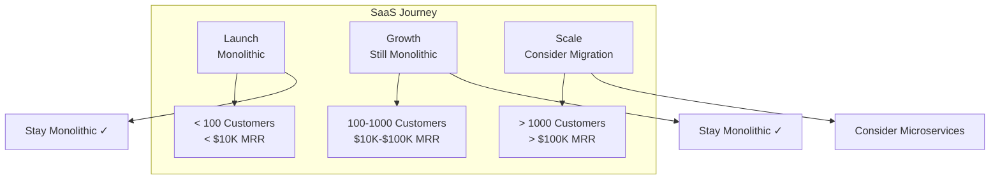

### Example: Project Collaboration SaaS

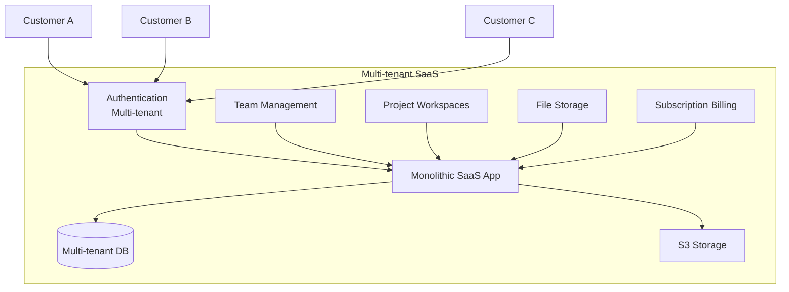

**Characteristics:**
- Multi-tenant architecture
- 50-500 customers
- Monthly recurring revenue model
- Standard feature set for all customers
- Moderate customization needs

---

## 7. Mobile Backend (BaaS - Backend as a Service)

### Scenario
Backend API serving mobile applications with standard features.

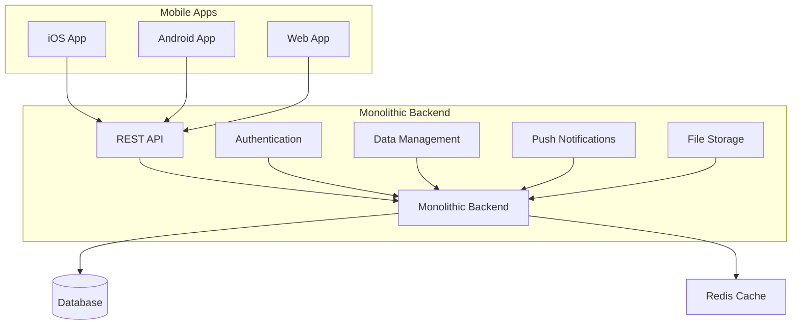

**Use Cases:**
- Social networking app
- Productivity app
- Fitness/health tracking app
- Note-taking app
- Task management app

**Requirements:**
- < 100K active users
- Standard CRUD operations
- Push notifications
- File uploads
- User authentication

---

## 8. Proof of Concept / Prototypes

### Scenario
Testing a new idea or technology before full-scale development.

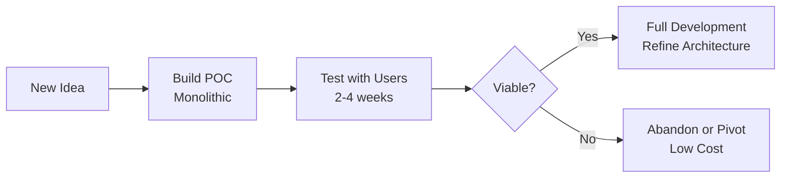

**Why Monolithic for POC:**
- Fastest time to working prototype
- Easy to demonstrate complete flow
- Low investment if idea fails
- Can throw away and rebuild
- No over-engineering

---

## 9. Data-Driven Applications

### Scenario
Applications where data consistency and reporting are critical.

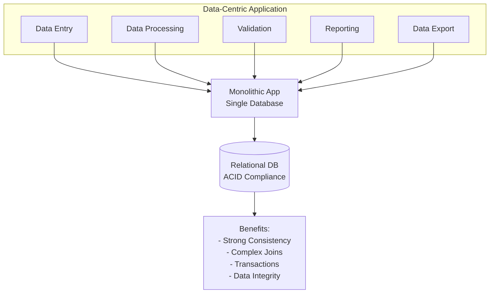

### Examples
- **Financial Systems**: Accounting, bookkeeping
- **Healthcare Records**: Patient management systems
- **Education Management**: Student information systems
- **Legal Case Management**: Document and case tracking

---

## 10. Regulatory Compliance Applications

### Scenario
Applications in heavily regulated industries requiring audit trails and data consistency.

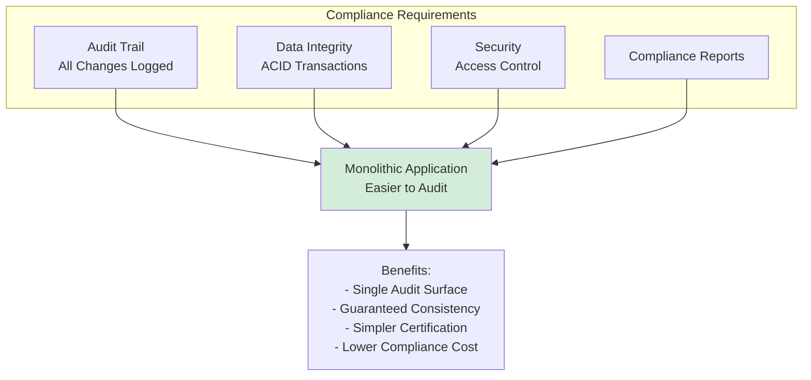

**Industries:**
- Banking and Finance
- Healthcare (HIPAA)
- Government
- Legal
- Insurance

**Why Monolithic:**
- Simpler security model
- Easier to certify (SOC 2, ISO 27001)
- Complete audit trail in one place
- ACID transactions for compliance
- Lower risk of data inconsistency

---

## Decision Framework

```mermaid
graph TB
    Start[New Project]
    
    Start --> Q1{Team Size?}
    Q1 -->|< 10| Score1[+1 Monolithic]
    Q1 -->|10-30| Score2[Neutral]
    Q1 -->|> 30| Score3[-1 Monolithic]
    
    Start --> Q2{Users?}
    Q2 -->|< 10K| Score4[+1 Monolithic]
    Q2 -->|10K-100K| Score5[Neutral]
    Q2 -->|> 100K| Score6[-1 Monolithic]
    
    Start --> Q3{Timeline?}
    Q3 -->|< 3 months| Score7[+1 Monolithic]
    Q3 -->|3-6 months| Score8[Neutral]
    Q3 -->|> 6 months| Score9[Neutral]
    
    Start --> Q4{Budget?}
    Q4 -->|Limited| Score10[+1 Monolithic]
    Q4 -->|Moderate| Score11[Neutral]
    Q4 -->|High| Score12[Neutral]
    
    Start --> Q5{Complexity?}
    Q5 -->|Simple CRUD| Score13[+1 Monolithic]
    Q5 -->|Moderate| Score14[Neutral]
    Q5 -->|Complex| Score15[-1 Monolithic]
    
    Score1 --> Total[Calculate Score]
    Score4 --> Total
    Score7 --> Total
    Score10 --> Total
    Score13 --> Total
    
    Total --> Result{Total Score}
    Result -->|+3 to +5| UseMono[Use Monolithic ✓]
    Result -->|0 to +2| UseModular[Use Modular Monolith]
    Result -->|-5 to -1| UseMicro[Use Microservices]
    
```

---

## When NOT to Use Monolithic

```mermaid
graph TB
    Avoid[Avoid Monolithic When:]
    
    Avoid --> A1[Multiple Independent Teams<br/>> 30 developers]
    Avoid --> A2[Need Independent Scaling<br/>Different components need<br/>different resources]
    Avoid --> A3[Technology Diversity<br/>Different languages/frameworks<br/>for different features]
    Avoid --> A4[Extremely High Availability<br/>99.99%+ uptime required]
    Avoid --> A5[Rapid Feature Releases<br/>Multiple deploys per day<br/>by different teams]
    Avoid --> A6[Global Scale<br/>Millions of users<br/>across continents]
    
    
```

---

## Migration Path

```mermaid
graph LR
    Start[Start with Monolithic]
    Growth[Product Growth]
    Modular[Extract to Modular Monolith]
    Micro[Migrate to Microservices]
    
    Start --> Metrics1[< 100K users<br/>< 10 developers<br/>Simple features]
    
    Growth --> Metrics2[100K - 1M users<br/>10-30 developers<br/>Growing complexity]
    
    Modular --> Metrics3[Modules isolated<br/>Clear boundaries<br/>Preparing for split]
    
    Micro --> Metrics4[> 1M users<br/>> 30 developers<br/>High complexity]
    
    Start --> Growth
    Growth --> Decision1{Scale Issues?}
    Decision1 -->|Yes| Modular
    Decision1 -->|No| Stay1[Stay Monolithic]
    
    Modular --> Decision2{Need Full Split?}
    Decision2 -->|Yes| Micro
    Decision2 -->|No| Stay2[Stay Modular]
    

```

---

## Real-World Examples

### Successful Monolithic Applications

```mermaid
graph TB
    subgraph "Companies That Started Monolithic"
        Ex1[Shopify<br/>E-commerce Platform<br/>Ruby on Rails Monolith]
        Ex2[GitHub<br/>Code Hosting<br/>Rails Monolith<br/>→ Modular Monolith]
        Ex3[Basecamp<br/>Project Management<br/>Still Monolithic]
        Ex4[Stack Overflow<br/>Q&A Platform<br/>ASP.NET Monolith]
    end
    
    Ex1 --> Scale1[Scaled to billions<br/>in revenue]
    Ex2 --> Scale2[Millions of users<br/>Still mostly monolithic]
    Ex3 --> Scale3[Profitable with<br/>monolithic architecture]
    Ex4 --> Scale4[Handles massive traffic<br/>with monolith]
    
```

---

## Summary Table

| Use Case | Team Size | Users | Timeline | Best Choice |
|----------|-----------|-------|----------|-------------|
| Startup MVP | 2-5 | < 10K | 2-3 months | ✅ Monolithic |
| Small Business App | 3-8 | < 50K | 3-6 months | ✅ Monolithic |
| CMS/Blog | 2-10 | < 1M | 2-4 months | ✅ Monolithic |
| Small E-commerce | 3-10 | < 100K | 3-6 months | ✅ Monolithic |
| Internal Tool | 2-5 | < 1K | 2-4 months | ✅ Monolithic |
| Early SaaS | 5-15 | < 10K | 3-6 months | ✅ Monolithic |
| Mobile Backend | 3-10 | < 100K | 2-4 months | ✅ Monolithic |
| POC/Prototype | 1-3 | Testing | 2-4 weeks | ✅ Monolithic |
| Enterprise (Large) | > 30 | > 1M | Ongoing | ❌ Microservices |
| Global Platform | > 50 | > 10M | Ongoing | ❌ Microservices |

---

## Related Documents

- **[readme.md](./readme.md)**: Architecture overview and fundamentals
- **[pros-cons.md](./pros-cons.md)**: Detailed advantages and disadvantages
- **[examples.md](./examples.md)**: Implementation examples and code samples

---

**Last Updated**: October 2025  
**Maintainer**: System Design Team