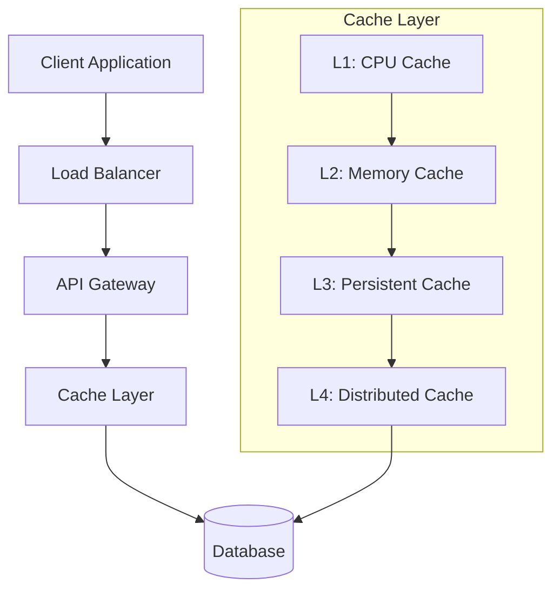

# Caching System Documentation

## Overview

This comprehensive caching system documentation provides detailed insights into modern caching strategies, implementation patterns, and best practices for building scalable, high-performance applications.

## Table of Contents

- [Quick Start](#quick-start)
- [Documentation Structure](#documentation-structure)
- [Key Features](#key-features)
- [Supported Caching Types](#supported-caching-types)
- [Getting Started](#getting-started)

## Quick Start

```bash
# Clone and navigate to project
cd caching/

# Review documentation
├── docs/
│   ├── api.md              # API Documentation
│   ├── architecture.md     # System Architecture
│   ├── caching-strategies.md # Caching Strategies & Patterns
│   └── setup.md           # Setup & Configuration
└── README.md              # This file
```

## Documentation Structure

### 📚 [System Architecture](docs/architecture.md)
Comprehensive overview of caching system architecture, including:
- Multi-layer caching design with Mermaid diagrams
- Component interactions and data flow
- Scalability patterns and deployment models
- Security architecture and access control

**Key Sections:**
- [Architectural Overview](docs/architecture.md#system-overview) - High-level system design
- [Component Design](docs/architecture.md#component-design) - Individual component details  
- [Data Flow Patterns](docs/architecture.md#data-flow-patterns) - Request/response flows
- [Deployment Models](docs/architecture.md#scalability-architecture) - Scaling strategies

### 🔧 [API Documentation](docs/api.md)
Complete API reference covering:
- RESTful cache operations (GET, SET, DELETE)
- Configuration and management endpoints
- Monitoring and health check APIs
- Error handling and status codes

**Cross-References:**
- Implementation details link to [Setup Guide](docs/setup.md#api-configuration)
- Caching strategies reference [Strategy Patterns](docs/caching-strategies.md#implementation-patterns)
- Architecture components detailed in [System Architecture](docs/architecture.md#api-gateway)

### 🎯 [Caching Strategies](docs/caching-strategies.md)
In-depth guide to caching patterns and algorithms:
- Cache-aside, Write-through, Write-behind patterns
- Eviction policies (LRU, LFU, TTL) with visual diagrams
- Distributed caching coordination
- Performance optimization techniques

**Integration Points:**
- API implementations reference [API Documentation](docs/api.md#cache-operations)
- Architecture patterns detailed in [System Architecture](docs/architecture.md#caching-layers)
- Configuration examples in [Setup Guide](docs/setup.md#strategy-configuration)

### ⚙️ [Setup & Configuration](docs/setup.md)
Step-by-step installation and configuration guide:
- Environment setup and prerequisites
- Dependencies installation and version management
- Configuration file templates and examples
- Deployment automation and monitoring setup

**Dependencies:**
- Architecture requirements from [System Architecture](docs/architecture.md#infrastructure-requirements)
- API configuration references [API Documentation](docs/api.md#configuration-endpoints)
- Strategy implementations from [Caching Strategies](docs/caching-strategies.md#configuration-examples)

## Key Features

### 🚀 Performance Optimized
- Sub-millisecond response times
- Efficient memory utilization with smart algorithms
- Automatic performance tuning based on usage patterns
- Detailed in [Architecture](docs/architecture.md#performance-optimization)

### 🔄 Multiple Cache Types
- **In-Memory**: Redis, Memcached configurations
- **Distributed**: Hazelcast, Apache Ignite clusters  
- **Browser**: Local Storage, Session Storage strategies
- **CDN**: CloudFlare, AWS CloudFront integration
- Configuration details in [Setup Guide](docs/setup.md#cache-type-configuration)

### 📊 Monitoring & Analytics
- Real-time metrics dashboard and alerting
- Performance analytics and trend analysis
- Cache hit/miss ratio optimization
- Resource utilization tracking and capacity planning
- API endpoints in [API Documentation](docs/api.md#monitoring-endpoints)

### 🛡️ Reliability & Consistency
- Data consistency guarantees across distributed nodes
- Fault tolerance mechanisms and recovery procedures
- Automatic failover support and health checking
- Data replication strategies and backup procedures
- Architecture details in [System Architecture](docs/architecture.md#reliability-patterns)

## Supported Caching Types

| Cache Type | Use Case | Performance | Complexity | Setup Guide |
|-----------|----------|-------------|------------|-------------|
| **L1 (CPU)** | Ultra-fast access | Nanoseconds | Low | [CPU Cache Setup](docs/setup.md#cpu-cache) |
| **L2 (RAM)** | Application-level | Microseconds | Low | [Memory Cache Setup](docs/setup.md#memory-cache) |
| **L3 (SSD)** | Persistent cache | Milliseconds | Medium | [Persistent Cache Setup](docs/setup.md#persistent-cache) |
| **L4 (Network)** | Distributed cache | 10-100ms | High | [Distributed Setup](docs/setup.md#distributed-cache) |

## Getting Started

### Phase 1: Understanding the System
1. **📖 Read the Architecture Guide**
   - Start with [System Overview](docs/architecture.md#system-overview)
   - Understand [Component Design](docs/architecture.md#component-design)
   - Review [Data Flow Patterns](docs/architecture.md#data-flow-patterns)

### Phase 2: Environment Setup  
2. **⚙️ Follow Setup Instructions**
   - Check [Prerequisites](docs/setup.md#prerequisites)
   - Install [Dependencies](docs/setup.md#dependencies)
   - Configure [Environment](docs/setup.md#environment-configuration)

### Phase 3: Implementation
3. **🔧 Explore API Integration**
   - Review [API Endpoints](docs/api.md#endpoints)
   - Test [Cache Operations](docs/api.md#cache-operations)
   - Implement [Error Handling](docs/api.md#error-handling)

### Phase 4: Optimization
4. **🎯 Apply Caching Strategies**
   - Choose [Appropriate Patterns](docs/caching-strategies.md#pattern-selection)
   - Configure [Eviction Policies](docs/caching-strategies.md#eviction-policies)
   - Optimize [Performance](docs/caching-strategies.md#performance-tuning)

## Architecture Flow Diagram



## Performance Benchmarks

### Typical Response Times
- **In-Memory Cache**: < 1ms ([Strategy Details](docs/caching-strategies.md#in-memory-optimization))
- **Local SSD Cache**: 1-5ms ([Configuration](docs/setup.md#ssd-configuration))
- **Network Cache**: 10-50ms ([Architecture](docs/architecture.md#network-topology))
- **Database Fallback**: 100-500ms ([Fallback Strategies](docs/caching-strategies.md#fallback-patterns))

### Throughput Capacity
- **Single Instance**: 100K+ ops/sec
- **Clustered Setup**: 1M+ ops/sec  
- **Global CDN**: 10M+ ops/sec
- Detailed benchmarks in [Performance Analysis](docs/architecture.md#performance-metrics)

## Use Cases & Implementation Guides

### Web Applications
- Session management → [Session Caching Strategy](docs/caching-strategies.md#session-caching)
- Page fragment caching → [Fragment Caching Pattern](docs/caching-strategies.md#fragment-caching)
- API response caching → [API Caching Implementation](docs/api.md#response-caching)
- Static asset delivery → [CDN Setup Guide](docs/setup.md#cdn-configuration)

### Microservices Architecture
- Service-to-service communication → [Service Mesh Caching](docs/architecture.md#service-mesh)
- Configuration caching → [Config Cache Pattern](docs/caching-strategies.md#configuration-caching)
- Authentication tokens → [Token Caching Strategy](docs/caching-strategies.md#token-caching)
- Rate limiting counters → [Rate Limiting Implementation](docs/api.md#rate-limiting)

### Data Processing Pipelines
- Computation result caching → [Computation Caching](docs/caching-strategies.md#computation-caching)
- Intermediate data storage → [Pipeline Caching](docs/architecture.md#pipeline-architecture)
- Batch processing acceleration → [Batch Processing Setup](docs/setup.md#batch-processing)

## Technology Stack

### Core Technologies
- **Languages**: Python, Java, Node.js, Go
- **Cache Stores**: Redis, Memcached, Hazelcast
- **Protocols**: HTTP, TCP, UDP
- **Serialization**: JSON, Protocol Buffers, MessagePack
- Integration guides in [Setup Documentation](docs/setup.md#technology-integration)

### Monitoring & Observability
- **Metrics**: Prometheus, Grafana
- **Logging**: ELK Stack, Fluentd  
- **Tracing**: Jaeger, Zipkin
- **Alerting**: PagerDuty, Slack
- Configuration in [Monitoring Setup](docs/setup.md#monitoring-configuration)

## Navigation Guide

**For System Architects**: Start with [Architecture Overview](docs/architecture.md) → [Scalability Patterns](docs/architecture.md#scalability-architecture)

**For Developers**: Begin with [API Documentation](docs/api.md) → [Implementation Examples](docs/caching-strategies.md#implementation-examples)

**For DevOps Engineers**: Follow [Setup Guide](docs/setup.md) → [Deployment Strategies](docs/architecture.md#deployment-models)

**For Performance Engineers**: Focus on [Caching Strategies](docs/caching-strategies.md) → [Performance Optimization](docs/architecture.md#performance-optimization)

## Contributing

We welcome contributions! Please read our contributing guidelines and submit pull requests for:
- Documentation improvements and cross-reference updates
- Code examples and implementation guides
- Performance optimizations and benchmark data
- Bug fixes and feature enhancements

## Support & Resources

- **📚 Complete Documentation**: Comprehensive guides in `/docs`
- **🔗 Cross-Referenced Content**: All documents link to related sections
- **📊 Visual Diagrams**: Mermaid diagrams throughout documentation
- **💬 Community Support**: Discussion forums and issue tracking
- **🏢 Enterprise Support**: Professional support packages available

---

**Recommended Reading Path**: 
1. [System Architecture](docs/architecture.md) - Understand the foundation
2. [Setup Guide](docs/setup.md) - Get your environment ready  
3. [API Documentation](docs/api.md) - Learn the interfaces
4. [Caching Strategies](docs/caching-strategies.md) - Optimize implementation

*This documentation is designed to be converted to PDF format while maintaining readability, cross-references, and visual diagrams.*