# Caching: Complete System Design Guide

## Table of Contents
1. [Introduction](#introduction)
2. [Core Concepts](#core-concepts)
3. [Cache Types and Levels](#cache-types-and-levels)
4. [Caching Strategies](#caching-strategies)
5. [Cache Patterns](#cache-patterns)
6. [Consistency Models](#consistency-models)
7. [Eviction Policies](#eviction-policies)
8. [Distributed Caching](#distributed-caching)
9. [Cache Technologies](#cache-technologies)
10. [Performance Optimization](#performance-optimization)
11. [Monitoring and Observability](#monitoring-and-observability)
12. [Best Practices](#best-practices)
13. [Common Pitfalls](#common-pitfalls)

## Introduction

**Caching** is a technique used to store frequently accessed data in a faster storage layer to reduce latency, decrease load on backend systems, and improve overall application performance. It's one of the most effective ways to scale systems and enhance user experience.

### Why Caching Matters

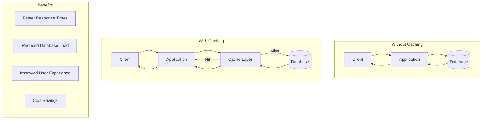
```mermaid
graph TB
    subgraph "Without Caching"
        Client1[Client] --> App1[Application]
        App1 --> DB1[(Database)]
        DB1 --> App1
        App1 --> Client1
    end
    
    subgraph "With Caching"
        Client2[Client] --> App2[Application]
        App2 --> Cache[Cache Layer]
        Cache -->|Hit| App2
        Cache -->|Miss| DB2[(Database)]
        DB2 --> Cache
        Cache --> App2
        App2 --> Client2
    end
    
    subgraph "Benefits"
        FastResponse[Faster Response Times]
        ReducedLoad[Reduced Database Load]
        BetterUX[Improved User Experience]
        CostSavings[Cost Savings]
    end
```

## Core Concepts

### Cache Fundamentals

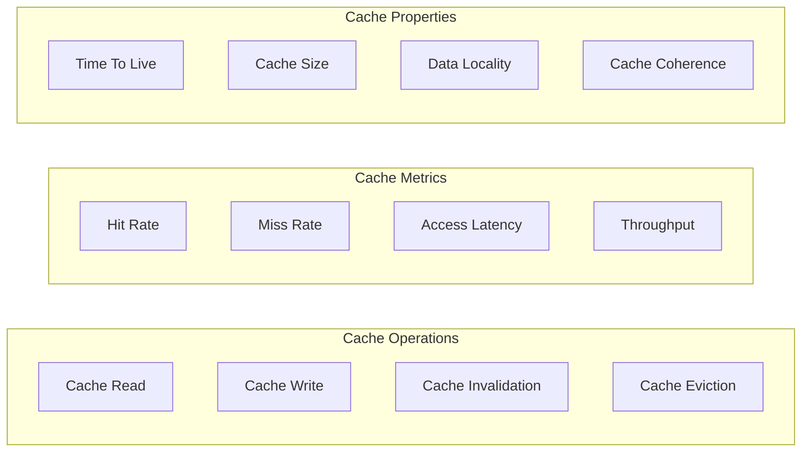
```mermaid
graph LR
    subgraph "Cache Operations"
        Read[Cache Read]
        Write[Cache Write]
        Invalidate[Cache Invalidation]
        Evict[Cache Eviction]
    end
    
    subgraph "Cache Metrics"
        HitRate[Hit Rate]
        MissRate[Miss Rate]
        Latency[Access Latency]
        Throughput[Throughput]
    end
    
    subgraph "Cache Properties"
        TTL[Time To Live]
        Size[Cache Size]
        Locality[Data Locality]
        Coherence[Cache Coherence]
    end
```

### Cache Hit vs Cache Miss Flow

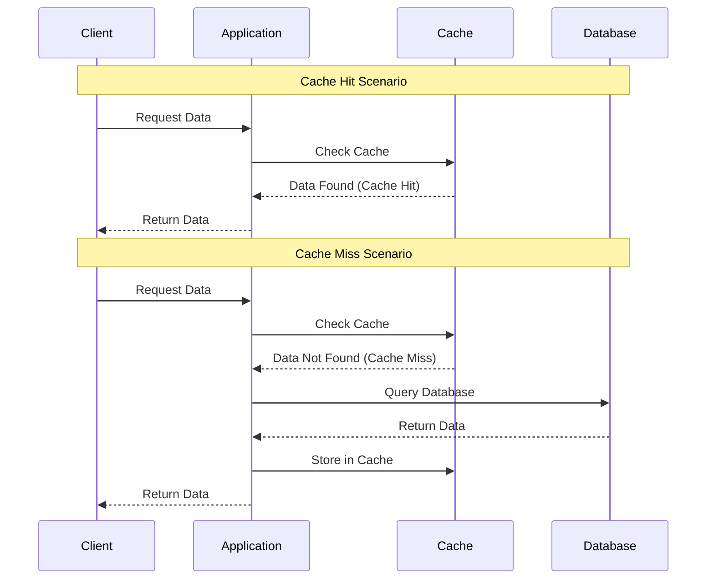
```mermaid
sequenceDiagram
    participant Client
    participant App as Application
    participant Cache
    participant DB as Database
    
    Note over Client, DB: Cache Hit Scenario
    Client->>App: Request Data
    App->>Cache: Check Cache
    Cache-->>App: Data Found (Cache Hit)
    App-->>Client: Return Data
    
    Note over Client, DB: Cache Miss Scenario
    Client->>App: Request Data
    App->>Cache: Check Cache
    Cache-->>App: Data Not Found (Cache Miss)
    App->>DB: Query Database
    DB-->>App: Return Data
    App->>Cache: Store in Cache
    App-->>Client: Return Data
```

## Cache Types and Levels

### 1. Memory Hierarchy

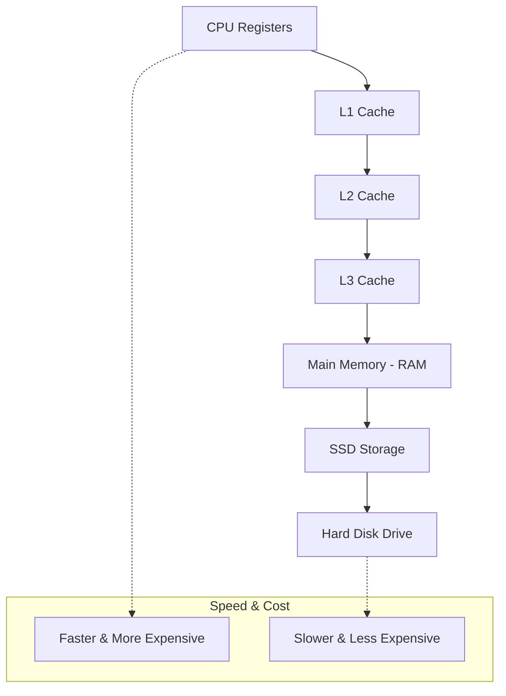
```mermaid
graph TB
    CPU[CPU Registers] --> L1[L1 Cache]
    L1 --> L2[L2 Cache]
    L2 --> L3[L3 Cache]
    L3 --> RAM[Main Memory - RAM]
    RAM --> SSD[SSD Storage]
    SSD --> HDD[Hard Disk Drive]
    
    subgraph "Speed & Cost"
        Fast[Faster & More Expensive]
        Slow[Slower & Less Expensive]
    end
    
    CPU -.-> Fast
    HDD -.-> Slow
```

### 2. Application-Level Cache Layers

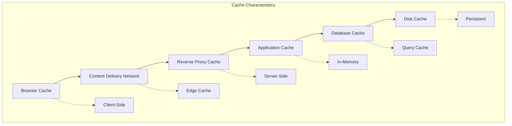
```mermaid
graph TB
    Browser[Browser Cache] --> CDN[Content Delivery Network]
    CDN --> ReverseProxy[Reverse Proxy Cache]
    ReverseProxy --> AppCache[Application Cache]
    AppCache --> DBCache[Database Cache]
    DBCache --> DiskCache[Disk Cache]
    
    subgraph "Cache Characteristics"
        Browser -.-> ClientSide[Client-Side]
        CDN -.-> EdgeCache[Edge Cache]
        ReverseProxy -.-> ServerSide[Server-Side]
        AppCache -.-> InMemory[In-Memory]
        DBCache -.-> QueryCache[Query Cache]
        DiskCache -.-> Persistent[Persistent]
    end
```

### 3. Geographic Distribution

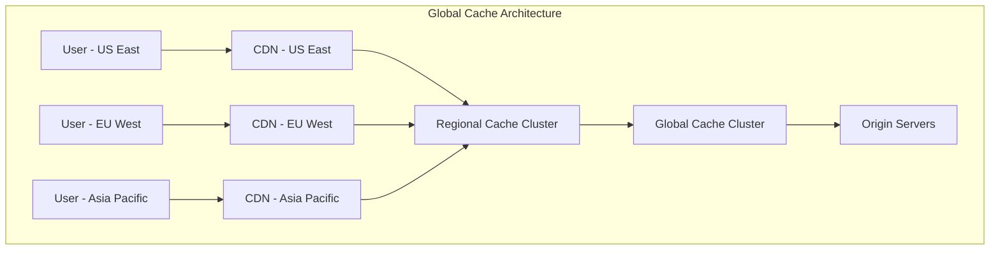
```mermaid
graph TB
    subgraph "Global Cache Architecture"
        User1[User - US East]
        User2[User - EU West]
        User3[User - Asia Pacific]
        
        CDN1[CDN - US East]
        CDN2[CDN - EU West]
        CDN3[CDN - Asia Pacific]
        
        Regional[Regional Cache Cluster]
        Global[Global Cache Cluster]
        Origin[Origin Servers]
    end
    
    User1 --> CDN1
    User2 --> CDN2
    User3 --> CDN3
    
    CDN1 --> Regional
    CDN2 --> Regional
    CDN3 --> Regional
    
    Regional --> Global
    Global --> Origin
```

## Caching Strategies

### 1. Cache-Aside (Lazy Loading)

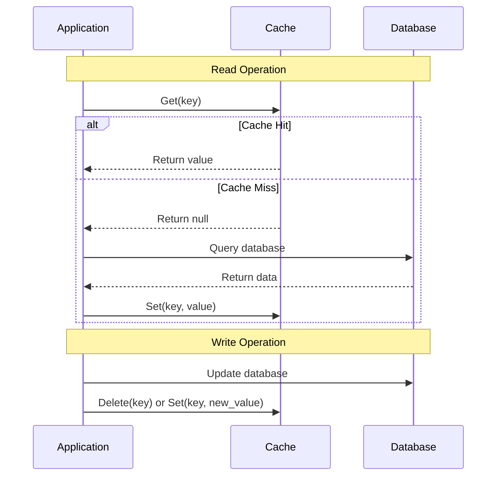
```mermaid
sequenceDiagram
    participant App as Application
    participant Cache
    participant DB as Database
    
    Note over App, DB: Read Operation
    App->>Cache: Get(key)
    alt Cache Hit
        Cache-->>App: Return value
    else Cache Miss
        Cache-->>App: Return null
        App->>DB: Query database
        DB-->>App: Return data
        App->>Cache: Set(key, value)
    end
    
    Note over App, DB: Write Operation
    App->>DB: Update database
    App->>Cache: Delete(key) or Set(key, new_value)
```

**Pros:**
- Only requested data is cached
- Cache failures don't break the application
- Simple to implement

**Cons:**
- Cache miss penalty (3 round trips)
- Stale data if not invalidated properly

### 2. Write-Through

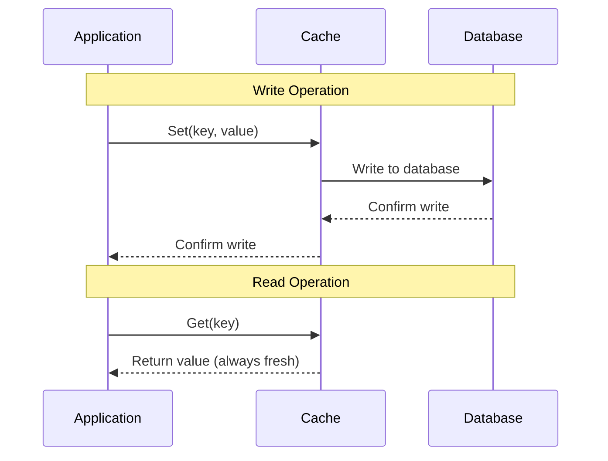
```mermaid
sequenceDiagram
    participant App as Application
    participant Cache
    participant DB as Database
    
    Note over App, DB: Write Operation
    App->>Cache: Set(key, value)
    Cache->>DB: Write to database
    DB-->>Cache: Confirm write
    Cache-->>App: Confirm write
    
    Note over App, DB: Read Operation
    App->>Cache: Get(key)
    Cache-->>App: Return value (always fresh)
```

**Pros:**
- Data is always consistent
- No cache miss penalty for writes
- Simple read operations

**Cons:**
- Higher write latency
- Unused data might be cached
- Write failures affect both cache and database

### 3. Write-Behind (Write-Back)

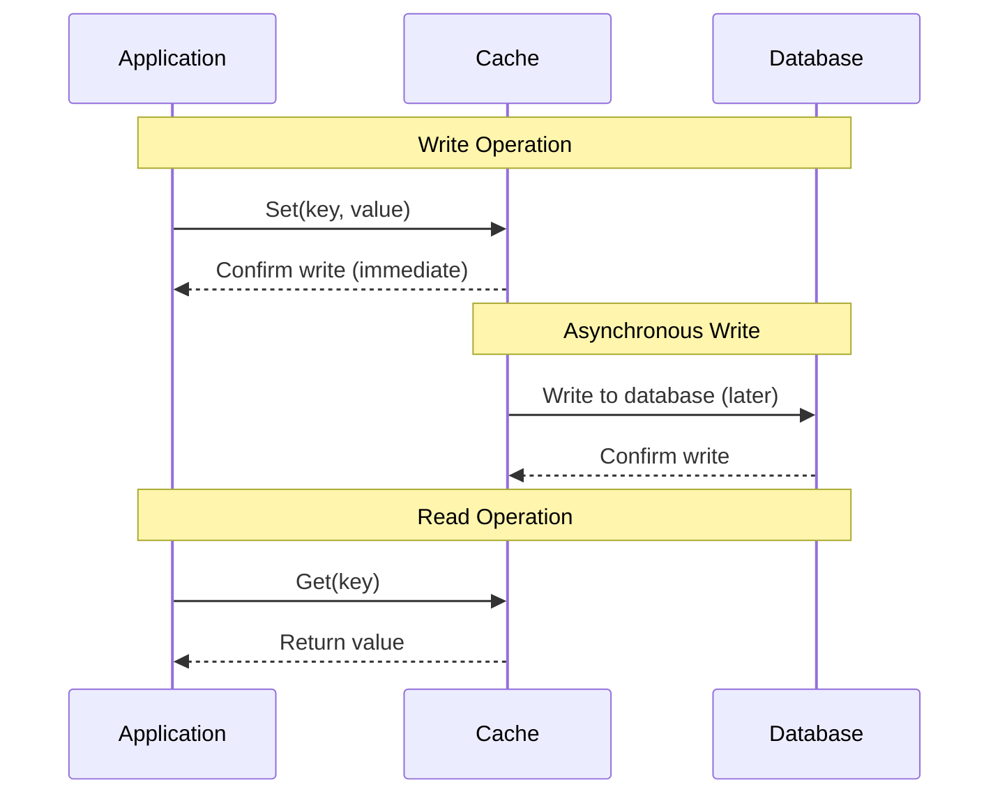
```mermaid
sequenceDiagram
    participant App as Application
    participant Cache
    participant DB as Database
    
    Note over App, DB: Write Operation
    App->>Cache: Set(key, value)
    Cache-->>App: Confirm write (immediate)
    
    Note over Cache, DB: Asynchronous Write
    Cache->>DB: Write to database (later)
    DB-->>Cache: Confirm write
    
    Note over App, DB: Read Operation
    App->>Cache: Get(key)
    Cache-->>App: Return value
```

**Pros:**
- Low write latency
- Good for write-heavy workloads
- Batch writes can improve performance

**Cons:**
- Risk of data loss if cache fails
- Complex consistency guarantees
- Delayed database updates

### 4. Refresh-Ahead

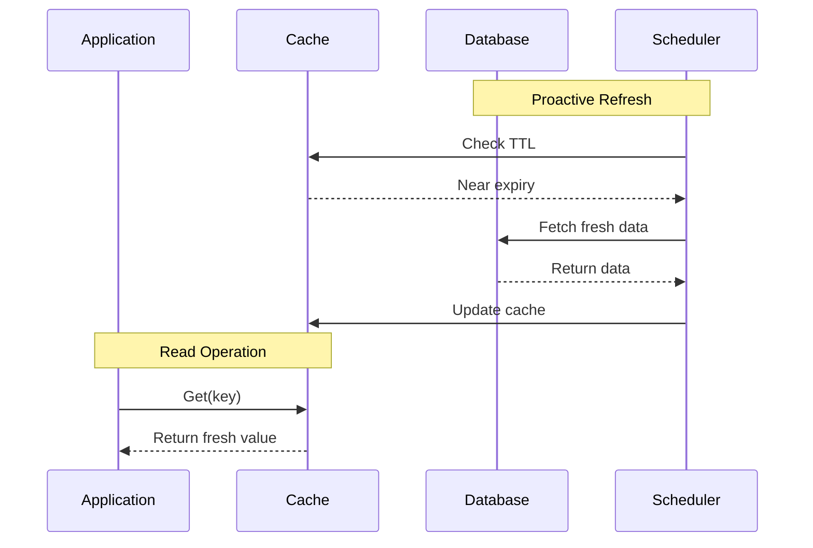
```mermaid
sequenceDiagram
    participant App as Application
    participant Cache
    participant DB as Database
    participant Scheduler
    
    Note over Scheduler, DB: Proactive Refresh
    Scheduler->>Cache: Check TTL
    Cache-->>Scheduler: Near expiry
    Scheduler->>DB: Fetch fresh data
    DB-->>Scheduler: Return data
    Scheduler->>Cache: Update cache
    
    Note over App, Cache: Read Operation
    App->>Cache: Get(key)
    Cache-->>App: Return fresh value
```

**Pros:**
- Reduced latency for frequently accessed data
- Proactive cache warming
- Better user experience

**Cons:**
- Complex to implement
- May refresh unused data
- Requires prediction of access patterns

## Cache Patterns

### 1. Cache Warming Strategies

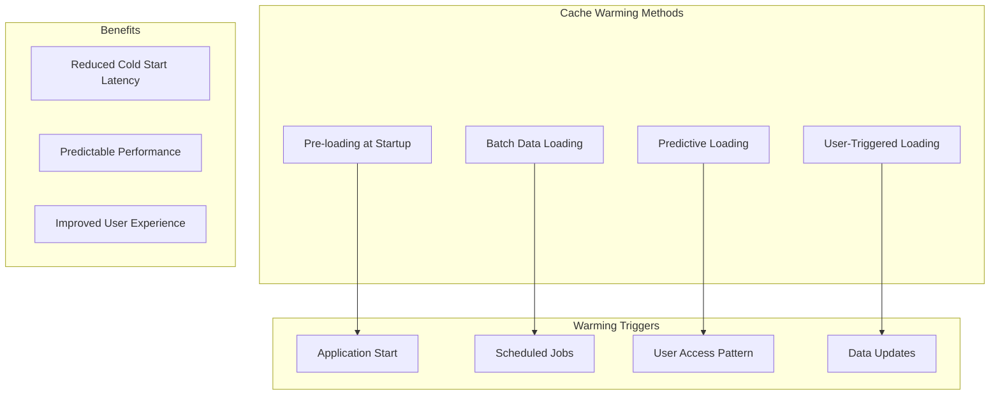
```mermaid
graph TB
    subgraph "Cache Warming Methods"
        PreLoad[Pre-loading at Startup]
        Batch[Batch Data Loading]
        Predictive[Predictive Loading]
        UserTriggered[User-Triggered Loading]
    end
    
    subgraph "Warming Triggers"
        AppStart[Application Start]
        Schedule[Scheduled Jobs]
        UserAccess[User Access Pattern]
        DataUpdate[Data Updates]
    end
    
    PreLoad --> AppStart
    Batch --> Schedule
    Predictive --> UserAccess
    UserTriggered --> DataUpdate
    
    subgraph "Benefits"
        ReducedLatency[Reduced Cold Start Latency]
        PredictablePerformance[Predictable Performance]
        ImprovedUX[Improved User Experience]
    end
```

### 2. Multi-Level Caching

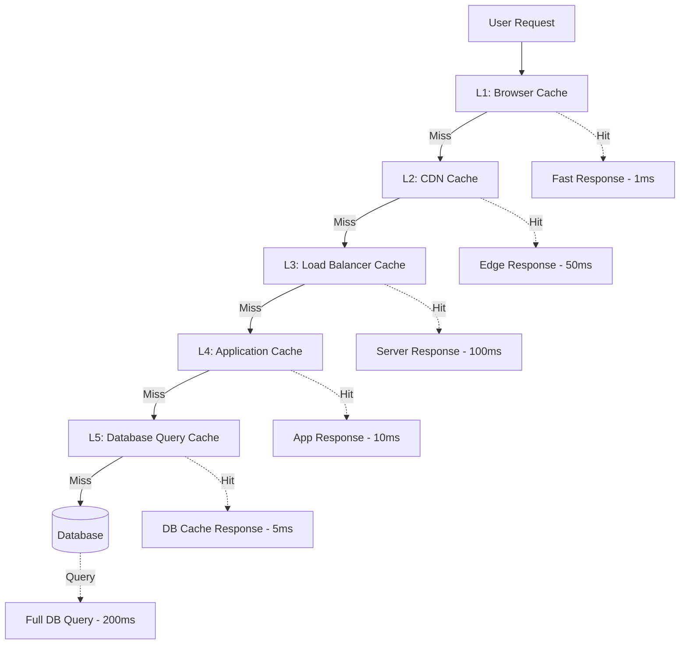
```mermaid
graph TB
    Request[User Request] --> L1[L1: Browser Cache]
    L1 -->|Miss| L2[L2: CDN Cache]
    L2 -->|Miss| L3[L3: Load Balancer Cache]
    L3 -->|Miss| L4[L4: Application Cache]
    L4 -->|Miss| L5[L5: Database Query Cache]
    L5 -->|Miss| DB[(Database)]
    
    L1 -.->|Hit| Response1[Fast Response - 1ms]
    L2 -.->|Hit| Response2[Edge Response - 50ms]
    L3 -.->|Hit| Response3[Server Response - 100ms]
    L4 -.->|Hit| Response4[App Response - 10ms]
    L5 -.->|Hit| Response5[DB Cache Response - 5ms]
    DB -.->|Query| Response6[Full DB Query - 200ms]
```

### 3. Cache Partitioning Strategies

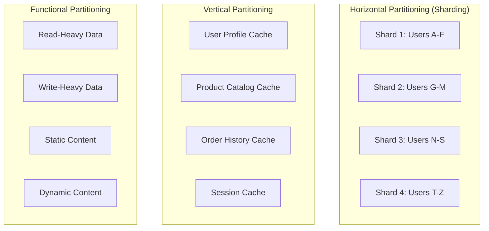
```mermaid
graph TB
    subgraph "Horizontal Partitioning (Sharding)"
        Shard1[Shard 1: Users A-F]
        Shard2[Shard 2: Users G-M]
        Shard3[Shard 3: Users N-S]
        Shard4[Shard 4: Users T-Z]
    end
    
    subgraph "Vertical Partitioning"
        UserCache[User Profile Cache]
        ProductCache[Product Catalog Cache]
        OrderCache[Order History Cache]
        SessionCache[Session Cache]
    end
    
    subgraph "Functional Partitioning"
        ReadCache[Read-Heavy Data]
        WriteCache[Write-Heavy Data]
        StaticCache[Static Content]
        DynamicCache[Dynamic Content]
    end
```

## Consistency Models

### 1. Consistency Spectrum

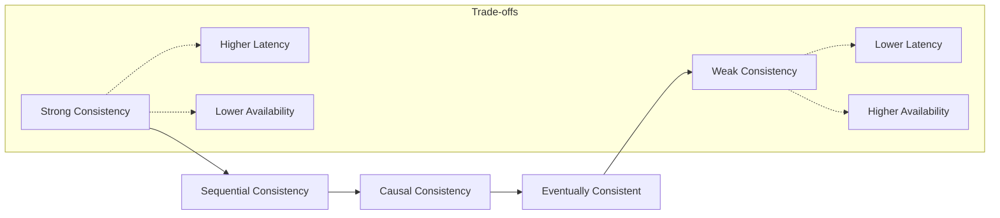
```mermaid
graph LR
    Strong[Strong Consistency] --> Sequential[Sequential Consistency]
    Sequential --> Causal[Causal Consistency]
    Causal --> Eventually[Eventually Consistent]
    Eventually --> Weak[Weak Consistency]
    
    subgraph "Trade-offs"
        Strong -.-> HighLatency[Higher Latency]
        Strong -.-> LowAvailability[Lower Availability]
        Weak -.-> LowLatency[Lower Latency]
        Weak -.-> HighAvailability[Higher Availability]
    end
```

### 2. Cache Coherence Protocols

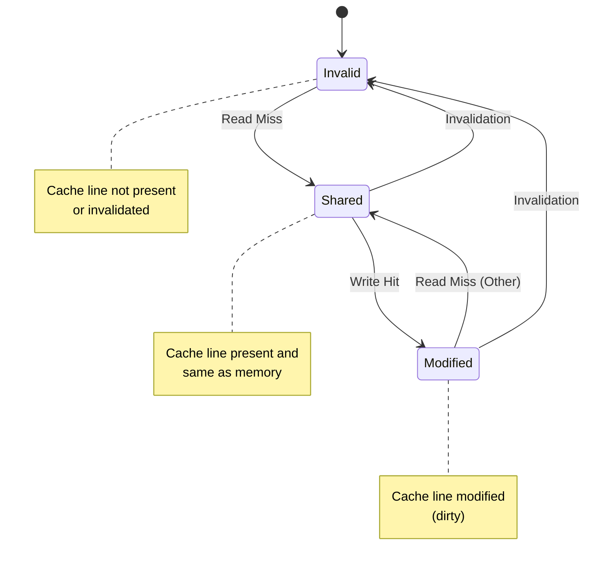
```mermaid
stateDiagram-v2
    [*] --> Invalid
    Invalid --> Shared: Read Miss
    Shared --> Modified: Write Hit
    Shared --> Invalid: Invalidation
    Modified --> Shared: Read Miss (Other)
    Modified --> Invalid: Invalidation
    
    note right of Invalid
        Cache line not present
        or invalidated
    end note
    
    note right of Shared
        Cache line present and
        same as memory
    end note
    
    note right of Modified
        Cache line modified
        (dirty)
    end note
```

### 3. Invalidation Strategies

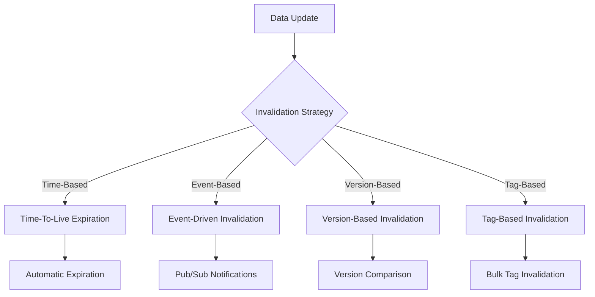
```mermaid
graph TB
    DataUpdate[Data Update] --> InvalidationStrategy{Invalidation Strategy}
    
    InvalidationStrategy -->|Time-Based| TTL[Time-To-Live Expiration]
    InvalidationStrategy -->|Event-Based| EventDriven[Event-Driven Invalidation]
    InvalidationStrategy -->|Version-Based| Versioning[Version-Based Invalidation]
    InvalidationStrategy -->|Tag-Based| TagInvalidation[Tag-Based Invalidation]
    
    TTL --> AutoExpire[Automatic Expiration]
    EventDriven --> PubSub[Pub/Sub Notifications]
    Versioning --> VersionCheck[Version Comparison]
    TagInvalidation --> BulkInvalidation[Bulk Tag Invalidation]
```

## Eviction Policies

### 1. Common Eviction Algorithms

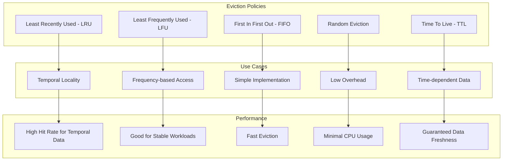
```mermaid
graph TB
    subgraph "Eviction Policies"
        LRU[Least Recently Used - LRU]
        LFU[Least Frequently Used - LFU]
        FIFO[First In First Out - FIFO]
        Random[Random Eviction]
        TTL[Time To Live - TTL]
    end
    
    subgraph "Use Cases"
        LRU --> Temporal[Temporal Locality]
        LFU --> Frequency[Frequency-based Access]
        FIFO --> Simple[Simple Implementation]
        Random --> LowOverhead[Low Overhead]
        TTL --> TimeDependent[Time-dependent Data]
    end
    
    subgraph "Performance"
        Temporal --> HighHitRate[High Hit Rate for Temporal Data]
        Frequency --> StableWorkload[Good for Stable Workloads]
        Simple --> FastEviction[Fast Eviction]
        LowOverhead --> MinimalCPU[Minimal CPU Usage]
        TimeDependent --> DataFreshness[Guaranteed Data Freshness]
    end
```

### 2. LRU Implementation

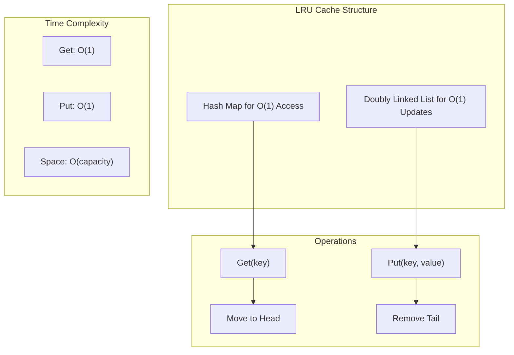
```mermaid
graph TB
    subgraph "LRU Cache Structure"
        HashMap["Hash Map for O(1) Access"]
        DLL["Doubly Linked List for O(1) Updates"]
    end
    
    subgraph "Operations"
        Get["Get(key)"]
        Put["Put(key, value)"]
        MoveToHead["Move to Head"]
        RemoveTail["Remove Tail"]
    end
    
    HashMap --> Get
    DLL --> Put
    Get --> MoveToHead
    Put --> RemoveTail
    
    subgraph "Time Complexity"
        GetTime["Get: O(1)"]
        PutTime["Put: O(1)"]
        SpaceComplexity["Space: O(capacity)"]
    end
```

### 3. Eviction Policy Comparison

| Policy | Access Pattern | Memory Overhead | Implementation Complexity | Best For |
|--------|----------------|-----------------|--------------------------|-----------|
| **LRU** | Temporal locality | Medium | Medium | General purpose |
| **LFU** | Frequency-based | High | High | Stable access patterns |
| **FIFO** | Order-based | Low | Low | Simple caching |
| **Random** | No pattern | Very Low | Very Low | High-throughput systems |
| **TTL** | Time-sensitive | Low | Low | Data with expiration |

## Distributed Caching

### 1. Distributed Cache Architecture

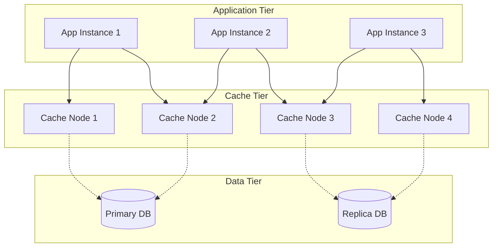
```mermaid
graph TB
    subgraph "Application Tier"
        App1[App Instance 1]
        App2[App Instance 2]
        App3[App Instance 3]
    end
    
    subgraph "Cache Tier"
        Cache1[Cache Node 1]
        Cache2[Cache Node 2]
        Cache3[Cache Node 3]
        Cache4[Cache Node 4]
    end
    
    subgraph "Data Tier"
        DB1[(Primary DB)]
        DB2[(Replica DB)]
    end
    
    App1 --> Cache1
    App1 --> Cache2
    App2 --> Cache2
    App2 --> Cache3
    App3 --> Cache3
    App3 --> Cache4
    
    Cache1 -.-> DB1
    Cache2 -.-> DB1
    Cache3 -.-> DB2
    Cache4 -.-> DB2
```

### 2. Consistent Hashing

```mermaid
graph TB
    subgraph "Hash Ring"
        Node1[Node 1: Hash(A)]
        Node2[Node 2: Hash(B)]
        Node3[Node 3: Hash(C)]
        Node4[Node 4: Hash(D)]
        
        Key1[Key 1]
        Key2[Key 2]
        Key3[Key 3]
        Key4[Key 4]
    end
    
    Node1 --> Node2
    Node2 --> Node3
    Node3 --> Node4
    Node4 --> Node1
    
    Key1 -.-> Node2
    Key2 -.-> Node3
    Key3 -.-> Node4
    Key4 -.-> Node1
    
    subgraph "Benefits"
        Minimal[Minimal Redistribution]
        Scalable[Easy Scaling]
        FaultTolerant[Fault Tolerant]
    end
```

### 3. Replication Strategies

```mermaid
graph TB
    subgraph "Master-Slave Replication"
        Master[Master Node]
        Slave1[Slave Node 1]
        Slave2[Slave Node 2]
        
        Master --> Slave1
        Master --> Slave2
    end
    
    subgraph "Peer-to-Peer Replication"
        Peer1[Node 1]
        Peer2[Node 2]
        Peer3[Node 3]
        
        Peer1 <--> Peer2
        Peer2 <--> Peer3
        Peer3 <--> Peer1
    end
    
    subgraph "Multi-Master Replication"
        MM1[Master 1]
        MM2[Master 2]
        MM3[Master 3]
        
        MM1 <--> MM2
        MM2 <--> MM3
        MM3 <--> MM1
    end
```

## Cache Technologies

### 1. In-Memory Cache Solutions

```mermaid
graph TB
    subgraph "Local Caches"
        Caffeine[Caffeine - Java]
        GuavaCache[Guava Cache - Java]
        EhCache[EhCache - Java]
        NodeCache[Node-cache - Node.js]
    end
    
    subgraph "Distributed Caches"
        Redis[Redis]
        Memcached[Memcached]
        Hazelcast[Hazelcast]
        IgniteCache[Apache Ignite]
    end
    
    subgraph "Enterprise Solutions"
        CoherenceCache[Oracle Coherence]
        GemFire[VMware Tanzu GemFire]
        Infinispan[Red Hat Infinispan]
        GridGain[GridGain]
    end
```

### 2. Redis Architecture

```mermaid
graph TB
    subgraph "Redis Deployment Modes"
        Standalone[Standalone Redis]
        MasterSlave[Master-Slave Replication]
        Sentinel[Redis Sentinel]
        Cluster[Redis Cluster]
    end
    
    subgraph "Redis Features"
        DataStructures[Rich Data Structures]
        Persistence[Persistence Options]
        PubSub[Pub/Sub Messaging]
        Scripting[Lua Scripting]
        Transactions[Transactions]
    end
    
    subgraph "Use Cases"
        SessionStore[Session Storage]
        RealTime[Real-time Analytics]
        Leaderboard[Leaderboards]
        RateLimiting[Rate Limiting]
        MessageQueue[Message Queuing]
    end
    
    Standalone --> SessionStore
    MasterSlave --> RealTime
    Sentinel --> Leaderboard
    Cluster --> RateLimiting
    DataStructures --> MessageQueue
```

### 3. Technology Comparison

| Feature | Redis | Memcached | Hazelcast | Apache Ignite |
|---------|--------|-----------|-----------|---------------|
| **Data Types** | Rich | Key-Value only | Rich | Rich |
| **Persistence** | Yes | No | Yes | Yes |
| **Clustering** | Yes | Limited | Yes | Yes |
| **Memory Usage** | Higher | Lower | Medium | Higher |
| **Performance** | Very High | Very High | High | High |
| **Complexity** | Medium | Low | Medium | High |

## Performance Optimization

### 1. Cache Sizing and Capacity Planning

```mermaid
graph TB
    subgraph "Capacity Planning Factors"
        DataSize[Data Size per Item]
        AccessPattern[Access Patterns]
        HitRate[Target Hit Rate]
        GrowthRate[Data Growth Rate]
    end
    
    subgraph "Memory Calculations"
        ItemSize[Average Item Size]
        NumItems[Number of Items]
        Overhead[Memory Overhead]
        TotalMemory[Total Memory Required]
    end
    
    DataSize --> ItemSize
    AccessPattern --> NumItems
    ItemSize --> TotalMemory
    NumItems --> TotalMemory
    Overhead --> TotalMemory
    
    subgraph "Optimization Techniques"
        Compression[Data Compression]
        Serialization[Efficient Serialization]
        MemoryPools[Memory Pools]
        GarbageCollection[GC Optimization]
    end
```

### 2. Hot Key Problem

```mermaid
graph TB
    HotKey[Hot Key Problem] --> Issues[Issues]
    Issues --> Bottleneck[Single Node Bottleneck]
    Issues --> MemoryPressure[Memory Pressure]
    Issues --> NetworkCongestion[Network Congestion]
    
    HotKey --> Solutions[Solutions]
    Solutions --> LocalCache[Local Caching]
    Solutions --> KeySharding[Key Sharding]
    Solutions --> Replication[Read Replicas]
    Solutions --> LoadBalancing[Load Balancing]
    
    subgraph "Implementation"
        LocalCache --> L1Cache[L1 Local Cache]
        KeySharding --> HashSuffixes[Hash with Suffixes]
        Replication --> ReadReplicas[Multiple Read Replicas]
        LoadBalancing --> ConsistentHashing[Consistent Hashing]
    end
```

### 3. Cache Warming Strategies

```mermaid
sequenceDiagram
    participant Scheduler
    participant WarmupService
    participant Cache
    participant Database
    participant Monitor
    
    Scheduler->>WarmupService: Trigger Cache Warmup
    WarmupService->>Database: Query Popular Data
    Database-->>WarmupService: Return Data Set
    
    loop For Each Data Item
        WarmupService->>Cache: Preload Data
        Cache-->>WarmupService: Confirm Storage
    end
    
    WarmupService->>Monitor: Report Warmup Status
    Monitor-->>Scheduler: Warmup Complete
    
    Note over Cache: Cache is now warmed
    Note over Cache: Ready for production traffic
```

## Monitoring and Observability

### 1. Key Metrics to Monitor

```mermaid
graph TB
    subgraph "Performance Metrics"
        HitRate[Hit Rate %]
        MissRate[Miss Rate %]
        Latency[Response Latency]
        Throughput[Operations/Second]
    end
    
    subgraph "Resource Metrics"
        MemoryUsage[Memory Usage]
        CPUUtilization[CPU Utilization]
        NetworkIO[Network I/O]
        DiskIO[Disk I/O]
    end
    
    subgraph "Health Metrics"
        Availability[Service Availability]
        ErrorRate[Error Rate]
        ConnectionCount[Active Connections]
        EvictionRate[Eviction Rate]
    end
    
    subgraph "Business Metrics"
        CacheEfficiency[Cache Efficiency]
        CostSavings[Cost Savings]
        UserExperience[User Experience Impact]
        BackendLoad[Backend Load Reduction]
    end
```

### 2. Monitoring Dashboard

```mermaid
graph TB
    subgraph "Real-time Dashboard"
        Overview[System Overview]
        Performance[Performance Metrics]
        Health[Health Status]
        Alerts[Alert Management]
    end
    
    subgraph "Metrics Sources"
        CacheNodes[Cache Nodes]
        Applications[Applications]
        LoadBalancer[Load Balancers]
        Database[Database Systems]
    end
    
    subgraph "Alerting"
        LowHitRate[Hit Rate < 80%]
        HighLatency[Latency > 100ms]
        MemoryPressure[Memory > 90%]
        NodeDown[Node Unavailable]
    end
    
    CacheNodes --> Overview
    Applications --> Performance
    LoadBalancer --> Health
    Database --> Alerts
```

### 3. Distributed Tracing

```mermaid
sequenceDiagram
    participant Client
    participant App
    participant L1Cache
    participant L2Cache
    participant Database
    
    Client->>App: Request [Trace-ID: 123]
    App->>L1Cache: Check L1 [Span-ID: 1]
    L1Cache-->>App: Miss [Span-ID: 1]
    App->>L2Cache: Check L2 [Span-ID: 2]
    L2Cache-->>App: Miss [Span-ID: 2]
    App->>Database: Query DB [Span-ID: 3]
    Database-->>App: Result [Span-ID: 3]
    App->>L2Cache: Store L2 [Span-ID: 4]
    App->>L1Cache: Store L1 [Span-ID: 5]
    App-->>Client: Response [Trace-ID: 123]
    
    Note over Client, Database: Full trace shows cache miss path
```

## Best Practices

### 1. Cache Design Principles

```mermaid
mindmap
    root((Cache Best Practices))
        Design
            Single Responsibility
            Fail-Safe Degradation
            Appropriate TTL
            Consistent Key Naming
        Performance
            Batch Operations
            Compression
            Connection Pooling
            Async Updates
        Reliability
            Circuit Breakers
            Graceful Degradation
            Health Checks
            Monitoring
        Security
            Encryption at Rest
            Secure Connections
            Access Controls
            Audit Logging
        Operations
            Capacity Planning
            Performance Testing
            Disaster Recovery
            Documentation
```

### 2. Cache Key Design

```mermaid
graph TB
    subgraph "Key Naming Convention"
        Prefix[Service Prefix]
        Version[Version Number]
        Entity[Entity Type]
        Identifier[Unique Identifier]
        Suffix[Optional Suffix]
    end
    
    Prefix --> Version
    Version --> Entity
    Entity --> Identifier
    Identifier --> Suffix
    
    subgraph "Example Keys"
        UserProfile["user:v2:profile:12345"]
        ProductCatalog["product:v1:catalog:electronics:page:1"]
        SessionData["session:v1:data:abc123def456"]
        ConfigData["config:v3:feature:recommendations"]
    end
    
    subgraph "Key Benefits"
        Organized[Well Organized]
        Versioned[Version Control]
        Debuggable[Easy Debugging]
        Maintainable[Easy Maintenance]
    end
```

### 3. Error Handling Strategy

```mermaid
graph TB
    CacheOperation[Cache Operation] --> Success{Success?}
    Success -->|Yes| ReturnData[Return Cached Data]
    Success -->|No| ErrorType{Error Type}
    
    ErrorType -->|Timeout| FallbackDB[Fallback to Database]
    ErrorType -->|Connection Lost| RetryLogic[Retry with Backoff]
    ErrorType -->|Memory Full| EvictAndRetry[Evict LRU and Retry]
    ErrorType -->|Serialization Error| LogAndSkip[Log Error and Skip Cache]
    
    FallbackDB --> LogError[Log Cache Miss]
    RetryLogic --> MaxRetries{Max Retries?}
    MaxRetries -->|No| CacheOperation
    MaxRetries -->|Yes| FallbackDB
    
    EvictAndRetry --> CacheOperation
    LogAndSkip --> FallbackDB
```

## Common Pitfalls

### 1. Anti-patterns to Avoid

```mermaid
graph TB
    subgraph "Common Pitfalls"
        CacheStampede[Cache Stampede]
        HotSpot[Hot Key Problem]
        MemoryLeaks[Memory Leaks]
        StaleData[Stale Data Issues]
        OverCaching[Over-caching]
    end
    
    subgraph "Solutions"
        MutexPattern[Mutex/Lock Pattern]
        KeyDistribution[Key Distribution]
        TTLManagement[Proper TTL Management]
        InvalidationStrategy[Smart Invalidation]
        SelectiveCaching[Selective Caching]
    end
    
    CacheStampede --> MutexPattern
    HotSpot --> KeyDistribution
    MemoryLeaks --> TTLManagement
    StaleData --> InvalidationStrategy
    OverCaching --> SelectiveCaching
    
    subgraph "Impact"
        Performance[Poor Performance]
        Inconsistency[Data Inconsistency]
        ResourceWaste[Resource Waste]
        ComplexityIncrease[Increased Complexity]
    end
```

### 2. Cache Stampede Problem

```mermaid
sequenceDiagram
    participant Client1
    participant Client2
    participant Client3
    participant Cache
    participant DB as Database
    participant Mutex
    
    Note over Cache: Cache expires
    
    Client1->>Cache: Get(key)
    Client2->>Cache: Get(key)
    Client3->>Cache: Get(key)
    
    Cache-->>Client1: Cache Miss
    Cache-->>Client2: Cache Miss  
    Cache-->>Client3: Cache Miss
    
    Note over Client1, DB: Without Mutex (Bad)
    Client1->>DB: Query database
    Client2->>DB: Query database
    Client3->>DB: Query database
    
    Note over Client1, Mutex: With Mutex (Good)
    Client1->>Mutex: Acquire lock
    Mutex-->>Client1: Lock acquired
    Client1->>DB: Query database
    DB-->>Client1: Return data
    Client1->>Cache: Set(key, value)
    Client1->>Mutex: Release lock
    
    Client2->>Cache: Get(key)
    Cache-->>Client2: Cache Hit (fresh data)
```

### 3. Memory Management Issues

```mermaid
graph TB
    subgraph "Memory Problems"
        Fragmentation["Memory Fragmentation"]
        Leaks["Memory Leaks"]
        Pressure["Memory Pressure"]
        Overhead["High Overhead"]
    end
    
    subgraph "Root Causes"
        NoTTL["Missing TTL"]
        LargeObjects["Large Object Caching"]
        PoorEviction["Poor Eviction Policy"]
        Serialization["Inefficient Serialization"]
    end
    
    subgraph "Solutions"
        SetTTL["Set Appropriate TTL"]
        ObjectSplitting["Split Large Objects"]
        TunedEviction["Tuned Eviction Policies"]
        EfficientSerialization["Efficient Serialization"]
    end
    
    NoTTL --> SetTTL
    LargeObjects --> ObjectSplitting
    PoorEviction --> TunedEviction
    Serialization --> EfficientSerialization

## Cache Implementation Examples

### 1. Application-Level Cache Implementation

```java
// Java Example with Caffeine
public class UserService {
    private final Cache<String, User> userCache = Caffeine.newBuilder()
        .maximumSize(10_000)
        .expireAfterWrite(Duration.ofMinutes(30))
        .recordStats()
        .build();
    
    public User getUser(String userId) {
        return userCache.get(userId, this::loadUserFromDatabase);
    }
    
    private User loadUserFromDatabase(String userId) {
        // Database query implementation
        return userRepository.findById(userId);
    }
    
    public void updateUser(User user) {
        userRepository.save(user);
        userCache.invalidate(user.getId()); // Cache invalidation
    }
}
```

### 2. Redis Distributed Cache Example

```python
# Python Example with Redis
import redis
import json
from typing import Optional

class CacheService:
    def __init__(self):
        self.redis_client = redis.Redis(
            host='localhost',
            port=6379,
            decode_responses=True,
            socket_connect_timeout=5,
            socket_timeout=5,
            retry_on_timeout=True
        )
    
    def get(self, key: str) -> Optional[dict]:
        try:
            data = self.redis_client.get(key)
            return json.loads(data) if data else None
        except (redis.RedisError, json.JSONDecodeError):
            return None
    
    def set(self, key: str, value: dict, ttl: int = 3600):
        try:
            self.redis_client.setex(
                key, 
                ttl, 
                json.dumps(value)
            )
        except redis.RedisError:
            pass  # Fail gracefully
    
    def delete(self, key: str):
        try:
            self.redis_client.delete(key)
        except redis.RedisError:
            pass
```

### 3. Cache-Aside Pattern Implementation

```javascript
// Node.js Example
class ProductService {
    constructor(database, cache) {
        this.db = database;
        this.cache = cache;
    }
    
    async getProduct(productId) {
        const cacheKey = `product:${productId}`;
        
        // Try cache first
        let product = await this.cache.get(cacheKey);
        if (product) {
            return JSON.parse(product);
        }
        
        // Cache miss - get from database
        product = await this.db.products.findById(productId);
        if (product) {
            // Store in cache for 1 hour
            await this.cache.setex(cacheKey, 3600, JSON.stringify(product));
        }
        
        return product;
    }
    
    async updateProduct(productId, updates) {
        // Update database first
        const product = await this.db.products.update(productId, updates);
        
        // Invalidate cache
        const cacheKey = `product:${productId}`;
        await this.cache.del(cacheKey);
        
        return product;
    }
}
```

## Advanced Caching Patterns

### 1. Two-Level Cache Architecture

```mermaid
sequenceDiagram
    participant App as Application
    participant L1 as L1 Cache (Local)
    participant L2 as L2 Cache (Distributed)
    participant DB as Database
    
    App->>L1: Get(key)
    alt L1 Hit
        L1-->>App: Return value
    else L1 Miss
        App->>L2: Get(key)
        alt L2 Hit
            L2-->>App: Return value
            App->>L1: Set(key, value)
        else L2 Miss
            App->>DB: Query database
            DB-->>App: Return data
            App->>L2: Set(key, value)
            App->>L1: Set(key, value)
        end
    end
```

### 2. Write-Through with Read Replica

```mermaid
graph TB
    subgraph "Write Path"
        WriteApp[Application Write] --> WriteCache[Write Cache]
        WriteCache --> PrimaryDB[(Primary Database)]
        PrimaryDB --> Replication[Async Replication]
        Replication --> ReadReplica[(Read Replica)]
    end
    
    subgraph "Read Path"
        ReadApp[Application Read] --> ReadCache[Read Cache]
        ReadCache -->|Cache Miss| ReadReplica
        ReadReplica --> ReadCache
        ReadCache --> ReadApp
    end
    
    subgraph "Cache Invalidation"
        WriteCache -.-> InvalidateRead[Invalidate Read Cache]
        InvalidateRead -.-> ReadCache
    end
```

### 3. Cache Mesh Pattern

```mermaid
graph TB
    subgraph "Application Layer"
        App1[App Instance 1]
        App2[App Instance 2]
        App3[App Instance 3]
    end
    
    subgraph "Cache Mesh"
        LocalCache1[Local Cache 1]
        LocalCache2[Local Cache 2]
        LocalCache3[Local Cache 3]
        SharedCache[Shared Distributed Cache]
    end
    
    App1 --- LocalCache1
    App2 --- LocalCache2
    App3 --- LocalCache3
    
    LocalCache1 -.-> SharedCache
    LocalCache2 -.-> SharedCache
    LocalCache3 -.-> SharedCache
    
    LocalCache1 -.-> LocalCache2
    LocalCache2 -.-> LocalCache3
    LocalCache3 -.-> LocalCache1
```

## Performance Tuning

### 1. Cache Performance Optimization Checklist

```mermaid
graph TB
    subgraph "Performance Test Types"
        LoadTest["Load Testing"]
        StressTest["Stress Testing"]
        SpikeTest["Spike Testing"]
        VolumeTest["Volume Testing"]
    end
    
    subgraph "Test Scenarios"
        ColdStart["Cold Start Performance"]
        SteadyState["Steady State Performance"]
        CacheWarmup["Cache Warmup Performance"]
        FailoverScenario["Failover Scenarios"]
    end
    
    subgraph "Metrics to Measure"
        ResponseTime["Response Time"]
        Throughput["Throughput (ops/sec)"]
        HitRate["Cache Hit Rate"]
        ErrorRate["Error Rate"]
        ResourceUtilization["Resource Utilization"]
    end
```

### 2. Cache Hit Rate Optimization

```mermaid
graph TB
    LowHitRate[Low Hit Rate < 80%] --> Analysis{Root Cause Analysis}
    
    Analysis -->|Poor Key Design| KeyOptimization[Optimize Key Strategy]
    Analysis -->|Wrong TTL| TTLTuning[Tune TTL Values]
    Analysis -->|Cache Size| SizeIncrease[Increase Cache Size]
    Analysis -->|Access Pattern| PatternAnalysis[Analyze Access Patterns]
    Analysis -->|Eviction Policy| PolicyTuning[Tune Eviction Policy]
    
    KeyOptimization --> Monitoring[Monitor Hit Rate]
    TTLTuning --> Monitoring
    SizeIncrease --> Monitoring
    PatternAnalysis --> Monitoring
    PolicyTuning --> Monitoring
    
    Monitoring --> GoodHitRate[Hit Rate > 90%]
```

### 3. Latency Optimization Techniques

| Technique | Description | Impact | Implementation Complexity |
|-----------|-------------|--------|---------------------------|
| **Connection Pooling** | Reuse connections to cache | High | Low |
| **Request Pipelining** | Batch multiple requests | Medium | Medium |
| **Compression** | Compress large values | Medium | Low |
| **Async Operations** | Non-blocking cache operations | High | Medium |
| **Local Caching** | Add local cache layer | Very High | Medium |
| **Geographic Distribution** | Cache closer to users | Very High | High |

## Security Considerations

### 1. Cache Security Architecture

```mermaid
graph TB
    subgraph "Network Security"
        TLS[TLS/SSL Encryption]
        VPN[VPN/Private Networks]
        Firewall[Firewall Rules]
        NetworkSegmentation[Network Segmentation]
    end
    
    subgraph "Authentication & Authorization"
        Auth[Authentication]
        RBAC[Role-Based Access Control]
        TokenValidation[Token Validation]
        APIKeys[API Key Management]
    end
    
    subgraph "Data Security"
        EncryptionAtRest[Encryption at Rest]
        EncryptionInTransit[Encryption in Transit]
        DataMasking[Sensitive Data Masking]
        KeyManagement[Key Management]
    end
    
    subgraph "Monitoring & Auditing"
        AccessLogs[Access Logging]
        AuditTrails[Audit Trails]
        SecurityMonitoring[Security Monitoring]
        AlertSystem[Alert System]
    end
```

### 2. Sensitive Data Handling

```mermaid
sequenceDiagram
    participant App as Application
    participant Encrypt as Encryption Service
    participant Cache
    participant Audit as Audit Service
    
    App->>Encrypt: Encrypt sensitive data
    Encrypt-->>App: Encrypted data
    App->>Cache: Store encrypted data
    App->>Audit: Log cache access
    
    Note over Cache: Data stored encrypted
    
    App->>Cache: Retrieve encrypted data
    Cache-->>App: Return encrypted data
    App->>Encrypt: Decrypt data
    Encrypt-->>App: Decrypted data
    App->>Audit: Log data access
```

## Testing Strategies

### 1. Cache Testing Pyramid

```mermaid
graph TB
    subgraph "Testing Levels"
        Unit[Unit Tests - 70%]
        Integration[Integration Tests - 20%]
        E2E[End-to-End Tests - 10%]
    end
    
    subgraph "Unit Test Focus"
        CacheLogic[Cache Logic]
        Serialization[Serialization/Deserialization]
        KeyGeneration[Key Generation]
        TTLHandling[TTL Handling]
    end
    
    subgraph "Integration Test Focus"
        CacheIntegration[Cache Integration]
        FallbackBehavior[Fallback Behavior]
        ErrorHandling[Error Handling]
        PerformanceBaseline[Performance Baseline]
    end
    
    subgraph "E2E Test Focus"
        RealWorldScenarios[Real-world Scenarios]
        LoadTesting[Load Testing]
        FailoverTesting[Failover Testing]
        SecurityTesting[Security Testing]
    end
    
    Unit --> CacheLogic
    Integration --> CacheIntegration
    E2E --> RealWorldScenarios
```

### 2. Performance Testing Strategy

```mermaid
graph TB
    subgraph "Performance Test Types"
        LoadTest[Load Testing]
        StressTest[Stress Testing]
        SpikeTest[Spike Testing]
        VolumeTest[Volume Testing]
    end
    
    subgraph "Test Scenarios"
        ColdStart[Cold Start Performance]
        SteadyState[Steady State Performance]
        CacheWarmup[Cache Warmup Performance]
        FailoverScenario[Failover Scenarios]
    end
    
    subgraph "Metrics to Measure"
        ResponseTime[Response Time]
        Throughput[Throughput (ops/sec)]
        HitRate[Cache Hit Rate]
        ErrorRate[Error Rate]
        ResourceUtilization[Resource Utilization]
    end
```

## Disaster Recovery and Backup

### 1. Backup Strategies

```mermaid
graph TB
    subgraph "Backup Types"
        FullBackup[Full Backup]
        IncrementalBackup[Incremental Backup]
        SnapshotBackup[Snapshot Backup]
        ReplicationBackup[Replication Backup]
    end
    
    subgraph "Backup Storage"
        LocalStorage[Local Storage]
        CloudStorage[Cloud Storage]
        CrossRegion[Cross-Region Storage]
        OffSite[Off-site Storage]
    end
    
    subgraph "Recovery Options"
        PointInTime[Point-in-Time Recovery]
        FastRecovery[Fast Recovery]
        PartialRecovery[Partial Recovery]
        CrossRegionRecovery[Cross-Region Recovery]
    end
    
    FullBackup --> CloudStorage
    IncrementalBackup --> LocalStorage
    SnapshotBackup --> CrossRegion
    ReplicationBackup --> OffSite
```

### 2. Disaster Recovery Plan

```mermaid
sequenceDiagram
    participant Monitor as Monitoring System
    participant Ops as Operations Team
    participant Backup as Backup System
    participant Primary as Primary Cache
    participant Secondary as Secondary Cache
    participant App as Applications
    
    Monitor->>Ops: Alert: Primary Cache Down
    Ops->>Secondary: Activate Secondary Cache
    Ops->>App: Update Cache Endpoints
    App->>Secondary: Route Traffic to Secondary
    
    Ops->>Backup: Initiate Recovery Process
    Backup->>Primary: Restore from Backup
    Primary-->>Backup: Recovery Complete
    
    Ops->>Monitor: Verify Primary Health
    Monitor-->>Ops: Primary Cache Healthy
    Ops->>App: Switch Back to Primary
    App->>Primary: Resume Normal Operations
```

## Cost Optimization

### 1. Cost Optimization Strategies

```mermaid
graph TB
    subgraph "Resource Optimization"
        RightSizing[Right-sizing Instances]
        AutoScaling[Auto-scaling Policies]
        ResourceSharing[Resource Sharing]
        EfficiencyMonitoring[Efficiency Monitoring]
    end
    
    subgraph "Architecture Optimization"
        TierSelection[Appropriate Tier Selection]
        RegionalDeployment[Regional Deployment]
        HybridApproach[Hybrid Cloud Approach]
        ServiceIntegration[Service Integration]
    end
    
    subgraph "Operational Optimization"
        UsageMonitoring[Usage Monitoring]
        CostAlerts[Cost Alerts]
        RegularReviews[Regular Cost Reviews]
        BudgetControls[Budget Controls]
    end
```

### 2. TCO (Total Cost of Ownership) Analysis

| Cost Component | Self-Managed | Managed Service | Hybrid |
|----------------|--------------|-----------------|---------|
| **Infrastructure** | High | Medium | Medium |
| **Operations** | High | Low | Medium |
| **Development** | Medium | Low | Medium |
| **Maintenance** | High | Low | Medium |
| **Scaling** | Manual | Automatic | Semi-automatic |
| **Total Effort** | Very High | Low | Medium |

## Future Trends

### 1. Emerging Technologies

```mermaid
graph TB
    subgraph "Hardware Trends"
        PersistentMemory[Persistent Memory]
        NVMe[NVMe Storage]
        GPUCaching[GPU-based Caching]
        QuantumComputing[Quantum Computing]
    end
    
    subgraph "Software Trends"
        AIOptimization[AI-driven Optimization]
        EdgeCaching[Edge Computing Cache]
        ServerlessCaching[Serverless Caching]
        MeshCaching[Cache Mesh]
    end
    
    subgraph "Protocol Trends"
        HTTP3[HTTP/3 Integration]
        gRPCCaching[gRPC Caching]
        GraphQLCaching[GraphQL Caching]
        EventDriven[Event-driven Caching]
    end
```

### 2. Industry Evolution

```mermaid
timeline
    title Cache Technology Evolution
    
    section 2020-2021
        Traditional Caching : Basic In-Memory
                           : Simple Key-Value
    
    section 2022-2023
        Distributed Systems : Redis Clustering
                          : Multi-tier Caching
    
    section 2024-2025
        AI Integration : Predictive Caching
                      : Smart Eviction
    
    section 2026+
        Future Technologies : Quantum Caching
                          : Autonomous Optimization
```

## Conclusion

Caching is a fundamental technique for building high-performance, scalable systems. Success in caching implementation requires:

### Key Takeaways

1. **Choose the right caching strategy** based on your access patterns and consistency requirements
2. **Monitor and measure** cache performance continuously
3. **Plan for failure** with proper fallback mechanisms
4. **Consider the total cost** of ownership and complexity
5. **Keep security** in mind from the beginning
6. **Test thoroughly** across different scenarios
7. **Document and maintain** your caching strategy

### Implementation Checklist

- [ ] **Strategy Selection**: Choose appropriate caching patterns
- [ ] **Technology Evaluation**: Select suitable cache technologies
- [ ] **Architecture Design**: Design for scalability and reliability
- [ ] **Security Implementation**: Implement proper security measures
- [ ] **Monitoring Setup**: Set up comprehensive monitoring
- [ ] **Testing Strategy**: Implement thorough testing
- [ ] **Documentation**: Document configurations and procedures
- [ ] **Team Training**: Train team on cache operations
- [ ] **Performance Baseline**: Establish performance baselines
- [ ] **Incident Response**: Prepare incident response procedures

Remember: Caching is not just about performance—it's about creating a better user experience while optimizing system resources and costs.

## Additional Resources

### Documentation and Guides
- [Redis Official Documentation](https://redis.io/documentation)
- [Memcached Documentation](https://memcached.org/)
- [AWS ElastiCache Best Practices](https://docs.aws.amazon.com/AmazonElastiCache/latest/mem-ug/BestPractices.html)
- [Google Cloud Memorystore](https://cloud.google.com/memorystore/docs)

### Books and Papers
- "Caching at Scale" - Technical Papers Collection
- "High Performance Browser Networking" - Ilya Grigorik
- "Designing Data-Intensive Applications" - Martin Kleppmann

### Tools and Libraries
- **Java**: Caffeine, Ehcache, Hazelcast
- **Python**: Redis-py, Memcached, DiskCache
- **Node.js**: Node-cache, Redis, Memcached
- **Go**: BigCache, GroupCache, FreeCache
- **Monitoring**: Prometheus, Grafana, New Relic