# Caching System Architecture

## Table of Contents
1. [System Overview](#system-overview)
2. [Architectural Layers](#architectural-layers)
3. [Component Design](#component-design)
4. [Data Flow Patterns](#data-flow-patterns)
5. [Scalability Architecture](#scalability-architecture)
6. [Security Architecture](#security-architecture)
7. [Performance Optimization](#performance-optimization)
8. [Reliability Patterns](#reliability-patterns)

---

## System Overview

The caching system follows a multi-layered architecture designed for high performance, scalability, and reliability. The architecture implements a hierarchical caching strategy with intelligent data flow management and automatic failover capabilities.

### High-Level Architecture

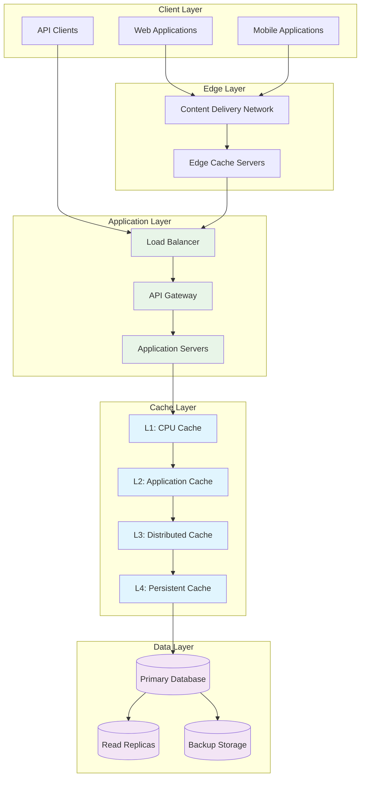

### Core Design Principles

1. **Layered Approach**: Multiple cache levels with decreasing speed and increasing capacity
2. **Data Locality**: Keep frequently accessed data as close to the client as possible
3. **Fault Tolerance**: No single point of failure with automatic failover mechanisms
4. **Scalability**: Horizontal and vertical scaling capabilities at each layer
5. **Consistency**: Configurable consistency models based on use case requirements

*Related Documentation*:
- [Cache Operations API](api.md#cache-operations) - Implementation of these architectural patterns
- [Setup Configuration](setup.md#architecture-setup) - How to deploy this architecture
- [Caching Strategies](caching-strategies.md#architectural-patterns) - Strategy implementations

---

## Architectural Layers

### Layer 1: CPU Cache (Nanosecond Access)

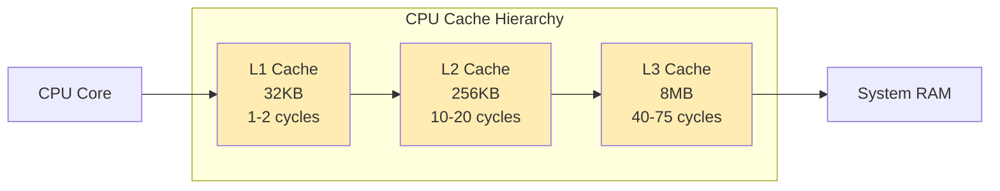

**Characteristics**:
- **Access Time**: 1-100 nanoseconds
- **Capacity**: 32KB - 8MB per core
- **Use Cases**: CPU-intensive computations, hot data paths
- **Management**: Hardware-controlled, transparent to application

### Layer 2: Application Memory Cache (Microsecond Access)

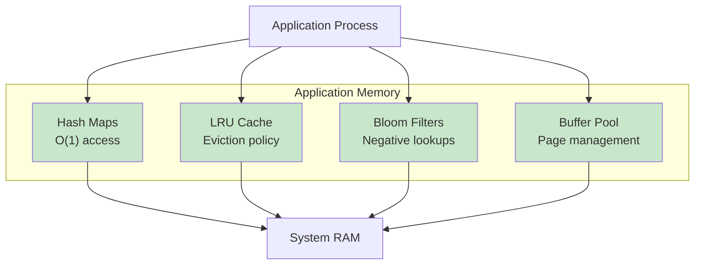

**Characteristics**:
- **Access Time**: 1-100 microseconds
- **Capacity**: Limited by available RAM (typically 1-16GB)
- **Use Cases**: Session data, computed results, configuration
- **Management**: Application-controlled with configurable policies

*Configuration Details*: [Memory Cache Setup](setup.md#memory-cache)

### Layer 3: Distributed Cache (Millisecond Access)

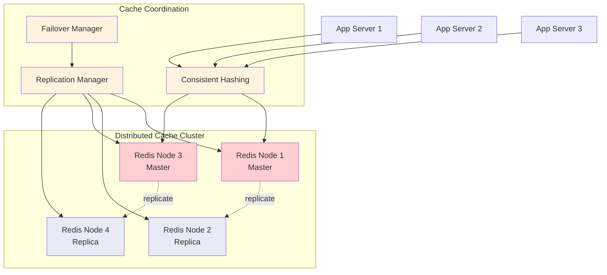

**Characteristics**:
- **Access Time**: 1-10 milliseconds
- **Capacity**: Virtually unlimited (horizontal scaling)
- **Use Cases**: Cross-service data sharing, session clustering
- **Management**: Cluster-aware with automatic partitioning

*Implementation Details*: [Distributed Caching Strategies](caching-strategies.md#distributed-caching)

### Layer 4: Persistent Cache (10+ Millisecond Access)

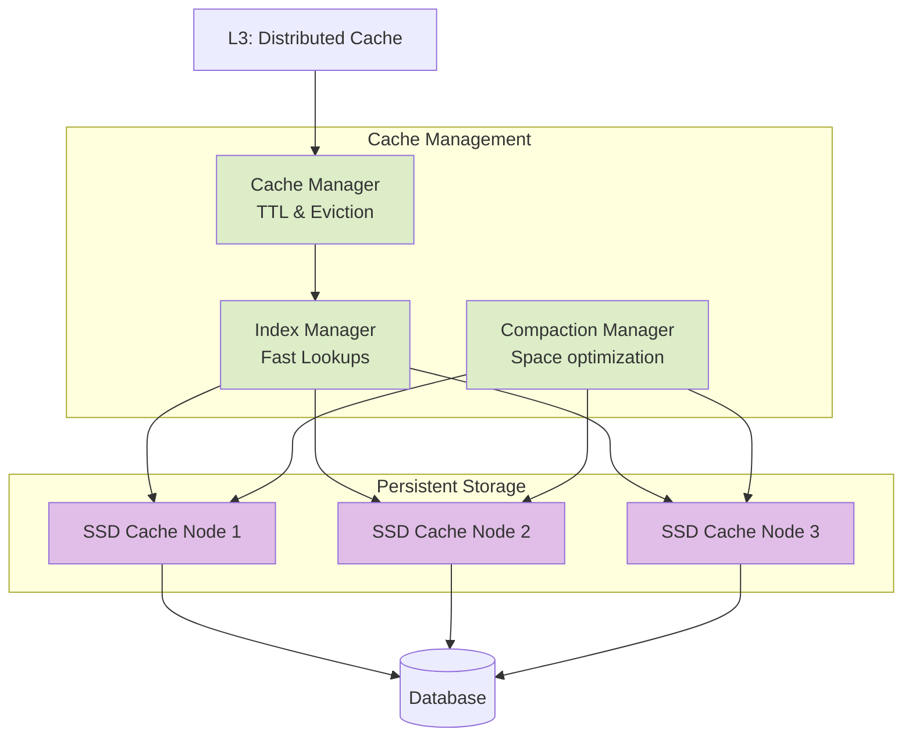

**Characteristics**:
- **Access Time**: 10-100 milliseconds
- **Capacity**: Terabytes per node
- **Use Cases**: Large datasets, backup cache, cold storage
- **Management**: Automatic with configurable retention policies

*Configuration Guide*: [Persistent Cache Setup](setup.md#persistent-cache)

---

## Component Design

### API Gateway

The API Gateway serves as the unified entry point for all cache operations, providing request routing, authentication, rate limiting, and monitoring capabilities.

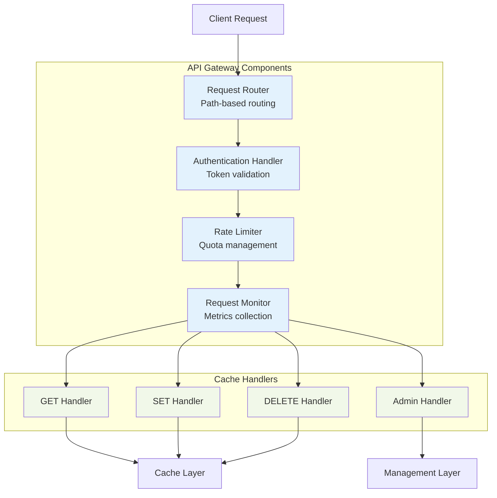

**Key Features**:
- **Request Routing**: Intelligent routing based on cache key patterns
- **Authentication**: Multiple auth methods (API keys, JWT, OAuth)
- **Rate Limiting**: Configurable limits per client/endpoint
- **Monitoring**: Real-time metrics and health checks

*API Reference*: [Gateway Endpoints](api.md#gateway-endpoints)

### Cache Coordination Layer

Manages cache coherence, data consistency, and replication across distributed cache nodes.

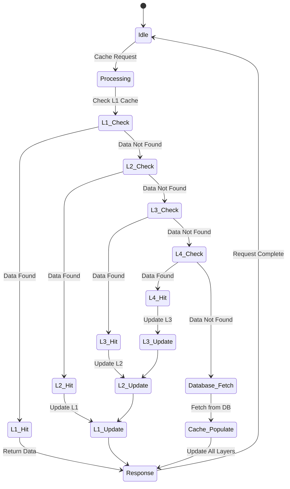

**Coordination Algorithms**:
1. **Cache Coherence**: MESI protocol implementation
2. **Data Consistency**: Configurable consistency levels (eventual, strong)
3. **Conflict Resolution**: Vector clocks and timestamp ordering
4. **Load Balancing**: Consistent hashing with virtual nodes

*Strategy Implementation*: [Coordination Patterns](caching-strategies.md#coordination-patterns)

### Service Mesh Integration

For microservices architectures, the caching system integrates with service mesh infrastructure for enhanced observability and control.

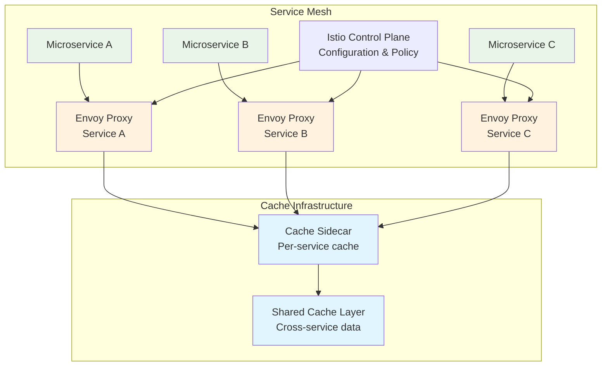

*Service Mesh Configuration*: [Mesh Setup Guide](setup.md#service-mesh-integration)

---

## Data Flow Patterns

### Read Path Optimization

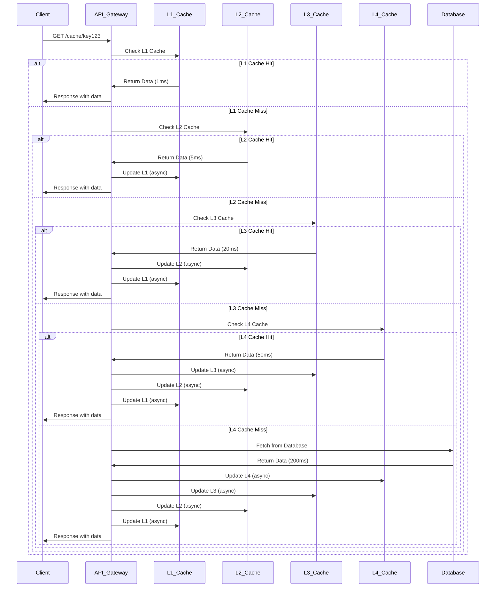

### Write Path Strategies

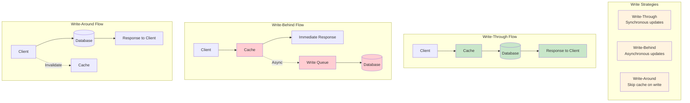

*Strategy Details*: [Write Pattern Implementation](caching-strategies.md#write-patterns)

---

## Scalability Architecture

### Horizontal Scaling Model

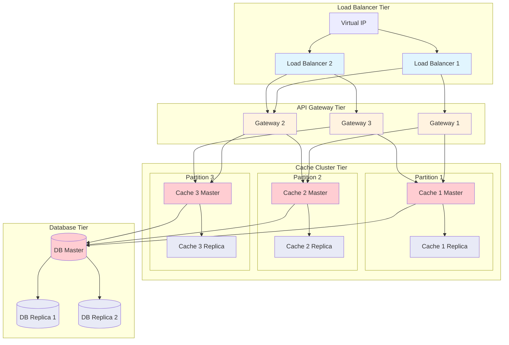
### Auto-Scaling Triggers

| Metric | Scale Out Threshold | Scale In Threshold | Action |
|--------|-------------------|-------------------|---------|
| **CPU Utilization** | > 70% for 5 minutes | < 30% for 15 minutes | Add/Remove Cache Node |
| **Memory Usage** | > 80% for 3 minutes | < 40% for 20 minutes | Add/Remove Cache Node |
| **Request Rate** | > 10K req/sec | < 2K req/sec | Add/Remove Gateway |
| **Cache Hit Ratio** | < 85% for 10 minutes | > 95% for 30 minutes | Rebalance/Optimize |
| **Response Latency** | > 100ms P95 | < 10ms P95 | Scale Out/In |

*Scaling Configuration*: [Auto-Scaling Setup](setup.md#auto-scaling-configuration)

### Geographic Distribution

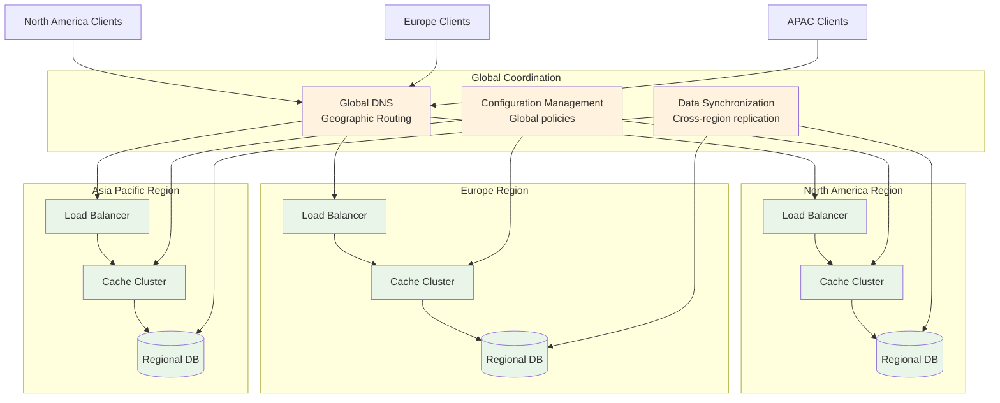

*Geographic Setup*: [Multi-Region Deployment](setup.md#multi-region-setup)

---

## Security Architecture

### Authentication & Authorization Flow

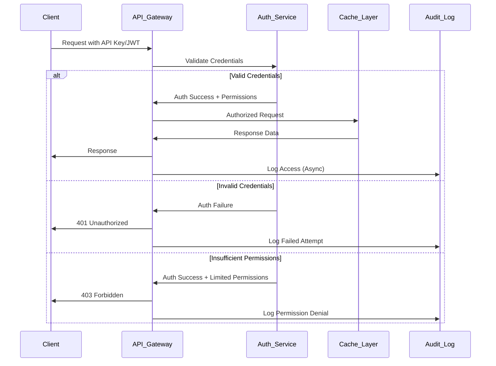

### Data Encryption Strategy

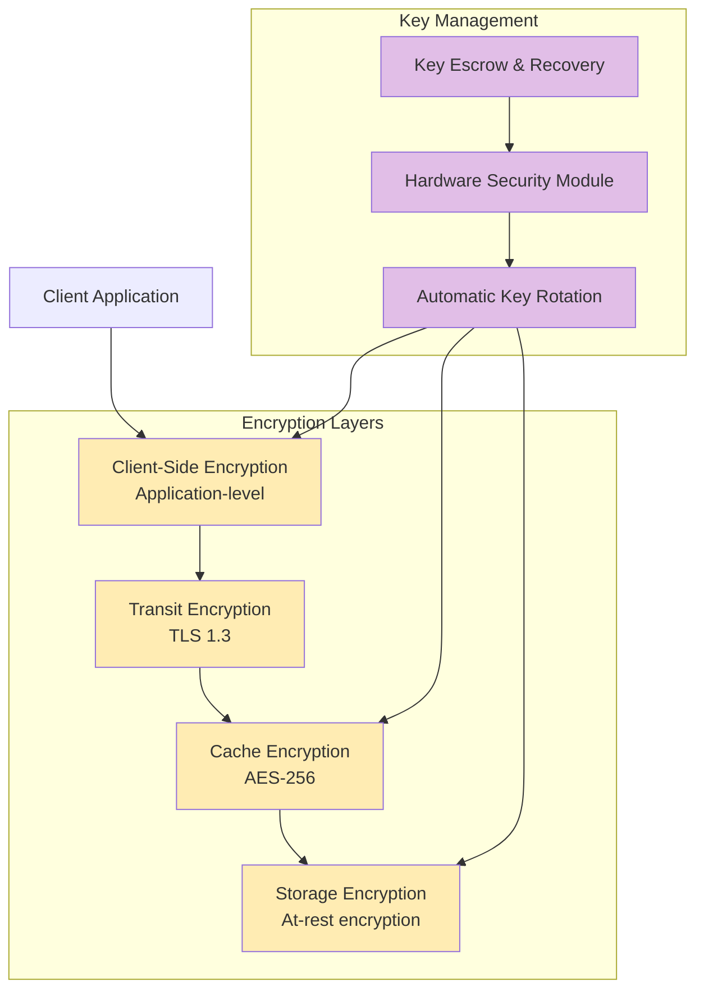

### Network Security Topology

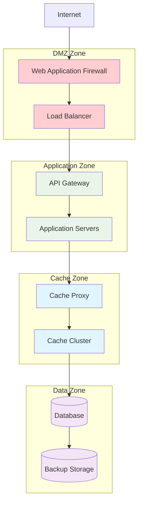

*Security Configuration*: [Security Setup Guide](setup.md#security-configuration)

---

## Performance Optimization

### Performance Metrics Dashboard

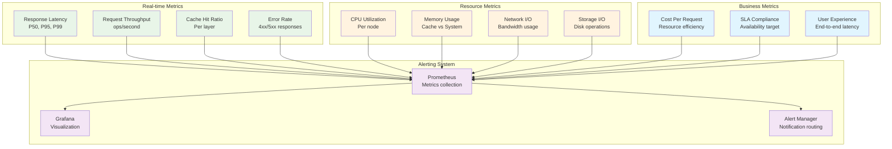

### Performance Optimization Strategies

| Optimization Area | Technique | Expected Improvement | Implementation |
|------------------|-----------|---------------------|----------------|
| **Memory Access** | Data Locality | 2-5x faster access | [Memory Layout Optimization](caching-strategies.md#memory-optimization) |
| **Network I/O** | Connection Pooling | 30-50% less latency | [Connection Management](setup.md#connection-pooling) |
| **Serialization** | Binary Protocols | 60-80% less overhead | [Protocol Configuration](api.md#serialization-formats) |
| **Cache Warming** | Preload Strategy | 90%+ hit ratio | [Warming Strategies](caching-strategies.md#cache-warming) |
| **Compression** | LZ4/Snappy | 70% storage reduction | [Compression Setup](setup.md#compression-configuration) |

---

## Reliability Patterns

### Circuit Breaker Pattern

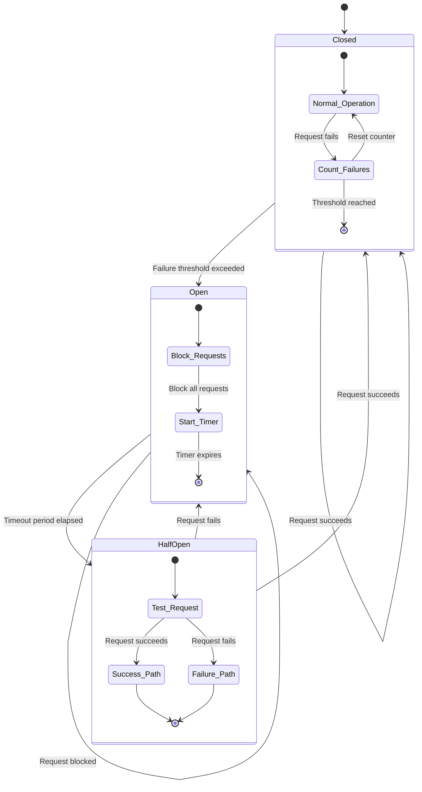

### Disaster Recovery Architecture

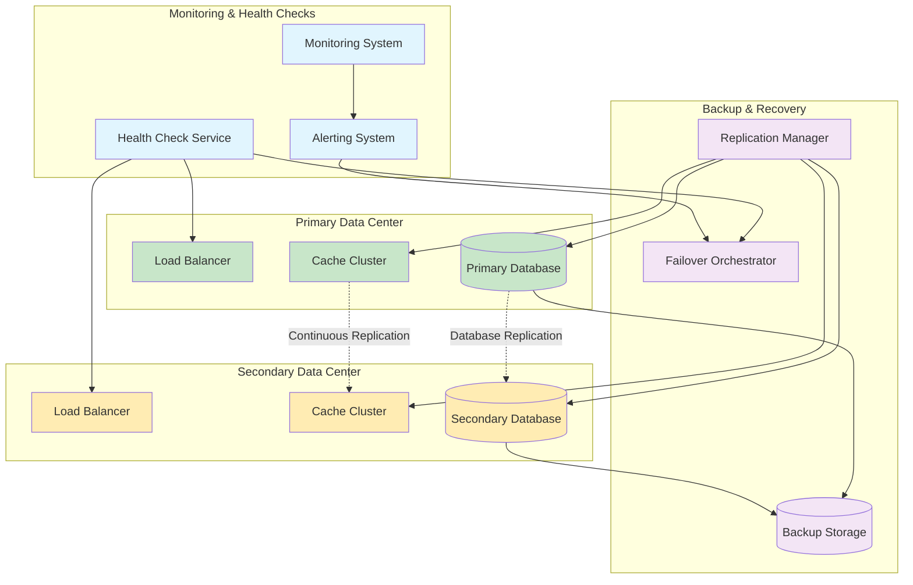

### Data Consistency Models

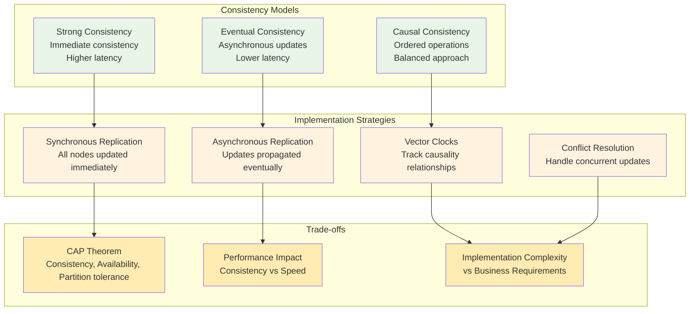

### Infrastructure Requirements

| Component | Minimum Specs | Recommended Specs | Scalability Notes |
|-----------|---------------|------------------|------------------|
| **API Gateway** | 2 CPU, 4GB RAM | 8 CPU, 16GB RAM | Horizontal scaling preferred |
| **Cache Nodes** | 4 CPU, 16GB RAM | 16 CPU, 64GB RAM | Memory-intensive, scale vertically first |
| **Load Balancer** | 2 CPU, 4GB RAM | 4 CPU, 8GB RAM | High availability required |
| **Database** | 8 CPU, 32GB RAM | 32 CPU, 128GB RAM | Storage scaling critical |
| **Monitoring** | 2 CPU, 8GB RAM | 4 CPU, 16GB RAM | Persistent storage needed |

*Infrastructure Setup*: [Hardware Requirements](setup.md#infrastructure-requirements)

---

## Related Documentation

This architecture document connects to:

- **[API Implementation](api.md)**: How these architectural components expose functionality through REST APIs
- **[Setup & Configuration](setup.md)**: Step-by-step deployment of this architecture
- **[Caching Strategies](caching-strategies.md)**: Algorithm implementations for cache management within this architecture
- **[Main Documentation](../README.md)**: Overview and navigation guide

## Next Steps

1. **For Implementation**: Proceed to [Setup Guide](setup.md#getting-started) to deploy this architecture
2. **For Integration**: Review [API Documentation](api.md#integration-guide) for client integration
3. **For Optimization**: Study [Caching Strategies](caching-strategies.md#performance-patterns) for advanced patterns
4. **For Operations**: Configure [Monitoring](setup.md#monitoring-setup) and [Alerting](setup.md#alerting-configuration)

---

*This architecture documentation provides the foundation for building a scalable, reliable, and high-performance caching system. All diagrams are rendered using Mermaid and maintain consistency across the documentation suite.*
