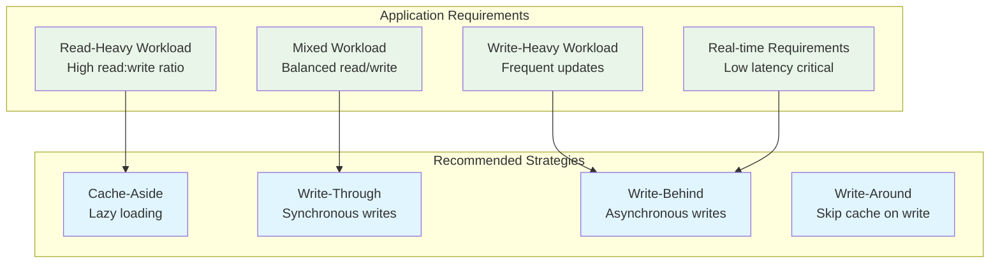
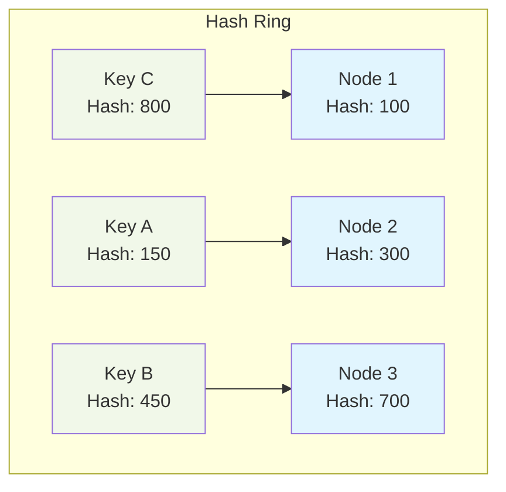
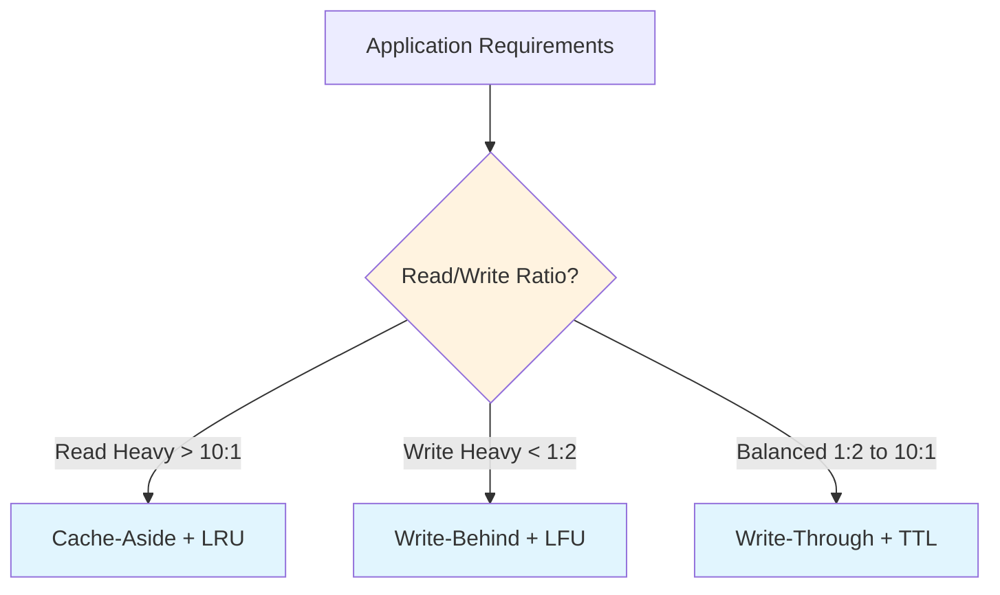

# Caching Strategies & Implementation Patterns

## Table of Contents
1. [Strategy Overview](#strategy-overview)
2. [Cache Access Patterns](#cache-access-patterns)
3. [Write Patterns](#write-patterns)
4. [Eviction Policies](#eviction-policies)
5. [Distributed Caching](#distributed-caching)
6. [Performance Optimization](#performance-optimization)
7. [Implementation Examples](#implementation-examples)
8. [Strategy Selection Guide](#strategy-selection-guide)

---

## Strategy Overview

Caching strategies define how data flows between cache layers and the primary data source. The choice of strategy significantly impacts performance, consistency, and system complexity.

### Strategy Decision Matrix



---

## Cache Access Patterns

### Cache-Aside Pattern

```javascript
class CacheAsidePattern {
    constructor(cache, database) {
        this.cache = cache;
        this.db = database;
    }
    
    async get(key) {
        // Try cache first
        let value = await this.cache.get(key);
        if (value) return value;
        
        // Cache miss - load from database
        value = await this.db.get(key);
        if (value) {
            await this.cache.set(key, value, 3600); // 1 hour TTL
        }
        return value;
    }
    
    async update(key, data) {
        await this.db.update(key, data);
        await this.cache.delete(key); // Invalidate cache
    }
}
```

**Use Cases:** User sessions, product catalogs, read-heavy applications

---

## Write Patterns

### Write-Through Cache

```javascript
class WriteThroughCache {
    async set(key, value) {
        // Write to database first
        await this.db.set(key, value);
        // Then update cache
        await this.cache.set(key, value);
    }
}
```

### Write-Behind Cache

```javascript
class WriteBehindCache {
    constructor(cache, database, batchSize = 100) {
        this.cache = cache;
        this.db = database;
        this.writeQueue = [];
        this.batchSize = batchSize;
        
        // Process queue periodically
        setInterval(() => this.flushQueue(), 5000);
    }
    
    async set(key, value) {
        await this.cache.set(key, value);
        this.writeQueue.push({ key, value });
        return true; // Immediate acknowledgment
    }
    
    async flushQueue() {
        if (this.writeQueue.length === 0) return;
        
        const batch = this.writeQueue.splice(0, this.batchSize);
        try {
            await this.db.bulkWrite(batch);
        } catch (error) {
            this.writeQueue.unshift(...batch); // Re-queue on failure
        }
    }
}
```

---

## Eviction Policies

### Policy Comparison

| Policy | Best For | Implementation Complexity | Memory Overhead |
|--------|----------|-------------------------|-----------------|
| **LRU** | Temporal locality | Medium | Medium |
| **LFU** | Frequency patterns | High | High |
| **TTL** | Time-sensitive data | Low | Low |
| **Random** | Uniform access | Very Low | Very Low |

### Simple LRU Implementation

```javascript
class LRUCache {
    constructor(maxSize) {
        this.maxSize = maxSize;
        this.cache = new Map();
    }
    
    get(key) {
        if (this.cache.has(key)) {
            // Move to end (most recent)
            const value = this.cache.get(key);
            this.cache.delete(key);
            this.cache.set(key, value);
            return value;
        }
        return null;
    }
    
    set(key, value) {
        if (this.cache.has(key)) {
            this.cache.delete(key);
        } else if (this.cache.size >= this.maxSize) {
            // Remove least recently used (first item)
            const firstKey = this.cache.keys().next().value;
            this.cache.delete(firstKey);
        }
        this.cache.set(key, value);
    }
}
```

---

## Distributed Caching

### Consistent Hashing



### Basic Consistent Hash Ring

```javascript
class ConsistentHashRing {
    constructor(nodes) {
        this.ring = new Map();
        this.sortedHashes = [];
        
        nodes.forEach(node => this.addNode(node));
    }
    
    hash(key) {
        // Simple hash function (use crypto.createHash in production)
        let hash = 0;
        for (let i = 0; i < key.length; i++) {
            hash = ((hash << 5) - hash + key.charCodeAt(i)) & 0xffffffff;
        }
        return Math.abs(hash);
    }
    
    addNode(node) {
        const hash = this.hash(node);
        this.ring.set(hash, node);
        this.sortedHashes.push(hash);
        this.sortedHashes.sort((a, b) => a - b);
    }
    
    getNode(key) {
        if (this.ring.size === 0) return null;
        
        const hash = this.hash(key);
        
        // Find first node with hash >= key hash
        for (const nodeHash of this.sortedHashes) {
            if (nodeHash >= hash) {
                return this.ring.get(nodeHash);
            }
        }
        
        // Wrap around to first node
        return this.ring.get(this.sortedHashes[0]);
    }
}
```

---

## Performance Optimization

### Cache Warming

```javascript
class CacheWarmer {
    constructor(cache, dataSource) {
        this.cache = cache;
        this.dataSource = dataSource;
    }
    
    async warmCache(keys, batchSize = 50) {
        console.log(`Warming cache with ${keys.length} keys`);
        
        for (let i = 0; i < keys.length; i += batchSize) {
            const batch = keys.slice(i, i + batchSize);
            await this.warmBatch(batch);
        }
    }
    
    async warmBatch(keys) {
        const promises = keys.map(async key => {
            try {
                const data = await this.dataSource.get(key);
                if (data) await this.cache.set(key, data, 3600);
            } catch (error) {
                console.warn(`Failed to warm key ${key}: ${error.message}`);
            }
        });
        
        await Promise.all(promises);
    }
    
    async predictiveWarm(userId) {
        // Predict likely keys based on user patterns
        const predictedKeys = [
            `user:${userId}`,
            `preferences:${userId}`,
            `recent_activity:${userId}`
        ];
        
        return this.warmCache(predictedKeys);
    }
}
```

### Performance Monitoring

```javascript
class CacheMonitor {
    constructor() {
        this.stats = {
            hits: 0,
            misses: 0,
            sets: 0,
            errors: 0
        };
    }
    
    recordHit() { this.stats.hits++; }
    recordMiss() { this.stats.misses++; }
    recordSet() { this.stats.sets++; }
    recordError() { this.stats.errors++; }
    
    getMetrics() {
        const total = this.stats.hits + this.stats.misses;
        const hitRate = total > 0 ? (this.stats.hits / total * 100).toFixed(2) : 0;
        
        return {
            ...this.stats,
            hitRate: `${hitRate}%`,
            totalRequests: total
        };
    }
    
    reset() {
        this.stats = { hits: 0, misses: 0, sets: 0, errors: 0 };
    }
}
```

---

## Implementation Examples

### Complete Cache Service

```javascript
class CacheService {
    constructor(config = {}) {
        this.cache = this.createCache(config.type || 'lru', config);
        this.monitor = new CacheMonitor();
        this.strategy = this.createStrategy(config.strategy || 'cache-aside');
    }
    
    createCache(type, config) {
        switch (type) {
            case 'lru': return new LRUCache(config.maxSize || 1000);
            case 'ttl': return new TTLCache(config.maxSize || 1000, config.ttl || 3600);
            default: throw new Error(`Unknown cache type: ${type}`);
        }
    }
    
    createStrategy(strategyType) {
        switch (strategyType) {
            case 'cache-aside': return new CacheAsidePattern(this.cache, this.db);
            case 'write-through': return new WriteThroughCache(this.cache, this.db);
            default: throw new Error(`Unknown strategy: ${strategyType}`);
        }
    }
    
    async get(key) {
        try {
            const value = await this.strategy.get(key);
            if (value) {
                this.monitor.recordHit();
            } else {
                this.monitor.recordMiss();
            }
            return value;
        } catch (error) {
            this.monitor.recordError();
            throw error;
        }
    }
    
    async set(key, value) {
        try {
            await this.strategy.set(key, value);
            this.monitor.recordSet();
        } catch (error) {
            this.monitor.recordError();
            throw error;
        }
    }
    
    getStats() {
        return {
            cache: this.cache.getStats?.() || {},
            performance: this.monitor.getMetrics()
        };
    }
}
```

### Usage Examples

```javascript
// E-commerce product cache
const productCache = new CacheService({
    type: 'lru',
    maxSize: 10000,
    strategy: 'cache-aside'
});

// Session cache with TTL
const sessionCache = new CacheService({
    type: 'ttl',
    maxSize: 50000,
    ttl: 1800, // 30 minutes
    strategy: 'write-through'
});

// High-throughput analytics cache
const analyticsCache = new CacheService({
    type: 'lfu',
    maxSize: 25000,
    strategy: 'write-behind'
});
```

---

## Strategy Selection Guide

### Decision Framework



### Configuration Matrix

| Use Case | Strategy | Eviction | TTL | Best Fit |
|----------|----------|----------|-----|----------|
| **User Sessions** | Cache-Aside | TTL | 30min | High read, natural expiry |
| **Product Catalog** | Cache-Aside | LRU | 2h | Frequent reads, size limits |
| **Real-time Analytics** | Write-Behind | LFU | 5min | High writes, popular data |
| **Financial Transactions** | Write-Through | TTL | 1h | Consistency critical |
| **Content Delivery** | Cache-Aside | LRU | 24h | Global distribution |

### Quick Start Examples

```javascript
// User session cache
const userCache = new CacheService({
    type: 'ttl',
    maxSize: 100000,
    ttl: 1800,
    strategy: 'cache-aside'
});

// Product catalog cache
const productCache = new CacheService({
    type: 'lru',
    maxSize: 50000,
    strategy: 'cache-aside'
});

// Analytics cache
const analyticsCache = new CacheService({
    type: 'lfu',
    maxSize: 25000,
    strategy: 'write-behind'
});
```

---

## Best Practices

### 1. Cache Key Design
- Use consistent naming patterns: `user:123`, `product:abc`
- Include version in keys when schema changes
- Keep keys short but descriptive

### 2. TTL Strategy
- Set appropriate TTL based on data freshness requirements
- Use longer TTL for stable data, shorter for dynamic data
- Consider business hours for cache warming schedules

### 3. Error Handling
- Always handle cache failures gracefully
- Implement circuit breakers for external cache services
- Log cache performance metrics for monitoring

### 4. Testing
- Test cache hit/miss scenarios
- Validate cache invalidation logic
- Performance test under expected load

---

## Related Documentation

This caching strategies guide connects to:

- **[System Architecture](architecture.md)**: Overall system design patterns
- **[API Documentation](api.md)**: Cache management endpoints  
- **[Setup Guide](setup.md)**: Implementation and deployment
- **[Main Documentation](../README.md)**: Complete system overview

---

*This guide provides practical caching implementations with clear examples and decision frameworks for selecting the right strategy for your specific use case.*