# System Design Case Studies

> **Part of**: [System Design Guide](../README.md) | **Related**: [Scaling Strategies](../scaling/), [Database Design](../databases/), [Microservices](../microservices/)

This collection contains comprehensive system design case studies of major tech platforms, analyzing their architecture, scaling challenges, and design decisions.

## 📋 Case Studies Overview

| Company | Domain | Key Challenges | Scale |
|---------|--------|---------------|-------|
| [Netflix](#netflix) | Video Streaming | Content delivery, recommendation systems | 230M+ users globally |
| [YouTube](#youtube) | Video Platform | Video processing, storage, global CDN | 2B+ monthly users |
| [Uber](#uber) | Ride Sharing | Real-time matching, geospatial data | 100M+ monthly users |
| [Airbnb](#airbnb) | Marketplace | Search, booking systems, payments | 4M+ hosts, 1B+ guest arrivals |
| [Twitter](#twitter) | Social Media | Timeline generation, real-time updates | 450M+ monthly users |
| [WhatsApp](#whatsapp) | Messaging | Real-time messaging, end-to-end encryption | 2B+ users |
| [Google Meet](#google-meet) | Video Conferencing | Real-time communication, scalability | Integrated with Google Workspace |
| [Amazon](#amazon) | E-commerce | Product catalog, order processing, logistics | 300M+ active customers |

## 🎯 Learning Objectives

Each case study explores:

- **System Architecture**: High-level system design and component interactions
- **Data Models**: Database schemas and data storage strategies  
- **Scaling Challenges**: How systems handle growth and traffic spikes
- **Technology Stack**: Key technologies and infrastructure choices
- **Trade-offs**: Design decisions and their implications
- **Performance Optimizations**: Caching, CDNs, and optimization techniques
- **Reliability & Availability**: Fault tolerance and disaster recovery
- **Security**: Authentication, authorization, and data protection

## 🚀 Featured Case Studies

### [Netflix](netflix.md)
**Domain**: Video Streaming Platform
**Key Focus**: Content delivery networks, microservices architecture, recommendation algorithms

```mermaid
graph LR
    User[👤 User] --> CDN[🌐 CDN]
    CDN --> API[⚡ API Gateway]
    API --> Microservices[🔧 Microservices]
    Microservices --> Database[(🗄️ Databases)]
```



**What You'll Learn**:
- Global content distribution strategies
- Microservices decomposition patterns
- A/B testing at scale
- Chaos engineering practices

---

### [YouTube](youtube.md)
**Domain**: Video Sharing & Streaming
**Key Focus**: Video processing pipelines, massive storage, global content delivery

**What You'll Learn**:
- Video encoding and transcoding systems
- Distributed storage for petabyte-scale data
- Content recommendation algorithms
- Live streaming architecture

---

### [Uber](uber.md)
**Domain**: Ride-Sharing & Logistics
**Key Focus**: Real-time geospatial processing, matching algorithms, surge pricing

**What You'll Learn**:
- Geospatial data structures and algorithms
- Real-time matching systems
- Dynamic pricing models
- Supply-demand optimization

---

### [Airbnb](airbnb.md)
**Domain**: Online Marketplace
**Key Focus**: Search systems, booking workflows, payment processing

**What You'll Learn**:
- Search and discovery systems
- Two-sided marketplace design
- Trust and safety systems
- Global payment processing

---

### [Twitter](twitter.md)
**Domain**: Social Media Platform
**Key Focus**: Timeline generation, real-time updates, content distribution

**What You'll Learn**:
- Timeline generation algorithms (push vs pull)
- Real-time event processing
- Content ranking and filtering
- Handling viral content spikes

---

### [WhatsApp](whatsapp.md)
**Domain**: Instant Messaging
**Key Focus**: Real-time messaging, end-to-end encryption, massive concurrency

**What You'll Learn**:
- Real-time messaging protocols
- End-to-end encryption implementation
- Connection management at scale
- Message delivery guarantees

---

### [Google Meet](google-meet.md)
**Domain**: Video Conferencing
**Key Focus**: Real-time video/audio streaming, WebRTC, global infrastructure

**What You'll Learn**:
- WebRTC architecture and protocols
- Real-time media processing
- Quality adaptation algorithms
- Global network optimization

---

### [Amazon](amazon.md)
**Domain**: E-commerce Platform
**Key Focus**: Product catalog, order processing, inventory management, logistics

**What You'll Learn**:
- Large-scale catalog search systems
- Order processing workflows
- Inventory management at scale
- Logistics and fulfillment systems

## 🏗️ Architecture Patterns Covered

### Scalability Patterns
- **Horizontal Scaling**: Distributing load across multiple servers
- **Vertical Scaling**: Upgrading hardware resources
- **Database Sharding**: Partitioning data across multiple databases
- **Caching Strategies**: Redis, Memcached, CDN caching
- **Load Balancing**: Traffic distribution techniques

### Reliability Patterns
- **Circuit Breaker**: Preventing cascade failures
- **Bulkhead**: Isolating critical resources
- **Retry with Backoff**: Handling transient failures
- **Health Checks**: Monitoring system health
- **Graceful Degradation**: Maintaining core functionality

### Data Patterns
- **CQRS**: Command Query Responsibility Segregation
- **Event Sourcing**: Storing state changes as events
- **Saga Pattern**: Managing distributed transactions
- **Data Lake**: Centralized repository for big data
- **Lambda Architecture**: Batch and stream processing

## 🛠️ Technology Stacks

### Common Technologies Across Platforms

**Programming Languages**:
- Java, Python, Go, JavaScript/Node.js, C++, Scala

**Databases**:
- MySQL, PostgreSQL, MongoDB, Cassandra, Redis, Elasticsearch

**Message Queues**:
- Apache Kafka, RabbitMQ, Amazon SQS, Google Pub/Sub

**Caching**:
- Redis, Memcached, CDN (CloudFlare, AWS CloudFront)

**Infrastructure**:
- AWS, Google Cloud, Kubernetes, Docker, Microservices

**Monitoring**:
- Prometheus, Grafana, ELK Stack, Jaeger, New Relic

## 📚 How to Use These Case Studies

### For System Design Interviews
1. **Start with Requirements**: Understand functional and non-functional requirements
2. **High-Level Design**: Create system architecture diagrams
3. **Deep Dive**: Focus on critical components and bottlenecks
4. **Scale Estimation**: Calculate traffic, storage, and bandwidth needs
5. **Trade-offs Discussion**: Explain design decisions and alternatives

### For Learning System Design
1. **Read Prerequisites**: Review [Scaling Strategies](../scaling/) and [Database Design](../databases/)
2. **Follow Along**: Implement simplified versions of key components
3. **Compare Approaches**: Analyze different solutions to similar problems
4. **Practice**: Use the patterns in your own projects

### For Architecture Planning
1. **Pattern Recognition**: Identify applicable patterns for your use case
2. **Technology Selection**: Learn from proven technology choices
3. **Scaling Preparation**: Understand common scaling bottlenecks
4. **Monitoring Setup**: Implement observability from day one

## 🎯 Interview Preparation Checklist

For each case study, ensure you can:

- [ ] **Explain the business requirements** and constraints
- [ ] **Draw the high-level architecture** from memory
- [ ] **Identify bottlenecks** and scaling challenges
- [ ] **Propose solutions** for identified bottlenecks
- [ ] **Estimate scale** (users, data, bandwidth, storage)
- [ ] **Discuss trade-offs** between different approaches
- [ ] **Design data models** for key entities
- [ ] **Explain API designs** for critical operations
- [ ] **Address reliability** and fault tolerance
- [ ] **Consider monitoring** and observability

## 🔗 Related Resources

### Internal Documentation
- [Database Case Studies](../databases/docs/case-studies/) - Deep dive into database choices
- [Scaling Strategies](../scaling/) - Horizontal and vertical scaling techniques
- [Microservices Architecture](../microservices/) - Service decomposition patterns
- [Caching Strategies](../caching/) - Performance optimization techniques
- [Load Balancing](../load-balancing/) - Traffic distribution methods

### External Resources
- [High Scalability Blog](http://highscalability.com/) - Real-world architecture case studies
- [AWS Architecture Center](https://aws.amazon.com/architecture/) - Cloud architecture patterns
- [Google Cloud Architecture Framework](https://cloud.google.com/architecture/framework) - Best practices
- [Martin Fowler's Architecture](https://martinfowler.com/architecture/) - Software architecture principles
- [System Design Primer](https://github.com/donnemartin/system-design-primer) - Comprehensive guide

---

## 🤝 Contributing

To add a new case study:

1. Create a new markdown file following the naming convention: `company-name.md`
2. Use the [case study template](TEMPLATE.md) for consistent structure
3. Include architecture diagrams using Mermaid syntax
4. Add code examples where relevant
5. Update this README with the new case study
6. Submit a pull request with your changes

## 📝 Case Study Template Structure

Each case study follows this structure:

```markdown
# Company Name System Design

## Overview
- Business model and core functionality
- Scale and user base
- Key challenges

## Requirements
- Functional requirements
- Non-functional requirements
- Scale estimates

## High-Level Architecture
- System architecture diagram
- Core components
- Data flow

## Deep Dives
- Critical system components
- Database design
- API design
- Algorithms and data structures

## Scaling Journey
- Evolution over time
- Bottlenecks and solutions
- Technology migrations

## Lessons Learned
- Key design decisions
- Trade-offs made
- Best practices
```

---

**Last Updated**: September 2025 | **Maintained by**: System Design Study Group