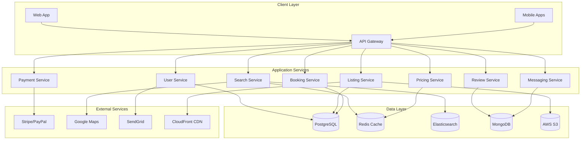
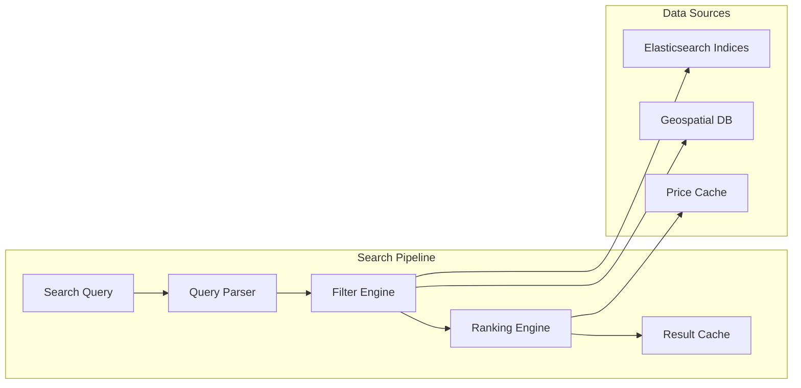
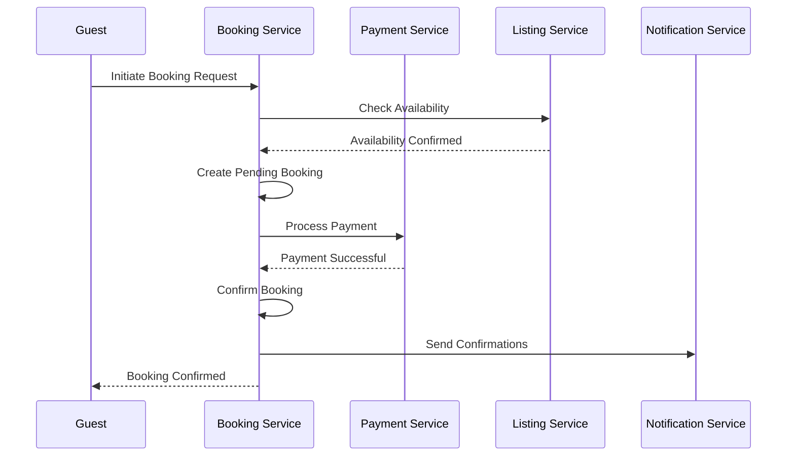
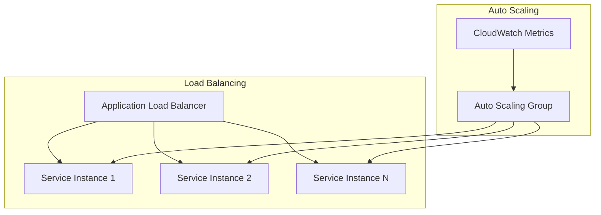
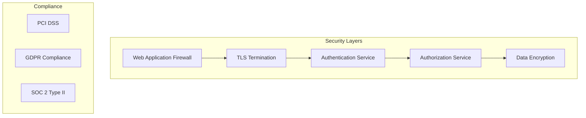

# Airbnb System Architecture

## Overview

Airbnb is a global platform that connects hosts offering accommodations with guests seeking places to stay. The system handles millions of users, properties, bookings, and payments across 220+ countries and regions.

## System Requirements

### Functional Requirements
- User registration and authentication (hosts and guests)
- Property listing management
- Search and discovery with filters
- Booking management and reservations
- Payment processing
- Review and rating system
- Messaging between hosts and guests
- Dynamic pricing recommendations

### Non-Functional Requirements
- **Scale**: 150M+ users, 6M+ active listings
- **Availability**: 99.9% uptime
- **Consistency**: Strong consistency for bookings, eventual consistency for search
- **Performance**: Search results < 200ms, booking confirmation < 1s
- **Security**: PCI DSS compliance, data encryption

## High-Level Architecture



## Core Services Deep Dive

### 1. Search Service Architecture

The search service is critical for property discovery and handles complex queries with multiple filters.



**Search Optimization Strategies:**
- Elasticsearch with custom analyzers for location and amenity matching
- Geospatial indexing for location-based queries
- Result caching with Redis (TTL: 5-15 minutes)
- Personalization based on user history and preferences

### 2. Booking Service Architecture

Handles the critical booking flow with strong consistency requirements.



**Key Implementation Details:**
- Distributed locking for inventory management
- Saga pattern for booking transactions
- Optimistic concurrency control
- Circuit breaker pattern for external payment APIs

### 3. Dynamic Pricing Service

Airbnb uses machine learning for dynamic pricing recommendations.

```javascript
// Simplified pricing calculation example
class PricingEngine {
    calculatePrice(listing, dates, market_data) {
        const basePrice = listing.base_price;
        
        // Demand multiplier based on market data
        const demandMultiplier = this.calculateDemand(dates, market_data);
        
        // Seasonal adjustments
        const seasonalMultiplier = this.getSeasonalMultiplier(dates, listing.location);
        
        // Competition analysis
        const competitiveMultiplier = this.analyzeCompetition(listing);
        
        // Event-based pricing (conferences, festivals, etc.)
        const eventMultiplier = this.getEventMultiplier(dates, listing.location);
        
        return Math.round(basePrice * demandMultiplier * seasonalMultiplier * 
                         competitiveMultiplier * eventMultiplier);
    }
    
    calculateDemand(dates, market_data) {
        // Simplified demand calculation
        return Math.min(2.0, Math.max(0.5, market_data.occupancy_rate / 0.7));
    }
}
```

## Database Design

### Listing Schema (PostgreSQL)
```sql
-- Core listing table
listings (
    id BIGINT PRIMARY KEY,
    host_id BIGINT REFERENCES users(id),
    title VARCHAR(255),
    description TEXT,
    property_type VARCHAR(50),
    room_type VARCHAR(50),
    accommodates INTEGER,
    bedrooms INTEGER,
    bathrooms DECIMAL,
    price DECIMAL(10,2),
    latitude DECIMAL(10,8),
    longitude DECIMAL(11,8),
    amenities JSONB,
    availability_calendar JSONB,
    created_at TIMESTAMP,
    updated_at TIMESTAMP
);

-- Indexing strategy
CREATE INDEX idx_listings_location ON listings USING GIST (
    ll_to_earth(latitude, longitude)
);
CREATE INDEX idx_listings_filters ON listings (
    property_type, room_type, accommodates, price
);
```

### Booking Schema
```sql
bookings (
    id BIGINT PRIMARY KEY,
    listing_id BIGINT REFERENCES listings(id),
    guest_id BIGINT REFERENCES users(id),
    check_in DATE,
    check_out DATE,
    guests INTEGER,
    total_amount DECIMAL(10,2),
    status booking_status_enum,
    created_at TIMESTAMP,
    updated_at TIMESTAMP
);
```

## Scalability Strategies

### 1. Database Scaling
- **Read Replicas**: Search queries routed to read replicas
- **Sharding**: Listings sharded by geographic region
- **Connection Pooling**: PgBouncer for connection management
- **Caching**: Redis for frequently accessed data

### 2. Service Scaling


### 3. Caching Strategy
- **L1 Cache**: Application-level caching (in-memory)
- **L2 Cache**: Redis cluster for shared cache
- **CDN**: CloudFront for static assets and images
- **Database Query Cache**: PostgreSQL query result caching

## Reliability & Resilience

### Circuit Breaker Implementation
```javascript
class CircuitBreaker {
    constructor(threshold = 5, timeout = 60000) {
        this.failureThreshold = threshold;
        this.timeout = timeout;
        this.failureCount = 0;
        this.state = 'CLOSED'; // CLOSED, OPEN, HALF_OPEN
        this.lastFailureTime = null;
    }
    
    async execute(operation) {
        if (this.state === 'OPEN') {
            if (Date.now() - this.lastFailureTime > this.timeout) {
                this.state = 'HALF_OPEN';
            } else {
                throw new Error('Circuit breaker is OPEN');
            }
        }
        
        try {
            const result = await operation();
            this.onSuccess();
            return result;
        } catch (error) {
            this.onFailure();
            throw error;
        }
    }
    
    onSuccess() {
        this.failureCount = 0;
        this.state = 'CLOSED';
    }
    
    onFailure() {
        this.failureCount++;
        this.lastFailureTime = Date.now();
        if (this.failureCount >= this.failureThreshold) {
            this.state = 'OPEN';
        }
    }
}
```

### Disaster Recovery
- **Multi-AZ Deployment**: Services deployed across multiple availability zones
- **Database Backups**: Automated daily backups with point-in-time recovery
- **Cross-Region Replication**: Critical data replicated to secondary regions
- **Canary Deployments**: Gradual rollouts to minimize blast radius

## Security Architecture



## Monitoring & Observability

### Key Metrics
- **Business Metrics**: Booking conversion rate, search success rate
- **Technical Metrics**: API latency, error rates, throughput
- **Infrastructure Metrics**: CPU, memory, disk usage

### Logging Strategy
```javascript
// Structured logging example
const logger = {
    info: (message, context) => {
        console.log(JSON.stringify({
            timestamp: new Date().toISOString(),
            level: 'INFO',
            message,
            context,
            trace_id: context.trace_id,
            service: 'booking-service'
        }));
    }
};
```

## Related Case Studies
- See [Uber](uber.md) for location-based services architecture
- See [Netflix](netflix.md) for recommendation system patterns
- See [Amazon](amazon.md) for e-commerce payment processing
- See [YouTube](youtube.md) for media storage and CDN strategies

## Trade-offs & Lessons Learned

### Key Trade-offs
1. **Consistency vs Availability**: Booking service prioritizes consistency, search allows eventual consistency
2. **Cost vs Performance**: Expensive real-time pricing vs cached recommendations
3. **Complexity vs Maintainability**: Microservices provide scalability but increase operational complexity

### Lessons Learned
- Start with a monolith, extract services as you scale
- Invest heavily in monitoring and observability early
- Cache aggressively but invalidate intelligently
- Design for failure from day one
- Balance between over-engineering and technical debt

## Conclusion

Airbnb's architecture demonstrates how to build a global-scale marketplace platform. The key principles include service-oriented architecture, aggressive caching, strong consistency where needed, and designing for failure. The system continues to evolve as the platform scales to serve hundreds of millions of users worldwide.