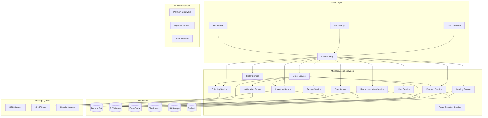
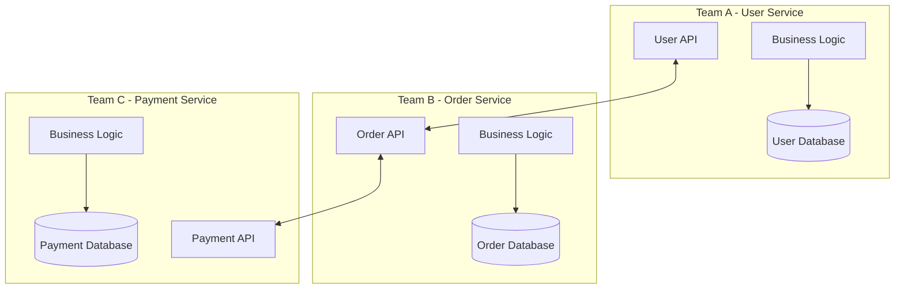
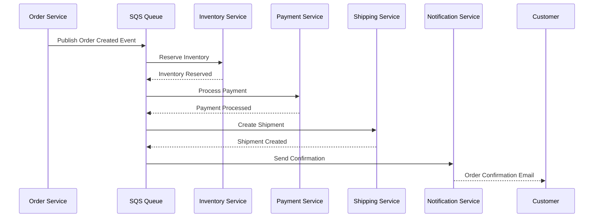
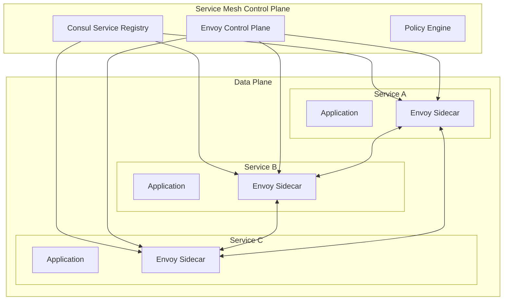
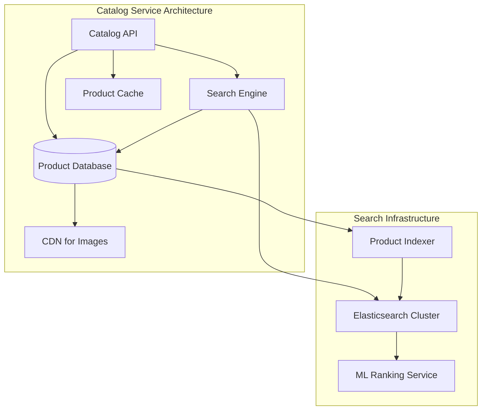
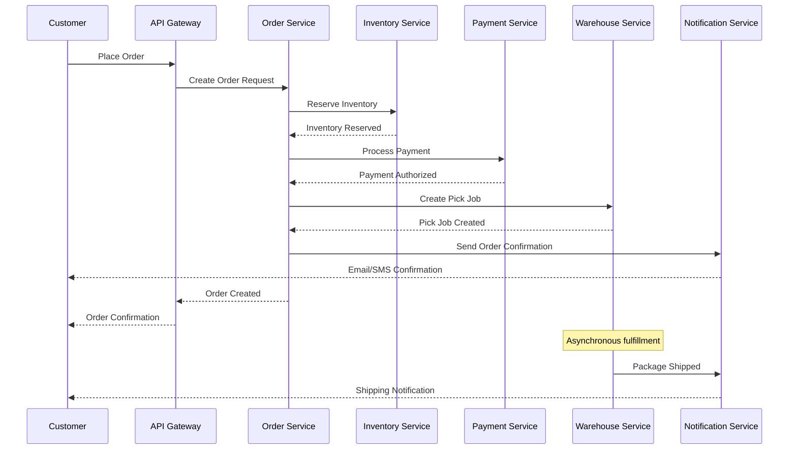
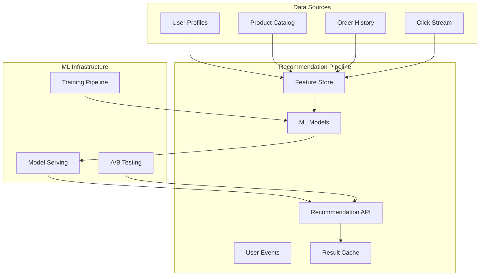
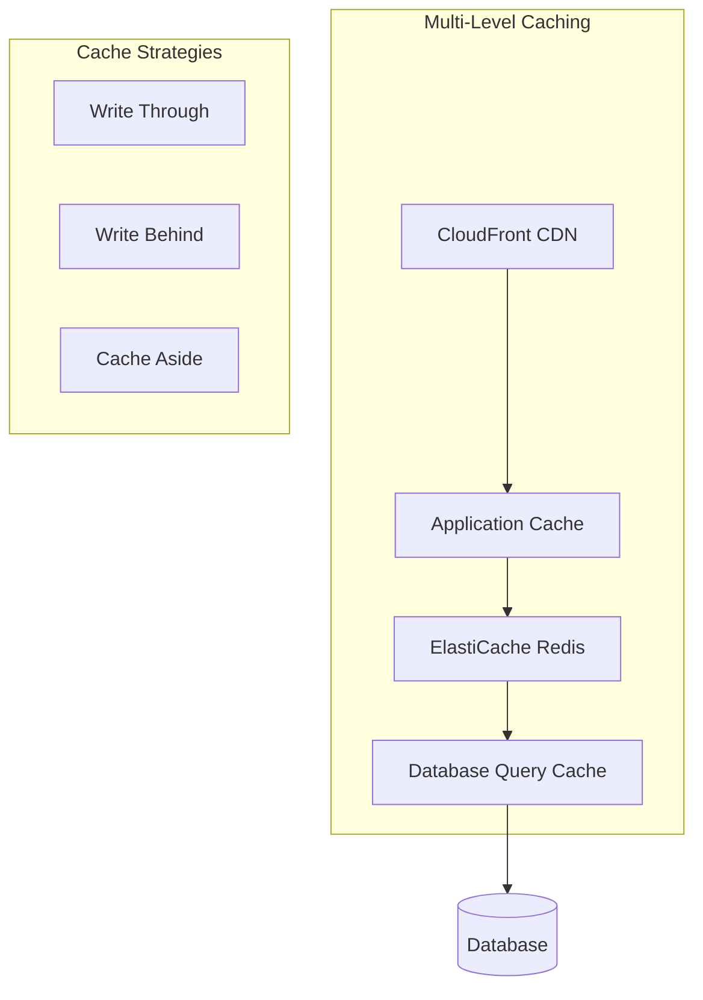
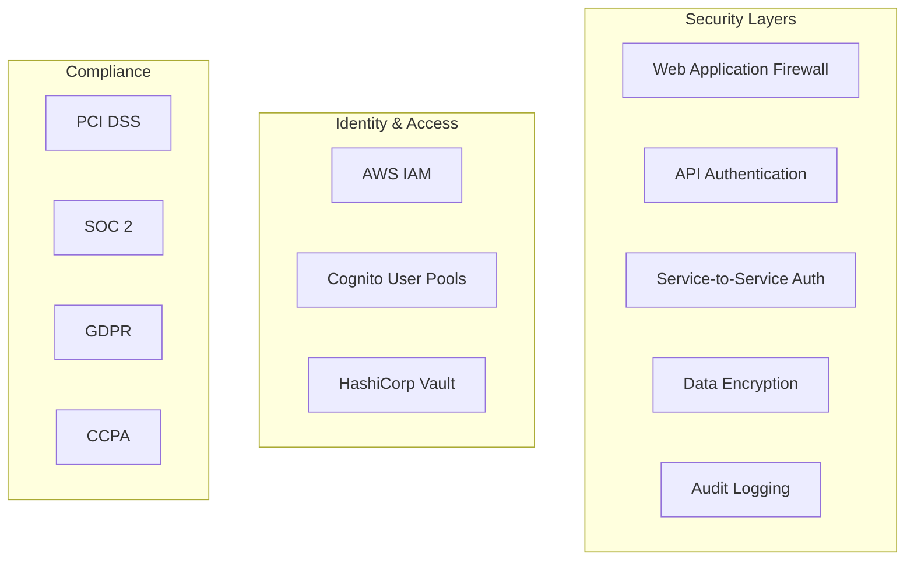
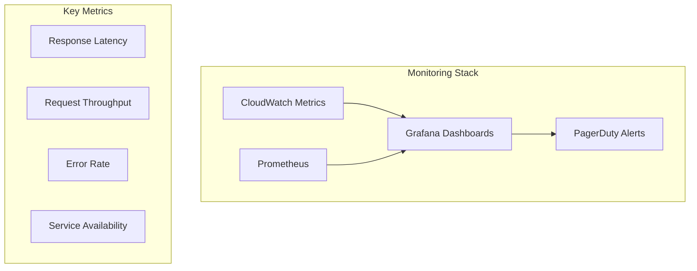

# Amazon System Architecture

## Overview

Amazon.com is one of the world's largest e-commerce platforms, serving hundreds of millions of customers globally. The system handles product catalog management, order processing, inventory management, payments, and logistics coordination across a massive distributed infrastructure.

## System Requirements

### Functional Requirements
- Product catalog management (500M+ products)
- User registration and authentication
- Shopping cart and wishlist management
- Order placement and tracking
- Payment processing and fraud detection
- Inventory management across warehouses
- Recommendation engine
- Reviews and ratings system
- Third-party seller marketplace
- Supply chain and logistics coordination

### Non-Functional Requirements
- **Scale**: 300M+ active users, billions of transactions annually
- **Availability**: 99.99% uptime (especially during peak seasons)
- **Consistency**: Strong consistency for payments/inventory, eventual for catalog
- **Performance**: Search < 100ms, checkout < 500ms
- **Security**: PCI DSS compliance, fraud prevention
- **Global**: Multi-region deployment with localization

## High-Level Architecture



## Microservices Architecture Deep Dive

### 1. Microservices Design Principles at Amazon

Amazon pioneered many microservices patterns and follows strict architectural principles:

**Service Ownership Model:**
- Each service is owned by a "two-pizza team" (6-8 developers)
- Teams have full ownership: design, development, testing, deployment, operations
- "You build it, you run it" philosophy

**API-First Design:**
- All services communicate via well-defined APIs
- No direct database access between services
- Backward compatibility is maintained religiously



### 2. Service Communication Patterns

**Synchronous Communication:**
```javascript
// API Gateway routing with circuit breaker
class ServiceRouter {
    constructor() {
        this.circuitBreakers = new Map();
        this.serviceRegistry = new ServiceRegistry();
    }
    
    async routeRequest(serviceName, request) {
        const serviceEndpoint = await this.serviceRegistry.discover(serviceName);
        const circuitBreaker = this.getCircuitBreaker(serviceName);
        
        return circuitBreaker.execute(async () => {
            const response = await fetch(serviceEndpoint, {
                method: request.method,
                headers: {
                    'Content-Type': 'application/json',
                    'X-Correlation-ID': request.correlationId,
                    'Authorization': request.auth
                },
                body: JSON.stringify(request.body),
                timeout: 5000
            });
            
            if (!response.ok) {
                throw new Error(`Service ${serviceName} returned ${response.status}`);
            }
            
            return response.json();
        });
    }
    
    getCircuitBreaker(serviceName) {
        if (!this.circuitBreakers.has(serviceName)) {
            this.circuitBreakers.set(serviceName, new CircuitBreaker({
                threshold: 5,
                timeout: 30000,
                resetTimeout: 60000
            }));
        }
        return this.circuitBreakers.get(serviceName);
    }
}
```

**Asynchronous Communication:**


### 3. Data Management in Microservices

**Database per Service Pattern:**
```javascript
// Example: Order Service with its own database
class OrderService {
    constructor() {
        this.orderRepository = new OrderRepository();
        this.eventPublisher = new EventPublisher();
        this.userServiceClient = new UserServiceClient();
        this.inventoryServiceClient = new InventoryServiceClient();
    }
    
    async createOrder(orderData) {
        try {
            // Validate user exists (external call)
            const user = await this.userServiceClient.getUser(orderData.userId);
            if (!user) {
                throw new Error('Invalid user');
            }
            
            // Check inventory availability (external call)
            const inventoryCheck = await this.inventoryServiceClient
                .checkAvailability(orderData.items);
            if (!inventoryCheck.available) {
                throw new Error('Insufficient inventory');
            }
            
            // Create order in own database
            const order = await this.orderRepository.create({
                ...orderData,
                status: 'PENDING',
                createdAt: new Date()
            });
            
            // Publish event for other services
            await this.eventPublisher.publish('OrderCreated', {
                orderId: order.id,
                userId: order.userId,
                items: order.items,
                totalAmount: order.totalAmount
            });
            
            return order;
        } catch (error) {
            await this.eventPublisher.publish('OrderFailed', {
                userId: orderData.userId,
                reason: error.message
            });
            throw error;
        }
    }
}
```

**Event Sourcing for Critical Services:**
```javascript
// Payment Service using Event Sourcing
class PaymentEventStore {
    constructor() {
        this.dynamodb = new AWS.DynamoDB.DocumentClient();
    }
    
    async appendEvent(aggregateId, event) {
        const params = {
            TableName: 'payment_events',
            Item: {
                aggregateId,
                eventId: generateUUID(),
                eventType: event.type,
                eventData: event.data,
                timestamp: Date.now(),
                version: event.version
            },
            ConditionExpression: 'attribute_not_exists(eventId)'
        };
        
        await this.dynamodb.put(params).promise();
    }
    
    async getEvents(aggregateId) {
        const params = {
            TableName: 'payment_events',
            KeyConditionExpression: 'aggregateId = :id',
            ExpressionAttributeValues: {
                ':id': aggregateId
            },
            ScanIndexForward: true
        };
        
        const result = await this.dynamodb.query(params).promise();
        return result.Items;
    }
}
```

### 4. Service Discovery and Configuration

**Service Mesh Architecture:**


## Core Services Architecture

### 1. Catalog Service

Manages Amazon's massive product catalog with advanced search capabilities.



**Product Search Implementation:**
```javascript
class ProductSearchService {
    constructor() {
        this.elasticsearch = new ElasticSearchClient();
        this.cache = new RedisClient();
        this.rankingService = new MLRankingService();
    }
    
    async search(query, filters, pagination) {
        const cacheKey = this.generateCacheKey(query, filters, pagination);
        
        // Check cache first
        let results = await this.cache.get(cacheKey);
        if (results) {
            return JSON.parse(results);
        }
        
        // Build Elasticsearch query
        const esQuery = {
            bool: {
                must: [
                    { multi_match: { query, fields: ['title^2', 'description', 'brand'] } }
                ],
                filter: this.buildFilters(filters)
            }
        };
        
        // Execute search
        const searchResponse = await this.elasticsearch.search({
            index: 'products',
            body: {
                query: esQuery,
                from: pagination.offset,
                size: pagination.limit,
                sort: await this.buildSortCriteria(query, filters)
            }
        });
        
        // Apply ML ranking
        results = await this.rankingService.rerank(
            searchResponse.hits.hits,
            query,
            filters.userId
        );
        
        // Cache results (TTL: 10 minutes)
        await this.cache.setex(cacheKey, 600, JSON.stringify(results));
        
        return results;
    }
    
    buildFilters(filters) {
        const esFilters = [];
        
        if (filters.category) {
            esFilters.push({ term: { category: filters.category } });
        }
        
        if (filters.priceRange) {
            esFilters.push({
                range: {
                    price: {
                        gte: filters.priceRange.min,
                        lte: filters.priceRange.max
                    }
                }
            });
        }
        
        if (filters.brand) {
            esFilters.push({ terms: { brand: filters.brand } });
        }
        
        return esFilters;
    }
}
```

### 2. Order Processing Service

Handles the complex order lifecycle with distributed transactions.



**Saga Pattern Implementation:**
```javascript
class OrderSaga {
    constructor() {
        this.steps = [
            { service: 'inventory', action: 'reserve', compensate: 'release' },
            { service: 'payment', action: 'charge', compensate: 'refund' },
            { service: 'warehouse', action: 'createJob', compensate: 'cancelJob' }
        ];
    }
    
    async executeOrder(orderData) {
        const sagaId = generateUUID();
        const executedSteps = [];
        
        try {
            for (const step of this.steps) {
                const result = await this.executeStep(step, orderData, sagaId);
                executedSteps.push({ step, result });
            }
            
            return { success: true, orderId: orderData.orderId };
        } catch (error) {
            // Compensate in reverse order
            await this.compensate(executedSteps.reverse());
            throw error;
        }
    }
    
    async executeStep(step, orderData, sagaId) {
        const serviceClient = this.getServiceClient(step.service);
        
        return serviceClient.execute(step.action, {
            ...orderData,
            sagaId,
            stepId: generateUUID()
        });
    }
    
    async compensate(executedSteps) {
        for (const { step, result } of executedSteps) {
            try {
                const serviceClient = this.getServiceClient(step.service);
                await serviceClient.execute(step.compensate, {
                    transactionId: result.transactionId,
                    reason: 'SAGA_COMPENSATION'
                });
            } catch (error) {
                console.error(`Compensation failed for step ${step.service}:`, error);
                // Alert operations team for manual intervention
                await this.alertOps(step, result, error);
            }
        }
    }
}
```

### 3. Recommendation Service

Powers Amazon's personalization engine using machine learning.



## Scalability and Performance

### 1. Auto-Scaling Strategy

```javascript
class AutoScalingManager {
    constructor() {
        this.cloudwatch = new AWS.CloudWatch();
        this.autoscaling = new AWS.AutoScaling();
        this.ecs = new AWS.ECS();
    }
    
    async scaleService(serviceName, metrics) {
        const currentCapacity = await this.getCurrentCapacity(serviceName);
        const targetCapacity = this.calculateTargetCapacity(metrics);
        
        if (Math.abs(targetCapacity - currentCapacity) > 1) {
            await this.updateServiceCapacity(serviceName, targetCapacity);
        }
    }
    
    calculateTargetCapacity(metrics) {
        const cpuThreshold = 70;
        const memoryThreshold = 80;
        const requestsPerInstanceThreshold = 1000;
        
        let scaleFactor = 1;
        
        if (metrics.cpu > cpuThreshold) {
            scaleFactor = Math.max(scaleFactor, metrics.cpu / cpuThreshold);
        }
        
        if (metrics.memory > memoryThreshold) {
            scaleFactor = Math.max(scaleFactor, metrics.memory / memoryThreshold);
        }
        
        if (metrics.requestsPerSecond > requestsPerInstanceThreshold) {
            scaleFactor = Math.max(scaleFactor, 
                metrics.requestsPerSecond / requestsPerInstanceThreshold);
        }
        
        return Math.ceil(metrics.currentInstances * scaleFactor);
    }
}
```

### 2. Caching Architecture



## Security and Compliance

### 1. Zero-Trust Security Model



### 2. Fraud Detection Service

```javascript
class FraudDetectionService {
    constructor() {
        this.riskEngine = new RiskEngine();
        this.mlModel = new FraudMLModel();
        this.ruleEngine = new RuleEngine();
    }
    
    async evaluateTransaction(transaction) {
        // Parallel evaluation
        const [riskScore, mlScore, ruleViolations] = await Promise.all([
            this.riskEngine.calculateRisk(transaction),
            this.mlModel.predict(transaction),
            this.ruleEngine.evaluate(transaction)
        ]);
        
        const finalScore = this.combineScores(riskScore, mlScore, ruleViolations);
        
        return {
            riskScore: finalScore,
            action: this.determineAction(finalScore),
            reasons: this.generateReasons(riskScore, mlScore, ruleViolations)
        };
    }
    
    determineAction(score) {
        if (score >= 90) return 'BLOCK';
        if (score >= 70) return 'MANUAL_REVIEW';
        if (score >= 50) return 'ADDITIONAL_VERIFICATION';
        return 'APPROVE';
    }
}
```

## Monitoring and Observability

### 1. Distributed Tracing

```javascript
class DistributedTracing {
    constructor() {
        this.tracer = new AWS.XRay();
    }
    
    async traceRequest(operation, context) {
        const segment = this.tracer.getSegment();
        const subsegment = segment.addNewSubsegment(operation);
        
        try {
            const result = await context();
            subsegment.addMetadata('result', { success: true });
            return result;
        } catch (error) {
            subsegment.addError(error);
            throw error;
        } finally {
            subsegment.close();
        }
    }
}
```

### 2. Service Health Dashboard



## Deployment and DevOps

### 1. Blue-Green Deployment

```javascript
class BlueGreenDeployment {
    constructor() {
        this.ecs = new AWS.ECS();
        this.elb = new AWS.ELBv2();
    }
    
    async deploy(serviceName, newVersion) {
        // Create green environment
        const greenService = await this.createGreenEnvironment(serviceName, newVersion);
        
        // Health check green environment
        await this.healthCheck(greenService);
        
        // Gradually shift traffic
        await this.shiftTraffic(serviceName, greenService, [10, 50, 100]);
        
        // Monitor for rollback triggers
        const rollbackNeeded = await this.monitorDeployment(greenService);
        
        if (rollbackNeeded) {
            await this.rollback(serviceName, greenService);
        } else {
            await this.promoteGreenToBlue(serviceName, greenService);
        }
    }
}
```

## Related Case Studies
- See [Netflix](netflix.md) for microservices and chaos engineering patterns
- See [Uber](uber.md) for real-time distributed systems
- See [YouTube](youtube.md) for content delivery and media processing
- See [Airbnb](airbnb.md) for search and recommendation systems

## Trade-offs and Lessons Learned

### Key Trade-offs in Microservices
1. **Complexity vs Scalability**: Microservices enable team autonomy and service scalability but increase operational complexity
2. **Consistency vs Availability**: Eventual consistency across services vs strong consistency within service boundaries
3. **Network Latency vs Service Boundaries**: More granular services increase network calls but improve maintainability
4. **Development Speed vs Runtime Performance**: Service independence enables faster development but may impact runtime performance

### Amazon's Microservices Best Practices
1. **Start with a monolith**: Extract services only when team boundaries and business domains are clear
2. **Database per service**: Each service owns its data and business logic
3. **API versioning**: Maintain backward compatibility and use semantic versioning
4. **Circuit breakers**: Prevent cascade failures with timeout and retry patterns
5. **Async communication**: Use event-driven architecture for loose coupling
6. **Monitoring**: Invest heavily in observability and distributed tracing
7. **Gradual rollouts**: Use canary deployments and feature flags

### Lessons Learned
- Microservices are not a silver bullet - they solve scaling problems but create others
- Team structure should match service architecture (Conway's Law)
- Operational maturity must match architectural complexity
- Event-driven architecture is crucial for service independence
- Security and compliance become more complex in distributed systems

## Conclusion

Amazon's architecture demonstrates how microservices can enable massive scale while maintaining service independence and team autonomy. The key success factors include strong service boundaries, event-driven communication, comprehensive monitoring, and a culture of operational excellence. The architecture continues to evolve as Amazon expands into new markets and services globally.