# Google Maps System Design - Complete Architecture

## Table of Contents
1. [Overview](#overview)
2. [System Requirements](#system-requirements)
3. [High-Level Architecture](#high-level-architecture)
4. [Core Components](#core-components)
5. [Data Flow](#data-flow)
6. [Map Data Management](#map-data-management)
7. [Routing & Navigation](#routing--navigation)
8. [Scalability & Performance](#scalability--performance)
9. [Real-Time Systems](#real-time-systems)
10. [Deployment Architecture](#deployment-architecture)
11. [Related Case Studies](#related-case-studies)

---

## Overview

Google Maps is a comprehensive mapping and navigation platform that provides:
- Interactive maps with satellite, terrain, and street views
- Turn-by-turn navigation
- Real-time traffic information
- Business listings and reviews
- Street View imagery
- Route planning and optimization
- Location-based services

### Scale Requirements
- **Users**: 1B+ monthly active users
- **Map Updates**: 25M+ updates/day
- **Requests**: 100M+ queries/day
- **Data Storage**: 20+ petabytes of map data
- **Latency**: <100ms for map tiles, <1s for routing
- **Coverage**: 220+ countries, 250M+ places

---

## System Requirements

### Functional Requirements

1. **Map Rendering**
   - Display maps at various zoom levels
   - Support multiple map types (road, satellite, terrain)
   - Vector and raster tile rendering
   - Custom styling and overlays

2. **Search & Discovery**
   - Location search (addresses, landmarks, businesses)
   - Autocomplete suggestions
   - Place details and photos
   - Nearby search with filters

3. **Navigation & Routing**
   - Turn-by-turn directions
   - Multiple route options
   - Real-time traffic integration
   - Multi-modal routing (car, transit, bike, walk)
   - Voice guidance

4. **Street View**
   - 360° panoramic imagery
   - Indoor mapping
   - Historical imagery
   - User-contributed photos

5. **Real-Time Features**
   - Live traffic updates
   - Incident reporting
   - ETA updates
   - Crowd-sourced data

6. **Location Services**
   - Geocoding (address → coordinates)
   - Reverse geocoding (coordinates → address)
   - Place API
   - Distance Matrix API

### Non-Functional Requirements

1. **Performance**
   - Map tile loading: <100ms
   - Search results: <200ms
   - Route calculation: <1s
   - Low latency for real-time updates

2. **Scalability**
   - Handle billions of requests daily
   - Support millions of concurrent users
   - Store petabytes of geographic data

3. **Availability**
   - 99.99% uptime
   - Global distribution
   - Fault tolerance

4. **Accuracy**
   - Map data accuracy within 10 meters
   - Regular updates from multiple sources
   - User feedback integration

5. **Bandwidth Optimization**
   - Efficient tile compression
   - Progressive loading
   - Adaptive quality based on connection

---

## High-Level Architecture

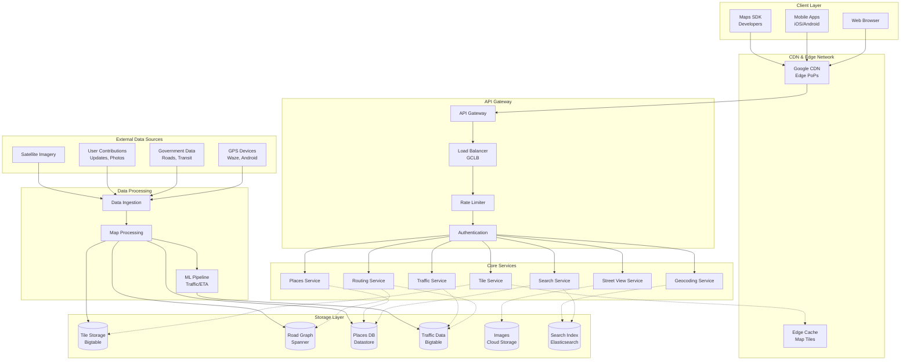

---

## Core Components

### 1. Tile Service

**Purpose**: Serve map tiles efficiently at various zoom levels

**Tile System**:
- Uses Web Mercator projection
- Pyramid structure with 0-20+ zoom levels
- Each tile: 256x256 pixels
- Tile coordinates: (x, y, zoom)

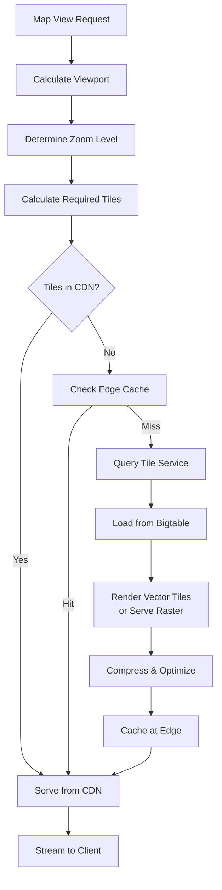

**Tile Calculation Formula**:
```
Zoom Level 0: 1 tile (entire world)
Zoom Level n: 2^n × 2^n tiles

Tile coordinates at zoom z:
x = floor((longitude + 180) / 360 × 2^z)
y = floor((1 - log(tan(lat°×π/180) + 1/cos(lat°×π/180))/π) / 2 × 2^z)
```

**Vector vs Raster Tiles**:

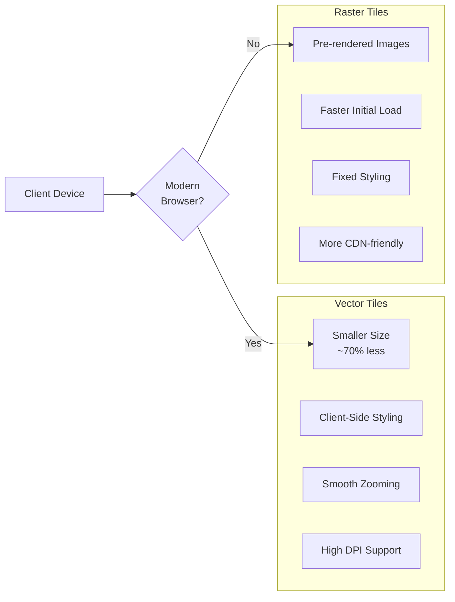

### 2. Search Service

**Purpose**: Enable fast, accurate location search with autocomplete

**Search Architecture**:

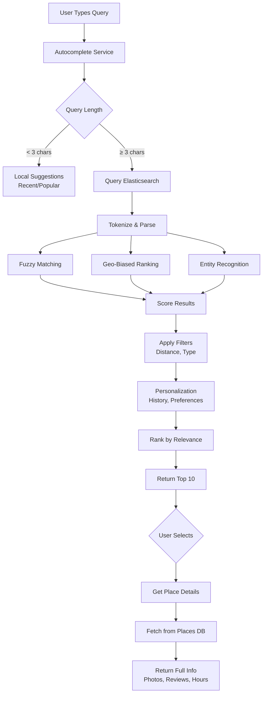

**Search Optimization**:
- **Geo-spatial Indexing**: Elasticsearch with geo_point
- **Sharding**: By geographic regions
- **Caching**: Popular searches cached in Redis
- **Typo Tolerance**: Fuzzy matching with Levenshtein distance
- **Language Support**: Multi-language tokenization

**Search Ranking Factors**:
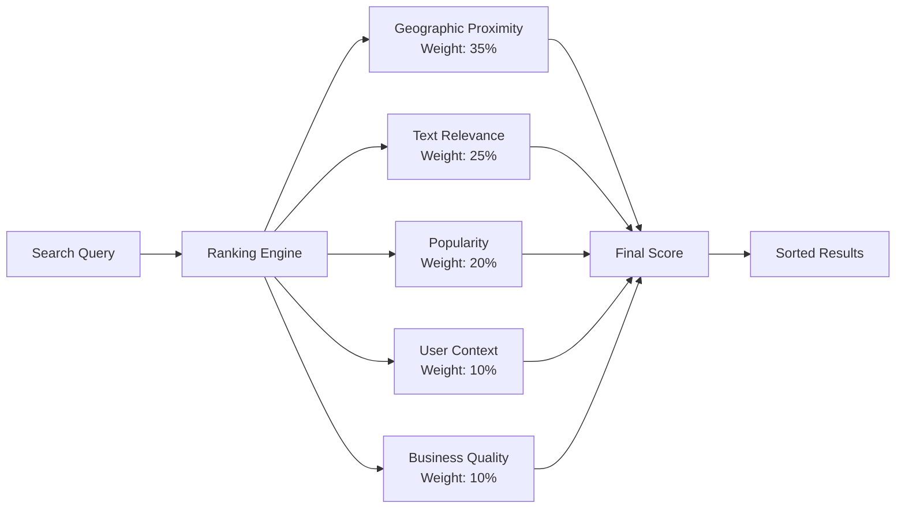

### 3. Routing Service

**Purpose**: Calculate optimal routes between locations

**Routing Algorithm**: Modified Dijkstra with A* heuristic

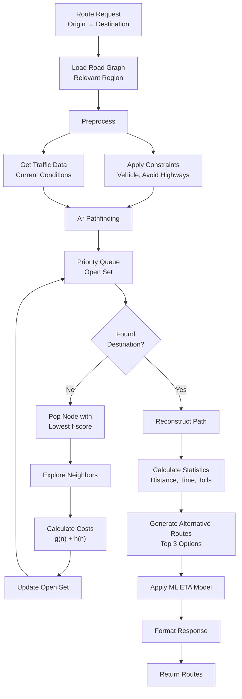

**Route Calculation Components**:

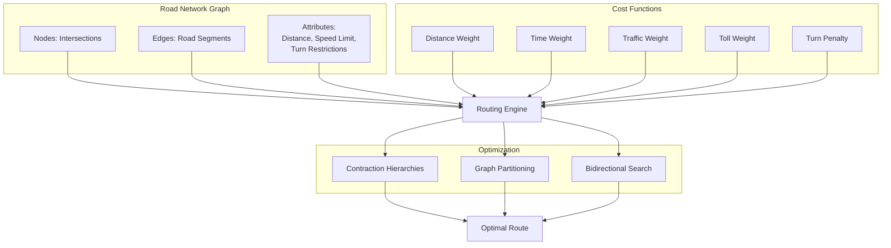

**Contraction Hierarchies Optimization**:
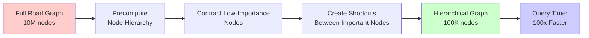

### 4. Traffic Service

**Purpose**: Provide real-time traffic information and predictions

**Traffic Data Sources**:

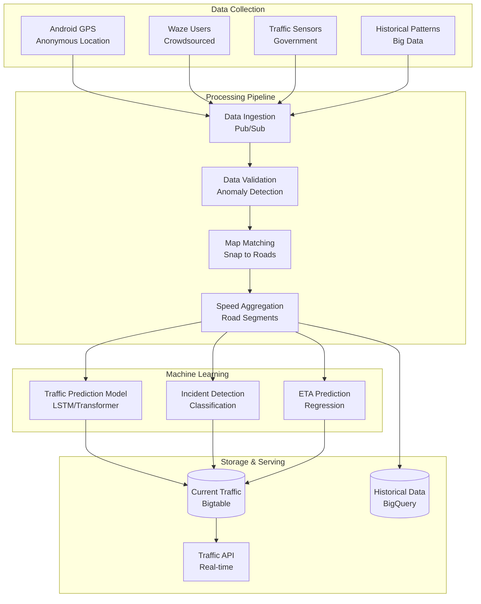

**Traffic Prediction Model**:

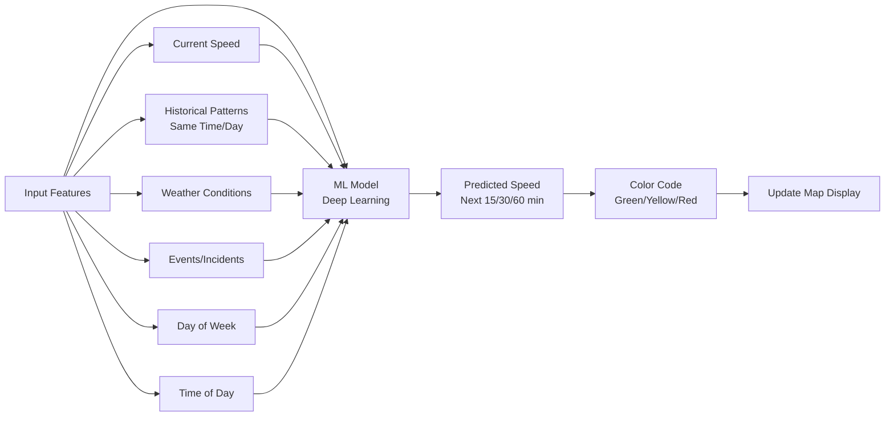

**Traffic Data Pipeline**:

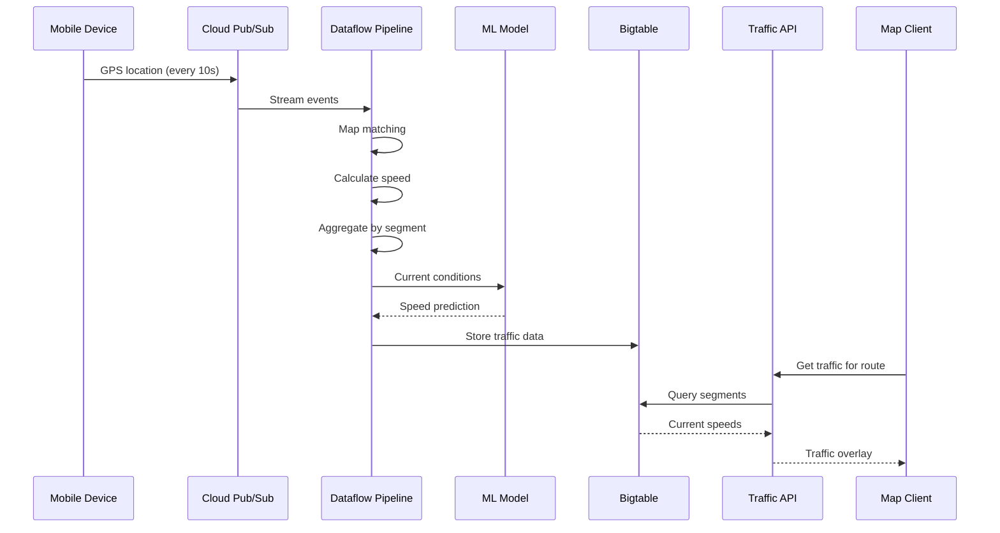

### 5. Places Service

**Purpose**: Manage business listings, reviews, and place information

**Places Data Structure**:

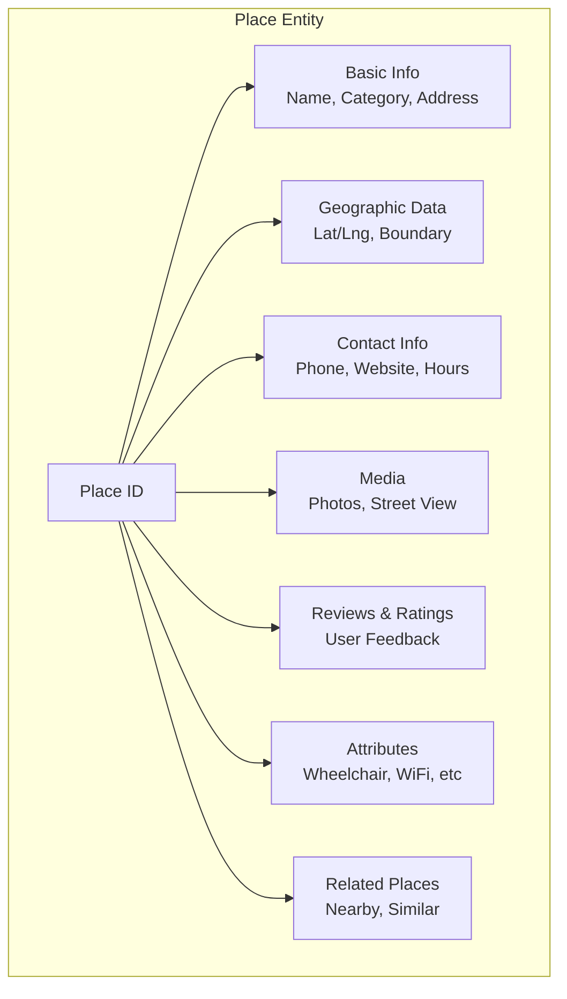

**Places API Flow**:

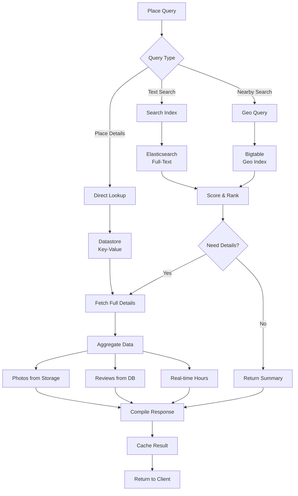

### 6. Geocoding Service

**Purpose**: Convert addresses to coordinates and vice versa

**Geocoding Process**:

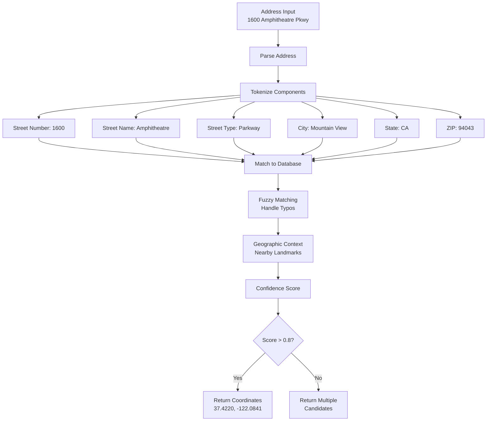

**Reverse Geocoding**:

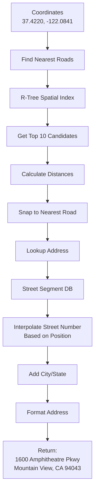

### 7. Street View Service

**Purpose**: Serve 360° panoramic imagery

**Street View Architecture**:

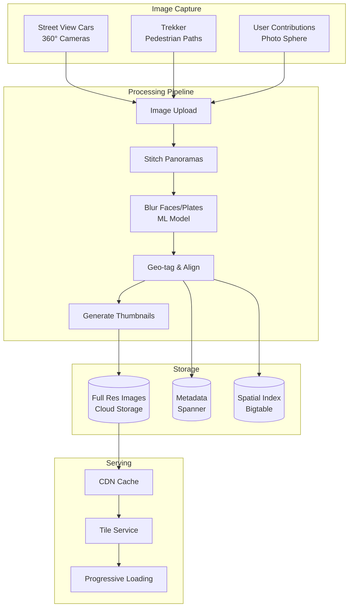

**Street View Rendering**:

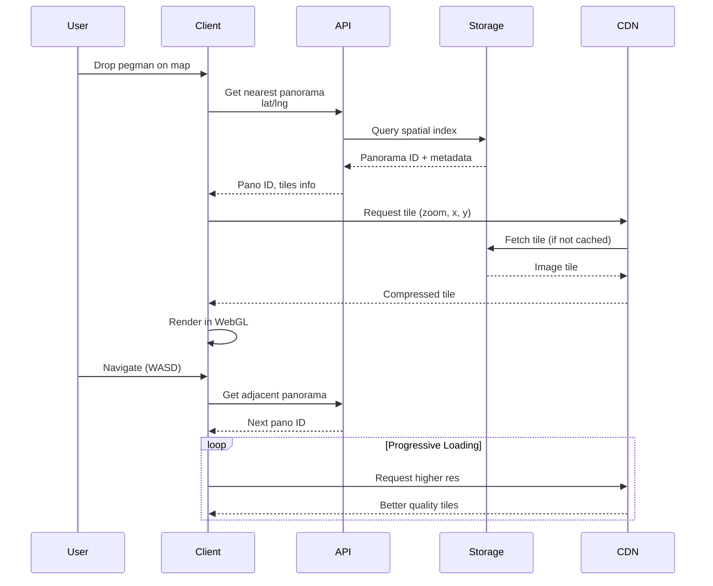

---

## Data Flow: Complete Request Lifecycle

### End-to-End: Map Tile Request

```mermaid
flowchart TD
    subgraph "1. Client Initialization"
        A1[User Opens Maps] --> A2[Load JavaScript/SDK]
        A2 --> A3[Get User Location<br/>GPS/IP]
        A3 --> A4[Determine Viewport<br/>Lat/Lng Bounds]
    end
    
    subgraph "2. Tile Calculation"
        A4 --> B1[Calculate Zoom Level<br/>Based on Screen Size]
        B1 --> B2[Compute Required Tiles<br/>x, y coordinates]
        B2 --> B3[Generate Tile URLs<br/>tile.server/{z}/{x}/{y}]
    end
    
    subgraph "3. CDN Layer"
        B3 --> C1{Tiles in<br/>Browser Cache?}
        C1 -->|Yes| C2[Load from Cache]
        C1 -->|No| C3[Request from CDN]
        C3 --> C4{In CDN Cache?}
        C4 -->|Yes| C5[Serve from Edge]
        C4 -->|No| C6[Forward to Origin]
    end
    
    subgraph "4. API Gateway"
        C6 --> D1[Load Balancer]
        D1 --> D2[Rate Limiting]
        D2 --> D3[Authentication<br/>API Key]
        D3 --> D4[Route to Tile Service]
    end
    
    subgraph "5. Tile Service"
        D4 --> E1[Parse Request<br/>z, x, y params]
        E1 --> E2{Vector or<br/>Raster?}
        E2 -->|Vector| E3[Query Bigtable<br/>Get Vector Data]
        E2 -->|Raster| E4[Query Image Store]
        E3 --> E5[Render Tile<br/>Apply Styling]
        E4 --> E5
        E5 --> E6[Compress<br/>WebP/PNG]
    end
    
    subgraph "6. Caching & Response"
        E6 --> F1[Store in CDN<br/>TTL: 7 days]
        F1 --> F2[Add Cache Headers]
        F2 --> C5
        C5 --> C2
        C2 --> F3[Render on Canvas]
    end
    
    subgraph "7. Additional Layers"
        F3 --> G1[Load Traffic Layer<br/>If enabled]
        F3 --> G2[Load Transit Layer<br/>If enabled]
        F3 --> G3[Load 3D Buildings<br/>If 3D mode]
        
        G1 --> H1[Overlay on Map]
        G2 --> H1
        G3 --> H1
    end
    
    style A1 fill:#e1f5ff
    style C3 fill:#fff4e1
    style D1 fill:#ffe1e1
    style E1 fill:#e1ffe1
    style F1 fill:#f0e1ff
    style H1 fill:#ffe1f0
```

### Search to Navigation Flow

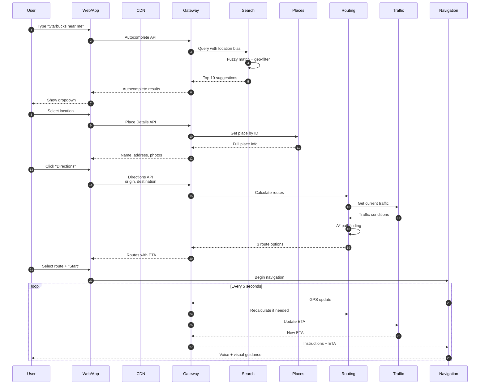

---

## Map Data Management

### Data Pipeline

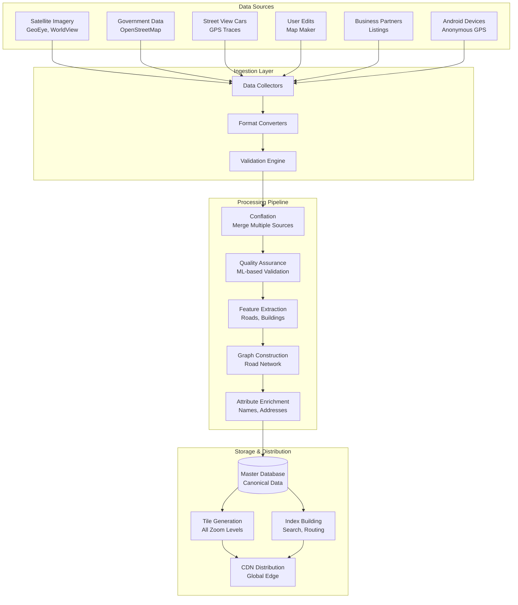

### Map Update Cycle

```mermaid
gantt
    title Map Update Lifecycle
    dateFormat YYYY-MM-DD
    section Data Collection
    Satellite Imagery    :2024-01-01, 30d
    Street View Capture  :2024-01-01, 60d
    User Contributions   :2024-01-01, 90d
    
    section Processing
    Data Validation      :2024-02-01, 20d
    Conflation          :2024-02-15, 15d
    Quality Check       :2024-03-01, 10d
    
    section Distribution
    Tile Generation     :2024-03-10, 5d
    CDN Push           :2024-03-15, 2d
    Live Update        :milestone, 2024-03-17, 0d
```

### Data Storage Strategy

```mermaid
graph TB
    subgraph "Hot Data - Frequently Accessed"
        H1[(Bigtable<br/>Map Tiles<br/>Current Traffic)]
        H2[(Memcache<br/>Popular Searches)]
        H3[(Redis<br/>User Sessions)]
    end
    
    subgraph "Warm Data - Regular Access"
        W1[(Spanner<br/>Road Graph<br/>Place Index)]
        W2[(Datastore<br/>Place Details)]
    end
    
    subgraph "Cold Data - Archive"
        C1[(BigQuery<br/>Historical Traffic<br/>Analytics)]
        C2[(Cloud Storage<br/>Street View Images<br/>Backups)]
    end
    
    subgraph "Access Patterns"
        A[User Request]
    end
    
    A -->|< 1ms| H1
    A -->|< 10ms| W1
    A -->|Batch| C1
    
    H1 -.->|Expire after 7 days| W1
    W1 -.->|Archive after 30 days| C1
    
    style H1 fill:#ff9999
    style W1 fill:#ffff99
    style C1 fill:#99ccff
```

---

## Routing & Navigation

### Multi-Modal Routing

```mermaid
graph TB
    subgraph "Routing Modes"
        A[User Request]
        B[Driving]
        C[Transit]
        D[Walking]
        E[Bicycling]
    end
    
    A --> B
    A --> C
    A --> D
    A --> E
    
    B --> F[Road Network<br/>Car-specific]
    C --> G[Transit Graph<br/>Schedules]
    D --> H[Pedestrian Paths<br/>Sidewalks]
    E --> I[Bike Lanes<br/>Bike-friendly]
    
    F --> J{Apply Constraints}
    G --> J
    H --> J
    I --> J
    
    J --> K[Avoid Highways]
    J --> L[Avoid Tolls]
    J --> M[Avoid Ferries]
    
    K --> N[Calculate Routes]
    L --> N
    M --> N
    
    N --> O[Rank by:<br/>Time, Distance,<br/>Traffic]
    O --> P[Return Top 3 Routes]
```

### Advanced Routing Algorithms

**Contraction Hierarchies (CH)**:

```mermaid
flowchart TD
    A[Preprocessing Phase<br/>Offline] --> B[Order Nodes by Importance]
    B --> C{For Each Node<br/>Low → High}
    
    C --> D[Remove Node from Graph]
    D --> E[Find Shortest Paths<br/>Between Neighbors]
    E --> F[Add Shortcut Edges<br/>If Needed]
    F --> G{More Nodes?}
    G -->|Yes| C
    G -->|No| H[Hierarchical Graph<br/>Ready]
    
    H --> I[Query Phase<br/>Online]
    I --> J[Bidirectional Search<br/>From Origin & Destination]
    J --> K[Search Upward<br/>in Hierarchy Only]
    K --> L[Meet in Middle]
    L --> M[Unpack Shortcuts]
    M --> N[Return Path<br/>100x Faster]
    
    style A fill:#ffcccc
    style H fill:#ccffcc
    style N fill:#ccccff
```

**Alternative Routes Generation**:

```mermaid
flowchart LR
    A[Primary Route<br/>Shortest Path] --> B[Generate Alternatives]
    
    B --> C[Penalty Graph Method]
    C --> D[Increase Edge Weights<br/>on Primary Route]
    D --> E[Recalculate Path]
    E --> F[Alternative Route 1]
    
    B --> G[Plateau Method]
    G --> H[Find Routes via<br/>Different Major Roads]
    H --> I[Alternative Route 2]
    
    B --> J[Via Points]
    J --> K[Route Through<br/>Intermediate Landmarks]
    K --> L[Alternative Route 3]
    
    F --> M{Quality Check}
    I --> M
    L --> M
    
    M --> N[Filter Similar Routes<br/>Overlap > 70%]
    M --> O[Filter Long Routes<br/>> 150% of shortest]
    
    N --> P[Return Diverse<br/>Top 3 Routes]
    O --> P
```

### Real-Time ETA Calculation

```mermaid
flowchart TD
    A[Route Segments] --> B[For Each Segment]
    
    B --> C[Historical Speed<br/>Same Time/Day]
    B --> D[Current Traffic<br/>Real-time Data]
    B --> E[Incidents<br/>Accidents, Construction]
    B --> F[Weather Impact<br/>Rain, Snow]
    
    C --> G[ML ETA Model<br/>Neural Network]
    D --> G
    E --> G
    F --> G
    
    G --> H[Predicted Speed<br/>Next 15 min]
    H --> I[Segment Travel Time<br/>Distance / Speed]
    
    I --> J[Sum All Segments]
    J --> K[Add Buffer<br/>±10% Confidence]
    K --> L[Account for Stops<br/>Turns, Traffic Lights]
    L --> M[Final ETA<br/>Range: 25-30 min]
    
    M --> N[Update Every 30s<br/>While Navigating]
```

### Turn-by-Turn Navigation Engine

```mermaid
sequenceDiagram
    participant GPS
    participant Nav as Navigation Engine
    participant Map as Map Matching
    participant Voice as Voice Guidance
    participant UI as User Interface
    
    loop Every 1 second
        GPS->>Nav: Current position
        Nav->>Map: Snap to road
        Map-->>Nav: Road segment + bearing
        
        Nav->>Nav: Calculate distance to<br/>next maneuver
        
        alt Distance < 500m
            Nav->>Voice: Prepare instruction<br/>"In 500m, turn right"
            Voice-->>UI: Show & speak
        end
        
        alt Distance < 100m
            Nav->>Voice: Imminent instruction<br/>"Turn right now"
            Voice-->>UI: Show & speak
        end
        
        Nav->>Nav: Check if off-route
        
        alt Off-route detected
            Nav->>Nav: Trigger rerouting
            Nav->>Nav: Calculate new path
            Nav-->>UI: "Recalculating route"
        end
        
        Nav->>UI: Update position on map
        Nav->>UI: Update ETA
    end
```

---

## Scalability & Performance

### Global Infrastructure

```mermaid
graph TB
    subgraph "Global Distribution"
        US[US Regions<br/>us-east, us-west]
        EU[Europe Regions<br/>eu-west, eu-central]
        APAC[APAC Regions<br/>asia-east, asia-south]
        SA[South America<br/>sa-east]
    end
    
    subgraph "CDN Network"
        CDN1[200+ Edge PoPs]
        CDN2[Anycast Routing]
        CDN3[Regional Caching]
    end
    
    subgraph "Data Replication"
        SPAN[Spanner<br/>Multi-Region<br/>Globally Consistent]
        BT[Bigtable<br/>Regional Clusters<br/>Eventual Consistency]
    end
    
    subgraph "Traffic Management"
        GLB[Global Load Balancer]
        DNS[Cloud DNS<br/>Geo-routing]
    end
    
    CLIENT[Users Worldwide] --> DNS
    DNS --> GLB
    GLB --> US
    GLB --> EU
    GLB --> APAC
    GLB --> SA
    
    US --> CDN1
    EU --> CDN1
    APAC --> CDN1
    SA --> CDN1
    
    US -.-> SPAN
    EU -.-> SPAN
    APAC -.-> SPAN
    
    US -.-> BT
    EU -.-> BT
    APAC -.-> BT
```

### Caching Strategy

**Multi-Tier Caching**:

```mermaid
graph LR
    A[Request] --> B{Browser Cache?}
    B -->|Hit| C[Serve from Browser<br/>~0ms]
    B -->|Miss| D{CDN Cache?}
    D -->|Hit| E[Serve from CDN<br/>~10-50ms]
    D -->|Miss| F{Regional Cache?}
    F -->|Hit| G[Serve from Region<br/>~50-100ms]
    F -->|Miss| H{Memcache?}
    H -->|Hit| I[Serve from Memory<br/>~1ms]
    H -->|Miss| J[Query Database<br/>~10-100ms]
    J --> K[Update All Caches]
    K --> I
    I --> G
    G --> E
    E --> C
```

**Cache TTL Strategy**:

| Data Type | TTL | Invalidation Strategy |
|-----------|-----|----------------------|
| Map Tiles (Stable) | 7 days | Version-based |
| Map Tiles (Changing) | 1 day | Event-driven |
| Traffic Data | 2 minutes | Time-based |
| Place Details | 1 hour | Event-driven |
| Search Results | 15 minutes | Time-based |
| Street View | 30 days | Rarely changes |
| Routing Results | 5 minutes | Traffic-dependent |

### Database Sharding

```mermaid
graph TD
    A[Global Data] --> B{Sharding Strategy}
    
    B --> C[Geographic Sharding<br/>By Region]
    C --> D[Shard: North America]
    C --> E[Shard: Europe]
    C --> F[Shard: Asia]
    
    B --> G[Hash Sharding<br/>By Place ID]
    G --> H[Shard: 0-999]
    G --> I[Shard: 1000-1999]
    G --> J[Shard: 2000-2999]
    
    B --> K[Hierarchical Sharding<br/>By Zoom Level]
    K --> L[Shard: High Zoom<br/>Detailed Tiles]
    K --> M[Shard: Low Zoom<br/>Overview Tiles]
    
    D --> N[(Regional Database)]
    E --> N
    F --> N
    H --> O[(Place Database)]
    I --> O
    J --> O
    L --> P[(Tile Storage)]
    M --> P
```

### Load Balancing

```mermaid
flowchart TD
    A[Incoming Request] --> B[Google Cloud<br/>Load Balancer]
    
    B --> C{Request Type}
    
    C -->|Static Assets| D[CDN/Edge Cache]
    C -->|API Calls| E[Application LB]
    C -->|Tile Requests| F[Tile Service LB]
    
    E --> G[Health Check]
    G --> H{Server Healthy?}
    H -->|Yes| I[Route to Server]
    H -->|No| J[Remove from Pool]
    
    I --> K[Weighted Round Robin]
    K --> L[Service Instance 1<br/>Weight: 100]
    K --> M[Service Instance 2<br/>Weight: 100]
    K --> N[Service Instance 3<br/>Weight: 50<br/>New Deploy]
    
    J --> O[Auto-Healing]
    O --> P[Restart Instance]
    P --> G
```

### Performance Optimization Techniques

**1. Progressive Loading**:

```mermaid
sequenceDiagram
    participant User
    participant Client
    participant Server
    
    User->>Client: Open Maps
    Client->>Server: Request low-res tiles (fast)
    Server-->>Client: Low-res tiles (256x256)
    Client->>Client: Display immediately
    
    par High-res loading
        Client->>Server: Request medium-res
        Server-->>Client: Medium-res tiles
        Client->>Client: Replace low-res
        
        Client->>Server: Request high-res
        Server-->>Client: High-res tiles
        Client->>Client: Replace medium-res
    end
    
    Note over Client: User sees map quickly,<br/>quality improves progressively
```

**2. Tile Prefetching**:

```mermaid
flowchart LR
    A[User Viewing Map] --> B[Detect User Behavior]
    B --> C[Panning Direction]
    B --> D[Zoom Pattern]
    
    C --> E[Predict Next Viewport]
    D --> E
    
    E --> F[Prefetch Adjacent Tiles]
    F --> G[Load in Background]
    G --> H[Store in Cache]
    
    H --> I[User Pans]
    I --> J[Instant Display<br/>Already Cached]
    
    style J fill:#ccffcc
```

**3. Vector Tile Optimization**:

```
Before (Raster): 
  Tile size: 256x256 PNG = ~50KB
  4 zoom levels = 200KB
  
After (Vector):
  Tile size: GeoJSON compressed = ~15KB
  Client-side rendering for all zooms
  Savings: 70% bandwidth reduction
```

**4. Compression Strategies**:

```mermaid
graph TD
    A[Map Data] --> B{Content Type}
    
    B --> C[Vector Tiles]
    C --> D[Protocol Buffers<br/>Mapbox Vector Tiles]
    D --> E[Gzip Compression]
    E --> F[Size: 15KB]
    
    B --> G[Raster Tiles]
    G --> H[WebP Format<br/>25% smaller than PNG]
    H --> I[Lossy for Satellite]
    H --> J[Lossless for Maps]
    I --> K[Size: 30KB]
    J --> K
    
    B --> L[JSON Responses]
    L --> M[Remove Whitespace]
    M --> N[Brotli Compression]
    N --> O[Size: 8KB]
    
    style F fill:#ccffcc
    style K fill:#ffffcc
    style O fill:#ccccff
```

---

## Real-Time Systems

### Live Traffic Updates

```mermaid
flowchart TD
    subgraph "Data Collection"
        A[Million+ Android Devices]
        B[Send GPS every 10s]
    end
    
    subgraph "Stream Processing"
        C[Cloud Pub/Sub<br/>Ingest 100K msgs/sec]
        D[Dataflow Pipeline<br/>Streaming]
        E[Map Matching<br/>Snap to Roads]
        F[Speed Calculation<br/>Per Segment]
    end
    
    subgraph "Aggregation"
        G[5-min Window<br/>Aggregate Speeds]
        H[Anomaly Detection<br/>ML Model]
        I[Traffic Level<br/>Green/Yellow/Red]
    end
    
    subgraph "Storage & Distribution"
        J[(Bigtable<br/>Current Traffic)]
        K[Pub/Sub<br/>Traffic Events]
        L[WebSocket<br/>Push to Clients]
    end
    
    A --> B
    B --> C
    C --> D
    D --> E
    E --> F
    F --> G
    G --> H
    H --> I
    I --> J
    I --> K
    K --> L
    
    L --> M[Update Map Display<br/>Real-time]
```

### Incident Detection & Reporting

```mermaid
flowchart LR
    A[Data Sources] --> B[Incident Detection]
    
    A --> C[Speed Anomalies<br/>Sudden Slowdown]
    A --> D[User Reports<br/>Accidents, Hazards]
    A --> E[Waze Integration<br/>Crowd-sourced]
    A --> F[Traffic Cameras<br/>Computer Vision]
    
    C --> B
    D --> B
    E --> B
    F --> B
    
    B --> G[ML Classification]
    G --> H{Incident Type}
    
    H -->|Accident| I[High Priority]
    H -->|Construction| J[Medium Priority]
    H -->|Congestion| K[Low Priority]
    
    I --> L[Verify with<br/>Multiple Sources]
    J --> L
    K --> L
    
    L --> M{Confidence<br/>> 80%?}
    M -->|Yes| N[Publish Incident]
    M -->|No| O[Queue for Review]
    
    N --> P[Update Routes<br/>Avoid Area]
    N --> Q[Notify Users<br/>In Area]
    N --> R[Display on Map]
```

### WebSocket Architecture

```mermaid
graph TB
    subgraph "Client Connections"
        C1[Web Client 1]
        C2[Mobile App 1]
        C3[Web Client 2]
        C4[Mobile App 2]
    end
    
    subgraph "WebSocket Gateway"
        WS1[WS Server 1<br/>Connection: 10K]
        WS2[WS Server 2<br/>Connection: 10K]
        WS3[WS Server 3<br/>Connection: 10K]
    end
    
    subgraph "Connection Registry"
        REDIS[(Redis<br/>User → Server Map)]
    end
    
    subgraph "Message Broker"
        PS[Pub/Sub Topics]
        PS1[Traffic Updates]
        PS2[Incident Alerts]
        PS3[ETA Changes]
    end
    
    C1 --> WS1
    C2 --> WS1
    C3 --> WS2
    C4 --> WS3
    
    WS1 --> REDIS
    WS2 --> REDIS
    WS3 --> REDIS
    
    PS1 --> WS1
    PS1 --> WS2
    PS1 --> WS3
    PS2 --> WS1
    PS2 --> WS2
    PS2 --> WS3
    PS3 --> WS1
    PS3 --> WS2
    PS3 --> WS3
    
    WS1 -->|Geo-filtered| C1
    WS1 -->|Geo-filtered| C2
    WS2 -->|Geo-filtered| C3
    WS3 -->|Geo-filtered| C4
```

---

## Machine Learning Integration

### Traffic Prediction Models

```mermaid
flowchart TD
    A[Historical Data<br/>Past 3 years] --> B[Feature Engineering]
    
    B --> C[Time Features<br/>Hour, Day, Month]
    B --> D[Road Features<br/>Type, Lanes, Speed Limit]
    B --> E[External Features<br/>Weather, Events, Holidays]
    B --> F[Traffic Patterns<br/>Historical Speeds]
    
    C --> G[Model Training<br/>LSTM + Attention]
    D --> G
    E --> G
    F --> G
    
    G --> H[Model Variants]
    H --> I[15-min Prediction]
    H --> J[30-min Prediction]
    H --> K[60-min Prediction]
    
    I --> L[Ensemble Model<br/>Weighted Average]
    J --> L
    K --> L
    
    L --> M[Validation<br/>MAPE < 15%]
    M --> N[Deploy to Production]
    
    N --> O[Inference Service]
    O --> P[Real-time Predictions<br/>Every 5 minutes]
    
    P --> Q[Update Traffic Layer]
    P --> R[Adjust ETAs]
    P --> S[Optimize Routes]
```

**Model Architecture**:

```mermaid
graph LR
    A[Input Sequence<br/>Past 1 hour] --> B[LSTM Layer 1<br/>128 units]
    B --> C[LSTM Layer 2<br/>64 units]
    C --> D[Attention Mechanism<br/>Focus on Recent]
    D --> E[Dense Layer<br/>32 units]
    E --> F[Output<br/>Speed Prediction]
    
    G[External Features] --> D
    
    style F fill:#ccffcc
```

### Place Ranking ML

```mermaid
flowchart LR
    A[Search Query] --> B[Feature Extraction]
    
    B --> C[Text Relevance<br/>TF-IDF]
    B --> D[Geographic Distance<br/>Haversine]
    B --> E[Popularity<br/>Search Volume]
    B --> F[User Context<br/>History, Preferences]
    B --> G[Business Signals<br/>Hours, Rating]
    
    C --> H[Gradient Boosting<br/>XGBoost]
    D --> H
    E --> H
    F --> H
    G --> H
    
    H --> I[Ranking Score<br/>0-100]
    I --> J[Sort Results]
    J --> K[Apply Business Rules<br/>Sponsored Pins]
    K --> L[Final Ranked List]
```

### Computer Vision for Street View

```mermaid
flowchart TD
    A[Street View Image] --> B[Image Processing<br/>Pipeline]
    
    B --> C[Object Detection<br/>YOLO/Faster R-CNN]
    C --> D[Detect Faces]
    C --> E[Detect License Plates]
    C --> F[Detect Signs]
    C --> G[Detect Buildings]
    
    D --> H[Face Blurring<br/>Privacy]
    E --> I[Plate Blurring<br/>Privacy]
    F --> J[OCR for Text<br/>Street Names]
    G --> K[3D Building Models<br/>Structure]
    
    H --> L[Anonymized Image]
    I --> L
    J --> M[Metadata Extraction]
    K --> M
    
    L --> N[Store in Cloud Storage]
    M --> O[Update Database]
```

---

## Deployment Architecture

### Kubernetes Infrastructure

```mermaid
graph TB
    subgraph "GKE Cluster - Production"
        subgraph "Namespace: maps-api"
            D1[Deployment: Tile Service<br/>Replicas: 100]
            D2[Deployment: Search Service<br/>Replicas: 50]
            D3[Deployment: Routing Service<br/>Replicas: 80]
            D4[Deployment: Traffic Service<br/>Replicas: 60]
        end
        
        subgraph "Services"
            S1[Service: Tile<br/>ClusterIP]
            S2[Service: Search<br/>ClusterIP]
            S3[Service: Routing<br/>ClusterIP]
            S4[Service: Traffic<br/>ClusterIP]
        end
        
        subgraph "Ingress"
            ING[Ingress Controller<br/>HTTPS/HTTP/2]
            CERT[Cert Manager<br/>TLS Certs]
        end
        
        subgraph "Autoscaling"
            HPA[Horizontal Pod<br/>Autoscaler]
            VPA[Vertical Pod<br/>Autoscaler]
            CA[Cluster Autoscaler]
        end
    end
    
    subgraph "Persistent Storage"
        PV[Persistent Volumes<br/>SSD]
        CSI[CSI Driver<br/>Cloud Storage]
    end
    
    subgraph "Monitoring"
        PROM[Prometheus]
        GRAF[Grafana]
        TRACE[Cloud Trace]
    end
    
    ING --> S1
    ING --> S2
    ING --> S3
    ING --> S4
    
    S1 --> D1
    S2 --> D2
    S3 --> D3
    S4 --> D4
    
    HPA -.-> D1
    HPA -.-> D2
    HPA -.-> D3
    HPA -.-> D4
    
    D1 -.-> PV
    D2 -.-> PV
    
    PROM --> D1
    PROM --> D2
    PROM --> D3
    PROM --> D4
```

### CI/CD Pipeline

```mermaid
flowchart LR
    A[Git Push<br/>GitHub] --> B[Cloud Build<br/>Trigger]
    
    B --> C[Run Tests]
    C --> D{Tests Pass?}
    D -->|No| E[Notify Team<br/>Email/Slack]
    D -->|Yes| F[Build Docker Image]
    
    F --> G[Security Scan<br/>Container Analysis]
    G --> H{Vulnerabilities?}
    H -->|Critical| E
    H -->|None/Low| I[Push to GCR<br/>Container Registry]
    
    I --> J[Deploy to Staging]
    J --> K[Integration Tests]
    K --> L{Tests Pass?}
    L -->|No| E
    L -->|Yes| M[Canary Deploy<br/>5% Traffic]
    
    M --> N[Monitor Metrics<br/>10 minutes]
    N --> O{Error Rate<br/>< 0.1%?}
    O -->|No| P[Automatic Rollback]
    P --> E
    O -->|Yes| Q[Gradually Increase<br/>25% → 50% → 100%]
    
    Q --> R[Full Production<br/>Deployment]
    R --> S[Update Monitoring<br/>Dashboards]
```

### Blue-Green Deployment

```mermaid
graph TB
    subgraph "Load Balancer"
        LB[Google Cloud<br/>Load Balancer]
    end
    
    subgraph "Blue Environment - Current"
        B1[Service v1.5<br/>100% Traffic]
        B2[Pods: 50]
        B3[Stable Version]
    end
    
    subgraph "Green Environment - New"
        G1[Service v1.6<br/>0% Traffic]
        G2[Pods: 50]
        G3[New Version]
    end
    
    LB -->|100%| B1
    LB -.->|0%| G1
    
    B1 --> B2
    G1 --> G2
    
    G2 --> TEST[Run Smoke Tests]
    TEST --> SWITCH{Switch Traffic?}
    
    SWITCH -->|Yes| LB2[Update LB Config]
    LB2 -->|Now 100%| G1
    LB2 -.->|Now 0%| B1
    
    SWITCH -->|No| KEEP[Keep Blue Active]
```

### Monitoring & Observability

```mermaid
graph TD
    subgraph "Application Metrics"
        A1[Request Rate]
        A2[Latency p50/p95/p99]
        A3[Error Rate]
        A4[Active Users]
    end
    
    subgraph "Infrastructure Metrics"
        I1[CPU Usage]
        I2[Memory Usage]
        I3[Disk I/O]
        I4[Network Bandwidth]
    end
    
    subgraph "Business Metrics"
        B1[Searches/sec]
        B2[Routes Calculated]
        B3[Map Tiles Served]
        B4[API Quota Usage]
    end
    
    subgraph "Collection Layer"
        C1[OpenTelemetry]
        C2[Prometheus]
        C3[Cloud Monitoring]
    end
    
    subgraph "Storage & Analysis"
        S1[Cloud Monitoring<br/>Time-series DB]
        S2[BigQuery<br/>Analytics]
        S3[Cloud Logging<br/>Logs]
    end
    
    subgraph "Visualization"
        V1[Grafana Dashboards]
        V2[Cloud Console]
        V3[Data Studio]
    end
    
    subgraph "Alerting"
        AL1[Alertmanager]
        AL2[PagerDuty]
        AL3[Slack/Email]
    end
    
    A1 --> C1
    A2 --> C1
    A3 --> C1
    A4 --> C1
    I1 --> C2
    I2 --> C2
    I3 --> C2
    I4 --> C2
    B1 --> C3
    B2 --> C3
    B3 --> C3
    B4 --> C3
    
    C1 --> S1
    C2 --> S1
    C3 --> S3
    S1 --> S2
    
    S1 --> V1
    S1 --> V2
    S2 --> V3
    
    S1 --> AL1
    AL1 --> AL2
    AL1 --> AL3
```

**Key SLIs (Service Level Indicators)**:

| Metric | Target | Alert Threshold |
|--------|--------|-----------------|
| API Availability | 99.99% | < 99.95% |
| Tile Load Time (p95) | < 100ms | > 200ms |
| Search Latency (p95) | < 200ms | > 500ms |
| Routing Latency (p95) | < 1s | > 2s |
| Error Rate | < 0.1% | > 0.5% |
| Traffic Data Freshness | < 2 min | > 5 min |

---

## Security & Privacy

### Security Architecture

```mermaid
graph TB
    subgraph "Network Security"
        N1[DDoS Protection<br/>Cloud Armor]
        N2[WAF Rules<br/>SQL Injection, XSS]
        N3[VPC Networks<br/>Private Subnets]
        N4[Firewall Rules<br/>Least Privilege]
    end
    
    subgraph "Application Security"
        A1[API Key Management<br/>Cloud KMS]
        A2[OAuth 2.0<br/>User Auth]
        A3[Rate Limiting<br/>Per Key/IP]
        A4[Input Validation<br/>Sanitization]
        A5[HTTPS Only<br/>TLS 1.3]
    end
    
    subgraph "Data Security"
        D1[Encryption at Rest<br/>AES-256]
        D2[Encryption in Transit<br/>TLS]
        D3[Data Anonymization<br/>GPS Data]
        D4[Access Control<br/>IAM Policies]
    end
    
    subgraph "Privacy Protection"
        P1[Face Blurring<br/>Street View]
        P2[License Plate Masking]
        P3[Location History<br/>User Control]
        P4[GDPR Compliance<br/>Data Deletion]
    end
    
    USER[User Request] --> N1
    N1 --> N2
    N2 --> N3
    N3 --> N4
    N4 --> A1
    A1 --> A2
    A2 --> A3
    A3 --> A4
    A4 --> A5
    A5 --> D1
    D1 --> D2
    D2 --> D3
    D3 --> D4
    D4 --> P1
    P1 --> P2
    P2 --> P3
    P3 --> P4
```

### Privacy-Preserving Location Data

```mermaid
flowchart TD
    A[Android Device<br/>GPS Location] --> B{User Opt-in?}
    B -->|No| C[No Data Collected]
    B -->|Yes| D[Anonymization Process]
    
    D --> E[Remove Device ID]
    D --> F[Remove User ID]
    D --> G[Add Random Noise<br/>±50 meters]
    D --> H[Aggregate with Others<br/>K-anonymity]
    
    E --> I[Anonymous Location<br/>Data Point]
    F --> I
    G --> I
    H --> I
    
    I --> J[Send to Server<br/>Over TLS]
    J --> K[Store Temporarily<br/>24 hours]
    K --> L[Aggregate for Traffic]
    L --> M[Delete Individual Points]
    
    style C fill:#ffcccc
    style I fill:#ccffcc
    style M fill:#ccccff
```

---

## Cost Optimization

### Infrastructure Cost Breakdown

**Monthly Costs for 1B Users**:

| Component | Monthly Cost | Optimization Strategy |
|-----------|--------------|----------------------|
| Compute (GKE) | $500,000 | Spot VMs (30% savings) |
| Storage (Bigtable) | $200,000 | Tiered storage, compression |
| CDN (Cloud CDN) | $300,000 | Aggressive caching, compression |
| Networking | $150,000 | Regional routing, compression |
| Databases (Spanner) | $250,000 | Read replicas, query optimization |
| Machine Learning | $100,000 | Batch inference, model optimization |
| Monitoring & Logs | $50,000 | Log sampling, retention policies |
| **Total** | **$1,550,000** | |

### Optimization Strategies

```mermaid
graph TD
    A[Cost Optimization] --> B[Compute]
    A --> C[Storage]
    A --> D[Network]
    
    B --> E[Use Spot/Preemptible VMs<br/>60-90% cheaper]
    B --> F[Auto-scaling<br/>Scale down off-peak]
    B --> G[Committed Use Discounts<br/>57% savings]
    
    C --> H[Data Lifecycle<br/>Hot→Warm→Cold]
    C --> I[Compression<br/>70% reduction]
    C --> J[Deduplication<br/>Similar tiles]
    
    D --> K[CDN Optimization<br/>95% cache hit rate]
    D --> L[Regional Data<br/>Minimize cross-region]
    D --> M[Protocol Optimization<br/>HTTP/2, gRPC]
    
    style E fill:#ccffcc
    style H fill:#ccffcc
    style K fill:#ccffcc
```

---

## Advanced Features

### 3D Buildings & Indoor Maps

```mermaid
flowchart TD
    A[3D Building Data] --> B[Data Sources]
    
    B --> C[LiDAR Scanning<br/>Aerial]
    B --> D[Photogrammetry<br/>Street View]
    B --> E[Building Permits<br/>Government]
    B --> F[User Contributions]
    
    C --> G[Point Cloud Processing]
    D --> G
    E --> H[Mesh Generation]
    F --> H
    
    G --> I[3D Model Creation]
    H --> I
    
    I --> J[Texture Mapping<br/>From Photos]
    J --> K[Level of Detail<br/>LOD 0-4]
    
    K --> L[Optimization]
    L --> M[Polygon Reduction<br/>Mobile Performance]
    L --> N[Format Conversion<br/>glTF]
    
    M --> O[Store in Cloud Storage]
    N --> O
    
    O --> P[Serve via WebGL/OpenGL]
    P --> Q[Render in Client]
```

**Indoor Maps Architecture**:

```mermaid
graph TB
    subgraph "Data Collection"
        A[Airport/Mall Blueprints]
        B[Indoor Positioning<br/>WiFi/Bluetooth]
        C[User-generated Floor Plans]
    end
    
    subgraph "Processing"
        D[Digitize Floor Plans]
        E[Create Indoor Graph<br/>Walkable Paths]
        F[Add POIs<br/>Stores, Gates, Restrooms]
    end
    
    subgraph "Indoor Positioning"
        G[WiFi Fingerprinting]
        H[Bluetooth Beacons]
        I[Sensor Fusion<br/>Accelerometer, Gyro]
    end
    
    subgraph "Navigation"
        J[Floor-aware Routing]
        K[Elevator/Stairs Routing]
        L[Turn-by-turn Indoor]
    end
    
    A --> D
    B --> G
    C --> D
    
    D --> E
    E --> F
    
    G --> I
    H --> I
    
    I --> J
    F --> J
    J --> K
    K --> L
```

### AR Navigation

```mermaid
flowchart LR
    A[User Opens AR Mode] --> B[Camera Access]
    B --> C[Visual Positioning<br/>Service VPS]
    
    C --> D[Capture Image]
    D --> E[Extract Features<br/>SIFT/ORB]
    E --> F[Match with Database<br/>Street View Images]
    F --> G[Calculate 6DOF Pose<br/>Position + Orientation]
    
    G --> H[Get User Location<br/>High Precision]
    H --> I[Load 3D Assets<br/>Arrows, Markers]
    
    I --> J[Render AR Overlay<br/>ARCore/ARKit]
    J --> K[Anchor to Real World]
    
    K --> L[Track Device Movement]
    L --> M[Update AR Elements<br/>Real-time]
    
    M --> N[Voice Guidance]
    N --> O[Display Instructions]
    
    style G fill:#ccffcc
    style K fill:#ffcccc
```

### Live View (AR Walking Directions)

```mermaid
sequenceDiagram
    participant User
    participant App
    participant Camera
    participant VPS
    participant Maps API
    participant AR Engine
    
    User->>App: Start Live View
    App->>Camera: Enable camera
    Camera-->>App: Video stream
    
    App->>VPS: Send image frame
    VPS->>VPS: Feature extraction
    VPS->>VPS: Match to database
    VPS-->>App: Precise location + heading
    
    App->>Maps API: Get route segment
    Maps API-->>App: Next maneuver
    
    App->>AR Engine: Place AR markers
    AR Engine->>AR Engine: World tracking
    AR Engine-->>App: Render 3D arrows
    
    loop Every frame
        Camera-->>App: New frame
        App->>AR Engine: Update tracking
        AR Engine-->>User: AR overlay
    end
    
    App->>User: "Turn right in 50 feet"
```

### Eco-Friendly Routing

```mermaid
flowchart TD
    A[Route Request] --> B[Calculate Routes]
    B --> C[Standard Routes<br/>Fastest/Shortest]
    
    B --> D[Eco-Friendly Analysis]
    D --> E[Vehicle Type<br/>Electric/Hybrid/Gas]
    D --> F[Elevation Profile<br/>Hills vs Flat]
    D --> G[Traffic Patterns<br/>Stop-and-go]
    D --> H[Road Type<br/>Highway vs City]
    
    E --> I[ML Carbon Model]
    F --> I
    G --> I
    H --> I
    
    I --> J[Estimate CO2 Emissions<br/>Per Route]
    J --> K[Compare to Fastest]
    
    K --> L{CO2 Savings<br/>> 5%?}
    L -->|Yes| M[Suggest Eco Route<br/>🍃 Icon]
    L -->|No| N[Don't Show]
    
    M --> O[Show Comparison<br/>+2 min, -15% CO2]
    O --> P[User Choice]
```

---

## Related Case Studies

### Cross-Platform Architecture Patterns

For comprehensive understanding of mapping, navigation, and location-based systems, explore these related case studies:

#### 1. **Uber** (`uber.md`)
**Similarities with Google Maps**:
- Real-time location tracking and updates
- Geospatial indexing (GeoHash)
- Route optimization and ETA calculation
- Traffic-aware navigation
- Map tile rendering

**Key Differences**:
- Ride-matching algorithm vs general navigation
- Driver-rider marketplace vs open platform
- Shorter session duration vs continuous usage

**Learn From Uber**:
- Efficient driver-rider matching with geospatial queries
- Surge pricing based on demand/supply in geographic areas
- Real-time location updates at scale
- WebSocket architecture for live tracking
- Event-driven architecture for location services

**Technology Overlap**:
```
Maps: GeoHash, Redis GEORADIUS, WebSockets
Uber: Same geospatial tech, similar real-time requirements
```

#### 2. **Airbnb** (`airbnb.md`)
**Similarities with Google Maps**:
- Location-based search and discovery
- Map-based property browsing
- Geographic clustering at different zoom levels
- Place autocomplete and geocoding

**Key Differences**:
- Property listings vs comprehensive mapping
- Booking-focused vs navigation-focused
- Static locations vs dynamic routing

**Learn From Airbnb**:
- Elasticsearch for location-based search
- Dynamic price heat maps
- Neighborhood boundary detection
- Review clustering by location

#### 3. **Waze** (Owned by Google)
**Similarities with Google Maps**:
- Turn-by-turn navigation
- Real-time traffic data
- User-contributed incident reports
- Route optimization

**Integration Points**:
```mermaid
graph LR
    A[Waze App] -->|Crowd-sourced Data| B[Data Aggregation]
    B --> C[Google Maps Backend]
    C -->|Traffic Updates| D[Google Maps App]
    C -->|Incident Alerts| D
```

#### 4. **Foursquare/Yelp** (Location Services)
**Similarities with Google Maps**:
- Place database and reviews
- Business listings
- Check-ins and user engagement
- Recommendation algorithms

**Learn From Foursquare**:
- Social graph integration with places
- Check-in gamification
- Taste graph for recommendations

#### 5. **OpenStreetMap** (OSM)
**Similarities with Google Maps**:
- Crowd-sourced map data
- Global coverage
- Multiple data layers
- Open data format

**Google Maps Usage**:
- Incorporates OSM data in some regions
- Uses OSM for validation/verification
- Different business model (closed vs open)

### Architecture Comparison Matrix

| Feature | Google Maps | Uber | Waze | OSM |
|---------|-------------|------|------|-----|
| **Primary Use Case** | Navigation + Discovery | Ride-hailing | Community Navigation | Open Mapping |
| **Map Data** | Proprietary | Uses Google Maps API | Proprietary + Crowd | Community |
| **Real-time Traffic** | ✅ Advanced | ✅ Basic | ✅ Advanced | ❌ Limited |
| **Routing Algorithm** | A* + CH | A* Modified | A* Social-aware | OSRM |
| **User Contribution** | Limited | Driver/Rider data | Heavy crowd-sourcing | Full contribution |
| **Scale** | 1B+ users | 100M+ users | 140M+ users | N/A (platform) |
| **ML Integration** | Heavy (ETA, Traffic) | Moderate (Matching) | Heavy (Routing) | Limited |
| **Business Model** | Ads + API fees | Commission | Ads + Carpool | Donations |

### Technology Stack Comparison

```mermaid
graph TB
    subgraph "Google Maps Stack"
        GM1[C++, Java, Go]
        GM2[Bigtable, Spanner, Datastore]
        GM3[Pub/Sub, Dataflow]
        GM4[GKE, GCP]
        GM5[TensorFlow, Custom ML]
    end
    
    subgraph "Uber Stack"
        U1[Go, Node.js, Python]
        U2[PostgreSQL, MongoDB, Redis]
        U3[Kafka, RabbitMQ]
        U4[Kubernetes, AWS]
        U5[ML Platform, PyTorch]
    end
    
    subgraph "Common Patterns"
        C1[Microservices]
        C2[Event-Driven]
        C3[Geospatial Indexing]
        C4[Real-time Streaming]
        C5[ML/AI Integration]
    end
    
    GM1 --> C1
    U1 --> C1
    GM3 --> C2
    U3 --> C2
    GM2 --> C3
    U2 --> C3
    GM3 --> C4
    U3 --> C4
    GM5 --> C5
    U5 --> C5
```

### Geographic Data Systems Comparison

**Coordinate Systems Used**:

| System | Google Maps | Uber | OSM | Aviation |
|--------|-------------|------|-----|----------|
| **Projection** | Web Mercator | Web Mercator | Various | WGS84 |
| **Coordinates** | Lat/Lng | Lat/Lng | Lat/Lng | Lat/Lng/Alt |
| **Tile System** | XYZ | Uses Google | XYZ (Slippy) | Custom |
| **Precision** | 7 decimals | 6 decimals | 7 decimals | 9 decimals |

**Geospatial Indexing**:

```mermaid
graph LR
    A[Location Data] --> B{Indexing Method}
    
    B --> C[GeoHash<br/>Google Maps, Uber]
    B --> D[S2 Geometry<br/>Google Internal]
    B --> E[Quadtree<br/>Some GIS]
    B --> F[R-tree<br/>PostGIS]
    
    C --> G[Base-32 String<br/>u4pruyd]
    D --> H[Hierarchical Cells<br/>Cell ID]
    E --> I[Recursive Grid<br/>4 children/node]
    F --> J[Bounding Boxes<br/>Spatial Index]
```

### Lessons Learned from Related Systems

#### From **Netflix** (`netflix.md`):
- **CDN Optimization**: Aggressive caching strategy
- **A/B Testing**: Infrastructure for feature experiments
- **Chaos Engineering**: Resilience testing (applies to Maps)
- **Regional Deployment**: Content closer to users

**Applied to Maps**:
```mermaid
graph LR
    A[Netflix CDN Strategy] -->|Apply to| B[Map Tiles]
    C[Netflix Encoding] -->|Apply to| D[Tile Compression]
    E[Netflix Recommendations] -->|Apply to| F[Place Suggestions]
```

#### From **YouTube** (`youtube.md`):
- **Video Transcoding**: Multiple quality levels
  - Maps: Multiple tile resolutions
- **Recommendation Engine**: ML-based suggestions
  - Maps: Place recommendations
- **Progressive Loading**: Start fast, improve quality
  - Maps: Low-res → High-res tiles

#### From **Twitter** (`twitter.md`):
- **Real-time Feed**: Streaming updates
  - Maps: Live traffic updates
- **Geo-tagged Tweets**: Location-based content
  - Maps: Location-based search
- **Timeline Algorithm**: Relevance ranking
  - Maps: Search result ranking

#### From **WhatsApp** (`whatsapp.md`):
- **Message Delivery**: Guaranteed delivery
  - Maps: Location update reliability
- **End-to-End Encryption**: Privacy
  - Maps: Location privacy
- **Offline Support**: Message queue
  - Maps: Offline map caching

---

## Performance Benchmarks

### Response Time Targets

```mermaid
gantt
    title API Response Time Targets (ms)
    dateFormat X
    axisFormat %L
    
    section Tile Loading
    Target :0, 100
    Acceptable :100, 200
    Slow :200, 500
    
    section Search
    Target :0, 200
    Acceptable :200, 500
    Slow :500, 1000
    
    section Routing
    Target :0, 1000
    Acceptable :1000, 2000
    Slow :2000, 5000
```

### Scalability Metrics

**Request Handling Capacity**:

| Service | Requests/Second | Peak Load | Response Time (p95) |
|---------|----------------|-----------|---------------------|
| Tile Service | 500K RPS | 1M RPS | 50ms |
| Search API | 200K RPS | 400K RPS | 150ms |
| Directions API | 100K RPS | 200K RPS | 800ms |
| Places API | 150K RPS | 300K RPS | 200ms |
| Traffic Updates | 1M updates/sec | 2M updates/sec | N/A (async) |

### Load Testing Results

```mermaid
graph LR
    A[Load Test Scenario] --> B[1M Concurrent Users]
    
    B --> C[Tile Requests<br/>10M/min]
    B --> D[Search Queries<br/>5M/min]
    B --> E[Route Calculations<br/>2M/min]
    
    C --> F[Success Rate: 99.99%]
    D --> G[Success Rate: 99.97%]
    E --> H[Success Rate: 99.95%]
    
    F --> I[Avg Latency: 45ms]
    G --> J[Avg Latency: 180ms]
    H --> K[Avg Latency: 750ms]
    
    style F fill:#ccffcc
    style G fill:#ccffcc
    style H fill:#ccffcc
```

---

## Future Enhancements

### Autonomous Vehicle Integration

```mermaid
flowchart TD
    A[HD Maps for AVs] --> B[Requirements]
    
    B --> C[Centimeter Precision<br/>±5cm accuracy]
    B --> D[Lane-level Detail<br/>Every marking]
    B --> E[3D Road Geometry<br/>Slope, curvature]
    B --> F[Dynamic Updates<br/>Real-time changes]
    
    C --> G[LiDAR Scanning<br/>Point Cloud]
    D --> G
    E --> G
    
    G --> H[HD Map Layer]
    F --> I[V2X Communication<br/>Vehicle-to-Everything]
    
    H --> J[AV Navigation System]
    I --> J
    
    J --> K[Sensor Fusion<br/>Cameras, Radar, LiDAR]
    K --> L[Localization<br/>Map Matching]
    L --> M[Path Planning]
    M --> N[Vehicle Control]
```

### Multimodal Transportation

```mermaid
graph TB
    A[Journey Planning] --> B[Multiple Modes]
    
    B --> C[Car]
    B --> D[Public Transit]
    B --> E[Bike Share]
    B --> F[E-Scooter]
    B --> G[Walking]
    B --> H[Ride-hailing]
    
    C --> I[Integration Layer]
    D --> I
    E --> I
    F --> I
    G --> I
    H --> I
    
    I --> J[Optimize Route]
    J --> K[Minimize:<br/>Time, Cost, Carbon]
    
    K --> L[Combined Journey<br/>Walk → Train → Bike]
    L --> M[Real-time Updates<br/>All Segments]
    M --> N[Seamless Transfers]
```

### Augmented Reality World Map

```mermaid
flowchart LR
    A[AR Cloud Platform] --> B[Persistent AR Content]
    
    B --> C[User Annotations<br/>Notes, Reviews]
    B --> D[Business AR Ads<br/>3D Billboards]
    B --> E[Navigation Overlays<br/>Persistent Arrows]
    B --> F[Social Pins<br/>Friend Locations]
    
    C --> G[Spatial Anchors<br/>GPS + VPS]
    D --> G
    E --> G
    F --> G
    
    G --> H[AR Content Server]
    H --> I[Proximity Query<br/>Within 100m]
    I --> J[Stream to Device]
    J --> K[Render in AR<br/>Real-time]
```

### Sustainability Features

**Carbon Footprint Tracking**:

```mermaid
flowchart TD
    A[User Journey] --> B[Collect Data]
    
    B --> C[Distance Traveled]
    B --> D[Transportation Mode]
    B --> E[Vehicle Type]
    
    C --> F[Calculate Emissions]
    D --> F
    E --> F
    
    F --> G[Daily/Monthly Report]
    G --> H[Compare to Average]
    H --> I[Suggest Alternatives<br/>Lower Carbon]
    
    I --> J[Gamification<br/>Eco Badges]
    J --> K[Community Challenge<br/>Reduce Emissions]
```

---

## Summary & Key Takeaways

### Critical Design Decisions

1. **Tile-Based Architecture**: Efficient map rendering at all zoom levels
2. **CDN-First Strategy**: 95%+ cache hit rate for global performance
3. **A* with Contraction Hierarchies**: Fast routing (100x speedup)
4. **Event-Driven Traffic**: Real-time updates from millions of devices
5. **ML-Powered Predictions**: Traffic, ETA, search ranking
6. **Global Distribution**: Multi-region deployment for low latency

### System Design Principles

```mermaid
mindmap
  root((Google Maps<br/>Design Principles))
    Performance
      Aggressive Caching
      Progressive Loading
      Compression
    Scalability
      Horizontal Scaling
      Database Sharding
      Global Distribution
    Reliability
      Multi-region
      Fault Tolerance
      Graceful Degradation
    Privacy
      Data Anonymization
      User Control
      GDPR Compliance
    Innovation
      ML Integration
      AR Features
      Sustainability
```

### Scaling Journey

| Users | Architecture Evolution |
|-------|----------------------|
| 0-1M | Monolithic, single DB, single region |
| 1M-10M | Microservices, read replicas, CDN |
| 10M-100M | Multi-region, sharding, ML integration |
| 100M-1B | Global edge network, real-time streaming |
| 1B+ | Advanced ML, AR, autonomous vehicle support |

### Performance Optimization Summary

**Key Techniques**:
1. **Caching**: Multi-tier (browser → CDN → region → DB)
2. **Compression**: WebP images, protocol buffers, Brotli
3. **Indexing**: GeoHash, S2 geometry, spatial indexes
4. **Batching**: Aggregate traffic data, batch tile requests
5. **Prefetching**: Predict user movement, preload tiles
6. **CDN**: Serve 95% of requests from edge locations

### Technology Choices

**Why These Technologies?**

| Component | Technology | Reason |
|-----------|-----------|--------|
| **Tile Storage** | Bigtable | Petabyte scale, low latency |
| **Road Graph** | Spanner | Global consistency, SQL |
| **Search Index** | Elasticsearch | Full-text, geospatial queries |
| **Traffic Data** | Pub/Sub + Dataflow | Real-time streaming |
| **ML Platform** | TensorFlow | Production-ready, scalable |
| **Container Orchestration** | Kubernetes (GKE) | Auto-scaling, reliability |
| **CDN** | Google Cloud CDN | Global, integrated |

---

## Appendix

### API Examples

**Geocoding API**:
```http
GET https://maps.googleapis.com/maps/api/geocode/json
  ?address=1600+Amphitheatre+Parkway,+Mountain+View,+CA
  &key=YOUR_API_KEY

Response:
{
  "results": [{
    "formatted_address": "1600 Amphitheatre Pkwy, Mountain View, CA 94043",
    "geometry": {
      "location": {"lat": 37.4224764, "lng": -122.0842499}
    }
  }]
}
```

**Directions API**:
```http
GET https://maps.googleapis.com/maps/api/directions/json
  ?origin=San+Francisco,CA
  &destination=Los+Angeles,CA
  &mode=driving
  &departure_time=now
  &traffic_model=best_guess
  &key=YOUR_API_KEY

Response:
{
  "routes": [{
    "legs": [{
      "distance": {"text": "383 mi", "value": 616373},
      "duration": {"text": "5 hours 45 mins", "value": 20700},
      "duration_in_traffic": {"text": "6 hours 10 mins", "value": 22200}
    }]
  }]
}
```

### Key Algorithms

**Haversine Distance Formula**:
```python
def haversine_distance(lat1, lon1, lat2, lon2):
    R = 6371  # Earth radius in km
    
    dlat = radians(lat2 - lat1)
    dlon = radians(lon2 - lon1)
    
    a = (sin(dlat/2) ** 2 + 
         cos(radians(lat1)) * cos(radians(lat2)) * 
         sin(dlon/2) ** 2)
    
    c = 2 * atan2(sqrt(a), sqrt(1-a))
    distance = R * c
    
    return distance  # in kilometers
```

**GeoHash Encoding**:
```python
def encode_geohash(lat, lng, precision=6):
    base32 = '0123456789bcdefghjkmnpqrstuvwxyz'
    lat_range = [-90.0, 90.0]
    lng_range = [-180.0, 180.0]
    geohash = []
    bits = 0
    bit = 0
    even_bit = True
    
    while len(geohash) < precision:
        if even_bit:  # longitude
            mid = (lng_range[0] + lng_range[1]) / 2
            if lng > mid:
                bits |= (1 << (4 - bit))
                lng_range[0] = mid
            else:
                lng_range[1] = mid
        else:  # latitude
            mid = (lat_range[0] + lat_range[1]) / 2
            if lat > mid:
                bits |= (1 << (4 - bit))
                lat_range[0] = mid
            else:
                lat_range[1] = mid
        
        even_bit = not even_bit
        if bit < 4:
            bit += 1
        else:
            geohash.append(base32[bits])
            bits = 0
            bit = 0
    
    return ''.join(geohash)
```

---

## References & Resources

### Official Documentation
- Google Maps Platform Documentation: cloud.google.com/maps-platform
- Google Maps JavaScript API: developers.google.com/maps/documentation/javascript
- Google Cloud Architecture Center: cloud.google.com/architecture

### Research Papers
- "The Google File System" - Ghemawat et al.
- "Bigtable: A Distributed Storage System" - Chang et al.
- "Spanner: Google's Globally-Distributed Database" - Corbett et al.
- "MapReduce: Simplified Data Processing on Large Clusters"

### Engineering Blogs
- Google Maps Platform Blog: mapsplatform.google.com/blog
- Google Cloud Blog: cloud.google.com/blog
- Google Research: research.google

### Open Source Projects
- OpenStreetMap: openstreetmap.org
- Mapbox GL JS: github.com/mapbox/mapbox-gl-js
- Leaflet: leafletjs.com
- OSRM (routing engine): project-osrm.org

### Standards & Specifications
- GeoJSON: RFC 7946
- Web Mercator: EPSG:3857
- WGS84: EPSG:4326
- MVT (Mapbox Vector Tiles): github.com/mapbox/vector-tile-spec

---

**Document Version**: 1.0  
**Last Updated**: October 2025  
**Author**: System Design Case Studies  
**License**: Educational Use

**Related Documents**:
- [Uber System Design](uber.md) - Real-time location tracking
- [Airbnb System Design](airbnb.md) - Location-based search
- [Netflix System Design](netflix.md) - CDN optimization
- [YouTube System Design](youtube.md) - Content delivery
- [Twitter System Design](twitter.md) - Real-time feeds
- [WhatsApp System Design](whatsapp.md) - Location sharing