# Google Meet System Architecture

## Overview

Google Meet is a video conferencing platform that supports high-quality video calls for millions of concurrent users globally. The system handles real-time audio/video streaming, screen sharing, chat messaging, and meeting management with enterprise-grade security and reliability.

## System Requirements

### Functional Requirements
- Real-time video and audio communication
- Multi-party video conferences (up to 500 participants)
- Screen sharing and presentation mode
- Real-time chat messaging during meetings
- Meeting recording and playback
- Calendar integration and scheduling
- Mobile and web client support
- Breakout rooms and meeting moderation
- Live streaming and broadcasting
- International dial-in support

### Non-Functional Requirements
- **Latency**: < 150ms end-to-end audio/video delay
- **Scale**: Support millions of concurrent meetings
- **Availability**: 99.9% uptime with global redundancy
- **Quality**: Adaptive bitrate based on network conditions
- **Security**: End-to-end encryption, enterprise compliance
- **Bandwidth**: Optimize for varying network conditions (64 Kbps - 3.2 Mbps)
- **Cross-platform**: Consistent experience across devices

## High-Level Architecture


## Core Architecture Components

### 1. Real-Time Communication Architecture

**WebRTC Foundation:**
Google Meet is built on WebRTC (Web Real-Time Communication) technology, providing peer-to-peer communication capabilities with the following components:

- **ICE (Interactive Connectivity Establishment)**: NAT traversal and connection establishment
- **STUN/TURN Servers**: Network address discovery and relay services
- **DTLS (Datagram Transport Layer Security)**: Encryption for data channels
- **SRTP (Secure Real-time Transport Protocol)**: Encrypted media streams

**Signaling Architecture:**
```mermaid
sequenceDiagram
    participant C1 as Client 1
    participant SS as Signaling Server
    participant C2 as Client 2
    participant STUN as STUN Server
    participant TURN as TURN Server
    
    C1->>SS: Join Meeting Request
    SS->>C1: Room Created/Joined
    C2->>SS: Join Meeting Request
    SS->>C2: Room Joined
    SS->>C1: New Participant Joined
    
    C1->>STUN: STUN Request
    STUN->>C1: Public IP/Port
    C1->>SS: ICE Candidates
    SS->>C2: ICE Candidates
    
    C2->>STUN: STUN Request  
    STUN->>C2: Public IP/Port
    C2->>SS: ICE Candidates
    SS->>C1: ICE Candidates
    
    alt Direct P2P Possible
        C1<->>C2: Direct Media Stream
    else P2P Blocked
        C1->>TURN: Relay Request
        TURN->>C2: Relayed Media
        C2->>TURN: Relay Request
        TURN->>C1: Relayed Media
    end
```

### 2. Media Processing Architecture

**Selective Forwarding Unit (SFU) Model:**
For multi-party calls, Google Meet uses an SFU architecture rather than a traditional MCU (Multipoint Control Unit):

**SFU Benefits:**
- Lower latency compared to MCU
- Reduced server CPU requirements
- Better quality adaptation per client
- Scalable for large meetings

**Media Flow Architecture:**


**Adaptive Bitrate Streaming:**
- **Simulcast**: Clients send multiple video streams at different resolutions/bitrates
- **Dynamic Resolution**: Server selects appropriate stream based on client bandwidth
- **Forward Error Correction (FEC)**: Redundant data for packet loss recovery
- **Congestion Control**: RTCP feedback for bandwidth adaptation

### 3. Global Infrastructure Design

**Edge Node Distribution:**
Google Meet leverages Google's global infrastructure with strategic placement of media processing nodes:

- **Regional Media Centers**: Primary processing hubs in major regions
- **Edge Media Nodes**: Closer to users for reduced latency
- **Anycast Routing**: Automatic routing to nearest available node
- **Load Balancing**: Dynamic distribution based on capacity and latency

**Geographic Distribution Strategy:**

```mermaid
graph TB
    subgraph "North America"
        US_EAST[US East Coast]
        US_WEST[US West Coast]
        CANADA[Canada]
    end
    
    subgraph "Europe"
        LONDON[London]
        FRANKFURT[Frankfurt]
        DUBLIN[Dublin]
    end
    
    subgraph "Asia Pacific"
        SINGAPORE[Singapore]
        TOKYO[Tokyo]
        SYDNEY[Sydney]
    end
    
    subgraph "Other Regions"
        MUMBAI[Mumbai]
        SAO_PAULO[São Paulo]
        SOUTH_AFRICA[South Africa]
    end
    
    US_EAST <--> LONDON
    US_WEST <--> SINGAPORE
    LONDON <--> FRANKFURT
    SINGAPORE <--> TOKYO
    TOKYO <--> SYDNEY
```


### 4. Meeting Management System

**Meeting Lifecycle Management:**
- **Pre-meeting**: Scheduling, calendar integration, participant invitation
- **Active Meeting**: Real-time participant management, permissions, recording
- **Post-meeting**: Recording processing, analytics, cleanup

**Meeting States and Transitions:**


**Participant Management:**
- **Role-based Permissions**: Host, co-host, participant roles
- **Dynamic Admission Control**: Waiting rooms, knock requests
- **Breakout Room Management**: Sub-room creation and assignment
- **Screen Share Coordination**: Single presenter model with handoff

### 5. Security Architecture

**Multi-layered Security Model:**

**Transport Security:**
- **DTLS**: Encryption for WebRTC data channels
- **SRTP**: Encrypted media streams
- **TLS 1.3**: HTTPS for signaling and web traffic
- **Certificate Pinning**: Prevent man-in-the-middle attacks

**Application Security:**
- **Meeting IDs**: Cryptographically secure meeting identifiers
- **Admission Controls**: Waiting rooms, host approval
- **Meeting Locks**: Prevent unauthorized access
- **Participant Authentication**: Google account integration

**Enterprise Security Features:**
- **Data Loss Prevention (DLP)**: Content scanning and policy enforcement
- **Audit Logging**: Comprehensive meeting and participant logs
- **Compliance**: SOC 2, ISO 27001, HIPAA compliance
- **Regional Data Residency**: Data storage location controls


## Scalability Strategies

### 1. Horizontal Scaling Patterns

**Auto-scaling Media Nodes:**
- **Load-based Scaling**: CPU, memory, and network utilization metrics
- **Predictive Scaling**: Machine learning models for demand forecasting  
- **Geographic Scaling**: Regional capacity adjustment based on time zones
- **Burst Capacity**: Reserved instances for peak usage periods

**Database Scaling:**
- **Read Replicas**: Meeting metadata and participant information
- **Sharding**: Partition by meeting ID or geographic region
- **Caching**: Redis/Memcached for session data and meeting states
- **Event Sourcing**: Immutable meeting event logs for audit and recovery

### 2. Performance Optimization

**Network Optimization:**
- **Bandwidth Probing**: Continuous network quality assessment
- **Jitter Buffering**: Adaptive buffering for network inconsistencies
- **Packet Pacing**: Smooth transmission to avoid congestion
- **Multi-path Routing**: Redundant network paths for reliability

**Media Processing Optimization:**
- **Hardware Acceleration**: GPU-based video encoding/decoding
- **Codec Selection**: VP8, VP9, H.264 based on client capabilities
- **Simulcast Optimization**: Efficient multi-stream encoding
- **Audio Processing**: Echo cancellation, noise suppression, auto-gain control

### 3. Quality of Service (QoS)

**Adaptive Quality Management:**


## Advanced Features Architecture

### 1. Recording and Playback System

**Recording Architecture:**
- **Distributed Recording**: Multiple nodes record different aspects (video, audio, screen share)
- **Cloud Storage Integration**: Google Cloud Storage for scalable storage
- **Post-processing Pipeline**: Video encoding, thumbnail generation, metadata extraction
- **Access Control**: Permission-based playback and sharing

**Recording Processing Pipeline:**


### 2. Live Streaming Infrastructure

**Broadcasting Architecture:**
- **RTMP Integration**: Real-Time Messaging Protocol for external streaming
- **Multi-bitrate Streaming**: HLS and DASH protocols for web playback
- **CDN Distribution**: Global content delivery for large audiences
- **Viewer Analytics**: Real-time audience metrics and engagement tracking

### 3. AI and Machine Learning Integration

**Intelligent Features:**
- **Noise Cancellation**: Deep learning models for background noise removal
- **Auto-framing**: Computer vision for optimal camera framing
- **Real-time Captions**: Speech-to-text with multi-language support
- **Smart Compose**: AI-powered chat message suggestions
- **Meeting Insights**: Automated meeting summaries and action items

**ML Pipeline Architecture:**


## Reliability and Disaster Recovery

### 1. Fault Tolerance Design

**Multi-layered Redundancy:**
- **Geographic Redundancy**: Multi-region deployment with automatic failover
- **Service Redundancy**: Multiple instances of each microservice
- **Data Redundancy**: Cross-region database replication
- **Network Redundancy**: Multiple ISP connections and routing paths

**Failure Handling Strategies:**


### 2. Performance Monitoring

**Key Performance Indicators:**
- **Audio Quality**: MOS (Mean Opinion Score), jitter, packet loss
- **Video Quality**: Resolution delivered, frame rate, encoding efficiency
- **Network Performance**: RTT, bandwidth utilization, connection success rate
- **User Experience**: Join time, meeting stability, feature availability

**Monitoring Infrastructure:**
- **Real-time Dashboards**: Live system health and performance metrics
- **Alerting Systems**: Proactive notification of performance degradation
- **Analytics Platform**: Historical analysis and trend identification
- **User Feedback Integration**: Qualitative feedback correlation with metrics

## Mobile and Cross-Platform Considerations

### 1. Mobile-Specific Optimizations

**Battery Life Optimization:**
- **Adaptive Processing**: Reduce CPU usage during background mode
- **Screen State Management**: Lower frame rates when not in focus
- **Network Efficiency**: Intelligent data usage based on connection type
- **Background Mode**: Minimal processing when app is backgrounded

**Mobile Network Adaptation:**
- **Cellular Optimization**: Reduced bitrates for mobile data connections
- **WiFi Transition**: Seamless handoff between WiFi and cellular
- **Network Type Detection**: Automatic quality adjustment for 3G/4G/5G
- **Data Usage Controls**: User-configurable data consumption limits

### 2. Cross-Platform Consistency

**Feature Parity Approach:**
- **Core Features**: Identical functionality across all platforms
- **Platform-Specific Features**: Native integrations where appropriate
- **UI/UX Consistency**: Consistent design language with platform adaptations
- **Performance Optimization**: Platform-specific optimizations while maintaining feature parity

## Integration Ecosystem

### 1. Google Workspace Integration

**Seamless Workflow Integration:**
- **Calendar Integration**: Direct meeting creation and scheduling
- **Gmail Integration**: Meeting links in email invitations
- **Drive Integration**: Real-time document sharing and collaboration
- **Classroom Integration**: Educational features for remote learning

### 2. Third-Party Integrations

**Enterprise Integrations:**
- **SSO Providers**: SAML, OAuth integration for enterprise authentication
- **Calendar Systems**: Outlook, Exchange, and other calendar platforms
- **Productivity Tools**: Slack, Microsoft Teams interoperability
- **CRM Systems**: Salesforce, HubSpot integration for sales meetings

## Related Case Studies
- See [YouTube](youtube.md) for video streaming and global CDN architecture
- See [WhatsApp](whatsapp.md) for real-time messaging and global scalability
- See [Netflix](netflix.md) for adaptive streaming and content delivery
- See [Zoom](zoom.md) for video conferencing architecture patterns (if available)

## Challenges and Trade-offs

### 1. Technical Challenges

**Real-time Communication Challenges:**
- **Network Variability**: Adapting to diverse network conditions globally
- **Latency Minimization**: Balancing quality with real-time requirements
- **Scalability**: Supporting massive concurrent user growth
- **Cross-platform Compatibility**: Ensuring consistent experience across devices

**Quality vs Performance Trade-offs:**
- **Higher Quality**: Requires more bandwidth and processing power
- **Lower Latency**: May sacrifice some quality for real-time performance
- **Feature Richness**: Advanced features increase complexity and resource usage
- **Global Reach**: Edge deployment increases infrastructure costs

### 2. Business and Operational Challenges

**Compliance and Regulation:**
- **Data Privacy**: GDPR, CCPA compliance across global jurisdictions
- **Data Residency**: Storing data in specific geographic regions
- **Security Standards**: Meeting enterprise security requirements
- **Accessibility**: Ensuring platform accessibility for users with disabilities

**Competitive Landscape:**
- **Feature Differentiation**: Competing with Zoom, Microsoft Teams
- **Enterprise vs Consumer**: Balancing features for different user segments
- **Pricing Strategy**: Freemium model while providing enterprise value
- **Market Expansion**: Adapting to local requirements in global markets

## Future Evolution and Trends

### 1. Emerging Technologies

**5G Integration:**
- **Ultra-low Latency**: Sub-50ms latency for real-time interactions
- **Higher Bandwidth**: Support for 4K and 8K video streaming
- **Edge Computing**: Processing closer to mobile users
- **Network Slicing**: Dedicated network resources for video calls

**AR/VR Integration:**
- **Spatial Audio**: 3D audio positioning for immersive meetings
- **Virtual Backgrounds**: Advanced AR background replacement
- **Gesture Recognition**: Hand tracking and gesture-based controls
- **Mixed Reality**: Combining physical and virtual meeting spaces

### 2. AI and Automation Advances

**Advanced AI Features:**
- **Real-time Translation**: Multi-language meeting support
- **Smart Meeting Summaries**: AI-generated meeting notes and action items
- **Predictive Quality**: Proactive quality adjustments based on patterns
- **Intelligent Scheduling**: AI-powered optimal meeting time suggestions

## Conclusion

Google Meet's architecture demonstrates the complexity of building a global-scale real-time communication platform. The system successfully balances the competing requirements of low latency, high quality, scalability, and reliability through careful architectural choices, global infrastructure deployment, and continuous optimization.

Key architectural principles include leveraging WebRTC for real-time communication, using SFU architecture for multi-party calls, implementing adaptive quality management, and building comprehensive security and compliance features. The platform's success relies on Google's global infrastructure, advanced AI capabilities, and deep integration with the Google Workspace ecosystem.

The architecture continues to evolve with emerging technologies like 5G, AR/VR, and advanced AI, positioning Google Meet as a competitive platform in the rapidly growing video conferencing market.