# Netflix System Architecture

## Overview

Netflix is a global streaming entertainment service serving over 230 million subscribers across 190+ countries. The platform delivers billions of hours of content monthly through a sophisticated distributed architecture that handles content ingestion, processing, personalization, and delivery at massive scale.

## System Requirements

### Functional Requirements
- Video streaming with adaptive bitrate
- Content recommendation engine
- User profile and preference management
- Content search and discovery
- Multi-device synchronization
- Offline viewing capabilities
- Content rating and review system
- Parental controls and content filtering
- Multi-language support and subtitles
- Live streaming capabilities

### Non-Functional Requirements
- **Scale**: 230M+ subscribers, 1B+ hours watched daily
- **Availability**: 99.99% uptime globally
- **Performance**: < 2 seconds to start streaming
- **Bandwidth**: Handle petabytes of data transfer daily
- **Global Reach**: Low latency content delivery worldwide
- **Quality**: 4K, HDR, Dolby Atmos support
- **Personalization**: Real-time recommendation updates

## High-Level Architecture

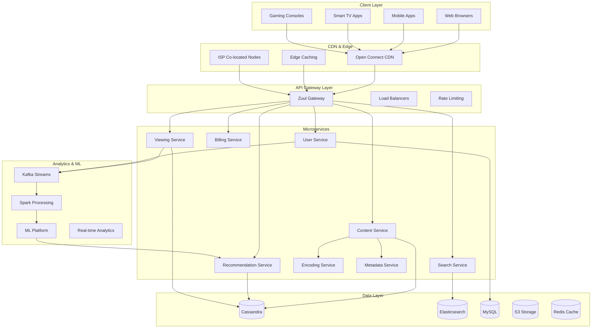

## Content Delivery Network Architecture

### 1. Open Connect CDN

Netflix built its own CDN called Open Connect to handle the massive scale of video streaming globally.

**Open Connect Strategy:**
- **ISP Partnerships**: Direct placement of servers within ISP networks
- **Internet Exchange Points (IXPs)**: Strategic placement at major internet exchange points
- **Embedded CDN**: Servers placed directly in ISP data centers
- **Peering Relationships**: Direct network connections with major ISPs

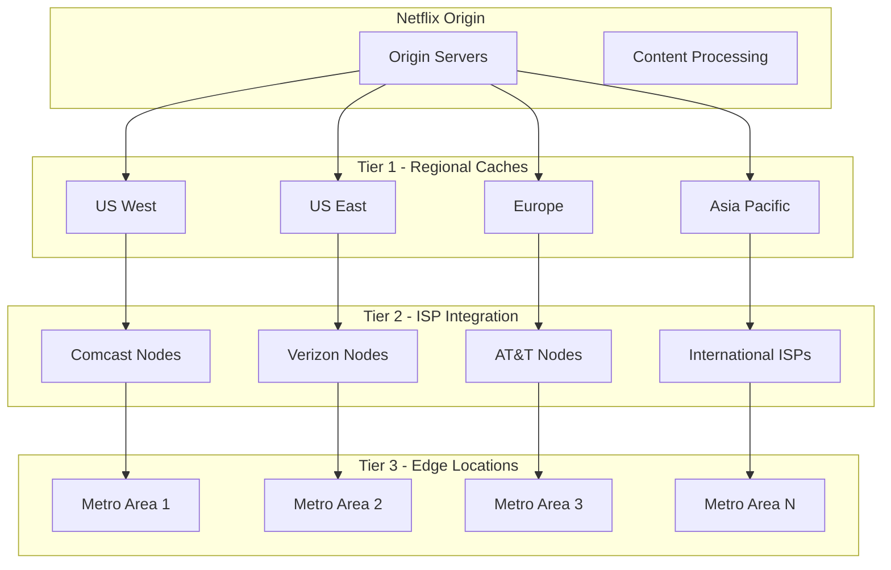

### 2. Adaptive Bitrate Streaming

**Multi-bitrate Encoding Strategy:**
Netflix encodes each title into multiple bitrates and resolutions to adapt to varying network conditions and device capabilities.

**Encoding Ladder:**
- **4K/UHD**: 15.25 Mbps (3840x2160)
- **1080p**: 5.8 Mbps (1920x1080) 
- **720p**: 3.0 Mbps (1280x720)
- **480p**: 1.05 Mbps (854x480)
- **240p**: 0.3 Mbps (426x240)

**Dynamic Adaptation Logic:**
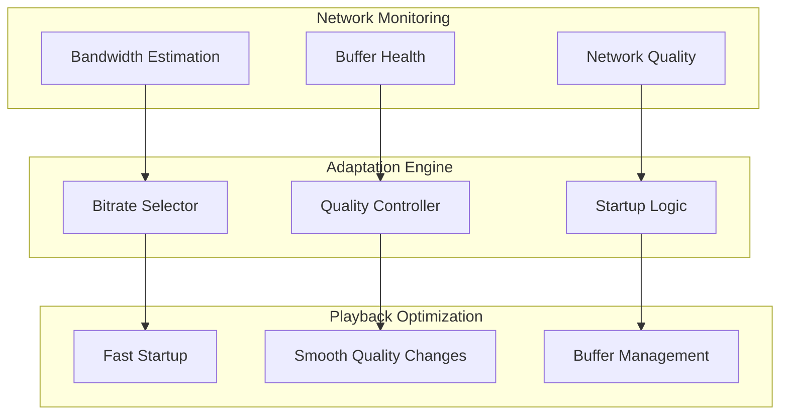

### 3. Content Placement Strategy

**Intelligent Content Placement:**
Netflix uses machine learning to predict which content will be popular in different regions and pre-positions content accordingly.

**Placement Factors:**
- **Historical Viewing Patterns**: Past popularity in similar demographics
- **Content Similarity**: Placement based on similar content performance  
- **Geographic Preferences**: Regional and cultural content preferences
- **Trending Analysis**: Real-time popularity trends
- **Seasonal Patterns**: Holiday and seasonal viewing behaviors

## Microservices Architecture

### 1. Service Decomposition Strategy

Netflix pioneered many microservices patterns and has over 700+ microservices in production.

**Domain-Driven Service Boundaries:**
- **User Domain**: Authentication, profiles, preferences
- **Content Domain**: Metadata, catalog, search
- **Viewing Domain**: Playback, progress tracking, history
- **Recommendation Domain**: ML models, personalization
- **Billing Domain**: Subscriptions, payments, plans

**Service Communication Patterns:**
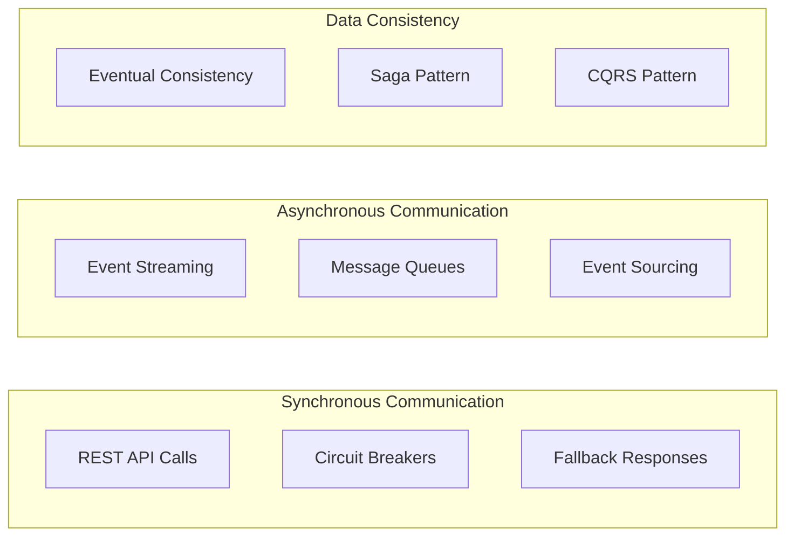

### 2. Resilience Engineering

**Chaos Engineering:**
Netflix invented Chaos Engineering to proactively test system resilience.

**Chaos Tools:**
- **Chaos Monkey**: Randomly terminates service instances
- **Chaos Gorilla**: Simulates entire availability zone failures
- **Chaos Kong**: Simulates entire region failures
- **Latency Monkey**: Introduces artificial latency
- **FIT (Failure Injection Testing)**: Controlled failure injection

**Resilience Patterns:**
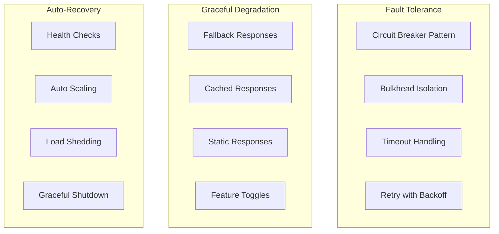

## Recommendation System Architecture

### 1. Multi-Algorithm Approach

Netflix uses multiple recommendation algorithms working together to provide personalized content suggestions.

**Recommendation Algorithms:**
- **Collaborative Filtering**: User-based and item-based similarity
- **Content-Based Filtering**: Genre, actors, director preferences
- **Matrix Factorization**: Latent factor models for user-item interactions
- **Deep Learning**: Neural networks for complex pattern recognition
- **Trending Algorithm**: Popular content with temporal decay
- **Diversity Injection**: Ensuring recommendation variety

**Recommendation Pipeline:**
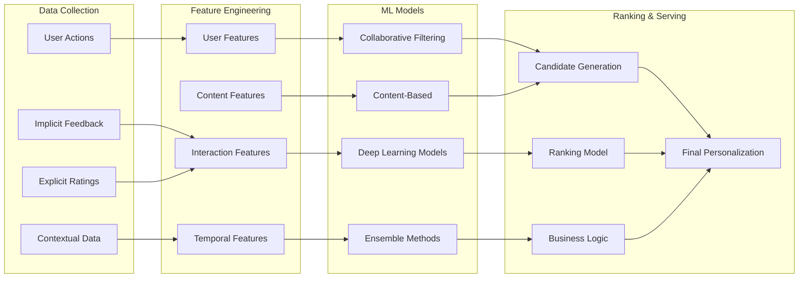

### 2. Real-Time Personalization

**Online Learning System:**
- **Stream Processing**: Real-time event processing with Apache Kafka
- **Feature Updates**: Immediate incorporation of user interactions
- **Model Serving**: Low-latency model inference
- **A/B Testing**: Continuous experimentation with recommendation strategies

**Personalization Layers:**
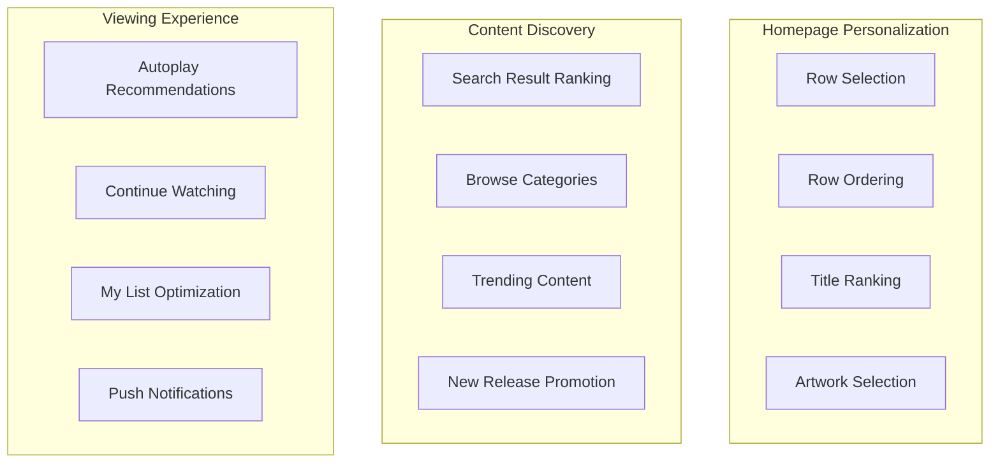

## Data Architecture and Analytics

### 1. Big Data Pipeline

**Data Flow Architecture:**
Netflix processes petabytes of data daily from various sources to power recommendations, optimize streaming, and improve user experience.

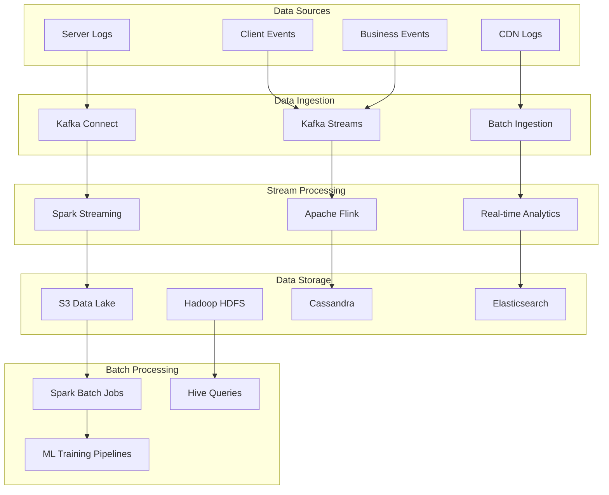

### 2. Machine Learning Platform

**ML Infrastructure:**
Netflix built a comprehensive ML platform to support hundreds of ML use cases across the organization.

**ML Platform Components:**
- **Feature Store**: Centralized feature management and serving
- **Model Training**: Distributed training with TensorFlow and PyTorch
- **Model Serving**: High-performance model inference
- **Experiment Management**: A/B testing and experimentation platform
- **Model Monitoring**: Performance tracking and drift detection

**ML Use Cases:**
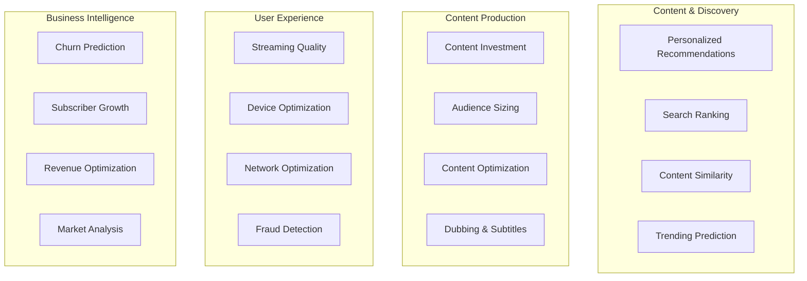

## Content Processing and Encoding

### 1. Content Ingestion Pipeline

**Content Workflow:**
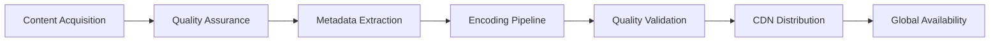

**Encoding Strategy:**
- **Per-Title Encoding**: Optimized encoding parameters for each title
- **Dynamic Optimizer**: ML-driven encoding optimization
- **Quality Metrics**: VMAF (Video Multi-method Assessment Fusion)
- **Codec Selection**: AV1, HEVC, H.264 based on device support
- **HDR Processing**: HDR10, Dolby Vision support

### 2. Content Metadata Management

**Metadata Architecture:**
- **Content Ontology**: Standardized content categorization
- **Multilingual Support**: Localized metadata for global audience
- **Rich Metadata**: Cast, crew, genres, themes, mood
- **Dynamic Metadata**: Real-time updates based on viewing patterns
- **Metadata APIs**: Consistent metadata access across services

## Global Infrastructure and Scaling

### 1. Multi-Region Architecture

**Regional Deployment Strategy:**
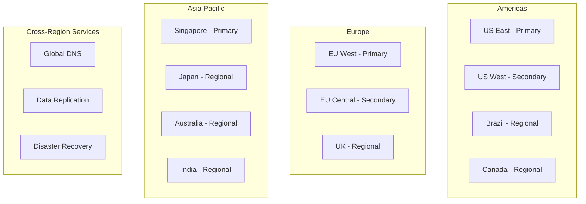

**Regional Considerations:**
- **Data Sovereignty**: Compliance with local data regulations
- **Content Licensing**: Region-specific content availability
- **Network Topology**: Optimized routing for each region
- **Edge Locations**: Strategic CDN placement
- **Disaster Recovery**: Cross-region failover capabilities

### 2. Auto-Scaling Strategy

**Scaling Dimensions:**
- **Horizontal Scaling**: Automatic instance provisioning
- **Vertical Scaling**: Dynamic resource allocation
- **Geographic Scaling**: Regional capacity management
- **Predictive Scaling**: ML-driven capacity planning
- **Event-Driven Scaling**: Scaling for content releases and events

**Scaling Triggers:**
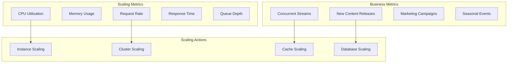

## Security and Content Protection

### 1. Content Security Architecture

**Multi-Layered Content Protection:**
- **DRM (Digital Rights Management)**: Widevine, PlayReady, FairPlay
- **Content Encryption**: End-to-end encrypted content delivery
- **Watermarking**: Forensic watermarking for piracy tracking
- **Geo-blocking**: Regional content access controls
- **Device Authentication**: Trusted device verification

**Security Measures:**
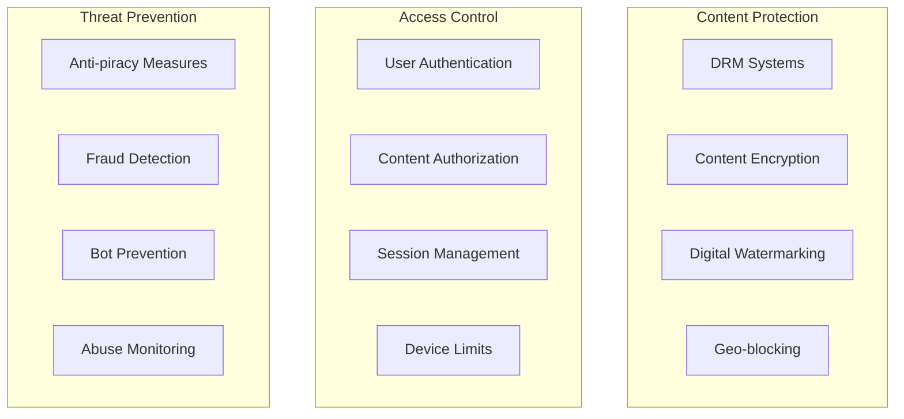

### 2. Platform Security

**Security Infrastructure:**
- **Zero Trust Architecture**: Never trust, always verify
- **Identity and Access Management**: Centralized IAM system
- **Network Security**: VPC isolation and security groups
- **Data Security**: Encryption at rest and in transit
- **Compliance**: SOC 2, ISO 27001, PCI DSS compliance

## Performance Optimization

### 1. Streaming Performance

**Optimization Strategies:**
- **Prefetching**: Intelligent content pre-loading
- **Caching**: Multi-layer caching strategy
- **Connection Optimization**: HTTP/2, connection pooling
- **Compression**: Efficient video and audio compression
- **Network Path Optimization**: BGP optimization and peering

**Performance Metrics:**
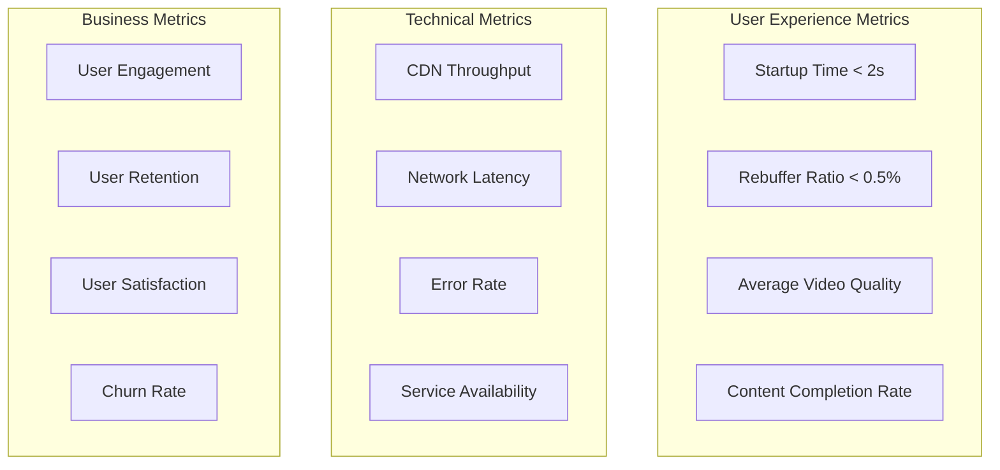

### 2. Global Performance Strategy

**Regional Optimization:**
- **Content Pre-positioning**: Predictive content placement
- **Network Optimization**: ISP partnership and peering
- **Device Optimization**: Platform-specific optimizations
- **Bandwidth Adaptation**: Dynamic quality adjustment
- **Edge Computing**: Processing at edge locations

## Related Case Studies
- See [YouTube](youtube.md) for video platform architecture and global CDN
- See [Amazon](amazon.md) for microservices architecture and AWS infrastructure
- See [Spotify](spotify.md) for recommendation systems and audio streaming (if available)
- See [Disney+](disney.md) for content delivery and global scaling (if available)

## Challenges and Trade-offs

### 1. Technical Challenges

**Content Delivery Challenges:**
- **Global Scale**: Delivering content to 230M+ users simultaneously
- **Quality vs Bandwidth**: Balancing video quality with network limitations
- **Latency Minimization**: Reducing startup time and buffering
- **Device Fragmentation**: Supporting thousands of device types
- **Network Variability**: Adapting to diverse network conditions globally

**Architecture Trade-offs:**
- **Consistency vs Availability**: Eventual consistency for better availability
- **Centralization vs Distribution**: Balancing global consistency with local performance
- **Cost vs Performance**: Optimizing infrastructure costs while maintaining quality
- **Innovation vs Stability**: Rapid feature development vs system reliability

### 2. Business Challenges

**Content and Market Challenges:**
- **Content Licensing**: Complex regional licensing agreements
- **Content Production**: Balancing original vs licensed content
- **Global Expansion**: Adapting to local markets and regulations
- **Competition**: Competing with global and regional streaming services
- **Personalization vs Privacy**: Balancing personalization with user privacy

**Operational Challenges:**
- **24/7 Operations**: Global audience requiring constant availability
- **Rapid Growth**: Scaling infrastructure for subscriber growth
- **Cost Management**: Optimizing CDN and cloud infrastructure costs
- **Talent Acquisition**: Hiring top engineering talent globally

## Future Evolution and Innovation

### 1. Technology Trends

**Emerging Technologies:**
- **5G Integration**: Ultra-low latency streaming experiences
- **Edge Computing**: Processing closer to users for reduced latency
- **AI/ML Advancement**: More sophisticated recommendation algorithms
- **Interactive Content**: Choose-your-own-adventure and gaming integration
- **VR/AR Streaming**: Immersive content delivery

**Technical Innovation Areas:**
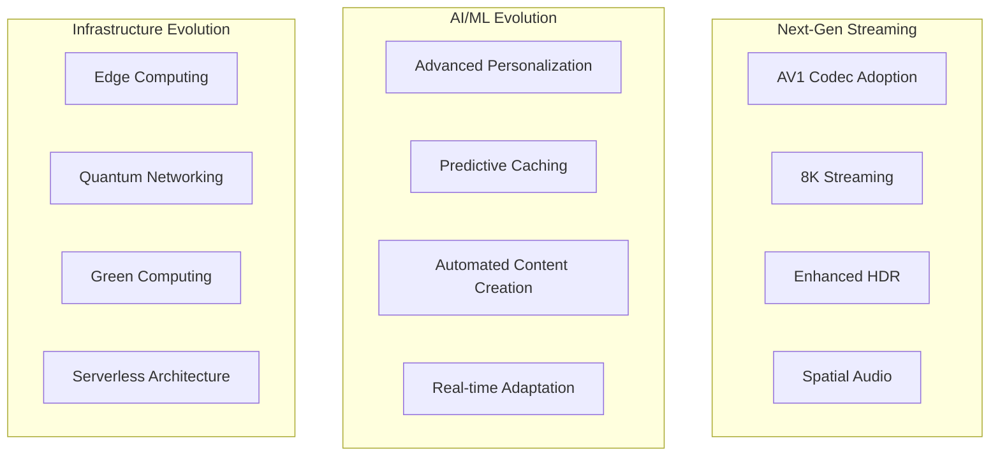

### 2. Market Evolution

**Strategic Directions:**
- **Global Expansion**: Entering new markets with localized content
- **Content Diversification**: Gaming, live events, sports streaming
- **Platform Integration**: Deeper integration with smart home devices
- **Social Features**: Enhanced social viewing experiences
- **Creator Economy**: Direct creator monetization platforms

## Conclusion

Netflix's architecture represents one of the most sophisticated examples of global-scale distributed systems engineering. The platform successfully handles the complex challenges of content delivery, personalization, and user experience across diverse global markets through innovative architectural patterns and engineering practices.

Key architectural achievements include pioneering microservices architecture, building a global CDN network, developing advanced recommendation systems, and implementing comprehensive chaos engineering practices. Netflix's approach to system design emphasizes resilience, scalability, and continuous innovation while maintaining exceptional user experience.

The architecture continues to evolve with emerging technologies and changing market demands, setting industry standards for streaming platforms and distributed system design. Netflix's engineering culture and architectural principles have influenced countless organizations building large-scale distributed systems.