# Slack System Architecture

## Overview

Slack is a cloud-based team collaboration and business communication platform serving over 10 million daily active users across 750,000+ organizations globally. As a comprehensive workspace hub, Slack combines real-time messaging, file sharing, workflow automation, and extensive third-party integrations to create a unified platform for business communication and productivity.

## System Requirements

### Functional Requirements
- Real-time messaging and threaded conversations
- Channel-based communication (public and private)
- Direct messaging (1-on-1 and group DMs)
- File sharing and collaborative document editing
- Voice and video calls with screen sharing
- Search across all messages and files
- Integration with 2,500+ third-party apps
- Workflow automation and bot platform
- Message editing, deletion, and reactions
- Notification management and preferences
- Mobile, desktop, and web synchronization
- Enterprise security and compliance features

### Non-Functional Requirements
- **Scale**: 10M+ daily active users, billions of messages annually
- **Availability**: 99.99% uptime SLA for Enterprise plans
- **Latency**: < 100ms message delivery in optimal conditions
- **Search Performance**: < 500ms for search queries
- **Concurrent Users**: Handle millions of simultaneous connections
- **Data Retention**: Configurable retention policies (enterprise)
- **Security**: Enterprise-grade encryption and compliance
- **Integration Performance**: Handle millions of API calls daily
- **Real-time Sync**: Instant synchronization across all devices

## High-Level Architecture

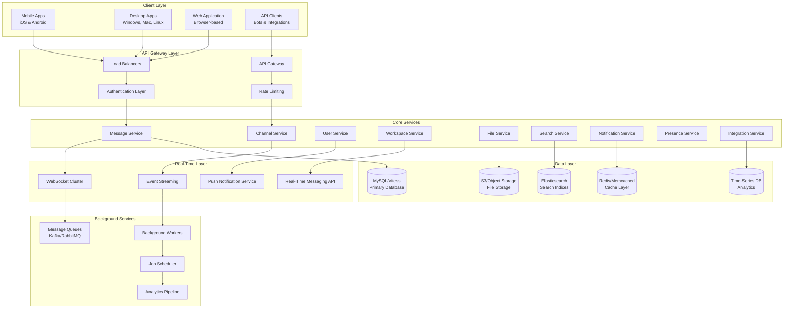

## Core Architecture Principles

### 1. Channel-Based Architecture

Unlike traditional messaging platforms, Slack organizes communication around channels - persistent chat rooms for team collaboration.

**Channel Types:**
- **Public Channels**: Open to all workspace members
- **Private Channels**: Invitation-only channels
- **Shared Channels**: Cross-workspace collaboration
- **Direct Messages**: 1-on-1 and group conversations

**Channel Architecture:**
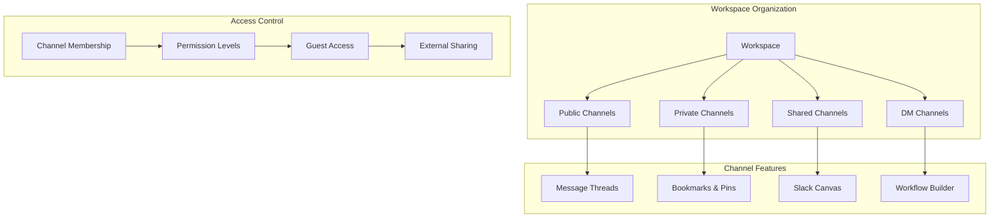

### 2. Multi-Tenancy Architecture

Slack uses a sophisticated multi-tenant architecture where each workspace is logically isolated while sharing infrastructure.

**Multi-Tenancy Benefits:**
- **Resource Efficiency**: Shared infrastructure across workspaces
- **Data Isolation**: Strong data separation between organizations
- **Scalability**: Efficient scaling for millions of workspaces
- **Cost Optimization**: Reduced per-workspace operational costs
- **Feature Parity**: Consistent features across all workspaces

**Tenant Isolation Strategy:**
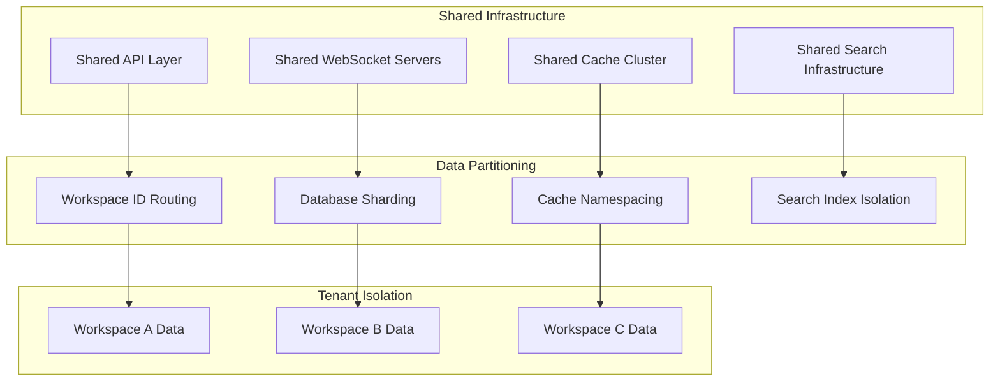

## Real-Time Messaging Architecture

### 1. WebSocket Infrastructure

Slack maintains persistent WebSocket connections for real-time message delivery and presence updates.

**Real-Time Features:**
- **Instant Message Delivery**: Messages appear instantly across all devices
- **Typing Indicators**: Real-time typing status
- **Presence Updates**: Online/offline/away status
- **Read Receipts**: Message read status tracking
- **Live Reactions**: Real-time emoji reactions

**WebSocket Connection Management:**
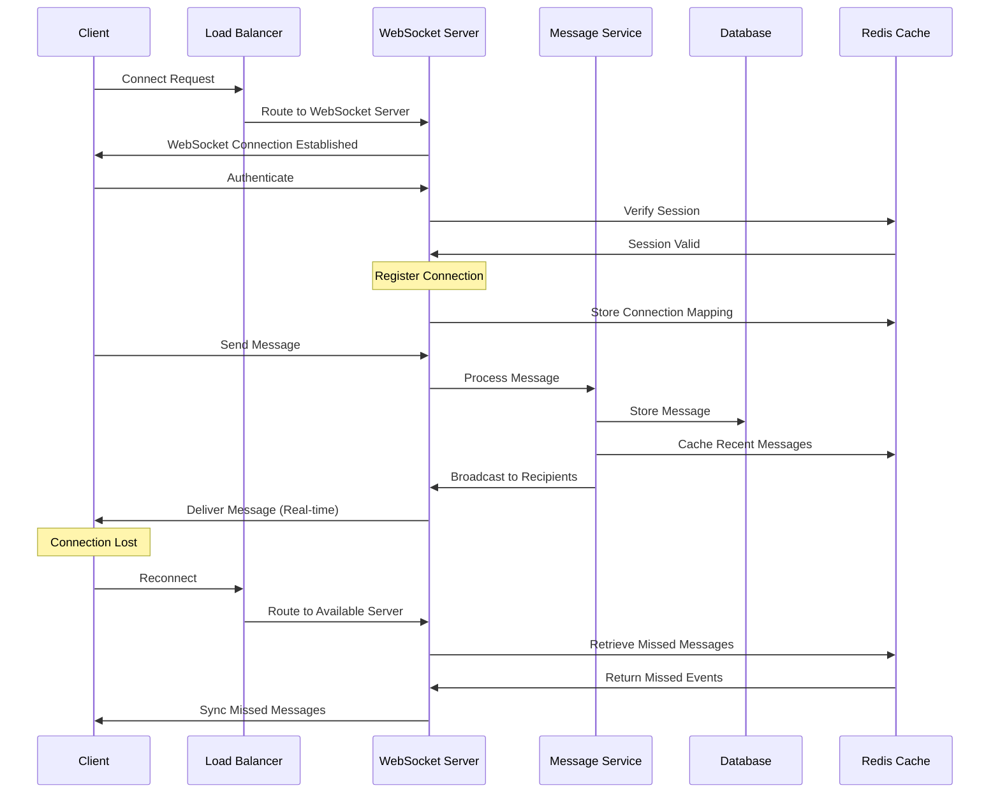

### 2. Event-Driven Architecture

Slack uses event-driven patterns to handle real-time updates and maintain system consistency.

**Event Types:**
- **Message Events**: New messages, edits, deletions
- **Channel Events**: Channel creation, archival, membership changes
- **User Events**: Status changes, profile updates
- **Reaction Events**: Emoji reactions added/removed
- **File Events**: File uploads, shares, comments

**Event Processing Flow:**
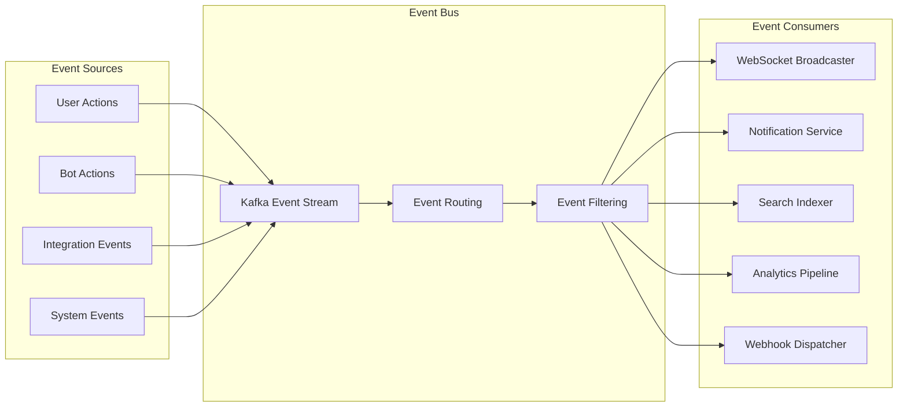

## Search Architecture

### 1. Enterprise Search System

Slack's search is one of its most powerful features, allowing users to find any message, file, or conversation instantly.

**Search Capabilities:**
- **Full-Text Search**: Search across all messages and files
- **Filtered Search**: Filter by channel, date, user, file type
- **Search Modifiers**: Advanced search syntax with operators
- **Recent Results**: Prioritize recent and relevant content
- **Contextual Search**: Search within specific contexts

**Search Infrastructure:**
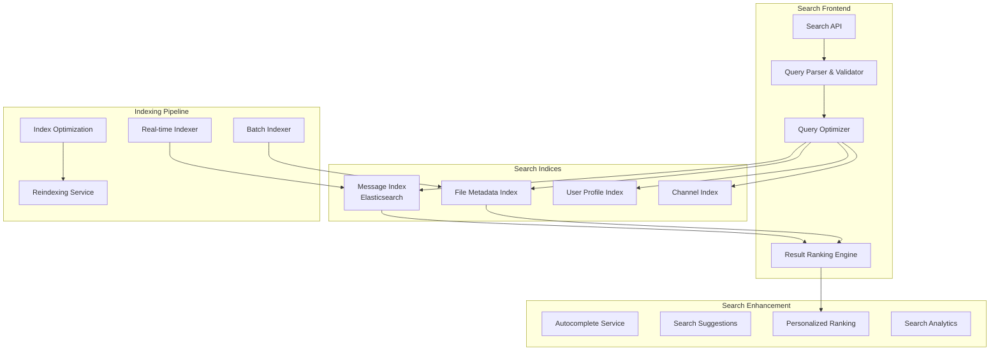

### 2. Search Performance Optimization

**Optimization Strategies:**
- **Sharded Indices**: Distribute search load across multiple shards
- **Caching**: Cache frequent search queries and results
- **Incremental Indexing**: Real-time index updates for new content
- **Query Optimization**: Optimize expensive search queries
- **Result Pagination**: Efficient pagination for large result sets

## Integration and App Platform

### 1. Integration Ecosystem

Slack's integration platform is one of its key differentiators, with 2,500+ apps and integrations.

**Integration Types:**
- **Apps**: Full-featured applications (Jira, Google Drive, GitHub)
- **Bots**: Automated assistants and workflows
- **Webhooks**: Incoming and outgoing webhooks
- **Slash Commands**: Custom commands for actions
- **Workflow Builder**: No-code automation tools

**Integration Architecture:**
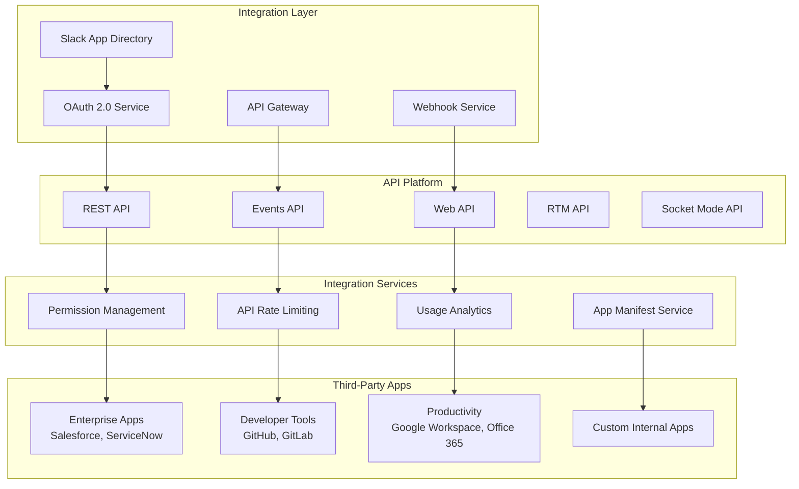

### 2. Workflow Automation

**Workflow Builder Features:**
- **No-Code Automation**: Create workflows without coding
- **Trigger-Action Model**: Event-based automation
- **Form Builder**: Create forms for data collection
- **Approval Processes**: Multi-step approval workflows
- **Integration Chains**: Connect multiple apps in workflows

## File Storage and Sharing

### 1. File Management System

Slack handles millions of file uploads daily with sophisticated file management.

**File Features:**
- **File Upload**: Support for 1000+ file types
- **File Previews**: In-app preview for common formats
- **File Search**: Search within file content
- **File Sharing**: Share across channels and DMs
- **Version Control**: Track file versions and changes
- **External File Links**: Integration with Google Drive, Dropbox

**File Processing Pipeline:**
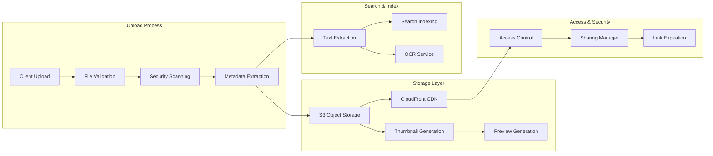

### 2. File Security and Compliance

**Security Features:**
- **Encryption**: Encryption at rest and in transit
- **Access Controls**: Granular file access permissions
- **DLP Integration**: Data Loss Prevention scanning
- **Audit Logs**: Complete file access audit trails
- **Retention Policies**: Automated file retention and deletion

## Voice and Video Communication

### 1. Slack Huddles and Calls

Slack provides integrated audio and video calling within the platform.

**Calling Features:**
- **Huddles**: Lightweight audio rooms in channels
- **Video Calls**: 1-on-1 and group video calls
- **Screen Sharing**: Share screen during calls
- **Call Recording**: Record important meetings
- **External Integrations**: Zoom, Microsoft Teams integration

**Call Architecture:**
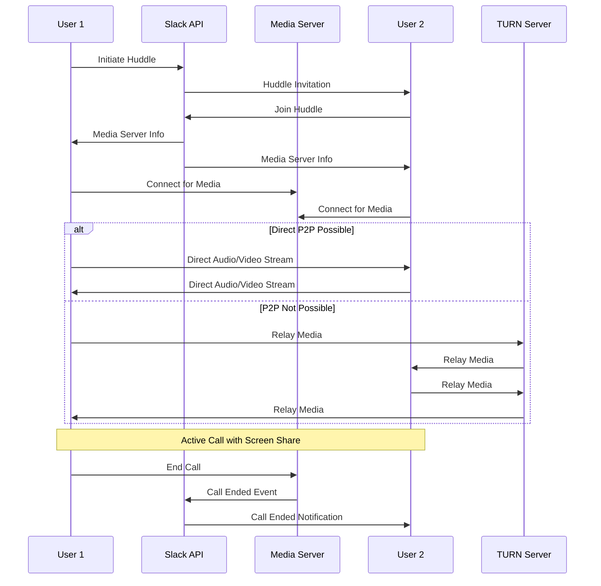

### 2. Enterprise Communication

**Enterprise Features:**
- **Slack Connect**: Cross-organization channels
- **External Collaboration**: Collaborate with partners and clients
- **Guest Access**: Controlled access for external users
- **Compliance**: Call recording and archival for compliance

## Database Architecture

### 1. Database Sharding Strategy

Slack uses MySQL with Vitess for horizontal scaling across millions of workspaces.

**Sharding Approach:**
- **Workspace-Based Sharding**: Primary sharding key is workspace ID
- **Vertical Partitioning**: Separate tables for different entity types
- **Read Replicas**: Multiple read replicas per shard
- **Cross-Shard Queries**: Optimized for workspace-scoped queries

**Database Architecture:**
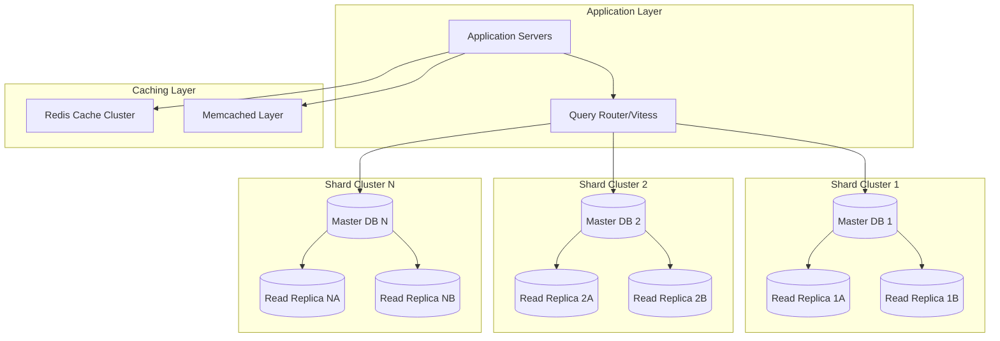

### 2. Data Consistency and Replication

**Consistency Strategy:**
- **Strong Consistency**: Within workspace operations
- **Eventual Consistency**: Cross-workspace operations
- **Multi-Master Replication**: For high availability
- **Conflict Resolution**: Automated conflict resolution
- **Backup and Recovery**: Continuous backups with point-in-time recovery

## Notification System

### 1. Multi-Channel Notifications

Slack delivers notifications across multiple channels based on user preferences.

**Notification Channels:**
- **In-App Notifications**: Real-time in-app alerts
- **Push Notifications**: Mobile and desktop push
- **Email Notifications**: Digest emails for missed messages
- **SMS Notifications**: Critical alerts via SMS
- **Browser Notifications**: Web browser notifications

**Notification Architecture:**
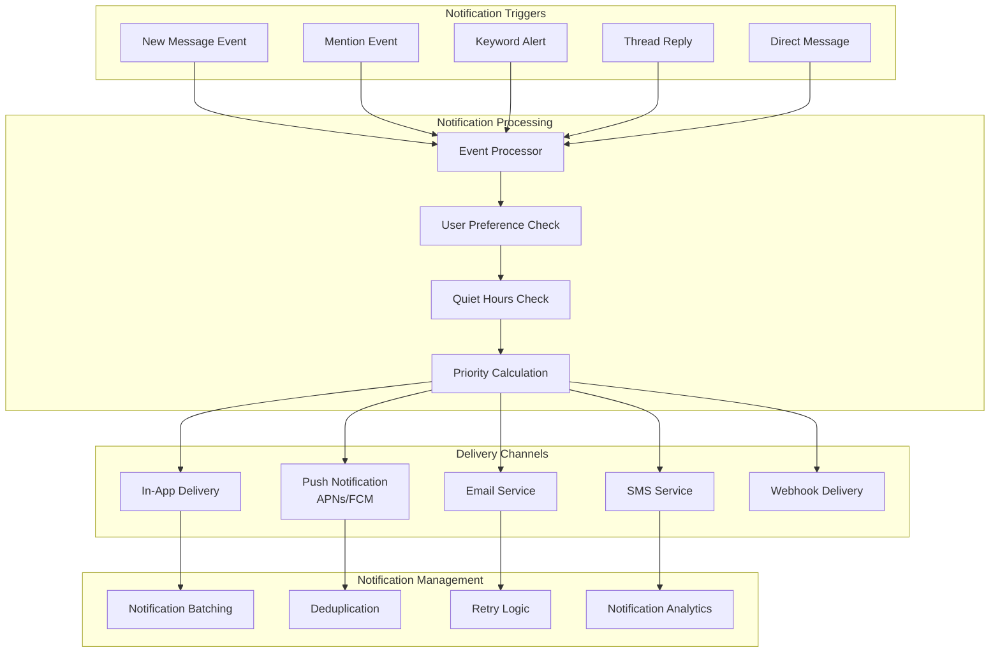

### 2. Smart Notification Logic

**Notification Intelligence:**
- **Priority Inbox**: ML-based message prioritization
- **Notification Batching**: Group related notifications
- **Do Not Disturb**: Respect quiet hours
- **Thread Summarization**: Summarize thread updates
- **Read Status Sync**: Sync read status across devices

## Security and Compliance

### 1. Enterprise Security Architecture

Slack implements comprehensive security measures for enterprise customers.

**Security Layers:**
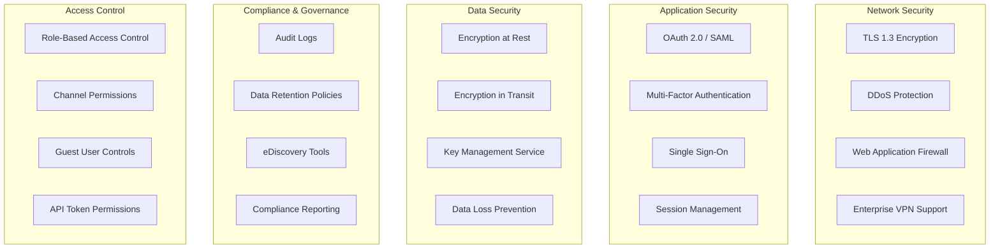

### 2. Compliance Standards

**Compliance Certifications:**
- **SOC 2 Type II**: Security and availability controls
- **ISO 27001**: Information security management
- **HIPAA**: Healthcare data compliance (Enterprise Grid)
- **GDPR**: European data protection compliance
- **FedRAMP**: US government compliance (Slack GovSlack)

## Performance Optimization

### 1. Caching Strategy

Slack employs multi-layered caching for optimal performance.

**Caching Layers:**
- **Browser Cache**: Client-side caching for static assets
- **CDN Cache**: Global CDN for media and files
- **Redis Cache**: Application-level caching for hot data
- **Database Query Cache**: MySQL query result caching
- **Application Memory Cache**: In-memory caching within services

**Cache Hierarchy:**
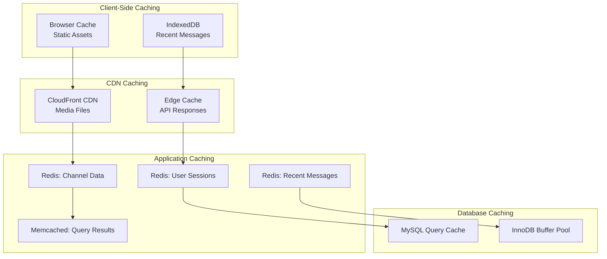

### 2. Performance Metrics

**Key Performance Indicators:**
- **Message Latency**: P50, P95, P99 latency tracking
- **Search Response Time**: Average and percentile metrics
- **API Response Time**: Per-endpoint performance monitoring
- **WebSocket Connection Stability**: Connection drop rates
- **File Upload Speed**: Upload throughput metrics

## Scalability Architecture

### 1. Horizontal Scaling

**Scaling Dimensions:**
- **Workspace Scaling**: Add new workspaces without performance impact
- **User Scaling**: Scale to millions of concurrent users
- **Message Throughput**: Handle billions of messages
- **Storage Scaling**: Unlimited message and file storage
- **Integration Scaling**: Support millions of API calls

**Scaling Strategy:**
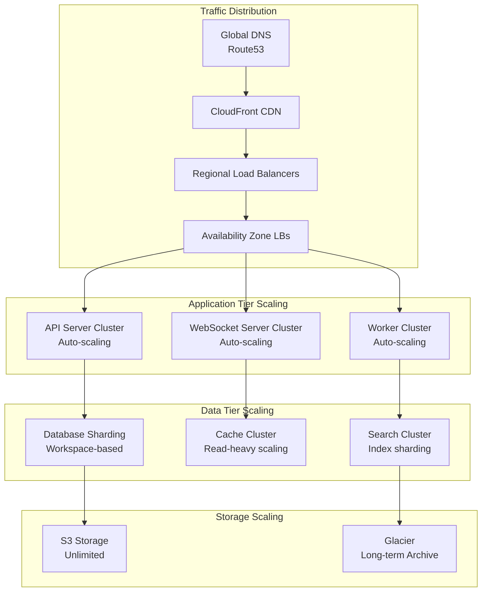

### 2. Global Distribution

**Geographic Distribution:**
- **Multi-Region Deployment**: Deployed across AWS regions globally
- **Data Residency**: Support for data residency requirements
- **Edge Locations**: CDN edge locations worldwide
- **Disaster Recovery**: Multi-region disaster recovery
- **Active-Active**: Active-active deployment for high availability

## Analytics and Monitoring

### 1. Observability Stack

**Monitoring Components:**
- **Application Metrics**: Datadog for application monitoring
- **Infrastructure Metrics**: CloudWatch for AWS infrastructure
- **Distributed Tracing**: Trace requests across microservices
- **Log Aggregation**: Centralized logging with Splunk
- **Error Tracking**: Real-time error monitoring and alerting

**Observability Architecture:**
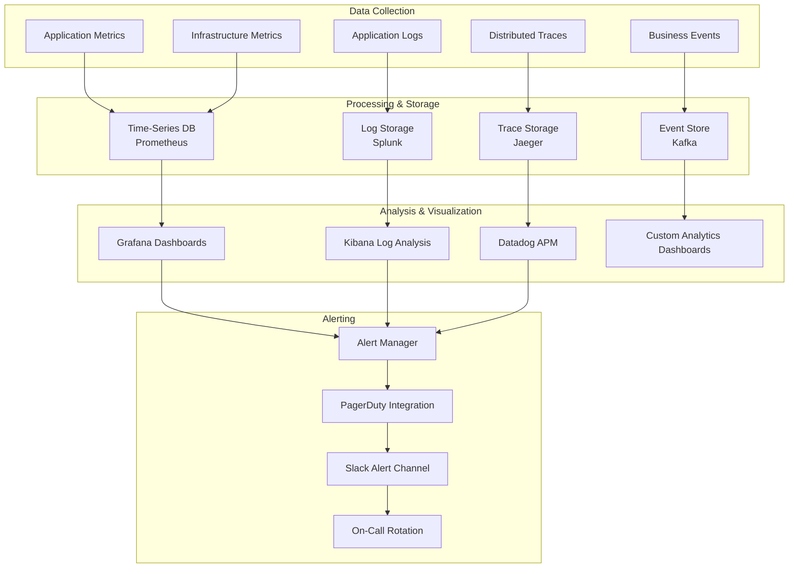

### 2. Business Analytics

**Analytics Capabilities:**
- **Usage Analytics**: Track workspace and user engagement
- **Message Analytics**: Analyze communication patterns
- **Integration Analytics**: Monitor third-party app usage
- **Performance Analytics**: Track system performance metrics
- **Revenue Analytics**: Monitor subscription and billing metrics

## Enterprise Grid Architecture

### 1. Multi-Workspace Management

Enterprise Grid provides advanced features for large organizations with multiple workspaces.

**Enterprise Grid Features:**
- **Centralized Administration**: Unified management dashboard
- **Cross-Workspace Channels**: Shared channels across workspaces
- **Organization-Wide Search**: Search across all workspaces
- **Unified Billing**: Single billing for all workspaces
- **Enterprise Compliance**: Advanced security and compliance tools

**Enterprise Grid Architecture:**
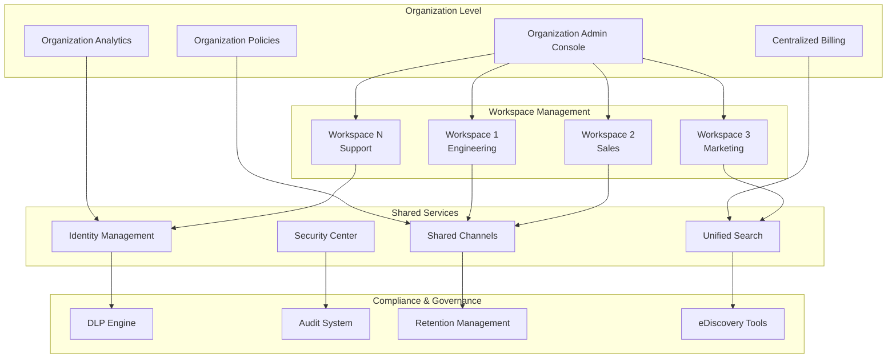

### 2. Enterprise Security Features

**Advanced Security:**
- **Enterprise Key Management (EKM)**: Customer-controlled encryption keys
- **Data Loss Prevention (DLP)**: Prevent sensitive data leaks
- **Advanced Identity Management**: SAML, SCIM provisioning
- **Session Management**: Advanced session control and monitoring
- **Compliance Exports**: Automated compliance reporting

## Mobile Architecture

### 1. Mobile Application Design

Slack's mobile apps provide a seamless experience with offline capabilities.

**Mobile Features:**
- **Offline Mode**: Access cached messages offline
- **Push Notifications**: Rich push notifications with actions
- **Background Sync**: Sync messages in background
- **Media Optimization**: Optimized media loading for mobile
- **Battery Optimization**: Efficient battery usage

**Mobile Sync Architecture:**
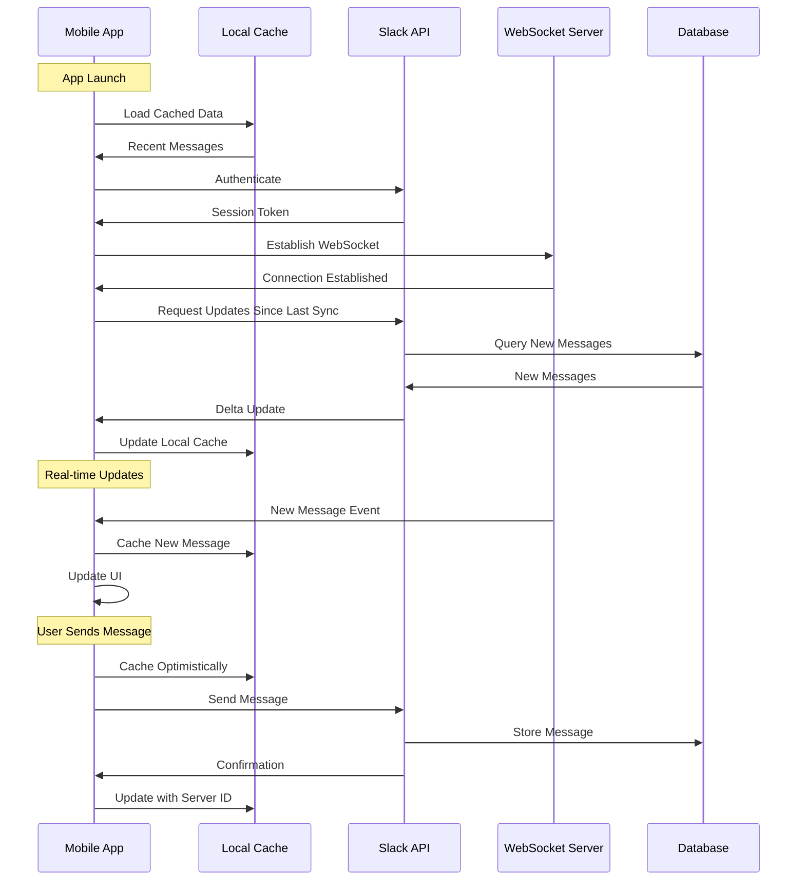

### 2. Mobile Performance Optimization

**Optimization Strategies:**
- **Lazy Loading**: Load content as needed
- **Image Compression**: Automatic image optimization
- **Delta Sync**: Only sync changes, not full data
- **Prefetching**: Prefetch likely-to-be-accessed content
- **Network Adaptation**: Adapt to network quality

## Disaster Recovery and High Availability

### 1. High Availability Architecture

**HA Components:**
- **Multi-AZ Deployment**: Deployed across availability zones
- **Active-Active Configuration**: Active in multiple regions
- **Automated Failover**: Automatic failover for critical services
- **Health Checks**: Continuous health monitoring
- **Circuit Breakers**: Prevent cascade failures

**High Availability Setup:**
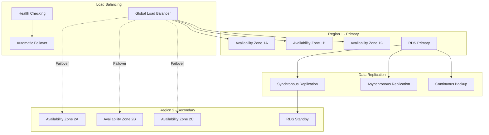

### 2. Disaster Recovery Plan

**Recovery Strategies:**
- **RPO (Recovery Point Objective)**: < 5 minutes data loss
- **RTO (Recovery Time Objective)**: < 30 minutes downtime
- **Backup Strategy**: Continuous backups with point-in-time recovery
- **Failover Testing**: Regular disaster recovery drills
- **Data Restoration**: Automated restoration procedures

## Related Case Studies

- See [Telegram](telegram.md) for alternative messaging architecture with custom protocol
- See [WhatsApp](whatsapp.md) for mobile-first messaging with E2E encryption
- See [Discord](discord.md) for community-focused real-time communication (if available)
- See [Microsoft Teams](microsoft-teams.md) for enterprise collaboration platform (if available)
- Compare with [Zoom](zoom.md) for video conferencing architecture (if available)

## Challenges and Trade-offs

### 1. Technical Challenges

**Architecture Trade-offs:**
- **Real-time vs Scalability**: Maintaining real-time experience at massive scale
- **Search vs Storage**: Balancing powerful search with storage costs
- **Features vs Performance**: Adding features without degrading performance
- **Multi-tenancy vs Isolation**: Sharing infrastructure while ensuring isolation
- **Flexibility vs Complexity**: Rich integrations increase system complexity

**Performance Challenges:**
- **WebSocket Scaling**: Maintaining millions of persistent connections
- **Search Performance**: Fast search across billions of messages
- **File Storage**: Managing unlimited file storage economically
- **Database Sharding**: Efficient cross-shard queries
- **Cache Coherence**: Maintaining cache consistency across clusters

### 2. Business and Operational Challenges

**Operational Challenges:**
- **Enterprise Sales**: Complex enterprise sales cycles
- **Competition**: Competing with Microsoft Teams, Google Chat
- **Pricing Strategy**: Balancing free and paid tiers
- **Data Residency**: Meeting international data residency requirements
- **Support Scaling**: Supporting millions of users and organizations

**Market Challenges:**
- **Market Saturation**: Mature collaboration tools market
- **Vendor Lock-in Concerns**: Organizations wary of platform dependency
- **Integration Complexity**: Managing 2,500+ integrations
- **User Adoption**: Driving adoption within organizations
- **Security Perception**: Addressing enterprise security concerns

## Innovation and Future Directions

### 1. AI and Machine Learning

**AI-Powered Features:**
- **Smart Replies**: AI-suggested responses
- **Message Summarization**: Summarize long threads
- **Priority Inbox**: ML-based message prioritization
- **Sentiment Analysis**: Understand team sentiment
- **Automated Workflows**: AI-powered automation suggestions

### 2. Platform Evolution

**Future Innovations:**
- **Native Video Platform**: Enhanced video capabilities
- **Advanced Canvas**: More collaborative document features
- **Workflow Marketplace**: Expanded workflow automation
- **Voice AI**: Voice-based commands and transcription
- **Extended Reality**: VR/AR collaboration features
- **Blockchain Integration**: Decentralized identity and data

## Performance Metrics and SLAs

### 1. Service Level Objectives

**SLO Targets:**
- **Availability**: 99.99% uptime for Enterprise Grid
- **Message Latency**: P95 < 100ms, P99 < 500ms
- **Search Latency**: P95 < 500ms
- **API Response Time**: P95 < 200ms
- **File Upload**: > 5 MB/s average upload speed

### 2. Performance Monitoring

**Key Metrics:**
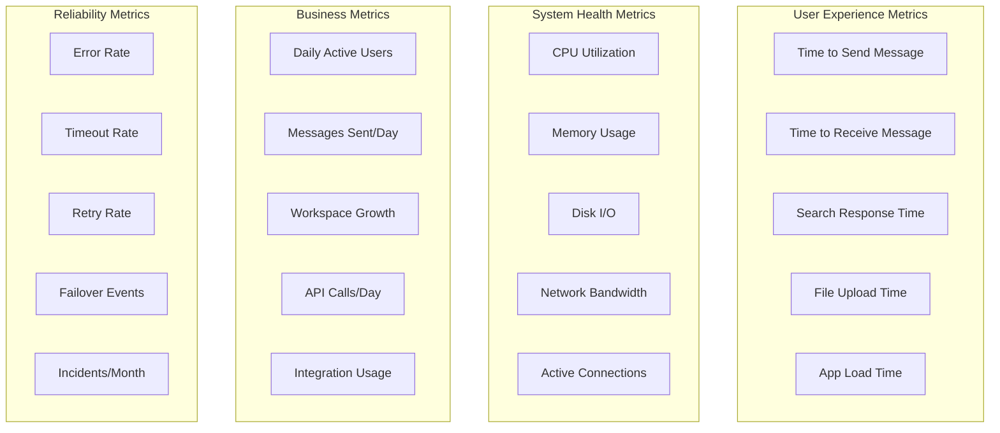

## Cost Optimization

### 1. Infrastructure Cost Management

**Cost Optimization Strategies:**
- **Auto-scaling**: Scale resources based on demand
- **Reserved Instances**: Use RIs for predictable workloads
- **Spot Instances**: Use spot instances for batch jobs
- **Storage Tiering**: Move cold data to cheaper storage
- **CDN Optimization**: Optimize CDN usage and costs

### 2. Operational Efficiency

**Efficiency Measures:**
- **Resource Right-sizing**: Optimize instance sizes
- **Database Optimization**: Query optimization and indexing
- **Caching Strategy**: Reduce database load through caching
- **Compression**: Compress data in transit and at rest
- **Deduplication**: File and data deduplication

## Lessons Learned

### 1. Architecture Principles

**Key Design Decisions:**
- **Channel-Based Model**: Organizing communication around channels proved highly effective
- **Multi-tenancy**: Efficient multi-tenant architecture enables massive scale
- **Integration Platform**: Open API and app platform drives ecosystem growth
- **Search Investment**: Powerful search is critical for productivity
- **Mobile-First**: Mobile experience must be first-class, not an afterthought

### 2. Scaling Insights

**Successful Strategies:**
- **Workspace Sharding**: Sharding by workspace provides clean data boundaries
- **WebSocket Management**: Efficient WebSocket handling enables real-time at scale
- **Caching Everywhere**: Multi-layered caching critical for performance
- **Event-Driven Architecture**: Event-driven design enables scalability and flexibility
- **Observability**: Comprehensive monitoring essential for operating at scale

### 3. Business Learnings

**Strategic Insights:**
- **Freemium Model**: Effective freemium model drives adoption
- **Bottom-Up Adoption**: User-driven adoption leads to enterprise sales
- **Integration Ecosystem**: Third-party integrations create network effects
- **Enterprise Features**: Enterprise security and compliance features critical for growth
- **Developer Experience**: Great API and developer experience drives platform adoption

## Best Practices

### 1. Development Practices

**Engineering Best Practices:**
- **Microservices**: Service-oriented architecture for flexibility
- **API-First Design**: Design APIs before implementation
- **Automated Testing**: Comprehensive test coverage
- **Continuous Deployment**: Deploy multiple times per day
- **Feature Flags**: Control feature rollout with feature flags

### 2. Operational Practices

**Operations Best Practices:**
- **Monitoring and Alerting**: Comprehensive observability
- **Incident Management**: Clear incident response procedures
- **Capacity Planning**: Proactive capacity management
- **Security Reviews**: Regular security audits and reviews
- **Performance Testing**: Continuous performance testing

## Conclusion

Slack's architecture represents a sophisticated approach to team collaboration and business communication, successfully scaling to serve millions of users across hundreds of thousands of organizations. The platform's success stems from its channel-based communication model, powerful integration ecosystem, comprehensive search capabilities, and enterprise-grade security and compliance features.

Key architectural achievements include implementing efficient multi-tenant architecture that scales to millions of workspaces, building a real-time messaging system with WebSocket infrastructure, creating a powerful search system across billions of messages, developing a thriving app platform with 2,500+ integrations, and maintaining enterprise-grade security and compliance standards. The platform demonstrates how thoughtful architecture and strong engineering practices can create a highly scalable and reliable collaboration platform.

Slack's architecture continues to evolve with new features like Slack Canvas, enhanced video capabilities, and AI-powered productivity features, while maintaining the core principles of simplicity, speed, and reliability that have made it a leading workplace communication platform. The system serves as an excellent case study in building scalable SaaS platforms, implementing effective multi-tenancy, and creating developer-friendly integration ecosystems.