# Telegram System Architecture

## Overview

Telegram is a cloud-based instant messaging platform that serves over 700 million monthly active users globally. Known for its speed, security features, and unique architecture, Telegram offers both regular chats with server-side encryption and "Secret Chats" with end-to-end encryption, along with powerful features like large group chats, channels, bots, and file sharing.

## System Requirements

### Functional Requirements
- Real-time messaging with cloud synchronization
- Secret chats with end-to-end encryption
- Large group chats (up to 200,000 members)
- Broadcasting channels (unlimited subscribers)
- File sharing (up to 2GB per file)
- Bot platform and API ecosystem
- Multi-device synchronization
- Voice and video calls
- Stories and live streaming
- Message editing and deletion
- Advanced search capabilities

### Non-Functional Requirements
- **Scale**: 700M+ monthly active users, billions of messages daily
- **Speed**: < 50ms message delivery in optimal conditions
- **Availability**: 99.99% uptime globally
- **Storage**: Unlimited cloud storage for users
- **Security**: Multiple encryption layers and security options
- **Performance**: Fast media upload/download globally
- **Reliability**: Message delivery guarantee across devices
- **Global Reach**: Distributed infrastructure worldwide

## High-Level Architecture

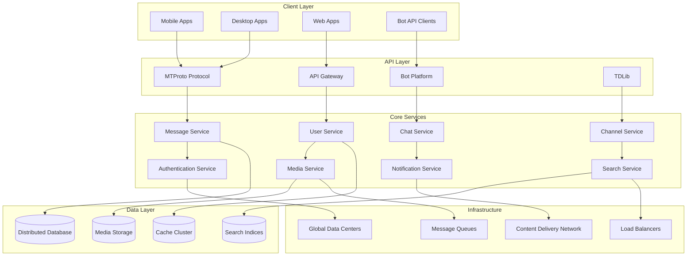

## Core Architecture Principles

### 1. MTProto Protocol

Telegram developed its own protocol called MTProto (Mobile Telegram Protocol) designed for reliable, secure, and efficient messaging.

**MTProto Characteristics:**
- **Custom Binary Protocol**: Optimized for mobile networks
- **Built-in Encryption**: Multiple encryption layers
- **Connection Recovery**: Automatic reconnection and message recovery
- **Multi-Datacenter Support**: Seamless switching between data centers
- **Compression**: Efficient data compression algorithms

**Protocol Stack:**
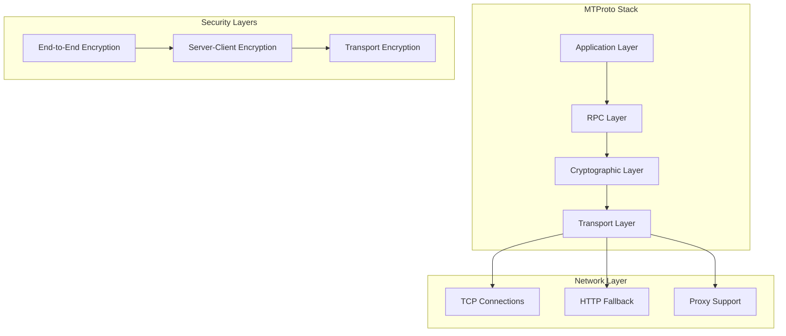

### 2. Cloud-First Architecture

Unlike many messaging platforms, Telegram is designed as a cloud-first service where messages are stored on servers and synchronized across all devices.

**Cloud Benefits:**
- **Multi-Device Sync**: Access messages from any device instantly
- **Unlimited Storage**: No local storage limitations
- **Fast Device Switching**: Instant access from new devices
- **Message History**: Complete message history always available
- **Cross-Platform**: Consistent experience across all platforms

**Synchronization Architecture:**
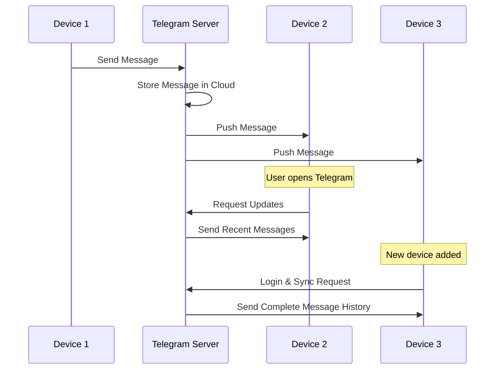

## Dual Encryption Architecture

### 1. Server-Client Encryption (Regular Chats)

Regular Telegram chats use server-client encryption, allowing for cloud storage and advanced features while maintaining security.

**Regular Chat Features:**
- **Cloud Storage**: Messages stored encrypted on Telegram servers
- **Multi-Device Access**: Access from unlimited devices
- **Message Search**: Server-side search across all messages  
- **Large Groups**: Support for massive group chats
- **Bots Integration**: Rich bot ecosystem and API access

**Encryption Flow:**
```mermaid
graph LR
    subgraph "Client Side"
        PLAINTEXT[Original Message]
        CLIENT_ENCRYPT[Client Encryption]
        ENCRYPTED_MSG[Encrypted Message]
    end
    
    subgraph "Server Side"
        SERVER_DECRYPT[Server Decryption]
        SERVER_PROCESS[Message Processing]
        SERVER_ENCRYPT[Server Re-encryption]
    end
    
    subgraph "Target Client"
        TARGET_DECRYPT[Target Decryption]
        TARGET_PLAINTEXT[Delivered Message]
    end
    
    PLAINTEXT --> CLIENT_ENCRYPT
    CLIENT_ENCRYPT --> ENCRYPTED_MSG
    ENCRYPTED_MSG --> SERVER_DECRYPT
    SERVER_DECRYPT --> SERVER_PROCESS
    SERVER_PROCESS --> SERVER_ENCRYPT
    SERVER_ENCRYPT --> TARGET_DECRYPT
    TARGET_DECRYPT --> TARGET_PLAINTEXT
```

### 2. End-to-End Encryption (Secret Chats)

Secret Chats provide end-to-end encryption where only the communicating parties can read the messages.

**Secret Chat Characteristics:**
- **Device-Specific**: Limited to two specific devices
- **Perfect Forward Secrecy**: Keys change with each message
- **Self-Destruct**: Automatic message deletion
- **No Cloud Storage**: Messages not stored on servers
- **Screenshot Detection**: Notification when screenshots are taken (mobile)

**E2E Encryption Process:**
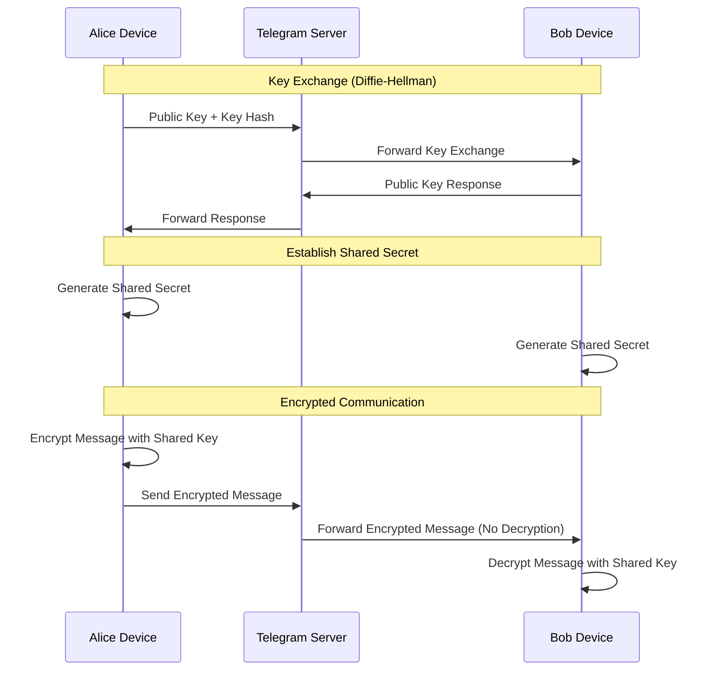

## Messaging Architecture

### 1. Message Delivery System

Telegram's message delivery system is optimized for speed and reliability across different network conditions.

**Delivery Optimization:**
- **Multiple Data Centers**: Route messages through nearest data center
- **Connection Pooling**: Maintain persistent connections for active users
- **Message Queuing**: Server-side queuing for offline users
- **Retry Logic**: Intelligent retry mechanisms for failed deliveries
- **Network Adaptation**: Adapt to different network conditions

**Message Flow Architecture:**
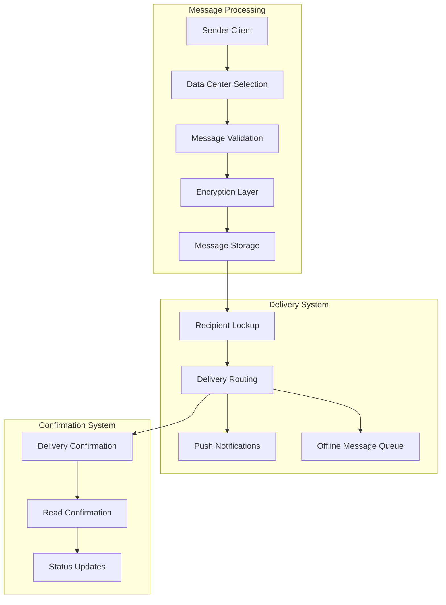

### 2. Large Group Management

Telegram supports some of the largest group chats in the messaging industry with sophisticated group management.

**Group Architecture:**
- **Supergroups**: Up to 200,000 members with full message history
- **Broadcast Channels**: Unlimited subscribers for one-way communication
- **Admin Hierarchy**: Multiple admin levels with different permissions
- **Member Management**: Sophisticated user permission systems
- **Message Threading**: Reply and discussion threading

**Group Scaling Strategy:**
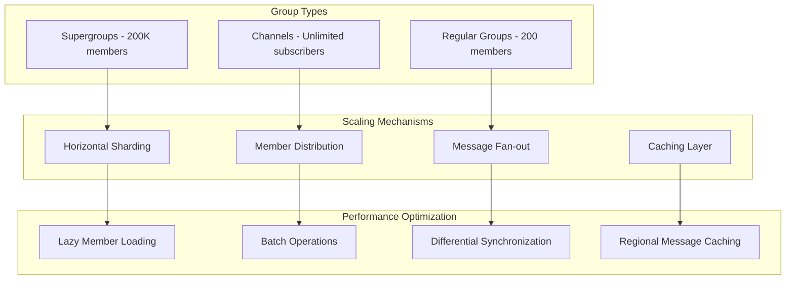

## Bot Platform Architecture

### 1. Bot API Ecosystem

Telegram's bot platform is one of the most sophisticated in the messaging industry, supporting complex applications and integrations.

**Bot Capabilities:**
- **Inline Keyboards**: Rich interactive interfaces
- **Webhook Integration**: Real-time event notifications
- **Payment Processing**: Built-in payment system
- **Web Apps**: Mini-applications within Telegram
- **File Processing**: Handle various file types and formats
- **Group Administration**: Automated group management

**Bot Architecture:**
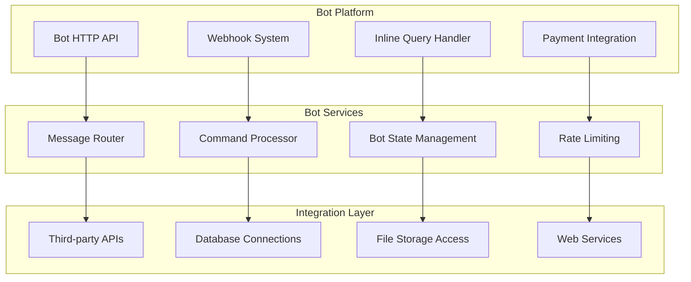

### 2. Bot Scaling and Performance

**Bot Performance Optimization:**
- **Async Processing**: Non-blocking bot request handling
- **Rate Limiting**: Prevent bot abuse and ensure fair usage
- **Caching**: Bot response caching for common queries
- **Load Distribution**: Distribute bot load across servers
- **Error Handling**: Robust error handling and recovery

## Media and File Sharing

### 1. Media Architecture

Telegram allows sharing files up to 2GB with fast upload and download speeds globally.

**Media Handling Features:**
- **Large File Support**: Up to 2GB per file
- **Fast Transfers**: Optimized upload/download algorithms
- **Global CDN**: Worldwide content delivery network
- **Media Compression**: Optional compression for photos and videos
- **Streaming Support**: Progressive download for media playback

**Media Processing Pipeline:**
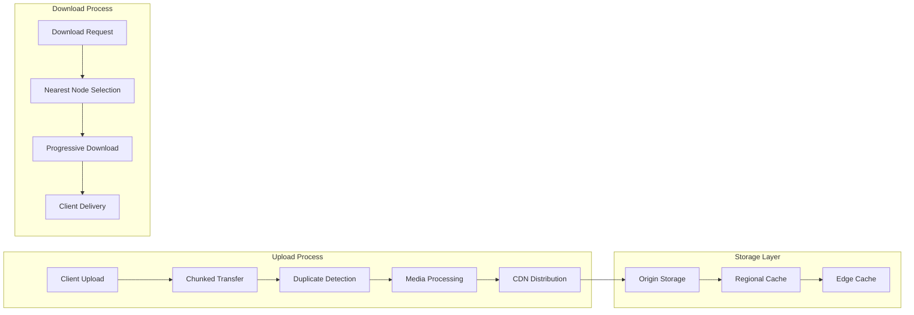

### 2. File Deduplication

**Deduplication Strategy:**
- **Hash-Based Deduplication**: Identify duplicate files by hash
- **Reference Counting**: Track file usage across chats
- **Storage Optimization**: Significant storage savings through deduplication
- **Instant Sharing**: Previously uploaded files shared instantly

## Global Infrastructure

### 1. Data Center Distribution

Telegram operates multiple data centers worldwide to ensure low latency and high availability.

**Data Center Strategy:**
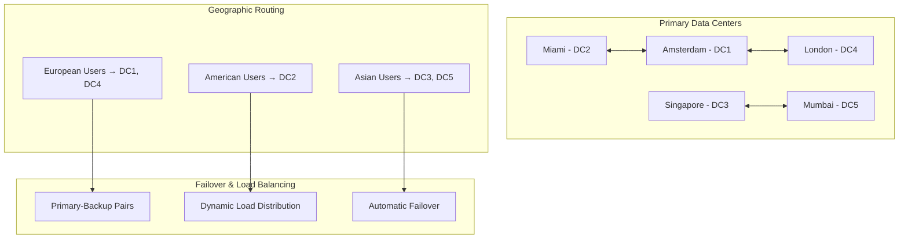

### 2. Network Optimization

**Performance Optimization:**
- **Anycast Routing**: Route users to nearest data center
- **TCP Optimization**: Custom TCP optimizations for different networks
- **Proxy Support**: Built-in proxy support for restricted regions
- **Connection Multiplexing**: Multiple logical connections over single TCP connection
- **Adaptive Protocols**: Switch between TCP and HTTP based on network conditions

## Search and Discovery Architecture

### 1. Global Search System

Telegram provides powerful search capabilities across all messages, media, and content.

**Search Features:**
- **Full-Text Search**: Search across all message content
- **Media Search**: Find photos, videos, and files by metadata
- **User Search**: Find users and bots by username
- **Channel Discovery**: Discover public channels and groups
- **Advanced Filters**: Date, sender, and content type filters

**Search Architecture:**
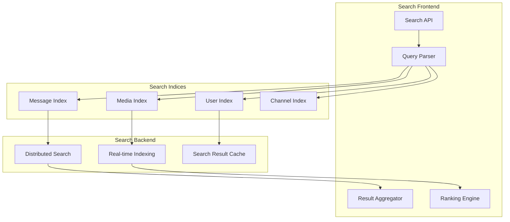

### 2. Content Discovery

**Discovery Mechanisms:**
- **Trending Content**: Popular channels and content discovery
- **Recommendation System**: Personalized channel and bot recommendations
- **Search Suggestions**: Intelligent search query suggestions
- **Related Content**: Discover similar channels and groups

## Voice and Video Calls

### 1. Calling Infrastructure

Telegram's voice and video calling system is built for security and quality.

**Calling Features:**
- **End-to-End Encryption**: All calls are end-to-end encrypted
- **Peer-to-Peer**: Direct connections when possible
- **Group Calls**: Video conferences with screen sharing
- **Call Recording**: Built-in call recording capabilities
- **Quality Adaptation**: Adaptive quality based on network conditions

**Call Architecture:**
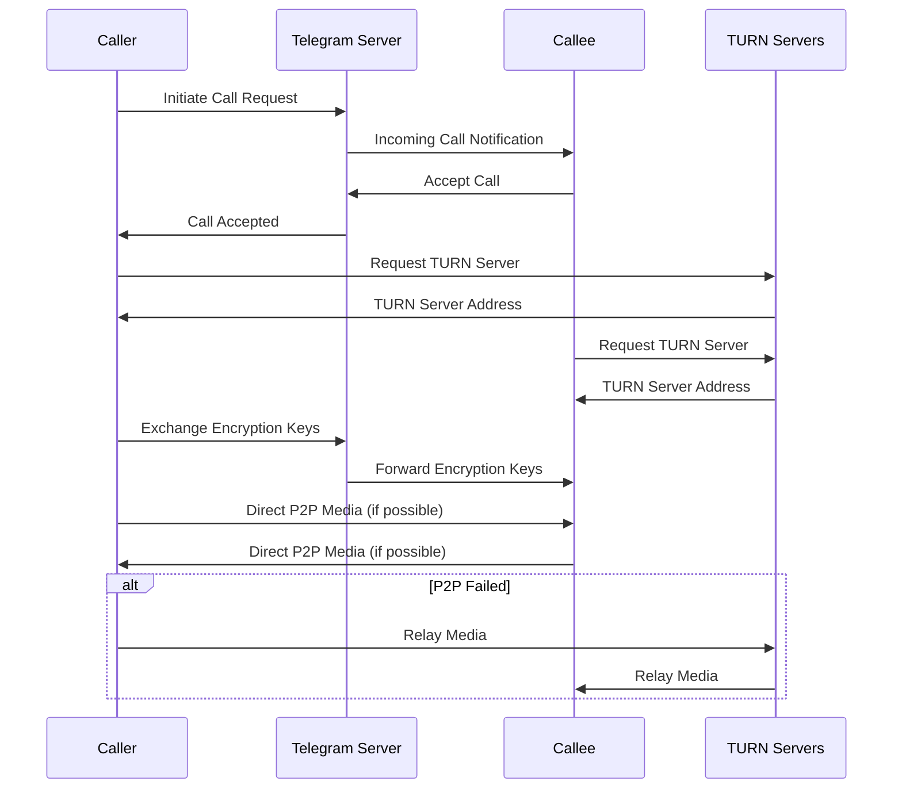

### 2. Group Video Calls

**Group Call Management:**
- **Voice Chat Rooms**: Persistent voice rooms in groups and channels  
- **Video Conferences**: Multi-party video calls with screen sharing
- **Participant Management**: Mute, kick, and permission controls
- **Recording and Streaming**: Built-in recording and live streaming
- **Scalability**: Support for thousands of participants

## Security Architecture

### 1. Multi-Layered Security

Telegram implements multiple security layers depending on the chat type and user requirements.

**Security Components:**
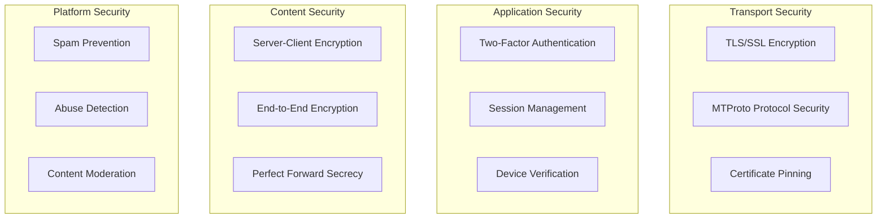

### 2. Privacy Features

**Privacy Controls:**
- **Username System**: Optional usernames instead of phone numbers
- **Self-Destructing Messages**: Automatic message deletion
- **Screenshot Detection**: Notifications for secret chat screenshots
- **Privacy Settings**: Granular privacy controls for profile information
- **Proxy Support**: Built-in proxy for privacy and access

## Performance and Scalability

### 1. Horizontal Scaling

**Scaling Strategy:**
- **User Sharding**: Distribute users across multiple database shards
- **Geographic Distribution**: Regional data centers for local users
- **Service Decomposition**: Microservices for different functionalities
- **Load Balancing**: Dynamic load distribution across servers
- **Caching**: Multi-level caching for frequently accessed data

**Performance Metrics:**
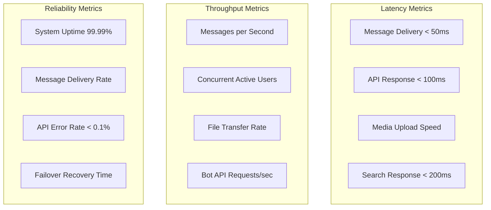

### 2. Database Architecture

**Data Storage Strategy:**
- **Distributed Databases**: Horizontal partitioning across multiple servers
- **Replication**: Multi-master replication for high availability
- **Consistency**: Eventual consistency for distributed operations
- **Backup Systems**: Regular automated backups with point-in-time recovery
- **Data Retention**: Configurable data retention policies

## Related Case Studies
- See [WhatsApp](whatsapp.md) for alternative messaging architecture with E2E encryption
- See [Discord](discord.md) for community-focused messaging platforms (if available)  
- See [Signal](signal.md) for privacy-focused messaging architecture (if available)
- See [Slack](slack.md) for business messaging and bot platforms (if available)

## Challenges and Trade-offs

### 1. Technical Challenges

**Architecture Trade-offs:**
- **Cloud vs Privacy**: Cloud storage enables features but raises privacy concerns
- **Speed vs Security**: Balancing message delivery speed with encryption overhead
- **Scalability vs Complexity**: Large-scale features increase system complexity
- **Storage vs Performance**: Unlimited storage creates scalability challenges
- **Customization vs Standardization**: Custom protocol vs standard protocols

**Performance Challenges:**
- **Global Latency**: Minimizing message delivery time worldwide
- **Large File Handling**: Efficiently transferring multi-gigabyte files
- **Group Scaling**: Supporting massive group chats and channels
- **Bot Platform**: Managing millions of bot interactions
- **Multi-device Sync**: Keeping all devices synchronized in real-time

### 2. Business and Regulatory Challenges

**Operational Challenges:**
- **Content Moderation**: Balancing free speech with platform safety
- **Regulatory Compliance**: Adapting to different countries' regulations
- **Monetization**: Building sustainable revenue while remaining user-focused
- **Spam and Abuse**: Preventing platform abuse while maintaining openness
- **Infrastructure Costs**: Managing costs for free unlimited storage

**Market Positioning:**
- **Privacy vs Features**: Competing with platforms offering different privacy models
- **Adoption**: Growing user base in markets dominated by other platforms
- **Developer Ecosystem**: Building and maintaining bot/API ecosystem
- **Enterprise Adoption**: Expanding into business communication markets

## Innovation and Future Directions

### 1. Emerging Features

**Platform Evolution:**
- **Web3 Integration**: Cryptocurrency and blockchain features
- **Mini-Apps**: More sophisticated in-app applications
- **AI Integration**: Smart features while maintaining privacy
- **Enhanced Media**: Advanced media processing and sharing
- **Cross-Platform Integration**: Better integration with other services

### 2. Technical Evolution

**Architecture Improvements:**
- **Edge Computing**: Processing closer to users for reduced latency
- **Quantum Resistance**: Preparing cryptography for quantum computing
- **5G Optimization**: Leveraging 5G networks for enhanced features
- **Machine Learning**: Privacy-preserving ML for better user experience
- **Serverless Architecture**: Evolution toward more serverless components

## Lessons Learned

### 1. Architecture Principles

**Key Design Decisions:**
- **Custom Protocol**: MTProto provides optimal performance for messaging
- **Cloud-First**: Cloud storage enables powerful multi-device experience
- **Dual Encryption**: Offering both server-client and end-to-end encryption options
- **Bot Platform**: Rich API ecosystem drives platform adoption
- **Open Source**: TDLib and other open-source components build trust

### 2. Scaling Insights

**Successful Strategies:**
- **Geographic Distribution**: Multiple data centers reduce global latency
- **File Deduplication**: Significant storage and bandwidth savings
- **Caching Strategies**: Multi-level caching improves performance
- **API Design**: Well-designed bot API creates vibrant ecosystem
- **User Experience**: Focus on speed and reliability drives adoption

## Conclusion

Telegram's architecture represents a unique approach to messaging platform design, balancing user privacy, advanced features, and global scalability. The platform's success stems from its innovative custom protocol, cloud-first architecture, dual encryption model, and powerful bot ecosystem.

Key architectural achievements include supporting 700+ million users with fast message delivery, implementing flexible security models for different use cases, building one of the industry's most advanced bot platforms, and maintaining high performance with unlimited cloud storage. Telegram's approach demonstrates how technical innovation and thoughtful architecture can differentiate a platform in a crowded market.

The architecture continues to evolve with new features and capabilities while maintaining the core principles of speed, security, and user empowerment that have made Telegram successful. The platform serves as an excellent example of how alternative architectural approaches can succeed in competitive markets through technical excellence and user-focused design.