# Twitter System Design - Complete Architecture Guide

## Table of Contents
1. [Introduction](#introduction)
2. [Requirements Analysis](#requirements-analysis)
3. [High-Level Architecture](#high-level-architecture)
4. [Core Components](#core-components)
5. [Timeline Generation](#timeline-generation)
6. [Tweet Delivery System](#tweet-delivery-system)
7. [Search & Trends](#search--trends)
8. [Storage Strategy](#storage-strategy)
9. [API Design](#api-design)
10. [Code Examples](#code-examples)
11. [Scalability Patterns](#scalability-patterns)
12. [Related Systems](#related-systems)

---

## Introduction

Twitter (now X) is a real-time social networking platform that handles billions of tweets daily. This document explores the architectural patterns that enable Twitter to deliver content at massive scale with low latency.

**Key Challenges:**
- Real-time content delivery to millions of users
- Handling celebrity tweets (fan-out to millions)
- Maintaining timeline consistency
- Processing trending topics in real-time
- Managing billions of follower relationships
- Sub-second latency for tweet delivery

---

## Requirements Analysis

### Functional Requirements
- **Post Tweets**: Users can post text (280 chars), images, videos, polls
- **Timeline**: Home timeline (tweets from followed users), User timeline
- **Social Graph**: Follow/unfollow users
- **Engagement**: Like, retweet, reply, quote tweet
- **Search**: Search tweets, users, hashtags
- **Trends**: Real-time trending topics by location
- **Notifications**: Real-time push notifications
- **Direct Messages**: Private messaging between users

### Non-Functional Requirements
- **Availability**: 99.99% uptime
- **Latency**: < 200ms for timeline load, < 100ms for tweet post
- **Consistency**: Eventual consistency for timeline, strong for tweets
- **Scale**: 500M+ daily active users, 6000+ tweets/second
- **Real-time**: Trending topics update every few seconds

### Capacity Estimates
- **DAU**: 500 million users
- **Tweets**: ~500 million tweets/day (~6,000 tweets/sec average, 12K peak)
- **Timeline reads**: 100 billion/day (~1.15M requests/sec)
- **Storage**: 
  - Tweets: ~100 TB/year
  - Media: ~10 PB/year
  - Total: ~50 PB
- **Bandwidth**: Peak 100 Gbps

---

## High-Level Architecture

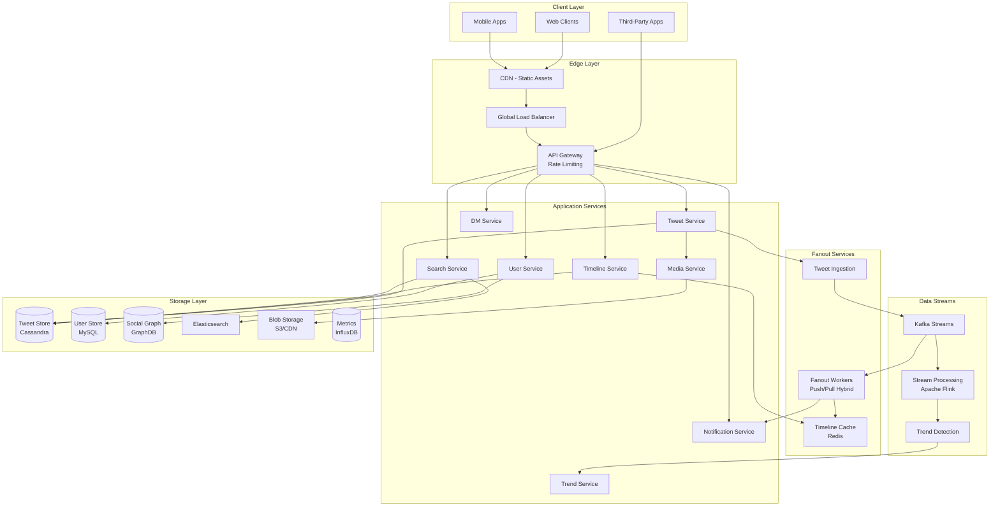

---

## Core Components

### 1. Tweet Posting Flow

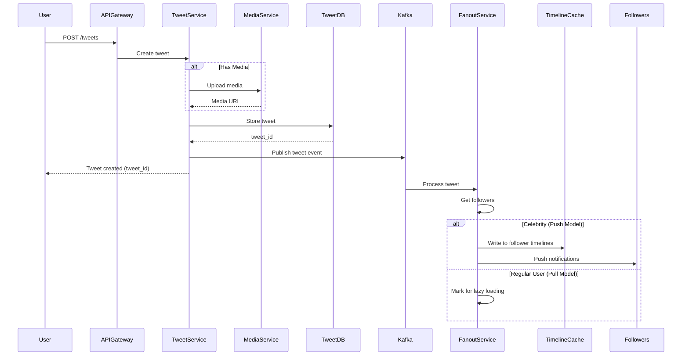

**Key Decisions:**
- **Hybrid Fanout**: Push for celebrities, pull for regular users
- **Async Processing**: Tweet stored immediately, fanout happens async
- **Media Handling**: Separate service for uploading/processing media

---

### 2. Timeline Architecture

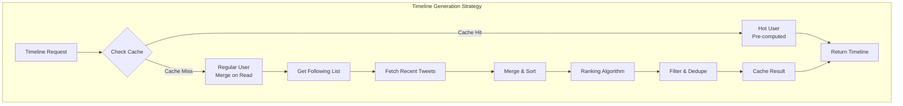

**Timeline Types:**

1. **Home Timeline** (For You/Following)
   - Tweets from users you follow
   - Algorithmic ranking
   - Includes promoted tweets

2. **User Timeline** (Profile)
   - Tweets by specific user
   - Chronological order
   - Includes retweets

3. **List Timeline**
   - Tweets from list members
   - Chronological

---

### 3. Fanout Strategies

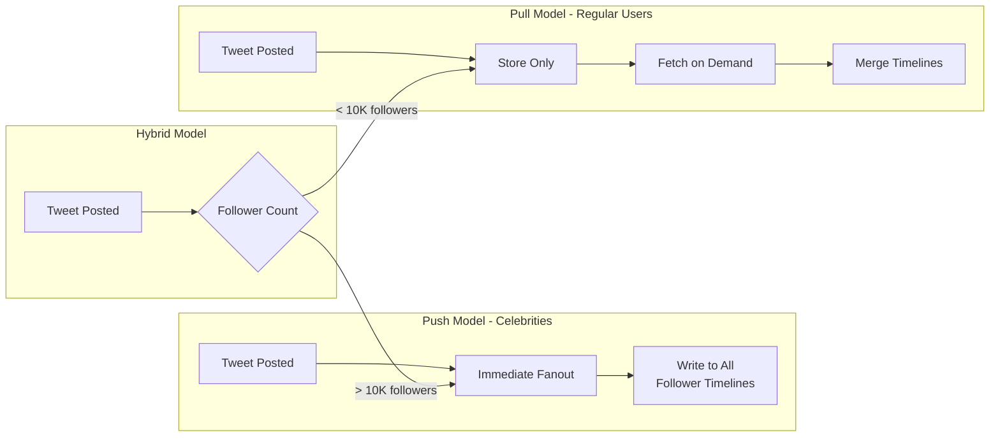

**Fanout Decisions:**

| User Type | Followers | Strategy | Reason |
|-----------|-----------|----------|--------|
| Regular | < 10K | Pull | Low fanout cost |
| Popular | 10K-1M | Hybrid | Balanced approach |
| Celebrity | > 1M | Push + Pull | Pre-compute for active users only |

---

### 4. Social Graph Storage

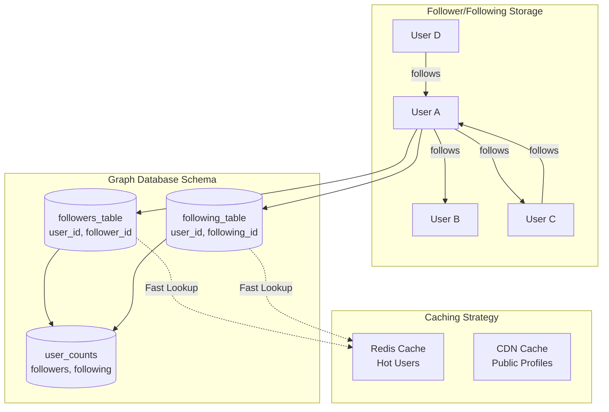

**Graph Operations:**
- **Follow**: Add edge, update counts, invalidate cache
- **Unfollow**: Remove edge, update counts, invalidate cache
- **Get Followers**: Query with pagination
- **Get Following**: Query with pagination
- **Mutual Follows**: Intersection query

---

### 5. Trending Topics Engine

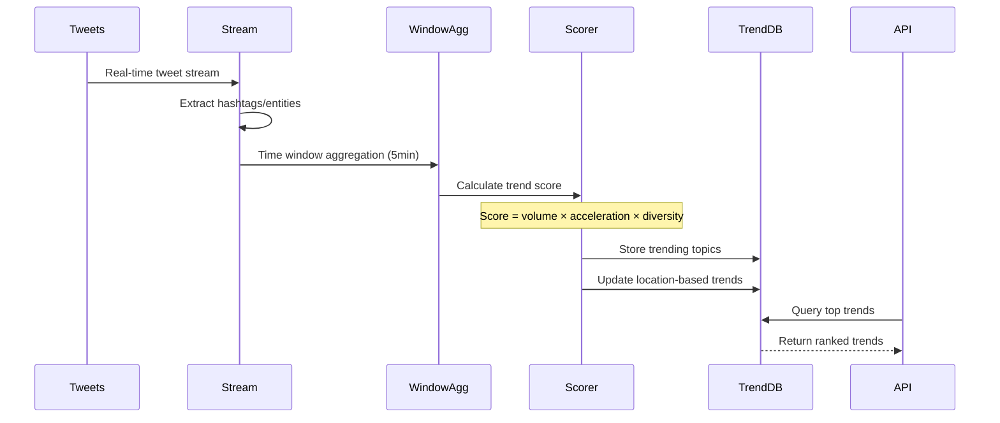

**Trend Detection Algorithm:**

```javascript
// Simplified trend scoring
function calculateTrendScore(hashtag, window) {
  const currentVolume = hashtag.count;
  const previousVolume = hashtag.previousCount || 1;
  
  // Acceleration: how fast it's growing
  const acceleration = currentVolume / previousVolume;
  
  // Diversity: unique users tweeting
  const diversity = hashtag.uniqueUsers / currentVolume;
  
  // Freshness: favor recent spikes
  const recency = 1 / (Date.now() - hashtag.firstSeen);
  
  return (
    currentVolume * 0.3 +
    acceleration * 0.4 +
    diversity * 0.2 +
    recency * 0.1
  );
}
```

---

## Timeline Generation

### Push-Based Timeline (Pre-computed)

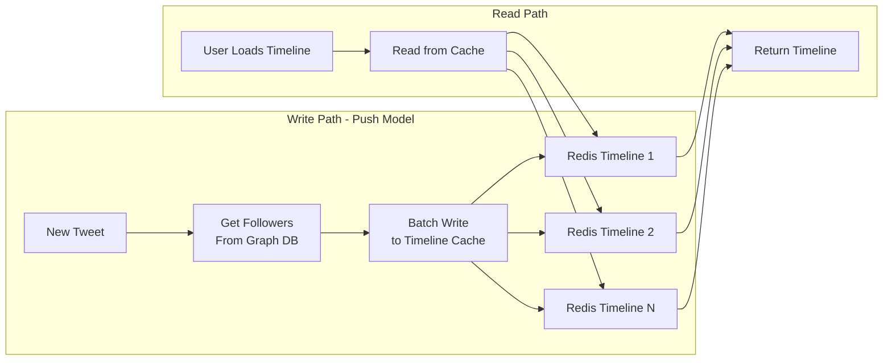

**Advantages:**
- Fast read performance (cache hit)
- Consistent timeline experience

**Disadvantages:**
- High write amplification for celebrities
- Expensive cache storage

---

### Pull-Based Timeline (On-Demand)

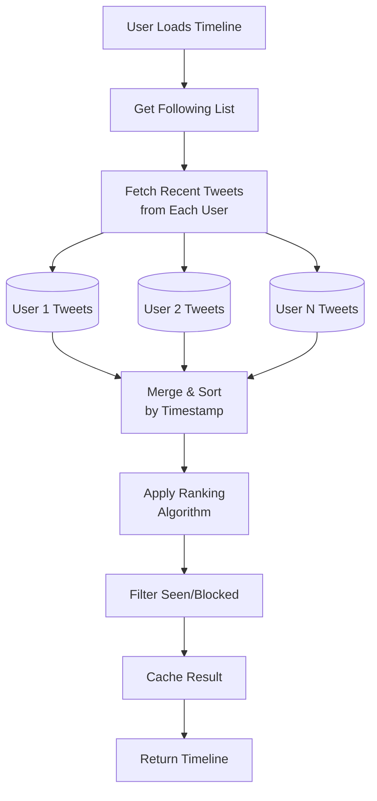

**Advantages:**
- No write amplification
- Always up-to-date

**Disadvantages:**
- Slower read performance
- Multiple DB queries needed

---

### Hybrid Approach (Twitter's Solution)

```javascript
// timeline-generator.js
class TimelineGenerator {
  async generateTimeline(userId, options = {}) {
    const { limit = 50, maxAge = 7200 } = options;
    
    // Check cache first
    const cached = await this.cache.get(`timeline:${userId}`);
    if (cached && !this.isCacheStale(cached, maxAge)) {
      return cached;
    }

    // Get user's following list
    const following = await this.getFollowing(userId);
    
    // Separate hot and regular users
    const { hotUsers, regularUsers } = this.categorizeUsers(following);
    
    // Fetch tweets
    const [hotTweets, regularTweets] = await Promise.all([
      this.getPrecomputedTweets(hotUsers), // From cache
      this.fetchRecentTweets(regularUsers, limit * 2) // From DB
    ]);

    // Merge and rank
    const merged = this.mergeTweets(hotTweets, regularTweets);
    const ranked = await this.rankTweets(merged, userId);
    const filtered = this.filterTweets(ranked, userId);
    
    // Cache result
    const timeline = filtered.slice(0, limit);
    await this.cache.set(`timeline:${userId}`, timeline, 300); // 5 min TTL
    
    return timeline;
  }

  categorizeUsers(following) {
    const threshold = 100000; // 100K followers
    return {
      hotUsers: following.filter(u => u.followerCount > threshold),
      regularUsers: following.filter(u => u.followerCount <= threshold)
    };
  }

  async rankTweets(tweets, userId) {
    // Personalized ranking algorithm
    const userProfile = await this.getUserProfile(userId);
    
    return tweets.map(tweet => ({
      ...tweet,
      score: this.calculateScore(tweet, userProfile)
    })).sort((a, b) => b.score - a.score);
  }

  calculateScore(tweet, userProfile) {
    const recency = 1 / (Date.now() - tweet.timestamp);
    const engagement = tweet.likes + tweet.retweets * 2 + tweet.replies * 1.5;
    const authorAffinity = userProfile.interactions[tweet.authorId] || 0;
    const contentRelevance = this.calculateRelevance(tweet, userProfile);
    
    return (
      recency * 0.2 +
      Math.log10(engagement + 1) * 0.3 +
      authorAffinity * 0.3 +
      contentRelevance * 0.2
    );
  }
}
```

---

## Tweet Delivery System

### Real-Time Push Notifications

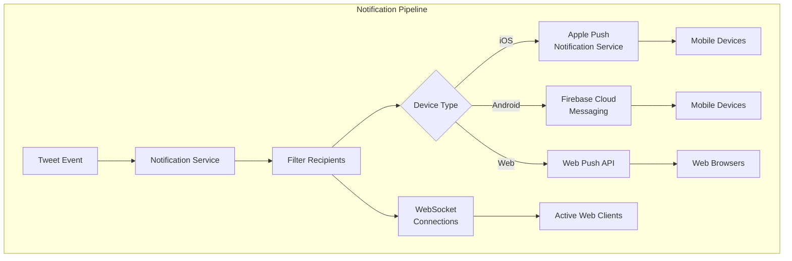

**Notification Types:**
- New tweet from followed user
- Reply/mention notification
- Like/retweet notification
- New follower
- Direct message

---

### WebSocket Architecture for Real-Time Updates

```javascript
// websocket-server.js
class TwitterWebSocketServer {
  constructor() {
    this.connections = new Map(); // userId -> WebSocket[]
    this.subscriptions = new Map(); // userId -> Set(topics)
  }

  handleConnection(ws, userId) {
    // Store connection
    if (!this.connections.has(userId)) {
      this.connections.set(userId, []);
    }
    this.connections.get(userId).push(ws);

    // Subscribe to user's timeline updates
    this.subscribe(userId, `timeline:${userId}`);
    this.subscribe(userId, `notifications:${userId}`);

    ws.on('message', (msg) => this.handleMessage(userId, msg));
    ws.on('close', () => this.handleDisconnect(userId, ws));
  }

  async publishTweet(tweet) {
    // Get all followers
    const followers = await this.getFollowers(tweet.authorId);
    
    // Send to active connections
    for (const followerId of followers) {
      const connections = this.connections.get(followerId);
      if (connections) {
        const message = JSON.stringify({
          type: 'new_tweet',
          data: tweet
        });
        
        connections.forEach(ws => {
          if (ws.readyState === WebSocket.OPEN) {
            ws.send(message);
          }
        });
      }
    }
  }

  handleDisconnect(userId, ws) {
    const connections = this.connections.get(userId);
    if (connections) {
      const index = connections.indexOf(ws);
      if (index > -1) {
        connections.splice(index, 1);
      }
    }
  }
}
```

---

## Search & Trends

### Search Architecture

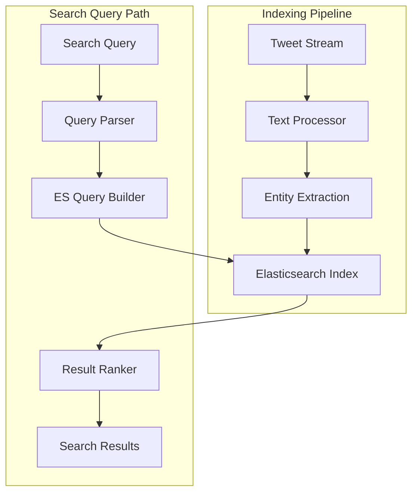

**Search Features:**
- **Text Search**: Full-text search on tweet content
- **User Search**: Find users by name/username
- **Hashtag Search**: Find tweets with specific hashtags
- **Advanced Search**: Date range, location, engagement filters
- **Autocomplete**: Real-time suggestions

**Elasticsearch Schema:**

```javascript
// tweet-index-mapping.js
const tweetMapping = {
  properties: {
    tweet_id: { type: 'keyword' },
    text: { 
      type: 'text',
      analyzer: 'standard',
      fields: {
        keyword: { type: 'keyword' }
      }
    },
    author_id: { type: 'keyword' },
    author_name: { type: 'text' },
    created_at: { type: 'date' },
    hashtags: { type: 'keyword' },
    mentions: { type: 'keyword' },
    likes: { type: 'integer' },
    retweets: { type: 'integer' },
    replies: { type: 'integer' },
    location: { type: 'geo_point' },
    language: { type: 'keyword' },
    has_media: { type: 'boolean' },
    verified_author: { type: 'boolean' }
  }
};
```

**Search Query Example:**

```javascript
// search-service.js
class SearchService {
  async searchTweets(query, filters = {}) {
    const {
      dateFrom,
      dateTo,
      location,
      language,
      minLikes,
      hasMedia
    } = filters;

    const esQuery = {
      bool: {
        must: [
          { match: { text: query } }
        ],
        filter: []
      }
    };

    // Apply filters
    if (dateFrom || dateTo) {
      esQuery.bool.filter.push({
        range: {
          created_at: {
            gte: dateFrom,
            lte: dateTo
          }
        }
      });
    }

    if (location) {
      esQuery.bool.filter.push({
        geo_distance: {
          distance: '50km',
          location: location
        }
      });
    }

    if (minLikes) {
      esQuery.bool.filter.push({
        range: { likes: { gte: minLikes } }
      });
    }

    // Execute search
    const results = await this.es.search({
      index: 'tweets',
      body: {
        query: esQuery,
        sort: [
          { _score: 'desc' },
          { created_at: 'desc' }
        ],
        size: 50
      }
    });

    return this.formatResults(results);
  }

  async autocomplete(prefix) {
    // Suggest hashtags and users
    const [hashtags, users] = await Promise.all([
      this.suggestHashtags(prefix),
      this.suggestUsers(prefix)
    ]);

    return { hashtags, users };
  }
}
```

---

## Storage Strategy

### Database Selection

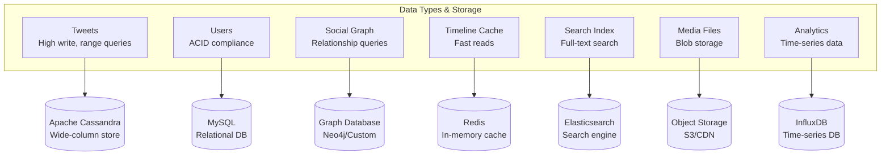

### Tweet Storage Schema (Cassandra)

```javascript
// cassandra-schema.cql
/*
Primary Key Strategy: Partition by user_id, cluster by timestamp
This allows efficient range queries for user timelines
*/

CREATE TABLE tweets (
  tweet_id uuid,
  user_id bigint,
  text varchar,
  created_at timestamp,
  in_reply_to_tweet_id uuid,
  in_reply_to_user_id bigint,
  retweet_count int,
  like_count int,
  reply_count int,
  media_urls list<text>,
  hashtags set<text>,
  mentions set<bigint>,
  PRIMARY KEY (user_id, created_at, tweet_id)
) WITH CLUSTERING ORDER BY (created_at DESC);

CREATE TABLE tweet_by_id (
  tweet_id uuid PRIMARY KEY,
  user_id bigint,
  text varchar,
  created_at timestamp,
  // ... other fields
);

// Timeline storage for push model
CREATE TABLE user_timeline (
  user_id bigint,
  tweet_id uuid,
  author_id bigint,
  created_at timestamp,
  PRIMARY KEY (user_id, created_at, tweet_id)
) WITH CLUSTERING ORDER BY (created_at DESC);
```

**Why Cassandra?**
- Handles high write throughput (6000+ tweets/sec)
- Linear scalability
- No single point of failure
- Tunable consistency
- Efficient for time-series data

---

### Sharding Strategy

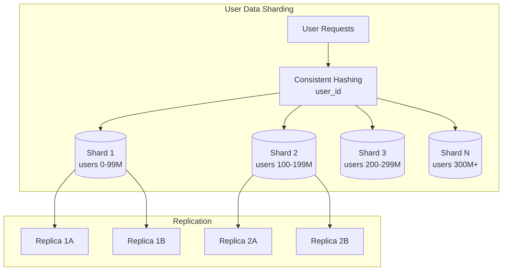

**Sharding Keys:**
- **Tweets**: Shard by user_id (keeps user's tweets together)
- **Timeline**: Shard by user_id (each user's timeline on one shard)
- **Social Graph**: Shard by user_id (follower/following data)

---

## API Design

### RESTful Endpoints

```javascript
// Twitter API v2 Design

// === Tweet Operations ===
POST /2/tweets
GET /2/tweets/:id
DELETE /2/tweets/:id
PUT /2/tweets/:id/like
DELETE /2/tweets/:id/like
POST /2/tweets/:id/retweet
DELETE /2/tweets/:id/retweet

// === Timeline Operations ===
GET /2/users/:id/tweets           // User timeline
GET /2/users/:id/timeline          // Home timeline
GET /2/users/:id/mentions          // Mentions timeline

// === User Operations ===
GET /2/users/:id
GET /2/users/by/username/:username
GET /2/users/:id/followers
GET /2/users/:id/following
POST /2/users/:id/following        // Follow user
DELETE /2/users/:id/following/:target_id  // Unfollow

// === Search Operations ===
GET /2/tweets/search/recent
GET /2/tweets/search/stream        // Filtered stream
GET /2/users/search

// === Trends ===
GET /2/trends/:location_id
```

### Rate Limiting

```javascript
// rate-limiter.js
class RateLimiter {
  constructor() {
    this.limits = {
      // Per 15-minute window
      tweet_read: { limit: 900, window: 900 },
      tweet_write: { limit: 300, window: 900 },
      timeline_read: { limit: 180, window: 900 },
      follow_write: { limit: 50, window: 900 },
      search: { limit: 450, window: 900 }
    };
  }

  async checkLimit(userId, endpoint) {
    const limit = this.limits[endpoint];
    const key = `ratelimit:${userId}:${endpoint}`;
    
    // Sliding window counter
    const count = await this.redis.incr(key);
    
    if (count === 1) {
      await this.redis.expire(key, limit.window);
    }
    
    const remaining = limit.limit - count;
    
    if (remaining < 0) {
      const ttl = await this.redis.ttl(key);
      throw new RateLimitError(`Rate limit exceeded. Reset in ${ttl}s`);
    }
    
    return {
      limit: limit.limit,
      remaining: Math.max(0, remaining),
      reset: Date.now() + (await this.redis.ttl(key) * 1000)
    };
  }
}
```

---

## Code Examples

### 1. Tweet Service

```javascript
// tweet-service.js
class TweetService {
  async createTweet(userId, content, options = {}) {
    // Validate
    if (content.text.length > 280) {
      throw new Error('Tweet exceeds 280 characters');
    }

    // Check rate limit
    await this.rateLimiter.checkLimit(userId, 'tweet_write');

    // Generate ID (Snowflake ID)
    const tweetId = this.generateSnowflakeId();

    // Process content
    const processed = this.processContent(content);

    // Create tweet object
    const tweet = {
      id: tweetId,
      userId,
      text: processed.text,
      hashtags: processed.hashtags,
      mentions: processed.mentions,
      urls: processed.urls,
      mediaIds: options.mediaIds || [],
      createdAt: Date.now(),
      likes: 0,
      retweets: 0,
      replies: 0
    };

    // Store in database
    await this.tweetDB.insert(tweet);

    // Publish to Kafka for fanout
    await this.kafka.publish('tweets', {
      type: 'tweet.created',
      data: tweet
    });

    // Update user stats
    await this.userService.incrementTweetCount(userId);

    return tweet;
  }

  processContent(content) {
    const hashtags = this.extractHashtags(content.text);
    const mentions = this.extractMentions(content.text);
    const urls = this.extractUrls(content.text);

    return {
      text: content.text,
      hashtags,
      mentions,
      urls
    };
  }

  extractHashtags(text) {
    const regex = /#(\w+)/g;
    const matches = text.matchAll(regex);
    return Array.from(matches, m => m[1]);
  }

  extractMentions(text) {
    const regex = /@(\w+)/g;
    const matches = text.matchAll(regex);
    return Array.from(matches, m => m[1]);
  }

  // Snowflake ID generation
  generateSnowflakeId() {
    // 64-bit ID: timestamp(41) + datacenter(5) + worker(5) + sequence(12)
    const timestamp = Date.now() - this.epoch;
    const datacenterId = this.datacenterId;
    const workerId = this.workerId;
    const sequence = this.sequence++;

    return (
      (timestamp << 22) |
      (datacenterId << 17) |
      (workerId << 12) |
      sequence
    );
  }
}
```

### 2. Fanout Service

```javascript
// fanout-service.js
class FanoutService {
  constructor() {
    this.celebrityThreshold = 10000; // 10K followers
    this.maxFanoutSize = 1000000; // 1M max direct fanout
  }

  async processTweet(tweet) {
    const author = await this.userService.getUser(tweet.userId);
    const followerCount = author.followerCount;

    // Decide fanout strategy
    if (followerCount > this.maxFanoutSize) {
      await this.hybridFanout(tweet, followerCount);
    } else if (followerCount > this.celebrityThreshold) {
      await this.pushFanout(tweet);
    } else {
      await this.pullFanout(tweet);
    }

    // Always index for search
    await this.indexTweet(tweet);
  }

  async pushFanout(tweet) {
    // Get all followers in batches
    const batchSize = 5000;
    let offset = 0;
    
    while (true) {
      const followers = await this.graphDB.getFollowers(
        tweet.userId,
        { limit: batchSize, offset }
      );

      if (followers.length === 0) break;

      // Batch write to timeline cache
      await this.timelineCache.batchInsert(
        followers.map(followerId => ({
          userId: followerId,
          tweetId: tweet.id,
          timestamp: tweet.createdAt
        }))
      );

      // Send push notifications to active users
      const activeFollowers = await this.getActiveUsers(followers);
      await this.notificationService.sendBatch(activeFollowers, {
        type: 'new_tweet',
        data: tweet
      });

      offset += batchSize;
    }
  }

  async pullFanout(tweet) {
    // Just mark that this user has new tweets
    await this.redis.set(
      `new_tweets:${tweet.userId}`,
      Date.now(),
      'EX',
      3600
    );

    // Notify via WebSocket if user has active connections
    await this.websocketService.notifyFollowers(tweet.userId, tweet);
  }

  async hybridFanout(tweet, followerCount) {
    // For mega-celebrities, only push to most active followers
    const topFollowers = await this.getTopActiveFollowers(
      tweet.userId,
      Math.min(100000, followerCount * 0.1) // Top 10% or 100K max
    );

    // Push to active followers
    await this.pushFanout({ ...tweet, targetFollowers: topFollowers });

    // Others will use pull model
    await this.pullFanout(tweet);
  }

  async getTopActiveFollowers(userId, limit) {
    // Get most active followers based on recent activity
    return await this.redis.zrevrange(
      `active_followers:${userId}`,
      0,
      limit - 1
    );
  }
}
```

### 3. Timeline Service

```javascript
// timeline-service.js
class TimelineService {
  async getHomeTimeline(userId, options = {}) {
    const { limit = 50, cursor, algorithm = 'ranked' } = options;

    // Check cache first
    const cacheKey = `timeline:${userId}:${algorithm}`;
    const cached = await this.cache.get(cacheKey);
    
    if (cached && !cursor) {
      return this.paginateTimeline(cached, limit);
    }

    // Get following list
    const following = await this.graphDB.getFollowing(userId);
    
    if (following.length === 0) {
      return { tweets: [], nextCursor: null };
    }

    // Fetch tweets using hybrid approach
    const tweets = await this.fetchTimelineTweets(userId, following, limit * 2);

    // Apply ranking algorithm
    const ranked = algorithm === 'ranked' 
      ? await this.rankTweets(tweets, userId)
      : this.chronologicalSort(tweets);

    // Filter out muted/blocked users
    const filtered = await this.filterTweets(ranked, userId);

    // Cache result
    await this.cache.set(cacheKey, filtered.slice(0, 100), 300); // 5 min

    return this.paginateTimeline(filtered, limit, cursor);
  }

  async fetchTimelineTweets(userId, following, limit) {
    // Categorize users
    const { hotUsers, regularUsers } = this.categorizeUsers(following);

    // Parallel fetch
    const [hotTweets, regularTweets] = await Promise.all([
      this.fetchFromCache(hotUsers, limit),
      this.fetchFromDB(regularUsers, limit)
    ]);

    return [...hotTweets, ...regularTweets];
  }

  async rankTweets(tweets, userId) {
    // Load user's ML model features
    const userFeatures = await this.mlService.getUserFeatures(userId);

    // Score each tweet
    const scored = await Promise.all(
      tweets.map(async tweet => ({
        ...tweet,
        score: await this.calculateTweetScore(tweet, userFeatures)
      }))
    );

    return scored.sort((a, b) => b.score - a.score);
  }

  async calculateTweetScore(tweet, userFeatures) {
    // Multiple signals for ranking
    const signals = {
      recency: this.recencyScore(tweet),
      engagement: this.engagementScore(tweet),
      authorRelevance: this.authorRelevanceScore(tweet, userFeatures),
      contentRelevance: this.contentRelevanceScore(tweet, userFeatures),
      mediaPresence: tweet.mediaIds.length > 0 ? 1.2 : 1.0,
      verified: tweet.author.verified ? 1.1 : 1.0
    };

    // Weighted combination
    return (
      signals.recency * 0.15 +
      signals.engagement * 0.25 +
      signals.authorRelevance * 0.30 +
      signals.contentRelevance * 0.20 +
      signals.mediaPresence * 0.05 +
      signals.verified * 0.05
    );
  }

  recencyScore(tweet) {
    const ageInHours = (Date.now() - tweet.createdAt) / (1000 * 60 * 60);
    return Math.exp(-ageInHours / 24); // Exponential decay over 24 hours
  }

  engagementScore(tweet) {
    const totalEngagement = 
      tweet.likes + 
      tweet.retweets * 2 + 
      tweet.replies * 1.5;
    
    return Math.log10(totalEngagement + 1); // Logarithmic scale
  }

  authorRelevanceScore(tweet, userFeatures) {
    // How much does user interact with this author?
    const interactions = userFeatures.authorInteractions[tweet.userId] || 0;
    return Math.min(interactions / 100, 1.0); // Cap at 1.0
  }

  contentRelevanceScore(tweet, userFeatures) {
    // Match tweet topics with user interests
    const tweetTopics = this.extractTopics(tweet);
    const userInterests = userFeatures.interests;

    const overlap = tweetTopics.filter(t => userInterests.includes(t)).length;
    return overlap / Math.max(tweetTopics.length, 1);
  }
}
```

### 4. Notification Service

```javascript
// notification-service.js
class NotificationService {
  async notify(userId, notification) {
    // Check user preferences
    const prefs = await this.getNotificationPreferences(userId);
    
    if (!this.shouldNotify(notification.type, prefs)) {
      return;
    }

    // Multi-channel delivery
    await Promise.all([
      this.sendPushNotification(userId, notification),
      this.saveInAppNotification(userId, notification),
      this.sendEmailIfNeeded(userId, notification)
    ]);

    // Track delivery
    await this.trackNotification(userId, notification);
  }

  async sendPushNotification(userId, notification) {
    const devices = await this.getDevices(userId);

    for (const device of devices) {
      const payload = this.formatNotification(notification, device.platform);

      switch (device.platform) {
        case 'ios':
          await this.apns.send(device.token, payload);
          break;
        case 'android':
          await this.fcm.send(device.token, payload);
          break;
        case 'web':
          await this.webPush.send(device.subscription, payload);
          break;
      }
    }
  }

  formatNotification(notification, platform) {
    const templates = {
      new_follower: {
        title: `${notification.actor.name} followed you`,
        body: 'Tap to view their profile',
        icon: notification.actor.profileImage
      },
      like: {
        title: `${notification.actor.name} liked your tweet`,
        body: notification.tweet.text.substring(0, 100),
        icon: notification.actor.profileImage
      },
      retweet: {
        title: `${notification.actor.name} retweeted your tweet`,
        body: notification.tweet.text.substring(0, 100),
        icon: notification.actor.profileImage
      },
      reply: {
        title: `${notification.actor.name} replied to your tweet`,
        body: notification.reply.text.substring(0, 100),
        icon: notification.actor.profileImage
      },
      mention: {
        title: `${notification.actor.name} mentioned you`,
        body: notification.tweet.text.substring(0, 100),
        icon: notification.actor.profileImage
      }
    };

    return templates[notification.type];
  }

  async batchNotify(notifications) {
    // Group by user for efficient processing
    const grouped = this.groupByUser(notifications);

    // Process in parallel with rate limiting
    const batches = this.chunk(Object.entries(grouped), 100);
    
    for (const batch of batches) {
      await Promise.all(
        batch.map(([userId, userNotifs]) => 
          this.notifyUser(userId, userNotifs)
        )
      );
    }
  }
}
```

### 5. Direct Message Service

```javascript
// dm-service.js
class DirectMessageService {
  async sendMessage(senderId, recipientId, content) {
    // Validate
    if (!await this.canSendMessage(senderId, recipientId)) {
      throw new Error('Cannot send message to this user');
    }

    // Generate conversation ID
    const conversationId = this.getConversationId(senderId, recipientId);

    // Create message
    const message = {
      id: this.generateId(),
      conversationId,
      senderId,
      recipientId,
      text: content.text,
      mediaIds: content.mediaIds || [],
      timestamp: Date.now(),
      read: false
    };

    // Store message
    await this.messageDB.insert(message);

    // Update conversation metadata
    await this.updateConversation(conversationId, message);

    // Real-time delivery
    await this.deliverMessage(recipientId, message);

    // Send push notification if recipient offline
    if (!await this.isUserOnline(recipientId)) {
      await this.notificationService.notify(recipientId, {
        type: 'direct_message',
        data: message
      });
    }

    return message;
  }

  getConversationId(userId1, userId2) {
    // Consistent ID regardless of order
    const [smaller, larger] = [userId1, userId2].sort();
    return `${smaller}:${larger}`;
  }

  async deliverMessage(recipientId, message) {
    // Send via WebSocket if connected
    const connections = this.websocketService.getConnections(recipientId);
    
    for (const ws of connections) {
      ws.send(JSON.stringify({
        type: 'dm.new',
        data: message
      }));
    }
  }

  async getConversationMessages(userId, conversationId, options = {}) {
    const { limit = 50, before } = options;

    // Verify user is participant
    if (!this.isParticipant(userId, conversationId)) {
      throw new Error('Unauthorized');
    }

    // Fetch messages
    const messages = await this.messageDB.query({
      conversationId,
      timestamp: { $lt: before || Date.now() }
    }).limit(limit).sort({ timestamp: -1 });

    // Mark as read
    await this.markAsRead(userId, conversationId);

    return messages;
  }

  async markAsRead(userId, conversationId) {
    await this.messageDB.update(
      {
        conversationId,
        recipientId: userId,
        read: false
      },
      {
        $set: { read: true, readAt: Date.now() }
      }
    );

    // Notify sender via WebSocket
    const conversation = await this.getConversation(conversationId);
    const senderId = conversation.participants.find(p => p !== userId);
    
    await this.websocketService.send(senderId, {
      type: 'dm.read',
      conversationId
    });
  }
}
```

---

## Scalability Patterns

### 1. Caching Strategy

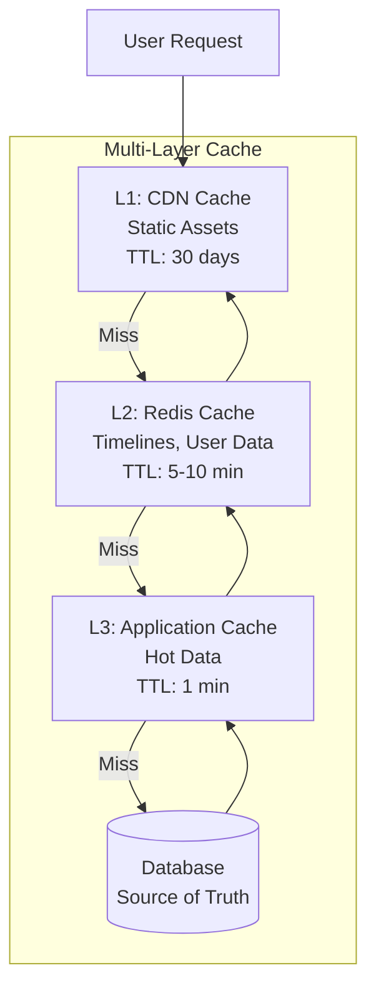

**Cache Invalidation Strategies:**

```javascript
// cache-manager.js
class CacheManager {
  async invalidateTimeline(userId) {
    const keys = [
      `timeline:${userId}:ranked`,
      `timeline:${userId}:chronological`,
      `timeline:${userId}:media`
    ];
    
    await this.redis.del(...keys);
  }

  async invalidateUserCache(userId) {
    const pattern = `user:${userId}:*`;
    const keys = await this.redis.keys(pattern);
    
    if (keys.length > 0) {
      await this.redis.del(...keys);
    }
  }

  async warmCache(userId) {
    // Pre-populate cache for active users
    const timeline = await this.timelineService.generateTimeline(userId);
    await this.redis.set(
      `timeline:${userId}:ranked`,
      JSON.stringify(timeline),
      'EX',
      300
    );
  }
}
```

### 2. Read-Write Separation

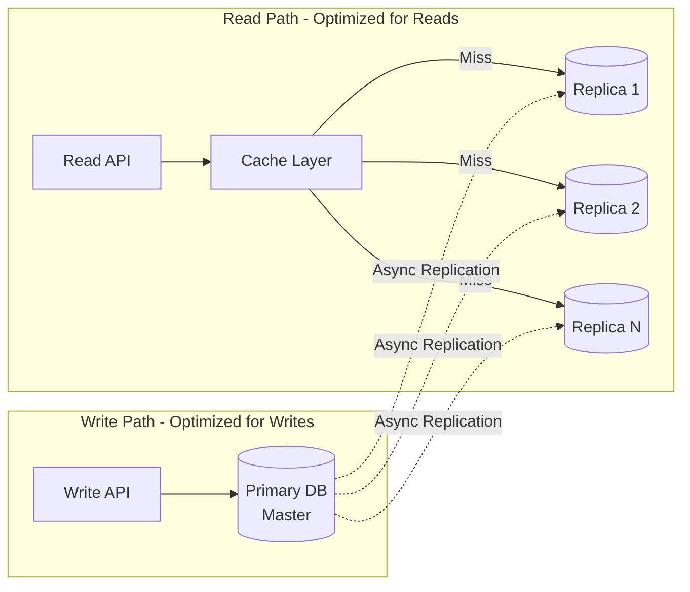

### 3. Message Queue Architecture

```javascript
// kafka-consumer.js
class TwitterKafkaConsumer {
  constructor() {
    this.topics = {
      'tweets': this.processTweet,
      'likes': this.processLike,
      'retweets': this.processRetweet,
      'follows': this.processFollow
    };
  }

  async start() {
    for (const [topic, handler] of Object.entries(this.topics)) {
      this.consumer.subscribe(topic);
      
      this.consumer.on('message', async (message) => {
        const data = JSON.parse(message.value);
        
        try {
          await handler.call(this, data);
          await this.consumer.commit(message);
        } catch (error) {
          console.error(`Error processing ${topic}:`, error);
          // Send to DLQ
          await this.sendToDeadLetterQueue(topic, message);
        }
      });
    }
  }

  async processTweet(data) {
    // Fanout to followers
    await this.fanoutService.processTweet(data.tweet);
    
    // Index for search
    await this.searchService.indexTweet(data.tweet);
    
    // Update trends
    await this.trendService.processTweet(data.tweet);
    
    // Analytics
    await this.analyticsService.trackTweet(data.tweet);
  }

  async processLike(data) {
    // Update like count
    await this.tweetService.incrementLikes(data.tweetId);
    
    // Notify tweet author
    await this.notificationService.notify(data.tweetAuthorId, {
      type: 'like',
      actor: data.userId,
      tweet: data.tweetId
    });
    
    // Update ML features
    await this.mlService.recordInteraction(data.userId, data.tweetId, 'like');
  }
}
```

### 4. Load Balancing

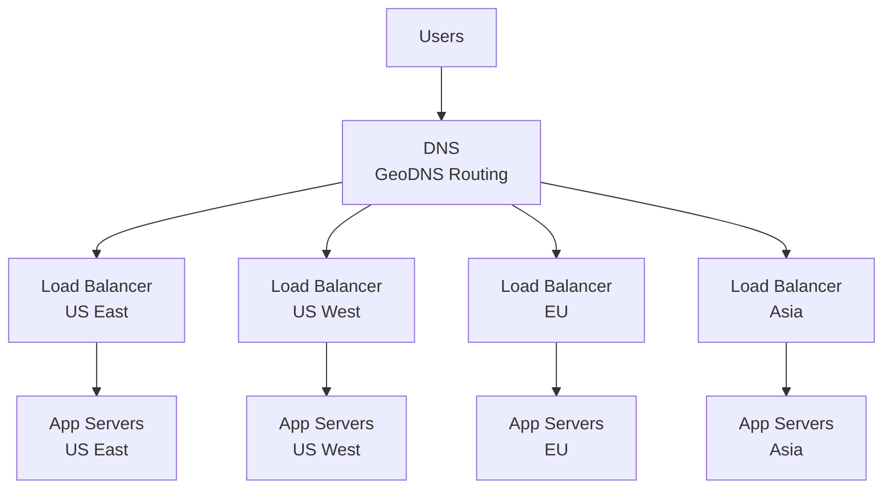

**Load Balancing Strategy:**
- **L4 (Network Layer)**: Hardware load balancers for high throughput
- **L7 (Application Layer)**: Software LB for intelligent routing
- **Sticky Sessions**: Route same user to same server for WebSocket
- **Health Checks**: Remove unhealthy servers automatically

---

## Performance Optimizations

### 1. Database Query Optimization

```javascript
// Optimized queries with denormalization
class OptimizedQueries {
  async getUserTimeline(userId, limit) {
    // Bad: Multiple joins
    // const tweets = await db.query(`
    //   SELECT t.*, u.name, u.username FROM tweets t
    //   JOIN users u ON t.user_id = u.id
    //   WHERE t.user_id = ? LIMIT ?
    // `, [userId, limit]);

    // Good: Denormalized, single query
    const tweets = await this.tweetDB.query({
      userId,
      limit
    });
    
    // User info already stored with tweet
    return tweets;
  }

  async getFollowerCount(userId) {
    // Bad: COUNT(*) on millions of rows
    // const result = await db.query(`
    //   SELECT COUNT(*) FROM followers WHERE user_id = ?
    // `, [userId]);

    // Good: Maintain counter
    const user = await this.userDB.findById(userId);
    return user.followerCount;
  }
}
```

### 2. Lazy Loading & Pagination

```javascript
// pagination-service.js
class PaginationService {
  async paginateTimeline(tweets, limit, cursor) {
    const startIndex = cursor ? this.decodeCursor(cursor) : 0;
    const endIndex = startIndex + limit;
    
    const page = tweets.slice(startIndex, endIndex);
    const hasMore = endIndex < tweets.length;
    
    return {
      tweets: page,
      nextCursor: hasMore ? this.encodeCursor(endIndex) : null,
      hasMore
    };
  }

  encodeCursor(offset) {
    // Encode position and timestamp for pagination
    return Buffer.from(JSON.stringify({
      offset,
      timestamp: Date.now()
    })).toString('base64');
  }

  decodeCursor(cursor) {
    const decoded = JSON.parse(
      Buffer.from(cursor, 'base64').toString()
    );
    return decoded.offset;
  }
}
```

### 3. Connection Pooling

```javascript
// db-pool.js
class DatabasePool {
  constructor(config) {
    this.pool = createPool({
      host: config.host,
      user: config.user,
      password: config.password,
      database: config.database,
      connectionLimit: 100, // Max connections
      queueLimit: 0, // Unlimited queue
      waitForConnections: true,
      acquireTimeout: 10000 // 10s timeout
    });
  }

  async query(sql, params) {
    const connection = await this.pool.getConnection();
    
    try {
      const [results] = await connection.execute(sql, params);
      return results;
    } finally {
      connection.release();
    }
  }

  async transaction(callback) {
    const connection = await this.pool.getConnection();
    
    try {
      await connection.beginTransaction();
      const result = await callback(connection);
      await connection.commit();
      return result;
    } catch (error) {
      await connection.rollback();
      throw error;
    } finally {
      connection.release();
    }
  }
}
```

---

## Security & Privacy

### 1. Authentication & Authorization

```javascript
// auth-service.js
class AuthService {
  async authenticate(credentials) {
    // OAuth 2.0 flow
    const user = await this.verifyCredentials(credentials);
    
    if (!user) {
      throw new Error('Invalid credentials');
    }

    // Generate JWT
    const accessToken = this.generateAccessToken(user);
    const refreshToken = this.generateRefreshToken(user);

    // Store refresh token
    await this.storeRefreshToken(user.id, refreshToken);

    return { accessToken, refreshToken, user };
  }

  generateAccessToken(user) {
    return jwt.sign(
      {
        userId: user.id,
        username: user.username,
        scope: user.permissions
      },
      process.env.JWT_SECRET,
      { expiresIn: '15m' }
    );
  }

  async verifyToken(token) {
    try {
      const decoded = jwt.verify(token, process.env.JWT_SECRET);
      return decoded;
    } catch (error) {
      if (error.name === 'TokenExpiredError') {
        throw new Error('Token expired');
      }
      throw new Error('Invalid token');
    }
  }
}
```

### 2. Content Moderation

```javascript
// moderation-service.js
class ModerationService {
  async moderateTweet(tweet) {
    // Multi-stage moderation
    const [toxicity, spam, policy] = await Promise.all([
      this.checkToxicity(tweet.text),
      this.checkSpam(tweet),
      this.checkPolicyViolations(tweet)
    ]);

    const score = this.calculateModerationScore({
      toxicity,
      spam,
      policy
    });

    if (score > 0.9) {
      await this.blockTweet(tweet.id);
      await this.notifyUser(tweet.userId, 'policy_violation');
    } else if (score > 0.6) {
      await this.flagForReview(tweet.id);
    } else if (score > 0.3) {
      await this.addWarningLabel(tweet.id);
    }

    return { score, action: this.getAction(score) };
  }

  async checkToxicity(text) {
    // Use ML model for toxicity detection
    const result = await this.toxicityModel.predict(text);
    
    return {
      overall: result.overall,
      categories: result.categories // hate, harassment, violence, etc.
    };
  }

  async checkSpam(tweet) {
    // Check spam signals
    const signals = {
      duplicateContent: await this.checkDuplicates(tweet),
      suspiciousLinks: this.checkLinks(tweet.urls),
      rapidPosting: await this.checkPostingRate(tweet.userId),
      newAccount: await this.isNewAccount(tweet.userId)
    };

    return this.aggregateSpamSignals(signals);
  }
}
```

---

## Monitoring & Observability

### Key Metrics

```javascript
// metrics-service.js
class MetricsService {
  trackMetrics() {
    // System metrics
    this.gauge('api.active_connections', this.getActiveConnections());
    this.gauge('api.queue_depth', this.getQueueDepth());
    this.gauge('cache.hit_rate', this.getCacheHitRate());
    
    // Business metrics
    this.counter('tweets.posted', 1);
    this.counter('timeline.views', 1);
    this.histogram('timeline.load_time', latency);
    
    // Infrastructure metrics
    this.gauge('db.connections', this.pool.size());
    this.gauge('kafka.lag', await this.getKafkaLag());
  }

  async getHealthStatus() {
    const checks = await Promise.all([
      this.checkDatabase(),
      this.checkCache(),
      this.checkKafka(),
      this.checkSearchIndex()
    ]);

    const healthy = checks.every(c => c.status === 'healthy');

    return {
      status: healthy ? 'healthy' : 'degraded',
      checks,
      timestamp: Date.now()
    };
  }
}
```

**Alert Thresholds:**
- API latency P95 > 500ms
- Error rate > 1%
- Cache hit rate < 90%
- Kafka consumer lag > 10000 messages
- Database connection pool > 90% utilized

---

## Disaster Recovery

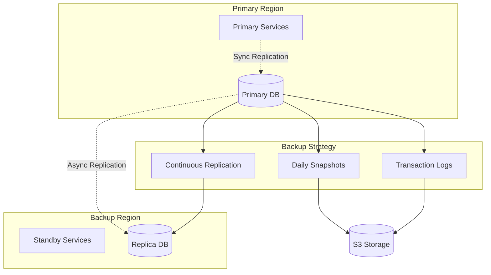

**RTO/RPO Targets:**
- **RTO** (Recovery Time Objective): < 15 minutes
- **RPO** (Recovery Point Objective): < 5 minutes

---

## Related Systems

This Twitter architecture shares patterns with:

| System | Common Pattern | Reference |
|--------|---------------|-----------|
| **YouTube** | Timeline feeds, engagement metrics | `youtube.md` |
| **WhatsApp** | Real-time messaging, notifications | `whatsapp.md` |
| **Instagram** | Social graph, content feeds | Similar to Twitter |
| **Amazon** | Search, recommendations | `amazon.md` |
| **Uber** | Real-time updates, geo-routing | `uber.md` |
| **Netflix** | Personalization algorithms | `netflix.md` |
| **Telegram** | Message delivery, real-time chat | `telegram.md` |

### Key Differences from Other Systems:

**vs YouTube:**
- Twitter: Short-form text content, real-time delivery
- YouTube: Long-form video, CDN-heavy architecture

**vs WhatsApp:**
- Twitter: Public broadcasting, one-to-many
- WhatsApp: Private messaging, end-to-end encryption

**vs Instagram:**
- Twitter: Text-first, trending topics, real-time nature
- Instagram: Image-first, algorithmic discovery

---

## Deployment Architecture

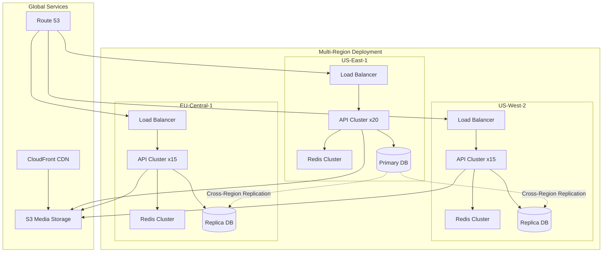

---

## Advanced Features

### 1. Twitter Spaces (Live Audio)

```javascript
// spaces-service.js
class TwitterSpacesService {
  async createSpace(hostId, config) {
    const space = {
      id: this.generateId(),
      hostId,
      title: config.title,
      status: 'scheduled',
      scheduledStart: config.startTime,
      participants: [hostId],
      listeners: [],
      maxParticipants: 10,
      maxListeners: 1000
    };

    await this.spaceDB.create(space);
    return space;
  }

  async joinSpace(userId, spaceId, role = 'listener') {
    const space = await this.getSpace(spaceId);

    if (role === 'speaker' && space.participants.length >= space.maxParticipants) {
      throw new Error('Space is full');
    }

    // WebRTC signaling
    const iceServers = await this.getICEServers();
    
    return {
      spaceId,
      role,
      iceServers,
      signalingUrl: `wss://spaces.twitter.com/${spaceId}`
    };
  }
}
```

### 2. Polls

```javascript
// poll-service.js
class PollService {
  async createPoll(tweetId, options, duration) {
    const poll = {
      id: this.generateId(),
      tweetId,
      options: options.map(text => ({
        id: this.generateId(),
        text,
        votes: 0
      })),
      duration, // in seconds
      expiresAt: Date.now() + (duration * 1000),
      totalVotes: 0
    };

    await this.pollDB.create(poll);
    return poll;
  }

  async vote(userId, pollId, optionId) {
    // Check if already voted
    const existingVote = await this.voteDB.findOne({ userId, pollId });
    if (existingVote) {
      throw new Error('Already voted');
    }

    // Record vote
    await this.voteDB.insert({ userId, pollId, optionId, timestamp: Date.now() });

    // Update counts atomically
    await this.pollDB.increment(
      { id: pollId, 'options.id': optionId },
      { 'options.$.votes': 1, totalVotes: 1 }
    );

    // Return updated results
    return await this.getPollResults(pollId);
  }

  async getPollResults(pollId) {
    const poll = await this.pollDB.findById(pollId);
    
    return {
      ...poll,
      options: poll.options.map(opt => ({
        ...opt,
        percentage: poll.totalVotes > 0 
          ? (opt.votes / poll.totalVotes * 100).toFixed(1)
          : 0
      }))
    };
  }
}
```

### 3. Twitter Blue (Subscription Service)

```javascript
// subscription-service.js
class SubscriptionService {
  async subscribe(userId, plan) {
    // Process payment
    const payment = await this.paymentGateway.charge(userId, plan.price);

    // Create subscription
    const subscription = {
      userId,
      plan: plan.name,
      status: 'active',
      startDate: Date.now(),
      renewalDate: Date.now() + (plan.duration * 86400000), // days to ms
      features: plan.features
    };

    await this.subscriptionDB.insert(subscription);

    // Grant features
    await this.userService.grantFeatures(userId, plan.features);

    return subscription;
  }

  async checkFeatureAccess(userId, feature) {
    const subscription = await this.subscriptionDB.findOne({
      userId,
      status: 'active',
      features: { $in: [feature] }
    });

    return subscription !== null;
  }

  // Blue checkmark verification
  async verifyAccount(userId, verificationData) {
    // Automated checks
    const checks = await Promise.all([
      this.verifyPhoneNumber(verificationData.phone),
      this.verifyEmail(verificationData.email),
      this.checkAccountAge(userId),
      this.checkAccountActivity(userId)
    ]);

    const allPassed = checks.every(c => c.passed);

    if (allPassed) {
      await this.userService.update(userId, { 
        verified: true,
        verifiedAt: Date.now()
      });
    }

    return { verified: allPassed, checks };
  }
}
```

---

## Testing Strategy

### Load Testing

```javascript
// load-test-scenarios.js
const loadTestScenarios = {
  normalLoad: {
    duration: '1h',
    users: {
      active: 50000000, // 50M concurrent
      rampUp: '10m'
    },
    operations: {
      readTimeline: { weight: 0.50, rpm: 100 }, // 100 requests per user per minute
      postTweet: { weight: 0.10, rpm: 2 },
      likeTweet: { weight: 0.15, rpm: 10 },
      search: { weight: 0.10, rpm: 5 },
      viewProfile: { weight: 0.10, rpm: 8 },
      directMessage: { weight: 0.05, rpm: 1 }
    }
  },

  viralEvent: {
    // Simulate major event (e.g., Super Bowl)
    duration: '3h',
    peakWindow: '30m',
    baseline: 50000000,
    peak: 200000000,
    operations: {
      readTimeline: { weight: 0.60, rpm: 150 },
      postTweet: { weight: 0.25, rpm: 10 }, // 10x normal
      search: { weight: 0.15, rpm: 20 }
    }
  },

  celebrityTweet: {
    // Celebrity with 100M followers posts
    followerCount: 100000000,
    activeFollowers: 10000000, // 10% active
    operations: {
      fanout: {
        duration: '5m',
        targetLatency: 'p99 < 30s'
      },
      timelineRefresh: {
        concurrent: 5000000,
        targetLatency: 'p95 < 500ms'
      }
    }
  }
};
```

### Chaos Engineering

```javascript
// chaos-tests.js
const chaosScenarios = {
  databaseFailure: async () => {
    // Simulate primary DB failure
    await shutdownNode('db-primary-1');
    // Verify failover to replica
    await waitForFailover(30000); // 30s
    // Verify writes continue
    await verifyWriteCapability();
  },

  networkPartition: async () => {
    // Simulate network split between regions
    await injectNetworkLatency('us-east', 'eu-west', 5000); // 5s delay
    // Verify eventual consistency
    await verifyDataConsistency(300000); // 5 min
  },

  cacheFailure: async () => {
    // Flush all Redis caches
    await flushAllCaches();
    // Verify graceful degradation
    await verifyTimelineLoad(); // Should fall back to DB
    await verifyLatency(2000); // Should be < 2s even without cache
  },

  kafkaLag: async () => {
    // Stop Kafka consumers
    await stopConsumers('fanout-workers');
    // Generate load
    await generateTweets(10000);
    // Verify lag recovery
    await waitForConsumerCatchup(600000); // 10 min
  }
};
```

---

## Cost Optimization

### Resource Utilization

```javascript
// cost-optimizer.js
class CostOptimizer {
  async optimizeResources() {
    // Analyze usage patterns
    const patterns = await this.analyzeUsagePatterns();

    // Scale down during off-peak hours
    if (patterns.currentLoad < patterns.avgLoad * 0.5) {
      await this.scaleDown(0.7); // Scale to 70%
    }

    // Use spot instances for batch jobs
    await this.migrateToSpot(['transcode-workers', 'analytics-workers']);

    // Optimize storage tiers
    await this.tieredStorage();
  }

  async tieredStorage() {
    // Move old tweets to cold storage
    const oldTweets = await this.getTweetsOlderThan(365); // 1 year
    
    for (const tweet of oldTweets) {
      if (tweet.viewCount < 100) {
        await this.moveToGlacier(tweet);
      }
    }

    // Archive inactive user data
    const inactiveUsers = await this.getInactiveUsers(730); // 2 years
    
    for (const user of inactiveUsers) {
      await this.archiveUserData(user);
    }
  }

  async optimizeCDN() {
    // Analyze CDN usage
    const cdnStats = await this.getCDNStats();

    // Switch to cheaper CDN for low-traffic regions
    for (const [region, stats] of Object.entries(cdnStats)) {
      if (stats.bandwidth < stats.threshold) {
        await this.switchCDNProvider(region, 'cost-effective');
      }
    }
  }
}
```

**Monthly Cost Breakdown (Example):**
```
Compute: $2M (50%)
- API Servers: $800K
- Background Workers: $600K
- ML Services: $400K
- Other: $200K

Storage: $1.2M (30%)
- Database: $500K
- Object Storage (Media): $400K
- Cache: $200K
- Backups: $100K

Network: $600K (15%)
- CDN: $300K
- Data Transfer: $200K
- Load Balancers: $100K

Other: $200K (5%)
- Monitoring: $100K
- Third-party Services: $100K

Total: ~$4M/month
```

---

## Machine Learning Systems

### Recommendation Engine

```javascript
// ml-recommendation-engine.js
class MLRecommendationEngine {
  async trainModel(trainingData) {
    // Features for recommendation
    const features = {
      userFeatures: [
        'account_age',
        'follower_count',
        'following_count',
        'tweet_count',
        'engagement_rate',
        'topics_of_interest',
        'activity_pattern',
        'device_type',
        'location'
      ],
      tweetFeatures: [
        'author_follower_count',
        'engagement_count',
        'recency',
        'has_media',
        'sentiment_score',
        'topics',
        'language',
        'verified_author'
      ],
      interactionFeatures: [
        'previous_interactions_with_author',
        'topic_affinity',
        'engagement_probability',
        'dwell_time_prediction'
      ]
    };

    // Two-tower neural network model
    const model = this.buildTwoTowerModel(features);
    
    await model.train(trainingData, {
      epochs: 10,
      batchSize: 1024,
      validationSplit: 0.2
    });

    await this.deployModel(model, 'v1.2.0');
  }

  async generateRecommendations(userId, context) {
    // Get candidate tweets
    const candidates = await this.candidateGeneration(userId, 500);

    // Score with ML model
    const userEmbedding = await this.getUserEmbedding(userId);
    
    const scored = candidates.map(tweet => ({
      tweet,
      score: this.model.predict(userEmbedding, tweet.embedding)
    }));

    // Re-rank based on diversity and freshness
    const reranked = this.diversityRerank(scored);

    return reranked.slice(0, context.limit || 50);
  }

  diversityRerank(tweets) {
    // MMR (Maximal Marginal Relevance) for diversity
    const selected = [];
    const remaining = [...tweets];

    while (selected.length < 20 && remaining.length > 0) {
      let bestTweet = null;
      let bestScore = -Infinity;

      for (const tweet of remaining) {
        // Balance relevance and diversity
        const relevance = tweet.score;
        const diversity = this.calculateDiversity(tweet, selected);
        const mmrScore = 0.7 * relevance + 0.3 * diversity;

        if (mmrScore > bestScore) {
          bestScore = mmrScore;
          bestTweet = tweet;
        }
      }

      selected.push(bestTweet);
      remaining.splice(remaining.indexOf(bestTweet), 1);
    }

    return selected;
  }
}
```

### Content Understanding

```javascript
// content-understanding.js
class ContentUnderstanding {
  async analyzeTweet(tweet) {
    const [
      sentiment,
      topics,
      entities,
      language,
      toxicity
    ] = await Promise.all([
      this.sentimentAnalysis(tweet.text),
      this.topicClassification(tweet.text),
      this.entityExtraction(tweet.text),
      this.languageDetection(tweet.text),
      this.toxicityDetection(tweet.text)
    ]);

    return {
      sentiment: sentiment.score, // -1 to 1
      topics: topics.slice(0, 5), // Top 5 topics
      entities: entities, // People, places, organizations
      language: language.code,
      toxicity: toxicity.scores,
      embedding: await this.generateEmbedding(tweet.text)
    };
  }

  async generateEmbedding(text) {
    // Use BERT or similar transformer model
    const tokens = this.tokenizer.encode(text);
    const embedding = await this.embeddingModel.encode(tokens);
    return embedding; // 768-dimensional vector
  }

  async semanticSearch(query, limit = 100) {
    // Convert query to embedding
    const queryEmbedding = await this.generateEmbedding(query);

    // Vector similarity search
    const results = await this.vectorDB.search(
      queryEmbedding,
      {
        limit,
        metric: 'cosine'
      }
    );

    return results;
  }
}
```

---

## Mobile App Considerations

### Offline Support

```javascript
// offline-manager.js
class OfflineManager {
  async syncWhenOnline() {
    if (!navigator.onLine) {
      return this.queueForLater();
    }

    // Sync queued tweets
    const queuedTweets = await this.getQueuedTweets();
    
    for (const tweet of queuedTweets) {
      try {
        await this.tweetService.post(tweet);
        await this.removeFromQueue(tweet.id);
      } catch (error) {
        console.error('Failed to sync tweet:', error);
      }
    }

    // Sync read receipts
    await this.syncReadReceipts();

    // Download latest timeline for offline viewing
    await this.cacheTimeline();
  }

  async cacheTimeline() {
    const timeline = await this.timelineService.getHomeTimeline({
      limit: 100
    });

    // Store in IndexedDB
    await this.indexedDB.put('cachedTimeline', {
      tweets: timeline.tweets,
      cachedAt: Date.now(),
      expiresAt: Date.now() + 3600000 // 1 hour
    });
  }
}
```

### Data Compression

```javascript
// data-compression.js
class DataCompression {
  compressTweet(tweet) {
    // Remove redundant data
    return {
      i: tweet.id,
      u: tweet.userId,
      t: tweet.text,
      c: tweet.createdAt,
      l: tweet.likes,
      r: tweet.retweets,
      // Omit null/undefined fields
    };
  }

  compressTimeline(timeline) {
    // Compress entire timeline
    const compressed = timeline.tweets.map(this.compressTweet);
    
    // Use gzip compression
    const json = JSON.stringify(compressed);
    const gzipped = pako.gzip(json);
    
    // ~70% size reduction
    return gzipped;
  }
}
```

---

## Future Enhancements

### Potential Improvements

1. **GraphQL API**
   - Replace REST with GraphQL for flexible queries
   - Reduce over-fetching and under-fetching
   - Better mobile performance

2. **Edge Computing**
   - Move computation closer to users
   - Cloudflare Workers for timeline generation
   - Reduce latency to < 50ms globally

3. **Blockchain Integration**
   - Decentralized identity verification
   - NFT profile pictures
   - Cryptocurrency tipping

4. **Advanced AI Features**
   - Auto-translation for all languages
   - AI-powered content suggestions
   - Smart reply recommendations
   - Automated thread summarization

5. **Enhanced Privacy**
   - End-to-end encrypted DMs
   - Disappearing tweets
   - Ephemeral spaces
   - Anonymous posting modes

---

## Conclusion

Twitter's architecture demonstrates critical patterns for real-time social platforms:

✅ **Hybrid Fanout**: Balances write amplification and read latency  
✅ **Event-Driven**: Async processing for scalability  
✅ **Multi-Layer Caching**: Sub-second timeline loads  
✅ **Real-Time Delivery**: WebSocket + Push notifications  
✅ **ML-Powered Ranking**: Personalized content discovery  
✅ **Horizontal Scalability**: Handle 500M+ DAU  
✅ **Global Distribution**: Low latency worldwide  

### Key Takeaways

1. **Choose the right fanout strategy** based on user follower count
2. **Cache aggressively** but invalidate intelligently
3. **Process asynchronously** for better write throughput
4. **Use multiple databases** optimized for different workloads
5. **Monitor everything** - metrics, logs, traces
6. **Plan for virality** - system must handle 10x spikes
7. **Optimize for reads** - reads are 100x more common than writes

---

## Cross-References Summary

**Similar to:**
- **YouTube** (`youtube.md`): Content feeds, recommendation engines
- **WhatsApp** (`whatsapp.md`): Real-time messaging, notifications
- **Instagram**: Social graph, timeline generation
- **Amazon** (`amazon.md`): Search infrastructure, personalization
- **Uber** (`uber.md`): Real-time location updates, push notifications
- **Netflix** (`netflix.md`): ML recommendation systems
- **Telegram** (`telegram.md`): Message delivery, group chats

**Key Differences:**
- Public vs private content
- Real-time vs on-demand
- Short-form vs long-form content
- Social graph vs transaction history

---

**Last Updated**: September 30, 2025  
**Architecture Version**: 5.0  
**Document Maintained By**: System Design Team  
**Status**: Production-Ready