# Uber System Design - Complete Architecture

## Table of Contents
1. [Overview](#overview)
2. [System Requirements](#system-requirements)
3. [High-Level Architecture](#high-level-architecture)
4. [Core Components](#core-components)
5. [Data Flow](#data-flow)
6. [Database Design](#database-design)
7. [Scalability & Performance](#scalability--performance)
8. [Real-Time Systems](#real-time-systems)
9. [Deployment Architecture](#deployment-architecture)
10. [Related Case Studies](#related-case-studies)

---

## Overview

Uber is a real-time ride-hailing platform that connects riders with drivers. The system must handle:
- Real-time location tracking
- Dynamic pricing (surge pricing)
- Efficient driver-rider matching
- Payment processing
- Trip management
- High availability and low latency

### Scale Requirements
- **Users**: 100M+ active users
- **Daily Rides**: 15M+ rides/day
- **Peak Traffic**: 5000+ requests/second
- **Geospatial Queries**: Real-time location updates every 4-5 seconds
- **Latency**: <100ms for matching, <3s for ride requests

---

## System Requirements

### Functional Requirements
1. **User Management**
   - Rider registration and authentication
   - Driver registration with verification
   - Profile management

2. **Ride Booking**
   - Request a ride with pickup/dropoff locations
   - Real-time driver availability
   - ETA calculation
   - Fare estimation

3. **Driver Matching**
   - Find nearby available drivers
   - Optimize matching algorithm
   - Handle driver acceptance/rejection

4. **Trip Management**
   - Track ongoing trips
   - Real-time location updates
   - Route optimization
   - Trip completion and payment

5. **Payment Processing**
   - Multiple payment methods
   - Split payments
   - Driver payouts
   - Surge pricing calculation

### Non-Functional Requirements
1. **Performance**
   - Low latency (<100ms for critical operations)
   - High throughput (millions of concurrent users)
   - Real-time updates

2. **Scalability**
   - Horizontal scalability
   - Handle geographic distribution
   - Peak load management

3. **Availability**
   - 99.99% uptime
   - Fault tolerance
   - Disaster recovery

4. **Consistency**
   - Eventual consistency for location data
   - Strong consistency for payments
   - Transaction integrity

---

## High-Level Architecture

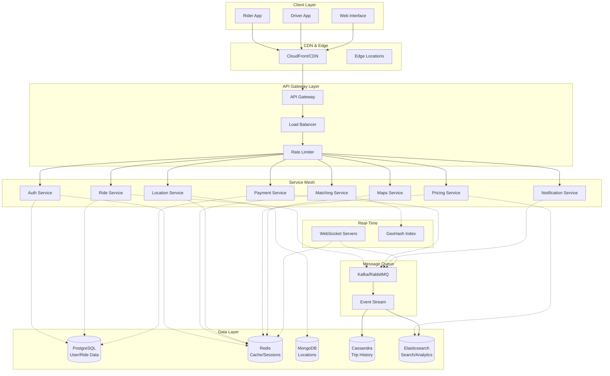
```mermaid
graph TB
    subgraph "Client Layer"
        RC[Rider App]
        DC[Driver App]
        WEB[Web Interface]
    end

    subgraph "CDN & Edge"
        CDN[CloudFront/CDN]
        EDGE[Edge Locations]
    end

    subgraph "API Gateway Layer"
        AGW[API Gateway]
        LB[Load Balancer]
        RATE[Rate Limiter]
    end

    subgraph "Service Mesh"
        AUTH[Auth Service]
        RIDE[Ride Service]
        MATCH[Matching Service]
        LOC[Location Service]
        PRICE[Pricing Service]
        PAY[Payment Service]
        NOTIF[Notification Service]
        MAP[Maps Service]
    end

    subgraph "Data Layer"
        PG[(PostgreSQL<br/>User/Ride Data)]
        REDIS[(Redis<br/>Cache/Sessions)]
        MONGO[(MongoDB<br/>Locations)]
        CASS[(Cassandra<br/>Trip History)]
        ES[(Elasticsearch<br/>Search/Analytics)]
    end

    subgraph "Message Queue"
        KAFKA[Kafka/RabbitMQ]
        STREAM[Event Stream]
    end

    subgraph "Real-Time"
        WS[WebSocket Servers]
        GEOHASH[GeoHash Index]
    end

    RC --> CDN
    DC --> CDN
    WEB --> CDN
    CDN --> AGW
    AGW --> LB
    LB --> RATE

    RATE --> AUTH
    RATE --> RIDE
    RATE --> MATCH
    RATE --> LOC
    RATE --> PRICE
    RATE --> PAY
    RATE --> NOTIF
    RATE --> MAP

    AUTH -.-> PG
    AUTH -.-> REDIS
    RIDE -.-> PG
    RIDE -.-> KAFKA
    MATCH -.-> REDIS
    MATCH -.-> GEOHASH
    LOC -.-> MONGO
    LOC -.-> REDIS
    PRICE -.-> REDIS
    PRICE -.-> ES
    PAY -.-> PG
    PAY -.-> KAFKA
    NOTIF -.-> KAFKA
    MAP -.-> REDIS

    KAFKA --> STREAM
    STREAM --> ES
    STREAM --> CASS

    WS -.-> REDIS
    WS -.-> KAFKA
```

---

## Core Components

### 1. API Gateway

**Purpose**: Single entry point for all client requests

**Responsibilities**:
- Request routing
- Authentication/Authorization
- Rate limiting
- Request/Response transformation
- Circuit breaking
- API versioning

**Technology Stack**: Kong, AWS API Gateway, or custom Nginx

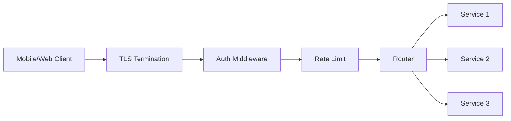
```mermaid
graph LR
    CLIENT[Mobile/Web Client] --> TLS[TLS Termination]
    TLS --> AUTH_MW[Auth Middleware]
    AUTH_MW --> RATE_MW[Rate Limit]
    RATE_MW --> ROUTE[Router]
    ROUTE --> SVC1[Service 1]
    ROUTE --> SVC2[Service 2]
    ROUTE --> SVC3[Service 3]
```

### 2. Authentication Service

**Purpose**: Manage user identity and access control

**Features**:
- JWT-based authentication
- OAuth 2.0 integration
- Multi-factor authentication
- Session management
- Token refresh mechanism

**Flow**:
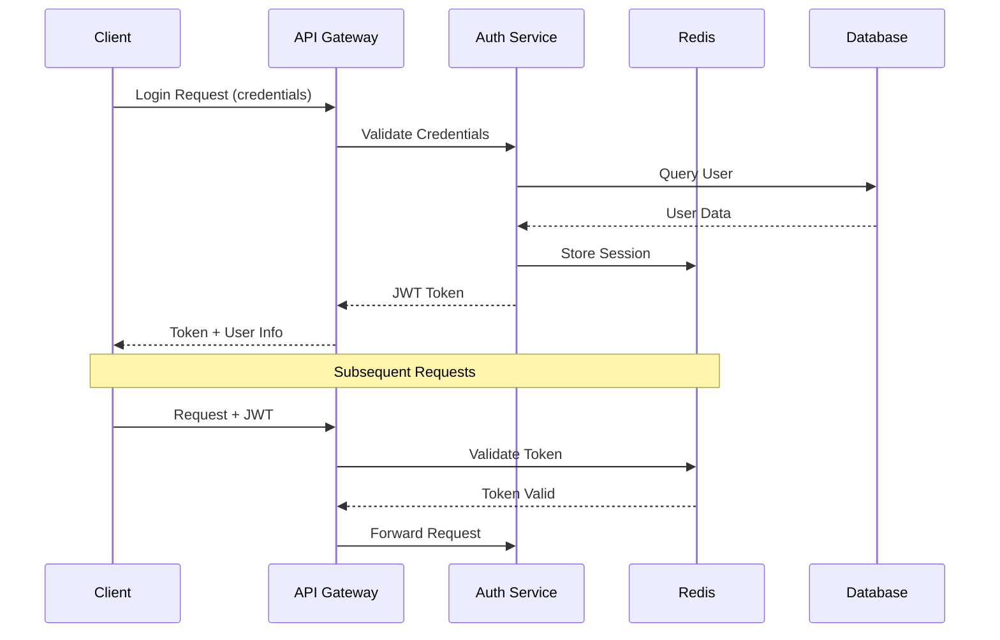
```mermaid
sequenceDiagram
    participant Client
    participant API Gateway
    participant Auth Service
    participant Redis
    participant Database

    Client->>API Gateway: Login Request (credentials)
    API Gateway->>Auth Service: Validate Credentials
    Auth Service->>Database: Query User
    Database-->>Auth Service: User Data
    Auth Service->>Redis: Store Session
    Auth Service-->>API Gateway: JWT Token
    API Gateway-->>Client: Token + User Info
    
    Note over Client,Redis: Subsequent Requests
    
    Client->>API Gateway: Request + JWT
    API Gateway->>Redis: Validate Token
    Redis-->>API Gateway: Token Valid
    API Gateway->>Auth Service: Forward Request
```

### 3. Location Service

**Purpose**: Handle real-time location tracking and geospatial queries

**Key Features**:
- Receive location updates from drivers
- Store in time-series format
- GeoHash indexing for proximity search
- Location history tracking

**GeoHash Strategy**:
- Divide world into grid cells
- Each cell has unique hash
- Precision: 6-character geohash (~1.2km x 0.6km)
- Enables fast proximity queries

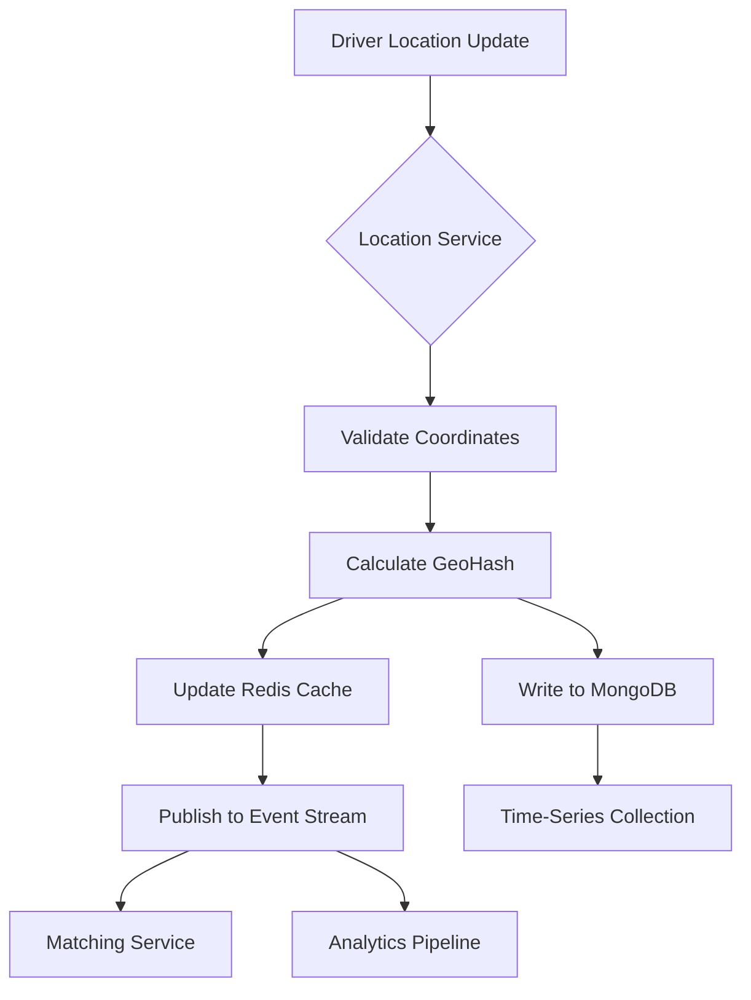
```mermaid
graph TD
    A[Driver Location Update] --> B{Location Service}
    B --> C[Validate Coordinates]
    C --> D[Calculate GeoHash]
    D --> E[Update Redis Cache]
    D --> F[Write to MongoDB]
    E --> G[Publish to Event Stream]
    F --> H[Time-Series Collection]
    G --> I[Matching Service]
    G --> J[Analytics Pipeline]
```

### 4. Matching Service

**Purpose**: Connect riders with nearby available drivers

**Algorithm**:
1. Receive ride request with pickup location
2. Calculate GeoHash for pickup
3. Query nearby drivers (expanding radius)
4. Rank drivers by distance, rating, acceptance rate
5. Send requests to top 3-5 drivers
6. Handle acceptance/timeout
7. Assign driver to rider

**Optimization Techniques**:
- **Spatial Indexing**: Redis GeoSpatial commands
- **Caching**: Driver availability in Redis
- **Priority Queue**: Rank drivers efficiently
- **Timeout Handling**: 15-30 second driver response window

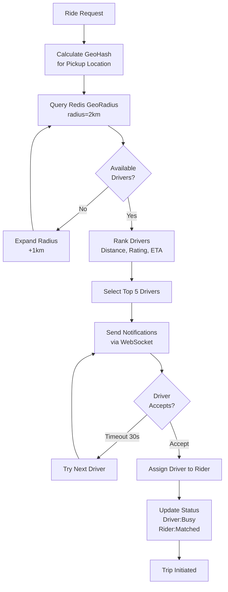
```mermaid
flowchart TD
    START[Ride Request] --> GEOHASH[Calculate GeoHash<br/>for Pickup Location]
    GEOHASH --> QUERY[Query Redis GeoRadius<br/>radius=2km]
    QUERY --> CHECK{Available<br/>Drivers?}
    CHECK -->|No| EXPAND[Expand Radius<br/>+1km]
    EXPAND --> QUERY
    CHECK -->|Yes| RANK[Rank Drivers<br/>Distance, Rating, ETA]
    RANK --> SELECT[Select Top 5 Drivers]
    SELECT --> NOTIFY[Send Notifications<br/>via WebSocket]
    NOTIFY --> WAIT{Driver<br/>Accepts?}
    WAIT -->|Timeout 30s| NEXT[Try Next Driver]
    NEXT --> NOTIFY
    WAIT -->|Accept| ASSIGN[Assign Driver to Rider]
    ASSIGN --> UPDATE[Update Status<br/>Driver:Busy<br/>Rider:Matched]
    UPDATE --> END[Trip Initiated]
```

### 5. Pricing Service

**Purpose**: Calculate fare estimates and implement surge pricing

**Components**:
- **Base Fare Calculation**: Distance + time-based
- **Surge Pricing**: Supply/demand algorithm
- **Promotions**: Discount codes and offers
- **Historical Data**: ML models for prediction

**Surge Pricing Algorithm**:
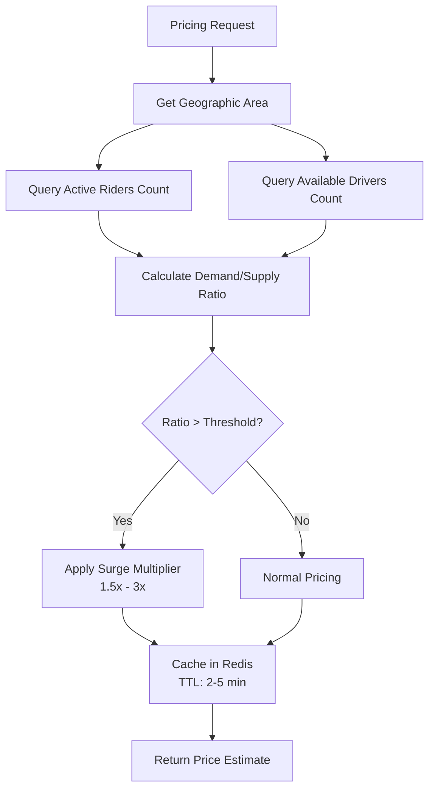
```mermaid
graph TD
    A[Pricing Request] --> B[Get Geographic Area]
    B --> C[Query Active Riders Count]
    B --> D[Query Available Drivers Count]
    C --> E[Calculate Demand/Supply Ratio]
    D --> E
    E --> F{Ratio > Threshold?}
    F -->|Yes| G[Apply Surge Multiplier<br/>1.5x - 3x]
    F -->|No| H[Normal Pricing]
    G --> I[Cache in Redis<br/>TTL: 2-5 min]
    H --> I
    I --> J[Return Price Estimate]
```

### 6. Trip Management Service

**Purpose**: Handle end-to-end trip lifecycle

**States**:
1. REQUESTED
2. DRIVER_ASSIGNED
3. DRIVER_ARRIVED
4. TRIP_STARTED
5. TRIP_COMPLETED
6. PAYMENT_PROCESSED

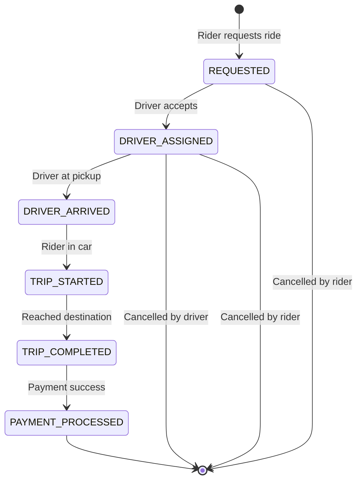
```mermaid
stateDiagram-v2
    [*] --> REQUESTED: Rider requests ride
    REQUESTED --> DRIVER_ASSIGNED: Driver accepts
    DRIVER_ASSIGNED --> DRIVER_ARRIVED: Driver at pickup
    DRIVER_ARRIVED --> TRIP_STARTED: Rider in car
    TRIP_STARTED --> TRIP_COMPLETED: Reached destination
    TRIP_COMPLETED --> PAYMENT_PROCESSED: Payment success
    PAYMENT_PROCESSED --> [*]
    
    REQUESTED --> [*]: Cancelled by rider
    DRIVER_ASSIGNED --> [*]: Cancelled by driver
    DRIVER_ASSIGNED --> [*]: Cancelled by rider
```

### 7. Payment Service

**Purpose**: Handle all financial transactions

**Features**:
- Multiple payment methods (cards, wallets, cash)
- Split payments
- Automatic retries
- Refunds and adjustments
- Driver payouts
- Fraud detection

**Payment Flow**:
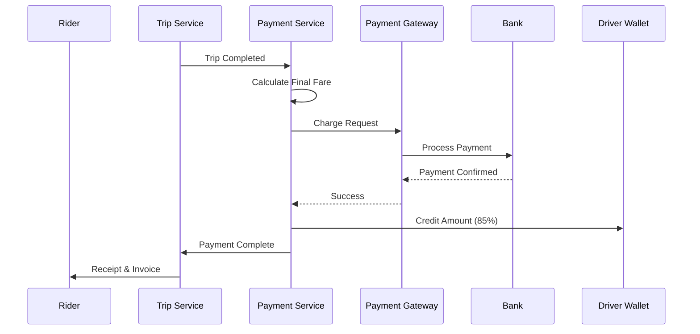
```mermaid
sequenceDiagram
    participant Rider
    participant Trip Service
    participant Payment Service
    participant Payment Gateway
    participant Bank
    participant Driver Wallet

    Trip Service->>Payment Service: Trip Completed
    Payment Service->>Payment Service: Calculate Final Fare
    Payment Service->>Payment Gateway: Charge Request
    Payment Gateway->>Bank: Process Payment
    Bank-->>Payment Gateway: Payment Confirmed
    Payment Gateway-->>Payment Service: Success
    Payment Service->>Driver Wallet: Credit Amount (85%)
    Payment Service->>Trip Service: Payment Complete
    Trip Service->>Rider: Receipt & Invoice
```

### 8. Notification Service

**Purpose**: Real-time notifications to riders and drivers

**Channels**:
- Push notifications (FCM/APNS)
- SMS
- In-app notifications
- Email

**Event-Driven Architecture**:
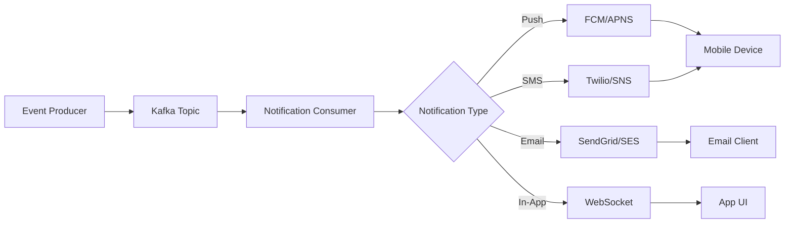
```mermaid
graph LR
    A[Event Producer] --> B[Kafka Topic]
    B --> C[Notification Consumer]
    C --> D{Notification Type}
    D -->|Push| E[FCM/APNS]
    D -->|SMS| F[Twilio/SNS]
    D -->|Email| G[SendGrid/SES]
    D -->|In-App| H[WebSocket]
    E --> I[Mobile Device]
    F --> I
    G --> J[Email Client]
    H --> K[App UI]
```

---

## Data Flow: Complete Request Lifecycle

### End-to-End Flow: From Frontend to Deployment

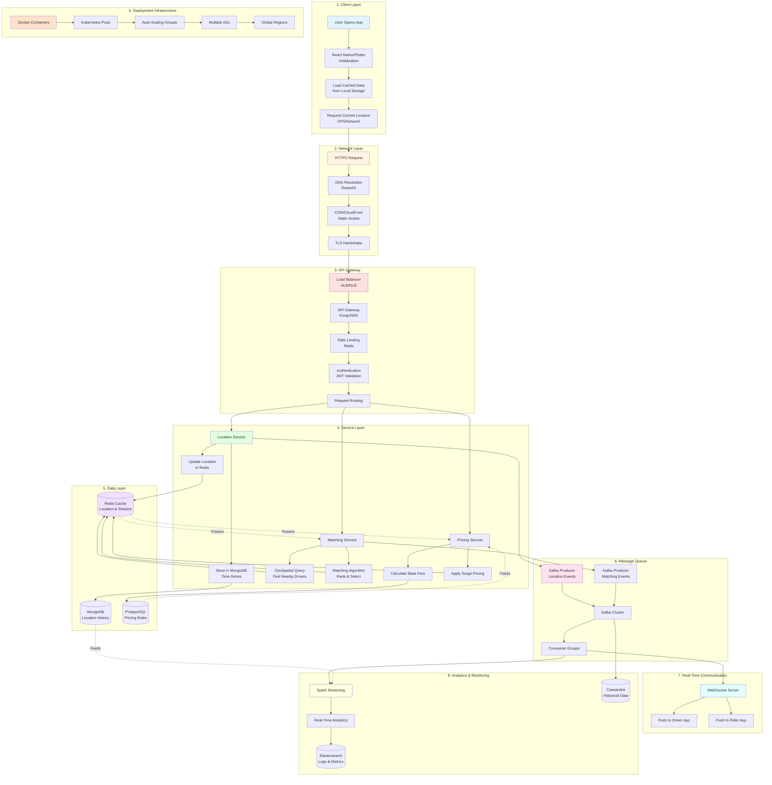
```mermaid
flowchart TD
    subgraph "1. Client Layer"
        A1[User Opens App] --> A2[React Native/Flutter<br/>Initialization]
        A2 --> A3[Load Cached Data<br/>from Local Storage]
        A3 --> A4[Request Current Location<br/>GPS/Network]
    end

    subgraph "2. Network Layer"
        A4 --> B1[HTTPS Request]
        B1 --> B2[DNS Resolution<br/>Route53]
        B2 --> B3[CDN/CloudFront<br/>Static Assets]
        B3 --> B4[TLS Handshake]
    end

    subgraph "3. API Gateway"
        B4 --> C1[Load Balancer<br/>ALB/NLB]
        C1 --> C2[API Gateway<br/>Kong/AWS]
        C2 --> C3[Rate Limiting<br/>Redis]
        C3 --> C4[Authentication<br/>JWT Validation]
        C4 --> C5[Request Routing]
    end

    subgraph "4. Service Layer"
        C5 --> D1[Location Service]
        C5 --> D2[Matching Service]
        C5 --> D3[Pricing Service]
        
        D1 --> D4[Update Location<br/>in Redis]
        D1 --> D5[Store in MongoDB<br/>Time-Series]
        
        D2 --> D6[GeoSpatial Query<br/>Find Nearby Drivers]
        D2 --> D7[Matching Algorithm<br/>Rank & Select]
        
        D3 --> D8[Calculate Base Fare]
        D3 --> D9[Apply Surge Pricing]
    end

    subgraph "5. Data Layer"
        D4 --> E1[(Redis Cache<br/>Location & Session)]
        D5 --> E2[(MongoDB<br/>Location History)]
        D6 --> E1
        D7 --> E1
        D8 --> E3[(PostgreSQL<br/>Pricing Rules)]
        D9 --> E1
    end

    subgraph "6. Message Queue"
        D1 --> F1[Kafka Producer<br/>Location Events]
        D2 --> F2[Kafka Producer<br/>Matching Events]
        F1 --> F3[Kafka Cluster]
        F2 --> F3
        F3 --> F4[Consumer Groups]
    end

    subgraph "7. Real-Time Communication"
        F4 --> G1[WebSocket Server]
        G1 --> G2[Push to Driver App]
        G1 --> G3[Push to Rider App]
    end

    subgraph "8. Analytics & Monitoring"
        F4 --> H1[Spark Streaming]
        H1 --> H2[Real-Time Analytics]
        H2 --> H3[(Elasticsearch<br/>Logs & Metrics)]
        F3 --> H4[(Cassandra<br/>Historical Data)]
    end

    subgraph "9. Deployment Infrastructure"
        I1[Docker Containers] --> I2[Kubernetes Pods]
        I2 --> I3[Auto-Scaling Groups]
        I3 --> I4[Multiple AZs]
        I4 --> I5[Global Regions]
    end

    E1 -.->|Powers| D2
    E1 -.->|Powers| D3
    E2 -.->|Feeds| H1
    E3 -.->|Feeds| D3

    style A1 fill:#e1f5ff
    style B1 fill:#fff4e1
    style C1 fill:#ffe1e1
    style D1 fill:#e1ffe1
    style E1 fill:#f0e1ff
    style F1 fill:#ffe1f0
    style G1 fill:#e1ffff
    style H1 fill:#ffffe1
    style I1 fill:#ffe1cc
```

### Detailed Ride Request Flow

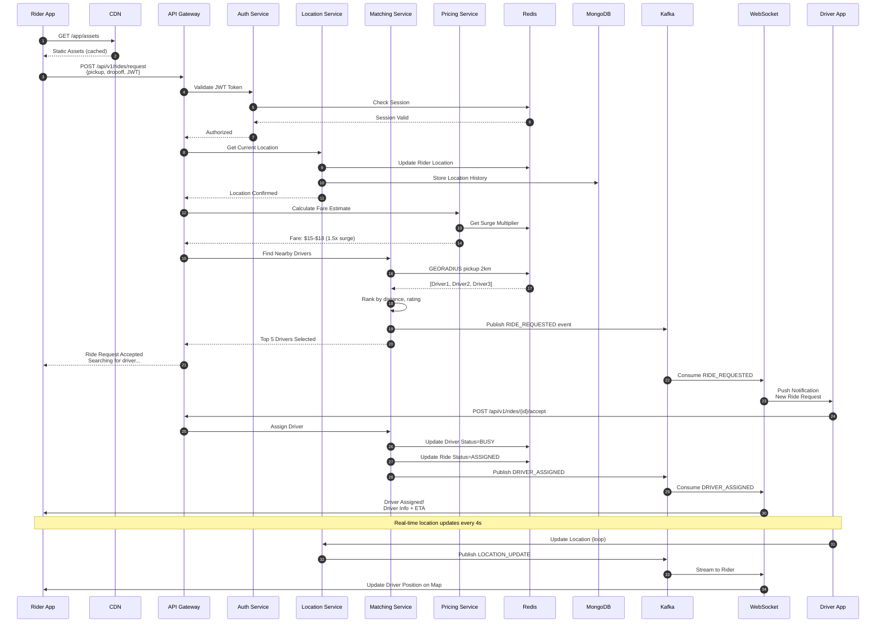
```mermaid
sequenceDiagram
    autonumber
    participant Rider App
    participant CDN
    participant API Gateway
    participant Auth Service
    participant Location Service
    participant Matching Service
    participant Pricing Service
    participant Redis
    participant MongoDB
    participant Kafka
    participant WebSocket
    participant Driver App

    Rider App->>CDN: GET /app/assets
    CDN-->>Rider App: Static Assets (cached)
    
    Rider App->>API Gateway: POST /api/v1/rides/request<br/>{pickup, dropoff, JWT}
    API Gateway->>Auth Service: Validate JWT Token
    Auth Service->>Redis: Check Session
    Redis-->>Auth Service: Session Valid
    Auth Service-->>API Gateway: Authorized
    
    API Gateway->>Location Service: Get Current Location
    Location Service->>Redis: Update Rider Location
    Location Service->>MongoDB: Store Location History
    Location Service-->>API Gateway: Location Confirmed
    
    API Gateway->>Pricing Service: Calculate Fare Estimate
    Pricing Service->>Redis: Get Surge Multiplier
    Pricing Service-->>API Gateway: Fare: $15-$18 (1.5x surge)
    
    API Gateway->>Matching Service: Find Nearby Drivers
    Matching Service->>Redis: GEORADIUS pickup 2km
    Redis-->>Matching Service: [Driver1, Driver2, Driver3]
    Matching Service->>Matching Service: Rank by distance, rating
    Matching Service->>Kafka: Publish RIDE_REQUESTED event
    Matching Service-->>API Gateway: Top 5 Drivers Selected
    
    API Gateway-->>Rider App: Ride Request Accepted<br/>Searching for driver...
    
    Kafka->>WebSocket: Consume RIDE_REQUESTED
    WebSocket->>Driver App: Push Notification<br/>New Ride Request
    
    Driver App->>API Gateway: POST /api/v1/rides/{id}/accept
    API Gateway->>Matching Service: Assign Driver
    Matching Service->>Redis: Update Driver Status=BUSY
    Matching Service->>Redis: Update Ride Status=ASSIGNED
    Matching Service->>Kafka: Publish DRIVER_ASSIGNED
    
    Kafka->>WebSocket: Consume DRIVER_ASSIGNED
    WebSocket->>Rider App: Driver Assigned!<br/>Driver Info + ETA
    
    Note over Rider App,Driver App: Real-time location updates every 4s
    
    Driver App->>Location Service: Update Location (loop)
    Location Service->>Kafka: Publish LOCATION_UPDATE
    Kafka->>WebSocket: Stream to Rider
    WebSocket->>Rider App: Update Driver Position on Map
```

---

## Database Design

### PostgreSQL (Relational Data)

**Users Table**:
```
users
├── id (UUID, PK)
├── phone_number (VARCHAR, UNIQUE)
├── email (VARCHAR, UNIQUE)
├── full_name (VARCHAR)
├── user_type (ENUM: rider, driver)
├── rating (DECIMAL)
├── created_at (TIMESTAMP)
└── updated_at (TIMESTAMP)
```

**Drivers Table**:
```
drivers
├── id (UUID, PK, FK -> users.id)
├── vehicle_id (UUID, FK)
├── license_number (VARCHAR)
├── status (ENUM: available, busy, offline)
├── current_location (POINT)
├── acceptance_rate (DECIMAL)
└── total_trips (INTEGER)
```

**Rides Table**:
```
rides
├── id (UUID, PK)
├── rider_id (UUID, FK -> users.id)
├── driver_id (UUID, FK -> users.id)
├── pickup_location (POINT)
├── dropoff_location (POINT)
├── pickup_address (TEXT)
├── dropoff_address (TEXT)
├── status (ENUM)
├── fare_amount (DECIMAL)
├── surge_multiplier (DECIMAL)
├── distance_km (DECIMAL)
├── duration_minutes (INTEGER)
├── requested_at (TIMESTAMP)
├── started_at (TIMESTAMP)
├── completed_at (TIMESTAMP)
└── cancelled_at (TIMESTAMP)
```

**Payments Table**:
```
payments
├── id (UUID, PK)
├── ride_id (UUID, FK)
├── amount (DECIMAL)
├── payment_method (ENUM)
├── status (ENUM: pending, completed, failed, refunded)
├── transaction_id (VARCHAR)
├── created_at (TIMESTAMP)
└── processed_at (TIMESTAMP)
```

### MongoDB (Location & Time-Series Data)

**Driver Locations Collection**:
```json
{
  "_id": "ObjectId",
  "driver_id": "uuid",
  "location": {
    "type": "Point",
    "coordinates": [longitude, latitude]
  },
  "geohash": "u4pruyd",
  "accuracy": 10.5,
  "speed": 45.0,
  "heading": 180,
  "timestamp": "ISODate",
  "status": "available"
}
```

**Indexes**:
- `2dsphere` index on location
- `geohash` index for fast proximity search
- TTL index on timestamp (7 days retention)

### Redis (Cache & Real-Time Data)

**Key Patterns**:
```
session:{user_id} -> JWT token, expiry
driver:location:{driver_id} -> {lat, lng, geohash, timestamp}
driver:status:{driver_id} -> available|busy|offline
ride:active:{ride_id} -> ride state object
surge:area:{geohash} -> multiplier value, TTL: 5min
user:profile:{user_id} -> cached user data
```

**Geospatial Commands**:
```
GEOADD drivers:available longitude latitude driver_id
GEORADIUS drivers:available long lat 5 km WITHDIST
```

### Cassandra (Historical & Analytics)

**Trip History Table**:
```
CREATE TABLE trip_history (
    ride_id UUID,
    rider_id UUID,
    driver_id UUID,
    timestamp TIMESTAMP,
    location_lat DOUBLE,
    location_lng DOUBLE,
    speed DOUBLE,
    PRIMARY KEY ((ride_id), timestamp)
) WITH CLUSTERING ORDER BY (timestamp DESC);
```

---

## Scalability & Performance

### Horizontal Scaling Strategy

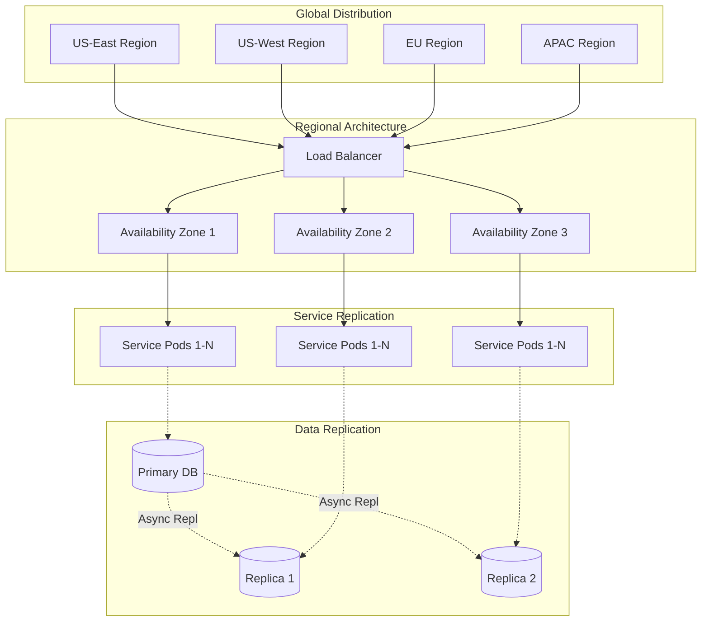
```mermaid
graph TD
    subgraph "Global Distribution"
        R1[US-East Region]
        R2[US-West Region]
        R3[EU Region]
        R4[APAC Region]
    end

    subgraph "Regional Architecture"
        direction TB
        LB1[Load Balancer]
        AZ1[Availability Zone 1]
        AZ2[Availability Zone 2]
        AZ3[Availability Zone 3]
        
        LB1 --> AZ1
        LB1 --> AZ2
        LB1 --> AZ3
    end

    subgraph "Service Replication"
        AZ1 --> S1[Service Pods 1-N]
        AZ2 --> S2[Service Pods 1-N]
        AZ3 --> S3[Service Pods 1-N]
    end

    subgraph "Data Replication"
        M1[(Primary DB)]
        M2[(Replica 1)]
        M3[(Replica 2)]
        
        M1 -.->|Async Repl| M2
        M1 -.->|Async Repl| M3
    end

    R1 --> LB1
    R2 --> LB1
    R3 --> LB1
    R4 --> LB1

    S1 -.-> M1
    S2 -.-> M2
    S3 -.-> M3
```

### Caching Strategy

**Multi-Level Cache**:
1. **Client-Side**: Cache static data, maps
2. **CDN**: Static assets, API responses (short TTL)
3. **Application Cache**: Redis for hot data
4. **Database Cache**: Query result cache

**Cache Invalidation**:
- Time-based (TTL)
- Event-based (publish/subscribe)
- Manual invalidation via admin API

### Database Sharding

**Sharding Strategy for Users/Rides**:
- Shard by geographic region
- Hash-based sharding on user_id
- 16-32 shards per region

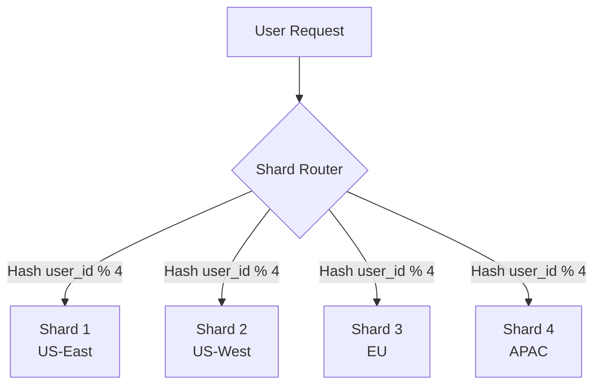
```mermaid
graph TD
    A[User Request] --> B{Shard Router}
    B -->|Hash user_id % 4| C[Shard 1<br/>US-East]
    B -->|Hash user_id % 4| D[Shard 2<br/>US-West]
    B -->|Hash user_id % 4| E[Shard 3<br/>EU]
    B -->|Hash user_id % 4| F[Shard 4<br/>APAC]
```

### Load Balancing

**Algorithm**: Weighted Round Robin with Health Checks

**Considerations**:
- Sticky sessions for WebSocket connections
- Geographic routing
- Service degradation handling
- Circuit breaker pattern

---

## Real-Time Systems

### WebSocket Architecture

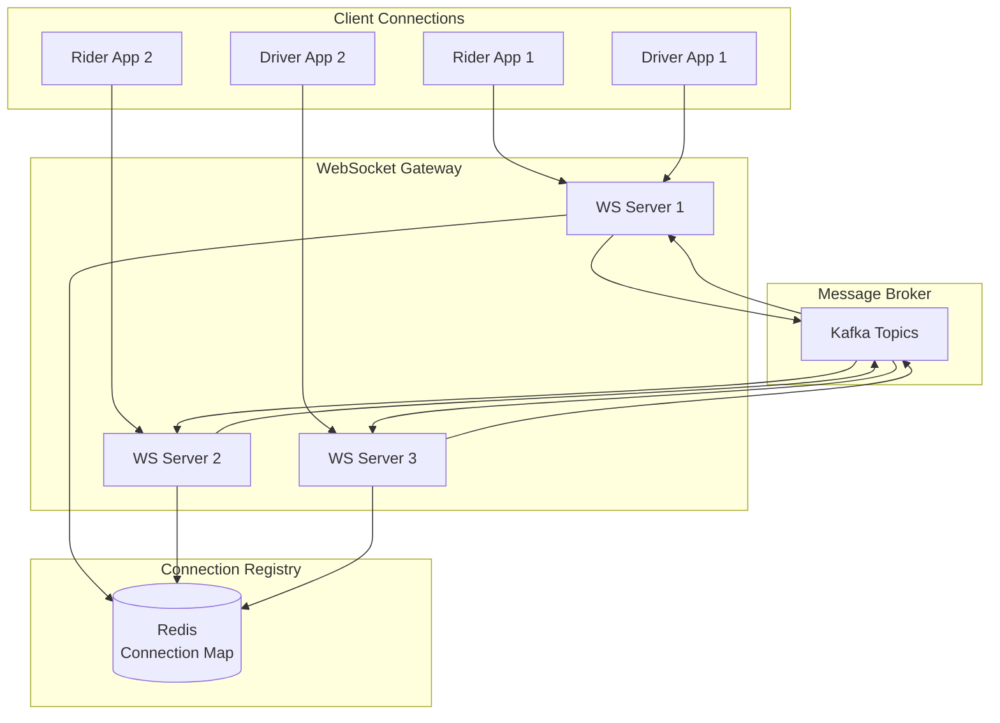
```mermaid
graph TB
    subgraph "Client Connections"
        C1[Rider App 1]
        C2[Driver App 1]
        C3[Rider App 2]
        C4[Driver App 2]
    end

    subgraph "WebSocket Gateway"
        WS1[WS Server 1]
        WS2[WS Server 2]
        WS3[WS Server 3]
    end

    subgraph "Connection Registry"
        REDIS[(Redis<br/>Connection Map)]
    end

    subgraph "Message Broker"
        KAFKA[Kafka Topics]
    end

    C1 --> WS1
    C2 --> WS1
    C3 --> WS2
    C4 --> WS3

    WS1 --> REDIS
    WS2 --> REDIS
    WS3 --> REDIS

    KAFKA --> WS1
    KAFKA --> WS2
    KAFKA --> WS3

    WS1 --> KAFKA
    WS2 --> KAFKA
    WS3 --> KAFKA
```

**Connection Management**:
- Store `{user_id: websocket_server_id}` in Redis
- Heartbeat every 30 seconds
- Automatic reconnection with exponential backoff
- Message queue for offline messages

### Event-Driven Updates

**Event Types**:
- `LOCATION_UPDATE`: Driver location changes
- `RIDE_STATUS_CHANGE`: Trip status updates
- `DRIVER_ASSIGNED`: Match successful
- `DRIVER_ARRIVED`: Driver at pickup
- `TRIP_STARTED`: Trip begins
- `TRIP_COMPLETED`: Trip ends
- `SURGE_UPDATE`: Pricing changes

### Location Update Optimization

**Strategy**:
1. Driver sends location every 4 seconds
2. Service calculates geohash
3. Only update if geohash changed (reduced writes)
4. Batch updates for nearby drivers
5. Compress location data

**Data Compression**:
```
Before: {lat: 37.7749295, lng: -122.4194155, timestamp: 1672531200}
After: {l: [37.7749, -122.4194], t: 1672531200}
```

---

## Deployment Architecture

### Kubernetes Deployment

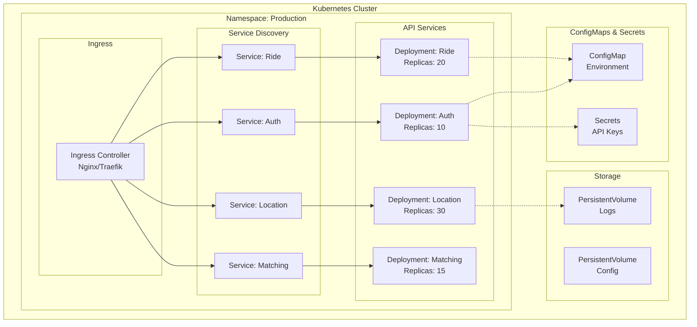
```mermaid
graph TB
    subgraph "Kubernetes Cluster"
        subgraph "Namespace: Production"
            subgraph "API Services"
                D1[Deployment: Auth<br/>Replicas: 10]
                D2[Deployment: Ride<br/>Replicas: 20]
                D3[Deployment: Location<br/>Replicas: 30]
                D4[Deployment: Matching<br/>Replicas: 15]
            end

            subgraph "Service Discovery"
                S1[Service: Auth]
                S2[Service: Ride]
                S3[Service: Location]
                S4[Service: Matching]
            end

            subgraph "Ingress"
                ING[Ingress Controller<br/>Nginx/Traefik]
            end
        end

        subgraph "Storage"
            PV1[PersistentVolume<br/>Logs]
            PV2[PersistentVolume<br/>Config]
        end

        subgraph "ConfigMaps & Secrets"
            CM[ConfigMap<br/>Environment]
            SEC[Secrets<br/>API Keys]
        end
    end

    ING --> S1
    ING --> S2
    ING --> S3
    ING --> S4

    S1 --> D1
    S2 --> D2
    S3 --> D3
    S4 --> D4

    D1 -.-> CM
    D1 -.-> SEC
    D2 -.-> CM
    D3 -.-> PV1
```

### CI/CD Pipeline

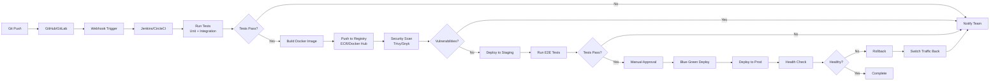
```mermaid
flowchart LR
    A[Git Push] --> B[GitHub/GitLab]
    B --> C[Webhook Trigger]
    C --> D[Jenkins/CircleCI]
    
    D --> E[Run Tests<br/>Unit + Integration]
    E --> F{Tests Pass?}
    F -->|No| G[Notify Team]
    F -->|Yes| H[Build Docker Image]
    
    H --> I[Push to Registry<br/>ECR/Docker Hub]
    I --> J[Security Scan<br/>Trivy/Snyk]
    J --> K{Vulnerabilities?}
    K -->|Yes| G
    K -->|No| L[Deploy to Staging]
    
    L --> M[Run E2E Tests]
    M --> N{Tests Pass?}
    N -->|No| G
    N -->|Yes| O[Manual Approval]
    
    O --> P[Blue-Green Deploy]
    P --> Q[Deploy to Prod]
    Q --> R[Health Check]
    R --> S{Healthy?}
    S -->|No| T[Rollback]
    S -->|Yes| U[Complete]
    
    T --> V[Switch Traffic Back]
    V --> G
```

### Monitoring & Observability

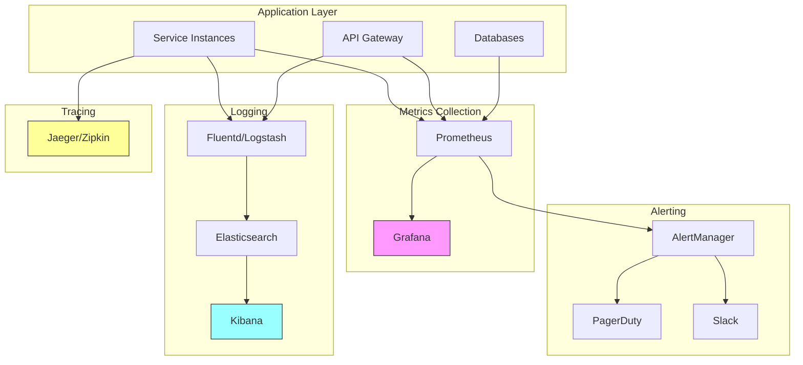
```mermaid
graph TD
    subgraph "Application Layer"
        APP1[Service Instances]
        APP2[API Gateway]
        APP3[Databases]
    end

    subgraph "Metrics Collection"
        PROM[Prometheus]
        GRAF[Grafana]
    end

    subgraph "Logging"
        FLU[Fluentd/Logstash]
        ELK[Elasticsearch]
        KIB[Kibana]
    end

    subgraph "Tracing"
        JAE[Jaeger/Zipkin]
    end

    subgraph "Alerting"
        ALERT[AlertManager]
        PD[PagerDuty]
        SLACK[Slack]
    end

    APP1 --> PROM
    APP1 --> FLU
    APP1 --> JAE
    APP2 --> PROM
    APP2 --> FLU
    APP3 --> PROM

    PROM --> GRAF
    PROM --> ALERT

    FLU --> ELK
    ELK --> KIB

    ALERT --> PD
    ALERT --> SLACK

    style GRAF fill:#f9f,stroke:#333
    style KIB fill:#9ff,stroke:#333
    style JAE fill:#ff9,stroke:#333
```

**Key Metrics**:
- Request latency (p50, p95, p99)
- Request rate (requests/second)
- Error rate (4xx, 5xx)
- Database query performance
- Cache hit ratio
- WebSocket connection count
- Active rides count
- Driver availability
- Matching success rate
- Payment success rate

---

## Advanced System Design Considerations

### Surge Pricing Implementation

**Real-Time Demand/Supply Calculation**:

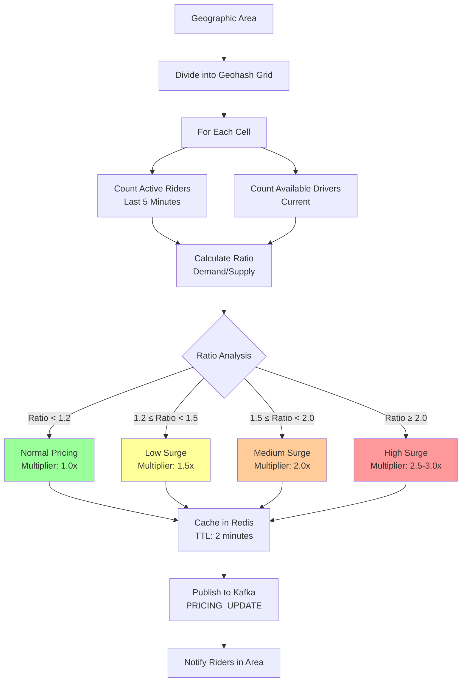
```mermaid
flowchart TD
    A[Geographic Area] --> B[Divide into Geohash Grid]
    B --> C[For Each Cell]
    
    C --> D[Count Active Riders<br/>Last 5 Minutes]
    C --> E[Count Available Drivers<br/>Current]
    
    D --> F[Calculate Ratio<br/>Demand/Supply]
    E --> F
    
    F --> G{Ratio Analysis}
    
    G -->|Ratio < 1.2| H[Normal Pricing<br/>Multiplier: 1.0x]
    G -->|1.2 ≤ Ratio < 1.5| I[Low Surge<br/>Multiplier: 1.5x]
    G -->|1.5 ≤ Ratio < 2.0| J[Medium Surge<br/>Multiplier: 2.0x]
    G -->|Ratio ≥ 2.0| K[High Surge<br/>Multiplier: 2.5-3.0x]
    
    H --> L[Cache in Redis<br/>TTL: 2 minutes]
    I --> L
    J --> L
    K --> L
    
    L --> M[Publish to Kafka<br/>PRICING_UPDATE]
    M --> N[Notify Riders in Area]
    
    style K fill:#ff9999
    style J fill:#ffcc99
    style I fill:#ffff99
    style H fill:#99ff99
```

**ML-Based Prediction**:
- Historical demand patterns
- Weather data integration
- Event calendar (concerts, sports)
- Time of day/day of week patterns
- Holiday adjustments

### Matching Algorithm Deep Dive

**Multi-Factor Ranking System**:

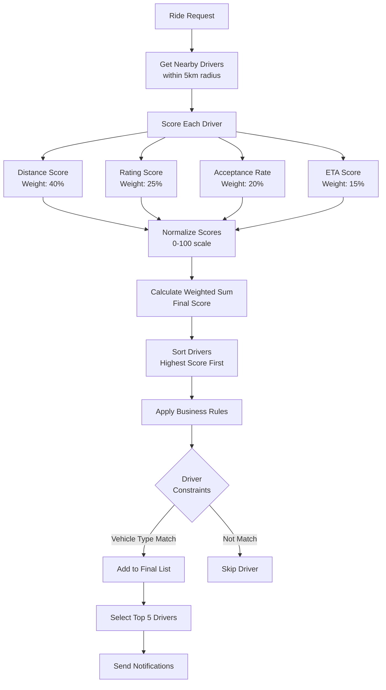
```mermaid
graph TD
    A[Ride Request] --> B[Get Nearby Drivers<br/>within 5km radius]
    
    B --> C[Score Each Driver]
    
    C --> D[Distance Score<br/>Weight: 40%]
    C --> E[Rating Score<br/>Weight: 25%]
    C --> F[Acceptance Rate<br/>Weight: 20%]
    C --> G[ETA Score<br/>Weight: 15%]
    
    D --> H[Normalize Scores<br/>0-100 scale]
    E --> H
    F --> H
    G --> H
    
    H --> I[Calculate Weighted Sum<br/>Final Score]
    
    I --> J[Sort Drivers<br/>Highest Score First]
    
    J --> K[Apply Business Rules]
    K --> L{Driver<br/>Constraints}
    
    L -->|Vehicle Type Match| M[Add to Final List]
    L -->|Not Match| N[Skip Driver]
    
    M --> O[Select Top 5 Drivers]
    O --> P[Send Notifications]
```

**Scoring Formula**:
```
Final Score = (Distance Score × 0.4) + 
              (Rating Score × 0.25) + 
              (Acceptance Rate × 0.2) + 
              (ETA Score × 0.15)

Distance Score = 100 - (distance_km / max_distance × 100)
Rating Score = (driver_rating / 5.0) × 100
Acceptance Rate Score = acceptance_rate × 100
ETA Score = 100 - (eta_minutes / max_eta × 100)
```

### Handling Cancellations

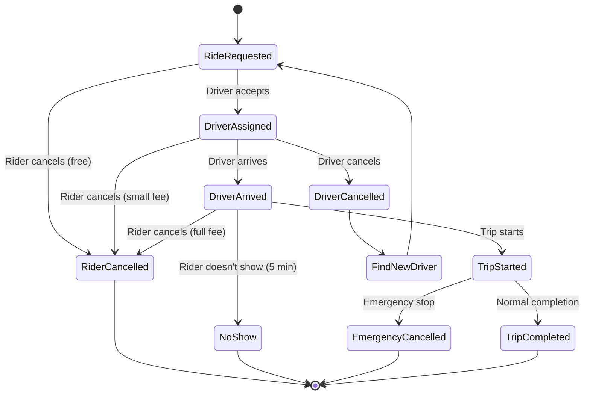
```mermaid
stateDiagram-v2
    [*] --> RideRequested
    
    RideRequested --> RiderCancelled: Rider cancels (free)
    RideRequested --> DriverAssigned: Driver accepts
    
    DriverAssigned --> RiderCancelled: Rider cancels (small fee)
    DriverAssigned --> DriverCancelled: Driver cancels
    DriverAssigned --> DriverArrived: Driver arrives
    
    DriverArrived --> RiderCancelled: Rider cancels (full fee)
    DriverArrived --> NoShow: Rider doesn't show (5 min)
    DriverArrived --> TripStarted: Trip starts
    
    TripStarted --> TripCompleted: Normal completion
    TripStarted --> EmergencyCancelled: Emergency stop
    
    RiderCancelled --> [*]
    DriverCancelled --> FindNewDriver
    FindNewDriver --> RideRequested
    NoShow --> [*]
    EmergencyCancelled --> [*]
    TripCompleted --> [*]
```

**Cancellation Policies**:
- Before driver assignment: Free
- After assignment (< 2 min): Small fee ($2-3)
- After driver arrival: Standard fee ($5-7)
- No-show: Full cancellation fee
- Driver cancellation: Reset matching, priority boost

### Fault Tolerance & Disaster Recovery

**Circuit Breaker Pattern**:

```mermaid
stateDiagram-v2
    [*] --> Closed: Healthy
    
    Closed --> Open: Failure threshold exceeded<br/>(e.g., 50% errors in 10s)
    Open --> HalfOpen: After timeout<br/>(e.g., 30 seconds)
    HalfOpen --> Closed: Test requests succeed
    HalfOpen --> Open: Test requests fail
    
    note right of Closed
        Normal operation
        All requests pass through
    end note
    
    note right of Open
        Fail fast
        Return cached/default response
        No requests to failing service
    end note
    
    note right of HalfOpen
        Limited test traffic
        Monitor success rate
    end note
```

**Disaster Recovery Strategy**:

```mermaid
graph TD
    subgraph "Primary Region - US-East"
        P1[Active Services]
        P2[(Primary DB - Master)]
        P3[(Redis Primary)]
    end
    
    subgraph "Secondary Region - US-West"
        S1[Standby Services<br/>Warm Standby]
        S2[(Replica DB - Sync)]
        S3[(Redis Replica)]
    end
    
    subgraph "DR Region - EU"
        D1[Cold Standby]
        D2[(Backup DB)]
        D3[S3 Backups<br/>Cross-Region]
    end
    
    P2 -->|Streaming Replication<br/>< 1s lag| S2
    P3 -->|Async Replication| S3
    P2 -->|Daily Snapshots| D2
    P1 -->|Continuous Backup| D3
    
    P1 -.->|Health Check Fails| F[Automatic Failover]
    F -->|Promote| S1
    F -->|Promote| S2
    
    style F fill:#ff6666
    style P1 fill:#66ff66
    style S1 fill:#ffff66
    style D1 fill:#6666ff
```

**Recovery Time Objectives**:
- **RTO (Recovery Time Objective)**: 15 minutes
- **RPO (Recovery Point Objective)**: 1 minute data loss max
- **Backup Frequency**: Continuous replication + hourly snapshots
- **Testing**: Monthly DR drills

### Security Architecture

```mermaid
graph TB
    subgraph "Security Layers"
        L1[Layer 1: Network Security]
        L2[Layer 2: Application Security]
        L3[Layer 3: Data Security]
        L4[Layer 4: Compliance]
    end
    
    subgraph "Network Security"
        N1[DDoS Protection<br/>AWS Shield]
        N2[WAF Rules<br/>CloudFlare]
        N3[VPC & Subnets<br/>Private/Public]
        N4[Security Groups<br/>Firewall Rules]
    end
    
    subgraph "Application Security"
        A1[JWT Authentication]
        A2[OAuth 2.0]
        A3[Rate Limiting]
        A4[Input Validation]
        A5[CSRF Protection]
        A6[XSS Prevention]
    end
    
    subgraph "Data Security"
        D1[Encryption at Rest<br/>AES-256]
        D2[Encryption in Transit<br/>TLS 1.3]
        D3[PII Masking]
        D4[Data Anonymization]
        D5[Access Control<br/>RBAC]
    end
    
    subgraph "Compliance"
        C1[GDPR Compliance]
        C2[PCI DSS<br/>Payment Data]
        C3[SOC 2 Type II]
        C4[Audit Logging]
    end
    
    L1 --> N1
    L1 --> N2
    L1 --> N3
    L1 --> N4
    
    L2 --> A1
    L2 --> A2
    L2 --> A3
    L2 --> A4
    L2 --> A5
    L2 --> A6
    
    L3 --> D1
    L3 --> D2
    L3 --> D3
    L3 --> D4
    L3 --> D5
    
    L4 --> C1
    L4 --> C2
    L4 --> C3
    L4 --> C4
```

**Security Best Practices**:
1. **Authentication**: Multi-factor for drivers, biometric for riders
2. **Authorization**: Role-based access control (RBAC)
3. **Encryption**: All data encrypted at rest and in transit
4. **PII Protection**: Mask phone numbers, encrypt payment info
5. **Fraud Detection**: ML models for suspicious activity
6. **Security Audits**: Regular penetration testing

### Performance Optimization Techniques

**1. Database Query Optimization**:
```sql
-- Bad: Full table scan
SELECT * FROM rides WHERE status = 'active';

-- Good: Index on status + covering index
CREATE INDEX idx_rides_status_created 
ON rides(status, created_at) 
INCLUDE (rider_id, driver_id, pickup_location);

-- Even Better: Materialized view for active rides
CREATE MATERIALIZED VIEW active_rides AS
SELECT id, rider_id, driver_id, pickup_location, status, created_at
FROM rides
WHERE status IN ('requested', 'driver_assigned', 'in_progress');

-- Refresh every 30 seconds
REFRESH MATERIALIZED VIEW CONCURRENTLY active_rides;
```

**2. Connection Pooling**:
- PostgreSQL: 100 connections per instance
- Redis: 50 connections per instance
- MongoDB: 20 connections per instance
- Use PgBouncer/ProxySQL for connection pooling

**3. Caching Strategies**:

```mermaid
flowchart LR
    A[Request] --> B{Check L1 Cache<br/>Application Memory}
    B -->|Hit| C[Return Data]
    B -->|Miss| D{Check L2 Cache<br/>Redis}
    D -->|Hit| E[Update L1]
    E --> C
    D -->|Miss| F{Check L3 Cache<br/>DB Query Cache}
    F -->|Hit| G[Update L2 & L1]
    G --> C
    F -->|Miss| H[Query Database]
    H --> I[Update All Caches]
    I --> C
```

**4. API Response Compression**:
- Gzip compression for responses > 1KB
- Reduces bandwidth by 60-80%
- Trade-off: Slight CPU overhead

**5. Database Read Replicas**:
- 1 Primary (writes)
- 3-5 Read Replicas (reads)
- Route read queries to replicas
- 90% read, 10% write traffic

### Cost Optimization

**Infrastructure Costs Breakdown** (Monthly for 10M users):

| Component | Cost | Optimization Strategy |
|-----------|------|----------------------|
| Compute (EC2/K8s) | $50,000 | Auto-scaling, spot instances |
| Database (RDS/MongoDB) | $30,000 | Reserved instances, read replicas |
| Cache (Redis/ElastiCache) | $10,000 | Right-sizing, eviction policies |
| Storage (S3/EBS) | $8,000 | Lifecycle policies, compression |
| CDN (CloudFront) | $15,000 | Cache optimization, compression |
| Data Transfer | $12,000 | Regional routing, compression |
| Monitoring & Logs | $5,000 | Log sampling, retention policies |
| **Total** | **$130,000** | |

**Optimization Strategies**:
1. **Compute**: Use spot instances for batch jobs (60% savings)
2. **Storage**: Move old data to cold storage (Glacier)
3. **CDN**: Aggressive caching for static assets
4. **Database**: Use read replicas, optimize queries
5. **Auto-scaling**: Scale down during off-peak hours

---

## Microservices Breakdown

### Service Boundaries

```mermaid
graph TB
    subgraph "User Domain"
        US[User Service]
        AS[Auth Service]
        PS[Profile Service]
    end
    
    subgraph "Ride Domain"
        RS[Ride Service]
        MS[Matching Service]
        TS[Tracking Service]
    end
    
    subgraph "Location Domain"
        LS[Location Service]
        GS[Geospatial Service]
        MS2[Maps Service]
    end
    
    subgraph "Payment Domain"
        PYS[Payment Service]
        WS[Wallet Service]
        INV[Invoice Service]
    end
    
    subgraph "Notification Domain"
        NS[Notification Service]
        PUS[Push Service]
        SMS[SMS Service]
        ES[Email Service]
    end
    
    subgraph "Analytics Domain"
        ANS[Analytics Service]
        RPS[Reporting Service]
        MLS[ML Service]
    end
    
    subgraph "Support Domain"
        SS[Support Service]
        CS[Chat Service]
        TS2[Ticket Service]
    end
    
    US --> AS
    RS --> MS
    RS --> LS
    RS --> PYS
    RS --> NS
    LS --> GS
    PYS --> WS
    PYS --> INV
    NS --> PUS
    NS --> SMS
    NS --> ES
    ANS --> MLS
```

### Inter-Service Communication

**Synchronous (REST/gRPC)**:
- Used for: Real-time queries, critical operations
- Example: Ride Service → Matching Service
- Timeout: 3-5 seconds
- Retry: 3 attempts with exponential backoff

**Asynchronous (Event-Driven)**:
- Used for: Non-critical updates, analytics
- Example: Location updates, notifications
- Technology: Kafka, RabbitMQ
- Guarantees: At-least-once delivery

```mermaid
sequenceDiagram
    participant RS as Ride Service
    participant MS as Matching Service
    participant Kafka
    participant NS as Notification Service
    participant PS as Payment Service
    
    Note over RS,PS: Synchronous Communication
    RS->>MS: gRPC: FindDriver(location)
    MS-->>RS: Driver Found
    
    Note over RS,PS: Asynchronous Communication
    RS->>Kafka: Publish: DRIVER_ASSIGNED
    Kafka->>NS: Consume: DRIVER_ASSIGNED
    NS->>NS: Send Push Notification
    
    RS->>Kafka: Publish: TRIP_COMPLETED
    Kafka->>PS: Consume: TRIP_COMPLETED
    PS->>PS: Process Payment
    PS->>Kafka: Publish: PAYMENT_COMPLETED
```

### Service Mesh (Istio/Linkerd)

```mermaid
graph TB
    subgraph "Service Mesh Control Plane"
        CP[Control Plane<br/>Istio/Linkerd]
    end
    
    subgraph "Data Plane"
        subgraph "Service A Pod"
            SA[Service A Container]
            PA[Envoy Proxy Sidecar]
        end
        
        subgraph "Service B Pod"
            SB[Service B Container]
            PB[Envoy Proxy Sidecar]
        end
        
        subgraph "Service C Pod"
            SC[Service C Container]
            PC[Envoy Proxy Sidecar]
        end
    end
    
    CP -.->|Config| PA
    CP -.->|Config| PB
    CP -.->|Config| PC
    
    SA --> PA
    PA -->|mTLS| PB
    PB --> SB
    SB --> PB
    PB -->|mTLS| PC
    PC --> SC
```

**Service Mesh Benefits**:
- Automatic mTLS between services
- Traffic management (canary, blue-green)
- Observability (distributed tracing)
- Circuit breaking & retries
- Rate limiting

---

## Machine Learning Integration

### Demand Prediction Model

```mermaid
flowchart TD
    A[Data Sources] --> B[Feature Engineering]
    
    A --> C[Historical Rides<br/>Past 6 months]
    A --> D[Weather Data<br/>API Integration]
    A --> E[Events Calendar<br/>Concerts, Sports]
    A --> F[Time Features<br/>Hour, Day, Week]
    
    C --> B
    D --> B
    E --> B
    F --> B
    
    B --> G[Training Pipeline<br/>Apache Spark]
    G --> H[Model Training<br/>XGBoost/LightGBM]
    H --> I[Model Validation<br/>Cross-Validation]
    
    I --> J{Model Performance<br/>RMSE < Threshold?}
    J -->|No| K[Hyperparameter Tuning]
    K --> H
    J -->|Yes| L[Deploy Model<br/>Kubernetes]
    
    L --> M[Inference Service<br/>REST API]
    M --> N[Real-Time Predictions<br/>Every 5 minutes]
    
    N --> O[Update Surge Pricing]
    N --> P[Driver Positioning]
    N --> Q[Marketing Campaigns]
```

**Features Used**:
- Time of day, day of week
- Weather conditions
- Historical demand patterns
- Event calendar
- Holiday indicators
- Local events/festivals

### ETA Prediction Model

```mermaid
graph LR
    A[Input Features] --> B[ML Model]
    
    A --> C[Current Location]
    A --> D[Destination]
    A --> E[Traffic Data]
    A --> F[Historical Routes]
    A --> G[Time of Day]
    A --> H[Weather]
    
    B --> I[Predicted ETA]
    B --> J[Route Suggestion]
    B --> K[Confidence Score]
    
    I --> L[Display to User]
    J --> M[Navigation System]
```

### Fraud Detection

```mermaid
flowchart TD
    A[Transaction Event] --> B[Feature Extraction]
    
    B --> C[User Behavior<br/>Patterns]
    B --> D[Payment Info<br/>Analysis]
    B --> E[Location<br/>Anomalies]
    B --> F[Device<br/>Fingerprint]
    
    C --> G[Real-Time Scoring<br/>ML Model]
    D --> G
    E --> G
    F --> G
    
    G --> H{Fraud Score}
    H -->|Low Risk<br/>< 0.3| I[Approve Transaction]
    H -->|Medium Risk<br/>0.3-0.7| J[Additional Verification<br/>OTP/2FA]
    H -->|High Risk<br/>> 0.7| K[Block Transaction<br/>Manual Review]
    
    I --> L[Process Payment]
    J --> M{Verification<br/>Success?}
    M -->|Yes| L
    M -->|No| K
    K --> N[Alert Security Team]
```

---

## Related Case Studies

### Cross-Platform Comparisons

For a comprehensive understanding of large-scale system design, explore these related case studies:

#### 1. **Airbnb** (`airbnb.md`)
**Similarities with Uber**:
- Marketplace platform connecting two parties
- Real-time availability and booking
- Payment processing and trust systems
- Geographic search and mapping

**Key Differences**:
- Longer booking duration (days vs minutes)
- Less frequent real-time updates
- Different matching algorithm (property-based vs location-based)

**Learn From Airbnb**:
- Search and recommendation engines
- Review and rating systems
- Dynamic pricing strategies
- Host/Guest verification systems

#### 2. **Google Meet** (`google-meet.md`)
**Similarities with Uber**:
- Real-time communication requirements
- WebSocket/WebRTC for live updates
- Low latency critical
- Scaling to millions of concurrent users

**Key Differences**:
- Video/audio streaming vs location tracking
- P2P connections vs server-mediated
- Different bandwidth requirements

**Learn From Google Meet**:
- WebRTC architecture
- Media server infrastructure
- Quality adaptation algorithms
- Connection optimization

#### 3. **WhatsApp** (`whatsapp.md`)
**Similarities with Uber**:
- Real-time messaging and notifications
- High availability requirements
- Massive scale (billions of messages/day)
- WebSocket architecture

**Key Differences**:
- End-to-end encryption focus
- Message-based vs location-based
- Different consistency requirements

**Learn From WhatsApp**:
- Message queue architecture
- Offline message delivery
- Push notification strategies
- Connection management at scale

#### 4. **Netflix** (`netflix.md`)
**Similarities with Uber**:
- Content delivery at scale
- CDN usage for performance
- Recommendation systems
- Multi-region deployment

**Key Differences**:
- Content streaming vs real-time matching
- Different caching strategies
- Batch processing vs real-time

**Learn From Netflix**:
- CDN optimization
- Chaos engineering practices
- A/B testing infrastructure
- Personalization algorithms

#### 5. **Twitter** (`twitter.md`)
**Similarities with Uber**:
- Real-time updates and feeds
- High write throughput
- Event-driven architecture
- Timeline/feed generation

**Key Differences**:
- Social graph vs geospatial
- Different data models
- Read-heavy vs write-heavy patterns

**Learn From Twitter**:
- Timeline generation algorithms
- Fan-out strategies
- Caching for social feeds
- Rate limiting at scale

#### 6. **Amazon** (`amazon.md`)
**Similarities with Uber**:
- E-commerce marketplace platform
- Payment processing
- Recommendation engines
- Inventory management

**Key Differences**:
- Product catalog vs real-time matching
- Shopping cart vs trip booking
- Different transaction patterns

**Learn From Amazon**:
- Microservices architecture
- Order processing systems
- Inventory management
- Fulfillment optimization

#### 7. **YouTube** (`youtube.md`)
**Similarities with Uber**:
- Content delivery at massive scale
- CDN architecture
- Recommendation systems
- Analytics and metrics

**Key Differences**:
- Video streaming vs location services
- User-generated content focus
- Different storage requirements

**Learn From YouTube**:
- Video transcoding pipeline
- CDN and edge caching
- Content recommendation ML
- Storage optimization

#### 8. **Telegram** (`telegram.md`)
**Similarities with Uber**:
- Real-time messaging
- Push notifications
- Multi-device sync
- High-throughput message delivery

**Key Differences**:
- Cloud-based vs device-based storage
- Bot ecosystem
- Channel broadcasting

**Learn From Telegram**:
- MTProto protocol design
- Secret chats architecture
- File sharing at scale
- Bot API design

### Architecture Pattern Comparison

| Pattern | Uber | Airbnb | Netflix | Twitter |
|---------|------|--------|---------|---------|
| **Primary Architecture** | Microservices + Event-Driven | Microservices | Microservices | Microservices |
| **Data Consistency** | Eventual | Strong (bookings) | Eventual | Eventual |
| **Real-Time** | Critical (< 100ms) | Low priority | Medium | Critical |
| **Caching Strategy** | Multi-level | Multi-level | Heavy CDN | Heavy Redis |
| **Database** | Sharded PostgreSQL | Sharded MySQL | Cassandra | Manhattan |
| **Message Queue** | Kafka | Kafka | Kafka | Kafka |
| **Location-Based** | Core feature | Secondary | Not applicable | Optional |

### Technology Stack Comparison

```mermaid
graph TB
    subgraph "Uber Stack"
        U1[Node.js, Go, Python]
        U2[PostgreSQL, MongoDB, Redis]
        U3[Kafka, RabbitMQ]
        U4[Kubernetes, Docker]
    end
    
    subgraph "Airbnb Stack"
        A1[Ruby on Rails, React]
        A2[MySQL, Redis, Elasticsearch]
        A3[Kafka]
        A4[AWS, Kubernetes]
    end
    
    subgraph "Netflix Stack"
        N1[Java, Spring Boot]
        N2[Cassandra, DynamoDB]
        N3[Kafka]
        N4[AWS, Custom Tools]
    end
    
    subgraph "Common Patterns"
        C1[Microservices Architecture]
        C2[Event-Driven Design]
        C3[Multi-Region Deployment]
        C4[CI/CD Automation]
    end
    
    U1 --> C1
    A1 --> C1
    N1 --> C1
    
    U3 --> C2
    A3 --> C2
    N3 --> C2
```

---

## Summary & Key Takeaways

### Critical Design Decisions

1. **Geospatial Indexing**: GeoHash + Redis GEORADIUS for sub-100ms matching
2. **Event-Driven Architecture**: Kafka for decoupling services and async processing
3. **Multi-Level Caching**: Application → Redis → Database
4. **WebSocket for Real-Time**: Persistent connections for location updates
5. **Horizontal Scaling**: Stateless services + database sharding
6. **Circuit Breakers**: Fault tolerance and graceful degradation

### Scaling Milestones

| Users | Architecture Changes |
|-------|---------------------|
| 0-10K | Monolithic app, single DB, single region |
| 10K-100K | Microservices, read replicas, Redis cache |
| 100K-1M | Multi-region, CDN, message queue |
| 1M-10M | Database sharding, dedicated WebSocket servers |
| 10M+ | Global distribution, ML optimization, edge computing |

### Performance Targets

- **Matching Latency**: < 100ms (p95)
- **API Response**: < 200ms (p95)
- **Location Update**: Every 4-5 seconds
- **Availability**: 99.99% uptime
- **Data Loss**: < 1 minute RPO

### Future Enhancements

1. **Autonomous Vehicles**: Integration ready architecture
2. **Multi-Modal Transport**: Bikes, scooters, public transit
3. **AI Route Optimization**: Deep learning for better ETAs
4. **Blockchain Payments**: Cryptocurrency support
5. **Edge Computing**: Process matching at edge locations
6. **5G Integration**: Ultra-low latency updates

---

## References & Further Reading

### Official Documentation
- AWS Well-Architected Framework
- Kubernetes Best Practices
- PostgreSQL Performance Tuning
- Redis Best Practices

### Engineering Blogs
- Uber Engineering Blog: eng.uber.com
- High Scalability: highscalability.com
- Martin Fowler's Blog: martinfowler.com

### Books
- "Designing Data-Intensive Applications" by Martin Kleppmann
- "System Design Interview" by Alex Xu
- "Microservices Patterns" by Chris Richardson
- "Database Internals" by Alex Petrov

### Tools & Technologies
- Kubernetes: kubernetes.io
- Apache Kafka: kafka.apache.org
- Redis: redis.io
- PostgreSQL: postgresql.org
- MongoDB: mongodb.com

---

**Document Version**: 1.0  
**Last Updated**: October 2025  
**Author**: System Design Case Studies  
**License**: Educational Use