# WhatsApp System Architecture

## Overview

WhatsApp is the world's most popular messaging platform, serving over 2 billion users globally with end-to-end encryption. The system handles 100+ billion messages daily across text, voice, video, and multimedia content while maintaining exceptional reliability and performance with a remarkably small engineering team.

## System Requirements

### Functional Requirements
- Real-time text messaging
- Voice and video calling
- Media sharing (photos, videos, documents)
- Group messaging (up to 256 participants)
- Status updates and stories
- End-to-end encryption for all communications
- Message delivery confirmation (sent, delivered, read)
- Offline message storage and delivery
- Multi-device synchronization
- Broadcast messaging

### Non-Functional Requirements
- **Scale**: 2+ billion users, 100+ billion messages daily
- **Availability**: 99.99% uptime globally
- **Performance**: < 100ms message delivery latency
- **Reliability**: Message delivery guarantee
- **Security**: End-to-end encryption, privacy protection
- **Efficiency**: Minimal battery and data usage
- **Global Reach**: Support for 180+ countries
- **Concurrent Users**: 2+ billion monthly active users

## High-Level Architecture

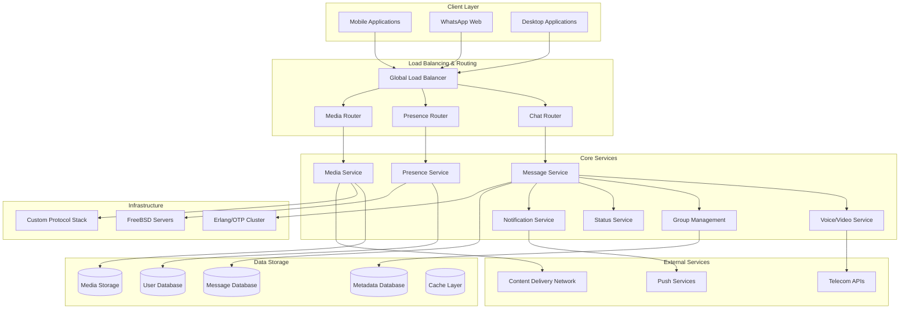
```mermaid
graph TB
    subgraph "Client Layer"
        MOBILE_APPS[Mobile Applications]
        WEB_CLIENT[WhatsApp Web]
        DESKTOP_CLIENT[Desktop Applications]
    end
    
    subgraph "Load Balancing & Routing"
        GLOBAL_LB[Global Load Balancer]
        CHAT_ROUTER[Chat Router]
        PRESENCE_ROUTER[Presence Router]
        MEDIA_ROUTER[Media Router]
    end
    
    subgraph "Core Services"
        MESSAGE_SERVICE[Message Service]
        PRESENCE_SERVICE[Presence Service]
        MEDIA_SERVICE[Media Service]
        VOICE_SERVICE[Voice/Video Service]
        GROUP_SERVICE[Group Management]
        STATUS_SERVICE[Status Service]
        NOTIFICATION_SERVICE[Notification Service]
    end
    
    subgraph "Data Storage"
        MESSAGE_DB[(Message Database)]
        USER_DB[(User Database)]
        MEDIA_STORAGE[(Media Storage)]
        METADATA_DB[(Metadata Database)]
        CACHE_LAYER[(Cache Layer)]
    end
    
    subgraph "Infrastructure"
        ERLANG_CLUSTER[Erlang/OTP Cluster]
        FREEBSD_SERVERS[FreeBSD Servers]
        CUSTOM_PROTOCOL[Custom Protocol Stack]
    end
    
    subgraph "External Services"
        PUSH_NOTIFICATIONS[Push Services]
        CDN[Content Delivery Network]
        TELECOM_APIS[Telecom APIs]
    end
    
    MOBILE_APPS --> GLOBAL_LB
    WEB_CLIENT --> GLOBAL_LB
    DESKTOP_CLIENT --> GLOBAL_LB
    
    GLOBAL_LB --> CHAT_ROUTER
    GLOBAL_LB --> PRESENCE_ROUTER
    GLOBAL_LB --> MEDIA_ROUTER
    
    CHAT_ROUTER --> MESSAGE_SERVICE
    PRESENCE_ROUTER --> PRESENCE_SERVICE
    MEDIA_ROUTER --> MEDIA_SERVICE
    
    MESSAGE_SERVICE --> VOICE_SERVICE
    MESSAGE_SERVICE --> GROUP_SERVICE
    MESSAGE_SERVICE --> STATUS_SERVICE
    MESSAGE_SERVICE --> NOTIFICATION_SERVICE
    
    MESSAGE_SERVICE --> MESSAGE_DB
    PRESENCE_SERVICE --> USER_DB
    MEDIA_SERVICE --> MEDIA_STORAGE
    GROUP_SERVICE --> METADATA_DB
    
    MESSAGE_SERVICE --> ERLANG_CLUSTER
    PRESENCE_SERVICE --> FREEBSD_SERVERS
    MEDIA_SERVICE --> CUSTOM_PROTOCOL
    
    NOTIFICATION_SERVICE --> PUSH_NOTIFICATIONS
    MEDIA_SERVICE --> CDN
    VOICE_SERVICE --> TELECOM_APIS
```

## Core Architecture Principles

### 1. Erlang/OTP Foundation

WhatsApp's architecture is built on Erlang/OTP (Open Telecom Platform), which provides exceptional concurrency and fault tolerance capabilities.

**Erlang Benefits for WhatsApp:**
- **Actor Model**: Lightweight processes for handling user connections
- **Fault Tolerance**: "Let it crash" philosophy with supervisor trees
- **Hot Code Swapping**: Deploy updates without downtime
- **Distributed Computing**: Built-in support for distributed systems
- **Concurrency**: Millions of lightweight processes per node

**Process Architecture:**
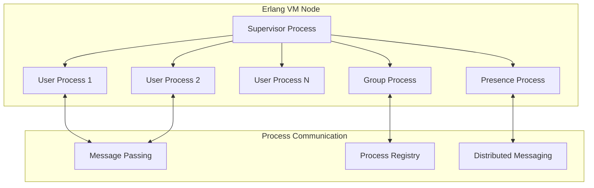
```mermaid
graph TB
    subgraph "Erlang VM Node"
        SUPERVISOR[Supervisor Process]
        USER_PROC_1[User Process 1]
        USER_PROC_2[User Process 2]
        USER_PROC_N[User Process N]
        GROUP_PROC[Group Process]
        PRESENCE_PROC[Presence Process]
    end
    
    subgraph "Process Communication"
        MESSAGE_PASSING[Message Passing]
        PROCESS_REGISTRY[Process Registry]
        DISTRIBUTED_MESSAGING[Distributed Messaging]
    end
    
    SUPERVISOR --> USER_PROC_1
    SUPERVISOR --> USER_PROC_2
    SUPERVISOR --> USER_PROC_N
    SUPERVISOR --> GROUP_PROC
    SUPERVISOR --> PRESENCE_PROC
    
    USER_PROC_1 <--> MESSAGE_PASSING
    USER_PROC_2 <--> MESSAGE_PASSING
    GROUP_PROC <--> PROCESS_REGISTRY
    PRESENCE_PROC <--> DISTRIBUTED_MESSAGING
```

### 2. Custom Protocol Design

WhatsApp developed a custom binary protocol called XMPP (later evolved beyond standard XMPP) optimized for mobile messaging.

**Protocol Characteristics:**
- **Binary Format**: Compact message encoding for bandwidth efficiency
- **Connection Persistence**: Long-lived TCP connections with heartbeat
- **Message Queuing**: Server-side queuing for offline users
- **Acknowledgments**: Multi-level delivery confirmations
- **Compression**: Data compression to minimize bandwidth usage

**Message Flow Architecture:**
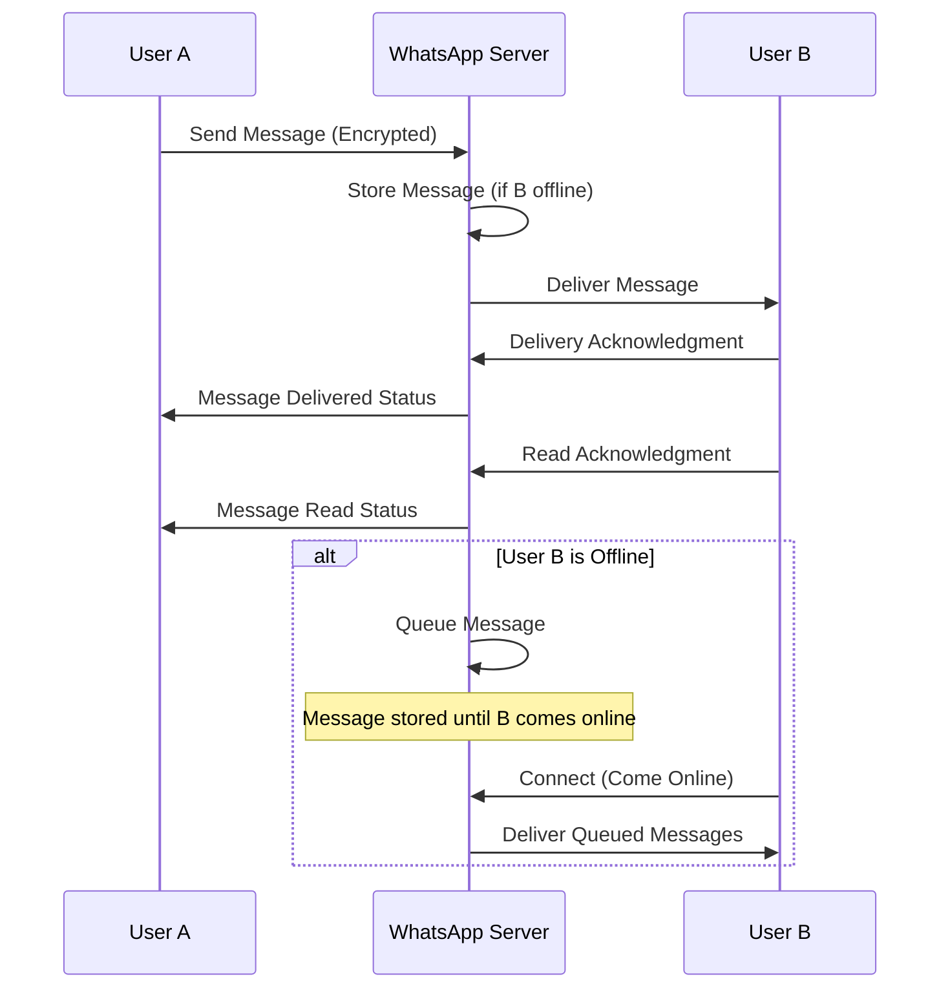
```mermaid
sequenceDiagram
    participant A as User A
    participant WA as WhatsApp Server
    participant B as User B
    
    A->>WA: Send Message (Encrypted)
    WA->>WA: Store Message (if B offline)
    WA->>B: Deliver Message
    B->>WA: Delivery Acknowledgment
    WA->>A: Message Delivered Status
    B->>WA: Read Acknowledgment
    WA->>A: Message Read Status
    
    alt User B is Offline
        WA->>WA: Queue Message
        Note over WA: Message stored until B comes online
        B->>WA: Connect (Come Online)
        WA->>B: Deliver Queued Messages
    end
```

## Real-Time Messaging Architecture

### 1. Connection Management

**Persistent Connection Strategy:**
WhatsApp maintains persistent TCP connections to enable real-time message delivery with minimal latency.

**Connection Architecture:**
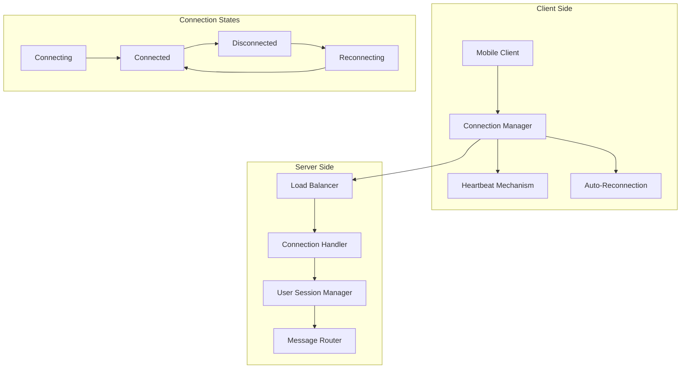
```mermaid
graph TB
    subgraph "Client Side"
        MOBILE_CLIENT[Mobile Client]
        CONNECTION_MANAGER[Connection Manager]
        HEARTBEAT[Heartbeat Mechanism]
        RECONNECTION[Auto-Reconnection]
    end
    
    subgraph "Server Side"
        LOAD_BALANCER[Load Balancer]
        CONNECTION_HANDLER[Connection Handler]
        USER_SESSION[User Session Manager]
        MESSAGE_ROUTER[Message Router]
    end
    
    subgraph "Connection States"
        CONNECTING[Connecting]
        CONNECTED[Connected]
        DISCONNECTED[Disconnected]
        RECONNECTING[Reconnecting]
    end
    
    MOBILE_CLIENT --> CONNECTION_MANAGER
    CONNECTION_MANAGER --> HEARTBEAT
    CONNECTION_MANAGER --> RECONNECTION
    
    CONNECTION_MANAGER --> LOAD_BALANCER
    LOAD_BALANCER --> CONNECTION_HANDLER
    CONNECTION_HANDLER --> USER_SESSION
    USER_SESSION --> MESSAGE_ROUTER
    
    CONNECTING --> CONNECTED
    CONNECTED --> DISCONNECTED
    DISCONNECTED --> RECONNECTING
    RECONNECTING --> CONNECTED
```

### 2. Message Delivery Guarantees

**At-Least-Once Delivery:**
WhatsApp implements sophisticated message delivery guarantees to ensure messages reach their recipients.

**Delivery Confirmation Levels:**
- **Sent**: Message left the sender's device
- **Delivered**: Message reached WhatsApp servers and recipient's device
- **Read**: Message was opened and read by recipient

**Message State Management:**
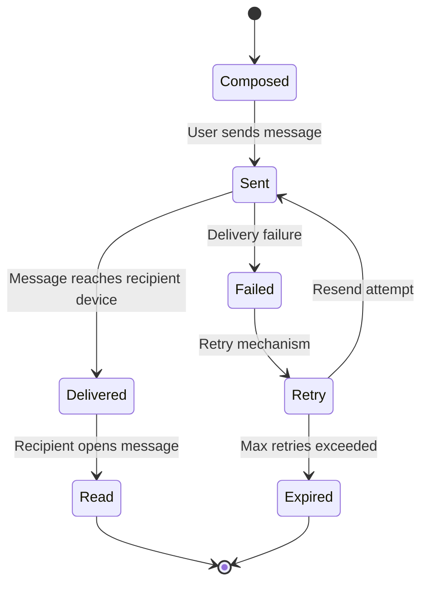
```mermaid
stateDiagram-v2
    [*] --> Composed
    Composed --> Sent : User sends message
    Sent --> Delivered : Message reaches recipient device
    Delivered --> Read : Recipient opens message
    
    Sent --> Failed : Delivery failure
    Failed --> Retry : Retry mechanism
    Retry --> Sent : Resend attempt
    Retry --> Expired : Max retries exceeded
    
    Read --> [*]
    Expired --> [*]
```

### 3. Offline Message Handling

**Message Queuing Strategy:**
Messages sent to offline users are queued on WhatsApp servers and delivered when the recipient comes online.

**Queue Management:**
- **Message Storage**: Server-side message queuing for offline users
- **Delivery Order**: FIFO delivery with timestamp preservation
- **Expiration Policy**: Messages expire after 30 days if undelivered
- **Batch Delivery**: Efficient delivery of queued messages upon connection

## End-to-End Encryption Architecture

### 1. Signal Protocol Implementation

WhatsApp uses the Signal Protocol (developed by Open Whisper Systems) for end-to-end encryption across all communications.

**Encryption Components:**
- **Double Ratchet Algorithm**: Forward secrecy and post-compromise security
- **X3DH Key Agreement**: Initial key establishment
- **Prekeys**: One-time keys for asynchronous messaging
- **Session Management**: Encrypted session establishment and management

**Key Exchange Process:**
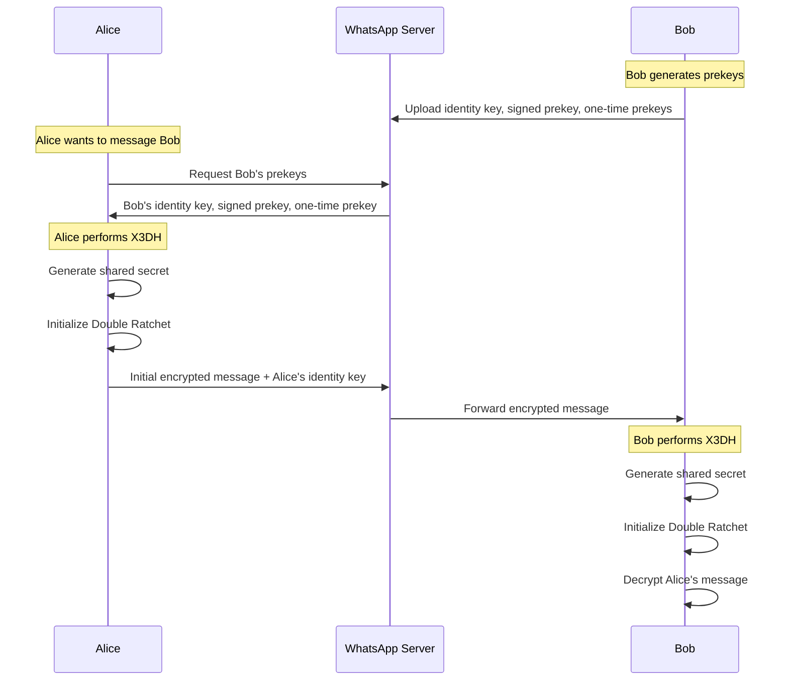
```mermaid
sequenceDiagram
    participant A as Alice
    participant S as WhatsApp Server
    participant B as Bob
    
    Note over B: Bob generates prekeys
    B->>S: Upload identity key, signed prekey, one-time prekeys
    
    Note over A: Alice wants to message Bob
    A->>S: Request Bob's prekeys
    S->>A: Bob's identity key, signed prekey, one-time prekey
    
    Note over A: Alice performs X3DH
    A->>A: Generate shared secret
    A->>A: Initialize Double Ratchet
    
    A->>S: Initial encrypted message + Alice's identity key
    S->>B: Forward encrypted message
    
    Note over B: Bob performs X3DH
    B->>B: Generate shared secret
    B->>B: Initialize Double Ratchet
    B->>B: Decrypt Alice's message
```

### 2. Group Encryption

**Sender Keys Protocol:**
For group messaging, WhatsApp uses the Sender Keys protocol to enable efficient encrypted group communication.

**Group Encryption Architecture:**
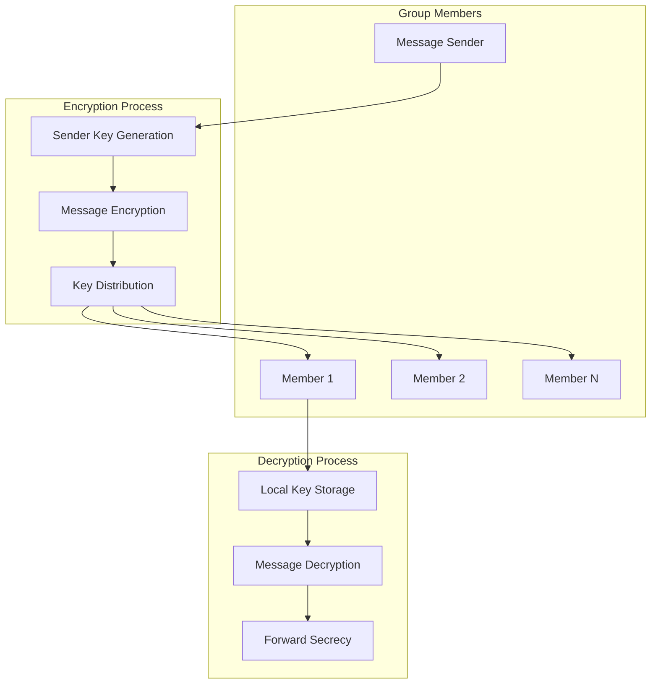
```mermaid
graph TB
    subgraph "Group Members"
        SENDER[Message Sender]
        MEMBER_1[Member 1]
        MEMBER_2[Member 2]
        MEMBER_N[Member N]
    end
    
    subgraph "Encryption Process"
        SENDER_KEY[Sender Key Generation]
        MESSAGE_ENCRYPT[Message Encryption]
        KEY_DISTRIBUTION[Key Distribution]
    end
    
    subgraph "Decryption Process"
        KEY_STORAGE[Local Key Storage]
        MESSAGE_DECRYPT[Message Decryption]
        FORWARD_SECRECY[Forward Secrecy]
    end
    
    SENDER --> SENDER_KEY
    SENDER_KEY --> MESSAGE_ENCRYPT
    MESSAGE_ENCRYPT --> KEY_DISTRIBUTION
    
    KEY_DISTRIBUTION --> MEMBER_1
    KEY_DISTRIBUTION --> MEMBER_2
    KEY_DISTRIBUTION --> MEMBER_N
    
    MEMBER_1 --> KEY_STORAGE
    KEY_STORAGE --> MESSAGE_DECRYPT
    MESSAGE_DECRYPT --> FORWARD_SECRECY
```

# WhatsApp Media Upload System Architecture

## Overview

WhatsApp's media upload system handles billions of media files daily (photos, videos, documents, voice messages) with end-to-end encryption. The system ensures secure, efficient, and reliable media sharing while maintaining user privacy through client-side encryption and optimized global distribution.

## System Requirements

### Functional Requirements
- Media upload and download (photos, videos, documents, audio)
- End-to-end encryption for all media files
- Multi-format support (JPEG, PNG, MP4, PDF, etc.)
- Progressive upload/download with resume capability
- Thumbnail generation and preview
- Media compression and optimization
- Cross-platform compatibility
- Offline media access after download

### Non-Functional Requirements
- **Scale**: Billions of media files uploaded daily
- **Security**: End-to-end encryption with forward secrecy
- **Performance**: < 5 seconds for typical photo upload
- **Storage**: Efficient global media distribution
- **Reliability**: 99.9% successful upload/download rate
- **Bandwidth**: Adaptive quality based on network conditions
- **Privacy**: Zero server-side access to media content

## High-Level Upload Architecture

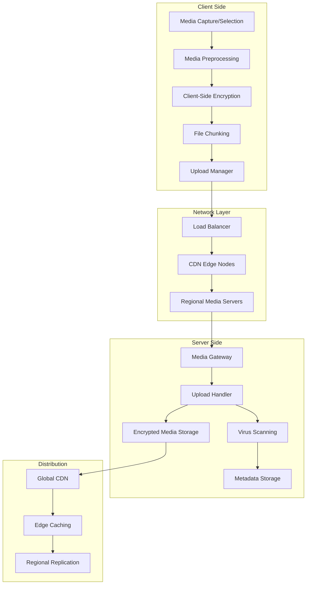
```mermaid
graph TB
    subgraph "Client Side"
        MEDIA_CAPTURE[Media Capture/Selection]
        PREPROCESSING[Media Preprocessing]
        ENCRYPTION[Client-Side Encryption]
        CHUNKING[File Chunking]
        UPLOAD_MANAGER[Upload Manager]
    end
    
    subgraph "Network Layer"
        LOAD_BALANCER[Load Balancer]
        CDN_EDGE[CDN Edge Nodes]
        REGIONAL_SERVERS[Regional Media Servers]
    end
    
    subgraph "Server Side"
        MEDIA_GATEWAY[Media Gateway]
        UPLOAD_HANDLER[Upload Handler]
        VIRUS_SCAN[Virus Scanning]
        METADATA_STORE[Metadata Storage]
        MEDIA_STORAGE[Encrypted Media Storage]
    end
    
    subgraph "Distribution"
        GLOBAL_CDN[Global CDN]
        EDGE_CACHE[Edge Caching]
        REGIONAL_REPLICATION[Regional Replication]
    end
    
    MEDIA_CAPTURE --> PREPROCESSING
    PREPROCESSING --> ENCRYPTION
    ENCRYPTION --> CHUNKING
    CHUNKING --> UPLOAD_MANAGER
    
    UPLOAD_MANAGER --> LOAD_BALANCER
    LOAD_BALANCER --> CDN_EDGE
    CDN_EDGE --> REGIONAL_SERVERS
    
    REGIONAL_SERVERS --> MEDIA_GATEWAY
    MEDIA_GATEWAY --> UPLOAD_HANDLER
    UPLOAD_HANDLER --> VIRUS_SCAN
    VIRUS_SCAN --> METADATA_STORE
    UPLOAD_HANDLER --> MEDIA_STORAGE
    
    MEDIA_STORAGE --> GLOBAL_CDN
    GLOBAL_CDN --> EDGE_CACHE
    EDGE_CACHE --> REGIONAL_REPLICATION
```

## End-to-End Encryption Architecture

### 1. Media Encryption Process

WhatsApp encrypts media files on the client side before upload, ensuring servers never have access to unencrypted content.

**Encryption Components:**
- **AES-256 Encryption**: Symmetric encryption for media content
- **Random Key Generation**: Unique encryption key per media file
- **HMAC Authentication**: Message authentication for integrity
- **Key Distribution**: Encrypted key sharing through Signal Protocol

**Media Encryption Flow:**
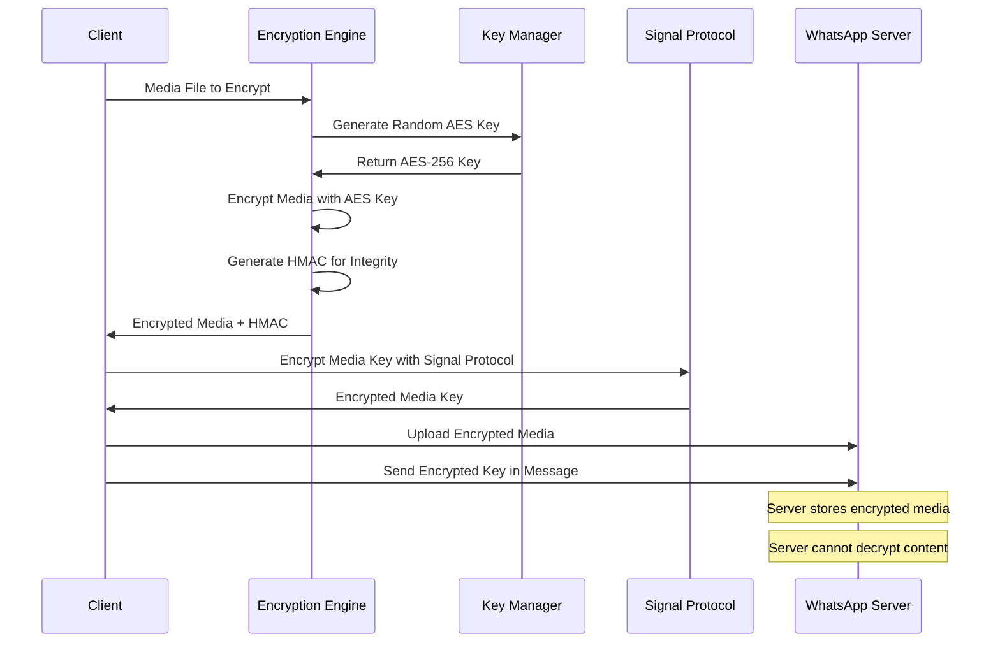
```mermaid
sequenceDiagram
    participant C as Client
    participant E as Encryption Engine
    participant KM as Key Manager
    participant SP as Signal Protocol
    participant S as WhatsApp Server
    
    C->>E: Media File to Encrypt
    E->>KM: Generate Random AES Key
    KM->>E: Return AES-256 Key
    
    E->>E: Encrypt Media with AES Key
    E->>E: Generate HMAC for Integrity
    E->>C: Encrypted Media + HMAC
    
    C->>SP: Encrypt Media Key with Signal Protocol
    SP->>C: Encrypted Media Key
    
    C->>S: Upload Encrypted Media
    C->>S: Send Encrypted Key in Message
    
    Note over S: Server stores encrypted media
    Note over S: Server cannot decrypt content
```

### 2. Encryption Implementation Details

**Client-Side Encryption Process:**

```javascript
// Simplified media encryption process
class MediaEncryption {
    async encryptMedia(mediaFile, recipientKeys) {
        // Generate random encryption key for this media
        const mediaKey = this.generateRandomKey(32); // 256-bit key
        const iv = this.generateRandomIV(16); // 128-bit IV
        
        // Encrypt media content with AES-256-CBC
        const encryptedMedia = await this.aesEncrypt(mediaFile, mediaKey, iv);
        
        // Generate HMAC for integrity verification
        const hmacKey = mediaKey.slice(16, 32); // Use part of key for HMAC
        const hmac = await this.generateHMAC(encryptedMedia, hmacKey);
        
        // Combine encrypted media with HMAC
        const encryptedPackage = this.combineMediaAndHMAC(encryptedMedia, hmac);
        
        // Encrypt media key using Signal Protocol for each recipient
        const encryptedKeys = {};
        for (const recipient of Object.keys(recipientKeys)) {
            encryptedKeys[recipient] = await this.signalProtocol.encrypt(
                mediaKey, 
                recipientKeys[recipient]
            );
        }
        
        return {
            encryptedMedia: encryptedPackage,
            encryptedKeys: encryptedKeys,
            mediaHash: await this.sha256(encryptedPackage)
        };
    }
}
```

### 3. Key Distribution Architecture

**Media Key Sharing Process:**
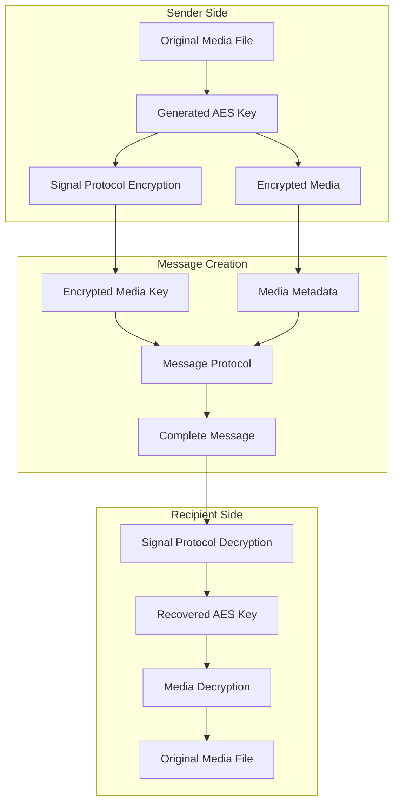
```mermaid
graph TB
    subgraph "Sender Side"
        MEDIA_FILE[Original Media File]
        AES_KEY[Generated AES Key]
        ENCRYPTED_MEDIA[Encrypted Media]
        SIGNAL_ENCRYPT[Signal Protocol Encryption]
    end
    
    subgraph "Message Creation"
        MESSAGE_PROTO[Message Protocol]
        ENCRYPTED_KEY[Encrypted Media Key]
        MEDIA_METADATA[Media Metadata]
        MESSAGE_PACKAGE[Complete Message]
    end
    
    subgraph "Recipient Side"
        SIGNAL_DECRYPT[Signal Protocol Decryption]
        RECOVERED_KEY[Recovered AES Key]
        MEDIA_DECRYPT[Media Decryption]
        ORIGINAL_FILE[Original Media File]
    end
    
    MEDIA_FILE --> AES_KEY
    AES_KEY --> ENCRYPTED_MEDIA
    AES_KEY --> SIGNAL_ENCRYPT
    
    SIGNAL_ENCRYPT --> ENCRYPTED_KEY
    ENCRYPTED_MEDIA --> MEDIA_METADATA
    ENCRYPTED_KEY --> MESSAGE_PROTO
    MEDIA_METADATA --> MESSAGE_PROTO
    MESSAGE_PROTO --> MESSAGE_PACKAGE
    
    MESSAGE_PACKAGE --> SIGNAL_DECRYPT
    SIGNAL_DECRYPT --> RECOVERED_KEY
    RECOVERED_KEY --> MEDIA_DECRYPT
    MEDIA_DECRYPT --> ORIGINAL_FILE
```

## Upload Process Architecture

### 1. Chunked Upload System

WhatsApp uses chunked uploads for reliable transfer of large media files with resume capability.

**Chunking Strategy:**
- **Dynamic Chunk Size**: Adapts based on network conditions (64KB - 1MB)
- **Parallel Uploads**: Multiple chunks uploaded simultaneously
- **Resume Capability**: Failed uploads can resume from last successful chunk
- **Progress Tracking**: Real-time upload progress for user feedback
- **Network Adaptation**: Chunk size adjusts to network quality

**Upload Flow Architecture:**
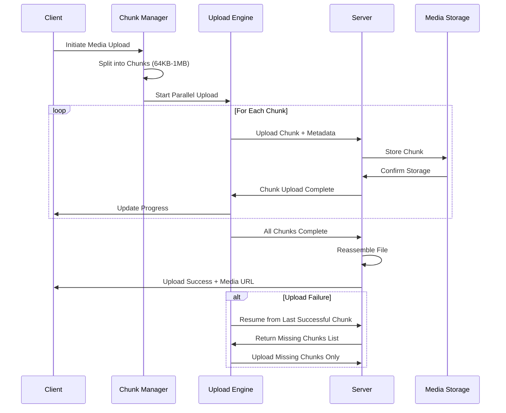
```mermaid
sequenceDiagram
    participant C as Client
    participant CM as Chunk Manager
    participant UE as Upload Engine
    participant S as Server
    participant MS as Media Storage
    
    C->>CM: Initiate Media Upload
    CM->>CM: Split into Chunks (64KB-1MB)
    CM->>UE: Start Parallel Upload
    
    loop For Each Chunk
        UE->>S: Upload Chunk + Metadata
        S->>MS: Store Chunk
        MS->>S: Confirm Storage
        S->>UE: Chunk Upload Complete
        UE->>C: Update Progress
    end
    
    UE->>S: All Chunks Complete
    S->>S: Reassemble File
    S->>C: Upload Success + Media URL
    
    alt Upload Failure
        UE->>S: Resume from Last Successful Chunk
        S->>UE: Return Missing Chunks List
        UE->>S: Upload Missing Chunks Only
    end
```

### 2. Upload Optimization

**Performance Optimizations:**
- **Connection Pooling**: Reuse HTTP connections for multiple chunks
- **Adaptive Bitrate**: Adjust quality based on network speed
- **Network Detection**: Different strategies for WiFi vs cellular
- **Background Upload**: Continue uploads when app is backgrounded
- **Retry Logic**: Intelligent retry with exponential backoff

**Network Adaptation Logic:**
```javascript
class UploadOptimizer {
    determineChunkSize(networkType, bandwidth, latency) {
        let baseChunkSize = 256 * 1024; // 256KB default
        
        // Adapt based on network type
        if (networkType === 'cellular') {
            if (bandwidth < 1000000) { // < 1Mbps
                baseChunkSize = 64 * 1024; // 64KB
            } else if (bandwidth < 5000000) { // < 5Mbps
                baseChunkSize = 128 * 1024; // 128KB
            }
        } else if (networkType === 'wifi') {
            if (bandwidth > 10000000) { // > 10Mbps
                baseChunkSize = 1024 * 1024; // 1MB
            }
        }
        
        // Adjust for latency
        if (latency > 500) { // High latency
            baseChunkSize *= 2; // Larger chunks for high latency
        }
        
        return Math.min(baseChunkSize, 1024 * 1024); // Max 1MB
    }
    
    calculateParallelConnections(networkType, bandwidth) {
        if (networkType === 'cellular') {
            return bandwidth > 5000000 ? 3 : 2; // 2-3 parallel for cellular
        } else {
            return bandwidth > 20000000 ? 6 : 4; // 4-6 parallel for WiFi
        }
    }
}
```

### 3. Progress Tracking and User Experience

**Upload State Management:**
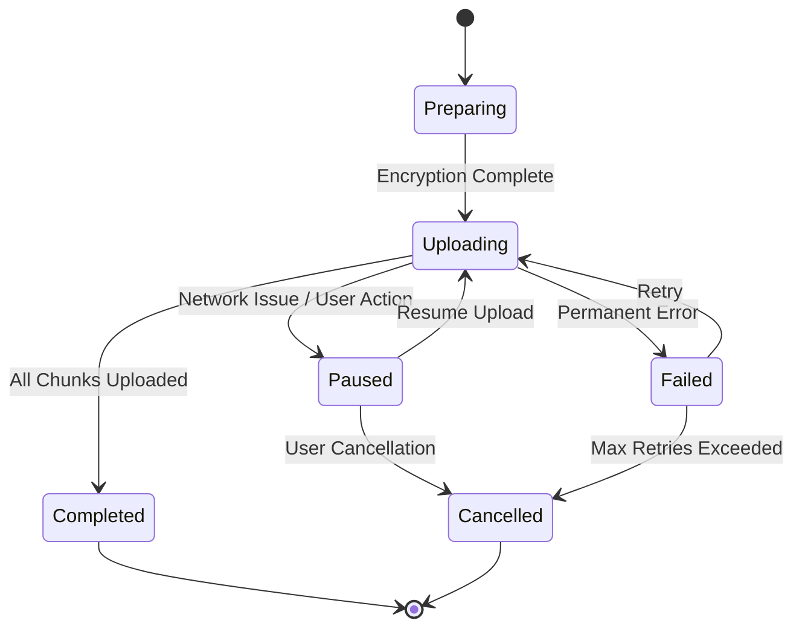
```mermaid
stateDiagram-v2
    [*] --> Preparing
    Preparing --> Uploading : Encryption Complete
    Uploading --> Paused : Network Issue / User Action
    Uploading --> Completed : All Chunks Uploaded
    Uploading --> Failed : Permanent Error
    Paused --> Uploading : Resume Upload
    Paused --> Cancelled : User Cancellation
    Failed --> Uploading : Retry
    Failed --> Cancelled : Max Retries Exceeded
    Completed --> [*]
    Cancelled --> [*]
```

## Server-Side Architecture

### 1. Media Gateway Service

The Media Gateway handles incoming encrypted media uploads and coordinates storage across the distributed system.

**Gateway Responsibilities:**
- **Authentication**: Verify user authentication and permissions
- **Rate Limiting**: Prevent abuse and ensure fair usage
- **Virus Scanning**: Scan encrypted metadata (file size, type validation)
- **Storage Coordination**: Route media to appropriate storage nodes
- **CDN Distribution**: Trigger global content distribution

**Media Gateway Components:**
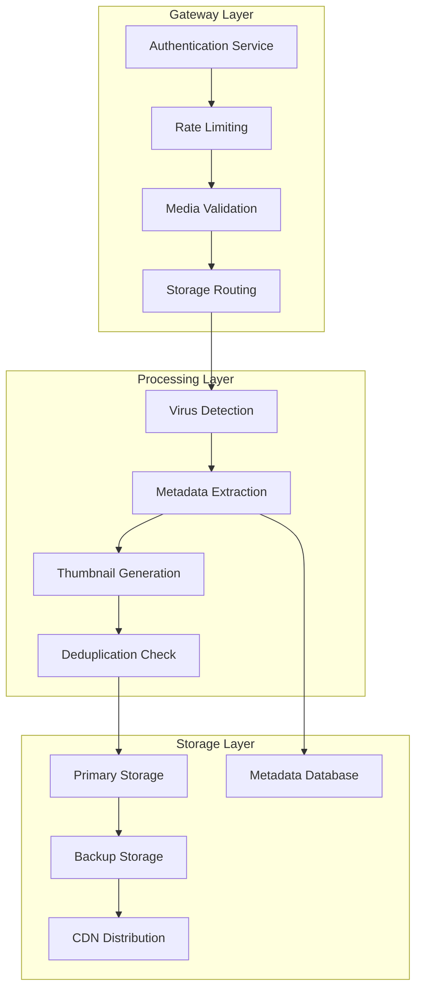
```mermaid
graph TB
    subgraph "Gateway Layer"
        AUTH[Authentication Service]
        RATE_LIMIT[Rate Limiting]
        VALIDATION[Media Validation]
        ROUTING[Storage Routing]
    end
    
    subgraph "Processing Layer"
        VIRUS_SCAN[Virus Detection]
        METADATA_EXTRACT[Metadata Extraction]
        THUMBNAIL_GEN[Thumbnail Generation]
        DEDUP[Deduplication Check]
    end
    
    subgraph "Storage Layer"
        PRIMARY_STORAGE[Primary Storage]
        BACKUP_STORAGE[Backup Storage]
        CDN_PUSH[CDN Distribution]
        METADATA_DB[Metadata Database]
    end
    
    AUTH --> RATE_LIMIT
    RATE_LIMIT --> VALIDATION
    VALIDATION --> ROUTING
    
    ROUTING --> VIRUS_SCAN
    VIRUS_SCAN --> METADATA_EXTRACT
    METADATA_EXTRACT --> THUMBNAIL_GEN
    THUMBNAIL_GEN --> DEDUP
    
    DEDUP --> PRIMARY_STORAGE
    PRIMARY_STORAGE --> BACKUP_STORAGE
    BACKUP_STORAGE --> CDN_PUSH
    METADATA_EXTRACT --> METADATA_DB
```

### 2. Storage Architecture

**Distributed Storage Strategy:**
- **Geographic Distribution**: Media stored in multiple regions
- **Redundancy**: Multiple copies for reliability (3x replication)
- **Hot/Cold Storage**: Frequently accessed media on fast storage
- **Encryption at Rest**: Additional server-side encryption layer
- **Automatic Cleanup**: Delete media after expiration period

**Storage Hierarchy:**
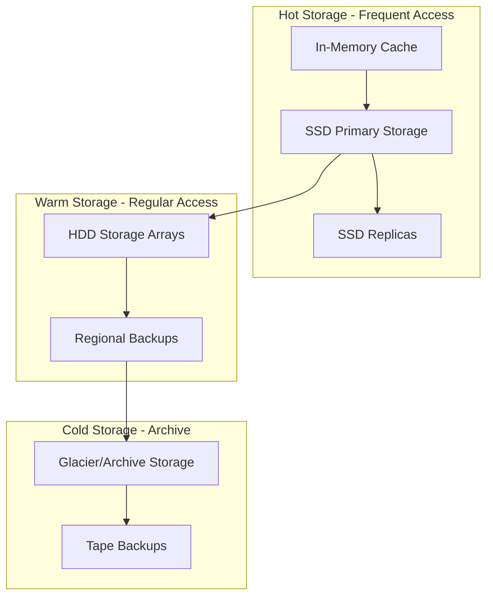
```mermaid
graph TB
    subgraph "Hot Storage - Frequent Access"
        SSD_PRIMARY[SSD Primary Storage]
        SSD_REPLICA[SSD Replicas]
        MEMORY_CACHE[In-Memory Cache]
    end
    
    subgraph "Warm Storage - Regular Access"
        HDD_STORAGE[HDD Storage Arrays]
        REGIONAL_BACKUP[Regional Backups]
    end
    
    subgraph "Cold Storage - Archive"
        GLACIER[Glacier/Archive Storage]
        TAPE_BACKUP[Tape Backups]
    end
    
    MEMORY_CACHE --> SSD_PRIMARY
    SSD_PRIMARY --> SSD_REPLICA
    SSD_PRIMARY --> HDD_STORAGE
    HDD_STORAGE --> REGIONAL_BACKUP
    REGIONAL_BACKUP --> GLACIER
    GLACIER --> TAPE_BACKUP
```

## Download Process Architecture

### 1. Media Retrieval System

The download process reverses the upload flow, retrieving encrypted media and enabling client-side decryption.

**Download Flow:**
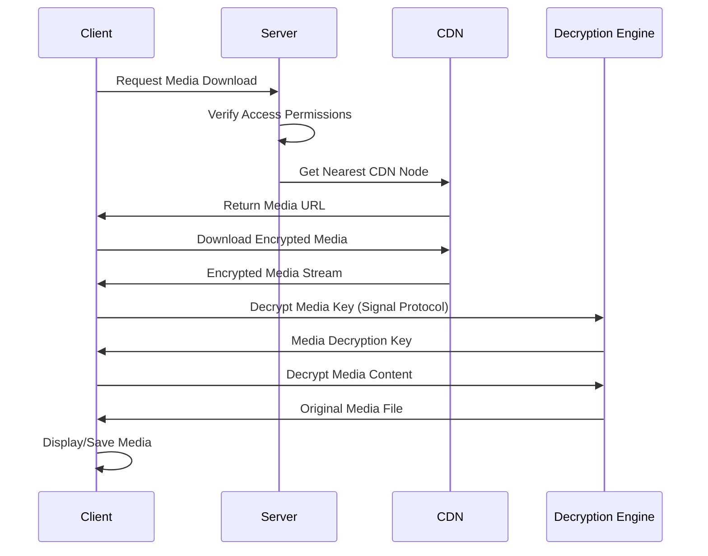
```mermaid
sequenceDiagram
    participant C as Client
    participant S as Server
    participant CDN as CDN
    participant D as Decryption Engine
    
    C->>S: Request Media Download
    S->>S: Verify Access Permissions
    S->>CDN: Get Nearest CDN Node
    CDN->>C: Return Media URL
    
    C->>CDN: Download Encrypted Media
    CDN->>C: Encrypted Media Stream
    
    C->>D: Decrypt Media Key (Signal Protocol)
    D->>C: Media Decryption Key
    
    C->>D: Decrypt Media Content
    D->>C: Original Media File
    
    C->>C: Display/Save Media
```

### 2. Progressive Download and Caching

**Download Optimization:**
- **Progressive Download**: Start playback before complete download
- **Predictive Caching**: Cache frequently accessed media
- **Adaptive Quality**: Download appropriate quality for device/network
- **Background Download**: Pre-download media for offline access
- **Local Caching**: Cache decrypted media for quick re-access

**Caching Strategy:**
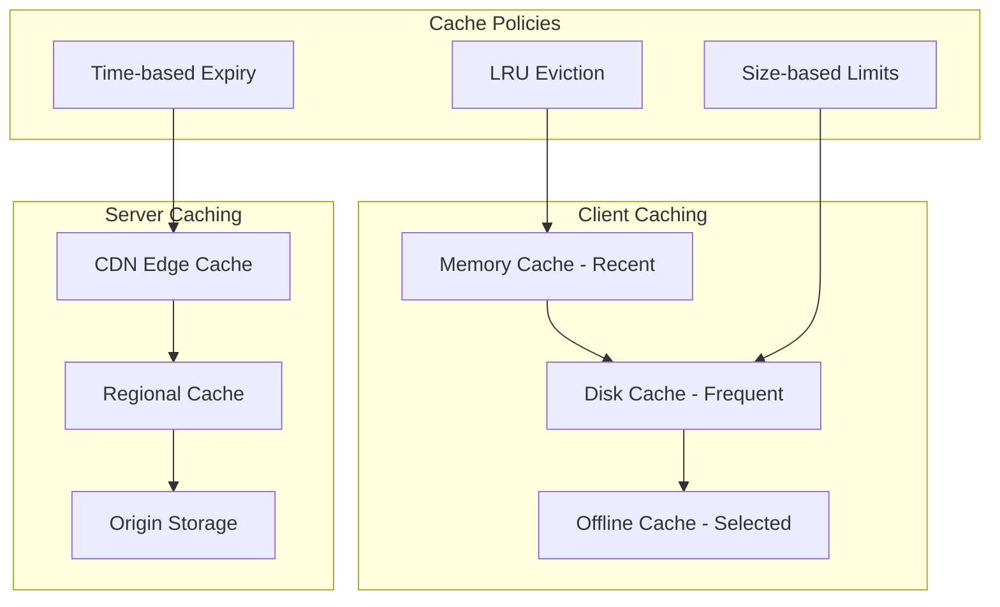
```mermaid
graph TB
    subgraph "Client Caching"
        MEMORY_CACHE[Memory Cache - Recent]
        DISK_CACHE[Disk Cache - Frequent]
        OFFLINE_CACHE[Offline Cache - Selected]
    end
    
    subgraph "Server Caching"
        CDN_EDGE[CDN Edge Cache]
        REGIONAL_CACHE[Regional Cache]
        ORIGIN_STORAGE[Origin Storage]
    end
    
    subgraph "Cache Policies"
        LRU_POLICY[LRU Eviction]
        SIZE_LIMITS[Size-based Limits]
        TTL_POLICY[Time-based Expiry]
    end
    
    MEMORY_CACHE --> DISK_CACHE
    DISK_CACHE --> OFFLINE_CACHE
    
    CDN_EDGE --> REGIONAL_CACHE
    REGIONAL_CACHE --> ORIGIN_STORAGE
    
    LRU_POLICY --> MEMORY_CACHE
    SIZE_LIMITS --> DISK_CACHE
    TTL_POLICY --> CDN_EDGE
```

## Media Processing Pipeline

### 1. Image Processing

**Image Optimization:**
- **Compression**: JPEG compression with quality optimization
- **Resizing**: Generate multiple sizes for different use cases
- **Format Conversion**: Convert to optimal format for platform
- **Metadata Stripping**: Remove EXIF data for privacy
- **Thumbnail Generation**: Create low-resolution previews

**Image Processing Flow:**

```mermaid
graph LR
    subgraph "Client Processing"
        CAPTURE[Image Capture]
        RESIZE[Client Resize]
        COMPRESS[Client Compression]
        ENCRYPT[Encryption]
    end
    
    subgraph "Server Processing"
        VIRUS_CHECK[Virus Check]
        METADATA_STRIP[Metadata Stripping]
        THUMB_GEN[Thumbnail Generation]
        FORMAT_OPT[Format Optimization]
    end
    
    subgraph "Storage"
        ORIGINAL[Encrypted Original]
        THUMBNAIL[Encrypted Thumbnail]
        MULTIPLE_SIZES[Multiple Sizes]
    end
    
    CAPTURE --> RESIZE
    RESIZE --> COMPRESS
    COMPRESS --> ENCRYPT
    
    ENCRYPT --> VIRUS_CHECK
    VIRUS_CHECK --> METADATA_STRIP
    METADATA_STRIP --> THUMB_GEN
    THUMB_GEN --> FORMAT_OPT
    
    FORMAT_OPT --> ORIGINAL
    ORIGINAL --> THUMBNAIL
    THUMBNAIL --> MULTIPLE_SIZES
```

### 2. Video Processing

**Video Optimization:**
- **Transcoding**: Convert to efficient formats (H.264, VP8)
- **Multiple Bitrates**: Create versions for different bandwidths
- **Frame Extraction**: Generate video thumbnails and previews
- **Duration Limits**: Enforce video length restrictions
- **Audio Processing**: Optimize audio tracks separately

### 3. Document Processing

**Document Handling:**
- **Format Validation**: Verify file format and integrity
- **Size Limits**: Enforce maximum file size restrictions
- **Virus Scanning**: Comprehensive malware detection
- **Preview Generation**: Create document previews when possible
- **Metadata Extraction**: Extract searchable text content

## Security and Privacy

### 1. Zero-Knowledge Architecture

WhatsApp's design ensures that servers cannot access media content at any point in the process.

**Privacy Guarantees:**
- **Client-Side Encryption**: All encryption happens on user devices
- **Encrypted Storage**: Media stored encrypted on servers
- **No Server Decryption**: Servers never have access to decryption keys
- **Forward Secrecy**: Keys rotated regularly for enhanced security
- **Metadata Protection**: Minimal metadata stored on servers

### 2. Threat Model and Mitigations

**Security Threats and Mitigations:**
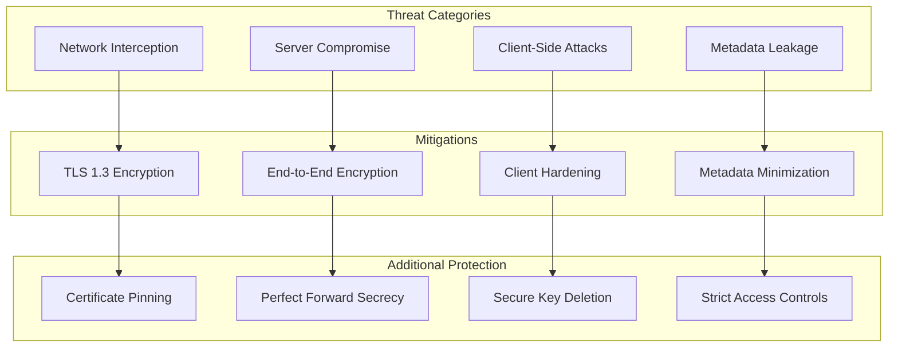
```mermaid
graph TB
    subgraph "Threat Categories"
        NETWORK_ATTACKS[Network Interception]
        SERVER_COMPROMISE[Server Compromise]
        CLIENT_ATTACKS[Client-Side Attacks]
        METADATA_LEAKAGE[Metadata Leakage]
    end
    
    subgraph "Mitigations"
        TLS_ENCRYPTION[TLS 1.3 Encryption]
        E2E_ENCRYPTION[End-to-End Encryption]
        CLIENT_HARDENING[Client Hardening]
        METADATA_MINIMIZATION[Metadata Minimization]
    end
    
    subgraph "Additional Protection"
        CERTIFICATE_PINNING[Certificate Pinning]
        FORWARD_SECRECY[Perfect Forward Secrecy]
        SECURE_DELETION[Secure Key Deletion]
        ACCESS_CONTROLS[Strict Access Controls]
    end
    
    NETWORK_ATTACKS --> TLS_ENCRYPTION
    SERVER_COMPROMISE --> E2E_ENCRYPTION
    CLIENT_ATTACKS --> CLIENT_HARDENING
    METADATA_LEAKAGE --> METADATA_MINIMIZATION
    
    TLS_ENCRYPTION --> CERTIFICATE_PINNING
    E2E_ENCRYPTION --> FORWARD_SECRECY
    CLIENT_HARDENING --> SECURE_DELETION
    METADATA_MINIMIZATION --> ACCESS_CONTROLS
```

## Performance Monitoring and Analytics

### 1. Upload Performance Metrics

**Key Performance Indicators:**
- **Upload Success Rate**: Percentage of successful uploads
- **Average Upload Time**: Time from initiation to completion
- **Retry Rate**: Percentage of uploads requiring retries
- **Network Efficiency**: Bytes transferred vs. actual file size
- **User Experience**: Time to first byte, progress feedback accuracy

### 2. System Health Monitoring

**Monitoring Architecture:**
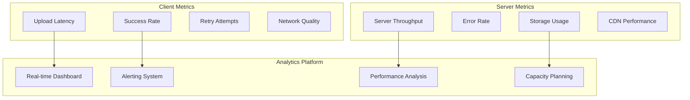
```mermaid
graph TB
    subgraph "Client Metrics"
        UPLOAD_LATENCY[Upload Latency]
        SUCCESS_RATE[Success Rate]
        RETRY_COUNT[Retry Attempts]
        NETWORK_QUALITY[Network Quality]
    end
    
    subgraph "Server Metrics"
        THROUGHPUT[Server Throughput]
        ERROR_RATE[Error Rate]
        STORAGE_UTILIZATION[Storage Usage]
        CDN_PERFORMANCE[CDN Performance]
    end
    
    subgraph "Analytics Platform"
        REAL_TIME_DASHBOARD[Real-time Dashboard]
        ALERTING_SYSTEM[Alerting System]
        PERFORMANCE_ANALYSIS[Performance Analysis]
        CAPACITY_PLANNING[Capacity Planning]
    end
    
    UPLOAD_LATENCY --> REAL_TIME_DASHBOARD
    SUCCESS_RATE --> ALERTING_SYSTEM
    THROUGHPUT --> PERFORMANCE_ANALYSIS
    STORAGE_UTILIZATION --> CAPACITY_PLANNING
```

## Disaster Recovery and Backup

### 1. Data Protection Strategy

**Backup Architecture:**
- **Real-time Replication**: Immediate replication to backup sites
- **Geographic Distribution**: Backups across multiple continents
- **Point-in-time Recovery**: Ability to restore to specific timestamps
- **Encrypted Backups**: All backups maintain encryption
- **Regular Testing**: Automated backup integrity verification

### 2. Failure Scenarios and Recovery

**Recovery Procedures:**
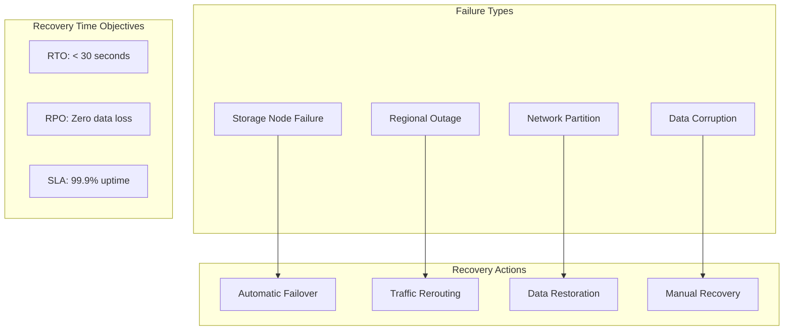
```mermaid
graph TB
    subgraph "Failure Types"
        NODE_FAILURE[Storage Node Failure]
        REGION_FAILURE[Regional Outage]
        NETWORK_PARTITION[Network Partition]
        DATA_CORRUPTION[Data Corruption]
    end
    
    subgraph "Recovery Actions"
        AUTOMATIC_FAILOVER[Automatic Failover]
        TRAFFIC_REROUTING[Traffic Rerouting]
        DATA_RESTORATION[Data Restoration]
        MANUAL_INTERVENTION[Manual Recovery]
    end
    
    subgraph "Recovery Time Objectives"
        RTO_SECONDS[RTO: < 30 seconds]
        RPO_ZERO[RPO: Zero data loss]
        SLA_UPTIME[SLA: 99.9% uptime]
    end
    
    NODE_FAILURE --> AUTOMATIC_FAILOVER
    REGION_FAILURE --> TRAFFIC_REROUTING
    NETWORK_PARTITION --> DATA_RESTORATION
    DATA_CORRUPTION --> MANUAL_INTERVENTION
```


## Voice and Video Calling Architecture

### 1. Real-Time Communication

WhatsApp's voice and video calling uses WebRTC technology with custom optimizations for mobile networks.

**Calling Infrastructure:**
- **STUN/TURN Servers**: NAT traversal and relay services
- **Media Servers**: Call routing and media processing
- **Codec Optimization**: Opus for audio, VP8/H.264 for video
- **Adaptive Bitrate**: Dynamic quality adjustment based on network conditions
- **End-to-End Encryption**: SRTP encryption for media streams

**Call Setup Process:**
```mermaid
sequenceDiagram
    participant A as Caller
    participant WS as WhatsApp Server
    participant B as Callee
    participant MS as Media Server

    A->>WS: Initiate Call Request
    WS->>B: Incoming Call Notification
    B->>WS: Accept Call
    WS->>A: Call Accepted

    A->>MS: Connect to Media Server
    B->>MS: Connect to Media Server

    MS->>A: ICE Candidates
    MS->>B: ICE Candidates

    A->>B: Direct P2P Media (if possible)
    B->>A: Direct P2P Media (if possible)

    alt P2P Connection Failed
        A->>MS: Relay Media
        MS->>B: Relay Media
    end
```

### 2. Network Optimization

**Mobile Network Adaptation:**
- **Network Quality Detection**: Continuous monitoring of network conditions
- **Codec Selection**: Automatic codec selection based on bandwidth
- **Jitter Buffer**: Adaptive buffering for packet delay variation
- **Echo Cancellation**: Acoustic echo cancellation for clear audio
- **Noise Suppression**: Background noise reduction

## Group Messaging Architecture

### 1. Group Management

WhatsApp supports groups with up to 256 participants with sophisticated group management capabilities.

**Group Architecture Components:**
- **Group Metadata**: Group information, participant list, permissions
- **Message Broadcasting**: Efficient message distribution to all members
- **Admin Controls**: Group admin privileges and member management
- **Invitation System**: Group invitation and approval mechanisms
- **Privacy Controls**: Group visibility and join restrictions

**Group Message Flow:**
```mermaid
graph TB
    subgraph "Group Message Distribution"
        SENDER[Group Member Sends Message]
        GROUP_SERVICE[Group Management Service]
        MEMBER_LIST[Active Member List]
        MESSAGE_FANOUT[Message Fan-out]
    end
    
    subgraph "Delivery Optimization"
        ONLINE_DELIVERY[Online Members]
        OFFLINE_QUEUE[Offline Member Queue]
        BATCH_DELIVERY[Batch Delivery]
    end
    
    subgraph "Encryption"
        SENDER_KEY[Sender Key Encryption]
        PER_MEMBER_ENCRYPT[Per-Member Decryption]
        FORWARD_SECRECY[Forward Secrecy Management]
    end
    
    SENDER --> GROUP_SERVICE
    GROUP_SERVICE --> MEMBER_LIST
    MEMBER_LIST --> MESSAGE_FANOUT
    
    MESSAGE_FANOUT --> ONLINE_DELIVERY
    MESSAGE_FANOUT --> OFFLINE_QUEUE
    OFFLINE_QUEUE --> BATCH_DELIVERY
    
    GROUP_SERVICE --> SENDER_KEY
    SENDER_KEY --> PER_MEMBER_ENCRYPT
    PER_MEMBER_ENCRYPT --> FORWARD_SECRECY
```

### 2. Group Scalability

**Efficient Group Operations:**
- **Incremental Updates**: Only send changes, not full group state
- **Member Caching**: Local caching of group member information
- **Message Deduplication**: Prevent duplicate message delivery
- **Group State Synchronization**: Consistent group state across devices

## Media Sharing Architecture

### 1. Media Processing Pipeline

WhatsApp handles billions of media files daily including photos, videos, documents, and voice messages.

**Media Upload/Download Flow:**
```mermaid
graph LR
    subgraph "Upload Process"
        CLIENT_UPLOAD[Client Upload]
        MEDIA_VALIDATION[Media Validation]
        COMPRESSION[Media Compression]
        ENCRYPTION[Media Encryption]
        STORAGE[Media Storage]
    end
    
    subgraph "Download Process"
        MEDIA_REQUEST[Media Request]
        CDN_DELIVERY[CDN Delivery]
        DECRYPTION[Media Decryption]
        CLIENT_DISPLAY[Client Display]
    end
    
    CLIENT_UPLOAD --> MEDIA_VALIDATION
    MEDIA_VALIDATION --> COMPRESSION
    COMPRESSION --> ENCRYPTION
    ENCRYPTION --> STORAGE
    
    MEDIA_REQUEST --> CDN_DELIVERY
    CDN_DELIVERY --> DECRYPTION
    DECRYPTION --> CLIENT_DISPLAY
```

### 2. Media Optimization

**Bandwidth Optimization:**
- **Image Compression**: Lossy compression with quality preservation
- **Video Transcoding**: Multiple bitrates for different network conditions
- **Progressive Download**: Streaming download for large media files
- **Thumbnail Generation**: Low-resolution previews for quick loading
- **Format Optimization**: Platform-specific media format selection

**Storage Strategy:**
- **Distributed Storage**: Media files distributed across global data centers
- **CDN Integration**: Content delivery network for media distribution
- **Expiration Policies**: Automatic cleanup of old media files
- **Deduplication**: Storage optimization through duplicate media detection

## Presence and Status Architecture

### 1. User Presence System

WhatsApp's presence system tracks user online status, last seen information, and typing indicators.

**Presence Components:**
- **Online Status**: Real-time online/offline status tracking
- **Last Seen**: Timestamp of last user activity
- **Typing Indicators**: Real-time typing status in conversations
- **Privacy Controls**: User-configurable presence visibility settings

**Presence Update Flow:**
```mermaid
sequenceDiagram
    participant U as User
    participant PS as Presence Service
    participant C as Contacts
    
    U->>PS: Status Update (Online/Typing)
    PS->>PS: Update Presence State
    PS->>C: Broadcast to Contacts
    C->>C: Update UI
    
    Note over U: User goes offline
    U->>PS: Disconnect/Offline
    PS->>PS: Mark as Last Seen
    PS->>C: Broadcast Offline Status
```

### 2. Status Stories

WhatsApp Status allows users to share temporary content that expires after 24 hours.

**Status Architecture:**
- **Temporary Storage**: Content automatically deleted after 24 hours
- **Privacy Controls**: Audience selection for status visibility
- **View Tracking**: Track who viewed each status update
- **Media Support**: Photos, videos, and text status updates

## Global Infrastructure and Scaling

### 1. Data Center Strategy

**Geographic Distribution:**
WhatsApp operates data centers strategically located around the world to minimize latency and ensure high availability.

```mermaid
graph TB
    subgraph "Primary Regions"
        US_EAST[US East Coast]
        US_WEST[US West Coast]
        EUROPE[Europe - Dublin]
        ASIA[Asia Pacific - Singapore]
    end
    
    subgraph "Secondary Regions"
        LATAM[Latin America]
        INDIA[India]
        MIDDLE_EAST[Middle East]
        AFRICA[Africa]
    end
    
    subgraph "Cross-Region Services"
        GLOBAL_ROUTING[Global Message Routing]
        CROSS_REGION_SYNC[Cross-Region Synchronization]
        DISASTER_RECOVERY[Disaster Recovery]
    end
    
    US_EAST <--> EUROPE
    US_WEST <--> ASIA
    EUROPE <--> ASIA
    
    US_EAST --> LATAM
    EUROPE --> MIDDLE_EAST
    EUROPE --> AFRICA
    ASIA --> INDIA
```

### 2. Horizontal Scaling Strategy

**Scaling Approach:**
- **User-Based Sharding**: Users distributed across multiple server clusters
- **Geographic Routing**: Route users to nearest data center
- **Load Balancing**: Dynamic load distribution across servers
- **Auto-Scaling**: Automatic capacity scaling based on demand
- **Database Sharding**: User data partitioned across multiple databases

**Capacity Planning:**
```mermaid
graph TB
    subgraph "Scaling Metrics"
        CONCURRENT_USERS[Concurrent Users]
        MESSAGE_RATE[Messages per Second]
        MEDIA_BANDWIDTH[Media Bandwidth]
        CONNECTION_COUNT[Active Connections]
    end
    
    subgraph "Scaling Actions"
        HORIZONTAL_SCALING[Add Server Instances]
        DATABASE_SHARDING[Add Database Shards]
        CDN_EXPANSION[Expand CDN Nodes]
        NETWORK_CAPACITY[Increase Network Capacity]
    end
    
    CONCURRENT_USERS --> HORIZONTAL_SCALING
    MESSAGE_RATE --> DATABASE_SHARDING
    MEDIA_BANDWIDTH --> CDN_EXPANSION
    CONNECTION_COUNT --> NETWORK_CAPACITY
```

## Performance Optimization

### 1. Network Efficiency

**Bandwidth Optimization:**
- **Message Compression**: Binary protocol with data compression
- **Connection Pooling**: Reuse connections for multiple operations
- **Batching**: Group multiple operations into single requests
- **Delta Synchronization**: Send only changes, not full state
- **Predictive Caching**: Pre-load likely needed data

### 2. Mobile Optimization

**Battery Life Optimization:**
- **Push Notifications**: Use platform push services instead of persistent connections
- **Background Processing**: Minimize background activity
- **CPU Optimization**: Efficient algorithms and data structures
- **Network Activity**: Batch network requests and minimize frequency

**Data Usage Optimization:**
- **Adaptive Quality**: Reduce media quality on cellular networks
- **Wi-Fi Detection**: Higher quality when on Wi-Fi networks
- **Data Usage Controls**: User settings for data consumption
- **Compression**: Aggressive compression for all data types

## Reliability and Fault Tolerance

### 1. System Resilience

**Fault Tolerance Mechanisms:**
- **Process Supervision**: Erlang supervisor trees for automatic recovery
- **Circuit Breakers**: Prevent cascade failures between services
- **Graceful Degradation**: Maintain core functionality during partial failures
- **Bulkhead Isolation**: Isolate failures to prevent system-wide impact
- **Redundancy**: Multiple instances of all critical services

**Disaster Recovery:**
```mermaid
graph TB
    subgraph "Failure Detection"
        HEALTH_MONITORING[Health Monitoring]
        AUTOMATED_ALERTS[Automated Alerts]
        PERFORMANCE_METRICS[Performance Metrics]
    end
    
    subgraph "Recovery Actions"
        AUTOMATIC_FAILOVER[Automatic Failover]
        SERVICE_RESTART[Service Restart]
        TRAFFIC_REROUTING[Traffic Rerouting]
        DATA_RECOVERY[Data Recovery]
    end
    
    subgraph "Prevention"
        CHAOS_TESTING[Chaos Testing]
        LOAD_TESTING[Load Testing]
        CAPACITY_PLANNING[Capacity Planning]
        MONITORING[24/7 Monitoring]
    end
    
    HEALTH_MONITORING --> AUTOMATIC_FAILOVER
    AUTOMATED_ALERTS --> SERVICE_RESTART
    PERFORMANCE_METRICS --> TRAFFIC_REROUTING
```

### 2. Data Durability

**Data Protection:**
- **Multi-Region Replication**: Data replicated across geographic regions
- **Backup Systems**: Regular automated backups of critical data
- **Message Durability**: Guaranteed message persistence until delivery
- **Point-in-Time Recovery**: Ability to restore data to specific timestamps

## Security Architecture

### 1. Multi-Layered Security

**Security Components:**
- **Transport Layer Security**: TLS for all client-server communication
- **End-to-End Encryption**: Signal Protocol for message encryption
- **Server Security**: Hardened servers with regular security updates
- **Access Control**: Strict access controls for system components
- **Audit Logging**: Comprehensive logging for security monitoring

### 2. Privacy Protection

**Privacy Features:**
- **Data Minimization**: Collect only necessary user data
- **Forward Secrecy**: Past messages remain secure even if keys are compromised
- **Disappearing Messages**: Automatic message deletion after specified time
- **Privacy Controls**: User controls over profile information and status
- **No Message Storage**: Messages not stored on servers after delivery

## Related Case Studies
- See [Telegram](telegram.md) for alternative messaging architecture approaches (if available)
- See [Signal](signal.md) for encryption protocol implementation (if available)
- See [Discord](discord.md) for real-time group communication (if available)
- See [Google Meet](google-meet.md) for real-time voice/video calling architecture

## Challenges and Trade-offs

### 1. Technical Challenges

**Scale and Performance:**
- **Massive Concurrent Users**: Supporting 2+ billion users simultaneously
- **Real-time Requirements**: Sub-second message delivery globally
- **Network Diversity**: Adapting to varying network conditions worldwide
- **Device Fragmentation**: Supporting thousands of different device types
- **Cross-Platform Consistency**: Maintaining feature parity across platforms

**Architecture Trade-offs:**
- **Consistency vs Availability**: Eventual consistency for better availability
- **Privacy vs Analytics**: Limited analytics due to end-to-end encryption
- **Simplicity vs Features**: Maintaining simple user experience while adding features
- **Performance vs Security**: Balancing encryption overhead with performance

### 2. Business and Operational Challenges

**Global Operations:**
- **Regulatory Compliance**: Adapting to different countries' regulations
- **Content Moderation**: Balancing privacy with content moderation needs
- **Spam Prevention**: Detecting and preventing spam without breaking encryption
- **Infrastructure Costs**: Managing costs for free global messaging service

**Engineering Efficiency:**
- **Small Team Size**: Maintaining the system with a remarkably small engineering team
- **Technical Debt**: Balancing rapid growth with code quality
- **Reliability**: Maintaining 99.99% uptime across global infrastructure
- **Security**: Continuous security improvements and threat response

## Lessons Learned and Best Practices

### 1. Architecture Principles

**Key Design Decisions:**
- **Technology Choice**: Erlang/OTP proved ideal for concurrent, fault-tolerant messaging
- **Custom Protocol**: Binary protocol optimization crucial for mobile efficiency
- **End-to-End Encryption**: Privacy-first approach builds user trust
- **Simplicity**: Focus on core messaging functionality over feature bloat
- **Reliability**: "It just works" philosophy drives architectural decisions

### 2. Scaling Strategies

**Successful Scaling Approaches:**
- **Vertical Scaling First**: Maximize single-server capacity before horizontal scaling
- **User Sharding**: Distribute users across servers for balanced load
- **Geographic Distribution**: Minimize latency through strategic data center placement
- **Connection Persistence**: Long-lived connections reduce overhead
- **Push Integration**: Leverage platform push services for better efficiency

## Future Evolution

### 1. Technology Trends

**Emerging Capabilities:**
- **Multi-Device Support**: Seamless synchronization across multiple devices
- **Business Integration**: Enhanced business communication features
- **Payment Integration**: Secure payment features in messaging
- **AI Integration**: Smart features while maintaining privacy
- **5G Optimization**: Leveraging 5G networks for enhanced experiences

### 2. Architecture Evolution

**Anticipated Changes:**
- **Edge Computing**: Processing closer to users for reduced latency
- **Quantum Cryptography**: Preparing for post-quantum encryption
- **Serverless Architecture**: Evolution toward more serverless components
- **Machine Learning**: Privacy-preserving ML for spam detection and user experience
- **Interoperability**: Cross-platform messaging standards adoption

## Conclusion

WhatsApp's architecture demonstrates how thoughtful technology choices and architectural principles can enable massive scale while maintaining simplicity and reliability. The platform's success stems from its focus on core messaging functionality, robust encryption, efficient mobile optimization, and fault-tolerant infrastructure.

Key architectural achievements include supporting 2+ billion users with a small engineering team, implementing end-to-end encryption at scale, achieving sub-second global message delivery, and maintaining exceptional reliability. WhatsApp's engineering philosophy emphasizes simplicity, privacy, and reliability over feature complexity.

The architecture continues to evolve to support new use cases while maintaining the core principles that made WhatsApp successful: simplicity, privacy, reliability, and efficiency. The platform serves as an excellent example of how proper architectural foundations can support massive scale and global reach while maintaining exceptional user experience.