# YouTube System Design - Complete Architecture Guide

## Table of Contents
1. [Introduction](#introduction)
2. [Requirements Analysis](#requirements-analysis)
3. [High-Level Architecture](#high-level-architecture)
4. [Core Components](#core-components)
5. [Data Flow & Processing](#data-flow--processing)
6. [Storage Strategy](#storage-strategy)
7. [CDN & Content Delivery](#cdn--content-delivery)
8. [API Design](#api-design)
9. [Code Examples](#code-examples)
10. [Scalability Patterns](#scalability-patterns)
11. [Related Systems](#related-systems)

---

## Introduction

YouTube is the world's largest video-sharing platform, handling billions of video views daily. This document explores the architectural patterns, design decisions, and system components that enable YouTube to operate at massive scale.

**Key Challenges:**
- Handling petabytes of video content
- Delivering low-latency streaming globally
- Processing video uploads and transcoding
- Managing billions of user interactions
- Ensuring high availability and fault tolerance

---

## Requirements Analysis

### Functional Requirements
- **Video Upload**: Users can upload videos (various formats, up to several GB)
- **Video Playback**: Stream videos with adaptive bitrate
- **Search**: Find videos by title, tags, description
- **Recommendations**: Suggest relevant videos
- **Comments & Engagement**: Like, comment, subscribe, share
- **Analytics**: View counts, watch time, demographics

### Non-Functional Requirements
- **Availability**: 99.99% uptime
- **Latency**: < 200ms for video start, < 100ms for API calls
- **Scale**: Support 500+ hours of video uploaded per minute
- **Consistency**: Eventual consistency for views/likes, strong consistency for uploads
- **Security**: DRM, content moderation, user authentication

### Capacity Estimates
- **DAU**: 2 billion users
- **Uploads**: 720,000 hours/day (~30,000 hours/hour)
- **Storage**: ~500 PB (growing 1 PB/month)
- **Bandwidth**: 50+ Tbps peak
- **QPS**: ~500,000 video requests/second

---

## High-Level Architecture

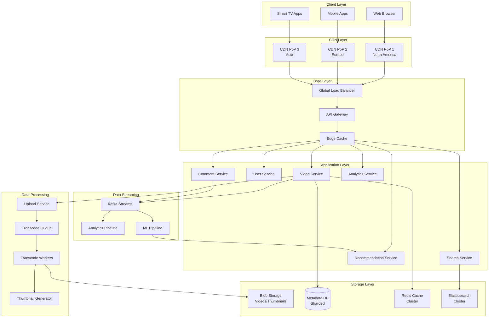

---

## Core Components

### 1. API Gateway

**Purpose**: Single entry point for all client requests

**Responsibilities:**
- Authentication & authorization
- Rate limiting
- Request routing
- Protocol translation (HTTP/gRPC)
- Response aggregation

**Key Features:**
- JWT token validation
- Circuit breaker pattern
- Request/response logging
- API versioning

---

### 2. Video Upload & Processing Pipeline

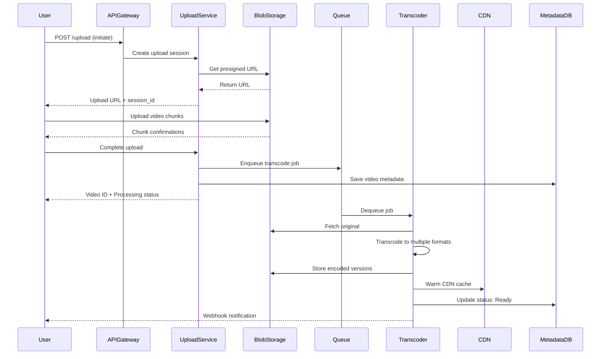

**Transcoding Strategy:**
- Multiple resolutions: 144p, 240p, 360p, 480p, 720p, 1080p, 1440p, 4K
- Multiple codecs: H.264, VP9, AV1
- Adaptive bitrate streaming (DASH/HLS)
- Audio-only versions for bandwidth optimization

---

### 3. Video Streaming Architecture

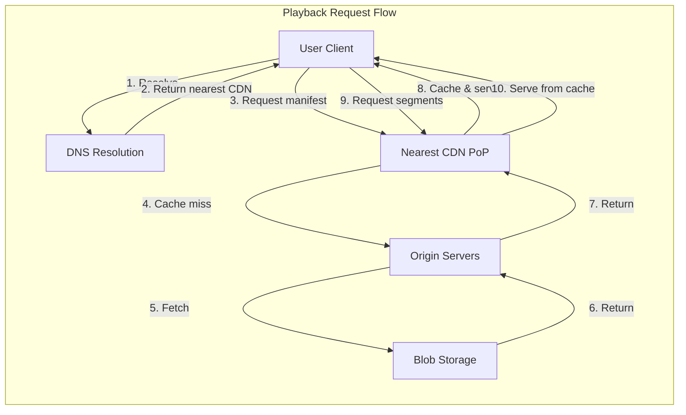

**Streaming Protocol:**
- DASH (Dynamic Adaptive Streaming over HTTP)
- HLS (HTTP Live Streaming) for Apple devices
- Segment duration: 2-10 seconds
- Adaptive bitrate based on network conditions

---

### 4. Recommendation System

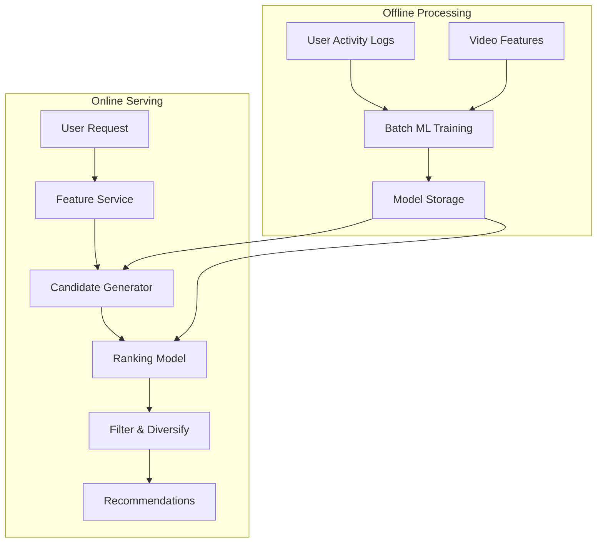

**Recommendation Stages:**
1. **Candidate Generation**: Find hundreds of relevant videos
2. **Ranking**: Score and sort candidates
3. **Filtering**: Remove watched, blocked, or inappropriate content
4. **Diversification**: Ensure variety in recommendations

---

### 5. Search System

**Architecture Components:**
- Elasticsearch cluster for full-text search
- Inverted index on: title, description, tags, captions
- Real-time indexing via Kafka streams
- Query optimization and caching

**Search Ranking Factors:**
- Relevance score (TF-IDF + BM25)
- Video popularity (views, engagement)
- Freshness (upload date)
- User personalization
- Quality signals (watch time, likes)

---

## Data Flow & Processing

### Video Upload Flow

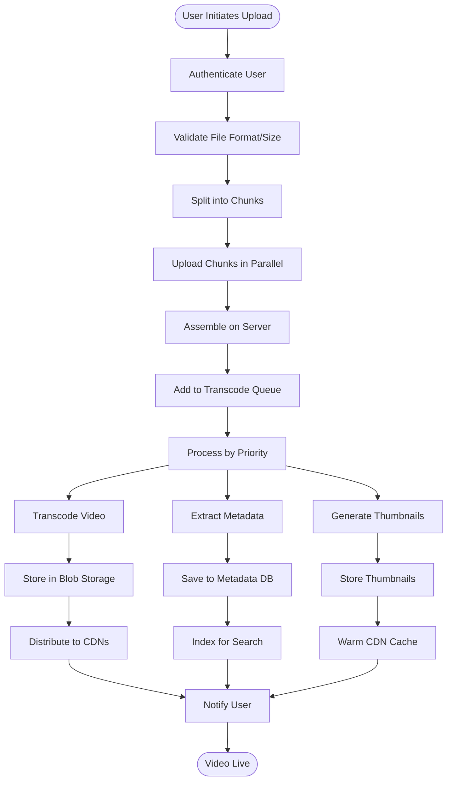

### Video Playback Flow

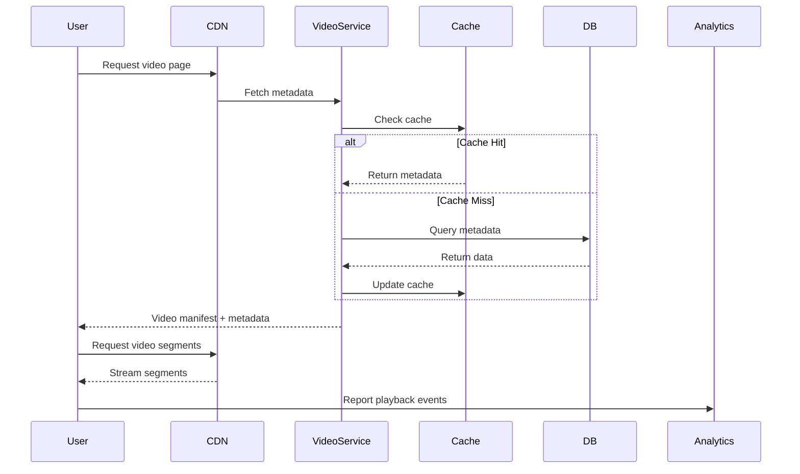

---

## Storage Strategy

### Database Sharding

**Video Metadata Database:**
- Shard by video_id (consistent hashing)
- Each shard: 100M videos
- Replication: Master-slave (3 replicas per shard)

**User Database:**
- Shard by user_id
- Separate read replicas for analytics

**Schema Example:**

**Videos Table:**
```
video_id (PK) | user_id | title | description | duration | upload_date 
              | status | views | likes | category_id | language
```

**Video_Streams Table:**
```
stream_id (PK) | video_id (FK) | format | resolution | bitrate 
              | codec | storage_path | cdn_url | file_size
```

### Blob Storage Architecture

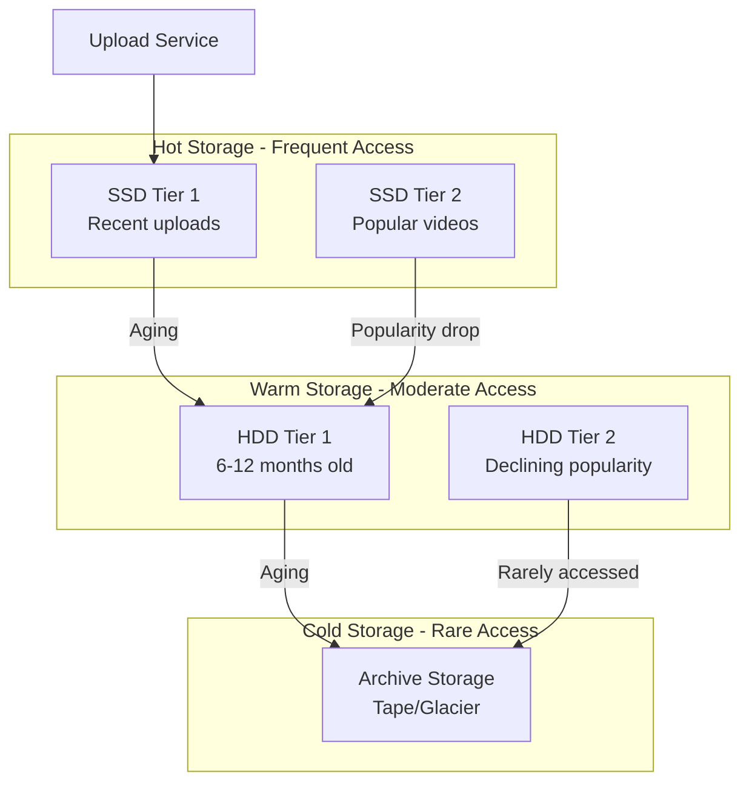

**Storage Optimization:**
- Tiered storage based on access patterns
- Deduplication for identical content
- Compression (not for video, but for thumbnails/metadata)
- Geographic distribution for global access

---

## CDN & Content Delivery

### Multi-CDN Strategy

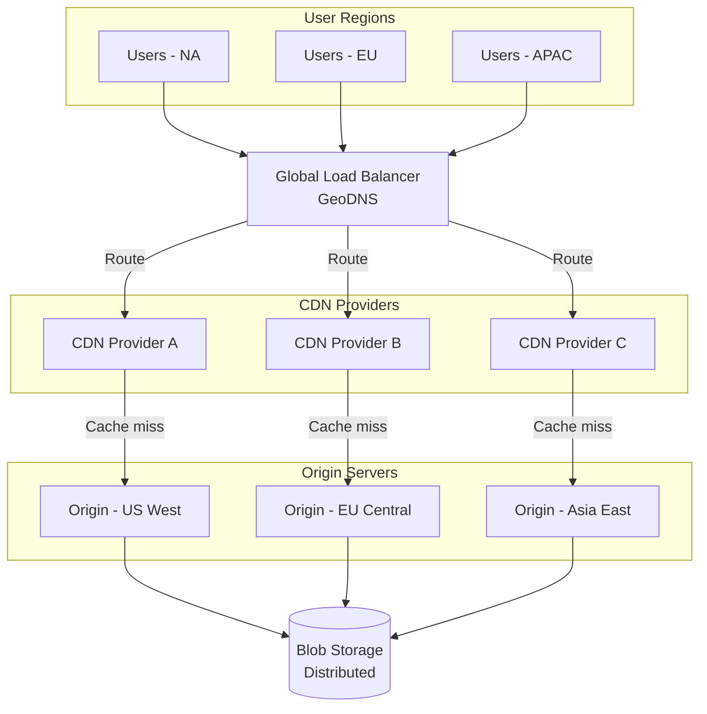

**CDN Features:**
- **Edge caching**: 99%+ cache hit rate for popular videos
- **Prefetching**: Pre-load next segments based on playback
- **Intelligent routing**: Route to optimal CDN based on health
- **Cost optimization**: Balance between multiple CDN providers

**Caching Strategy:**
- L1: Browser cache (5 min)
- L2: CDN edge (24 hours for popular, 1 hour for others)
- L3: CDN regional (7 days)
- Origin: Permanent storage

---

## API Design

### RESTful API Endpoints

**Video Operations:**
```javascript
// Upload initiation
POST /api/v1/videos/upload
Body: { title, description, category, tags[], privacy }
Response: { upload_url, video_id, session_id }

// Get video details
GET /api/v1/videos/{video_id}
Response: { video_id, metadata, streams[], thumbnails[] }

// Search videos
GET /api/v1/videos/search?q={query}&page={n}&limit={m}
Response: { results[], total, page, hasMore }

// Get recommendations
GET /api/v1/videos/recommendations?user_id={id}
Response: { videos[], algorithm_version }
```

**User Operations:**
```javascript
// Get user channel
GET /api/v1/users/{user_id}/channel
Response: { channel_id, name, subscribers, videos[] }

// Subscribe
POST /api/v1/users/{user_id}/subscribe
Body: { channel_id }
Response: { success, subscription_id }
```

**Engagement Operations:**
```javascript
// Like video
POST /api/v1/videos/{video_id}/like
Response: { success, total_likes }

// Add comment
POST /api/v1/videos/{video_id}/comments
Body: { text, parent_comment_id? }
Response: { comment_id, timestamp }
```

### Sample API Gateway Configuration

```javascript
// api-gateway-config.js
const routes = {
  '/api/v1/videos/*': {
    service: 'video-service',
    rateLimit: { requests: 1000, window: '1m' },
    cache: { ttl: 60, vary: ['user_id'] },
    auth: 'optional'
  },
  '/api/v1/upload/*': {
    service: 'upload-service',
    rateLimit: { requests: 10, window: '1h' },
    auth: 'required',
    maxBodySize: '5GB'
  },
  '/api/v1/search': {
    service: 'search-service',
    rateLimit: { requests: 100, window: '1m' },
    cache: { ttl: 300 },
    auth: 'optional'
  }
};

const middleware = {
  cors: { origins: ['youtube.com'], credentials: true },
  compression: { threshold: 1024 },
  logging: { level: 'info', includeBody: false }
};
```

---

## Code Examples

### 1. Video Upload Service (Simplified)

```javascript
// upload-service.js
class VideoUploadService {
  async initiateUpload(userId, metadata) {
    // Validate user quota
    const quota = await this.checkUserQuota(userId);
    if (!quota.available) throw new Error('Quota exceeded');

    // Generate video ID
    const videoId = this.generateVideoId();
    
    // Create upload session
    const session = await this.createUploadSession({
      videoId,
      userId,
      metadata,
      expiresAt: Date.now() + 24 * 3600 * 1000
    });

    // Generate presigned URL for blob storage
    const uploadUrl = await this.blobStorage.getPresignedUrl({
      key: `uploads/${videoId}/original`,
      expiresIn: 3600
    });

    return { videoId, uploadUrl, sessionId: session.id };
  }

  async completeUpload(videoId, sessionId) {
    // Verify session
    const session = await this.getSession(sessionId);
    if (!session) throw new Error('Invalid session');

    // Save metadata to database
    await this.db.videos.create({
      id: videoId,
      userId: session.userId,
      status: 'processing',
      ...session.metadata
    });

    // Enqueue transcode job
    await this.queue.publish('video.transcode', {
      videoId,
      priority: this.calculatePriority(session.userId),
      formats: ['360p', '720p', '1080p']
    });

    return { videoId, status: 'processing' };
  }

  generateVideoId() {
    // Base62 encoding of timestamp + random
    return base62Encode(Date.now()) + randomString(6);
  }
}
```

### 2. Video Transcoding Worker

```javascript
// transcode-worker.js
class TranscodeWorker {
  async processJob(job) {
    const { videoId, formats } = job.data;

    // Download original video
    const originalPath = await this.downloadFromBlob(videoId);

    // Transcode to multiple formats
    const results = await Promise.all(
      formats.map(format => this.transcodeVideo(originalPath, format))
    );

    // Upload transcoded versions
    await Promise.all(
      results.map(({ format, path }) => 
        this.uploadToBlob(videoId, format, path)
      )
    );

    // Generate thumbnails
    const thumbnails = await this.generateThumbnails(originalPath);
    await this.uploadThumbnails(videoId, thumbnails);

    // Update metadata
    await this.updateVideoStatus(videoId, 'ready', results);

    // Warm CDN cache
    await this.warmCDNCache(videoId, formats);
  }

  async transcodeVideo(inputPath, format) {
    const { resolution, bitrate, codec } = this.getFormatSpec(format);
    // FFmpeg transcoding logic (simplified)
    return { format, path: outputPath, size, duration };
  }
}
```

### 3. Video Playback Service

```javascript
// playback-service.js
class VideoPlaybackService {
  async getVideoManifest(videoId, userContext) {
    // Check cache
    const cacheKey = `manifest:${videoId}:${userContext.quality}`;
    let manifest = await this.cache.get(cacheKey);

    if (!manifest) {
      // Fetch video metadata
      const video = await this.db.videos.findById(videoId);
      if (!video || video.status !== 'ready') {
        throw new Error('Video not available');
      }

      // Get available streams
      const streams = await this.db.streams.findByVideoId(videoId);

      // Generate DASH/HLS manifest
      manifest = this.generateManifest(video, streams, userContext);

      // Cache for 5 minutes
      await this.cache.set(cacheKey, manifest, 300);
    }

    // Log playback event
    await this.analytics.logEvent('video.play', {
      videoId,
      userId: userContext.userId,
      quality: userContext.quality
    });

    return manifest;
  }

  generateManifest(video, streams, context) {
    // Select appropriate streams based on user bandwidth
    const selectedStreams = this.selectStreams(streams, context);

    return {
      videoId: video.id,
      duration: video.duration,
      streams: selectedStreams.map(s => ({
        url: this.getCDNUrl(s),
        resolution: s.resolution,
        bitrate: s.bitrate,
        codec: s.codec
      }))
    };
  }

  getCDNUrl(stream) {
    // Route to nearest CDN based on user location
    const cdnDomain = this.selectCDN(stream.region);
    return `https://${cdnDomain}/v/${stream.videoId}/${stream.format}`;
  }
}
```

### 4. Recommendation Service

```javascript
// recommendation-service.js
class RecommendationService {
  async getRecommendations(userId, context = {}) {
    const { count = 20, seedVideoId } = context;

    // Fetch user features
    const userFeatures = await this.getUserFeatures(userId);

    // Stage 1: Candidate Generation (retrieve 500 candidates)
    const candidates = await this.generateCandidates(
      userFeatures, 
      seedVideoId, 
      500
    );

    // Stage 2: Ranking
    const scored = await this.scoreVideos(candidates, userFeatures);

    // Stage 3: Filtering
    const filtered = await this.filterVideos(scored, userId);

    // Stage 4: Diversification
    const diversified = this.diversify(filtered, count);

    return diversified;
  }

  async generateCandidates(userFeatures, seedVideo, limit) {
    // Multiple candidate sources
    const [collaborative, contentBased, trending] = await Promise.all([
      this.collaborativeFiltering(userFeatures, limit / 3),
      this.contentBasedFiltering(seedVideo, limit / 3),
      this.getTrending(userFeatures.region, limit / 3)
    ]);

    return [...collaborative, ...contentBased, ...trending];
  }

  async scoreVideos(candidates, userFeatures) {
    // Load ML model
    const model = await this.modelStore.getModel('ranking-v3');

    // Batch prediction
    return model.predict(candidates, userFeatures);
  }
}
```

---

## Scalability Patterns

### 1. Horizontal Scaling

**Stateless Services:**
- All application services are stateless
- Session stored in distributed cache (Redis)
- Easy to add/remove instances

**Database Sharding:**
- Partition data by video_id or user_id
- Use consistent hashing for even distribution
- Route queries to appropriate shard

### 2. Caching Strategy

**Multi-Level Caching:**

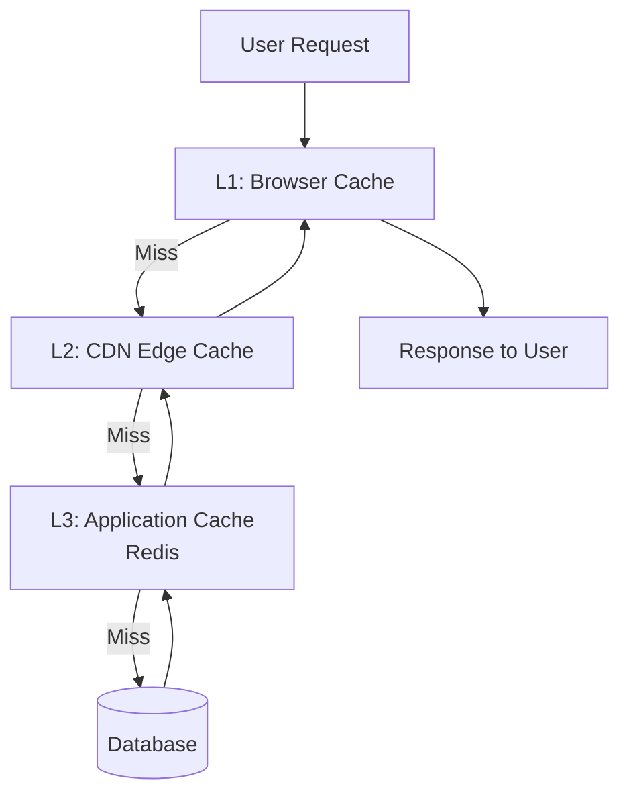

**Cache Invalidation:**
- Time-based: TTL for different content types
- Event-based: Invalidate on updates
- LRU eviction for memory-constrained caches

### 3. Asynchronous Processing

**Use Cases:**
- Video transcoding (hours of processing)
- Thumbnail generation
- Analytics aggregation
- Email notifications

**Message Queue Architecture:**
- Kafka for high-throughput event streaming
- Priority queues for urgent vs batch jobs
- Dead letter queues for failed processing

### 4. Load Balancing

**Global Load Balancing:**
- GeoDNS for routing to nearest region
- Health checks and automatic failover
- Weighted routing for gradual rollouts

**Service Load Balancing:**
- Round-robin for stateless services
- Least connections for persistent connections
- Consistent hashing for cache affinity

---

## Related Systems

This YouTube system design shares architectural patterns with other large-scale systems:

### Similar to Netflix (see `netflix.md`)
- **Video streaming**: Both use adaptive bitrate streaming (DASH/HLS)
- **CDN strategy**: Multi-CDN approach for global delivery
- **Recommendation engines**: ML-based personalization
- **Encoding pipeline**: Multi-format transcoding

**Key Difference**: Netflix pre-encodes all content; YouTube handles user-generated uploads

### Similar to Twitter (see `twitter.md`)
- **Real-time feeds**: Home feed vs subscriptions feed
- **Engagement metrics**: Likes, comments, shares
- **Notification systems**: Push notifications for new content
- **Timeline algorithms**: Personalized content ranking

**Key Difference**: Video-centric vs text/image-centric content

### Similar to Amazon (see `amazon.md`)
- **Search & discovery**: Full-text search with ranking
- **Recommendation engine**: Collaborative filtering + content-based
- **User analytics**: Tracking user behavior for personalization
- **CDN usage**: Global content delivery

**Key Difference**: Video streaming vs product catalog

### Similar to WhatsApp (see `whatsapp.md`)
- **Real-time messaging**: Comments and live chat
- **Notification system**: Push notifications for engagement
- **Media handling**: Video/image upload and processing

**Key Difference**: Public broadcast vs private messaging

### Similar to Uber (see `uber.md`)
- **Real-time processing**: Live view counts and concurrent viewers
- **Geographic distribution**: Content routing based on location
- **Analytics dashboard**: Creator analytics similar to driver analytics

**Key Difference**: Content delivery vs location-based services

---

## Deployment Architecture

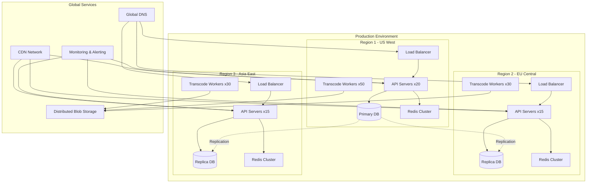

**Deployment Strategy:**
- Blue-green deployments for zero downtime
- Canary releases for gradual rollout
- Feature flags for A/B testing
- Automated rollback on errors

---

## Monitoring & Observability

**Key Metrics:**
- **Video Upload Success Rate**: Target > 99.5%
- **Transcoding Time**: P95 < 30 minutes
- **Video Start Time**: P95 < 200ms
- **Buffering Ratio**: Target < 0.5%
- **CDN Cache Hit Rate**: Target > 95%
- **API Response Time**: P95 < 100ms

**Alerting Thresholds:**
- Error rate > 1% for 5 minutes
- Latency P95 > 500ms for 10 minutes
- CDN cache hit rate < 90% for 15 minutes
- Transcoding queue depth > 10,000

---

## Security Considerations

**Content Protection:**
- DRM (Digital Rights Management) for premium content
- Encrypted video streams (HTTPS/HLS encryption)
- Watermarking for copyright protection

**Access Control:**
- OAuth 2.0 for authentication
- JWT tokens for session management
- Role-based access control (RBAC)

**Content Moderation:**
- Automated scanning for inappropriate content
- Manual review queue for flagged videos
- Copyright detection (Content ID system)

**DDoS Protection:**
- Rate limiting at API gateway
- CDN-level DDoS mitigation
- Bot detection and blocking

---

## Cost Optimization

**Storage Costs:**
- Tiered storage (hot/warm/cold)
- Deduplication to avoid storing identical content
- Compression for thumbnails and metadata

**Bandwidth Costs:**
- Multi-CDN with cost-based routing
- Peer-to-peer delivery for popular videos
- Adaptive bitrate to reduce unnecessary quality

**Compute Costs:**
- Spot instances for transcode workers
- Auto-scaling based on queue depth
- Regional processing to avoid cross-region transfer

---

## Conclusion

YouTube's architecture demonstrates enterprise-scale system design principles:

✅ **Microservices**: Independent, scalable services  
✅ **Event-Driven**: Asynchronous processing with message queues  
✅ **CDN-First**: Global content delivery with edge caching  
✅ **Data Partitioning**: Sharding for horizontal scalability  
✅ **Multi-Region**: Geographic distribution for low latency  
✅ **ML-Powered**: Recommendations and content understanding  

**References to Other Docs:**
- See `netflix.md` for video streaming optimization techniques
- See `amazon.md` for search and recommendation patterns
- See `twitter.md` for social engagement features
- See `uber.md` for real-time analytics architecture

---

---

## Advanced Topics

### Live Streaming Architecture

YouTube Live requires different architectural considerations than pre-recorded videos:

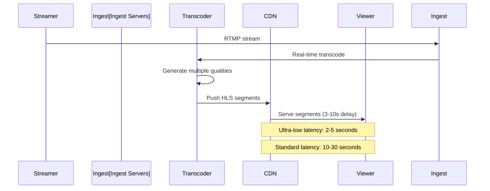

**Live Streaming Components:**
- **Ingest Layer**: RTMP/WebRTC servers for stream reception
- **Transcoding**: Real-time encoding with 2-5 second latency
- **Packaging**: HLS/DASH segment generation
- **DVR**: Temporary storage for rewind/pause
- **Chat System**: Real-time messaging (see `telegram.md` patterns)

**Latency Modes:**
- Ultra-low latency: 2-5s (WebRTC-based)
- Low latency: 5-10s (LL-HLS)
- Standard: 10-30s (traditional HLS)

---

### Content Delivery Network (CDN) Deep Dive

**CDN Selection Algorithm:**

```javascript
// cdn-selector.js
class CDNSelector {
  selectCDN(userLocation, videoPopularity, contentType) {
    const factors = {
      latency: this.measureLatency(userLocation),
      cost: this.getCDNCosts(),
      capacity: this.getAvailableCapacity(),
      healthScore: this.getCDNHealth()
    };

    // Weighted scoring
    const scores = this.cdnProviders.map(cdn => ({
      cdn,
      score: (
        factors.latency[cdn] * 0.4 +
        (1 / factors.cost[cdn]) * 0.2 +
        factors.capacity[cdn] * 0.2 +
        factors.healthScore[cdn] * 0.2
      )
    }));

    // Return best CDN
    return scores.sort((a, b) => b.score - a.score)[0].cdn;
  }

  async measureLatency(location) {
    // Real-time latency measurement to each CDN
    const measurements = await Promise.all(
      this.cdnProviders.map(cdn => 
        this.pingCDN(cdn, location)
      )
    );
    return Object.fromEntries(measurements);
  }
}
```

**CDN Cache Strategy:**

```javascript
// cdn-cache-strategy.js
const cacheStrategy = {
  // Popular videos: Cache longer, multiple copies
  hot: {
    ttl: 86400, // 24 hours
    replicationFactor: 3,
    prefetch: true
  },
  
  // Moderate traffic: Standard caching
  warm: {
    ttl: 3600, // 1 hour
    replicationFactor: 2,
    prefetch: false
  },
  
  // Low traffic: Minimal caching
  cold: {
    ttl: 300, // 5 minutes
    replicationFactor: 1,
    prefetch: false
  }
};

function getCachePolicy(video) {
  const viewsLastHour = video.analytics.recentViews;
  
  if (viewsLastHour > 10000) return cacheStrategy.hot;
  if (viewsLastHour > 1000) return cacheStrategy.warm;
  return cacheStrategy.cold;
}
```

---

### Analytics Pipeline

**Real-Time Analytics Architecture:**

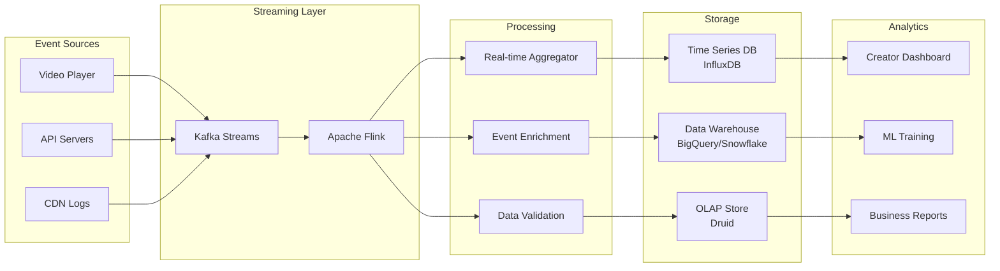

**Event Types:**
```javascript
// analytics-events.js
const eventTypes = {
  VIDEO_IMPRESSION: {
    videoId: 'string',
    userId: 'string',
    position: 'number', // Position in feed
    context: 'home|search|recommended'
  },
  
  VIDEO_START: {
    videoId: 'string',
    userId: 'string',
    quality: 'string',
    device: 'string',
    timestamp: 'datetime'
  },
  
  PLAYBACK_PROGRESS: {
    videoId: 'string',
    userId: 'string',
    currentTime: 'number',
    bufferHealth: 'number', // Seconds buffered
    bandwidth: 'number' // Mbps
  },
  
  VIDEO_COMPLETE: {
    videoId: 'string',
    userId: 'string',
    watchTime: 'number', // Seconds watched
    completionRate: 'number', // Percentage
    qualitySwitches: 'number'
  },
  
  ENGAGEMENT: {
    videoId: 'string',
    userId: 'string',
    action: 'like|dislike|comment|share|subscribe',
    timestamp: 'datetime'
  }
};
```

**Real-Time Metrics Calculation:**

```javascript
// metrics-calculator.js
class MetricsCalculator {
  constructor(timeSeriesDB) {
    this.db = timeSeriesDB;
  }

  async calculateViewCount(videoId, window = '1h') {
    // Use HyperLogLog for distinct user count
    const uniqueViewers = await this.db.query(`
      SELECT APPROX_COUNT_DISTINCT(user_id) as viewers
      FROM video_events
      WHERE video_id = ? 
        AND event_type = 'VIDEO_START'
        AND timestamp > NOW() - INTERVAL ?
    `, [videoId, window]);

    return uniqueViewers;
  }

  async calculateWatchTime(videoId) {
    // Aggregate total watch time
    const watchTime = await this.db.query(`
      SELECT SUM(watch_duration) as total_seconds
      FROM video_completion_events
      WHERE video_id = ?
        AND timestamp > NOW() - INTERVAL '24h'
    `, [videoId]);

    return watchTime;
  }

  async calculateEngagementRate(videoId) {
    const [views, engagements] = await Promise.all([
      this.getViews(videoId),
      this.getEngagements(videoId)
    ]);

    return (engagements / views) * 100;
  }
}
```

---

### Comment System Architecture

**Threaded Comments with Pagination:**

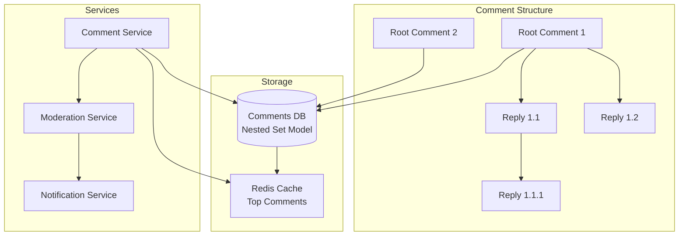

**Comment Database Schema:**

```javascript
// comments-schema.js
const commentSchema = {
  id: 'uuid',
  video_id: 'string',
  user_id: 'string',
  parent_id: 'uuid|null', // null for root comments
  text: 'string',
  likes: 'number',
  dislikes: 'number',
  reply_count: 'number',
  created_at: 'timestamp',
  updated_at: 'timestamp',
  is_pinned: 'boolean',
  is_deleted: 'boolean',
  
  // Nested set model for efficient tree queries
  lft: 'number',
  rgt: 'number',
  depth: 'number'
};

// Fetching comments with replies
const getCommentsQuery = `
  SELECT c1.*, COUNT(c2.id) as direct_replies
  FROM comments c1
  LEFT JOIN comments c2 ON c2.parent_id = c1.id
  WHERE c1.video_id = ?
    AND c1.parent_id IS NULL
    AND c1.is_deleted = false
  GROUP BY c1.id
  ORDER BY c1.likes DESC, c1.created_at DESC
  LIMIT ? OFFSET ?
`;
```

---

### Monetization System

**Ad Serving Architecture:**

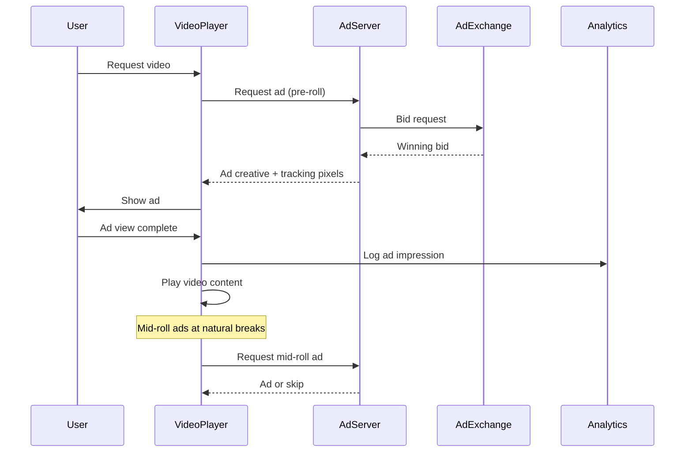

**Ad Placement Strategy:**

```javascript
// ad-placement.js
class AdPlacementEngine {
  determineAdBreaks(video) {
    const { duration, contentType, creatorSettings } = video;
    
    // No ads for videos < 8 minutes
    if (duration < 480) {
      return { preRoll: true, midRoll: [], postRoll: false };
    }

    // Ad break calculation
    const breaks = [];
    const interval = 480; // 8 minutes between ads
    
    for (let time = interval; time < duration - 60; time += interval) {
      // Find natural break points (scene changes)
      const naturalBreak = this.findNearestSceneChange(video, time);
      breaks.push(naturalBreak);
    }

    return {
      preRoll: true,
      midRoll: breaks,
      postRoll: duration > 600 // Only for 10+ min videos
    };
  }

  async selectAd(userProfile, videoContext) {
    // Factors for ad selection
    const factors = {
      userInterests: userProfile.interests,
      videoCategory: videoContext.category,
      demographics: userProfile.demographics,
      previousEngagement: userProfile.adInteractions
    };

    // Call ad exchange
    const adOptions = await this.adExchange.getBids(factors);
    
    // Select highest paying ad that matches targeting
    return adOptions.sort((a, b) => b.cpm - a.cpm)[0];
  }
}
```

**Revenue Split Model:**

```javascript
// revenue-calculator.js
const revenueModel = {
  adRevenue: {
    creatorShare: 0.55, // 55% to creator
    platformShare: 0.45  // 45% to platform
  },
  
  premiumSubscription: {
    creatorShare: 0.70, // 70% based on watch time
    platformShare: 0.30
  },
  
  superChat: {
    creatorShare: 0.70,
    platformShare: 0.30
  }
};

function calculateCreatorEarnings(video, period = '30d') {
  const metrics = video.getMetrics(period);
  
  const adRevenue = metrics.adImpressions * metrics.avgCPM / 1000;
  const premiumRevenue = metrics.premiumWatchTime * 0.005; // $0.005/min
  const superChatRevenue = metrics.superChats.total;
  
  const creatorTotal = (
    adRevenue * revenueModel.adRevenue.creatorShare +
    premiumRevenue * revenueModel.premiumSubscription.creatorShare +
    superChatRevenue * revenueModel.superChat.creatorShare
  );
  
  return {
    total: creatorTotal,
    breakdown: {
      ads: adRevenue * revenueModel.adRevenue.creatorShare,
      premium: premiumRevenue * revenueModel.premiumSubscription.creatorShare,
      superChat: superChatRevenue * revenueModel.superChat.creatorShare
    }
  };
}
```

---

### Content Moderation System

**Multi-Layer Moderation:**

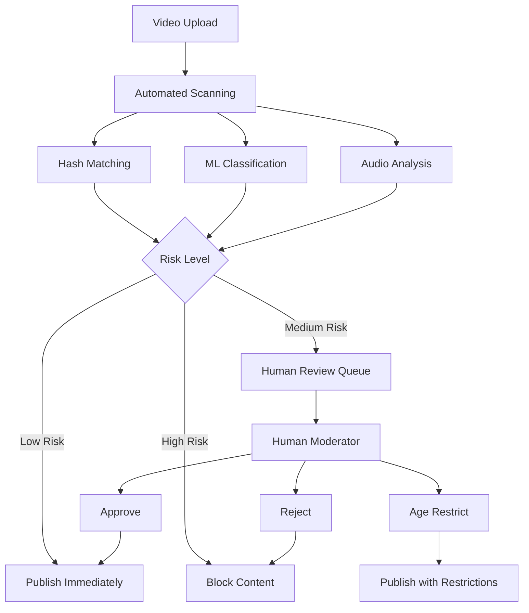

**Moderation Engine:**

```javascript
// moderation-engine.js
class ModerationEngine {
  async analyzeContent(videoId) {
    const video = await this.getVideo(videoId);
    
    // Parallel analysis
    const [hashResult, mlResult, audioResult, metaResult] = 
      await Promise.all([
        this.checkHashDatabase(video),
        this.mlClassification(video),
        this.analyzeAudio(video),
        this.analyzeMetadata(video)
      ]);

    // Calculate risk score
    const riskScore = this.calculateRisk({
      hashResult,
      mlResult,
      audioResult,
      metaResult
    });

    // Determine action
    if (riskScore > 0.9) {
      return { action: 'BLOCK', reason: 'High risk content' };
    } else if (riskScore > 0.6) {
      return { action: 'REVIEW', priority: 'high' };
    } else if (riskScore > 0.3) {
      return { action: 'AGE_RESTRICT' };
    }
    
    return { action: 'PUBLISH' };
  }

  async mlClassification(video) {
    // Frame sampling
    const frames = await this.extractKeyFrames(video, 10);
    
    // Classify each frame
    const predictions = await Promise.all(
      frames.map(frame => this.visionModel.predict(frame))
    );

    // Categories: violence, nudity, hate_speech, etc.
    return predictions.reduce((acc, pred) => {
      Object.keys(pred).forEach(category => {
        acc[category] = Math.max(acc[category] || 0, pred[category]);
      });
      return acc;
    }, {});
  }

  calculateRisk(results) {
    const weights = {
      hashMatch: 1.0,  // Known bad content
      mlViolence: 0.8,
      mlNudity: 0.9,
      mlHateSpeech: 0.95,
      audioToxicity: 0.7,
      metadataFlags: 0.5
    };

    let totalScore = 0;
    let totalWeight = 0;

    // Weighted average
    Object.entries(weights).forEach(([key, weight]) => {
      if (results[key] !== undefined) {
        totalScore += results[key] * weight;
        totalWeight += weight;
      }
    });

    return totalScore / totalWeight;
  }
}
```

---

### Copyright Protection (Content ID)

**Content ID System:**

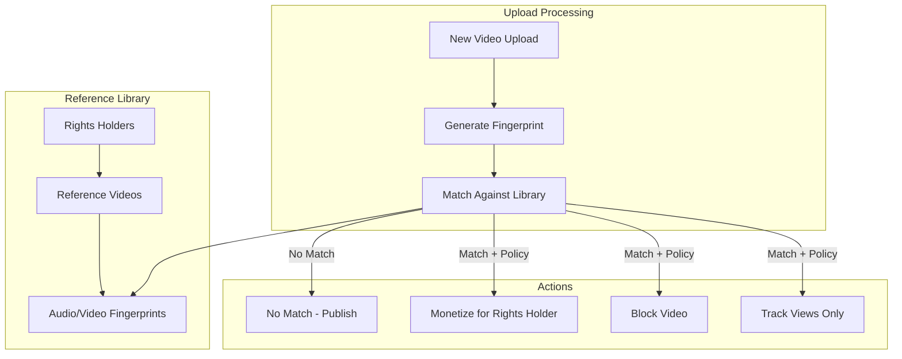

**Fingerprinting Algorithm (Simplified):**

```javascript
// content-id.js
class ContentIDSystem {
  async generateFingerprint(video) {
    // Extract audio and video features
    const [audioFeatures, videoFeatures] = await Promise.all([
      this.extractAudioFingerprint(video),
      this.extractVideoFingerprint(video)
    ]);

    return {
      videoId: video.id,
      audioFingerprint: audioFeatures,
      videoFingerprint: videoFeatures,
      duration: video.duration
    };
  }

  extractAudioFingerprint(video) {
    // Simplified: In reality, uses spectral analysis
    // Generate hash for each 10-second segment
    const segments = Math.ceil(video.duration / 10);
    const fingerprints = [];

    for (let i = 0; i < segments; i++) {
      const startTime = i * 10;
      const segment = this.extractAudioSegment(video, startTime, 10);
      
      // Create perceptual hash
      const hash = this.perceptualAudioHash(segment);
      fingerprints.push({ time: startTime, hash });
    }

    return fingerprints;
  }

  async findMatches(uploadFingerprint) {
    // Search fingerprint database
    const matches = await this.db.query(`
      SELECT reference_id, similarity_score
      FROM fingerprint_matches
      WHERE audio_hash IN (?)
        OR video_hash IN (?)
      HAVING similarity_score > 0.85
    `, [uploadFingerprint.audioFingerprint, uploadFingerprint.videoFingerprint]);

    return matches;
  }

  async applyPolicy(videoId, matchedReference) {
    const policy = await this.getPolicy(matchedReference.rightsholderId);

    switch (policy.action) {
      case 'MONETIZE':
        await this.enableMonetization(videoId, matchedReference.rightsholderId);
        break;
      case 'BLOCK':
        await this.blockVideo(videoId, policy.territories);
        break;
      case 'TRACK':
        await this.trackViews(videoId, matchedReference.rightsholderId);
        break;
    }
  }
}
```

---

### Mobile App Optimization

**Offline Download System:**

```javascript
// offline-manager.js
class OfflineVideoManager {
  async downloadVideo(videoId, quality = '480p') {
    // Check storage availability
    const requiredSpace = await this.estimateSize(videoId, quality);
    const available = await this.checkStorageSpace();
    
    if (available < requiredSpace) {
      throw new Error('Insufficient storage');
    }

    // Download video segments
    const manifest = await this.getManifest(videoId, quality);
    const segments = manifest.segments;

    // Progressive download with pause/resume
    for (let i = 0; i < segments.length; i++) {
      const segment = segments[i];
      
      await this.downloadSegment(segment, {
        onProgress: (progress) => {
          this.updateProgress(videoId, (i + progress) / segments.length);
        },
        retryAttempts: 3
      });

      // Store encrypted locally
      await this.storeSegment(videoId, segment, { encrypted: true });
    }

    // Save metadata
    await this.saveOfflineMetadata(videoId, quality);
    
    return { success: true, size: requiredSpace };
  }

  async playOfflineVideo(videoId) {
    // Verify license (if DRM protected)
    const isValid = await this.verifyOfflineLicense(videoId);
    if (!isValid) {
      throw new Error('Offline license expired');
    }

    // Load segments from local storage
    const segments = await this.loadOfflineSegments(videoId);
    
    return {
      manifestUrl: this.createLocalManifest(segments),
      licenseToken: await this.getOfflineLicenseToken(videoId)
    };
  }
}
```

---

### Performance Optimization Techniques

**Video Player Optimization:**

```javascript
// player-optimizer.js
class VideoPlayerOptimizer {
  constructor() {
    this.bufferTarget = 30; // seconds
    this.bufferMin = 10;    // seconds
  }

  async adaptiveBitrate(playerState) {
    const { currentBandwidth, bufferHealth, currentQuality } = playerState;
    
    // Calculate safe bitrate
    const safeBitrate = currentBandwidth * 0.8; // 80% of measured bandwidth
    
    // Select quality
    let targetQuality = this.selectQuality(safeBitrate);
    
    // Buffer-based adjustment
    if (bufferHealth < this.bufferMin) {
      // Aggressive downgrade to recover buffer
      targetQuality = this.downgradeQuality(targetQuality, 2);
    } else if (bufferHealth > this.bufferTarget && targetQuality < 'max') {
      // Safe to upgrade
      targetQuality = this.upgradeQuality(targetQuality);
    }

    return targetQuality;
  }

  selectQuality(bandwidth) {
    // Bandwidth in Mbps
    const qualityMap = [
      { quality: '144p', minBandwidth: 0.3 },
      { quality: '240p', minBandwidth: 0.5 },
      { quality: '360p', minBandwidth: 1.0 },
      { quality: '480p', minBandwidth: 2.0 },
      { quality: '720p', minBandwidth: 4.0 },
      { quality: '1080p', minBandwidth: 8.0 },
      { quality: '1440p', minBandwidth: 16.0 },
      { quality: '4K', minBandwidth: 25.0 }
    ];

    // Find highest quality within bandwidth
    for (let i = qualityMap.length - 1; i >= 0; i--) {
      if (bandwidth >= qualityMap[i].minBandwidth) {
        return qualityMap[i].quality;
      }
    }

    return '144p'; // Fallback
  }

  // Prefetch next segments
  async prefetchSegments(currentSegment, manifest) {
    const prefetchCount = 3; // Prefetch next 3 segments
    
    for (let i = 1; i <= prefetchCount; i++) {
      const nextSegment = manifest.segments[currentSegment + i];
      if (nextSegment) {
        this.fetchSegment(nextSegment, { priority: 'low' });
      }
    }
  }
}
```

---

### Testing Strategy

**Load Testing Scenarios:**

```javascript
// load-test.js
const loadTestScenarios = {
  videoUpload: {
    concurrentUsers: 10000,
    duration: '1h',
    rampUp: '10m',
    scenarios: [
      { weight: 0.7, action: 'upload_small' },  // < 100MB
      { weight: 0.25, action: 'upload_medium' }, // 100MB-1GB
      { weight: 0.05, action: 'upload_large' }   // > 1GB
    ]
  },
  
  videoPlayback: {
    concurrentUsers: 1000000,
    duration: '2h',
    scenarios: [
      { weight: 0.4, action: 'watch_trending' },
      { weight: 0.3, action: 'watch_recommended' },
      { weight: 0.2, action: 'search_and_watch' },
      { weight: 0.1, action: 'browse_channel' }
    ]
  },
  
  peakTraffic: {
    // Simulate viral video event
    pattern: 'spike',
    baseline: 500000,
    peak: 5000000,
    duration: '30m'
  }
};
```

---

## Cross-References Summary

This YouTube architecture relates to other system designs:

| System | Common Pattern | Reference |
|--------|---------------|-----------|
| **Netflix** | Video streaming, CDN, transcoding | `netflix.md` |
| **Twitter** | Real-time feeds, engagement metrics | `twitter.md` |
| **Amazon** | Search, recommendations, analytics | `amazon.md` |
| **WhatsApp** | Real-time messaging (live chat) | `whatsapp.md` |
| **Uber** | Real-time analytics, geographic routing | `uber.md` |
| **Telegram** | Live chat, notification system | `telegram.md` |
| **Airbnb** | Search & discovery, user reviews | `airbnb.md` |

---

**Last Updated**: September 30, 2025  
**Architecture Version**: 4.5  
**Document Maintained By**: System Design Team