# Database System Design

> A comprehensive guide to database architecture, design patterns, and scaling strategies for modern applications.

## 🎯 Overview

This repository contains in-depth documentation covering fundamental and advanced concepts in database system design. Whether you're architecting a new system or scaling an existing one, these resources provide practical insights and real-world examples to guide your decisions.

## 📚 Documentation Structure

### Core Concepts
- **[Relational Databases](./docs/relational.md)** - ACID properties, normalization, and SQL optimization
- **[NoSQL Databases](./docs/nosql.md)** - Document, key-value, column-family, and graph databases
- **[Data Consistency](./docs/consistency.md)** - Consistency models, CAP theorem, and distributed systems
- **[Scaling Strategies](./docs/scaling_strategies.md)** - Horizontal vs vertical scaling, sharding, and replication

### Practical Applications
- **[Case Studies](./docs/case-studies.md)** - Real-world examples from e-commerce, social media, and financial platforms

## 🚀 Quick Start

### Understanding Database Types

```mermaid
flowchart TD
    Start[Choose Database Type] --> DataType{Data Structure?}
    
    DataType -->|Structured, ACID Required| RDBMS[Relational Database<br/>PostgreSQL, MySQL]
    DataType -->|Semi-structured, Flexible| Document[Document Database<br/>MongoDB, CouchDB]
    DataType -->|Simple Key-Value| KV[Key-Value Store<br/>Redis, DynamoDB]
    DataType -->|Time-series, Analytics| Column[Column-Family<br/>Cassandra, HBase]
    DataType -->|Relationships, Networks| Graph[Graph Database<br/>Neo4j, Neptune]
    
    RDBMS --> RDBMSUse[• Financial transactions<br/>• User management<br/>• Inventory systems]
    Document --> DocUse[• Content management<br/>• Product catalogs<br/>• User profiles]
    KV --> KVUse[• Caching<br/>• Session storage<br/>• Real-time data]
    Column --> ColUse[• IoT data<br/>• Logging<br/>• Analytics]
    Graph --> GraphUse[• Social networks<br/>• Recommendations<br/>• Fraud detection]
    
    style RDBMS fill:#FFB6C1
    style Document fill:#90EE90
    style KV fill:#F0E68C
    style Column fill:#87CEEB
    style Graph fill:#DDA0DD
```

### Decision Framework

1. **Start with Requirements** - Understand your data patterns, consistency needs, and scale requirements
2. **Choose Database Type** - Use the flowchart above to select appropriate database types
3. **Design for Scale** - Consider future growth and scaling strategies early
4. **Plan for Consistency** - Understand consistency trade-offs in distributed systems
5. **Learn from Examples** - Study case studies relevant to your use case

## 🛠️ Technology Stack Examples

### Traditional Stack (Strong Consistency)

### Modern Microservices Stack

## 📖 Learning Path

### Beginner Track
1. **[Relational Databases](./docs/relational.md#overview)** - Start with ACID properties and normalization
2. **[Basic Scaling](./docs/scaling_strategies.md#vertical-scaling-scale-up)** - Understand vertical scaling concepts
3. **[Simple Case Studies](./docs/case-studies.md)** - Study straightforward examples

### Intermediate Track
1. **[NoSQL Introduction](./docs/nosql.md#introduction)** - Learn different NoSQL types
2. **[Consistency Models](./docs/consistency.md#consistency-models-overview)** - Understand trade-offs
3. **[Horizontal Scaling](./docs/scaling_strategies.md#horizontal-scaling-scale-out)** - Master sharding and replication

### Advanced Track
1. **[Distributed Systems](./docs/consistency.md#cap-theorem)** - Deep dive into CAP theorem
2. **[Complex Architectures](./docs/case-studies.md)** - Study enterprise-scale solutions
3. **[Performance Optimization](./docs/scaling_strategies.md#specific-scaling-techniques)** - Master advanced techniques

## 🎯 Use Case Matrix

| Use Case | Primary Database | Caching | Analytics | Consistency Level |
|----------|-----------------|---------|-----------|------------------|
| **E-commerce** | PostgreSQL + MongoDB | Redis | Cassandra | Mixed (Strong for payments, Eventual for recommendations) |
| **Social Media** | MongoDB + Cassandra | Redis | Data Warehouse | Eventual (Fast user experience priority) |
| **Financial Services** | PostgreSQL | Redis | PostgreSQL Replica | Strong (Regulatory compliance required) |
| **IoT Platform** | Cassandra | Redis | Time-series DB | Eventual (High throughput priority) |
| **Gaming** | Redis + PostgreSQL | Redis | ClickHouse | Weak to Eventual (Performance critical) |

## 🔧 Tools and Resources

### Database Management
- **Design Tools**: MySQL Workbench, pgAdmin, MongoDB Compass
- **Migration**: Flyway, Liquibase, AWS DMS
- **Monitoring**: Prometheus + Grafana, New Relic, DataDog

### Performance Testing
- **Benchmarking**: sysbench, YCSB, pgbench
- **Load Testing**: Apache JMeter, K6, Artillery
- **Profiling**: Database-specific profilers and EXPLAIN plans

### Development
- **ORMs**: Hibernate (Java), SQLAlchemy (Python), Prisma (Node.js)
- **Connection Pooling**: HikariCP, pgBouncer, MongoDB Connection Pooling
- **Schema Management**: Database migration tools and version control

## 📊 Performance Benchmarks

### Throughput Comparison (Approximate)

*Note: Benchmarks vary significantly based on hardware, configuration, and workload patterns.*

## 🤝 Contributing

This documentation is continuously evolving. Contributions are welcome:

1. **Documentation**: Improve existing content or add new sections
2. **Examples**: Share real-world implementation experiences
3. **Case Studies**: Add new industry examples
4. **Tools**: Recommend useful tools and resources

## 📝 License

This documentation is available under the MIT License. See individual files for specific licensing information.

## 🔗 Quick Navigation

- [📘 Relational Databases](./docs/relational.md) - Traditional SQL databases and ACID properties
- [🗄️ NoSQL Databases](./docs/nosql.md) - Modern database alternatives and use cases
- [⚖️ Data Consistency](./docs/consistency.md) - Consistency models and distributed systems
- [📈 Scaling Strategies](./docs/scaling_strategies.md) - Horizontal and vertical scaling approaches
- [🏢 Case Studies](./docs/case-studies.md) - Real-world implementation examples

---

*This repository serves as a comprehensive reference for database system design. Each document cross-references related topics for a complete learning experience.*