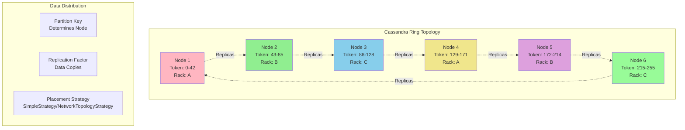
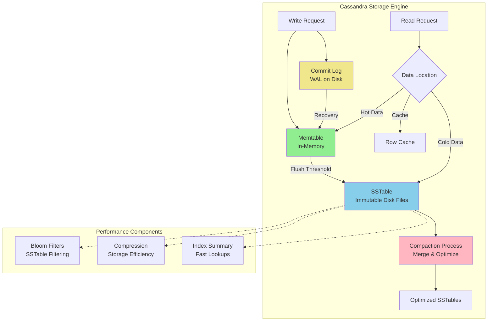
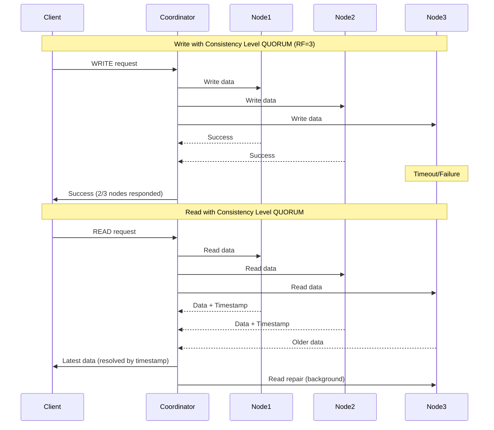
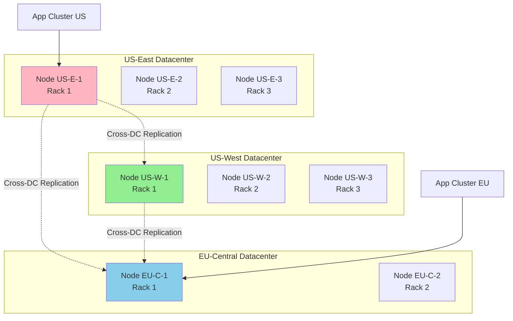

# Apache Cassandra Case Study

> **Part of**: [Database Case Studies](../README.md) | **Related**: [Scaling Strategies](../../scaling_strategies.md), [NoSQL Databases](../../nosql.md)

## Table of Contents
- [Overview](#overview)
- [Architecture Deep Dive](#architecture-deep-dive)
- [Data Modeling](#data-modeling)
- [Scaling Strategies](#scaling-strategies)
- [Performance Optimization](#performance-optimization)
- [Operational Considerations](#operational-considerations)
- [Real-World Examples](#real-world-examples)
- [When to Choose Cassandra](#when-to-choose-cassandra)

## Overview

Apache Cassandra is a highly scalable, distributed NoSQL database designed to handle large amounts of data across many commodity servers while providing high availability with no single point of failure.

### Key Characteristics
- **Distributed Architecture**: Ring-based peer-to-peer system
- **Linear Scalability**: Add nodes to increase capacity and throughput
- **High Availability**: Multi-datacenter replication with configurable consistency
- **Write-Optimized**: Optimized for high-volume write workloads
- **Wide-Column Model**: Flexible schema with dynamic columns

### Core Strengths
- Massive horizontal scalability
- Multi-datacenter replication
- High write throughput
- Fault tolerance and resilience
- Time-series data handling

### Limitations
- Limited query flexibility
- No ACID transactions
- Complex data modeling
- Eventual consistency challenges
- Operational complexity

## Architecture Deep Dive

### Ring Architecture



### Storage Engine Architecture



### Consistency and Replication



## Data Modeling

### Wide-Column Model

Cassandra uses a wide-column model where data is stored in tables with a flexible schema:

```cql
-- Time-series data example
CREATE TABLE sensor_data (
    device_id UUID,
    timestamp TIMESTAMP,
    temperature DECIMAL,
    humidity DECIMAL,
    pressure DECIMAL,
    battery_level INT,
    PRIMARY KEY (device_id, timestamp)
) WITH CLUSTERING ORDER BY (timestamp DESC);
```

### Partition Key Design

The partition key determines data distribution across the cluster:

```mermaid
graph TB
    subgraph "Partition Key Strategies"
        Simple[Simple Partition Key<br/>PRIMARY KEY (user_id)]
        Composite[Composite Partition Key<br/>PRIMARY KEY ((user_id, year), month)]
        Bucketing[Bucketing Strategy<br/>PRIMARY KEY ((user_id, bucket), timestamp)]
    end
    
    Simple --> SimpleDesc[✅ Simple queries<br/>❌ Hot partitions<br/>❌ Large partitions]
    Composite --> CompositeDesc[✅ Better distribution<br/>✅ Time-based queries<br/>❌ More complex]
    Bucketing --> BucketDesc[✅ Even distribution<br/>✅ Controlled partition size<br/>❌ Application logic needed]
    
    style Simple fill:#FFB6C1
    style Composite fill:#90EE90
    style Bucketing fill:#87CEEB
```

### Data Modeling Examples

#### User Activity Tracking
```cql
-- Track user activities with efficient queries
CREATE TABLE user_activities (
    user_id UUID,
    activity_date DATE,
    timestamp TIMESTAMP,
    activity_type TEXT,
    details MAP<TEXT, TEXT>,
    PRIMARY KEY ((user_id, activity_date), timestamp)
) WITH CLUSTERING ORDER BY (timestamp DESC);

-- Efficient queries:
-- Recent activities for a user
SELECT * FROM user_activities 
WHERE user_id = ? AND activity_date = ?
LIMIT 50;

-- Activities by type for a day
SELECT * FROM user_activities 
WHERE user_id = ? AND activity_date = ? AND activity_type = ?;
```

#### Time-Series with Bucketing
```cql
-- Metric data with time-based bucketing
CREATE TABLE metrics_by_hour (
    metric_name TEXT,
    bucket TIMESTAMP, -- Hour-based bucket
    timestamp TIMESTAMP,
    value DOUBLE,
    tags MAP<TEXT, TEXT>,
    PRIMARY KEY ((metric_name, bucket), timestamp)
) WITH CLUSTERING ORDER BY (timestamp ASC);

-- Application logic for bucket calculation
-- bucket = timestamp.truncate_to_hour()
```

#### Message Queue Pattern
```cql
-- Distributed message queue
CREATE TABLE message_queue (
    queue_name TEXT,
    priority INT,
    message_id TIMEUUID,
    payload BLOB,
    status TEXT,
    created_at TIMESTAMP,
    PRIMARY KEY ((queue_name, priority), message_id)
) WITH CLUSTERING ORDER BY (message_id ASC);

-- Consumer pattern
SELECT * FROM message_queue 
WHERE queue_name = ? AND priority = ?
LIMIT 10;
```

## Scaling Strategies

### Horizontal Scaling

#### Adding Nodes

```bash
# Add a new node to existing cluster
# cassandra.yaml configuration
cluster_name: 'production_cluster'
seed_provider:
    - class_name: org.apache.cassandra.locator.SimpleSeedProvider
      parameters:
          - seeds: "10.0.0.1,10.0.0.2,10.0.0.3"

# Network topology
endpoint_snitch: GossipingPropertyFileSnitch

# Data directories
data_file_directories:
    - /var/lib/cassandra/data
    - /mnt/ssd1/cassandra/data
    - /mnt/ssd2/cassandra/data

commitlog_directory: /var/lib/cassandra/commitlog
saved_caches_directory: /var/lib/cassandra/saved_caches

# Start the new node
sudo systemctl start cassandra

# Monitor bootstrap progress
nodetool netstats
nodetool status
```

#### Token Assignment and Rebalancing

```bash
# Check current token distribution
nodetool ring

# Manual token assignment (advanced)
nodetool move <new_token>

# Streaming and repair operations
nodetool rebuild <source_datacenter>
nodetool repair -pr  # Primary range repair

# Cleanup unused data after rebalancing
nodetool cleanup
```

### Multi-Datacenter Replication

```cql
-- Create keyspace with multi-DC replication
CREATE KEYSPACE myapp 
WITH REPLICATION = {
    'class': 'NetworkTopologyStrategy',
    'us_east': 3,
    'us_west': 3,
    'eu_central': 2
};

-- Configure consistency for multi-DC
-- Strong consistency within DC
CONSISTENCY LOCAL_QUORUM;

-- Eventual consistency across DCs
CONSISTENCY LOCAL_ONE;
```

#### Multi-DC Architecture



## Performance Optimization

### Read Performance Tuning

```yaml
# cassandra.yaml optimizations for read workloads
# Caching
row_cache_size_in_mb: 1024
row_cache_save_period: 14400

# Concurrent operations
concurrent_reads: 32
concurrent_counter_writes: 32

# Memtable settings
memtable_heap_space_in_mb: 2048
memtable_offheap_space_in_mb: 2048

# Compaction
compaction_throughput_mb_per_sec: 64
concurrent_compactors: 4
```

### Write Performance Tuning

```yaml
# Write-optimized settings
# Commit log
commitlog_sync: periodic
commitlog_sync_period_in_ms: 10000
commitlog_segment_size_in_mb: 32

# Memtable
memtable_flush_writers: 2
memtable_cleanup_threshold: 0.11

# Write performance
concurrent_writes: 128
write_request_timeout_in_ms: 2000
```

### Compaction Strategies

```cql
-- Size-tiered compaction (default)
ALTER TABLE user_data 
WITH compaction = {
    'class': 'SizeTieredCompactionStrategy',
    'max_threshold': 32,
    'min_threshold': 4
};

-- Leveled compaction (read-heavy workloads)
ALTER TABLE user_profiles 
WITH compaction = {
    'class': 'LeveledCompactionStrategy',
    'sstable_size_in_mb': 160
};

-- Time-window compaction (time-series data)
ALTER TABLE sensor_data 
WITH compaction = {
    'class': 'TimeWindowCompactionStrategy',
    'compaction_window_unit': 'DAYS',
    'compaction_window_size': 1
};
```

### Query Optimization

```cql
-- Efficient queries use partition key
-- GOOD: Query by partition key
SELECT * FROM user_activities 
WHERE user_id = ? AND activity_date = ?;

-- BAD: Query without partition key (requires ALLOW FILTERING)
SELECT * FROM user_activities 
WHERE activity_type = 'login' ALLOW FILTERING;

-- BETTER: Create a materialized view
CREATE MATERIALIZED VIEW activities_by_type AS
SELECT * FROM user_activities
WHERE activity_type IS NOT NULL 
  AND user_id IS NOT NULL 
  AND activity_date IS NOT NULL
  AND timestamp IS NOT NULL
PRIMARY KEY (activity_type, user_id, activity_date, timestamp);
```

### Monitoring and Metrics

```python
import subprocess
import json
from datetime import datetime

class CassandraMonitor:
    def __init__(self, host='localhost', port=7199):
        self.host = host
        self.port = port
    
    def get_cluster_status(self):
        """Get cluster status using nodetool"""
        result = subprocess.run([
            'nodetool', '-h', self.host, '-p', str(self.port), 'status'
        ], capture_output=True, text=True)
        
        return result.stdout
    
    def get_performance_metrics(self):
        """Collect key performance metrics"""
        metrics = {}
        
        # Throughput metrics
        tpstats = subprocess.run([
            'nodetool', '-h', self.host, 'tpstats'
        ], capture_output=True, text=True)
        
        # Compaction stats
        compactionstats = subprocess.run([
            'nodetool', '-h', self.host, 'compactionstats'
        ], capture_output=True, text=True)
        
        # GC stats
        gcstats = subprocess.run([
            'nodetool', '-h', self.host, 'gcstats'
        ], capture_output=True, text=True)
        
        return {
            'timestamp': datetime.now().isoformat(),
            'threadpool_stats': tpstats.stdout,
            'compaction_stats': compactionstats.stdout,
            'gc_stats': gcstats.stdout
        }
    
    def check_node_health(self):
        """Check individual node health"""
        health = {}
        
        # Check if gossip is running
        gossip = subprocess.run([
            'nodetool', '-h', self.host, 'gossipinfo'
        ], capture_output=True, text=True)
        
        # Check native transport
        native = subprocess.run([
            'nodetool', '-h', self.host, 'statusbinary'
        ], capture_output=True, text=True)
        
        return {
            'gossip_active': 'NORMAL' in gossip.stdout,
            'native_transport_active': 'running' in native.stdout.lower(),
            'node_responsive': True
        }

# Usage
monitor = CassandraMonitor()
health = monitor.check_node_health()
metrics = monitor.get_performance_metrics()
```

## Operational Considerations

### Backup and Recovery

```bash
# Snapshot creation
nodetool snapshot myapp

# List snapshots
nodetool listsnapshots

# Clear snapshots
nodetool clearsnapshot

# Incremental backup
nodetool backup

# Point-in-time recovery using commit logs
# 1. Stop Cassandra
# 2. Clear data directories
# 3. Restore snapshot
# 4. Replay commit logs
# 5. Start Cassandra
```

### Cluster Maintenance

```bash
# Rolling restart procedure
# 1. Drain node (stop accepting writes)
nodetool drain

# 2. Stop Cassandra
sudo systemctl stop cassandra

# 3. Perform maintenance (upgrade, config change)

# 4. Start Cassandra
sudo systemctl start cassandra

# 5. Wait for node to rejoin cluster
nodetool status

# 6. Repeat for next node

# Repair operations (recommended weekly)
nodetool repair -pr

# Full cluster repair
nodetool repair -full
```

### Security Configuration

```yaml
# cassandra.yaml security settings
authenticator: PasswordAuthenticator
authorizer: CassandraAuthorizer

# Enable SSL/TLS
client_encryption_options:
    enabled: true
    optional: false
    keystore: /path/to/keystore
    keystore_password: password
    truststore: /path/to/truststore
    truststore_password: password

# Inter-node encryption
server_encryption_options:
    internode_encryption: all
    keystore: /path/to/keystore
    keystore_password: password
    truststore: /path/to/truststore
    truststore_password: password
```

## Real-World Examples

### Netflix: Streaming Infrastructure

Netflix uses Cassandra extensively for their streaming platform:

```cql
-- User viewing history
CREATE TABLE viewing_history (
    user_id UUID,
    viewing_date DATE,
    timestamp TIMESTAMP,
    content_id UUID,
    position_ms BIGINT,
    duration_ms BIGINT,
    device_type TEXT,
    PRIMARY KEY ((user_id, viewing_date), timestamp)
) WITH CLUSTERING ORDER BY (timestamp DESC);

-- Content metadata cache
CREATE TABLE content_metadata (
    content_id UUID,
    title TEXT,
    description TEXT,
    genre SET<TEXT>,
    release_date DATE,
    duration_ms BIGINT,
    thumbnail_url TEXT,
    PRIMARY KEY (content_id)
);

-- Recommendation scores
CREATE TABLE recommendation_scores (
    user_id UUID,
    recommendation_batch TIMESTAMP,
    content_id UUID,
    score DOUBLE,
    reason TEXT,
    PRIMARY KEY ((user_id, recommendation_batch), content_id)
) WITH CLUSTERING ORDER BY (score DESC);
```

### Uber: Real-time Location Tracking

Uber's location tracking system:

```cql
-- Driver location updates
CREATE TABLE driver_locations (
    driver_id UUID,
    time_bucket TIMESTAMP, -- 1-minute buckets
    timestamp TIMESTAMP,
    latitude DOUBLE,
    longitude DOUBLE,
    heading INT,
    speed DOUBLE,
    status TEXT,
    PRIMARY KEY ((driver_id, time_bucket), timestamp)
) WITH CLUSTERING ORDER BY (timestamp DESC)
AND default_time_to_live = 604800; -- 7 days TTL

-- Trip data
CREATE TABLE trips (
    trip_id UUID,
    driver_id UUID,
    rider_id UUID,
    start_location FROZEN<location_type>,
    end_location FROZEN<location_type>,
    start_time TIMESTAMP,
    end_time TIMESTAMP,
    distance_km DOUBLE,
    fare_amount DECIMAL,
    status TEXT,
    PRIMARY KEY (trip_id)
);

-- Geospatial indexing for nearby drivers
CREATE TABLE drivers_by_location (
    geohash TEXT, -- S2 cell or geohash
    driver_id UUID,
    last_update TIMESTAMP,
    latitude DOUBLE,
    longitude DOUBLE,
    availability TEXT,
    PRIMARY KEY (geohash, driver_id)
) WITH default_time_to_live = 300; -- 5 minutes TTL
```

### IoT Sensor Data Platform

Large-scale IoT data collection:

```cql
-- Sensor measurements
CREATE TABLE sensor_measurements (
    sensor_id UUID,
    measurement_day DATE,
    timestamp TIMESTAMP,
    temperature DECIMAL,
    humidity DECIMAL,
    pressure DECIMAL,
    battery_level INT,
    signal_strength INT,
    PRIMARY KEY ((sensor_id, measurement_day), timestamp)
) WITH CLUSTERING ORDER BY (timestamp ASC)
AND compaction = {
    'class': 'TimeWindowCompactionStrategy',
    'compaction_window_unit': 'DAYS',
    'compaction_window_size': 1
};

-- Aggregated hourly data
CREATE TABLE hourly_aggregates (
    sensor_id UUID,
    hour_bucket TIMESTAMP,
    avg_temperature DECIMAL,
    max_temperature DECIMAL,
    min_temperature DECIMAL,
    avg_humidity DECIMAL,
    measurement_count BIGINT,
    PRIMARY KEY ((sensor_id), hour_bucket)
) WITH CLUSTERING ORDER BY (hour_bucket DESC);

-- Alert thresholds and triggers
CREATE TABLE sensor_alerts (
    sensor_id UUID,
    alert_time TIMESTAMP,
    alert_type TEXT,
    threshold_value DECIMAL,
    actual_value DECIMAL,
    severity TEXT,
    acknowledged BOOLEAN,
    PRIMARY KEY ((sensor_id), alert_time)
) WITH CLUSTERING ORDER BY (alert_time DESC);
```

## When to Choose Cassandra

### Ideal Use Cases

1. **High-Volume Write Applications**
   - Time-series data (metrics, logs, events)
   - IoT sensor data collection
   - Real-time analytics ingestion
   - Message queuing systems

2. **Multi-Datacenter Applications**
   - Global applications requiring local data access
   - Disaster recovery requirements
   - Regulatory data residency compliance
   - CDN-like data distribution

3. **Linear Scalability Requirements**
   - Predictable growth patterns
   - Need to scale beyond single-server limits
   - Cost-effective horizontal scaling
   - No complex join requirements

### Avoid Cassandra When

1. **Complex Relational Queries**
   - Multi-table joins
   - Complex aggregations
   - Ad-hoc reporting requirements
   - Business intelligence workloads

2. **Strong Consistency Requirements**
   - Financial transactions
   - Inventory management
   - Critical state management
   - ACID transaction needs

3. **Small Dataset or Low Scale**
   - Dataset fits comfortably on single server
   - Simple CRUD applications
   - Prototyping and development
   - Limited operational expertise

### Decision Matrix

| Factor | Cassandra Score (1-5) | Notes |
|--------|----------------------|--------|
| Write Scalability | 5 | Excellent write performance |
| Read Scalability | 4 | Good with proper data modeling |
| Consistency | 2 | Eventually consistent by default |
| Query Flexibility | 2 | Limited query capabilities |
| Operational Complexity | 2 | Requires specialized knowledge |
| Multi-DC Support | 5 | Best-in-class multi-datacenter |
| Cost Efficiency | 4 | Linear scaling with commodity hardware |

## Conclusion

Apache Cassandra excels in scenarios requiring massive scale, high availability, and multi-datacenter deployment. Its write-optimized architecture and linear scalability make it ideal for time-series data, IoT applications, and high-volume event processing.

However, Cassandra requires careful data modeling and operational expertise. Applications needing complex queries, strong consistency, or traditional relational features should consider alternative solutions.

The key to success with Cassandra lies in understanding its strengths and constraints, designing data models that align with query patterns, and investing in proper operational practices for monitoring, maintenance, and scaling.

---

**Next Steps**: 
- Review [MongoDB Case Study](mongodb.md) for document-oriented alternatives
- Explore [Scaling Strategies](../../scaling_strategies.md) for additional scaling patterns
- Consider [Redis Case Study](redis.md) for high-performance caching solutions