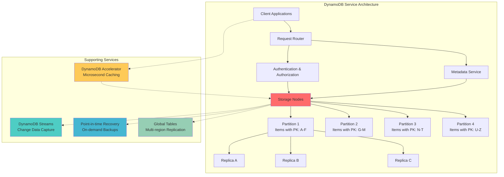
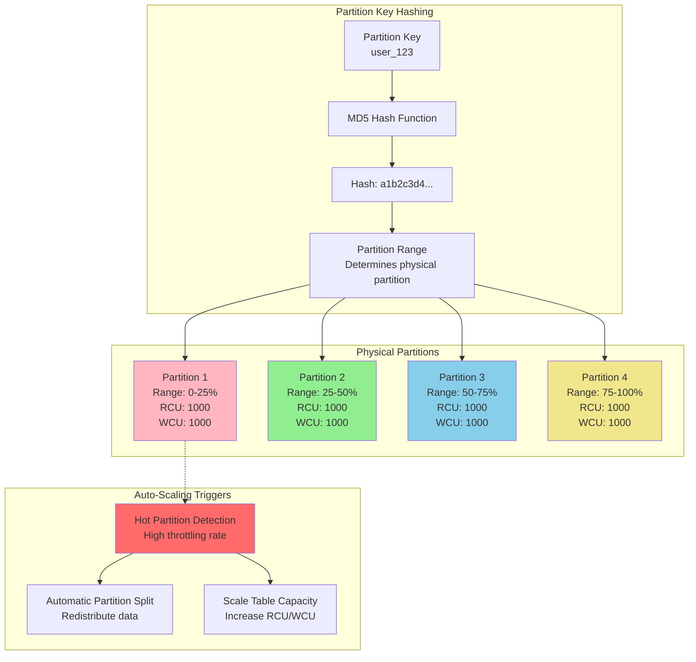
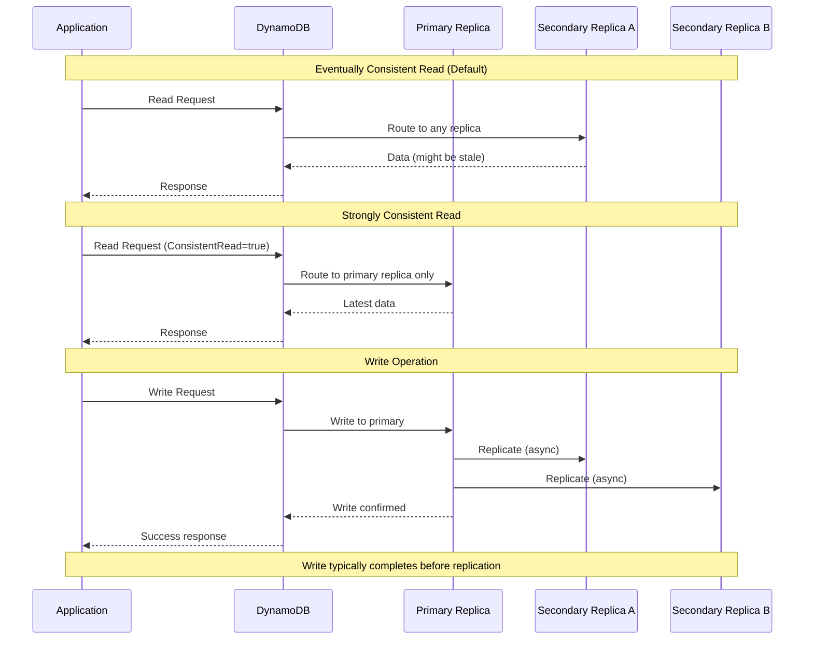

# Amazon DynamoDB Case Study

> **Part of**: [Database Case Studies](../README.md) | **Related**: [Scaling Strategies](../../scaling_strategies.md), [NoSQL Databases](../../nosql.md)

## Table of Contents
- [Overview](#overview)
- [Architecture Deep Dive](#architecture-deep-dive)
- [Data Modeling](#data-modeling)
- [Scaling Strategies](#scaling-strategies)
- [Performance Optimization](#performance-optimization)
- [Operational Considerations](#operational-considerations)
- [Real-World Examples](#real-world-examples)
- [When to Choose DynamoDB](#when-to-choose-dynamodb)

## Overview

Amazon DynamoDB is a fully managed NoSQL database service that provides fast and predictable performance with seamless scalability. It's designed to handle massive workloads with single-digit millisecond latency at any scale.

### Key Characteristics
- **Serverless**: No servers to manage or provision
- **Auto-scaling**: Automatic capacity adjustments based on traffic
- **Global Distribution**: Multi-region tables with local read/write
- **Event-driven**: Native integration with AWS Lambda via DynamoDB Streams
- **Consistent Performance**: Predictable single-digit millisecond latency

### Core Strengths
- Zero operational overhead
- Seamless scalability
- Built-in security and backup
- Multi-region replication
- Strong integration with AWS ecosystem

### Limitations
- Vendor lock-in to AWS
- Limited query flexibility
- Complex pricing model
- Learning curve for data modeling
- No complex aggregations

## Architecture Deep Dive

### DynamoDB Internal Architecture



### Partitioning and Distribution



### Consistency Models



## Data Modeling

### Single Table Design Pattern

DynamoDB's pricing and performance characteristics favor a single table design:

```python
# Single table design example for an e-commerce application
table_schema = {
    'TableName': 'ecommerce-app',
    'KeySchema': [
        {'AttributeName': 'PK', 'KeyType': 'HASH'},      # Partition Key
        {'AttributeName': 'SK', 'KeyType': 'RANGE'}      # Sort Key
    ],
    'AttributeDefinitions': [
        {'AttributeName': 'PK', 'AttributeType': 'S'},
        {'AttributeName': 'SK', 'AttributeType': 'S'},
        {'AttributeName': 'GSI1PK', 'AttributeType': 'S'},
        {'AttributeName': 'GSI1SK', 'AttributeType': 'S'}
    ],
    'GlobalSecondaryIndexes': [
        {
            'IndexName': 'GSI1',
            'KeySchema': [
                {'AttributeName': 'GSI1PK', 'KeyType': 'HASH'},
                {'AttributeName': 'GSI1SK', 'KeyType': 'RANGE'}
            ]
        }
    ]
}

# Entity examples in single table
entities = {
    # User profile
    'user': {
        'PK': 'USER#john_doe',
        'SK': 'PROFILE',
        'GSI1PK': 'USER#john_doe',
        'GSI1SK': 'PROFILE',
        'email': 'john@example.com',
        'name': 'John Doe',
        'created_at': '2024-01-15T10:30:00Z'
    },
    
    # User's orders
    'order': {
        'PK': 'USER#john_doe',
        'SK': 'ORDER#2024-01-15#12345',
        'GSI1PK': 'ORDER#12345',
        'GSI1SK': 'ORDER',
        'total': 99.99,
        'status': 'shipped',
        'items': ['item1', 'item2']
    },
    
    # Product catalog
    'product': {
        'PK': 'PRODUCT#laptop',
        'SK': 'PRODUCT#abc123',
        'GSI1PK': 'CATEGORY#electronics',
        'GSI1SK': 'PRODUCT#laptop',
        'name': 'Gaming Laptop',
        'price': 1299.99,
        'inventory': 50
    },
    
    # Order items
    'order_item': {
        'PK': 'ORDER#12345',
        'SK': 'ITEM#abc123',
        'GSI1PK': 'PRODUCT#abc123',
        'GSI1SK': 'ORDER_ITEM#12345',
        'quantity': 1,
        'price': 1299.99
    }
}
```

### Access Patterns and Queries

```python
import boto3
from boto3.dynamodb.conditions import Key, Attr

class ECommerceDataModel:
    def __init__(self):
        self.dynamodb = boto3.resource('dynamodb')
        self.table = self.dynamodb.Table('ecommerce-app')
    
    def get_user_profile(self, user_id):
        """Get user profile"""
        response = self.table.get_item(
            Key={
                'PK': f'USER#{user_id}',
                'SK': 'PROFILE'
            }
        )
        return response.get('Item')
    
    def get_user_orders(self, user_id, limit=20):
        """Get all orders for a user"""
        response = self.table.query(
            KeyConditionExpression=Key('PK').eq(f'USER#{user_id}') &
                                 Key('SK').begins_with('ORDER#'),
            ScanIndexForward=False,  # Most recent first
            Limit=limit
        )
        return response['Items']
    
    def get_order_details(self, order_id):
        """Get order and all its items"""
        # Get order details
        order_response = self.table.query(
            IndexName='GSI1',
            KeyConditionExpression=Key('GSI1PK').eq(f'ORDER#{order_id}') &
                                 Key('GSI1SK').eq('ORDER')
        )
        
        # Get order items
        items_response = self.table.query(
            KeyConditionExpression=Key('PK').eq(f'ORDER#{order_id}') &
                                 Key('SK').begins_with('ITEM#')
        )
        
        return {
            'order': order_response['Items'][0] if order_response['Items'] else None,
            'items': items_response['Items']
        }
    
    def get_products_by_category(self, category, limit=50):
        """Get products in a category"""
        response = self.table.query(
            IndexName='GSI1',
            KeyConditionExpression=Key('GSI1PK').eq(f'CATEGORY#{category}') &
                                 Key('GSI1SK').begins_with('PRODUCT#'),
            Limit=limit
        )
        return response['Items']
    
    def create_order(self, user_id, order_id, items, total):
        """Create order with transactional write"""
        with self.table.batch_writer() as batch:
            # Create order record
            batch.put_item(
                Item={
                    'PK': f'USER#{user_id}',
                    'SK': f'ORDER#{order_id}',
                    'GSI1PK': f'ORDER#{order_id}',
                    'GSI1SK': 'ORDER',
                    'total': total,
                    'status': 'pending',
                    'created_at': '2024-01-15T10:30:00Z'
                }
            )
            
            # Create order items
            for item in items:
                batch.put_item(
                    Item={
                        'PK': f'ORDER#{order_id}',
                        'SK': f'ITEM#{item["product_id"]}',
                        'GSI1PK': f'PRODUCT#{item["product_id"]}',
                        'GSI1SK': f'ORDER_ITEM#{order_id}',
                        'quantity': item['quantity'],
                        'price': item['price']
                    }
                )
```

### Advanced Data Modeling Patterns

#### Time-Series Data with Hot Partitions Mitigation

```python
import random
import hashlib
from datetime import datetime, timedelta

class TimeSeriesModel:
    def __init__(self, table_name, shard_count=10):
        self.dynamodb = boto3.resource('dynamodb')
        self.table = self.dynamodb.Table(table_name)
        self.shard_count = shard_count
    
    def _get_shard_id(self, partition_key, timestamp):
        """Distribute writes across multiple shards to avoid hot partitions"""
        # Use consistent hashing for even distribution
        hash_input = f"{partition_key}#{timestamp.hour}"
        hash_value = hashlib.md5(hash_input.encode()).hexdigest()
        return int(hash_value, 16) % self.shard_count
    
    def write_metric(self, metric_name, timestamp, value, dimensions=None):
        """Write time-series metric with sharding"""
        shard_id = self._get_shard_id(metric_name, timestamp)
        
        item = {
            'PK': f'METRIC#{metric_name}#{shard_id}',
            'SK': f'TS#{timestamp.isoformat()}',
            'metric_name': metric_name,
            'timestamp': timestamp.isoformat(),
            'value': value,
            'shard_id': shard_id,
            'ttl': int((timestamp + timedelta(days=30)).timestamp())
        }
        
        if dimensions:
            item.update(dimensions)
        
        self.table.put_item(Item=item)
    
    def query_metrics(self, metric_name, start_time, end_time):
        """Query metrics across all shards"""
        all_items = []
        
        for shard_id in range(self.shard_count):
            response = self.table.query(
                KeyConditionExpression=Key('PK').eq(f'METRIC#{metric_name}#{shard_id}') &
                                     Key('SK').between(
                                         f'TS#{start_time.isoformat()}',
                                         f'TS#{end_time.isoformat()}'
                                     )
            )
            all_items.extend(response['Items'])
        
        # Sort by timestamp
        return sorted(all_items, key=lambda x: x['timestamp'])
```

## Scaling Strategies

### Auto Scaling Configuration

```python
import boto3

def setup_auto_scaling(table_name):
    """Configure DynamoDB auto scaling"""
    
    # Auto scaling client
    autoscaling = boto3.client('application-autoscaling')
    
    # Register scalable targets
    autoscaling.register_scalable_target(
        ServiceNamespace='dynamodb',
        ResourceId=f'table/{table_name}',
        ScalableDimension='dynamodb:table:ReadCapacityUnits',
        MinCapacity=5,
        MaxCapacity=4000,
        RoleArn='arn:aws:iam::ACCOUNT:role/application-autoscaling-dynamodb-table'
    )
    
    autoscaling.register_scalable_target(
        ServiceNamespace='dynamodb',
        ResourceId=f'table/{table_name}',
        ScalableDimension='dynamodb:table:WriteCapacityUnits',
        MinCapacity=5,
        MaxCapacity=4000,
        RoleArn='arn:aws:iam::ACCOUNT:role/application-autoscaling-dynamodb-table'
    )
    
    # Create scaling policies
    autoscaling.put_scaling_policy(
        PolicyName=f'{table_name}-read-scaling-policy',
        ServiceNamespace='dynamodb',
        ResourceId=f'table/{table_name}',
        ScalableDimension='dynamodb:table:ReadCapacityUnits',
        PolicyType='TargetTrackingScaling',
        TargetTrackingScalingPolicyConfiguration={
            'TargetValue': 70.0,
            'PredefinedMetricSpecification': {
                'PredefinedMetricType': 'DynamoDBReadCapacityUtilization'
            },
            'ScaleOutCooldown': 60,
            'ScaleInCooldown': 60
        }
    )
    
    autoscaling.put_scaling_policy(
        PolicyName=f'{table_name}-write-scaling-policy',
        ServiceNamespace='dynamodb',
        ResourceId=f'table/{table_name}',
        ScalableDimension='dynamodb:table:WriteCapacityUnits',
        PolicyType='TargetTrackingScaling',
        TargetTrackingScalingPolicyConfiguration={
            'TargetValue': 70.0,
            'PredefinedMetricSpecification': {
                'PredefinedMetricType': 'DynamoDBWriteCapacityUtilization'
            },
            'ScaleOutCooldown': 60,
            'ScaleInCooldown': 60
        }
    )
```

### Global Tables for Multi-Region

```python
def setup_global_table(table_name, regions):
    """Setup DynamoDB Global Tables across multiple regions"""
    
    primary_region = regions[0]
    replica_regions = regions[1:]
    
    # Create table in primary region first
    primary_dynamodb = boto3.client('dynamodb', region_name=primary_region)
    
    # Enable streams for global tables
    primary_dynamodb.update_table(
        TableName=table_name,
        StreamSpecification={
            'StreamEnabled': True,
            'StreamViewType': 'NEW_AND_OLD_IMAGES'
        }
    )
    
    # Wait for table to be active
    waiter = primary_dynamodb.get_waiter('table_exists')
    waiter.wait(TableName=table_name)
    
    # Create global table
    primary_dynamodb.create_global_table(
        GlobalTableName=table_name,
        ReplicationGroup=[{'RegionName': region} for region in regions]
    )
    
    # Configure auto-scaling for each region
    for region in regions:
        setup_auto_scaling_for_region(table_name, region)

def setup_auto_scaling_for_region(table_name, region):
    """Setup auto-scaling for a specific region"""
    autoscaling = boto3.client('application-autoscaling', region_name=region)
    
    # Register and configure scaling policies
    # (Similar to previous auto-scaling setup)
    pass
```

### DynamoDB Accelerator (DAX) Integration

```python
import boto3

class DAXIntegratedClient:
    def __init__(self, dax_endpoint, table_name):
        # DAX client for microsecond caching
        self.dax_client = boto3.client('dax', endpoint_url=dax_endpoint)
        
        # Standard DynamoDB client for writes
        self.dynamodb = boto3.resource('dynamodb')
        self.table = self.dynamodb.Table(table_name)
    
    def get_item_cached(self, key):
        """Get item through DAX cache"""
        try:
            response = self.dax_client.get_item(
                TableName=self.table.table_name,
                Key=key
            )
            return response.get('Item')
        except Exception as e:
            # Fallback to direct DynamoDB
            print(f"DAX error, falling back to DynamoDB: {e}")
            response = self.table.get_item(Key=key)
            return response.get('Item')
    
    def write_item(self, item):
        """Write directly to DynamoDB (bypasses cache)"""
        return self.table.put_item(Item=item)
    
    def query_cached(self, **kwargs):
        """Query through DAX cache"""
        try:
            return self.dax_client.query(
                TableName=self.table.table_name,
                **kwargs
            )
        except Exception as e:
            print(f"DAX query error, falling back: {e}")
            return self.table.query(**kwargs)
```

## Performance Optimization

### Batch Operations

```python
class BatchOperationHandler:
    def __init__(self, table_name, batch_size=25):
        self.dynamodb = boto3.resource('dynamodb')
        self.table = self.dynamodb.Table(table_name)
        self.batch_size = batch_size
    
    def batch_write_items(self, items):
        """Efficiently write items in batches with retry logic"""
        
        def chunks(lst, n):
            for i in range(0, len(lst), n):
                yield lst[i:i + n]
        
        for batch in chunks(items, self.batch_size):
            retry_items = batch
            max_retries = 3
            retry_count = 0
            
            while retry_items and retry_count < max_retries:
                try:
                    with self.table.batch_writer(
                        overwrite_by_pkeys=['PK', 'SK']
                    ) as batch_writer:
                        for item in retry_items:
                            batch_writer.put_item(Item=item)
                    
                    # Success - exit retry loop
                    retry_items = []
                    
                except Exception as e:
                    retry_count += 1
                    if retry_count >= max_retries:
                        raise e
                    
                    # Exponential backoff
                    import time
                    time.sleep(2 ** retry_count)
    
    def batch_get_items(self, keys):
        """Efficiently retrieve items in batches"""
        
        def chunks(lst, n):
            for i in range(0, len(lst), n):
                yield lst[i:i + n]
        
        all_items = []
        
        for batch_keys in chunks(keys, 100):  # DynamoDB limit
            response = self.dynamodb.batch_get_item(
                RequestItems={
                    self.table.table_name: {
                        'Keys': batch_keys
                    }
                }
            )
            
            all_items.extend(response['Responses'][self.table.table_name])
            
            # Handle unprocessed keys
            unprocessed = response.get('UnprocessedKeys', {})
            while unprocessed:
                response = self.dynamodb.batch_get_item(
                    RequestItems=unprocessed
                )
                all_items.extend(response['Responses'][self.table.table_name])
                unprocessed = response.get('UnprocessedKeys', {})
        
        return all_items
```

### Capacity Planning and Monitoring

```python
import boto3
from datetime import datetime, timedelta

class DynamoDBMonitor:
    def __init__(self, table_name):
        self.table_name = table_name
        self.cloudwatch = boto3.client('cloudwatch')
        self.dynamodb = boto3.client('dynamodb')
    
    def get_capacity_metrics(self, start_time, end_time):
        """Get capacity utilization metrics"""
        
        metrics = {}
        
        # Read capacity utilization
        read_response = self.cloudwatch.get_metric_statistics(
            Namespace='AWS/DynamoDB',
            MetricName='ConsumedReadCapacityUnits',
            Dimensions=[{'Name': 'TableName', 'Value': self.table_name}],
            StartTime=start_time,
            EndTime=end_time,
            Period=300,  # 5 minutes
            Statistics=['Sum', 'Average', 'Maximum']
        )
        
        # Write capacity utilization
        write_response = self.cloudwatch.get_metric_statistics(
            Namespace='AWS/DynamoDB',
            MetricName='ConsumedWriteCapacityUnits',
            Dimensions=[{'Name': 'TableName', 'Value': self.table_name}],
            StartTime=start_time,
            EndTime=end_time,
            Period=300,
            Statistics=['Sum', 'Average', 'Maximum']
        )
        
        # Throttling events
        throttle_response = self.cloudwatch.get_metric_statistics(
            Namespace='AWS/DynamoDB',
            MetricName='ThrottledRequests',
            Dimensions=[{'Name': 'TableName', 'Value': self.table_name}],
            StartTime=start_time,
            EndTime=end_time,
            Period=300,
            Statistics=['Sum']
        )
        
        return {
            'read_capacity': read_response['Datapoints'],
            'write_capacity': write_response['Datapoints'],
            'throttling': throttle_response['Datapoints']
        }
    
    def analyze_hot_partitions(self):
        """Analyze for hot partition patterns"""
        
        # Get table description
        table_desc = self.dynamodb.describe_table(TableName=self.table_name)
        
        # Check for contributors insights (if enabled)
        try:
            insights = self.dynamodb.describe_contributor_insights(
                TableName=self.table_name
            )
            return insights
        except Exception as e:
            print(f"Contributor insights not available: {e}")
            return None
    
    def recommend_capacity_adjustments(self):
        """Analyze metrics and recommend capacity adjustments"""
        
        end_time = datetime.utcnow()
        start_time = end_time - timedelta(hours=24)
        
        metrics = self.get_capacity_metrics(start_time, end_time)
        
        recommendations = []
        
        # Analyze read capacity
        if metrics['read_capacity']:
            max_read = max(dp['Maximum'] for dp in metrics['read_capacity'])
            avg_read = sum(dp['Average'] for dp in metrics['read_capacity']) / len(metrics['read_capacity'])
            
            # Get current provisioned capacity
            table_desc = self.dynamodb.describe_table(TableName=self.table_name)
            provisioned_read = table_desc['Table']['ProvisionedThroughput']['ReadCapacityUnits']
            
            utilization = (max_read / provisioned_read) * 100
            
            if utilization > 80:
                recommendations.append({
                    'type': 'scale_up_read',
                    'current_capacity': provisioned_read,
                    'recommended_capacity': int(max_read * 1.2),
                    'reason': f'High read utilization: {utilization:.1f}%'
                })
            elif utilization < 20:
                recommendations.append({
                    'type': 'scale_down_read',
                    'current_capacity': provisioned_read,
                    'recommended_capacity': max(int(avg_read * 1.5), 5),
                    'reason': f'Low read utilization: {utilization:.1f}%'
                })
        
        # Check for throttling
        if metrics['throttling']:
            total_throttles = sum(dp['Sum'] for dp in metrics['throttling'])
            if total_throttles > 0:
                recommendations.append({
                    'type': 'investigate_throttling',
                    'throttle_count': total_throttles,
                    'reason': 'Throttling detected - may need capacity increase or better key distribution'
                })
        
        return recommendations
```

## Operational Considerations

### Backup and Disaster Recovery

```python
def setup_backup_strategy(table_name):
    """Configure comprehensive backup strategy"""
    
    dynamodb = boto3.client('dynamodb')
    
    # Enable point-in-time recovery
    dynamodb.update_continuous_backups(
        TableName=table_name,
        PointInTimeRecoverySpecification={
            'PointInTimeRecoveryEnabled': True
        }
    )
    
    # Schedule on-demand backups using Lambda
    backup_lambda = """
import boto3
import json
from datetime import datetime

def lambda_handler(event, context):
    dynamodb = boto3.client('dynamodb')
    
    table_name = event['table_name']
    backup_name = f"{table_name}-backup-{datetime.now().strftime('%Y%m%d-%H%M%S')}"
    
    response = dynamodb.create_backup(
        TableName=table_name,
        BackupName=backup_name
    )
    
    return {
        'statusCode': 200,
        'body': json.dumps(f"Backup created: {backup_name}")
    }
    """
    
    print("Backup strategy configured. Deploy the Lambda function above for scheduled backups.")

def restore_from_backup(table_name, backup_arn, new_table_name=None):
    """Restore table from backup"""
    
    dynamodb = boto3.client('dynamodb')
    
    target_table_name = new_table_name or f"{table_name}-restored"
    
    response = dynamodb.restore_table_from_backup(
        TargetTableName=target_table_name,
        BackupArn=backup_arn
    )
    
    # Wait for table to become active
    waiter = dynamodb.get_waiter('table_exists')
    waiter.wait(TableName=target_table_name)
    
    return response
```

### DynamoDB Streams Integration

```python
import json
import boto3

def process_dynamodb_stream(event, context):
    """Lambda function to process DynamoDB stream events"""
    
    for record in event['Records']:
        event_name = record['eventName']  # INSERT, MODIFY, REMOVE
        
        if event_name == 'INSERT':
            handle_item_created(record['dynamodb']['NewImage'])
        elif event_name == 'MODIFY':
            handle_item_modified(
                record['dynamodb']['OldImage'],
                record['dynamodb']['NewImage']
            )
        elif event_name == 'REMOVE':
            handle_item_deleted(record['dynamodb']['OldImage'])

def handle_item_created(new_image):
    """Handle new item creation"""
    
    # Example: Send welcome email for new users
    if new_image.get('PK', {}).get('S', '').startswith('USER#'):
        send_welcome_email(new_image['email']['S'])
    
    # Example: Update search index
    update_search_index('CREATE', new_image)

def handle_item_modified(old_image, new_image):
    """Handle item modification"""
    
    # Example: Detect price changes
    if (old_image.get('price', {}).get('N') != 
        new_image.get('price', {}).get('N')):
        notify_price_change(new_image)
    
    # Update search index
    update_search_index('UPDATE', new_image)

def handle_item_deleted(old_image):
    """Handle item deletion"""
    
    # Remove from search index
    update_search_index('DELETE', old_image)
    
    # Archive important data
    archive_deleted_item(old_image)

def send_welcome_email(email):
    """Send welcome email to new user"""
    ses = boto3.client('ses')
    
    ses.send_email(
        Source='noreply@example.com',
        Destination={'ToAddresses': [email]},
        Message={
            'Subject': {'Data': 'Welcome!'},
            'Body': {'Text': {'Data': 'Welcome to our platform!'}}
        }
    )

def update_search_index(operation, item_data):
    """Update Elasticsearch index"""
    # Implementation depends on your search backend
    pass

def notify_price_change(item_data):
    """Notify subscribers of price changes"""
    # Send to SNS topic for price alerts
    sns = boto3.client('sns')
    sns.publish(
        TopicArn='arn:aws:sns:region:account:price-alerts',
        Message=f"Price changed for {item_data}"
    )
```

### Cost Optimization

```python
class CostOptimizer:
    def __init__(self, table_name):
        self.table_name = table_name
        self.cloudwatch = boto3.client('cloudwatch')
        self.dynamodb = boto3.client('dynamodb')
    
    def analyze_cost_vs_performance(self, days=30):
        """Analyze cost vs performance trade-offs"""
        
        from datetime import datetime, timedelta
        
        end_time = datetime.utcnow()
        start_time = end_time - timedelta(days=days)
        
        # Get billing metrics
        billing_response = self.cloudwatch.get_metric_statistics(
            Namespace='AWS/Billing',
            MetricName='EstimatedCharges',
            Dimensions=[
                {'Name': 'ServiceName', 'Value': 'AmazonDynamoDB'},
                {'Name': 'Currency', 'Value': 'USD'}
            ],
            StartTime=start_time,
            EndTime=end_time,
            Period=86400,  # Daily
            Statistics=['Maximum']
        )
        
        # Get performance metrics
        performance_metrics = self.get_performance_summary()
        
        return {
            'estimated_monthly_cost': billing_response['Datapoints'][-1]['Maximum'] if billing_response['Datapoints'] else 0,
            'performance_summary': performance_metrics,
            'recommendations': self._generate_cost_recommendations()
        }
    
    def _generate_cost_recommendations(self):
        """Generate cost optimization recommendations"""
        recommendations = []
        
        table_desc = self.dynamodb.describe_table(TableName=self.table_name)
        table = table_desc['Table']
        
        # Check billing mode
        if table.get('BillingModeSummary', {}).get('BillingMode') == 'PROVISIONED':
            recommendations.append({
                'type': 'consider_on_demand',
                'reason': 'Consider switching to on-demand billing for unpredictable workloads',
                'potential_savings': 'Up to 25% for sporadic traffic patterns'
            })
        
        # Check for unused GSIs
        gsi_usage = self._analyze_gsi_usage()
        for gsi_name, usage in gsi_usage.items():
            if usage['read_utilization'] < 5 and usage['write_utilization'] < 5:
                recommendations.append({
                    'type': 'remove_unused_gsi',
                    'gsi_name': gsi_name,
                    'reason': f'GSI {gsi_name} has very low utilization',
                    'potential_savings': 'GSI capacity costs'
                })
        
        # Check TTL usage
        ttl_status = table.get('TimeToLiveDescription', {})
        if ttl_status.get('TimeToLiveStatus') != 'ENABLED':
            recommendations.append({
                'type': 'enable_ttl',
                'reason': 'Enable TTL to automatically expire old data',
                'potential_savings': 'Storage costs for historical data'
            })
        
        return recommendations
    
    def _analyze_gsi_usage(self):
        """Analyze GSI usage patterns"""
        # Implementation would analyze CloudWatch metrics for each GSI
        return {}

def setup_cost_alerts(table_name, monthly_budget_usd):
    """Setup CloudWatch billing alerts"""
    
    cloudwatch = boto3.client('cloudwatch')
    sns = boto3.client('sns')
    
    # Create SNS topic for alerts
    topic_response = sns.create_topic(Name=f'{table_name}-cost-alerts')
    topic_arn = topic_response['TopicArn']
    
    # Create billing alarm
    cloudwatch.put_metric_alarm(
        AlarmName=f'{table_name}-monthly-cost-alert',
        ComparisonOperator='GreaterThanThreshold',
        EvaluationPeriods=1,
        MetricName='EstimatedCharges',
        Namespace='AWS/Billing',
        Period=86400,
        Statistic='Maximum',
        Threshold=monthly_budget_usd,
        ActionsEnabled=True,
        AlarmActions=[topic_arn],
        AlarmDescription=f'Alert when {table_name} monthly costs exceed ${monthly_budget_usd}',
        Dimensions=[
            {'Name': 'ServiceName', 'Value': 'AmazonDynamoDB'},
            {'Name': 'Currency', 'Value': 'USD'}
        ]
    )
```

## Real-World Examples

### Airbnb: Booking and Availability System

```python
class AirbnbBookingSystem:
    def __init__(self):
        self.dynamodb = boto3.resource('dynamodb')
        self.table = self.dynamodb.Table('airbnb-platform')
    
    def create_listing(self, host_id, listing_data):
        """Create property listing"""
        listing_id = str(uuid.uuid4())
        
        item = {
            'PK': f'HOST#{host_id}',
            'SK': f'LISTING#{listing_id}',
            'GSI1PK': f'LISTING#{listing_id}',
            'GSI1SK': 'METADATA',
            'GSI2PK': f'CITY#{listing_data["city"]}',
            'GSI2SK': f'PRICE#{listing_data["price_per_night"]}',
            'listing_id': listing_id,
            'title': listing_data['title'],
            'description': listing_data['description'],
            'price_per_night': listing_data['price_per_night'],
            'max_guests': listing_data['max_guests'],
            'amenities': listing_data['amenities'],
            'location': listing_data['location'],
            'created_at': datetime.utcnow().isoformat()
        }
        
        self.table.put_item(Item=item)
        return listing_id
    
    def set_availability(self, listing_id, date, available=True, price=None):
        """Set availability for specific date"""
        
        item = {
            'PK': f'LISTING#{listing_id}',
            'SK': f'AVAIL#{date.isoformat()}',
            'GSI1PK': f'AVAILABILITY#{date.isoformat()}',
            'GSI1SK': f'LISTING#{listing_id}',
            'listing_id': listing_id,
            'date': date.isoformat(),
            'available': available,
            'price': price,
            'ttl': int((date + timedelta(days=365)).timestamp())  # Expire old availability
        }
        
        self.table.put_item(Item=item)
    
    def search_listings(self, city, check_in, check_out, guests):
        """Search available listings"""
        
        # Step 1: Get listings in city
        city_listings = self.table.query(
            IndexName='GSI2',
            KeyConditionExpression=Key('GSI2PK').eq(f'CITY#{city}'),
            FilterExpression=Attr('max_guests').gte(guests)
        )
        
        available_listings = []
        
        # Step 2: Check availability for date range
        for listing in city_listings['Items']:
            listing_id = listing['listing_id']
            
            # Check each date in range
            current_date = check_in
            all_available = True
            
            while current_date <= check_out and all_available:
                availability = self.table.get_item(
                    Key={
                        'PK': f'LISTING#{listing_id}',
                        'SK': f'AVAIL#{current_date.isoformat()}'
                    }
                )
                
                if not availability.get('Item', {}).get('available', False):
                    all_available = False
                
                current_date += timedelta(days=1)
            
            if all_available:
                available_listings.append(listing)
        
        return available_listings
    
    def create_booking(self, booking_data):
        """Create booking with availability check"""
        booking_id = str(uuid.uuid4())
        
        # Use transaction to ensure availability
        try:
            with self.table.batch_writer() as batch:
                # Create booking record
                batch.put_item(
                    Item={
                        'PK': f'USER#{booking_data["guest_id"]}',
                        'SK': f'BOOKING#{booking_id}',
                        'GSI1PK': f'BOOKING#{booking_id}',
                        'GSI1SK': 'METADATA',
                        'booking_id': booking_id,
                        'listing_id': booking_data['listing_id'],
                        'guest_id': booking_data['guest_id'],
                        'check_in': booking_data['check_in'],
                        'check_out': booking_data['check_out'],
                        'guests': booking_data['guests'],
                        'total_amount': booking_data['total_amount'],
                        'status': 'confirmed',
                        'created_at': datetime.utcnow().isoformat()
                    }
                )
                
                # Mark dates as unavailable
                current_date = datetime.fromisoformat(booking_data['check_in'])
                end_date = datetime.fromisoformat(booking_data['check_out'])
                
                while current_date < end_date:
                    batch.put_item(
                        Item={
                            'PK': f'LISTING#{booking_data["listing_id"]}',
                            'SK': f'AVAIL#{current_date.isoformat()}',
                            'GSI1PK': f'AVAILABILITY#{current_date.isoformat()}',
                            'GSI1SK': f'LISTING#{booking_data["listing_id"]}',
                            'available': False,
                            'booking_id': booking_id,
                            'ttl': int((current_date + timedelta(days=365)).timestamp())
                        }
                    )
                    current_date += timedelta(days=1)
            
            return booking_id
            
        except Exception as e:
            print(f"Booking failed: {e}")
            raise
```

### Uber: Driver-Rider Matching System

```python
import boto3
import json
from decimal import Decimal

class UberMatchingSystem:
    def __init__(self):
        self.dynamodb = boto3.resource('dynamodb')
        self.table = self.dynamodb.Table('uber-platform')
        self.geohash_precision = 6  # ~1km precision
    
    def update_driver_location(self, driver_id, latitude, longitude, status='available'):
        """Update driver location and availability"""
        
        geohash = self._calculate_geohash(latitude, longitude, self.geohash_precision)
        timestamp = datetime.utcnow()
        
        # Update driver location in geohash bucket
        item = {
            'PK': f'GEO#{geohash}',
            'SK': f'DRIVER#{driver_id}#{int(timestamp.timestamp())}',
            'GSI1PK': f'DRIVER#{driver_id}',
            'GSI1SK': f'LOCATION#{int(timestamp.timestamp())}',
            'driver_id': driver_id,
            'latitude': Decimal(str(latitude)),
            'longitude': Decimal(str(longitude)),
            'status': status,
            'timestamp': timestamp.isoformat(),
            'geohash': geohash,
            'ttl': int((timestamp + timedelta(hours=1)).timestamp())  # Expire old locations
        }
        
        self.table.put_item(Item=item)
        
        # Update driver's current status
        self.table.put_item(
            Item={
                'PK': f'DRIVER#{driver_id}',
                'SK': 'CURRENT_STATUS',
                'GSI1PK': f'STATUS#{status}',
                'GSI1SK': f'DRIVER#{driver_id}',
                'driver_id': driver_id,
                'latitude': Decimal(str(latitude)),
                'longitude': Decimal(str(longitude)),
                'status': status,
                'last_update': timestamp.isoformat()
            }
        )
    
    def request_ride(self, rider_id, pickup_location, destination):
        """Handle ride request"""
        
        request_id = str(uuid.uuid4())
        pickup_geohash = self._calculate_geohash(
            pickup_location['latitude'], 
            pickup_location['longitude'],
            self.geohash_precision
        )
        
        # Create ride request
        ride_request = {
            'PK': f'RIDER#{rider_id}',
            'SK': f'REQUEST#{request_id}',
            'GSI1PK': f'REQUEST#{request_id}',
            'GSI1SK': 'METADATA',
            'GSI2PK': f'GEO#{pickup_geohash}',
            'GSI2SK': f'REQUEST#{int(datetime.utcnow().timestamp())}',
            'request_id': request_id,
            'rider_id': rider_id,
            'pickup_location': pickup_location,
            'destination': destination,
            'status': 'searching',
            'created_at': datetime.utcnow().isoformat(),
            'ttl': int((datetime.utcnow() + timedelta(minutes=10)).timestamp())
        }
        
        self.table.put_item(Item=ride_request)
        
        # Find nearby drivers
        nearby_drivers = self._find_nearby_drivers(pickup_geohash)
        
        # Send requests to top 3 nearest drivers
        for driver in nearby_drivers[:3]:
            self._send_ride_offer(request_id, driver['driver_id'], ride_request)
        
        return request_id
    
    def _find_nearby_drivers(self, geohash):
        """Find available drivers near location"""
        
        # Get drivers in same geohash
        drivers = []
        
        # Query current geohash
        response = self.table.query(
            IndexName='GSI2',
            KeyConditionExpression=Key('GSI2PK').eq(f'GEO#{geohash}') &
                                 Key('GSI2SK').begins_with('DRIVER#'),
            FilterExpression=Attr('status').eq('available')
        )
        drivers.extend(response['Items'])
        
        # Also check adjacent geohashes for better coverage
        adjacent_geohashes = self._get_adjacent_geohashes(geohash)
        for adj_geohash in adjacent_geohashes:
            response = self.table.query(
                IndexName='GSI2',
                KeyConditionExpression=Key('GSI2PK').eq(f'GEO#{adj_geohash}') &
                                     Key('GSI2SK').begins_with('DRIVER#'),
                FilterExpression=Attr('status').eq('available'),
                Limit=5
            )
            drivers.extend(response['Items'])
        
        # Sort by recency (most recent location updates first)
        drivers.sort(key=lambda x: x['timestamp'], reverse=True)
        
        return drivers
    
    def accept_ride(self, driver_id, request_id):
        """Driver accepts ride request"""
        
        try:
            # Use transaction to update both driver and request status
            response = self.table.update_item(
                Key={'PK': f'REQUEST#{request_id}', 'SK': 'METADATA'},
                UpdateExpression='SET #status = :accepted, driver_id = :driver_id, accepted_at = :timestamp',
                ConditionExpression='#status = :searching',
                ExpressionAttributeNames={'#status': 'status'},
                ExpressionAttributeValues={
                    ':accepted': 'accepted',
                    ':driver_id': driver_id,
                    ':searching': 'searching',
                    ':timestamp': datetime.utcnow().isoformat()
                },
                ReturnValues='ALL_NEW'
            )
            
            # Update driver status
            self.table.update_item(
                Key={'PK': f'DRIVER#{driver_id}', 'SK': 'CURRENT_STATUS'},
                UpdateExpression='SET #status = :busy, current_ride = :request_id',
                ExpressionAttributeNames={'#status': 'status'},
                ExpressionAttributeValues={
                    ':busy': 'busy',
                    ':request_id': request_id
                }
            )
            
            return True
            
        except Exception as e:
            # Request already accepted by another driver
            print(f"Could not accept ride: {e}")
            return False
    
    def _calculate_geohash(self, latitude, longitude, precision):
        """Calculate geohash for given coordinates"""
        import geohash2
        return geohash2.encode(latitude, longitude, precision)
    
    def _get_adjacent_geohashes(self, geohash):
        """Get adjacent geohashes for broader search"""
        import geohash2
        return geohash2.neighbors(geohash)
    
    def _send_ride_offer(self, request_id, driver_id, ride_request):
        """Send ride offer to driver (via SNS/SQS)"""
        # Implementation would send push notification or message
        pass
```

### Discord: Real-time Messaging Platform

```python
class DiscordMessagingSystem:
    def __init__(self):
        self.dynamodb = boto3.resource('dynamodb')
        self.table = self.dynamodb.Table('discord-platform')
    
    def send_message(self, channel_id, user_id, content, message_type='text'):
        """Send message to channel"""
        
        message_id = str(uuid.uuid4())
        timestamp = datetime.utcnow()
        
        # Store message with multiple access patterns
        message_item = {
            'PK': f'CHANNEL#{channel_id}',
            'SK': f'MSG#{timestamp.isoformat()}#{message_id}',
            'GSI1PK': f'USER#{user_id}',
            'GSI1SK': f'MSG#{timestamp.isoformat()}#{message_id}',
            'GSI2PK': f'MSG#{message_id}',
            'GSI2SK': 'METADATA',
            'message_id': message_id,
            'channel_id': channel_id,
            'user_id': user_id,
            'content': content,
            'message_type': message_type,
            'timestamp': timestamp.isoformat(),
            'edited': False,
            'reactions': {},
            'ttl': int((timestamp + timedelta(days=30)).timestamp())  # 30-day retention
        }
        
        self.table.put_item(Item=message_item)
        
        # Update channel last message
        self.table.put_item(
            Item={
                'PK': f'CHANNEL#{channel_id}',
                'SK': 'LAST_MESSAGE',
                'last_message_id': message_id,
                'last_message_timestamp': timestamp.isoformat(),
                'last_message_user': user_id
            }
        )
        
        return message_id
    
    def get_channel_messages(self, channel_id, limit=50, before_timestamp=None):
        """Get recent messages from channel"""
        
        key_condition = Key('PK').eq(f'CHANNEL#{channel_id}') & Key('SK').begins_with('MSG#')
        
        if before_timestamp:
            key_condition = key_condition & Key('SK').lt(f'MSG#{before_timestamp}')
        
        response = self.table.query(
            KeyConditionExpression=key_condition,
            ScanIndexForward=False,  # Most recent first
            Limit=limit
        )
        
        return response['Items']
    
    def get_user_messages(self, user_id, limit=100):
        """Get user's recent messages across all channels"""
        
        response = self.table.query(
            IndexName='GSI1',
            KeyConditionExpression=Key('GSI1PK').eq(f'USER#{user_id}') &
                                 Key('GSI1SK').begins_with('MSG#'),
            ScanIndexForward=False,
            Limit=limit
        )
        
        return response['Items']
    
    def add_reaction(self, message_id, user_id, emoji):
        """Add reaction to message"""
        
        # Get current message
        response = self.table.query(
            IndexName='GSI2',
            KeyConditionExpression=Key('GSI2PK').eq(f'MSG#{message_id}')
        )
        
        if not response['Items']:
            return False
        
        message = response['Items'][0]
        
        # Update reactions
        reactions = message.get('reactions', {})
        if emoji not in reactions:
            reactions[emoji] = []
        
        if user_id not in reactions[emoji]:
            reactions[emoji].append(user_id)
        
        # Update message
        self.table.update_item(
            Key={'PK': message['PK'], 'SK': message['SK']},
            UpdateExpression='SET reactions = :reactions',
            ExpressionAttributeValues={':reactions': reactions}
        )
        
        return True
    
    def create_thread(self, channel_id, parent_message_id, user_id, thread_name):
        """Create thread from message"""
        
        thread_id = str(uuid.uuid4())
        timestamp = datetime.utcnow()
        
        # Create thread metadata
        thread_item = {
            'PK': f'CHANNEL#{channel_id}',
            'SK': f'THREAD#{thread_id}',
            'GSI1PK': f'THREAD#{thread_id}',
            'GSI1SK': 'METADATA',
            'thread_id': thread_id,
            'channel_id': channel_id,
            'parent_message_id': parent_message_id,
            'created_by': user_id,
            'thread_name': thread_name,
            'created_at': timestamp.isoformat(),
            'message_count': 0,
            'last_message_timestamp': timestamp.isoformat()
        }
        
        self.table.put_item(Item=thread_item)
        return thread_id
```

## When to Choose DynamoDB

### Ideal Use Cases

1. **Serverless Applications**
   - AWS Lambda backends
   - Event-driven architectures
   - Microservices with unpredictable traffic
   - Zero operational overhead requirements

2. **High-Scale Web Applications**
   - Social media platforms
   - Gaming leaderboards and user data
   - Real-time chat applications
   - Content management systems

3. **IoT and Mobile Backends**
   - Device data collection
   - User session management
   - Push notification systems
   - Mobile app backends

4. **Global Applications**
   - Multi-region deployment
   - Low-latency requirements worldwide
   - Disaster recovery needs
   - Compliance with data residency

### Avoid DynamoDB When

1. **Complex Analytics Workloads**
   - Ad-hoc reporting
   - Complex aggregations
   - Business intelligence
   - Data warehousing needs

2. **Tight Budget Constraints**
   - Cost-sensitive applications
   - Predictable, low-traffic workloads
   - Small datasets (< 1GB)
   - Limited AWS integration needs

3. **Complex Relational Requirements**
   - Multi-table joins
   - Complex transactions
   - Referential integrity
   - Traditional SQL needs

### Decision Matrix

| Factor | DynamoDB Score (1-5) | Notes |
|--------|---------------------|--------|
| Scalability | 5 | Seamless auto-scaling |
| Operational Overhead | 5 | Fully managed service |
| Query Flexibility | 2 | Limited query patterns |
| Consistency | 4 | Strong consistency available |
| Cost Predictability | 2 | Complex pricing model |
| AWS Integration | 5 | Native AWS service integration |
| Global Distribution | 5 | Built-in global tables |
| Learning Curve | 3 | Requires NoSQL thinking |

## Conclusion

DynamoDB excels as a serverless, highly scalable NoSQL database for applications that can embrace its key-value and document model. Its tight integration with the AWS ecosystem, zero operational overhead, and predictable performance make it ideal for modern cloud-native applications.

Success with DynamoDB requires careful data modeling around access patterns, understanding of its pricing model, and acceptance of its query limitations. The single-table design pattern, while initially complex, enables efficient operations at scale.

Consider DynamoDB when you need a database that scales automatically, integrates seamlessly with other AWS services, and can handle massive workloads without operational complexity.

---

**Next Steps**:
- Explore [Cassandra Case Study](cassandra.md) for self-managed wide-column alternatives
- Review [MongoDB Case Study](mongodb.md) for flexible document modeling
- Check [Scaling Strategies](../../scaling_strategies.md) for additional patterns