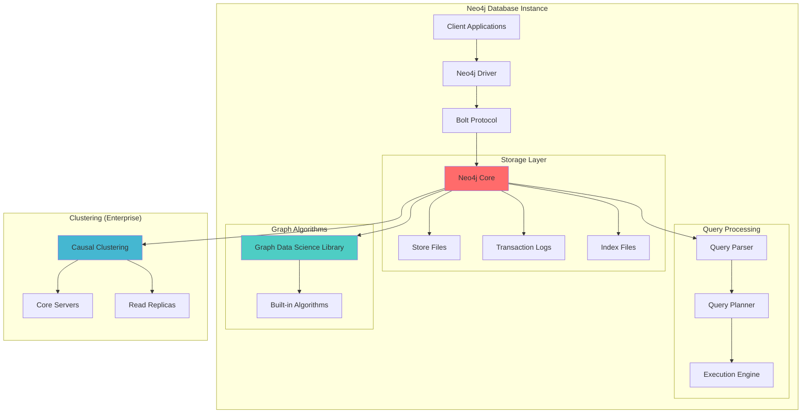
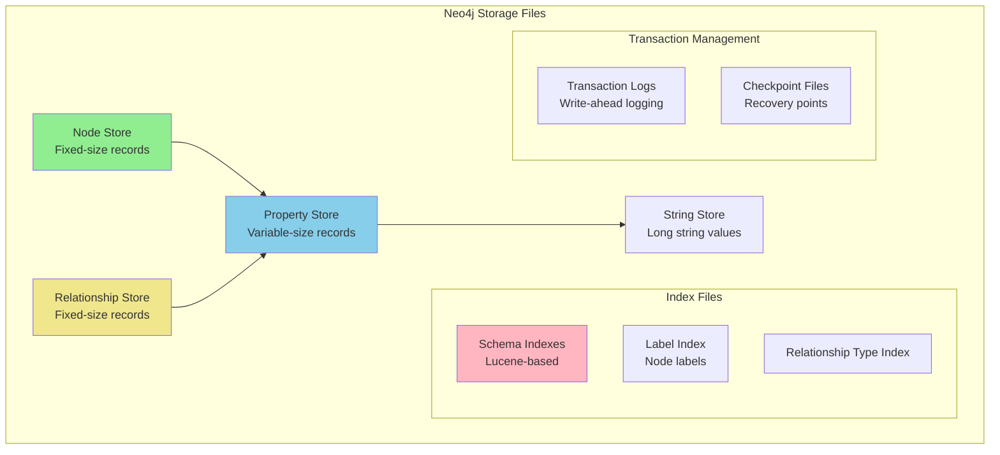
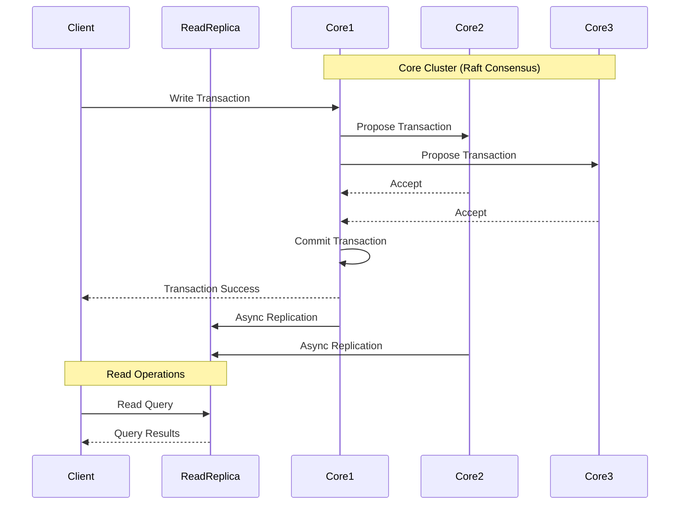

# Neo4j Case Study

> **Part of**: [Database Case Studies](../README.md) | **Related**: [Graph Databases](../../graph_databases.md), [NoSQL Databases](../../nosql.md), [Data Modeling](../../data_modeling.md)

## Table of Contents
- [Overview](#overview)
- [Graph Data Model](#graph-data-model)
- [Cypher Query Language](#cypher-query-language)
- [Architecture and Components](#architecture-and-components)
- [Scaling Strategies](#scaling-strategies)
- [Performance Optimization](#performance-optimization)
- [Real-World Use Cases](#real-world-use-cases)
- [Operational Considerations](#operational-considerations)
- [When to Choose Neo4j](#when-to-choose-neo4j)

## Overview

Neo4j is a native graph database that stores data as nodes and relationships, making it ideal for handling connected data scenarios where relationships are as important as the data itself.

### Key Characteristics
- **Property Graph Model**: Nodes and relationships can have properties
- **ACID Transactions**: Full ACID compliance with transaction support
- **Cypher Query Language**: Declarative graph query language
- **Schema-Optional**: Flexible schema with optional constraints
- **Native Graph Processing**: Optimized for traversing relationships

### Core Strengths
- Exceptional performance for connected data queries
- Intuitive data modeling matching real-world relationships
- Powerful pattern matching capabilities
- Rich visualization and analytics tools
- Strong consistency and transaction support

### Limitations
- Memory-intensive for large graphs
- Complex distributed architecture setup
- Limited aggregation capabilities compared to SQL
- Steep learning curve for Cypher
- Licensing costs for enterprise features

## Graph Data Model

### Basic Graph Components

```cypher
// Nodes represent entities
CREATE (john:Person {name: 'John Doe', age: 30, email: 'john@example.com'})
CREATE (company:Company {name: 'TechCorp', founded: 2010, industry: 'Technology'})
CREATE (skill:Skill {name: 'Python', category: 'Programming'})

// Relationships connect nodes
CREATE (john)-[:WORKS_FOR {since: '2020-01-15', role: 'Senior Developer'}]->(company)
CREATE (john)-[:HAS_SKILL {level: 'Expert', years: 8}]->(skill)

// Multiple labels and properties
CREATE (project:Project:Software {
  name: 'Customer Analytics Platform',
  status: 'Active',
  budget: 150000,
  startDate: date('2024-01-01')
})

CREATE (john)-[:LEADS {responsibility: 'Technical Architecture'}]->(project)
```

### Advanced Data Modeling Patterns

#### Social Network Model
```cypher
// Users and their connections
CREATE (alice:User {name: 'Alice Johnson', joinDate: datetime()})
CREATE (bob:User {name: 'Bob Smith', joinDate: datetime()})
CREATE (carol:User {name: 'Carol Davis', joinDate: datetime()})

// Friendship relationships
CREATE (alice)-[:FOLLOWS {since: datetime('2024-01-15')}]->(bob)
CREATE (bob)-[:FOLLOWS {since: datetime('2024-01-20')}]->(alice)
CREATE (alice)-[:FOLLOWS {since: datetime('2024-01-18')}]->(carol)

// Content and interactions
CREATE (post:Post {
  content: 'Excited about learning Neo4j!',
  timestamp: datetime(),
  visibility: 'public'
})

CREATE (alice)-[:POSTED]->(post)
CREATE (bob)-[:LIKED {timestamp: datetime()}]->(post)
CREATE (carol)-[:COMMENTED {
  text: 'Great choice! Graph databases are powerful.',
  timestamp: datetime()
}]->(post)
```

#### E-commerce Recommendation Model
```cypher
// Products and categories
CREATE (laptop:Product {
  name: 'Gaming Laptop Pro',
  price: 1299.99,
  brand: 'TechBrand',
  category: 'Electronics'
})

CREATE (mouse:Product {
  name: 'Wireless Gaming Mouse',
  price: 79.99,
  brand: 'TechBrand'
})

CREATE (electronics:Category {name: 'Electronics'})
CREATE (gaming:Category {name: 'Gaming'})

// Product relationships
CREATE (laptop)-[:BELONGS_TO]->(electronics)
CREATE (laptop)-[:BELONGS_TO]->(gaming)
CREATE (mouse)-[:BELONGS_TO]->(gaming)
CREATE (laptop)-[:FREQUENTLY_BOUGHT_WITH {confidence: 0.8}]->(mouse)

// Customer interactions
CREATE (customer:Customer {
  name: 'Jane Doe',
  email: 'jane@example.com',
  segment: 'Premium'
})

CREATE (customer)-[:VIEWED {timestamp: datetime(), duration: 120}]->(laptop)
CREATE (customer)-[:PURCHASED {
  timestamp: datetime(),
  amount: 1299.99,
  orderId: 'ORD-2024-001'
}]->(laptop)
```

## Cypher Query Language

### Basic Query Patterns

```cypher
-- Node creation and retrieval
CREATE (n:Person {name: 'Alice', age: 25})

MATCH (p:Person {name: 'Alice'}) 
RETURN p.name, p.age

-- Relationship patterns
MATCH (p:Person)-[:WORKS_FOR]->(c:Company)
WHERE p.age > 25
RETURN p.name, c.name

-- Path patterns
MATCH path = (start:Person)-[:KNOWS*1..3]-(end:Person)
WHERE start.name = 'Alice' AND end.name = 'Bob'
RETURN length(path) as degrees_of_separation
```

### Advanced Query Techniques

#### Recommendation Engine Queries
```cypher
-- Collaborative filtering: "People who bought X also bought Y"
MATCH (customer:Customer)-[:PURCHASED]->(product:Product)<-[:PURCHASED]-(other:Customer)
MATCH (other)-[:PURCHASED]->(recommendation:Product)
WHERE NOT (customer)-[:PURCHASED]->(recommendation)
RETURN recommendation.name, count(*) as score
ORDER BY score DESC
LIMIT 10

-- Content-based recommendations
MATCH (customer:Customer)-[:PURCHASED]->(bought:Product)-[:BELONGS_TO]->(category:Category)
MATCH (category)<-[:BELONGS_TO]-(similar:Product)
WHERE NOT (customer)-[:PURCHASED]->(similar)
  AND bought <> similar
RETURN similar.name, similar.price, 
       count(category) as category_match_score
ORDER BY category_match_score DESC, similar.price ASC
LIMIT 5
```

#### Social Network Analytics
```cypher
-- Find influencers (high follower count)
MATCH (user:User)<-[:FOLLOWS]-(follower:User)
RETURN user.name, count(follower) as follower_count
ORDER BY follower_count DESC
LIMIT 10

-- Detect communities using triangle counting
MATCH (a:User)-[:FOLLOWS]->(b:User)-[:FOLLOWS]->(c:User)-[:FOLLOWS]->(a)
RETURN a.name, b.name, c.name

-- Calculate PageRank-style centrality
CALL gds.pageRank.stream('social-network')
YIELD nodeId, score
MATCH (user:User) WHERE id(user) = nodeId
RETURN user.name, score
ORDER BY score DESC
```

#### Fraud Detection Patterns
```cypher
-- Detect suspicious account patterns
MATCH (account1:Account)-[:TRANSFER]->(account2:Account)
WHERE account1.createdDate > datetime() - duration('P30D')
  AND account2.createdDate > datetime() - duration('P30D')
WITH account1, account2, count(*) as transfer_count
WHERE transfer_count > 10
RETURN account1.id, account2.id, transfer_count

-- Find circular money flows
MATCH path = (start:Account)-[:TRANSFER*3..5]->(start)
WHERE all(rel in relationships(path) WHERE rel.amount > 1000)
RETURN path, reduce(total = 0, rel in relationships(path) | total + rel.amount) as total_amount
```

### Graph Algorithms Integration

```cypher
-- Shortest path between entities
MATCH (start:Person {name: 'Alice'}), (end:Person {name: 'Bob'})
CALL gds.shortestPath.dijkstra.stream('person-network', {
  sourceNode: start,
  targetNode: end,
  relationshipWeightProperty: 'distance'
})
YIELD path, totalCost
RETURN path, totalCost

-- Community detection
CALL gds.louvain.stream('social-network')
YIELD nodeId, communityId
MATCH (user:User) WHERE id(user) = nodeId
RETURN communityId, collect(user.name) as community_members
ORDER BY communityId
```

## Architecture and Components

### Core Architecture Components



### Storage Architecture



### Causal Clustering Architecture



## Scaling Strategies

### Read Scaling with Read Replicas

```cypher
// Configure read replicas for different workloads
:server user add alice SET PASSWORD 'password' CHANGE NOT REQUIRED
:server user grant role reader TO alice

// Connection routing for reads
const neo4j = require('neo4j-driver');

const driver = neo4j.driver(
  'neo4j://localhost:7687',
  neo4j.auth.basic('neo4j', 'password'),
  {
    defaultAccessMode: neo4j.session.READ
  }
);

// Explicit read/write session management
async function getUserRecommendations(userId) {
  const readSession = driver.session({ defaultAccessMode: neo4j.session.READ });
  
  try {
    const result = await readSession.run(`
      MATCH (user:User {id: $userId})-[:PURCHASED]->(product:Product)
      MATCH (product)<-[:PURCHASED]-(otherUser:User)-[:PURCHASED]->(rec:Product)
      WHERE NOT (user)-[:PURCHASED]->(rec)
      RETURN rec.name, count(*) as score
      ORDER BY score DESC
      LIMIT 10
    `, { userId });
    
    return result.records.map(record => ({
      product: record.get('rec.name'),
      score: record.get('score').toNumber()
    }));
  } finally {
    await readSession.close();
  }
}
```

### Sharding Strategies

```javascript
// Application-level sharding by data domain
class GraphShardingManager {
  constructor() {
    this.shards = {
      users: neo4j.driver('neo4j://shard-users:7687', auth),
      products: neo4j.driver('neo4j://shard-products:7687', auth),
      analytics: neo4j.driver('neo4j://shard-analytics:7687', auth)
    };
  }
  
  getShardForQuery(queryType, entityType) {
    const shardMap = {
      user_queries: 'users',
      product_queries: 'products',
      analytics_queries: 'analytics'
    };
    
    return this.shards[shardMap[`${entityType}_queries`]];
  }
  
  async executeQuery(queryType, entityType, cypher, params) {
    const driver = this.getShardForQuery(queryType, entityType);
    const session = driver.session();
    
    try {
      const result = await session.run(cypher, params);
      return result.records;
    } finally {
      await session.close();
    }
  }
}
```

### Federation Patterns

```cypher
-- Cross-shard relationship handling
-- Store relationship metadata in a coordination service
CREATE (user:User {id: 'user123', shard: 'users-shard-1'})
CREATE (product:Product {id: 'product456', shard: 'products-shard-2'})
CREATE (user)-[:PURCHASED {
  timestamp: datetime(),
  crossShard: true,
  targetShard: 'products-shard-2'
}]->(product)

-- Query coordination across shards
MATCH (user:User {id: 'user123'})-[r:PURCHASED]->(product)
WHERE r.crossShard = true
WITH user, r.targetShard as productShard
CALL apoc.load.json('http://federation-service/resolve-entity?shard=' + productShard + '&id=' + r.targetId) 
YIELD value as productData
RETURN user.name, productData.name
```

## Performance Optimization

### Indexing Strategies

```cypher
-- Schema indexes for property lookups
CREATE INDEX user_email_idx FOR (u:User) ON (u.email)
CREATE INDEX product_name_idx FOR (p:Product) ON (p.name)

-- Composite indexes for complex queries
CREATE INDEX user_location_age_idx FOR (u:User) ON (u.location, u.age)

-- Full-text search indexes
CREATE FULLTEXT INDEX product_search_idx FOR (p:Product) ON EACH [p.name, p.description]

-- Use full-text search
CALL db.index.fulltext.queryNodes('product_search_idx', 'gaming laptop') 
YIELD node, score
RETURN node.name, score
ORDER BY score DESC

-- Range indexes for numerical queries  
CREATE RANGE INDEX product_price_idx FOR (p:Product) ON (p.price)

-- Point indexes for geospatial queries
CREATE POINT INDEX store_location_idx FOR (s:Store) ON (s.location)
```

### Query Optimization Techniques

```cypher
-- Use PROFILE to analyze query performance
PROFILE
MATCH (user:User {email: 'john@example.com'})-[:PURCHASED]->(product:Product)
RETURN product.name, product.price

-- Optimize with query hints
MATCH (user:User)
USING INDEX user:User(email)
WHERE user.email = 'john@example.com'
MATCH (user)-[:PURCHASED]->(product:Product)
RETURN product.name

-- Efficient pagination with cursor-based approach
MATCH (p:Product)
WHERE id(p) > $lastId
RETURN p.name, p.price, id(p) as nodeId
ORDER BY id(p)
LIMIT 20

-- Use WITH for query optimization
MATCH (user:User {id: $userId})-[:PURCHASED]->(product:Product)
WITH user, collect(product) as purchased_products
MATCH (similar:Product)-[:BELONGS_TO]->(category:Category)
WHERE any(p in purchased_products WHERE (p)-[:BELONGS_TO]->(category))
  AND NOT similar IN purchased_products
RETURN similar.name
LIMIT 10
```

### Memory Management

```javascript
// Connection pool configuration
const driver = neo4j.driver(
  'neo4j://localhost:7687',
  neo4j.auth.basic('neo4j', 'password'),
  {
    maxConnectionPoolSize: 50,
    connectionAcquisitionTimeout: 60000,
    maxTransactionRetryTime: 30000
  }
);

// Batch processing for large operations
async function batchCreateNodes(nodes, batchSize = 1000) {
  const batches = [];
  for (let i = 0; i < nodes.length; i += batchSize) {
    batches.push(nodes.slice(i, i + batchSize));
  }
  
  for (const batch of batches) {
    const session = driver.session();
    try {
      await session.writeTransaction(async tx => {
        await tx.run(`
          UNWIND $batch as nodeData
          CREATE (n:Node)
          SET n = nodeData
        `, { batch });
      });
    } finally {
      await session.close();
    }
  }
}
```

### Warm-up and Caching

```cypher
-- Warm up frequently accessed paths
MATCH (user:User)-[:FOLLOWS*1..2]->(friend:User)
WHERE user.active = true
RETURN count(*)

-- Cache expensive computations
MATCH (user:User {id: $userId})
SET user.recommendation_cache = [
  // Store pre-computed recommendations
],
user.cache_updated = datetime()

-- Use APOC for caching
CALL apoc.cache.store('user_recommendations:' + $userId, recommendations, 3600)
```

## Real-World Use Cases

### Social Network Platform

```cypher
-- Friend recommendations based on mutual connections
MATCH (me:User {id: $userId})-[:FOLLOWS]->(friend:User)-[:FOLLOWS]->(suggestion:User)
WHERE NOT (me)-[:FOLLOWS]->(suggestion) AND me <> suggestion
WITH suggestion, count(friend) as mutual_friends
WHERE mutual_friends >= 2
RETURN suggestion.name, suggestion.profile_picture, mutual_friends
ORDER BY mutual_friends DESC
LIMIT 10

-- Content feed generation
MATCH (user:User {id: $userId})-[:FOLLOWS]->(followed:User)-[:POSTED]->(post:Post)
WHERE post.timestamp > datetime() - duration('P7D')
OPTIONAL MATCH (post)<-[like:LIKED]-(liker:User)
OPTIONAL MATCH (post)<-[comment:COMMENTED]-(commenter:User)
RETURN post, followed, count(like) as likes, count(comment) as comments
ORDER BY post.timestamp DESC, likes DESC
LIMIT 50
```

### Fraud Detection System

```cypher
-- Detect money laundering patterns
MATCH path = (start:Account)-[:TRANSFER*3..6]->(start)
WHERE all(rel in relationships(path) WHERE rel.amount > 5000)
  AND reduce(total = 0, rel in relationships(path) | total + rel.amount) > 50000
WITH path, reduce(total = 0, rel in relationships(path) | total + rel.amount) as total_amount
RETURN extract(n in nodes(path) | n.account_id) as suspicious_cycle, total_amount

-- Identity resolution for duplicate accounts
MATCH (a1:Account), (a2:Account)
WHERE a1 <> a2
  AND (a1.phone = a2.phone OR a1.email = a2.email OR a1.address = a2.address)
CREATE (a1)-[:POSSIBLE_DUPLICATE {
  confidence: CASE 
    WHEN a1.phone = a2.phone THEN 0.9
    WHEN a1.email = a2.email THEN 0.8
    ELSE 0.6
  END
}]->(a2)
```

### Knowledge Graph

```cypher
-- Entity relationship discovery
MATCH (entity:Entity)-[r]-(related:Entity)
WHERE entity.name CONTAINS $searchTerm
RETURN entity.name, type(r) as relationship_type, related.name, related.category
ORDER BY entity.relevance_score DESC

-- Semantic search with embeddings
CALL db.index.vector.queryNodes('entity_embeddings', 5, $query_embedding)
YIELD node as entity, score
MATCH (entity)-[r:RELATED_TO*1..2]-(connected:Entity)
RETURN entity.name, connected.name, score
ORDER BY score DESC
```

## Operational Considerations

### Monitoring and Health Checks

```cypher
-- Database health monitoring
CALL dbms.queryJmx('org.neo4j:*') 
YIELD attributes
WHERE attributes.ObjectName CONTAINS 'Primitive count'
RETURN attributes.ObjectName, attributes.Value

-- Performance metrics
CALL dbms.listQueries() 
YIELD query, elapsedTimeMillis, status
WHERE elapsedTimeMillis > 1000
RETURN query, elapsedTimeMillis, status
ORDER BY elapsedTimeMillis DESC

-- Storage usage monitoring
CALL dbms.listConfig() 
YIELD name, value
WHERE name CONTAINS 'dbms.memory'
RETURN name, value
```

### Backup and Recovery

```bash
# Online backup (Enterprise Edition)
neo4j-admin backup --backup-dir=/backups --name=graph.db-backup

# Offline backup
neo4j-admin dump --database=neo4j --to=/backups/neo4j-dump.dump

# Restore from backup
neo4j-admin load --from=/backups/neo4j-dump.dump --database=neo4j --force
```

### Security Configuration

```cypher
-- User management
CREATE USER analyst SET PASSWORD 'secure_password' CHANGE NOT REQUIRED
GRANT ROLE reader TO analyst

-- Database access control
DENY READ {*} ON GRAPH * NODES Person TO analyst
GRANT READ {name, email} ON GRAPH * NODES Person TO analyst

-- Procedure security
CALL dbms.security.listRoles() YIELD role, users
RETURN role, users
```

## When to Choose Neo4j

### Ideal Use Cases
- **Social Networks**: Friend recommendations, community detection, influence analysis
- **Fraud Detection**: Pattern matching, anomaly detection, risk assessment  
- **Recommendation Engines**: Collaborative filtering, content-based recommendations
- **Knowledge Graphs**: Entity relationships, semantic search, data discovery
- **Network Analysis**: Infrastructure monitoring, dependency mapping
- **Supply Chain**: Traceability, impact analysis, optimization

### Consider Alternatives When
- Simple relational data without complex relationships
- Heavy analytical workloads requiring SQL aggregations
- Document-centric applications with minimal relationships
- Time-series data without graph characteristics
- Budget constraints (Neo4j Enterprise licensing)
- Team lacks graph database expertise

### Migration Considerations
```cypher
-- Gradual migration approach
// 1. Start with core entities and relationships
CREATE (user:User {id: $legacy_user_id, migrated_from: 'mysql'})

// 2. Add relationships as you migrate related tables
MATCH (user:User {id: $user_id}), (product:Product {id: $product_id})
CREATE (user)-[:PURCHASED {migrated_date: datetime()}]->(product)

// 3. Maintain hybrid architecture during transition
MATCH (user:User {id: $user_id})
CALL apoc.load.jdbc('jdbc:mysql://legacy-db', 'SELECT * FROM orders WHERE user_id = ?', [$user_id])
YIELD row
CREATE (user)-[:ORDERED]->(order:Order)
SET order = row
```

Neo4j excels when relationships between data are as important as the data itself, requiring complex traversals and pattern matching that would be inefficient in traditional databases.