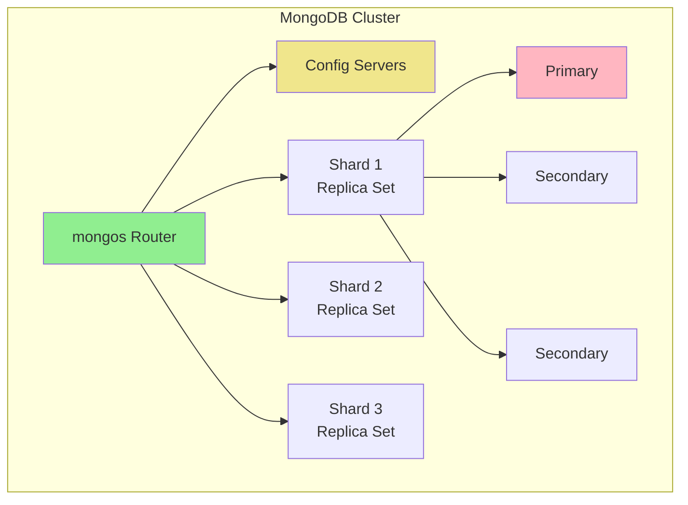
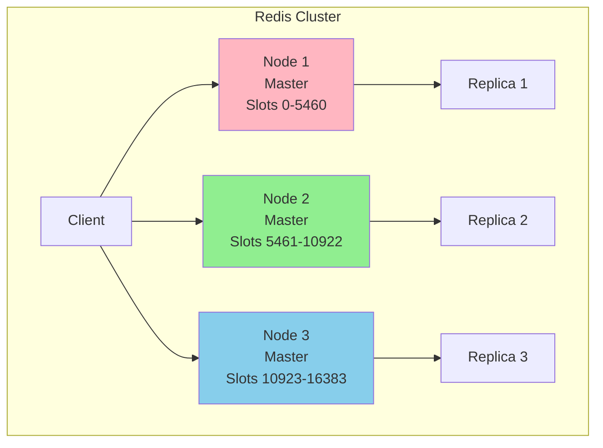
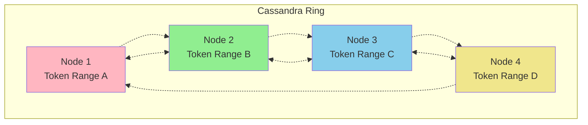
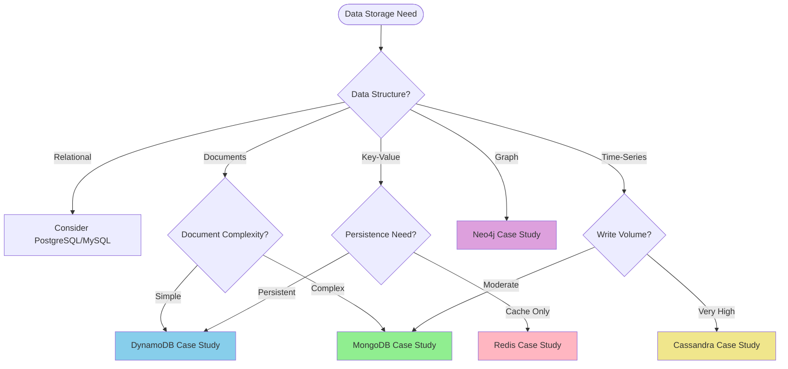

# Database Case Studies

> **Part of**: [Database System Design](../../README.md) | **Related**: [Scaling Strategies](../scaling_strategies.md), [NoSQL Databases](../nosql.md), [Consistency Models](../consistency.md)

## Overview

This section contains detailed case studies of popular database technologies, examining their architecture, scaling strategies, use cases, and real-world implementations. Each case study provides practical insights into when and how to use these databases effectively.

## Case Studies Index

### Document Databases
- **[MongoDB](docs/mongodb.md)** - Flexible document storage with rich querying capabilities
  - Sharding and replica sets
  - Aggregation pipeline optimization
  - Schema design patterns
  - Atlas cloud deployment strategies

### Key-Value Stores
- **[Redis](docs/redis.md)** - In-memory data structure store
  - Clustering and high availability
  - Data persistence strategies
  - Advanced data structures and use cases
  - Performance optimization techniques

- **[DynamoDB](docs/dynamodb.md)** - AWS managed NoSQL database
  - Partition key design strategies
  - Global tables and multi-region deployment
  - On-demand vs provisioned capacity
  - DynamoDB Streams and event processing

### Wide-Column Stores
- **[Cassandra](docs/cassandra.md)** - Distributed wide-column database
  - Ring architecture and consistent hashing
  - Data modeling for time-series and analytics
  - Tunable consistency levels
  - Multi-datacenter replication

### Graph Databases
- **[Neo4j](docs/neo4j.md)** - Native graph database
  - Graph data modeling patterns
  - Cypher query optimization
  - Clustering and causal consistency
  - Real-world graph use cases

## How to Use This Section

Each case study follows a consistent structure:

1. **Architecture Overview** - Core design principles and components
2. **Scaling Strategies** - Horizontal and vertical scaling approaches
3. **Data Modeling** - Best practices for schema design
4. **Performance Optimization** - Query optimization and indexing
5. **Operational Considerations** - Monitoring, backup, and maintenance
6. **Real-World Examples** - Production use cases and lessons learned
7. **When to Choose** - Decision criteria and trade-offs

## Comparative Analysis

### Use Case Decision Matrix

| Database | Best For | Avoid When | Scaling Model |
|----------|----------|------------|---------------|
| **MongoDB** | Content management, catalogs, real-time analytics | High-frequency trading, complex transactions | Sharding + Replicas |
| **Redis** | Caching, session storage, real-time analytics | Primary data storage, large datasets | Clustering + Replication |
| **DynamoDB** | Serverless apps, gaming, IoT, mobile backends | Complex queries, analytics workloads | Auto-scaling + Global tables |
| **Cassandra** | Time-series, IoT, messaging, logging | Complex joins, immediate consistency | Ring topology + Multi-DC |
| **Neo4j** | Social networks, recommendations, fraud detection | Simple key-value queries, large scans | Clustering + Read replicas |

### Performance Characteristics

```mermaid
radar
    title Database Performance Comparison
    options
        quadrants 1
        scales 0 --> 10
    x-axis Throughput --> Latency --> Consistency --> Scalability --> Complexity
    data
        MongoDB 8, 7, 7, 8, 6
        Redis 9, 9, 6, 7, 5
        DynamoDB 9, 8, 7, 9, 4
        Cassandra 9, 8, 5, 9, 8
        Neo4j 6, 7, 8, 6, 7
```

## Architecture Patterns by Database Type

### Document Databases (MongoDB)


### Key-Value Stores (Redis)


### Wide-Column (Cassandra)


## Selection Criteria

### Primary Considerations

1. **Data Model Requirements**
   - Structured vs unstructured data
   - Relationship complexity
   - Query patterns
   - Consistency requirements

2. **Scale Requirements**
   - Read/write patterns
   - Data volume growth
   - Geographic distribution
   - Performance SLAs

3. **Operational Requirements**
   - Team expertise
   - Operational complexity
   - Cost constraints
   - Compliance needs

### Decision Flow



## Real-World Usage Examples

### E-commerce Platform
- **Product Catalog**: MongoDB for flexible product schemas
- **Shopping Cart**: Redis for session management
- **Order History**: DynamoDB for scalable user data
- **Recommendations**: Neo4j for relationship analysis

### Social Media Application
- **User Profiles**: MongoDB for rich user data
- **Activity Feed**: Cassandra for time-series data
- **Real-time Chat**: Redis for message queuing
- **Social Graph**: Neo4j for connections

### IoT and Analytics Platform
- **Device Data**: Cassandra for high-volume time-series
- **Real-time Processing**: Redis for stream processing
- **Configuration**: DynamoDB for device settings
- **Relationship Analysis**: Neo4j for device networks

## Migration Strategies

### Common Migration Patterns

1. **Lift and Shift** - Direct migration with minimal changes
2. **Gradual Migration** - Incremental data and feature migration
3. **Strangler Fig** - Gradually replace legacy system
4. **Database per Service** - Microservices with dedicated databases

### Migration Considerations

- Data consistency during migration
- Application downtime requirements
- Rollback strategies
- Performance validation
- Team training and expertise

## Contributing

When adding new case studies or updating existing ones:

1. Follow the established structure template
2. Include practical code examples
3. Add performance benchmarks where relevant
4. Document real-world use cases
5. Update the comparison matrices
6. Test all code examples

## Additional Resources

### Official Documentation
- [MongoDB Documentation](https://docs.mongodb.com/)
- [Redis Documentation](https://redis.io/documentation)
- [DynamoDB Developer Guide](https://docs.aws.amazon.com/dynamodb/)
- [Cassandra Documentation](https://cassandra.apache.org/doc/)
- [Neo4j Documentation](https://neo4j.com/docs/)

### Performance Benchmarking
- Database-specific benchmarking tools
- Load testing strategies
- Performance monitoring setup
- Capacity planning guidelines

### Community Resources
- Database-specific communities and forums
- Best practices repositories
- Open-source tooling and libraries
- Training and certification programs

---

**Next Steps**: Choose a specific database case study to dive deeper into implementation details and real-world examples.