# NoSQL Databases

> **Part of**: [Database System Design](../README.md) | **Related**: [Relational Databases](./relational.md), [Data Consistency](./consistency.md), [Scaling Strategies](./scaling_strategies.md)

## Introduction

NoSQL databases emerged to address the limitations of relational databases in handling large-scale, distributed, and varied data types. They sacrifice some ACID properties for improved scalability, flexibility, and performance, making them ideal for modern web applications, big data, and real-time systems.


## NoSQL vs SQL Comparison

```mermaid
graph TB
    subgraph "SQL Databases"
        SQL[Relational/SQL] --> SQLProps[✅ ACID Properties<br/>✅ Complex Queries<br/>✅ Data Consistency<br/>❌ Rigid Schema<br/>❌ Vertical Scaling<br/>❌ Limited Flexibility]
    end
    
    subgraph "NoSQL Databases"
        NoSQL[Non-Relational/NoSQL] --> NoSQLProps[✅ Flexible Schema<br/>✅ Horizontal Scaling<br/>✅ High Performance<br/>❌ Eventual Consistency<br/>❌ Limited Complex Queries<br/>❌ Learning Curve]
    end
    
    subgraph "Use Case Decision"
        OLTP[Complex Transactions<br/>Financial Systems<br/>ERP Applications] --> SQL
        BigData[Big Data<br/>Real-time Analytics<br/>Rapid Development] --> NoSQL
        WebApps[Modern Web Apps<br/>Content Management<br/>IoT Systems] --> Hybrid[Polyglot Persistence<br/>Mix of Both]
    end
    
    style SQL fill:#FFB6C1
    style NoSQL fill:#90EE90
    style Hybrid fill:#87CEEB
```



## Document Databases

Document databases store data in document format, typically JSON or BSON, providing flexibility and intuitive data modeling for developers.

### Characteristics

```mermaid
graph LR
    Doc[Document Database] --> Schema[Flexible Schema<br/>No predefined structure]
    Doc --> Nested[Nested Documents<br/>Complex data structures]
    Doc --> Query[Rich Queries<br/>Field-level operations]
    Doc --> Scale[Horizontal Scaling<br/>Sharding support]
    
    Schema --> Example1[User Profile:<br/>{name, email, preferences}]
    Nested --> Example2[Order:<br/>{items: [...], shipping: {...}}]
    Query --> Example3[Find users where<br/>preferences.theme = 'dark']
    Scale --> Example4[Distribute by<br/>user_id hash]
    
    style Doc fill:#90EE90
```

### MongoDB Deep Dive

**Data Model:**
```javascript
// Flexible document structure
{
  "_id": ObjectId("..."),
  "username": "john_doe",
  "profile": {
    "firstName": "John",
    "lastName": "Doe",
    "avatar": "https://...",
    "preferences": {
      "theme": "dark",
      "notifications": {
        "email": true,
        "push": false
      }
    }
  },
  "orders": [
    {
      "orderId": "ORD-001",
      "items": ["item1", "item2"],
      "total": 299.99,
      "date": ISODate("2024-09-20")
    }
  ]
}
```

**Query Examples:**
```javascript
// Find users with dark theme preference
db.users.find({"profile.preferences.theme": "dark"});

// Update nested document
db.users.updateOne(
  {"username": "john_doe"},
  {"$set": {"profile.preferences.notifications.email": false}}
);

// Aggregation pipeline
db.users.aggregate([
  {"$match": {"profile.preferences.theme": "dark"}},
  {"$group": {"_id": "$profile.preferences.theme", "count": {"$sum": 1}}},
  {"$sort": {"count": -1}}
]);
```

### Sharding Strategy


### Use Cases
- **Content Management Systems**: Flexible content structures
- **Product Catalogs**: Varying product attributes
- **User Profiles**: Dynamic user data
- **Real-time Analytics**: Event logging and analysis

## Key-Value Stores

Key-value stores are the simplest NoSQL databases, offering high performance through straightforward key-value operations.

### Architecture


### Redis Implementation

**Data Structures:**
```redis
# String operations
SET user:1001:name "John Doe"
GET user:1001:name

# Hash operations (object-like)
HSET user:1001 name "John Doe" email "john@example.com" age 30
HGET user:1001 name

# List operations (arrays)
LPUSH user:1001:notifications "Welcome message"
LPUSH user:1001:notifications "Friend request"
LRANGE user:1001:notifications 0 -1

# Set operations (unique values)
SADD user:1001:interests "technology" "music" "sports"
SMEMBERS user:1001:interests

# Sorted sets (ranked data)
ZADD leaderboard 1500 "player1" 1200 "player2" 1800 "player3"
ZRANGE leaderboard 0 -1 WITHSCORES
```

**Advanced Features:**
```redis
# Expiration
SETEX session:abc123 3600 "user_data"  # Expires in 1 hour

# Pub/Sub
PUBLISH chat:room1 "Hello everyone!"
SUBSCRIBE chat:room1

# Atomic operations
MULTI
INCR user:1001:points 10
DECR inventory:item123 1
EXEC
```

### DynamoDB Architecture


### Use Cases
- **Session Management**: Web session storage
- **Caching Layer**: Database query results, computed data
- **Real-time Leaderboards**: Gaming scores, rankings
- **Shopping Carts**: Temporary transaction data
- **Rate Limiting**: API throttling, usage tracking

## Column-Family Databases

Column-family databases organize data in column families, optimizing for write-heavy workloads and time-series data.

### Cassandra Architecture


### Data Model

```cql
-- Create keyspace (database)
CREATE KEYSPACE ecommerce 
WITH REPLICATION = {
  'class': 'SimpleStrategy',
  'replication_factor': 3
};

-- Time-series table for user events
CREATE TABLE user_events (
    user_id UUID,
    event_time TIMESTAMP,
    event_type TEXT,
    event_data MAP<TEXT, TEXT>,
    PRIMARY KEY (user_id, event_time)
) WITH CLUSTERING ORDER BY (event_time DESC);

-- Insert events
INSERT INTO user_events (user_id, event_time, event_type, event_data)
VALUES (
    uuid(),
    '2024-09-20 10:30:00',
    'page_view',
    {'page': '/products', 'referrer': 'google'}
);

-- Query recent events
SELECT * FROM user_events 
WHERE user_id = ? 
  AND event_time > '2024-09-20 00:00:00'
ORDER BY event_time DESC
LIMIT 100;
```

### Consistency Levels


### Use Cases
- **Time-Series Data**: IoT sensor data, logs, metrics
- **Write-Heavy Applications**: Event logging, audit trails
- **Real-time Analytics**: User behavior tracking
- **Content Management**: Blog posts, comments, media metadata

## Graph Databases

Graph databases excel at managing highly connected data and complex relationships.

### Graph Model


### Neo4j Implementation

```cypher
// Create nodes
CREATE (alice:Person {name: 'Alice', age: 30, city: 'San Francisco'})
CREATE (bob:Person {name: 'Bob', age: 28, city: 'New York'})
CREATE (techcorp:Company {name: 'TechCorp', industry: 'Technology'})

// Create relationships
CREATE (alice)-[:FRIENDS_WITH {since: '2020-01-15'}]->(bob)
CREATE (alice)-[:WORKS_AT {position: 'Engineer', since: '2022-03-01'}]->(techcorp)

// Complex graph queries
// Find friends of friends
MATCH (me:Person {name: 'Alice'})-[:FRIENDS_WITH]-()-[:FRIENDS_WITH]-(fof:Person)
WHERE fof <> me
RETURN DISTINCT fof.name

// Shortest path between people
MATCH path = shortestPath((alice:Person {name: 'Alice'})-[*]-(charlie:Person {name: 'Charlie'}))
RETURN path

// Recommendation: People who work at the same company as friends
MATCH (me:Person {name: 'Alice'})-[:FRIENDS_WITH]-(friend)-[:WORKS_AT]->(company)
WHERE NOT (me)-[:WORKS_AT]->(company)
RETURN company.name, count(friend) as mutual_connections
ORDER BY mutual_connections DESC
```

### Graph Algorithms


### Use Cases
- **Social Networks**: Friend recommendations, influence analysis
- **Fraud Detection**: Pattern recognition in financial transactions
- **Recommendation Engines**: Product and content recommendations
- **Network Analysis**: Infrastructure monitoring, dependency mapping
- **Knowledge Graphs**: Semantic search, AI applications

## CAP Theorem and NoSQL

The CAP theorem fundamentally influences NoSQL database design decisions:

```mermaid
graph TD
    CAP[CAP Theorem<br/>Choose Any Two] --> C[Consistency<br/>All nodes see same data]
    CAP --> A[Availability<br/>System remains operational]
    CAP --> P[Partition Tolerance<br/>Survives network failures]
    
    C & A --> CA[CA Systems<br/>❌ Not suitable for<br/>distributed NoSQL]
    C & P --> CP[CP Systems<br/>MongoDB - default<br/>HBase<br/>Redis Cluster]
    A & P --> AP[AP Systems<br/>Cassandra<br/>DynamoDB<br/>CouchDB<br/>Riak]
    
    subgraph "NoSQL Positioning"
        CP --> CPChar[✅ Strong consistency<br/>❌ May become unavailable<br/>🎯 Financial data, user accounts]
        AP --> APChar[✅ Always available<br/>❌ Eventual consistency<br/>🎯 Social media, analytics]
    end
    
    style CP fill:#90EE90
    style AP fill:#87CEEB
    style CA fill:#FFB6C1

```



## NoSQL Database Comparison

### Feature Matrix

```mermaid
graph TB
    subgraph "NoSQL Database Comparison"
        Document[Document<br/>MongoDB, CouchDB] --> DocFeatures[✅ Flexible schema<br/>✅ Rich queries<br/>✅ Developer friendly<br/>❌ Memory usage<br/>❌ Join limitations]
        
        KeyValue[Key-Value<br/>Redis, DynamoDB] --> KVFeatures[✅ High performance<br/>✅ Simple operations<br/>✅ Horizontal scaling<br/>❌ Limited queries<br/>❌ Data modeling]
        
        ColumnFamily[Column-Family<br/>Cassandra, HBase] --> CFFeatures[✅ Write performance<br/>✅ Time-series data<br/>✅ Compression<br/>❌ Query flexibility<br/>❌ Learning curve]
        
        Graph[Graph<br/>Neo4j, Neptune] --> GFeatures[✅ Relationship queries<br/>✅ Graph algorithms<br/>✅ Pattern matching<br/>❌ Scaling challenges<br/>❌ Specialized use cases]
    end
    
    style Document fill:#90EE90
    style KeyValue fill:#F0E68C
    style ColumnFamily fill:#87CEEB
    style Graph fill:#DDA0DD
```



### Performance Characteristics

| Database Type | Read Performance | Write Performance | Query Complexity | Scaling |
|---------------|------------------|-------------------|------------------|---------|
| **Document** | High | Medium-High | High | Horizontal |
| **Key-Value** | Very High | Very High | Low | Horizontal |
| **Column-Family** | Medium-High | Very High | Medium | Linear |
| **Graph** | Medium | Medium | Very High | Vertical |

### Selection Criteria


## Implementation Best Practices

### Data Modeling Guidelines

#### Document Databases
```javascript
// ✅ Good: Embed related data
{
  "userId": "user123",
  "profile": {
    "name": "John Doe",
    "preferences": {...}
  },
  "recentOrders": [
    {"orderId": "ord1", "total": 99.99}
  ]
}

// ❌ Bad: Over-normalization
{
  "userId": "user123",
  "profileId": "profile456", // Reference instead of embed
  "orderIds": ["ord1", "ord2"] // References instead of recent data
}
```

#### Key-Value Stores
```javascript
// ✅ Good: Hierarchical keys
"user:123:profile" → {"name": "John", "email": "..."}
"user:123:settings" → {"theme": "dark", "notifications": true}
"session:abc123" → {"userId": "123", "expires": "..."}

// ❌ Bad: Flat structure requiring scans
"user_123_name" → "John"
"user_123_email" → "john@example.com"
"user_123_theme" → "dark"
```

### Performance Optimization

#### Indexing Strategies
```javascript
// MongoDB indexing
db.products.createIndex({"category": 1, "price": -1}); // Compound index
db.users.createIndex({"email": 1}, {"unique": true});   // Unique index
db.posts.createIndex({"content": "text"});              // Text search

// Cassandra partitioning
CREATE TABLE user_events (
    user_id UUID,
    event_date DATE,
    event_time TIMESTAMP,
    event_data TEXT,
    PRIMARY KEY ((user_id, event_date), event_time)
) WITH CLUSTERING ORDER BY (event_time DESC);
```

#### Connection Management
```javascript
// MongoDB connection pooling
const client = new MongoClient(uri, {
  maxPoolSize: 100,        // Maximum connections
  minPoolSize: 5,          // Minimum connections
  maxIdleTimeMS: 30000,    // Close idle connections
  serverSelectionTimeoutMS: 5000
});

// Redis connection pooling
const redis = new Redis.Cluster([
  {host: 'redis1', port: 6379},
  {host: 'redis2', port: 6379}
], {
  redisOptions: {
    password: 'password',
    maxRetriesPerRequest: 3
  },
  maxRetriesPerRequest: null
});
```

## Migration Strategies

### From SQL to NoSQL


### Polyglot Persistence


## Related Topics

- **[Data Consistency](./consistency.md)**: Understanding consistency models in NoSQL systems
- **[Scaling Strategies](./scaling_strategies.md)**: NoSQL-specific scaling patterns and techniques
- **[Case Studies](./case-studies.md)**: Real-world NoSQL implementations and architecture decisions
- **[Relational Databases](./relational.md)**: Comparison with traditional SQL databases

## Further Reading

### Books
- "NoSQL Distilled" by Pramod J. Sadalage and Martin Fowler
- "MongoDB: The Definitive Guide" by Kristina Chodorow
- "Cassandra: The Definitive Guide" by Jeff Carpenter and Eben Hewitt
- "Graph Databases" by Ian Robinson, Jim Webber, and Emil Eifrem

### Documentation
- [MongoDB Documentation](https://docs.mongodb.com/)
- [Apache Cassandra Documentation](https://cassandra.apache.org/doc/)
- [Redis Documentation](https://redis.io/documentation)
- [Neo4j Documentation](https://neo4j.com/docs/)

### Online Resources
- [NoSQL Database Patterns](https://highlyscalable.wordpress.com/2012/03/01/nosql-data-modeling-techniques/)
- [CAP Theorem Explained](https://www.ibm.com/cloud/learn/cap-theorem)
- [Database Selection Guide](https://db-engines.com/en/)

---

*Last Updated: September 2025 | [Back to Main Documentation](../README.md)*