# Relational Databases

> **Part of**: [Database System Design](../README.md) | **Related**: [NoSQL Databases](./nosql.md), [Scaling Strategies](./scaling_strategies.md)

## Overview

Relational databases have been the backbone of data storage for decades, providing ACID properties and strong consistency guarantees. Understanding their principles is crucial before exploring modern alternatives and serves as the foundation for all database system design decisions.


## ACID Properties

**Atomicity, Consistency, Isolation, Durability** form the foundation of relational database reliability:


### Atomicity
- **Definition**: Transactions are all-or-nothing operations
- **Implementation**: Transaction logs and rollback mechanisms
- **Example**: Bank transfer must complete both debit and credit, or neither

### Consistency
- **Definition**: Database remains in a valid state after transactions
- **Implementation**: Constraints, triggers, and validation rules
- **Example**: Foreign key constraints ensure referential integrity

### Isolation
- **Definition**: Concurrent transactions don't interfere with each other
- **Implementation**: Locking mechanisms and isolation levels
- **Example**: Two users updating the same record see consistent data

### Durability
- **Definition**: Committed transactions survive system failures
- **Implementation**: Write-ahead logging and data persistence
- **Example**: Power failure after commit doesn't lose transaction data

## Database Normalization

Database normalization reduces data redundancy and improves data integrity through structured forms:

```mermaid
flowchart LR
    A[Unnormalized Data<br/>🔴 Repeating Groups<br/>🔴 Data Redundancy<br/>🔴 Update Anomalies] --> B[1NF<br/>✅ Atomic Values<br/>✅ No Repeating Groups<br/>✅ Unique Rows]
    B --> C[2NF<br/>✅ Meets 1NF<br/>✅ No Partial Dependencies<br/>✅ Full Functional Dependency]
    C --> D[3NF<br/>✅ Meets 2NF<br/>✅ No Transitive Dependencies<br/>✅ Direct Dependencies Only]
    D --> E[BCNF<br/>✅ Meets 3NF<br/>✅ Every Determinant is Key<br/>✅ Eliminate All Anomalies]
    
```



### First Normal Form (1NF)
- Each column contains atomic (indivisible) values
- No repeating groups or arrays within columns
- Each row is unique (has a primary key)

**Example Transformation:**
```sql
-- Before 1NF (violates atomicity)
CREATE TABLE customers_bad (
    id INT PRIMARY KEY,
    name VARCHAR(100),
    phone_numbers VARCHAR(500) -- "123-456-7890,098-765-4321"
);

-- After 1NF
CREATE TABLE customers (
    id INT PRIMARY KEY,
    name VARCHAR(100)
);

CREATE TABLE customer_phones (
    customer_id INT,
    phone_number VARCHAR(20),
    FOREIGN KEY (customer_id) REFERENCES customers(id)
);
```

### Second Normal Form (2NF)
- Meets 1NF requirements
- No partial dependencies on composite primary keys
- All non-key attributes fully depend on the entire primary key

### Third Normal Form (3NF)
- Meets 2NF requirements
- No transitive dependencies
- Non-key attributes don't depend on other non-key attributes

### Boyce-Codd Normal Form (BCNF)
- Advanced form of 3NF
- Every determinant is a candidate key
- Eliminates all functional dependency anomalies

## SQL Query Optimization

Effective query optimization is crucial for relational database performance:


### Index Strategy
- **B-Tree Indexes**: Best for equality and range queries
- **Hash Indexes**: Optimal for equality comparisons
- **Bitmap Indexes**: Efficient for low-cardinality columns
- **Composite Indexes**: Multiple columns in single index

```sql
-- Effective indexing examples
CREATE INDEX idx_user_email ON users(email);
CREATE INDEX idx_order_date_status ON orders(order_date, status);
CREATE INDEX idx_product_category_price ON products(category, price DESC);
```

### Join Optimization
- **Nested Loop Join**: Small datasets, good for indexed joins
- **Hash Join**: Large datasets, one table fits in memory
- **Merge Join**: Both tables sorted on join key

### Query Planning
Understanding execution plans helps optimize performance:

```sql
-- PostgreSQL
EXPLAIN ANALYZE SELECT * FROM orders o
JOIN customers c ON o.customer_id = c.id
WHERE o.order_date >= '2024-01-01';

-- MySQL
EXPLAIN FORMAT=JSON SELECT * FROM orders o
JOIN customers c ON o.customer_id = c.id
WHERE o.order_date >= '2024-01-01';
```

## Advanced Features

### Transactions and Concurrency


### Isolation Levels
- **READ UNCOMMITTED**: No isolation, dirty reads possible
- **READ COMMITTED**: Prevents dirty reads
- **REPEATABLE READ**: Prevents dirty and non-repeatable reads
- **SERIALIZABLE**: Full isolation, prevents all anomalies

### Stored Procedures and Functions
- **Performance**: Reduced network overhead
- **Security**: Parameterized queries prevent SQL injection
- **Business Logic**: Centralized data processing logic

```sql
-- Example stored procedure
CREATE OR REPLACE FUNCTION transfer_funds(
    from_account INT,
    to_account INT,
    amount DECIMAL(10,2)
) RETURNS BOOLEAN AS $$
BEGIN
    -- Check sufficient balance
    IF (SELECT balance FROM accounts WHERE id = from_account) < amount THEN
        RETURN FALSE;
    END IF;
    
    -- Perform transfer
    UPDATE accounts SET balance = balance - amount WHERE id = from_account;
    UPDATE accounts SET balance = balance + amount WHERE id = to_account;
    
    -- Log transaction
    INSERT INTO transaction_log (from_account, to_account, amount, timestamp)
    VALUES (from_account, to_account, amount, NOW());
    
    RETURN TRUE;
END;
$$ LANGUAGE plpgsql;
```

## Limitations and Challenges

### Scalability Limitations


### Common Challenges

#### Schema Evolution
- **Problem**: Changing schema in production can be complex
- **Solutions**: Database migrations, blue-green deployments

- **Best Practice**: Version control for schema changes

#### Performance at Scale
- **Problem**: Complex joins become expensive with large datasets
- **Solutions**: Denormalization, materialized views, read replicas
- **Trade-off**: Storage vs query performance

#### Cost of High-End Hardware
- **Problem**: Vertical scaling becomes exponentially expensive
- **Solutions**: Horizontal scaling patterns, cloud databases
- **Alternative**: Consider NoSQL for specific use cases

## Best Practices

### Design Principles
1. **Normalize for Consistency**: Start with normalized design
2. **Denormalize for Performance**: Strategic denormalization when needed
3. **Index Strategically**: Cover frequent queries, avoid over-indexing
4. **Monitor Performance**: Regular analysis of slow queries

### Operational Excellence
1. **Regular Backups**: Automated, tested backup strategies
2. **Performance Monitoring**: Continuous query performance analysis
3. **Capacity Planning**: Proactive scaling before bottlenecks
4. **Security**: Encryption, access control, audit trails

### Development Guidelines
1. **Use Prepared Statements**: Prevent SQL injection
2. **Optimize Queries**: EXPLAIN plans for complex queries
3. **Transaction Design**: Keep transactions short and focused
4. **Connection Pooling**: Manage database connections efficiently

## Technology Comparison

### Popular RDBMS Features

| Database | Strengths | Best Use Cases | Scaling Options |
|----------|-----------|---------------|----------------|
| **PostgreSQL** | Advanced features, JSON support, extensibility | Complex applications, analytics | Streaming replication, foreign data wrappers |
| **MySQL** | Performance, widespread adoption, ease of use | Web applications, read-heavy workloads | Master-slave replication, MySQL Cluster |
| **Oracle** | Enterprise features, performance, reliability | Mission-critical applications | RAC, Data Guard |
| **SQL Server** | Microsoft ecosystem, integration, BI tools | Enterprise Windows environments | Always On, replication |

### Migration Considerations


## Related Topics

- **[NoSQL Databases](./nosql.md)**: Alternative database paradigms and when to use them
- **[Data Consistency](./consistency.md)**: Consistency models and their implications for RDBMS
- **[Scaling Strategies](./scaling_strategies.md)**: Detailed scaling approaches for relational databases
- **[Case Studies](./case-studies.md)**: Real-world RDBMS implementations and decisions

## Further Reading

### Books
- "Database System Concepts" by Silberschatz, Galvin, and Gagne
- "High Performance MySQL" by Baron Schwartz
- "PostgreSQL: Up and Running" by Regina Obe and Leo Hsu

### Online Resources
- [PostgreSQL Documentation](https://www.postgresql.org/docs/)
- [MySQL Performance Tuning Guide](https://dev.mysql.com/doc/refman/8.0/en/optimization.html)
- [Database Design Best Practices](https://www.vertabelo.com/blog/database-design-best-practices/)

---

*Last Updated: September 2025 | [Back to Main Documentation](../README.md)*